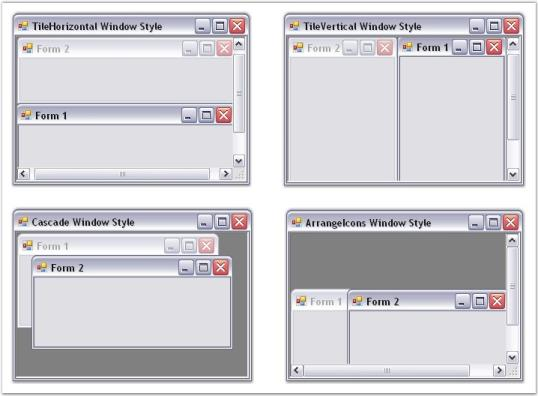

# Styles Settings

This section discusses about the Style Settings available in TabbedMDIManager control that can be used to create applications that are attractive and appealing to the end-users.

The topics discussed in this section are given below.

## Tab styles

TabbedMDI framework provides the ability to support a number of tab styles. The tabbedMDIManager's TabStyle property lets users specify the required style for the Tabs.

Property Table

<table>
<tr>
<td>
TabbedMDIManager Property</td><td>
Description</td></tr>
<tr>
<td>
TabStyle</td><td>
Specifies the style for the tabs of the TabbedMDIManager Control. The options include:2D,3D,WorkbookMode,WhidbeyStyle,DockingWhidbeyStyle,DockingWhidbeyBetaStyle,Office2003Style,Office2007Style,OneNoteStyle,OneNoteStyleFlatTabsStyle andInternetExplorer7Style.</td></tr>
</table>



this.tabbedMDIManager.TabStyle = typeof(Syncfusion.Windows.Forms.Tools.TabRendererDockingWhidbeyBeta);





Me.tabbedMDIManager.TabStyle = GetType(Syncfusion.Windows.Forms.Tools.TabRendererDockingWhidbeyBeta)



The various tab styles are listed in the below image.

## Window Styles

The windows in the TabbedMDI framework can be arranged in four different styles. To set the styles of the windows, the MDIParent form should be detached from the TabbedMDIManager.

N> The DetachFromMdIContainer method is used to detach an MDIParent from the TabbedMDIManager.

<table>
<tr>
<th>
TabbedMDIManager Property</th><th>
Description</th></tr>
<tr>
<td>
WindowStyle</td><td>
Specifies the style for the windows of the TabbedMDIManager Control. The options include:TileHorizontal,TileVertical,Cascade andArrangeIcons.</td></tr>
</table>



//Detach the MDIParent form from TabbedMDIManager.

this.tb.DetachFromMdiContainer(this, false);

//Arranges the multiple document interface Child forms in Horizontal style within the MDIParent form.                        

this.LayoutMdi(MdiLayout.TileHorizontal);





'Detach the MDIParent form from TabbedMDIManager.

Me.tb.DetachFromMdiContainer(Me, False)

'Arranges the multiple document interface Child forms in Horizontal style within the MDIParent form.                        

Me.LayoutMdi(MdiLayout.TileHorizontal)



