# Styles Settings

This section discusses about the Style Settings available in TabbedMDIManager control that can be used to create applications that are attractive and appealing to the end-users.

The topics discussed in this section are given below.

## Tab styles

TabbedMDI Framework provides the ability to support a number of tab styles. The tabbedMDIManager's TabStyle property lets users specify the required style for the Tabs.

Property Table

<table>
<tr>
<td>
TabbedMDIManager Property</td><td>
Description</td></tr>
<tr>
<td>
TabStyle</td><td>
Specifies the style for the tabs of the TabbedMDIManager Control. The options include:2D,3D,WorkbookMode,WhidbeyStyle,DockingWhidbeyStyle,DockingWhidbeyBetaStyle,Office2003Style,Office2007Style,OneNoteStyle,OneNoteStyleFlatTabsStyle,InternetExplorer7Style,MetroStyle,Office2016Colorful,Office2016White,Office2016DarkGray and Office2016Black.</td></tr>
</table>

**2D**

This option helps to set the 2D theme.

#####  Code Sample





// 2D

this.tabbedMDIManager.TabStyle = typeof(Syncfusion.Windows.Forms.Tools.TabRenderer2D);





'2D

Me.tabbedMDIManager.TabStyle = typeof(Syncfusion.Windows.Forms.Tools.TabRenderer2D)





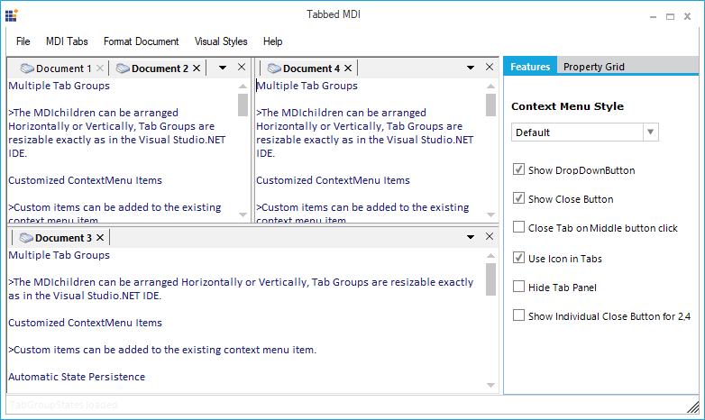

**3D**

This option helps to set the 3D theme.

#####  Code Sample





// 3D

this.tabbedMDIManager.TabStyle = typeof(Syncfusion.Windows.Forms.Tools.TabRenderer3D);





'3D

Me.tabbedMDIManager.TabStyle = typeof(Syncfusion.Windows.Forms.Tools.TabRenderer3D)





**Workbook**

This option helps to set the Workbook theme.

#####  Code Sample





// Workbook

this.tabbedMDIManager.TabStyle = typeof(Syncfusion.Windows.Forms.Tools.TabRendererWorkbookMode);





'Workbook

Me.tabbedMDIManager.TabStyle = typeof(Syncfusion.Windows.Forms.Tools.TabRendererWorkbookMode)





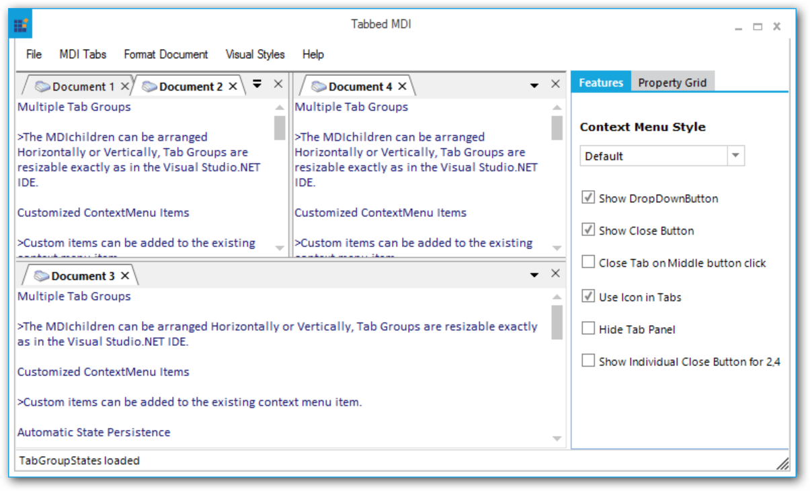

**WhidbeyStyle**

This option helps to set the WhidbeyStyle.

#####  Code Sample





// WhidbeyStyle

this.tabbedMDIManager.TabStyle = typeof(Syncfusion.Windows.Forms.Tools.TabRendererWhidbey);





'WhidbeyStyle

Me.tabbedMDIManager.TabStyle = typeof(Syncfusion.Windows.Forms.Tools.TabRendererWhidbey)





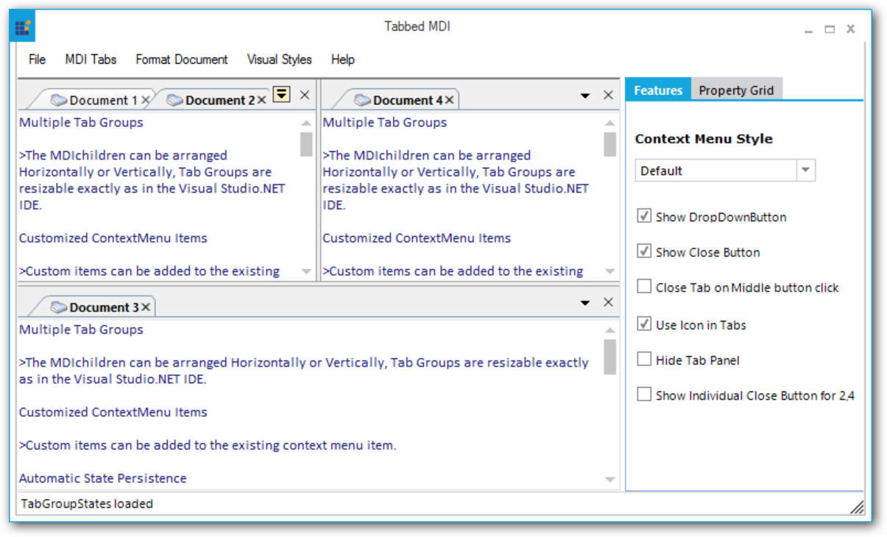

**DockingWhidbeyStyle**

This option helps to set the DockingWhidbeyStyle.

#####  Code Sample





// DockingWhidbeyStyle

this.tabbedMDIManager.TabStyle = typeof(Syncfusion.Windows.Forms.Tools.TabRendererDockingWhidbey);





'DockingWhidbeyStyle

Me.tabbedMDIManager.TabStyle = typeof(Syncfusion.Windows.Forms.Tools.TabRendererDockingWhidbey)





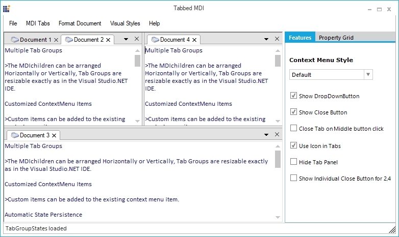

**DockingWhidbeyBetaStyle**

This option helps to set the DockingWhidbeyBetaStyle.

#####  Code Sample





// DockingWhidbeyBetaStyle

this.tabbedMDIManager.TabStyle = typeof(Syncfusion.Windows.Forms.Tools.TabRendererDockingWhidbeyBeta);





'DockingWhidbeyBetaStyle

Me.tabbedMDIManager.TabStyle = typeof(Syncfusion.Windows.Forms.Tools.TabRendererDockingWhidbeyBeta)





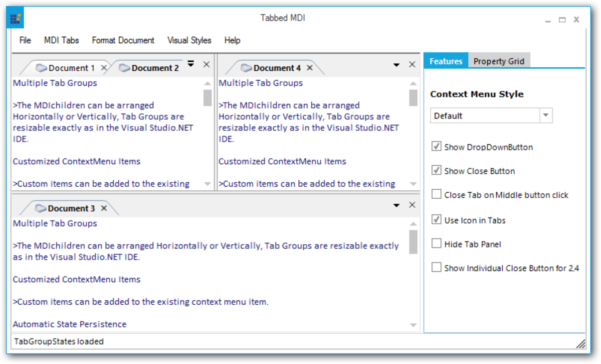

**Office2003**

This option helps to set the Office2003 theme.

#####  Code Sample





// Office2003

this.tabbedMDIManager.TabStyle = typeof(Syncfusion.Windows.Forms.Tools.TabRendererOffice2003);





'Office2003

Me.tabbedMDIManager.TabStyle = typeof(Syncfusion.Windows.Forms.Tools.TabRendererOffice2003)





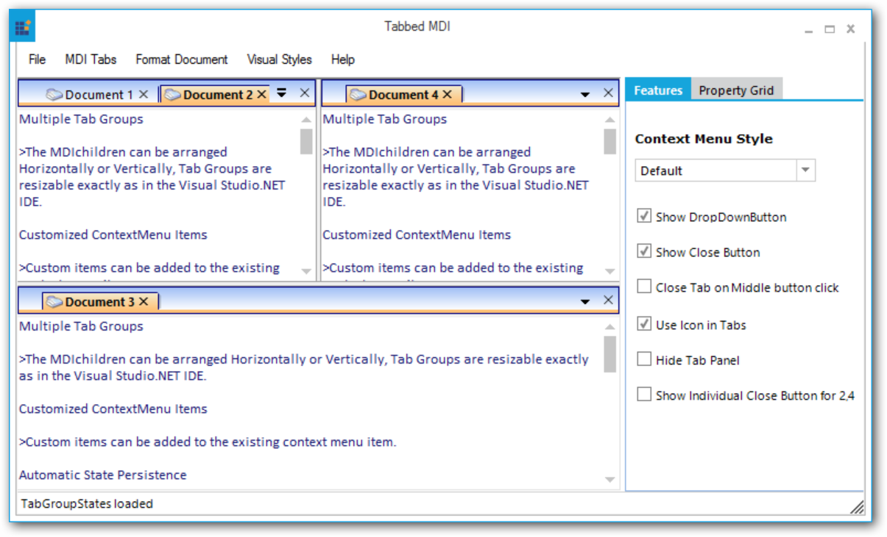

**Office2007Blue**

This option helps to set the Office2007Blue theme.

#####  Code Sample





// Office2007Blue

this.tabbedMDIManager.TabStyle = typeof(Syncfusion.Windows.Forms.Tools.TabRendererOffice2007);
this.tabbedMDIManager.Office2007ColorScheme = Office2007Theme.Blue;





'Office2007Blue

Me.tabbedMDIManager.TabStyle = typeof(Syncfusion.Windows.Forms.Tools.TabRendererOffice2007)
Me.tabbedMDIManager.Office2007ColorScheme = Office2007Theme.Blue





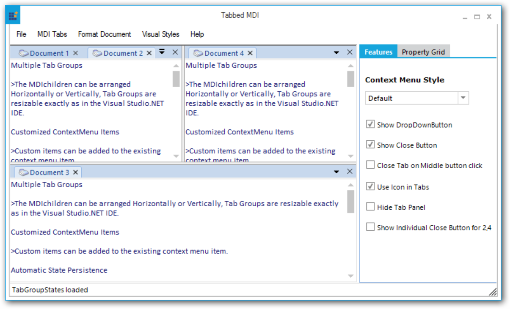

**Office2007Black**

This option helps to set the Office2007Black theme.

#####  Code Sample





// Office2007Black

this.tabbedMDIManager.TabStyle = typeof(Syncfusion.Windows.Forms.Tools.TabRendererOffice2007);
this.tabbedMDIManager.Office2007ColorScheme = Office2007Theme.Black;





'Office2007Black

Me.tabbedMDIManager.TabStyle = typeof(Syncfusion.Windows.Forms.Tools.TabRendererOffice2007)
Me.tabbedMDIManager.Office2007ColorScheme = Office2007Theme.Black





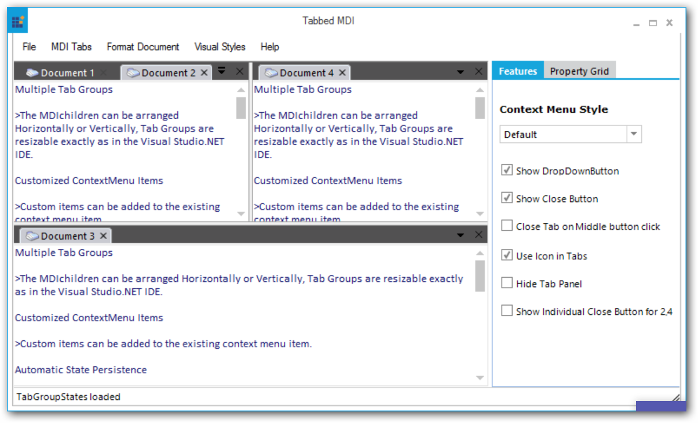

**Office2007Silver**

This option helps to set the Office2007Silver theme.

#####  Code Sample





// Office2007Silver

this.tabbedMDIManager.TabStyle = typeof(Syncfusion.Windows.Forms.Tools.TabRendererOffice2007);
this.tabbedMDIManager.Office2007ColorScheme = Office2007Theme.Silver;





'Office2007Silver

Me.tabbedMDIManager.TabStyle = typeof(Syncfusion.Windows.Forms.Tools.TabRendererOffice2007)
Me.tabbedMDIManager.Office2007ColorScheme = Office2007Theme.Silver





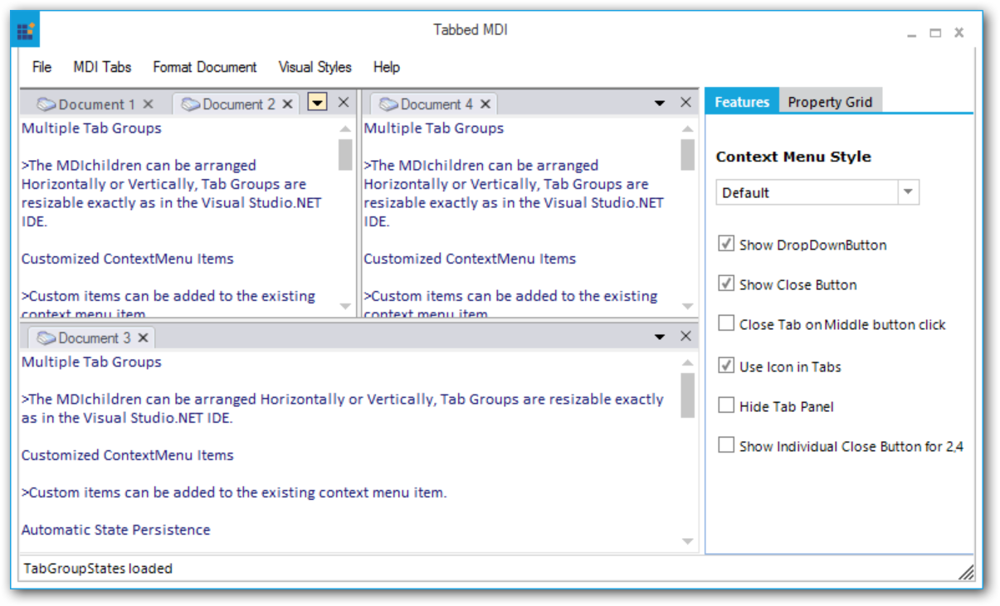

**OneNoteStyle**

This option helps to set the OneNoteStyle theme.

#####  Code Sample





// OneNoteStyle

this.tabbedMDIManager.TabStyle = typeof(Syncfusion.Windows.Forms.Tools.OneNoteStyleRenderer);





'OneNoteStyle

Me.tabbedMDIManager.TabStyle = typeof(Syncfusion.Windows.Forms.Tools.OneNoteStyleRenderer)





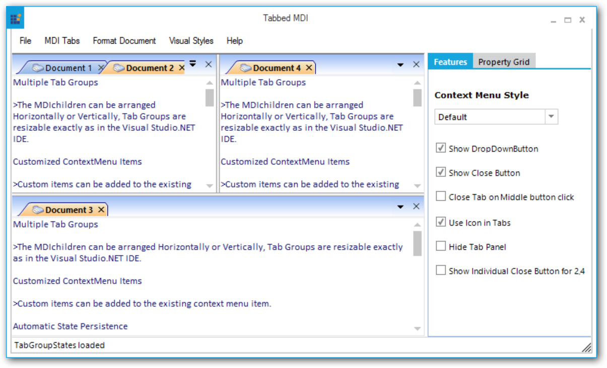

**OneNoteStyleFlatTabsStyle**

This option helps to set the OneNoteStyleFlatTabsStyle.

#####  Code Sample





// OneNoteStyleFlatTabsStyle

this.tabbedMDIManager.TabStyle = typeof(Syncfusion.Windows.Forms.Tools.OneNoteStyleFlatTabsRenderer);





'OneNoteStyleFlatTabsStyle

Me.tabbedMDIManager.TabStyle = typeof(Syncfusion.Windows.Forms.Tools.OneNoteStyleFlatTabsRenderer)





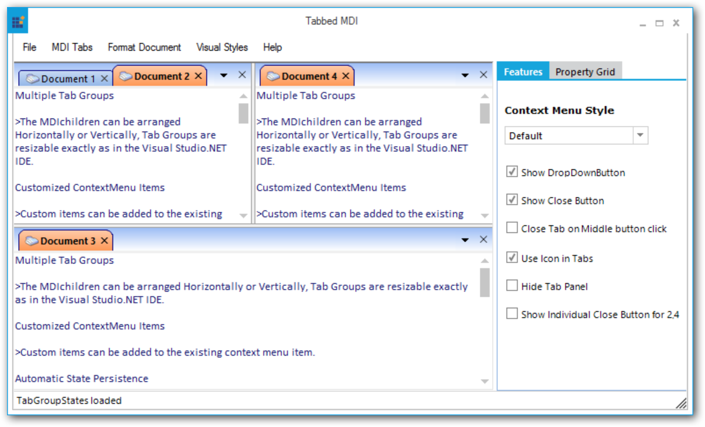

**InternetExplorer7**

This option helps to set the InternetExplorer7 theme.

#####  Code Sample





// InternetExplorer7

this.tabbedMDIManager.TabStyle = typeof(Syncfusion.Windows.Forms.Tools.TabRendererIE7);





'InternetExplorer7

Me.tabbedMDIManager.TabStyle = typeof(Syncfusion.Windows.Forms.Tools.TabRendererIE7)





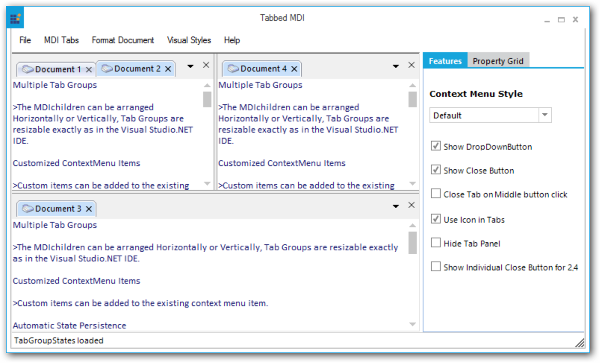

**Metro**

This option helps to set the Metro theme.

#####  Code Sample





// Metro

this.tabbedMDIManager.TabStyle = typeof(Syncfusion.Windows.Forms.Tools.TabRendererMetro);





'Metro

Me.tabbedMDIManager.TabStyle = typeof(Syncfusion.Windows.Forms.Tools.TabRendererMetro)





**Office2016Colorful**

This option helps to set the Office2016Colorful theme.

#####  Code Sample





// Office2016Colorful

this.tabbedMDIManager.TabStyle = typeof(Syncfusion.Windows.Forms.Tools.TabRendererOffice2016Colorful);





'Office2016Colorful

Me.tabbedMDIManager.TabStyle = typeof(Syncfusion.Windows.Forms.Tools.TabRendererOffice2016Colorful)





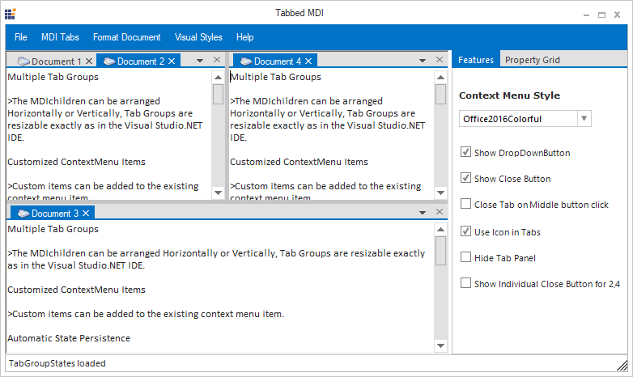

**Office2016White**

This option helps to set the Office2016White theme.

#####  Code Sample





// Office2016White

this.tabbedMDIManager.TabStyle = typeof(Syncfusion.Windows.Forms.Tools.TabRendererOffice2016White);





'Office2016White

Me.tabbedMDIManager.TabStyle = typeof(Syncfusion.Windows.Forms.Tools.TabRendererOffice2016White)





**Office2016DarkGray**

This option helps to set the Office2016DarkGray theme.

#####  Code Sample





// Office2016DarkGray

this.tabbedMDIManager.TabStyle = typeof(Syncfusion.Windows.Forms.Tools.TabRendererOffice2016DarkGray);





'Office2016DarkGray

Me.tabbedMDIManager.TabStyle = typeof(Syncfusion.Windows.Forms.Tools.TabRendererOffice2016DarkGray)





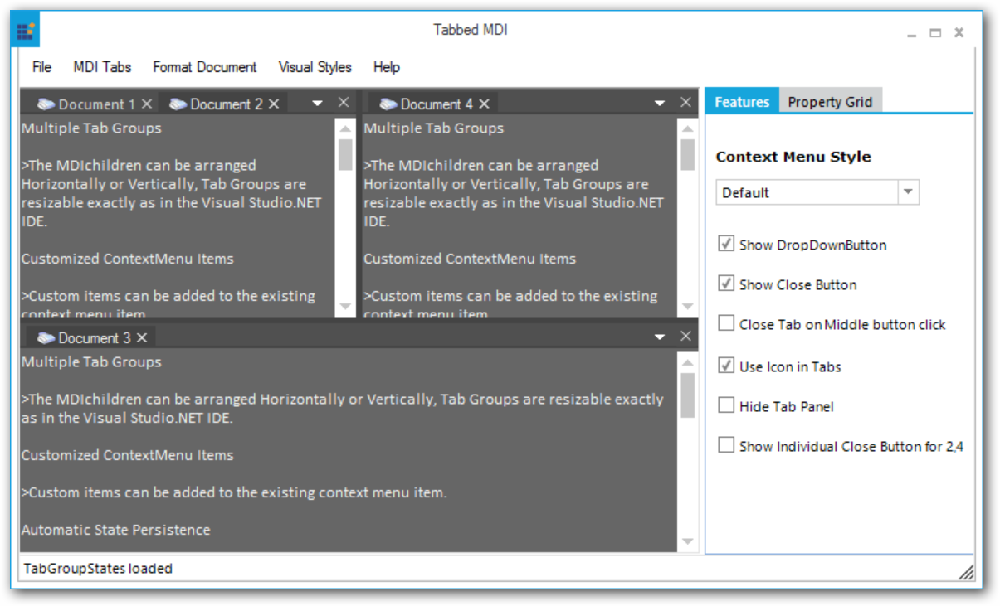

**Office2016Black**

This option helps to set the Office2016Black theme.

#####  Code Sample





// Office2016Black

this.tabbedMDIManager.TabStyle = typeof(Syncfusion.Windows.Forms.Tools.TabRendererOffice2016Black);





'Office2016Black

Me.tabbedMDIManager.TabStyle = typeof(Syncfusion.Windows.Forms.Tools.TabRendererOffice2016Black)





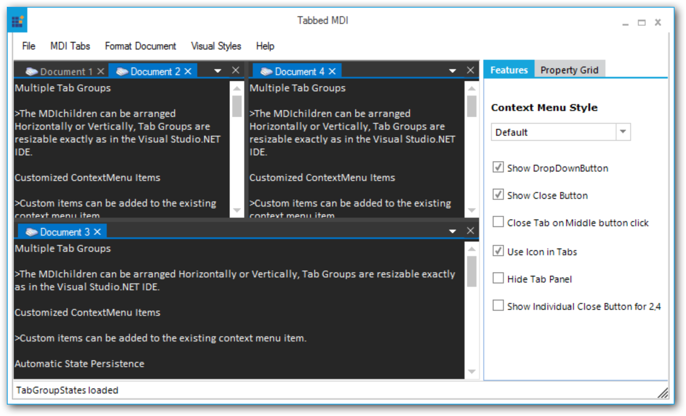

## Window Styles

The windows in the TabbedMDI Framework can be arranged in four different styles. To set the styles of the windows, the MDIParent form should be detached from the TabbedMDIManager.

N> The DetachFromMdIContainer method is used to detach an MDIParent from the TabbedMDIManager.

<table>
<tr>
<th>
TabbedMDIManager Property</th><th>
Description</th></tr>
<tr>
<td>
WindowStyle</td><td>
Specifies the style for the windows of the TabbedMDIManager Control. The options include:TileHorizontal,TileVertical,Cascade andArrangeIcons.</td></tr>
</table>



//Detach the MDIParent form from TabbedMDIManager.

this.tabbedMDIManager.DetachFromMdiContainer(this, false);

//Arranges the multiple document interface Child forms in Horizontal style within the MDIParent form.                        

this.LayoutMdi(MdiLayout.TileHorizontal);





'Detach the MDIParent form from TabbedMDIManager.

Me.tabbedMDIManager.DetachFromMdiContainer(Me, False)

'Arranges the multiple document interface Child forms in Horizontal style within the MDIParent form.                        

Me.LayoutMdi(MdiLayout.TileHorizontal)



