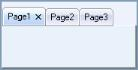

# Overview

XP Tabs is a 100% native .NET TabControl implementation that comes with a lot more configuration and customization capabilities than the Legacy Wrapper that the .NET framework comes with. It provides all the basic functionalities of a standard TabControl and much more. 

The XP Tabs (TabControlAdv) feature provided as part of this package is an advanced TabControl with plenty of appearance styles and configuration capabilities. It makes the creation of custom tabs with custom shapes and styles a snap.

Resembling the class names in the framework, the TabControlAdv and TabPageAdv classes represent the TabControl and the TabPages of the XP Tabs Package. Users can parent one or more tabpages to a tabcontrol which lets them switch between these tabpages via a TabStrip (which is also referred as a TabPanel). The TabPages in turn are panel-derived classes that let users host ChildControls within them. 

The TabControlAdv and the TabPageAdv controls come with full design-time support.

## Features Overview

The Tabs framework contains the TabControlAdv with a full set of features to support efficient tab usage to create rich user applications.

### Features

* TabStyles - Tabs framework provides a number of pre-defined TabStyles and also allows to apply custom - style settings to the control.
* Appearance settings - The Tab appearance can be easily customized by stating the style definitions for the TabItems, TabPages and TabPanels individually.
* TabPrimitives - TabControlAdv provides an easy way to navigate through tabs. By setting TabPrimitives (previously, TabControlAdv's  NavigationControl property), users can traverse between tabs and pages easily which enables to go to the next or previous tab / page and first / last tab, close buttons can be added which closes the active tabpage when clicked and the dropdown with all the tabpages listed can be accessed by the user to select the tabpage to be traversed. NavigationControl offers more flexibility that allows you to change the button's image, show / hide certain buttons and also cancel the navigation and use it as an Add or Remove TabPages through code.
* Alignment and Sizing - The TabStrip can be aligned to the Top, Left, Right or Bottom of the control. Text alignment can be changed using the RotateTextWhenVertical property which will rotate the text and draw it horizontally when the alignment is set to Left. The Tabs can also be set to be displayed in Multiple lines using the Multiline property. The TabItems can be aligned from Left to Right and vice versa using the RightToLeft property. When the RightToLeft mode is activated and RotateTabsWhenRTL property is enabled, tab rotation is allowed. The SizeMode can be set to either Normal, Fixed, ShrinkToFit or FillToRight.
* LabelEdit - TabPage's text can be edited during run-time using LabelEdit property. LabelEdit feature has the following events associated with it.
* BeforeEdit - Occurs when the text enters into the edit mode.
* AfterEdit - Occurs after the new text is entered.
* LabelEditTextChanged - Occurs when the text of the tab is changed.
* LabelEditChanged -__Occurs when the LabelEdit property is toggled.
* Image Support - TabPage's text can be associated with images. Images can be aligned according to the alignment of the tabs.
* Color Properties - TabControlAdv allows the user to set different colors for active and inactive tabs using ActiveTabColor, InactiveTabcolor, TabBackColor, TabForeColor and TabPanelBackColor properties.
* Themes Support - TabControlAdv provides complete theme support. Using the ThemesEnabled property, XP themes can be enabled for this control.
* TabPersistence - Complete persistence support is now available for TabControlAdv using the PersistTabState property.

N> TabState has been saved at the following location: C:\Documents and Settings\Username*\Local Settings\Application Data\IsolatedStorage.

* Close button can be added for each TabPage like IE7 to close the tabpage.

* Lets you set tooltips for every TabPrimitives.
* Added VS2008 TabStyle for TabControlAdv.
* Added Border settings for the control which is implemented especially for VS2008 TabStyle.
* TabPage Closed and Closing events are added.

A sample which illustrates the features of TabControlAdv is available in the following sample installation location.

…\_My Documents\Syncfusion\EssentialStudio\Version Number\Windows\Tools.Windows\Samples\Advanced Editor Functions\ActionGroupingDemo_

## TabControlAdv

TabControlAdv in Toolbox

TabControlAdv is a control in the Tabs Package that manages a set of TabPages and provides options to customize the TabPages according to the needs of the user. 

The TabControlAdv automatically adds pages to every tabitem being added to the application with uniform dimensions for all the pages. 

### TabPanels

TabPanels are used to switch between the various tab pages / tab items in the TabControlAdv.

### TabItems

TabItems are items added to the TabControlAdv by default when a tabpage is added. Unlike the usual items, the tabitems when clicked, provide access to the respective tabpages and does not contain any event to hold the user written code.

### TabPages

TabPages are the pages included in the TabControl. The TabPages are laid one above the other and only a single tabpage can be viewed at a time. Each page acts as a ContainerControl and can host ChildControls within it using the TabPageAdv panel-derived class.

 The TabPageAdv can be added to the TabControlAdv through designer as well as through code.

Creating a TabControlAdv Through Designer

Creating a TabControlAdv Programmatically

## Creating TabControlAdv

This tutorial will show you how the TabControlAdv is created through designer and code which are discussed in the below topics.

### Through Designer

To create a TabControlAdv through designer,

1. Drag and drop a TabControlAdv object from the controls toolbox onto your form.
2. Add TabPages to the control in the designer in the following ways.
3. Right click on the TabControlAdv and select the Add Tab option. This adds a tabpage to the TabControlAdv.

   

4. In the Properties window, select the TabPages property. The TabPageAdv Collection Editor will be opened. Click Add, a tabpage will be added to the TabControlAdv.

  

  

  

### Through Code

To create a TabControlAdv programmatically,

1. Add the Syncfusion assembly Tools.Windows to your application.
2. Add the namespace Syncfusion.Windows.Forms.Tools.

   ~~~ cs

		using Syncfusion.Windows.Forms.Tools;

   ~~~
   {:.prettyprint }

   ~~~ vbnet

	Imports Syncfusion.Windows.Forms.Tools

   ~~~
   {:.prettyprint }

3. Declare the TabControlAdv and TabPageAdv.

   ~~~ cs

		private Syncfusion.Windows.Forms.Tools.TabControlAdv tabControlAdv1;

		private Syncfusion.Windows.Forms.Tools.TabPageAdv tabPageAdv1;

		private Syncfusion.Windows.Forms.Tools.TabPageAdv tabPageAdv2;

		private Syncfusion.Windows.Forms.Tools.TabPageAdv tabPageAdv3;

   ~~~
   {:.prettyprint } 

   ~~~ vbnet

		Private tabControlAdv1 As Syncfusion.Windows.Forms.Tools.TabControlAdv

		Private tabPageAdv1 As Syncfusion.Windows.Forms.Tools.TabPageAdv

		Private tabPageAdv2 As Syncfusion.Windows.Forms.Tools.TabPageAdv

		Private tabPageAdv3 As Syncfusion.Windows.Forms.Tools.TabPageAdv

   ~~~
   {:.prettyprint }

4. The following code creates a TabControlAdv with three tabpages.

   ~~~ cs

		private void Form1_Load(object sender, System.EventArgs e)

		{

			//Initialize the tabControlAdv and tabPageAdv

			this.tabControlAdv1 = new TabControlAdv();

			this.tabPageAdv1 = new TabPageAdv();

			this.tabPageAdv2 = new TabPageAdv();

			this.tabPageAdv3 = new TabPageAdv();

			//Add the TabPageAdv to the TabControlAdv.

			this.tabControlAdv1.Controls.AddRange(new Control[]{this.tabPageAdv1, this.tabPageAdv2, this.tabPageAdv3});

			//Set the location of the TabContolAdv

			this.tabControlAdv1.Location = new Point(16, 24);

			//Set the text of the TabPageAdv

			this.tabPageAdv1.Text = "Tab1";

			this.tabPageAdv2.Text = "Tab2";

			this.tabPageAdv3.Text = "Tab3";

			//Add the TabControlAdv to your form                

			this.Controls.AddRange(new Control[] { this.tabControlAdv1});

		}

   ~~~
   {:.prettyprint }
   
   ~~~ vbnet

		Private Sub Form1_Load(ByVal sender As Object, ByVal e As System.EventArgs) Handles MyBase.Load

			'Initialize the tabControlAdv and tabPageAdv

			Me.tabControlAdv1 = New TabControlAdv()

			Me.tabPageAdv1 = New TabPageAdv()

			Me.tabPageAdv2 = New TabPageAdv()

			Me.tabPageAdv3 = New TabPageAdv()

			'Add the TabPageAdv to the TabControlAdv.

			Me.tabControlAdv1.Controls.AddRange(New Control() {Me.tabPageAdv1, Me.tabPageAdv2, Me.tabPageAdv3})

			'Set the location of the TabContolAdv

			Me.tabControlAdv1.Location = New Point(16, 24)

			'Set the text of the TabPageAdv

			Me.tabPageAdv1.Text = "Tab1"

			Me.tabPageAdv2.Text = "Tab2"

			Me.tabPageAdv3.Text = "Tab3"

			'Add the TabControlAdv to your form                

			Me.Controls.AddRange(New Control() {Me.tabControlAdv1})

		End Sub
		
   ~~~
   {:.prettyprint }
	

