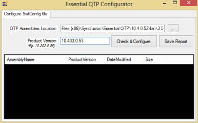
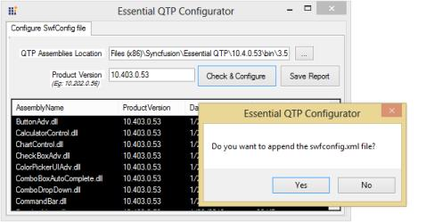
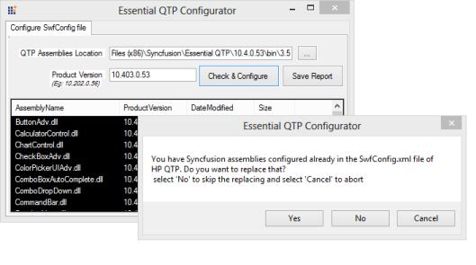
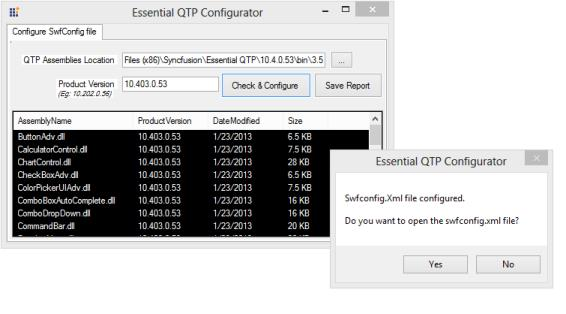

# Configuring the swfconfig file

An XML file in QTP called swfconfig is the configuration file located at (Installed location of Essential QuickTest Professional)\Config&lt;version-2.0 or 3.5 or 4.0 or 4.5 or 4.5.1 0r 4.6&gt;\swfconfig, that contains all the mapping information for QTP to recognize Syncfusion controls. Using the swfconfig utility, you can easily configure the swfconfig.xml file in HP QTP/UFT.

## Steps to Configure the swfconfig.xml File

1) Open the Syncfusion Essential QTP Configuration located at (Installed location of Essential QuickTest Professional)\Utilities\swfConfigUtility\swfConfigUtility.exe. Enter the QTP assemblies’ location in the QTP Assemblies Location textbox and the Essential Studio version with Framework in the Product Version textbox. After entering the details, click Check & Configure. It creates the swfconfig.xml file for that specified version. Refer to the following image.

2) Then Essential QTP Configuration shows the dialog box for appending the swfconfig.xml file. Click Yes to append the Swfconfig.xml file in the QTP machine.

3) When your system already has a swfconfig.xml file, then another dialog box appears asking to replace the existing swfconfig.xml. Click Yes to replace the old swfconfig.xml file with the current Framework swfconfig.xml file on your machine. When you want to keep both files in the same folder, click No.

4) After generating the swfconfig.xml file, the system asks you whether you want to open it. Click Yes to save and open the new swfconfig.xml file.

5) Restart QTP once the swfconfig.xml file is saved to refresh the mappings to the required controls before starting the test.