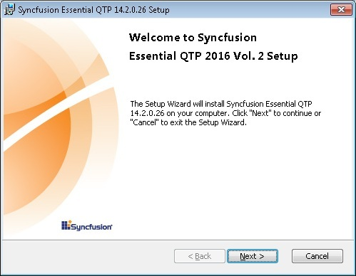
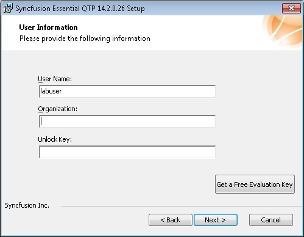
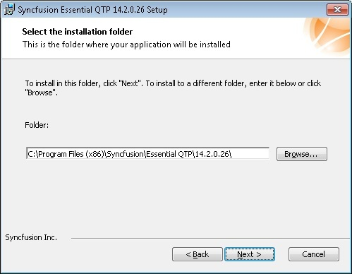
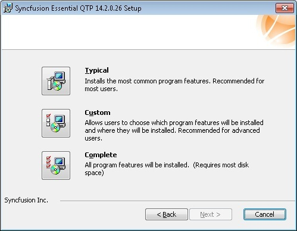

# Installation in Windows Forms Controls

You can download the Essential QTP Add on and install using the below steps,

1. Double-click the Syncfusion Essential QTP Add on Setup file.

N> Setup - Syncfusion Essential QuickTest Professional dialog box opens.

2.Click Next. The User Information dialog box opens.

3.Enter the User Name, Organization and Unlock Key in the corresponding text boxes provided.

4.Click Next.

N> The unlock key is validated.

5.Select the installation folder dialog box opens.

6.To install in the default location, click Next.

N> You can also browse to choose a location by clicking Browse.

7.Installation type dialog box opens.

8.Choose from the options listed. For example, to install the complete setup, click Complete.
9.Click Next. The Ready to Install dialog box opens.

10.Click Install to continue with the installation.