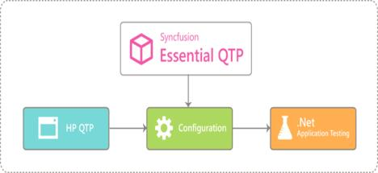

# Overview of Windows Forms UFT

UFT (formerly known as HP Quick Test Professional - QTP) is an automated testing software designed for testing various software applications and environments. Syncfusion provides QTP add-in that contains custom libraries, that help UFT or QTP to recognize Syncfusion controls. These custom libraries are built with the help of .NET add-in extensibility. 

## Introduction to Essential QuickTest Professional
Essential QuickTest Professional is an add-on shipped with Essential Studio products offered by Syncfusion. It has been specially designed to meet the requirements of professionals who test the applications designed, using Syncfusion controls with HP QuickTest Professional software.
Essential QuickTest Professional contains custom libraries, that help HP QuickTest Professional software or UFT software recognize Syncfusion controls. These custom libraries are built with the help of QuickTest Professional .NET add-in extensibility. For more details, refer to HP QuickTest Professional help.

The custom libraries allow Syncfusion controls to be used as a native object inside the QTP testing environment and enable testing of applications in QTP. Essential QuickTest Professional helps you perform regression test on your application containing Syncfusion controls and thereby increase the reliability of the end product. The following chapters demonstrate the usage of the custom library in QTP.

## Prerequisites and Compatibility
This section covers the requirements that are mandatory for installing Essential Test Studio. It also lists the operating systems and browsers that are compatible with the product.

**Prerequisites**

The following are the prerequisites,

<table>
<tr>
<td>
{{'**Testing Environments**'| markdownify }}
</td>
<td>
1) QuickTest Professional version 9.5 and above  2) QuickTest Professional .NET add-in or UFT.
</td>
</tr>
<tr>
<td>
{{'**.NET Framework**'| markdownify }}
</td>
<td>
.NET Framework version 2.0, 3.5, 4.0, 4.5, 4.5.1, 4.6
</td>
</tr>
<tr>
<td>
{{'**Other Requirements**'| markdownify }}
</td>
<td>
Essential Studio (User Interface edition – Windows Forms) of the same version as the Essential QTP Add-on.
</td>
</tr>
</table>

**Compatibility**

Essential QuickTest Professional is compatible with the following operating systems,

<table>
<tr>
<td>
{{'**Operating Systems**'| markdownify }}
</td>
<td>
<li> Microsoft Windows 10 (32 bit and 64 bit)</li>
<li> Microsoft Windows 8.1 (32 bit and 64 bit)</li>
<li> Microsoft Windows 8 (32 bit and 64 bit)</li>
<li>Microsoft Windows Server 2013 (32 bit and 64 bit)</li>
<li>Microsoft Windows Server 2013 (32 bit and 64 bit)</li>
<li>Microsoft Windows Server 2013 (32 bit and 64 bit)</li>
<li>Microsoft Windows Server 2013 (32 bit and 64 bit)</li>
<li>Microsoft Windows Server 2012 (32 bit and 64 bit)</li>
<li>Microsoft Windows Server 2008 (32 bit and 64 bit)</li>
<li>Microsoft Windows Server 2003 (32 bit and 64 bit)</li>
<li>Microsoft Windows Vista (32 bit and 64 bit)</li>
<li>Microsoft Windows XP</li>
</td>
</tr>
</table>
