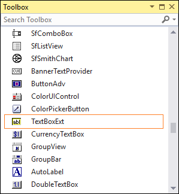

# Getting Started with Windows Forms TextBox

This section briefly describes how to create a new Windows Forms project in Visual Studio and add [TextBoxExt](https://help.syncfusion.com/cr/windowsforms/Syncfusion.Windows.Forms.Tools.TextBoxExt.html) with its basic functionalities.

## Assembly deployment

Refer to the [control dependencies](https://help.syncfusion.com/windowsforms/control-dependencies#textboxext) section to get the list of assemblies or the details of NuGet package that needs to be added as reference to use the control in any application.

Refer to this [documentation](https://help.syncfusion.com/windowsforms/installation/install-nuget-packages) to find more details about installing nuget packages in a Windows Forms application.

## Creating application with TextBoxExt

In this walk through, users will create new WinForms application that contains `TextBoxExt` control.

### Creating the project

Create new Windows Forms Project in Visual Studio to display TextBoxExt with different text settings.

### Adding the TextBoxExt control via designer

The [TextBoxExt](https://help.syncfusion.com/cr/windowsforms/Syncfusion.Windows.Forms.Tools.TextBoxExt.html) control can be added to the application by dragging it from the toolbox and dropping it in designer. The required assembly references will be added automatically.

## Adding the TextBoxExt control via code

In order to add control manually, do the below steps,

1. Add the following assembly reference to the project.

    * Syncfusion.Shared.Base

2. Include the required namespace.






using Syncfusion.Windows.Forms.Tools;





Imports Syncfusion.Windows.Forms.Tools





{{ codesnippet1 | OrderList_Indent_Level_1 }}

3. Create the [TextBoxExt](https://help.syncfusion.com/cr/windowsforms/Syncfusion.Windows.Forms.Tools.TextBoxExt.html) control instance, and add it to the form.






TextBoxExt textBoxExt1 = new TextBoxExt();
textBoxExt1.Text = "textboxext1";
this.Controls.Add(textBoxExt1);





Dim textBoxExt1 As New TextBoxExt()
textBoxExt1.Text = "textboxext1"
Me.Controls.Add(textBoxExt1)





{{ codesnippet2 | OrderList_Indent_Level_1 }}

## Size

The size to the `TextBoxExt` control can be applied using the following properties:

* [MaximumSize](https://help.syncfusion.com/cr/windowsforms/Syncfusion.Windows.Forms.Tools.TextBoxExt.html#Syncfusion_Windows_Forms_Tools_TextBoxExt_MaximumSize)
* [MinimumSize](https://help.syncfusion.com/cr/windowsforms/Syncfusion.Windows.Forms.Tools.TextBoxExt.html#Syncfusion_Windows_Forms_Tools_TextBoxExt_MinimumSize)





textBoxExt1.MinimumSize = new System.Drawing.Size(267, 104);
textBoxExt1.MaximumSize = new System.Drawing.Size(267, 104);





textBoxExt1.MaximumSize = New System.Drawing.Size(267, 104)
textBoxExt1.MinimumSize = New System.Drawing.Size(267, 104)





## Multiline

The `TextBoxExt` control can be customized to display multiline text using the following properties:

* Multiline - Spans the text of the edit control to more than one line.
* WordWrap - Indicates whether the lines are automatically word-wrapped for the multiline edit controls.
* ScrollBars - Enables scrollbars when the text overflows the size of the text box. The available options are horizontal, vertical, both, and none.





textBoxExt1.Multiline = true;
textBoxExt1.WordWrap = true;
textBoxExt1.ScrollBars = System.Windows.Forms.ScrollBars.Vertical;





textBoxExt1.Multiline = True
textBoxExt1.WordWrap = True
textBoxExt1.ScrollBars = System.Windows.Forms.ScrollBars.Vertical





