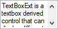

# Text Settings in Windows Forms TextBox (TextBoxExt)

This section discusses the text settings of the TextBoxExt control.

## Text

You can specifies the text in [TextBoxExt](https://help.syncfusion.com/cr/windowsforms/Syncfusion.Windows.Forms.Tools.TextBoxExt.html) control by using [Text](https://learn.microsoft.com/en-us/dotnet/api/system.windows.forms.textbox.text?view=windowsdesktop-7.0&viewFallbackFrom=netcore-3.1&redirectedfrom=MSDN#System_Windows_Forms_TextBox_Text) property.





this.textBoxExt1.SelectedText = "textBoxExt1";





Me.textBoxExt1.SelectedText = "textBoxExt1"





N> You can get the selected text in TextBoxExt control by using [SelectedText](https://learn.microsoft.com/en-us/dotnet/api/system.windows.forms.textboxbase.selectedtext?view=windowsdesktop-7.0&viewFallbackFrom=netcore-3.1&redirectedfrom=MSDN#System_Windows_Forms_TextBoxBase_SelectedText) property.

## CharacterCasing

You can change the case of character in `TextBoxExt` control by using [CharacterCasing](https://help.syncfusion.com/cr/windowsforms/Syncfusion.Windows.Forms.Tools.TextBoxExt.html#Syncfusion_Windows_Forms_Tools_TextBoxExt_CharacterCasing) property. The character casing options are Normal, Upper and Lower.





this.textBoxExt1.CharacterCasing = System.Windows.Forms.CharacterCasing.Upper;





Me.textBoxExt1.CharacterCasing = System.Windows.Forms.CharacterCasing.Upper





## TextAlign

You can the alignment of text for `TextBoxExt` control by using [TextAlign](https://learn.microsoft.com/en-us/dotnet/api/system.windows.forms.textbox.textalign?view=windowsdesktop-7.0&viewFallbackFrom=netcore-3.1&redirectedfrom=MSDN#System_Windows_Forms_TextBox_TextAlign) property.





this.textBoxExt1.TextAlign = System.Windows.Forms.HorizontalAlignment.Center;





Me.textBoxExt1.TextAlign = System.Windows.Forms.HorizontalAlignment.Center





## Right to Left

The `TextBoxExt` control can be laid out from right to left when the [RightToLeft](https://learn.microsoft.com/en-us/dotnet/api/system.windows.forms.control.righttoleft?view=windowsdesktop-7.0&viewFallbackFrom=netcore-3.1&redirectedfrom=MSDN#System_Windows_Forms_Control_RightToLeft) property value is set to `Yes`.





this.textBoxExt1.RightToLeft = System.Windows.Forms.RightToLeft.Yes;





Me.textBoxExt1.RightToLeft = System.Windows.Forms.RightToLeft.Yes





## DrawActiveWhenDisabled

The [DrawActiveWhenDisabled](https://help.syncfusion.com/cr/windowsforms/Syncfusion.Windows.Forms.Tools.TextBoxExt.html#Syncfusion_Windows_Forms_Tools_TextBoxExt_DrawActiveWhenDisabled) property specifies whether the text should be drawn active even when the control is disabled.





this.textBoxExt1.Enabled = false;
this.textBoxExt1.DrawActiveWhenDisabled = true;





Me.textBoxExt1.Enabled = False
Me.textBoxExt1.DrawActiveWhenDisabled = True





The following methods are associated with the above properties.

<table>
<tr>
<th>
Methods</th><th>
Description</th></tr>
<tr>
<td>
AppendText</td><td>
Appends text to the current text of a textbox.</td></tr>
<tr>
<td>
OnCharacterCasingChanged</td><td>
Raises the CharacterCasingChanged event.</td></tr>
<tr>
<td>
GetClipText</td><td>
Gets / sets the clipped text without the formatting.</td></tr>
<tr>
<td>
Cut</td><td>
Cuts the selected data to the clipboard.</td></tr>
<tr>
<td>
Copy</td><td>
Copies the content of the NumberTextBox to the clipboard. The ClipMode property dictates what gets copied.</td></tr>
<tr>
<td>
Delete</td><td>
Deletes the current selection of the TextBox.</td></tr>
<tr>
<td>
Paste</td><td>
Pastes the data in the clipboard into the NumberTextBox control.</td></tr>
<tr>
<td>
Select</td><td>
Selects a range of text in the TextBox.</td></tr>
<tr>
<td>
SelectAll</td><td>
Selects all text in the TextBox.</td></tr>
</table>

### Multiline text settings

You can display the multiple line text by using the [MultiLine](https://learn.microsoft.com/en-us/dotnet/api/system.windows.forms.textbox.multiline?view=windowsdesktop-7.0&viewFallbackFrom=netcore-3.1&redirectedfrom=MSDN#System_Windows_Forms_TextBox_Multiline) property. If you want to show the text move to next line, you need to set the [WordWrap](https://learn.microsoft.com/en-us/dotnet/api/system.windows.forms.textboxbase.wordwrap?view=windowsdesktop-7.0&viewFallbackFrom=netcore-3.1&redirectedfrom=MSDN#System_Windows_Forms_TextBoxBase_WordWrap) property to `true`. You can also show the horizontal or vertical bar in `TextBoxExt` control by using [ScrollBars](https://learn.microsoft.com/en-us/dotnet/api/system.windows.forms.textbox.scrollbars?view=windowsdesktop-7.0&viewFallbackFrom=netcore-3.1&redirectedfrom=MSDN#System_Windows_Forms_TextBox_ScrollBars) property.





this.textBoxExt1.Multiline = true;
this.textBoxExt1.WordWrap = true;
this.textBoxExt1.ScrollBars = System.Windows.Forms.ScrollBars.Vertical;





Me.textBoxExt1.Multiline = True
Me.textBoxExt1.WordWrap = True
Me.textBoxExt1.ScrollBars = System.Windows.Forms.ScrollBars.Vertical





N> The [ScrollToCaret()](https://learn.microsoft.com/en-us/dotnet/api/system.windows.forms.textboxbase.scrolltocaret?view=windowsdesktop-7.0&viewFallbackFrom=netcore-3.1&redirectedfrom=MSDN#System_Windows_Forms_TextBoxBase_ScrollToCaret) method can be used to scroll the contents of the control to the current caret position.

## Tooltip

The tooltip that should be displayed when an overflow of text occurs can be set using the following properties.

* [OverflowIndicatorToolTipText](https://help.syncfusion.com/cr/windowsforms/Syncfusion.Windows.Forms.Tools.TextBoxExt.html#Syncfusion_Windows_Forms_Tools_TextBoxExt_OverflowIndicatorToolTipText) - This property specifies the overflow indicator tooltip text.
* [ShowOverflowIndicator](https://help.syncfusion.com/cr/windowsforms/Syncfusion.Windows.Forms.Tools.TextBoxExt.html#Syncfusion_Windows_Forms_Tools_TextBoxExt_ShowOverflowIndicator) - This property used for show the overflow indicator.
* [ShowOverflowIndicatorToolTip](https://help.syncfusion.com/cr/windowsforms/Syncfusion.Windows.Forms.Tools.TextBoxExt.html#Syncfusion_Windows_Forms_Tools_TextBoxExt_ShowOverflowIndicatorToolTip) - This property indicates whether to show the overflow indicator tooltip.





this.textBoxExt1.ShowOverflowIndicator = true;
this.textBoxExt1.ShowOverflowIndicatorToolTip = true;
this.textBoxExt1.OverflowIndicatorToolTipText = "Overflow";





Me.textBoxExt1.ShowOverflowIndicator = True
Me.textBoxExt1.ShowOverflowIndicatorToolTip = True
Me.textBoxExt1.OverflowIndicatorToolTipText = "Overflow"





N> There is no value set for the `OverflowIndicatorToolTipText` property, then the value set for the `Text` property of the TextBoxExt will be displayed as the tooltip.
