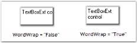

# Text Settings

This section discusses the text settings of the TextBoxExt control.

The text associated with the TextBoxExt control can be set and customized using the below given settings.

Table 367 : Property Table

<table>
<tr>
<th>
TextBoxExt Properties</th><th>
Description</th></tr>
<tr>
<td>
Text</td><td>
Specifies the text associated with the control.</td></tr>
<tr>
<td>
CharacterCasing</td><td>
Gets / sets the case of character as they are typed.It includes the below given options:Normal,Upper andLower.</td></tr>
<tr>
<td>
TextAlign</td><td>
Indicates how the text should be aligned for edit controls.</td></tr>
<tr>
<td>
RightToLeft</td><td>
Indicates whether the component should draw right to left for RTL languages.</td></tr>
<tr>
<td>
SelectedText</td><td>
Gets / sets a value indicating the currently selected text in the control.</td></tr>
<tr>
<td>
HideSelection</td><td>
Indicates that the selection should be hidden, when the edit control loses focus.</td></tr>
<tr>
<td>
DrawActiveWhenDisabled</td><td>
Specifies if the text should be drawn active, even when disabled.</td></tr>
</table>



this.textBoxExt1.CharacterCasing = System.Windows.Forms.CharacterCasing.Lower;

this.textBoxExt1.TextAlign = System.Windows.Forms.HorizontalAlignment.Center;

this.textBoxExt1.RightToLeft = System.Windows.Forms.RightToLeft.Yes;

this.textBoxExt1.SelectedText = "TextBoxExt";

this.textBoxExt1.HideSelection = true;

this.textBoxExt1.DrawActiveWhenDisabled = true;





Me.textBoxExt1.CharacterCasing = System.Windows.Forms.CharacterCasing.Lower

Me.textBoxExt1.TextAlign = System.Windows.Forms.HorizontalAlignment.Center

Me.textBoxExt1.RightToLeft = System.Windows.Forms.RightToLeft.Yes

Me.textBoxExt1.SelectedText = "TextBoxExt"

Me.textBoxExt1.HideSelection = True

Me.textBoxExt1.DrawActiveWhenDisabled = True


The methods associated with the above properties are given below.

Table 368 : Methods Table

<table>
<tr>
<th>
Methods</th><th>
Description</th></tr>
<tr>
<td>
AppendText</td><td>
Appends text to the current text of a textbox.</td></tr>
<tr>
<td>
OnCharacterCasingChanged</td><td>
Raises the CharacterCasingChanged event.</td></tr>
<tr>
<td>
GetClipText</td><td>
Gets / sets the clipped text without the formatting.</td></tr>
<tr>
<td>
Cut</td><td>
Cuts the selected data to the clipboard.</td></tr>
<tr>
<td>
Copy</td><td>
Copies the content of the NumberTextBox to the clipboard. The ClipMode property dictates what gets copied.</td></tr>
<tr>
<td>
Delete</td><td>
Deletes the current selection of the TextBox.</td></tr>
<tr>
<td>
Paste</td><td>
Pastes the data in the clipboard into the NumberTextBox control.</td></tr>
<tr>
<td>
Select</td><td>
Selects a range of text in the TextBox.</td></tr>
<tr>
<td>
SelectAll</td><td>
Selects all text in the TextBox.</td></tr>
</table>

### Multiline Text Settings

The text settings of the TextBoxExt control can be customized to display multiline text using the below given properties.

Table 369 : Property Table

<table>
<tr>
<td>
TextBoxExt Properties</td><td>
Description</td></tr>
<tr>
<td>
Multiline</td><td>
Controls whether the text of the edit control can span more than one line.</td></tr>
<tr>
<td>
Lines</td><td>
The lines of text in a multiline edit, as an array of string values.</td></tr>
<tr>
<td>
WordWrap</td><td>
Indicates if lines are automatically word-wrapped for multiline edit controls.</td></tr>
<tr>
<td>
ScrollBars</td><td>
Indicates for multiline edit controls, which scrollbars will be shown for this control.It includes the below given options.{{ '_None,_' | markdownify }}{{ '_Horizontal,_' | markdownify }}{{ '_Vertical and_' | markdownify }}{{ '_Both._' | markdownify }}</td></tr>
</table>



this.textBoxExt1.Multiline = true;

this.textBoxExt1.WordWrap = true;

this.textBoxExt1.ScrollBars = System.Windows.Forms.ScrollBars.Vertical;





Me.textBoxExt1.Multiline = True

Me.textBoxExt1.WordWrap = True

Me.textBoxExt1.ScrollBars = System.Windows.Forms.ScrollBars.Vertical



> Note: The ScrollToCaret() method can be used to scroll the contents of the control to the current caret position.

### OverflowIndicatorToolTipText

The tooltip that should be displayed when an overflow of text occurs can be set using the below given properties.

Table 370 : Property Table

<table>
<tr>
<th>
TextBoxExt Properties</th><th>
Description</th></tr>
<tr>
<td>
OverflowIndicatorToolTipText</td><td>
Specifies the overflow indicator tooltip text.</td></tr>
<tr>
<td>
ShowOverflowIndicator</td><td>
Gets / sets overflow indicator visibility.</td></tr>
<tr>
<td>
ShowOverflowIndicatorToolTip</td><td>
Indicates whether to show the overflow indicator tooltip.</td></tr>
</table>



this.textBoxExt1.ShowOverflowIndicator = true;

this.textBoxExt1.ShowOverflowIndicatorToolTip = true;

this.textBoxExt1.OverflowIndicatorToolTipText = "Overflow";





Me.textBoxExt1.ShowOverflowIndicator = True

Me.textBoxExt1.ShowOverflowIndicatorToolTip = True

Me.textBoxExt1.OverflowIndicatorToolTipText = "Overflow"



> Note: If there is no value set for the OverflowIndicatorToolTipText property, then the value set for the Text property of the TextBoxExt will be displayed as the tooltip.

A sample which demonstrates the Text, Text Align, Character Casing, RightToLeft, Multiline, Word Wrap, ScrollBars and Overflow Indicator ToolTip features of TextBoxExt control is available in the below sample installation path.

…\_My Documents\Syncfusion\EssentialStudio\Version Number\Windows\Tools.Windows\Samples\Advanced Editor Functions\ActionGroupingDemo_

