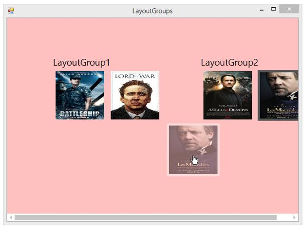

# Drag and Drop in Windows Forms Tile Layout

[TileLayout](https://help.syncfusion.com/cr/windowsforms/Syncfusion.Windows.Forms.Tools.TileLayout.html) supports easy drag and drop of items within the [LayoutGroup](https://help.syncfusion.com/cr/windowsforms/Syncfusion.Windows.Forms.Tools.LayoutGroup.html) or with other LayoutGroups at runtime.

