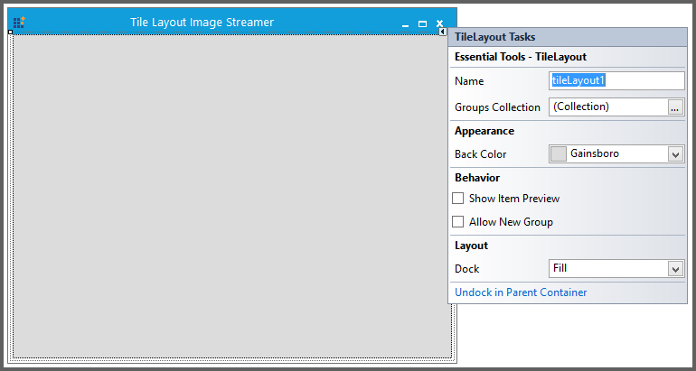
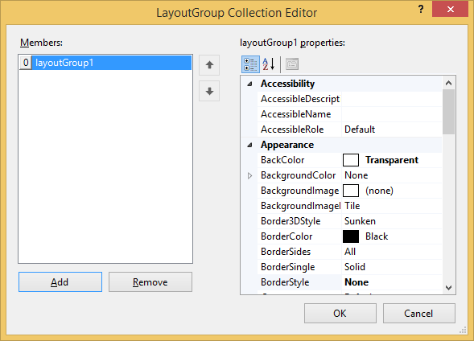
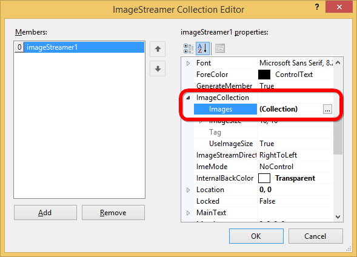

# How to load image to the ImageStreamer?

Image can be loaded to the [ImageStreamer](https://help.syncfusion.com/cr/windowsforms/Syncfusion.Windows.Forms.Tools.ImageStreamer.html) using the Images property in the [ImageCollection](https://help.syncfusion.com/cr/windowsforms/Syncfusion.Windows.Forms.Tools.ImageStreamer.html#Syncfusion_Windows_Forms_Tools_ImageStreamer_ImageCollection).





//To add images into the ImageStreamer 

this.imageStreamer1.Images.Add(((System.Drawing.Image)(resources.GetObject("imageStreamer1.Images")))); 





'To add images into the ImageStreamer 

Me.imageStreamer1.Images.Add(DirectCast(resources.GetObject("imageStreamer1.Images"), System.Drawing.Image))
 




Images are added into the [ImageStreamer](https://help.syncfusion.com/cr/windowsforms/Syncfusion.Windows.Forms.Tools.ImageStreamer.html) through designer using below steps 

Step 1: 

Select Groups Collection to add [LayoutGroup](https://help.syncfusion.com/cr/windowsforms/Syncfusion.Windows.Forms.Tools.LayoutGroup.html) in to [TileLayout](https://help.syncfusion.com/cr/windowsforms/Syncfusion.Windows.Forms.Tools.TileLayout.html). 

It will show the [LayoutGroup](https://help.syncfusion.com/cr/windowsforms/Syncfusion.Windows.Forms.Tools.LayoutGroup.html) Collection Editor window as shown in the below image.

Step 2:

Select Items to include [ImageStreamer](https://help.syncfusion.com/cr/windowsforms/Syncfusion.Windows.Forms.Tools.ImageStreamer.html) into the [LayoutGroup](https://help.syncfusion.com/cr/windowsforms/Syncfusion.Windows.Forms.Tools.LayoutGroup.html). It will opens the [ImageStreamer](https://help.syncfusion.com/cr/windowsforms/Syncfusion.Windows.Forms.Tools.ImageStreamer.html) Collection Editor window.

Step 3: 
 
In [ImageStreamer](https://help.syncfusion.com/cr/windowsforms/Syncfusion.Windows.Forms.Tools.ImageStreamer.html), select Images from the ImageCollection to include images as mentioned in below screenshot. 

