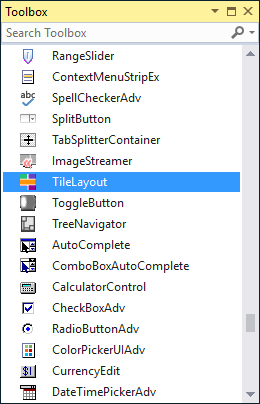
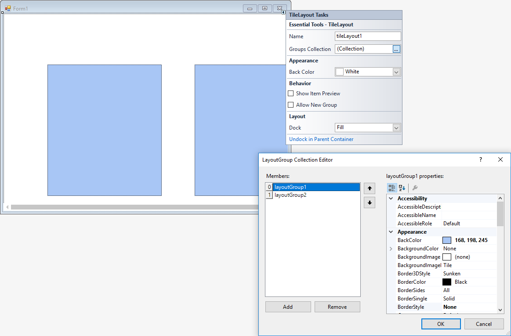

# Getting Started with Windows Forms Tile Layout

This section describes how to add [TileLayout](https://help.syncfusion.com/cr/windowsforms/Syncfusion.Windows.Forms.Tools.TileLayout.html) control in a Windows Forms application and overview of its basic functionalities.

## Assembly deployment

Refer [control dependencies](https://help.syncfusion.com/windowsforms/control-dependencies#tilelayout) section to get the list of assemblies or NuGet package needs to be added as reference to use the control in any application.
 
Please find more details regarding how to install the nuget packages in windows form application in the below link:
 
[How to install nuget packages](https://help.syncfusion.com/windowsforms/visual-studio-integration/nuget-packages)

## Creating simple application with TileLayout

You can create the Windows Forms application with [TileLayout](https://help.syncfusion.com/cr/windowsforms/Syncfusion.Windows.Forms.Tools.TileLayout.html) control as follows:

1. [Creating project](#creating-the-project)
2. [Adding control via designer](#adding-control-via-designer)
3. [Adding control manually using code](#adding-control-manually-using-code)

### Creating the project

Create a new Windows Forms project in the Visual Studio to display the [TileLayout](https://help.syncfusion.com/cr/windowsforms/Syncfusion.Windows.Forms.Tools.TileLayout.html) with functionalities.

## Adding control via designer

The [TileLayout](https://help.syncfusion.com/cr/windowsforms/Syncfusion.Windows.Forms.Tools.TileLayout.html) control can be added to the application by dragging it from the toolbox and dropping it in a designer view. The following required assembly references will be added automatically:

* Syncfusion.Grid.Base.dll
* Syncfusion.Grid.Windows.dll
* Syncfusion.Shared.Base.dll
* Syncfusion.Shared.Windows.dll
* Syncfusion.Tools.Base.dll
* Syncfusion.Tools.Windows.dll

**Adding LayoutGroup into TileLayout**

[LayoutGroup](https://help.syncfusion.com/cr/windowsforms/Syncfusion.Windows.Forms.Tools.LayoutGroup.html) can be added through `Groups Collection` in Smart Tags of [TileLayout](https://help.syncfusion.com/cr/windowsforms/Syncfusion.Windows.Forms.Tools.TileLayout.html).

**Adding ImageStreamer into LayoutGroup**

[ImageStreamer](https://help.syncfusion.com/cr/windowsforms/Syncfusion.Windows.Forms.Tools.ImageStreamer.html) can be added into LayoutGroup through the [Items](https://help.syncfusion.com/cr/windowsforms/Syncfusion.Windows.Forms.Tools.LayoutGroup.html#Syncfusion_Windows_Forms_Tools_LayoutGroup_Items) collection in PropertyGrid. 

## Adding control manually using code

To add control manually in C#, follow the given steps:

**Step 1** - Add the following required assembly references to the project:

* Syncfusion.Grid.Base.dll
* Syncfusion.Grid.Windows.dll
* Syncfusion.Shared.Base.dll
* Syncfusion.Shared.Windows.dll
* Syncfusion.Tools.Base.dll
* Syncfusion.Tools.Windows.dll

**Step 2** - Include the namespaces **Syncfusion.Windows.Forms.Tools**.





using Syncfusion.Windows.Forms.Tools;





Imports Syncfusion.Windows.Forms.Tools



 

**Step 3** - Create [TileLayout](https://help.syncfusion.com/cr/windowsforms/Syncfusion.Windows.Forms.Tools.TileLayout.html) control instance and add it to the form.





TileLayout tileLayout1 = new TileLayout();

this.Controls.Add(tileLayout1);





Dim tileLayout1 As TileLayout = New TileLayout()

Me.Controls.Add(tileLayout1)





**Adding LayoutGroup into TileLayout**

Create an instance of [LayoutGroup](https://help.syncfusion.com/cr/windowsforms/Syncfusion.Windows.Forms.Tools.LayoutGroup.html) and add it to [TileLayout](https://help.syncfusion.com/cr/windowsforms/Syncfusion.Windows.Forms.Tools.TileLayout.html).





// Create instance of TileLayout
LayoutGroup layoutGroup1 = new LayoutGroup();
LayoutGroup layoutGroup2 = new LayoutGroup();

layoutGroup1.BackColor= ColorTranslator.FromHtml("#fa8c6f5");
layoutGroup2.BackColor= ColorTranslator.FromHtml("#fa8c6f5");

// Add it to TileL
this.tileLayout1.Controls.Add(this.layoutGroup1);
this.tileLayout1.Controls.Add(this.layoutGroup2);





' Create instance of TileLayout
Dim layoutGroup1 As New LayoutGroup()
Dim layoutGroup2 As New LayoutGroup()

layoutGroup1.BackColor= ColorTranslator.FromHtml("#fa8c6f5")
layoutGroup2.BackColor= ColorTranslator.FromHtml("#fa8c6f5")

' Add it to TileL
Me.tileLayout1.Controls.Add(Me.layoutGroup1)
Me.tileLayout1.Controls.Add(Me.layoutGroup2)





   

**Adding ImageStreamer into LayoutGroup**

Create instance of [ImageStreamer](https://help.syncfusion.com/cr/windowsforms/Syncfusion.Windows.Forms.Tools.ImageStreamer.html)  and add it the [LayoutGroup](https://help.syncfusion.com/cr/windowsforms/Syncfusion.Windows.Forms.Tools.LayoutGroup.html).





// Create instance of ImageStreamer

ImageStreamer imageStreamer1 = new ImageStreamer;
ImageStreamer imageStreamer2 = new ImageStreamer;
ImageStreamer imageStreamer3 = new ImageStreamer;
ImageStreamer imageStreamer4 = new ImageStreamer;
ImageStreamer imageStreamer5 = new ImageStreamer;
ImageStreamer imageStreamer6 = new ImageStreamer;
ImageStreamer imageStreamer7 = new ImageStreamer;
ImageStreamer imageStreamer8 = new ImageStreamer;

// Add images to ImageStreamer
this.imageStreamer1.Images.Add(((System.Drawing.Image)(resources.GetObject("imageStreamer1.Images"))));
this.imageStreamer2.Images.Add(((System.Drawing.Image)(resources.GetObject("imageStreamer2.Images"))));
this.imageStreamer3.Images.Add(((System.Drawing.Image)(resources.GetObject("imageStreamer3.Images"))));
this.imageStreamer4.Images.Add(((System.Drawing.Image)(resources.GetObject("imageStreamer4.Images"))));
this.imageStreamer5.Images.Add(((System.Drawing.Image)(resources.GetObject("imageStreamer5.Images"))));
this.imageStreamer6.Images.Add(((System.Drawing.Image)(resources.GetObject("imageStreamer6.Images"))));
this.imageStreamer7.Images.Add(((System.Drawing.Image)(resources.GetObject("imageStreamer7.Images"))));
this.imageStreamer8.Images.Add(((System.Drawing.Image)(resources.GetObject("imageStreamer8.Images"))));

// Add it to LayoutGroup
this.layoutGroup1.Controls.Add(this.imageStreamer1);
this.layoutGroup1.Controls.Add(this.imageStreamer2);
this.layoutGroup1.Controls.Add(this.imageStreamer3);
this.layoutGroup1.Controls.Add(this.imageStreamer);
        
this.layoutGroup2.Controls.Add(this.imageStreamer5);
this.layoutGroup2.Controls.Add(this.imageStreamer6);
this.layoutGroup2.Controls.Add(this.imageStreamer7);
this.layoutGroup2.Controls.Add(this.imageStreamer8);





' Create instance of ImageStreamer

Dim imageStreamer1 As ImageStreamer = New ImageStreamer
Dim imageStreamer2 As ImageStreamer = New ImageStreamer
Dim imageStreamer3 As ImageStreamer = New ImageStreamer
Dim imageStreamer4 As ImageStreamer = New ImageStreamer
Dim imageStreamer5 As ImageStreamer = New ImageStreamer
Dim imageStreamer6 As ImageStreamer = New ImageStreamer
Dim imageStreamer7 As ImageStreamer = New ImageStreamer
Dim imageStreamer8 As ImageStreamer = New ImageStreamer

' Add images to ImageStreamer
Me.imageStreamer1.Images.Add((CType(resources.GetObject("imageStreamer1.Images"), System.Drawing.Image)))
Me.imageStreamer2.Images.Add((CType(resources.GetObject("imageStreamer2.Images"), System.Drawing.Image)))
Me.imageStreamer3.Images.Add((CType(resources.GetObject("imageStreamer3.Images"), System.Drawing.Image)))
Me.imageStreamer4.Images.Add((CType(resources.GetObject("imageStreamer4.Images"), System.Drawing.Image)))
Me.imageStreamer5.Images.Add((CType(resources.GetObject("imageStreamer5.Images"), System.Drawing.Image)))
Me.imageStreamer6.Images.Add((CType(resources.GetObject("imageStreamer6.Images"), System.Drawing.Image)))
Me.imageStreamer7.Images.Add((CType(resources.GetObject("imageStreamer7.Images"), System.Drawing.Image)))
Me.imageStreamer8.Images.Add((CType(resources.GetObject("imageStreamer8.Images"), System.Drawing.Image)))

' Add it to LayoutGroup
Me.layoutGroup1.Controls.Add(Me.imageStreamer1)
Me.layoutGroup1.Controls.Add(Me.imageStreamer2)
Me.layoutGroup1.Controls.Add(Me.imageStreamer3)
Me.layoutGroup1.Controls.Add(Me.imageStreamer)

Me.layoutGroup2.Controls.Add(Me.imageStreamer5)
Me.layoutGroup2.Controls.Add(Me.imageStreamer6)
Me.layoutGroup2.Controls.Add(Me.imageStreamer7)
Me.layoutGroup2.Controls.Add(Me.imageStreamer8)




       
       
