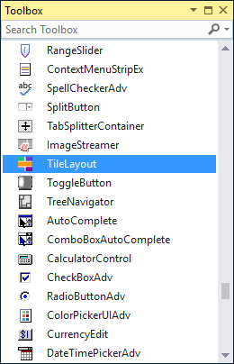
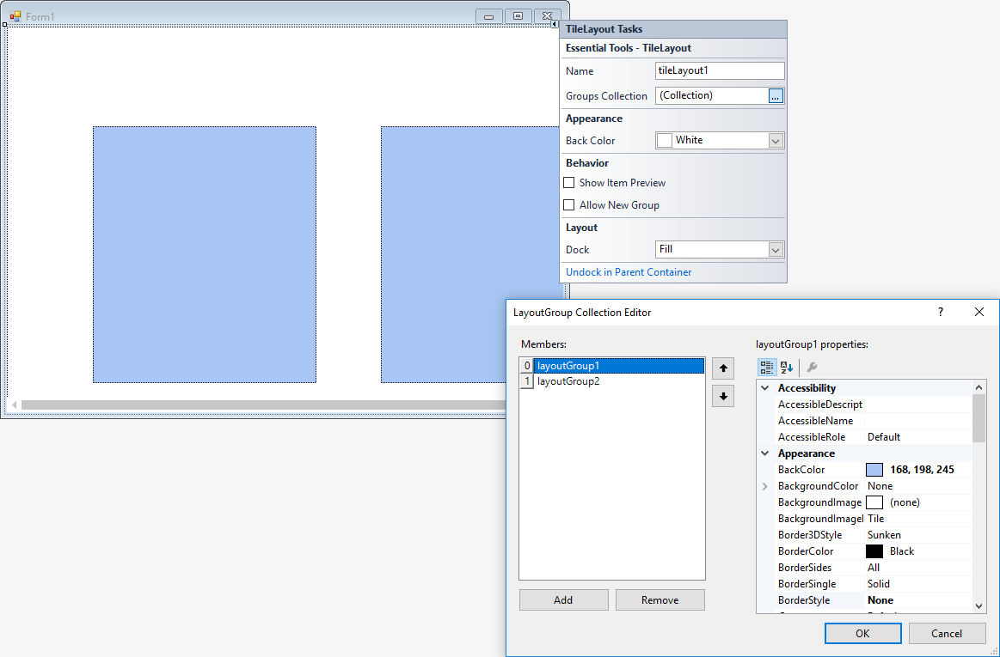
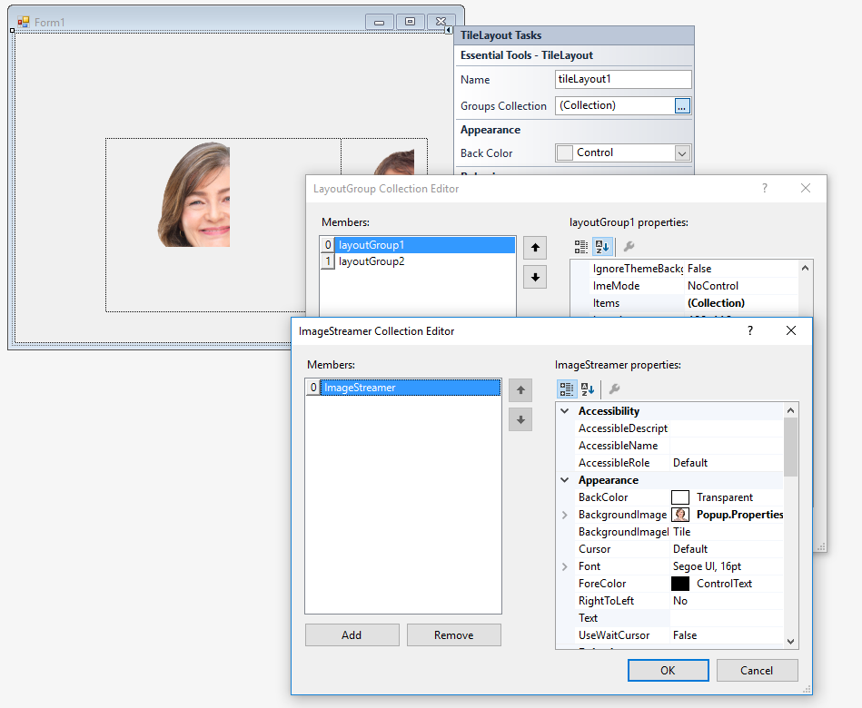

# Getting Started with Windows Forms TileLayout

This section describes how to add the [TileLayout](https://help.syncfusion.com/cr/windowsforms/Syncfusion.Windows.Forms.Tools.TileLayout.html) control to a Windows Forms application and provides an overview of its basic functionalities.

* [Assembly deployment](#assembly-deployment)
* [Adding TileLayout through the designer](#adding-tilelayout-through-the-designer)
* [Adding TileLayout through code](#adding-tilelayout-through-code)

## Assembly deployment

Refer to the [Control Dependencies](https://help.syncfusion.com/windowsforms/control-dependencies#tilelayout) section for the list of assemblies or the NuGet package details that must be referenced to use the control in any application.

Refer to [NuGet Packages](https://help.syncfusion.com/windowsforms/installation/install-nuget-packages) to learn how to install NuGet packages in a Windows Forms application.

You can also add the required assemblies as references from the Package Manager Console using the following PowerShell command:

```powershell
Install-Package Syncfusion.Tools.Windows
```

## Adding TileLayout through the designer

1. Create a new **Windows Forms Application** project in Visual Studio.

2. Drag the **TileLayout** control from the Toolbox onto the form. The following required assembly references will be added automatically:

    * Syncfusion.Grid.Base.dll
    * Syncfusion.Grid.Windows.dll
    * Syncfusion.Shared.Base.dll
    * Syncfusion.Shared.Windows.dll
    * Syncfusion.Tools.Base.dll
    * Syncfusion.Tools.Windows.dll

    

3. Add a [LayoutGroup](https://help.syncfusion.com/cr/windowsforms/Syncfusion.Windows.Forms.Tools.LayoutGroup.html) through the **Groups Collection** in the Smart Tags of the [TileLayout](https://help.syncfusion.com/cr/windowsforms/Syncfusion.Windows.Forms.Tools.TileLayout.html).

    

4. Add an [ImageStreamer](https://help.syncfusion.com/cr/windowsforms/Syncfusion.Windows.Forms.Tools.ImageStreamer.html) into the LayoutGroup through the [Items](https://help.syncfusion.com/cr/windowsforms/Syncfusion.Windows.Forms.Tools.LayoutGroup.html#Syncfusion_Windows_Forms_Tools_LayoutGroup_Items) collection in the Properties window.

    

## Adding TileLayout through code

Add the TileLayout control programmatically by following the steps below.

1. **Add required assembly references**

    Add the following assemblies to the **References** folder through the Solution Explorer:

    * Syncfusion.Grid.Base.dll
    * Syncfusion.Grid.Windows.dll
    * Syncfusion.Shared.Base.dll
    * Syncfusion.Shared.Windows.dll
    * Syncfusion.Tools.Base.dll
    * Syncfusion.Tools.Windows.dll

    Then include the `Syncfusion.Windows.Forms.Tools` namespace in the code.

    
    
    

    using Syncfusion.Windows.Forms.Tools;
    using System.Windows.Forms;
    using System.Drawing;
    using System.ComponentModel;

    
    

    Imports Syncfusion.Windows.Forms.Tools
    Imports System.Windows.Forms
    Imports System.Drawing
    Imports System.ComponentModel

    
    
    
    {{ codesnippet_ns | OrderList_Indent_Level_1 }}

2. **Create the TileLayout instance inside Form1**

    Create the [TileLayout](https://help.syncfusion.com/cr/windowsforms/Syncfusion.Windows.Forms.Tools.TileLayout.html) control instance inside the `Form1` constructor and add it to the form.

    
    
    

    public partial class Form1 : Form
    {
        private Syncfusion.Windows.Forms.Tools.TileLayout tileLayout1;
        public Form1()
        {
            InitializeComponent();
            this.tileLayout1 = new TileLayout();
            this.Controls.Add(this.tileLayout1);
        }
    }

    
    

    Public Partial Class Form1
        Inherits System.Windows.Forms.Form

        Private tileLayout1 As Syncfusion.Windows.Forms.Tools.TileLayout

        Public Sub New()
            InitializeComponent()
            Me.tileLayout1 = New TileLayout()
            Me.Controls.Add(Me.tileLayout1)
        End Sub
    End Class

    
    
    
    {{ codesnippet_instance | OrderList_Indent_Level_1 }}

3. **Create and add LayoutGroups**

    Create instances of [LayoutGroup](https://help.syncfusion.com/cr/windowsforms/Syncfusion.Windows.Forms.Tools.LayoutGroup.html) and add them to the TileLayout.

    
    
    

    // Create instance of LayoutGroup
    LayoutGroup layoutGroup1 = new LayoutGroup();
    LayoutGroup layoutGroup2 = new LayoutGroup();

    layoutGroup1.BackColor = ColorTranslator.FromHtml("#f8c6f5");
    layoutGroup2.BackColor = ColorTranslator.FromHtml("#f8c6f5");

    // Add it to TileLayout
    this.tileLayout1.Groups.Add(layoutGroup1);
    this.tileLayout1.Groups.Add(layoutGroup2);

    
    

    ' Create instance of LayoutGroup
    Dim layoutGroup1 As New LayoutGroup()
    Dim layoutGroup2 As New LayoutGroup()

    layoutGroup1.BackColor = ColorTranslator.FromHtml("#f8c6f5")
    layoutGroup2.BackColor = ColorTranslator.FromHtml("#f8c6f5")

    ' Add it to TileLayout
    Me.tileLayout1.Groups.Add(layoutGroup1)
    Me.tileLayout1.Groups.Add(layoutGroup2)

    
    
    
    {{ codesnippet_groups | OrderList_Indent_Level_1 }}

    

4. **Add ImageStreamers to the LayoutGroups**

    Create instances of [ImageStreamer](https://help.syncfusion.com/cr/windowsforms/Syncfusion.Windows.Forms.Tools.ImageStreamer.html) and add them to the [LayoutGroup](https://help.syncfusion.com/cr/windowsforms/Syncfusion.Windows.Forms.Tools.LayoutGroup.html) through the `Items` collection.

    
    
    

    // Create instance of ImageStreamer (declared as fields in Form1)
    ImageStreamer imageStreamer1 = new ImageStreamer();
    ImageStreamer imageStreamer2 = new ImageStreamer();
    ImageStreamer imageStreamer3 = new ImageStreamer();
    ImageStreamer imageStreamer4 = new ImageStreamer();
    ImageStreamer imageStreamer5 = new ImageStreamer();
    ImageStreamer imageStreamer6 = new ImageStreamer();
    ImageStreamer imageStreamer7 = new ImageStreamer();
    ImageStreamer imageStreamer8 = new ImageStreamer();

    // Add images to ImageStreamer
    this.imageStreamer1.Images.Add(((System.Drawing.Image)(resources.GetObject("imageStreamer1.Images"))));
    this.imageStreamer2.Images.Add(((System.Drawing.Image)(resources.GetObject("imageStreamer2.Images"))));
    this.imageStreamer3.Images.Add(((System.Drawing.Image)(resources.GetObject("imageStreamer3.Images"))));
    this.imageStreamer4.Images.Add(((System.Drawing.Image)(resources.GetObject("imageStreamer4.Images"))));
    this.imageStreamer5.Images.Add(((System.Drawing.Image)(resources.GetObject("imageStreamer5.Images"))));
    this.imageStreamer6.Images.Add(((System.Drawing.Image)(resources.GetObject("imageStreamer6.Images"))));
    this.imageStreamer7.Images.Add(((System.Drawing.Image)(resources.GetObject("imageStreamer7.Images"))));
    this.imageStreamer8.Images.Add(((System.Drawing.Image)(resources.GetObject("imageStreamer8.Images"))));

    // Add it to LayoutGroup
    this.layoutGroup1.Items.Add(this.imageStreamer1);
    this.layoutGroup1.Items.Add(this.imageStreamer2);
    this.layoutGroup1.Items.Add(this.imageStreamer3);
    this.layoutGroup1.Items.Add(this.imageStreamer4);

    this.layoutGroup2.Items.Add(this.imageStreamer5);
    this.layoutGroup2.Items.Add(this.imageStreamer6);
    this.layoutGroup2.Items.Add(this.imageStreamer7);
    this.layoutGroup2.Items.Add(this.imageStreamer8);

    
    

    ' Create instance of ImageStreamer
    Dim imageStreamer1 As New ImageStreamer()
    Dim imageStreamer2 As New ImageStreamer()
    Dim imageStreamer3 As New ImageStreamer()
    Dim imageStreamer4 As New ImageStreamer()
    Dim imageStreamer5 As New ImageStreamer()
    Dim imageStreamer6 As New ImageStreamer()
    Dim imageStreamer7 As New ImageStreamer()
    Dim imageStreamer8 As New ImageStreamer()

    ' Add images to ImageStreamer
    Me.imageStreamer1.Images.Add(CType(resources.GetObject("imageStreamer1.Images"), System.Drawing.Image))
    Me.imageStreamer2.Images.Add(CType(resources.GetObject("imageStreamer2.Images"), System.Drawing.Image))
    Me.imageStreamer3.Images.Add(CType(resources.GetObject("imageStreamer3.Images"), System.Drawing.Image))
    Me.imageStreamer4.Images.Add(CType(resources.GetObject("imageStreamer4.Images"), System.Drawing.Image))
    Me.imageStreamer5.Images.Add(CType(resources.GetObject("imageStreamer5.Images"), System.Drawing.Image))
    Me.imageStreamer6.Images.Add(CType(resources.GetObject("imageStreamer6.Images"), System.Drawing.Image))
    Me.imageStreamer7.Images.Add(CType(resources.GetObject("imageStreamer7.Images"), System.Drawing.Image))
    Me.imageStreamer8.Images.Add(CType(resources.GetObject("imageStreamer8.Images"), System.Drawing.Image))

    ' Add it to LayoutGroup
    Me.layoutGroup1.Items.Add(Me.imageStreamer1)
    Me.layoutGroup1.Items.Add(Me.imageStreamer2)
    Me.layoutGroup1.Items.Add(Me.imageStreamer3)
    Me.layoutGroup1.Items.Add(Me.imageStreamer4)

    Me.layoutGroup2.Items.Add(Me.imageStreamer5)
    Me.layoutGroup2.Items.Add(Me.imageStreamer6)
    Me.layoutGroup2.Items.Add(Me.imageStreamer7)
    Me.layoutGroup2.Items.Add(Me.imageStreamer8)

    
    
    
    {{ codesnippet_streamers | OrderList_Indent_Level_1 }}

    
