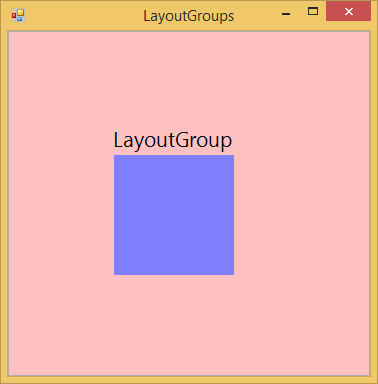
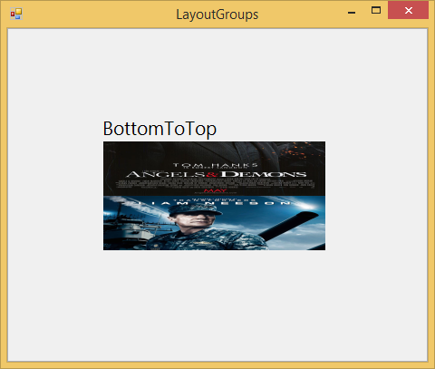

# Hosting ImageStreamer as Tile Items in Windows Forms Tile Layout

In [TileLayout](https://help.syncfusion.com/cr/windowsforms/Syncfusion.Windows.Forms.Tools.TileLayout.html), [ImageStreamer control](https://help.syncfusion.com/cr/windowsforms/Syncfusion.Windows.Forms.Tools.ImageStreamer.html) is used as an Item in [LayoutGroup](https://help.syncfusion.com/cr/windowsforms/Syncfusion.Windows.Forms.Tools.LayoutGroup.html). To add the Images into the [ImageStreamer](https://help.syncfusion.com/cr/windowsforms/Syncfusion.Windows.Forms.Tools.ImageStreamer.html), [ImagesCollection](https://help.syncfusion.com/cr/windowsforms/Syncfusion.Windows.Forms.Tools.ImageCollection.html) property is used.

## InternalBackColor

Sets the [BackColor](https://help.syncfusion.com/cr/windowsforms/Syncfusion.Windows.Forms.Tools.ImageStreamer.html#Syncfusion_Windows_Forms_Tools_ImageStreamer_BackColor) of the [ImageStreamer](https://help.syncfusion.com/cr/windowsforms/Syncfusion.Windows.Forms.Tools.ImageStreamer.html).





//Gets or sets the back color of the ImageStreamer

this.imageStreamer1.InternalBackColor = System.Drawing.Color.Pink;





'Gets or sets the back color of the ImageStreamer

 Me.imageStreamer1.InternalBackColor = System.Drawing.Color.Pink
 




## SliderSpeed

You can specifies the speed of the Slider using [SliderSpeed](https://help.syncfusion.com/cr/windowsforms/Syncfusion.Windows.Forms.Tools.ImageStreamer.html#Syncfusion_Windows_Forms_Tools_ImageStreamer_SliderSpeed) properties of [ImageStreamer](https://help.syncfusion.com/cr/windowsforms/Syncfusion.Windows.Forms.Tools.ImageStreamer.html).





//Gets or sets the SliderSpeed

this.imageStreamer1.SliderSpeed = 100;





 'Gets or sets the SliderSpeed
 
 Me.imageStreamer1.SliderSpeed = 100
 




## ShowNavigator

Navigator which is used to navigate the slide show direction is shown when the [ShowNavigator](https://help.syncfusion.com/cr/windowsforms/Syncfusion.Windows.Forms.Tools.ImageStreamer.html#Syncfusion_Windows_Forms_Tools_ImageStreamer_ShowNavigator) property is `true`. To enable this property [SlideShow](https://help.syncfusion.com/cr/windowsforms/Syncfusion.Windows.Forms.Tools.ImageStreamer.html#Syncfusion_Windows_Forms_Tools_ImageStreamer_SlideShow) must be `true`.





// Shows the Navigator

this.imageStreamer1.ShowNavigator = true;

this.imageStreamer1.SlideShow = true;





'Shows the Navigator

 Me.imageStreamer1.ShowNavigator = True
 
 Me.imageStreamer1.SlideShow = True
 




## SlideShow

This [SlideShow](https://help.syncfusion.com/cr/windowsforms/Syncfusion.Windows.Forms.Tools.ImageStreamer.html#Syncfusion_Windows_Forms_Tools_ImageStreamer_SlideShow) property shows all the Images which is loaded in the [ImageStreamer](https://help.syncfusion.com/cr/windowsforms/Syncfusion.Windows.Forms.Tools.ImageStreamer.html).





//Enables the SlideShow

this.imageStreamer1.SlideShow = true;





‘Enables the SlideShow

Me.imageStreamer1.SlideShow = true
 




## ImageStreamDirection

This [ImageStreamDirection](https://help.syncfusion.com/cr/windowsforms/Syncfusion.Windows.Forms.Tools.ImageStreamer.html#Syncfusion_Windows_Forms_Tools_ImageStreamer_ImageStreamDirection) property gives the ImageStream direction in the SlideShow.

* LeftToRight
* RightToLeft
* TopToBottom
* BottomToTop
* HorizontalFlip





//Gets or sets the ImageStream direction

this.imageStreamer1.ImageStreamDirection = Syncfusion.Windows.Forms.Tools.ImageStreamer.StreamDirection.HorizontalFlip;





‘Gets or sets the ImageStream direction

Me.imageStreamer1.ImageStreamDirection = Syncfusion.Windows.Forms.Tools.ImageStreamer.StreamDirection.HorizontalFlip
 




## ImageStreamerType

[ImageStreamer](https://help.syncfusion.com/cr/windowsforms/Syncfusion.Windows.Forms.Tools.ImageStreamer.html) has two types.

* Normal
* DoubleHorizontal

In Normal ImageStreamer, one image is displayed at a time.In DoubleHorizontal mode, either we can load two images or single image at a time. If single image is loaded in DoubleHorizontal mode the Image will be resized to this DoubleHorizontal size.





//Gets or sets the ImageStreamer type

this.imageStreamer2.Type = Syncfusion.Windows.Forms.Tools.ImageStreamer.ImageStreamerType.Normal;

this.imageStreamer2.Type = Syncfusion.Windows.Forms.Tools.ImageStreamer.ImageStreamerType.DoubleHorizontal;





'Gets or sets the ImageStreamer type

Me.imageStreamer1.Type = Syncfusion.Windows.Forms.Tools.ImageStreamer.ImageStreamerType.Normal

Me.imageStreamer1.Type = Syncfusion.Windows.Forms.Tools.ImageStreamer.ImageStreamerType.DoubleHorizontal
 




