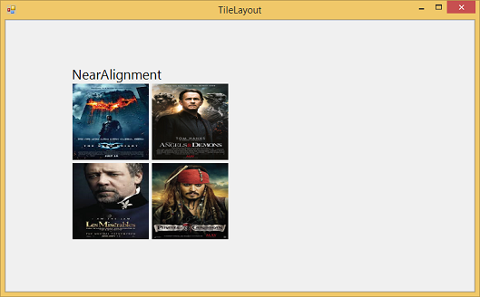
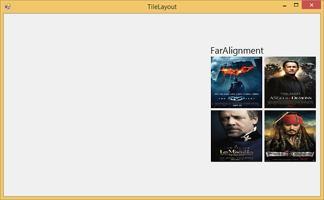
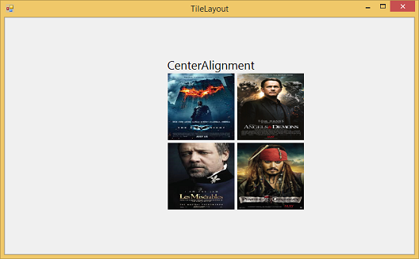
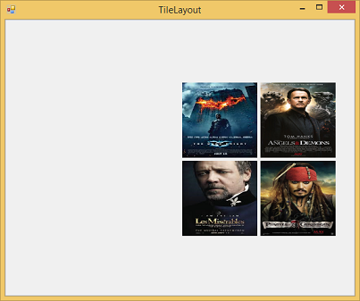
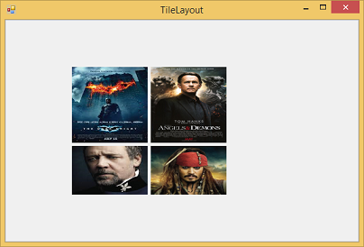

# Layout Customization in Windows Forms Tile Layout

## Alignment

This [Alignment](https://help.syncfusion.com/cr/windowsforms/Syncfusion.Windows.Forms.Tools.FlowLayout.html#Syncfusion_Windows_Forms_Tools_FlowLayout_Alignment) property sets the [MainLayout](https://help.syncfusion.com/cr/windowsforms/Syncfusion.Windows.Forms.Tools.TileLayout.html) group alignment in [TileLayout](https://help.syncfusion.com/cr/windowsforms/Syncfusion.Windows.Forms.Tools.TileLayout.html) control.





//Gets or sets the MainLayout alignment

this.tileLayout1.MainLayout.Alignment = Syncfusion.Windows.Forms.Tools.FlowAlignment.Near;





‘Gets or sets the MainLayout alignment

Me.tileLayout1.MainLayout.Alignment = Syncfusion.Windows.Forms.Tools.FlowAlignment.Near
 




### HorzNearMargin

[HorzNearMargin](https://help.syncfusion.com/cr/windowsforms/Syncfusion.Windows.Forms.Tools.LayoutManager.html#Syncfusion_Windows_Forms_Tools_LayoutManager_HorzNearMargin) indicates the left margin between the client rectangle and layout rectangle.





//Gets or sets the left margin between client rectangle and layout rectangle

this.tileLayout1.MainLayout.HorzNearMargin = 100;





‘Gets or sets the left margin between client rectangle and layout rectangle

Me.tileLayout1.MainLayout.HorzNearMargin = 100
 




### HorzFarMargin

[HorzFarMargin](https://help.syncfusion.com/cr/windowsforms/Syncfusion.Windows.Forms.Tools.LayoutManager.html#Syncfusion_Windows_Forms_Tools_LayoutManager_HorzFarMargin) indicates the right margin between the client rectangle and the layout rectangle.





//Gets or sets the right margin between client rectangle and layout rectangle

this.tileLayout1.MainLayout.HorzFarMargin = 100;





‘Gets or sets the right margin between client rectangle and layout rectangle

Me.tileLayout1.MainLayout.HorzFarMargin = 100
 




### TopMargin

[TopMargin](https://help.syncfusion.com/cr/windowsforms/Syncfusion.Windows.Forms.Tools.LayoutManager.html#Syncfusion_Windows_Forms_Tools_LayoutManager_TopMargin) indicates the Top margin between the client rectangle and layout rectangle.





//Gets or sets the Top margin between client rectangle and layout rectangle 

this.tileLayout1.MainLayout.TopMargin = 20;





‘Gets or sets the Top margin between client rectangle and layout rectangle

Me.tileLayout1.MainLayout.TopMargin = 20
 




### BottomMargin

[BottomMargin](https://help.syncfusion.com/cr/windowsforms/Syncfusion.Windows.Forms.Tools.LayoutManager.html#Syncfusion_Windows_Forms_Tools_LayoutManager_BottomMargin) indicates the Bottom margin between the client rectangle and layout rectangle.





//Gets or sets the Bottom margin between client rectangle and layout rectangle

this.tileLayout1.MainLayout.BottomMargin = 100;





‘Gets or sets the Bottom margin between client rectangle and layout rectangle

Me.tileLayout1.MainLayout.BottomMargin = 100

 




### ReverseRows

This [ReverseRows](https://help.syncfusion.com/cr/windowsforms/Syncfusion.Windows.Forms.Tools.FlowLayout.html#Syncfusion_Windows_Forms_Tools_FlowLayout_ReverseRows) property lays out the rows in opposite direction. If the LayoutMode is Horizontal then it lays out rows in Top to Bottom direction. If the LayoutMode is Vertical then it lays out the rows in Left to Right direction.





//Lays out the rows in opposite direction

this.tileLayout1.MainLayout.ReverseRows = true;





‘Lays out the rows in opposite direction
  
Me.tileLayout1.MainLayout.ReverseRows = true
 




