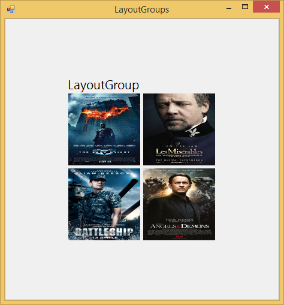

# Appearance Settings

## SetParentFormFlat

This property gives flat look for the the parent Form while.





//Enables flat look for parent form

this.tileLayout1.SetParentFormFlat = true;





'Enables flat look for parent form

Me.tileLayout1.SetParentFormFlat = True

 




## ShowGroupTitle

Shows the Group Title while enabling this property.





//Shows the Group Title

this.tileLayout1.ShowGroupTitle = true;





'Shows the Group Title

 Me.tileLayout1.ShowGroupTitle = True
 




# IgnoreThemeBackground

`IgnoreThemeBackground` indicates whether the control will ignore the theme's background color and draw the BackColor instead. BackColor of the TileLayout will only be 
applied if the IgnoreThemeBackground property is set to True.





//To apply BackColor of the TileLayout

 this.tileLayout1.IgnoreThemeBackground = true;





‘To apply BackColor of the TileLayout

 Me.tileLayout1.IgnoreThemeBackground = true
 




