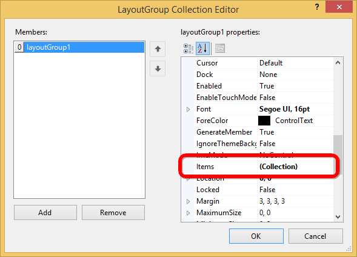

# How to load Image to the ImageStreamer?

Image can be loaded to the ImageStreamer using the Images property in the ImageCollection.





//To add images into the ImageStreamer 

this.imageStreamer1.Images.Add(((System.Drawing.Image)(resources.GetObject("imageStreamer1.Images")))); 





'To add images into the ImageStreamer 

Me.imageStreamer1.Images.Add(DirectCast(resources.GetObject("imageStreamer1.Images"), System.Drawing.Image))
 




Images are added into the ImageStreamer through designer using below steps 

Step 1: 

Select Groups Collection to add Layout group in to TileLayout. 

It will show the LayoutGroup Collection Editor window as shown in the below image.

Step 2:

Select Items to include ImageStreamer into the Layout group. It will opens the ImageStreamer Collection Editor window.

Step 3: 
 
In ImageStreamer, select Images from the ImageCollection to include images as mentioned in below screenshot. 

