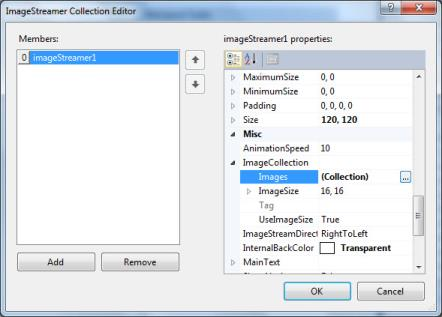

# Getting Started

The TileLayout can be created through designer or code. The following sections describe this.

## Through Designer

To create TileLayout through designer.

1) Create a Windows Forms project in Visual Studio and refer to the following assemblies.

  * Syncfusion.Grid.Windows.dll
  * Syncfusion.Grid.Base.dll
  * Syncfusion.Shared.Base.dll
  * Syncfusion.Shared.Windows.dll
  * Syncfusion.Tools.Base.dll
  * Syncfusion.Tools.Windows.dll

2) Drag and drop a TileLayout object from the controls toolbox into your form.

3) Add LayoutGroup to the control in the designer as shown below.

4) Click the button in the `Groups` property. This will open the **Collection Editor**.

5) Add `ImageStreamer` to the control in the designer as shown below.

6) Change ImageStreamer’s back color.

7) Add Images to the ImageStreamer using `Images` Collection property.

## Through Code

1) To create the TileLayout through C#, include the following namespace to the directives list.





using Syncfusion.Windows.Forms.Tools;





Imports Syncfusion.Windows.Forms.Tools
 




2) Declare the TileLayout,LayoutGroup and ImageStreamer.





private Syncfusion.Windows.Forms.Tools.TileLayout tileLayout1;

private Syncfusion.Windows.Forms.Tools.LayoutGroup layoutGroup1;

private Syncfusion.Windows.Forms.Tools.ImageStreamer imageStreamer1;

this.Controls.Add(this.tileLayout1);





private tileLayout1 As Syncfusion.Windows.Forms.Tools.TileLayout

private layoutGroup1 As Syncfusion.Windows.Forms.Tools.LayoutGroup

private imageStreamer1 As Syncfusion.Windows.Forms.Tools.ImageStreamer

Me.Controls.Add(Me.tileLayout1)
 



   
3) The following code creates a TileLayout and LayoutGroup.





private void Form1_Load(object sender, System.EventArgs e)

{

     //Initialize the TileLayout and LayoutGroup. 

     this.tileLayout1 = new Syncfusion.Windows.Forms.Tools.TileLayout();

   	this.layoutGroup1 = new Syncfusion.Windows.Forms.Tools.LayoutGroup();

 	this.imageStreamer1 = new Syncfusion.Windows.Forms.Tools.ImageStreamer();

 	// TileLayout1
     this.tileLayout1.Controls.Add(this.layoutGroup1);

	 this.tileLayout1.Location = new System.Drawing.Point(0, 0);

	 this.tileLayout1.Name = "tileLayout1";

	 this.tileLayout1.SetParentFormFlat = false;

	 this.tileLayout1.ShowGroupTitle = false;

	 this.tileLayout1.ShowItemPreview = false;

	 this.tileLayout1.Size = new System.Drawing.Size(545, 394);

	 // 

	 // LayoutGroup1

	 // 

	 this.layoutGroup1.BackColor = System.Drawing.Color.Black;

	 this.layoutGroup1.Controls.Add(this.imageStreamer1);

	 new Syncfusion.Windows.Forms.Tools.ImageStreamerCollection().AddRange(new Syncfusion.Windows.Forms.Tools.ImageStreamer[] {

	 this.imageStreamer1});

	 this.layoutGroup1.Location = new System.Drawing.Point(100, 125);

	 this.layoutGroup1.Name = "layoutGroup1";

	 this.layoutGroup1.SetItem = true;

	 // 

	 // ImageStreamer1

	 // 

	 this.imageStreamer1.Images = ((System.Collections.Generic.List<System.Drawing.Image>)(resources.GetObject("imageStreamer1.Images")));

	 this.imageStreamer1.InternalBackColor = System.Drawing.Color.Green;

     this.imageStreamer1.Location = new System.Drawing.Point(5, 0);

	 this.imageStreamer1.Name = "imageStreamer1";

	 this.imageStreamer1.Size = new System.Drawing.Size(120, 120);

	 this.imageStreamer1.TabIndex = 0;

	 this.imageStreamer1.Text = "imageStreamer1";

}



        


Private Sub Form1_Load(ByVal sender As Object, ByVal e As System.EventArgs) Handles MyBase.Load

'Initialize the tabControlAdv and tabPageAdv.

Me.tileLayout1 = New Syncfusion.Windows.Forms.Tools.TileLayout()

Me.layoutGroup1 = New Syncfusion.Windows.Forms.Tools.LayoutGroup()

Me.imageStreamer1 = New Syncfusion.Windows.Forms.Tools.ImageStreamer()

' 

' TileLayout1

' 

Me.tileLayout1.Controls.Add(Me.layoutGroup1)

Me.tileLayout1.Dock = System.Windows.Forms.DockStyle.Fill

Me.tileLayout1.Location = New System.Drawing.Point(0, 0)

Me.tileLayout1.Name = "tileLayout1"

Me.tileLayout1.SetParentFormFlat = False

Me.tileLayout1.ShowGroupTitle = False

Me.tileLayout1.ShowItemPreview = False

' 

' LayoutGroup1

' 

Me.layoutGroup1.Controls.Add(Me.imageStreamer1)

Me.layoutGroup1.Location = New System.Drawing.Point(100, 125)

Me.layoutGroup1.Name = "layoutGroup1"

Me.layoutGroup1.SetItem = True

Me.layoutGroup1.Size = New System.Drawing.Size(140, 244)

Me.layoutGroup1.TabIndex = 0

' 

' ImageStreamer1

' 

Me.imageStreamer1.Location = New System.Drawing.Point(5, 0)

Me.imageStreamer1.Name = "imageStreamer1"

Me.imageStreamer1.Size = New System.Drawing.Size(120, 120)

Me.imageStreamer1.TabIndex = 0

Me.imageStreamer1.Text = "imageStreamer1"

End Sub
		




