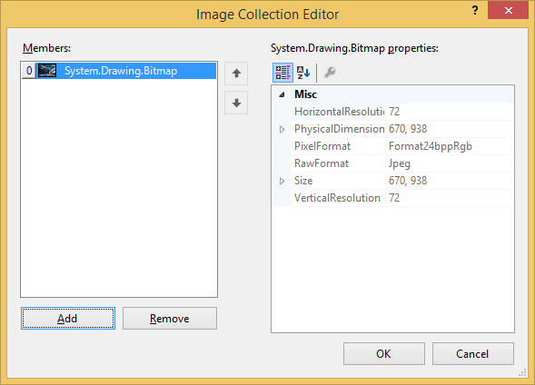
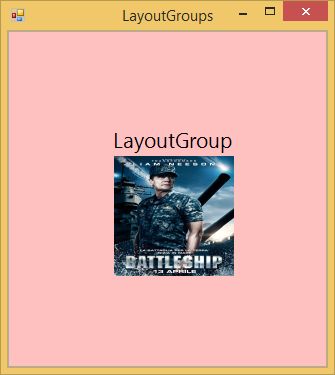
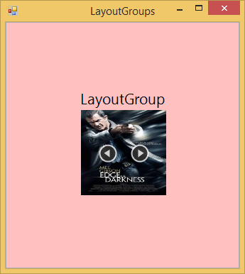
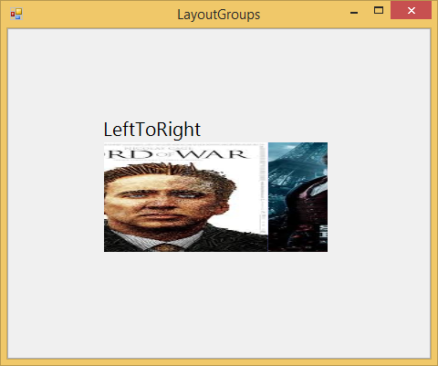
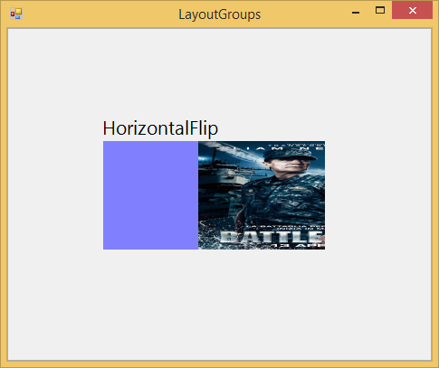

# Hosting ImageStreamer as tile items

In TileLayout, ImageStreamer control is used as an Item in LayoutGroup. To add the Images into the ImageStreamer, ImagesCollection property is used.

## InternalBackColor

Sets the BackColor of the ImageStreamer





//Gets or sets the back color of the ImageStreamer

this.imageStreamer1.InternalBackColor = System.Drawing.Color.Pink;





'Gets or sets the back color of the ImageStreamer

 Me.imageStreamer1.InternalBackColor = System.Drawing.Color.Pink
 




## SliderSpeed

Specifies the speed of the Slider in the ImageStreamer.





//Gets or sets the SliderSpeed

this.imageStreamer1.SliderSpeed = 100;





 'Gets or sets the SliderSpeed
 
 Me.imageStreamer1.SliderSpeed = 100
 




## ShowNavigator

Navigator which is used to navigate the slide show direction is shown when the `ShowNavigator` property is `true`. To enable this property SlideShow must be `true`.





// Shows the Navigator

this.imageStreamer1.ShowNavigator = true;

this.imageStreamer1.SlideShow = true;





'Shows the Navigator

 Me.imageStreamer1.ShowNavigator = True
 
 Me.imageStreamer1.SlideShow = True
 




## SlideShow

This property shows all the Images which is loaded in the ImageStreamer.





//Enables the SlideShow

this.imageStreamer1.SlideShow = true;





‘Enables the SlideShow

Me.imageStreamer1.SlideShow = true
 




## ImageStreamDirection

This property gives the ImageStream direction in the SlideShow.

* LeftToRight
* RightToLeft
* TopToBottom
* BottomToTop
* HorizontalFlip





//Gets or sets the ImageStream direction

this.imageStreamer1.ImageStreamDirection = Syncfusion.Windows.Forms.Tools.ImageStreamer.StreamDirection.HorizontalFlip;





‘Gets or sets the ImageStream direction

Me.imageStreamer1.ImageStreamDirection = Syncfusion.Windows.Forms.Tools.ImageStreamer.StreamDirection.HorizontalFlip
 




## ImageStreamerType

ImageStreamer has two types.

* Normal
* DoubleHorizontal

In Normal ImageStreamer, one image is displayed at a time.In DoubleHorizontal mode, either we can load two images or single image at a time. If single image is loaded in DoubleHorizontal mode the Image will be resized to this DoubleHorizontal size.





//Gets or sets the ImageStreamer type

this.imageStreamer2.Type = Syncfusion.Windows.Forms.Tools.ImageStreamer.ImageStreamerType.Normal;

this.imageStreamer2.Type = Syncfusion.Windows.Forms.Tools.ImageStreamer.ImageStreamerType.DoubleHorizontal;





'Gets or sets the ImageStreamer type

Me.imageStreamer1.Type = Syncfusion.Windows.Forms.Tools.ImageStreamer.ImageStreamerType.Normal

Me.imageStreamer1.Type = Syncfusion.Windows.Forms.Tools.ImageStreamer.ImageStreamerType.DoubleHorizontal
 




