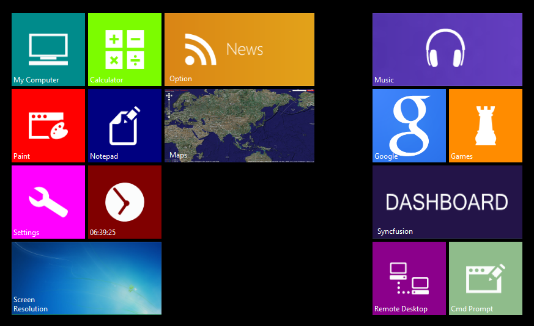

# Overview

The Syncfusion TileLayout control acts as a container that holds a set of LayoutGroups, in which you can host rich information.
You can drag the items of the TileLayout in a matrix position to achieve the best layout.

* This feature can be used in any kind of application that is used to showcase items.
* Drag-drop facilities to rearrange the Tile Items.
* Image transition support.
* Complete customization support for Layout Groups position.

