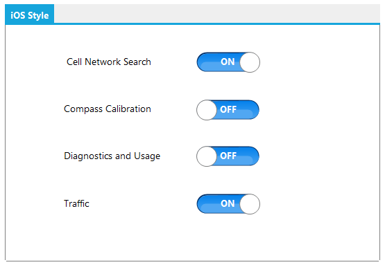

# Custom Styling in WinForms Toggle Button

The appearance of the WinForms Toggle Button is customized by using the IToggleButtonRenderer. This interface provides few methods to control painting borders, arrow, and so on.  

To customize the appearance, 

1. Create a new custom renderer class and implement each of the members defined in `IToggleButtonRenderer`.
2. Assign an instance of your custom renderer to the `Renderer` property of the WinForms Toggle Button. By default, the control is painted by using its default renderer.




CustomRenderer renderer = new CustomRenderer();
toggleButton1.Renderer = renderer;





Dim renderer As New CustomRenderer()
toggleButton1.Renderer = renderer




