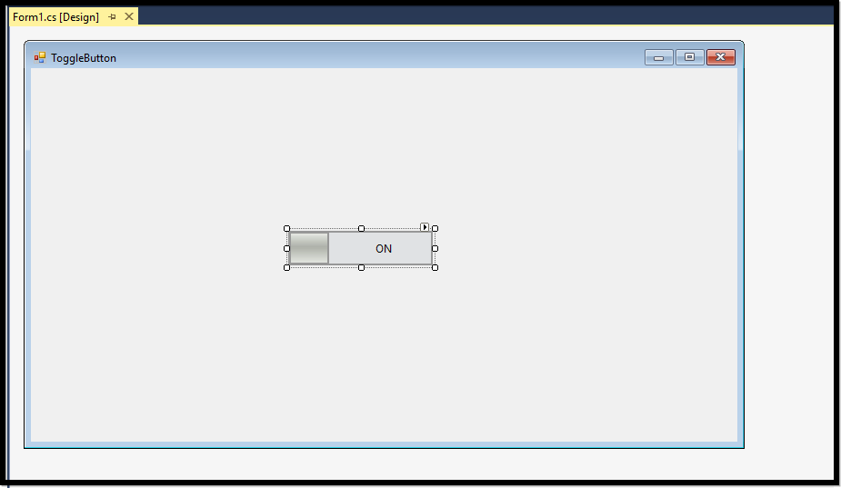
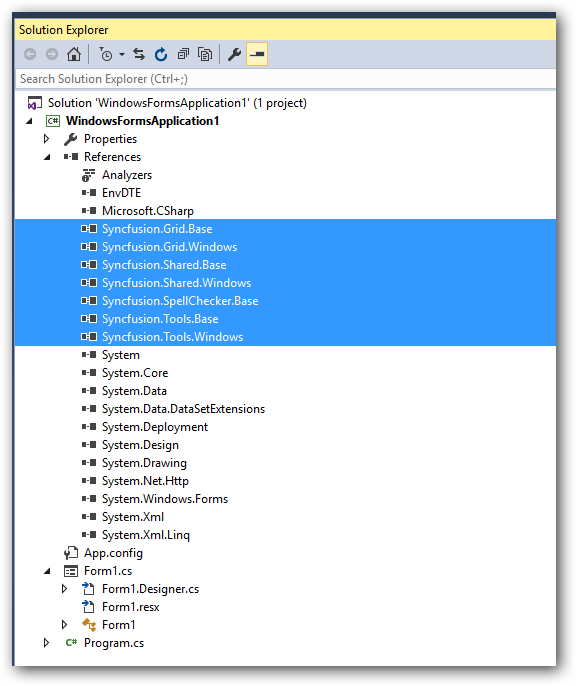
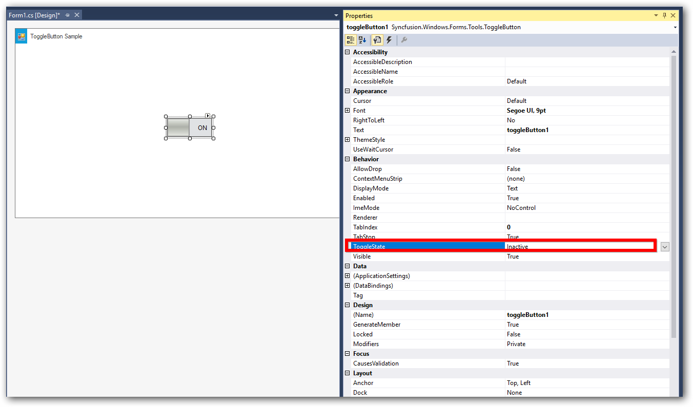
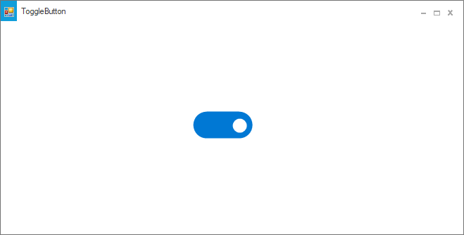
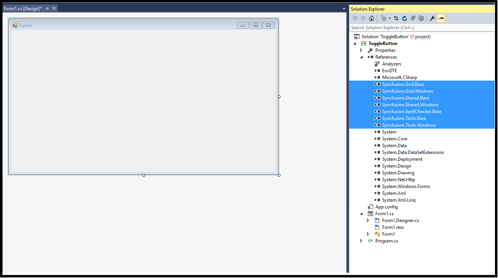

# Getting Started with Windows Forms Toggle Button

This section briefly describes how to create a new Windows Forms project in Visual Studio and add [ToggleButton](https://www.syncfusion.com/winforms-ui-controls/toggle-button) with it's basic functionalities.

## Assembly deployment

Refer to the [control dependencies](https://help.syncfusion.com/windowsforms/control-dependencies#togglebutton) section to get the list of assemblies or [NuGet package](https://help.syncfusion.com/windowsforms/visual-studio-integration/nuget-packages) details which needs to be added as reference to use the control in any application.

[Check here](https://help.syncfusion.com/windowsforms/visual-studio-integration/nuget-packages) to find more details on how to install nuget packages in Windows Forms application.

## Adding a WinForms ToggleButton control through designer

**Step 1**: Create a new Windows Forms application in Visual Studio. Drag and drop the ToggleButton from toolbox into form design view. The following dependent assemblies will be added automatically.

* Syncfusion.Grid.Base
* Syncfusion.Grid.Windows
* Syncfusion.Shared.Base
* Syncfusion.Shared.Windows
* Syncfusion.Tools.Base
* Syncfusion.Tools.Windows

**Step 2**: You can customize the properties of ToggleButton using the properties panel. Here we have illustrated an example on how to edit the ToggleState property of the ToggleButton as shown as follows.

**Step 3**:Run the application and the following output will be shown.

## Adding a WinForms ToggleButton control through code

**Step 1**: Create a new Windows Forms application in Visual Studio. Add the following required assembly references and namespace to the project.

* Syncfusion.Grid.Base
* Syncfusion.Grid.Windows
* Syncfusion.Shared.Base
* Syncfusion.Shared.Windows
* Syncfusion.Tools.Base
* Syncfusion.Tools.Windows




 
using Syncfusion.Windows.Forms.Tools;





Imports Syncfusion.Windows.Forms.Tools





   
**Step 2**:  In Form1.cs, create an instance of **"ToggleButton"** control and add in to the form. Also you can customize the ToggleButton properties using the following code.





 public Form1()
 {
            
            InitializeComponent();
            ToggleButton toggleButton = new ToggleButton();
            toggleButton.Location = new System.Drawing.Point(283, 178);
            toggleButton.Name = "toggleButton1";
            toggleButton.Size = new System.Drawing.Size(100, 40);
            toggleButton.ThemeName = "Office2019Colorful";
            this.Controls.Add(toggleButton);
}





Public Sub New()

    InitializeComponent()
    Dim toggleButton As ToggleButton = New ToggleButton()
    toggleButton.Location = New System.Drawing.Point(283, 178)
    toggleButton.Name = "toggleButton1"
    toggleButton.Size = New System.Drawing.Size(100, 40)
    toggleButton.ThemeName = "Office2019Colorful"
    Me.Controls.Add(toggleButton)

End Sub





**Step 3**: Run the application and the following output will be shown.

