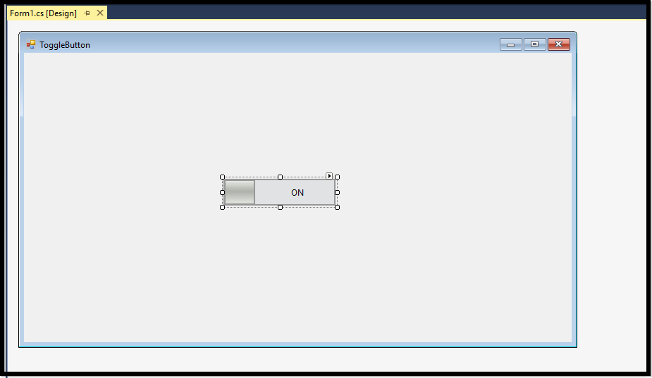
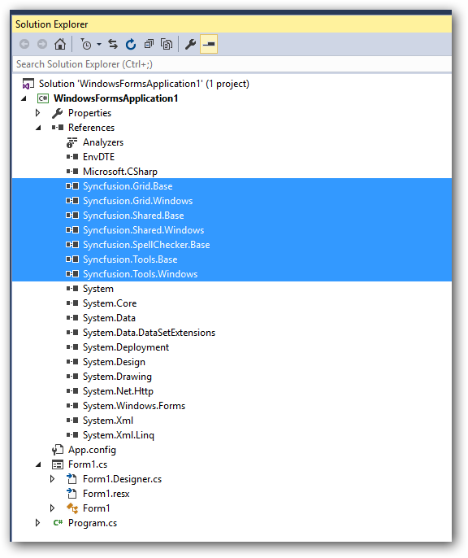
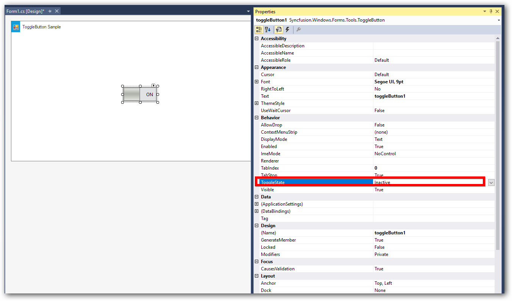
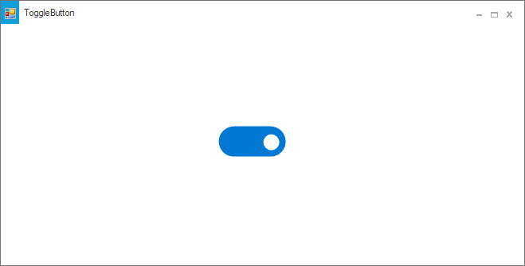
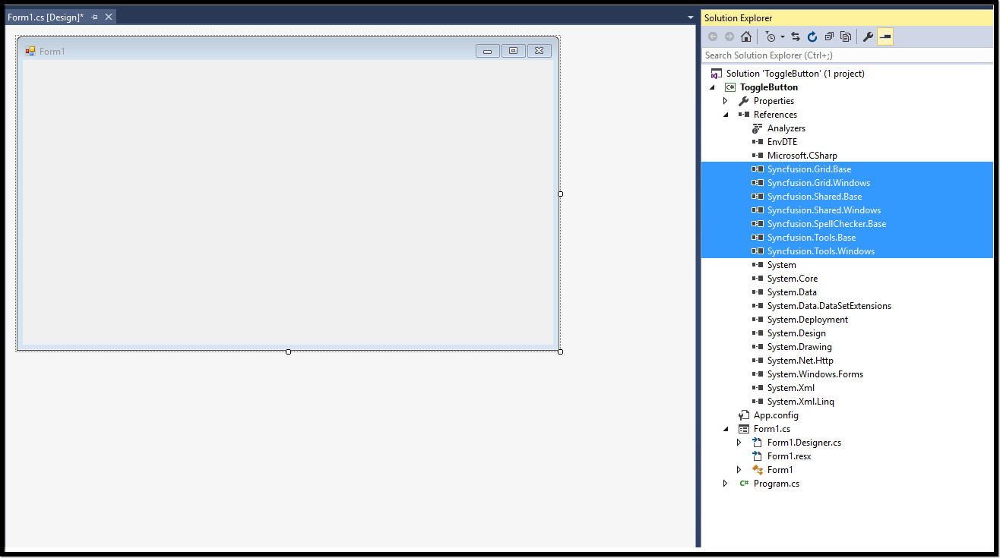

# Getting Started with WinForms Toggle Button

This section briefly describes how to create a new Windows Forms project in Visual Studio and add a [WinForms Toggle Button](https://www.syncfusion.com/winforms-ui-controls/toggle-button) with its basic functionalities.

## Assembly deployment

Refer to the [control dependencies](https://help.syncfusion.com/windowsforms/control-dependencies#togglebutton) section to get the list of assemblies or [NuGet package](https://help.syncfusion.com/windowsforms/installation/install-nuget-packages) details that need to be added as references to use the control in any application.

[Check here](https://help.syncfusion.com/windowsforms/installation/install-nuget-packages) to find more details on how to install NuGet packages in a Windows Forms application.

## Adding a WinForms Toggle Button control through designer

**Step 1**: Create a new Windows Forms application in Visual Studio. Drag and drop the WinForms Toggle Button from the toolbox into the form design view. The following dependent assemblies will be added automatically.

* Syncfusion.Grid.Base
* Syncfusion.Grid.Windows
* Syncfusion.Shared.Base
* Syncfusion.Shared.Windows
* Syncfusion.Tools.Base
* Syncfusion.Tools.Windows

**Step 2**: You can customize the properties of the WinForms Toggle Button using the Properties panel. The following illustrates how to edit the `ToggleState` property of the control.

**Step 3**: Run the application and the following output will be shown.

## Adding a WinForms Toggle Button control through code

**Step 1**: Create a new Windows Forms application in Visual Studio. Add the following required assembly references and namespace to the project.

* Syncfusion.Grid.Base
* Syncfusion.Grid.Windows
* Syncfusion.Shared.Base
* Syncfusion.Shared.Windows
* Syncfusion.Tools.Base
* Syncfusion.Tools.Windows





 
using Syncfusion.Windows.Forms.Tools;





Imports Syncfusion.Windows.Forms.Tools





{{ codesnippet1 | OrderList_Indent_Level_1 }}

**Step 2**: In `Form1.cs`, create an instance of the **WinForms Toggle Button** control and add it to the form. You can also customize the control properties using the following code.




 public Form1()
 {
            
            InitializeComponent();
            ToggleButton toggleButton = new ToggleButton();
            toggleButton.Location = new System.Drawing.Point(283, 178);
            toggleButton.Name = "toggleButton1";
            toggleButton.Size = new System.Drawing.Size(100, 40);
            toggleButton.ThemeName = "Office2019Colorful";
            this.Controls.Add(toggleButton);
}





Public Sub New()

    InitializeComponent()
    Dim toggleButton As ToggleButton = New ToggleButton()
    toggleButton.Location = New System.Drawing.Point(283, 178)
    toggleButton.Name = "toggleButton1"
    toggleButton.Size = New System.Drawing.Size(100, 40)
    toggleButton.ThemeName = "Office2019Colorful"
    Me.Controls.Add(toggleButton)

End Sub





**Step 3**: Run the application and the following output will be shown.

