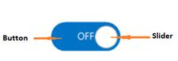

# Windows Forms Toggle Button Overview

Toggle Button control for Windows Forms allows you to toggle between two states (Active and Inactive) that are opposite to each other in terms of behavior.

## Key features

    .Configurable Toggle States- Two states with contrasting behavior are configured as required like IN/OUT, ON/OFF, etc. 

    .Display Mode- Supported to display either text or image over buttons to represent the states.

    .Custom Renderer- Allows the end-user to apply custom styles at application level.
