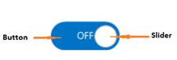

---
layout: post
title: About Syncfusion® Windows Forms ToggleButton Control | Syncfusion®
description: Learn about the introduction of Syncfusion Essential Studio Windows Forms ToggleButton control and more details.
platform: windowsforms
control: ToggleButton 
documentation: ug
---

# About Syncfusion® Windows Forms ToggleButton Control

Toggle Button control for Windows Forms allows you to toggle between two states (Active and Inactive) that are opposite to each other in terms of behavior.

## Key features

    .Configurable Toggle States- Two states with contrasting behavior are configured as required like IN/OUT, ON/OFF, etc. 

    .Display Mode- Supported to display either text or image over buttons to represent the states.

    .Custom Renderer- Allows the end-user to apply custom styles at application level.