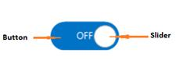

# About Syncfusion® WinForms Toggle Button Control

WinForms Toggle Button control for Windows Forms allows you to toggle between two states (Active and Inactive) that are opposite to each other in terms of behavior.

## Key features

* **Configurable toggle states** - Two states with contrasting behavior can be configured as required (e.g., IN/OUT, ON/OFF).

* **Display mode** - Supports displaying either text or an image over the button to represent the states.

* **Custom renderer** - Allows the end user to apply custom styles at the application level.