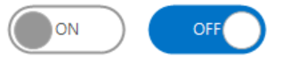
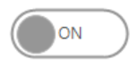
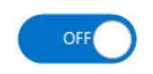

# Configure Toggle States in WinForms Toggle Button

WinForms Toggle Button is configured with two states (Active and Inactive) that contrast each other. Toggling can be handled at runtime either through a mouse click or through the space key.




this.toggleButton1.ToggleState = ToggleButtonState.Active; 

//ToggleButtonState.Inactive, for inactive state          





Me.ToggleButton1.ToggleState = ToggleButtonState.Active

'ToggleButtonState.Inactive , for inactive state




## Active state

In the WinForms Toggle Button, the active state is represented uniquely through its styling properties: `BackColor`, `BorderColor`, `ForeColor`, and `HoverColor`.




this.toggleButton1.ActiveState.Text = "ON";
this.toggleButton1.ActiveState.BackColor = Color.FromArgb(1, 115, 199);
this.toggleButton1.ActiveState.BorderColor = Color.FromArgb(1, 115, 199);
this.toggleButton1.ActiveState.ForeColor = Color.White;
this.toggleButton1.ActiveState.HoverColor = Color.FromArgb(0, 103, 176);   





Me.ToggleButton1.ActiveState.Text = "ON"
Me.toggleButton1.ActiveState.BackColor = Color.FromArgb(1, 115, 199)
Me.toggleButton1.ActiveState.BorderColor = Color.FromArgb(1, 115, 199)
Me.toggleButton1.ActiveState.ForeColor = Color.White
Me.toggleButton1.ActiveState.HoverColor = Color.FromArgb(0, 103, 176)




## Inactive state

Similar to the active state, the inactive state is represented uniquely through its styling properties: `BackColor`, `BorderColor`, `ForeColor`, and `HoverColor`.




this.toggleButton1.InactiveState.Text = "OFF";
this.toggleButton1.InactiveState.BackColor = Color.White;
this.toggleButton1.InactiveState.BorderColor = Color.FromArgb(150, 150, 150);
this.toggleButton1.InactiveState.ForeColor = Color.FromArgb(80, 80, 80);
this.toggleButton1.InactiveState.HoverColor = Color.White;     





Me.ToggleButton1.InactiveState.Text = "OFF"
Me.toggleButton1.InactiveState.BackColor = Color.White
Me.toggleButton1.InactiveState.BorderColor = Color.FromArgb(150, 150, 150)
Me.toggleButton1.InactiveState.ForeColor = Color.FromArgb(80, 80, 80)
Me.toggleButton1.InactiveState.HoverColor = Color.White




