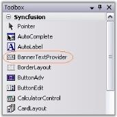

# Getting Started

Syncfusion introduces BannerTextProvider class which provides the ability to show banner text in the textbox. 

  

* BannerTextProvider component is available in the Toolbox under Syncfusion tab. 

  

* Drag the component onto the form. The control in the form, for ex, ComboBoxBarItem will get an extender provider property as in the image below. 

  

## Customizing the Banner Text

Extender properties which lets you customize the Banner text are as follows.

Table 5: Property Table

<table>
<tr>
<td>
Property</td><td>
Description</td></tr>
<tr>
<td>
Visible</td><td>
Indicates whether the banner text should be visible or not.</td></tr>
<tr>
<td>
Text</td><td>
Sets the banner text.</td></tr>
<tr>
<td>
Color</td><td>
Sets the banner text color.</td></tr>
<tr>
<td>
Font</td><td>
Sets the font style for the banner text.</td></tr>
<tr>
<td>
Mode</td><td>
Specifies the rendering mode of the banner text. The modes are,* {{ 'FocusMode' | markdownify }} - The banner text disappears when the control gets focus.* {{ 'EditMode' | markdownify }} - The banner text will only disappears when the control is in Edit Mode or the associated textbox is not empty.</td></tr>
</table>



this.bannerTextProvider1.SetBannerText(this.comboBoxBarItem1, new Syncfusion.Windows.Forms.BannerTextInfo("Enter Your Country", true, new System.Drawing.Font("Verdana", 8.25F, System.Drawing.FontStyle.Italic), System.Drawing.Color.RoyalBlue, Syncfusion.Windows.Forms.BannerTextMode.FocusMode));





Me.bannerTextProvider1.SetBannerText(Me.comboBoxBarItem1, New Syncfusion.Windows.Forms.BannerTextInfo("Enter Your Country", True, New System.Drawing.Font("Verdana", 8.25F, System.Drawing.FontStyle.Italic), System.Drawing.Color.RoyalBlue, Syncfusion.Windows.Forms.BannerTextMode.FocusMode)) 



 
  

> Note: BannerText feature can be made available for the below controls only.

* [TextBoxBarItem](http://help.syncfusion.com/ug/windows%20forms/Documents/textboxbaritem.htm) (XPMenus)
* [ComboBoxBarItem](http://help.syncfusion.com/ug/windows%20forms/Documents/comboboxbaritem.htm) (XPMenus)
* [TextBox](http://help.syncfusion.com/ug/windows%20forms/Documents/textbox3.htm) (ToolStripEx)
* [ComboBox](http://help.syncfusion.com/ug/windows%20forms/Documents/combobox2.htm) (ToolStripEx)
* [ComboBoxEx](http://help.syncfusion.com/ug/windows%20forms/Documents/comboboxex.htm) (ToolStripEx)
* [TextBoxExt](http://help.syncfusion.com/ug/windows%20forms/Documents/textboxext.htm) (Editor Control)
* [CurrencyTextBox](http://help.syncfusion.com/ug/windows%20forms/Documents/currencytextbox.htm)(Editor Control)
* [ComboBoxAdv](http://help.syncfusion.com/ug/windows%20forms/Documents/comboboxadv.htm)(Editor Control)
* [ComboDropDown](http://help.syncfusion.com/ug/windows%20forms/Documents/combodropdown.htm) (Editor Control)
* [ComboBoxAutoComplete](http://help.syncfusion.com/ug/windows%20forms/Documents/comboboxautocomplete.htm) (Editor Control)
* [Integer TextBox](http://help.syncfusion.com/ug/windows%20forms/Documents/integertextbox1.htm)(Editor Control)
* [Double TextBox](http://help.syncfusion.com/ug/windows%20forms/Documents/doubletextbox1.htm) (Editor Control)
* [Percent TextBox](http://help.syncfusion.com/ug/windows%20forms/Documents/percenttextbox1.htm)(Editor Control)
* Other Microsoft Editor Controls

