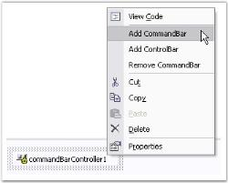
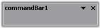
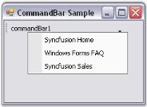
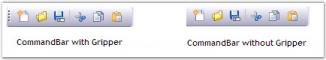
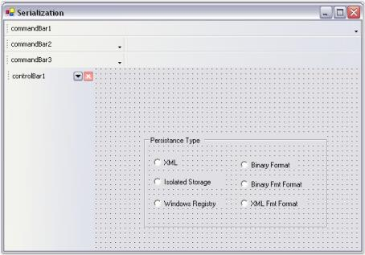

# CommandBars Package

The Essential Tools CommandBar implements a framework for creating and hosting ToolBars, ReBars and StatusBars similar to those that are found in the Visual Studio .NET and Office XP user interfaces.

The three main classes of the CommandBar framework are CommandBarController, CommandBar and ControlBar.

* The CommandBarController component serves as a form scope controller for the CommandBar and ControlBar hosted on a form and provides the required design time support and API for creating and working with the CommandBars and ControlBars.
* A CommandBar, similar to the Win32 / MFC ControlBars, is purely a container control that is responsible only for it's layout state.
* A ControlBar enables application developers to add dockable / floatable controls to their form's toolbar layout. A common example of a ControlBar is the task pane window found in the Microsoft Office 2003 product suite. Refer to the 'Detached ControlBars' topic under the Menus Package which has explained the ControlBar in detail.

> Note: The CommandBar framework should be used directly in an application only when there is no requirement for XP style menus and toolbars. Refer to the Essential Tools Menus Package for implementing XP style menus and toolbars.

ReBar controls act as containers for child controls. They contain one or more bands, and each band can have any combination of a gripper bar, a bitmap, a text label, and many more controls. ReBar control is also called as CoolBar. This control is not included in the .NET framework. It is available only in the VB 6.0 and MFC framework.

## Features

This section lists the features that are available in the CommandBar control.

Features

* CommandBar States

The CommandBar can be floated by setting the DisableFloating property to 'False'.

The CommandBar can be docked to the form by setting the DisableDocking property to 'False'.

The CommandBar can be docked to the Bottom, Left, Right and Top of the form using the AllowedDockBorders property of the CommandBar. The EnableDockBorders property of the CommandBarController must be set to 'True' for the above property to take effect.

* Button Settings

The CommandBar is usually displayed with the close button and dropdown button which can be enabled or disabled according to the needs of the user.

* Interactive Features

All toolbar icons that do not fit in the space available in the toolbar are displayed by the chevron provided by the CommandBar.

* Adding Popup Menu

Popup Menus can be easily associated with the CommandBar which can be displayed on clicking the dropdown button of the CommandBar or on right clicking the CommandBar control itself.

* Adding Custom Child Controls

CommandBars allows the user to add custom controls. Single or Multiple controls can be added onto the control.

* Appearance Settings

CommandBars allows you to create a professional, rich appearance and also enables to achieve the popular look and feel.

The back color of the CommandBar and CommandBarController can be changed. The font of the text displayed, length and height of the CommandBar can also be set as per the needs of the user.

The gripper that is provided enables floating / docking the CommandBar at run time.

* Behavior Settings

The Cursor property allows to set the cursor to be displayed when the mouse is moved over the control.

The CommandBar can be hidden by setting the Visible property to 'False'. It's contents can be aligned from right to left or vice versa using the RightToLeft property of the CommandBarController.

* Themes and Visual Styles

The appearance of the CommandBar control is enhanced by applying wide range of visual styles such as Office XP, Office 2003, VS 2005 and Office 2007. It also comes with the new Office 20007 themes in the blue, silver and black colors.

* Serialization

It allows the user to save and load the state of the CommandBar objects using different storage techniques.

See Also

## Concepts and Features

### Creating CommandBar

This section will give a step by step procedure to design a CommandBar control through designer, through programmatical approach and also through the XP Menus framework.

#### Through Designer

The CommandBar framework makes it an effortless process to add, remove and design the CommandBars in an application. With the WYSIWYG designer that it provides, all that is involved in setting up the CommandBar layout is to drag and drop the various CommandBars to the target location. The layout state is then serialized by the designer along with the form's resources and is used when the form is loaded at run time.

The following steps are involved in creating and setting up a simple CommandBar layout.

* Drag the CommandBarController component from the toolbox onto the form. The CommandBarController will be created in the components area of the form.

To add a CommandBar using the properties window, follow the procedure given below.

* In the properties window, select the CommandBars property. The CommandBar Collection Editor will be opened. Click Add, a CommandBar will be added to the form.

The CommandBars can also be added or removed using the Add CommandBar design time verb or smart tag that is found in the property grid.

New CommandBars will be initially docked to the top border of the form. The commandbars can then be dragged, redocked or floated to the desired location.

See Also

Through Code, Through XP Menus Framework

#### Through Code

In addition to using the designer for designing the CommandBar layout, it is also feasible to use the CommandBar's programmatic API for creating and setting up the application's CommandBars.

The following section covers the steps involved in creating, initializing and setting up CommandBars in a Windows Forms application programmatically.

1. Include the required namespace.

   

   using Syncfusion.Windows.Forms.Tools;
   
   

   

   Imports Syncfusion.Windows.Forms.Tools

   
   
2. Create instances of the Essential Tools CommandBarController class and CommandBar control within the application's main form.
3. Call the CommandBarController's BeginInit method to signal the start of initialization.

   ~~~ cs

		private Syncfusion.Windows.Forms.Tools.CommandBarController commandBarController1;

		private Syncfusion.Windows.Forms.Tools.CommandBar commandBar1;

		private System.Windows.Forms.Panel panel1;

		this.commandBarController1 = new Syncfusion.Windows.Forms.Tools.CommandBarController();

		((System.ComponentModel.ISupportInitialize)(this.commandBarController1)).BeginInit();

		this.commandBar1 = new Syncfusion.Windows.Forms.Tools.CommandBar();

		this.panel1 = new System.Windows.Forms.Panel();

   ~~~
   {:.prettyprint }

   ~~~ vbnet
   
		Private commandBarController1 As Syncfusion.Windows.Forms.Tools.CommandBarController

		Private commandBar1 As Syncfusion.Windows.Forms.Tools.CommandBar

		Private panel1 As System.Windows.Forms.Panel

		Me.commandBarController1 = New Syncfusion.Windows.Forms.Tools.CommandBarController()

		CType(Me.commandBarController1, System.ComponentModel.ISupportInitialize).BeginInit()

		Me.commandBar1 = New Syncfusion.Windows.Forms.Tools.CommandBar()

		Me.panel1 = New System.Windows.Forms.Panel()

   ~~~
   {:.prettyprint }

4. Set the form to be the host for all the CommandBars using the CommandBarController's HostForm property.

   ~~~ cs

		// Set the CommandBarController.HostForm property.

		this.commandBarController1.HostForm = this;

   ~~~
   {:.prettyprint }

   ~~~ vbnet
   
		' Set the CommandBarController.HostForm property.

		Me.commandBarController1.HostForm = Me

   ~~~
   {:.prettyprint }

5. Assign a client control to the CommandBar by adding it to the CommandBar's Controls collection property.

   ~~~ cs

		// Add the panel control containing the toolbar to the CommandBar.

		this.commandBar1.Controls.AddRange(new System.Windows.Forms.Control[] {this.panel1});

   ~~~
   {:.prettyprint }

   ~~~ vbnet

		' Add the panel control containing the toolbar to the CommandBar.

		Me.commandBar1.Controls.AddRange(New System.Windows.Forms.Control() {Me.panel1})

   ~~~
   {:.prettyprint }

6. Add the CommandBar to the CommandBarController through the CommandBarController's CommandBars collectionproperty.

   ~~~ cs

		this.commandBarController1.CommandBars.Add(this.commandBar1);

		// Set the text for the CommandBar.

		this.commandBar1.Text = "commandBar1";

   ~~~
   {:.prettyprint }

   ~~~ vbnet

		Me.commandBarController1.CommandBars.Add(Me.commandBar1)

		' Set the text for the CommandBar.

		Me.commandBar1.Text = "commandBar1"

   ~~~
   {:.prettyprint }

7. Call the CommandBarController's EndInit method to signal the end of initialization.

   ~~~ cs

		((System.ComponentModel.ISupportInitialize)(this.commandBarController1)).EndInit();

   ~~~
   {:.prettyprint }

   ~~~ vbnet

		CType(Me.commandBarController1, System.ComponentModel.ISupportInitialize).EndInit()

   ~~~
   {:.prettyprint }

8. Run the application.

See Also

## Through Designer, Through XP Menus Framework

### Through XP Menus Framework

The XP Menus framework provides the flexibility to add detached toolbars that can host any .NET control. These toolbars are detached from the framework, i.e., they cannot participate in user customization. Otherwise, they are seamless in look and feel.

1. Right click on the MainFrameBarManager component and choose the Add Detached CommandBar option to add a detached toolbar.
2. Add that control by dragging and dropping to any .NET control. If you need to host multiple controls, you will need to first add a panel to the CommandBar and then add the controls to this panel.



// Declare the controls.

private Syncfusion.Windows.Forms.Tools.XPMenus.MainFrameBarManager mainFrameBarManager2;

private Syncfusion.Windows.Forms.Tools.CommandBar commandBar2;

// Initialize the controls.

this.mainFrameBarManager2 = new Syncfusion.Windows.Forms.Tools.XPMenus.MainFrameBarManager(this);

this.commandBar2 = new Syncfusion.Windows.Forms.Tools.CommandBar();

// Set the properties.

this.mainFrameBarManager2.DetachedCommandBars.Add(this.commandBar2);

this.mainFrameBarManager2.Form = this;

this.commandBar1.Text = "commandBar1";





' Declare the controls.

Private mainFrameBarManager2 As Syncfusion.Windows.Forms.Tools.XPMenus.MainFrameBarManager

Private commandBar2 As Syncfusion.Windows.Forms.Tools.CommandBar

' Initialize the controls.

Me.mainFrameBarManager2 = New Syncfusion.Windows.Forms.Tools.XPMenus.MainFrameBarManager(Me)

Me.commandBar2 = New Syncfusion.Windows.Forms.Tools.CommandBar()

' Set the properties.

Me.mainFrameBarManager2.DetachedCommandBars.Add(Me.commandBar2)

Me.mainFrameBarManager2.Form = Me

Me.commandBar1.Text = "commandBar1"



	

See Also

Through Designer, Through Code

## Concepts and Features

This section explains the concepts and features of the ProgressBarAdvcontrol which will help to understand the control better. 

The following are the features discussed.

### CommandBar States

The CommandBar control of the CommandBarController can be floated or docked to the form as per the requirements of the user.

These two states of the CommandBar are explained in detail in the following topics.

See Also

Serialization

### Floating CommandBar

By default, CommandBars can be floated on the form by dragging the gripper on the CommandBar. The properties that enable floating of CommandBars and customization of their settings are discussed below.

_Table_ _7_: CommandBar Property Table

<table>
<tr>
<td>
CommandBar Property</td><td>
Description</td></tr>
<tr>
<td>
DisableFloating</td><td>
Indicates whether the CommandBar is allowed to float.</td></tr>
<tr>
<td>
FloatModeWrapping</td><td>
Indicates whether the CommandBar should wrap when floating.</td></tr>
<tr>
<td>
FloatBounds</td><td>
Gets / sets the bounds of a floating CommandBar.</td></tr>
<tr>
<td>
Floating</td><td>
Returns the current dock / float state of the CommandBar.</td></tr>
</table>

The float state of the CommandBar can be disabled by setting the DisableFloating property to 'True'. 

Setting FloatModeWrapping property to 'True', wraps a floating CommandBar when it is resized to less than it's maximum length. The DisableFloating property must be set to 'False' for this.



this.commandBar1.DisableFloating = false;

this.commandBar1.FloatModeWrapping = true;

this.commandBar1.FloatBounds = new System.Drawing.Rectangle(419, 303, 183, 47);





Me.commandBar1.DisableFloating = False

Me.commandBar1.FloatModeWrapping = True

Me.commandBar1.FloatBounds = New System.Drawing.Rectangle(419, 303, 183, 47)



A sample which demonstrates the Floating CommandBar is available in the below sample installation path.

…\_My Documents\Syncfusion\EssentialStudio\Version Number\Windows\Tools.Windows\Samples\Advanced Editor Functions\ActionGroupingDemo_

See Also

Docking CommandBar

### Docking CommandBar

CommandBar can be docked to all the edges of the form such as Top, Bottom, Right and Left. Docking can be controlled by the CommandBar and CommandBarController properties.

_Table_ _8_: Docking CommandBar

<table>
<tr>
<td>
CommandBar Property</td><td>
Description</td></tr>
<tr>
<td>
AllowedDockBorders</td><td>
Gets / sets the edges of the form along which the CommandBar may be docked. The options included are given below.Bottom,Left,Right,Top andNone.When set to 'None', the CommandBar cannot be docked to the form.</td></tr>
<tr>
<td>
AlwaysLeadingEdge</td><td>
Indicates whether the CommandBar is always docked to the leading edge.</td></tr>
<tr>
<td>
AlwaysTrailingEdge</td><td>
Indicates whether the CommandBar is always docked to the trailing edge.</td></tr>
<tr>
<td>
DisableDocking</td><td>
Indicates whether the CommandBar is allowed to dock.</td></tr>
<tr>
<td>
DockModeWrapping</td><td>
Wraps the CommandBar when the bounds are less than the maximum length. </td></tr>
<tr>
<td>
DockState</td><td>
Gets / sets the current dock or float state for the CommandBar.</td></tr>
<tr>
<td>
ShowDockModeText</td><td>
Indicates whether the text caption should be displayed on a docked CommandBar.</td></tr>
</table>

> Note: The DisableDocking property must be set to 'False' for the above settings to take effect.

The docked state of the CommandBar can be disabled by setting the DisableDocking property to 'True'.

EnabledDockBorders

This CommandBarController property allows you to dock the CommandBar to the edges of the form. The AllowedDockBorders property doesn't take any effect when this property is set to 'None'.

_Table_ _9_: CommandBarController

<table>
<tr>
<td>
CommandBarController Property</td><td>
Description</td></tr>
<tr>
<td>
EnabledDockBorders</td><td>
Gets / sets the edges of the form along which the CommandBars are allowed to dock. The options included are given below.Bottom,Left,Right,Top andNone.</td></tr>
</table>



this.commandBar1.AllowedDockBorders = ((Syncfusion.Windows.Forms.Tools.CommandBarDockBorder)(((Syncfusion.Windows.Forms.Tools.CommandBarDockBorder.Top | Syncfusion.Windows.Forms.Tools.CommandBarDockBorder.Bottom) | Syncfusion.Windows.Forms.Tools.CommandBarDockBorder.Left)));

this.commandBar1.AlwaysLeadingEdge = true;

this.commandBar1.AlwaysTrailingEdge = true;

this.commandBar1.DisableDocking = true;

this.commandBar1.ShowDockModeText = false;

this.commandBar1.DockState = Syncfusion.Windows.Forms.Tools.CommandBarDockState.Top;

this.commandBar1.DockModeWrapping = true;

this.commandBarController1.EnabledDockBorders = ((Syncfusion.Windows.Forms.Tools.CommandBarDockBorder)(((Syncfusion.Windows.Forms.Tools.CommandBarDockBorder.Bottom | Syncfusion.Windows.Forms.Tools.CommandBarDockBorder.Left) | Syncfusion.Windows.Forms.Tools.CommandBarDockBorder.Right)));





Me.commandBar1.AllowedDockBorders = (CType(((Syncfusion.Windows.Forms.Tools.CommandBarDockBorder.Top Or Syncfusion.Windows.Forms.Tools.CommandBarDockBorder.Bottom) Or Syncfusion.Windows.Forms.Tools.CommandBarDockBorder.Left), Syncfusion.Windows.Forms.Tools.CommandBarDockBorder))

Me.commandBar1.AlwaysLeadingEdge=True

Me.commandBar1.AlwaysTrailingEdge = True

Me.commandBar1.DisableDocking=True

Me.commandBar1.ShowDockModeText = False

Me.commandBar1.DockState = Syncfusion.Windows.Forms.Tools.CommandBarDockState.Top

Me.commandBar1.DockModeWrapping = True

Me.commandBarController1.EnabledDockBorders = (CType(((Syncfusion.Windows.Forms.Tools.CommandBarDockBorder.Bottom Or Syncfusion.Windows.Forms.Tools.CommandBarDockBorder.Left) Or Syncfusion.Windows.Forms.Tools.CommandBarDockBorder.Right), Syncfusion.Windows.Forms.Tools.CommandBarDockBorder))



The following figure illustrates the above settings.

Procedure

The following step by step procedure helps you to dock the CommandBar to the target location.

1. Drag the CommandBarController onto the form and add a CommandBar through the design time verb.

   

2. Drag buttons onto the form and arrange the buttons as shown as below.

   

3. Specify the docking state of the CommandBar in the button click event using the following code snippet.



private void button1_Click(object sender, System.EventArgs e)

{

Button btn = sender as Button; 

// Dock to the Top

if (btn == this.top)

this.commandBar1.DockState = CommandBarDockState.Top;

// Dock to the Bottom

if (btn == this.bottom)

this.commandBar1.DockState = CommandBarDockState.Bottom;

// Dock to the Right

if (btn == this.right)

this.commandBar1.DockState = CommandBarDockState.Right;

// Dock to the Left

if (btn == this.left)

this.commandBar1.DockState = CommandBarDockState.Left;

// Dock as Floating

if (btn == this.float_btn)

this.commandBar1.DockState = CommandBarDockState.Float;

}





Private Sub button1_Click(ByVal sender As Object, ByVal e As System.EventArgs) Handles top.Click, right.Click, left.Click, bottom.Click, float_btn.Click

Dim btn As Button = sender '

' Dock to the Top

If btn Is Me.top Then

Me.commandBar1.DockState = CommandBarDockState.Top

End If

'Dock to the Bottom

If btn Is Me.bottom Then

Me.commandBar1.DockState = CommandBarDockState.Bottom

End If

'Dock to the Right

If btn Is Me.right Then

Me.commandBar1.DockState = CommandBarDockState.Right

End If

'Dock to the Left

If btn Is Me.left Then

Me.commandBar1.DockState = CommandBarDockState.Left

End If

Dock as Floating

If btn Is Me.float_btn Then

Me.commandBar1.DockState = CommandBarDockState.Float

End If

End Sub



Output

The following figure shows the CommandBar docked to the right border of the Form.

A sample which demonstrates the Docked CommandBar is available in the below sample installation path.

…\_My Documents\Syncfusion\EssentialStudio\Version Number\Windows\Tools.Windows\Samples\Advanced Editor Functions\ActionGroupingDemo_

See Also

## Floating CommandBar

### Button Settings

The buttons settings of the CommandBar control are given below.

Close and DropDown Button

The close button of CommandBar gets displayed when it is in the float state whereas the dropdown button gets displayed both in the dock and float state.

_Table_ _10_: Button Settings

<table>
<tr>
<td>
CommandBar Property</td><td>
Description</td></tr>
<tr>
<td>
HideCloseButton</td><td>
Determines whether the CommandBar will have a close button when floating.</td></tr>
<tr>
<td>
HideDropDownButton</td><td>
Draws the CommandBar with / without the dropdown button.</td></tr>
</table>

> Note: Popup Menu can be displayed from the dropdown button of the CommandBar. Refer Popup Menu topic.



this.commandBar1.HideCloseButton=true;

this.commandBar1.HideDropDownButton=true;





Me.commandBar1.HideCloseButton=True

Me.commandBar1.HideDropDownButton=True



The methods associated with the above properties is given below.

_Table_ _11_: Button Settings - Methods

<table>
<tr>
<td>
Methods</td><td>
Description</td></tr>
<tr>
<td>
GetCloseButtonState</td><td>
Gets visual state for the close button of the floating CommandBar.</td></tr>
<tr>
<td>
GetDropDownState</td><td>
Gets visual state for the dropdown button of the CommandBar.</td></tr>
</table>

A sample which demonstrates the DropDown Button settings of the CommandBar control is available in the below sample installation path.

…\_My Documents\Syncfusion\EssentialStudio\Version Number\Windows\Tools.Windows\Samples\Advanced Editor Functions\ActionGroupingDemo_

### Interactive Features

This section discusses the interactive features available in the CommandBar control.

Chevron

The term "chevron" is used for a menu that contains the toolbar icons that do not fit in the space available on the toolbar.

_Table_ _12_: Chevron

<table>
<tr>
<td>
CommandBar Property</td><td>
Description</td></tr>
<tr>
<td>
ChevronColor</td><td>
Gets / sets the color of the chevron.</td></tr>
<tr>
<td>
HideChevron</td><td>
Indicates whether the CommandBar should be drawn without a chevron.</td></tr>
<tr>
<td>
IsChevronVisible</td><td>
Indicates whether the chevron is currently visible.</td></tr>
</table>



this.commandBar1.ChevronColor = System.Drawing.Color.Black;

this.commandBar1.HideChevron = false;

this.CommandBar1.IsChevronVisible = true





Me.commandBar1.ChevronColor = System.Drawing.Color.Black

Me.commandBar1.HideChevron = False

Me.CommandBar1.IsChevronVisible = True



The following screen shot displays the chevron in the CommandBar.

> Note: The chevron will be visible only when the toolbar icons do not fit in the space available in the toolbar. Normally it will not be displayed.

A sample which demonstrates the Chevron settings of the CommandBar control is available in the below sample installation path.

…\_My Documents\Syncfusion\EssentialStudio\Version Number\Windows\Tools.Windows\Samples\Advanced Editor Functions\ActionGroupingDemo_

### Popup Menu

The .NET Context Menu cannot be added to the CommandBars created by the CommandBarController. This is substituted by the Syncfusion Popup Menu in the CommandBars.

There are two ways of associating Popup Menus with the CommandBar.

They are discussed in the following topics.

#### Popup Menu on Clicking the DropDown Button

To display the popup menu on the dropdown button of the CommandBar, follow the steps given below.

1. Drag and drop the CommandBarController onto the form, then add a CommandBar to the form by right clicking on CommandBarController.
2. Add client controls to the CommandBar by just dragging and dropping the controls from the toolbox.
3. Add the Syncfusion PopupMenu control to the form.
4. Add Items to the PopupMenu control. This can be done as follows.
5. Add a ParentBarItem to the PopupMenu control through the Add Default ParentBarItem design time verb.

   

6. In the properties window, select the Items property. The BarItem Collection Editor will be opened. Click Add, to add the required number of Items.

   

7. Associate the PopupMenu control with the CommandBar using the PopupMenu property of the CommandBar.

This can be done through code as follows.



private Syncfusion.Windows.Forms.Tools.CommandBarController commandBarController1;

private Syncfusion.Windows.Forms.Tools.CommandBar commandBar1;

private Syncfusion.Windows.Forms.Tools.XPMenus.PopupMenu popupMenu1;

private Syncfusion.Windows.Forms.Tools.XPMenus.ParentBarItem parentBarItem1;

private Syncfusion.Windows.Forms.Tools.XPMenus.BarItem barItem1;

private Syncfusion.Windows.Forms.Tools.XPMenus.BarItem barItem2;

private Syncfusion.Windows.Forms.Tools.XPMenus.BarItem barItem3;

this.commandBarController1 = new Syncfusion.Windows.Forms.Tools.CommandBarController(this.components);

this.commandBar1 = new Syncfusion.Windows.Forms.Tools.CommandBar();

this.popupMenu1 = new Syncfusion.Windows.Forms.Tools.XPMenus.PopupMenu(this.components);

this.parentBarItem1 = new Syncfusion.Windows.Forms.Tools.XPMenus.ParentBarItem();

this.barItem1 = new Syncfusion.Windows.Forms.Tools.XPMenus.BarItem();

this.barItem2 = new Syncfusion.Windows.Forms.Tools.XPMenus.BarItem();

this.barItem3 = new Syncfusion.Windows.Forms.Tools.XPMenus.BarItem();

// commandBarController1

this.commandBarController1.CommandBars.Add(this.commandBar1);

this.commandBarController1.HostForm = this;

 // commandBar1

this.commandBar1.Text = "commandBar1";

this.commandBar1.PopupMenu = this.popupMenu1;

// popupMenu1

this.popupMenu1.ParentBarItem = this.parentBarItem1;

// parentBarItem1

this.parentBarItem1.Items.AddRange(new Syncfusion.Windows.Forms.Tools.XPMenus.BarItem[] {

this.barItem1,

this.barItem2,

this.barItem3});

this.parentBarItem1.Style = Syncfusion.Windows.Forms.VisualStyle.OfficeXP;

// barItem1

this.barItem1.Text = "Syncfusion Home";

// barItem2

this.barItem2.Text = "Windows Forms FAQ";

// barItem3

this.barItem3.Text = "Syncfusion Sales";





Private commandBarController1 As Syncfusion.Windows.Forms.Tools.CommandBarController

Private commandBar1 As Syncfusion.Windows.Forms.Tools.CommandBar

Private popupMenu1 As Syncfusion.Windows.Forms.Tools.XPMenus.PopupMenu

Private parentBarItem1 As Syncfusion.Windows.Forms.Tools.XPMenus.ParentBarItem

Private barItem1 As Syncfusion.Windows.Forms.Tools.XPMenus.BarItem

Private barItem2 As Syncfusion.Windows.Forms.Tools.XPMenus.BarItem

Private barItem3 As Syncfusion.Windows.Forms.Tools.XPMenus.BarItem

Me.CommandBarController1 = New Syncfusion.Windows.Forms.Tools.CommandBarController(Me.components)

Me.commandBar1 = New Syncfusion.Windows.Forms.Tools.CommandBar()

Me.popupMenu1 = New Syncfusion.Windows.Forms.Tools.XPMenus.PopupMenu(Me.components)

Me.parentBarItem1 = New Syncfusion.Windows.Forms.Tools.XPMenus.ParentBarItem()

Me.barItem1 = New Syncfusion.Windows.Forms.Tools.XPMenus.BarItem()

Me.barItem2 = New Syncfusion.Windows.Forms.Tools.XPMenus.BarItem()

Me.barItem3 = New Syncfusion.Windows.Forms.Tools.XPMenus.BarItem()

' commandBarController1 

Me.CommandBarController1.CommandBars.Add(Me.commandBar1)

Me.CommandBarController1.HostForm = Me

' commandBar1 

Me.commandBar1.Text = "commandBar1"

Me.commandBar1.PopupMenu = Me.popupMenu1

' popupMenu1 

Me.popupMenu1.ParentBarItem = Me.parentBarItem1

' parentBarItem1 

Me.parentBarItem1.Items.AddRange(New Syncfusion.Windows.Forms.Tools.XPMenus.BarItem() {Me.barItem1, Me.barItem2, Me.barItem3})

Me.parentBarItem1.Style = Syncfusion.Windows.Forms.VisualStyle.OfficeXP

' barItem1 

Me.barItem1.Text = "Syncfusion Home"

' barItem2 

Me.barItem2.Text = "Windows Forms FAQ"

' barItem3 

Me.barItem3.Text = "Syncfusion Sales"



See Also

Popup Menu on Right Clicking the CommandBar

#### Popup Menu on Right Clicking the CommandBar

To show the Popup Menu on right-clicking on the CommandBar, follow the steps given below.

* Drag the CommandBarController onto the form, then add a CommandBar to the form by right clicking on CommandBarController.
* Add a PopupMenusManager along with the PopupMenu component. This will add an extended property on the CommandBar properties window as XPContextMenu on popupMenusManager. You can set the required Popup Menu from the dropdown list.

This can be done through code as follows.



private Syncfusion.Windows.Forms.Tools.CommandBarController commandBarController1;

private Syncfusion.Windows.Forms.Tools.CommandBar commandBar1;

private Syncfusion.Windows.Forms.Tools.XPMenus.PopupMenu popupMenu1;

private Syncfusion.Windows.Forms.Tools.XPMenus.ParentBarItem parentBarItem1;

private Syncfusion.Windows.Forms.Tools.XPMenus.BarItem barItem1;

private Syncfusion.Windows.Forms.Tools.XPMenus.BarItem barItem2;

private Syncfusion.Windows.Forms.Tools.XPMenus.BarItem barItem3;

private Syncfusion.Windows.Forms.Tools.XPMenus.PopupMenusManager popupMenusManager1;

this.commandBarController1 = new Syncfusion.Windows.Forms.Tools.CommandBarController(this.components);

this.commandBar1 = new Syncfusion.Windows.Forms.Tools.CommandBar();

this.popupMenu1 = new Syncfusion.Windows.Forms.Tools.XPMenus.PopupMenu(this.components);

this.parentBarItem1 = new Syncfusion.Windows.Forms.Tools.XPMenus.ParentBarItem();

this.barItem1 = new Syncfusion.Windows.Forms.Tools.XPMenus.BarItem();

this.barItem2 = new Syncfusion.Windows.Forms.Tools.XPMenus.BarItem();

this.barItem3 = new Syncfusion.Windows.Forms.Tools.XPMenus.BarItem();

this.popupMenusManager1.SetXPContextMenu(this.commandBar1, this.popupMenu1);

// commandBarController1

this.commandBarController1.CommandBars.Add(this.commandBar1);

this.commandBarController1.HostForm = this;

 // commandBar1

this.commandBar1.Text = "commandBar1";

this.commandBar1.PopupMenu = this.popupMenu1;

this.popupMenusManager1 = new Syncfusion.Windows.Forms.Tools.XPMenus.PopupMenusManager(this.components);

// popupMenu1

this.popupMenu1.ParentBarItem = this.parentBarItem1;

// parentBarItem1

this.parentBarItem1.Items.AddRange(new Syncfusion.Windows.Forms.Tools.XPMenus.BarItem[] {

this.barItem1,

this.barItem2,

this.barItem3});

this.parentBarItem1.Style = Syncfusion.Windows.Forms.VisualStyle.OfficeXP;

// barItem1

this.barItem1.Text = "Syncfusion Home";

// barItem2

this.barItem2.Text = "Windows Forms FAQ";

// barItem3

this.barItem3.Text = "Syncfusion Sales";





Private commandBarController1 As Syncfusion.Windows.Forms.Tools.CommandBarController

Private commandBar1 As Syncfusion.Windows.Forms.Tools.CommandBar

Private popupMenu1 As Syncfusion.Windows.Forms.Tools.XPMenus.PopupMenu

Private parentBarItem1 As Syncfusion.Windows.Forms.Tools.XPMenus.ParentBarItem

Private barItem1 As Syncfusion.Windows.Forms.Tools.XPMenus.BarItem

Private barItem2 As Syncfusion.Windows.Forms.Tools.XPMenus.BarItem

Private barItem3 As Syncfusion.Windows.Forms.Tools.XPMenus.BarItem

Private popupMenusManager1 As Syncfusion.Windows.Forms.Tools.XPMenus.PopupMenusManager

Me.CommandBarController1 = New Syncfusion.Windows.Forms.Tools.CommandBarController(Me.components)

Me.commandBar1 = New Syncfusion.Windows.Forms.Tools.CommandBar()

Me.popupMenu1 = New Syncfusion.Windows.Forms.Tools.XPMenus.PopupMenu(Me.components)

Me.parentBarItem1 = New Syncfusion.Windows.Forms.Tools.XPMenus.ParentBarItem()

Me.barItem1 = New Syncfusion.Windows.Forms.Tools.XPMenus.BarItem()

Me.barItem2 = New Syncfusion.Windows.Forms.Tools.XPMenus.BarItem()

Me.barItem3 = New Syncfusion.Windows.Forms.Tools.XPMenus.BarItem()

Me.popupMenusManager1 = New Syncfusion.Windows.Forms.Tools.XPMenus.PopupMenusManager(Me.components)

' commandBarController1 

Me.CommandBarController1.CommandBars.Add(Me.commandBar1)

Me.CommandBarController1.HostForm = Me

' commandBar1 

Me.commandBar1.Text = "commandBar1"

Me.commandBar1.PopupMenu = Me.popupMenu1

Me.popupMenusManager1.SetXPContextMenu(Me.commandBar1, Me.popupMenu1)

' popupMenu1 

Me.popupMenu1.ParentBarItem = Me.parentBarItem1

' parentBarItem1 

Me.parentBarItem1.Items.AddRange(New Syncfusion.Windows.Forms.Tools.XPMenus.BarItem() {Me.barItem1, Me.barItem2, Me.barItem3})

Me.parentBarItem1.Style = Syncfusion.Windows.Forms.VisualStyle.OfficeXP

' barItem1 

Me.barItem1.Text = "Syncfusion Home"

' barItem2 

Me.barItem2.Text = "Windows Forms FAQ"

' barItem3 

Me.barItem3.Text = "Syncfusion Sales"



See Also

Popup Menu on Clicking the DropDown Button

### Hosting Child Controls

Child controls can be easily hosted by the CommandBar through designer as well as through code. This can be done by selecting the client controls from the toolbox and dropping it onto the particular CommandBar. The control will be resized to fit the CommandBar's client bounds. 

A CommandBar can host a single control / multiple controls. This can be done as follows.

Single Control

You can drag-and-drop the single client control onto the CommandBar.

Multiple Controls

To accommodate multiple controls, place the controls within a Panel control and set it to be the CommandBar's client.



this.commandBar1.Controls.Add(this.panel1);





Me.commandBar1.Controls.Add(Me.panel1)



The method associated with the above property is given below.

_Table_ _13_: Method Table

<table>
<tr>
<td>
Method</td><td>
Description</td></tr>
<tr>
<td>
CalcChildControlBounds</td><td>
Calculates the client control bounds for the specified CommandBar size and dock position.</td></tr>
</table>

### Appearance Settings

The appearance settings that play a vital role in enhancing the appearance of the CommandBar control are listed below.

#### Background Settings

The background settings of the CommandBar control are discussed below.

BackColor

CommandBarController

The back color of the CommandBarController can be set using the property given below.

_Table_ _14_: CommandBarController Property Table

<table>
<tr>
<td>
CommandBarController Property</td><td>
Description</td></tr>
<tr>
<td>
BackColor</td><td>
The background color used to draw the host form's dockable regions.</td></tr>
</table>



this.commandBarController1.BackColor = System.Drawing.Color.RosyBrown;





Me.CommandBarController1.BackColor = System.Drawing.Color.RosyBrown



CommandBar

The back color of the CommandBar can be set using the property given below.

_Table_ _15_: CommandBar Property Table

<table>
<tr>
<td>
CommandBar Property</td><td>
Description</td></tr>
<tr>
<td>
BackColor</td><td>
The background color used to draw the component.</td></tr>
</table>



this.commandBar1.BackColor = System.Drawing.Color.Wheat;





Me.commandBar1.BackColor = System.Drawing.Color.Wheat



> Note: The ResetBackColor() method of the CommandBarController can be used to reset it's BackColor property to the default value. Similarly, the ResetBackColor() method of the CommandBar can be used to reset it's BackColor property to the default value.

#### Foreground Settings

The foreground settings of the CommandBar control are discussed below.

Gripper

The gripper plays a major role in the CommandBar package. It allows the user to dock / float the CommandBar at runtime.

_Table_ _16_: CommandBar Property Table

<table>
<tr>
<td>
CommandBar Property</td><td>
Description</td></tr>
<tr>
<td>
HideGripper</td><td>
Draws the CommandBar with / without the drag gripper.</td></tr>
</table>



this.commandBar1.HideGripper=true;





Me.commandBar1.HideGripper=True



Font

The font of the text displayed in the CommandBar can be customized using the property given below.

_Table_ _17_: CommandBar Property Table_

<table>
<tr>
<td>
CommandBar Property</td><td>
Description</td></tr>
<tr>
<td>
Font</td><td>
The font used to display text in the control.</td></tr>
</table>



this.commandBar3.Font = new System.Drawing.Font("Comic Sans MS", 8.25F, System.Drawing.FontStyle.Regular, System.Drawing.GraphicsUnit.Point, ((byte)(0)));





Me.commandBar3.Font = New System.Drawing.Font("Comic Sans MS", 8.25F, System.Drawing.FontStyle.Regular, System.Drawing.GraphicsUnit.Point, CByte((0)))



> Note: The ResetFont() method can be used to reset the Font property to it's default value.

##### Length and Height Settings

The properties that define the dimensions for the CommandBar are given below. During design time, the control's size can be changed by editing these property values.

_Table_ _18_: CommandBar Property Table

<table>
<tr>
<td>
CommandBar Property</td><td>
Description</td></tr>
<tr>
<td>
MaxLength</td><td>
Gets / sets the maximum linear dimension of the CommandBar.</td></tr>
<tr>
<td>
MinLength</td><td>
Gets / sets the minimum linear dimension of the CommandBar.</td></tr>
<tr>
<td>
OccupyFullRow</td><td>
Indicates whether the CommandBar should occupy the entire row when docked.</td></tr>
<tr>
<td>
MinHeight</td><td>
Gets / sets the ideal lateral dimension of the CommandBar.</td></tr>
<tr>
<td>
IntegralHeight</td><td>
Gets / sets the incremental step by which the CommandBar's lateral dimension increases when wrapped.</td></tr>
</table>



this.commandBar1.MaxLength = 201;

this.commandBar1.MinLength = 51;

this.commandBar1.OccupyFullRow = true;

this.commandBar1.MinHeight = 27;

this.commandBar1.IntegralHeight = 2;





Me.commandBar1.MaxLength = 201

Me.commandBar1.MinLength = 51

Me.commandBar1.OccupyFullRow = True

Me.commandBar1.MinHeight = 27

Me.commandBar1.IntegralHeight = 2



The method associated with the above properties is given below.

_Table_ _19_: Method Table

<table>
<tr>
<td>
Method</td><td>
Description</td></tr>
<tr>
<td>
CalcCommandBarMaxLength</td><td>
Calculates the CommandBar's maximum length for the specified client width.</td></tr>
</table>
See Also

Interactive Features, Themes And Visual Styles

### Behavior Settings

The behavior settings of the CommandBar control are given below.

Cursor

The cursor settings of the CommandBar can be customized using the property given below.

_Table_ _20_: CommandBar Property Table

<table>
<tr>
<td>
CommandBar Property</td><td>
Description</td></tr>
<tr>
<td>
Cursor</td><td>
The mouse cursor used for the CommandBar.</td></tr>
</table>



this.commandBar1.Cursor = System.Windows.Forms.Cursors.Hand;





Me.commandBar1.Cursor = System.Windows.Forms.Cursors.Hand



> Note: The ResetCursor() method can be used to reset the Cursor property to it's default value.

Row Index and Offset

The index and offset settings of rows can be customized using the properties given below.

_Table_ _21_: CommandBar Property Table

<table>
<tr>
<td>
CommandBar Property</td><td>
Description</td></tr>
<tr>
<td>
RowIndex</td><td>
Gets / sets the index of the row or column for the CommandBar.</td></tr>
<tr>
<td>
RowOffset</td><td>
Gets / sets the linear offset of the CommandBar within a row.</td></tr>
</table>



this.commandBar1.RowIndex = 1;

this.commandBar1.RowOffset = 1;





Me.commandBar1.RowIndex = 0

Me.commandBar1.RowOffset = 0



Visible / Hidden CommandBar

The CommandBar control can be hidden using the property given below.

_Table_ _22_: CommandBar Property Table

<table>
<tr>
<td>
CommandBar Property</td><td>
Description</td></tr>
<tr>
<td>
Visible</td><td>
Determines whether the control is visible or hidden. The default value is set to 'True'.</td></tr>
</table>



this.commandBar1.Visible = true;





Me.commandBar1.Visible = True



RightToLeft

The elements of the CommandBarController can be aligned from right to left and vice versa using the property given below.

_Table_ _23_: CommandBarController Property Table_

<table>
<tr>
<td>
CommandBarController Property</td><td>
Description</td></tr>
<tr>
<td>
RightToLeft</td><td>
Gets a value indicating whether the control's elements are aligned from right to left.</td></tr>
</table>



this.commandBarController1.RightToLeft = true;





Me.commandBarController1.RightToLeft = True



### Themes And Visual Styles

This section discusses the themes and visual styles settings of the CommandBar control.

#### Themes

Themes define the look and feel of the CommandBar control. They can be set using the property given below.

_Table_ _24_: CommandBarController Property Table_

<table>
<tr>
<td>
CommandBarController Property</td><td>
Description</td></tr>
<tr>
<td>
ThemesEnabled</td><td>
Specifies whether XP themes should be used for the CommandBars.</td></tr>
</table>



this.commandBarController1.ThemesEnabled=true;





Me.commandBarController1.ThemesEnabled=True



### Visual Styles

Visual Styles enhance the appearance of the CommandBar control and can be set using the property given below.

_Table_ _25_: CommandBarController Property Table

<table>
<tr>
<td>
CommandBarController Property</td><td>
Description</td></tr>
<tr>
<td>
Style</td><td>
Specifies the visual style of the CommandBar. It includes the options given below.OfficeXP,Office2003,Office2007,VS2005 andOffice2007Outlook.</td></tr>
</table>



this.commandBarController1.ThemesEnabled = true;

this.commandBarController1.Style = Syncfusion.Windows.Forms.VisualStyle.OfficeXP;





Me.commandBarController1.ThemesEnabled=True

Me.commandBarController1.Style = Syncfusion.Windows.Forms.VisualStyle.OfficeXP



> Note : For the Office2003 and VS2005 styles to take effect, the ThemesEnabled property should be set to 'False'.

#### Office 2007 Theme

CommandBarController provides the new Microsoft Office 2007 style in different color schemes, to enhance the appearance of the CommandBar control. Office 2007 color schemes can be enabled using the Office2007Theme property.

_Table_ _26_: CommandBarController Property Table

<table>
<tr>
<td>
CommandBarController Property</td><td>
Description</td></tr>
<tr>
<td>
Office2007Theme</td><td>
Specifies the color scheme for the Office 2007 visual style. It includes the options given below.Blue,Silver,Black andManaged.</td></tr>
</table>



this.commandBarController1.Style = Syncfusion.Windows.Forms.VisualStyle.Office2007Outlook;

this.commandBarController1.Office2007Theme = Syncfusion.Windows.Forms.Office2007ColorScheme.Blue;







Me.commandBarController1.Style = Syncfusion.Windows.Forms.VisualStyle.Office2007Outlook

Me.commandBarController1.Office2007Theme = Syncfusion.Windows.Forms.Office2007ColorScheme.Blue

> Note: The Style property must be set to 'Office2007' or 'Office2007Outlook' to get the Office 2007 theme effect.

#### Office 2010 Styles

This feature provides Office 2010-like themes for Windows Forms UI controls. These themes add the Office 2010-like look and feel to your application. This feature enables you to easily apply uniform style to all of the child controls in the application. Windows Forms UI controls support three themes found in Office 2010. They are:  

* Blue
* Black 
* Silver

There is also a user-managed theme called Managed.

Supported Controls

Controls that support Office 2007 themes will also support the Office 2010 themes. The API used to set the style will also be the same as Office 2007.

The following code samples can be used to apply Office 2010 themes to the DockingManager.



//Set the visual style of the docked controls.

this.dockingManager.VisualStyle = Syncfusion.Windows.Forms.VisualStyle.Office2010;

this.dockingManager1.Office2010Theme = Syncfusion.Windows.Forms.Office2010Theme.Silver;





' Set the visual style of the docked controls.

Me.dockingManager.VisualStyle = Syncfusion.Windows.Forms.VisualStyle.Office2010

Me.dockingManager1.Office2010Theme = Syncfusion.Windows.Forms.Office2010Theme.Silver



The list of controls that support Office 2010 styles is displayed in the following table:

_Table_ _27_: List of controls

<table>
<tr>
<td>
1</td><td>
ButtonAdv</td></tr>
<tr>
<td>
2</td><td>
ButtonEdit</td></tr>
<tr>
<td>
3</td><td>
CalculatorControl</td></tr>
<tr>
<td>
4</td><td>
CheckBoxAdv</td></tr>
<tr>
<td>
5</td><td>
ColorPickerButton</td></tr>
<tr>
<td>
6</td><td>
ColorPickerUIAdv</td></tr>
<tr>
<td>
7</td><td>
ColorUIControl</td></tr>
<tr>
<td>
8</td><td>
ComboBoxAdv</td></tr>
<tr>
<td>
9</td><td>
ComboBoxBase</td></tr>
<tr>
<td>
10</td><td>
ComboDropDown</td></tr>
<tr>
<td>
11</td><td>
CurrencyEdit</td></tr>
<tr>
<td>
12</td><td>
CurrencyTextBox</td></tr>
<tr>
<td>
13</td><td>
ChildFrameBar Manager</td></tr>
<tr>
<td>
14</td><td>
DateTimePickerAdv</td></tr>
<tr>
<td>
15</td><td>
DockingManager</td></tr>
<tr>
<td>
16</td><td>
DomainUpDownExt</td></tr>
<tr>
<td>
17</td><td>
DoubleTextBox</td></tr>
<tr>
<td>
18</td><td>
GroupBar</td></tr>
<tr>
<td>
19</td><td>
IntegerTextBox</td></tr>
<tr>
<td>
20</td><td>
MainFrameBarManager</td></tr>
<tr>
<td>
21</td><td>
MaskedEditBox</td></tr>
<tr>
<td>
22</td><td>
MonthCalendarAdv</td></tr>
<tr>
<td>
23</td><td>
MultiColumnComboBox</td></tr>
<tr>
<td>
24</td><td>
NumericUpDownExt</td></tr>
<tr>
<td>
25</td><td>
PercentTextBox</td></tr>
<tr>
<td>
26</td><td>
RadioButtonAdv</td></tr>
<tr>
<td>
27</td><td>
RibbonControlAdv</td></tr>
<tr>
<td>
28</td><td>
RecordNavigationControl</td></tr>
<tr>
<td>
29</td><td>
ScrollersFrame</td></tr>
<tr>
<td>
30</td><td>
SplitterControl</td></tr>
<tr>
<td>
31</td><td>
SkinManager</td></tr>
<tr>
<td>
32</td><td>
TabbedMDIPackage</td></tr>
<tr>
<td>
33</td><td>
TabbedGroupedMDIManager</td></tr>
<tr>
<td>
34</td><td>
TabControlAdv</td></tr>
<tr>
<td>
35</td><td>
TextBoxExt</td></tr>
<tr>
<td>
36</td><td>
TreeViewAdv</td></tr>
<tr>
<td>
37</td><td>
XPTaskBar</td></tr>
<tr>
<td>
38</td><td>
XPTaskPane</td></tr>
<tr>
<td>
39</td><td>
XPToolBar</td></tr>
</table>

#### Skin Manager Compatibility

Previously, the SkinManager supported only Office 2007 themes. Now the SkinManager will support Office 2010 themes for the following color schemes:

* Office 2010 Blue
* Office 2010 Black
* Office 2010 Silver

### Serialization

The layout state of a CommandBar object can be saved and loaded in the formats given below.

* XML
* Binary Format
* Isolated Storage
* Windows Registry

Persistence Support

The CommandBarController provides support to save the persisted state of the CommandBar.

_Table_ _28_: CommandBarController Property Table

<table>
<tr>
<td>
CommandBarController Property</td><td>
Description</td></tr>
<tr>
<td>
PersistState</td><td>
Specifies whether the application's CommandBar state should be persisted.</td></tr>
</table>



this.commandBarController1.PersistState = true;





Me.commandBarController1.PersistState = True



AppStateSerializer class

The AppStateSerializer class provides a mechanism for coordinating the serialization behavior of multiple components.

The following step by step procedure helps you to save and load the layout state of the CommandBar and ControlBar objects.

1. Drag and drop the CommandBarController from the toolbox onto the form, add radio buttons for layout options as in the figure given below.
2. Add CommandBars and ControlBars through the design time verbs of the CommandBarController.

   

3. Include the required namespaces.

   ~~~ cs
   
		using Syncfusion.Runtime.Serialization;

		using System.IO;

		using System.Xml;

		using Microsoft.Win32;

		using Syncfusion.Windows.Forms.Tools;

   ~~~ 
   {:.prettyprint }

   ~~~ vbnet

		Imports Syncfusion.Runtime.Serialization

		Imports System.IO

		Imports System.Xml

		Imports Microsoft.Win32

		Imports Syncfusion.Windows.Forms.Tools

   ~~~ 
   {:.prettyprint }

4. Declare instances of RegistryKey and MemoryStream classes.

   ~~~ cs

		RegistryKey rootKey;

		private string selRad;

		private MemoryStream memstream;

   ~~~ 
   {:.prettyprint }

   ~~~ vbnet

		Private rootKey As RegistryKey

		Private selRad As String

		Private memstream As MemoryStream
 
   ~~~ 
   {:.prettyprint }

5. In the Form Load event, use the following code snippet.

   ~~~ cs

		private void Form1_Load(object sender, System.EventArgs e)

		{

		// Get the path of subKey.

		rootKey = Registry.CurrentUser.OpenSubKey("Config");

		// Retrieve the data associated with the subKey.

		selRad = (string) rootKey.GetValue("PersistType");

		if(selRad ==null) selRad = "XML";

		AppStateSerializer app = GetSerializer(selRad);

		if(app != null)

		// Retrieve the saved layout state of CommandBar objects using AppStateSerializer class.

		this.commandBarController1.LoadCommandBarState(app);

		}

   ~~~ 
   {:.prettyprint }

   ~~~ vbnet

		Private Sub Form1_Load(ByVal sender As Object, ByVal e As System.EventArgs)

		' Get the path of subKey.

		rootKey = Registry.CurrentUser.OpenSubKey("Config")

		' Retrieve the data associated with the subKey.

		selRad = CStr(rootKey.GetValue("PersistType"))

		If selRad Is Nothing Then

		selRad = "XML"

		End If

		Dim app As AppStateSerializer = GetSerializer(selRad)

		If Not app Is Nothing Then

		' Retrieve the saved layout state of CommandBar objects using AppStateSerializer class.

		Me.commandBarController1.LoadCommandBarState(app)

		End If

		End Sub

   ~~~ 
   {:.prettyprint }

6. Serialization can be accomplished using the AppStateSerializer class.

   ~~~ cs

		private AppStateSerializer GetSerializer(string str)

		{

		AppStateSerializer state;

		switch (str)

		{

		//XML file is used to read/write the layout information

		case "XML":

		state = new AppStateSerializer(SerializeMode.XMLFile, @"C:\StateInfo");

		break;

		//Binary file is used to read/write the layout information

		case "Binary Format":

		state = new AppStateSerializer(SerializeMode.BinaryFile, @"C:\StateInfo");

		break;

		//Win32 windowsRegistry is used to read/write the layout information

		case "Windows Registry":

		Microsoft.Win32.RegistryKey rootKey = Microsoft.Win32.Registry.CurrentUser.CreateSubKey(@"Software\CommandBar\State");

		state= new AppStateSerializer(SerializeMode.WindowsRegistry,rootKey);

		break;

		//Isolated storage is used to read/write the layout information

		case "Isolated Storage":

		state= new AppStateSerializer(SerializeMode.IsolatedStorage,"StateInfo", System.IO.IsolatedStorage.IsolatedStorageScope.User);

		break;

		default:

		state = null;

		break;

		}

		return (state);

		}

   ~~~ 
   {:.prettyprint }

   ~~~ vbnet

		Private Function GetSerializer(ByVal str As String) As AppStateSerializer

		Dim state As AppStateSerializer

		Select Case str

		'XML file is used to read/write the layout information

		Case "XML"

		state = New AppStateSerializer(SerializeMode.XMLFile, "C:\StateInfo")

		'Binary file is used to read/write the layout information

		Case "Binary Format"

		state = New AppStateSerializer(SerializeMode.BinaryFile, "C:\StateInfo")

		'Win32 windowsRegistry is used to read/write the layout information

		Case "Windows Registry"

		Dim rootKey As Microsoft.Win32.RegistryKey = Microsoft.Win32.Registry.CurrentUser.CreateSubKey("Software\CommandBar\State")

		state = New AppStateSerializer(SerializeMode.WindowsRegistry, rootKey)

		'Isolated storage is used to read/write the layout information

		Case "Isolated Storage"

		state = New AppStateSerializer(SerializeMode.IsolatedStorage, "StateInfo", System.IO.IsolatedStorage.IsolatedStorageScope.User)

		Case Else

		state = Nothing

		 End Select

		 Return (state)

		End Function
   
   ~~~ 
   {:.prettyprint }

7. In the Form Closing event, use the following code snippet.

   ~~~ cs

		private void Form1_Closing(object sender, System.ComponentModel.CancelEventArgs e)

		{

		selRad = this.getSelRad();

		rootKey = Registry.CurrentUser.CreateSubKey("Config");

		rootKey.SetValue("PersistType",selRad);

		AppStateSerializer app = this.GetSerializer(selRad);

		if(app != null)

		{

		// Store the current layout state of CommandBar objects using AppStateSerializer class.

		this.commandBarController1.SaveCommandBarState(app);

		app.PersistNow();

		}

		}

		private string getSelRad()

		{

		RadioButton radReturn = new RadioButton();

		foreach(Control ctrl in this.groupBox1.Controls)

		{

		RadioButton rad = ctrl as RadioButton;

		if(rad.Checked) radReturn = rad;

		}

		return(radReturn.Text);

		}

   ~~~ 
   {:.prettyprint }
   
   ~~~ vbnet

		Private Sub Form1_Closing(ByVal sender As Object, ByVal e As System.ComponentModel.CancelEventArgs)

		selRad = Me.getSelRad()

		rootKey = Registry.CurrentUser.CreateSubKey("Config")

		rootKey.SetValue("PersistType", selRad)

		Dim app As AppStateSerializer = Me.GetSerializer(selRad)

		If Not app Is Nothing Then

		' Store the current layout state of CommandBar objects using AppStateSerializer class.

		Me.commandBarController1.SaveCommandBarState(app)

		app.PersistNow()

		End If

		End Sub

		Private Function getSelRad() As String

		Dim radReturn As RadioButton = New RadioButton()

		For Each ctrl As Control In Me.groupBox1.Controls

		Dim rad As RadioButton = CType(IIf(TypeOf ctrl Is RadioButton, ctrl, Nothing), RadioButton)

		If rad.Checked Then

		radReturn = rad

		End If

		Next ctrl

		Return (radReturn.Text)

		End Function

   ~~~ 
   {:.prettyprint }

8. Add the following code for each CheckedChanged event of the Radio Button.

   ~~~ cs

		private void radXML_CheckedChanged(object sender, System.EventArgs e)

		{

		selRad = "XML";

		}

		private void radBinary_CheckedChanged(object sender, System.EventArgs e)

		{

		selRad = "Binary Format";

		}

		private void radIsoS_CheckedChanged(object sender, System.EventArgs e)

		{

		selRad = "Isolated Storage";

		}

		private void radBinFmt_CheckedChanged(object sender, System.EventArgs e)

		{

		selRad = "Binary Fmt Format";

		}

		private void radReg_CheckedChanged(object sender, System.EventArgs e)

		{

		selRad = "Windows Registry";

		}

		private void radXMLFmt_CheckedChanged(object sender, System.EventArgs e)

		{

		selRad = "XML Fmt Format";

		}

   ~~~ 
   {:.prettyprint }
		
   ~~~ vbnet

		Private Sub radXML_CheckedChanged(ByVal sender As Object, ByVal e As System.EventArgs)

		selRad = "XML"

		End Sub

		Private Sub radBinary_CheckedChanged(ByVal sender As Object, ByVal e As System.EventArgs)

		selRad = "Binary Format"

		End Sub

		Private Sub radIsoS_CheckedChanged(ByVal sender As Object, ByVal e As System.EventArgs)

		selRad = "Isolated Storage"

		End Sub

		Private Sub radBinFmt_CheckedChanged(ByVal sender As Object, ByVal e As System.EventArgs)

		selRad = "Binary Fmt Format"

		End Sub

		Private Sub radReg_CheckedChanged(ByVal sender As Object, ByVal e As System.EventArgs)

		selRad = "Windows Registry"

		End Sub

		Private Sub radXMLFmt_CheckedChanged(ByVal sender As Object, ByVal e As System.EventArgs)

		selRad = "XML Fmt Format"

		End Sub

   ~~~ 
   {:.prettyprint }

Run the sample, dock the CommandBars to any target location and save it's state using any storage technique before closing the application.

The following screen shot shows the saved layout state of the CommandBar object after closing the application.

### CommandBar Events

The list of events and a detailed explanation about each of them is given in the following sections.

_Table_ _29_: CommandBar Event Table_

<table>
<tr>
<td>
CommandBar Event</td><td>
Description</td></tr>
<tr>
<td>
CommandBarDropDownClicked</td><td>
This event occurs when the dropdown button on a CommandBar is clicked.</td></tr>
<tr>
<td>
CommandBarStateChanging</td><td>
This event occurs when a CommandBar's dock / float state is about to change.</td></tr>
<tr>
<td>
CommandBarStateChanged</td><td>
This event occurs after a CommandBar's dock / float state changes.</td></tr>
<tr>
<td>
CommandBarUserClosed</td><td>
This event occurs when a floating CommandBar is hidden by the user.</td></tr>
<tr>
<td>
CommandBarWrapping</td><td>
This event occurs when the CommandBar is being wrapped.</td></tr>
</table>

##### CommandBarDropDownClicked Event

This event is raised when the dropdown button of a CommandBar is clicked.

The event handler receives an argument of type EventArgs containing data related to this event.



// Add a PopupMenu control and assign it to the PopupMenu property of the CommandBar.

this.commandBar1.PopupMenu = this.popupMenu1;

// Add a ParentBarItem to the PopupMenu.

this.popupMenu1.ParentBarItem = this.parentBarItem1;

// Add items to the ParentBarItem.

this.parentBarItem1.Items.AddRange(new Syncfusion.Windows.Forms.Tools.XPMenus.BarItem[] {

this.barItem1,

this.barItem2,

this.barItem3});

this.barItem1.Text = "Windows Forms Samples";

this.barItem2.Text = "ASP.NET Samples";

this.barItem3.Text = "WPF Samples";

// Handle the CommandBarDropDownClicked event.

this.commandBar1.CommandBarDropDownClicked+=new  EventHandler(commandBar1_CommandBarDropDownClicked);

private void commandBar1_CommandBarDropDownClicked(object sender, EventArgs e)

{

// The below line will be displayed in the output window at runtime.

Console.WriteLine(" CommandBarDropDownClicked event is raised ");

}





' Add a PopupMenu control and assign it to the PopupMenu property of the CommandBar. 

Me.commandBar1.PopupMenu = Me.popupMenu1 

' Add a ParentBarItem to the PopupMenu. 

Me.popupMenu1.ParentBarItem = Me.parentBarItem1 

' Add items to the ParentBarItem. 

Me.parentBarItem1.Items.AddRange(New Syncfusion.Windows.Forms.Tools.XPMenus.BarItem() {Me.barItem1, Me.barItem2, Me.barItem3}) 

Me.barItem1.Text = "Windows Forms Samples" 

Me.barItem2.Text = "ASP.NET Samples" 

Me.barItem3.Text = "WPF Samples" 

' Handle the CommandBarDropDownClicked event. 

AddHandler Me.commandBar1.CommandBarDropDownClicked, AddressOf commandBar1_CommandBarDropDownClicked 

Private Sub commandBar1_CommandBarDropDownClicked(ByVal sender As Object, ByVal e As EventArgs)

    ' The below line will be displayed in the output window at runtime. 

    Console.WriteLine(" CommandBarDropDownClicked event is raised ")

End Sub



#### CommandBarStateChanging Event

This event is raised when a CommandBar's dock / float state is about to change.

The event handler receives an argument of type CommandBarStateChangingEventArgs containing data related to this event. The following CommandBarStateChangingEventArgs members provide information specific to this event.

_Table_ _30_: Members Table

<table>
<tr>
<td>
 Members</td><td>
Description</td></tr>
<tr>
<td>
Cancel</td><td>
Gets / sets a value indicating whether the event should be canceled.</td></tr>
<tr>
<td>
NewDockState</td><td>
Gets / sets the CommandBar's new position.</td></tr>
</table>



// Handler for the CommandBar.CommandBarStateChanging event.

private void cbFonts_CommandBarStateChanging(object obj, Syncfusion.Windows.Forms.Tools.CommandBarStateChangingEventArgs arg)

{

// If the fonts CommandBar is being docked to a vertical dock position, ie., left or right, 

// then hide the two combo boxes and set the commandbar maxlength to be equal to 

// the length of the fonts toolbar.

// NOTE - The CommandBar's dockstate will be set to CommandBarDockState.None when the CommandBar 

// is in an indeterminate state. This happens only during loading and deserialization.

Syncfusion.Windows.Forms.Tools.CommandBarDockState currentborder = this.commandBarFonts.DockState;

Syncfusion.Windows.Forms.Tools.CommandBarDockState newborder = arg.NewDockState;

if (((currentborder == Syncfusion.Windows.Forms.Tools.CommandBarDockState.Top) ||

(currentborder == Syncfusion.Windows.Forms.Tools.CommandBarDockState.Bottom) ||

(currentborder == Syncfusion.Windows.Forms.Tools.CommandBarDockState.Float) ||

(currentborder == Syncfusion.Windows.Forms.Tools.CommandBarDockState.None)) &&

((newborder == Syncfusion.Windows.Forms.Tools.CommandBarDockState.Left) ||

(newborder == Syncfusion.Windows.Forms.Tools.CommandBarDockState.Right)))

{

this.fontComboBox.Visible = false;

this.fontSizeComboBox.Visible = false;

this.commandBarFonts.MaxLength = this.commandBarFonts.CalcCommandBarMaxLength(this.szFontToolBarPanel.Width);

// Move the panel containing the fonts toolbar to the (0,0) position of the commandbar panel.

this.pnlFontsTB.Location = new Point(0, 0);

}

// If the Fonts CommandBar is being redocked / floated from the left or right borders, then 

// increase the max length and restore combo box visibility.

if (((currentborder == Syncfusion.Windows.Forms.Tools.CommandBarDockState.Left) ||

(currentborder == Syncfusion.Windows.Forms.Tools.CommandBarDockState.Right)) &&

((newborder == Syncfusion.Windows.Forms.Tools.CommandBarDockState.Top) ||

(newborder == Syncfusion.Windows.Forms.Tools.CommandBarDockState.Bottom) ||

(newborder == Syncfusion.Windows.Forms.Tools.CommandBarDockState.Float) ||

(newborder == Syncfusion.Windows.Forms.Tools.CommandBarDockState.None)))

{

this.commandBarFonts.MaxLength = this.commandBarFonts.CalcCommandBarMaxLength(this.szFontCommandBarPanelSize.Width);

// Move the fonts toolbar panel to its original position ie., after the two combo boxes.

this.pnlFontsTB.Location = new Point(this.fontSizeComboBox.Right + 6, 0);

this.fontComboBox.Visible = true;

this.fontSizeComboBox.Visible = true;

}

}





' Handler for the CommandBar.CommandBarStateChanging event. 

Private Sub cbFonts_CommandBarStateChanging(ByVal obj As Object, ByVal arg As Syncfusion.Windows.Forms.Tools.CommandBarStateChangingEventArgs)

' If the fonts CommandBar is being docked to a vertical dock position, ie., left or right, 

' then hide the two combo boxes and set the commandbar maxlength to be equal to 

' the length of the fonts toolbar. 

' NOTE - The CommandBar's dockstate will be set to CommandBarDockState.None when the CommandBar 

' is in an indeterminate state. This happens only during loading and deserialization. 

Dim currentborder As Syncfusion.Windows.Forms.Tools.CommandBarDockState = Me.commandBarFonts.DockState

Dim newborder As Syncfusion.Windows.Forms.Tools.CommandBarDockState = arg.NewDockState

If ((currentborder = Syncfusion.Windows.Forms.Tools.CommandBarDockState.Top) OrElse (currentborder = Syncfusion.Windows.Forms.Tools.CommandBarDockState.Bottom) OrElse (currentborder = Syncfusion.Windows.Forms.Tools.CommandBarDockState.Float) OrElse (currentborder = Syncfusion.Windows.Forms.Tools.CommandBarDockState.None)) AndAlso ((newborder = Syncfusion.Windows.Forms.Tools.CommandBarDockState.Left) OrElse (newborder = Syncfusion.Windows.Forms.Tools.CommandBarDockState.Right)) Then

Me.fontComboBox.Visible = False

Me.fontSizeComboBox.Visible = False

Me.commandBarFonts.MaxLength = Me.commandBarFonts.CalcCommandBarMaxLength(Me.szFontToolBarPanel.Width)

' Move the panel containing the fonts toolbar to the (0,0) position of the commandbar panel. 

Me.pnlFontsTB.Location = New Point(0, 0)

End If

' If the Fonts CommandBar is being redocked / floated from the left or right borders, then 

' increase the max length and restore combo box visibility. 

If ((currentborder = Syncfusion.Windows.Forms.Tools.CommandBarDockState.Left) OrElse (currentborder = Syncfusion.Windows.Forms.Tools.CommandBarDockState.Right)) AndAlso ((newborder = Syncfusion.Windows.Forms.Tools.CommandBarDockState.Top) OrElse (newborder = Syncfusion.Windows.Forms.Tools.CommandBarDockState.Bottom) OrElse (newborder = Syncfusion.Windows.Forms.Tools.CommandBarDockState.Float) OrElse (newborder = Syncfusion.Windows.Forms.Tools.CommandBarDockState.None)) Then

Me.commandBarFonts.MaxLength = Me.commandBarFonts.CalcCommandBarMaxLength(Me.szFontCommandBarPanelSize.Width)

' Move the fonts toolbar panel to its original position ie., after the two combo boxes. 

Me.pnlFontsTB.Location = New Point(Me.fontSizeComboBox.Right + 6, 0)

Me.fontComboBox.Visible = True

Me.fontSizeComboBox.Visible = True

End If

End Sub



##### CommandBarStateChanged Event

This event is raised after a CommandBar's dock / float state changes.

The event handler receives an argument of type EventArgs containing data related to this event.



// Handler for the CommandBar.CommandBarStateChanged event.

private void cbFonts_CommandBarStateChanged(object sender, System.EventArgs e)

{

// The Fonts CommandBar client dimensions may have been changed by the redocking. 

// Size the panel containing the Fonts toolbar to fit the new CommandBar panel dimensions.

if (((this.commandBarFonts.DockState == Syncfusion.Windows.Forms.Tools.CommandBarDockState.Left) ||

(this.commandBarFonts.DockState == Syncfusion.Windows.Forms.Tools.CommandBarDockState.Right))

&& (this.pnlFontsTB.Width > this.commandBarFonts.Width))

{

this.pnlFontsTB.Size = this.pnlFonts.Size;

}

else

{

// The CommandBar has been moved out of a left / right dock position.

if (this.pnlFontsTB.Height > this.commandBarFonts.Height)

{

this.pnlFontsTB.Size = this.szFontToolBarPanel;

}

}

}





' Handler for the CommandBar.CommandBarStateChanged event. 

Private Sub cbFonts_CommandBarStateChanged(ByVal sender As Object, ByVal e As System.EventArgs)

' The Fonts CommandBar client dimensions may have been changed by the redocking. 

' Size the panel containing the Fonts toolbar to fit the new CommandBar panel dimensions. 

If ((Me.commandBarFonts.DockState = Syncfusion.Windows.Forms.Tools.CommandBarDockState.Left) OrElse (Me.commandBarFonts.DockState = Syncfusion.Windows.Forms.Tools.CommandBarDockState.Right)) AndAlso (Me.pnlFontsTB.Width > Me.commandBarFonts.Width) Then

Me.pnlFontsTB.Size = Me.pnlFonts.Size

Else

' The CommandBar has been moved out of a left / right dock position. 

If Me.pnlFontsTB.Height > Me.commandBarFonts.Height Then

Me.pnlFontsTB.Size = Me.szFontToolBarPanel

End If

End If

End Sub



#### CommandBarUserClosed Event

This event is raised when a floating CommandBar is hidden by the user, i.e., when the user presses the close button of the CommandBar that exists in the float state.

The event handler receives an argument of type EventArgs containing data related to this event.



// Set the CommandBar control to its Floating state.

this.commandBar1.DisableDocking = true;

// Handle the CommandBarUserClosed event.

this.commandBar1.CommandBarUserClosed+=new EventHandler(commandBar1_CommandBarUserClosed);

private void commandBar1_CommandBarUserClosed(object sender, EventArgs e)

{   

   // This event is fired when the Floating CommandBar is closed. The below line will be displayed in the output window at runtime.

   MessageBox.Show(" CommandBarUserClosed Event is raised ");

}





' Set the CommandBar control to its Floating state. 

Me.commandBar1.DisableDocking = True 

' Handle the CommandBarUserClosed event. 

AddHandler Me.commandBar1.CommandBarUserClosed, AddressOf commandBar1_CommandBarUserClosed

Private Sub commandBar1_CommandBarUserClosed(ByVal sender As Object, ByVal e As EventArgs)

    ' This event is fired when the Floating CommandBar is closed. The below line will be displayed in the output window at runtime. 

    MessageBox.Show(" CommandBarUserClosed Event is raised ")

End Sub



#### CommandBarWrapping Event

This event is raised when the CommandBar is resized with either the DockModeWrapping or the FloatModeWrapping properties set to 'True'. This event can be handled to suggest suitable wrap size hints for the CommandBar.

The event handler receives an argument of type CommandBarWrappingEventArgs containing data related to this event. The following CommandBarWrappingEventArgs members provide information specific to this event.

_Table_ _31_: Members Table

<table>
<tr>
<td>
 Members</td><td>
Description</td></tr>
<tr>
<td>
ClientSize</td><td>
Gets/Sets the current/proposed size of CommandBar's client control.</td></tr>
<tr>
<td>
CommandBarResizeType</td><td>
Returns the type of resizing taking place.</td></tr>
</table>



private void commandBarAlign_CommandBarWrapping(object obj, Syncfusion.Windows.Forms.Tools.CommandBarWrappingEventArgs arg)

{

// Apply the wrapping algorithm only when the CommandBar is floating.

if (this.commandBarAlign.DockState == Syncfusion.Windows.Forms.Tools.CommandBarDockState.Float)

{

Size szmaxwrap = new Size(40, 67);

Size szminwrap = new Size(72, 23);

this.DoToolBarWrapping(this.tbAlign, szmaxwrap, szminwrap, arg);

}

else if ((this.commandBarAlign.DockState == Syncfusion.Windows.Forms.Tools.CommandBarDockState.Left) ||

(this.commandBarAlign.DockState == Syncfusion.Windows.Forms.Tools.CommandBarDockState.Right))

{

Size szmaxwrap = new Size(24, 67);

arg.ClientSize = szmaxwrap;

}

}

private void DoToolBarWrapping(ToolBar toolbar, Size szmaxwrap, Size szminwrap, Syncfusion.Windows.Forms.Tools.CommandBarWrappingEventArgs arg)

{

Size szcurrent = arg.ClientSize;

Size sztemp = toolbar.Size;

int nbtncount = toolbar.Buttons.Count;

Size szbtn = toolbar.ButtonSize;

if ((arg.CommandBarResizeType == Syncfusion.Windows.Forms.Tools.CommandBarResizeType.Right) || (arg.CommandBarResizeType == Syncfusion.Windows.Forms.Tools.CommandBarResizeType.Left))

{

int nfactor = (int)Math.Ceiling((float)szminwrap.Width / (float)szcurrent.Width);

float ffactor = (float)szminwrap.Width / (float)szcurrent.Width;

if (szcurrent.Width < szmaxwrap.Width)

{

arg.ClientSize = szmaxwrap;

}

else if ((nfactor > 1) && (nfactor == ffactor))

{

int nnewwidth = (int)Math.Ceiling((float)nbtncount / (float)nfactor) * szbtn.Width;

Size sznew = Size.Empty;

if (nnewwidth > szmaxwrap.Width)

{

// Set this width to be the toolbar's parent panel width and allow the toolbar to 

// layout itself for this width. We then get the toolbar's height and assign this as 

// the CommandBar client size.

sznew.Width = nnewwidth;

toolbar.Parent.Width = sznew.Width;

sznew.Height = toolbar.Height;

toolbar.Parent.Width = sztemp.Width;

}

else

sznew = szmaxwrap;

// Set the CommandBar's client size to be equal to this new size.

arg.ClientSize = sznew;

}

else if (ffactor <= 1)

{

// The CommandBar is extended to the maximum width.

arg.ClientSize = szminwrap;

}

else

{

arg.ClientSize = toolbar.Size;

}

}

else if ((arg.CommandBarResizeType == Syncfusion.Windows.Forms.Tools.CommandBarResizeType.Bottom) || (arg.CommandBarResizeType == Syncfusion.Windows.Forms.Tools.CommandBarResizeType.Top))

{

int nfactor = (int)Math.Floor((float)szcurrent.Height / (float)szbtn.Height);

float ffactor = (float)szcurrent.Height / (float)szbtn.Height;

if (szcurrent.Height > szmaxwrap.Height)

{

arg.ClientSize = szmaxwrap;

}

else if ((nfactor > 1) && (nfactor == ffactor))

{

// The toolbar width is estimated to be equal to the button width + the number of button columns required.

int nnewwidth = (int)Math.Ceiling((float)nbtncount / (float)nfactor) * szbtn.Width;

Size sznew = Size.Empty;

if (nnewwidth > szmaxwrap.Width)

{

// Assign the new width to the toolbar parent panel and get the corresponding 

// toolbar height.

sznew.Width = nnewwidth;

toolbar.Parent.Width = sznew.Width;

sznew.Height = toolbar.Height;

toolbar.Parent.Width = sztemp.Width;

}

else

sznew = szmaxwrap;

// Set the CommandBar's client size to be equal to this new size.

arg.ClientSize = sznew;

}

else if (ffactor <= 1)

{

arg.ClientSize = szminwrap;

}

else

{

arg.ClientSize = toolbar.Size;

}

}

}





Private Sub commandBarAlign_CommandBarWrapping(ByVal obj As Object, ByVal arg As Syncfusion.Windows.Forms.Tools.CommandBarWrappingEventArgs)

' Apply the wrapping algorithm only when the CommandBar is floating.

If Me.commandBarAlign.DockState = Syncfusion.Windows.Forms.Tools.CommandBarDockState.Float Then

Dim szmaxwrap As New Size(40, 67)

Dim szminwrap As New Size(72, 23)

Me.DoToolBarWrapping(Me.tbAlign, szmaxwrap, szminwrap, arg)

ElseIf (Me.commandBarAlign.DockState = Syncfusion.Windows.Forms.Tools.CommandBarDockState.Left) OrElse (Me.commandBarAlign.DockState = Syncfusion.Windows.Forms.Tools.CommandBarDockState.Right) Then

Dim szmaxwrap As New Size(24, 67)

arg.ClientSize = szmaxwrap

End If

End Sub

Private Sub DoToolBarWrapping(ByVal toolbar As ToolBar, ByVal szmaxwrap As Size, ByVal szminwrap As Size, ByVal arg As Syncfusion.Windows.Forms.Tools.CommandBarWrappingEventArgs)

Dim szcurrent As Size = arg.ClientSize

Dim sztemp As Size = ToolBar.Size

Dim nbtncount As Integer = ToolBar.Buttons.Count

Dim szbtn As Size = ToolBar.ButtonSize

If (arg.CommandBarResizeType = Syncfusion.Windows.Forms.Tools.CommandBarResizeType.Right) OrElse (arg.CommandBarResizeType = Syncfusion.Windows.Forms.Tools.CommandBarResizeType.Left) Then

Dim nfactor As Integer = CInt(Math.Ceiling(CSng(szminwrap.Width) / CSng(szcurrent.Width)))

Dim ffactor As Single = CSng(szminwrap.Width) / CSng(szcurrent.Width)

If szcurrent.Width < szmaxwrap.Width Then

arg.ClientSize = szmaxwrap

ElseIf (nfactor > 1) AndAlso (nfactor = ffactor) Then

Dim nnewwidth As Integer = CInt(Math.Ceiling(CSng(nbtncount) / CSng(nfactor))) * szbtn.Width

Dim sznew As Size = Size.Empty

If nnewwidth > szmaxwrap.Width Then

' Set this width to be the toolbar's parent panel width and allow the toolbar to

' layout itself for this width. We then get the toolbar's height and assign this as

' the CommandBar client size.

sznew.Width = nnewwidth

ToolBar.Parent.Width = sznew.Width

sznew.Height = ToolBar.Height

ToolBar.Parent.Width = sztemp.Width

Else

sznew = szmaxwrap

End If

' Set the CommandBar's client size to be equal to this new size.

arg.ClientSize = sznew

ElseIf ffactor <= 1 Then

' The CommandBar is extended to the maximum width.

arg.ClientSize = szminwrap

Else

arg.ClientSize = ToolBar.Size

End If

ElseIf (arg.CommandBarResizeType = Syncfusion.Windows.Forms.Tools.CommandBarResizeType.Bottom) OrElse (arg.CommandBarResizeType = Syncfusion.Windows.Forms.Tools.CommandBarResizeType.Top) Then

Dim nfactor As Integer = CInt(Math.Floor(CSng(szcurrent.Height) / CSng(szbtn.Height)))

Dim ffactor As Single = CSng(szcurrent.Height) / CSng(szbtn.Height)

If szcurrent.Height > szmaxwrap.Height Then

arg.ClientSize = szmaxwrap

ElseIf (nfactor > 1) AndAlso (nfactor = ffactor) Then

' The toolbar width is estimated to be equal to the button width + the number of button columns required. 

Dim nnewwidth As Integer = CInt(Math.Ceiling(CSng(nbtncount) / CSng(nfactor))) * szbtn.Width

Dim sznew As Size = Size.Empty

If nnewwidth > szmaxwrap.Width Then

' Assign the new width to the toolbar parent panel and get the corresponding 

' toolbar height. 

sznew.Width = nnewwidth

ToolBar.Parent.Width = sznew.Width

sznew.Height = ToolBar.Height

ToolBar.Parent.Width = sztemp.Width

Else

sznew = szmaxwrap

End If

' Set the CommandBar's client size to be equal to this new size. 

arg.ClientSize = sznew

ElseIf ffactor <= 1 Then

arg.ClientSize = szminwrap

Else

arg.ClientSize = ToolBar.Size

End If

End If

End Sub



## Frequently Asked Questions

This section will help you become more familiar in using the CommandBar control.

### Why is it not possible to add a CommandBarController to a form containing XP Menus and ToolBars?

The CommandBars framework should be used only with the standard .NET Menus / ToolBars and not with the Essential Tools XP Menus. This is because the XP Menus designer infrastructure will freeze the .Net environment.

But it is possible to add a CommandBar to a form containing XP Menus through code as shown in the sample screen shot.

