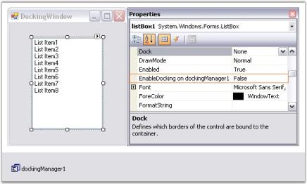
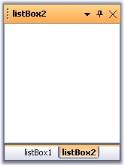
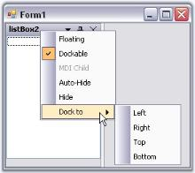
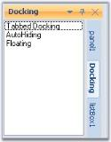
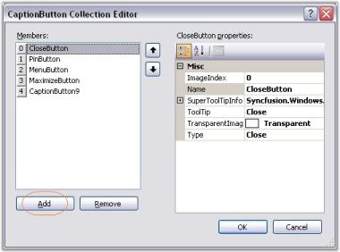
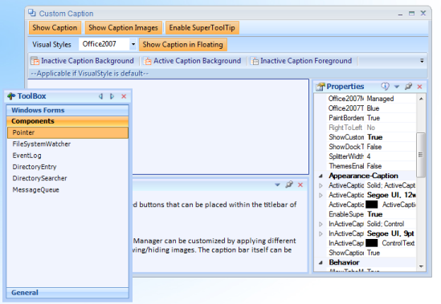
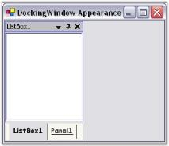
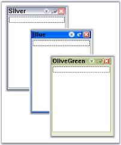
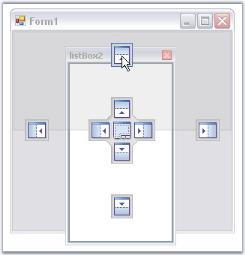

# Docking Package

The Docking Package comprises of the Essential Tools docking windows architecture that allows users to add Visual Studio .NET type dockable controls to Windows Forms applications. Any control can be set as a docking window and docking layouts can be hosted within Forms, UserControls or any derivative of the ContainerControl type. The framework supports the complete range of docking behaviors such as docking/floating, nested levels, tabbed groups, state transitions, autohide, MDIChild transitions, non-dockable/non-floatable options, a unique fill mode and full state persistence. An advanced designer allows users to harness full WYSIWYG configuration of the dock layout.

The Essential Tools docking framework implements the core docking interactions and additionally implements certain other complex features such as multiple docking levels, nested docking, tabbed docking, tear-off tabs, auto-hide mode and full state persistence.

Docking Manager is the component that supports Visual Studio .NET style docking / floating windows with full design-time support. The Office 2007 visual styles in blue, black and silver color schemes can also be applied to the docking windows.

## Features

Docking window may be defined as a control that attaches itself to a host control's border, and is capable of being dragged and docked to different edges within the control and also be dragged off the host control and floated as an individual top-level window.

### Features

* Office 2007 style look and feel for MDIChild Forms.
* New VS 2008 DragProvider style for Docking manager. See Dock Arrow Settings for details.
* Visual styles

Docking manager renders various styles that adds standard look and feel to your application. The Visual Styles includes VS2005, Office 2003, Office2007, Office2007 Outlook. It supports blue, silver and black themes in Office2007 visual style.

* Dockingwindow

Docking window wraps the host control that is docked and enables the control to be dragged to the required position.

* Dock arrows 

Dock arrow guides where the control is to be docked and docks the control in the specified side.

* WYSIWYG Designer Engine

To ease the process of designing layouts, the docking windows framework provides a very powerful WYSIWYG designer that allows you to design your application's docking layout merely by dragging and re-docking or floating the controls at the desired docking state during the design process. The layout is automatically serialized by the designer and can be restored during application start up or at any other time. 

* Tabbed docking

Docking manager allows controls to be tabbed along with the docking capability.

* Auto Hide

Docking manager provides an auto hide facility to the docked control. Docked controls can be hidden and will be tabbed along the side of the container control on which it was placed. The control will restore its appearance when the tab is clicked. Click here to know more.

* Toggle docking

The docked conrol can toggle its docking capability to floating and vice versa by double clicking on the caption or the title bar of the docking window. See Floating topic.

* State Persistence

The docking manager has the ability to load and store dock state information into default storage medium, XML files and also in other storage medium such as database. See Dock State Persistence.

* Nested Docking

The docking windows framework provides a full fledged support for nested docking layouts.

* Design time drag drop and Floating

The docking manager architecture enables dragging, dropping and floating of the user controls in the design time, similar to that at run time.

* Docking - MDIChild Transitions 

The Syncfusion dockable controls can be seamlessly transformed to and from MDIChild forms using the pre-wired context menu or the programmatic API. Combining this behavior with the Essential Tools TabbedMDI framework allows docking and MDIChild window states to be switched around like in the Visual Studio .NET IDE.

* DockToFill Option

The DockToFill feature allows users to implement a very unique docking layout where a non-MDIContainer form or container control's entire client region is composed of dockable controls. The DockToFill mode capability of the docking manager creates forms comprising entirely of dockable windows.

* Caption Buttons

The docking manager allows the users to set the visibility of the close button, Maximize button, Minimize button and Menu button on the title bar of the docked control. See Caption Buttons.

* Custom Caption Button

Custom Caption Buttons is a newly added feature in Docking Manager. This allows user to customize the existing caption buttons like menu button, close button, autohide button and maximize button and also to create a new caption button and customize it.

* Container control support

The Syncfusion docking windows architecture features full support for hosting docking windows within container controls. Dockable controls hosted within child controls will automatically be bound to the visibility state of the parent control hierarchy and floating windows are shown / hidden in synchronization with the host container's visibility. 

* Extender provider architecture

The central component of the docking windows framework is the DockingManager class. The DockingManager is implemented as a .NET Extender Provider component that extends the SetEnableDocking property to any control instance on the form or ContainerControl hosting the DockingManager. This makes the addition of docking windows to applications an extremely simple one-step process of just setting the extended property on the control without need for complex initialization. 

* Context menu

The docked controls can display context menu on right clicking the caption bar. An unique context menu is available for auto hide tabs also.

* Docking Ability

Previously, the diamond docking indicators did not have the ability to hide certain docking arrows, and hence it could be docked to certain sides only and we have to handle events to achieve this.

Now, DockAbility / OuterDockAbility features allow to hide docking arrows so that we can dock a window only to certain sides of a form / usercontrol.

See Also

Getting Started, Concepts and Features

## Getting Started

This section will provide step by step procedure to design a dockingwindow layout through designer and through programmatical approach in a .NET application. 

### Through Designer

The docking window's WYSIWYG designer makes the implementation of a docking windows layout a highly intuitive process. Complex layouts can be designed by dragging-and-dropping the docking manager, without having to write a single line of code.

The following steps outline the sequence of steps involved in setting up a simple docking windows (listbox for ex) layout using the designer.

1. Open the host form within the windows forms designer and add the controls that should be implemented as docking windows.
2. Drag a DockingManager control from the toolbox onto the form. The docking manager is implemented as an extender provider and will add the EnableDocking on dockingManager property to all the child controls that are dropped in the form as shown in the image below.

   

3. Turn on the EnableDocking on dockingManager property for those controls that should be hosted as docking windows. Setting this property will immediately transform the control into a docking window by creating a dockable container and adding the control to it. The control is now a full-featured docking window that is docked to the form's left border, by default as in the image displayed below.

   

4. DockingManager provides docking specific properties to the docked controls, which will be listed under the Syncfusion Docking category of those controls. These properties lets you specify icons for the caption, edit the caption labels, auto hide the controls and so on.

   

5. DockingManager comes with enormous appearance properties, whose settings will be applied to all the docked controls.

   

6. The form's docking layout can be set up by dragging the dock-enabled controls and redocking or floating them at the desired locations by using DragProviderStyle property.

   

7. Use the AutoHideOnLoad and HiddenOnLoad extended properties for setting the autohidden and hidden dock states for the controls.

   

See Also

Through Code, Concepts and Features

### Through Code

The Docking Manager's API makes it an easy task to programmatically create, initialize and set up a docking window's layout in an application. The following section guides you through the steps involved in setting up a simple docking windows layout with two Listbox controls.

1. Add the below namespace. 

   ~~~ cs

     	//namespaces

		using Syncfusion.Windows.Forms.Tools;

		using Syncfusion.Windows.Forms;

   ~~~
   {:.prettyprint }

   ~~~ vbnet

		'namespaces

		Imports Syncfusion.Windows.Forms

		Imports Syncfusion.Windows.Forms.Tools

   ~~~
   {:.prettyprint }

2. Create and initialize the Docking Manager and two listbox controls.

   ~~~ cs

		// Create the DockingManager instance and add it the component list.

		private Syncfusion.Windows.Forms.Tools.DockingManager dockingManager;

		private System.Windows.Forms.ListBox listBox1;

		private System.Windows.Forms.ListBox listBox2;

		this.dockingManager = new Syncfusion.Windows.Forms.Tools.DockingManager(this.components);

		this.listBox1 = new System.Windows.Forms.ListBox();

		this.listBox2 = new System.Windows.Forms.CheckedListBox();

   ~~~
   {:.prettyprint }

   ~~~ vbnet

	    ' Create the DockingManager instance and add it the component list.

	 Private Syncfusion.Windows.Forms.Tools.DockingManager dockingManager;

	 Private System.Windows.Forms.ListBox listBox1;

	 Private System.Windows.Forms.ListBox listBox2;

 
	 Me.dockingManager = New Syncfusion.Windows.Forms.Tools.DockingManager(Me.components)

	 Me.dockingManager.BeginInit()

	 Me.listBox1 = New System.Windows.Forms.ListBox()

	 Me.listBox2 = New System.Windows.Forms.ListBox()

   ~~~
   {:.prettyprint }

3. Set some properties of the DockingManager. Ex VisualStyle to "Office2003".

   ~~~ cs

		//Set the visual Style of the docked controls

		this.dockingManager.VisualStyle = Syncfusion.Windows.Forms.VisualStyle.Office2003;

   ~~~
   {:.prettyprint }

   ~~~ vbnet

	 'Set the visual Style of the docked controls

	 Me.dockingManager.VisualStyle = Syncfusion.Windows.Forms.VisualStyle.Office2003

   ~~~
   {:.prettyprint }

4. Enable the controls to be docked by calling SetEnableDocking method.

   ~~~ cs

    	this.dockingManager.SetEnableDocking(this.listBox1,true);

		this.dockingManager.SetEnableDocking(this.listBox2,true);

   ~~~
   {:.prettyprint }

   ~~~ vbnet

		Me.dockingManager.SetEnableDocking(Me.listBox1,True)

		Me.dockingManager.SetEnableDocking(Me.listBox2,True)

   ~~~
   {:.prettyprint }

5. Docking styles for the controls can be specified in DockControl method. Here the docking style is set to tabbed.

   ~~~ cs

		// Tab the docked controls

		this.dockingManager.DockControl(this.listBox1, this.listBox2,Syncfusion.Windows.Forms.Tools.DockingStyle.Tabbed,200,true);

   ~~~
   {:.prettyprint }

   ~~~ vbnet

	 ' Tab the docked controls

	 Me.dockingManager.DockControl(Me.listBox1, Me.listBox2,Syncfusion.Windows.Forms.Tools.DockingStyle.Tabbed,200,True)

   ~~~
   {:.prettyprint }

The resulting form will look like the below image.

## Concepts and Features

This section covers the following topics which discusses the concepts and features of docking.

### Docking Styles

This section will discuss the below four docking styles.

* Docking - Lets you dock the control on any of the four sides of the container control.
* Tabbed Docking - Lets you tab two or more controls.
* Floating - Floats the dockable control.
* AutoHiding - Auto hides the dockable controls and displays as autohidden tabs.

#### Docking

Docked control can be docked to any of the four sides of the container control, i.e., to Left, Right, Top and Bottom. DockingManager lets you specify the type of docking and the bounds of the docked control using the DockControl method. This method also sets Tabbed style for the controls.



// Tab the docked controls

this.dockingManager.DockControl(this.listBox1, this.listBox2,Syncfusion.Windows.Forms.Tools.DockingStyle.Left,200,true);





' Tab the docked controls

Me.dockingManager.DockControl(Me.listBox1, Me.listBox2,Syncfusion.Windows.Forms.Tools.DockingStyle.Left,200,True)



At runtime, docking style can be selected easily using the context menu.

> Note: At run time, docking style can also be set with the help of_ Dock Arrows _provided by the DragProviderStyle property.

#### Tabbed Docking

This section will discuss how the docked controls inside a container can be tabbed.

At Design Time

The docked controls can be tabbed in the designer, by just dragging and dropping into one another. DockingManager helps you in doing this using different DragProviderStyle.

At RunTime

DockingManager helps you in dragging and dropping the docked controls at run time, using different DragProviderStyle. This styles display prediction Bands, which lets you decide whether you can drop the control in that location.

Runtime Example

The below code lets you tab two docked controls (Panel1 and Panel2).



this.dockingManager.DockControl(this.Panel1, this.Panel2, Syncfusion.Windows.Forms.Tools.DockingStyle.Tabbed, 200, true);





Me.dockingManager.DockControl(Me.Panel1, Me.Panel2, Syncfusion.Windows.Forms.Tools.DockingStyle.Tabbed, 200, True)



> Note: In the Tabbed style, the control is docked as a tabbed window along with the dock target. This style is not applicable when the dock target is the host form / user control.

Context Menu for Tabbed Controls

The tabbed control can display context menu when the user right clicks on the tabs. See Context Menu.

Aligning the Tabs

The alignment of the tabs can be specified using DockTabAlignment property.

_Table_ _32_: DockingManager Property Table

<table>
<tr>
<td>
DockingManager Property</td><td>
Description</td></tr>
<tr>
<td>
DockTabAlignment</td><td>
Property which sets the value indicating the alignment of the dock tabs. The different alignment options are,Top, Bottom, Left and Right.</td></tr>
</table>

> Note: This property can also be set easily using _Task Window_.



this.dockingManager.DockTabAlignment = Syncfusion.Windows.Forms.Tools.DockTabAlignmentStyle.Right;





Me.dockingManager.DockTabAlignment = Syncfusion.Windows.Forms.Tools.DockTabAlignmentStyle.Right



Methods related to Tabbed Docking

_Table_ _33_: DockingManager Property Table

<table>
<tr>
<td>
DockingManager Property</td><td>
Description</td></tr>
<tr>
<td>
IsSameTabbedGroup</td><td>
Determines whether the second control is under the same group of the first control.Ctrl1 - Indicates the first control.Ctrl2 - Indicates the second control.</td></tr>
<tr>
<td>
GetTabPosition</td><td>
Returns the tab position of the specified control among a tab group. An integer value will be returned indicating the tab position. The parameter is,Ctrl - Indicates the docking window.</td></tr>
<tr>
<td>
GetTabbedSiblings</td><td>
Returns all the siblings of the specified control in a tabbed group or it returns the array of controls which are tabbed with the given control. The parameters are,Ctrl - Instance of control whose tabbed siblings are to be returned.</td></tr>
<tr>
<td>
IsTabbed</td><td>
Returns whether the specified control is tabbed or not. The parameter is,Ctrl - Indicates the docking window.</td></tr>
</table>



this.dockingManager.IsSameTabbedGroup(this.listBox1,this.checkedListBox1);

this.dockingManager1.GetTabPosition(this.listBox1);

this.dockingManager1.GetTabbedSiblings(this.listView1);

this.dockingManager1.IsTabbed(this.listBox1);





Me.dockingManager.IsSameTabbedGroup(this.listBox1,this.checkedListBox1)

Me.dockingManager1.GetTabPosition(Me.listBox1)

Me.dockingManager1.GetTabbedSiblings(Me.listView1)

Me.dockingManager1.IsTabbed(this.listBox1)



See Also

Getting Started, DockAllow Event, Dock Arrow Settings

#### Floating

Floating a Control

The FloatControl method enables the end users to float a particular control. Using this method, we can float a single control even if it is tabbed with many controls.



Rectangle rcfrm = this.Bounds;

this.dockingManager.FloatControl(this.listBox1, new Rectangle(rcfrm.Right+25,rcfrm.Bottom-150,175,200));





Dim rcfrm As Rectangle = Me.Bounds

Me.dockingManager.FloatControl(Me.listBox1, New Rectangle(rcfrm.Right+25,rcfrm.Bottom-150,175,200))



DisallowFloating

By enabling the DisallowFloating property, a control can be dragged and redocked to the host form, but cannot be floated.

_Table_ _34_: DockingManager Property Table

<table>
<tr>
<td>
DockingManager Property</td><td>
Description</td></tr>
<tr>
<td>
DisallowFloating</td><td>
Property which sets value indicating whether the docked controls are allowed to float or not.</td></tr>
</table>



this.dockingManager1.DisallowFloating = true;





Me.dockingManager1.DisallowFloating = True



Floating State to Docking State and Vice Versa

Setting EnableDoubleClickOnCaption property to true, lets you dock or float the control by just double clicking on the captions of the docked control. By default it is true.

See Also

Nested Docking and Floating, How to make a docked control Floating Only?,

How to float a single control even if it is tabbed to many controls?, How to find out whether a docked control is floating or not?,

How to get individual floating controls properties?

#### OnCaptionDoubleClick Event:

The OnCaptionDoubleClick event occurs when you double-click on a dockable control or a docked control caption. This event is triggered when Docking Manager EnableDoubleClickOnCaption property is set to _“false”_. It displays the control name which is currently active.

Event Data

The event handler receives an argument of type DockMouseSelectionEventHandler that contains data related to this event. The following DockMouseSelectionEventHandler properties provide information specific to this event.

_Table_ _35_: Member Table

<table>
<tr>
<td>
Member</td><td>
Description</td></tr>
<tr>
<td>
Control</td><td>
Gets the control that is activated.</td></tr>
</table>



private void dockingManager1_OnCaptionDoubleClick(object sender, Syncfusion.Windows.Forms.Tools.DockControlMouseSelection arg)

{

//When you  double-click on a Docked control or click on the Docked control caption,,

// OnCaptionDoubleClick event is triggered

//DockControlMouseSelection has a property called “Control” which has the details of 

// activated control.

Console.WriteLine("Dock Control Activated Event is Fired");

//Displays the name of the control that is currently active.

Console.WriteLine("Activated Control Name : "+arg.Control.Name);

}





 'The DockControlActivated event occurs when a dockable control gets activated.

Private Sub dockingManager1_OnCaptionDoubleClick(ByVal sender As Object, ByVal arg AsSyncfusion.Windows.Forms.Tools.DockActivationChangedEventArgs)

‘When you  double-click on a Docked control or click on the Docked control caption,,

‘OnCaptionDoubleClick event is triggered

‘DockControlMouseSelection has a property called “Control” which has the details of 

‘activated control.

Console.WriteLine("Dock Control Activated Event is Fired");

‘Displays the name of the control that is currently active.

Console.WriteLine("Activated Control Name : "+arg.Control.Name);

End Sub



#### AutoHiding

Docking manager provides auto hide facility to the docked control. When the auto hide button (looks like a bell) is clicked, the docked controls will be hidden, and will be placed along the side of the container control on which it was placed. When mouse is moved over it, the auto hidden control will be displayed and the control will restore its appearance when the auto hidden button is clicked again.

The below image displays an autohidden docked control.

The below properties controls the autohiding feature of the docked controls.

_Table_ _36_: DockingManager Property Table

<table>
<tr>
<td>
DockingManager Property</td><td>
Description</td></tr>
<tr>
<td>
AutoHideActiveControl</td><td>
Gets or sets a value indicating whether to slide back selected auto hidden control.</td></tr>
<tr>
<td>
AutoHideInterval</td><td>
Specifies the time interval for showing or hiding an autohidden control.</td></tr>
<tr>
<td>
AutoHideSelectionStyle</td><td>
Specifies the selection style for the autohidden windows. The styles are,MouseHover - Allows the user to select an autohidden tab by mouse hovering over the tab. Click - Allows the user to select the autohidden tab by clicking on the tab.</td></tr>
</table>



this.dockingManager1.AutoHideActiveControl = true;

this.dockingManager1.AutoHideInterval = 500;

this.dockingManager1.AutoHideSelectionStyle = Syncfusion.Windows.Forms.Tools.AutoHideSelectionStyle.Click;





Me.dockingManager1.AutoHideActiveControl = True

Me.dockingManager1.AutoHideInterval = 500

Me.DockingManager1.AutoHideSelectionStyle = Syncfusion.Windows.Forms.Tools.AutoHideSelectionStyle.Click



Displaying Full Caption In AutoHide Mode

Create a docked window with two listbox. Dock the controls. Tab the controls and set the FullCaptionInAutoHideMode property. Setting this property to true, will display the full caption text in the auto hidden tabgroup's page. It displays full caption within the application if necessary with a scrollbar, so that end user can scroll and view the hidden tab's full caption.



this.dockingManager1.FullCaptionsInAutoHideMode = true;





Me.dockingManager1.FullCaptionsInAutoHideMode = True



Animation in Auto Hiding is discussed in Auto Hide Animation Speed topic and Dragging Autohidden tabs topic discusses how to drag the autohidden tabs.

See Also

Context Menu, Animation Events, AutoHide TabContextMenu Event, How to autohide a control when an application loads

##### Auto Hide Animation Speed

DockingPanel allows you to change the speed at which your docking panes are displayed or auto hidden. You can easily change the delay of the auto hide windows as fast or as slow as you want, so that your window will hide / show at the perfect speed.

The speed of animation can be controlled by AnimationSpeed and AnimationStep Property. 

AnimationSpeed property of the DockingManager indicates the speed of animation during auto hide or the timer interval in milli secs. AnimationStep indicates the step value for the animation. It is common to all the docked control. AnimationStep property can be implemented using the code below.



//arg.Bounds give the bounds of the autohidden control as a rectangle object. 

DockingManager.AnimationStep = 1000;  //(arg.Bounds.Width)





'arg.Bounds give the bounds of the autohidden control as a rectangle object. 

DockingManager.AnimationStep = 1000;  '(arg.Bounds.Width)



> Note: For a control to show animation in autohide mode, the animation step value should be more than the width of the particular hidden control.

##### Context Menu for AutoHidden Tabs

This is discussed in Context Menu topic.

##### Dragging Autohidden tabs

The docked controls that are autohidden, can be dragged with their tabs, and can be docked or set to floating by setting EnableDragAutoHiddenTabs property to true.



this.dockingManager1.EnableDragAutoHiddenTabs = true;





Me.dockingManager1.EnableDragAutoHiddenTabs = True



### Caption Bar

 Caption for the docked controls can be enabled using ShowCaption property. By default this property is true. 

The following topics will guide the end users on how to effectively use the caption bar settings for the docked controls.

#### Label and Image for CaptionBar

Caption Label

Docking Manager lets you set the caption label using DockLabel property of the particular control, through designer, and programmatically by using SetDockLabel method. Alignment of these labels can be specified using DockLabelAlignment property.

_Table_ _37_: DockingManager Property Table

<table>
<tr>
<td>
DockingManager Property</td><td>
Description</td></tr>
<tr>
<td>
DockLabelAlignment</td><td>
Sets the dock label alignment. The different alignments options are, Left, Right andCenter.</td></tr>
</table>



this.dockingManager.SetDockLabel(this.listBox1, "Syncfusion ASP.NET products");

this.dockingManager1.DockLabelAlignment = Syncfusion.Windows.Forms.Tools.DockLabelAlignmentStyle.Left;





Me.dockingManager.SetDockLabel(Me.listBox1, "Syncfusion ASP.NET products")

Me.dockingManager1.DockLabelAlignment = Syncfusion.Windows.Forms.Tools.DockLabelAlignmentStyle.Left



Custom CaptionLabel aligned to left

> Note: DockLabelAlignment can also be set easily using _Task Window_.

Image for the Caption

The captions can also hold images which can be enabled using ShowCaptionImages property.



this.dockingManager1.ShowCaptionImages = true;





Me.dockingManager1.ShowCaptionImages = True



The caption icons / the images can be set using this DockIcon property of the docked control.To achieve this through designer, follow the below steps.

* Create a docked window. 
* Add ImageList and add the images to it.
* Select the image list through the ImageList property of the docking manager. 
* Now go to the property of the docked control to which you have to set the dock icon. 
* Give the image index value to the DockIcon property.
* Run the application. 
* The corresponding control will be displayed with the icon that is set. 
* To disable displaying the icon, set the value as -1.

_Table_ _38_: DockedControl Property Table

<table>
<tr>
<td>
DockedControl Property</td><td>
Description</td></tr>
<tr>
<td>
DockIcon</td><td>
Index of the image associated with this docking window.</td></tr>
</table>



this.dockingManager1.SetDockIcon(this.listBox1, 2);





Me.DockingManager1.SetDockIcon(Me.ListBox1, 2)



Caption Label with Dock Icon

Methods for setting Caption icons and labels are as follows.

_Table_ _39_: Methods Table

<table>
<tr>
<td>
Methods</td><td>
Description</td></tr>
<tr>
<td>
SetDockIcon</td><td>
Sets the Icon or the image for the docking window by passing the image icon as a parameter for this method.Ctrl - Represents the dock enabled control.image - Icon representing the docking window.</td></tr>
<tr>
<td>
SetDockIcon(Overloaded)</td><td>
This overloaded method returns the index of the image associated with the docking window.Ctrl - Indicates the docking window.int - A zero-based index into the ImageList property value.</td></tr>
<tr>
<td>
SetDockLabel</td><td>
Sets the text to be displayed in the docking window caption.Ctrl - Indicates the docking window.strText - A string value representing the text caption.</td></tr>
</table>

> Note: _Background_ and _foreground_ appearance of the captions can be customized.

See Also

Caption Buttons, Custom Caption Buttons

#### Caption Buttons

The buttons available for the docked control and the properties which controls the visibility of the button are discussed in this section.

Menu Button

The menu button in a docked control can be made visible or hidden by setting the MenuButtonEnabled property to true. Clicking this button will display the context menu items.

Maximize Button

Maximize button can be enabled by using the MaximizeButtonEnabled property. This maximize button allows users to maximize / restore a docking window, so that a clear view of the contents can be made visible.

> Note: The Maximize button will be visible only if any other control is docked to the bottom of the former control.

Close Button

The visibility of the Close button can be controlled using the CloseEnabled property.

AutoHide Button

Setting AutoHideEnabled property shows or hides the auto hide button in the docked control. Clicking this button will autohide the docked controls.

> Note: Docking Manager let you customize the above default buttons and also add custom caption buttons. See_ Custom Caption Buttons _for more details.

See Also

Context Menu, AutoHiding

#### Custom Caption Buttons

Custom Caption Collection Editor which can be accessed using DockingManager.CaptionButtons property, lets you customize the default buttons and also lets you add custom caption buttons. 

Adding and customizing caption Buttons

In the CaptionButton Collection Editor, click "Add" to add a new caption button. To customize the caption button, modify the properties provided to the right of the members in the editor.

This can be done programmatically using the below code snippets.



Syncfusion.Windows.Forms.Tools.CaptionButton captionButton = new Syncfusion.Windows.Forms.Tools.CaptionButton();

toolTipInfo = new Syncfusion.Windows.Forms.Tools.ToolTipInfo();

captionButton.ImageIndex = 4;

captionButton.Name = "Custom Button";

captionButton.Type = Syncfusion.Windows.Forms.Tools.CaptionButtonType.Custom;

captionButton.SuperToolTipInfo = toolTipInfo

captionButton.TransparentImageColor = System.Drawing.Color.Transparent;

this.dockingManager1.CaptionButtons.Add(captionButton);





Dim captionButton5 As Syncfusion.Windows.Forms.Tools.CaptionButton = New Syncfusion.Windows.Forms.Tools.CaptionButton()

toolTipInfo = new Syncfusion.Windows.Forms.Tools.ToolTipInfo()

captionButton.ImageIndex = 4 

captionButton.Name = "Custom Button" 

captionButton.Type = Syncfusion.Windows.Forms.Tools.CaptionButtonType.Custom;

captionButton.SuperToolTipInfo = toolTipInfo

captionButton.TransparentImageColor = System.Drawing.Color.Transparent 

Me.dockingManager1.CaptionButtons.Add(captionButton)



A sample which demonstrates the addition of Custom Caption Buttons is available in the below sample installation path.

…\_My Documents\Syncfusion\EssentialStudio\Version Number\Windows\Tools.Windows\Samples\Advanced Editor Functions\ActionGroupingDemo_

Custom Button for Caption Bar in Floating Form

This feature enables you to add custom buttons to the caption bar when an item is in a floating state.

You can now add custom buttons to the caption bar when an item is in a floating state. It is not required to dock the item to use the custom buttons. 

_Table_ _40_: Properties Table

<table>
<tr>
<td>
Property </td><td>
Description </td><td>
Type </td><td>
Data Type </td><td>
Reference links </td></tr>
<tr>
<td>
ShowCustomButtonsInFloating</td><td>
Specifies whether caption button will be enabled while floating.  </td><td>
-</td><td>
Boolean </td><td>
NA </td></tr>
</table>
Enabling Custom Button for Caption Bar while Floating

To enable custom button for caption bar while floating, set the _ShowCustomButtonsInFloating_ property to _true_. By default this is set to _false_. 



this.dockingManager1.ShowCustomButtonsInFloating = true;





me.dockingManager1.ShowCustomButtonsInFloating = True



> Note: This feature is not applicable for VS2005 (default) visual style.

Sample Link

A sample for this feature is available in the following location: 

_..\..\AppData\Local\Syncfusion\EssentialStudio\9.4.0.59\Windows\Tools.Windows\Samples\2.0\Docking Package\Custom Caption_

### DesignTime Features

#### Dragging and Docking at DesignTime

DockingManager supports dragging and docking of the dockable controls at the design time itself. It also lets you float the controls.

Property Settings using Task Window

The Task Window of the DockingManager at design time lets you apply certain Appearance and behavior settings.

### RunTime Features

The following runtime features are discussed in this section.

#### Browsing Key

DockingManager lets you specify the keyboard key combinations, to tab through the docked controls. The property BrowsingKey of the docking manager, provides modifiers like CTRL, SHIFT, ALT Keys and keys like A, B, C, 0, 1 etc., User can also provide a combination of modifiers and the keys. Example "CTRL + 0", as shown in the image below.

> Note: Before we set this property for docking manager, we have to set TabStop property to true and TabIndex property with the appropriate value. Otherwise its BrowsingKey property will not work.

<table>
<tr>
<td>
DockingManager Property</td><td>
Description</td></tr>
<tr>
<td>
Browsing Key</td><td>
Determines the value of the key which can be used to tab through the docked controls.</td></tr>
</table>
_Table_ _42_: DockedControl Property Table

<table>
<tr>
<td>
DockedControl Property</td><td>
Description</td></tr>
<tr>
<td>
TabStop</td><td>
Indicates whether TAB key can be used to focus the control.</td></tr>
<tr>
<td>
TabIndex</td><td>
Determines the index in the tab order that this control will occupy.</td></tr>
</table>

These properties can be set through code by using the below code.



this.dockingManager1.BrowsingKey = ((System.Windows.Forms.Keys)((System.Windows.Forms.Keys.Control | System.Windows.Forms.Keys.D0)));

this.treeViewAdv1.TabStop = true;

this.treeViewAdv1.TabIndex = 0;





Me.DockingManager1.BrowsingKey = CType((System.Windows.Forms.Keys.Control Or System.Windows.Forms.Keys.D0), System.Windows.Forms.Keys)

Me.TreeViewAdv1.TabStop = True

Me.TreeViewAdv1.TabIndex = 0



#### ToolTip

By default, tooltips will be displayed for the caption buttons in a docked control when the mouse is moved over it.

> Note: EnableSuperTooltip property which is discussed below, should be set to false to effect the above default tooltip.

SuperTooltip Support

Docking manager can display a super tooltip by enabling the DockingManager.EnableSuperTooltip property. For this a SuperTooltip control should be dragged and dropped on to the form and it should be selected in the DockingManager.SuperTooltip property.

_Table_ _43_: DockingManager Property Table

<table>
<tr>
<td>
DockingManager Property</td><td>
Description</td></tr>
<tr>
<td>
EnableSuperTooltip</td><td>
Gets/Sets whether to enable SuperToolTip using the dock caption buttons.</td></tr>
<tr>
<td>
SuperToolTip</td><td>
Indicates the SuperToolTip associated with the docking manager.</td></tr>
</table>

A SuperToolip can be added to the docking manager programmatically using the below code snippet.



this.dockingManager1.EnableSuperToolTip = true;

this.dockingManager1.SuperToolTip = this.superToolTip1;





Me.dockingManager1.EnableSuperToolTip = True

Me.dockingManager1.SuperToolTip = Me.superToolTip1



Text for the supertooltip and other customizing options can be specified for a particular button by using the CaptionButton Collection Editor.

#### Context Menu

A context menu will be displayed whenever the user right clicks the caption bar or clicks the menu button in the caption bar. EnableContextMenu property should be true for displaying the context menu. By default it is true.

When the docked control is in autohide mode and when the auto hide tab is right-clicked, an unique context menu will be displayed, similar to Visual Studio. EnableAutoHideTabContextMenu property should be true for this. By default this value is true.



this.dockingManager1.EnableContextMenu = true;

this.dockingManager1.EnableAutoHideTabContextMenu = true;





Me.dockingManager1.EnableContextMenu = True

Me.dockingManager1.EnableAutoHideTabContextMenu = True



The below images illustrates context menu features.

> Note: If MDIContainer property of the form is set to true, then the context menu will include MDI child option. You can observe that the MDI Child option is disabled for the above image. This is because MDIContainer property is false for this case.

Context Menu for TabbedControls

Context menu for the tabbed controls is similar to the default context menu like the above image. When TabbedMDIManager component is used, context menu will include TabbedDocument instead of MDI child.

See Also

Dock Context Menu Event, How to display context menu of a docked control at a specified point?

### Appearance Settings

The look and feel of the docked controls can be controlled through the appearance properties of DockingManager. Those properties are discussed in detail in the below topics.

#### Foreground Settings

This section will walk you through the foreground settings of the Dock tabs, caption area and AutoHidden tabs.

Dock Tab and Label Settings

The docking Manager provides tab and label settings for the docked windows. These settings lets you control the appearance of the dock tabs.

Foreground Settings for the Dock Tabs

The font style and the height of the tab controls in a tabbed docking group, can be controlled using the below properties respectively.

_Table_ _44_: DockingManager Property Table

<table>
<tr>
<td>
DockingManager Property</td><td>
Description</td></tr>
<tr>
<td>
DockTabFont </td><td>
Gets or sets the font for the tab control used in tabbed docking group.</td></tr>
<tr>
<td>
DockTabHeight</td><td>
Gets or sets the height for the tab control used in tabbed docking group.</td></tr>
</table>



this.dockingManager1.DockTabFont = new System.Drawing.Font("Arial", 9F, ((System.Drawing.FontStyle)((System.Drawing.FontStyle.Bold | System.Drawing.FontStyle.Underline))), System.Drawing.GraphicsUnit.Point, ((System.Byte)(0)));

this.dockingManager1.DockTabHeight = 30;





Me.DockingManager1.DockTabFont = New System.Drawing.Font("Arial", 9.0!, CType((System.Drawing.FontStyle.Bold Or System.Drawing.FontStyle.Underline), System.Drawing.FontStyle), System.Drawing.GraphicsUnit.Point, CType(0, Byte))

Me.DockingManager1.DockTabHeight = 30



> Note: ResetDockTabFont and ResetDockTabHeight methods lets you reset the above settings.



//Restoring to default settings

this.dockingManager1.ResetDockTabFont();

this.dockingManager1.ResetDockTabHeight();





'Restoring to default settings

Me.dockingManager1.ResetDockTabFont()

Me.dockingManager1.ResetDockTabHeight()



See Also

Tabbing the Docked controls in Tabbed Docking

##### AutoHidden Tabs

The font style for the autohidden tabs can be specified in AutoHideTabFont property.

_Table_ _45_: DockingManager Property Table

<table>
<tr>
<td>
DockingManager Property</td><td>
Description</td></tr>
<tr>
<td>
AutoHideTabFont</td><td>
Gets or sets the tab for the autohide tab control.</td></tr>
</table>

> Note: This setting will effect only with DockingManager.VisualStyle property set as Default.



//Setting Auto hide tab Font style

this.dockingManager1.AutoHideTabFont = new System.Drawing.Font("Arial", 9.75F, ((System.Drawing.FontStyle)(((System.Drawing.FontStyle.Bold | System.Drawing.FontStyle.Italic) 

| System.Drawing.FontStyle.Underline))), System.Drawing.GraphicsUnit.Point, ((System.Byte)(0)));





'Setting Auto hide tab Font style

Me.DockingManager1.AutoHideTabFont = New System.Drawing.Font("Arial", 9.75!, CType(((System.Drawing.FontStyle.Bold Or System.Drawing.FontStyle.Italic) _

Or System.Drawing.FontStyle.Underline), System.Drawing.FontStyle), System.Drawing.GraphicsUnit.Point, CType(0, Byte))



The height for the auto hidden tabs can be specified in AutoHideTabHeight property.

_Table_ _46_: DockingManager Property Table

<table>
<tr>
<td>
DockingManager Property</td><td>
Description</td></tr>
<tr>
<td>
AutoHideTabHeight</td><td>
Gets or sets the height of the autohide tab control.</td></tr>
</table>

> Note: This setting will effect only with DockingManager.VisualStyle property set as Default.



//Setting Auto hide tab height

this.dockingManager1.AutoHideTabHeight = 35;





'Setting Auto hide tab height

Me.DockingManager1.AutoHideTabHeight = 35



See Also

Visual Styles

##### Active and Inactive caption

Active Caption Settings

Caption FontStyle and foreground settings, for an active docked control, can be controlled by ActiveCaptionFont and ActiveCaptionForeGround properties.

_Table_ _47_: DockingManager Property Table

<table>
<tr>
<td>
DockingManager Property</td><td>
Description</td></tr>
<tr>
<td>
ActiveCaptionFont</td><td>
Gets or sets the font for the active caption.</td></tr>
<tr>
<td>
ActiveCaptionForeGround</td><td>
Indicates the color of the caption text in the active state.</td></tr>
</table>

> Note: These settings will effect only with DockingManager.VisualStyle property set as Default.



this.dockingManager1.ActiveCaptionFont = new System.Drawing.Font("Trebuchet MS", 9.75F, System.Drawing.FontStyle.Bold, System.Drawing.GraphicsUnit.Point, ((System.Byte)(0)));

this.dockingManager1.ActiveCaptionForeGround = System.Drawing.Color.Red;





Me.dockingManager1.ActiveCaptionFont = New System.Drawing.Font("Trebuchet MS", 9.75!, System.Drawing.FontStyle.Bold, System.Drawing.GraphicsUnit.Point, CType(0, Byte))

Me.DockingManager1.ActiveCaptionForeGround = System.Drawing.Color.Red



Inactive Caption settings

By setting the InactiveCaptionFont and InactiveCaptionForeGround properties, the caption foreground appearance of the inactive controls among the docked controls can be customized.

_Table_ _48_: DockingManager Property Table

<table>
<tr>
<td>
DockingManager Property</td><td>
Description</td></tr>
<tr>
<td>
InactiveCaptionFont</td><td>
Gets or sets the font of the inactive caption.</td></tr>
<tr>
<td>
InactiveCaptionForeGround</td><td>
Indicates the color of the caption text in inactive state.</td></tr>
</table>

> Note: These settings will effect only with DockingManager.VisualStyle property set as Default.



this.dockingManager1.InActiveCaptionFont = new System.Drawing.Font("Arial", 11.25F, System.Drawing.FontStyle.Bold, System.Drawing.GraphicsUnit.Point, ((System.Byte)(0)));

this.dockingManager1.InActiveCaptionForeGround = System.Drawing.Color.Blue;





Me.DockingManager1.InActiveCaptionFont = New System.Drawing.Font("Arial", 11.25!, System.Drawing.FontStyle.Bold, System.Drawing.GraphicsUnit.Point, CType(0, Byte))

Me.DockingManager1.InActiveCaptionForeGround = System.Drawing.Color.MediumSlateBlue



The Docking Manager provides the ProvideGraphicsItems event that can be handled for custom rendering the docking window caption area. This event is fired whenever a docking window’s caption needs to be painted and the ProvideGraphicsItemsEventArgs provides the control being drawn and allows you to specify the new set of graphics objects to use.

##### DockingManager custom styling with Metro VisualStyle

In the DockingManager, the Metro visual style has a default caption color and button color. The menu color and button color can be customized by using the properties MetroCaptionColor and MetroButtonColor, which are present in the caption bar of the docking manager.

_Table_ _49_: Property Table

<table>
<tr>
<td>
Property</td><td>
Description</td></tr>
<tr>
<td>
MetroCaptionColor</td><td>
Gets or sets the color value of a caption in metro style DockingManager.</td></tr>
<tr>
<td>
MetroButtonColor</td><td>
Gets or sets the color value of a metro button in metro style DockingManager.</td></tr>
</table>



//Gets or sets the color value of caption in metro style DockingManager.

this.dockingMgr.MetroCaptionColor = Color.Red;





//Gets or sets the color value of caption in metro style DockingManager.

Me.dockingMgr.MetroCaptionColor = Color.Red





//Gets or sets the color value of button in metro style DockingManager.

this.dockingMgr.MetroButtonColor = Color.Red;





//Gets or sets the color value of button in metro style DockingManager.

Me.dockingMgr.MetroButtonColor = Color.Red



See Also

Visual Styles

#### Background Settings

This section will discuss the background settings for the caption area of the docked controls.

##### Active and Inactive caption

Active Caption Settings

Caption background appearance for the active docked control can be controlled through ActiveCaptionBackground property.

_Table_ _50_: DockingManager Property Table

<table>
<tr>
<td>
DockingManager Property</td><td>
Description</td></tr>
<tr>
<td>
ActiveCaptionBackground</td><td>
Sets background for the caption area using BrushInfo object.</td></tr>
</table>

> Note: This setting will effect only with DockingManager.VisualStyle property set as Default.



this.dockingManager1.ActiveCaptionBackground = new Syncfusion.Drawing.BrushInfo(Syncfusion.Drawing.PatternStyle.Percent20, System.Drawing.SystemColors.InactiveCaptionText, System.Drawing.Color.FromArgb(((System.Byte)(255)), ((System.Byte)(224)), ((System.Byte)(192))));





Me.DockingManager1.ActiveCaptionBackground = New Syncfusion.Drawing.BrushInfo(Syncfusion.Drawing.PatternStyle.Percent20, System.Drawing.SystemColors.InactiveCaptionText, System.Drawing.Color.FromArgb(CType(255, Byte), CType(224, Byte), CType(192, Byte)))



InactiveCaption settings

By setting the InactiveCaptionBackground properties, the caption appearance of the inactive control in the docked controls can be customized.

_Table_ _51_: DockingManager Property Table

<table>
<tr>
<td>
DockingManager Property</td><td>
Description</td></tr>
<tr>
<td>
InactiveCaptionBackground</td><td>
Sets caption background of the inactive docked control using BrushInfo object.</td></tr>
</table>

> Note: This setting will effect only with DockingManager.VisualStyle property set as Default.



this.dockingManager1.InActiveCaptionBackground = new Syncfusion.Drawing.BrushInfo(Syncfusion.Drawing.GradientStyle.Horizontal, System.Drawing.Color.Ivory, System.Drawing.SystemColors.Control);





Me.DockingManager1.InActiveCaptionBackground = New Syncfusion.Drawing.BrushInfo(Syncfusion.Drawing.GradientStyle.Horizontal, System.Drawing.Color.Ivory, System.Drawing.SystemColors.Control)



See Also

Visual Styles

##### Border for the Docked Control

Border color of the docked controls can be specified in the BorderColor property. 

Note that you will have to enable PaintBorders property to effect this setting.

_Table_ _52_: DockingManager Property Table

<table>
<tr>
<td>
DockingManager Property</td><td>
Description</td></tr>
<tr>
<td>
BorderColor</td><td>
Used to set the border color for the docked control.</td></tr>
<tr>
<td>
Paint Borders</td><td>
Determines whether to paint the docked control's borders.</td></tr>
</table>



//Setting Border color

this.dockingManager1.BorderColor = System.Drawing.Color.Blue;

this.DockingManager1.PaintBorders = true;





'Setting border color

Me.DockingManager1.BorderColor = System.Drawing.Color.Blue

Me.DockingManager1.PaintBorders = True



HostFormClientBorder

_Table_ _53_: DockingManager Property Table

<table>
<tr>
<td>
DockingManager Property</td><td>
Description</td></tr>
<tr>
<td>
HostFormClientBorder</td><td>
Gets or sets a value indicating whether a border is drawn around the host form's client rectangle.</td></tr>
</table>



this.DockingManager1.HostFormClientBorder = false;





Me.DockingManager1.HostFormClientBorder = False



##### Splitter Width

The width of the splitter between the docking windows can be set by using the SplitterWidth property.

_Table_ _54_: DockingManager Property Table

<table>
<tr>
<td>
DockingManager Property</td><td>
Description</td></tr>
<tr>
<td>
SplitterWidth</td><td>
Gets or sets the value indicating the width of splitters between the docking window.</td></tr>
</table>



this.dockingManager1.SplitterWidth = 20;





Me.dockingManager1.SplitterWidth = 20



##### Visual Styles

Docking manager supports various styles that adds appealing visual styles to your application. Below are the visual styles implemented in docking.

* Default (VS 2003)
* OfficeXP
* Office 2003
* VS 2005
* Office 2007 (Blue, Silver, Black)
* Office 2007 outlook
* Visual Studio 2010 
* Metro Theme

Visual styles for the windows can be customized by using the below code snippet.



//Set the visual Style of the docked controls

this.dockingManager.VisualStyle = Syncfusion.Windows.Forms.VisualStyle.Office2003;





' Set the visual Style of the docked controls

Me.dockingManager.VisualStyle = Syncfusion.Windows.Forms.VisualStyle.Office2003



Office2007 Color Schemes

DockingManager supports all the three color schemes in Office2007 visual style. This can be controlled using Office2007Theme property. 



this.dockingManager1.Office2007Theme = Syncfusion.Windows.Forms.Office2007Theme.Silver;





Me.dockingManager1.Office2007Theme = Syncfusion.Windows.Forms.Office2007Theme.Silver



Custom Color Schemes

Custom colors can also be applied DockingManager for Office2007 style, using the below code snippet.



dockingManager1.Office2007Theme = Office2007Theme.Managed;

Office2007Colors.ApplyManagedColors(this, Color.Red);





dockingManager1.Office2007Theme = Office2007Theme.Managed;

Office2007Colors.ApplyManagedColors(Me, Color.Red);



Windows Color Schemes

Windows color schemes like Blue, Silver and OliveGreen can be applied to the controls when Default or Office2003 styles are selected. XP themes can be enabled for the docked controls using ThemesEnabled property.



this.dockingManager1.ThemesEnabled = true;





Me.dockingManager1.ThemesEnabled = True



* Visual Studio 2010
* Metro Theme

See Also

Foreground settings for Active and Inactive caption, Background settings for Active and Inactive caption

### Special Features

The following topics are discussed in this particular section.

#### Dock Arrow Settings

While dragging and dropping a docked control, DockingManager guides you through the process, using DragProviderStyle property.

On setting this property to VS2005 or Whidbey style, you will be able to see arrows on four sides of the form, when a control is dragged. These arrows will guide you where to dock the window. Keeping the mouse point on a particular arrow will display a shadow like appearance based on the side of docking.

There are three docking provider Styles. They are, 

* Standard (Default value - no arrows appears for this option), 
* VS2005, 
* WhidBey and
* VS2008. 



this.dockingManager1.DragProviderStyle = Syncfusion.Windows.Forms.Tools.DragProviderStyle.VS2008;





Me.dockingManager1.DragProviderStyle = Syncfusion.Windows.Forms.Tools.DragProviderStyle.VS2008



In the image above, a shadow for docking a panel to the top of the form is displayed. Target area is highlighted at the top, as the mouse is hovered over the top Dock arrow.

Visibility of the Arrows

The docking arrows visibility, while dropping a control inside the form or into another docked control, can be set using the below properties.

_Table_ _55_: DockedControl Property Table

<table>
<tr>
<td>
DockedControl Property</td><td>
Description</td></tr>
<tr>
<td>
DockAbility</td><td>
Indicates where the user can dock in this control using drag providers.</td></tr>
<tr>
<td>
OuterDockAbilility</td><td>
Indicates where the user can dock the controls in a form using the drag providers.</td></tr>
</table>

See Also

Docking

#### DockToFill, Freeze Resizing

The DockToFill property allows users to implement a very unique docking layout where a non-MDIContainer form or ContainerControl's entire client region is occupied by the dockable controls.

_Table_ _56_: DockingManager Property Table

<table>
<tr>
<td>
DockingManager Property</td><td>
Description</td></tr>
<tr>
<td>
DockToFill</td><td>
Sets the boolean value indicating whether the docked control occupies the form's full client region.</td></tr>
</table>



this.dockingManager1.DockToFill = true;





Me.dockingManager1.DockToFill = True;



A sample which demonstrates DockToFill property is available in the below sample installation path.

…\_My Documents\Syncfusion\EssentialStudio\Version Number\Windows\Tools.Windows\Samples\Advanced Editor Functions\ActionGroupingDemo_

FreezeResizing

The FreezeResizing property has been implemented for each control by which, the end users can freeze any particular control. Also, the property value can be persisted. A global FreezeResizing property is also available using which all the controls can be frozen.

The controls can also be frozen by calling the SetFreezeResizing method which freezes the specified control and the user will no more be able to resize the controls.

_Table_ _57_: Parameter Table

<table>
<tr>
<td>
Parameter</td><td>
Description</td></tr>
<tr>
<td>
SetFreezeResizing</td><td>
Freezes the specified control. The parameters are,Ctrl - The control for which docking is enabled.freeze - Represents a boolean value which decides whether to freeze the specified control.</td></tr>
</table>



this.dockingManager1.FreezeResizing = true;

this.dockingManager1.SetFreezeResize(this.panel1, true);





Me.dockingManager1.FreezeResizing = True

Me.dockingManager1.SetFreezeResize(Me.panel1, True)



A sample which uses FreezeResizing property is available in the below sample installation path.

_..My Documents\Syncfusion\EssentialStudio\Version Number\Windows\Tools.Windows\Samples\2.0\Docking Package\SDIDemo_

See Also

Getting Started

### Advanced Features

The following advanced features are covered in this section.

#### DockingClientPanel

A premise of any docking windows implementation is the existence of a client window the bounds of which vary at run-time as windows get docked or undocked. This paradigm is extremely well suited for MDI type forms where theMDIClient window gets resized / relocated in synchronization with changes in the docking windows layout. 

Child controls located within the MDIClient window are thus always assured of a static spatial relationship with the parent container. 

Non-MDI forms, however, do not have any such client window and all non-dockable statically positioned controls risk being clipped by windows that are docked in their proximity. 

The Essential Tools DockingClientPanel control helps overcome this limitation by providing an auto-resized client surface on which a form's non-dockable controls may be located.

> Note: The DockingClientPanel control is intended only for use with forms that do not have the MDIContainer style set._ 

Using the DockingClientPanel Control

The following sequence lists the steps involved in setting up a docking layout on a non-MDIContainer form using the DockingClientPanel. The DockingClientPanel is used here because in addition to the docking windows, the host form also contains several non-dockable controls that require a container with static relative bounds for implementing positioning and layout management. 

1. Add the DockingManager to the form and apply the EnableDocking on dockingManager1 property for those controls that need to be set as docking windows.
2. Select the DockingClientPanel control from the designer tool box and drop it onto the form hosting the DockingManager. Size the control so that its bounds are sufficient to accommodate any non-dockable child controls that may already be present on the form.
3. If any non-dockable controls are present on the form, then drag-and-drop these controls onto the DockingClientPanel instance.
4. Set the DockingClientPanel.SizeToFit property to be true. Turning on the SizeToFit property will force the DockingClientPanel to start interacting with the Essential Tools docking architecture and the control will automatically be resized / repositioned to occupy the form's client bounds, left unoccupied by the docking windows. 
5. Set the BorderStyle property to get the 3D or fixed single effect to the dockingclientpanel control.
6. The DockingClientPanel will now function as a proxy for the form's client surface and all controls originally intended to be placed on the form should henceforth be located on the DockingClientPanel; any anchoring / layout features for the child controls should be set relative to the DockingClientPanel. 
7. To add controls directly to the form, the SizeToFit property can temporarily be turned off within the designer and the form resized to expose its surface. At run-time, the SizeToFit property is always enabled. 

		_Table_ _58_: DockingClientPanel Property Table

		<table>
		<tr>
		<td>
		DockingClientPanel Property</td><td>
		Description</td></tr>
		<tr>
		<td>
		SizeToFit</td><td>
		Gets or sets a value indicating whether the control is sized to fill the form's area.</td></tr>
		<tr>
		<td>
		BorderStyle</td><td>
		Indicates the border Style of the Control.</td></tr>
		</table>

8. DockingClientPanel control can be added to the Non-MDI forms using the below code snippet for example.



//Declaration and initialization

private Syncfusion.Windows.Forms.Tools.DockingClientPanel dockingClientPanel1;

this.dockingClientPanel1 = new Syncfusion.Windows.Forms.Tools.DockingClientPanel();

this.dockingClientPanel1.SuspendLayout();

//Add a control to dockingclientpanel

this.dockingClientPanel1.Controls.Add(this.tabControlAdv1);

//set the properties

this.dockingClientPanel1.Location = new System.Drawing.Point(0, 133);

this.dockingClientPanel1.Name = "dockingClientPanel1";

this.dockingClientPanel1.Size = new System.Drawing.Size(600, 369);

this.dockingClientPanel1.SizeToFit = true;

this.dockingClientPanel1.TabIndex = 0;

this.dockingClientPanel1.Paint += new System.Windows.Forms.PaintEventHandler(this.dockingClientPanel1_Paint);

this.DockingClientPanel1.BorderStyle = System.Windows.Forms.BorderStyle.Fixed3D

//Add the control to the form

this.Controls.Add(this.dockingClientPanel1);

this.dockingClientPanel1.ResumeLayout(false);





' Declaration and initialization

Private dockingClientPanel1 As Syncfusion.Windows.Forms.Tools.DockingClientPanel

Me.dockingClientPanel1 = New Syncfusion.Windows.Forms.Tools.DockingClientPanel()

Me.dockingClientPanel1.SuspendLayout()

' Add a control to dockingclientpanel 

Me.dockingClientPanel1.Controls.AddRange(New System.Windows.Forms.Control() {Me.tabControlAdv1})

'set the properties

Me.dockingClientPanel1.AutoScroll = True

Me.dockingClientPanel1.Location = New System.Drawing.Point(106, 0)

Me.dockingClientPanel1.Name = "dockingClientPanel1"

Me.dockingClientPanel1.Size = New System.Drawing.Size(452, 417)

Me.dockingClientPanel1.SizeToFit = True

Me.DockingClientPanel1.BorderStyle = System.Windows.Forms.BorderStyle.Fixed3D

' Add the control to the form

Me.Controls.AddRange(New System.Windows.Forms.Control() {Me.dockingClientPanel1})

Me.dockingClientPanel1.ResumeLayout(False)



A sample which discusses DockingClientPanel is available in the below sample installation path.

…\_My Documents\Syncfusion\EssentialStudio\Version Number\Windows\Tools.Windows\Samples\Advanced Editor Functions\ActionGroupingDemo_

##### Properties

The DockingClientPanel can be given an attractive look and feel using the appearance and size properties. These properties are discussed in detail below. This section also gives an idea about the scrolling feature available for the DockingClientPanel.

Background and Foreground Settings

The background and foreground of the DockingClientPanel control can be customized using the below properties.

Background color of the control can be set using the BackColor property. Background image for the control can be specified using BackgroundImage property and image layout is set through BackgroundImageLayout property. Below are the code snippets to set these properties programmatically.

_Table_ _59_: DockingClientPanel Property Table

<table>
<tr>
<td>
DockingClientPanel Property</td><td>
Description</td></tr>
<tr>
<td>
BackColor</td><td>
Indicates the background color of the component.</td></tr>
<tr>
<td>
BackgroundImage</td><td>
Indicates the background image used for the control.</td></tr>
<tr>
<td>
BackgroundImageLayout</td><td>
Indicates the background image layout used for the control.</td></tr>
</table>



this.dockingClientPanel1.BackColor = System.Drawing.Color.AliceBlue;

this.dockingClie{_





Me.dockingClientPanel1.BackColor = System.Drawing.Color.AliceBlue

Me.dockingClientPanel1.BackgroundImage = CType((Resources.GetObject("dockingClientPanel1.BackgroundImage")), System.Drawing.Image)

Me.dockingClientPanel1.BackgroundImageLayout = System.Windows.Forms.ImageLayout.Stretch



The font used to display the text in the control is set through Font property and the forecolor through ForeColor property. Below are the code snippets to set these two properties programmatically.

_Table_ _60_: DockingClientPanel Property Table

<table>
<tr>
<td>
DockingClientPanel Property</td><td>
Description</td></tr>
<tr>
<td>
Font</td><td>
The font used to display text in the control.</td></tr>
<tr>
<td>
ForeColor</td><td>
The foreground color of this component, which is used to display the text.</td></tr>
</table>



this.dockingClientPanel1.Font = new System.Drawing.Font("Arial", 9F, System.Drawing.FontStyle.Bold, System.Drawing.GraphicsUnit.Point, ((byte)(0)));

this.dockingClientPanel1.ForeColor = System.Drawing.Color.RoyalBlue;





Me.dockingClientPanel1.Font = New System.Drawing.Font("Arial", 9.0F, System.Drawing.FontStyle.Bold, System.Drawing.GraphicsUnit.Point, CType((0), Byte))

Me.dockingClientPanel1.ForeColor = System.Drawing.Color.RoyalBlue



Below image illustrates a DockingClientPanel with the foreground and background properties set.

Scroll properties

When the control contents are larger than its visible area, the scroll bars will automatically appear, by enabling AutoScroll property. The margin for the control during autoscroll is specified using AutoScrollMargin property and the minimum size for auto scroll area can be specified using the AutoScrollMinSize property.

_Table_ _61_: DockingClientPanel Property Table

<table>
<tr>
<td>
DockingClientPanel Property</td><td>
Description</td></tr>
<tr>
<td>
AutoScroll</td><td>
Indicates whether scroll bars automatically appear when the control contents are larger than its visible area.</td></tr>
<tr>
<td>
AutoScrollMargin</td><td>
Indicates the margin around controls during auto scroll.</td></tr>
<tr>
<td>
AutoScrollMinSize</td><td>
Indicates the minimum logical size for auto scroll region.</td></tr>
</table>



this.dockingClientPanel1.AutoScroll = true;

this.dockingClientPanel1.AutoScrollMargin = new System.Drawing.Size(1, 1);

this.dockingClientPanel1.AutoScrollMinSize = new System.Drawing.Size(1, 1);





Me.dockingClientPanel1.AutoScroll = True

Me.dockingClientPanel1.AutoScrollMargin = New System.Drawing.Size(1, 1)

Me.dockingClientPanel1.AutoScrollMinSize = New System.Drawing.Size(1, 1)     



Sizing Properties

AutoSize property when set, will allow the control to automatically size itself to fit its contents. The resize mode can be specified using AutoSizeMode property.

_Table_ _62_: DockingClientPanel Property Table

<table>
<tr>
<td>
DockingClientPanel Property</td><td>
Description</td></tr>
<tr>
<td>
AutoSize</td><td>
Specifies whether a control will automatically size itself to fit its contents.</td></tr>
<tr>
<td>
AutoSizeMode</td><td>
Specifies the mode by which the user interface element automatically resizes itself.</td></tr>
</table>



this.dockingClientPanel1.AutoSize = true;

this.dockingClientPanel1.AutoSizeMode = System.Windows.Forms.AutoSizeMode.GrowAndShrink;





Me.dockingClientPanel1.AutoSize = True

Me.dockingClientPanel1.AutoSizeMode = System.Windows.Forms.AutoSizeMode.GrowAndShrink



##### Dock State Persistence

The docking behavior can be saved in the following formats.

* Binary Format
* XML Format
* IsolatedStorage medium
* MemoryStream
* PersistState property

The docking windows framework has a fully built-in serialization feature that provides automatic serialization of the form's docking state. In addition to this automatic dock state persistence during application termination and start, multiple intermediate docking states can be saved or loaded anytime using the programmatic API. The serialization mechanism is implemented using the standardized Syncfusion.Windows.Forms.AppStateSerializer component that acts as a central coordinator of all the Essential Tools components and provides the option to read / write to different media such as the default Isolated Storage, XML file, XML stream, Binary file, Binary stream and the Windows Registry.

Persisting Dock State in default storage

The dock state of a control can be persisted by setting the PersistState property of Docking manager. This information is stored in the Isolated storage.

_Table_ _63_: DockingClientPanel Property Table

<table>
<tr>
<td>
DockingClientPanel Property</td><td>
Description</td></tr>
<tr>
<td>
PersistState</td><td>
Gets or sets a value indicating whether the application's docking window state should be persisted.</td></tr>
</table>



this.dockingManager1.PersistState = true;





Me.dockingManager1.PersistState = True



The DockingManager has built-in support for dock state serialization that can be enabled or disabled using the PersistState property. When the PersistState property is set to True, closing the form and hosting the docking windows will force the DockingManager to capture the current docking layout and serialize it using the Essential Studio AppStateSerializer serialization.

The default serialization option is Isolated storage and the System.IO.IsolatedStorage routines normally store application specific encrypted entries under the 'C:\Documents and Settings\[USER name]\Local Settings\Application Data\IsolatedStorage\' folder. All of the Essential Tools framework components use the 'Syncfusion.Runtime.Serialization.AppStateSerializer' class in the Shared library for Read/Write. The AppStateSerializer is fully documented and can be initialized for different persistence mediums such as XML / Binary files, XML / Binary streams, and the Win32 Registry using its API.

The default auto serialization implementation for the DockingManager uses a single instance of the AppStateSerializer that you can access through the AppStateSerializer.GetSingleton() method and reinitialize if necessary. But this single reinitialization should be done within the application’s Main method before the first instance gets a chance to be created. Another option would be to use a custom instance of the AppStateSerializer and pass this to application-level invocations of the DockingManager's LoadDockState / SaveDockState routines. 

LoadDockState and SaveDockState methods

LoadDockState

_Table_ _64_: Methods Table

<table>
<tr>
<td>
Methods</td><td>
Description</td></tr>
<tr>
<td>
LoadDockState</td><td>
Reads the persisted dockstate from the Isolated Storage. </td></tr>
<tr>
<td>
LoadDockState (Overloaded)</td><td>
Reads a previously serialized dockstate using the AppStateSerializer object. Parameter is,Serializer - An instance of AppStateSerializer class.</td></tr>
<tr>
<td>
LoadDockState (Overloaded)</td><td>
Reads a previously serialized dockstate for the specified dockable control and applies the new state. The parameters are, Serializer - An instance of AppStateSerializer class.Ctrl - Indicates the docked control.</td></tr>
</table>



this.dockingManager1.LoadDockState();

this.dockingManager1.LoadDockState(serializer);

this.dockingManager1.LoadDockState(serializer, this.listBox1);





Me.dockingManager1.LoadDockState(serializer)

Me.dockingManager1.LoadDockState();

Me.dockingManager1.LoadDockState(serializer, this.listBox1)



SaveDockState

_Table_ _65_: Methods Table

<table>
<tr>
<td>
Methods</td><td>
Description</td></tr>
<tr>
<td>
SaveDockState</td><td>
Saves the current dockstate to Isolated Storage.</td></tr>
<tr>
<td>
SaveDockState (Overloaded)</td><td>
Saves the current dockstate information to the specified AppStateSerializer. Parameter is,Serializer - An instance of AppStateSerializer class.</td></tr>
<tr>
<td>
LoadDockState (Overloaded)</td><td>
Saves the dockstate information for the specified dockable control. The parameters are, Serializer - An instance of AppStateSerializer class.Ctrl - Indicates the docked control.</td></tr>
</table>



this.dockingManager1.SaveDockState();

this.dockingManager1.SaveDockState(serializer);

this.dockingManager1.SaveDockState(serializer, this.listBox1);





Me.dockingManager1.SaveDockState()

Me.dockingManager1.SaveDockState(serializer)

Me.dockingManager1.SaveDockState(serializer, this.listBox1)



Persisting Dock state in XML file

When the DockingManager's PersistState property is set, it will save the dock state into default persistence medium, 'IsolatedStorage'. To store the dock state to some other medium like XML, it could be done as follows:



using Syncfusion.Runtime.Serialization;

// Persist the dock state into XML File named Dock1.xml. Use this line in the constructor of Control which hosts the dockinglayout 

public form1()

{ 

AppStateSerializer.InitializeSingleton(SerializeMode.XMLFile,"Dock1"); 

}





Imports Syncfusion.Runtime.Serialization

' Persist the dock state into XML File named Dock1.xml.Use this line in the constructor of Control which hosts the dockinglayout 

Private Sub New()

        AppStateSerializer.InitializeSingleton(SerializeMode.XMLFile, "Dock1")

End Sub()



Persisting Dock State in Memory Stream

To persist docking information in a database, we need to serialize the state into a memory stream. After which the stream is written into the database. The field to where the dock state is saved is binary.

Storing State



// Saving dockstate to memory stream  

MemoryStream ms = new MemoryStream();

AppStateSerializer aser = new AppStateSerializer(SerializeMode.BinaryFmtStream, ms);

this.dockingManager1.SaveDockState(aser);

aser.PersistNow();

//Code to store the memory stream into database. Depends upon the database.





' Saving dockstate to memory stream  

Dim ms As MemoryStream = New MemoryStream()

Dim aser As AppStateSerializer = New AppStateSerializer(SerializeMode.BinaryFmtStream, ms)

Me.dockingManager1.SaveDockState(aser) 

aser.PersistNow() 

'Code to store the memory stream into database. Depends upon the database.



Retrieving State



//Code to retrieve data(stream) from database

MemoryStream ms = new MemoryStream(val);

ms.Position = 0;

AppStateSerializer aser = new AppStateSerializer(SerializeMode.BinaryFmtStream, ms);

this.dockingManager1.LoadDockState(aser);





'Code to retrieve data(stream) from database

Dim ms As MemoryStream = New MemoryStream(value)

ms.Position = 0

Dim aser As AppStateSerializer = New AppStateSerializer(SerializeMode.BinaryFmtStream, ms)

Me.dockingManager1.LoadDockState(aser)



To serialize in Binary Format, use the below code.



// To Save

AppStateSerializer serializer = new AppStateSerializer(SerializeMode.BinaryFile, "myfile");

this.dockingManager1.SaveDockState(serializer);

serializer.PersistNow();

// To Load

AppStateSerializer serializer = new AppStateSerializer(SerializeMode.BinaryFile, "myfile");

this.dockingManager1.LoadDockState(serializer);





' To Save

Dim serializer As New AppStateSerializer(SerializeMode.BinaryFile, "myfile")

Me.dockingManager1.SaveDockState(serializer)

serializer.PersistNow()

' To Load

Dim serializer As New AppStateSerializer(SerializeMode.BinaryFile, "myfile")

Me.dockingManager1.LoadDockState(serializer)



To serialize in Isolated Storage medium, use the below code.



// To Save

AppStateSerializer serializer = new AppStateSerializer(SerializeMode.IsolatedStorage, "myfile");

this.dockingManager1.SaveDockState(serializer);

serializer.PersistNow();

// To Load

AppStateSerializer serializer = new AppStateSerializer(SerializeMode.IsolatedStorage, "myfile");

this.dockingManager1.LoadDockState(serializer);





' To Save

Dim serializer As New AppStateSerializer(SerializeMode.IsolatedStorage, "myfile")

Me.dockingManager1.SaveDockState(serializer)

serializer.PersistNow()

' To Load

Dim serializer As New AppStateSerializer(SerializeMode.IsolatedStorage, "myfile")

Me.dockingManager1.LoadDockState(serializer)



LoadDesignerDockState() - The dock state that is set through visual designer can be restored by calling LoadDesignerDockState method.



this.dockingManager1.LoadDesignerDockState();





Me.dockingManager1.LoadDesignerDockState()



GetSerializedControls - Calling the GetSerializedControls method will return the serialized control collection enumerator in the specified serializer. This can be done through code as follows.

_Table_ _66_: Parameter Table

<table>
<tr>
<td>
Parameter</td><td>
Description</td></tr>
<tr>
<td>
Serializer</td><td>
An instance of AppStateSerializer class.</td></tr>
</table>



this.dockingManager1.GetSerializedControls(serializer);

Console.Write("Serialized controls :" + this.dockingManager1.GetSerializedControls(serializer));





Me.dockingManager1.GetSerializedControls(serializer)

Console.Write("Serialized controls :" + Me.dockingManager1.GetSerializedControls(serializer))



See Also

ProvidePersistenceID Event, How to avoid flickering while loading dock state?, 

How to serialize or deserialize the docking state for a docked control on loading the application?

> Note: PersistState property mechanism assumes that the DockingManger is hosted on a form and captures the docking layout on the host form’s closing event. When DockingManager is hosted on a UserControl, LoadDockState and SaveDockState methods have to be called explicitly, on the Load and Closed events of the form that hosts the UserControl.

##### MDI Child Transition

You can convert the docked control to an MDI child form and vice versa by referring the following steps and code example.

1. Add the required Syncfusion assembly references.
2. Declare and initialize the DockingManager and other controls. 
3. Set the properties required and add the controls to the form. Set the IsMdiContainer property of the form to true.
4. Call the SetAsMDIChild method. This method sets the specified docked control as an MDI child.

   _Table_ _67_: Methods Table

		<table>
		<tr>
		<td>
		Methods</td><td>
		Description</td></tr>
		<tr>
		<td>
		SetAsMDIChild </td><td>
		Sets the control specified in Ctrl parameter as MDI child when bsetMDI is set to true. The parameter are, Ctrl - Indicates the docked control.bsetMDI - Represents a Boolean value indicating true or false.</td></tr>
		<tr>
		<td>
		SetAsMDIChild(Overloaded)</td><td>
		Sets the specified docked control as MDI child with the new size provided by using the Layout parameter.Ctrl - Indicates the docked control.bsetMDI - Represents a Boolean value indicating true or false.Layout - Stores a set of four integers that represents the location and size of a rectangle.</td></tr>
		</table>

   ~~~ cs

		private void button1_Click(object sender, System.EventArgs e)

		{

		//Sets the panel1 as child form for the MDI form

		this.dockingManager1.SetAsMDIChild(this.panel1,true);

		}

		private void button2_Click(object sender, System.EventArgs e)

		{

		//Sets the MDI child form to the normal Docking window.

		this.dockingManager1.SetAsMDIChild(this.panel1,false);

		}

		//Overloaded

		private void button1_Click(object sender, System.EventArgs e)

		{

		//Sets the panel1 as child form for the MDI form

		this.dockingManager1.SetAsMDIChild(listBox1,true, new Rectangle(200,400,500,300));

		}

		private void button2_Click(object sender, System.EventArgs e)

		{

		//Sets the MDI child form to the normal Docking window.

		this.dockingManager1.SetAsMDIChild(listBox1,true, new Rectangle(200,400,500,300));

		}
   ~~~
   {:.prettyprint }

   ~~~ vbnet

		Private Sub button1_Click(ByVal sender As Object, ByVal e As System.EventArgs) Handles button1.Click

		'Sets the panel1 as child form for the MDI form

		Me.dockingManager1.SetAsMDIChild(Me.panel1,True)

		End Sub

		Private Sub button2_Click(ByVal sender As Object, ByVal e As System.EventArgs) Handles button2.Click

		'Sets the MDI child form to the normal Docking window.

		Me.dockingManager1.SetAsMDIChild(Me.panel1,False)

		End Sub

		''Overloaded

		Private Sub button1_Click(ByVal sender As Object, ByVal e As System.EventArgs) Handles button1.Click

		'Sets the panel1 as child form for the MDI form

		Me.dockingManager1.SetAsMDIChild(listBox1,True, New Rectangle(200,400,500,300))

		End Sub

		Private Sub button2_Click(ByVal sender As Object, ByVal e As System.EventArgs) Handles button2.Click

		'Sets the MDI child form to the normal Docking window.

		Me.dockingManager1.SetAsMDIChild(listBox1,True, New Rectangle(200,400,500,300))

		End Sub

   ~~~
   {:.prettyprint }

5. Run the application, click the buttons and see the respective transitions.

> Note: You can set the docked control as an MDI Child in an easy method, by using the "MDI Child" option in the_ context menu.

A sample that demonstrates MDI child transition is available in the following sample installation path.

_C:\Users\&lt;User&gt;\AppData\Local\Syncfusion\EssentialStudio\Version Number\Windows\Tools.Windows\Samples\Docking Manager\MDI\CS_

Office 2007 Style for MDI Child Form

The MDI child forms can have Office2007 look and feel. It can be enabled through Office2007MdiChildForm property. Color schemes are also supported that can be specified by using Office2007MdiColorScheme property.



this.dockingManager1.Office2007MdiChildForm = true;

//Sets the Blue Color scheme.

this.dockingManager1.Office2007MdiColorScheme = Office2007Theme.Blue;





Me.dockingManager1.Office2007MdiChildForm = True

'Sets the Blue Color scheme.

Me.dockingManager1.Office2007MdiColorScheme = Office2007Theme.Blue



See Also

How to avoid flickering while creating MDI child form?,How to detect whether a particular control is in MDI mode or not?

##### Nested Docking and Floating

Docking windows framework provides full-fledged support for nested docking and Floating at runtime without implementing a single piece of code. 

You can create Nested Docking Layouts using UserControls. A sample demonstrating this is available in the below sample installation path.

…\_My Documents\Syncfusion\EssentialStudio\Version Number\Windows\Tools.Windows\Samples\Advanced Editor Functions\ActionGroupingDemo_

##### Linked Managers

Linked Manager concept allows the transfer of a docking window from one form to another form or usercontrol. It is done with a single method call. 

AddToTargetManagersList method will let you add the DockingManager to the Target DockingManagers list, and hence transfers the docking window to the selected target form. 

RemoveFromTargetManagersList method, removes the DockingManager from the TargetManagers List.

_Table_ _68_: Methods Table

<table>
<tr>
<td>
Method</td><td>
Description</td></tr>
<tr>
<td>
AddToTargetManagersList </td><td>
Adds the DockingManager to the Target Providers List, belonging to the current manager. The parameter is,dockingmgr - docking manager to be added to the target list.</td></tr>
<tr>
<td>
RemoveFromTargetManagersList</td><td>
Removes the DockingManager from the Target Providers List, belonging to the current manager. The parameter is,dockingmgr - docking manager to be removed from the target list.</td></tr>
</table>



//Control from form2 to be transferred to form1

//dockingManager1 an instance of Form1 and dockingManager2 an instance of Form2

this.dockingManager1.AddToTargetManagersList(dockingManager2);





'Control from form2 to be transferred to form1

'dockingManager1 an instance of Form1 and dockingManager2 an instance of Form2

Me.dockingManager1.AddToTargetManagersList(dockingManager2)



Events during the Transfer of Docking Manager

If any control comes from other docking manager, TransferredToManager event will be handled and if a control is transferred out to other docking managers, TransferredFromManager event will be handled.

#### Docking Events

The Essential Tools DockingManager provides the functionality for creating and working with enhanced docking windows that support attaching to a host form's border, dragging around and docking to different edges within the form and also be dragged off the host form and floated as an individual top-level window. 

The Essential Tools docking framework allows just about any child control on a form to be made into a fully qualified docking window. The Docking manager provides programmatic access to the interaction between these dockable windows and other complex features like multiple docking levels, nested docking, tabbed docking, tear-off tabs, autohide mode, state persistence etc., by raising several events. 

The list of events and a detailed explanation about each of them is given in the following sections.

_Table_ _69_: Docking Events Table

<table>
<tr>
<td>
Docking Events</td><td>
Description</td></tr>
<tr>
<td>
AutoHideAnimationStart</td><td>
The AutoHideAnimationStart event occurs just before the start of an autohide animation.</td></tr>
<tr>
<td>
AutoHideAnimationStop</td><td>
The AutoHideAnimationStop event occursimmediately after the end of an autohideanimation.</td></tr>
<tr>
<td>
AutoHideTabContextMenu</td><td>
This event occurs when the right mouse button is clicked over a AutoHideTabControl. </td></tr>
<tr>
<td>
DockMenuClick</td><td>
This event occurs when the redock context menu item has been clicked.</td></tr>
<tr>
<td>
ControlMaximized</td><td>
This event occurs after the control is maximized.</td></tr>
<tr>
<td>
ControlMaximizing</td><td>
This event occurs before the control is going to maximize.</td></tr>
<tr>
<td>
ControlMinimized</td><td>
This event occurs after the control is minimized.</td></tr>
<tr>
<td>
ControlRestored</td><td>
This event occurs after the control is restored.</td></tr>
<tr>
<td>
DockAllow</td><td>
The DockAllow event occurs when a dockingwindow is dragged over a potential dock target.</td></tr>
<tr>
<td>
DockContextMenu</td><td>
The DockContextMenu event occurs when theright mouse button is clicked over a dockingwindow's caption.</td></tr>
<tr>
<td>
DockControlActivated</td><td>
The DockControlActivated event occurs when adockable control gets activated.</td></tr>
<tr>
<td>
DockControlDeactivated</td><td>
The DockControlDeactivated event occurs when adockable control gets deactivated.</td></tr>
<tr>
<td>
DockStateChanged</td><td>
The DockStateChanged event occurs immediatelyafter a dock operation.</td></tr>
<tr>
<td>
DockStateChanging</td><td>
The DockStateChanging event occurs just beforea dock operation takes place.</td></tr>
<tr>
<td>
DockStateUnavailable</td><td>
The DockStateUnavailable event occurs ifserialized information is not available for adockable control when loading a persisted dockstate.</td></tr>
<tr>
<td>
DockVisibilityChanged</td><td>
The DockVisibilityChanged event occurs after acontrol's DockVisibility state has changed.</td></tr>
<tr>
<td>
DockVisibilityChanging</td><td>
The DockVisibilityChanging event occurs duringa control's DockVisibility state is changing.</td></tr>
<tr>
<td>
DragAllow</td><td>
The DragAllow event occurs when a dockingwindow is about to be dragged.</td></tr>
<tr>
<td>
DragFeedbackStart</td><td>
The DragFeedbackStart event occurs just beforethe start of feedback of a drag operation.</td></tr>
<tr>
<td>
DragFeedbackStop</td><td>
The DragFeedbackStop event occurs immediatelyafter the end of feedback of a drag operation.</td></tr>
<tr>
<td>
ImageListChanged</td><td>
Occurs when the ImageList property changes.</td></tr>
<tr>
<td>
InitializeControlOnLoad</td><td>
The InitializeControlOnLoad event occurs whenthe DockingManager is not able to locate acontrol during a LoadDockState call.</td></tr>
<tr>
<td>
NewDockStateBeginLoad</td><td>
The NewDockStateBeginLoad event occurs justbefore a new dock state is loaded.</td></tr>
<tr>
<td>
NewDockStateEndLoad</td><td>
The NewDockStateEndLoad event occursimmediately after a new dock state has beenloaded.</td></tr>
<tr>
<td>
ProvideGraphicsItems</td><td>
The ProvideGraphicsItems event occurs whenevera dockable control's caption needs to be painted.</td></tr>
<tr>
<td>
ProvidePersistenceID</td><td>
Lets you specify a unique ID used to distinguishthe persistence information of different instancesof the Form type.</td></tr>
<tr>
<td>
TransferredToManager</td><td>
The TransferredToManager event occurs after adockable control that previously belonged to someother DockingManager has been transferred to thedocking layout hosted by this DockingManager.</td></tr>
<tr>
<td>
TransferringFromManager</td><td>
The TransferringFromManager event occurs whena dockable control hosted by thisDockingManager is about to be transferred to thedocking layout hosted by some otherDockingManager.</td></tr>
</table>

#### Docking

This section covers the following events:

##### DockAllow Event

This event is illustrated in How to Prevent tabbed docking.

##### DockControlActivated Event

The DockControlActivated event occurs when a dockable control gets activated. When the user clicks on the dockable control or the docked control, this event will be triggered. It can display the control name which has been activated currently.

Event Data

The event handler receives an argument of type DockActivationChangedEventArgs containing data related to this event. The following DockActivationChangedEventArgs properties provide information specific to this event.

_Table_ _70_: Member Table

<table>
<tr>
<td>
Member</td><td>
Description</td></tr>
<tr>
<td>
Control</td><td>
The control which has been activated now.</td></tr>
</table>



//The DockControlActivated event occurs when a dockable control gets activated.

private void dockingManager1_DockControlActivated(object sender, Syncfusion.Windows.Forms.Tools.DockActivationChangedEventArgs arg)

{

//If we click on the Docked control or click on the Docked control title bar,

// DockControlActivated event will be triggered

//DockActivationChangedEventArgs has the property called Control which has the details of the

// Activated control.

Console.WriteLine("Dock Control Activated Event is Fired");

//Here Display the name of the control that is being active currently.

Console.WriteLine("Activated Control Name : "+arg.Control.Name);

}





'The DockControlActivated event occurs when a dockable control gets activated.

Private Sub dockingManager1_DockControlActivated(ByVal sender As Object, ByVal arg As Syncfusion.Windows.Forms.Tools.DockActivationChangedEventArgs)

'If we click on the Docked control or click on the Docked control title bar,

'DockControlActivated event will be triggered

'DockActivationChangedEventArgs has the property called Control which has the details of the

'Activated control

Console.WriteLine("Dock Control Activated Event is Fired")

'Here Display the name of the control that is being active currently.

Console.WriteLine("Activated Control Name : " + arg.Control.Name)

End Sub



##### DockControlDeactivated Event

Whenever a dockable control or the docked control loses focus, DockControlDeactivated event will be raised. In other words, when a dockable control gets deactivated, this event will be fired. This event can display the control name that is deactivated.

Event Data

The event handler receives an argument of type DockedActivationChangedEventArgs containing data related to this event. The following DockActivationChangedEventArgs property provide information specific to this event.

_Table_ _71_: Member Table

<table>
<tr>
<td>
Member</td><td>
Description</td></tr>
<tr>
<td>
Control</td><td>
The control which has been activated now.</td></tr>
</table>



//The DockControlDeactivated event occurs when a dockable control gets deactivated.

private void dockingManager1_DockControlDeactivated(object sender, Syncfusion.Windows.Forms.Tools.DockActivationChangedEventArgs arg)

{

//Deactivation Event will be triggered when the control has lost the focus.

Console.WriteLine("Dock Control Deactivated Event is Fired");

//Here Display the name of the control that is being active currently.

Console.WriteLine("Deactivated Control Name : "+arg.Control.Name);

}





'The DockControlDeactivated event occurs when a dockable control gets deactivated.

Private Sub dockingManager1_DockControlDeactivated(ByVal sender As Object, ByVal arg As Syncfusion.Windows.Forms.Tools.DockActivationChangedEventArgs)

'Deactivation Event will be triggered when the control has lost the focus.

Console.WriteLine("Dock Control Deactivated Event is Fired")

'Here Display the name of the control that is being active currently.

Console.WriteLine("Deactivated Control Name : " + arg.Control.Name)

End Sub



#### AutoHide Animation

This section discusses the below events that are raised at the start and end of autohide animation.

##### AutoHideAnimationStart Event

The AutoHideAnimationStart event occurs just before the start of an autohide animation. When the user tries to click the auto hide button to hide the docked control, this event will be triggered.

Event Data

The AutoHideAnimationEventHandler receives an argument of type AutoHideAnimationEventArgs containing data related to this event. The following AutoHideAnimationEventArgs properties provide information specific to this event.

_Table_ _72_: Members Table

<table>
<tr>
<td>
Members</td><td>
Description</td></tr>
<tr>
<td>
Bounds</td><td>
The display bounds of the autohidden control.</td></tr>
<tr>
<td>
DockBorder</td><td>
The HostForm border along which the AutoHide tab is aligned.</td></tr>
</table>



private void dockingManager1_AutoHideAnimationStart(object sender, Syncfusion.Windows.Forms.Tools.AutoHideAnimationEventArgs arg)

{

// You can see the below line in output window during runtime.

Console.WriteLine("Auto Hide Animation starting now : "+ i++);

//AutoHideAnimationEvent argument Contains the property "Control".

//It has all kind of methods, events and properties of Control Class.

Console.WriteLine("Control Name : "+arg.Control.Name);

//The display bounds of the autohidden control. It will return the object of

// Rectangle Class

Console.WriteLine("Control Bounds Value : "+arg.Bounds.ToString());

//The HostForm border along which the AutoHide tab is aligned.

Console.WriteLine("Control Dock Border Value : "+arg.DockBorder.ToString()

+ "Type of the Dock Border is : " +arg.DockBorder.GetType());

}





Private Sub dockingManager1_AutoHideAnimationStart(ByVal sender As Object, ByVal arg As Syncfusion.Windows.Forms.Tools.AutoHideAnimationEventArgs)

' You can see the below line in output window during runtime.

Console.WriteLine("Auto Hide Animation starting now : "+ i++)

'AutoHideAnimationEvent argument Contains the property "Control".

'It has all kind of methods, events and properties of Control Class.

Console.WriteLine("Control Name : "+arg.Control.Name)

'The display bounds of the autohidden control. It will return the object of

' Rectangle Class

Console.WriteLine("Control Bounds Value : "+arg.Bounds.ToString())

'The HostForm border along which the AutoHide tab is aligned.

Console.WriteLine("Control Dock Border Value : "+arg.DockBorder.ToString()

+ "Type of the Dock Border is : " +arg.DockBorder.GetType())

End Sub



#### AutoHideAnimationStop Event

The AutoHideAnimationStop event occurs immediately after the end of an autohide animation. When the user click the auto hide button, the docked control will be hidden, and once this happens, the AutoHideAnimationStop event will be triggered.

Event Data

The AutoHideAnimationEventHandler receives an argument of type AutoHideAnimationEventArgs containing data related to this event. The following AutoHideAnimationEventArgs properties provide information specific to this event.

_Table_ _73_: Members Table

<table>
<tr>
<td>
Members</td><td>
Description</td></tr>
<tr>
<td>
Bounds</td><td>
The display bounds of the autohidden control.</td></tr>
<tr>
<td>
DockBorder</td><td>
The HostForm border along which the AutoHide tab is aligned.</td></tr>
</table>



//The AutoHideAnimationStop event occurs immediately after the end of an autohide animation

private void dockingManager1_AutoHideAnimationStop(object sender, Syncfusion.Windows.Forms.Tools.AutoHideAnimationEventArgs arg)

{

Console.WriteLine("Animation has been stopped");

//AutoHideAnimationEvent argument Contains the property "Control".

//It has all kind of methods, events and properties of Control Class.

Console.WriteLine("Control Name : "+arg.Control.Name);

//The display bounds of the autohidden control. It will return the object of

// Rectangle Class

Console.WriteLine("Control Bounds Value : "+arg.Bounds.ToString());

//The HostForm border along which the AutoHide tab is aligned.

Console.WriteLine("Control Dock Border Value : "+arg.DockBorder.ToString()

+ "Type of the Dock Border is : " +arg.DockBorder.GetType());

}





'The AutoHideAnimationStop event occurs immediately after the end of an autohide animation

Private Sub dockingManager1_AutoHideAnimationStop(ByVal sender As object, ByVal arg As Syncfusion.Windows.Forms.Tools.AutoHideAnimationEventArgs )

Console.WriteLine("Animation has been stopped")

'AutoHideAnimationEvent argument Contains the property "Control".

'It has all kind of methods, events and properties of Control Class.

Console.WriteLine("Control Name : "+arg.Control.Name)

'The display bounds of the autohidden control. It will return the object of

' Rectangle Class

Console.WriteLine("Control Bounds Value : "+arg.Bounds.ToString())

'The HostForm border along which the AutoHide tab is aligned.

Console.WriteLine("Control Dock Border Value : "+arg.DockBorder.ToString()

+ "Type of the Dock Border is : " +arg.DockBorder.GetType())

End Sub



#### Context Menu

This section covers the following events:

##### AutoHideTabContextMenu Event

This event occurs when the right mouse button is clicked over a autohidden tab control.

Event Data

The event handler receives an argument of type AutoHideTabContextMenuEventArgs containing data related to this event. The following AutoHideTabContextMenuEventArgs properties provide information specific to this event.

_Table_ _74_: Members Table

<table>
<tr>
<td>
Members</td><td>
Description</td></tr>
<tr>
<td>
ContextMenu</td><td>
Gets / sets the context menu to be displayed.</td></tr>
<tr>
<td>
DockBorder</td><td>
This returns the side to where the AutoHideTab is aligned.</td></tr>
</table>



private void dockingManager1_AutoHideTabContextMenu(object sender, Syncfusion.Windows.Forms.Tools.AutoHideTabContextMenuEventArgs arg)

{

// You can see the below line in output window during runtime.

Console.WriteLine("AutoHideTabContextMenu event is raised");

}





Private Sub dockingManager1_AutoHideTabContextMenu(ByVal sender As Object, ByVal arg As Syncfusion.Windows.Forms.Tools.AutoHideTabContextMenuEventArgs)

' You can see the below line in output window during runtime.

Console.WriteLine("AutoHideTabContextMenu event is raised")

End Sub



##### DockContextMenu Event

The DockContextMenu event is fired when the mouse is right-clicked over a docking window's caption.

Event Data

The event handler receives an argument of type DockContextMenuEventArgs containing data related to this event. The following DockContextMenuEventArgs properties provide information specific to this event. 

_Table_ _75_: Members Table

<table>
<tr>
<td>
Members</td><td>
Description</td></tr>
<tr>
<td>
ContextMenu</td><td>
Gets or sets the context menu to be displayed.</td></tr>
<tr>
<td>
Owner</td><td>
Gets the control that is displaying the context menu.</td></tr>
</table>
Editing the context menu of a Docked Control

The DockContextMenuEventArgs allows us to,

* Edit the context menu that appears when right clicked on the caption bar (Using DockContextMenuEventArgs.ContextMenu).
* Retrieve the control that is displaying the context menu (Using DockContextMenuEventArgs.Owner).

Create a simple docking window. Add the required name spaces. Declare and initialize the bar items to be placed in the context menu as shown in the code below.



//Adding namespaces

using Syncfusion.Windows.Forms.Tools.XPMenus;

//Declaring the bar items

private Syncfusion.Windows.Forms.Tools.XPMenus.BarItem bar1;

private Syncfusion.Windows.Forms.Tools.XPMenus.ParentBarItem pbiFile;

//Initialize and set the properties.

this.pbiFile = new Syncfusion.Windows.Forms.Tools.XPMenus.ParentBarItem();

this.bar1 = new Syncfusion.Windows.Forms.Tools.XPMenus.BarItem();

this.pbiFile.Text = "File";

this.bar1.Text = "Exit";

this.pbiFile.Items.AddRange(new Syncfusion.Windows.Forms.Tools.XPMenus.BarItem[] {this.bar1});

//Call the event

this.dockingManager1.DockContextMenu += new Syncfusion.Windows.Forms.Tools.DockContextMenuEventHandler(this.dockingManager1_DockContextMenu);

private void dockingManager1_DockContextMenu(object sender, Syncfusion.Windows.Forms.Tools.DockContextMenuEventArgs arg)

{

    arg.ContextMenu.ParentBarItem.Items.Add(this.pbiFile);

}





' Adding Namespace

Imports Syncfusion.Windows.Forms.Tools.XPMenus

'Declaration

Private pbiFile As Syncfusion.Windows.Forms.Tools.XPMenus.ParentBarItem

Private WithEvents bar1 As Syncfusion.Windows.Forms.Tools.XPMenus.BarItem

'Initialize and set the properties

Me.pbiFile = New Syncfusion.Windows.Forms.Tools.XPMenus.ParentBarItem()

Me.bar1 = New Syncfusion.Windows.Forms.Tools.XPMenus.BarItem()

Me.pbiFile.Text = "File"

Me.bar1.Text = "Exit"

Me.pbiFile.Items.AddRange(New Syncfusion.Windows.Forms.Tools.XPMenus.BarItem() { Me.bar1})

//handling the event

Private Sub dockingManager1_DockContextMenu(ByVal sender As Object, ByVal arg As Syncfusion.Windows.Forms.Tools.DockContextMenuEventArgs)

arg.ContextMenu.ParentBarItem.Items.Add(Me.pbiFile)

End Sub



See Also

Context Menu

##### DocMenuClick Event

DockMenuClick event is fired, when the redock context menu item has been clicked. The menu button available for the docked controls, provides options for changing the docking position. Whenever the user tries to redock the control to some other position, DockMenuClick event will be triggered. The options provided are left, top, right and bottom. The redocked style can be displayed using the below code.

Event Data

The DockMenuClickEventHandler receives an argument of type DockMenuClickEventArgs containing data related to this event. The following DockMenuClickEventArgs properties provide information specific to this event.

_Table_ _76_: Members Table

<table>
<tr>
<td>
Members</td><td>
Description</td></tr>
<tr>
<td>
DockingStyle</td><td>
Returns the docking of the window.</td></tr>
</table>



private void dockingManager1_DocMenuClick(object sender, Syncfusion.Windows.Forms.Tools.DockMenuClickEventArgs arg)

{

// You can see the below line in output window during runtime.

Console.WriteLine("Dock Menu Click event is raised");

//Display the Docking Style

Console.WriteLine("DockingStyle : " + arg.DockingStyle.ToString());

}





Private Sub dockingManager1_DocMenuClick(ByVal sender As Object, ByVal arg As Syncfusion.Windows.Forms.Tools.DockMenuClickEventArgs)

' You can see the below line in output window during runtime.

Console.WriteLine("Dock Menu click event is raised")

'Display the Docking Style

Console.WriteLine("DockingStyle : " + arg.DockingStyle.ToString());

End Sub



#### Docked Control

This section covers the following events:

##### ControlMaximized Event

The docked control gets maximized, when the maximized button of the docked control is clicked. ControlMaximized event will be triggered after the control is maximized.

Event Data

The event handler receives an argument of type ControlMaximizedEventArgs containing data related to this event. The following  ControlMaximizedEventArgs properties provide information specific to this event.

_Table_ _77_: Members Table

<table>
<tr>
<td>
Members</td><td>
Description</td></tr>
<tr>
<td>
Cancel</td><td>
Gets / sets value that indicates whether to cancel the operation or not.</td></tr>
</table>



private void dockingManager1_ControlMaximized(object sender, Syncfusion.Windows.Forms.Tools.ControlMaximizedEventArgs arg)

{

// You can see the below line in output window during runtime.

Console.WriteLine("Control Maximized event is raised");

//Displays the docked control name

Console.WriteLine("Control Name : "+arg.Control.Name);

//Cancel is the boolean property which can prevent docking event when it is true.

arg.Cancel=true;

}




Private Sub dockingManager1_ControlMaximized(ByVal sender As Object, ByVal arg As Syncfusion.Windows.Forms.Tools.ControlMaximizedEventArgs)

' You can see the below line in output window during runtime.

Console.WriteLine("Control Maximized event is raised")

'Displays the docked control name

Console.WriteLine("Control Name : "+arg.Control.Name)

'Cancel is the boolean property which can prevent docking event when it is true.

arg.Cancel=True

End Sub



##### ControlMaximizing Event

When the user clicks on the maximize button, and when the control is going to be maximized, the ControlMaximizing event will be raised.

Event Data

The event handler receives an argument of type ControlMaximizeEventArgs containing data related to this event. The following ControlMaximizeEventArgs properties provide information specific to this event.

_Table_ _78_: Member Table

<table>
<tr>
<td>
Members</td><td>
Description</td></tr>
<tr>
<td>
Cancel</td><td>
Gets / sets value that indicates whether to cancel the operation or not.</td></tr>
</table>



private void dockingManager1_ControlMaximizing(object sender, Syncfusion.Windows.Forms.Tools.ControlMaximizeEventArgs arg)

{

// You can see the below line in output window during runtime.

Console.WriteLine("Control Maximizing event is raised");

//Displays the docked control name

Console.WriteLine("Control Name : "+arg.Control.Name);

//Cancel is the boolean property which can prevent docking event when it is true.

arg.Cancel=True

}





Private Sub dockingManager1_ControlMaximizing(ByVal sender As Object, ByVal arg As Syncfusion.Windows.Forms.Tools.ControlMaximizeEventArgs)

' You can see the below line in output window during runtime.

Console.WriteLine("Control Maximizing event is raised")

'Displays the docked control name

Console.WriteLine("Control Name : "+arg.Control.Name)

'Cancel is the boolean property which can prevent docking event when it is true.

arg.Cancel=True

End Sub



##### ControlMinimized Event

This event is fired after the control is minimized using the minimize option available for the docked control. This event can display the control name using the Control parameter available for the ControlMinimizedEventHandler.

_Table_ _79_: Members Table

<table>
<tr>
<td>
Members</td><td>
Description</td></tr>
<tr>
<td>
Control</td><td>
Specifies the docked control which is minimized.</td></tr>
</table>



private void dockingManager1_ControlMinimized(object sender, ControlMinimizedEventArgs arg)

{

// You can see the below line in output window during runtime.

Console.WriteLine("Control Minimized event is raised");

Displays the docked control name

Console.WriteLine("Control Name : "+arg.Control.Name);

}





Private Sub dockingManager1_ControlMinimized(ByVal sender As Object, ByVal arg As ControlMinimizedEventArgs)

' You can see the below line in output window during runtime.

Console.WriteLine("Control Minimized event is raised")

Displays the docked control name

Console.WriteLine("Control Name : "+arg.Control.Name);

End Sub



##### ControlRestored Event

This event occurs after the control is restored to its original position. This event can give the previous state of the control using the PreviousSizeState property available for the handler.

Event Data

The event handler receives an argument of type ControlRestoredEventArgs containing data related to this event. The following ControlRestoredEventArgs properties provide information specific to this event.

_Table_ _80_: Members Table

<table>
<tr>
<td>
Member</td><td>
Description</td></tr>
<tr>
<td>
PreviousSizeState</td><td>
Returns previous size state of changing control.</td></tr>
</table>



private void dockingManager1_ControlRestored(object sender, ControlRestoredEventArgs arg)

{

// You can see the below line in output window during runtime.

Console.WriteLine("Control Restored event is raised");

//Displays the previous state

Console.WriteLine("Control Name : "+arg.PreviousSizeState.ToString());

}





Private Sub dockingManager1_ControlRestored(ByVal sender As Object, ByVal arg As ControlRestoredEventArgs)

' You can see the below line in output window during runtime.

Console.WriteLine("Control Restored event is raised")

'Displays the previous state

Console.WriteLine("Control Name : "+arg.PreviousSizeState.ToString());

End Sub



#### Dock State

This section covers the following events:

##### DockStateChanged Event

When the user changes the dock state of the control, DockStateChanged event will be raised immediately after this dock state change operation.

Event Data

The event handler receives an argument of type DockStateChangeEventArgs containing data related to this event. The following DockStateChangeEventArgs property provides information specific to this event.

_Table_ _81_: Members Table

<table>
<tr>
<td>
Member</td><td>
Description</td></tr>
<tr>
<td>
Control</td><td>
Gets the collection of controls undergoing the dock state transfer.</td></tr>
</table>



//The DockStateChanged event occurs immediately after a dock operation.

private void dockingManager1_DockStateChanged(object sender, Syncfusion.Windows.Forms.Tools.DockStateChangeEventArgs arg)

{

Console.WriteLine("DockStateChanged Event has occurred");

Console.WriteLine("Total Number of controls in a group : " +

arg.Controls.Length.ToString());

//arg.Controls Gets the collection of controls undergoing the dockstate transfer.

Control[] ctrls = arg.Controls;

int i=1;

//Here display all the controls in arg.Controls group.

foreach(Control ctrl in ctrls)

{

Console.WriteLine("Control"+ i + " Name : " + ctrl.Name);

i++;

}

}





'The DockStateChanged event occurs immediately after a dock operation.

Private Sub dockingManager1_DockStateChanged(ByVal sender As Object, ByVal arg As Syncfusion.Windows.Forms.Tools.DockStateChangeEventArgs)

Console.WriteLine("DockStateChanged Event has occurred")

Console.WriteLine("Total Number of controls in a group : " + arg.Controls.Length.ToString)

'arg.Controls Gets the collection of controls undergoing the dockstate transfer.

Dim ctrls As Control() = arg.Controls

Dim i As Integer = 1

'Here display all the controls in arg.Controls group.

For Each ctrl As Control In ctrls

Console.WriteLine("Control" + i + " Name : " + ctrl.Name)

System.Math.Min(System.Threading.Interlocked.Increment(i), i - 1)

Next

End Sub



##### DockStateChanging Event

DockStateChanging event will be triggered just before a dock operation takes place.

Event Data

The event handler receives an argument of type DockStateChangeEventArgs containing data related to this event. The following DockStateChangeEventArgs property provides information specific to this event.

_Table_ _82_: Members Table

<table>
<tr>
<td>
Member</td><td>
Description</td></tr>
<tr>
<td>
Control</td><td>
Gets the collection of controls undergoingthe dockstate transfer.</td></tr>
</table>



//The DockStateChanging event occurs just before a dock operation takes place.

private void dockingManager1_DockStateChanging(object sender, Syncfusion.Windows.Forms.Tools.DockStateChangeEventArgs arg)

{

Console.WriteLine("DockStateChanging Event has occurred");

Console.WriteLine("Total Number of controls in a group : "+arg.Controls.Length.ToString());

//arg.Controls gives the collection of controls which are in Docked Area.

Control[] ctrls = arg.Controls;

int i=1;

//Here display all the controls in arg.Controls group.

foreach(Control ctrl in ctrls)

{

Console.WriteLine("Control"+ i + " Name : " + ctrl.Name);

i++;

}

}





'The DockStateChanging event occurs just before a dock operation takes place.

Private Sub dockingManager1_DockStateChanging(ByVal sender As Object, ByVal arg As Syncfusion.Windows.Forms.Tools.DockStateChangeEventArgs)

Console.WriteLine("DockStateChanging Event has occurred")

Console.WriteLine("Total Number of controls in a group : " + arg.Controls.Length.ToString)

'arg.Controls gives the collection of controls which are in Docked Area.

Dim ctrls As Control() = arg.Controls

Dim i As Integer = 1

'Here display all the controls in arg.Controls group.

For Each ctrl As Control In ctrls

Console.WriteLine("Control" + i + " Name : " + ctrl.Name)

System.Math.Min(System.Threading.Interlocked.Increment(i), i - 1)

Next

End Sub



##### DockStateUnavailable Event

The DockStateUnavailable event occurs if serialized information is not available for a dockable control when loading a persisted dock state.

Event Data

The event handler receives an argument of type DockStateUnavailableEventArgs containing data related to this event. The following DockStateUnavailableEventArgs property provides information specific to this event.

_Table_ _83_: Members Table

<table>
<tr>
<td>
Member</td><td>
Description</td></tr>
<tr>
<td>
Control</td><td>
The name property of the control.</td></tr>
</table>



//The DockStateUnavailable event occurs if serialized information is not available

//for a dockable control when loading a persisted dock state.

private void dockingManager1_DockStateUnavailable(object sender, Syncfusion.Windows.Forms.Tools.DockStateUnavailableEventArgs arg)

{

Console.WriteLine("DockStateUnavailable Event has been fired");

Console.WriteLine("Dock state unavailable for the Control is :

"+arg.Control.Name);

}





'The DockStateUnavailable event occurs if serialized information is not available

'for a dockable control when loading a persisted dock state.

Private Sub dockingManager1_DockStateUnavailable(ByVal sender As Object, ByVal arg As Syncfusion.Windows.Forms.Tools.DockStateUnavailableEventArgs)

Console.WriteLine("DockStateUnavailable Event has been fired")

Console.WriteLine("Dock state unavailable for the Control is : " + arg.Control.Name)

End Sub



##### NewDockStateBeginLoad Event

The NewDockStateBeginLoad event occurs just before a new dock state is loaded. Whenever an application with one or more docked controls is going to be loaded, this event will be triggered.

_Table_ _84_: Members Table

<table>
<tr>
<td>
Member</td><td>
Description</td></tr>
<tr>
<td>
Control</td><td>
Gets the docked control for which a new dock state is going to be loaded.</td></tr>
</table>



//The NewDockStateBeginLoad event occurs just before a new dock state is loaded.

private void dockingManager1_NewDockStateBeginLoad(object sender, System.EventArgs e)

{

Console.WriteLine("NewDockStateBeginLoad Event occurred");

//This will show until you click on the OK button.

//So The new state will be loaded after finishing this statement.

MessageBox.Show("This is NewDockStateBeginLoad Event Message Box");

}





Private Sub dockingManager1_NewDockStateBeginLoad(ByVal sender As Object, ByVal e As System.EventArgs)

Console.WriteLine("NewDockStateBeginLoad Event occurred")

'This will show until you click on the OK button.

'So The new state will be loaded after finishing this statement.

MessageBox.Show("This is NewDockStateBeginLoad Event Message Box")

End Sub



##### NewDockStateEndLoad Event

The NewDockStateEndLoad event occurs immediately after a new dock state has been loaded. Whenever an application with one or more docked controls is loaded, this event will be triggered.

_Table_ _85_: Members Table

<table>
<tr>
<td>
Member</td><td>
Description</td></tr>
<tr>
<td>
Control</td><td>
Gets the docked control for which a new dock state has been loaded.</td></tr>
</table>



//The NewDockStateEndLoad event occurs immediately after a new dock state has been loaded.

private void dockingManager1_NewDockStateEndLoad(object sender, System.EventArgs e)

{

Console.WriteLine("NewDockstateEndLoad Event occurred");

//This will show until you click on the OK button.

//So The new state will be loaded after finishing this statement.

MessageBox.Show("This is NewDockStateEndLoad Event Message Box");

}





'The NewDockStateEndLoad event occurs immediately after a new dock state has been loaded.

Private Sub dockingManager1_NewDockStateEndLoad(ByVal sender As Object, ByVal e As System.EventArgs)

Console.WriteLine("NewDockstateEndLoad Event occurred")

'This will show until you click on the OK button.

'So The new state will be loaded after finishing this statement.

MessageBox.Show("This is NewDockStateEndLoad Event Message Box")

End Sub



#### Dock Visibility State 

 This section covers the following events:

##### DockVisibilityChanged Event

This event occurs after a control's DockVisibility state has changed. When the user clicks on the close button, the control's visibility changes and at this moment DockVisibilityChanged event will be handled. We can also use dockingManager.GetDockVisibility(control) method to know the current status of the docking window. 

Event Data

The event handler receives an argument of type DockVisibilityChangedEventArgs containing data related to this event. The following DockVisibilityChangedEventArgs properties provide information specific to this event.

_Table_ _86_: Members Table

<table>
<tr>
<td>
Member</td><td>
Description</td></tr>
<tr>
<td>
Control</td><td>
Gets the control undergoing the visibility change.</td></tr>
</table>



//this event triggers when the control's visibility has changed. 

private void dockingManager1_DockVisibilityChanged(object sender, Syncfusion.Windows.Forms.Tools.DockVisibilityChangedEventArgs arg)

{

    //GetDockVisibility method gives the detail of the docked control visibility 

    if (this.dockingManager1.GetDockVisibility(arg.Control) == false)

    {

        //DockVisibilityChangedEventArgs instance arg holds the control being changed the visibility  

        MessageBox.Show(this.dockingManager1.GetDockLabel(arg.Control) + " " + " window is closed.");

    }

} 





'this event triggers when the control's visibility has changed. 

Private Sub dockingManager1_DockVisibilityChanged(ByVal sender As Object, ByVal arg As Syncfusion.Windows.Forms.Tools.DockVisibilityChangedEventArgs) Handles  

    dockingManager1.DockVisibilityChanged()

    'GetDockVisibility method gives the detail of the docked control visibility 

    If Me.dockingManager1.GetDockVisibility(arg.Control) = False Then

        'DockVisibilityChangedEventArgs instance arg holds the control being changed the visibility  

        MessageBox.Show(Me.dockingManager1.GetDockLabel(arg.Control) + " " + " window is closed.")

    End If

End Sub



##### DockVisibilityChanging Event

An use case demonstrating this event is available at How to prevent closing of docked window?.

#### Drag Events

This section covers the following events:

##### DragAllow Event

The DragAllow event is triggered when a docking window is about to be dragged. Whenever the user wants to dock a control, he will try to drag the control, to dock it to a particular target. This event will be raised, when this dragging process starts.

Event Data

DragAllowEventHandler receives an argument of type DragAllowEventArgs containing data related to this event. The following DragAllowEventArgs properties provides information specific to this event.

_Table_ _87_: Members Table

<table>
<tr>
<td>
Members</td><td>
Description</td></tr>
<tr>
<td>
Cancel</td><td>
This property gets / sets the value indicating whether the event should be canceled.</td></tr>
<tr>
<td>
Control</td><td>
The control that is about to be dragged.</td></tr>
</table>



//The DragAllow event occurs when a docking window is about to be dragged.

private void dockingManager1_DragAllow(object sender, Syncfusion.Windows.Forms.Tools.DragAllowEventArgs arg)

{

Console.WriteLine("DragAllow Event has been triggered");

//arg.Control property gives the reference to be dragged.

if(arg.Control==this.panel1)

{

//arg.Cancel is the property used to cancel the drag operation when it's in true state.

arg.Cancel=true;

}

}





'The DragAllow event occurs when a docking window is about to be dragged.

Private Sub dockingManager1_DragAllow(ByVal sender As Object, ByVal arg As Syncfusion.Windows.Forms.Tools.DragAllowEventArgs)

Console.WriteLine("DragAllow Event has been triggered")

'arg.Control property gives the reference to be dragged.

If arg.Control = Me.panel1 Then

'arg.Cancel is the property used to cancel the drag operation when it's in true state.

arg.Cancel = True

End If

End Sub



##### DragFeedbackStart Event

The DragFeedbackStart event is fired just before the start of the feedback of a drag operation. When the docked control is dragged from its position to locate some position, this event will be raised.

_Table_ _88_: Member Table

<table>
<tr>
<td>
Member</td><td>
Description</td></tr>
<tr>
<td>
Control</td><td>
Gets the docked control which is about to be dragged.</td></tr>
</table>



//The DragFeedbackStart event occurs just before the start of feedback of a drag operation.

//It occurs after the DragAllow Event.

private void dockingManager1_DragFeedbackStart(object sender, System.EventArgs e)

{

Console.WriteLine("DragFeedbackStart Event has been ");

//The following code is used to display all control names which are in the Docking Manager.

Syncfusion.Windows.Forms.Tools.DockingManager ctrl=sender as

Syncfusion.Windows.Forms.Tools.DockingManager;

IEnumerator ienum = ctrl.Controls;

ArrayList dockedctrls = new ArrayList();

while(ienum.MoveNext())

dockedctrls.Add(ienum.Current);

foreach(Control c in dockedctrls)

{

Console.WriteLine("Control Name :" + c.Name);

}

}





Private Sub dockingManager1_DragFeedbackStart(ByVal sender As Object, ByVal e As System.EventArgs)

Console.WriteLine("DragFeedbackStart Event has been ")

Dim ctrl As Syncfusion.Windows.Forms.Tools.DockingManager = CType(ConversionHelpers.AsWorkaround(sender, GetType(Syncfusion.Windows.Forms.Tools.DockingManager)), Syncfusion.Windows.Forms.Tools.DockingManager)

Dim ienum As IEnumerator = ctrl.Controls

Dim dockedctrls As ArrayList = New ArrayList

While ienum.MoveNext

dockedctrls.Add(ienum.Current)

End While

For Each c As Control In dockedctrls

Console.WriteLine("Control Name :" + c.Name)

Next

End Sub



##### DragFeedbackStop Event

The DragFeedbackStop event occurs immediately after the end of the feedback of a drag operation. When the docked control is dragged from its position and locates another position, this event will be raised. Whenever the mouse click is released from dragging, the drag feedback is stopped and DragFeedbackStop event will be triggered.

_Table_ _89_: Member Table

<table>
<tr>
<td>
Member</td><td>
Description</td></tr>
<tr>
<td>
Control</td><td>
Gets the docked control which is dragged.</td></tr>
</table>



//The DragFeedbackStop event occurs immediately after the end of feedback of a drag operation.

private void dockingManager1_DragFeedbackStop(object sender, System.EventArgs e)

{

Console.WriteLine("DragFeedbackStop Event is raised");

}





'The DragFeedbackStop event occurs immediately after the end of feedback of a drag operation.

Private Sub dockingManager1_DragFeedbackStop(ByVal sender As Object, ByVal e As System.EventArgs)

Console.WriteLine("DragFeedbackStop Event is raised")

End Sub



#### Linked Managers

This section covers the following events:

##### TransferredToManager Event

The TransferredToManager event occurs after a dockable control that previously belonged to some other DockingManager has been transferred to the docking layout hosted by the current DockingManager.

Event Data

The event handler receives an argument of type TransferManagerEventArgs containing data related to this event. The following TransferManagerEventArgs properties provide information specific to this event.

_Table_ _90_: Member Table

<table>
<tr>
<td>
Member</td><td>
Description</td></tr>
<tr>
<td>
Control</td><td>
Gets the control which is undergoing the transfer.</td></tr>
</table>



// A docking window is being transferred from one docking layout to another.

// Update the control's DockingManager reference.

protected void DockingManager_TransferredToManager(object sender, TransferManagerEventArgs args)

{

Console.WriteLine("Transferred to Manager Event has been Raised");

DockableControlBase dockablecontrol = args.Control as DockableControlBase;

dockablecontrol.CurrentDockingManager = sender as DockingManager;

Console.WriteLine("HostControl Name (Target Page Name) : "+dockablecontrol.CurrentDockingManager.HostControl.Name);

}





Protected Sub DockingManager_TransferredToManager(ByVal sender As Object, ByVal args As TransferManagerEventArgs)

Console.WriteLine("Transferred to Manager Event has been Raised")

Dim dockablecontrol As DockableControlBase = CType(ConversionHelpers.AsWorkaround(args.Control, GetType(DockableControlBase)), DockableControlBase)

dockablecontrol.CurrentDockingManager = CType(ConversionHelpers.AsWorkaround(sender, GetType(DockingManager)), DockingManager)

Console.WriteLine("HostControl Name (Target Page Name) : " + dockablecontrol.CurrentDockingManager.HostControl.Name)

End Sub



##### TransferringFromManager Event

The TransferringFromManager event occurs when a dockable control hosted by a DockingManager is about to be transferred to the docking layout hosted by some other DockingManager.

Event Data

The event handler receives an argument of type TransferManagerEventArgs containing data related to this event. The following TransferManagerEventArgs property provide information specific to this event.

_Table_ _91_: Member Table

<table>
<tr>
<td>
Member</td><td>
Description</td></tr>
<tr>
<td>
Control</td><td>
Gets the control which is undergoing the transfer.</td></tr>
</table>



//The TransferringFromManager event occurs when a dockable control hosted by this DockingManager is

//about to be transferred to the docking layout hosted by some other DockingManager.

protected void DockingManager_TransferringFromManager(object sender, TransferManagerEventArgs args)

{

Console.WriteLine("Transferring From Manager Event has been raised");

DockableControlBase dockablecontrol = args.Control as DockableControlBase;

dockablecontrol.CurrentDockingManager = sender as DockingManager; 

Console.WriteLine("HostControl name : "+dockablecontrol.CurrentDockingManager.HostControl.Name);

}





'The TransferringFromManager event occurs when a dockable control hosted by this DockingManager is

'about to be transferred to the docking layout hosted by some other DockingManager.

Protected Sub DockingManager_TransferringFromManager(ByVal sender As Object, ByVal args As TransferManagerEventArgs)

Console.WriteLine("Transferring From Manager Event has been raised")

Dim dockablecontrol As DockableControlBase = CType(ConversionHelpers.AsWorkaround(args.Control, GetType(DockableControlBase)), DockableControlBase)

dockablecontrol.CurrentDockingManager = CType(ConversionHelpers.AsWorkaround(sender, GetType(DockingManager)), DockingManager)

Console.WriteLine("HostControl name : " + dockablecontrol.CurrentDockingManager.HostControl.Name)

End Sub



Sample

A sample which demonstrates the Linked Managers concept is available in the below sample installation path.

…\_My Documents\Syncfusion\EssentialStudio\Version Number\Windows\Tools.Windows\Samples\Advanced Editor Functions\ActionGroupingDemo_

#### ImageListChanged Event

When the imagelist property is changed, ImageListChanged event will be raised. Every docked control will have SetDockIcon property to set the icons for the control. When this property is changed, the above event will be triggered.

_Table_ _92_: Member Table

<table>
<tr>
<td>
Member</td><td>
Description</td></tr>
<tr>
<td>
Control</td><td>
Gets the docked control for which the imagelist property is changed.</td></tr>
</table>



//Occurs when the ImageList property changes

private void dockingManager1_ImageListChanged(object sender, System.EventArgs e)

{

Console.WriteLine("ImageList Changed Event Is Triggered");

//Here the code which set the Docking Icon dynamically.

dockingManager1.SetDockIcon(this.panel1,0);

dockingManager1.SetDockIcon(this.panel2,1);

}





'Occurs when the ImageList property changes

Private Sub dockingManager1_ImageListChanged(ByVal sender As Object, ByVal e As System.EventArgs)

Console.WriteLine("ImageList Changed Event Is Triggered")

'Here the code which set the Docking Icon dynamically.

dockingManager1.SetDockIcon(Me.panel1, 0)

dockingManager1.SetDockIcon(Me.panel2, 1)

End Sub



#### InitializeControlOnLoad Event

The InitializeControlOnLoad event occurs when the DockingManager is not able to locate a control during a LoadDockState call.

Event Data

The event handler receives an argument of type InitializeControlOnLoadEventArgs containing data related to this event. The following InitializeControlOnLoadEventArgs property provides information specific to this event.

_Table_ _93_: Member Table

<table>
<tr>
<td>
Member</td><td>
Description</td></tr>
<tr>
<td>
ControlName</td><td>
The Name property of the control.</td></tr>
</table>



protected void DockingManager_InitializeControlOnLoad(object sender,

InitializeControlOnLoadEventArgs args)

{

Console.WriteLine("InitializeControlOnLoad Event is Raised for the Control :

" +args.ControlName);

DockingManager dockingmgr = sender as DockingManager;

switch (args.ControlName)

{

case "Suite Logo":

this.ActivateSuiteLogoControl(dockingmgr, false);

break;

case "Suite Info":

this.ActivateSuiteInfoControl(dockingmgr, false);

break;

case "Tools Info":

this.ActivateToolsInfoControl(dockingmgr, false);

break;

case "Tools Logo":

this.ActivateToolsLogoControl(dockingmgr, false);

break;

case "Grid Logo":

this.ActivateGridLogoControl(dockingmgr, false);

break;

case "Grid Info":

this.ActivateGridInfoControl(dockingmgr, false);

break;

}

}





Protected Sub DockingManager_InitializeControlOnLoad(ByVal sender As Object, ByVal args As InitializeControlOnLoadEventArgs)

Console.WriteLine("InitializeControlOnLoad Event is Raised for the Control : " + args.ControlName)

Dim dockingmgr As DockingManager = CType(ConversionHelpers.AsWorkaround(sender, GetType(DockingManager)), DockingManager)

Select Case args.ControlName

Case "Suite Logo"

Me.ActivateSuiteLogoControl(dockingmgr, False)

' break 

Case "Suite Info"

Me.ActivateSuiteInfoControl(dockingmgr, False)

' break 

Case "Tools Info"

Me.ActivateToolsInfoControl(dockingmgr, False)

' break 

Case "Tools Logo"

Me.ActivateToolsLogoControl(dockingmgr, False)

' break 

Case "Grid Logo"

Me.ActivateGridLogoControl(dockingmgr, False)

' break 

Case "Grid Info"

Me.ActivateGridInfoControl(dockingmgr, False)

' break 

End Select

End Sub



#### ProvideGraphicsItems Event

The ProvideGraphicsItems event occurs whenever a dockable control's caption needs to be painted. The background, foreground etc of the control's caption, when needs to be painted, this event will be raised. The docked control name, which is to be painted can be displayed using the control property.

Event Data

The event handler receives an argument of type ProvideGraphicsItemsEventArgs containing data related to this event. The following ProvideGraphicsItemsEventArgs properties provide information specific to this event.

_Table_ _94_: Member Table

<table>
<tr>
<td>
 Member</td><td>
Description</td></tr>
<tr>
<td>
CaptionBackground</td><td>
Gets or sets the brush to be used for drawing the caption background.</td></tr>
<tr>
<td>
CaptionBounds</td><td>
Gets the bounds of the caption.</td></tr>
<tr>
<td>
CaptionFont</td><td>
Gets or sets the font to be used for the caption text.</td></tr>
<tr>
<td>
CaptionForeground</td><td>
Gets or sets the color to be used for drawing the caption text and buttons.</td></tr>
<tr>
<td>
Control</td><td>
Gets the dockable control for which the caption is being drawn.</td></tr>
<tr>
<td>
IsActiveCaption</td><td>
Gets the active / inactive state of the docking window.</td></tr>
</table>

> Note: If the control is in floating state, DockingManager.ProvideGraphicsItems event will not get triggered.



private void dockingManager1_ProvideGraphicsItems(object sender, Syncfusion.Windows.Forms.Tools.ProvideGraphicsItemsEventArgs arg)

{

Console.WriteLine("ProvideGraphicsItems Event Raised"+ i++);

// Caption Background uses the Brush for Drawing on the caption bar

arg.CaptionBackground=new LinearGradientBrush(arg.CaptionBounds,

Color.Transparent , Color.White, (float)0);

//Caption Foreground color property will be used to specify the Font color of the caption

arg.CaptionForeground=Color.Black;

//Caption Bounds property gives the values of Caption Height, width, Top ,Bottom and

// More like rectangle control.

Console.WriteLine("Caption Bounds, Height="+ arg.CaptionBounds.Height+

"Width="+arg.CaptionBounds.Width);

//IsActive Caption property gives the docked control is in Active or else. It will return

// bool value

if(arg.IsActiveCaption)

Console.WriteLine("Control Name="+ arg.Control.Name);

}





Private Sub dockingManager1_ProvideGraphicsItems(ByVal sender As Object, ByVal arg AsSyncfusion.Windows.Forms.Tools.ProvideGraphicsItemsEventArgs)

Console.WriteLine("ProvideGraphicsItems Event Raised" + System.Math.Min(System.Threading.Interlocked.Increment(i), i - 1))

'Caption Background uses the Brush for Drawing on the caption bar

arg.CaptionBackground = New LinearGradientBrush(arg.CaptionBounds, Color.Transparent, Color.White, CType(0, Single))

'Caption Fore ground color property will be used to specify the Font color of the caption

arg.CaptionForeground = Color.Black

'Caption Bounds property gives the values of Caption Height, width, Top ,Bottom and

'More like rectangle control.

Console.WriteLine("Caption Bounds, Height=" + arg.CaptionBounds.Height + "Width=" + arg.CaptionBounds.Width)

'IsActive Caption property gives the docked control is in Active or else. It will return

' bool value

If arg.IsActiveCaption Then

Console.WriteLine("Control Name=" + arg.Control.Name)

End If

End Sub



#### ProvidePersistenceID Event

This event lets you specify a unique ID to distinguish the persistence information of different instances of the Form type.

Event Data

The event handler receives an argument of type ProvidePersistenceIDEventArgs containing data related to this event. The following ProvidePersistenceIDEventArgs property provides information specific to this event.

_Table_ _95_: Member Table

<table>
<tr>
<td>
Member</td><td>
Description</td></tr>
<tr>
<td>
PersistenceID</td><td>
Lets you specify a unique ID.</td></tr>
</table>



//Lets you specify a unique ID used to distinguish the persistence information of different

//instances of the Form type.

protected void DockingManager_ProvidePersistenceID(object sender,Syncfusion.Windows.Forms.ProvidePersistenceIDEventArgs e)

{

Console.WriteLine("Provide Persistence ID Event has been raised");

Syncfusion.Windows.Forms.Tools.DockingManager dm = sender as DockingManager;

Console.WriteLine("Host control name = "+dm.HostControl.Name.ToString());

//The docking state stores in a place named as that Host control name.

e.PersistenceID=dm.HostControl.Name.ToString();

}





'Lets you specify a unique ID used to distinguish the persistence information of different

'instances of the Form type.

Protected Sub DockingManager_ProvidePersistenceID(ByVal sender As Object, ByVal e AsSyncfusion.Windows.Forms.ProvidePersistenceIDEventArgs)

Console.WriteLine("Provide Persistence ID Event has been raised")

Dim dm As Syncfusion.Windows.Forms.Tools.DockingManager = CType(ConversionHelpers.AsWorkaround(sender, GetType(DockingManager)), DockingManager)

Console.WriteLine("Host control name = " + dm.HostControl.Name.ToString)

'The docking state stores in a place named as that Host control name.

e.PersistenceID = dm.HostControl.Name.ToString

End Sub



#### Docking behavior in Docking Manager

The current behavior of Docking Manager is based on Visual Studio 2008. This behavior can be changed to the dock behavior of  Visual Studio 2010 by using DockBehavior property.

##### Caption Button Collection:

In Visual studio 2010, if you double-click on the docked window, the _caption control_ moves to _floating_ state and displays the _Caption Button_ collections as shown in the following screen shot. 

##### Interactive features

When you double-click on Docking Manager caption bar, the control state changes to _Maximized_ state. 

Maximize and Restore Options: 

You can maximize/restore the dock panel to the earlier floating window position by double-clicking on the caption bar or on the restore button. 

The following screen shot shows how to restore a dock panel using _maximize_ and _restore_ buttons.

Auto Hide:

You can auto-hide a dock panel by selecting the “Auto-Hide” menu item in the caption bar. 

The following screen shot shows how to auto-hide a dock panel.

Auto Hide State:

The following screen shot shows a dock panel in auto-hide state.

API Details:

_Table_ _96_: Property Table

<table>
<tr>
<td>
Property</td><td>
Type</td><td>
Description</td></tr>
<tr>
<td>
DockBehavior</td><td>
Enum</td><td>
Specifies the docking behavior of Docking Manager.</td></tr>
</table>

The following code example illustrates how to switch DockBehavior property from VS 2008 to VS 2010 

and vice versa.

 

this.dockingManager1.DockBehavior = Syncfusion.Windows.Forms.Tools.DockBehavior.VS2010;



 

this.dockingManager1.DockBehavior = Syncfusion.Windows.Forms.Tools.DockBehavior.VS2008;





Me.dockingManager1.DockBehavior = Syncfusion.Windows.Forms.Tools.DockBehavior.VS2010





 Me.dockingManager1.DockBehavior = Syncfusion.Windows.Forms.Tools.DockBehavior.VS2008



## Frequently Asked Questions

 This section will help you become more familiar in using the Docking Windows Package.

### General

This section covers the following topics:

#### How to activate a particular docked control?

You can call the ActivateControl method inside NewDockStateEndLoad event to achieve this.

_Table_ _97_: Methods Table

<table>
<tr>
<td>
Methods</td><td>
Description</td></tr>
<tr>
<td>
ActivateControl</td><td>
Activates the docked control which is passed as a parameter to this method. This method will be effective only when the control is tabbed to other control or controls. This method can be called from a handler for DockingManager.NewDockStateEndLoad Event. The parameter is,{{ '_Ctrl_' | markdownify }} - Indicates the docking window.</td></tr>
</table>



//The NewDockStateEndLoad event occurs immediately after a new dock state has been loaded.

private void dockingManager1_NewDockStateEndLoad(object sender, System.EventArgs e)

{

this.dockingManager1.ActivateControl(this.listBox1);

Console.WriteLine("Listbox is activated");

}





'The NewDockStateEndLoad event occurs immediately after a new dock state has been loaded.

Private Sub dockingManager1_NewDockStateEndLoad(ByVal sender As Object, ByVal e As System.EventArgs)

Me.dockingManager1.ActivateControl(Me.listBox1)

Console.WriteLine("Listbox is activated")

End Sub



#### How to change the dock tab alignment?

This can be controlled by setting the DockTabAlignment property which is discussed in Tabbed Docking topic.

#### How to detect the docking style assigned to a control?

 You can detect the Docking style that is assigned to the control, at run time, using GetDockingStyle method.

_Table_ _98_: Method Table

<table>
<tr>
<td>
Method</td><td>
Description</td></tr>
<tr>
<td>
GetDockingStyle</td><td>
Returns the current docking style of the control. The return value for this method would be docking style value, that specifies the dock type / position. The docked control for which the dock style is to be identified should be passed as a parameter to this method. The parameter is,{{ '_Ctrl_' | markdownify }} - Indicates the docked control for which the DockStyle needs to be retrieved.</td></tr>
</table>



//Getting the docking style

private void button1_Click(object sender, EventArgs e)

{

this.dockingManager1.GetDockStyle(this.panel1);

Console.Write("Dock style :" + this.dockingManager1.GetDockStyle(this.panel1));

}





'Getting the docking style

Private Sub button1_Click(ByVal sender As Object, ByVal e As System.EventArgs)

Me.dockingManager1.GetDockStyle(this.panel1)

Console.Write("Dock style :" + this.dockingManager1.GetDockStyle(this.panel1))

End Sub



#### How to Enable the Tabbed Style Dockable Window using TabbedMDI manager?

The Tabbed MDI Package provides a new Tabbed MDI layout mode (as an alternative to the default Cascade and Tiled modes), popularized by VS .NET. 

We can enable and attach the dockable window into the Tabbed MDI manager during application startup using the following simple steps.

* Add 4 panels and the DockingManager to your application.
* Declare the TabbedMDIManager.



private Syncfusion.Windows.Forms.Tools.TabbedMDIManager tm;





Private tm As Syncfusion.Windows.Forms.Tools.TabbedMDIManager



* Set the form's IsMDIContainer property to true. Add a form, form2 to the project.
* In the form constructor, you have to enable the dockable window into an MDIChild by calling the SetAsMDIChild method. This has to be done before calling the AttachToMdiContainer method. It will give the look and feel of the VS. NET editor with dockable tabbed window appearance.



// Enables docking for panel.

this.dockingManager1.SetEnableDocking(this.panel1,true);

this.dockingManager1.SetEnableDocking(this.panel2,true);

this.dockingManager1.SetEnableDocking(this.panel3,true);

this.dockingManager1.SetEnableDocking(this.panel4,true);

// Sets dock label.            

this.dockingManager1.SetDockLabel(this.panel1,"Panel 1");                             

this.dockingManager1.SetDockLabel(this.panel2,"Panel 2");

this.dockingManager1.SetDockLabel(this.panel3,"Panel 3");

this.dockingManager1.SetDockLabel(this.panel4,"Panel 4");

// Changes docking window to MDI child window.

this.dockingManager1.SetAsMDIChild(this.panel1,true);

this.dockingManager1.SetAsMDIChild(this.panel2,true);

this.dockingManager1.SetAsMDIChild(this.panel3,true);

    // Attach MDI container to TabbedMDI manager.

this.tm= new TabbedMDIManager();

this.tm.TabControlAdded+= new TabbedMDITabControlEventHandler(tm_TabControlAdded);

    // Assign the MDI form into the TabbedManager MDI container.

this.tb.AttachToMdiContainer(this);

this.dockingManager1.VisualStyle = Syncfusion.Windows.Forms.VisualStyle.Office2003;





'Enables docking for panel.

Me.dockingManager1.SetEnableDocking(Me.panel1, True)

Me.dockingManager1.SetEnableDocking(Me.panel2,True)

Me.dockingManager1.SetEnableDocking(Me.panel3,True)

Me.dockingManager1.SetEnableDocking(Me.panel4, True)

'Sets dock label.            

Me.dockingManager1.SetDockLabel(Me.panel1,"Panel 1")

Me.dockingManager1.SetDockLabel(Me.panel2,"Panel 2")

Me.dockingManager1.SetDockLabel(Me.panel3,"Panel 3")

'Changes docking window to MDI child window.

Me.dockingManager1.SetAsMDIChild(Me.panel1,True)

Me.dockingManager1.SetAsMDIChild(Me.panel2,True)

Me.dockingManager1.SetAsMDIChild(Me.panel3,True)

Me.dockingManager1.SetAsMdiChild(Me.Panel4, True)

'Attach MDI container to TabbedMDI manager.

Me.tm= New TabbedMDIManager()

AddHandler tm.TabControlAdded, AddressOf tm_TabControlAdded

 ' Assign the MDI form into the TabbedManager MDI container.

Me.tb.AttachToMdiContainer(Me)

Me.dockingManager1.VisualStyle = Syncfusion.Windows.Forms.VisualStyle.Office2003



* You can also change the appearance of the tabs by applying the TabStyle in the TabControlAdded event.



// Enable the rendering for the Tabbed MDI manager tabs.

private void tm_TabControlAdded(object sender, TabbedMDITabControlEventArgs args)

{

      args.TabControl.TabStyle = typeof(TabRendererWhidbey);

}





'Enable the rendering for the Tabbed MDI manager tabs.

Private Sub tm_TabControlAdded(ByVal sender As Object, ByVal args As TabbedMDITabControlEventArgs)

      args.TabControl.TabStyle=GetType(TabRendererWhidbey)

End Sub



See Also

Tabbed Docking

#### How to get dock controls parent relationship through code?

This can be done using the below code snippet.



private void InitializeDockControlState()

{

    this.dockingManager1.FloatControl(this.myUserControl11, new Rectangle(250, 250, 220, 260));

    this.dockingManager1.FloatControl(this.myUserControl21, new Rectangle(350, 350, 220, 260));

    this.dockingManager1.DockControl(this.myUserControl31, this, DockingStyle.Right, 200);

    this.dockingManager1.DockControl(this.myUserControl11, this.myUserControl21, DockingStyle.Bottom, 200);

}

private void GetDockingRelationship(Control dockedControl)

{

    Control targetControl;

    string statusMessage = string.Empty;

    if (dockedControl.Parent is DockHost)

    {

        DockHost dockhost = dockedControl.Parent as DockHost;

        DockHostController dhc = dockhost.InternalController as DockHostController;

        DockControllerBase baseController = dhc.DICurrent.dController;

        if (baseController != null)

        {

            if (baseController is SizingController || baseController is DockHostController)

            {

                if (count != dockedctrls.Count - 1)

                {

                    targetControl = baseController.HostControl.Controls[0];

                    statusMessage = dockedControl.Name + " is docked to " + targetControl.Name + ".";

                    statusMessage += "DockingStyle " + this.dockingManager1.GetDockStyle(dockedControl);

                }

                else if (count == dockedctrls.Count - 1)

                {

                    targetControl = baseController.HostControl;

                    statusMessage = dockedControl.Name + " is docked to " + targetControl.Name + ".";

                    statusMessage += "DockingStyle " + this.dockingManager1.GetDockStyle(dockedControl);

                }

            }

            else if (baseController is DockTabController)

            {

                if (this.dockingManager1.IsFloating(dockedControl))

                {

                    statusMessage = dockedControl.Name + " is floating and in a tab group.";

                    targetControl = baseController.HostControl.Parent.Controls[0].Controls[0];

                }

                else

                {

                    statusMessage = dockedControl.Name + " is in a tab group.";

                    targetControl = baseController.HostControl.Controls[0];

                }

                if (targetControl.Name != dockedControl.Name)

                    statusMessage += "The tab group primary control is " + targetControl.Name + ".";

                else

                    statusMessage += "This control is the primary control in the tab group.";

            }

            else if (baseController is FloatingFormController)

            {

                statusMessage = dockedControl.Name + " is floating independently.";

            }

            else

            {

                statusMessage = dockedControl.Name + " full docking state not known.";

            }

        }

        Console.WriteLine(statusMessage);

    }

}

ArrayList dockedctrls;

int count;

private void getControlsRelationToolStripMenuItem_Click(object sender, EventArgs e)

{

    count = 0;

    IEnumerator ienum = this.dockingManager1.Controls;

    dockedctrls = new ArrayList();

    while (ienum.MoveNext())

    {

        dockedctrls.Add(ienum.Current);

    }

    foreach (Control dockedControl in dockedctrls)

    {

        GetDockingRelationship(dockedControl);

        count = count + 1;

    }

}





Private Sub InitializeDockControlState()

    Me.dockingManager1.FloatControl(Me.myUserControl11, New Rectangle(250, 250, 220, 260))

    Me.dockingManager1.FloatControl(Me.myUserControl21, New Rectangle(350, 350, 220, 260))

    Me.dockingManager1.DockControl(Me.myUserControl31, Me, DockingStyle.Right, 200)

    Me.dockingManager1.DockControl(Me.myUserControl11, Me.myUserControl21, DockingStyle.Bottom, 200)

End Sub

Private Sub GetDockingRelationship(ByVal dockedControl As Control)

    Dim targetControl As Control

    Dim statusMessage As String = String.Empty

    If TypeOf dockedControl.Parent Is DockHost Then

        Dim dockhost As DockHost = TryCast(dockedControl.Parent, DockHost)

        Dim dhc As DockHostController = TryCast(dockhost.InternalController, DockHostController)

        Dim baseController As DockControllerBase = dhc.DICurrent.dController

        If baseController IsNot Nothing Then

            If TypeOf baseController Is SizingController OrElse TypeOf baseController Is DockHostController Then

                If count &lt;&gt; dockedctrls.Count - 1 Then

                    targetControl = baseController.HostControl.Controls(0)

                    statusMessage = dockedControl.Name + " is docked to " + targetControl.Name + "."

                    statusMessage += "DockingStyle " + Me.dockingManager1.GetDockStyle(dockedControl)

                ElseIf count = dockedctrls.Count - 1 Then

                    targetControl = baseController.HostControl

                    statusMessage = dockedControl.Name + " is docked to " + targetControl.Name + "."

                    statusMessage += "DockingStyle " + Me.dockingManager1.GetDockStyle(dockedControl)

                End If

            ElseIf TypeOf baseController Is DockTabController Then

                If Me.dockingManager1.IsFloating(dockedControl) Then

                    statusMessage = dockedControl.Name + " is floating and in a tab group."

                    targetControl = baseController.HostControl.Parent.Controls(0).Controls(0)

                Else

                    statusMessage = dockedControl.Name + " is in a tab group."

                    targetControl = baseController.HostControl.Controls(0)

                End If

                If targetControl.Name &lt;&gt; dockedControl.Name Then

                    statusMessage += "The tab group primary control is " + targetControl.Name + "."

                Else

                    statusMessage += "This control is the primary control in the tab group."

                End If

            ElseIf TypeOf baseController Is FloatingFormController Then

                statusMessage = dockedControl.Name + " is floating independently."

            Else

                statusMessage = dockedControl.Name + " full docking state not known."

            End If

        End If

        Console.WriteLine(statusMessage)

    End If

End Sub

Private dockedctrls As ArrayList

Private count As Integer

Private Sub getControlsRelationToolStripMenuItem_Click(ByVal sender As Object, ByVal e As EventArgs)

    count = 0

    Dim ienum As IEnumerator = Me.dockingManager1.Controls

    dockedctrls = New ArrayList()

    While ienum.MoveNext()

        dockedctrls.Add(ienum.Current)

    End While

    For Each dockedControl As Control In dockedctrls

        GetDockingRelationship(dockedControl)

        count = count + 1

    Next

End Sub



#### How to get or set the dock ability for a control?

The current dock ability for the controls can be retrieved or set using the below methods.

_Table_ _99_: Methods Table

<table>
<tr>
<td>
Methods</td><td>
Description</td></tr>
<tr>
<td>
GetDockAbility</td><td>
Retrieves the dock ability of the control. The parameter is,{{ '_Ctrl_' | markdownify }} - Indicates the docked control for which DockAbility has to be obtained.</td></tr>
<tr>
<td>
SetDockAbility</td><td>
Sets the dock ability of the control.{{ '_Ctrl_' | markdownify }} - Indicates the docked control for which DockAbility need to be set.</td></tr>
</table>



//Getting the Dock Ability

this.dockingManager1.GetDockAbility(this.panel2);

//Setting the Dock Ability

this.dockingManager1.SetDockAbility(this.panel2, "Bottom, Horizontal");





'Getting the Dock Ability

Me.dockingManager1.GetDockAbility(Me.panel2)

'Setting the Dock Ability

Me.dockingManager1.SetDockAbility(Me.panel2, "Bottom, Horizontal")



#### How to get or set the size of the docked control?

The below methods lets you get or set the size of the control.

_Table_ _100_: Methods Table

<table>
<tr>
<td>
Methods</td><td>
Description</td></tr>
<tr>
<td>
GetControlSize</td><td>
Gets the size of the docked or the floating control, by passing the control as a parameter to this method. The parameters are,{{ '_Ctrl_' | markdownify }} - Indicates the docking window.</td></tr>
<tr>
<td>
SetControlSize</td><td>
Sets the new size (width, Height) for the docked or the floating control, by passing the control as a parameter to this method. The default value of size is Empty. The parameters are,{{ '_Ctrl_'  | markdownify }}- Indicates the docking window.{{ '_Size_' | markdownify }} - Specifies the new size for the control.</td></tr>
</table>



//Get the size of docked or Floating control using the GetControlSize method

this.dockingManager1.GetControlSize(this.panel2);

Console.Write("Size" + this.dockingManager1.GetControlSize(this.panel2));

//Set the size of docked or Floating control using the GetControlSize method

this.dockingManager1.SetControlSize(this.panel1, new Size(100, 50));





'Get the size of docked or Floating control using the GetControlSize method

Me.dockingManager1.GetControlSize(Me.panel2)

Console.Write("Size" + Me.dockingManager1.GetControlSize(Me.panel2))

'Set the size of docked or Floating control using the GetControlSize method

this.dockingManager1.SetControlSize(this.panel1, new Size(100, 50));



#### How to Get the Individual Docked control's Properties?

To check whether a control (in this case it's a listbox) is floating or docked, you could use the code snippet given below.



this.dockingManager1.IsFloating(this.listBox1);





Me.dockingManager1.IsFloating(this.listBox1);



To get the Dock location

1. Add a listview and a docking manager in your form.
2. Enable the listview as a docked control.

   ~~~ cs

		this.dockingManager1.SetEnableDocking(this.listView1,true);

   ~~~
   {:.prettyprint }

   ~~~ vbnet

		Me.dockingManager1.SetEnableDocking(Me.listView1, True)

   ~~~
   {:.prettyprint }

3. Now add the below given code in your form's constructor.

   ~~~ cs

		//listView1 is the dockable control. We could get it's dock properties by accessing DockHost and DockHostController.

		Syncfusion.Windows.Forms.Tools.DockHost dhost = this.listView1.Parent as Syncfusion.Windows.Forms.Tools.DockHost;

		Syncfusion.Windows.Forms.Tools.DockHostController dhc = dhost.InternalController as

		Syncfusion.Windows.Forms.Tools.DockHostController;

		//The DockInfo object will give all the information about docked control.

		Syncfusion.Windows.Forms.Tools.DockInfo di = dhc.GetSerCurrentDI();

		MessageBox.Show(di.dStyle.ToString() + dhc.LayoutRect.ToString());

   ~~~
   {:.prettyprint }

   ~~~ vbnet

		' listView1 is the dockable control. We could get it's dock properties by accessing DockHost and DockHostController.

		Dim dhost As Syncfusion.Windows.Forms.Tools.DockHost = CType(IIf(TypeOfMe.listView1.Parent Is Syncfusion.Windows.Forms.Tools.DockHost, Me.listView1.Parent,Nothing), Syncfusion.Windows.Forms.Tools.DockHost)

		Dim dhc As Syncfusion.Windows.Forms.Tools.DockHostController = CType(IIf(TypeOfdhost.InternalController Is Syncfusion.Windows.Forms.Tools.DockHostController, dhost.InternalController, Nothing), Syncfusion.Windows.Forms.Tools.DockHostController)

		' The DockInfo object will give all the information about docked control.

		Dim di As Syncfusion.Windows.Forms.Tools.DockInfo = dhc.GetSerCurrentDI()

		MessageBox.Show((di.dStyle.ToString + dhc.LayoutRect.ToString))

   ~~~
   {:.prettyprint }

4. Just before you close a docked / floating control, access the control’s parent and cast this to type Syncfusion.Windows.Forms.Tools.DockHost. 
5. Now access the DockHost's InternalController and get it’s current serialization info by using the GetSerCurrInfo() method. This will fetch an object of type Syncfusion.Windows.Forms.Tools.DockInfo. The DockInfo.DockingStyle member gives the dock position of the particular control with respect to the host form and the DockInfo.rcDockArea member returns the control bounds. 
6. If the control is floating, then DockingStyle will be equal to Syncfusion.Windows.Forms.Tools.DockingStyle.Fill. You can serialize this information against the control’s name and later upon loading, appropriately use either the DockingManager.DockControl() / FloatControl() method, based on the serialized DockingStyle / rcbounds values, to set the control’s dock state.

#### How to identify the docking window which is currently being closed?

This can be done through DockVisibilityChanged Event.

#### How to prevent closing of docked window?

This can be done in the DockVisibilityChanging event. When the end users tries to change the docking control visibility, this event will be handled. The members of this event is as follows.

_Table_ _101_: Members Table

<table>
<tr>
<td>
Members</td><td>
Description</td></tr>
<tr>
<td>
Cancel</td><td>
This property gets / sets the value indicating whether the event should be canceled.</td></tr>
<tr>
<td>
Control</td><td>
Gets the control which is undergoing the transfer.</td></tr>
</table>



private void dockingManager1_DockVisibilityChanging(object sender, Syncfusion.Windows.Forms.Tools.DockVisibilityChangingEventArgs arg)

{

    arg.Cancel = true;

}





Private Sub dockingManager1_DockVisibilityChanging(ByVal sender As Object, ByVal arg As Syncfusion.Windows.Forms.Tools.DockVisibilityChangingEventArgs) Handles dockingManager1.DockVisibilityChanging

    arg.Cancel = True

End Sub



Additionally, the dock visibility of a control can be retrieved using GetDockVisibility method by passing the control as the parameter. Also DockVisibility can be set for the controls using SetDockVisibility method.

#### How to prevent tabbed docking?

DockAllow event will be handled when a docking window is dragged over a potential dock target. In other words, whenever the user tries to dock a docked control to another docked control, this event will be raised. This lets you decide whether to allow tabbing or not. Giving arg.Cancel to true cancels the docking operation.

_Table_ _102_: Members Table

<table>
<tr>
<td>
Members</td><td>
Description</td></tr>
<tr>
<td>
DockStyle</td><td>
Represents the docking style.</td></tr>
<tr>
<td>
DragControl</td><td>
Gets the control that is being dragged.</td></tr>
<tr>
<td>
TargetControl</td><td>
The dock target control.</td></tr>
<tr>
<td>
Cancel</td><td>
This property gets / sets the value indicating whether the event should be canceled.</td></tr>
</table>



//The DockAllow event occurs when a docking window is dragged over a potential dock target. 

private void dockingManager1_DockAllow(object sender, Syncfusion.Windows.Forms.Tools.DockAllowEventArgs arg)

{

    //Checks if the each controls are trying to dock with each other, by DragControl and DockControl property  

    if (((arg.DragControl == this.panel1) && (arg.TargetControl == this.panel2))

    || ((arg.DragControl == this.panel2) && (arg.TargetControl == this.panel1)))

    {

        //Cancel the Docking Action. 

        arg.Cancel = true;

    }

} 





'The DockAllow event occurs when a docking window is dragged over a potential dock target. 

Private Sub dockingManager1_DockAllow(ByVal sender As Object, ByVal arg As Syncfusion.Windows.Forms.Tools.DockAllowEventArgs) Handles dockingManager1.DockAllow

    'Checks if the each controls are trying to dock with each other, by DragControl and DockControl property  

    If ((arg.DragControl Is Me.panel1) AndAlso (arg.TargetControl Is Me.panel2)) OrElse ((arg.DragControl Is Me.panel2) AndAlso (arg.TargetControl Is Me.panel1)) Then

        'Cancel the Docking Action. 

        arg.Cancel = True

    End If

End Sub



### Dock State

This section covers the following topics:

#### How to avoid flickering while loading dock state?

Flickering can be avoided by calling the below methods.

LockDockPanelsUpdate andUnLockDockPanelsUpdate Methods - The LockDockPanelsUpdate and UnLockDockPanelsUpdate methods are used to lock and unlock the panel's repainting respectively. For example to avoid flickering while loading a dock state, these methods can be used in the following way.



//Avoids flickering while loading dock state

this.dockingManager1.LockHostFormUpdate();

this.dockingManager1.LoadDockState();

this.dockingManager1.UnlockHostFormUpdate();





'Avoids flickering while loading dock state

Me.dockingManager1.LockHostFormUpdate()

Me.dockingManager1.LoadDockState()

Me.dockingManager1.UnlockHostFormUpdate()



See Also

Persistence

#### How to restore the original docking windows layout that was set within the Windows Forms designer?

Calling LoadDesignerDockState() method at run time, will restore the docking windows layout that was set in the Designer.



this.dockingManager1.LoadDesignerDockState();





Me.dockingManager1.LoadDesignerDockState()



### Docked Group

This section covers the following topics:

#### How to Access the Collection of Dock-Enabled Controls?

The DockingManager.Controls property returns an enumerator that may be used for accessing the controls that are currently associated with the DockingManager. To access and modify the DockingManager’s control, the contents of the enumerator should first be copied to a temporary collection. 

Step 1: Create the respective controls and dock the control through design by setting EnableDocking on dockingManagerproperty to true and follow the below given steps to enable, access and modify the docked controls.

Step 2:Access and modify the dockable controls.

The below given code snippet accesses the docked controls, disable docking and then disposes the dockable controls.



//Getting the Controls into an ArrayList.

IEnumerator ienum = this.dockingManager.Controls; 

ArrayList dockedctrls = new ArrayList(); 

while(ienum.MoveNext()) 

dockedctrls.Add(ienum.Current); 

// Iterating through the collection to perform the required operation.

foreach(Control ctrl in dockedctrls) 

{                         

// Disabling the docking and disposing control.

this.dockingManager.SetEnableDocking(ctrl, false); 

ctrl.Dispose(); 

}





'Getting the Controls into an ArrayList.

Dim ienum As IEnumerator = Me.dockingManager.Controls

Dim dockedctrls As ArrayList = New ArrayList()

Do While ienum.MoveNext()

   dockedctrls.Add(ienum.Current)

Loop

'Iterating through the collection to perform the required operation.

For Each ctrl As Control In dockedctrls

'Disabling the docking and disposing control.

Me.dockingManager.SetEnableDocking(ctrl, False)

ctrl.Dispose()

Next ctrl



#### How to determine whether any two controls are in the same tabbed group?

This can be done by calling the IsSameTabbedGroup method.



this.dockingManager.IsSameTabbedGroup(this.listBox1,this.listBox2);





Me.dockingManager.IsSameTabbedGroup(Me.listBox1,Me.listBox2)



#### How to get the docking group details?

To get the docking group

There is no concept of 'group' in Docking Manager and a tabbed group is just an intermediate state. However, if necessary, this can be determined by first ascertaining that the control is in a tabbed docking group, getting hold of the DockTabController, it’s DockTab and then iterating the DockTabPages. The dhcClient member of each DockTabPage will reference the DockHostController that is associated with it. Once the controller is available, you can get to the control through the DockHostController.HostControl property and use the control’s Controls[0] indexer to get the actual dockable control.

Follow the given steps to get the docking group.

1. Add three listboxes, a button and a docking manager to the form.
2. Set the EnableDocking on Docking Manager property to true.
3. Add the namespace Syncfusion.Windows.Forms.Tools in your application.

   ~~~ cs
   
		using Syncfusion.Windows.Forms.Tools;

   ~~~
   {:.prettyprint }

   ~~~ vbnet

		Imports Syncfusion.Windows.Forms.Tools

   ~~~
   {:.prettyprint }

4. Tab the controls as shown below.

   

Add the code given below in the button click event.



Syncfusion.Windows.Forms.Tools.DockHost dhost = this.listBox1.Parent as Syncfusion.Windows.Forms.Tools.DockHost; 

Syncfusion.Windows.Forms.Tools.DockHostController dhc = dhost.InternalController as  Syncfusion.Windows.Forms.Tools.DockHostController;

// If ParentController is DockTabController the control will be in a tab.

if(dhc.ParentController is Syncfusion.Windows.Forms.Tools.DockTabController) 

{ 

       // Getting the DockTabControl from the DockTabController.

Syncfusion.Windows.Forms.Tools.DockTabControl docktab = (dhc.ParentController as  Syncfusion.Windows.Forms.Tools.DockTabController).TabControl;

       // Iterating through the tabpages to get other controls in that tab.

       foreach(DockTabPage tabpage in docktab.TabPages) 

       { 

           Control siblingcontrol = tabpage.dhcClient.HostControl.Controls[0];

           MessageBox.Show(siblingcontrol.Name);

       }

}





Dim dhost As Syncfusion.Windows.Forms.Tools.DockHost = CType(IIf(TypeOf Me.listBox1.Parent Is Syncfusion.Windows.Forms.Tools.DockHost, Me.listBox1.Parent, Nothing), Syncfusion.Windows.Forms.Tools.DockHost)

Dim dhc As Syncfusion.Windows.Forms.Tools.DockHostController = CType(IIf(TypeOf dhost.InternalController Is Syncfusion.Windows.Forms.Tools.DockHostController, dhost.InternalController, Nothing), Syncfusion.Windows.Forms.Tools.DockHostController)

    'If Parentcontroller is DockTabController the control will be in a tab.

    If TypeOf dhc.ParentController Is Syncfusion.Windows.Forms.Tools.DockTabController Then

       'Getting the DockTabControl from the DockTabController

Dim docktab As Syncfusion.Windows.Forms.Tools.DockTabControl = (CType(IIf(TypeOf dhc.ParentController Is  Syncfusion.Windows.Forms.Tools.DockTabController, dhc.ParentController, Nothing), Syncfusion.Windows.Forms.Tools.DockTabController)).TabControl

       'Iterating through the tabpages to get other controls in that tab.

        For Each tabpage As DockTabPage In docktab.TabPages

            Dim siblingcontrol As Control = tabpage.dhcClient.HostControl.Controls(0)

            MessageBox.Show(siblingcontrol.Name)

    Next tabpage

End If



### MDIChild

This section covers the following topics:

#### How to avoid flickering while creating MDI child form?

Flickering can be avoided by calling the below methods.

LockHostFormUpdate and UnLockHostFormUpdate Methods - The LockHostFormUpdate and UnLockHostFormUpdate methods are used to lock and unlock the host form's updates respectively. These methods helps in avoiding flickering while creating an MDI child form, these methods can be used in the following way.



//To avoid flickering

this.dockingManager1.LockHostFormUpdate();

this.dockingManager1.DockControl(form, this, Syncfusion.Windows.Forms.Tools.DockingStyle.Right, 0);

this.dockingManager1.SetAsMDIChild(form, true);

this.dockingManager1.SetControlSize(form, size);

this.dockingManager1.UnlockHostFormUpdate();





'To avoid flickering

Me.dockingManager1.LockHostFormUpdate()

Me.dockingManager1.DockControl(form, Me, Syncfusion.Windows.Forms.Tools.DockingStyle.Right, 0)

Me.dockingManager1.SetAsMDIChild(form, True)

Me.dockingManager1.SetControlSize(form, size)

Me.dockingManager1.UnlockHostFormUpdate()



#### How to detect whether a particular control is in MDI mode or not?

To know whether the control is in MDI mode or not, the below method can be called.

IsMDIMode method let you detect whether the specified control is in MDI child mode or not. The return value will be true if the control is in MDI mode, else value will be false.



this.dockingManager1.IsMDIMode(this.listBox2);





Me.dockingManager1.IsMDIMode(Me.listBox2)



See Also

MDI Child Transition

#### How to use UserControls as TabbedMDIManager’s children?

 Normally tabbed-MDI is used in MDI applications where the child forms are the children that get tabbed. But, we could also use tabbed-MDI with UserControls as children and that are also dockable. The sample attached here shows how the UserControls can be used as tabbed-MDI children in association with the DockingManager.

> Note: Set the IsMdiContainer property of the form to true. Otherwise this will not work.



this.tabbedMDIManager = new TabbedMDIManager();

this.tabbedMDIManager.AttachToMdiContainer(this);

// Dock the User Controls

this.dockingManager1.SetEnableDocking(this.userControl1, true);

this.dockingManager1.SetEnableDocking(this.userControl2, true);

this.dockingManager1.SetEnableDocking(this.userControl3, true);

// Set the user controls to MDI mode

this.dockingManager1.SetAsMDIChild(this.userControl11,true);

this.dockingManager1.SetAsMDIChild(this.userControl21,true);

this.dockingManager1.SetAsMDIChild(this.userControl31,true);





Me.tabbedMDIManager = New TabbedMDIManager()

Me.tabbedMDIManager.AttachToMdiContainer(Me)

' Dock the User Controls

Me.dockingManager1.SetEnableDocking(Me.userControl1, True);

Me.dockingManager1.SetEnableDocking(Me.userControl2, True);

Me.dockingManager1.SetEnableDocking(Me.userControl3, True);

' Set the user controls to MDI mode

Me.dockingManager1.SetAsMDIChild(Me.userControl11,True)

Me.dockingManager1.SetAsMDIChild(Me.userControl21,True)

Me.dockingManager1.SetAsMDIChild(Me.userControl31,True)



See Also

MDI Child Transition

### Context Menu

This section covers the following topics:

#### How to customize the dock context menu of a docked control?

This can be done in DockContextMenu event.

#### How to display context menu of a docked control at a specified point?

This can be done using ShowMenu method.

_Table_ _103_: Methods Table

<table>
<tr>
<td>
Method</td><td>
Description</td></tr>
<tr>
<td>
ShowMenu</td><td>
Show's the docking caption context menu at the specified point (Pt). The parameters are,{{ '_Ctrl_' | markdownify }} - Indicates the control for which dock / floating state is been queried.{{ '_Pt_' | markdownify }} - Indicates the location of the menu to be displayed.</td></tr>
</table>



private void button1_Click(object sender, EventArgs e)

{

this.dockingManager1.ShowMenu(this.listBox1, new Point(100,100)); 

}





Private Sub button1_Click(ByVal sender As Object, ByVal e As System.EventArgs)

Me.dockingManager1.ShowMenu(Me.listBox1, New Point(100,100))

End Sub



### Floating

 This section covers the below topics.

#### How to find out whether a docked control is floating or not?

This can be achieved by calling IsFloating method.

This method returns a value indicating whether the control is in docked or floating state. If the control is in floating state, the value returned will be true, and if it is docked, value returned will be false.

_Table_ _104_: Methods Table

<table>
<tr>
<td>
Method</td><td>
Description</td></tr>
<tr>
<td>
IsFloating</td><td>
Gets the value indicating whether the docked control is floating or not.{{ '_Ctrl_' | markdownify }} - Indicates the control for which dock / floating state is been queried.</td></tr>
</table>



private void button1_Click(object sender, EventArgs e)

{

this.dockingManager1.IsFloating(this.panel1);

Console.Write("Dock state : " + this.dockingManager1.IsFloating(this.panel1));

}





Private Sub dockingManager1_NewDockStateEndLoad(ByVal sender As Object, ByVal e As System.EventArgs)

Me.dockingManager1.IsFloating(Me.panel1)

Console.Write("Dock state : " + Me.dockingManager1.IsFloating(Me.panel1))

End Sub



#### How to float a single control even if it is tabbed to many controls?

This is discussed in Floating topic.

#### How to get individual floating controls properties?

To get the x,y coordinates if it is floating

1. Add a list view and a docking manager to your form.
2. Enable the listview as a dock control.

   ~~~ cs

		this.dockingManager1.SetEnableDocking(this.listView1,true);

   ~~~
   {:.prettyprint }		

   ~~~ vbnet

		Me.dockingManager1.SetEnableDocking(Me.listView1, True)

   ~~~
   {:.prettyprint }

3. Set the control as a non-dockable floating window.

   ~~~ cs

		this.dockingManager1.SetFloatOnly(this.listView1,true);

   ~~~
   {:.prettyprint }

   ~~~ vbnet

		Me.dockingManager1.SetFloatOnly(Me.listView1,True)

   ~~~
   {:.prettyprint }

4. Determine whether the control is floating using the DockingManager.IsFloating() method. 
* If true, then the control is being hosted in a subclass of the Form type and this host form can be retrieved through the control’s TopLevelControl property. 
* Once you have the top level form, just use the Control.Location property on that form to get it’s x and y co-ordinates.



// Get the FloatingForm object to get location of control.FloatingForm is a Form derived class.

DockHost dhost = this.listView1.Parent as Syncfusion.Windows.Forms.Tools.DockHost;

FloatingForm floatfrm = dhost.ParentForm as FloatingForm;

MessageBox.Show(floatfrm.Location.ToString());





' Get the FloatingForm object to get location of control.FloatingForm is a Form derived class.

Dim dhost As DockHost = CType(IIf(TypeOf Me.listView1.Parent Is Syncfusion.Windows.Forms.Tools.DockHost, Me.listView1.Parent, Nothing), Syncfusion.Windows.Forms.Tools.DockHost)

Dim floatfrm As FloatingForm = CType(IIf(TypeOf dhost.ParentForm Is FloatingForm, dhost.ParentForm, Nothing), FloatingForm)

MessageBox.Show(floatfrm.Location.ToString())



#### How to make a docked control Float Only?

The docked control can also be only floating and cannot be docked, by calling the SetFloatOnly method.

_Table_ _105_: Parameter Table

<table>
<tr>
<td>
Parameter</td><td>
Description</td></tr>
<tr>
<td>
SetFloatOnly</td><td>
Make the docked control a float only control.{{ '_Ctrl_' | markdownify }} - The control for which docking is enabled.{{ '_bFloating_' | markdownify }} - Represents a boolean value, TRUE, to disabled docking.</td></tr>
</table>



this.dockingManager1.SetFloatOnly(this.listBox2, true);





Me.dockingManager1.SetFloatOnly(Me.listBox2, True);



### Hiding Controls

This section covers the following topics:

#### How to auto hide a control when an application loads

A control can be autohidden on loading, by enabling the AutoHideOnLoad property through designer or by calling SetAutoHideOnLoad method programmatically.

_Table_ _106_: Method Table

<table>
<tr>
<td>
Method</td><td>
Description</td></tr>
<tr>
<td>
SetAutoHideOnLoad</td><td>
AutoHides the docked control when the application loads. The parameters are,{{ '_Ctrl_' | markdownify }} - Indicates the docked control.{{ '_bautohide_' | markdownify }} - Value indicating true or false.</td></tr>
</table>



this.dockingManager1.SetAutoHideOnLoad(this.listBox1, true);





Me.DockingManager1.SetAutoHideOnLoad(Me.ListBox1, True)



#### How to find whether a particular docked control is hidden or not?

This can be achieved using the below method.

GetHiddenOnLoad - This method returns a value which indicates whether the specified control is hidden or not. The docked control should be passed as a parameter.

_Table_ _107_: Parameter Table

<table>
<tr>
<td>
Parameter</td><td>
Description</td></tr>
<tr>
<td>
Ctrl</td><td>
Indicates the docked control.</td></tr>
</table>



this.dockingManager1.GetHiddenOnLoad(this.listBox1);

Console.Write("Hidden on Load" + this.dockingManager1.GetHiddenOnLoad(this.listBox1));





Me.dockingManager1.GetHiddenOnLoad(Me.listBox1)

Console.Write("Hidden on load" + Me.dockingManager1.GetHiddenOnLoad(Me.listBox1))



SetHiddenOnLoad - This method when called will decide whether or not to set the docked control as hidden at runtime.



this.dockingManager1.SetHiddenOnLoad(this.listBox1, true);





Me.dockingManager1.SetHiddenOnLoad(Me.listBox1, True)



#### How to hide a control when an application loads?

This is done programmatically, by calling SetHiddenOnLoad method or through Designer, by setting HiddenOnLoad property to true. 

_Table_ _108_: Method Table

<table>
<tr>
<td>
Method</td><td>
Description</td></tr>
<tr>
<td>
SetHiddenOnLoad</td><td>
Hides the docked control when the application loads. The parameters are,{{ '_Ctrl_' | markdownify }} - Indicates the docked control.{{ '_bhidden_' | markdownify }} - Value indicating true or false.</td></tr>
</table>



this.dockingManager1.SetHiddenOnLoad(this.listBox1, true);





Me.dockingManager1.SetHiddenOnLoad(Me.listBox1, True)



#### How to customize the AutoHidden Tab caption notification upon mouse hovered?

In DockingManager, by default the width of the AutoHidden Tab can be adjusted for notification purpose upon mouse hovered on it. 

This can be achieved by using the EnableAutoAdjustCaption property.

<table>
<tr>
<td>
Property</td><td>
Description</td></tr>
<tr>
<td>
EnableAutoAdjustCaption</td><td>
Gets or sets whether to Auto adjust the AutoHiddenTab width upon Mouse hover and selection.</td></tr>
</table>



// Gets or sets whether to Auto adjust the AutoHiddenTab width upon mouse hover and selection

this.dockingManager1.EnableAutoAdjustCaption = false;





'Gets or sets whether to Auto adjust the AutoHiddenTab width upon mouse hover and selection

Me.dockingManager1.EnableAutoAdjustCaption = false



### Serialization

This section covers the following topic:

#### How to serialize or deserialize the docking state for a docked control on loading the application?

To serialize or deserialize the docking state, follow the below steps.

Before closing the docked / floating control, access the control's parent and cast this to type Syncfusion.Windows.Forms.Tools.DockHost. 



Syncfusion.Windows.Forms.Tools.DockHost dhost = ctrl.Parent as Syncfusion.Windows.Forms.Tools.DockHost; 





Dim dhost As Syncfusion.Windows.Forms.Tools.DockHost = Me.listView1.Parent as Syncfusion.Windows.Forms.Tools.DockHost  



* Access the DockHost's InternalController and get its current serialization information through the GetSerCurrIndo() method.



Syncfusion.Windows.Forms.Tools.DockHostController dhc = dhost.InternalController as Syncfusion.Windows.Forms.Tools.DockHostController; 





Dim dhc As Syncfusion.Windows.Forms.Tools.DockHostController = dhost.InternalController as  Syncfusion.Windows.Forms.Tools.DockHostController



* This returns an object of type Syncfusion.Windows.Forms.Tools.DockInfo. The DockInfo.DockingStyle member gives the dock position of the control with respect to the host form and the DockInfo.rcDockArea 



Syncfusion.Windows.Forms.Tools.DockInfo di = dhc.GetSerCurrentDI(); 





Dim di As Syncfusion.Windows.Forms.Tools.DockInfo = dhc.GetSerCurrentDI()



* You can serialize this information against the control’s name, and later upon loading, appropriately use either the DockingManager.DockControl() /  FloatControl() method based on the serialized DockingStyle/rcbounds values to set the control’s dock state. 

