## Editors Package

The Editors package is a comprehensive collection of controls most commonly used in creating data entry forms. All the editor controls architectures with a view to providing simple and powerful means for capturing data input, validating the data and displaying the data with the appropriate formatting. They also offer complete support for data binding, inter nationalization and localization.

{:.image }

The Editors Package provides several controls that can be used in displaying, collecting and validating user input. The different controls that are included in the Editors Package have been listed and discussed below:

AutoAppend

It provides auto persisting of previously entered items in a Windows Forms combo box based on a category keyword and also populates the combo box control's items collection with the persisted list.

Features 

* A simple procedure is implemented to bind a combo box to an AutoAppend control. 
* Persistence and re initialization based on a category keyword. This enables multiple combo box controls to be bound to the same AutoAppend control. 
* Makes use of the registry for storing the list.
* No need to write any additional code by the developer.
* Automatically adds new items to the list when the validated event of the control gets fired.

AutoComplete 

It expands strings that have been partially entered in an edit control, into complete strings based on a list of previously specified strings.

Features

* Provides auto completion for text box and combo box controls by setting a few properties.
* Supports AutoAppend and AutoSuggest modes of operation.
* Displays multiple columns of information with optional image column and headers in AutoSuggest mode.
* Allows data for auto completion to be managed by the AutoComplete control or by a datasource.
* Provides auto completion to multiple text box and combo box controls on the same form.
* Persists the size of the dropdown even after the application is closed. 

AutoLabel

It helps to label other controls.

Features

* We can specify where the label should appear.
* It updates the position of label according to the labeled control.

ButtonAdv

ButtonAdv is an extension to the Windows Forms Button control.

Features

* Easily change the button type to browse, calculator etc. 
* Supports PushButton behavior.
* Supports the disabling of the dotted rectangle by using the KeepFocusRectangle property when the button is in focus.
* Supports BorderStyles.
* Supports XP, Office 2003 and Office 2007 Visual Styles.

ButtonEdit

 It provides an easy way to create controls with an edit control and any number of associated buttons. 

Features

* Buttons can be added at design-time and their properties can be set through the designer.
* Buttons' widths can be custom specified.
* Buttons can be left or right-aligned with respect to the text box.
* Button events can be handled to provide desired functionality.
* Supports XP, Office 2003 and Office 2007 Visual Styles.

Calculator Control

It provides an easy way to implement a complete calculator in your application.

Features

* Implements all common arithmetic functions.
* Supports keyboard input.
* Can be displayed on a form or as a popup.
* Can be displayed in the Windows Standard or financial layout.
* Complete designer support.
* Supports the customization of the font and color of the Calculator buttons.
* Allows you to change the spacing between buttons that are arranged in rows and columns, by using the VerticalSpacing and HorizontalSpacing properties.
* Supports XP, Office 2003 and Office 2007 Visual Styles.

CheckBoxAdv

It is an advanced check box control. It is capable of displaying several backgrounds such as gradients and images. 

Features

* Support for gradient backgrounds.
* Supports different images and checked graphics.
* Can specify larger images for the ImageCheckBox.
* Complete designer support.
* Supports the CheckAlign property.
* Supports images for the items listed.

ColorPickerButton

It allows .NET developers to provide a standard user interface similar to the Visual Studio .NET color picker dropdown, for selecting colors in Windows Forms applications. The ColorPickerButton displays the ColorUIControl as a drop-down in combination with a button.

Features

* Palette, Web and System colors panels.
* Selective inclusion of panels.
* Complete designer support.

ColorUIControl

It allows .NET developers to provide a standard user-interface, similar to the Visual Studio .NET color picker drop-down, for selecting colors in their Windows Forms applications. The ColorUIControl implements a palette type visual interface comprising of the System, Standard and the Custom color groups.

Features

* Palette, Web and System colors panels.
* Selective inclusion of panels.
* Complete designer support.
* Can be attached to any other control.
* The customization of color cells in the ColorUI can be done in a new palette named UserColors where different shades of user defined Colors can be set and the Color cells can be re sized.

ColorPickerUIAdv

The Essential Tools ColorPickerUIAdv allows .NET developers to provide Microsoft Word 2007 ColorCells for selecting colors in their applications. The ColorPickerUIAdv comprises of a panel displaying colors with themes and standard colors. 

Features

* ColorPickerUIAdv can be created programmatically.
* The ColorPickerUIAdv allows us to set the ColorGroups from which the color can be selected.
* The selected color of ColorPickerUIAdv can be applied to any control or text.

ComboBoxAdv

The ComboBoxAdv pre-binds a list box in its drop-down area and includes some additional API to provide a framework combo box-like object-model and data binding support.

Features

* 3D border styles and flat styles can be applied for the control.
* Images can be included for the ComboBoxAdv Items.
* AutoComplete functionality can be integrated.
* Can be bound to any external datasource. 
* Supports XP, Office 2003 and Office 2007 Visual Styles.

ComboBoxAutoComplete

It combines a combo box control with an AutoComplete control to provide auto completion for that instance of the combo box. 

Features

* Provides easy auto completion for a combo box control.
* Supports AutoAppend and AutoSuggest modes of operation.
* Displays multiple columns of information with optional image column and headers in AutoSuggest mode.
* Allows data for auto completion to be managed by the AutoComplete control or by a datasource.

ComboBoxBase

It is an alternative to the standard combo box control. It separates the edit portion from the drop-down list portion thereby making this architecture powerful and flexible.

Features

* Ability to plug-in any ListControl Derived Class, to provide the list for the combobox base.
* Customization Support for everything in the combo box, from the text box to the drop-down window. 
* Advanced border drawing features.
* Themes support
* Extensibility
* AutoAppending

Combo Drop-Down

This flexible combo box control provides a standard combo box look-and-feel with the ability to host any control in the drop-down.

Features

*  Any control can be easily associated and displayed in the combo drop-down.
* Advanced border styles.
* Supports XP, Office 2003 and Office 2007 Visual Styles.

Currency Edit

It embeds a CurrencyTextBox control and a button that can display a PopupCalculator when clicked. 

Features

* Easily perform calculations with contents of CurrencyTextBox
* Globalization support
* Databinding support
* Full designer support

Currency Text-Box

It provides currency specific behavior in edit controls. It implements all the functionality needed for formatting currency input and validation. 

Features

* Keyboard input validation
* Globalization support
* Databinding support
* Full designer support

DateTimePickerAdv

It provides an easy way to implement a culture-based DateTimePicker in an application.

Features

* Inter nationalization.
* DatabindingSupport.
* Supports setting and displaying NULL values.
* The DateTimePickerAdv can display a custom drop-down calendar.
* The DateTimePickerAdv control supports XP Themes when applicable.
* Supports displaying the UpDown button only when the control has focus. 
* Supports XP, Office 2003 and Office 2007 Visual Styles.

DomainUpDownExt

DomainUpDownExt is an advanced version of the standard windows DomainUpDown control.

Features

* Themes support
* Flexible in providing increment and decrement values.
* DomainUpDownExt SpinOrientation - Added ability to show spin buttons using vertical (up and down buttons) or horizontal (left and right buttons) orientations with SpinOrientation property.

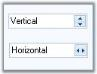
{:.image }

* Office2007Style - Added ability to set all the three color schemes, Blue, Silver and Black for Office2007 style.

{:.image }

Double TextBox

It is a text box-derived control that can display double data type values.

Features

* Supports display of double values.
* Supports values with a precision of 15 characters. The maximum and minimum values supported are by default the minimum and maximum values for the double data type.
* Supports displaying negative values in a different color and also using different negative formats.
* Handles user keyboard input and double formatting.
* Themes support.
* Uses the globalization features of the .NET platform to provide locale specific formatting.

Editable List

It provides an editable Windows Forms list box with a Windows Forms text box and button on the current row to facilitate in-place editing.

Features

* Offers in place editing.
* Supports auto completion from the list.

Folder Browser

FolderBrowser component provides a convenient and easy to use object oriented wrapper for the Win32 Shell folder browser API.

Features

* Includes textbox with Auto Completion support.
* Templates Support
* Supports the property that allows the specification of Custom Start Location.

FontListBox 

FontListBox is the list box derived controls that are automatically populated with the fonts installed in the user's system. 

Features

* Supports AutoComplete behavior.
* Offers Single - Select and Multi- Select options.

Font ComboBox

FontComboBox is the Combobox derived controls that are automatically populated with the fonts installed in the user's system. 

Features

* Supports AutoComplete behavior.

GradientLabel

It provides a way for create visually appealing labels for Windows Forms Controls. 

Features

* Customizable background.
* Support for different borders and patterns.

Integer TextBox

It is derived from a Windows Forms framework text box control and can display integer data type values. 

Features

* Displays Int64 values.
* Default minimum and maximum values correspond to the Int64 data type values.
* Displays negative values in a different color.
* Uses different negative formats.
* Handles user keyboard input and double formatting.
* Uses the globalization features of the .NET platform to provide locale-specific formatting.
* Themes Support.

Masked EditBox

It provides an easy and reliable way of collecting user input and displaying standard data in specific formats from any data source. 

Features

* Compatible with Windows Forms Textbox control.
* Supports all the commonly used Mask Symbols.
* Complete support for the common clipboard operations.

MonthCalendarAdv

It is an advanced calendar control that can display a full month of the year with the appropriate culture information for the months and days of the week. 

Features

* Supports the BorderStyles for the Calendar.
* Supports a DoubleClick event.
* Supports images for the left scroll button and the right scroll button.
* The images for the scroll buttons can be stretched or shrunk to fit the size of the scroll buttons.
* Displays the week number along the left side of the month calendar. 
* Can set the WeekFont, WeekTextColor and WeekInterior.
* Supports XP, Office 2003 and Office 2007 Visual Styles.

MultiColumnComboBox

It is an advanced combo box control that has the capability to show multiple columns in the drop-down list. 

Features

* Can be bound to very large datasources, instantaneously.
* Supports XP, Office 2003 and Office 2007 Visual Styles.

NumericUpDownExt

It enables XP Themed look-and-feel for the UpDown controls that are missing in the corresponding .NET Control. 

Features

* XP Themed look and feel.
* Support for displaying negative values in a different color.

Percent TextBox

It is a text box-derived control that can display double data type values in percentage format. 

Features

* Supports display of percent values in two modes - Percent and Double.
* In PercentMode, the values are edited as percentage values itself. 
* In DoubleMode, the values are edited as double values and then displayed using percentage formatting.
* Uses the globalization features of the .NET platform to provide locale-specific formatting. 

PopupControlContainer

It is a panel-derived control that allows users to populate it with child controls in code or during design-time.

Features

* Various User Interface child controls can be integrated in the PopupControlContainer.
* Allows the user to populate the popup with the desired parent control.

RadioButtonAdv

RadioButtonAdv functions are similar to the standard windows RadioButton, with some additional enhancements.

Features

* Supports visual themes.
* Images can be displayed as the check.

TextBoxExt

It is a text box-derived control that can display different border colors and styles.

Features

* The control provides different 2D and 3D border styles for a regular text box.
* Offers Themes support and flow indicators.
* Custom Colors can be applied for the following controls. ComboBoxAdv, ComboDropDown, ComboBoxAutoComplete and TextBoxExt. See Visual Styles topic.
### AutoComplete Controls

AutoComplete functionality is discussed in the following controls.

#### AutoComplete

The AutoComplete control is an extender control that provides AutoCompletion services to any edit control on the same form as the AutoComplete control.

AutoCompletion can be defined as prompting the user with probable matches during data entry. This feature is similar to the AutoCompletion of the web addresses in the Internet Explorer address box.

{:.image }

AutoCompletion is a feature enhancement for edit controls. It expands strings that have been partially entered in an edit control into complete strings based on a list of previously specified strings.

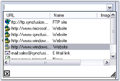
{:.image }

For example, when a user starts to enter an URL in theAddress edit control that is embedded in the Microsoft Internet Explorer navigation toolbar, autocompletion expands the string into one or more complete URLs that are consistent with the existing partial string. A partial URL string such as "sync" might be expanded to "http://www.syncfusion.com" or "http://www.syncfusion.com/faq/winforms". This feature will be useful in windows applications that require collecting frequently repeated input from the user. 

The .NET framework does not provide any built-in support for providing autocompletion in the System.Windows.Forms.Textbox or System.Windows.Forms.Combobox classes. The Essential Tools AutoComplete class provides an easy way of adding autocompletion to edit controls in an application. Autocompletion is typically used with edit controls (text box controls) or with controls that have an embedded edit control (such as combo box controls). 

The AutoComplete class is implemented as an Extender Provider similar to the ToolTip control in the Windows Forms package. 

See Also

ComboBoxAutoComplete, Auto Append

##### Features

AutoComplete expands strings that have been partially entered in an edit control into complete strings based on a list of previously specified strings. It has following features.

* Easy to use designer support - Enables users to drag and drop an Auto Complete control to a form and set an extender property on the target control easily without a single piece of code.
* You can implement Microsoft Internet Explorer style auto completion with ease using the Auto Complete control.
* Multiple target controls can use the same Auto Complete control and data source. 
* It provides Auto Complete support to Text Box, ComboBox and user controls that embeds an edit control. 
* It can be bound to DataSource.
* AutoComplete functionality can also be provided for RichTextBox control.
* It is possible to format the text in a standard TextBox control that uses an AutoComplete component based on the data source of the AutoComplete.
* We can hide the close button, gripper and column header in the AutoComplete DropDown. SeeSee Header, Close Button and Gripper to know more.
* We can set width for AutoComplete DropDown.
* We can add multiple columns for AutoComplete DropDown.
* It supports serialization of history items to the Windows Registry, Isolated Storage or the File System.
* We can also do custom matching i.e, we can override the default matching of the current content of the target edit control.

See Also

Concepts and Features

##### Creating AutoComplete Control

This section will guide you to implement a simple AutoComplete control with a TextBox via designer and programmatically.

###### Through Designer

This tutorial illustrates the usage of the AutoComplete control for TextBox, without any external data source. 

1. Create a new Windows Forms application and open the main form for the application in the designer. Add the Syncfusion controls to the VS .NET toolbox, if you have not done so already. Drag-and-drop an AutoComplete control onto the form.

{:.image }

2. The AutoComplete control will appear as a component in the component tray of the design environment. Similarly add aText box, two labels and a button to make the form interactive. 

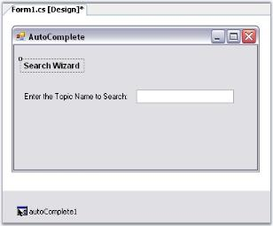
{:.image }

3. When the AutoComplete control is added to the form, the AutoComplete on autocomplete property is added to the text box control properties. This property specifies the type of autocompletion to be provided by the autoComplete1 control for the comboBox1 control. The default value for AutoComplete on autoComplete1 will be set to AutoCompleteModes.Disabled. Use the drop-down box provided in the property grid to change it to the mode of autocompletion toAutoSuggest. The different modes of autocompletion are detailed in AutoComplete Modes topic. 

{:.image }

4. Set AutoComplete.AutoAddItem property to true. Run the application, type any text in the textbox and hit Enter to save the entry. Select the text, delete it and then retype the first letter of the text you saved. You should see autocompletion of the letter, as shown below.
> 

{:.image }
 _Note: The text entered can be saved only when AutoAddItem property is set to True._

{:.image }

> 
{:.image }
 _Note: We can also add a list of autocomplete items through designer, which can used as a source for AutoComplete control. SeeSee_ Source for AutoComplete Control _topic for details._

See also

Concepts and Features

###### Through Code

 This section will guide you, to programmatically add, and associate an AutoComplete control to a textbox.

5. Include the required namespace.

[C#]

using Syncfusion.Windows.Forms.Tools;

[VB.NET]

Imports Syncfusion.Windows.Forms.Tools

6. Create an instances of AutoComplete and TextBox controls.

[C#]

private Syncfusion.Windows.Forms.Tools.AutoComplete autoComplete1;

private System.Windows.Forms.TextBox textBox1;

this.textBox1=new TextBox();

this.autoComplete1=new AutoComplete();

[VB.NET]

Private autoComplete1 As Syncfusion.Windows.Forms.Tools.AutoComplete

Private textBox1 As System.Windows.Forms.TextBox

Me.textBox1 = New TextBox()

Me.autoComplete1 = New AutoComplete()

7. Associate AutoComplete with TextBox using SetAutoComplete() method.

[C#]

this.autoComplete1.SetAutoComplete(this.textBox1,Syncfusion.Windows.Forms.Tools.AutoCompleteModes.AutoSuggest);

[VB.NET]

Me.autoComplete1.SetAutoComplete(Me.textBox1,Syncfusion.Windows.Forms.Tools.AutoCompleteModes.AutoSuggest)

8. Specify its properties.

[C#]

this.autoComplete1.AutoAddItem=true;

this.autoComplete1.AutoSerialize=true;

[VB.NET]

Me.autoComplete1.AutoAddItem=True

Me.autoComplete1.AutoSerialize=True

9. Finally add textBox to the Form.

[C#]

this.Controls.Add(this.textBox1);

[VB.NET]

Me.Controls.Add(Me.textBox1)

{:.image }

See also

Through Designer, Concepts and Features

##### Concepts and Features

The following topics will help you become more familiar in using the AutoComplete control.

###### AutoComplete Popup

When a control is associated with an AutoComplete control, a popup will be displayed, based on the source. This section illustrates various components of the AutoComplete Popup with their properties which can control the appearance and behavior of the components.

{:.image }

This section will discuss various components in the AutoComplete popup.

###### Header, Close Button and Gripper

Header Settings

DropDown item can have a header which is enabled using AutoComplete.ShowColumnHeader property. AutoAddItem property should be set to true.

_Table_ _109__: Property Table_

<table>
<tr>
<td>
AutoComplete Properties</td><td>
Description</td></tr>
<tr>
<td>
AutoAddItem</td><td>
Specifies whether the current item in the target control is to be automatically added during validation, when the ENTER key is pressed.</td></tr>
</table>
> 
{:.image }
 _Note: The header will be shown only for the text that is saved at run time. Set AutoCompleteMode and AutoCompleteSource properties to None._

[C#]

this.autoComplete1.AutoAddItem = true;

this.autoComplete2.ShowColumnHeader = true; 

this.autoCompleteDataColumnInfo1.ColumnHeaderText = "Contents";

[VB.NET]

Me.autoComplete1.AutoAddItem = True

Me.autoComplete2.ShowColumnHeader = True

Me.autoCompleteDataColumnInfo1.ColumnHeaderText = "Contents"

{:.image }

> 
{:.image }
 _Note: You can also set multiple columns. Refer_ Multiple Columns _to know more._

Close Button and Gripper Settings

Visibility of close button and the gripper in the popup can be determined by ShowCloseButton and ShowGripper properties.

_Table_ _110__: Property Table_

<table>
<tr>
<td>
AutoComplete Properties</td><td>
Description</td></tr>
<tr>
<td>
ShowCloseButton</td><td>
Specifies whether to show the CloseButton at the bottom right of the DropDownContainer. By default it is true.</td></tr>
<tr>
<td>
ShowGripper</td><td>
Specifies whether to show gripper at the bottom right of a DropDownContainer. By default it is true.</td></tr>
</table>
> 
{:.image }
 _Note: The AutoComplete dropdown can be closed by calling AutoComplete.CloseDropDown() method._

[C#]

this.autoComplete1.ShowCloseButton = true;

this.autoComplete1.ShowGripper = true;

[VB.NET]

Me.autoComplete1.ShowCloseButton = True

Me.autoComplete1.ShowGripper = True

###### Behavior Settings

Case Sensitivity

At run time, the string entered in a textbox, for example, can be made case sensitive using the following properties.

_Table_ _111__: Properties_

<table>
<tr>
<td>
AutoComplete Properties</td><td>
Description</td></tr>
<tr>
<td>
IgnoreCase</td><td>
Specifies whether to ignore case sensitivity for string comparison. Default value is True.</td></tr>
<tr>
<td>
CaseSensitive</td><td>
Specifies whether the replacement of the matching entry is to be case sensitive.</td></tr>
</table>

[C#]

this.autoComplete1.IgnoreCase = false;

this.autoComplete1.CaseSensitive = true;

[VB.NET]

Me.autoComplete1.IgnoreCase = False

Me.autoComplete1.CaseSensitive = True

{:.image }

Overriding Combo

The Combobox drop down can be suppressed and overridden by the AutoComplete control using OverrideCombo property.

[C#]

this.autoComplete1.OverrideCombo = true;

[VB.NET]

Me.autoComplete1.OverrideCombo = True

Sorting

The items in the list can be sorted automatically by setting AutoSortList to True.

_Table_ _112__: Sorting Properties_

<table>
<tr>
<td>
AutoComplete Properties</td><td>
Description</td></tr>
<tr>
<td>
AutoSortList</td><td>
Specifies whether default sorting is to be performed.</td></tr>
</table>

[C#]

this.autoComplete1.AutoSortList = true;

[VB.NET]

Me.autoComplete1.AutoSortList = True

Duplicate values

The duplicate values can be used in AutoComplete DataSource by setting EnableDuplicateValues to True.

_Table_ _113__: Properties_

<table>
<tr>
<td>
AutoComplete Properties</td><td>
Description</td></tr>
<tr>
<td>
EnableDuplicateValues</td><td>
Gets or sets whether to allow duplicate values in AutoComplete DataSource</td></tr>
</table>

[C#]

//To use duplicate values in AutoComplete data source

this.autoComplete1.EnableDuplicateValues = true;

[VB.NET]

'To use duplicate values in AutoComplete data source

Me.autoComplete1.EnableDuplicateValues = True

See Also

[Source for AutoComplete Control](http://help.syncfusion.com/ug/windows%20forms/documents/sourceforautocomplet.htm), [External Datasource](http://help.syncfusion.com/ug/windows%20forms/documents/externaldatasource1.htm)

###### Size Settings

The properties which can control the height and width of the AutoCompletePopup are as follows.

_Table_ _114__: Property Table_

<table>
<tr>
<td>
AutoComplete Properties</td><td>
Description</td></tr>
<tr>
<td>
AdjustHeightToItemCount</td><td>
Specifies if the height of the drop down should be adjusted automatically, based on the number of items.</td></tr>
<tr>
<td>
AutoPersistentDropDownSize</td><td>
The Dropdown size of Autocomplete control is automatically persistent when this property is set to true.</td></tr>
<tr>
<td>
PreferredHeight</td><td>
Specifies preferred height for the drop down displayed by the AutoComplete control when AdjustHeightToItemCount property is false. Default value is 200.</td></tr>
<tr>
<td>
PreferredWidth</td><td>
Specifies preferred width for the drop down displayed by the AutoComplete control when AdjustHeightToItemCount property is false. Default value is -1.</td></tr>
</table>

[C#]

this.autoComplete1.AdjustHeightToItemCount = false;

this.autoComplete1.AutoPersistentDropDownSize = true;

this.autoComplete1.PreferredHeight = 100;

this.autoComplete1.PreferredWidth = 300;

[VB.NET]

Me.autoComplete1.AdjustHeightToItemCount = False

Me.autoComplete1.AutoPersistentDropDownSize = True

Me.autoComplete1.PreferredHeight = 100

Me.autoComplete1.PreferredWidth = 300

{:.image }

###### DataSource

This section will discuss the data settings for the AutoComplete control, in the below topics.

Data Settings

The data for the autocompletion will be maintained by the AutoComplete control itself. This is referred to as a History Data List mode. The below properties deals with data settings.

_Table_ _115__: Property Table_

<table>
<tr>
<td>
AutoComplete Properties</td><td>
Description</td></tr>
<tr>
<td>
CategoryName</td><td>
Specifies a unique or shared name that can be given to an AutoComplete control so that it can persist the values under that name. For example, if the CategoryName "URL" is provided for an AutoComplete control on a particular form, all values persisted by that AutoComplete control will also be accessible to other AutoComplete controls on others forms or on the same form with the CategoryName "URL". </td></tr>
<tr>
<td>
DataSource</td><td>
Sets the Datasource to the Autocomplete control. The AutoComplete control automatically picks the "History Data List" mode or "Data source" mode based on the values set for the DataSource property. If the datasource property is set to NULL (default value is NULL), the control defaults to History Data List mode. It is to be remembered that the properties CategoryName, AutoAddItem and AutoSerialize have to be set appropriately for the History Data List mode to work properly.</td></tr>
</table>

[C#]

this.autoComplete1.CategoryName = "FTP";

this.autoComplete1.DataSource = DataTable1;

[VB.NET]

Me.autoComplete1.CategoryName = "FTP"

Me.autoComplete1.DataSource = DataTable1

> 
{:.image }
 _Note: We can set External datasource for the autocompletion. See_ External DataSource _topic._

See Also

How to delete the items in the list at run time?

Source for AutoComplete Control

Dynamic Source at RunTime

Enabling the AutoComplete.AutoAddItem property will allow the end users to save their entries at run time. Pressing Enter key will save the user entry. See Through Designer topic for details.

Setting AutoCompletion Source Through Designer

The different sources available for auto completion are specified using Control.AutoCompleteSource property. When the end user enters a letter in the TextBox for example, the letter will be matched with the source available and displays the dropdown item accordingly.

_Table_ _116__: Property Table_

<table>
<tr>
<td>
Property</td><td>
Description</td></tr>
<tr>
<td>
AutoCompleteSource</td><td>
Auto completion source for the control. The different sources are,{{ _FileSystem_ | markdownify }} - Files system as source,{{ _HistoryList_ | markdownify }} - Includes all the URLs in the history list,{{ _RecentlyUsedList_ | markdownify }} - Includes the list of most recently used URLs,{{ _AllUrl_ | markdownify }} - Equivalent source of HistoryList and RecentlyUsedList as the source,{{ _AllSystemSources_ | markdownify }} - Equivalent source of AllUrls and FileSystem as the source (Default value of AutoCompleteSource when AutoCompletMode is set to values other than default value),{{ _ListItems_ | markdownify }} - Specifies the items in the control, {{ _FileSystemDirectories_ | markdownify }} - Specifies directory names alone without file names,{{ _CustomSource_ | markdownify }} - Uses the string values entered in AutoCompleteCustomSource property and{{ _None_ | markdownify }} - There will not be any source for the auto completion.</td></tr>
</table>

[C#]

this.textBox1.AutoCompleteSource = System.Windows.Forms.AutoCompleteSource.HistoryList;

[VB.NET]

Me.textBox1.AutoCompleteSource = System.Windows.Forms.AutoCompleteSource.HistoryList

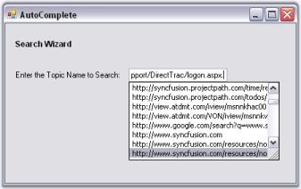
{:.image }

Custom Source

AutoComplete control lets you to specify a set of auto completion text using String Collection Editor. This editor is invoked using Control.AutoCompleteCustomSource property. 

{:.image }

At run time when the user types the first letter, it will automatically display the auto completion list added through this editor.

> 
{:.image }
 _Note: Control.AutoCompleteSource property should be set to "CustomSource" for this setting to be effective._

[C#]

this.textBox1.AutoCompleteSource = System.Windows.Forms.AutoCompleteSource.CustomSource;

this.textBox1.AutoCompleteCustomSource.AddRange(new string[] {"Customization Settings", "Customization Properties",

"Customizing the items", "Custom Collections"});

[VB.NET]

Me.textBox1.AutoCompleteSource = System.Windows.Forms.AutoCompleteSource.CustomSource

Me.textBox1.AutoCompleteCustomSource.AddRange(New String[] {"Customization Settings", "Customization Properties",

"Customizing the items", "Custom Collections"})

{:.image }

Mode of AutoCompletion

AutoCompletion modes can be specified using AutoCompleteMode property.

_Table_ _117__: Property Table_

<table>
<tr>
<td>
Property</td><td>
Description</td></tr>
<tr>
<td>
AutoCompleteMode</td><td>
Gets or sets an option that controls how automatic completion, works for the control. The available modes are,{{ _None_ | markdownify }} - No autocompletion will be provided for this target edit control,{{ _Suggest_ | markdownify }} - The autocompletion will be presented as a list of probable matches in the form of a drop-down window,{{ _Append_ | markdownify }} - The closest match will be added to the partial string in the edit control and{{ _SuggestAppend_ | markdownify }} - A list of probable matches will be displayed as well as the entry will be completed in the edit control with the closest match.</td></tr>
</table>

[C#]

this.textBox1.AutoCompleteMode = System.Windows.Forms.AutoCompleteMode.SuggestAppend;

[VB.NET]

Me.textBox1.AutoCompleteMode = System.Windows.Forms.AutoCompleteMode.SuggestAppend

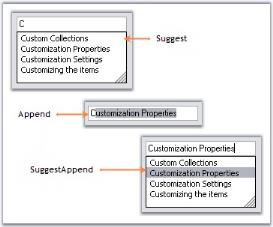
{:.image }

See Also

Multiple Columns, External Datasource

External Datasource

You can specify an external datasource for the AutoComplete control to use as the history list. This can be specified through the AutoComplete.DataSource property. The object specified for this property can be any object that implements IList or IListSource. 

10. Set AutoComplete mode to AutoSuggest.
11. Set the DataSource in the form's Load event as follows.

[C#]

private void Form1_Load(object sender, System.EventArgs e)

{

    // Set up the datasource on the Autocomplete control. 

this.oleDbDataAdapter1.Fill(this.dataSet11.organisation);

this.autoComplete1.DataSource = this.dataSet11.organisation;

}

[VB.NET]

Private Sub Form1_Load(ByVal sender As Object, ByVal e As System.EventArgs)

     ' Set up the datasource on the Autocomplete control  .

Me.oleDbDataAdapter1.Fill(Me.dataSet11.organisation)

Me.autoComplete1.DataSource = Me.dataSet11.organisation

End Sub

12. AutoCompleteItemSelected event is raised when a new item has been selected by the user when the AutoComplete drop down list is displayed. In this event, for the tutorial purpose, the code to display corresponding OrgID of the OrganisationName on the label is included. The below code retrieves the corresponding item from the datasource, for the selected item in the AutoComplete control.

[C#]

private void autoComplete1_AutoCompleteItemSelected(object sender,Syncfusion.Windows.Forms.Tools.AutoCompleteItemEventArgs args)

{

  // Displays corresponding OrgID of the OrganisationName on the label.

this.label1.Text = args.ItemArray[0].ToString();

}

[VB.NET]

Private Sub autoComplete1_AutoCompleteItemSelected(ByVal sender As Object, ByVal args As Syncfusion.Windows.Forms.Tools.AutoCompleteItemEventArgs)

  ' Displays corresponding OrgID of the OrganisationName on the label.

Me.label1.Text = args.ItemArray(0).ToString()

End Sub

{:.image }

Refer to Multiple Columns section for more information on configuring data sources with multiple columns.

###### Multiple Columns

The AutoComplete control allows users to display multiple columns of information for each matching entry in the AutoSuggest mode of operation. Columns can be configured through AutoComplete.Columns property. 

_Table_ _118__: Property Table_

<table>
<tr>
<td>
AutoComplete Properties</td><td>
Description</td></tr>
<tr>
<td>
Columns</td><td>
Specifies the collection of columns in the auto complete dropdown, when AutoCompleteModes enumerator value is AutoSuggest. Each column is represented by an AutoCompleteDataColumnInfo object. This class includes a definition for specifying whether the column is the matching column or the image column. </td></tr>
<tr>
<td>
MatchMode</td><td>
Specifies the modes in which the AutoCompleteControl fills the history list for the current text in the current edit control.The values are, {{ _Manual and_  | markdownify }}{{ _Automatic (default)._ | markdownify }}</td></tr>
</table>

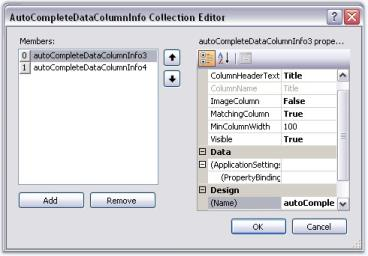
{:.image }

_Table_ _119__: Property Table_

<table>
<tr>
<td>
AutoCompleteDataColumn Properties</td><td>
Description</td></tr>
<tr>
<td>
ColumnHeaderText</td><td>
Represents the text for the column header.</td></tr>
<tr>
<td>
MatchingColumn</td><td>
Column that will be used by the AutoComplete control to perform matching with the current content (at runtime) of the target control.</td></tr>
<tr>
<td>
ImageColumn</td><td>
Column which is filled with data that is just the index into the image list that has been assigned to the AutoComplete control. See Image Settings for Details.</td></tr>
<tr>
<td>
MinColumnWidth</td><td>
Set minimum width for the column.</td></tr>
<tr>
<td>
Visible</td><td>
Shows or hides the column at runtime.</td></tr>
</table>

[C#]

this.autoComplete2.Columns.Add(this.autoCompleteDataColumnInfo1);

this.autoComplete2.Columns.Add(this.autoCompleteDataColumnInfo2);

this.autoComplete2.ShowColumnHeader = true;

this.autoComplete2.MatchMode = AutoCompleteMatchModes.Automatic;

this.autoCompleteDataColumnInfo1.ColumnHeaderText = "Title";

this.autoCompleteDataColumnInfo1.MatchingColumn = true;

this.autoCompleteDataColumnInfo1.Visible = true;

[VB.NET]

Me.autoComplete2.Columns.Add(Me.autoCompleteDataColumnInfo1)

Me.autoComplete2.Columns.Add(Me.autoCompleteDataColumnInfo2)

Me.autoComplete2.ShowColumnHeader = True

Me.autoComplete2.MatchMode = AutoCompleteMatchModes.Automatic

Me.autoCompleteDataColumnInfo1.ColumnHeaderText = "Title"

Me.autoCompleteDataColumnInfo1.MatchingColumn = True

Me.autoCompleteDataColumnInfo1.Visible = True

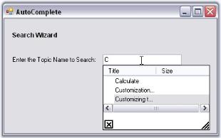
{:.image }

Column can be added matched using external sources also. A sample which demonstrates this feature is available in the below location.

…\_My Documents\Syncfusion\EssentialStudio\Version Number\Windows\Tools.Windows\Samples\Advanced Editor Functions\ActionGroupingDemo_

While using an external datasource, the Columns property can be initially refreshed by clicking on the RefreshColumns verb visible in the designer.

> 
{:.image }
 _Note: We can also add images to the dropdown items using internal source and external source. See_ Image Settings _for details._

See Also

Source for AutoComplete Control, How to match items in all the columns using AutoCompleteControl?

###### Image Settings

We can add a dropdown item with image to the AutoComplete popup, through the AutoComplete.AddHistoryItem method. An imagelist should be associated with AutoComplete control for this purpose. Specify the item text and the image index in this method.

_Table_ _120__: Method Table_

<table>
<tr>
<td>
AutoComplete Method</td><td>
Description</td></tr>
<tr>
<td>
AddHistoryItem</td><td>
Adds item to the internal history of the AutoComplete control. The parameters are,{{ _newItemText_ | markdownify }} - Text for the dropdown item.{{ _ImageIndexValue_ | markdownify }} - Index of the image for the particular item.</td></tr>
</table>

[C#]

this.autoCompleteDataColumnInfo1.ColumnHeaderText = "Title";

this.autoCompleteDataColumnInfo1.ImageColumn = false;

this.autoCompleteDataColumnInfo1.MatchingColumn = true;

this.autoCompleteDataColumnInfo1.Visible = true;

this.autoCompleteDataColumnInfo2.ColumnHeaderText = "Size";

this.autoCompleteDataColumnInfo2.ImageColumn = true;

this.autoCompleteDataColumnInfo2.MatchingColumn = false;

this.autoCompleteDataColumnInfo2.Visible = true;

this.autoComplete1.AddHistoryItem("User Guide", 3);

this.autoComplete1.AddHistoryItem("User Item", 2);

[VB.NET]

Me.autoCompleteDataColumnInfo1.ColumnHeaderText = "Title"

Me.autoCompleteDataColumnInfo1.ImageColumn = False

Me.autoCompleteDataColumnInfo1.MatchingColumn = True

Me.autoCompleteDataColumnInfo1.Visible = True

Me.autoCompleteDataColumnInfo2.ColumnHeaderText = "Size"

Me.autoCompleteDataColumnInfo2.ImageColumn = True

Me.autoCompleteDataColumnInfo2.MatchingColumn = False

Me.autoCompleteDataColumnInfo2.Visible = True

Me.autoComplete1.AddHistoryItem("User Guide", 3)

Me.autoComplete1.AddHistoryItem("User Item", 2)

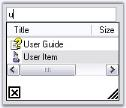
{:.image }

Items with Images Through External DataSource

Items with images can be added to the AutoCompletePopup, also using external datasource like XML file. A sample which demonstrates the implementation of external datasource is available in the below location. 

…\_My Documents\Syncfusion\EssentialStudio\Version Number\Windows\Tools.Windows\Samples\Advanced Editor Functions\ActionGroupingDemo_

While using an external datasource, the Columns property can be initially refreshed by clicking the _Refresh Columns_ verb, visible in the designer.

See Also

Multiple Columns

###### Persistence

The history list of AutoComplete control can be saved in the following formats.

* Binary Format
* XML Format
* IsolatedStorage medium
* MemoryStream
* PersistState property

The AutoComplete control has a fully built-in serialization feature that provides automatic serialization of the AutoComplete's history list.  The serialization mechanism is implemented using the standardized Syncfusion.Windows.Forms.AppStateSerializer component that acts as a central coordinator for all the Essential Tools components and provides the option to read / write to different media such as the default Isolated Storage, XML file, XML stream, Binary file, Binary stream and the Windows Registry.

Persisting AutoComplete's data in default storage 

The data of AutoComplete's control can be persisted by setting the AutoSerialize property to true. This information is stored in the Isolated storage.

_Table_ _121__: Property Table_

<table>
<tr>
<td>
AutoComplete Property</td><td>
Description</td></tr>
<tr>
<td>
AutoSerialize</td><td>
Specifies whether AutoComplete control can persist its data.</td></tr>
</table>

[C#]

this.autoComplete1.AutoSerialize = true;

[VB.NET]

Me.autoComplete1.AutoSerialize = True

The AutoComplete control has built-in support for serialization that can be enabled or disabled using the AutoSerialize property. 

The default serialization option is Isolated storage and the System.IO.IsolatedStorage routines normally store application specific encrypted entries under the 'C:\Documents and Settings\[USER name]\Local Settings\Application Data\IsolatedStorage\’ folder. All of the Essential Tools framework components use the 'Syncfusion.Runtime.Serialization.AppStateSerializer' class in the Shared library for Read/Write. The AppStateSerializer is fully documented and can be initialized for different persistence mediums such as XML / Binary files, XML / Binary streams, and the Win32 Registry using its API.

Persisting in XML file

To save and load the AutoComplete data in a XML,

[C#]

using Syncfusion.Runtime.Serialization;

// To Save

AppStateSerializer aser = new AppStateSerializer(SerializeMode.XMLFile, @"C:\info.xml");

this.autoComplete1.SaveCurrentState(aser);

// To Load

AppStateSerializer aser = new AppStateSerializer(SerializeMode.XMLFile, @"C:\info.xml");

this.autoComplete1.LoadCurrentState(aser);

[VB.NET]

Imports Syncfusion.Runtime.Serialization

' To Save

Private aser As AppStateSerializer = New AppStateSerializer(SerializeMode.XMLFile, "C:\info.xml")

Me.autoComplete1.SaveCurrentState(aser)

' To Load

Private aser As AppStateSerializer = New AppStateSerializer(SerializeMode.XMLFile, "C:\info.xml")

Me.autoComplete1.LoadCurrentState(aser)

End Sub()

Persisting in Memory Stream

To serialize the data into a memory stream,

Storing State

[C#]

MemoryStream ms = new MemoryStream();

AppStateSerializer aser = new AppStateSerializer(SerializeMode.BinaryFmtStream, ms);

this.autoComplete1.SaveCurrentState(aser);

aser.PersistNow();

[VB.NET]

Dim ms As MemoryStream = New MemoryStream()

Private aser As AppStateSerializer = New AppStateSerializer(SerializeMode.BinaryFmtStream, ms)

Me.autoComplete1.SaveCurrentState(aser)

aser.PersistNow()

Retrieving State

[C#]

// Code to retrieve data(stream) from database

MemoryStream ms = new MemoryStream(val);

ms.Position = 0;

AppStateSerializer aser = new AppStateSerializer(SerializeMode.BinaryFmtStream, ms);

this.autoComplete1.LoadCurrentState(aser);

[VB.NET]

'Code to retrieve data(stream) from database

Dim ms As MemoryStream = New MemoryStream(value)

ms.Position = 0

Dim aser As AppStateSerializer = New AppStateSerializer(SerializeMode.BinaryFmtStream, ms)

this.autoComplete1.LoadCurrentState(aser);

To serialize in Binary Format, use the below code.

[C#]

// To Save

AppStateSerializer aser = new AppStateSerializer(SerializeMode.BinaryFile,"myfile");

this.autoComplete1.SaveCurrentState(aser);

aser.PersistNow();

// To Load

AppStateSerializer aser = new AppStateSerializer(SerializeMode.BinaryFile,"myfile");

this.autoComplete1.LoadCurrentState(aser);

[VB.NET]

' To Save

Private aser As AppStateSerializer = New AppStateSerializer(SerializeMode.BinaryFile, "myfile")

Me.autoComplete1.SaveCurrentState(aser)

aser.PersistNow()

' To Load

Private aser As AppStateSerializer = New AppStateSerializer(SerializeMode.BinaryFile, "myfile")

Me.autoComplete1.LoadCurrentState(aser)

To serialize in Isolated Storage medium, use the below code.

[C#]

// To Save

AppStateSerializer aser = new AppStateSerializer(SerializeMode.IsolatedStorage, "myfile");

this.autoComplete1.SaveCurrentState(aser);

aser.PersistNow();

// To Load

AppStateSerializer serializer = new AppStateSerializer(SerializeMode.IsolatedStorage, "myfile");

this.autoComplete1.LoadCurrentState(aser);

[VB.NET]

' To Save

Private aser As AppStateSerializer = New AppStateSerializer(SerializeMode.IsolatedStorage, "myfile")

Me.autoComplete1.SaveCurrentState(aser)

aser.PersistNow()

' To Load

Private serializer As AppStateSerializer = New AppStateSerializer(SerializeMode.IsolatedStorage, "myfile")

Me.autoComplete1.LoadCurrentState(aser)

###### Support to Set Maximum Limit for Suggestion List 

The AutoComplete control displays a filtered suggestion list from a mapped data source in a drop-down as the user types text into the text box. This feature provides support to set the maximum number for the filtered suggestion. 

Use Case Scenarios

When you want to narrow down the filtering and get more accurate data, you can use this feature. 

Properties

_Table_ _122__: Property Table_

<table>
<tr>
<td>
Property </td><td>
Description </td><td>
Type </td><td>
Data Type </td><td>
Reference links </td></tr>
<tr>
<td>
MaxNumberofSuggestion</td><td>
Set the maximum limit for the suggestion list. </td><td>
NA</td><td>
Integer. </td><td>
NA </td></tr>
</table>
Sample Link

To view a sample:

13. Open Syncfusion Dashboard.
14. Click Windows Forms.
15. Click Run Samples.
16. Navigate to Tools Samples > Editors Package > AutoCompleteDemo. 

Maximum Number of Suggestion 

You can set the maximum number of suggestions to be displayed in the AutoComplete using the MaxNumberofSuggestion property: The following code illustrates this: 

[C#]

this.autoComplete1.MaxNumberofSuggestion = 5; 

[VB]

Me.autoComplete1.MaxNumberofSuggestion = 5

##### AutoComplete Events

The events of the AutoComplete control are as follows.

_Table_ _123__: Events Table_

<table>
<tr>
<td>
AutoComplete Events</td><td>
Description</td></tr>
<tr>
<td>
BeforeAddItem</td><td>
Handled when a new item is about to be added.</td></tr>
<tr>
<td>
AutoCompleteCustomize</td><td>
Handled to customize the AutoCompletion.</td></tr>
<tr>
<td>
AutoCompleteItemBrowsed</td><td>
Handled when the user selects an item from the list of possible matches when the AutoComplete is set to AutoSuggest.</td></tr>
<tr>
<td>
AutoCompleteItemSelected Event</td><td>
Occurs when a new item has been selected by the user when the AutoComplete mode is set to AutoSuggest.</td></tr>
<tr>
<td>
DropDownClosed</td><td>
Occurs when the AutoComplete dropdown is closed.</td></tr>
<tr>
<td>
DropDownDisplayed</td><td>
Occurs when the AutoComplete dropdown is displayed.</td></tr>
<tr>
<td>
MatchItem</td><td>
Enables you to provide a custom matching routine for the current value in the Edit control.</td></tr>
<tr>
<td>
PreMatchItem</td><td>
Handled before the AutoComplete control performs a matching operation for the current text content of the active Edit control.</td></tr>
<tr>
<td>
TargetChanging</td><td>
Occurs when the target control of the AutoComplete control changes.</td></tr>
</table>
###### AutoCompleteItemSelected Event

AutoCompleteItemSelected Event is raised, when a new item has been selected by the user when the AutoComplete mode is set to AutoSuggest.

This event is discussed in External DataSource topic.

###### BeforeAddItem Event

This event will be raised when new item is about to be added. New items can be added by calling AutoComplete.AddHistoryItem() method. The event handler receives an argument of type AutoCompleteAddItemCancelEventArgs containing data related to this event. The following are the properties associated with AutoCompleteAddItemCancelEventArgs argument.

_Table_ _124__: Members Table_

<table>
<tr>
<td>
 Members</td><td>
Description</td></tr>
<tr>
<td>
Cancel</td><td>
Gets/Sets a value indicating whether the event should be canceled.</td></tr>
<tr>
<td>
ImageColumnIndex</td><td>
Gets/Sets the ColumnIndex into the AutoComplete.ImageList property.</td></tr>
<tr>
<td>
RowItem</td><td>
It is the System.Data.DataRow object that contains the value that is to be added to the history list.</td></tr>
</table>

[C#]

private void autoComplete1_BeforeAddItem(object sender, AutoCompleteAddItemCancelEventArgs e)

{

//Cancels the item that is going to be added.

    e.Cancel = true;

}

[VB.NET]

Private Sub autoComplete1_BeforeAddItem(ByVal sender As Object, ByVal e As AutoCompleteAddItemCancelEventArgs)

'Cancels the item that is going to be added.   

   e.Cancel = True

End Sub

###### AutoCompleteItemBrowsed Event

This event will be raised when the user selects an item from the list of possible matches when the AutoComplete is set to AutoSuggest. The event handler receives an argument of type AutoCompleteItemEventArgs. The event properties associated with the AutoCompleteItemEventArgs are as follows.

_Table_ _125__: Members Table_

<table>
<tr>
<td>
Members</td><td>
Description</td></tr>
<tr>
<td>
SelectedValue</td><td>
Gets/Sets the value selected.</td></tr>
<tr>
<td>
Handled</td><td>
Specifies whether SelectedValue should be applied to target control. This can be used only with AutoCompleteItemSelected.</td></tr>
<tr>
<td>
ItemArray</td><td>
Returns AutoComplete item as an object array.</td></tr>
<tr>
<td>
MatchColumnIndex</td><td>
Returns the index of the item that was used for matching.</td></tr>
</table>

When the user selects an item from the list of possible matches when the AutoComplete is set to AutoSuggest, we can display the selected URL in separate TextBox. The following code illustrate this.

[C#]

private void autoComplete1_AutoCompleteItemBrowsed(object sender, Syncfusion.Windows.Forms.Tools.AutoCompleteItemEventArgs args)

{

string itemText = args.ItemArray[0].ToString();

string eventlogmessage = String.Format("Event: {0} Item: {1}\r\n", "AutoCompleteItemSelected", itemText);

textBox1.Text = textBox1.Text + eventlogmessage;

}

[VB.NET]

Private Sub autoComplete1_AutoCompleteItemBrowsed(ByVal sender As Object, ByVal args As Syncfusion.Windows.Forms.Tools.AutoCompleteItemEventArgs)

    Dim itemText As String = args.ItemArray(0).ToString()

    Dim eventlogmessage As String = [String].Format("Event: {0} Item: {1}" & Chr(13) & "" & Chr(10) & "", "AutoCompleteItemSelected", itemText)

    textBox1.Text = textBox1.Text + eventlogmessage

End Sub

###### MatchItem Event

We can override the default matching of the current content of the target edit control using this event. The event handler receives an argument of type AutoCompleteMatchItemEventArgs. The following are the properties associated with AutoCompleteMatchItemEventArgs argument.

_Table_ _126__: Members Table_

<table>
<tr>
<td>
 Members</td><td>
Description</td></tr>
<tr>
<td>
Cancel</td><td>
Gets/Sets a value indicating whether the event should be canceled.</td></tr>
<tr>
<td>
CurrentText</td><td>
Returns the current text value to be matched.</td></tr>
<tr>
<td>
PossibleMatch</td><td>
Returns the possible match value that needs to be compared against AutoCompleteMatchItemEventArgs.CurrentText by the event handler.</td></tr>
</table>

[C#]

private void autoComplete1_MatchItem(object sender, AutoCompleteMatchItemEventArgs args)

{

   //Cancels the match operation

   e.Cancel = true;

}

[VB.NET]

Private Sub autoComplete1_MatchItem(ByVal sender As Object, ByVal args As AutoCompleteMatchItemEventArgs)

   //Cancels the match operation

   e.Cancel = true;

End Sub

##### Frequently Asked Questions

This section illustrates the solutions for various task-based queries about the control.

###### How to add a new data row to the Data table at run time?

This is achieved by calling the SetTableData() method as follows. This method sets internal table data based on AutoComplete.DataSource property.

[C#]

DataTable dt;

private void Form1_Load(object sender, System.EventArgs e)

{

    dt = new DataTable("select");

    dt.Columns.Add("Countries");

    dt.Columns.Add("states");

    dt.Rows.Add(new object[] { "NorthCarolina" });

    dt.Rows.Add(new object[] { "India " });

    dt.Rows.Add(new object[] { "New York " });

    dt.Rows.Add(new object[] { "Washington " });

    dt.Rows.Add(new object[] { "London" });

    dt.Rows.Add(new object[] { "Canada" });

    autoComplete1.DataSource = dt;

}

private void button1_Click(object sender, System.EventArgs e)

{

    dt.Rows.Add(new object[] { "new1" });

    dt.Rows.Add(new object[] { "new2" });

   //sets the internal table data based on the AutoComplete.DataSource property. 

    this.autoComplete1.SetTableData();

}

[VB.NET]

Private dt As DataTable

Private Sub Form1_Load(ByVal sender As Object, ByVal e As System.EventArgs)

    dt = New DataTable("select")

    dt.Columns.Add("Countries")

    dt.Columns.Add("states")

    dt.Rows.Add(New Object() {"NorthCarolina"})

    dt.Rows.Add(New Object() {"India "})

    dt.Rows.Add(New Object() {"New York "})

    dt.Rows.Add(New Object() {"Washington "})

    dt.Rows.Add(New Object() {"London"})

    dt.Rows.Add(New Object() {"Canada"})

    autoComplete1.DataSource = dt

End Sub

Private Sub button1_Click(ByVal sender As Object, ByVal e As System.EventArgs)

    dt.Rows.Add(New Object() {"new1"})

    dt.Rows.Add(New Object() {"new2"})

    Me.autoComplete1.SetTableData()

End Sub

###### How to Programmatically display the autocomplete popup when a text box is enabled with autocomplete feature?

You can show the autocomplete popup programmatically using the following code.

[C#]

this.autoComplete1.AutoCompletePopup.ParentControl = this.textBox1;

this.autoComplete1.AutoCompletePopup.ShowPopup(Point.Empty);

[VB.NET]

Me.autoComplete1.AutoCompletePopup.ParentControl = Me.textBox1

Me.autoComplete1.AutoCompletePopup.ShowPopup(Point.Empty)

###### How to remove default selection from autocomplete drop-down?

To remove the default selection in autocomplete drop-down, set SelectedIndex property to _-1_ inside DropdownDisplayed event of the autocomplete control as follows.

[C#]

private void autoComplete1_DropDownDisplayed(object sender, EventArgs e)

{

    this.autoComplete1.SelectedIndex = -1;

}

[VB.NET]

Private Sub autoComplete1_DropDownDisplayed(ByVal sender As Object, ByVal e As EventArgs)

    Me.autoComplete1.SelectedIndex = -1

End Sub

###### How to delete the items in the list at run time?

You can delete items in the list at run time by pressing the Delete Key, by enabling AllowListDelete property.

[C#]

this.autoComplete1.AllowListDelete = true;

[VB.NET]

Me.autoComplete1.AllowListDelete = True

###### How to delete the history items persisted by an AutoComplete control?

We can delete the history items persisted by an AutoCompleteControl by calling AutoComplete.ResetHistory() method.

[C#]

this.autoComplete1.ResetHistory();

[VB.NET]

Me.autoComplete1.ResetHistory()

###### How to implement an AutoComplete Control in an User Control?

AutoComplete control can be used in an UserControl by setting the parent form of the User Control to the parent form property of the AutoComplete Control. 

[C#]

private void UserControl1_Load(object sender, System.EventArgs e) 

{  

this.autoComplete1.ParentForm = this.ParentForm;  

this.autoComplete1.DataSource = this.items; 

} 

[VB.NET]

Private Sub UserControl1_Load(ByVal sender As Object, ByVal e As System.EventArgs)

    Me.autoComplete1.ParentForm = Me.ParentForm

    Me.autoComplete1.DataSource = Me.items

End Sub

###### How to implement AutoComplete with RichTextBox control?

Follow the below steps to implement AutoComplete feature with RichTextBox control.

17. Implement the IEditControlsEmbed interface in a RichTextBox class which, will enable the AutoComplete functionality for the RichTextBox control.

[C#]

public class MyRichTextBox : System.Windows.Forms.RichTextBox, IEditControlsEmbed

{

      // Returns the active RichTextBox control.

       public Control GetActiveEditControl(IEditControlsEmbedListener listener)

       {

                  return (Control)this;

       }

}

[VB.NET]

Public Class MyRichTextBox Inherits System.Windows.Forms.RichTextBox Implements IEditControlsEmbed

    ' Returns the active RichTextBox control.

    Public Function GetActiveEditControl(ByVal listener As IEditControlsEmbedListener) As Control

        Return CType(Me, Control)

    End Function

End Class

18. Drag and drop the RichTextBox control and the AutoComplete control to a form.

[C#]

// Initialization

Syncfusion.Windows.Forms.Tools.AutoComplete autoComplete1= new Syncfusion.Windows.Forms.Tools.AutoComplete();;

MyRichTextBox richTextBox1= new MyRichTextBox();

[VB.NET]

' Initialization

Dim autoComplete1 As Syncfusion.Windows.Forms.Tools.AutoComplete = New Syncfusion.Windows.Forms.Tools.AutoComplete 
Dim richTextBox1 As MyRichTextBox = New MyRichTextBox

19. The AutoComplete control can take an external data source (any data source that implements IList or IListSource) for its history list. Here we have set a StringCollection as the DataSource.
20. When this property is set, the AutoComplete control will initialize itself with the data source and use that as the basis for its matching routines. For example, if you have a DataSet with a list of names of the States in the US and if you specify that as the DataSource, then the AutoComplete control will display all the matches from within these names when the user types in the target edit control.

[C#]

// Sets the DataSource.

StringCollection liste = new StringCollection();

    liste.Add("New Jersey");

    liste.Add("North Carolina");

    liste.Add("North Dakota");

    liste.Add("New York");

    liste.Add("New Mexico");

    autoComplete1.DataSource = liste;

[VB.NET]

' Sets the DataSource. 

Dim liste As StringCollection = New StringCollection 
        liste.Add("New Jersey") 
        liste.Add("North Carolina") 
        liste.Add("North Dakota") 
        liste.Add("New York") 
        liste.Add("New Mexico") 
        autoComplete1.DataSource = liste

21. Set the AutoCompleteonautoComplete1 property in the properties page to either AutoSuggest, AutoAppend or Both. 
22. SetAutoComplete is the extended property for the AutoComplete property which, will be called by the framework when the AutoComplete property is set on any control. When using the AutoComplete control programmatically, you need to use this method to add and remove auto completion for the RichTextBox control.

[C#]

this.autoComplete1.SetAutoComplete(this.richTextBox1,Syncfusion.Windows.Forms.Tools.AutoCompleteModes.AutoSuggest);

[VB.NET]

Me.autoComplete1.SetAutoComplete(Me.richTextBox1,Syncfusion.Windows.Forms.Tools.AutoCompleteModes.AutoSuggest)

23. The RichTextBox will be enabled with the AutoComplete functionality.
###### How to match items in all the columns using AutoCompleteControl

Matching items in multiple columns is possible using the AutoComplete control. We need to set the AutoCompleteModes to MultiSuggest or MultiExtended mode for this.

MultiSuggest - Possible matches from Multiple columns for the current content of the Active edit control, will be presented in a form of a popup window with a selectable list of matches. MultiSuggest mode is an extended mode of AutoSuggest. On selecting this mode, user  will be able to get the matching items in the active edit control from all the columns. 

[C#]

this.autoComplete1.SetAutoComplete(this.textBoxExt1 , Syncfusion.Windows.Forms.Tools.AutoCompleteModes.MultiSuggest);

[VB.NET]

Me.autoComplete1.SetAutoComplete(Me.textBoxExt1 , Syncfusion.Windows.Forms.Tools.AutoCompleteModes.MultiSuggest)

{:.image }

MultiSuggestExtended - This mode highlights all possible matches from Multiple columns, for the current content of the Active edit control, presented in the form of a popup window, with a selectable list of matches.

[C#]

this.autoComplete1.SetAutoComplete(this.textBoxExt1 , Syncfusion.Windows.Forms.Tools.AutoCompleteModes.MultiSuggestExtended);

[VB.NET]

Me.autoComplete1.SetAutoComplete(Me.textBoxExt1 , Syncfusion.Windows.Forms.Tools.AutoCompleteModes.MultiSuggestExtended)

{:.image }

###### How to retrieve the corresponding matching item from a Datasource for the selected Item in the AutoComplete Control?

This can be done using AutoCompleteItemSelected Event which is discussed in External Datasource topic.

#### ComboBoxAutoComplete

The ComboBoxAutoComplete control combines a combo box control with an AutoComplete control to provide autocompletion for that instance of the combo box. 

The ComboBoxAutoComplete control can be used on a form to provide autocompletion for one or several edit controls (text box and combo box). However, when the requirement is that each combo box requires data from a different datasource, it is necessary to use one AutoComplete control for each combo box. In this case, it is more efficient for the combo box control itself to include the AutoComplete control to be used for its auto completion.

The ComboBoxAutoComplete control fulfills this need. It derives from the windows forms combo box control and holds its own AutoComplete control that provides autocompletion for the combo box. 

##### Features

ComboBoxAutoComplete combines a ComboBox control with an AutoComplete control to provide Auto completion for that instance of the ComboBox and contains following features.

* AutoComplete: ComboBoxAutoComplete control provides AutoComplete behavior.
* Columns: We can use more than one column in the ComboBoxAutoComplete control.
* Datasource: We can also specify the external datasource for ComboBoxAutoComplete control.
##### Creating ComboBoxAutoComplete

Implementing a simple ComboBoxAutoComplete can be done in the following ways.

###### Through Designer	

 This tutorial illustrates the usage of the ComboBoxAutoComplete control without any external datasource.

> 
{:.image }
 _Note : This is applicable only for VS2005._

24. Drag-and-drop a ComboBoxAutoComplete control from the toolbox onto the form.

{:.image }

25. Add items to ComboBoxAutoComplete using AutoCompleteCustomSource collection editor as shown below.

{:.image }

26. Specify the text completion behavior of the control using ComboBoxAutoComplete.AutoCompleteMode. The value of AutoCompleteMode should not be none in this case. SeeSee Source for AutoComplete Control to know the different AutoCompleteModes. 
27. Set AutoCompleteSource to CustomSource as shown below. SeeSee Source for AutoComplete Control to know the different AutoComplete sources.

{:.image }

Output

At runtime, type 'C' in the display area of ComboBoxAutoComplete, you will see the autocompletion behavior as shown below.

{:.image }

###### Through Code

The embedded AutoComplete control in a ComboBoxAutoComplete control is exposed through the AutoCompleteControl property. The Datasource property of the AutoCompleteControl specifies the data that will be used for the auto completion of the combo box. It can be created programmatically as follows.

28. Include the required namespace.

[C#]

using Syncfusion.Windows.Forms.Tools;

[VB.NET]

Imports Syncfusion.Windows.Forms.Tools

29. Create an instance of the ComboBoxAutoComplete control class.

[C#]

private Syncfusion.Windows.Forms.Tools.ComboBoxAutoComplete comboBoxAutoComplete1;

this.comboBoxAutoComplete1=new Syncfusion.Windows.Forms.Tools.ComboBoxAutoComplete();

[VB.NET]

Private comboBoxAutoComplete1 As Syncfusion.Windows.Forms.Tools.ComboBoxAutoComplete

Me.comboBoxAutoComplete1 = New Syncfusion.Windows.Forms.Tools.ComboBoxAutoComplete()

30. Set data source and add the control to the form.

[C#]

this.comboBoxAutoComplete1.AutoCompleteCustomSource.AddRange(new string[] { "Custom", "Customizing", "Customizable"});

this.comboBoxAutoComplete1.AutoCompleteMode = System.Windows.Forms.AutoCompleteMode.SuggestAppend;

this.comboBoxAutoComplete1.AutoCompleteSource = System.Windows.Forms.AutoCompleteSource.CustomSource;

this.Controls.Add(this.comboBoxAutoComplete1);

[VB.NET]

Me.comboBoxAutoComplete1.AutoCompleteCustomSource.AddRange(New String() {"Custom", "Customizing", "Customizable"}) 

Me.comboBoxAutoComplete1.AutoCompleteMode = System.Windows.Forms.AutoCompleteMode.SuggestAppend 

Me.comboBoxAutoComplete1.AutoCompleteSource = System.Windows.Forms.AutoCompleteSource.CustomSource 

Me.Controls.Add(Me.comboBoxAutoComplete1)

31. Run the application.

{:.image }

See Also

Concepts and Features

##### Concepts and Features

This section contains information about using the ComboBoxAutoComplete control in some commonly used scenarios.

###### Behavior Settings

The behavior settings of a ComboBoxAutoComplete control includes the below properties.

_Table_ _127__: Property Table_

<table>
<tr>
<td>
ComboAutoComplete Properties</td><td>
Description</td></tr>
<tr>
<td>
AllowNewText</td><td>
Specifies whether the user is allowed to enter new text. User can be allowed to enter new text in the ComboAutoComplete by setting AllowNewText to true. AllowNewText is mainly used to prevent items that are not in the list while validating.</td></tr>
<tr>
<td>
ReadOnly</td><td>
Gets or Sets value indicating whether changes can be done to the combobox.</td></tr>
<tr>
<td>
UpdateComboSelectionProperties</td><td>
UpdateComboSelectionProperties set to true means the Property SelectedItem will return the AutoCompleteControl's SelectedItem. Else if it is set to false, then SelectedItem property should return the base class SelectedItem ie., the Windows ComboBox SelectedItem value.</td></tr>
</table>

[C#]

this.comboBoxAutoComplete1.AllowNewText= true;

this.comboBoxAutoComplete1.ReadOnly = true;

this.comboBoxAutoComplete1.UpdateComboSelectionProperties = false;

[VB.NET]

Me.comboBoxAutoComplete1.AllowNewText= True

Me.comboBoxAutoComplete1.ReadOnly = True

Me.comboBoxAutoComplete1.UpdateComboSelectionProperties = False

Refreshing the Columns 

When the datasource of the AutoComplete control is set to a valid datasource through the designer, the "Refresh Columns" verb can be clicked to automatically populate the Columns collection. This option is available in the context menu of the ComboBoxAutoComplete control and also as property grid command.

{:.image }

Banner Text Support

We can set banner text for the ComboBoxAutoComplete control. Refer BannerTextProvider Component topic for more details.

{:.image }

###### Multi Columns

We can use multiples columns in the ComboBoxAutoComplete control. In this case, we need to specify which column is to be used as the matching column using the ComboBoxAutoComplete.AutoCompleteControl.Columns properties. Adding multiple columns is discussed Multiple Columns topic in AutoCompleteControl UG. 

{:.image }

See Also

DataSource

###### Datasource

The following steps sets a DataView as the DataSource of ComboBoxAutoComplete.

32. Drag and drop SqlDataAdapter or OleDbDataAdapter tool from the Data tab of the Toolbox onto the form. This will appear in component tray under the form. The Data Adapter Configuration Wizard will be automatically launched to assist you. 
33. SqlConnection object and associated Command objects will be created to support the Data Adapter. 
34. Select the DataAdapter you created and click the "Generate DataSet" option at the bottom of the properties window. 
35. This will enable you to create a DataSet object, which will contain the DataTable/DataView which, wraps the record set you configured in the Wizard. 
36. Create a name for your DataSet object and select the table(s) to include. 
37. Enter the following code in the Load event of your form to fill the DataSet with data from the database.

{:.image }

[C#]

// Fills the DataSet with data from the database.

this.oleDbDataAdapter1.Fill(this.dataSet11);

[VB.NET]

' Fills the DataSet with data from the database.

Me.oleDbDataAdapter1.Fill(Me.dataSet11);

Adding Columns to the Popup and setting the matching column

Add columns through designer using ComboBoxAutoComplete.AutoCompleteControl.Columns property. Set the first column as the matching column.

{:.image }

Using the below code, assign the dataset as the data source for the ComboBoxAutoComplete control.

[C#]

// Assign  DataSet to the AutoCompleteControl.DataSource property of the ComboBoxAutoComplete.

this.comboBoxAutoComplete1.AutoCompleteControl.DataSource = this.dataSet11.Sports;

this.comboBoxAutoComplete1.DisplayMember = "Name";

// Sets the attributes of columns in the drop down list of the AutoComplete.

this.comboBoxAutoComplete1.AutoCompleteControl.Columns.Add(this.autoCompleteDataColumnInfo1);

this.comboBoxAutoComplete1.AutoCompleteControl.Columns.Add(this.autoCompleteDataColumnInfo2);

this.autoCompleteDataColumnInfo1.ColumnHeaderText = "Name";

this.autoCompleteDataColumnInfo1.MatchingColumn = true;

this.autoCompleteDataColumnInfo2.ColumnHeaderText = "ID";

[VB.NET]

' Assign  DataSet to the AutoCompleteControl.DataSource property of the ComboBoxAutoComplete.

Me.comboBoxAutoComplete1.AutoCompleteControl.DataSource = Me.dataSet11.Sports

Me.comboBoxAutoComplete1.DisplayMember = "Name"

' Sets the attributes of columns in the drop down list of the AutoComplete.

Me.comboBoxAutoComplete1.AutoCompleteControl.Columns.Add(Me.autoCompleteDataColumnInfo1)

Me.comboBoxAutoComplete1.AutoCompleteControl.Columns.Add(Me.autoCompleteDataColumnInfo2)

Me.autoCompleteDataColumnInfo1.ColumnHeaderText = "Name"

Me.autoCompleteDataColumnInfo1.MatchingColumn = True

Me.autoCompleteDataColumnInfo2.ColumnHeaderText = "ID"

{:.image }

###### Visual Styles

Visual Styles for the ComboBoxAutoComplete control can be set using VisualStyle property. The styles are,

* Default and 
* Office2007. 

[C#]

this.comboBoxAutoComplete1.VisualStyle = Syncfusion.Windows.Forms.Tools.ThemedComboBoxStyles.Office2007;

this.comboBoxAutoComplete1.Office2007ColorTheme = Syncfusion.Windows.Forms.Office2007Theme.Managed;

[VB.NET]

Me.comboBoxAutoComplete1.VisualStyle = Syncfusion.Windows.Forms.Tools.ThemedComboBoxStyles.Office2007

Me.comboBoxAutoComplete1.Office2007ColorTheme = Syncfusion.Windows.Forms.Office2007Theme.Managed

{:.image }

> 
{:.image }
 _Note: The control supports all the three office color schemes._

Custom Colors

We can also apply custom colors to the ComboBoxAutoComplete control by setting Office2007ColorTheme to "_Managed_" and specifying the custom color through the ApplyManagedColors method as follows.

[C#]

this.comboBoxAutoComplete1.Office2007ColorTheme = Syncfusion.Windows.Forms.Office2007Theme.Managed;

Office2007Colors.ApplyManagedColors(this, Color.LightGreen);

[VB.NET]

Me.comboBoxAutoComplete1.Office2007ColorTheme = Syncfusion.Windows.Forms.Office2007Theme.Managed

Office2007Colors.ApplyManagedColors(this, Color.LightGreen)

{:.image }

##### AutoAppend

Combo box controls are commonly used to select from a particular value from a list of items. In several instances, the developer is not aware of the contents of the combo box before the application is being used. 

For instance, in an FTP client application, if the user is allowed to enter the FTP address of the servers in a combo box, it is not possible to provide a complete list of all possible FTP servers. When the user enters a FTP server into a combo box, the value is lost unless the developer writes additional code to persist the user entries in the registry or in a file. Also, at initialization, the combo box should be reinitialized with the saved items from the registry or file into which the values were saved. 

The AutoAppend class provides auto persisting of previously entered items in a Windows Forms combo box based on a category keyword and also populates the combo box control's items collection with the persisted list. 

The AutoAppend class provides this service for any combo box control without the developer having to write any code for the persisting and reading of the values. 

The following screen shot illustrates the usage of the AutoAppend class to persist items previously entered in a combo box and add them to the items collection of the combo box.

{:.image }

###### Features

AutoAppend provides an auto persisting of previously entered items in a Windows Forms combo box based on a category keyword and also populates the combo box control's items collection with the persisted list. It has following features.

* New entries can be added to control's AutoAppend list programmatically.
* It can be used with AutoComplete control.
###### Associating AutoAppend with a control

We can associate AutoAppend class to a ComboBox control by following the below steps. 

38. Open a Visual Studio project and include the required namespace. 

[C#]

using Syncfusion.Windows.Forms.Tools;

[VB.NET]

Imports Syncfusion.Windows.Forms.Tools

39. Drag and drop a ComboBox control from the Toolbox onto the form. 
40. Create and instance of the AutoAppend class as follows.

[C#]

// Creating an instance of the AutoAppend Class.

private AutoAppend autoAppend1;

autoappend1 = new AutoAppend();

[VB.NET]

' Creating an instance of the AutoAppend Class.

Private autoAppend1 As AutoAppend

Private autoappend1 = New AutoAppend()

41. After creating the AutoAppend instance we need to associate it with an edit control. To achieve this use the AutoAppend.SetAutoAppend method. This method takes an object of AutoAppendInfo class which is used to hold the details of the data associated. 

_Table_ _128__: Methods Table_

<table>
<tr>
<td>
Method</td><td>
Description</td></tr>
<tr>
<td>
SetAutoAppend</td><td>
Sets AutoAppend behavior for the control specified. The parameters are,{{ _control_ | markdownify }} - control to which auto append class has to be associated.{{ _autoAppendInfo_ | markdownify }} - Initializes an AutoAppendInfo class which  has three parameters - {{ _AutoAppend_ | markdownify }} - specifies whether autoappend is enabled or not (true or false){{ _categoryName_ | markdownify }} - category to which contents in this control belong to.{{ _items_ | markdownify }} - Reference to an item list.{{ _maxItems_ | markdownify }} - specifies maximum number of items.</td></tr>
<tr>
<td>
GetAutoAppend</td><td>
Returns the AutoAppend info associated with the control. The parameter is control.</td></tr>
</table>

[C#]

// Calling this will enable AutoAppend behavior in the control.

autoappend1.SetAutoAppend(cmbBox,new AutoAppendInfo(true,"category name", al, 10)); //al is an IList object

[VB.NET]

' Calling this will enable AutoAppend behavior in the control.

autoappend1.SetAutoAppend(cmbBox,New AutoAppendInfo(True, "category name", al, 10)) ' al is an IList object

See Also

Adding New Entries Programmatically

###### Adding New Entries Programmatically

42. To add or move an item to the top of controls' AutoAppend list, call the method InsertOrMoveToTop. If the item is already present, it will be moved to the first place otherwise it will be added.
43. It takes 2 arguments. First one is the associated control and the second is the value in string.

[C#]

this.autoAppend1.InsertOrMoveToTop(this.comboBox1,"www.syncfusion.com");

[VB.NET]

Me.autoAppend1.InsertOrMoveToTop(Me.comboBox1,"www.syncfusion.com")

{:.image }

### Button Controls

Essential Tools Button controls are as follows. Detailed user guides are available for these control.

#### ButtonAdv

ButtonAdv is an advanced button control capable of displaying  images with different alignments and various border styles. It contains some additional feature to the standard Windows Forms Button. It can be configured into any of the predefined ButtonTypes such as Calculator, Up, Down, and so on. Also it can afford the XP or Office styles.

{:.image }

##### Features

ButtonAdvcontrol has the following features.

* Visual Styles - A wide variety of visual styles can be applied to the ButtonAdv, including the new Microsoft Office 2007 Style, in different color schemes, to enhance the appearance of the control. 
* Border Settings - Provides various border styles.
* Button Types - We can set different button types for ButtonAdv.
* Supports toggle, dropdown mode and automatic theme detection.
* Image Settings - The Images can be easily associated and it can be aligned anywhere on the ButtonAdv.
* Easy Customization of the control through designer without a single piece of code.
* Smart Tag - Has advanced smart tag options which lets you to set the properties easily.
##### Creating  ButtonAdv

The ButtonAdv control can be made available through designer by just dragging and dropping the control from the toolbox onto the form. 

{:.image }

It can be created programmatically by following the below steps.

44. Include the Tools Windows namespace to cs / vb file.

[C#]

using Syncfusion.Windows.Forms.Tools;

[VB.NET]

Imports Syncfusion.Windows.Forms.Tools

45. Create an instance of ButtonAdv control and add it to the form.

[C#]

private Syncfusion.Windows.Forms.ButtonAdv buttonAdv1;

this.buttonAdv1 = new Syncfusion.Windows.Forms.ButtonAdv();

this.Controls.Add(this.buttonAdv1);

[VB.NET]

Private buttonAdv1 As Syncfusion.Windows.Forms.ButtonAdv

Me.buttonAdv1 = New Syncfusion.Windows.Forms.ButtonAdv 

Me.Controls.Add(Me.buttonAdv1)

See Also

Concepts and Features

##### Concepts and Features

The following topics will help you become more familiar in using the ButtonAdv control.

###### ButtonAdv Appearance

This section will walk you through the below topics which discusses the properties that controls the appearance of the ButtonAdv.

Button Types

ButtonAdv control supports different button types in terms of its appearance. It is specified using the ButtonType property.

_Table_ _129__: Property Table_

<table>
<tr>
<td>
Property</td><td>
Description</td></tr>
<tr>
<td>
ButtonType</td><td>
Specifies the button type to be used in the ButtonAdv control. The options are as follows.{{ _Normal_ | markdownify }} - Normal button. (user can specify the image with this ButtonType).{{ _Calculator_ | markdownify }} - Calculator image is used.{{ _Currency_ | markdownify }} - Currency image is used.{{ _Down_ | markdownify }} - Down image is used.{{ _ComboXPDown_ | markdownify }} - Down image like in a Windows XP combo box.{{ _Up_ | markdownify }} - Up image is used.{{ _Left_ | markdownify }} - Left image is used.{{ _Right_ | markdownify }} - Right image is used.{{ _Redo_ | markdownify }} - Redo image is used.{{ _Undo_ | markdownify }} - Undo image is used.{{ _Check_ | markdownify }} - Check image is used.{{ _Browse_ | markdownify }} - Browse image is used.{{ _LeftEnd_ | markdownify }} - Left end image is used.{{ _RightEnd_ | markdownify }} - Right end image is used.</td></tr>
</table>
> 
{:.image }
 _Note: You can also specify your own image for the ButtonAdv using Image property and this will effect only when ButtonType is set to Normal. See_ Image Settings _to know more._

[C#]

//Setting Calculator button type

this.ButtonAdvControl.ButtonType=Syncfusion.Windows.Forms.Tools.ButtonTypes.Calculator;

[VB.NET]

'Setting Calculator button type

Me.ButtonAdvControl.ButtonType = Syncfusion.Windows.Forms.Tools.ButtonTypes.Calculator

{:.image }

> 
{:.image }
 _Note: The ButtonTypes are only provided for ease of use and do not in any way change the functionality of the buttons._

Example - A sample image which uses most of the button types in a single application is as follows. User will have to add respective functionalities for each button type.

{:.image }

Border Styles

Border style for the ButtonAdv control is specified in the below property.

_Table_ _130__: Property Table_

<table>
<tr>
<td>
Property</td><td>
Description</td></tr>
<tr>
<td>
BorderStyleAdv</td><td>
Specifies the border style for ButtonAdv control. The styles are,{{ _None,_ | markdownify }}{{ _Default,_ | markdownify }}{{ _Dashed,_ | markdownify }}{{ _Dotted,_ | markdownify }}{{ _Inset,_ | markdownify }}{{ _Outset,_ | markdownify }}{{ _Solid,_ | markdownify }}{{ _Bump,_ | markdownify }}{{ _Etched,_ | markdownify }}{{ _Flat,_ | markdownify }}{{ _Raised,_ | markdownify }}{{ _RaisedInner,_ | markdownify }}{{ _RaisedOuter,_ | markdownify }}{{ _Sunken,_ | markdownify }}{{ _SunkenInner and_ | markdownify }}{{ _SunkenOuter._ | markdownify }}</td></tr>
</table>
> 
{:.image }
 _Note: This setting will be effective only for Office2003, OfficeXP and WindowsXP styles set through ButtonAdv.Appearance property. See_ Visual Styles_._ 

[C#]

//Sample code for setting "SunkenOuter" Border Style using BorderStyleAdv

this.buttonAdv13.BorderStyleAdv = Syncfusion.Windows.Forms.ButtonAdvBorderStyle.SunkenOuter;

[VB.NET]

//Sample code for setting "SunkenOuter" Border Style using BorderStyleAdv

Me.buttonAdv13.BorderStyleAdv = Syncfusion.Windows.Forms.ButtonAdvBorderStyle.SunkenOuter

{:.image }

See Also

Visual Styles, Button Types

Visual Styles

Visual Styles for the ButtonAdv control can be enabled using UseVisualStyle property. The different visual style are specified through Appearance.

_Table_ _131__: Property Table_

<table>
<tr>
<td>
Property</td><td>
Description</td></tr>
<tr>
<td>
Appearance</td><td>
Sets the visual styles for the control when UseVisualStyle property is true. The styles are,{{ _Classic,_ | markdownify }}{{ _Office2000,_ | markdownify }}{{ _WindowsXP,_ | markdownify }}{{ _OfficeXP,_ | markdownify }}{{ _Office2003 and_  | markdownify }}{{ _Office2007._ | markdownify }}</td></tr>
</table>

[C#]

this.buttonAdv1.UseVisualStyle = Syncfusion.Windows.Forms.UseStyle.True;

//Sample code for setting "OfficeXP" style for ButtonAdv

this.buttonAdv1.Appearance = Syncfusion.Windows.Forms.ButtonAppearance.OfficeXP;

[VB.NET]

Me.buttonAdv1.UseVisualStyle = Syncfusion.Windows.Forms.UseStyle.True

'Sample code for setting "OfficeXP" style for ButtonAdv

Me.buttonAdv1.Appearance = Syncfusion.Windows.Forms.ButtonAppearance.OfficeXP

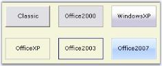
{:.image }

> 
{:.image }
 _Note: While mouse hovering over the OfficeXP, Office2003 and WindowsXP at run time, the button will be painted with some standard colors. This is an inbuilt feature in the ButtonControlAdv._

Office Color Themes

ButtonControlAdv supports all the three OfficeColor Schemes when ButtonAdv.Appearance is set to Office2007. Similarly you can set Blue and Black color schemes also. Default value is Blue.

[C#]

//Sample code for setting "Silver" color scheme for ButtonAdv

this.buttonAdv1.Office2007ColorScheme = Syncfusion.Windows.Forms.Office2007Theme.Silver;

[VB.NET]

'Sample code for setting "Silver" color scheme for ButtonAdv

Me.buttonAdv1.Office2007ColorScheme = Syncfusion.Windows.Forms.Office2007Theme.Silver

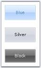
{:.image }

Custom Colors

We can also apply custom colors to the ButtonAdv control by setting Office2007ColorScheme to "_Managed"_ and specifying the custom color through the ApplyManagedColors method as follows.

[C#]

this.buttonAdv1.Office2007ColorScheme = Syncfusion.Windows.Forms.Office2007Theme.Managed;

Office2007Colors.ApplyManagedColors(this, Color.LightGreen);

[VB.NET]

Me.buttonAdv1.Office2007ColorScheme = Syncfusion.Windows.Forms.Office2007Theme.Managed

Office2007Colors.ApplyManagedColors(this, Color.LightGreen)

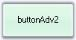
{:.image }

See Also

Button Types, Image Settings

Foreground Settings

Text for the ButtonAdv can be customized using the below properties.

_Table_ _132__: Property Table_

<table>
<tr>
<td>
Properties</td><td>
Description</td></tr>
<tr>
<td>
Text</td><td>
Sets the text for the ButtonAdv control.</td></tr>
<tr>
<td>
TextAlign</td><td>
Sets the alignment of the text in the control.  The options are,{{ _TopLeft,_ | markdownify }}{{ _TopCenter,_  | markdownify }}{{ _TopRight,_ | markdownify }}{{ _MiddleLeft,_   | markdownify }}{{ _MiddleCenter,_  | markdownify }}{{ _MiddleRight,_  | markdownify }}{{ _BottomLeft,_  | markdownify }}{{ _BottomCenter and_  | markdownify }}{{ _BottomRight._ | markdownify }}</td></tr>
<tr>
<td>
TextImageRelation</td><td>
Sets the relative location of the image to the text. The options are,{{ _Overlay,_ | markdownify }}{{ _ImageBeforeText,_ | markdownify }}{{ _TextBeforeImage,_ | markdownify }}{{ _ImageAboveText and_  | markdownify }}{{ _TextAboveImage._ | markdownify }}</td></tr>
<tr>
<td>
Font</td><td>
Sets the font style for the control's text.</td></tr>
<tr>
<td>
ForeColor</td><td>
Sets the fore color for the control's text.</td></tr>
</table>

[C#]

this.buttonAdv1.Text = "Image above Text";

this.buttonAdv4.TextAlign = System.Drawing.ContentAlignment.BottomCenter;

this.buttonAdv4.TextImageRelation = TextImageRelation.ImageAboveText;

this.buttonAdv1.Font = new System.Drawing.Font("Verdana", 8.25F, System.Drawing.FontStyle.Regular);

this.buttonAdv1.ForeColor = System.Drawing.Color.White;

[VB.NET]

Me.buttonAdv4.Text =  "Image above Text"

Me.buttonAdv4.TextAlign = System.Drawing.ContentAlignment.BottomCenter

Me.buttonAdv4.TextImageRelation = TextImageRelation.ImageAboveText

Me.buttonAdv1.Font = New System.Drawing.Font("Verdana", 8.25F, System.Drawing.FontStyle.Regular)

Me.buttonAdv1.ForeColor = System.Drawing.Color.White

{:.image }

###### Design Time Features

ButtonAdv control has Smart Tag, which lets you set the properties easily.

Smart Tag Options

{:.image }

The various settings through this window is as follows.

* Name - Lets you edit the control text.
* UseVisualStyle - Enables visual style settings.
* KeepFocusRectangle - Specifies whether to show focus rectangle or not.
* Appearance - Lets you to set the Visual style for the control.
* ButtonType - Lets you to set the button type.
* BorderStyles - Lets you to set the border styles for the control.
* Image - Lets you to set the image for the ButtonAdv control.
* ImageAlign - Sets the image alignment within the control.
* Text - Sets the text for button.
* Text Alignment - Sets the alignment of the text.
###### Image Settings

ButtonAdv supports two types of images. They are,

* BackgroundImage
* Image

BackgroundImage

BackgroundImage is the image used as the Background for the control, which is set using the BackgroundImage property. This BackgroundImage can be laid in various manner with the BackgroundImageLayout property.

{:.image }

Image

Image that will be displayed on the control.

{:.image }

The Images can be added to the ButtonAdv control in two ways. Either Image property can be used or the below properties.

_Table_ _133__: Property Table_

<table>
<tr>
<td>
Properties</td><td>
Description</td></tr>
<tr>
<td>
ImageList</td><td>
Sets the imagelist used for this control.</td></tr>
<tr>
<td>
ImageAlign</td><td>
Sets the alignment of the image inside the control. The options are,{{ _TopLeft,_  | markdownify }}{{ _TopCenter,_  | markdownify }}{{ _TopRight_ | markdownify }}{{ _MiddleLeft,_   | markdownify }}{{ _MiddleCenter,_  | markdownify }}{{ _MiddleRight,_  | markdownify }}{{ _BottomLeft,_  | markdownify }}{{ _BottomCenter and_  | markdownify }}{{ _BottomRight._ | markdownify }}</td></tr>
<tr>
<td>
ImageIndex</td><td>
Specifies the index for the image in the control.</td></tr>
<tr>
<td>
Text</td><td>
Sets the text for the ButtonAdv.</td></tr>
<tr>
<td>
TextAlign</td><td>
Sets the alignment of the text in the control.  The options are,{{ _TopLeft,_  | markdownify }}{{ _TopCenter,_  | markdownify }}{{ _TopRight_ | markdownify }}{{ _MiddleLeft,_  | markdownify }}{{ _MiddleCenter,_  | markdownify }}{{ _MiddleRight,_  | markdownify }}{{ _BottomLeft,_  | markdownify }}{{ _BottomCenter and_  | markdownify }}{{ _BottomRight._ | markdownify }}</td></tr>
<tr>
<td>
TextImageRelation</td><td>
Sets the relative location of the image to the text. The options are,{{ _Overlay,_ | markdownify }}{{ _ImageBeforeText,_ | markdownify }}{{ _TextBeforeImage,_ | markdownify }}{{ _ImageAboveText and_  | markdownify }}{{ _TextAboveImage._ | markdownify }}</td></tr>
</table>

{:.image }

> 
{:.image }
 _Note: The Image settings will be effective only when_ ButtonType _is set to Normal._

[C#]

this.btnAlignment.Image = ((System.Drawing.Bitmap)(resources.GetObject("btnAlignment.Image")));

this.btnAlignment.ImageAlign = System.Drawing.ContentAlignment.MiddleLeft;

this.btnAlignment.ImageIndex = 3;

this.btnAlignment.ImageList = this.imageList1;

[VB.NET]

Me.btnAlignment.Image = CType((resources.GetObject("btnAlignment.Image")), System.Drawing.Bitmap) 

Me.btnAlignment.ImageAlign = System.Drawing.ContentAlignment.MiddleLeft 

Me.btnAlignment.ImageIndex = 3 

Me.btnAlignment.ImageList = Me.imageList1

{:.image }

##### Frequently Asked Questions

This section illustrates the solutions for various task-based queries about the control.

###### How to draw or hide focus rectangle for the ButtonAdv control

ButtonControl shows some special features which the user interacts with the control. Those properties are discussed in this section.

_Table_ _134__: Property Table_

<table>
<tr>
<td>
Properties</td><td>
Description</td></tr>
<tr>
<td>
KeepFocusRectangle</td><td>
Specifies whether rectangle will be drawn around the control when it is focussed at run time.</td></tr>
</table>

[C#]

this.buttonAdv1.KeepFocusRectangle = true;

[VB.NET]

Me.buttonAdv1.KeepFocusRectangle = True

{:.image }

###### How to identify whether a ButtonAdv control is in pressed state or not

When ButtonAdv.PushButton property is enabled, the button will remain in its pressed state, when clicked. The state of the button will be present in the property State. So by examining the state property, we can conclude whether the button is in the Pressed state or not. Using the Office2007 visual styles will help better understanding of this feature.

_Table_ _135__: Property Table_

<table>
<tr>
<td>
Property</td><td>
Description</td></tr>
<tr>
<td>
PushButton</td><td>
Specifies the state of the control. By default it is set to false. Set this to true. Now at run time, when the user click this button, the appearance of the button will change to pushed state and will regain its original state only by clicking it again.</td></tr>
</table>

[C#]

private void buttonAdv1_Click(object sender, System.EventArgs e)

{

if(this.buttonAdv1.State==Syncfusion.Windows.Forms.ButtonAdvState.Pressed)

MessageBox.Show("Button is pushed");

else

MessageBox.Show("Button is in normal state");

}

[VB.NET]

Private Sub buttonAdv1_Click(ByVal sender As System.Object, ByVal e As System.EventArgs) Handles buttonAdv1.Click

if(Me.buttonAdv1.State==Syncfusion.Windows.Forms.ButtonAdvState.Pressed)

MessageBox.Show("Button is pushed")

else

MessageBox.Show("Button is in normal state")

End Sub

{:.image }

#### ButtonEdit

The ButtonEdit control embeds a text box control with a collection of button controls that can be customized to create many commonly used interfaces such as a file / folder browser or a drop-down text control. We can implement a file picker and folder browser using the ButtonEdit control. Drop-down popup controls can also be shown using the ButtonEdit control and the PopupContainerControl.

The edit control with a browse button extends a regular edit control by adding a button which can display an user-defined "browse" dialog. The ButtonEdit control provides an easy way to create controls with an edit control and any number of associated buttons. 

{:.image }

The ButtonEdit control derives from Syncfusion.Windows.Forms.ContainerControl and embeds one or more ButtonEditChildButton controls. The ButtonEditChildButton controls derive from Syncfusion.Windows.Forms.Button class and expose the functionality of buttons. 

Using an edit control alongside one or more button controls is a very common requirement in graphical user interface programming. Some of the common examples are browse edit controls and drop-down controls. 

##### Features

ButtonEdit is a composite control that combines buttons with a Text Box. The Button Edit control can be used for a variety of purposes that require a Text Box placed alongside one or more buttons. It has following features.

* It can be customized to create many commonly used interfaces such as a file / folder browser or a drop-down text control.
* Buttons can be added /removed through design verbs and also accessed through Buttons property collection editor.
* ButtonEdit Supports Themes (Blue, Oliver and Silver) and visual styles. See Style Settings.
* The ButtonEdit can be used to display the CalendarPopup. See Click Event topic.
* You can add and assign tasks to each ButtonEditChildButton of ButtonEdit.
* The internal Textbox for ButtonEdit can be modified to any custom TextBox, such as CurrencyTextBox, Integer TextBox, PercentTextBox, and so on.
* Images can be drawn over the buttons in ButtonEdit.
* Supports Databinding. See Click Event topic.

See Also

Concepts and Features

##### Creating ButtonEdit

This section will help you to get started with the ButtonEdit control. The below topics will guide you to create ButtonEdit control through designer and programmatically.

###### Through Designer

The ButtonEdit control can be used in situations where a set of buttons are needed alongside an edit control, such as in a browser for files dialog. This tutorial shows how to use the ButtonEdit control, set the Button properties and handle the events.

46. Create a new Windows Forms application and open the main form in the designer. Drag and drop ButtonEdit control from the toolbox to the form.  

{:.image }

47. When the control is initially added to the form, it appears like an edit control with no buttons.

{:.image }

48. We can add buttons to the control using ButtonEditChildButton Collection Editor which is invoked by ButtonEdit.Buttons property. Editor can also be accessed using Smart Tag option.

{:.image }

49. Set properties for buttons using the Editor. You can specify the attributes for any of the child buttons through the collection editor or by clicking any button and then selecting the properties in theproperty grid, that display the properties for the selected button.

{:.image }

> 
{:.image }
 _Note: You can also add or remove buttons to the ButtonEdit.Buttons collection through the Add Button and Remove Button verbs provided._

50. Run the application. You can specify handlers for these child buttons also.

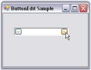
{:.image }

See Also

Concepts and Features

###### Through Code

To create a ButtonEdit control programmatically, follow the below steps.

51. Include the required namespace.

[C#]

using Syncfusion.Windows.Forms.Tools;

[VB.NET]

Imports Syncfusion.Windows.Forms.Tools

52. Create an instances of ButtonEdit, TextBox and three ButtonEditChildButtons.

[C#]

private Syncfusion.Windows.Forms.Tools.ButtonEdit buttonEdit1;

private System.Windows.Forms.TextBox textBox1;

private Syncfusion.Windows.Forms.Tools.ButtonEditChildButton buttonEditChildButton1;

private Syncfusion.Windows.Forms.Tools.ButtonEditChildButton buttonEditChildButton2;

private Syncfusion.Windows.Forms.Tools.ButtonEditChildButton buttonEditChildButton3;

this.buttonEdit1=new Syncfusion.Windows.Forms.Tools.ButtonEdit();

this.textBox1=new TextBox();

this.buttonEditChildButton1=new Syncfusion.Windows.Forms.Tools.ButtonEditChildButton();

this.buttonEditChildButton2=new Syncfusion.Windows.Forms.Tools.ButtonEditChildButton();

this.buttonEditChildButton3=new Syncfusion.Windows.Forms.Tools.ButtonEditChildButton();

[VB.NET]

Private buttonEdit1 As Syncfusion.Windows.Forms.Tools.ButtonEdit

Private textBox1 As System.Windows.Forms.TextBox

Private buttonEditChildButton1 As Syncfusion.Windows.Forms.Tools.ButtonEditChildButton

Private buttonEditChildButton2 As Syncfusion.Windows.Forms.Tools.ButtonEditChildButton

Private buttonEditChildButton3 As Syncfusion.Windows.Forms.Tools.ButtonEditChildButton

Me.buttonEdit1 = New Syncfusion.Windows.Forms.Tools.ButtonEdit()

Me.textBox1 = New TextBox()

Me.buttonEditChildButton1 = New Syncfusion.Windows.Forms.Tools.ButtonEditChildButton()

Me.buttonEditChildButton2 = New Syncfusion.Windows.Forms.Tools.ButtonEditChildButton()

Me.buttonEditChildButton3 = New Syncfusion.Windows.Forms.Tools.ButtonEditChildButton()

53. Embed the TextBox1 to the textBox of ButtonEdit.

[C#]

//Associating the TextBoxExt control.

this.buttonEdit1.TextBox=this.textBox1;

[VB.NET]

'Associating the TextBoxExt control.

Me.buttonEdit1.TextBox=Me.textBox1

54. Set the alignment and text for the buttons.

[C#]

//Setting Button alignment for Child Button 1

//By default the alignment for other buttons will be right

this.buttonEditChildButton1.ButtonAlign = ButtonAlignment.Left;

//Setting text for child Buttons.

this.buttonEditChildButton1.Text = "L";

this.buttonEditChildButton2.Text = "R";

this.buttonEditChildButton3.Text = "E";

[VB.NET]

'Setting Button alignment for Child Button 1. 

'By default the alignment for other buttons will be right

Me.buttonEditChildButton1.ButtonAlign = ButtonAlignment.Left

'Setting text for child Buttons

Me.buttonEditChildButton1.Text = "L"

Me.buttonEditChildButton2.Text = "R"

Me.buttonEditChildButton3.Text = "E"

55. Add ButtonEditChildButtons to the ButtonEdit which then add it to the form.

[C#]

this.buttonEdit1.Buttons.Add(this.buttonEditChildButton1);

this.buttonEdit1.Buttons.Add(this.buttonEditChildButton2);

this.buttonEdit1.Buttons.Add(this.buttonEditChildButton3);

this.Controls.Add(this.buttonEdit1);

[VB.NET]

Me.buttonEdit1.Buttons.Add(Me.buttonEditChildButton1)

Me.buttonEdit1.Buttons.Add(Me.buttonEditChildButton2)

Me.buttonEdit1.Buttons.Add(Me.buttonEditChildButton3)

Me.Controls.Add(Me.buttonEdit1)

56. Run the application. The output will be like below.

{:.image }

See Also

Concepts and Features

##### Concepts and Features

The following topics will help you become more familiar in using the ButtonEdit control.

###### ButtonEdit Appearance

A ButtonEdit control is a combination of controls with textbox and buttons. The buttons are normal windows buttons which supports all their properties and events. The ButtonEdit control itself supports properties which controls the appearance and behavior of the control. This section will discuss those properties in the below topics.

See Also

TextBox Settings for ButtonEdit, Child Button Customization

Style Settings

This section discusses the different styles available for the ButtonEdit control.

Button Styles

Styles for the ButtonEdit control is specified using ButtonStyle property.

_Table_ _136__: Property Table_

<table>
<tr>
<td>
Properties</td><td>
Description</td></tr>
<tr>
<td>
ButtonStyle</td><td>
Specifies the button style for the control. The styles are,{{ _Classic,_ | markdownify }}{{ _Office2000,_ | markdownify }}{{ _WindowsXP,_ | markdownify }}{{ _OfficeXP,_ | markdownify }}{{ _Office2003 and_  | markdownify }}{{ _Office2007._ | markdownify }}</td></tr>
<tr>
<td>
UseVisualStyle</td><td>
Specifies whether the visual styles can be applied using ButtonStyle property or not. This property should be set to true to make the ButtonStyle setting effective.</td></tr>
</table>

[C#]

this.buttonEdit3.UseVisualStyle = true;

this.buttonEdit3.ButtonStyle = Syncfusion.Windows.Forms.ButtonAppearance.Classic;

[VB.NET]

Me.buttonEdit3.UseVisualStyle = True

Me.buttonEdit3.ButtonStyle = Syncfusion.Windows.Forms.ButtonAppearance.Classic

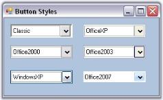
{:.image }

> 
{:.image }
 _Note: ButtonEdit control also supports all the three windows color themes, i.e., Blue, Silver and Oliver themes. We need to change the Windows theme color in desktop properties for this._

Custom Colors

We can also apply custom colors to the ButtonEditControl by setting Office2007ColorScheme of individual child buttons to "_Managed_" and specifying the custom color through the ApplyManagedColors method as follows.

[C#]

this.buttonEditChildButton1.Office2007ColorScheme = Syncfusion.Windows.Forms.Office2007Theme.Managed;

this.buttonEditChildButton2.Office2007ColorScheme = Syncfusion.Windows.Forms.Office2007Theme.Managed;

this.buttonEditChildButton3.Office2007ColorScheme = Syncfusion.Windows.Forms.Office2007Theme.Managed;

Office2007Colors.ApplyManagedColors(this, Color.LightGreen);

[VB.NET]

Me.buttonEditChildButton1.Office2007ColorScheme = Syncfusion.Windows.Forms.Office2007Theme.Managed

Me.buttonEditChildButton2.Office2007ColorScheme = Syncfusion.Windows.Forms.Office2007Theme.Managed

Me.buttonEditChildButton3.Office2007ColorScheme = Syncfusion.Windows.Forms.Office2007Theme.Managed

Office2007Colors.ApplyManagedColors(Me, Color.LightGreen)

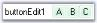
{:.image }

Border Styles

The border styles for the ButtonEdit can be controlled using the below properties.

_Table_ _137__: Property Table_

<table>
<tr>
<td>
Properties</td><td>
Description</td></tr>
<tr>
<td>
Border3DStyle</td><td>
Sets the 3D border style for the control. The options are,{{ _RaisedOuter,_ | markdownify }}{{ _RaisedInner,_ | markdownify }}{{ _SunkenOuter,_ | markdownify }}{{ _SunkenInner,_ | markdownify }}{{ _Raised,_ | markdownify }}{{ _Sunken,_ | markdownify }}{{ _Etched,_ | markdownify }}{{ _Flat,_ | markdownify }}{{ _Adjust and_  | markdownify }}{{ _Bump._ | markdownify }}</td></tr>
<tr>
<td>
BorderSides</td><td>
Specifies the sides of the control which should have border.</td></tr>
<tr>
<td>
FlatStyle</td><td>
Specifies the flat style to be applied to the ButtonEdit control. Set UseVisualStyle property to false to make this setting effective.</td></tr>
<tr>
<td>
FlatBorderColor</td><td>
Specifies the border color for the control, when FlatStyle is set to "Flat". This color setting can be reset by calling ButtonEdit.ResetFlatBorderColor method.</td></tr>
</table>

[C#]

this.buttonEdit3.UseVisualStyle = false;

this.buttonEdit3.FlatBorderColor = System.Drawing.Color.Red;

this.buttonEdit3.FlatStyle = System.Windows.Forms.FlatStyle.Flat;

[VB.NET]

Me.buttonEdit3.UseVisualStyle = False

this.buttonEdit3.FlatBorderColor = System.Drawing.Color.Red;

this.buttonEdit3.FlatStyle = System.Windows.Forms.FlatStyle.Flat;

{:.image }

> 
{:.image }
 _Note: The Border styles of the child buttons can be controlled using ButtonEditChildButton.BorderStyleAdv property. SeeSee_ Button Types and Border Styles _topic for details._

Size Settings

We can specify the maximum and minimum size for the ButtonEdit control using MaximumSize and MinimumSize properties.

_Table_ _138__: Property Table_

<table>
<tr>
<td>
Properties</td><td>
Description</td></tr>
<tr>
<td>
MaximumSize</td><td>
Sets the maximum size of the ButtonEdit control.</td></tr>
<tr>
<td>
MinimumSize</td><td>
Sets the minimum size of the ButtonEdit control.</td></tr>
</table>
See Also

Foreground Settings

Foreground Settings

This section discusses the foreground settings available for the ButtonEdit control.

Font and ForeColor

The font style and the forecolor for the ButtonEdit text can be set using Font and ForeColor properties. These property settings can be overridden by TextBox.Font and TextBox.ForeColor respectively.

[C#]

this.buttonEdit3.Font = new System.Drawing.Font("Verdana", 8.25F, System.Drawing.FontStyle.Regular);

this.buttonEdit3.ForeColor = Color.SteelBlue;

[VB.NET]

Me.buttonEdit3.Font = New System.Drawing.Font("Verdana", 8.25F, System.Drawing.FontStyle.Regular)

Me.buttonEdit3.ForeColor = Color.SteelBlue

> 
{:.image }
 _Note: Foreground settings for the child buttons can be specified using ButtonEditChildButton.Font and ButtonEditChildButton.ForeColor properties._

{:.image }

Case Settings

Using ButtonEdit.CharacterCasing property, we can specify whether the case of the character can be modified as they are typed. The values are Upper, Lower and Normal.

[C#]

this.buttonEdit3.Font = new System.Drawing.Font("Verdana", 8.25F, System.Drawing.FontStyle.Regular);

this.buttonEdit3.ForeColor = Color.SteelBlue;

[VB.NET]

Me.buttonEdit3.Font = New System.Drawing.Font("Verdana", 8.25F, System.Drawing.FontStyle.Regular)

Me.buttonEdit3.ForeColor = Color.SteelBlue

> 
{:.image }
 _Note: This case setting can be overridden by TextBox.CharacterCasing property._

See Also

TextBox Settings for ButtonEdit

###### Child Button Customization

The child buttons in a ButtonEdit control are normal windows button, but supports additional features within our ButtonEdit control. Those features are discussed in the below topics.

Button Types and Border Styles

Button Types

The button types for ButtonEdit control are similar to that of ButtonAdv control. Refer Button Types topic for details.

Use ButtonEditChildButton1.ButtonType property for setting the button types of the child buttons.

Border Styles

The border styles for the child buttons can be set through BorderStyleAdv property.

_Table_ _139__: Property Table_

<table>
<tr>
<td>
Property</td><td>
Description</td></tr>
<tr>
<td>
BorderStyleAdv</td><td>
Specifies the border style for child buttons of the ButtonEdit control. The styles are,{{ _None,_ | markdownify }}{{ _Default,_ | markdownify }}{{ _Dashed,_ | markdownify }}{{ _Dotted,_ | markdownify }}{{ _Inset,_ | markdownify }}{{ _Outset,_ | markdownify }}{{ _Solid,_ | markdownify }}{{ _Bump,_ | markdownify }}{{ _Etched,_ | markdownify }}{{ _Flat,_ | markdownify }}{{ _Raised,_ | markdownify }}{{ _RaisedInner,_ | markdownify }}{{ _RaisedOuter,_ | markdownify }}{{ _Sunken,_ | markdownify }}{{ _SunkenInner and_ | markdownify }}{{ _SunkenOuter._ | markdownify }}</td></tr>
</table>
> 
{:.image }
 _Note: This setting will be effective only for Office2003, OfficeXP and WindowsXP styles set through ButtonEdit.ButtonStyle property. See Style Settings. We can also set border style for ButtonEdit controls without enabling visual styles._

[C#]

//Sample code for setting "Bump" Border Style for BorderEdit Child Button

this.buttonEditChildButton4.BorderStyleAdv = Syncfusion.Windows.Forms.ButtonAdvBorderStyle.Bump;

[VB.NET]

'Sample code for setting "Bump" Border Style for BorderEdit Child Button

Me.buttonEditChildButton4.BorderStyleAdv = Syncfusion.Windows.Forms.ButtonAdvBorderStyle.Bump

{:.image }

See Also

Style Settings, How to set tooltip for ButtonEdit Child buttons?

Properties

The properties which controls the appearance and behavior of the ButtonEdit Child Buttons are listed below with their description.

Button Alignment

Placement of the child buttons inside the ButtonEdit control is set through below property.

_Table_ _140__: Property Table_

<table>
<tr>
<td>
Property</td><td>
Description</td></tr>
<tr>
<td>
ButtonAlign</td><td>
Specifies whether the child button should be aligned to left or right of the ButtonEdit control.</td></tr>
</table>

[C#]

this.buttonEditChildButton6.ButtonAlign = Syncfusion.Windows.Forms.Tools.ButtonAlignment.Left;

[VB.NET]

Me.buttonEditChildButton6.ButtonAlign = Syncfusion.Windows.Forms.Tools.ButtonAlignment.Left

{:.image }

> 
{:.image }
 _Note: There is no support for placing more than one buttons on the same side. We need to add the buttons in the order we require._

Image Settings

The below properties can be used to set text and image for the child buttons.

_Table_ _141__: Property Table_

<table>
<tr>
<td>
Properties</td><td>
Description</td></tr>
<tr>
<td>
Image</td><td>
Sets image for the child button.</td></tr>
<tr>
<td>
ImageAlign</td><td>
Sets alignment of the image.</td></tr>
<tr>
<td>
ImageIndex</td><td>
Sets the index of the image to be set for the child button.</td></tr>
<tr>
<td>
ImageList</td><td>
Indicates the imagelist to be used for child button.</td></tr>
<tr>
<td>
PreferredWidth</td><td>
Specifies the width of the button. Default value is 18.</td></tr>
<tr>
<td>
Text</td><td>
Sets text for the button if ButtonType is set to Normal.</td></tr>
<tr>
<td>
TextAlign</td><td>
Sets the alignment of the text in the child button control.</td></tr>
<tr>
<td>
TextImageRelation</td><td>
Sets the relative location of the image to the text in the button.</td></tr>
</table>

[C#]

this.buttonEditChildButton2.Image = ((System.Drawing.Image)(resources.GetObject("buttonEditChildButton2.Image")));

this.buttonEditChildButton2.ImageAlign = System.Drawing.ContentAlignment.MiddleLeft;

this.buttonEditChildButton2.Text = "Browse";

this.buttonEditChildButton2.TextAlign = System.Drawing.ContentAlignment.MiddleLeft;

this.buttonEditChildButton2.TextImageRelation = System.Windows.Forms.TextImageRelation.ImageBeforeText;

this.buttonEditChildButton2.PreferredWidth = 64;

[VB.NET]

Me.buttonEditChildButton2.Image = DirectCast((resources.GetObject("buttonEditChildButton2.Image")), System.Drawing.Image)

Me.buttonEditChildButton2.ImageAlign = System.Drawing.ContentAlignment.MiddleLeft

Me.buttonEditChildButton2.Text = "Browse"

Me.buttonEditChildButton2.TextAlign = System.Drawing.ContentAlignment.MiddleLeft

Me.buttonEditChildButton2.TextImageRelation = System.Windows.Forms.TextImageRelation.ImageBeforeText

Me.buttonEditChildButton2.PreferredWidth = 64

{:.image }

Flat Style for the Buttons

_Table_ _142__: Property Table_

<table>
<tr>
<td>
Properties</td><td>
Description</td></tr>
<tr>
<td>
FlatAppearance</td><td>
Represents the appearance of the border and the color for the check state and mouse over state. Set FlatStyle to Flat and UseVisualStyleBackColor should be set to false to make this setting effective.</td></tr>
<tr>
<td>
FlatStyle</td><td>
Specifies the flat style for the button. The options are Flat, Popup, Standard and System.</td></tr>
</table>

[C#]

this.buttonEditChildButton5.FlatStyle = System.Windows.Forms.FlatStyle.Flat;

this.buttonEditChildButton5.FlatAppearance.BorderColor = System.Drawing.Color.Crimson;

this.buttonEditChildButton5.FlatAppearance.MouseOverBackColor = System.Drawing.Color.Pink;

[VB.NET]

Me.buttonEditChildButton5.FlatStyle = System.Windows.Forms.FlatStyle.Flat

Me.buttonEditChildButton5.FlatAppearance.BorderColor = System.Drawing.Color.Crimson

Me.buttonEditChildButton5.FlatAppearance.MouseOverBackColor = System.Drawing.Color.Pink

{:.image }

Style Settings

_Table_ _143__: Property Table_

<table>
<tr>
<td>
Properties</td><td>
Description</td></tr>
<tr>
<td>
UseVisualStyleBackColor</td><td>
Determines whether the background of child button is drawn using visual style if the button supports visual styles.</td></tr>
<tr>
<td>
Office2007ColorScheme</td><td>
Specifies the office color scheme.</td></tr>
</table>
> 
{:.image }
 _Note: Visual style of a child buttons is inherited from the visual style of it's parent (ButtonEdit) control. See_ Style Settings _topic. You can override those settings using the above properties._

Focusing the Child Button at Runtime

The Child buttons can be focussed based on the order of the ChildButton.TabIndex set for individual buttons. ChildButton.TabStop property should be set to true to make this effective. While focusing the button, we can either display or don't display a focus rectangle, by using the  ButtonEdit.KeepFocusRectangle property. 

[C#]

this.buttonEditChildButton3.KeepFocusRectangle = true;

[VB.NET]

Me.buttonEditChildButton3.KeepFocusRectangle = True

{:.image }

See Also

How to hide a child button of a ButtonEdit control?

###### TextBox Settings For ButtonEdit

The default textbox within the ButtonEdit control can be replaced with any custom textbox like PercentTextBox, IntegerTextBox, and so on. The properties of Embedded textbox of a ButtonEdit control are discussed below.

_Table_ _144__: Property Table_

<table>
<tr>
<td>
ButtonEdit Properties</td><td>
Description</td></tr>
<tr>
<td>
ShowTexBox</td><td>
Indicates whether the embedded TextBox is visible in the ButtonEdit control. This property setting can be reset to default by calling ResetShowTextBox method.</td></tr>
<tr>
<td>
SelectionLength</td><td>
Sets the selection length of the embedded TextBox. This property setting can be reset to default by calling ResetSelectionLength method.</td></tr>
<tr>
<td>
SelectionStart</td><td>
Sets the SelectionStart property of the ButtonEdit control which is same as the TextBoxBase.SelectionStart of the embedded TextBox. This property setting can be reset to default by calling ResetSelectionStart method.</td></tr>
</table>

[C#]

this.buttonEdit1.SelectionLength = 1;

this.buttonEdit1.SelectionStart = 3;

this.buttonEdit1.ShowTexBox = true;

[VB.NET]

Me.buttonEdit1.SelectionLength = 1

Me.buttonEdit1.SelectionStart = 3

Me.buttonEdit1.ShowTexBox = True

> 
{:.image }
 _Note: To increase the height of the ButtonEdit control, make the text as multiline textbox._

###### Design Time Features

ButtonEdit control has Smart Tag, which lets you set the properties easily.

Smart Tag Options

{:.image }

The Options are as follows.

* Show TextBox - Shows or hides embedded textbox.
* Text Alignment - Sets alignment of the text.
* Button Styles - Sets the button styles
* UseVisualStyle - Enables or disables visual style for the control.
* Character Casing - Set the case settings for the text in the textbox.
* ButtonCollection - Opens Button Collection Editor.
* Name - Sets the name of the ButtonEdit control.
##### ButtonEdit Events

 The below events are discussed in the event section.

###### ButtonClicked Event

This event is handled whenever a child button of a ButtonEdit control is clicked. It gives _ClickedButton_ member which lets you customize the button that is clicked. 

The below code changes the alignment of the button that is clicked at runtime.

[C#]

this.buttonEdit2.ButtonClicked +=new ButtonClickedEventHandler(buttonEdit2_ButtonClicked);

private void buttonEdit2_ButtonClicked(object sender, ButtonClickedEventArgs e)

{

    //Changing the button alignment of the clicked button

    e.ClickedButton.ButtonAlign = ButtonAlignment.Left;

}

[VB.NET]

AddHandler Me.buttonEdit2.ButtonClicked, AddressOf buttonEdit2_ButtonClicked 

Private Sub buttonEdit2_ButtonClicked(ByVal sender As Object, ByVal e As ButtonClickedEventArgs)

    'Changing the button alignment of the clicked button 

    e.ClickedButton.ButtonAlign = ButtonAlignment.Left

End Sub

###### Border Events

The below table list the events that are raised for border changes.

_Table_ _145__: Property Table_

<table>
<tr>
<td>
ButtonEdit Properties</td><td>
Description</td></tr>
<tr>
<td>
Border3DStyleChanged</td><td>
Raised when Border3DStyle property of ButtonEdit control is changed.</td></tr>
<tr>
<td>
BorderSidesChanged</td><td>
Raised when BorderSides property of ButtonEdit control is changed.</td></tr>
</table>

[C#]

private void buttonEdit1_Border3DStyleChanged(object sender, EventArgs e)

{

    Console.WriteLine("3D border styles is changed");            

}

private void buttonEdit1_BorderSidesChanged(object sender, EventArgs e)

{

    Console.WriteLine(" Border sides is changed");           

}

[VB.NET]

Private Sub buttonEdit1_Border3DStyleChanged(ByVal sender As Object, ByVal e As EventArgs)

    Console.WriteLine("3D border styles is changed")

End Sub

Private Sub buttonEdit1_BorderSidesChanged(ByVal sender As Object, ByVal e As EventArgs)

    Console.WriteLine(" Border sides is changed")

End Sub

###### ButtonEditChildButton Events

The below table list the events that are available for the ButtonEdit Child Buttons control.

_Table_ _146__: Events Table_

<table>
<tr>
<td>
ButtonEditChildButton Events</td><td>
Description</td></tr>
<tr>
<td>
Click</td><td>
Occurs when the control is clicked. This event calls the ButtonEdit.HandleChildButtonClicked method. Using this method, we can access the corresponding control and customize it.</td></tr>
<tr>
<td>
TextChanged</td><td>
Raised when Text property value is changed. This event calls HandleChildButtonTextChanged method. Using this method, we can access the corresponding control and customize it.</td></tr>
<tr>
<td>
MouseDown</td><td>
Handled when the mouse is over the control and when mouse button is pressed. This event calls HandleChildButtonMouseDown. Using this method, we can access the corresponding control and customize it.</td></tr>
<tr>
<td>
MouseUp</td><td>
Handled when the mouse is over the control and mouse button is released. This event calls HandleChildButtonMouseUp. Using this method, we can access the corresponding control and customize it.</td></tr>
<tr>
<td>
MouseEnter</td><td>
Raised when the mouse pointer enters the control. This event calls HandleChildButtonMouseEnter method. Using this method, we can access the corresponding control and customize it.</td></tr>
<tr>
<td>
MouseLeave</td><td>
Raised when the mouse pointer leaves the control. This event calls HandleChildButtonMouseLeave method. Using this method, we can access the corresponding control and customize it.</td></tr>
<tr>
<td>
MouseHover</td><td>
Raised when the mouse pointer rests the control. This event calls HandleChildButtonMouseHover method. Using this method, we can access the corresponding control and customize it.</td></tr>
<tr>
<td>
BackColorChanged</td><td>
Raised when BackColor property of the ButtonEdit control is changed. This event calls HandleChildButtonBackColorChanged method. Using this method, we can access the corresponding control and customize it.</td></tr>
</table>
Click Event

Displaying a Calendar Popup in a ButtonEdit Control

Using ButtonEdit Child button click event, we can display a CalendarPopup at a specified location. It can be done using the below steps.

Using CalendarPopup

57. Create an instance of CalendarPopup control.

[C#]

private Syncfusion.Windows.Forms.Tools.CalendarPopup calendarPop1;

calendarPop1=new Syncfusion.Windows.Forms.Tools.CalendarPopup ();

[VB.NET]

Private calendarPop1 As Syncfusion.Windows.Forms.Tools.CalendarPopup

Private calendarPop1 = New Syncfusion.Windows.Forms.Tools.CalendarPopup()

58. Declare an instance of MonthCalendarAdv control and add it to the CalendarPopup.

[C#]

private Syncfusion.Windows.Forms.Tools.MonthCalendarAdv MonthCal;

MonthCal=new Syncfusion.Windows.Forms.Tools.MonthCalendarAdv();

this.MonthCal.AutoSize = false;

calendarPop1.AutoSize = false;

calendarPop1.Size = new Size(200, 200);

this.MonthCal.Size = new Size(200, 200);

this.calendarPop1.Controls.Add(MonthCal);

[VB.NET]

Private MonthCal As Syncfusion.Windows.Forms.Tools.MonthCalendarAdv

Private MonthCal = New Syncfusion.Windows.Forms.Tools.MonthCalendarAdv()

Me.MonthCal.AutoSize = False

calendarPop1.AutoSize = False

calendarPop1.Size = New Size(200, 200)

Me.MonthCal.Size = New Size(200, 200)

Me.calendarPop1.Controls.Add(MonthCal)

59. Handle the Click event of buttonEditChildButton1 to display the Calendar as follows.

[C#]

private void buttonEditChildButton1_Click(object sender, System.EventArgs e)

{

this.calendarPop1.Visible =true;

this.calendarPop1.ShowPopup (new Point(200,200));

}

[VB.NET]

Private Sub buttonEditChildButton1_Click(ByVal sender As Object, ByVal e As System.EventArgs)

    Me.calendarPop1.Visible = True

    Me.calendarPop1.ShowPopup(New Point(200, 200))

End Sub

60. The event DateSelected can also be handled to display the selected date in the textbox of ButtonEdit control.

[C#]

this.MonthCal.DateSelected+=new EventHandler(MonthCal_DateSelected);

private void MonthCal_DateSelected(object sender,System.EventArgs e)

{

this.buttonEdit1.TextBox.Text= this.MonthCal.Value.ToString();

}

[VB.NET]

Private Me.MonthCal.DateSelected+= New EventHandler(MonthCal_DateSelected)

Private Sub MonthCal_DateSelected(ByVal sender As Object, ByVal e As System.EventArgs)

    Me.buttonEdit1.TextBox.Text = Me.MonthCal.Value.ToString()

End Sub

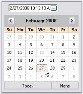
{:.image }

##### Frequently Asked Questions

This section illustrates the solutions for various task-based queries about the control.

###### How to hide a child button of a ButtonEdit control?

By calling the ButtonEdit.HideButton method, we can hide a child button. 

_Table_ _147__: Methods Table_

<table>
<tr>
<td>
Method</td><td>
Description</td></tr>
<tr>
<td>
HideButton</td><td>
Indicates whether a child button is hidden or visible. The parameters are,{{ _btnIndex_ | markdownify }} - Specifies the index of the button.{{ _visible_ | markdownify }} - Specifies the visibility of the button. It can be true or false. If true, the button will be visible and if false, the button will not be visible.</td></tr>
</table>

[C#]

this.buttonEdit1.HideButton(0, false);

[VB.NET]

Me.buttonEdit1.HideButton(0, False)

###### How to replace the default TextBox in a ButtonEdit control?

We can replace the default TextBox of the ButtonEdit control with other TextBox by doing the following steps.

61. Drag a ButtonEdit control and a PercentTextBox control that you would like to replace with the default TextBox of the ButtonEdit control.

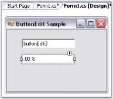
{:.image }

62. From the property window of ButtonEdit, select the PercentTextBox to be the TextBox control of the ButtonEdit control as shown below. 

{:.image }

63. From the same properties window, you can set the percent properties for the ButtonEdit control.

{:.image }

###### How to set tooltip for ButtonEdit Child buttons?

 To set tooltip for a child button in a ButtonEdit control, drag and drop a ToolTip control from the toolbox. Text for tooltip is set using the extender property of the particular child button.

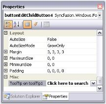
{:.image }

We can also set the Tooltip for ButtonEdit control programmatically using its SetToolTip() method.

[C#]

this.toolTip1.SetToolTip(this.buttonEdit1, "Click here to search");

[VB.NET]

Me.toolTip1.SetToolTip(Me.buttonEdit1, "Click here to search")

{:.image }

#### CalculatorControl

The Essential Tools CalculatorControl encapsulates the functionality of a standard calculator. It provides an easy way to implement a complete calculator in your applications. The value of the CalculatorControl in the form is maintained internally and also provides the value in the format required. The CalculatorValue class provides methods to get the value of the CalculatorControl as a String or as a Double Value. It supports Office2007 color schemes.

{:.image }

##### Features

CalculatorControl implements common arithmetic operations and contains following features.

* It provides a complete keyboard interface for entering input.
* The color and font of the calculator buttons can be customized easily according to user needs.
* The Calculator control can also be used as a Popup Calculator Control.
* A wide variety of visual styles can be applied to the CalculatorControl, including the new Microsoft Office 2007 Style, in different color schemes, to enhance the appearance of the control. 
* The control comes with Button styles which can be The FlatStyle of the buttons can be applied.
* Different layouts can be provided for the buttons in the Calculator control.
* Provides easy mechanism toformat output and display. 

See Also

Concepts and Features

###### Creating Calculator control

The Calculator control can be available to the designer by just dragging-and-dropping the Calculator control from the toolbox onto the form. 

{:.image }

It can be created programmatically using the below steps.

64. Include the required namespace.

[C#]

using Syncfusion.Windows.Forms.Tools;

[VB.NET]

Imports Syncfusion.Windows.Forms.Tools

65. Declare and create an instance of the Calculator control class.

[C#]

private Syncfusion.Windows.Forms.Tools.CalculatorControl calculatorControl1;

// Create an instance of the Calculator control

this.calculatorControl1 = new CalculatorControl();

[VB.NET]

Private calculatorControl1 As Syncfusion.Windows.Forms.Tools.CalculatorControl

' Create an instance of the Calculator control

Me.calculatorControl1 = New CalculatorControl()

66. As the final step, add the Calculator control to the form as follows.

[C#]

// Add the CalculatorControl control to the form.

this.Controls.Add(this.calculatorControl1);

this.calculatorControl1.Visible=true;

[VB.NET]

' Add the CalculatorControl control to the form.

Me.Controls.Add(Me.calculatorControl1)

Me.calculatorControl1.Visible=True

{:.image }

See Also

Concepts and Features

##### Concepts and Features

The following topics will help you become more familiar in using the Calculator control. 

###### Display TextBox

The Calculator control has a display text area on its top corner, which displays all the digits and the calculations performed on the calculator. This display area is displayed by default. To hide this display area, set the ShowDisplayArea property to false. 

The below properties controls the behavior of the display area.

_Table_ _148__: Property Table_

<table>
<tr>
<td>
Calculatorcontrol Properties</td><td>
Description</td></tr>
<tr>
<td>
DisplayTextAlign</td><td>
Specifies the text alignment in the display text area. The values are Right, Left and Center. By default, it is set to Right.</td></tr>
<tr>
<td>
Font</td><td>
Sets font style for display text in the textbox control.</td></tr>
<tr>
<td>
DoubleValue</td><td>
Sets the value of the Calculator control as double value. The default value is zero. </td></tr>
</table>

[C#]

this.calculatorControl1.DisplayTextAlign = System.Windows.Forms.HorizontalAlignment.Left;

this.calculatorControl1.DoubleValue = 5;

this.calculatorControl1.Font = new System.Drawing.Font("Verdana", 8.25F, System.Drawing.FontStyle.Bold);

[VB.NET]

Me.calculatorControl1.DisplayTextAlign = System.Windows.Forms.HorizontalAlignment.Left

Me.calculatorControl1.DoubleValue = 5

Me.calculatorControl1.Font = New System.Drawing.Font("Verdana", 8.25F, System.Drawing.FontStyle.Bold)

{:.image }

TextBox Value

The behavior of the TextBox value can be controlled using the below properties.

_Table_ _149__: Property Table_

<table>
<tr>
<td>
Calculatorcontrol Properties</td><td>
Description</td></tr>
<tr>
<td>
Culture</td><td>
Specifies the culture that is used for formatting the currency display.</td></tr>
<tr>
<td>
RepeatAssignAction</td><td>
Indicates whether the assignment action (=) will repeat the previous action. Whenever the user assigns an action in the calculator at run time and clicks "=" button, the result will be displayed in the textbox area. If the user clicks the "=" button again, the assigned action will be repeated, with the existing result, only when RepeatAssignAction property is set to true. By default it is true.</td></tr>
<tr>
<td>
UseUserOverride</td><td>
Indicates whether the NumberFormatInfo used for formatting will use UseUserOverride parameter for CultureInfo.</td></tr>
</table>

[C#]

this.calculatorControl1.Culture = new System.Globalization.CultureInfo("en-US");

this.calculatorControl1.RepeatAssignAction = true;

this.calculatorControl1.UseUserOverride = true;

[VB.NET]

Me.calculatorControl1.Culture = New System.Globalization.CultureInfo("en-US")

Me.calculatorControl1.RepeatAssignAction = True

Me.calculatorControl1.UseUserOverride = True

See Also

How to customize the calculator display text area to use NumberGroupSeparator?

Calculator Appearance

This section will walk you through the different appearance settings for the Calculator control.

* Layout Modes - Layout of the components in a Calculator.
* Background Settings - Background settings for the control.
* Border Styles - Border for the control.
* Button Spacing - Spacing between the Calculator buttons.
* Button Foreground - Foreground settings for the buttons.
Layout Modes

The Calculator control can be laid out in the following modes.

* _WindowsStandard_ Mode - Modeled with windows standard layout(Default) and
* _Financial Mode_ - Modeled with windows financial layout.

[C#]

this.calculatorControl1.LayoutType = Syncfusion.Windows.Forms.Tools.CalculatorLayoutTypes.Financial;

[VB.NET]

Me.calculatorControl1.LayoutType = Syncfusion.Windows.Forms.Tools.CalculatorLayoutTypes.Financial

{:.image }

> 
{:.image }
 _Note: We can set different button styles for the Calculator control, using CalculatorControl.ButtonStyle property. Refer_ Themes and Button Styles _topic to know more. ButtonStyles can be applied to both the layout modes._

Background Settings

Background settings for a Calculator control is discussed in this section.

Background Color

The background of the Calculator can be painted using the below properties.

_Table_ _150__: Property Table_

<table>
<tr>
<td>
Calculatorcontrol Properties</td><td>
Description</td></tr>
<tr>
<td>
BackColor</td><td>
Specifies BackColor of the Calculator control.</td></tr>
<tr>
<td>
BackgroundColor</td><td>
Sets the gradient background for the control. This setting overrides the BackColor property.</td></tr>
</table>

[C#]

this.calculatorControl1.BackColor = System.Drawing.Color.WhiteSmoke;

this.calculatorControl1.BackgroundColor = new Syncfusion.Drawing.BrushInfo(Syncfusion.Drawing.GradientStyle.Vertical, System.Drawing.Color.WhiteSmoke, System.Drawing.Color.SlateGray);

[VB.NET]

Me.calculatorControl1.BackColor = System.Drawing.Color.WhiteSmoke

Me.calculatorControl1.BackgroundColor = New Syncfusion.Drawing.BrushInfo(Syncfusion.Drawing.GradientStyle.Vertical, System.Drawing.Color.WhiteSmoke, System.Drawing.Color.SlateGray)

{:.image }

Background Image

The background of the Calculator control can be filled with an image using BackgroundImage property.

[C#]

this.calculatorControl1.BackgroundImage = ((System.Drawing.Image)(resources.GetObject("calculatorControl1.BackgroundImage")));

this.calculatorControl1.BackgroundImageLayout = System.Windows.Forms.ImageLayout.Center;

[VB.NET]

Me.calculatorControl1.BackgroundImage = DirectCast((resources.GetObject("calculatorControl1.BackgroundImage")), System.Drawing.Image) 

Me.calculatorControl1.BackgroundImageLayout = System.Windows.Forms.ImageLayout.Center

{:.image }

Border Styles

The below property will let you specify the border style for the Calculator control.

_Table_ _151__: Property Table_

<table>
<tr>
<td>
Calculatorcontrol Properties</td><td>
Description</td></tr>
<tr>
<td>
BorderStyle</td><td>
Specifies the 3D border style for the control. The options are,* {{ _RaisedOuter_ | markdownify }}* {{ _RaisedInner_ | markdownify }}* {{ _SunkenOuter_ | markdownify }}* {{ _SunkenInner_ | markdownify }}* {{ _Raised_ | markdownify }}* {{ _Sunken_ | markdownify }}* {{ _Etched_ | markdownify }}* {{ _Flat_ | markdownify }}* {{ _Adjust_  | markdownify }}* {{ _Bump_ | markdownify }}</td></tr>
</table>

[C#]

this.calculatorControl1.BorderStyle = System.Windows.Forms.Border3DStyle.Etched;

[VB.NET]

this.calculatorControl1.BorderStyle = System.Windows.Forms.Border3DStyle.Etched;

{:.image }

Button Spacing

The default spacing between the Calculator buttons can be modified by enabling _UseVerticalAndHorizontalSpacing_ property. The below properties controls the horizontal and vertical spacing.

_Table_ _152__: Property Table_

<table>
<tr>
<td>
Calculatorcontrol Properties</td><td>
Description</td></tr>
<tr>
<td>
UseVerticalAndHorizontalSpacing</td><td>
Specifies whether horizontal and vertical spacing can be set using HorizontalSpacing and VerticalSpacing properties. By default it is false.</td></tr>
<tr>
<td>
HorizontalSpacing</td><td>
Sets horizontal spacing between buttons. The default value is 10. UseVerticalAndHorizontalSpacing must be set to true.</td></tr>
<tr>
<td>
VerticalSpacing</td><td>
Sets vertical spacing between buttons. The default value is 10. UseVerticalAndHorizontalSpacing must be set to true.</td></tr>
</table>

[C#]

this.calculatorControl1.UseVerticalAndHorizontalSpacing = true;

this.calculatorControl1.HorizontalSpacing = 5;

this.calculatorControl1.VerticalSpacing = 5;

[VB.NET]

Me.calculatorControl1.UseVerticalAndHorizontalSpacing = True

Me.calculatorControl1.HorizontalSpacing = 5

Me.calculatorControl1.VerticalSpacing = 5

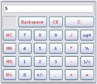
{:.image }

Button Foreground

Using SetButtonFont and SetButtonColor properties, we can set the font style and color for the button text. The button can be identified using CalcActions enumerator.

_Table_ _153__: Methods Table_

<table>
<tr>
<td>
Calculatorcontrol Methods</td><td>
Description</td></tr>
<tr>
<td>
SetButtonColor</td><td>
Sets text color for the calculator button. The parameters are,{{ _caCalcButton_ | markdownify }} - The calculator button,{{ _color_ | markdownify }} - The color to set for the button text.</td></tr>
<tr>
<td>
SetButtonFont</td><td>
Sets the font style for the text in the calculator button. The parameters are, {{ _caCalcButton_ | markdownify }} - The calculator button,{{ _font_ | markdownify }} - The font style for the button text.</td></tr>
</table>

[C#]

this.calculatorControl1.SetButtonColor(CalcActions.CalcSpecialBackspace, Color.Black);

this.calculatorControl1.SetButtonFont(CalcActions.CalcSpecialBackspace, new Font("Arial", 9, FontStyle.Bold));

[VB.NET]

Me.calculatorControl1.SetButtonColor(CalcActions.CalcSpecialBackspace, Color.Black);

Me.calculatorControl1.SetButtonFont(CalcActions.CalcSpecialBackspace, New Font("Arial", 9, FontStyle.Bold))

{:.image }

Runtime Features

This section elaborated keyboard support for the control.

Keyboard Support

Essential Tools Calculator control does the functionality of a normal calculator, using the Mouse or Keyboard, at run time. The control provides Keyboard equivalents for the Calculator buttons. They are listed in the below table.

_Table_ _154__: Keyboard Support Table_

<table>
<tr>
<td>
Button</td><td>
Description</td><td>
Keyboard Equivalent</td></tr>
<tr>
<td>
Backspace</td><td>
Deletes the last digit of the displayed number.</td><td>
BACKSPACE</td></tr>
<tr>
<td>
CE</td><td>
Clears the displayed number.</td><td>
DELETE</td></tr>
<tr>
<td>
C</td><td>
Clears the current calculation.</td><td>
ESC</td></tr>
<tr>
<td>
MC</td><td>
Clears any number stored in memory.</td><td>
CTRL+L</td></tr>
<tr>
<td>
7</td><td>
Puts this number in the calculator display.</td><td>
7</td></tr>
<tr>
<td>
8</td><td>
Puts this number in the calculator display.</td><td>
8</td></tr>
<tr>
<td>
9</td><td>
Puts this number in the calculator display.</td><td>
9</td></tr>
<tr>
<td>
/</td><td>
Divides.</td><td>
/</td></tr>
<tr>
<td>
sqrt</td><td>
Calculates the square root of the displayed number.</td><td>
@</td></tr>
<tr>
<td>
MR</td><td>
Recalls the number stored in memory. The number remains in memory.</td><td>
CTRL+R</td></tr>
<tr>
<td>
4</td><td>
Puts this number in the calculator display.</td><td>
4</td></tr>
<tr>
<td>
5</td><td>
Puts this number in the calculator display.</td><td>
5</td></tr>
<tr>
<td>
6</td><td>
Puts this number in the calculator display.</td><td>
6</td></tr>
<tr>
<td>
*</td><td>
Multiplies.</td><td>
*</td></tr>
<tr>
<td>
%</td><td>
Displays the result of multiplication as a percentage. Enter on number, click , enter the second number, and then click %. For example, 50 * 25 % will display 12.5.You can also perform operations with percentages. Enter one number, click the operator(+, -, *, or /), enter the second number, click % and then click =.For example:  50 + 25% (of 50) = 62.5.</td><td>
%</td></tr>
<tr>
<td>
MS</td><td>
Stores the displayed number in memory.</td><td>
CTRL+M</td></tr>
<tr>
<td>
1</td><td>
Puts this number in the calculator display.</td><td>
1</td></tr>
<tr>
<td>
2</td><td>
Puts this number in the calculator display.</td><td>
2</td></tr>
<tr>
<td>
3</td><td>
Puts this number in the calculator display.</td><td>
3</td></tr>
<tr>
<td>
-</td><td>
Subtracts.</td><td>
-</td></tr>
<tr>
<td>
1/x</td><td>
Calculates the reciprocal of the displayed number.</td><td>
R</td></tr>
<tr>
<td>
M+</td><td>
Adds the displayed number to any number already in memory but does not display the sum of these numbers.</td><td>
CTRL+P</td></tr>
<tr>
<td>
+/-</td><td>
Changes the sign of the displayed number.</td><td>
F9</td></tr>
<tr>
<td>
.</td><td>
Inserts a decimal point. To use a different character for the decimal point, click start, point to settings, and then click control panel. Double click Regional Options and then click the Numbers tab.</td><td>
. or ,</td></tr>
<tr>
<td>
+</td><td>
Adds.</td><td>
+</td></tr>
<tr>
<td>
=</td><td>
Perform any operation on the previous two numbers. To repeat the last operation, click = again.</td><td>
Enter</td></tr>
</table>
Style Settings

This section discusses on the following styles:

Button Flat Styles

The flat styles for the button objects in a Calculator control is set using CalculatorControl.FlatStyle property. The styles are Flat, Popup, Standard (default) and System.

[C#]

this.calculatorControl1.FlatStyle = System.Windows.Forms.FlatStyle.Flat;

[VB.NET]

Me.calculatorControl1.FlatStyle = System.Windows.Forms.FlatStyle.Flat

{:.image }

Themes and Button Styles

Themes for the Calculator control

Essential Tools Calculator control is themed by default. To disable, set ThemesEnabled property to false.

[C#]

this.calculatorControl1.ThemesEnabled = false;

[VB.NET]

Me.calculatorControl1.ThemesEnabled = False

{:.image }

Button Styles

The Calculator control supports the below button styles. UseVisualStyle property should be set to true to enable button styles for the control.

* Classic (default)
* Office2000
* WindowsXP
* OfficeXP
* Office2003
* Office2007

[C#]

this.calculatorControl1.UseVisualStyle = true;

//Setting Office2007 button style for the calculator control

this.calculatorControl1.ButtonStyle = Syncfusion.Windows.Forms.ButtonAppearance.Office2007;

[VB.NET]

Me.calculatorControl1.UseVisualStyle = True

'Setting Office2007 button style for the calculator control

this.calculatorControl1.ButtonStyle = Syncfusion.Windows.Forms.ButtonAppearance.Office2007;

{:.image }

OfficeColor Schemes

Essential Tools Calculator control supports all the three OfficeColorSchemes. When the ButtonStyle is set to Office2007 style, the color schemes will be blue by default. It can be modified using Office2007Theme property.

[C#]

this.calculatorControl1.Office2007Theme = Syncfusion.Windows.Forms.Office2007Theme.Silver;

[VB.NET]

Me.calculatorControl1.Office2007Theme = Syncfusion.Windows.Forms.Office2007Theme.Silver

{:.image }

Custom Colors

We can also apply custom colors to the Calculator control by setting Office2007Theme to "Managed" and specifying the custom color through the ApplyManagedColors method as follows.

[C#]

this.calculatorControl1.Office2007Theme = Syncfusion.Windows.Forms.Office2007Theme.Managed;

Office2007Colors.ApplyManagedColors(this, Color.Navy);

[VB.NET]

Me.calculatorControl1.Office2007Theme = Syncfusion.Windows.Forms.Office2007Theme.Managed;

Office2007Colors.ApplyManagedColors(Me, Color.Navy)

{:.image }

Popup CalculatorControl

The PopupCalculator class can be used to display a popup Calculator control. This class can be created programmatically. 

The PopupCalculator control lets you embed a Calculator control object to a button for example. Drop the button onto the form and add the following code snippet.

[C#]

private Syncfusion.Windows.Forms.Tools.PopupCalculator popupCalculator1;

private void buttonAdv1_Click(object sender, EventArgs e)

{

    // Create the Popup Calculator.

    popupCalculator1 = new Syncfusion.Windows.Forms.Tools.PopupCalculator();

    // The control that will act as the Popup's parent.

    this.popupCalculator1.ParentControl = this.button1;

    // Set the alignment.

    this.popupCalculator1.PopupCalculatorAlignment = Syncfusion.Windows.Forms.Tools.CalculatorPopupAlignment.Right;

    // Display the Calculator control.

    this.popupCalculator1.DisplayCalculator(Point.Empty);

    //Sets the size of the calculator

    this.popupCalculator1.Size = this.calculatorControl1.Size;

}

[VB.NET]

Private popupCalculator1 As Syncfusion.Windows.Forms.Tools.PopupCalculator

Private Sub buttonAdv1_Click(ByVal sender As Object, ByVal e As EventArgs)

    ' Create the Popup Calculator. 

    popupCalculator1 = New Syncfusion.Windows.Forms.Tools.PopupCalculator()

    ' The control that will act as the Popup's parent. 

    Me.popupCalculator1.ParentControl = Me.button1

    ' Set the alignment. 

    Me.popupCalculator1.PopupCalculatorAlignment = Syncfusion.Windows.Forms.Tools.CalculatorPopupAlignment.Right

    ' Display the Calculator control. 

    Me.popupCalculator1.DisplayCalculator(Point.Empty)

    'Sets the size of the calculator 

    Me.popupCalculator1.Size = Me.calculatorControl1.Size

End Sub

{:.image }

###### Calculator Events

The event for Calculator control and PopupCalculator control are discussed in this section.

ValueCalculated Event

The ValueCalculated event fires each time the value of the CalculatorControl is changed. That is, even if you just press any digit, this event will be handled. 

The event  handler receives an argument of type CalculatorValueCalculatedEventArgs. To get the final result, use LastAction property of the CalculatorValueCalculatedEventArgs in the ValueCalculated event. 

_Table_ _155__: Methods Table_

<table>
<tr>
<td>
 Members</td><td>
Description</td></tr>
<tr>
<td>
ErrorCondition</td><td>
Specifies the error condition of the Calculator control if any.</td></tr>
<tr>
<td>
LastAction</td><td>
Gets/Sets the last action that was performed.</td></tr>
<tr>
<td>
MemoryValue</td><td>
Gets/Sets the MemoryValue of the Calculator control.</td></tr>
<tr>
<td>
Message</td><td>
Gets/Sets the custom error message when in error mode.</td></tr>
<tr>
<td>
Value</td><td>
Gets/Sets the CalculatorValue object that contains the value of the Calculator control.</td></tr>
</table>

We can retrieve the value of the Calculator control after '=' button is pressed using the following code snippet.

[C#]

private void calcctrl_ValueCalculated(object sender,CalculatorValueCalculatedEventArgs arg) 

{

    // Checks the final answer after '=' is pressed.

if(!arg.ErrorCondition && arg.LastAction == CalcActions.CalcOperatorEquals)  

MessageBox.Show(calcctrl.Value.ToString());

}

[VB.NET]

Private Sub calcctrl_ValueCalculated(ByVal sender As Object, ByVal arg As CalculatorValueCalculatedEventArgs) 

If Not arg.ErrorCondition AndAlso arg.LastAction = CalcActions.CalcOperatorEquals Then 

    ' Checks the final answer after '=' is pressed.

MessageBox.Show(calcctrl.Value.ToString()) 

End If 

End Sub

{:.image }

Closing Event

Closing Event of the PopupCalculator control

This will be raised by popupCalculator when closing after "=" button was clicked. We can implement this event to display the final value of the Calculator control as follows.

[C#]

this.popupCalculator1.Closing += new PopupCalculatorClosingEventHandler(this.HandlePopupCalculatorClosingEvent);

public void HandlePopupCalculatorClosingEvent(object sender, CalculatorClosingEventArgs args)

{

//Event logging

string item = args.FinalValue.ToString();

string eventlogmessage = String.Format("Event: {0} FinalValue: {1}\r\n", "CalculatorClosing", item);

Console.WriteLine(eventlogmessage);

}

[VB.NET]

Private Me.popupCalculator1.Closing += New PopupCalculatorClosingEventHandler(Me.HandlePopupCalculatorClosingEvent)

Public Sub HandlePopupCalculatorClosingEvent(ByVal sender As Object, ByVal args As CalculatorClosingEventArgs)

    'Event logging

    Dim item As String = args.FinalValue.ToString()

    Dim eventlogmessage As String = String.Format("Event: {0} FinalValue: {1}" & Constants.vbCrLf, "CalculatorClosing", item)

    Console.WriteLine(eventlogmessage)

End Sub

{:.image }

###### Frequently Asked Questions

This section illustrates the solutions for various task-based queries about the control.

How to customize the calculator display text area to use NumberGroupSeparator?

The calculator control by default does not allow the use of NumberGroupSeparator like in DoubleTextBox. 

{:.image }

So to achieve this we need to derive the CalculatorControl and override the CreateCalculatorDisplayBox() method.

[C#]

private CalculatorAdv calculatorControl1;

this.calculatorControl1 = new CalculatorAdv();

public class CalculatorAdv : Syncfusion.Windows.Forms.Tools.CalculatorControl

{

    public CalculatorAdv()

    {

    }

    protected override void CreateCalculatorDisplayBox()

    {

        Syncfusion.Windows.Forms.Tools.DoubleTextBox dtb = new Syncfusion.Windows.Forms.Tools.DoubleTextBox();

        dtb.NumberGroupSeparator = ",";

        this.textCalculatorBox = dtb; //Changing the TextBox to DoubleTextBox

    }

}

[VB.NET]

Private calculatorControl1 As CalculatorAdv

Me.calculatorControl1 = New CalculatorAdv() 

Public Class CalculatorAdv

    Inherits Syncfusion.Windows.Forms.Tools.CalculatorControl

    Public Sub New()

    End Sub

    Protected Overloads Overrides Sub CreateCalculatorDisplayBox()

        Dim dtb As New Syncfusion.Windows.Forms.Tools.DoubleTextBox()

        dtb.NumberGroupSeparator = ","

        Me.textCalculatorBox = dtb

        'Changing the TextBox to DoubleTextBox 

    End Sub

End Class

{:.image }

How to Simulate a Particular button in the Calculator?

We can use Calculator.ButtonAction() method for this. When the user clicks the button, the ButtonAction method of the Calculator control will call back the action of the particular button (in this example it is "=" button) and displays the result in the textbox area, using CalcActions Enumerator. This enumerator has all the actions that can be assigned to the calculator buttons including digits and arithmetic operators also.

[C#]

private void buttonAdv1_Click(object sender, EventArgs e)

{

    //Performing the "=" button action

    this.calculatorControl1.ButtonAction(Syncfusion.Windows.Forms.Tools.CalcActions.CalcOperatorEquals);

}

[VB.NET]

Private Sub buttonAdv1_Click(ByVal sender As Object, ByVal e As System.EventArgs) 

   'Performing the "=" button action

   Me.calculatorControl1.ButtonAction(Syncfusion.Windows.Forms.Tools.CalcActions.CalcOperatorEquals) 

End Sub

### CalendarDateTime Controls

Syncfusion CalendarDateTime controls are discussed below.

##### MonthCalendarAdv

The Essential Tools MonthCalendarAdvcontrol is an advanced calendar control that can display all the month of the year with the appropriate culture information for the months and days of the week. A wide variety of visual styles can be applied to the MonthCalendarAdv, to enhance the appearance of the control. This also includes the new Microsoft Office 2007 Style for all the child controls of the MonthCalendarAdv, such as the UpDown Spin Button, DropDown button of DateTimePickerAdv, ScrollButton, TodayButton and None button. 

{:.image }

###### Features

The features of MonthCalendarAdv control are as follows.

* Provides options to set appropriate culture information for the months and days of the week.
* Customizes the days of the calendar.
* Allows multiple selection.
* Allows displaying icons set for date cells.
* Supports tooltip for date cells.
* A wide variety of visual styles can be applied to the MonthCalenderAdv, to enhance the appearance of the control. This also includes the new Microsoft Office 2007 Style with all three color schemes for all the child controls of the MonthCalenderAdv, such as the UpDown Spin Button, DropDown button of DateTimePickerAdv, ScrollButton, TodayButton and None button. 
* Supports rich set of border styles.

See Also

Concepts and Features

###### MonthCalendarAdv

Sections of MonthCalendarAdv control

The following figure displays the sections of MonthCalendarAdv control.

{:.image }

* Calendar Header - Header for the MonthCalendarAdv. See Header Settings.
* Scroll Buttons - Allows the end user to scroll through the months. See Button Settings.
* Week Number - Specifies a unique number for each week.
* Day Names - Day names of each day in a week is displayed in DayNames section. 
* Days - Days of the month.
* Highlighted Today's date - Today's date selected / highlighted at runtime.
* Grid Line - Grid Line which separates the dates.
* None Button - Lets you to withdraw focus from a day in the MonthCalendarAdv.
* Today Button - Focus will be moved to today's date.

See Also

Concepts and Features

###### Creating MonthCalendarAdv

We can just drag and drop the MonthCalendarAdv onto the form through designer and can access their properties through the property grid. 

{:.image }

To create the control programmatically, follow the below steps.

67. Include the required namespace.

[C#]

using Syncfusion.Windows.Forms.Tools;

[VB.NET]

Imports Syncfusion.Windows.Forms.Tools

68. Create an instance of the MonthCalendarAdv control. 

[C#]

private Syncfusion.Windows.Forms.Tools.MonthCalendarAdv monthCalendarAdv1;

this.monthCalendarAdv1=new MonthCalendarAdv();

[VB.NET]

Private monthCalendarAdv1 As Syncfusion.Windows.Forms.Tools.MonthCalendarAdv

Me.monthCalendarAdv1 = New MonthCalendarAdv()

69. Set the visual style for the control. Add that instance to the Form.

[C#]

this.monthCalendarAdv1.Style = Syncfusion.Windows.Forms.VisualStyle.Office2007;

this.Controls.Add(this.monthCalendarAdv1);

[VB.NET]

Me.monthCalendarAdv1.Style = Syncfusion.Windows.Forms.VisualStyle.Office2007

Me.Controls.Add(Me.monthCalendarAdv1)

70. Run the application.

{:.image }

See Also

Concepts and Features

###### Concepts and Features

This section discusses the concepts of MonthCalendarAdv in some commonly used scenarios.

Calendar Appearance

This section comprises the appearance settings under the following topics:

Border Styles

Border for a MonthCalendarAdv control can be in 2D or 3D modes. The below properties controls the border settings for the MonthCalendarAdv control. 

_Table_ _156__: Property Table_

<table>
<tr>
<td>
Properties</td><td>
Description</td></tr>
<tr>
<td>
BorderStyle</td><td>
Specifies whether the control should have a 2D or a 3D border. The options are,{{ _FixedSingle,_ | markdownify }}{{ _Fixed3D and_ | markdownify }}{{ _None (default)._ | markdownify }}</td></tr>
<tr>
<td>
Border3DStyle</td><td>
Sets 3D border style for the MonthCalendarAdv control, when the BorderStyle=Fixed3D. The styles are,{{ _Raised,_  | markdownify }}{{ _RaisedOuter,_  | markdownify }}{{ _RaisedInner,_ | markdownify }}{{ _Sunken (default),_  | markdownify }}{{ _SunkenOuter,_  | markdownify }}{{ _SunkenInner,_  | markdownify }}{{ _Etched,_  | markdownify }}{{ _Bump,_  | markdownify }}{{ _Adjust and_ | markdownify }}{{ _Flat._ | markdownify }}</td></tr>
<tr>
<td>
BorderSides</td><td>
Specifies the sides of the control which can have a border. The sides options are,{{ _Left,_  | markdownify }}{{ _Top,_  | markdownify }}{{ _Right,_  | markdownify }}{{ _Bottom,_  | markdownify }}{{ _Middle and_ | markdownify }}{{ _All (default)._ | markdownify }}</td></tr>
<tr>
<td>
BorderColor</td><td>
Specifies the 2D border color when BorderStyle="FixedSingle".</td></tr>
</table>

[C#]

//Setting 3D border style 

this.monthCalendarAdv1.BorderStyle = System.Windows.Forms.BorderStyle.Fixed3D;

//Setting "SunkenInner" 3D border style

this.monthCalendarAdv1.Border3DStyle = System.Windows.Forms.Border3DStyle.SunkenInner;

[VB.NET]

'Setting 3D border style 

Me.monthCalendarAdv1.BorderStyle = System.Windows.Forms.BorderStyle.Fixed3D

'Setting "SunkenInner" 3D border style

Me.monthCalendarAdv1.Border3DStyle = System.Windows.Forms.Border3DStyle.SunkenInner

{:.image }

> 
{:.image }
 _Note: MonthCalendarAdv.ThemedBorder property should be set to false to make the 3D border setting effective. Refer_ Visual Settings.

> 

[C#]

//Setting border to "All" sides

this.monthCalendarAdv1.BorderSides = System.Windows.Forms.Border3DSide.All;

//Setting color for 2D border

this.monthCalendarAdv1.BorderColor = System.Drawing.Color.DodgerBlue;

[VB.NET]

'Setting border to "All" sides

Me.monthCalendarAdv1.BorderSides = System.Windows.Forms.Border3DSide.All

'Setting color for 2D border

this.monthCalendarAdv1.BorderColor = System.Drawing.Color.DodgerBlue

{:.image }

See Also

Background Settings, Visual Settings

Background Settings

Background image for the MonthCalendarAdv is specified in BackgroundImage property.

[C#]

this.monthCalendarAdv1.BackgroundImage = ((System.Drawing.Image)(resources.GetObject("monthCalendarAdv1.BackgroundImage")));

this.monthCalendarAdv1.BackgroundImageLayout = System.Windows.Forms.ImageLayout.Stretch;

[VB.NET]

Me.monthCalendarAdv1.BackgroundImage = DirectCast((resources.GetObject("monthCalendarAdv1.BackgroundImage")), System.Drawing.Image) 

Me.monthCalendarAdv1.BackgroundImageLayout = System.Windows.Forms.ImageLayout.Stretch 

{:.image }

See Also

Border Styles, Visual Settings

Visual Settings

Themes for MonthCalendarAdv

Some sections of the MonthCalendarAdv control are themed by default. The below table list the properties which controls the themed behavior border, grid and scroll buttons.

_Table_ _157__: Property Table_

<table>
<tr>
<td>
MonthCalendarAdv Properties</td><td>
Description</td></tr>
<tr>
<td>
ThemedBorder</td><td>
Specifies whether the border of the control is themed. By default it is true.</td></tr>
<tr>
<td>
ThemedEnabledGrid</td><td>
Specifies whether the grid holding the days is themed or not. By default it is false.</td></tr>
<tr>
<td>
ThemedEnabledScrollButtons</td><td>
Specifies whether the scroll buttons are themed. It is set to true by default.</td></tr>
</table>

[C#]

this.monthCalendarAdv1.ThemedBorder = true;

this.monthCalendarAdv1.ThemedEnabledGrid = true;

this.monthCalendarAdv1.ThemedEnabledScrollButtons = true;

[VB.NET]

Me.monthCalendarAdv1.ThemedBorder = True

Me.monthCalendarAdv1.ThemedEnabledGrid = True

Me.monthCalendarAdv1.ThemedEnabledScrollButtons = True

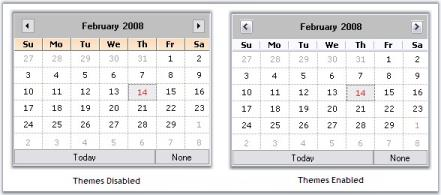
{:.image }

Styles 

MonthCalendarAdv supports the styles in the below table, which can be set through Style property.

_Table_ _158__: Property Table_

<table>
<tr>
<td>
MonthCalendarAdv Property</td><td>
Description</td></tr>
<tr>
<td>
Style</td><td>
Gets or Sets the visual style of the MonthCalendarAdv. The options are {{ _Default_ | markdownify }}{{ _OfficeXP_ | markdownify }}{{ _Office2003_ | markdownify }}{{ _VS2005_ | markdownify }}{{ _Office2007_ | markdownify }}The default value is 'Default'.</td></tr>
</table>

[C#]

// Sample code for setting Office2003 style for MonthCalendarAdv

this.monthCalendarAdv1.Style = Syncfusion.Windows.Forms.VisualStyle.Office2003;

[VB.NET]

' Sample code for setting Office2003 style for MonthCalendarAdv

Me.monthCalendarAdv1.Style  = Syncfusion.Windows.Forms.VisualStyle.Office2003

{:.image }

[C#]

//Sets the Color scheme as Silver when the style is Office2007

this.monthCalendarAdv1.Office2007Theme = Syncfusion.Windows.Forms.Office2007Theme.Silver;

[VB.NET]

'Sets the Color scheme as Silver when the style is Office2007

Me.monthCalendarAdv1.Office2007Theme = Syncfusion.Windows.Forms.Office2007Theme.Silver

{:.image }

Custom Colors

We can also apply custom colors to the MonthCalendarAdv control by setting Office2007Theme to "Managed" and specifying the custom color through the ApplyManagedColors method as follows.

[C#]

this.monthCalendarAdv1.Office2007Theme = Syncfusion.Windows.Forms.Office2007Theme.Managed;

Office2007Colors.ApplyManagedColors(this, Color.Orange);

[VB.NET]

Me.monthCalendarAdv1.Office2007Theme = Syncfusion.Windows.Forms.Office2007Theme.Managed

Office2007Colors.ApplyManagedColors(Me, Color.Orange)

{:.image }

> 
{:.image }
 _Note: Visual styles of the Today and None button can be overridden by MonthCalendarAdv.TodayButton and MonthCalendarAdv.NoneButton respectively. See_ Scroll Buttons.

> Scroll Buttons.

See Also

Border Styles, Background Settings

Customizing sections of Calendar

This section comprises the following:

Grid Settings

In the MonthCalendarAdv control, the dates of a month is placed inside a grid and the dates are separated using grid lines.

{:.image }

The below properties lets you to change the default appearance of the grid in the MonthCalendarAdv.

_Table_ _159__: Property Table_

<table>
<tr>
<td>
MonthCalendarAdv  Properties</td><td>
Description</td></tr>
<tr>
<td>
GridBackColor</td><td>
Gets or Sets the back color of the Grid.</td></tr>
<tr>
<td>
GridLines</td><td>
Gets or Sets the style of the Grid lines. The options are* {{ _NotSet_ | markdownify }}* {{ _None_ | markdownify }}* {{ _Dashed_ | markdownify }}* {{ _Dotted_ | markdownify }}* {{ _DashDot_ | markdownify }}* {{ _DashDotDot_ | markdownify }}* {{ _Solid_ | markdownify }}* {{ _Standard_ | markdownify }} The default value is 'Dotted'.</td></tr>
</table>

[C#]

this.monthCalendarAdv1.GridBackColor = System.Drawing.Color.FloralWhite;

this.monthCalendarAdv1.GridLines = Syncfusion.Windows.Forms.Grid.GridBorderStyle.Dashed;

[VB.NET]

Me.monthCalendarAdv1.GridBackColor = System.Drawing.Color.FloralWhite

Me.monthCalendarAdv1.GridLines = Syncfusion.Windows.Forms.Grid.GridBorderStyle.Dashed

{:.image }

Header Settings

This section will walk you through the different properties used to customize the header portion of the MonthCalendarAdv control.

Gradient Background

Gradient background can be set for the header using the below properties.

_Table_ _160__: Property Table_

<table>
<tr>
<td>
MonthCalendarAdv Properties</td><td>
Description</td></tr>
<tr>
<td>
HeadGradient</td><td>
Specifies whether the header can show a gradient background. </td></tr>
<tr>
<td>
HeaderStartColor</td><td>
Sets the start color of the header gradient when HeaderGradient property is true.</td></tr>
<tr>
<td>
HeaderEndColor</td><td>
Sets the end color of the header gradient when HeaderGradient property is true.</td></tr>
<tr>
<td>
HeaderVerticalGradient</td><td>
When HeadGradient property is set to true, vertical gradient style will be applied to the header, by default. To change it to horizontal gradient style, set this property to false.</td></tr>
</table>

[C#]

this.monthCalendarAdv1.HeadGradient = true;

this.monthCalendarAdv1.HeaderVerticalGradient = true;

this.monthCalendarAdv1.HeaderEndColor = System.Drawing.Color.SteelBlue;                    

this.monthCalendarAdv1.HeaderStartColor = System.Drawing.Color.AliceBlue;

[VB.NET]

Me.monthCalendarAdv1.HeadGradient = True

Me.monthCalendarAdv1.HeaderVerticalGradient = True

Me.monthCalendarAdv1.HeaderEndColor = System.Drawing.Color.SteelBlue                   

Me.monthCalendarAdv1.HeaderStartColor = System.Drawing.Color.AliceBlue

{:.image }

Foreground Settings

The font style and fore color of the header text can be specified through HeaderFont and HeadForeColor properties.

_Table_ _161__: Property Table_

<table>
<tr>
<td>
MonthCalendarAdv Properties</td><td>
Description</td></tr>
<tr>
<td>
HeaderFont</td><td>
Specifies the font of the header.</td></tr>
<tr>
<td>
HeaderForeColor</td><td>
Specifies the fore color of the header.</td></tr>
</table>

[C#]

this.monthCalendarAdv1.HeaderFont = new System.Drawing.Font("Arial", 9F, System.Drawing.FontStyle.Bold);

this.monthCalendarAdv1.HeadForeColor = System.Drawing.Color.Navy;

[VB.NET]

Me.monthCalendarAdv1.HeaderFont = New System.Drawing.Font("Arial", 9F, System.Drawing.FontStyle.Bold)

Me.monthCalendarAdv1.HeadForeColor = System.Drawing.Color.Navy

{:.image }

Height and Image for Header

The height of the header can be increased or decreased using HeaderHeight property. Header can also host an image in its background using HeaderImage property.

_Table_ _162__: Property Table_

<table>
<tr>
<td>
MonthCalendarAdv Properties</td><td>
Description</td></tr>
<tr>
<td>
HeaderHeight</td><td>
Specifies the height of the header. Default value is 32 for Default Style and for other styles it is 20.</td></tr>
<tr>
<td>
HeaderImage</td><td>
Specifies the image of the header.</td></tr>
</table>

[C#]

this.monthCalendarAdv1.HeaderImage = ((System.Drawing.Image)(resources.GetObject("monthCalendarAdv1.HeaderImage")));

this.monthCalendarAdv1.HeaderHeight = 30;

[VB.NET]

Me.monthCalendarAdv1.HeaderImage = DirectCast((resources.GetObject("monthCalendarAdv1.HeaderImage")), System.Drawing.Image) 

Me.monthCalendarAdv1.HeaderHeight = 30

{:.image }

Week Numbers

MonthCalendarAdv control can display unique week numbers for all the weeks in a year. This section discusses the properties which can customize the appearance of the week numbers.

Foreground Settings

By default, week numbers will not be shown in the calendar. ShowWeekNumbers property should be set to true to display the week numbers. The font and fore color can be set using the below properties.

_Table_ _163__: Property Table_

<table>
<tr>
<td>
MonthCalendarAdv Properties</td><td>
Description</td></tr>
<tr>
<td>
WeekFont</td><td>
Gets or sets the font of the week numbers column.</td></tr>
<tr>
<td>
WeekTextColor</td><td>
Gets or sets the text color for week numbers column.</td></tr>
</table>

[C#]

this.monthCalendarAdv1.ShowWeekNumbers = true;

this.monthCalendarAdv1.WeekFont = new System.Drawing.Font("Courier New", 9F, System.Drawing.FontStyle.Bold, System.Drawing.GraphicsUnit.Point, ((byte)(0)));

this.monthCalendarAdv1.WeekTextColor = System.Drawing.Color.Blue;

[VB.NET]

Me.monthCalendarAdv1.ShowWeekNumbers = True

Me.monthCalendarAdv1.WeekFont = New System.Drawing.Font("Courier New", 9F, System.Drawing.FontStyle.Bold, System.Drawing.GraphicsUnit.Point, CByte((0))) 

Me.monthCalendarAdv1.WeekTextColor = System.Drawing.Color.Blue 

{:.image }

Gradient Background

By default the week numbers column has a gradient background. To customize the background manually, use WeekInterior property. 

[C#]

this.monthCalendarAdv1.WeekInterior = new Syncfusion.Drawing.BrushInfo(Syncfusion.Drawing.GradientStyle.Vertical, System.Drawing.Color.AliceBlue, System.Drawing.Color.LightSteelBlue);

[VB.NET]

Me.monthCalendarAdv1.WeekInterior = New Syncfusion.Drawing.BrushInfo(Syncfusion.Drawing.GradientStyle.Vertical, System.Drawing.Color.AliceBlue, System.Drawing.Color.LightSteelBlue) 

{:.image }

Day Settings

MonthCalendarAdv has properties to customize the days displayed in the calendar. This section discusses those properties.

Foreground Settings

The below properties deals with the foreground appearance of the dates.

_Table_ _164__: Property Table_

<table>
<tr>
<td>
MonthCalendarAdv Properties</td><td>
Description</td></tr>
<tr>
<td>
DayNamesColor</td><td>
Specifies the fore color of the day names.</td></tr>
<tr>
<td>
DayNamesFont</td><td>
Specifies the font style of the day names.</td></tr>
<tr>
<td>
DaysFont</td><td>
Specifies the font style of the days / dates.</td></tr>
<tr>
<td>
DaysColor</td><td>
Specifies the fore color of the day names.</td></tr>
</table>

[C#]

this.monthCalendarAdv1.DayNamesFont = new System.Drawing.Font("Courier New", 9F, System.Drawing.FontStyle.Bold);

this.monthCalendarAdv1.DaysNamesColor = Color.Black;

this.monthCalendarAdv1.DaysColor = System.Drawing.SystemColors.HotTrack;

this.monthCalendarAdv1.DaysFont = new System.Drawing.Font("Courier New", 8.25F, System.Drawing.FontStyle.Regular);

[VB.NET]

Me.monthCalendarAdv1.DayNamesFont = New System.Drawing.Font("Courier New", 9F, System.Drawing.FontStyle.Bold) 

Me.monthCalendarAdv1.DaysNamesColor = Color.Black

Me.monthCalendarAdv1.DaysColor = System.Drawing.SystemColors.HotTrack 

Me.monthCalendarAdv1.DaysFont = New System.Drawing.Font("Courier New", 8.25F, System.Drawing.FontStyle.Regular) 

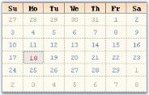
{:.image }

Height and Day Names Format

The height of the day header and the day name formats are specified using below properties.

_Table_ _165__: Property Table_

<table>
<tr>
<td>
MonthCalendarAdv Properties</td><td>
Description</td></tr>
<tr>
<td>
DayNamesHeight</td><td>
Sets the height of the days header. Default value is 17.</td></tr>
<tr>
<td>
UseShortestDayNames</td><td>
Specifies whether shortest day names are used or not. by default it is true.</td></tr>
</table>

[C#]

this.monthCalendarAdv1.DayNamesHeight = 22;

this.monthCalendarAdv1.UseShortestDayNames = false;

[VB.NET]

Me.monthCalendarAdv1.DayNamesHeight = 22

Me.monthCalendarAdv1.UseShortestDayNames = False

{:.image }

Gradient Background for Day Header

By default the day's header has a gradient background. We can change the default background style using DaysHeaderInterior property. 

[C#]

this.monthCalendarAdv1.DaysHeaderInterior = new Syncfusion.Drawing.BrushInfo(Syncfusion.Drawing.GradientStyle.Vertical, System.Drawing.Color.AntiqueWhite, System.Drawing.Color.SandyBrown);

[VB.NET]

Me.monthCalendarAdv1.DaysHeaderInterior = New Syncfusion.Drawing.BrushInfo(Syncfusion.Drawing.GradientStyle.Vertical, System.Drawing.Color.AntiqueWhite, System.Drawing.Color.SandyBrown)

{:.image }

Today's Date 

The fore color for Today's date is set using TodayFontColor property. Using Today button at the bottom of the control, today's date can be focussed. See Buttons for details.

[C#]

this.monthCalendarAdv1.TodayFontColor = System.Drawing.Color.Crimson;

[VB.NET]

Me.monthCalendarAdv1.TodayFontColor = System.Drawing.Color.Crimson

The today's date for the below calendar image is "eighteenth".

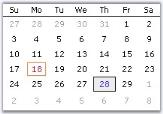
{:.image }

See Also 

Day Settings, Text Settings

Text Settings

This section discusses the properties which controls the appearance and behavior of the dates (contents) inside the grid cells.

Highlighting the dates

We can highlight the selected date using HighlightColor property.

[C#]

this.monthCalendarAdv1.HighlightColor = System.Drawing.Color.Blue;

[VB.NET]

Me.monthCalendarAdv1.HighlightColor = System.Drawing.Color.Blue

{:.image }

_Figure_ _232__: HighlightColor = "Blue"_

Alignment and Wrapping of text

The alignment and text wrapping of the dates inside the grid cells is controlled using the below properties.

_Table_ _166__: Property Table_

<table>
<tr>
<td>
MonthCalendarAdv  Properties</td><td>
Description</td></tr>
<tr>
<td>
HorizontalAlignment</td><td>
Specifies the horizontal alignment of the dates inside a grid cell. The options are,{{ _Left,_  | markdownify }}{{ _Center and_  | markdownify }}{{ _Right._ | markdownify }}</td></tr>
<tr>
<td>
VerticalAlignment</td><td>
Specifies the vertical alignment of the dates inside a grid cell. The options are,{{ _Top,_  | markdownify }}{{ _Middle and_  | markdownify }}{{ _Bottom._ | markdownify }}</td></tr>
<tr>
<td>
WrapText</td><td>
Indicates whether the grid can wrap the text inside grid cells. By default, it is false.</td></tr>
</table>

[C#]

this.monthCalendarAdv1.HorizontalAlignment = Syncfusion.Windows.Forms.Grid.GridHorizontalAlignment.Right;

this.monthCalendarAdv1.VerticalAlignment = Syncfusion.Windows.Forms.Grid.GridVerticalAlignment.Top;

this.monthCalendarAdv1.WrapText = true;

[VB.NET]

Me.monthCalendarAdv1.HorizontalAlignment = Syncfusion.Windows.Forms.Grid.GridHorizontalAlignment.Right

Me.monthCalendarAdv1.VerticalAlignment = Syncfusion.Windows.Forms.Grid.GridVerticalAlignment.Top

Me.monthCalendarAdv1.WrapText = True

{:.image }

See Also

Today's Date

Buttons

The MonthCalendarAdv control contains the below buttons. 

* LeftScrollButton, 
* RightScrollButton, 
* 'Today' button and 
* 'None' button.

To know about the placement of these buttons in the control, refer MonthCalendarAdv topic. Left and Right scroll buttons at the top of the control can have custom images. See Scroll Buttons for details.

Today and None buttons are displayed at the bottom of the calendar and they can be customized to set background image and font styles. This section will discuss the properties which controls the appearance and behavior of the MonthCalendarAdv.

_Table_ _167__: Property Table_

<table>
<tr>
<td>
MonthCalendarAdv Properties</td><td>
Description</td></tr>
<tr>
<td>
TodayButton</td><td>
Clicking this button at run time will move the focus to today's date in the calendar.</td></tr>
<tr>
<td>
NoneButton</td><td>
Clicking this button at run time, will remove the focus of the date in the calendar.</td></tr>
<tr>
<td>
BottomHeight</td><td>
The height of the bottom which contains the Today and None buttons are changed using this property. Default value is 20.</td></tr>
</table>
Customizing Today and None Buttons

The "Today" and "None" buttons are like Essential Tools ButtonAdv controls and they support all the properties of ButtonAdv control. You can access those properties using MonthCalendarAdv.NoneButton.Visible which controls the visibility (for example).

{:.image }

[C#]

//Hides the Today and None Buttons

monthCalendarAdv1.TodayButton.Visible=false;

monthCalendarAdv1.NoneButton.Visible=false;

[VB.NET]

'Hides the Today and None Buttons

monthCalendarAdv1.TodayButton.Visible=False

monthCalendarAdv1.NoneButton.Visible=False

{:.image }

See Also

ButtonAdv, Scroll Buttons

Scroll Buttons

Scroll Button images

The default scroll button images can be replaced with custom images using the LeftScrollButtonImage and RightScrollButtonImage properties. The properties related to scroll buttons are as follows.

_Table_ _168__: Property Table_

<table>
<tr>
<td>
MonthCalendarAdv  Properties</td><td>
Description</td></tr>
<tr>
<td>
LeftScrollButtonImage</td><td>
Specifies Image for left scroll button.</td></tr>
<tr>
<td>
RightftScrollButtonImage</td><td>
Specifies Image for right scroll button.</td></tr>
<tr>
<td>
StretchScrollImage</td><td>
Specifies whether the image for scroll buttons is stretched to fit the size of the scroll button.</td></tr>
<tr>
<td>
ScrollButtonSize</td><td>
Specifies the size of the scroll buttons.</td></tr>
</table>

[C#]

this.monthCalendarAdv1.LeftScrollButtonImage = ((System.Drawing.Image)(resources.GetObject("monthCalendarAdv1.LeftScrollButtonImage")));

this.monthCalendarAdv1.RightScrollButtonImage = ((System.Drawing.Image)(resources.GetObject("monthCalendarAdv1.RightScrollButtonImage")));

this.monthCalendarAdv1.ScrollButtonSize = new System.Drawing.Size(30, 25);

this.monthCalendarAdv1.StretchScrollImage = false;

[VB.NET]

Me.monthCalendarAdv1.LeftScrollButtonImage = DirectCast((resources.GetObject("monthCalendarAdv1.LeftScrollButtonImage")), System.Drawing.Image) 

Me.monthCalendarAdv1.RightScrollButtonImage = DirectCast((resources.GetObject("monthCalendarAdv1.RightScrollButtonImage")), System.Drawing.Image) 

Me.monthCalendarAdv1.ScrollButtonSize = New System.Drawing.Size(30, 25) 

Me.monthCalendarAdv1.StretchScrollImage = False 

{:.image }

Runtime Features

This section covers the below topics:

Selecting a Date

Range of Selection

The minimum and maximum date selectable by the calendar can be specified using MinValue and MaxValue properties. (This is similar to MinDate and MaxDate of windows MonthCalendar control).

_Table_ _169__: Property Table_

<table>
<tr>
<td>
MonthCalendarAdv  Properties</td><td>
Description</td></tr>
<tr>
<td>
Value</td><td>
Indicates the current value of the calendar. By default this value will be the current date.</td></tr>
<tr>
<td>
MinValue</td><td>
Specifies the minimum value selectable by the calendar.</td></tr>
<tr>
<td>
MaxValue</td><td>
Specifies the maximum value selectable by the calendar.</td></tr>
</table>

[C#]

this.monthCalendarAdv1.Value = new System.DateTime(2008, 2, 19);

this.monthCalendarAdv1.MinValue = new System.DateTime(2000, 2, 21, 0, 0, 0, 0);

this.monthCalendarAdv1.MaxValue = new System.DateTime(2008, 2, 21, 0, 0, 0, 0);

[VB.NET]

Me.monthCalendarAdv1.Value = New Date(2008, 2, 19) 

Me.monthCalendarAdv1.MinValue = New System.DateTime(2000, 2, 21, 0, 0, 0, 0)

Me.monthCalendarAdv1.MaxValue = New System.DateTime(2008, 2, 21, 0, 0, 0, 0)

When we drag and drop a MonthCalendarAdv control, current system date, i.e, today's date will be selected by default. To change the selected date, DateTime Collection Editor is used, which is invoked using SelectedDates property. 

{:.image }

> 
{:.image }
 _Note: It is possible to set color for the highlighted date. See_ Text Settings _topic for details._

Multiple Selection at run time

It is possible to enable multiple selection of the dates at run time. The below properties enables multiple selection. 

_Table_ _170__: Property Table_

<table>
<tr>
<td>
MonthCalendarAdv  Properties</td><td>
Description</td></tr>
<tr>
<td>
AllowMultipleSelection</td><td>
Indicates whether multiple selection of dates is allowed. i.e, by holding the Ctrl key and selecting the dates using mouse.</td></tr>
<tr>
<td>
MouseDragMultiSelect</td><td>
Indicates whether selection of dates are allowed using mouse down and dragging at run time.</td></tr>
</table>

[C#]

this.monthCalendarAdv1.AllowMultipleSelection = true;

this.monthCalendarAdv1.MouseDragMultiselect = true;

[VB.NET]

this.monthCalendarAdv1.AllowMultipleSelection = True

Me.monthCalendarAdv1.MouseDragMultiselect = True

{:.image }

Select Date Range Programmatically

Using the SelectedDates property, range of dates can be selected in the MonthCalendarAdv control. The dates should be given in array format using the DateTime Array list. 

[C#]

DateTime[] dateTimes = new DateTime[] { new DateTime(2010, 11, 2), new DateTime(2010, 11, 3) };

DateTime[] dateTotal = new DateTime[] { };

[VB.NET]

Dim dateTimes As DateTime() = New DateTime() {New DateTime(2010, 11, 2), New DateTime(2010, 11, 3)}

Me.monthCalendarAdv1.SelectedDates = dateTimes

Dates should be specified in the DataTime Array List. Then the DateTime Array list should be declared to the SelectedDates Property. This would select the dates that are in the DateTime Array list. 

{:.image }

> 
{:.image }
 _Note: Date range should be specified manually in the DateTime Array list._

Month Settings

Navigation at RunTime

At run time, you have options to move to the next month or previous month using the left or right scroll buttons and also using the context menu displayed, when you click on the month of the calendar. To specify images for individual months in the menu, use MonthImageList property.

{:.image }

[C#]

this.monthCalendarAdv1.MonthImageList = this.imageList1;

[VB.NET]

Me.monthCalendarAdv1.MonthImageList = Me.imageList1

{:.image }

Foreground Color for Inactive Months

The below property sets the color for the inactive months.

_Table_ _171__: Property Table_

<table>
<tr>
<td>
MonthCalendarAdv  Properties</td><td>
Description</td></tr>
<tr>
<td>
InactiveMonthColor</td><td>
The previous or next month dates of the current month will be inactive in the MonthCalendarAdv control. This property specifies color of those inactive month dates.</td></tr>
</table>

[C#]

this.monthCalendarAdv1.InactiveMonthColor = System.Drawing.Color.InactiveCaptionText;

[VB.NET]

Me.monthCalendarAdv1.InactiveMonthColor = System.Drawing.Color.InactiveCaptionText

{:.image }

First Day of the Week

MonthCalendarAdv lets you specify the first day to be displayed in a week using FirstDayOfWeek property. Default will be Sunday.

[C#]

this.monthCalendarAdv1.FirstDayOfWeek = Day.Monday;

[VB.NET]

Me.monthCalendarAdv1.FirstDayOfWeek = Day.Monday

{:.image }

Interactive Features

This section covers the below topics:

Context Menu

This section deals with replacing MonthCalendarAdv 'Go to Today' ContextMenu with a Custom Context Menu. At run-time, you can right click any calendar date and go to the today date using 'Go to Today' ContextMenu.

{:.image }

This is the default context menu. To replace this with a custom context menu, you need to derive a Custom MonthCalendarAdv from the existing one and override the InitializeGrid so that the GetInternalGridControl method can be used to access the ContextMenu and replace it with a custom contextMenu.

It can be done programmatically using the below code snippet.

[C#]

//Declaring and Initializing the calendar, Context menu and menu item

private CustomMonthCalendarAdv monthCalendarAdv1;

private System.Windows.Forms.MenuItem menuItem1;

private System.Windows.Forms.ContextMenu contextMenuStrip1;

this.contextMenuStrip1 = new System.Windows.Forms.ContextMenu();

this.menuItem1 = new System.Windows.Forms.MenuItem();

this.monthCalendarAdv1 = new MonthCalendar.Form1.CustomMonthCalendarAdv();

this.contextMenuStrip1.MenuItems.AddRange(new System.Windows.Forms.MenuItem[] {this.menuItem1});

this.menuItem1.Text = "Go To Tomorrow";

this.menuItem1.Click += new System.EventHandler(this.menuItem1_Click);

//Override the internal grid context menu using the custom context menu

private void Form1_Load_1(object sender, EventArgs e)

{

    this.monthCalendarAdv1.GetInternalGridControl().ContextMenu = this.contextMenuStrip1;

}

//Focus moves to tomorrow's date, when menu item is clicked

private void menuItem1_Click(object sender, System.EventArgs e)

{

    this.monthCalendarAdv1.Value = DateTime.Today.AddDays(1);

}

//Defining CustomMonthCalendarAdv class

public class CustomMonthCalendarAdv : Syncfusion.Windows.Forms.Tools.MonthCalendarAdv

{

    private Syncfusion.Windows.Forms.Tools.CalendarGrid internalGrid;

    // Overrides the InitializeGrid.

    protected override void InitializeGrid(ref Syncfusion.Windows.Forms.Tools.CalendarGrid grid)

    {

        base.InitializeGrid(ref grid);

        internalGrid = grid;

    }

    // Returns the internal grid.

    public Syncfusion.Windows.Forms.Tools.CalendarGrid GetInternalGridControl()

    {

        return internalGrid;

    }

}

[VB.NET]

'Declaring and Initializing the calendar, Context menu and menu item 

Private monthCalendarAdv1 As CustomMonthCalendarAdv

Private menuItem1 As System.Windows.Forms.MenuItem

Private contextMenuStrip1 As System.Windows.Forms.ContextMenu

Me.contextMenuStrip1 = New System.Windows.Forms.ContextMenu() 

Me.menuItem1 = New System.Windows.Forms.MenuItem() 

Me.monthCalendarAdv1 = New MonthCalendar.Form1.CustomMonthCalendarAdv() 

Me.contextMenuStrip1.MenuItems.AddRange(New System.Windows.Forms.MenuItem() {Me.menuItem1}) 

Me.menuItem1.Text = "Go To Tomorrow" 

AddHandler Me.menuItem1.Click, AddressOf Me.menuItem1_Click 

'Override the internal grid context menu using the custom context menu 

Private Sub Form1_Load_1(ByVal sender As Object, ByVal e As EventArgs)

    Me.monthCalendarAdv1.GetInternalGridControl().ContextMenu = Me.contextMenuStrip1

End Sub

'Focus moves to tomorrow's date, when menu item is clicked. 

Private Sub menuItem1_Click(ByVal sender As Object, ByVal e As System.EventArgs)

    Me.monthCalendarAdv1.Value = DateTime.Today.AddDays(1)

End Sub

'Defining CustomMonthCalendarAdv class 

Public Class CustomMonthCalendarAdv

    Inherits Syncfusion.Windows.Forms.Tools.MonthCalendarAdv

    Private internalGrid As Syncfusion.Windows.Forms.Tools.CalendarGrid

    ' Overrides the InitializeGrid. 

    Protected Overloads Overrides Sub InitializeGrid(ByRef grid As Syncfusion.Windows.Forms.Tools.CalendarGrid)

        MyBase.InitializeGrid(grid)

        internalGrid = grid

    End Sub

    ' Returns the internal grid. 

    Public Function GetInternalGridControl() As Syncfusion.Windows.Forms.Tools.CalendarGrid

        Return internalGrid

    End Function

End Class

{:.image }

ToolTips

Tooltips can be set using DateCellQueryInfo event.

Globalization

MonthCalendarAdv supports globalization through MonthCalendarAdv.Culture property.

{:.image }

[C#]

this.monthCalendarAdv1.Culture = new System.Globalization.CultureInfo("fr-FR");

[VB.NET]

Me.monthCalendarAdv1.Culture = New System.Globalization.CultureInfo("fr-FR")

{:.image }

###### Event Handling

MonthCalendarAdv triggers events whenever the date is selected and changed. The most widely used events are discussed as follows.

_Table_ _172__: Events Table_

<table>
<tr>
<td>
 MonthCalendarAdv Events</td><td>
Description</td></tr>
<tr>
<td>
Border3DStyleChanged</td><td>
Event is raised when Border3DStyle property is changed.</td></tr>
<tr>
<td>
BorderColorChanged</td><td>
Event is raised when BorderColor property is changed.</td></tr>
<tr>
<td>
BorderSidesChanged</td><td>
Event is raised when BorderSides property is changed.</td></tr>
<tr>
<td>
BorderStyleChanged</td><td>
Event is raised when BorderStyle property is changed.</td></tr>
<tr>
<td>
DateCellQueryInfo</td><td>
It can be handled to provide custom formatting for calendar cells. The event handler receives an argument of type DateCellQueryInfoEventArgs. The following are the event properties associated with DateCellQueryInfoEventArgs argument.</td></tr>
<tr>
<td>
DateSelected</td><td>
It occurs when a date is selected from the calendar. It can be handled to retrieve the selected date of the MonthCalendarAdv. The event handler receives an argument of type EventArgs.</td></tr>
<tr>
<td>
DateChanged</td><td>
Handled when a selected date is changed.</td></tr>
<tr>
<td>
FirstDayOfWeekChanged</td><td>
Handled when the first day of the week is changed by using FirstDayOfWeek property.</td></tr>
<tr>
<td>
NoneButtonClick </td><td>
Handled when the None button is clicked.</td></tr>
<tr>
<td>
ShowWeekNumbersChanged</td><td>
Handled when ShowWeekNumbers property is changed. You can customize the appearance of the week numbers within this handler.</td></tr>
<tr>
<td>
StretchScrollImageChanged</td><td>
Handled when StretchScrollImage property is changed.</td></tr>
<tr>
<td>
ThemedBorderChanged</td><td>
Handles when ThemedBorder property is changed.</td></tr>
<tr>
<td>
DateHover</td><td>
This event is triggered when mouse hover on the date and to assign SuperToolTip for calender cells.</td></tr>
</table>
DateCellQueryInfo Event

This event is handled to provide custom formatting for calendar cells. 

_Table_ _173__: Members Table_

<table>
<tr>
<td>
 Members</td><td>
Description</td></tr>
<tr>
<td>
ColIndex</td><td>
Specifies the column index of GridCell.</td></tr>
<tr>
<td>
DateValue</td><td>
Specifies the date value.</td></tr>
<tr>
<td>
RowIndex</td><td>
Specifies the row index of GridCell.</td></tr>
<tr>
<td>
Style</td><td>
Specifies GridStyleInfo object.</td></tr>
<tr>
<td>
Handled</td><td>
Indicates whether the event is handled. It is a bool value.</td></tr>
<tr>
<td>
IsCurrentCell</td><td>
Returns the current cell at run time.</td></tr>
<tr>
<td>
IsOutsideRange</td><td>
Specifies whether the query is outside the range of a month.</td></tr>
<tr>
<td>
EnableHighlightColor</td><td>
Gets or sets the the value to indicate the highlight color of the selected date.</td></tr>
</table>
Example

You can use this style parameter to set tooltips for MonthCalendarAdv control as follows. This example uses IsCurrentCell, IsOutsideRange, ColIndex and Handled members.

[C#]

private void monthCalendarAdv1_DateCellQueryInfo(object sender,DateCellQueryInfoEventArgs e)

{

     //To disbale the highlight color of the selected date value

     if (this.monthCalendarAdv1.Value.Date == DateTime.Today)

     { 

         e.EnableHighlightColor = false;

     }

    //Identifies current cell and sets the tooltip text for the calendar

    if (e.IsCurrentCell)

    {

        e.Style.CellTipText = "Syncfusion calendar control";

        e.Style.CellAppearance = Syncfusion.Windows.Forms.Grid.GridCellAppearance.Flat;

        e.Style.BackColor = Color.LightSteelBlue;

    }

    //Sets Tooltip text for the cells outside range

    else if (e.IsOutsideRange)

        e.Style.CellTipText = "Outside range";

    //Sets Cell Appearance to "Raised" for fourth Column

    else if (e.ColIndex == 4)

        e.Style.CellAppearance = Syncfusion.Windows.Forms.Grid.GridCellAppearance.Raised; 

    else

    //event is stopped

    e.Handled = false;

}

[VB.NET]

Private Sub monthCalendarAdv1_DateCellQueryInfo(ByVal sender As Object, ByVal e AsDateCellQueryInfoEventArgs)

    If Me.monthCalendarAdv1.Value.Date = DateTime.Today Then

        'To disbale the highlight color of the selected date value

        e.EnableHighlightColor = False

    End If

    'Identifies current cell and sets the tooltip text for the calendar

    If e.IsCurrentCell Then

        e.Style.CellTipText = "Syncfusion calendar control"

        e.Style.CellAppearance = Syncfusion.Windows.Forms.Grid.GridCellAppearance.Flat

        e.Style.BackColor = Color.LightSteelBlue

    'Sets Tooltip text for the cells outside range

    ElseIf e.IsOutsideRange Then

        e.Style.CellTipText = "Outside range"

    'Sets Cell Appearance to "Raised" for fourth Column

    ElseIf e.ColIndex = 4 Then

        e.Style.CellAppearance = Syncfusion.Windows.Forms.Grid.GridCellAppearance.Raised

    Else

        e.Handled = False

        'event is stopped

    End If

End Sub

> 
{:.image }
 _Note:_ 

*  In Fig 1, 18th is identified as the current cell and the tooltip is displayed. Also the background of the current cell is painted with LightSteelBlue.
*  Edges of the 4th column cells (ColIndex=4), other than the current cell are set to "Raised" and hence shows a raised appearance.
*  In Fig 2, user tries to query the cells outside the range, i.e inactive month dates and the respective tooltip is displayed.

{:.image }

{:.image }

See Also

How to customize the appearance of the diagonal columns?

DateHover Event

This event is handled when mouse hover on the calendar cells and to assign SuperToolTip for calender cells.

_Table_ _174__: Members Table_

<table>
<tr>
<td>
 Members</td><td>
Description</td></tr>
<tr>
<td>
ColIndex</td><td>
Specifies the column index of GridCell.</td></tr>
<tr>
<td>
DateValue</td><td>
Specifies the date value.</td></tr>
<tr>
<td>
RowIndex</td><td>
Specifies the row index of GridCell.</td></tr>
<tr>
<td>
Cancel</td><td>
Gets or sets a value indicating whether the event should be cancelled.</td></tr>
<tr>
<td>
CellButton</td><td>
Gets the cell button that is the target of the current mouse operation or NULL when the cell itself is the target.</td></tr>
<tr>
<td>
ToolTip</td><td>
Gets or sets the TooltipInfo for the SuperToolTip.</td></tr>
<tr>
<td>
ToolTipStyle</td><td>
Gets or sets the ToolTipStyle of the SuperToolTip.</td></tr>
<tr>
<td>
Model</td><td>
Gets the Calendar model.</td></tr>
</table>

[C#]

//This event triggers once mouse hover on date

this.monthCalendarAdv1.DateHover += new Syncfusion.Windows.Forms.Tools.DateHoverEventHandler(monthCalendarAdv1_DateHover);

void monthCalendarAdv1_DateHover(object sender, Syncfusion.Windows.Forms.Tools.DateHoverEventArgs e)

{

    e.ToolTip.Body.Text = e.DateValue.ToString();

    e.ToolTipStyle = Syncfusion.Windows.Forms.Tools.ToolTipStyle.Ballon;

}

[VB.NET]

AddHandler monthCalendarAdv1.DateHover, AddressOf monthCalendarAdv1_DateHover

'This event triggers once mouse hover on date

Private Sub monthCalendarAdv1_DateHover(ByVal sender As Object, ByVal e As Syncfusion.Windows.Forms.Tools.DateHoverEventArgs)

e.ToolTip.Body.Text = e.DateValue.ToString()

e.ToolTipStyle = Syncfusion.Windows.Forms.Tools.ToolTipStyle.Ballon

End Sub

The following screenshot illustrates the SuperToolTip when mouse hover on the respective date value by using DateHover event.

{:.image }

###### Frequently Asked Questions

This section illustrates the solutions for various task-based queries about the control.

How to clear a date selection programmatically? 

This can be done by calling ClearSelection() method.

[C#]

this.monthCalendarAdv1.ClearSelection();

[VB.NET]

Me.monthCalendarAdv1.ClearSelection()

How to customize the appearance of the diagonal columns?

The appearance of diagonal columns can be customized using the below code.

[C#]

private void monthCalendarAdv1_DateCellQueryInfo(object sender,Syncfusion.Windows.Forms.Tools.DateCellQueryInfoEventArgs e)

{

if(e.RowIndex==e.ColIndex) 

{

   // Creates an instance of GridStyleInfo. 

Syncfusion.Windows.Forms.Grid.GridStyleInfo gsi=e.Style;

// Changes backcolor.

gsi.BackColor=Color.Green;

monthCalendarAdv1.SetInfo(e.RowIndex,e.ColIndex,gsi);

}

}

[VB.NET]

Private Sub monthCalendarAdv1_DateCellQueryInfo(ByVal sender As Object, ByVal e As Syncfusion.Windows.Forms.Tools.DateCellQueryInfoEventArgs) 

   ' Creates an instance of GridStyleInfo. 

If e.RowIndex = e.ColIndex Then 

Dim gsi As Syncfusion.Windows.Forms.Grid.GridStyleInfo = e.Style 

' Changes backcolor.

gsi.BackColor = Color.Green 

monthCalendarAdv1.SetInfo(e.RowIndex, e.ColIndex, gsi) 

End If 

End Sub

{:.image }

Setting Icons for the Data Cells

Using DateCellQueryInfo event, we can add icons to the data cells.

[C#]

private void monthCalendarAdv1_DateCellQueryInfo(object sender,Syncfusion.Windows.Forms.Tools.DateCellQueryInfoEventArgs e)

{

if(e.RowIndex==3) 

{

  e.Style.ImageList = this.imageList1;

    e.Style.ImageIndex = 1;

}

}

[VB.NET]

Private Sub monthCalendarAdv1_DateCellQueryInfo(ByVal sender As Object, ByVal e As  Syncfusion.Windows.Forms.Tools.DateCellQueryInfoEventArgs) 

 If e.RowIndex==3 Then 

e.Style.ImageList = this.imageList1;

     e.Style.ImageIndex = 1;

End If 

End Sub

{:.image }

How to identify the current selected date at run time?

The MonthCalendarAdv gives an array of selected dates. So if u want to get only one date choose the first element from that array. Also set AllowMultipleSelection property to false. The DateSelected Event is fired after the user had completed the selection.

[C#]

private void monthCalendarAdv1_DateSelected(object sender,EventArgs e)

{

   // DateSelected event is fired and selected dates will be displayed.

  MessageBox.Show("Selected Date: " + monthCalendarAdv1.SelectedDates[0].ToString());

}

[VB.NET]

Private Sub monthCalendarAdv1_DateSelected(ByVal sender As Object, ByVal e As EventArgs)

   ' DateSelected event is fired and selected dates will be displayed.

MessageBox.Show("Selected Date: " + monthCalendarAdv1.SelectedDates[0].ToString()) 

End Sub

{:.image }

Is it possible to restrict the dates that are selected?

Yes, we can restrict the dates that are selected. If you want to allow the user to select only Mondays on the calendar, you can set Clickable property to false for other days except Monday using DateCellQueryInfo event handler.

The following code snippet can be used for this.

[C#]

void monthCalendarAdv1_DateCellQueryInfo(object sender, DateCellQueryInfoEventArgs e)

{

    // if not Monday 

    if (e.ColIndex != 2)

    {

        e.Style.Clickable = false;

        e.Style.Enabled = false;

    }

}

[VB.NET]

Private Sub monthCalendarAdv1_DateCellQueryInfo(ByVal sender As Object, ByVal e As DateCellQueryInfoEventArgs)

    ' if not Monday 

    If e.ColIndex &lt;&gt; 2 Then

        e.Style.Clickable = False

        e.Style.Enabled = False

    End If

End Sub

How to change the days displayed in the calendar

To change the days displayed in the calendar, you need to handle the PrepareViewStyleInfo event of the Grid control, which is embedded in the MonthCalendarAdv control and change its cell value as follows.

[C#]

private void Form1_Load(object sender, EventArgs e)

{

    foreach (Control ctl in this.monthCalendarAdv1.Controls)

    {

        grid = ctl as GridControl;

        if (grid != null)

        {

            grid.PrepareViewStyleInfo += new GridPrepareViewStyleInfoEventHandler(grid_PrepareViewStyleInfo);

            break;

        }

    }

}

void grid_PrepareViewStyleInfo(object sender, GridPrepareViewStyleInfoEventArgs e)

{

    if (e.Style.Text == "1")

    {

        e.Style.Text = "a";

    }

}

[VB.NET]

Private Sub Form1_Load(ByVal sender As Object, ByVal e As EventArgs)

    For Each ctl As Control In Me.monthCalendarAdv1.Controls

        grid = CType(IIf(TypeOf ctl Is GridControl, ctl, Nothing), GridControl)

        If Not grid Is Nothing Then

            grid.PrepareViewStyleInfo += New GridPrepareViewStyleInfoEventHandler(grid_PrepareViewStyleInfo)

            Exit For

        End If

    Next ctl

End Sub

Private Sub grid_PrepareViewStyleInfo(ByVal sender As Object, ByVal e As GridPrepareViewStyleInfoEventArgs)

    If e.Style.Text = "1" Then

        e.Style.Text = "a"

    End If

End Sub

##### DateTimePickerAdv

DateTimePickerAdvis an advanced DateTimePicker control. It provides an easy way to implement a culture-based DateTimePicker in an application. It has support for a string to be displayed when the user doesn't want a specific date selected. It also supports dropping down a custom window and interacts with its controls if a user chooses to implement the IDateTimePickerAdvCalendar interface. The control comes variety of visual style including Office2007 styles.

{:.image }

See Also

###### Features

The features of DateTimePickerAdv controls are listed below.

* Supports rich set of border styles.
* Customizing options for child controls.
* The DateTimePickerAdv control is fully culture aware. See Globalization.
* Supports DataBinding with a data source. Supports null value.
* The DateTimePickerAdv can display a custom DropDown calendar.
* The DateTimePickerAdv control supports XP themes when applicable. 
* A wide variety of visual styles can be applied to the DateTimePickerAdv, including the new Microsoft Office 2007 Style with all three color schemes, to enhance the appearance of the control. 
* Supports Gradient background.
* Any calendar that implements the IDateTimePickerExtCalendar interface can be dropped down as a custom calendar. 
* We can set images for the Popup menu of the PopupCalendar.
* Provides Keyboard support.

See Also

Concepts and Features

###### Creating DateTimePickerAdv

DateTimePickerAdv control provides full support for the Windows Forms designer. To use a DateTimePickerAdv control in your application, all you need to do is drag and drop a DateTimePickerAdv control from the controls toolbox onto your form. You can then set any of its properties through the property grid. 

{:.image }

The DateTimePickerAdv can be created programmatically through code as detailed below.

71. Include the required namespace.

[C#]

using Syncfusion.Windows.Forms.Tools;

[VB.NET]

Imports Syncfusion.Windows.Forms.Tools

72. Create an instance of DateTimePickerAdv. Add that instance to the Form.

[C#]

private Syncfusion.Windows.Forms.Tools.DateTimePickerAdv dateTimePickerAdv1;

this.dateTimePickerAdv1=new Syncfusion.Windows.Forms.Tools.DateTimePickerAdv();

this.Controls.Add(this.dateTimePickerAdv1);

[VB.NET]

Private dateTimePickerAdv1 As Syncfusion.Windows.Forms.Tools.DateTimePickerAdv

Me.dateTimePickerAdv1 = New Syncfusion.Windows.Forms.Tools.DateTimePickerAdv()

Me.Controls.Add(Me.dateTimePickerAdv1)

{:.image }

See Also

Concepts and Features

###### Concepts and Features

The following topics will help you become more familiar with using the DateTimePickerAdv control:

Child Controls

DateTimePickerAdv has child controls like DropDown, Updown arrows, checkbox. This section discusses the properties which controls the appearance and behavior of these controls.

{:.image }

UpDown and DropDown Buttons

This section discusses the properties of DateTimePickerAdv control which customizes the UpDown and DropDown buttons.

UpDown Buttons

The below properties controls the appearance and behavior of the UpDown buttons.

_Table_ _175__: Property Table_

<table>
<tr>
<td>
DateTimePickerAdv Properties</td><td>
Description</td></tr>
<tr>
<td>
ShowUpDown</td><td>
Shows or hides the UpDown buttons.</td></tr>
<tr>
<td>
ShowUpDownOnFocus</td><td>
Shows or hides the UpDown button when focussed. By default it is set to false.</td></tr>
<tr>
<td>
VSLikeUpDown</td><td>
Specifies whether the UpDown button will have VS-like look.</td></tr>
</table>

[C#]

this.dateTimePickerAdv2.ShowUpDown = true;

this.dateTimePickerAdv2.ShowUpDownOnFocus = true;

[VB.NET]

Me.dateTimePickerAdv2.ShowUpDown = True

Me.dateTimePickerAdv2.ShowUpDownOnFocus = True

In the below image, when focus is on button control, the updown button is hidden. In the second image, DateTimePickerAdv is focussed and the UpDown button is shown.

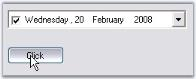
{:.image }

{:.image }

{:.image }

DropDown Button

DropDown button in the DateTimePickerAdv is visible by default. To hide the dropdown button set ShowDropDown property to false. The below are the properties available, to change the default appearance of the control.

Color Settings

At run time, drop down button can be in normal mode, pressed mode or in selected mode. Different colors can be set for different modes.

_Table_ _176__: Property Table_

<table>
<tr>
<td>
DateTimePickerAdv Properties</td><td>
Description</td></tr>
<tr>
<td>
DropDownNormalColor</td><td>
Gets or Sets the dropdown backcolor in Normal mode.</td></tr>
<tr>
<td>
DropDownPressedColor</td><td>
Gets or Sets the dropdown backcolor in Pressed mode, i.e, when the date is selected in the text field.</td></tr>
<tr>
<td>
DropDownSelectedColor</td><td>
Gets or Sets the dropdown backcolor in Selected mode, i.e, when a date is selected using the popup calendar.</td></tr>
</table>

[C#]

this.dateTimePickerAdv2.DropDownNormalColor = System.Drawing.Color.LightBlue;

this.dateTimePickerAdv2.DropDownPressedColor = System.Drawing.Color.Goldenrod;

this.dateTimePickerAdv2.DropDownSelectedColor = System.Drawing.Color.SteelBlue;

[VB.NET]

Me.dateTimePickerAdv2.DropDownNormalColor = System.Drawing.Color.LightBlue

Me.dateTimePickerAdv2.DropDownPressedColor = System.Drawing.Color.Goldenrod

Me.dateTimePickerAdv2.DropDownSelectedColor = System.Drawing.Color.SteelBlue

> 
{:.image }
 _Note: These settings will be effective only when DateTimePickerAdv.Style is Office2003, OfficeXP and VS2005._

{:.image }

Flat Appearance

Dropdown can be given flat appearance using FlatDropDown property. By default it is false.

[C#]

this.dateTimePickerAdv2.FlatDropButton = true;

[VB.NET]

this.dateTimePickerAdv2.FlatDropButton = true;

> 
{:.image }
 _Note: These setting will be effective only when DateTimePickerAdv.Style is Default._

{:.image }

Alignment of the DropDown

When the dropdown button is clicked, the calendar pops up, based on the alignment specified in DropDownAlign property. Default value is Left.

[C#]

this.dateTimePickerAdv1.DropDownAlign = System.Windows.Forms.LeftRightAlignment.Right;

[VB.NET]

Me.dateTimePickerAdv1.DropDownAlign = System.Windows.Forms.LeftRightAlignment.Right

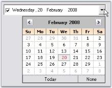
{:.image }

Image for DropDown

The existing dropdown icon can be replaced with a custom image using the below properties.

_Table_ _177__: Property Table_

<table>
<tr>
<td>
DateTimePickerAdv Properties</td><td>
Description</td></tr>
<tr>
<td>
DropDownImage</td><td>
Gets or Sets the Image for dropdown button. </td></tr>
<tr>
<td>
StretchDropDownImage</td><td>
Specifies whether the image of the dropdown is stretched.</td></tr>
</table>

[C#]

this.dateTimePickerAdv1.DropDownImage = ((System.Drawing.Image)(resources.GetObject("dateTimePickerAdv1.DropDownImage")));

this.dateTimePickerAdv1.StretchDropDownImage = true;

[VB.NET]

Me.dateTimePickerAdv1.DropDownImage = DirectCast((resources.GetObject("dateTimePickerAdv1.DropDownImage")), System.Drawing.Image) 

Me.dateTimePickerAdv1.StretchDropDownImage = True 

{:.image }

{:.image }

See Also

Checkbox, Text Field

CheckBox

By default the DateTimePicker control has a checkbox in checked state. This checkbox can be hidden using ShowCheckBox property and the state can be unchecked through designer, using Checked property.

[C#]

this.dateTimePickerAdv1.ShowCheckBox = false;

this.dateTimePickerAdv5.Checked = false;

[VB.NET]

Me.dateTimePickerAdv1.ShowCheckBox = False

Me.dateTimePickerAdv5.Checked = False

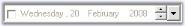
{:.image }

See Also

Text Field, UpDown and DropDown Buttons

Text Field

This section discusses the properties related to Checkbox and text field in the DateTimePicker control.

CheckBox

By default the DateTimePicker control has a checkbox in checked state. This checkbox can be hidden using ShowCheckBox property and the state can be unchecked through designer, using Checked property.

[C#]

this.dateTimePickerAdv1.ShowCheckBox = false;

this.dateTimePickerAdv5.Checked = false;

[VB.NET]

Me.dateTimePickerAdv1.ShowCheckBox = False

Me.dateTimePickerAdv5.Checked = False

{:.image }

Text Field Formatting

Format and CustomFormat properties are used to format the text field. Below are the details

_Table_ _178__: Property Table_

<table>
<tr>
<td>
DateTimePickerAdv Properties</td><td>
Description</td></tr>
<tr>
<td>
Format </td><td>
Gets or Sets the format of the picker. The options are,{{ _Long(default),_  | markdownify }}{{ _Short,_  | markdownify }}{{ _Time and_ | markdownify }}{{ _Custom._ | markdownify }}</td></tr>
<tr>
<td>
CustomFormat</td><td>
Specifies the custom format, when the Format is set to 'Custom'.  For example, If you want to display 'March/2007', set CustomFormat to 'MMMM/yyyy'</td></tr>
</table>

[C#]

//Sets "Long" format for the text field

this.dateTimePickerAdv5.Format = System.Windows.Forms.DateTimePickerFormat.Long;

//Sets "Short" format for the text field

this.dateTimePickerAdv5.Format = System.Windows.Forms.DateTimePickerFormat.Short;

//Sets "Time" format for the text field

this.dateTimePickerAdv5.Format = System.Windows.Forms.DateTimePickerFormat.Time;

//Sets custom format for the text field

this.dateTimePickerAdv5.Format = System.Windows.Forms.DateTimePickerFormat.Custom;

this.dateTimePickerAdv5.CustomFormat = "dd - MM - yyyy";

[VB.NET]

'Sets "Long" format for the text field

Me.dateTimePickerAdv5.Format = System.Windows.Forms.DateTimePickerFormat.Long

'Sets "Short" format for the text field

Me.dateTimePickerAdv5.Format = System.Windows.Forms.DateTimePickerFormat.Short

'Sets "Time" format for the text field

Me.dateTimePickerAdv5.Format = System.Windows.Forms.DateTimePickerFormat.Time

'Sets custom format for the text field

Me.dateTimePickerAdv5.Format = System.Windows.Forms.DateTimePickerFormat.Custom

Me.dateTimePickerAdv5.CustomFormat = "dd - MM - yyyy"

{:.image }

Spacing in TextField

We can specify spacing for the text field in the control, (ex: between month, year and date) using Spacing property. Default value is 0.

[C#]

this.dateTimePickerAdv1.Spacing = 5;

[VB.NET]

Me.dateTimePickerAdv1.Spacing = 5

{:.image }

> 
{:.image }
 _Note: The text field can be refreshed programmatically by calling DateTimePickerAdv.RefreshFields() method._

See Also

Navigating between Fields, UpDown and DropDown Buttons

Null Value Settings

At run time, on clicking the "None" button of the popup calendar, "No date is selected" string will be displayed in the text field like the below image. 

{:.image }

This default string can be changed using NullString property. Below table describes the properties which controls the Null value behavior.

_Table_ _179__: Property Table_

<table>
<tr>
<td>
DateTimePickerAdv Properties</td><td>
Description</td></tr>
<tr>
<td>
EnableNullDate</td><td>
Specifies whether null date support is enabled. If it is set to false, DateTimePickerAdv will always have a selected date instead of null string .i.e,  text fielddisplays the selected date even when {{ _None_ | markdownify }} button is selected. By default it is true.</td></tr>
<tr>
<td>
EnableNullKeys</td><td>
Specifies Backspace or Delete keys makes the date null.  EnableNullDate must be set to true to make this setting effective.</td></tr>
<tr>
<td>
NullString</td><td>
Specifies the text visible when there is no date selected.  EnableNullDate must be set to true to make this setting effective.</td></tr>
<tr>
<td>
NullModeKeyReset</td><td>
Specifies what keys will toggle off null date. i.e, when null value is selected, by pressing the keys we can replace the null value with date selected. The keys are,{{ _ArrowKeys (default),_ | markdownify }}{{ _NumericKeys and_  | markdownify }}{{ _Any._ | markdownify }}EnableNullDate must be set to true to make this setting effective.</td></tr>
<tr>
<td>
IsNullDate</td><td>
Set this to true, if you want to display null value ({{ _String specified in NullString_ | markdownify }}) instead of current value, specified using DateTimePicker.value property. By default it is set to false.</td></tr>
</table>

[C#]

this.dateTimePickerAdv1.EnableNullDate = true;

this.dateTimePickerAdv1.EnableNullKeys = true;

this.dateTimePickerAdv1.NullString = "Null Value"

this.dateTimePickerAdv1.NullModeKeyReset = Syncfusion.Windows.Forms.Tools.NullModeKeyReset.NumericKeys;

[VB.NET]

Me.dateTimePickerAdv1.EnableNullDate = True

Me.dateTimePickerAdv1.EnableNullKeys = True

Me.dateTimePickerAdv1.NullString = "Null Value"

Me.dateTimePickerAdv1.NullModeKeyReset = Syncfusion.Windows.Forms.Tools.NullModeKeyReset.NumericKeys

{:.image }

Calendar

DateTimePickerAdv control contains embedded calendar control which pops-up on clicking the dropdown button at the end of the control. The popup calendar is a MonthCalendarAdv control and hence supports all the properties of the MonthCalendarAdv control. These properties of the calendar can be accessed using DateTimePickerAdv.Calendar.TodayButton _(for example)_property. 

{:.image }

Additionally, the calendar popup can be customized using the DateTimePickerAdv properties. Refer Customizing the Calendar topic.

Day Names

In the calendar, we can specify whether shortest day names can be used or not using UseShortestDayNames property. By default it is true.

[C#]

this.dateTimePickerAdv1.UseShortestDayNames = false;

[VB.NET]

Me.dateTimePickerAdv1.UseShortestDayNames = False

Buttons in Calendar

We can specify the visibility of the None button using NoneButtonVisible property. Default value is true. 

[C#]

this.dateTimePickerAdv1.NoneButtonVisible = false;

[VB.NET]

Me.dateTimePickerAdv1.NoneButtonVisible = False

> 
{:.image }
 _Note: None button will not be visible when EnableNullDate property is set to false. See_ Null Value Settings _to know about EnableNullDate property._

Customizing the Calendar

DateTimePickerAdv control has properties which can improve the look and feel of the popup calendar. This section discusses various appearance settings available for the calendar.

Background Settings

The background of the Calendar can be customized using below properties.

_Table_ _180__: Property Table_

<table>
<tr>
<td>
DateTimePickerAdv  Properties</td><td>
Description</td></tr>
<tr>
<td>
CalendarMonthBackground</td><td>
Sets the background color for the popup calendar.</td></tr>
<tr>
<td>
CalendarTitleBackColor</td><td>
Sets the background of the calendar header.</td></tr>
</table>

[C#]

this.dateTimePickerAdv1.CalendarMonthBackground = System.Drawing.Color.OldLace;

this.dateTimePickerAdv1.CalendarTitleBackColor = System.Drawing.Color.Wheat;

[VB.NET]

Me.dateTimePickerAdv1.CalendarMonthBackground = System.Drawing.Color.OldLace

Me.dateTimePickerAdv1.CalendarTitleBackColor = System.Drawing.Color.Wheat

{:.image }

Foreground Settings

The foreground appearance can be customized using the below properties.

_Table_ _181__: Property Table_

<table>
<tr>
<td>
DateTimePickerAdv  Properties</td><td>
Description</td></tr>
<tr>
<td>
CalendarFont</td><td>
Sets font style for the text in the popup calendar.</td></tr>
<tr>
<td>
CalendarForeColor</td><td>
Sets the fore color of the popup calendar.</td></tr>
<tr>
<td>
CalendarTitleForeColor</td><td>
Specifies the fore color of the calendar header.</td></tr>
<tr>
<td>
CalendarTrailingForeColor</td><td>
Specifies the fore color of the inactive month date.</td></tr>
</table>

[C#]

this.dateTimePickerAdv1.CalendarFont = new System.Drawing.Font("Microsoft Sans Serif", 8.25F, System.Drawing.FontStyle.Italic);

this.dateTimePickerAdv1.CalendarForeColor = System.Drawing.Color.SaddleBrown;

this.dateTimePickerAdv1.CalendarTitleForeColor = System.Drawing.Color.SaddleBrown;

this.dateTimePickerAdv1.CalendarTrailingForeColor = System.Drawing.Color.Blue;

[VB.NET]

Me.dateTimePickerAdv1.CalendarFont = New System.Drawing.Font("Microsoft Sans Serif", 8.25F, System.Drawing.FontStyle.Italic) 

Me.dateTimePickerAdv1.CalendarForeColor = System.Drawing.Color.SaddleBrown 

Me.dateTimePickerAdv1.CalendarTitleForeColor = System.Drawing.Color.SaddleBrown 

Me.dateTimePickerAdv1.CalendarTrailingForeColor = System.Drawing.Color.Blue

{:.image }

_CalendarFont = "Italic"; TrailingForeColor = "Blue"_

Calendar Size

The default size of the popup calendar can be changed using the below properties.

_Table_ _182__: Property Table_

<table>
<tr>
<td>
DateTimePickerAdv  Properties</td><td>
Description</td></tr>
<tr>
<td>
CalendarSize</td><td>
Indicates size of the popup calendar.</td></tr>
<tr>
<td>
CalendarSizeToFit</td><td>
Indicates whether the calendar will size to fit according to the size of the days.</td></tr>
</table>

[C#]

this.dateTimePickerAdv1.CalendarSize = new System.Drawing.Size(250, 200);

this.dateTimePickerAdv1.CalendarSizeToFit = false;

[VB.NET]

Me.dateTimePickerAdv1.CalendarSize = New System.Drawing.Size(250, 200)

Me.dateTimePickerAdv1.CalendarSizeToFit = False

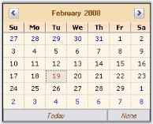
{:.image }

See Also

Calendar Value

Calendar Value

In the Popup calendar, today's date will be selected by default, at run time. This default date can be changed using Value property. You can also specify the range of values / dates that can be selected at run time. 

_Table_ _183__: Property Table_

<table>
<tr>
<td>
DateTimePickerAdv Properties</td><td>
Description</td></tr>
<tr>
<td>
MaxValue</td><td>
Specifies the maximum value that can be picked from the DateTimePickerAdv.</td></tr>
<tr>
<td>
MinValue</td><td>
Specifies the minimum value that can be picked from the DateTimePickerAdv.</td></tr>
</table>

[C#]

this.dateTimePickerAdv1.Value = new System.DateTime(2008, 2, 23, 16, 15, 46, 0);

this.dateTimePickerAdv1.MaxValue = new System.DateTime(2008, 12, 31, 23, 59, 0, 0);

this.dateTimePickerAdv1.MinValue = new System.DateTime(2007, 1, 1, 0, 0, 0, 0);

[VB.NET]

Me.dateTimePickerAdv1.Value = New System.DateTime(2008, 2, 23, 16, 15, 46, 0)

Me.dateTimePickerAdv1.MaxValue = New System.DateTime(2008, 12, 31, 23, 59, 0, 0)

Me.dateTimePickerAdv1.MinValue = New System.DateTime(2007, 1, 1, 0, 0, 0, 0)

See Also

Customizing the Calendar

DesignTime Features

In the designer, DateTimePickerAdv control has shortcut for some property settings in its Task Window. Task Window is opened through the control's smart tag option.

{:.image }

DateTimePickerAdv Appearance

This below topics discusses the background and border settings for the DateTimePickerAdv control.

Background Settings

DateTimePickerAdv control can have custom back color and background images using the properties discussed in this section.

Background Color

The control's back color can be set using the below properties.

_Table_ _184__: Property Table_

<table>
<tr>
<td>
DateTimePickerAdv  Properties</td><td>
Description</td></tr>
<tr>
<td>
BackColor</td><td>
Sets the back color for the DateTimePickerAdv control.</td></tr>
<tr>
<td>
BackgroundColor</td><td>
Sets Solid, Gradient or Pattern style of background for the control. This property setting will override the BackColor property setting.</td></tr>
</table>

[C#]

this.dateTimePickerAdv1.BackColor = System.Drawing.Color.Cornsilk;

this.dateTimePickerAdv1.BackgroundColor = new Syncfusion.Drawing.BrushInfo(Syncfusion.Drawing.GradientStyle.Vertical, System.Drawing.Color.Linen, System.Drawing.Color.BurlyWood);

[VB.NET]

Me.dateTimePickerAdv1.BackColor = System.Drawing.Color.Cornsilk 

Me.dateTimePickerAdv1.BackgroundColor = New Syncfusion.Drawing.BrushInfo(Syncfusion.Drawing.GradientStyle.Vertical, System.Drawing.Color.Linen, System.Drawing.Color.BurlyWood) 

{:.image }

Background Image

Background image for the DateTimePickerAdv is set using the below property.

_Table_ _185__: Property Table_

<table>
<tr>
<td>
DateTimePickerAdv  Properties</td><td>
Description</td></tr>
<tr>
<td>
BackgroundImage</td><td>
Sets the background image for the control.</td></tr>
<tr>
<td>
BackgroundImageLayout</td><td>
Sets the background image layout for the control.</td></tr>
</table>

[C#]

this.dateTimePickerAdv2.BackgroundImage = ((System.Drawing.Image)(resources.GetObject("dateTimePickerAdv2.BackgroundImage")));

[VB.NET]

Me.dateTimePickerAdv2.BackgroundImage = DirectCast((resources.GetObject("dateTimePickerAdv2.BackgroundImage")), System.Drawing.Image) 

{:.image }

See Also

Border Styles

Border Styles

The wide variety of border options are available for DateTimePickerAdv control when they are in 2D or in 3D mode. The properties in the below table illustrates the border settings.

_Table_ _186__: Property Table_

<table>
<tr>
<td>
DateTimePickerAdv Properties</td><td>
Description</td></tr>
<tr>
<td>
BorderStyle</td><td>
Specifies whether the DateTimePickerAdv should have a border and if it is 2D or 3D border. The options are,* {{ _None_ | markdownify }}* {{ _FixedSingle_  | markdownify }}* {{ _Fixed3D(Default)_ | markdownify }}</td></tr>
<tr>
<td>
 Border3DStyle</td><td>
Specifies the 3D border style of the DateTimePickerAdv.The options are,* {{ _Raised_ | markdownify }}* {{ _RaisedOuter_  | markdownify }}* {{ _RaisedInner_  | markdownify }}* {{ _Sunken(Default)_ | markdownify }}* {{ _SunkenOuter_  | markdownify }}* {{ _SunkenInner_  | markdownify }}* {{ _Etched_  | markdownify }}* {{ _Bump_  | markdownify }}* {{ _Adjust_  | markdownify }}* {{ _Flat_ | markdownify }}</td></tr>
<tr>
<td>
 BorderSingle</td><td>
Specifies the 2D border style of the DateTimePickerAdv. The options are,* {{ _None_ | markdownify }}* {{ _Dotted_ | markdownify }}* {{ _Dashed_ | markdownify }}* {{ _Solid (default)_ | markdownify }}* {{ _Inset_  | markdownify }}* {{ _Outset_ | markdownify }}</td></tr>
<tr>
<td>
 BorderSides</td><td>
Specifies the sides of the control which should have a border. The sides are,* {{ _Left_ | markdownify }}* {{ _Top_ | markdownify }}* {{ _Right_  | markdownify }}* {{ _Bottom_ | markdownify }}* {{ _Middle_  | markdownify }}* {{ _All (Default)_ | markdownify }}</td></tr>
<tr>
<td>
 BorderColor</td><td>
Specifies the color of the 2D border when BorderStyle is set FixedSingle.</td></tr>
</table>

[C#]

//Sets 2D border

this.dateTimePickerAdv1.BorderStyle = System.Windows.Forms.BorderStyle.FixedSingle;

//Sets 2D border style

this.dateTimePickerAdv1.BorderSingle = System.Windows.Forms.ButtonBorderStyle.Dashed;

//Sets border for all the side of the control

this.dateTimePickerAdv1.BorderSides = System.Windows.Forms.Border3DSide.All;

//Sets color for the 2D border

this.dateTimePickerAdv1.BorderColor = System.Drawing.Color.SteelBlue;

//Sets 3D border

this.dateTimePickerAdv1.BorderStyle = System.Windows.Forms.BorderStyle.Fixed3D;

//Sets SunkenInner 3D border style

this.dateTimePickerAdv1.Border3DStyle = System.Windows.Forms.Border3DStyle.SunkenInner;

[VB.NET]

'Sets 2D border 

Me.dateTimePickerAdv1.BorderStyle = System.Windows.Forms.BorderStyle.FixedSingle 

'Sets 2D border style 

Me.dateTimePickerAdv1.BorderSingle = System.Windows.Forms.ButtonBorderStyle.Dashed 

'Sets border for all the side of the control 

Me.dateTimePickerAdv1.BorderSides = System.Windows.Forms.Border3DSide.All 

'Sets color for the 2D border 

Me.dateTimePickerAdv1.BorderColor = System.Drawing.Color.SteelBlue 

'Sets 3D border 

Me.dateTimePickerAdv1.BorderStyle = System.Windows.Forms.BorderStyle.Fixed3D 

'Sets SunkenInner 3D border style 

Me.dateTimePickerAdv1.Border3DStyle = System.Windows.Forms.Border3DStyle.SunkenInner 

{:.image }

See Also

Background Settings

Runtime Features

This section covers the below topics:

Month Images

We can set images for the popup menu of the Calendar using MonthImageList property of DateTimePickerAdv control.

[C#]

// imageList1

this.imageList1.ImageSize = new System.Drawing.Size(16, 16);

this.imageList1.ImageStream = ((System.Windows.Forms.ImageListStreamer)(resources.GetObject("imageList1.ImageStream")));

// ImageList of the PopupMenu of the Popup Calendar

this.dateTimePickerAdv1.MonthImageList = this.imageList1;

[VB.NET]

' imageList1

Me.imageList1.ImageSize = New System.Drawing.Size(16, 16)

Me.imageList1.ImageStream= (CType(resources.GetObject("imageList1.ImageStream"), System.Windows.Forms.ImageListStreamer))

' ImageList of the PopupMenu of the Popup Calendar

Me.dateTimePickerAdv1.MonthImageList = Me.imageList1

{:.image }

Context Menu

When you right-click on a DateTimePickerAdv control at run time, a context menu will be displayed like the below image. 

{:.image }

This default context menu can be replaced with Syncfusion XP Menu by setting UseEnhancedMenu property to true. By default it is set to false. 

[C#]

this.dateTimePickerAdv1.UseEnhancedMenu = true;

[VB.NET]

Me.dateTimePickerAdv1.UseEnhancedMenu = True

{:.image }

Menu Options

The menu options are: 

* Cut - Cuts the displayed date and by default displays "No Date is selected" string.
* Copy - Copies the displayed date and stores in clipboard.
* Paste - Pastes the copied date.
* No Date/Time - Selects no date and displays "No Date is selected".

We can set the text value format that is copied to the clipboard using ClipboardFormat property.

_Table_ _187__: Property Table_

<table>
<tr>
<td>
DateTimePickerAdv Properties</td><td>
Description</td></tr>
<tr>
<td>
ClipboardFormat</td><td>
While doing copy / paste operation, we can specify the format of the value of the DateTimePickerAdv control that is copied, by using ClipBoardFormat property. The formats are, * {{ _Long(default)_ | markdownify }}* {{ _Short_  | markdownify }}* {{ _Time_  | markdownify }}* {{ _Custom_ | markdownify }}</td></tr>
<tr>
<td>
 CopyFieldsOnly</td><td>
Indicates whether only the selected field will be copied or the whole text field will be copied. </td></tr>
</table>

[C#]

this.dateTimePickerAdv1.CopyFieldsOnly = true;

this.dateTimePickerAdv1.ClipboardFormat = System.Windows.Forms.DateTimePickerFormat.Short;

[VB.NET]

Me.dateTimePickerAdv1.CopyFieldsOnly = True

Me.dateTimePickerAdv1.ClipboardFormat = System.Windows.Forms.DateTimePickerFormat.Short

See Also

Text Field, Null value Settings

Navigating between fields

At run time, user can easily navigate between values in the text field like date, month, year, time using the TAB key. The below properties settings are necessary for tabbing between the fields.

_Table_ _188__: Property Table_

<table>
<tr>
<td>
DateTimePickerAdv Properties</td><td>
Description</td></tr>
<tr>
<td>
TabStop</td><td>
Indicates whether the user can use the Tab key, to focus the DateTimePickerAdv control.</td></tr>
<tr>
<td>
TabForwarding</td><td>
Indicates if the control will moves its focus to the next field when the tab key is pressed.</td></tr>
<tr>
<td>
TabIndex</td><td>
Indicates the index in the TAB order that this control will occupy.</td></tr>
<tr>
<td>
TabLeave</td><td>
Indicates whether the focus should be moved away from the control, when there is no fields to tab through.</td></tr>
</table>

[C#]

this.dateTimePickerAdv1.TabForwarding = true;

this.dateTimePickerAdv1.TabIndex = 1;

this.dateTimePickerAdv1.TabLeave = true;

this.dateTimePickerAdv1.TabStop = true;

[VB.NET]

Me.dateTimePickerAdv1.TabForwarding = True

Me.dateTimePickerAdv1.TabIndex = 1

Me.dateTimePickerAdv1.TabLeave = True

Me.dateTimePickerAdv1.TabStop = True

Themes and Styles

Themes

We can apply themes for the DateTimePickerAdv and also the child controls using the below properties.

_Table_ _189__: Property Table_

<table>
<tr>
<td>
DateTimePickerAdv Properties</td><td>
Description</td></tr>
<tr>
<td>
ThemesEnabled</td><td>
Specifies whether to enable themes for the DateTimePickerAdv control.</td></tr>
<tr>
<td>
ThemedChildControls</td><td>
Setting ThemesEnabled to true will not enable themes for its child controls (CheckBox, DropDown , UpDown and Calendar). To enable themes for the child controls of the DateTimePicker, set ThemedChildControls to true.</td></tr>
</table>

[C#]

this.dateTimePickerAdv1.ThemesEnabled = true;

this.dateTimePickerAdv1.ThemedChildControls = true;

[VB.NET]

Me.dateTimePickerAdv1.ThemesEnabled = True

Me.dateTimePickerAdv1.ThemedChildControls = True

' Setting backcolor for the control when it is ReadOnly

Me.dateTimePickerAdv1.ReadOnly = True

Me.dateTimePickerAdv1.IgnoreThemeBackground = True

{:.image }

{:.image }

Styles

Visual Styles for the DateTimePickerAdv and its child controls can be applied using the Style property. 

_Table_ _190__: Property Table_

<table>
<tr>
<td>
DateTimePickerAdv Properties</td><td>
Description</td></tr>
<tr>
<td>
Style</td><td>
Specifies the Office style of the picker. The options are :* {{ _OfficeXP_  | markdownify }}* {{ _Office2003_  | markdownify }}* {{ _VS2005_ | markdownify }}* {{ _Office2007_  | markdownify }}* {{ _Default (default)_ | markdownify }}</td></tr>
<tr>
<td>
 Office2007Theme</td><td>
Indicates the office color scheme used, when Style is set to Office2007.</td></tr>
</table>

[C#]

// Sample for setting Office2007 style for the control

this.dateTimePickerAdv1.Style = Syncfusion.Windows.Forms.VisualStyle.Office2007;

[VB.NET]

' Sample for setting Office2007 style for the control

Me.dateTimePickerAdv1.Style = Syncfusion.Windows.Forms.VisualStyle.Office2007

{:.image }

[C#]

//Sets the Color scheme as Blue when the style is Office2007

this.dateTimePickerAdv1.Office2007Theme = Syncfusion.Windows.Forms.Office2007Theme.Blue;

[VB.NET]

'Sets the Color scheme as Blue when the style is Office2007

Me.dateTimePickerAdv1.Office2007Theme = Syncfusion.Windows.Forms.Office2007Theme.Blue

{:.image }

Custom Colors

We can also apply custom colors to the DateTimePickerAdv control by setting Office2007Theme to "Managed" and specifying the custom color through the ApplyManagedColors method as follows.

[C#]

this.dateTimePickerAdv1.Office2007Theme = Syncfusion.Windows.Forms.Office2007Theme.Managed;

Office2007Colors.ApplyManagedColors(this, Color.Orange);

[VB.NET]

Me.dateTimePickerAdv1.Office2007Theme = Syncfusion.Windows.Forms.Office2007Theme.Managed;

Office2007Colors.ApplyManagedColors(Me, Color.Orange)

{:.image }

Advanced Features

This section covers the below topics:

Data Binding

Essential Tools supports extensive DataBinding in DateTimePickerAdv using the Value and BindableValue property. The following example illustrates the DataBinding of the DataSet belonging to a DataGrid. 

> 
{:.image }
_Note: Always use BindableValue property if dataset contains Null value. In cases where no Null value exists in the dataset, Value property can be used._

To bind a DateTimePickerAdv, perform the following steps.

73. Add a DateTimePickerAdv and a DataGrid controls to the form.
74. Create a daaset using the code below.

[C#]

// Creating DataSet,Table and rows.

DataSet dataSet = null;

DataTable table = null;

dataSet = new DataSet();

table = dataSet.Tables.Add("Table");

table.Columns.Add("DateTimeColumn", typeof(DateTime));

table.Columns[0].AllowDBNull = true;

table.Rows.Add(new object[]{DateTime.Now - TimeSpan.FromDays(60)});

table.Rows.Add(new object[]{DateTime.Now});

table.Rows.Add(new object[]{DBNull.Value});

[VB.NET]

' Creating DataSet,Table and rows.

Private dataSet As DataSet = Nothing

Private table As DataTable = Nothing

Private dataSet = New DataSet()

Private table = dataSet.Tables.Add("Table")

table.Columns.Add("DateTimeColumn", GetType(DateTime))

Private table.Columns(0).AllowDBNull = True

table.Rows.Add(New Object(){DateTime.Now - TimeSpan.FromDays(60)})

table.Rows.Add(New Object(){DateTime.Now})

table.Rows.Add(New Object(){DBNull.Value})              

75. Assign the dataset to the DataGrid control using its DataSource property. Set the control's DataMember property to the member that must be bound.

[C#]

dataGrid1.DataSource = dataSet;

dataGrid1.DataMember = "Table";

[VB.NET]

Private dataGrid1.DataSource = dataSet

Private dataGrid1.DataMember = "Table"

76. Bind the datasource with the DateTimePickerAdv control.

[C#]

// Setting the BindableValue property in order to Data Bind.

dateTimePickerAdv1.DataBindings.Add("BindableValue", dataSet, "Table.DateTimeColumn");

dateTimePickerAdv1.Focus();

[VB.NET]

' Setting the BindableValue property in order to Data Bind.

dateTimePickerAdv1.DataBindings.Add("BindableValue", dataSet, "Table.DateTimeColumn")

dateTimePickerAdv1.Focus()                       

77. Run the application. Select a data in the datagrid and DateTimePicker will display the corresponding date value (The DateTimePickerAdv is bound to the datasource using BindableValue property as datasource contains Null value. Selecting in the datagrid will automatically position the datasource to the related row which will update the DateTimePickerAdv with the appropriate data).

{:.image }

A sample which demonstrates this feature is available in the below sample installation path.

…\_My Documents\Syncfusion\EssentialStudio\Version Number\Windows\Tools.Windows\Samples\Advanced Editor Functions\ActionGroupingDemo_

  Globalization

DateTimePickerAdv supports globalization through DateTimePickerAdv.Culture property.

_Table_ _191__: Property Table_

<table>
<tr>
<td>
DateTimePickerAdv Properties</td><td>
Description</td></tr>
<tr>
<td>
Culture</td><td>
Gets or sets the current culture of the DateTimePickerAdv control. UseCurrentCulture should be set to false to make this setting effective.</td></tr>
<tr>
<td>
UseCurrentCulture</td><td>
Specifies whether the current culture of the machine will be used. By default it is false.</td></tr>
</table>

[C#]

this.dateTimePickerAdv1.UseCurrentCulture = false;

this.dateTimePickerAdv1.Culture = new System.Globalization.CultureInfo("hi-IN");

[VB.NET]

Me.dateTimePickerAdv1.UseCurrentCulture = False

Me.dateTimePickerAdv1.Culture = New System.Globalization.CultureInfo("hi-IN")

{:.image }

Custom PopupWindow

This section deals with creating a custom popup window for the DateTimePickerAdv control. We can implement IDateTimePickerAdvCalendar interface to drop down a custom window.

IDateTimePickerAdvCalendar Interface Members

_Table_ _192__: Member Table_

<table>
<tr>
<td>
IDateTimePickerAdvCalendar Member</td><td>
Description</td></tr>
<tr>
<td>
Active</td><td>
Boolean value indicating if the DateTimePickerAdv should consider the interface events fired by this control.</td></tr>
<tr>
<td>
Appearance properties (CalendarFont, CalendarForeColor, CalendarMonthBackground, TitleBackColor, TitleForeColor and TrailingForeColor)</td><td>
{{ _CalendarFont_ | markdownify }} - Gets / sets the font used to draw the calendar that implements the interface, {{ _CalendarForeColor_ | markdownify }} - Gets / sets the color used to draw the foreground of calendar that implements the interface, {{ _CalendarMonthBackground_ | markdownify }} - Gets / sets the color used to draw the month background of calendar that implements the interface, {{ _TitleBackColor_ | markdownify }} - Gets / sets the color used to draw the title background of calendar that implements the interface,{{ _TitleForeColor_ | markdownify }} - Gets / sets the color used to draw the foreground of the title of calendar that implements the interface, {{ _TrailingForeColor_ | markdownify }} - Gets / sets the color used to draw the trailing foreground of calendar that implements the interface.</td></tr>
<tr>
<td>
Value properties (MinDate, MaxDate, Value)</td><td>
{{ _MinDate_ | markdownify }} - Gets / sets the minimum date of the calendar that implements the interface,{{ _MaxDate_ | markdownify }} - Gets / sets the maximum date of the calendar that implements the interface and{{ _Value_ | markdownify }} - Gets / sets the date of the calendar that implements the interface.</td></tr>
<tr>
<td>
Culture</td><td>
Gets or set the culture of the calendar that implements this interface.</td></tr>
</table>
_Table_ _193__: Events Table_

<table>
<tr>
<td>
IDateTimePickerAdvCalendar Events</td><td>
Description</td></tr>
<tr>
<td>
NullButtonDown</td><td>
Event is similar to the DateTimePickerAdv.NullButtonEventHandler. It is handled when the none button is clicked or when the control implementing the interface wants the DateTimePickerAdv to have the NullString displayed. </td></tr>
<tr>
<td>
SelectDate</td><td>
Event is similar to the DateTimePickerAdv.SelectDateEventHandler. It is handled when the user selects a date on the control implementing the interface or the control wants the popup to close and set the picker's date to the Value member.</td></tr>
<tr>
<td>
DateChange</td><td>
Event is similar to the DateTimePickerAdv.DateChangedEventHandler. It is handled when the user has changed the date of the control implementing the interface and doesn't want the popup to close, just update the picker's date to the Value member.</td></tr>
</table>
Creating a Custom Popup Window for DateTimePickerAdv

Follow the below steps to add a Windows MonthCalendar control as the Popup for the DateTimePickerAdv, using PopupControlContainer.

78. Drag a DateTimePickerAdv, PopupControlContainer and a button onto the form designer from the toolbox. 

{:.image }

79. Create a control that implements the IDateTimePickerAdvCalendar interface using the below code.

[C#]

//Creating Calendar which implements the IDateTimePickerAdvCalendar

private MyCustomCalendar MonthCalendar;

//Initializing the Calendar 

this.MonthCalendar = new MyCustomCalendar();

//Defining the Calendar Class which implements IDateTimePickerAdvCalendar

public class MyCustomCalendar : MonthCalendar, IDateTimePickerAdvCalendar

{

    private bool active;

    public bool Active

    {

        get { return active; }

        set { active = value; }

    }

    public System.Drawing.Font CalendarFont

    {

        get { return Font; }

        set { Font = value; }

    }

    public Color CalendarForeColor

    {

        get { return ForeColor; }

        set { ForeColor = value; }

    }

    public Color CalendarMonthBackground

    {

        get { return BackColor; }

        set { BackColor = value; }

    }

    public DateTime Value

    {

        get { return SelectionStart; }

        set { SelectionStart = SelectionEnd = value; }

    }

    public event DateTimePickerAdv.NullButtonEventHandler NullButtonDown;

    public event DateTimePickerAdv.SelectDateEventHandler SelectDate;

    public event DateTimePickerAdv.DateChangedEventHandler DateChange;

    public MyCustomCalendar()

    {

        this.DateSelected += new System.Windows.Forms.DateRangeEventHandler(OnDateSelected);

        this.DateChanged += new System.Windows.Forms.DateRangeEventHandler(OnDateChanged);

    }

    protected void OnDateSelected(object sender, System.Windows.Forms.DateRangeEventArgs e)

    {

        if (SelectDate != null)

        {

            SelectDate(this, new EventArgs());

        }

    }

    protected void OnDateChanged(object sender, System.Windows.Forms.DateRangeEventArgs e)

    {

        if (DateChange != null)

        {

            DateChange(this, new EventArgs());

        }

    }

    public string Culture

    {

        get { return "Not Supported"; }

    }

    public void FireNullEvent()

    {

        if (NullButtonDown != null)

        {

            NullButtonDown(this, new EventArgs());

        }

    }

    CultureInfo IDateTimePickerAdvCalendar.Culture

    {

        get { throw new Exception("The method or operation is not implemented."); }

        set { throw new Exception("The method or operation is not implemented."); }

    }           

}

[VB.NET]

 'Creating Calendar which implements the IDateTimePickerAdvCalendar 

Private MonthCalendar As MyCustomCalendar

'Initializing the Calendar 

Me.MonthCalendar = New MyCustomCalendar()

'Defining the Calendar Class which implements IDateTimePickerAdvCalendar 

Public Class MyCustomCalendar

    Inherits MonthCalendar

    Implements IDateTimePickerAdvCalendar

    Private m_active As Boolean

    Public Property Active() As Boolean

        Get

            Return m_active

        End Get

        Set(ByVal value As Boolean)

            m_active = value

        End Set

    End Property

    Public Property CalendarFont() As System.Drawing.Font

        Get

            Return Font

        End Get

        Set(ByVal value As System.Drawing.Font)

            Font = value

        End Set

    End Property

    Public Property CalendarForeColor() As Color

        Get

            Return ForeColor

        End Get

        Set(ByVal value As Color)

            ForeColor = value

        End Set

    End Property

    Public Property CalendarMonthBackground() As Color

        Get

            Return BackColor

        End Get

        Set(ByVal value As Color)

            BackColor = value

        End Set

    End Property

    Public Property Value() As DateTime

        Get

            Return SelectionStart

        End Get

        Set(ByVal value As DateTime)

            SelectionStart = SelectionEnd = value

        End Set

    End Property

    Public Event NullButtonDown As DateTimePickerAdv.NullButtonEventHandler

    Public Event SelectDate As DateTimePickerAdv.SelectDateEventHandler

    Public Event DateChange As DateTimePickerAdv.DateChangedEventHandler

    Public Sub New()

        AddHandler Me.DateSelected, AddressOf OnDateSelected

        AddHandler Me.DateChanged, AddressOf OnDateChanged

    End Sub

    Protected Sub OnDateSelected(ByVal sender As Object, ByVal e As System.Windows.Forms.DateRangeEventArgs)

        RaiseEvent SelectDate(Me, New EventArgs())

    End Sub

    Protected Sub OnDateChanged(ByVal sender As Object, ByVal e As System.Windows.Forms.DateRangeEventArgs)

        RaiseEvent DateChange(Me, New EventArgs())

    End Sub

    Public ReadOnly Property Culture() As String

        Get

            Return "Not Supported"

        End Get

    End Property

    Public Sub FireNullEvent()

        RaiseEvent NullButtonDown(Me, New EventArgs())

    End Sub

    Private Property Culture() As CultureInfo Implements IDateTimePickerAdvCalendar.Culture

        Get

            Throw New Exception("The method or operation is not implemented.")

        End Get

        Set(ByVal value As CultureInfo)

            Throw New Exception("The method or operation is not implemented.")

        End Set

    End Property

End Class

80. Set theActive property of the MonthCalendar to True. Set the DateTimePickerAdv's CustomPopupWindow property to the PopupControlContainer control. Set the DateTimePickerAdv's CustomDrop property to theTrue. 

[C#]

this.dateTimePickerAdv1.CustomDrop = true;

this.dateTimePickerAdv1.CustomPopupWindow = this.popupControlContainer1;

//Setting the DateTimePickerAdv control to consider the interface events by enabling Active property

this.MonthCalendar.Active = true;

//Adding Calendar to the Popup Control Container

this.popupControlContainer1.Controls.Add(this.MonthCalendar);

[VB.NET]

Me.dateTimePickerAdv1.CustomDrop = True 

Me.dateTimePickerAdv1.CustomPopupWindow = Me.popupControlContainer1 

'Setting the DateTimePickerAdv control to consider the interface events by enabling Active property 

Me.MonthCalendar.Active = True 

'Adding Calendar to the Popup Control Container 

Me.popupControlContainer1.Controls.Add(Me.MonthCalendar)

81. In the button click event, call the MyCustomCalendar's FireNullEvent method. 

[C#]

private void buttonAdv1_Click(object sender, EventArgs e)

{

    //Calling the below method to fire the Null Event of the Calendar control created

    MonthCalendar.FireNullEvent();

}

[VB.NET]

Private Sub buttonAdv1_Click(ByVal sender As Object, ByVal e As EventArgs)

    'Calling the below method to fire the Null Event of the Calendar control created 

    MonthCalendar.FireNullEvent()

End Sub

82. Run the application and click the dropdown button of the DateTimePickerAdv control to display the custom popup. 

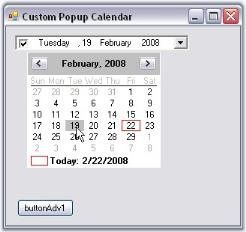
{:.image }

83. When you click the button, the DateTimePickerAdv will display the NullString specified in NullString property.

{:.image }

A sample which demonstrates adding a MonthCalendarAdv itself as a custom popup calendar to the DateTimePickerAdv control is available in the below sample installation location.

…\_My Documents\Syncfusion\EssentialStudio\Version Number\Windows\Tools.Windows\Samples\Advanced Editor Functions\ActionGroupingDemo_

###### DateTimePicker Events

Following are the events of DateTimePickerAdv control.

_Table_ _194__: Property Table_

<table>
<tr>
<td>
DateTimePickerAdv Properties</td><td>
Description</td></tr>
<tr>
<td>
BeforePopup</td><td>
Handled just before the popup is displayed.</td></tr>
<tr>
<td>
BindableValueChanged</td><td>
Handled when the BindingValue property is changed.</td></tr>
<tr>
<td>
CheckBoxCheckedChanged</td><td>
Handled when the checked state of the Checkbox changes.</td></tr>
<tr>
<td>
OnPopup</td><td>
Handled when the popup is displayed.</td></tr>
<tr>
<td>
PopupClosed</td><td>
Handled when the popup is closed. It uses PopupClosedEventHandler.</td></tr>
<tr>
<td>
StretchDropDownImageChanged</td><td>
Handled when the StretchDropDownImage property changes.</td></tr>
<tr>
<td>
ValueChanged</td><td>
Event is handled when the Value property changes.</td></tr>
</table>
PopupClosed Event

This event is handled when the popup is closed. Using the PopupCloseType member of the PopupClosedEventHandler, we can identify the type of closing.

[C#]

private void dateTimePickerAdv1_PopupClosed(object sender, PopupClosedEventArgs e)

{            

    //Canceled - User cancels the updates if any.

    //Deactivated - If the user moves the focus to some other window

    //Done - If the user wants the changes to be applied to the control

    Console.WriteLine(e.PopupCloseType.ToString());

}

[VB.NET]

Private Sub dateTimePickerAdv1_PopupClosed(ByVal sender As Object, ByVal e As PopupClosedEventArgs)

    'Canceled - User cancels the updates if any. 

    'Deactivated - If the user moves the focus to some other window 

    'Done - If the user wants the changes to be applied to the control 

    Console.WriteLine(e.PopupCloseType.ToString())

End Sub

###### Frequently Asked Questions

 This section illustrates the solutions for various task-based queries about the control.

How to change the date in a DateTimePickerAdv control, when it is ReadOnly?

We can make the control read only by setting ReadOnly property to true. DateTimePickerAdv control have an option to change the date, even in ReadOnly mode using Arrow keys. Set ReadOnlyValueChange property to true to effect this setting.

[C#]

this.dateTimePickerAdv1.ReadOnly = true;

this.dateTimePickerAdv1.ReadOnlyValueChange = true;

[VB.NET]

Me.dateTimePickerAdv1.ReadOnly = True

Me.dateTimePickerAdv1.ReadOnlyValueChange = True

{:.image }

How to display DateTimePickerAdv control programmatically?

We can display the Calendar programmatically on a button click. The DisplayCalendar method should be called from the click event handler in order to show the control. 

[C#]

private void button1_Click(object sender, System.EventArgs e)

{

   // Shows the calendar.

this.dateTimePickerAdv1.DisplayCalendar();

}

[VB.NET]

Private Sub button1_Click(ByVal sender As Object, ByVal e As System.EventArgs)

   ' Shows the calendar.

Me.dateTimePickerAdv1.DisplayCalendar()

End Sub

Which event will raise when the date in the DateTimePickerAdv is changed?

CalendarDateChanged event is raised when a date in the DateTimePickerAdv is changed using the keys, or using the mouse.

[C#]

this.dateTimePickerAdv1.Calendar.DateChanged += new EventHandler(Calendar_DateChanged);

void Calendar_DateChanged(object sender, EventArgs e)

{

Console.WriteLine("Date Changed");

}

[VB.NET]

Me.dateTimePickerAdv1.Calendar.DateChanged += New EventHandler(Calendar_DateChanged)

Private Sub Calendar_DateChanged(ByVal sender As Object, ByVal e As EventArgs)

    Console.WriteLine("Date Changed")

End Sub

Which event will raise when the month is changed using arrow button?

 When the month in the DateTimePickerAdv is changed using Arrow button, ValueChanged event is raised.

[C#]

this.dateTimePickerAdv1.ValueChanged += new EventHandler(dateTimePickerAdv1_ValueChanged);

private void dateTimePickerAdv1_ValueChanged(object sender, EventArgs e)

{

    if (Control.MouseButtons != MouseButtons.None)

    {

        Console.WriteLine("Month Changed using ArrowButton");

    }

}

[VB.NET]

Me.dateTimePickerAdv1.ValueChanged += New EventHandler(dateTimePickerAdv1_ValueChanged)

Private Sub dateTimePickerAdv1_ValueChanged(ByVal sender As Object, ByVal e As EventArgs)

    If Control.MouseButtons &lt;&gt; MouseButtons.None Then

        Console.WriteLine("Month Changed using ArrowButton")

    End If

End Sub

How to close the DateTimePickerAdv's Drop-Down by hitting ENTER key or ESC key

If you want to close the DateTimePickerAdv's drop-down, when you hit the ENTER key or the ESC key, you need to set DateTimePickerAdv.WantEnterKey property to _false_.

_Table_ _195__: Property Table_

<table>
<tr>
<th>
Property</th><th>
Description</th></tr>
<tr>
<td>
WantEnterKey</td><td>
True – Drop-down is not closed when hitting the Enter key or Esc keyFalse – Drop-down will get closed when hitting the Enter key or Esc key</td></tr>
</table>

[C#]

this.dateTimePickerAdv1.Calendar.WantEnterKey = false;

[VB.NET]

Me.dateTimePickerAdv1.Calendar.WantEnterKey = False

### ColorUI Controls

The following advanced ColorUI Controls are discussed below.

##### ColorUIControl

The Essential Tools ColorUIControl allows .NET developers to provide a standard user-interface which, is similar to the Visual Studio .NET color picker drop-down, for selecting colors in their Windows Forms applications. The ColorUIControl implements a palette type visual interface comprising of the System, Standard, Custom and UserColor color groups. The control can be used either as a regular control that is hosted within a parent container or as a drop-down. Refer ColorPickerButton to use ColorUIControl as drop down.

{:.image }

The .NET framework provides a color dialog control which, allows applications to collect color information from users. However, the color dialog control does not provide any way to place a control within the layout of the application in order to collect color information. The Essential Tools ColorUIControl provides an easy to use color palette control that can be placed inline in applications.  

The ColorUIControl implements a palette type visual interface for selecting colors at run-time. The ColorUIControl class offers a selection of colors that are divided into four color groupings that are arranged as tabs. The four color groupings are:

* SystemColors consisting of colors defined within the SystemColors class.
* StandardColors consisting of basic colors.
* CustomColors providing a customizable color palette.
* UserColors providing different shades of user defined Colors 

See also

Creating ColorUIControl

###### Features

ColorUIControl provides a standard user interface for selecting colors and contains following features.

* User Color Groups can be created and color cells in the ColorUIControl can be customized.
* The ColorUI control can be used to display in Popup mode. 
* The ColorUI control can be used within the layout of the application in order to collect color information from the users.

See Also

Concepts and Features

###### Creating ColorUIControl

ColorUIControl can be added through designer by just dragging-and-dropping it from thetoolbox onto the Windows Form Designer. 

{:.image }

It can also be created programmatically as discussed below.

84. Include the required namespace.

[C#]

using Syncfusion.Windows.Forms.Tools;

[VB.NET]

Imports Syncfusion.Windows.Forms.Tools

85. Create an instance of the ColorUIControl control class. Specify its size and add it to the form.

[C#]

// Declaring and Initializing the control

private Syncfusion.Windows.Forms.ColorUIControl colorUIControl1;

this.colorUIControl1=new Syncfusion.Windows.Forms.ColorUIControl();

//Specify the size for the control

this.colorUIControl1.Size = new System.Drawing.Size(200, 136);

Adding ColorUIControl to the form

this.Controls.Add(this.colorUIControl1);

[VB.NET]

' Declaring and Initializing the control

Private colorUIControl1 As Syncfusion.Windows.Forms.ColorUIControl

Me.colorUIControl1 = New Syncfusion.Windows.Forms.ColorUIControl()

'Specify the size for the control

Me.colorUIControl1.Size = New System.Drawing.Size(200, 136)

' Adding ColorUIControl to the form

Me.Controls.Add(Me.colorUIControl1)

{:.image }

See also

Concepts and Features

###### Concepts and Features

The following topics will help you become more familiar in using the ColorUI control.

Color Groups

ColorUI control has three in-built color groups which are CustomColors, StandardColor, and SystemColors. This section gives you an idea of the color groups available.

{:.image }

Displaying the Color Groups

We can control the display of the color groups using ColorGroups property. 

{:.image }

[C#]

this.colorUIControl1.ColorGroups = ((Syncfusion.Windows.Forms.ColorUIGroups)((Syncfusion.Windows.Forms.ColorUIGroups.CustomColors | Syncfusion.Windows.Forms.ColorUIGroups.StandardColors)));

[VB.NET]

Me.colorUIControl1.ColorGroups = DirectCast(((Syncfusion.Windows.Forms.ColorUIGroups.CustomColors Or Syncfusion.Windows.Forms.ColorUIGroups.StandardColors)), Syncfusion.Windows.Forms.ColorUIGroups) 

{:.image }

User Groups

ColorGroups property also let you add user groups in addition to the standard groups. The color palette for the UserGroups will be CustomColors, by default.

[C#]

this.colorUIControl1.ColorGroups = ((Syncfusion.Windows.Forms.ColorUIGroups)(((Syncfusion.Windows.Forms.ColorUIGroups.CustomColors | Syncfusion.Windows.Forms.ColorUIGroups.StandardColors)| Syncfusion.Windows.Forms.ColorUIGroups.UserColors)));

[VB.NET]

Me.colorUIControl1.ColorGroups = DirectCast((((Syncfusion.Windows.Forms.ColorUIGroups.CustomColors Or  Syncfusion.Windows.Forms.ColorUIGroups.StandardColors) Or Syncfusion.Windows.Forms.ColorUIGroups.UserColors)),  Syncfusion.Windows.Forms.ColorUIGroups) 

{:.image }

> 
{:.image }
 _Note: We can add custom text for the tabs of the Color groups. See_ Tab Text _for details._

> 
{:.image }
 _Note: The Custom Color Panels and User Color Panels can be stretched according to the size of the control. Refer_ ColorUIControl Appearance _for details._

See Also

Runtime Settings

Tab Text

The default tab text of the ColorGroups can be set using the below properties.

_Table_ _196__: Property Table_

<table>
<tr>
<td>
ColorUIControl Properties</td><td>
Description</td></tr>
<tr>
<td>
CustomTabName</td><td>
Set the text displayed on the custom colors tab. The tab name can be reset using ResetCustomTabName() method.</td></tr>
<tr>
<td>
StandardTabName</td><td>
Set the text displayed on the Standard colors tab.The tab name can be reset using ResetStandardTabName() method.</td></tr>
<tr>
<td>
SystemTabName</td><td>
Set the text displayed on the System colors tab.The tab name can be reset using ResetSystemTabName() method.</td></tr>
<tr>
<td>
UserTabName</td><td>
Set the text displayed on the User colors tab.The tab name can be reset using ResetUserTabName() method.</td></tr>
</table>

[C#]

this.colorUIControl1.StandardTabName = "Web Layout";

this.colorUIControl1.SystemTabName = "System Colors";

this.colorUIControl1.UserTabName = "User Defined";

this.colorUIControl1.CustomTabName = "Palettes";

[VB.NET]

Me.colorUIControl1.StandardTabName = "Web Layout"

Me.colorUIControl1.SystemTabName = "System Colors"

Me.colorUIControl1.UserTabName = "User Defined"

Me.colorUIControl1.CustomTabName = "Palettes"

{:.image }

> 
{:.image }
 _Note: We can also change the font style of the tab text using ColorUIControl.Font property._

###### ColorUIControl Appearance

This section discusses the appearance, border styles and size settings of the ColorUIControl.

Border Styles

The border styles for the ColorUIControl can be set through BorderStyle property.

_Table_ _197__: Property Table_

<table>
<tr>
<td>
ColorUIControl Properties</td><td>
Description</td></tr>
<tr>
<td>
BorderStyle</td><td>
Sets border style for the control. The options are,{{ _FixedSingle,_ | markdownify }}{{ _Fixed3D (default) and_  | markdownify }}{{ _None._ | markdownify }}</td></tr>
</table>

[C#]

this.colorUIControl1.BorderStyle = System.Windows.Forms.BorderStyle.FixedSingle;

[VB.NET]

Me.colorUIControl1.BorderStyle = System.Windows.Forms.BorderStyle.FixedSingle

{:.image }

Panel Sizing

The Custom and User color panels can be stretched according to the size of the control using the below properties respectively.

_Table_ _198__: Property Table_

<table>
<tr>
<td>
ColorUIControl Properties</td><td>
Description</td></tr>
<tr>
<td>
CustomColorStretchOnResize</td><td>
Gets or Sets enable stretch Custom colors panel on resize.</td></tr>
<tr>
<td>
UserColorStretchOnResize</td><td>
Gets or Sets enable stretch User colors panel on resize.</td></tr>
</table>

[C#]

this.colorUIControl1.CustomColorsStretchOnResize = true;

this.colorUIControl1.UserColorsStretchOnResize = true;

[VB.NET]

Me.colorUIControl1.CustomColorsStretchOnResize = True

Me.colorUIControl1.UserColorsStretchOnResize = True

{:.image }

###### Runtime Settings

At run time a particular color group tab should be focussed or selected. Use SelectedColorGroup property of the ColorUI property for this purpose.

The options are as follows. 

* CustomColors
* StandardColors
* SystemColors
* UserColors
* None (Default)

Use SelectedColor property to specify the initially selected color. 

[C#]

this.colorUIControl1.SelectedColorGroup = Syncfusion.Windows.Forms.ColorUISelectedGroup.StandardColors;

this.colorUIControl1.SelectedColor = System.Drawing.Color.OrangeRed;

[VB.NET]

Me.colorUIControl1.SelectedColorGroup = Syncfusion.Windows.Forms.ColorUISelectedGroup.StandardColors;

Me.colorUIControl1.SelectedColor = System.Drawing.Color.OrangeRed;

{:.image }

> 
{:.image }
 _Note: These property settings can be reset using ResetSelectedColorGroup() and ResetSelectedColor() methods._

See Also

Color Groups

##### Event Handling

This section covers the below event:

###### ColorSelected Event

This event is handled when a color of a Color Group is selected. The below example closes the ColorUI displayed in a Popup Menu using this event.

In the ColorSelected event, the following coding ensures that the popupControlContainer containing the ColorUI Control closes a color is selected.

[C#]

private void colorUIControl_ColorSelected(object sender, System.EventArgs e)

{

    // Ensures that the PopupControlContainer is closed after the selection of a color.

Syncfusion.Windows.Forms.ColorUIControl cuicontrol = sender as Syncfusion.Windows.Forms.ColorUIControl;

Syncfusion.Windows.Forms.PopupControlContainer pcc = cuicontrol.Parent as  Syncfusion.Windows.Forms.PopupControlContainer;

pcc.HidePopup(Syncfusion.Windows.Forms.PopupCloseType.Done);

}

[VB.NET]

Private Sub colorUIControl_ColorSelected(ByVal sender As Object, ByVal e As System.EventArgs)

   ' Ensures that the PopupControlContainer is closed after the selection of a color.

Private cuicontrol As Syncfusion.Windows.Forms.ColorUIControl = CType(IIf(TypeOf sender Is Syncfusion.Windows.Forms.ColorUIControl, sender, Nothing), Syncfusion.Windows.Forms.ColorUIControl)

Private pcc As Syncfusion.Windows.Forms.PopupControlContainer = CType(IIf(TypeOf cuicontrol.Parent Is Syncfusion.Windows.Forms.PopupControlContainer, cuicontrol.Parent, Nothing), Syncfusion.Windows.Forms.PopupControlContainer)

pcc.HidePopup(Syncfusion.Windows.Forms.PopupCloseType.Done)

End Sub

See Also

How to add a ColorUI Control to a Popup Menu?

##### Frequently Asked Questions

This section illustrates the solutions for various task-based queries about the control.

###### How to add a ColorUI Control to a Popup Menu

To add ColorUIControl to a PopupMenu, we need to use PopupMenu, PopupControlContainer. Follow the below steps to add a ColorUIControl to a popup menu.

86. Drag and drop a ColorUIControl, a PopupMenu control, a PopupControlContainer control, a label control and a Panel control onto the form. Place the ColorUIControl inside the PopupControlContainer and the label inside the panel control.
87. Right click PopupMenu and select 'Add Default ParentBarItem" from the verbs. 

{:.image }

88. In the property grid of PopupMenu, expand ParentBarItem, then add a DropDownBarItem to the ParentBarItem using BarItem Collection Editor. Also set the PopupControlContainer as the DropDownBarItem's PopupControlContainer as shown in the image below.

{:.image }

89. In the MouseUp event of the Panel control call the PopupMenu.Show method.

[C#]

private void panel1_MouseUp(object sender, MouseEventArgs e)

{

    this.popupMenu1.Show(this.panel1, new Point(e.X, e.Y));

}

[VB.NET]

Private Sub panel1_MouseUp(ByVal sender As Object, ByVal e As System.Windows.Forms.MouseEventArgs)

    Me.popupMenu1.Show(Me.panel1, New Point(e.X, e.Y))

End Sub

{:.image }

> 
{:.image }
 _Note: You can close the popup whenever a color is selected at run time. This is done using ColorUIControl.ColorSelected Event._ 

###### How to customize the color cells of the UserColors group

Color cells of the UserGroup panel in a ColorUIControl, can be customized using the below code. We can use UserColors and UserCustomColor for this purpose.

[C#]

// For example assume you have a ColorUIControl colorUIControl1.

for( int i = 0 ; i < this.colorUIControl1.UserColors.Count; i ++ )

{

        this.colorUIControl1.UserColors[ i ] = Color.FromArgb( 0, 0, i * 5 );

}

for( int i = 0 ; i < this.colorUIControl1.UserCustomColors.Count; i ++ )

{

        this.colorUIControl1.UserCustomColors[ i ] = Color.FromArgb( i * 15, 0, 0 );

}

this.colorUIControl1.SelectedColorGroup = Syncfusion.Windows.Forms.ColorUISelectedGroup.UserColors;

// Resize of ColorCells can be done using property UserColorsStretchOnResize.

this.colorUIControl1.UserColorsStretchOnResize = true;

[VB.NET]

Dim i As Integer

For  i = 0  To  Me.colorUIControl1.UserColors.Count- 1  Step  i  + 1

     Me.colorUIControl1.UserColors( i ) = Color.FromArgb(0, 0, i * 5)

Next

Dim i As Integer

For  i = 0  To  Me.colorUIControl1.UserCustomColors.Count- 1  Step  i  + 1

     Me.colorUIControl1.UserCustomColors( i ) = Color.FromArgb(i * 15, 0, 0)

Next

     Me.colorUIControl1.SelectedColorGroup = Syncfusion.Windows.Forms.ColorUISelectedGroup.UserColors

    ' Resize of ColorCells can be done using property UserColorsStretchOnResize.

     Me.colorUIControl1.UserColorsStretchOnResize = True

> 
{:.image }
 _Note : UserGroups should be selected in ColorGroups property to effect the above settings._

{:.image }

##### ColorPickerButton

The Essential Tools ColorPickerButton allows.NET developers to provide a standard user interface similar to the Visual Studio .NET color picker dropdown, for selecting colors in Windows Forms applications. The ColorPickerButton displays the ColorUIControl as a drop-down in combination with a button. The .NET framework provides a color dialog control to allow applications to collect color information from users. However, the color dialog control does not provide any way to place a control within the layout of the application to collect color information. The Essential Tools ColorUIControl provides an easy to use color palette control that can be placed inline in your applications. 

{:.image }

See also

ColorUIControl

###### Features

ColorPickerButtondrops down a ColorUIControl and provides a standard user interface for selecting colors. 

* ColorPicker button can be created programmatically.
* The ColorPickerButton allows us to set the ColorGroups from which the color can be selected.
* The selected color of ColorPickerButton can be set as Button's backcolor and Button's Text value.
###### Creating ColorPickerButton

ColorPickerButton is available to the designer by just dragging-and-dropping the ColorPickerButton from the toolbox onto the form. 

{:.image }

It can be created programmatically as discussed below. 

90. Include the required namespace.

[C#]

using Syncfusion.Windows.Forms.Tools;

[VB.NET]

Imports Syncfusion.Windows.Forms.Tools

91. Create an instance of the ColorPickerButton control class and add it to the form.

[C#]

private Syncfusion.Windows.Forms.ColorPickerButton colorPickerButton1;

this.colorPickerButton2 = new Syncfusion.Windows.Forms.ColorPickerButton();

this.colorPickerButton1.Text = "Select a Color";

this.Controls.Add(this.colorPickerButton1);

[VB.NET]

Private colorPickerButton1 As Syncfusion.Windows.Forms.ColorPickerButton

Me.colorPickerButton2 = New Syncfusion.Windows.Forms.ColorPickerButton()

Me.colorPickerButton1.Text = "Select a Color"

Me.Controls.Add(Me.colorPickerButton1)

92. Clicking this button at runtime will display the ColorUIControl.

{:.image }

See Also

Appearance and Behavior Settings

###### Customization Settings

ColorPickerButton displays the ColorUIControl as its dropdown. ColorPickerButton has properties to customize the ColorUIControl. Refer the User Guide for ColorUIControl. The size for the dropdown, i.e, ColorUIControl can be set using ColorUISize property.

[C#]

this.colorPickerButton1.ColorUISize = new System.Drawing.Size(250, 280);

[VB.NET]

Me.colorPickerButton1.ColorUISize = New System.Drawing.Size(250, 280)

{:.image }

ColorPicker Appearance

The appearance and behavior of the ColorPickerButton can be controlled using the below properties.

_Table_ _199__: Property Table_

<table>
<tr>
<td>
ColorPickerButton Properties</td><td>
Description</td></tr>
<tr>
<td>
SelectedAsBackColor</td><td>
Specifies whether ColorPickerButton.SelectedColor is set as the button backcolor.</td></tr>
<tr>
<td>
SelectedAsText</td><td>
Specifies whether ColorPickerButton.SelectedColor is set as the button text value.</td></tr>
</table>

[C#]

this.colorPickerButton1.SelectedAsBackcolor = true;

this.colorPickerButton1.SelectedAsText = true;

[VB.NET]

Me.colorPickerButton1.SelectedAsBackcolor = True

Me.colorPickerButton1.SelectedAsText = True

{:.image }

See Also

Color Groups,Tab Text, ColorUIControlAppearance, Runtime Settings of ColorUIControl.

##### ColorPickerUIAdv

The Essential Tools ColorPickerUIAdv allows.NET developers to provide Microsoft Word 2007 ColorCells for selecting colors in their applications. The ColorPickerUIAdv comprises of a panel displaying themed colors and standard colors. The ColorPickerUIAdv also comes with a More Colors option, in a color dialog, displaying more sub colors for the base colors in the control. 

{:.image }

The.NET framework provides a color dialog control to allow applications to collect color information from users. However, the color dialog control does not provide any way to place a control within the layout of the application to collect color information. The Essential Tools ColorPickerUIAdv provides an easy to use color palette control that can be placed inline in your applications. 

###### Features

ColorPickerUIAdvprovides a color palette displaying standard and themed colors, that could be applied in Office2007 applications.

* Supports Office2007 theme colors such as Blue, Black and Silver.
* The ColorPickerUIAdv allows us to set the Color Groups from which the color can be selected. Custom Color groups can be added.
* The selected color of ColorPickerUIAdv can be applied to any control or text.
* The ColorUIControl can be used within the layout of the application in order to collect color information from the users.

See Also

Concepts and Features

###### Creating ColorPickerUI Adv

This section will help you to get started with using the ColorPickerUIAdv control.

The ColorPickerUIAdv can be easily created in the designer, by dragging-and-dropping from the toolbox on to the windows application form.

{:.image }

It can be added programmatically by performing the following steps.

93. Include the namespace for the Tools Package.

[C#]

using Syncfusion.Windows.Forms.Tools;

[VB.NET]

Imports Syncfusion.Windows.Forms.Tools

94. Create an instance of ColorPickerUIAdv and add it to the Windows Form.

[C#]

private Syncfusion.Windows.Forms.Tools.ColorPickerUIAdv colorPickerUIAdv1;

ColorPickerUIAdv cpa = new ColorPickerUIAdv();

cpa.Size = new Size(200, 180);

this.Controls.Add(cpa);

[VB.NET]

Private colorPickerUIAdv1 As Syncfusion.Windows.Forms.Tools.ColorPickerUIAdv 

Private cpa As ColorPickerUIadv = New ColorPickerUIadv()

Private cpa.Size = New Size(200, 180)

Me.Controls.Add(cpa)

{:.image }

###### Concepts and Features

The following aspects of the ColorPickerUIAdv have been discussed in this section.

Color Groups

The default color groups available for ColorPickerUIAdv control are listed in the below table.

_Table_ _200__: List of Groups_

<table>
<tr>
<td>
ColorPickerUIAdv Color Groups</td><td>
Description</td></tr>
<tr>
<td>
RecentGroup</td><td>
Represents the group of recent colors.</td></tr>
<tr>
<td>
StandardGroup</td><td>
Represents the group of standard colors.</td></tr>
<tr>
<td>
ThemeGroup</td><td>
Represents the group of theme colors.</td></tr>
</table>

{:.image }

> 
{:.image }
 _Note: You can also add custom ColorGroups apart from the above default groups. Refer Custom ColorGroups topic to know more._

Sections of Color Groups 

The sections of a color group is illustrated in the below image.

{:.image }

See Also

Custom Color Groups, Customizing the Color Groups

Custom Color Groups

Custom Color Groups can be added to ColorPickerUIAdv control using CustomGroups property. This property invokes ColorUIAdvGroup Collection Editor and lets you to add custom user groups.

{:.image }

[C#]

Syncfusion.Windows.Forms.Tools.GroupColorItem groupColorItem1 = new Syncfusion.Windows.Forms.Tools.GroupColorItem(colorUIAdvGroup1, System.Drawing.Color.Crimson);

groupColorItem1.Color = System.Drawing.Color.Crimson;

groupColorItem1.Index = 0;

groupColorItem1.SubItems.Add(new Syncfusion.Windows.Forms.Tools.ColorItem(groupColorItem1, System.Drawing.Color.LightPink));

colorUIAdvGroup1.Items.Add(groupColorItem1);

colorUIAdvGroup1.Name = "Custom User Colors";

colorUIAdvGroup1.SubItemsDepth = 1;

this.colorPickerUIAdv1.CustomGroups.Add(colorUIAdvGroup1);

[VB.NET]

Dim groupColorItem1 As New Syncfusion.Windows.Forms.Tools.GroupColorItem(colorUIAdvGroup1, System.Drawing.Color.Crimson)

groupColorItem1.Color = System.Drawing.Color.Crimson

groupColorItem1.Index = 0

groupColorItem1.SubItems.Add(New Syncfusion.Windows.Forms.Tools.ColorItem(groupColorItem1, System.Drawing.Color.LightPink)) 

colorUIAdvGroup1.Items.Add(groupColorItem1) 

colorUIAdvGroup1.Name = "Custom User Colors" 

colorUIAdvGroup1.SubItemsDepth = 1 

Me.colorPickerUIAdv1.CustomGroups.Add(colorUIAdvGroup1) 

{:.image }

> 
{:.image }
 _Note: The properties to customize the color groups are similar to default color groups. See how to Customize the Color Groups in_ Customizing the Color Groups _topic._

Customizing the Color Groups

This section discusses the properties in the below topics, which customizes the color groups. 

Adding Color Items and sub items to Color Groups

The below properties lets you add color items and sub items.

_Table_ _201__: Property Table_

<table>
<tr>
<td>
ColorPickerUIAdv Properties</td><td>
Description</td></tr>
<tr>
<td>
Items</td><td>
This property invokes a ColorItem Collection Editor, which lets you add the colors to the group. You can also add sub items to this particular color item using another ColorItem Collection Editor which is invoked using SubItems property.</td></tr>
<tr>
<td>
IsSubItemsVisible</td><td>
Specifies if sub items should be visible.</td></tr>
<tr>
<td>
SubItemsDepth</td><td>
Specifies the depth of the sub items, i.e the number of sub items that can be added to a color item.</td></tr>
</table>

* Opening ColorItem Collection Editor using Items property.

{:.image }

* Adding GroupColor items.

{:.image }

* Adding color / sub items to the GroupColor items.

{:.image }

[C#]

this.colorPickerUIAdv1.RecentGroup.Items.Add(groupColorItem0);

this.colorPickerUIAdv1.RecentGroup.IsSubItemsVisible = true;

this.colorPickerUIAdv1.RecentGroup.SubItemsDepth = 1;

[VB.NET]

Me.colorPickerUIAdv1.RecentGroup.Items.Add(groupColorItem0)

Me.colorPickerUIAdv1.RecentGroup.IsSubItemsVisible = True

Me.colorPickerUIAdv1.RecentGroup.SubItemsDepth = 1

{:.image }

> 
{:.image }
 _Note: To know how to customize a color item, refer_ Color Items _topic._

Color Items

Customizing Color Items

Size of the color items can be set through ColorItemSize property. Default width is 13 and height is 13.

> 
{:.image }
 _Note: The colors within the groups are clickable at design time and you can change the color using property grid as in the below image._

{:.image }

[C#]

this.colorPickerUIAdv1.ColorItemSize = new System.Drawing.Size(20, 20);

[VB.NET]

Me.colorPickerUIAdv1.ColorItemSize = New System.Drawing.Size(20, 20)

{:.image }

Spacing Between Color Items

HorizontalItemsSpacing and VerticalItemsSpacing properties of ColorPickerUIAdv control can be used to set the horizontal and vertical spacing between the color items respectively. Default value of these properties are 4 and 0 respectively.

[C#]

this.colorPickerUIAdv1.HorizontalItemsSpacing = 15;

this.colorPickerUIAdv1.VerticalItemsSpacing = 15;

[VB.NET]

Me.colorPickerUIAdv1.HorizontalItemsSpacing = 15

Me.colorPickerUIAdv1.VerticalItemsSpacing = 15

{:.image }

See Also

Header Settings

Header Settings

The below properties are used to change the default appearance of the color group headers.

_Table_ _202__: Property Table_

<table>
<tr>
<td>
Color Group Properties</td><td>
Description</td></tr>
<tr>
<td>
HeaderHeight</td><td>
Sets the height for the color group header. Default value is 20.</td></tr>
<tr>
<td>
Name</td><td>
Sets the name of the color group, i.e, the header text.</td></tr>
</table>
_Table_ _203__: Property Table_

<table>
<tr>
<td>
ColorPickerUIAdv Property</td><td>
Description</td></tr>
<tr>
<td>
TextAlignment</td><td>
Sets the header text alignment of all the color groups. By default it is set to MiddleLeft.</td></tr>
<tr>
<td>
Font</td><td>
Sets the font for the header text.</td></tr>
</table>

[C#]

//Sets header height for Theme group

this.colorPickerUIAdv1.ThemeGroup.HeaderHeight = 25;

//Sets header text for Theme group

this.colorPickerUIAdv1.ThemeGroup.Name = "Recent Colors";

//Sets text alignment of the color group headers

this.colorPickerUIAdv1.TextAlign = System.Drawing.ContentAlignment.MiddleCenter;

//Sets the font style for the header text

this.colorPickerUIAdv1.Font = new System.Drawing.Font("Microsoft Sans Serif",9F, System.Drawing.FontStyle.Bold);

[VB.NET]

'Sets header height for Theme group

Me.colorPickerUIAdv1.ThemeGroup.HeaderHeight = 25

'Sets header text for Theme group

Me.colorPickerUIAdv1.ThemeGroup.Name = "Recent Colors"

'Sets text alignment of the color group headers

Me.colorPickerUIAdv1.TextAlign = System.Drawing.ContentAlignment.MiddleCenter

'Sets the font style for the header text

Me.colorPickerUIAdv1.Font = New System.Drawing.Font("Microsoft Sans Serif",9F, System.Drawing.FontStyle.Bold)

{:.image }

ColorPickerUIAdv Appearance

This section covers the below topics:

Border Styles

Border for ColorPickerUIAdv control can be Fixed Single, Fixed3D or None, which is set using BorderStyle property. By default the border style is None.

[C#]

this.colorPickerUIAdv1.BorderStyle = System.Windows.Forms.BorderStyle.Fixed3D;

[VB.NET]

Me.colorPickerUIAdv1.BorderStyle = System.Windows.Forms.BorderStyle.Fixed3D

{:.image }

See Also

Style Settings

Style Settings

The appearance and behavior settings, available for the ColorPickerUIAdv are discussed in this section.

By default ColorPickerUIAdv control has Office2007 look and feel. 

_Table_ _204__: Property Table_

<table>
<tr>
<td>
ColorPickerUIAdv Properties</td><td>
Description</td></tr>
<tr>
<td>
UseOffice2007Style</td><td>
Office 2007 style can be enabled or disabled using this property. By default it is true.</td></tr>
<tr>
<td>
Office2007Theme</td><td>
Sets the color scheme for the Office2007 Style.</td></tr>
</table>

[C#]

colorPickerUIAdv1.UseOffice2007Style = true;

//Sets Office2007 Black color Theme

colorPickerUIAdv1.Office2007Theme = Syncfusion.Windows.Forms.Office2007Theme.Black;

[VB.NET]

colorPickerUIAdv1.UseOffice2007Style = True

'Sets Office2007 Black color Theme

Private colorPickerUIAdv1.Office2007Theme = Syncfusion.Windows.Forms.Office2007Theme.Black

{:.image }

The Office2007 Visual Styles can be turned off by setting the UseOffice2007Style property to false.

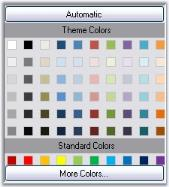
{:.image }

Custom Colors

We can also apply custom colors to the ColorPickerUIAdv control by setting Office2007Theme to "Managed" and specifying the custom color through the ApplyManagedColors method as follows.

[C#]

this.colorPickerUIAdv1.Office2007Theme = Syncfusion.Windows.Forms.Office2007Theme.Managed;

Office2007Colors.ApplyManagedColors(this, Color.Orange);

[VB.NET]

Me.colorPickerUIAdv1.Office2007Theme = Syncfusion.Windows.Forms.Office2007Theme.Managed;

Office2007Colors.ApplyManagedColors(Me, Color.Orange)

{:.image }

Runtime Selection

The ColorPickerUIAdv control at run time provides a Color dialog, using which we can select and add colors to the color groups.

{:.image }

Color Selection at run time

Automatic color that has to be selected, when Automatic button is clicked at run time, is set through AutomaticColor property. Default color is black.

[C#]

this.colorPickerUIAdv1.AutomaticColor = System.Drawing.Color.OrangeRed;

[VB.NET]

Me.colorPickerUIAdv1.AutomaticColor = System.Drawing.Color.OrangeRed

{:.image }

> 
{:.image }
 _Note: Height of this Automatic button can be specified in ColorPickerUIAdv.ButtonHeight property. Default value is 23._

###### Events

Picked Event

This event is raised every time a color is picked in the ColorPickerUIAdv control. The event handler receives an argument of type ColorPickedEventArgs. The event property provided by ColorPickedEventArgs argument is as follows.

_Table_ _205__: Member Table_

<table>
<tr>
<td>
 Member</td><td>
Description</td></tr>
<tr>
<td>
Color</td><td>
Specifies System.Drawing.Color structure.</td></tr>
</table>

[C#]

private void colorPickerUIAdv1_Picked(object sender, ColorPickerUIAdv.ColorPickedEventArgs args)

{

     BackColor = colorPickerUIAdv1.SelectedItem.Color;

}

[VB.NET]

Private Sub colorPickerUIAdv1_Picked(ByVal sender As Object, ByVal args As ColorPickerUIadv.ColorPickedEventArgs)

BackColor = colorPickerUIAdv1.SelectedItem.Color

 End Sub

Item Selection 

When mouse is hovered over a particular color item, ItemSelection event will be raised. The event handler receives an argument of type ColorPickedEventArgs. The event property provided by ColorPickedEventArgs argument is as follows.

_Table_ _206__: Member Table_

<table>
<tr>
<td>
Member</td><td>
Description</td></tr>
<tr>
<td>
Color</td><td>
Specifies System.Drawing.Color structure.</td></tr>
</table>

[C#]

private void colorPickerUIAdv1_ItemSelection(object sender, ColorPickerUIAdv.ColorPickedEventArgs args)

{

//Gets the name of the color item that is selected.     

Console.WriteLine("Color Name is " + e.Color.Name.ToString());  

}

[VB.NET]

Private Sub colorPickerUIAdv1_ItemSelection(ByVal sender As Object, ByVal args As ColorPickerUIadv.ColorPickedEventArgs)

  'Gets the name of the color item that is selected.  

  Console.WriteLine("Color Name is " + e.Color.Name.ToString())

End Sub

###### Frequently Asked Questions

This section illustrates the solutions for various task-based queries about the control.

How to add a ColorPickerUIAdv Control to a Popup Menu?

This is discussed in How to add a ColorUI Control to a Popup Menu? topic in ColorUIControl. Replace ColorUIControl with ColorPickerUIAdv control in that topic and you will be able to add a ColorPickerUIAdv control to a popup menu.

### ComboBox Controls

ComboBoxControls with multiple functionalities are listed below.

##### ComboDropDown

The ComboDropDown control is a lightweight, combo box-like control that can host any control in the dropdown area. This control can be used to create a combo box that shows, for example, a TreeView or a ListView with multiple columns or any other control that helps in displaying the data appropriately. The control is used to host any control where ComboBoxBase hosts only ListBox derived controls. This flexible combo box control provides a standard combo box look-and-feel with the ability to host any control in the dropdown.

Once a control is associated with the ComboDropDown to be displayed in the drop-down area, the developer is responsible for handling the data interaction between the combo's edit portion and the control in the drop-down. For example, if the ComboDropDown is used with a TreeView control in a dropdown, the developer has to provide the code to transfer the selected item from the TreeView control to the combo box and also from the combo box to the TreeView. You should also determine when the dropdown should close. In this case, the dropdown could close when the user double-clicks on a node.

{:.image }

###### Features

ComboDropDown control lets users easily associate any control derived class in the DropDown region and contains following features.

* Events are available to provide interaction between the control and the ComboDropDown.
* Arrow keys of ComboDropDown can also be cached.
* Themes and visual styles can be applied.

See Also 

Concepts and Features

###### Creating ComboDropDown

In this section, ComboDropDown is used to host TreeView control and this can be achieved in the following ways.

Through Designer

This section will guide you to create a ComboDropDown control through designer and associate a TreeView control as its popup.

The below steps will guide you with this.

95. Create a new Visual C# application or VB.NET application in Visual Studio .NET. 

{:.image }

96. Drag and drop a ComboDropDown control, TreeView control from the toolbox onto the form.

{:.image }

97. Add nodes to the TreeView control and set HideSelection property to false. The HideSelection property specifies whether the selected tree node remains highlighted even when the tree view has lost the focus.

{:.image }

98.  Now set the ComboDropDown's PopupControl property to be the above TreeView instance. 

{:.image }

> 
{:.image }
 _Note: We can also include code to set up the interaction between the combo and the treeview control. Refer_ Setting Interaction between ComboDropDown and TreeView.

See also 

Concepts and Features

Through Code

Drag and drop the TreeView control which will be used in the drop-down portion of ComboDropDown control. 

99. Include the required namespace.

[C#]

using Syncfusion.Windows.Forms.Tools;

[VB.NET]

Imports Syncfusion.Windows.Forms.Tools

100. Create an instance of the ComboDropDown control class.

[C#]

private Syncfusion.Windows.Forms.Tools.ComboDropDown comboDropDown1;

this.comboDropDown1=new Syncfusion.Windows.Forms.Tools.ComboDropDown();

[VB.NET]

Private comboDropDown1 As Syncfusion.Windows.Forms.Tools.ComboDropDown

Me.comboDropDown1 = New Syncfusion.Windows.Forms.Tools.ComboDropDown()

101. Add TreeView in the drop-down portion of ComboDropDown. Finally add ComboDropDown to the Form.

[C#]

this.comboDropDown1.PopupControl=this.treeView1;

this.Controls.Add(this.comboDropDown1);

[VB.NET]

Me.comboDropDown1.PopupControl=Me.treeView1

Me.Controls.Add(Me.comboDropDown1)

> 
{:.image }
 _Note:_ Refer Setting Interaction between ComboDropDown and TreeView _to set the interaction between the ComboDropDown and Treeview._

See also

Concepts and Features

###### Concepts and Features

The following topics will help you become more familiar in using the ComboDropDown control.

ComboDropDown Text

ComboDropDown control supports the properties which can change the appearance and behavior of the control's edit portion.

{:.image }

_Table_ _207__: Property Table_

<table>
<tr>
<td>
ComboDropDown Properties</td><td>
Description</td></tr>
<tr>
<td>
CharacterCasing</td><td>
Specifies the ComboDropDown control modifies the case of characters when they are typed in the edit portion.</td></tr>
<tr>
<td>
NumberOnly</td><td>
Specifies whether the user should be forced to enter only numbers in the edit portion of ComboDropDown.</td></tr>
<tr>
<td>
ReadOnly</td><td>
Specifies whether the text in the edit portion of ComboDropDown should be set to read-only or can be changed. By default it will be set to false.</td></tr>
</table>

[C#]

this.comboDropDown1.CharacterCasing = System.Windows.Forms.CharacterCasing.Upper;

this.comboDropDown1.NumberOnly = true;

this.comboDropDown1.ReadOnly = true;

this.comboDropDown1.CaseSensitiveAutocomplete = false;

this.comboDropDown1.MatchFirstCharacterOnly = false;

[VB.NET]

Me.comboDropDown1.CharacterCasing = System.Windows.Forms.CharacterCasing.Upper

Me.comboDropDown1.NumberOnly = True

Me.comboDropDown1.ReadOnly = True

Me.comboDropDown1.CaseSensitiveAutocomplete = False

Me.comboDropDown1.MatchFirstCharacterOnly = False

Banner Text Support

We can set banner text for the ComboBoxDropDown control. Refer BannerTextProvider Component topic for more details.

{:.image }

ComboDropDown Appearance

This section discusses the appearance settings for ComboDropDown control.

Border Styles

The below properties lets you set 3D border style for the control. 

_Table_ _208__: Property Table_

<table>
<tr>
<td>
Properties</td><td>
Description</td></tr>
<tr>
<td>
Border3DStyle</td><td>
Sets the 3D border style for the control. The options are,* {{ _RaisedOuter_ | markdownify }}* {{ _RaisedInner_ | markdownify }}* {{ _SunkenOuter_ | markdownify }}* {{ _SunkenInner_ | markdownify }}* {{ _Raised_ | markdownify }}* {{ _Sunken_ | markdownify }}* {{ _Etched_ | markdownify }}* {{ _Flat_ | markdownify }}* {{ _Adjust_  | markdownify }}* {{ _Bump_ | markdownify }} FlatStyle property should be set to Standard to effect this settings.</td></tr>
<tr>
<td>
BorderSides</td><td>
Specifies the sides of the control which should have border.</td></tr>
<tr>
<td>
FlatStyle</td><td>
Specifies the flat style to be applied to the ComboDropDown control. The styles are,Flat - The control and the button appear flat.System - Appearance based on the OS used andStandard - The control and button appears three-dimensional.</td></tr>
<tr>
<td>
FlatBorderColor</td><td>
Specifies the border color for the control, when FlatStyle is set to "Flat". </td></tr>
</table>

[C#]

this.comboDropDown1.Border3DStyle = System.Windows.Forms.Border3DStyle.RaisedInner;

this.comboDropDown1.BorderSides = System.Windows.Forms.Border3DSide.All;

[VB.NET]

Me.comboDropDown1.Border3DStyle = System.Windows.Forms.Border3DStyle.RaisedInner

Me.comboDropDown1.BorderSides = System.Windows.Forms.Border3DSide.All

{:.image }

> 
{:.image }
 _Note: ComboDropDown.Style property should be set to Default to effect the above settings. See_ Themes and Styles _topic._

Themes And Styles

The below given properties enhances the look and feel of the ComboDropDown.

_Table_ _209__: Property Table_

<table>
<tr>
<td>
ComboDropDown Properties</td><td>
Description</td></tr>
<tr>
<td>
IgnoreThemeBackground</td><td>
Specifies whether the control will ignore the theme's background color and draw the backcolor instead.</td></tr>
<tr>
<td>
Style</td><td>
Specifies advanced appearance and behavior of the ComboDropDown. The default value is 'Default'. The options are,{{ _Default,_ | markdownify }}{{ _OfficeXP,_ | markdownify }}{{ _Office2003,_ | markdownify }}{{ _VS2005 and_ | markdownify }}{{ _Office2007._ | markdownify }}</td></tr>
</table>

[C#]

this.comboDropDown1.IgnoreThemeBackground = true;

//To set Default Visual Style

this.comboDropDown1.Style = Syncfusion.Windows.Forms.VisualStyle.Default;

//To set Office2003 Visual Style

this.comboDropDown1.Style = Syncfusion.Windows.Forms.VisualStyle.Office2003;

//To set OfficeXP Visual Style

this.comboDropDown1.Style = Syncfusion.Windows.Forms.VisualStyle.OfficeXP;

//To set VS2005 Visual Style

this.comboDropDown1.Style = Syncfusion.Windows.Forms.VisualStyle.VS2005;

//To set Office2007 Visual Style

this.comboDropDown1.Style = Syncfusion.Windows.Forms.VisualStyle.Office2007;          

[VB]

Me.comboDropDown1.IgnoreThemeBackground = True

'To set Default Visual Style

Me.comboDropDown1.Style = Syncfusion.Windows.Forms.VisualStyle.Default

'To set Office2003 Visual Style

Me.comboDropDown1.Style = Syncfusion.Windows.Forms.VisualStyle.Office2003

'To set OfficeXP Visual Style

Me.comboDropDown1.Style = Syncfusion.Windows.Forms.VisualStyle.OfficeXP

'To set VS2005 Visual Style

Me.comboDropDown1.Style = Syncfusion.Windows.Forms.VisualStyle.VS2005

'To set Office2007 Visual Style

Me.comboDropDown1.Style = Syncfusion.Windows.Forms.VisualStyle.Office2007

{:.image }

Office Color Schemes

The ComboDropDown control supports blue, silver and black office colors scheme. It is set using Office2007ColorTheme property. Style property should be set to Office2007.

[C#]

//To set Blue Color scheme

this.comboDropDown1.Office2007ColorTheme = Syncfusion.Windows.Forms.Office2007Theme.Blue;

//To set Silver Color scheme

this.comboDropDown1.Office2007ColorTheme = Syncfusion.Windows.Forms.Office2007Theme.Silver;

//To set Black Color scheme

this.comboDropDown1.Office2007ColorTheme = Syncfusion.Windows.Forms.Office2007Theme.Black;                

[VB]

'To set Blue Color scheme

Me.comboDropDown1.Office2007ColorTheme = Syncfusion.Windows.Forms.Office2007Theme.Blue

'To set Silver Color scheme

Me.comboDropDown1.Office2007ColorTheme = Syncfusion.Windows.Forms.Office2007Theme.Silver

'To set Black Color scheme

Me.comboDropDown1.Office2007ColorTheme = Syncfusion.Windows.Forms.Office2007Theme.Black

{:.image }

Custom Colors

We can also apply custom colors to the ComboDropDown control by setting Office2007ColorTheme to "Managed" and specifying the custom color through the ApplyManagedColors method as follows.

[C#]

this.comboDropDown1.Office2007ColorTheme = Syncfusion.Windows.Forms.Office2007Theme.Managed;

Office2007Colors.ApplyManagedColors(this, Color.Orchid);

[VB.NET]

Me.comboDropDown1.Office2007ColorTheme = Syncfusion.Windows.Forms.Office2007Theme.Managed;

Office2007Colors.ApplyManagedColors(Me, Color.Orchid)

{:.image }

###### Event Handling

Events of ComboDropDown

ComboDropDown.DropDown:  It occurs before the dropdown portion is shown. This event can be handled to select the item in the control based on the text of ComboDropDown before its dropdown position is shown. The event handler receives an argument of type EventArgs.

Refer DropDown Event.

ComboDropDown.PopupContainer.Popup: It occurs after the popup has been dropped down and made visible. It can be handled to get focus on the drop down portion of ComboDropDown. The event handler receives an argument of type EventArgs. Refer Make the DropDown Respond to Mouse Move.

Events of ComboDropDown

ComboDropDown.DropDown:  It occurs before the dropdown portion is shown. This event can be handled to select the item in the control based on the text of ComboDropDown before its dropdown position is shown. The event handler receives an argument of type EventArgs.

Refer DropDown Event.

ComboDropDown.PopupContainer.Popup: It occurs after the popup has been dropped down and made visible. It can be handled to get focus on the drop down portion of ComboDropDown. The event handler receives an argument of type EventArgs. Refer Make the DropDown Respond to Mouse Move.

DropDown Event

Setting Interaction between ComboDrop-Down and TreeView

102. Create a handler for the ComboDrop-Down's Drop-Down event and the TreeView's DoubleClick event. In the DoubleClick event, set the combo's text based on the selected node as follows.

[C#]

private void treeView1_DoubleClick(object sender, System.EventArgs e)

{

if(this.treeView1.SelectedNode != null)

// Set the combodropdown's text to be the TreeNode's text.

this.comboDropDown1.Text = this.treeView1.SelectedNode.Text;

else

this.comboDropDown1.Text = String.Empty;

// Close the combodropdown.

this.comboDropDown1.PopupContainer.HidePopup(PopupCloseType.Done);

}

[VB.NET]

Private Sub treeView1_DoubleClick(sender As Object, e As System.EventArgs) Handles treeView1.DoubleClick

If Not (Me.treeView1.SelectedNode Is Nothing) Then

' Set the combodropdown's text to be the TreeNode's text.

Me.comboDropDown1.Text = Me.treeView1.SelectedNode.Text

Else

Me.comboDropDown1.Text = String.Empty

End If

' Close the combodropdown.

Me.comboDropDown1.PopupContainer.HidePopup(PopupCloseType.Done)

End Sub 

103. Simply traverses the tree structure recursively to find the matching node using the FindNode method discussed below.

[C#]

private TreeNode FindNode(TreeNodeCollection nodes, string text)

{

foreach(TreeNode child in nodes)

if(child.Text == text)

return child;

foreach(TreeNode child in nodes)

{

TreeNode matched = this.FindNode(child.Nodes, text);

if(matched != null)

return matched;

       }

return null;

}

[VB.NET]

Private Function FindNode(ByVal nodes As TreeNodeCollection, ByVal text As String) As TreeNode

    For Each child As TreeNode In nodes

        If child.Text = text Then

            Return child

        End If

    Next child

    For Each child As TreeNode In nodes

        Dim matched As TreeNode = Me.FindNode(child.Nodes, text)

        If Not matched Is Nothing Then

            Return matched

        End If

    Next child

    Return Nothing

End Function

104. In the drop-down event, find the node whose text matches the text in the combo and make that the selected node, using the following code.

[C#]

private void comboDropDown1_DropDown(object sender, System.EventArgs e)

{

// Before the drop-down is shown, select a TreeNode based on the text in the combo.

if(this.comboDropDown1.Text != String.Empty)

{

TreeNode matchedNode = this.FindNode(this.treeView1.Nodes, this.comboDropDown1.Text);

this.treeView1.SelectedNode = matchedNode;

}

}

[VB.NET]

Private Sub comboDropDown1_DropDown(ByVal sender As Object, ByVal e As System.EventArgs) Handles comboDropDown1.DropDown

' Before the drop-down is shown, select a TreeNode based on the text in the combo.

If Me.comboDropDown1.Text &lt;&gt; String.Empty Then

Dim matchedNode As TreeNode = Me.FindNode(Me.treeView1.Nodes, Me.comboDropDown1.Text)

Me.treeView1.SelectedNode = matchedNode

End If

End Sub 

105. At run time, when the user double on a node, the node text will appears in the ComboDropDown. 
106. Also when the user edits the text, the corresponding node will be selected in the tree in the drop down. 

{:.image }

> 
{:.image }
 _Note: We can also suppress the dropdown event from firing by setting SuppressDropDownEvent property to true._

We can also associate a GridList control with the ComboDropDown and make it interactive. A sample which demonstrates this feature is available in the below sample installation location.

…\_My Documents\Syncfusion\EssentialStudio\Version Number\Windows\Tools.Windows\Samples\Advanced Editor Functions\ActionGroupingDemo_

Popup Event

Make the Drop-Down Respond to Mouse Move

By default, the drop-down control will not have the focus on drop-down, so the control will not respond to mouse move messages, if configured to do so. To work around this, you can force the control hosted in the drop-down to take focus on drop-down.

Drag the ComboDropDown and TreeView control onto the Form. Then add TreeView with nodes to the drop-down portion of ComboDropDown.

Listen to the ComboDrop-Down's PopupContainer's Popup event. This event will be fired after the drop-down is shown. In this event, call the drop-down control's Focus method.

[C#]

this.comboDropDown1.PopupContainer.Popup += new EventHandler(this.AfterDropDownPopup);

private void AfterDropDownPopup(object sender, EventArgs e)

{

// Tree takes focus on dropdown.

this.treeView1.Focus();

}

[VB.NET]

Private Me.comboDropDown1.PopupContainer.Popup += New EventHandler(Me.AfterDropDownPopup)

Private Sub AfterDropDownPopup(ByVal sender As Object, ByVal e As EventArgs)

    ' Tree takes focus on dropdown.

    Me.treeView1.Focus()

End Sub

{:.image }

###### Frequently Asked Questions

This section illustrates the solutions for various task-based queries about the control.

Using ComboBoxes inside ComboDropDown

This section deals on how to use two comboboxes within the dropdown area of a ComboDropDown. The panel contains two ComboBoxes and a Button. The text will change only after the Button had pressed. 

The steps are as follows.

107. Create the ComboBoxes and OK button. 
108. Populate the ComboBoxes. 
109. Add these controls to the Panel. 
110. Set the PopupControl property of the ComboDropDown to the same Panel.
111. To avoid closing the ComboDropDown after selecting the item in ComboBox, handle the SelectedIndexChanged event of both ComboBoxes and keep the DropDown showing.

[C#]

//Indicates whether the combo box is displaying its drop-down portion. 

private void comboBox1_SelectedIndexChanged(object sender,EventArgs e)

{

comboDropDown1.DroppedDown=true;

}

private void comboBox2_SelectedIndexChanged(object sender,EventArgs e)

{

comboDropDown1.DroppedDown=true;

}

[VB.NET]

'Indicates whether the combo box is displaying its drop-down portion. 

Private  Sub comboBox1_SelectedIndexChanged(ByVal sender As Object, ByVal e As EventArgs)

comboDropDown1.DroppedDown=True

End Sub

Private  Sub comboBox2_SelectedIndexChanged(ByVal sender As Object, ByVal e As EventArgs)

comboDropDown1.DroppedDown=True

End Sub

112. In the button click event of the Button inside the panel, insert these codes to close DropDown and to change text of ComboDropDown.

[C#]

// Closes the dropdown and changes the text.

private void button1_Click(object sender,EventArgs e) 

{

comboDropDown.Text=comboBox1.Text+ “ “ + comboBox2.Text;

comboDropDown1.DroppedDown=false;

} 

[VB.NET]

' Closes the dropdown and changes the text.

Private  Sub button1_Click(ByVal sender As Object, ByVal e As EventArgs)

comboDropDown.Text=comboBox1.Text+ " works in" + comboBox2.Text

comboDropDown1.DroppedDown=False

End Sub

{:.image }

How to remove the current selection in ComboDropDown control?

We can derive custom ComboDropDown control and override DrawListModeEditPortion property to remove the selection as follows.

[C#]

public class CustomComboDropDown : ComboDropDown

{

    public CustomComboDropDown()

    {

    }

    protected override void DrawListModeEditPortion(PaintEventArgs e, Color highlightBG, Color highlightText, bool drawFocusRect)

    {

        // Set the highlightBG to Color.Transparent to draw transparent selection.

        // Set drawFocusRect to false to hide the focus rectangle.

        base.DrawListModeEditPortion(e, Color.Transparent, highlightText, false);

    }

}

[VB.NET]

Public Class CustomComboDropDown : Inherits ComboDropDown

    Public Sub New()

    End Sub

    Protected Overrides Sub DrawListModeEditPortion(ByVal e As PaintEventArgs, ByVal highlightBG As Color, ByVal highlightText As Color, ByVal drawFocusRect As Boolean)

        ' Set the highlightBG to Color.Transparent to draw transparent selection.

        ' Set drawFocusRect to false to hide the focus rectangle.

        MyBase.DrawListModeEditPortion(e, Color.Transparent, highlightText, False)

    End Sub

End Class

##### ComboBoxAdv

ComboBoxAdv is an advanced combo box control that provides a similar object model as the framework of the ComboBox control, with a lot of additional features. ComboBoxAdv is inherited from ComboBoxBaseDataBound, derived from [ComboBoxBase](http://help.syncfusion.com/ug/windows%20forms/documents/howtochangethebackco6.htm) control.

Based on the ComboBoxBase control, the ComboBoxAdv pre-binds a list box in its drop-down area and includes some additional API to provide a framework combo box-like object model and data binding support. Written from scratch, this control exposes the text box and the list box controls used internally to let you customize the different parts of the control.

{:.image }

Key Features

ComboBoxAdv is an advanced ComboBox control that contains the following features.

* You can set 3D [border styles](http://help.syncfusion.com/ug/windows%20forms/documents/borderstyles5.htm) and flat styles for ComboBoxAdv control.
* You can set [images](http://help.syncfusion.com/ug/windows%20forms/documents/imagesettings2.htm) for ComboBoxAdv control items.
* [AutoComplete](http://help.syncfusion.com/ug/windows%20forms/documents/autocompletesupport1.htm) functionality can be provided.
* You can bind the ComboBoxAdv to any external datasource. See [DataBinding.](http://help.syncfusion.com/ug/windows%20forms/documents/databinding8.htm)
* You can set visual styles to enrich your application.
###### Getting Started

This section briefly describes how to design a ComboBoxAdv Control in a WindowsForms Application.

* Adding a ComboBoxAdv Control 
* Configuring the ComboBoxAdv Control

Adding a ComboBoxAdv control

* Create a new Windows Forms Application Project in VS IDE through New Project Wizard.
* Drag and drop the ComboBoxAdv control in the Form from Toolbox.

{:.image }

Configuring the ComboBoxAdv control

The most commonly used settings of the TreeNavigator control can be configured either through Designer using the Smart tag or through the Properties window or through code.

{:.image }

To add ComboBoxAdv Control to a Windows Forms Application through code behind, follow the given steps.

113. Include the namespaces “Syncfusion.Windows.Forms” and “Syncfusion.Windows.Forms.Tools”.

 [C#]

//Namespaces.

using Syncfusion.Windows.Forms.Tools;

using Syncfusion.Windows.Forms;

[VB]

‘Namespaces.

Imports Syncfusion.Windows.Forms

Imports Syncfusion.Windows.Forms.Tools

114. Create an instance of the TreeNavigator control and add it to the Form.

//Creates ComboBoxAdv instance.

private Syncfusion.Windows.Forms.Tools.ComboBoxAdv comboBoxAdv1;

this.comboBoxAdv1 = new ComboBoxAdv();

 [VB]

'Creates ComboBoxAdv instance.

 Private comboBoxAdv1 As Syncfusion.Windows.Forms.Tools.ComboBoxAdv

 Me.comboBoxAdv1 = New ComboBoxAdv()

115. Items can be added to ComboBoxAdv through String Collection Editor as it was done in Windows ComboBox control.

 //Adding items to ComboBoxAdv

 this.comboBoxAdv1.Items.Add(100);

 this.comboBoxAdv1.Items.Add(200);

 this.comboBoxAdv1.Items.Add(300);

'Adding items to ComboBoxAdv

 Me.comboBoxAdv1.Items.Add(100)

 Me.comboBoxAdv1.Items.Add(200)

 Me.comboBoxAdv1.Items.Add(300)

116.  Finally add ComboBoxAdv to the form.

//Adding ComboBoxAdv to form

this.Controls.Add(this.comboBoxAdv1);

'Adding ComboBoxAdv to form

 Me.Controls.Add(Me.comboBoxAdv1)

{:.image }

###### Concepts and features

ComboBoxAdv

ComboBoxAdv control has a textbox, that is the edit portion of the control, and a dropdown.

TextBox

ComboBoxAdv control has properties that change the appearance and behavior of the textbox or the edit portion of the control.

Text Appearance

The following properties customize the text in the ComboBoxAdv control.

_Table_ _210__: Properties_

<table>
<tr>
<td>
ComboBoxAdv TextBox Properties</td><td>
Description</td></tr>
<tr>
<td>
Text</td><td>
Sets text for the textbox. The text can be set to null to clear the text in the textbox.</td></tr>
<tr>
<td>
TextAlign</td><td>
Sets the alignment of the text in the textbox.</td></tr>
<tr>
<td>
ForeColor</td><td>
Sets the fore color for the text entered in the edit portion of the control.</td></tr>
</table>

[C#]

  //TextBox appearance properties. 

  this.comboBoxAdv1.TextBox.Text = "Simple text in ComboBoxAdv";

  this.comboBoxAdv1.TextBox.TextAlign = HorizontalAlignment.Center;

  this.comboBoxAdv1.TextBox.ForeColor = Color.Red;

[VB.NET]

'TextBox appearance properties.   

 Me.comboBoxAdv1.TextBox.Text = "Simple text in ComboBoxAdv"

 Me.comboBoxAdv1.TextBox.TextAlign = HorizontalAlignment.Center

 Me.comboBoxAdv1.TextBox.ForeColor = Color.Red

Text selection

The selection of text during runtime can be controlled through the following properties.

_Table_ _211__: Properties_

<table>
<tr>
<td>
ComboBoxAdv TextBox Properties</td><td>
Description</td></tr>
<tr>
<td>
SelectedText</td><td>
Sets the currently selected text at runtime.</td></tr>
<tr>
<td>
SelectionLength</td><td>
Sets the number of characters selected in textbox.</td></tr>
<tr>
<td>
SelectionStart</td><td>
Sets the starting point of the text selection.</td></tr>
</table>

[C#]

 //Text selection properties

 this.comboBoxAdv1.TextBox.SelectedText = "Combo";

 this.comboBoxAdv1.TextBox.SelectionLength = 5;

 this.comboBoxAdv1.TextBox.SelectionStart = 2;

[VB.NET]

'Text selection properties

 Me.comboBoxAdv1.TextBox.SelectedText = "Combo"

 Me.comboBoxAdv1.TextBox.SelectionLength = 5

 Me.comboBoxAdv1.TextBox.SelectionStart = 2

ReadOnly Settings

The following properties deal with read-only settings for the ComboBoxAdv control. 

_Table_ _212__: Properties_

<table>
<tr>
<td>
ComboBoxAdv TextBox Properties</td><td>
Description</td></tr>
<tr>
<td>
ReadOnly</td><td>
Specifies whether the control can be made read-only. By default it is set to false.</td></tr>
<tr>
<td>
DropDownStyle</td><td>
Specifies the dropdown style of the ComboBoxAdv control. Based on its options, it specifies whether the text in the control is editable or not. The styles are,Simple - The text portion is editable. The list portion is always visible.DropDown (default style) - The text portion is editable. Clicking the arrow button displays the list portion.DropDownList - The text portion is not editable. Clicking the arrow button displays the list portion.</td></tr>
</table>

[C#]

//Read only settings

this.comboBoxAdv1.ReadOnly = true;

this.comboBoxAdv1.DropDownStyle = System.Windows.Forms.ComboBoxStyle.Simple;

[VB.NET]

'Read only settings

Me.comboBoxAdv1.ReadOnly = True

Me.comboBoxAdv1.DropDownStyle = System.Windows.Forms.ComboBoxStyle.Simple

Behavior Settings

The following properties control the behavior of the text typed in the Textbox. 

_Table_ _213__: Properties_

<table>
<tr>
<td>
ComboBoxAdv Properties</td><td>
Description</td></tr>
<tr>
<td>
NumberOnly</td><td>
Specifies whether you can enter only numbers in the edit portion of the ComboBoxAdv.</td></tr>
<tr>
<td>
CharacterCasing</td><td>
Specifies the case of the characters that are entered in the textbox. The options are, Normal - Characters are left unchanged,UpperCase - Changes the case of the characters to UPPERCASE andLowerCase  - Changes the case of the characters to LOWERCASE.</td></tr>
<tr>
<td>
TextBox.HideSelection</td><td>
When it is set to false, it highlights the selected text in the edit portion, even if the control losses focus.</td></tr>
<tr>
<td>
TextBox.WordWrap</td><td>
Indicates whether the textbox automatically wraps words to the beginning of the next line. Note that the multiline property should be set to true, to make the word wrap feature effective.</td></tr>
<tr>
<td>
AllowNewText</td><td>
Indicates whether you are allowed to enter new text at run time.</td></tr>
<tr>
<td>
MaxLength</td><td>
Specifies the maximum number of characters allowed in the edit portion of the ComboBoxAdv control. Default (32767).</td></tr>
</table>

[C#]

//TextBox behavior settings

this.comboBoxAdv1.NumberOnly = true;

this.comboBoxAdv1.CharacterCasing = CharacterCasing.Upper;

this.comboBoxAdv1.TextBox.HideSelection = false;

this.comboBoxAdv1.TextBox.WordWrap = true;

this.comboBoxAdv1.AllowNewText = true;

this.comboBoxAdv1.MaxLength = 32766;

[VB.NET]

'TextBox behavior settings

            Me.comboBoxAdv1.NumberOnly = True

Me.comboBoxAdv1.CharacterCasing = CharacterCasing.Upper

Me.comboBoxAdv1.TextBox.HideSelection = False

Me.comboBoxAdv1.TextBox.WordWrap = True

Me.comboBoxAdv1.AllowNewText = True

Me.comboBoxAdv1.MaxLength = 32766

Banner Text Support

You can set banner text for the ComboBoxAdv control. Refer to [BannerTextProvider Component](http://help.syncfusion.com/ug/windows%20forms/documents/bannertextsupport.htm) topic for more details.

{:.image }

DropDown Settings

Dropdown for the ComboBoxAdv control can be customized using the folllowing properties.

_Table_ _214__: Properties_

<table>
<tr>
<td>
ComboBoxAdv Properties</td><td>
Description</td></tr>
<tr>
<td>
DropDownWidth</td><td>
Specifies the width of the dropdown. Default value is 100.</td></tr>
<tr>
<td>
IntegralHeight</td><td>
Indicates whether the list portion has complete items only, that is when this property is set to true, it displays only those items that are fully visible in terms of height.</td></tr>
<tr>
<td>
MaxDropDownItems</td><td>
Maximum number of entries that can be displayed in the dropdown. Set image for the dropdown items. Refer Image Settings topic.</td></tr>
<tr>
<td>
Sorted</td><td>
When set to true, it sorts the dropdown items in the alphabetical order.</td></tr>
</table>

[C#]

//DropDown settings

this.comboBoxAdv1.DropDownWidth = 200;

this.comboBoxAdv1.IntegralHeight = true;

this.comboBoxAdv1.MaxDropDownItems = 5;

this.comboBoxAdv1.Sorted = true;

[VB.NET]

'DropDown settings

 Me.comboBoxAdv1.DropDownWidth = 200

 Me.comboBoxAdv1.IntegralHeight = True

 Me.comboBoxAdv1.MaxDropDownItems = 5

 Me.comboBoxAdv1.Sorted = True

{:.image }

> 
{:.image }
 _Note: Data for the dropdown can be set using Items property. Refer_[Data Settings](http://help.syncfusion.com/ug/windows%20forms/documents/datasettings1.htm) _for details. To know about different dropdown styles available for the control, see ReadOnly Settings section in_ [TextBox](http://help.syncfusion.com/ug/windows%20forms/documents/textbox2.htm)_topic._

See Also 

[TextBox](http://help.syncfusion.com/ug/windows%20forms/documents/textbox2.htm), [Image Settings](http://help.syncfusion.com/ug/windows%20forms/documents/imagesettings2.htm)

Data Settings

Data for the ComboBoxAdv is added through String Collection Editor, invoked through the ComboBoxAdv.Items property.

{:.image }

[C#]

//Adding data to ComboBoxAdv

 this.comboBoxAdv1.Items.AddRange(new object[] { "Currency", "DateTimePicker", "ComboBoxAdv", "AutoComplete", "ListBox", "ContextMenu", "CurrencyEdit" });

[VB.NET]

'Adding data to ComboBoxAdv

 Me.comboBoxAdv1.Items.AddRange(New Object() {"Currency", "DateTimePicker", "ComboBoxAdv", "AutoComplete", "ListBox", "ContextMenu", _

"CurrencyEdit"})

{:.image }

> 
{:.image }
 _Note: ComboBoxAdv can also be bound to an external Data source like Data Table. Refer_ [Databinding](http://help.syncfusion.com/ug/windows%20forms/documents/databinding8.htm) _topic. To set image for dropdown items refer_ [Image settings](http://help.syncfusion.com/ug/windows%20forms/documents/imagesettings2.htm)_._

Advanced Features

This section will discuss the auto complete support available for the ComboBoxAdv control and databinding using external source.

AutoComplete Support

ComboBoxAdv has in-built support of auto-completion of the text entered in the control. This feature is automatically enabled for the control. To disable, set ComboBoxAdv.AutoComplete property to false. 

_Table_ _215__: Properties_

<table>
<tr>
<td>
ComboBoxAdv Properties</td><td>
Description</td></tr>
<tr>
<td>
CaseSensitiveAutoComplete</td><td>
Specifies whether search in the AutoComplete is case sensitive.</td></tr>
<tr>
<td>
MatchFirstCharacterOnly</td><td>
It specifies the AutoComplete behavior in the dropdown mode. When set to true, it matches the first character in the drop list and returns the matching result.</td></tr>
</table>

[C#]

//ComboBoxAdv AutoComplete properties

this.comboBoxAdv1.AutoComplete = true;

this.comboBoxAdv1.CaseSensitiveAutocomplete = true;

this.comboBoxAdv1.MatchFirstCharacterOnly = true;

[VB.NET]

'ComboBoxAdv AutoComplete properties

 Me.comboBoxAdv1.AutoComplete = True

 Me.comboBoxAdv1.CaseSensitiveAutocomplete = True

 Me.comboBoxAdv1.MatchFirstCharacterOnly = True

{:.image }

Data Binding

ComboBoxAdv control can be bound with an external data source. Objects that can act as Datasource to ComboBoxAdv are:

* ArrayList
* DataView
* DataTable

You can add objects to the ComboBoxAdv by using the Items method. You can also add objects to a ComboBoxAdv using the DataSource, DisplayMember and Valuemember properties to fill the ComboBox.

When the DataSource property is set, you cannot modify the items collection. If setting the DataSource property causes the data source to change, the Datasource event is raised. If setting this property causes the data member to change, theDisplayMember event is raised.

When you set DataSource to a null reference, DisplayMember is set to an empty string ("").

ComboBoxAdv can be bound to DataView using the following code example.

[C#]

           DataTable dt = new DataTable("Table1");

            // Adding Columns.

            dt.Columns.Add("FirstName");

            dt.Columns.Add("LastName");

            dt.Columns.Add("occupation");

            dt.Columns.Add("place");

            // Create a Data Set.

            DataSet ds = new DataSet();

            ds.Tables.Add(dt);

            dt.Rows.Add(new string[] { "John", "Tina", "Doctor", "Italy" });

            dt.Rows.Add(new string[] { "Mary", "anu", "Teacher", "America" });

            dt.Rows.Add(new string[] { "asha", "roy", "Staff", "London" });

            dt.Rows.Add(new string[] { "George", "Gaskin", "Nurse", "germany" });

            dt.Rows.Add(new string[] { "sam", "jens", "Engineer", "Russia" });

            dt.Rows.Add(new string[] { "Ben", "Geo", "Developer", "India" });

            // Create a DataView.

            DataView view = new DataView(dt);

            // Set DataSource.

            this.comboBoxAdv1.DataSource = view;

            // Set DisplayMember.

            this.comboBoxAdv1.DisplayMember = "place";

[VB.NET]

            Dim dt As DataTable = New DataTable("Table1")

            ' Adding Columns.

            dt.Columns.Add("FirstName")

            dt.Columns.Add("LastName")

            dt.Columns.Add("occupation")

            dt.Columns.Add("place")

            ' Create a Data Set.

            Dim ds As DataSet = New DataSet

            ds.Tables.Add(dt)

            dt.Rows.Add(New String() {"John", "Tina", "Doctor", "Italy"})

            dt.Rows.Add(New String() {"Mary", "anu", "Teacher", "America"})

            dt.Rows.Add(New String() {"asha", "roy", "Staff", "London"})

            dt.Rows.Add(New String() {"George", "Gaskin", "Nurse", "germany"})

            dt.Rows.Add(New String() {"sam", "jens", "Engineer", "Russia"})

            dt.Rows.Add(New String() {"Ben", "Geo", "Developer", "India"})

            ' Create a DataView.

            Dim view As DataView = New DataView(dt)

            ' Set DataSource. 

            Me.comboBoxAdv1.DataSource = view

            ' Set DisplayMember.

            Me.comboBoxAdv1.DisplayMember = "place"

{:.image }

ComboBoxAdv appearance

This section discusses the below topics. 

Border Styles

This section discusses the border settings for the ComboBoxAdv control. 

_Table_ _216__: Properties_

<table>
<tr>
<td>
ComboBoxAdv Properties</td><td>
Description</td></tr>
<tr>
<td>
Border3DStyle</td><td>
Specifies the 3D BorderStyle for the control.The options are, * RaisedInner,* RaisedOuter,* Raised,* Sunken, (Default)* SunkenInner,* SunkenOuter,* Flat,* Bump and* Adjust.  FlatStyle should be set to "Standard" to make this property setting effective.</td></tr>
<tr>
<td>
BorderSides</td><td>
Specifies the BorderSides of the control.The options are, * Left,* Top,* Right,* Bottom,* Middle and* All. (Default)</td></tr>
<tr>
<td>
 FlatStyle</td><td>
Specifies the Flat Style. The options are* {{ _Flat,_ | markdownify }}* {{ _Standard (Default) and_ | markdownify }}* {{ _System._ | markdownify }}</td></tr>
<tr>
<td>
 FlatBorderColor</td><td>
Specifies the color with which flat border should be drawn. FlatStyle must be set to 'Flat' to get the color effect.</td></tr>
</table>

[C#]

 //Border appearance ssettings

this.comboBoxAdv1.Border3DStyle = System.Windows.Forms.Border3DStyle.Flat;

this.comboBoxAdv1.BorderSides = System.Windows.Forms.Border3DSide.All;

this.comboBoxAdv1.FlatStyle = Syncfusion.Windows.Forms.Tools.ComboFlatStyle.Flat;

this.comboBoxAdv1.FlatBorderColor = System.Drawing.Color.Blue;

[VB.NET]

 'Border appearance settings

  Me.comboBoxAdv1.Border3DStyle = System.Windows.Forms.Border3DStyle.Flat

  Me.comboBoxAdv1.BorderSides = System.Windows.Forms.Border3DSide.All

  Me.comboBoxAdv1.FlatStyle = Syncfusion.Windows.Forms.Tools.ComboFlatStyle.Flat

  Me.comboBoxAdv1.FlatBorderColor = System.Drawing.Color.Blue

{:.image }

Visual Styles

ComboBoxAdv supports visual styles such as Default, OfficeXP, Office2003, Office2007, Office2007Outlook, Office2010, VS2005 , VS2007 and Metro with all three color schemes. The style can be set using Style property.

[C#]

            //To set Default Visual Style

            this.comboBoxAdv1.Style = Syncfusion.Windows.Forms.VisualStyle.Default;

            //To set Office2003 Visual Style

            this.comboBoxAdv1.Style = Syncfusion.Windows.Forms.VisualStyle.Office2003;

            //To set OfficeXP Visual Style

            this.comboBoxAdv1.Style = Syncfusion.Windows.Forms.VisualStyle.OfficeXP;

            //To set VS2005 Visual Style

            this.comboBoxAdv1.Style = Syncfusion.Windows.Forms.VisualStyle.VS2005;

            //To set VS2010 Visual Style

            this.comboBoxAdv1.Style = Syncfusion.Windows.Forms.VisualStyle.VS2010;

            //To set Office2007 Visual Style

            this.comboBoxAdv1.Style = Syncfusion.Windows.Forms.VisualStyle.Office2007;

            //To set Office2007Outlook Visual Style

            this.comboBoxAdv1.Style = Syncfusion.Windows.Forms.VisualStyle.Office2007Outlook;

            //To set Office2010 Visual Style

            this.comboBoxAdv1.Style = Syncfusion.Windows.Forms.VisualStyle.Office2010;

            //To set Metro Visual Style

            this.comboBoxAdv1.Style = Syncfusion.Windows.Forms.VisualStyle.Metro;

[VB]

            'To set Default Visual Style

            Me.comboBoxAdv1.Style = Syncfusion.Windows.Forms.VisualStyle.[Default]

            'To set Office2003 Visual Style

            Me.comboBoxAdv1.Style = Syncfusion.Windows.Forms.VisualStyle.Office2003

            'To set OfficeXP Visual Style

            Me.comboBoxAdv1.Style = Syncfusion.Windows.Forms.VisualStyle.OfficeXP

            'To set VS2005 Visual Style

            Me.comboBoxAdv1.Style = Syncfusion.Windows.Forms.VisualStyle.VS2005

            'To set VS2010 Visual Style

            Me.comboBoxAdv1.Style = Syncfusion.Windows.Forms.VisualStyle.VS2010

            'To set Office2007 Visual Style

            Me.comboBoxAdv1.Style = Syncfusion.Windows.Forms.VisualStyle.Office2007

            'To set Office2007Outlook Visual Style

            Me.comboBoxAdv1.Style = Syncfusion.Windows.Forms.VisualStyle.Office2007Outlook

            'To set Office2010 Visual Style

            Me.comboBoxAdv1.Style = Syncfusion.Windows.Forms.VisualStyle.Office2010

            'To set Metro Visual Style

            Me.comboBoxAdv1.Style = Syncfusion.Windows.Forms.VisualStyle.Metro

{:.image }

[C#]

//To set Blue Color scheme

this.comboBoxAdv3.Office2007ColorTheme = Syncfusion.Windows.Forms.Office2007Theme.Silver;

 //To set Silver Color scheme

 this.comboBoxAdv6.Office2007ColorTheme = Syncfusion.Windows.Forms.Office2007Theme.Silver;

 //To set Black Color scheme

  this.comboBoxAdv9.Office2007ColorTheme = Syncfusion.Windows.Forms.Office2007Theme.Black;

[VB]

'To set Blue Color scheme

Me.comboBoxAdv1.Office2007ColorTheme = Syncfusion.Windows.Forms.Office2007Theme.Blue

'To set Silver Color scheme

Me.comboBoxAdv1.Office2007ColorTheme = Syncfusion.Windows.Forms.Office2007Theme.Silver

'To set Black Color scheme

Me.comboBoxAdv1.Office2007ColorTheme = Syncfusion.Windows.Forms.Office2007Theme.Black

{:.image }

Custom Colors

You can also apply custom colors to the ComboBoxAdv control by setting Office2007ColorTheme to "Managed" and specifying the custom color through the ApplyManagedColors method as follows.

[C#]

this.comboBoxAdv1.Office2007ColorTheme = Syncfusion.Windows.Forms.Office2007Theme.Managed;

Office2007Colors.ApplyManagedColors(this, Color.Orchid);

[VB.NET]

Me.comboBoxAdv1.Office2007ColorTheme = Syncfusion.Windows.Forms.Office2007Theme.Managed

 Office2007Colors.ApplyManagedColors(Me, Color.Orchid)

{:.image }

Background Settings

When ComboBoxAdv control is set with some style, theme background is drawn. You can override this background with the BackColor property using the IgnoreThemeBackground property. When IgnoreThemeBackground is set to true, the control ignores the theme background and draws the backcolor as the background.

[C#]

 //Background settings

 this.comboBoxAdv1.BackColor = System.Drawing.SystemColors.Info;

 this.comboBoxAdv1.IgnoreThemeBackground = true;

[VB.NET]

 'Background settings

 Me.comboBoxAdv1.BackColor = System.Drawing.SystemColors.Info

 Me.comboBoxAdv1.IgnoreThemeBackground = True

{:.image }

Image Settings

Images can be easily associated with the items of the ComboBoxAdv control using the following properties. 

_Table_ _217__: Properties_

<table>
<tr>
<td>
ComboBoxAdv Properties</td><td>
Description</td></tr>
<tr>
<td>
ImageList</td><td>
Specifies the imagelist that is used for the ComboBoxAdv control.</td></tr>
<tr>
<td>
ShowImageInTextBox</td><td>
It sets the selected image in the textbox of the ComboBoxAdv control.</td></tr>
<tr>
<td>
ItemsImageIndexes</td><td>
Invokes an editor and lets you to set image index for individual dropdown items.</td></tr>
</table>

[C#]

//ImageList for the ComboBoxAdv

 this.comboBoxAdv1.ImageList = this.imageList1;

 this.comboBoxAdv1.ItemsImageIndexes.Add(new Syncfusion.Windows.Forms.Tools.ComboBoxAdv.ImageIndexItem(this.comboBoxAdv1, "Pointer", 0));

[VB.NET]

'ImageList for the ComboBoxAdv

 Me.comboBoxAdv1.ImageList = Me.imageList1

  Me.comboBoxAdv1.ItemsImageIndexes.Add(New Syncfusion.Windows.Forms.Tools.ComboBoxAdv.ImageIndexItem(Me.comboBoxAdv1, "Pointer", 0))

Image in TextBox

The following code example is used to show the images together with the selected text in the TextArea of the ComboBoxAdv control.

[C#]

// Show the images in the TextArea.

 this.comboBoxAdv1.ShowImageInTextBox = true

[VB.NET]

'Show the images in the TextArea.

Me.comboBoxAdv1.ShowImageInTextBox = True

{:.image }

Customizable ComboBoxAdv height

ComboBoxAdv allows you to customize the height of the Display area, making more space to display larger images and text items by setting the TextBoxHeight property of the ComboBox.

[C#]

// Sets the height of the ComboBox.

this.comboBoxAdv1.TextBoxHeight = 80;

[VB.NET]

'Sets the height of the ComboBox.

Me.comboBoxAdv1.TextBoxHeight = 80

######  Event handling

Selection Events

The events present in the ComboxBox can be applied for ComboxBoxAdv control. 

_Table_ _218__: Properties_

<table>
<tr>
<td>
ComboBoxAdv Events</td><td>
Description</td></tr>
<tr>
<td>
SelectedIndexChanged</td><td>
Handled when SelectedIndex property is changed.</td></tr>
<tr>
<td>
SelectedIndexChanging</td><td>
Handled when SelectedIndex property is changing.</td></tr>
<tr>
<td>
SelectedValueChanged</td><td>
Handled when SelectedValue property is changed.</td></tr>
<tr>
<td>
SelectionChangeCommitted</td><td>
Handled when the user selects a new text for the combo.</td></tr>
<tr>
<td>
DropDown Event</td><td>
Handled before the dropdown is shown.</td></tr>
</table>

The ComboBoxAdv handles different events for the different user interaction scenarios. The occurrence and order of the events are tabulated as follows. 

_Table_ _219__: Events Table_

<table>
<tr>
<td>
Scenarios</td><td>
SelectionChangedCommitted Event</td><td>
SelectedValueChanged</td><td>
SelectedIndexChanged</td><td>
Validating/Validated</td></tr>
<tr>
<td>
TextArea-Change Selection by Keys</td><td>
Yes:1</td><td>
Yes:2</td><td>
Yes:3</td><td>
No</td></tr>
<tr>
<td>
TextArea-On AutoComplete</td><td>
No</td><td>
No</td><td>
No</td><td>
No</td></tr>
<tr>
<td>
Drop-Down List-Change Selection by Keys</td><td>
No</td><td>
Yes:1</td><td>
Yes:2</td><td>
No</td></tr>
<tr>
<td>
Drop-Down List-Change Selection by Mouse Move</td><td>
No</td><td>
No</td><td>
No</td><td>
No</td></tr>
<tr>
<td>
Drop-Down Close by Enter Key</td><td>
Yes:1</td><td>
No</td><td>
No</td><td>
No</td></tr>
<tr>
<td>
Drop-Down Close by Escape Key</td><td>
No</td><td>
No</td><td>
No</td><td>
No</td></tr>
<tr>
<td>
Drop-Down Close by Click</td><td>
Yes:1</td><td>
Yes:2</td><td>
Yes:3</td><td>
No</td></tr>
<tr>
<td>
Losing Focus</td><td>
Yes:2 (in DropDownStyle.DropDown (editable) mode only)</td><td>
No</td><td>
No</td><td>
Yes:1</td></tr>
<tr>
<td>
Changing Text Property in Code</td><td>
Yes:1</td><td>
No</td><td>
No</td><td>
No</td></tr>
</table>
 Selection Events

The events present in the ComboxBox can be applied for ComboxBoxAdv control. 

_Table_ _220__: Properties_

<table>
<tr>
<td>
ComboBoxAdv Events</td><td>
Description</td></tr>
<tr>
<td>
SelectedIndexChanged</td><td>
Handled when SelectedIndex property is changed.</td></tr>
<tr>
<td>
SelectedIndexChanging</td><td>
Handled when SelectedIndex property is changing.</td></tr>
<tr>
<td>
SelectedValueChanged</td><td>
Handled when SelectedValue property is changed.</td></tr>
<tr>
<td>
SelectionChangeCommitted</td><td>
Handled when the user selects a new text for the combo.</td></tr>
<tr>
<td>
DropDown Event</td><td>
Handled before the dropdown is shown.</td></tr>
</table>

The ComboBoxAdv handles different events for the different user interaction scenarios. The occurrence and order of the events are tabulated as follows. 

_Table_ _221__: Properties_

<table>
<tr>
<td>
Scenarios</td><td>
SelectionChangedCommitted Event</td><td>
SelectedValueChanged</td><td>
SelectedIndexChanged</td><td>
Validating/Validated</td></tr>
<tr>
<td>
TextArea-Change Selection by Keys</td><td>
Yes:1</td><td>
Yes:2</td><td>
Yes:3</td><td>
No</td></tr>
<tr>
<td>
TextArea-On AutoComplete</td><td>
No</td><td>
No</td><td>
No</td><td>
No</td></tr>
<tr>
<td>
Drop-Down List-Change Selection by Keys</td><td>
No</td><td>
Yes:1</td><td>
Yes:2</td><td>
No</td></tr>
<tr>
<td>
Drop-Down List-Change Selection by Mouse Move</td><td>
No</td><td>
No</td><td>
No</td><td>
No</td></tr>
<tr>
<td>
Drop-Down Close by Enter Key</td><td>
Yes:1</td><td>
No</td><td>
No</td><td>
No</td></tr>
<tr>
<td>
Drop-Down Close by Escape Key</td><td>
No</td><td>
No</td><td>
No</td><td>
No</td></tr>
<tr>
<td>
Drop-Down Close by Click</td><td>
Yes:1</td><td>
Yes:2</td><td>
Yes:3</td><td>
No</td></tr>
<tr>
<td>
Losing Focus</td><td>
Yes:2 (in DropDownStyle.DropDown (editable) mode only)</td><td>
No</td><td>
No</td><td>
Yes:1</td></tr>
<tr>
<td>
Changing Text Property in Code</td><td>
Yes:1</td><td>
No</td><td>
No</td><td>
No</td></tr>
</table>

Populating the ComboBoxAdv

To populate the ComboBoxAdv containing the predefined percent values with other percent values and allowing the text field of the ComboBoxAdv to behave like PercentTextBox, follow thye given steps:

* Derive a new class from the existing Syncfusion ComboBoxAdv. Override as shown here and give a new definition for TextBox.

[C#]

// Derive a new class from the existing Syncfusion ComboBoxAdv.

public class PercentComboBoxAdv : Syncfusion.Windows.Forms.Tools.ComboBoxAdv

{

// Overrides the internal TextBox.

protected override TextBox CreateTextBox()

{

     Syncfusion.Windows.Forms.Tools.PercentTextBox  ptb = new Syncfusion.Windows.Forms.Tools.PercentTextBox ();

     return ptb as TextBox;

}

public new Syncfusion.Windows.Forms.Tools.PercentTextBox TextBox

{

    get

   {

      return (Syncfusion.Windows.Forms.Tools.PercentTextBox ) base.TextBox;

   }

}    

}

[VB.NET]

' Derive a new class from the existing Syncfusion ComboBoxAdv.

Public Class PercentComboBoxAdv : Inherits Syncfusion.Windows.Forms.Tools.ComboBoxAdv

' Overrides the internal TextBox.

Protected Overrides Function CreateTextBox() As TextBox

Dim ptb As Syncfusion.Windows.Forms.Tools.PercentTextBox = New Syncfusion.Windows.Forms.Tools.PercentTextBox ()

Return CType(IIf(TypeOf ptb Is TextBox, ptb, Nothing), TextBox)

End Function

Public Shadows ReadOnly Property TextBox() As Syncfusion.Windows.Forms.Tools.PercentTextBox

Get

Return CType(MyBase.TextBox, Syncfusion.Windows.Forms.Tools.PercentTextBox)

End Get

End Property

End Class

*   Create an instance for the derived class and initialize.

[C#]

// Do the initialization.

private PercentComboBoxAdv PercentComboBoxAdv1;

this.PercentComboBoxAdv1 = new PercentComboBoxAdv();

this.PercentComboBoxAdv1.Location = new System.Drawing.Point(this.Width/4, this.Height/3);

this.Controls.Add(this.PercentComboBoxAdv1);

this.PercentComboBoxAdv1 .SelectedValueChanged+= newSystem.EventHandler(this.PercentComboBoxAdv1_SelectedValueChanged);

[VB.NET]

'Do the initialization.

Private PercentComboBoxAdv1 As PercentComboBoxAdv

Me.PercentComboBoxAdv1 = New PercentComboBoxAdv()

Me.PercentComboBoxAdv1.Location = New System.Drawing.Point(Me.Width/4, Me.Height/3)

Me.Controls.Add(Me.PercentComboBoxAdv1)

Me.PercentComboBoxAdv1.SelectedValueChanged+= NewSystem.EventHandler(Me.PercentComboBoxAdv1_SelectedValueChanged)

*       You can populate the derived control with values using Items property.

[C#]

private void Form1_Load(object sender, System.EventArgs e)

{

  // Populating the control with items.

this.PercentComboBoxAdv1.Items.Add (78.9);

this.PercentComboBoxAdv1.Items.Add (67.9);

this.PercentComboBoxAdv1.Items.Add (75.9);

this.PercentComboBoxAdv1.Items.Add (23.6);

this.PercentComboBoxAdv1.Items.Add (34.7);

this.PercentComboBoxAdv1.Items.Add (56.8);

}

[VB.NET]

Private Sub Form1_Load(ByVal sender As Object, ByVal e As System.EventArgs)

 'Populating the control with items.

Me.PercentComboBoxAdv1.Items.Add (78.9)

Me.PercentComboBoxAdv1.Items.Add (67.9)

Me.PercentComboBoxAdv1.Items.Add (75.9)

Me.PercentComboBoxAdv1.Items.Add (23.6)

Me.PercentComboBoxAdv1.Items.Add (34.7)

Me.PercentComboBoxAdv1.Items.Add (56.8)

End Sub

* In the SelectedValueChanged event, you can display the corresponding selected value in Percent Format.

[C#]

private void PercentComboBoxAdv1_SelectedValueChanged(object sender, System.EventArgs e)

{ 

  // Displays the corresponding selected value.                   

this.PercentComboBoxAdv1.TextBox.PercentValue = Double.Parse (this.PercentComboBoxAdv1.SelectedItem.ToString());

}

[VB.NET]

Private Sub PercentComboBoxAdv1_SelectedValueChanged(ByVal sender As Object, ByVal e As System.EventArgs)

  ' Displays the  corresponding selected value.

Me.PercentComboBoxAdv1.TextBox.PercentValue = Double.Parse (Me.PercentComboBoxAdv1.SelectedItem.ToString())

End Sub

{:.image }

###### Frequently Asked Questions

This section illustrates the solutions for various task-based queries about the control.

How to programmatically select the record in the dropdown that matches the text typed in ComboBoxAdv?

You can handle the DropDown event of the ComboBoxAdv control and set it as shown in the following code example.

[C#]

//ComboBoxAdv dropdown event

        private void comboBoxAdv1_DropDown(object sender, System.EventArgs e)

        {

            this.comboBoxAdv1.ListBox.SelectedItem = this.comboBoxAdv1.TextBox.Text;

        }

[VB.NET]

'ComboBoxAdv dropdown event

        Private Sub comboBoxAdv1_DropDown(ByVal sender As Object, ByVal e As System.EventArgs)

            Me.comboBoxAdv1.ListBox.SelectedItem = Me.comboBoxAdv1.TextBox.Text

        End Sub

How to select multiple items in the dropdown?

In order to perform multiple selection, you can use the ComboxAdv or MultiColumnComboBox controls, that contains a normal ListBox that allows you to select multiple items, internally.

[C#]

//To select multiple items in ComboBoxAdv

this.comboBoxAdv1.ListBox.SelectionMode = SelectionMode.MultiExtended;

this.multiColumnComboBox1.ListBox.SelectionMode = SelectionMode.MultiExtended;

[VB.NET]

'To select multiple items in ComboBoxAdv

 Me.comboBoxAdv1.ListBox.SelectionMode = SelectionMode.MultiExtended

 Me.multiColumnComboBox1.ListBox.SelectionMode = SelectionMode.MultiExtended

 How to change the BackColor for a disabled ComboBoxAdv control?

Previously, once the ComboBoxAdv control was disabled, the BackColor property of the control could not be changed. This was due to the fact that, by default, all the properties of the control were disabled once the control was disabled.

Now, you can set the BackColor for the ComboBoxAdv control even in its disabled state by using the UseBackColor property.

[C#]

//To change the backcolor of disabled ComboBoxAdv

this.comboBoxAdv1.UseBackColor = true;

this.comboBoxAdv1.BackColor = Color.Red;

[VB.NET]

'To change the backcolor of disabled comboBoxAdv

 Me.comboBoxAdv1.UseBackColor = True

 Me.comboBoxAdv1.BackColor = Color.Red

#####  ComboBoxBase

The flexible ComboBoxBase control is an alternative to the standard combo box control. It separates the edit portion from the drop-down list portion thereby making this architecture powerful and flexible. However, due to this separation, the object model of this control is different from that of the combo box. 

There is however, a ComboBoxAdv, which is based on the ComboBoxBase and provides an identical object model to that of the framework combo box. You can also get a framework combo box like look-and-feel (without a similar object model) by attaching a list box control to the ComboBoxBase.

Note that Essential Grid comes with a ListControl-derived GridListControl, which you can place in the drop-down area to get a multi-column drop-down combo.

{:.image }

With the ComboBoxBase, you can plug in any ListControl-derived class as the list for the list portion of the combo box using the ListControl property.

This version of ComboBoxBase does not support any kind of owner drawing to customize painting. Note however that you could still use a ListControl that supports owner drawing. 

See also

ComboBoxAdv

###### Features

ComboBoxBase is an advanced ComboBox control that provides many improvements over the standard ComboBox control and contains following features.

* Any ListControl-derived controls can be displayed in the drop down portion of ComboBoxBase.
* Supports AutoComplete.
* We can specify the external datasource for ComboBoxBase control.
* It provides a FlatStyle mode that lets users draw the control flat or use XP Themes.
###### Creating ComboBoxBase

ComboBoxBase can be created easily through designer, by just dragging and dropping the ComboBoxBase control from the Toolbox.

{:.image }

{:.image }

To add data for the popup, add a listbox control to the form and select it in ListControl property.

{:.image }

{:.image }

It can be created through code by following the below steps.

117. Added Shared.Base to the reference folder through solution explorer and include the below namespace in the code.

[C#]

using Syncfusion.Windows.Forms.Tools;

[VB.NET]

Imports Syncfusion.Windows.Forms.Tools

118. Create an instance of the ComboBoxBase control and ListBox.

[C#]

private Syncfusion.Windows.Forms.Tools.ComboBoxBase comboBoxBase1;

private System.Windows.Forms.ListBox listBox1;

this.comboBoxBase1=new Syncfusion.Windows.Forms.Tools.ComboBoxBase();

this.listBox1=new ListBox();

[VB.NET]

Private comboBoxBase1 As Syncfusion.Windows.Forms.Tools.ComboBoxBase

Private listBox1 As System.Windows.Forms.ListBox

Me.comboBoxBase1 = New Syncfusion.Windows.Forms.Tools.ComboBoxBase()

Me.listBox1 = New ListBox()

119. Set the ListControl that will be used in the dropdown portion of ComboBoxBase and specify the size of ComboBoxBase. 

[C#]

this.comboBoxBase1.ListControl=this.listBox1;

this.comboBoxBase1.Size=new Size(120,20);

[VB.NET]

Me.comboBoxBase1.ListControl=Me.listBox1

Me.comboBoxBase1.Size = New Size(120,20)

120. Specify the datasource. 

[C#]

// Sets the datasource.

ArrayList USStates = new ArrayList(); 

USStates.Add(new USState("Washington", "WA")); 
USStates.Add(new USState("West Virginia", "WV")); 
USStates.Add(new USState("Wisconsin", "WI")); 
USStates.Add(new USState("Wyoming", "WY")); 

ListBox1.DataSource = USStates; 

[VB.NET]

' Sets the datasource.

Dim USStates As ArrayList = New ArrayList()

USStates.Add(New USState("Washington", "WA"))

USStates.Add(New USState("West Virginia", "WV"))

USStates.Add(New USState("Wisconsin", "WI"))

USStates.Add(New USState("Wyoming", "WY"))

ListBox1.DataSource = USStates

121. Finally add ComboBoxBase and Listbox to the Form.

[C#]

this.Controls.Add(this.listBox1);

this.Controls.Add(this.comboBoxBase1);

[VB.NET]

Me.Controls.Add(Me.listBox1)

Me.Controls.Add(Me.comboBoxBase1)

{:.image }

Refer Creating ListControl-Derived Controls about ListControl-Derived controls in detail.

###### Concepts and Features

The following topics will help you become more familiar in using the ComboBoxBase control.

Appearance and Behavior Settings

This section includes the discussion of Appearance and Behavior Settings of ComboBoxBase.

The ComboBoxBase control provides Style, FlatStyle and other properties to enable advanced border drawing features. Written using native .NET Controls, this control lets you customize everything in the combo box from the text box to the drop-down window. Refer ComboBoxAdv user guide, which contains properties included in ComboBoxBase.

You will also notice that some of the properties you can find in the framework combo box (like IntegralHeight, ItemHeight, MaxDropDownItems, datasource and events like SelectedIndexChanged) are missing in the ComboBoxBase. These properties and events are meant to be set / handled in the plugged-in ListControl.

Creating ListControl - Derived Controls

When you create custom ListControl - derived controls for use with the ComboBoxBase class, it is essential that you provide certain properties and methods to avail all the capabilities of the ComboBoxBase class.

The ListBox control enables you to display a list of items, it can be selected by clicking. A ListBox control can provide single or multiple selections using the SelectionMode property. The ListBox also provides the MultiColumn property to enable the display of items in columns instead of a straight vertical list of items. This allows the control to display more visible items and prevents the need for the user to scroll to an item.

In addition to display and selection functionality, the ListBox also provides features that enable you to efficiently add items to the ListBox and to find text within the items of the list.

The BeginUpdate and EndUpdate methods enable you to add a large number of items to the ListBox without the control being repainted each time an item is added to the list.

The Items, SelectedItem and SelectedIndices properties provide access to the three collections that are used by the ListBox.

_Table_ _222__: Class Table_

<table>
<tr>
<td>
Collection Class</td><td>
Use Within the List Box</td></tr>
<tr>
<td>
ListBox.ObjectCollection</td><td>
Collection of all items contained in the ListBox control.</td></tr>
<tr>
<td>
ListBox.SelectedObjectCollection</td><td>
Contains a collection of the selected items which is a subset of the items contained in the ListBox control.</td></tr>
<tr>
<td>
ListBoxSelectedIndexCollection</td><td>
Contains a collection of the selected indexes, which is a subset of the indexes of the ListBox.ObjectCollection. These indexes specify items that are selected.</td></tr>
</table>

You should always implement an Items property and optionally implement an IndexFromPoint method and a TopIndex property. Implementing IndexFromPoint and TopIndex will enable QuickSelection capability for the combo box, wherein the user can click on the drop down button and start selecting items in the list, all this without releasing the mouse. You can find more information regarding these requirements in the class reference.

###### Event Handling

Selection Events

The ComboBoxBase fires different events for the different user interaction scenarios. The occurrence and order of the events are tabulated below.

_Table_ _223__: Events Table_

<table>
<tr>
<td>
Scenarios</td><td>
SelectionChangedCommitted</td><td>
SelectedValueChanged</td><td>
SelectedIndexChanged</td><td>
Validating/Validated</td></tr>
<tr>
<td>
TextArea-Change Selection by Keys</td><td>
Yes:1</td><td>
Yes:2</td><td>
Yes:3</td><td>
No</td></tr>
<tr>
<td>
TextArea-On AutoComplete</td><td>
No</td><td>
No</td><td>
No</td><td>
No</td></tr>
<tr>
<td>
Drop-Down List-Change Selection by Keys</td><td>
No</td><td>
Yes:1</td><td>
Yes:2</td><td>
No</td></tr>
<tr>
<td>
Drop-Down List-Change Selection by Mouse Move</td><td>
No</td><td>
No</td><td>
No</td><td>
No</td></tr>
<tr>
<td>
Drop-Down Close by Enter Key</td><td>
Yes:1</td><td>
No</td><td>
No</td><td>
No</td></tr>
<tr>
<td>
Drop-Down Close by Escape Key</td><td>
No</td><td>
No</td><td>
No</td><td>
No</td></tr>
<tr>
<td>
Drop-Down Close by Click</td><td>
Yes:1</td><td>
Yes:2</td><td>
Yes:3</td><td>
No</td></tr>
<tr>
<td>
Losing Focus</td><td>
Yes:2 (in DropDownStyle.DropDown (editable) mode only)</td><td>
No</td><td>
No</td><td>
Yes:1</td></tr>
<tr>
<td>
Changing Text Property in Code</td><td>
Yes:1</td><td>
No</td><td>
No</td><td>
No</td></tr>
</table>
DropDownCloseOnClick Event

This section deals with associating a CheckedListBox and handling the events. After the dropdown had closed, the checked items will be displayed on the dropdown text area. The steps are as follows.

122. Create a CheckedListBox and populate it.

{:.image }

123. Associate it with the ComboBoxBase control.

{:.image }

124. To avoid the closing of dropdown when we are in checking the items, handle the DropDownCloseOnClick event and set args.Cancel=true.

[C#]

// Avoids the closing of dropdown.

private void comboBoxBase1_DropDownCloseOnClick(object sender, Syncfusion.Windows.Forms.Tools.MouseClickCancelEventArgs args) 

{

args.Cancel=true;

}

[VB.NET]

' Avoids the closing of dropdown.

Private  Sub comboBoxBase1_DropDownCloseOnClick(ByVal sender As Object, ByVal args As Syncfusion.Windows.Forms.Tools.MouseClickCancelEventArgs)

args.Cancel=True

End Sub

125. Handle SelectedIndexChanged event of the CheckedListBox and add the following code.

[C#]

// Sets the corresponding selected text in the ComboBoxBase TextBox.

private void checkedListBox1_SelectedIndexChanged(object sender, System.EventArgs e) 

{

comboBoxBase1.TextBox.Text="";

foreach(object s in checkedListBox1.CheckedItems ) 

comboBoxBase1.TextBox.Text  += s.ToString();

}

[VB.NET]

' Sets the corresponding selected text in the ComboBoxBase TextBox.

Private  Sub checkedListBox1_SelectedIndexChanged(ByVal sender As Object, ByVal e As System.EventArgs)

comboBoxBase1.TextBox.Text=""

Dim s As Object

For Each s In checkedListBox1.CheckedItems

comboBoxBase1.TextBox.Text  += s.ToString()

Next

End Sub

{:.image }

DropDown Event

In order to place ComboBoxBase within a PopupControlContainer, derive from our PopupControlContainer, override the OnPopup method and set the focus to the derived control. This ensures that the derived PopupControlContainer does not lose focus and close prematurely.

[C#]

// Derive from PopupControlContainer.

public class CustomPopupControlContainer : Syncfusion.Windows.Forms.PopupControlContainer
{

public CustomPopupControlContainer()
{
}

public CustomPopupControlContainer(IContainer container):this()
{

container.Add(this);

}

protected override void OnPopup(EventArgs args)

{

   // Sets focus to the derived control.

base.OnPopup(args);

this.Focus();

}

}

[VB.NET]

' Derive from PopupControlContainer.

Public Class CustomPopupControlContainer Inherits Syncfusion.Windows.Forms.PopupControlContainer

Public Sub New()
End Sub

Public Sub New(ByVal container As IContainer) : Me()
container.Add(Me)
End Sub

' Sets focus to the derived control.
Protected Overrides Sub OnPopup(ByVal args As EventArgs)
MyBase.OnPopup(args)
Me.Focus()
End Sub

End Class

Here the specification of the parent-child relationship between the ComboBoxBase's popup and the PopupControlContainer is explained with the help of coding.

[C#]

private void comboBoxBase1_DropDown(object sender, System.EventArgs e)
{

/* Setup the relationship between the ComboBoxBase's dropdown and it's parent PopupControlContainer, so that the popup will not close when the ComboBoxBase’s dropdown is shown */

this.comboBoxBase1.PopupContainer.PopupParent = this.popupControlContainer1;
this.popupControlContainer1.CurrentPopupChild = this.comboBoxBase1.PopupContainer;

}

[VB.NET]

Private Sub comboBoxBase1_DropDown(ByVal sender As Object, ByVal e As System.EventArgs)

 'Setup the relationship between the ComboBoxBase's dropdown and it's parent PopupControlContainer, so that the popup will not close when the ComboBoxBase’s  dropdown is shown

Me.comboBoxBase1.PopupContainer.PopupParent = Me.popupControlContainer1
Me.popupControlContainer1.CurrentPopupChild = Me.comboBoxBase1.PopupContainer

End Sub

##### MultiColumnComboBox

Based on our ComboBoxBase control, the MultiColumnComboBox is an advanced combo box control that has the capability to show multiple columns in the drop-down list. Also, since the drop-down list is bound virtually to the datasource, data binding to a very large datasource is instantaneous. 

In this version, the MultiColumnComboBox can only be populated using data binding. You cannot manually add items to the combo box. 

This combo box automatically shows all the fields in the datasource. You can data bind using the usual DataSource, DisplayMember and ValueMember properties.

{:.image }

###### Features

MultiColumnComboBoxis an advanced combo box control that has the capability to show multiple columns in the drop-down list. It contains following features.

* The dropdown list is bound virtually to the datasource, data binding to a very large datasource is instantaneous.
* This combo box automatically shows all the fields in the datasource.
* Office2007 style with all the three color schemes. See Appearance topic.

See Also

Concepts and features

###### Creating MultiColumnComboBox

The MultiColumnComboBox control provides full support for the Windows Forms designer. To use a MultiColumnComboBox control in your application, all you need to do is drag-and-drop the MultiColumnComboBox control from the toolbox onto your form. You can then set any of its properties through the property grid. 

{:.image }

The MultiColumnComboBox can be created programmatically through code as detailed below.

126. Include the required namespace.

[C#]

using Syncfusion.Windows.Forms.Tools;

[VB.NET]

Imports Syncfusion.Windows.Forms.Tools

127. Create an instance of MultiColumnComboBox. Add that instance to the Form.

[C#]

private Syncfusion.Windows.Forms.Tools.MultiColumnComboBox multiColumnComboBox1;

this.multiColumnComboBox1=new Syncfusion.Windows.Forms.Tools.MultiColumnComboBox();

this.Controls.Add(this.multiColumnComboBox1);

[VB.NET]

Private multiColumnComboBox1 As Syncfusion.Windows.Forms.Tools.MultiColumnComboBox

Me.multiColumnComboBox1 = New Syncfusion.Windows.Forms.Tools.MultiColumnComboBox()

Me.Controls.Add(Me.multiColumnComboBox1)

After creating MultiColumnComboBox, you can bound them using data source. Refer Databinding.

See also

Concepts and Features

###### Concepts and Features

The following topics will help you become more familiar with using the MultiColumnComboBox control.

Multiple Columns

MultiColumnComboBox control is a ComboBoxAdv control with multiple columns. Multiple columns will be enabled by default. To disable this, set MultiColumn property to false. We can display the headers for the columns using ShowColumnHeader property. 

{:.image }

We can bind external data to the MultiColumnComboBox control. Refer DataBinding topic to know more.

Selection Color

We can specify the color for the alpha blended selections using AlphaBlendSelectionColor property.

[C#]

this.multiColumnBoundCombo.MultiColumn = true;

this.multiColumnBoundCombo.ShowColumnHeader = true;

this.multiColumnComboBox1.AlphaBlendSelectionColor = Color.LightBlue;

[VB.NET]

Me.multiColumnBoundCombo.MultiColumn = True

Me.multiColumnBoundCombo.ShowColumnHeader = True

Me.multiColumnComboBox1.AlphaBlendSelectionColor = Color.LightBlue

See Also

How to hide an unnecessary column from the multiple columns?

Data binding

Databinding concepts for the MultiColumnComboBox are discussed in the below topics.

DataView as Data Source

We can use the DataView as the data source for MultiColumnComboBox control. It can be done using the below code snippet.

[C#]

private void Form1_Load(object sender, System.EventArgs e)

{

//Create dataTable

DataTable dt = new DataTable("Table1");

dt.Columns.Add("FirstName");

dt.Columns.Add("LastName");

dt.Columns.Add("occupation");

dt.Columns.Add ("place");

// Create a Data Set

DataSet ds = new DataSet();

ds.Tables.Add(dt);

dt.Rows.Add(new string[] {"John", "Tina","Doctor","Italy"});

dt.Rows.Add(new string[] {"Mary", "anu","Teacher","America"});

dt.Rows.Add(new string[] {"asha", "roy","Staff","London"});

dt.Rows.Add(new string[] {"George", "Gaskin","Nurse","germany"});

dt.Rows.Add(new string[] {"sam", "jens","Engineer","Russia"});

dt.Rows.Add(new string[] {"Ben", "Geo","Developer","India"});

DataView view = new DataView(dt);

// DATASOURCE is DATAVIEW

this.MultiColumnComboBox1.DataSource = view;

this.MultiColumnComboBox1.DisplayMember = "FirstName";

this.MultiColumnComboBox1.ValueMember = "LastName";

}

[VB.NET]

Private Sub Form1_Load(ByVal sender As Object, ByVal e As System.EventArgs)

'Create dataTable

Dim dt As DataTable = New DataTable("Table1")

dt.Columns.Add("FirstName")

dt.Columns.Add("LastName")

dt.Columns.Add("occupation")

dt.Columns.Add ("place")

' Create a Data Set

Dim ds As DataSet = New DataSet()

ds.Tables.Add(dt)

dt.Rows.Add(New String() {"John", "Tina","Doctor","Italy"})

dt.Rows.Add(New String() {"Mary", "anu","Teacher","America"})

dt.Rows.Add(New String() {"asha", "roy","Staff","London"})

dt.Rows.Add(New String() {"George", "Gaskin","Nurse","germany"})

dt.Rows.Add(New String() {"sam", "jens","Engineer","Russia"})

dt.Rows.Add(New String() {"Ben", "Geo","Developer","India"})

Dim view As DataView = New DataView(dt)

' DATASOURCE is DATAVIEW

Me.MultiColumnComboBox1.DataSource = view

Me.MultiColumnComboBox1.DisplayMember = "FirstName"

Me.MultiColumnComboBox1.ValueMember = "LastName"

End Sub

{:.image }

Using Data Adapter

This section deals with data binding in MultiColumnComboBox using OleDBDataAdapter. Follow the steps below. 

* Add a MultiColumnComboBox control to your form. 
* Add the appropriate DataAdapter and DataSets for your datasource. 
* Set the combobox's datasource, DisplayMember and ValueMember properties. 
* Alternatively, you can set up the databinding in code, in the form's load event handler as follows.

[C#]

private void Form_Load(object sender, System.EventArgs e)

{

// Fill the dataset.

this.oleDbDataAdapter1.Fill(this.dataSet11);

this.oleDbDataAdapter2.Fill(this.dataSet21);  

// Set the DataSource,DisplayMember,ValueMember properties.

this.multiColumnComboBox1.DataSource = this.dataSet21.Customers;

this.multiColumnComboBox1.DisplayMember = "ContactName";

this.multiColumnComboBox1.ValueMember = "CompanyName";

}

[VB.NET]

Private Sub Form_Load(ByVal sender As Object, ByVal e As System.EventArgs)

'Fill the dataset.

Me.oleDbDataAdapter1.Fill(Me.dataSet11)

Me.oleDbDataAdapter2.Fill(Me.dataSet21)

' Set the DataSource,DisplayMember,ValueMember properties.

Me.multiColumnComboBox1.DataSource = Me.dataSet21.Customers

Me.multiColumnComboBox1.DisplayMember = "ContactName"

Me.multiColumnComboBox1.ValueMember = "CompanyName"

End Sub 

A sample which demonstrates the OleDbDataAdapter databinding is available in the below sample installation location.

…\_My Documents\Syncfusion\EssentialStudio\Version Number\Windows\Tools.Windows\Samples\Advanced Editor Functions\ActionGroupingDemo_

Populating MultiColumnComboBox

This section deals with populating MultiColumnComboBox with typed Dataset as datasource. Follow the steps below :

128. Open VS .NET IDE and click File  New  Project  Windows Application. 
129. Right click the project in the Solutions Explorer and click Add  New Item and Add New Item dialog box will be displayed. 
130. Select DataSet from templates pane, give the name (Say newdataset.xsd) and click Open. This will add file by name newdataset.xsd to the solution. 
131. Add the XML Schema as shown below. 

[XML]

&lt;xs:element name="NewDataSet" msdata:IsDataSet="true" msdata:EnforceConstraints="False"&gt;

&lt;xs:complexType&gt;

&lt;xs:choice maxOccurs="unbounded"&gt;

&lt;xs:element name="roster"&gt;

&lt;xs:complexType&gt;

&lt;xs:sequence&gt;

&lt;xs:element name="PositionID" type="xs:string" minOccurs="0" /&gt;

&lt;xs:element name="EmployeeID" type="xs:string" minOccurs="0" /&gt;

&lt;xs:element name="PersonID" type="xs:string" minOccurs="0" /&gt;

&lt;xs:element name="FirstName" type="xs:string" minOccurs="0" /&gt;

&lt;xs:element name="LastName" type="xs:string" minOccurs="0" /&gt;

&lt;xs:element name="BizUnitName" type="xs:string" minOccurs="0" /&gt;

&lt;xs:element name="Title" type="xs:string" minOccurs="0" /&gt;

&lt;xs:element name="FunctionalTitle" type="xs:string" minOccurs="0" /&gt;

&lt;xs:element name="CorporateID" type="xs:string" minOccurs="0" /&gt;

&lt;xs:element name="UserID" type="xs:int" minOccurs="0" /&gt;

&lt;/xs:sequence&gt;

&lt;/xs:complexType&gt;

&lt;/xs:element&gt;

&lt;/xs:choice&gt;

&lt;/xs:complexType&gt;

&lt;/xs:element&gt;

132. Validate the written Schema. 
133. Add an XML file (Say newdataset.xml) with the following data. 

[XML]

&lt;?xml version="1.0" standalone="yes" ?&gt;

&lt;NewDataSet xmlns="http://tempuri.org/NewDataSet.xsd"&gt;

&lt;roster&gt;

<PositionID>12345</PositionID>

<EmployeeID>1000</EmployeeID>

<PersonID>01</PersonID>

<FirstName>Mary</FirstName>

<LastName>Elsa</LastName>

<BizUnitName>Software</BizUnitName>

<Title>Partner</Title>

<FunctionalTitle>Microsoft</FunctionalTitle>

<CorporateID>23</CorporateID>

<UserID>11</UserID>

&lt;/roster&gt;

&lt;roster&gt;

<PositionID>345667</PositionID>

<EmployeeID>1001</EmployeeID>

<PersonID>02</PersonID>

<FirstName>Anu</FirstName>

<LastName>Roy</LastName>

<BizUnitName>Software1</BizUnitName>

<Title>Partner</Title>

<FunctionalTitle>xx</FunctionalTitle>

<CorporateID>56</CorporateID>

<UserID>12</UserID>

&lt;/roster&gt;

&lt;roster&gt;

<PositionID>4655</PositionID>

<EmployeeID>65</EmployeeID>

<PersonID>542</PersonID>

<FirstName>Sam</FirstName>

<LastName>George</LastName>

<BizUnitName>HR</BizUnitName>

<Title>partner</Title>

<FunctionalTitle>yy</FunctionalTitle>

<CorporateID>345</CorporateID>

<UserID>55</UserID>

&lt;/roster&gt;

&lt;/NewDataSet&gt;

134. Write a method to load data from XML file. 

[C#]

// Loads data from XML file.

private void LoadFromFile(string fileName)

{

string remString = "\\bin\\debug";

string path = Application.StartupPath.Remove(Application.StartupPath.Length - remString.Length, remString.Length)+ "\\" + fileName;

NewDataSet newDataSet1 = new NewDataSet();

newDataSet1.ReadXml(path);

userCmbBox.DataSource =  newDataSet1.Tables [0];

serCmbBox.DisplayMember = newDataSet1.roster.LastNameColumn.ColumnName;

userCmbBox.ValueMember = newDataSet1.roster.EmployeeIDColumn.ColumnName;

this.userCmbBox.ListBox.Grid.Model.Cols.Hidden[newDataSet1.roster.PersonIDColumn.ColumnName] = true;

this.userCmbBox.ListBox.Grid.Model.Cols.Hidden[newDataSet1.roster.UserIDColumn.ColumnName] = true;

this.userCmbBox.ListBox.Grid.Model.Cols.Hidden[newDataSet1.roster.EmployeeIDColumn.ColumnName] = true;

this.userCmbBox.ListBox.Grid.Model.Cols.Hidden[newDataSet1.roster.PositionIDColumn.ColumnName] = true;

}

[VB.NET]

'Loads data from XML file.

Private Sub LoadFromFile(ByVal fileName As String)

Dim remString As String = "\bin\debug"

Dim path As String = Application.StartupPath.Remove(Application.StartupPath.Length - remString.Length, remString.Length)+ "\" & fileName

Dim newDataSet1 As NewDataSet = New NewDataSet()

newDataSet1.ReadXml(path)

userCmbBox.DataSource = newDataSet1.Tables(0)

serCmbBox.DisplayMember =newDataSet1.roster.LastNameColumn.ColumnName

userCmbBox.ValueMember =newDataSet1.roster.EmployeeIDColumn.ColumnName

Me.userCmbBox.ListBox.Grid.Model.Cols.Hidden(newDataSet1.roster.PersonIDColumn.ColumnName) = True

Me.userCmbBox.ListBox.Grid.Model.Cols.Hidden(newDataSet1.roster.UserIDColumn.ColumnName) = True

Me.userCmbBox.ListBox.Grid.Model.Cols.Hidden(newDataSet1.roster.EmployeeIDColumn.ColumnName) = True

Me.userCmbBox.ListBox.Grid.Model.Cols.Hidden(newDataSet1.roster.PositionIDColumn.ColumnName) = True

End Sub

135. Load the values in the Form's Load event.

[C#]

private void Form1_Load(object sender, System.EventArgs e)

{

LoadFromFile("newdataset.xml");

}

[VB.NET]

Private Sub Form1_Load(ByVal sender As Object, ByVal e As System.EventArgs)

LoadFromFile("newdataset.xml")

End Sub

{:.image }

Appearance

Visual styles for the MultiColumnComboBox control can be specified using MultiColumnComboBox.Style property. The various styles are,

* Office2003
* OfficeXP
* VS2005
* Office2007 (with all the three color schemes).

[C#]

this.multiColumnComboBox1.Style = Syncfusion.Windows.Forms.VisualStyle.Office2007;

this.multiColumnComboBox1.Office2007ColorTheme = Syncfusion.Windows.Forms.Office2007Theme.Black;

[VB.NET]

Me.multiColumnComboBox1.Style = Syncfusion.Windows.Forms.VisualStyle.Office2007

Me.multiColumnComboBox1.Office2007ColorTheme = Syncfusion.Windows.Forms.Office2007Theme.Black

{:.image }

{:.image }

Custom Colors

We can also apply custom colors to the MultiColumnComboBox control by setting Office2007ColorTheme to "Managed" and specifying the custom color through the ApplyManagedColors method as follows.

[C#]

this.multiColumnComboBox1.Office2007ColorTheme = Syncfusion.Windows.Forms.Office2007Theme.Managed;

Office2007Colors.ApplyManagedColors(this, Color.Orchid);

[VB.NET]

Me.multiColumnComboBox1.Office2007ColorTheme = Syncfusion.Windows.Forms.Office2007Theme.Managed;

Office2007Colors.ApplyManagedColors(Me, Color.Orchid)

{:.image }

###### Event Handling

The events of ComboBoxAdv present in the MultiColumnComboBox.

Selection Events

The MultiColumnComboBox fires different events for the different user interaction scenarios. The occurrence and order of the events are tabulated below: 

_Table_ _224__: Events Table_

<table>
<tr>
<td>
Scenarios</td><td>
Selection Changed Committed</td><td>
Selected Value Changed</td><td>
Selected Index Changed</td><td>
Validating/Validated</td></tr>
<tr>
<td>
TextArea-Change Selection by Keys</td><td>
Yes:1</td><td>
Yes:2</td><td>
Yes:3</td><td>
No</td></tr>
<tr>
<td>
TextArea-On AutoComplete</td><td>
No</td><td>
No</td><td>
No</td><td>
No</td></tr>
<tr>
<td>
Drop-Down List-Change Selection by Keys</td><td>
No</td><td>
Yes:1</td><td>
Yes:2</td><td>
No</td></tr>
<tr>
<td>
Drop-Down List-Change Selection by Mouse Move</td><td>
No</td><td>
No</td><td>
No</td><td>
No</td></tr>
<tr>
<td>
Drop-Down Close by Enter Key</td><td>
Yes:1</td><td>
No</td><td>
No</td><td>
No</td></tr>
<tr>
<td>
Drop-Down Close by Escape Key</td><td>
No</td><td>
No</td><td>
No</td><td>
No</td></tr>
<tr>
<td>
Drop-Down Close by Click</td><td>
Yes:1</td><td>
Yes:2</td><td>
Yes:3</td><td>
No</td></tr>
<tr>
<td>
Losing Focus</td><td>
Yes:2 (in DropDownStyle.DropDown (editable) mode only)</td><td>
No</td><td>
No</td><td>
Yes:1</td></tr>
<tr>
<td>
Changing Text Property in Code</td><td>
Yes:1</td><td>
No</td><td>
No</td><td>
No</td></tr>
</table>

You can refer the following topics which gives you an idea on implementing the above events.

* How to display multiple members in a MultiColumnComboBox?
* How to retrieve the columns other than Display and Value members in a MultiColumnComboBox?
SelectedValueChanged Event

This event is handled when the selected value is changed in the combobox. This section discusses a use case illustrating the event.

Setting Text According to Selection

The process of accessing the selected item is a complex one. We need to access DataRowView from the control and then to get the values. Include the below code in the SelectedValueChanged event handler to set the text of MultiColumnComboBox to the text in the first column of the selected row.

[C#]

private void multiColumnComboBox1_SelectedValueChanged(object sender, System.EventArgs e) 

{

ComboBoxBaseDataBound c=multiColumnComboBox1 as ComboBoxBaseDataBound;

if (c.SelectedIndex!=-1)        

{

       // Sets the text of MultiColumnComboBox to the text in the first column of selected row.

       DataRowView drv=c.Items[c.SelectedIndex] as DataRowView;

       c.Text=drv.Row[1].ToString();

}

}

[VB.NET]

Private Sub multiColumnComboBox1_SelectedValueChanged(ByVal sender As Object, ByVal e As System.EventArgs) 

Dim c As ComboBoxBaseDataBound = CType(multiColumnComboBox1, ComboBoxBaseDataBound) 

If Not (c.SelectedIndex = -1) Then 

       ' Sets the text of MultiColumnComboBox to the text in the first column of selected row.

       Dim drv As DataRowView = CType(c.Items(c.SelectedIndex), DataRowView) 

       c.Text = drv.Row(1).ToString 

End If 

End Sub

{:.image }

SelectedIndexChanged Event

This event is illustrated in How to retrieve the columns other than Display and Value members in a MultiColumnComboBox? topic.

###### Frequently Asked Questions

This section illustrates the solutions for various task-based queries about the control.

How to display multiple members in a MultiColumnComboBox

This section deals with displaying multiple members in a MultiColumnComboBox. Follow the steps to achieve the same.

136. Initialization of the MultiColumnComboBox.

[C#]

private Syncfusion.Windows.Forms.Tools.MultiColumnComboBox multiColumnComboBox1;

// Set a boolean flag. 

bool afterDropDown = false;        

this.multiColumnComboBox1.SelectedValue = null;

this.multiColumnComboBox1.SelectedIndex = -1;

this.multiColumnComboBox1.Text = ""; 

[VB.NET]

Private multiColumnComboBox1 As Syncfusion.Windows.Forms.Tools.MultiColumnComboBox

' Set a boolean flag. 

Private afterDropDown As Boolean = False

Me.multiColumnComboBox1.SelectedValue = Nothing

Me.multiColumnComboBox1.SelectedIndex = -1

Me.multiColumnComboBox1.Text = ""

137. Populate the MultiColumnComboBox with data. Refer Databinding topic.

[C#]

private void multiColumnComboBox1_DropDown(object sender, System.EventArgs e)

{

// Hide a column.

this.multiColumnComboBox1.ListBox.Grid.Model.Cols.Hidden[1] = true;

this.multiColumnComboBox1.ListBox.Grid.Model.ColWidths[3] = this.multiColumnComboBox1.Bounds.Width/2;

this.multiColumnComboBox1.ListBox.Grid.Model.ColWidths[4] = this.multiColumnComboBox1.Bounds.Width/2;

this.afterDropDown = true;

}

string str = "";

[VB.NET]

Private Sub multiColumnComboBox1_DropDown(ByVal sender As Object, ByVal e As System.EventArgs)

' Hide a column.

Me.multiColumnComboBox1.ListBox.Grid.Model.Cols.Hidden(1) = True

Me.multiColumnComboBox1.ListBox.Grid.Model.ColWidths(3) = Me.multiColumnComboBox1.Bounds.Width/2

Me.multiColumnComboBox1.ListBox.Grid.Model.ColWidths(4) = Me.multiColumnComboBox1.Bounds.Width/2

Me.afterDropDown = True

End Sub

Private str As String = ""

138. In order to display the contents of the entire row in the GridListControl in the MultiColumnComboBox instead of just the DisplayMember, you can handle the MultiColumnComboBox's SelectedIndexChanged event as shown below.

[C#]

private void multiColumnComboBox1_SelectedIndexChanged(object sender, System.EventArgs e)

{

if (this.afterDropDown == true)

{

         for(int i =1; i<=this.multiColumnComboBox1.ListBox.Grid.ColCount; i++)

         {

               if(i==1)

               {

                   // do nothing for the hidden columns

               }

               else

               {

               str += this.multiColumnComboBox1.ListBox.Grid[this.multiColumnComboBox1.SelectedIndex+1, i].Text + " ";

               }

         }

         Console.WriteLine(str);

         this.multiColumnComboBox1.Text = str;

  }

  this.afterDropDown = false;

  str = "";

}

[VB.NET]

Private Sub multiColumnComboBox1_SelectedIndexChanged(ByVal sender As Object, ByVal e As System.EventArgs)

If Me.afterDropDown = True Then

       Dim i As Integer =1

       Do While i<=Me.multiColumnComboBox1.ListBox.Grid.ColCount

          If i=1 Then

                ' do nothing for the hidden columns

          Else

                 str += Me.multiColumnComboBox1.ListBox.Grid(Me.multiColumnComboBox1.SelectedIndex+1, i).Text & " "

          End If

          i += 1

       Loop

       Console.WriteLine(str)

       Me.multiColumnComboBox1.Text = str

End If

Me.afterDropDown = False

   str = ""

End Sub

{:.image }

How to display single column in a ListBox?

To turn off showing multiple columns in a ListBox, follow the below given steps.

139. Access the GridListControl and set its MultiColumn property to False.

[C#]

// Turns off  multiple columns display.

this.multiColumnBoundCombo.ListBox.MultiColumn = false;

[VB.NET]

' Turns off  multiple columns display.

Me.multiColumnBoundCombo.ListBox.MultiColumn = False

140. The dropdown will then simply show the first column in the bound datasource (the combo's DisplayMember property will not be consulted here). Make sure that in your SQL query, the desired column to be shown in the drop-down is the first one.
###### How to hide an unnecessary column from the multiple columns

MultiColumComboBox allows us to hide unnecessary columns. If you want to hide a particular column, follow this method anywhere in code but before displaying the dropdown.

[C#]

Syncfusion.Windows.Forms.Grid.GridColHidden gch=new Syncfusion.Windows.Forms.Grid.GridColHidden(3);// Hides column number '3'

multiColumnComboBox1.ListBox.Grid.ColHiddenEntries.Add(gch);

[VB.NET]

Dim gch As Syncfusion.Windows.Forms.Grid.GridColHidden = New Syncfusion.Windows.Forms.Grid.GridColHidden(3) 'Hides column number '3'

multiColumnComboBox1.ListBox.Grid.ColHiddenEntries.Add(gch)

This will hide the 3rd column. If you want to disable more columns repeat this step by the respective column number.

How to retrieve the columns other than Display and Value members in a MultiColumnComboBox

Handle the SelectedIndexChanged Event of MultiColumnComboBox as shown below in order to retrieve respective column values.

[C#]

private void MultiColumnComboBox1_SelectedIndexChanged(object sender, System.EventArgs e)

{

for(int i=1;i<= this.MultiColumnComboBox1.ListBox.Grid.RowCount;i++)

{

for(int j=1;j<= this.MultiColumnComboBox1.ListBox.Grid.ColCount ;j++)

{

this.textBox2.Text = this.MultiColumnComboBox1 .ListBox.Grid.Model[this.MultiColumnComboBox1.SelectedIndex+1 , j].CellValue.ToString ();

textBox1.Text = this.MultiColumnComboBox1.ListBox.Grid.Model[this.MultiColumnComboBox1.SelectedIndex+1 , j-1].CellValue.ToString ();

}

}

}

[VB.NET]

Private Sub MultiColumnComboBox1_SelectedIndexChanged(ByVal sender As Object, ByVal e As System.EventArgs)

  Dim i As Integer=1

       Do While i<= Me.MultiColumnComboBox1.ListBox.Grid.RowCount

            Dim j As Integer=1

            Do While j<= Me.MultiColumnComboBox1.ListBox.Grid.ColCount

                 Me.textBox2.Text = Me.MultiColumnComboBox1.ListBox.Grid.Model(Me.MultiColumnComboBox1.SelectedIndex+1, j).CellValue.ToString ()

                 textBox1.Text = Me.MultiColumnComboBox1.ListBox.Grid.Model(Me.MultiColumnComboBox1.SelectedIndex+1, j-1).CellValue.ToString ()

                 j += 1

             Loop

             i += 1

        Loop

End Sub

{:.image }

How to change the back color and text color of the selected item?

Using PrepareViewStyleInfo event of the Grid that is embedded in the MultiColumnComboBox, you can change the back color and text color of the selected item. This is illustrated in the following code.

[C#]

GridControl gc = this.multiColumnComboBox1.ListBox.Grid;

gc.PrepareViewStyleInfo += new GridPrepareViewStyleInfoEventHandler(gc_PrepareViewStyleInfo);

gc.AlphaBlendSelectionColor = Color.Transparent;

void gc_PrepareViewStyleInfo(object sender, GridPrepareViewStyleInfoEventArgs e)

{

    GridCurrentCell cc = this.gc.CurrentCell;

    if (e.RowIndex == cc.RowIndex)

    {

        e.Style.BackColor = SystemColors.Highlight;

        e.Style.TextColor = SystemColors.HighlightText;

    }

}

[VB.NET]

Private gc As GridControl = Me.multiColumnComboBox1.ListBox.Grid

 gc.PrepareViewStyleInfo += New GridPrepareViewStyleInfoEventHandler(gc_PrepareViewStyleInfo)

 gc.AlphaBlendSelectionColor = Color.Transparent

Private Sub gc_PrepareViewStyleInfo(ByVal sender As Object, ByVal e As GridPrepareViewStyleInfoEventArgs)

    Dim cc As GridCurrentCell = Me.gc.CurrentCell

    If e.RowIndex = cc.RowIndex Then

        e.Style.BackColor = SystemColors.Highlight

        e.Style.TextColor = SystemColors.HighlightText

    End If

End Sub

### MultiSelectionComboBox

##### Overview

The MultiSelectionComboBox is a type of ComboBox Control with multiple item selection and auto suggestion capabilities. When you type a character into the text area, the control performs a search operation and suggest a list of possible matching results to select.

{:.image }

_Figure_ _384__: MultiSelectionComboBox_

Key Features

* Display Modes – Three different display types are available for use.
* Visual Item: Each selected value is displayed in separate box with close button.
* Delimiter Mode: Multiple values are separated using comma.
* eenshotNormal Mode: Only one value can be selected from dropdown list and displayed. 
* Auto Suggestion: The control performs a search operation and provides a suggestion list of matched items in its dropdown window upon your input.
* Customizable Elements: Supports styling and customization of the text block and drop down boxes.
* Keyboard Navigation: Supports using the keyboard to focus on the control, navigate through the suggestion results, and select a value.
* Grouping Support: Supports to group its Drop Down items based on its initial character.
* Multi-Selection: Supports to perform multiple items selection through drop down items, each represented with a checkbox.
##### Getting Started

This section briefly describes you on how to design a MultiSelectionComboBox control in a Windows Forms Application.

* Adding a MultiSelectionComboBox Control
* Configuring the MultiSelectionComboBox Control
###### Adding a MultiSelectionComboBox Control

* Create a new Windows Forms Application Project in VS IDE through New Project Wizard.
* Drop a MultiSelectionComboBox control on the Form. The MultiSelectionComboBox is loaded in the form as illustrated in the following screenshot.

{:.image }

_Figure_ _385__: MultiSelectionComboBox control in Toolbox_

###### Configuring the MultiSelectionComboBox Control

The commonly used settings of the MultiSelectionComboBox control can be configured either through Designer using the Smart tag or through the Properties window or through code. 

{:.image }

_Figure_ _386__: MultiSelectionComboBox control customization through smart tag_

To add MultiSelectionComboBox control to a Windows Forms application through code behind,

* Include the namespaces “Syncfusion.Windows.Forms” and “Syncfusion.Windows.Forms.Tools”.

[C#]

//namespaces

using Syncfusion.Windows.Forms.Tools;

using Syncfusion.Windows.Forms;

[VB]

‘namespaces

Imports Syncfusion.Windows.Forms

Imports Syncfusion.Windows.Forms.Tools

* Create an instance of the MultiSelectionComboBox control and add it to the Form.

[C#]

MultiSelectionComboBox MultiSelectionComboBox1 = new MultiSelectionComboBox();

this.MultiSelectionComboBox1.ButtonStyle = ButtonAppearance.Metro;

this.MultiSelectionComboBox1.Size = new System.Drawing.Size(217, 30);

this.MultiSelectionComboBox1.UseVisualStyle = true;

this.Controls.Add(this.MultiSelectionComboBox1);

[VB]

Dim MultiSelectionComboBox1 As MultiSelectionComboBox = New MultiSelectionComboBox()

Me.MultiSelectionComboBox1.ButtonStyle = ButtonAppearance.Metro

Me.MultiSelectionComboBox1.Size = New System.Drawing.Size(217, 30)        Me.MultiSelectionComboBox1.UseVisualStyle = True

Me.Controls.Add(Me.MultiSelectionComboBox1)

##### Concepts and Features

###### Data Binding

MultiSelectionComboBox control can be bound with external data source. Objects that can acts as Datasource to MultiSelectionComboBox are

* ArrayList
* DataView
* DataTable

You can add objects to the MultiSelectionComboBox by using the Items method. You can also add objects to a MultiSelectionComboBox using the DataSource, DisplayMember and ValueMember properties to fill the ComboBox. When the DataSource property is set, you cannot modify the items collection. When the DataSource property setting causes the data source to change, the DataSourceChanged event is raised .When you set DataSource to a null, DisplayMember is set with an empty string ("").

###### Display Mode Configuration

Visual Item

Each selected item from its drop down list is displayed like a tag with remove button in text area.

{:.image }

_Figure_ _387__: Display mode set as visual item_

The following code example illustrates you on how to set Display Mode as Visual Item.

[C#]

this.MultiSelectionComboBox1.DisplayMode = DisplayMode.VisualItem;

[VB]

Me.MultiSelectionComboBox1.DisplayMode = DisplayMode.VisualItem

Delimiter Mode

Selected items are displayed in text area each separated with delimiter character.

{:.image }

_Figure_ _388__: Display mode set as Delimiter mode_

The following code example illustrates you on how to set Display Mode as Delimiter Mode.

[C#]

this.MultiSelectionComboBox1.DisplayMode = DisplayMode.DelimiterMode;

[VB]

Me.MultiSelectionComboBox1.DisplayMode = DisplayMode.DelimiterMode

Normal Mode

At a time, only one value can be selected from the drop down list and displayed in text area.

{:.image }

_Figure_ _389__: Display mode set as Normal mode_

The following code sample illustrates you on how to set Display Mode as Normal Mode.

[C#]

this.MultiSelectionComboBox1.DisplayMode = DisplayMode.NormalMode;

[VB]

Me.MultiSelectionComboBox1.DisplayMode = DisplayMode.NormalMode

###### Automatic Control Sizing

Vertical

The control size is increased with respect to its height upon adding Visual Item, from its dropdown list. 

{:.image }

_Figure_ _390__: Auto Size Mode as Vertical_

The following code sample illustrates you on how to set AutoSizeMode as Vertical.

[C#]

this.MultiSelectionComboBox1.AutoSizeMode = AutoSizeModes.Vertical;

[VB]

Me.MultiSelectionComboBox1.AutoSizeMode = AutoSizeModes.Vertical 

Horizontal

The control size is increased with respect to its width upon adding Visual Item, from its dropdown list. 

{:.image }

_Figure_ _391__: Auto Size Mode as Horizontal_

The following code sample illustrates you on how to set AutoSizeMode as Horizontal.

[C#]

this.MultiSelectionComboBox1.AutoSizeMode = AutoSizeModes.Horizontal;

[VB]

Me.MultiSelectionComboBox1.AutoSizeMode = AutoSizeModes.Horizontal

None

The control size is only increased up to pre-defined size and once VisualItem size exceeds it, Scrollbar is displayed to navigate between its items.

{:.image }

_Figure_ _392__: Auto Size Mode as None_

The following code sample illustrates you on how to set AutoSizeMode as None.

[C#]

this.MultiSelectionComboBox1.AutoSizeMode = AutoSizeMode.None;

[VB]

Me.MultiSelectionComboBox1.AutoSizeMode = AutoSizeMode.None

###### Advanced Features

Auto Suggestion

Begin

Enables to list out the most appropriate match for the current content of the MultiSelectionComboBox based on the initial letter.

The following code sample illustrates you on how to set AutoSuggestMode as Begin.

[C#]

this.MultiSelectionComboBox1.AutoSuggestMode = AutoSuggestMode.Begin;

 [VB]

Me.MultiSelectionComboBox1.AutoSuggestMode = AutoSuggestMode.Begin

Match

Enables to list out all the possible matches for the current content of the MultiSelectionComboBox.

The following code sample illustrates you on how to set AutoSuggestMode as Match.

[C#]

this.MultiSelectionComboBox1.AutoSuggestMode = AutoSuggestMode.Match;

[VB]

Me.MultiSelectionComboBox1.AutoSuggestMode = AutoSuggestMode.Match

Disabled

Disable the AutoComplete functionality of MultiSelectionComboBox by setting AutoSuggestMode as disabled.

The following code sample illustrates you on how to set AutoSuggestMode as Disabled.

[C#]

this.MultiSelectionComboBox1.AutoCompleteMatchMode = AutoCompleteMatchMode.Disabled;

[VB]

Me.MultiSelectionComboBox1.AutoCompleteMatchMode = AutoCompleteMatchMode.Disabled

Grouping

MultiSelectionComboBox contains support to group its drop down items based on initial character. You can enable or disable this support using its ShowGroups property.

{:.image }

_Figure_ _393__: Grouping_

The following code sample illustrates you on how to enable Grouping in MultiSelectionComboBox Dropdown.

[C#]

this.MultiSelectionComboBox1.ShowGroups = true;

[VB]

Me.MultiSelectionComboBox1.ShowGroups = True

###### Styling and Customization

Drop Down Styling

Check Box Selection

Checkboxes in drop down list can be enabled for multiple items selection through the ShowCheckBox property. 

{:.image }

_Figure_ _394__: Check Box Selection_

[C#]

this.MultiSelectionComboBox1.ShowCheckBox = true;

[VB]

Me.MultiSelectionComboBox1.ShowCheckBox = True

Grouping Header Background

Grouping Header background color can be customized using GroupHeaderBackColor property.

{:.image }

_Figure_ _395__: Grouping Header background_

The following code sample illustrates you on how to customize Group Header background color.

[C#]

this.MultiSelectionComboBox1.GroupHeaderBackColor = Color.White;

[VB]

Me.MultiSelectionComboBox1.GroupHeaderBackColor = Color.White

Grouping Header ForeColor

Grouping Header text color can be customized using GroupHeaderForeColor property.

{:.image }

_Figure_ _396__: GroupHeaderForeColor property_

The following code sample illustrates you on how to customize Group Header ForeColor.

[C#]

this.MultiSelectionComboBox1.GroupHeaderForeColor = Color.White;

[VB]

Me.MultiSelectionComboBox1.GroupHeaderForeColor = Color.White

Grouping Header Separator Color

Grouping Header Separator Color can be customized using GroupHeaderSeperatorColor property.

{:.image }

_Figure_ _397__: GroupHeaderSeperatorColor property_

The following code sample illustrates you on how to customize Group Header Separator Color.

[C#]

this.MultiSelectionComboBox1.GroupHeaderSeperatorColor = Color.White;

[VB]

Me.MultiSelectionComboBox1.GroupHeaderSeperatorColor = Color.White

Item Height

Drop down item height can be customized by using ItemsHeight property.

The following code sample illustrates you on how to customize drop down items height.

[C#]

this.MultiSelectionComboBox1.ItemsHeight = 25;

[VB]

Me.MultiSelectionComboBox1.ItemsHeight = 25

Drop Down Height

Drop down window height can be customized by using DropDownHeight property.

The following code sample illustrates you on how to customize drop down window height.

[C#]

this.MultiSelectionComboBox1.DropDownHeight = 125;

[VB]

Me.MultiSelectionComboBox1.DropDownHeight = 125

Drop Down Width

Drop down window width can be customized by using DropDownWidth property.

The following code sample illustrates you on how to customize drop down window width.

[C#]

this.MultiSelectionComboBox1.DropDownWidth = 125;

[VB]

Me.MultiSelectionComboBox1.DropDownWidth = 125

Maximum Number of Drop Down Items

Maximum number of drop down items to display can be customized by using MaxDropDownItems property.

The following code sample illustrates you on how to customize number of drop down items.

[C#]

this.MultiSelectionComboBox1.MaxDropDownItems = 5;

[VB]

Me.MultiSelectionComboBox1.MaxDropDownItems = 5

Text Block Styling

Visual Item Back Color

Visual Item background color can be customized using VisualItemBackColor property.

{:.image }

_Figure_ _398__: VisualItemBackColor property_

The following code sample illustrates you on how to customize Visual Item Back Color.

[C#]

this.MultiSelectionComboBox1.VisualItemBackColor = Color.White;

[VB]

Me.MultiSelectionComboBox1.VisualItemBackColor = Color.White

Visual Item Fore Color

Visual Item Fore Color can be customized using VisualItemForeColor property.

{:.image }

_Figure_ _399__: VisualItemForeColor property_

The following code sample illustrates you on how to customize Visual Item Fore Color.

[C#]

this.MultiSelectionComboBox1.VisualItemForeColor = Color.Black;

[VB]

Me.MultiSelectionComboBox1.VisualItemForeColor = Color.Black

Visual Item Selection Color

Visual Item Back Color upon selection can be customized using VisualItemSelectionColor property.

{:.image }

_Figure_ _400__: VisualItemSelectionColor property_

The following code sample illustrates you on how to customize Visual Item Back Color upon selection.

[C#]

this.MultiSelectionComboBox1.VisualItemForeColor = Color.Black;

[VB]

Me.MultiSelectionComboBox1.VisualItemForeColor = Color.Black

Visual Item Border Color

Visual Item Border Color can be customized using VisualItemBorderColor property.

{:.image }

_Figure_ _401__: VisualItemBorderColor property_

The following code sample illustrates you on how to customize Visual Item Border Color.

[C#]

this.MultiSelectionComboBox1.VisualItemBorderColor = Color.Black;

[VB]

Me.MultiSelectionComboBox1.VisualItemBorderColor = Color.Black

Delimiter Character

Upon selecting multiple items from its drop down list, each selected item is separated by user defined delimiter character.

{:.image }

_Figure_ _402__: Delimiter character_

The following code sample illustrates you on how to set delimiter character.

[C#]

this.MultiSelectionComboBox1.DelimiterChar = ",";

[VB]

Me.MultiSelectionComboBox1.DelimiterChar = ","

> 
{:.image }
 _Note: Delimiter character needs to be single special characters like “,” “.”_ 

##### Frequently Asked Questions

###### What are the events implemented in MultiSelectionComboBox?

SelectedItemCollectionChanged

This event is triggered once SelectedItems collection is modified in MultiSelectionComboBox.

Event Arguments

_Table_ _225__: Members Table_

<table>
<tr>
<td>
Members</td><td>
Description</td></tr>
<tr>
<td>
SelectedItems</td><td>
Returns the SelectedItem collection in MultiSelectionComboBox.</td></tr>
<tr>
<td>
Action</td><td>
Returns the VisualItem collection modified state detail.Added, once item was added to the collection;Removed, once item was removed from the collection;</td></tr>
</table>

[C#]

private void MultiSelectionComboBox1_SelectedItemCollectionChanged(object sender, SelectedItemCollectionChangedArgs e)

        {

            // To define collection modification

            if (e.Action == Actions.Added)

            {

                string text = e.SelectedItems[0].ToString();

            }

        }

[VB]

Private Sub MultiSelectionComboBox1_SelectedItemCollectionChanged(sender As Object, e As SelectedItemCollectionChangedArgs)

            ' To define collection modification

            If e.Action = Actions.Added Then

                Dim text As String = e.SelectedItems(0).ToString()

            End If

End Sub

VisualItemCollectionChanged

This event is triggered once VisualItem collection is modified in MultiSelectionComboBox.

Event Arguments

_Table_ _226__: Members Table_

<table>
<tr>
<td>
Members</td><td>
Description</td></tr>
<tr>
<td>
VisualItems</td><td>
Returns the visual items collection in MultiSelectionComboBox.</td></tr>
<tr>
<td>
Action</td><td>
Returns the VisualItem collection modified state detail.Added, once item was added to the collection;Removed, once item was removed from the collection;</td></tr>
</table>

[C#]

private void MultiSelectionComboBox1_VisualItemsCollectionChanged(object sender, VisualItemCollectionChangedArgs e)

        {

            // To define collection modification

            if (e.Action == Actions.Added)

            {

                string text = e.VisualItems[0].ToString();

            }

        }

[VB]

Private Sub MultiSelectionComboBox1_VisualItemsCollectionChanged(sender As Object, e As VisualItemCollectionChangedArgs)

            ' To define collection modification

            If e.Action = Actions.Added Then

                Dim text As String = e.VisualItems(0).ToString()

            End If

 End Sub

AutoSizeModeChanged

This event is triggered once AutoSizeMode is modified in MultiSelectionComboBox.

Event Arguments

_Table_ _227__: Members Table_

<table>
<tr>
<td>
Members</td><td>
Description</td></tr>
<tr>
<td>
AutoSizeMode</td><td>
Returns AutoSizeMode of the MultiSelectionComboBox control.</td></tr>
</table>

[C#]

void MultiSelectionComboBox1_AutoSizeStateChanged(object sender, AutoSizeModeEventArgs e)

{

     //To Get AutoSizeMode

     AutoSizeModes mode = e.AutoSizeMode;

}

[VB]

Private Sub MultiSelectionComboBox1_AutoSizeStateChanged(sender As Object, e As AutoSizeModeEventArgs)

        'To Get AutoSizeMode

        Dim mode As AutoSizeModes = e.AutoSizeMode

End Sub

DataSourceChanged

This event is triggered once MultiSelectionComboBox datasource is changed.

[C#]

Private void MultiSelectionComboBox1_DataSourceChanged(object sender, EventArgs e)

{

}

[VB]

Private Sub MultiSelectionComboBox1_DataSourceChanged(sender As System.Object, e As System.EventArgs) Handles MultiSelectionComboBox1.DataSourceChanged

End Sub

DropDown

This event is triggered once MultiSelectionComboBox DropDown visibility is changed.

[C#]

private void MultiSelectionComboBox1_DropDown(object sender, DropDownStateEventArgs e)

        {

            // To define whether the dropdown is opened or not

            bool isDropDownOpened = e.IsDropDown;

        }

[VB]

Private Sub MultiSelectionComboBox1_DropDown(sender As Object, e As DropDownStateEventArgs)

        ' To define whether the dropdown is opened or not

        Dim isDropDownOpened As Boolean = e.IsDropDown

    End Sub

###### How to detect when VisualItemCollection is modified in MultiSelectionComboBox?

The following code explains you on how to detect the VisualItemCollection modification using VisualItemCollectionChanged event. This event is triggered once VisualItem collection is modified in MultiSelectionComboBox.

[C#]

private void MultiSelectionComboBox1_VisualItemsCollectionChanged(object sender, VisualItemCollectionChangedArgs e)

        {

            // To define collection modification

            if (e.Action == Actions.Added)

            {

                string text = e.VisualItems[0].ToString();

            }

        }

[VB]

Private Sub MultiSelectionComboBox1_VisualItemsCollectionChanged(sender As Object, e As VisualItemCollectionChangedArgs)

            ' To define collection modification

            If e.Action = Actions.Added Then

                Dim text As String = e.VisualItems(0).ToString()

            End If

 End Sub

###### How to bind a MultiSelectionComboBox with external data source?

You can achieve this by using DataSource and DisplayMember properties in MultiSelectionComboBox. 

The following code sample defines how to bind MultiSelectionComboBox with datasource.

[C#]

// Create a DataTable.             

DataTable dt = new DataTable("Table1");

// Adding Columns.

dt.Columns.Add("FirstName");

dt.Columns.Add("LastName");

dt.Columns.Add("occupation");

dt.Columns.Add("place");

// Create a Data Set.

DataSet ds = new DataSet();

ds.Tables.Add(dt);

dt.Rows.Add(new string[] { "John", "Tina", "Doctor", "Italy" });

dt.Rows.Add(new string[] { "Mary", "anu", "Teacher", "America" });

dt.Rows.Add(new string[] { "asha", "roy", "Staff", "London" });

dt.Rows.Add(new string[] { "George", "Gaskin", "Nurse", "germany" });

dt.Rows.Add(new string[] { "sam", "jens", "Engineer", "Russia" });

dt.Rows.Add(new string[] { "Ben", "Geo", "Developer", "India" });

// Create a DataView.

DataView view = new DataView(dt);

// Set DataSource.

this.comboBoxAdv1.DataSource = view;

// Set DisplayMember.

this.comboBoxAdv1.DisplayMember = "place";

[VB.NET]

' Create a DataTable.    

Dim dt As DataTable = New DataTable("Table1")

' Adding Columns.

dt.Columns.Add("FirstName") 
dt.Columns.Add("LastName") 
dt.Columns.Add("occupation") 
dt.Columns.Add("place")

' Create a Data Set.

Dim ds As DataSet = New DataSet 
ds.Tables.Add(dt) 
dt.Rows.Add(New String() {"John", "Tina", "Doctor", "Italy"}) 
dt.Rows.Add(New String() {"Mary", "anu", "Teacher", "America"}) 
dt.Rows.Add(New String() {"asha", "roy", "Staff", "London"}) 
dt.Rows.Add(New String() {"George", "Gaskin", "Nurse", "germany"}) 
dt.Rows.Add(New String() {"sam", "jens", "Engineer", "Russia"}) 
dt.Rows.Add(New String() {"Ben", "Geo", "Developer", "India"})

' Create a DataView.

Dim view As DataView = New DataView(dt)

' Set DataSource. 
Me.comboBoxAdv1.DataSource = view

' Set DisplayMember.
Me.comboBoxAdv1.DisplayMember = "place"

###### How to enable or disable Grouping in MultiSelectionComboBox at Runtime?

In MultiSelectionComboBox, grouping based on initial character can be enabled or disabled at runtime using the following code sample.

The following code sample illustrates you on how to enable Grouping in MultiSelectionComboBox Dropdown.

[C#]

this.MultiSelectionComboBox1.ShowGroups = true;

[VB]

Me.MultiSelectionComboBox1.ShowGroups = True

### Container Control

The control used to populate with child controls is referred to as a Container control. This section discusses the following Container controls.

##### PopupControlContainer

A PopupControlContainer is a panel-derived control that allows users to populate it with child controls in code or during design-time and then insert it in code with a call to PopupControlContainer.ShowPopup. It also provides various options with respect to its border alignment with a popup-parent. 

The PopupControlContainer was implemented to support creating custom control-rich popups and show them beside a popup-parent, such as a context menu. 

{:.image }

In code, call ShowPopup to show the popup anywhere in an application. It also allows you to align a popup beside a control (like in combo boxes) or popup at any given point (like in context menus). 

{:.image }

The PopupControlContainer also exposes its top-level parent host (a form-derived class) that lets you configure the parent form (to make the parent's borders resizable, for example). 

The Syncfusion XP Menus framework lets users associate a PopupControlContainer with a menu item and show it from within a menu or toolbar. The Syncfusion CommandBars also let you associate a PopupControlContainer with it to be shown when the user clicks on the command bar drop-down button.

###### Features

PopupControlContaineris used to create custom control-rich popups and show them besides a popup-parent, such as a context menu. It has following features.

* This panel-derived control allows users to populate it with various user interface child controls to popup in the desired position.
* Allows the user to populate the popup with the desired parent control.
* It can be configured with ease during design time. The popup can be shown anywhere on the screen like a context menu.

See Also

Concepts and Features

###### Creating Simple Popup

This section deals with creating a simple popup with the help of PopupControlContainer control.

Creating PopupControlContainer

The PopupControlContainer control provides full support for the Windows Forms designer. To use a PopupControlContainer control in your application, all you need to do is drag and drop the PopupControlContainer control from the controls toolbox onto your form. 

{:.image }

The PopupControlContainer can be created programmatically as follows.

141. Include the Shared.Base assembly reference to Reference folder.
142. Create an instance of PopupControlContainer and add to the Form.

[C#]

private Syncfusion.Windows.Forms.PopupControlContainer popupControlContainer1;

this.popupControlContainer1=new Syncfusion.Windows.Forms.PopupControlContainer();

this.Controls.Add(this.popupControlContainer1);

[VB.NET]

Private popupControlContainer1 As Syncfusion.Windows.Forms.PopupControlContainer

Me.popupControlContainer1 = New Syncfusion.Windows.Forms.PopupControlContainer()

Me.Controls.Add(Me.popupControlContainer1)

143. We can add child controls to the PopupControlContainer and associate it as a popup for other controls like RichTextBox. Refer How to show PopupControlContainer as the popup for a RichTextBox control? topic.

A sample which illustrates how to create a custom PopupControlContainer and assign it to a control is available in the below sample installation location.

…\_My Documents\Syncfusion\EssentialStudio\Version Number\Windows\Tools.Windows\Samples\Advanced Editor Functions\ActionGroupingDemo_

See also

Concepts and Features

###### Concepts and Features

The following topics will help you become more familiar in using the PopupControlContainer control.

Scroll Support

We can enable scrollbars automatically for the PopupContainer control, when its items are shown beyond its size by setting AutoScroll to true. When AutoScroll is enabled for the control, we can set the margin and logical size for the autoscroll region by AutoScrollMargin and AutoScrollMinSize properties.

_Table_ _228__: Property Table_

<table>
<tr>
<td>
PopupControlContainer  Properties</td><td>
Description</td></tr>
<tr>
<td>
AutoScroll</td><td>
It indicates whether Scrollbars will automatically appear if  controls are placed outside the form's client area.</td></tr>
<tr>
<td>
AutoScrollMargin</td><td>
It sets margin around the controls during AutoScroll.</td></tr>
<tr>
<td>
AutoScrollMinSize</td><td>
It sets the minimum logical size for the AutoScroll region.</td></tr>
</table>

[C#]

this.popupControlContainer1.AutoScroll = true;

this.popupControlContainer1.AutoScrollMargin = new System.Drawing.Size(2, 2);

this.popupControlContainer1.AutoScrollMinSize = new System.Drawing.Size(3, 3);

[VB.NET]

Me.popupControlContainer1.AutoScroll = True

Me.popupControlContainer1.AutoScrollMargin = New System.Drawing.Size(2, 2)

Me.popupControlContainer1.AutoScrollMinSize = New System.Drawing.Size(3, 3)

AutoClosing Behavior

When a PopupControlContainer control is associated as the popup for a control, by default, the pop-up will hide when the user clicks anywhere outside the pop up besides the control (if any) that is specified in the "ParentControl" property. To control this default behavior, i.e, to display the popup even if there is any mouse actions, set IgnoreMouseMessages property to true.

Example

The Popup of a textbox, on a button click should be closed only when the textbox is not empty. For this purpose, the popup should not be closed on any mouse action. So set IgnoreMouseMessages property to true for this property.

[C#]

this.popupControlContainer1.IgnoreMouseMessages = true;

private void button1_Click(object sender,EventArgs e)

{

  // Hides the PopupControlContainer under a button click.

if(txtbox.Text!="") 

{

   this.popupControlContainer1.HidePopup(PopupCloseType.Done);

}

}

[VB.NET]

Me.popupControlContainer1.IgnoreMouseMessages = True

Private Sub button1_Click(sender as Object,e as EventArgs)

'Hides the PopupControlContainer under a button click.

If Not txtbox.Text = "" Then

      this.popupControlContainer1.HidePopup(PopupCloseTypes.Done)

End Sub

If you want more control over this behavior, then you will have to implement the IPopupParent interface and set the PopupParent property in the PopupControlContainer.

A sample which illustrates the IPopupParent interface is available in the below sample installation location.

…\_My Documents\Syncfusion\EssentialStudio\Version Number\Windows\Tools.Windows\Samples\Advanced Editor Functions\ActionGroupingDemo_

{:.image }

Key navigation

When the pop-up is visible, the PopupControlContainer will look for Alt, Enter, Tab, Esc, F4, and F2 keys and either cancel or close the pop-up. In order to navigate, the PopupControlContainer's IgnoreDialogKey property must be set to _true_. 

[C#]

this.popupControlContainer1.IgnoreDialogKey = true;

[VB.NET]

Me.popupControlContainer1.IgnoreDialogKey = True

Hiding popup with PopupCloseType mode

We can hide the popup using HidePopup method in PopupCloseType mode.

To hide the popup with the changes applied to the popup, PopupCloseType should be set to _Done_. To cancel the changes, PopupCloseType should be set to _Canceled_. Setting PopupCloseType to _Deactivated_ will deactivate the popup when the user clicks in different application.

Hosting ComboBoxBase Control  

We can place the ComboBoxBase control within PopupControlContainer such that the PopupControlContainer does not close when the ComboBoxBase's Popup is displayed.

You can do this by deriving from the PopupControlContainer, overriding the OnPopup method, and setting the focus to the derived control. This will ensure that the derived PopupControlContainer does not lose focus and close prematurely. The customized PopupControlContainer code should be like the code snippet shown below.

[C#]

public class CustomPopupControlContainer : Syncfusion.Windows.Forms.PopupControlContainer

{

    public CustomPopupControlContainer()

    {

    }

    public CustomPopupControlContainer(IContainer container):this()

    {

      container.Add(this);

    }

    protected override void OnPopup(EventArgs args)

    {

      base.OnPopup(args);

      this.Focus();

    } 

}

[VB.NET]

Public Class CustomPopupControlContainer

      Inherits Syncfusion.Windows.Forms.PopupControlContainer

      Public Sub New()

      End Sub

   Public  Sub New(ByVal container As IContainer) : Me()

      container.Add(Me)

   End Sub

   Protected Overrides Sub OnPopup(ByVal args As EventArgs)

      MyBase.OnPopup(args)

      Me.Focus()

   End Sub

End Class

It is also necessary to specify the parent-child relationship between the ComboBoxBase’s pop-up and the PopupControlContainer. This can be done by handling the ComboBoxBase’s drop-down event as shown in the code sample below.

[C#]

private void comboBoxBase1_DropDown(object sender, System.EventArgs e)

 {

       /* Setup the relationship between the ComboBoxBase’s dropdown and it's parent         

       PopupControlContainer, so that the pop-up will not close when the ComboBoxBase’s     

       dropdown is shown */

      this.comboBoxBase1.PopupContainer.PopupParent = this.popupControlContainer1;

     this.popupControlContainer1.CurrentPopupChild = this.comboBoxBase1.PopupContainer;

 }

[VB.NET]

Private  Sub comboBoxBase1_DropDown(ByVal sender As Object, ByVal e As System.EventArgs)

        ' Setup the relationship between the ComboBoxBase’s dropdown and it's parent         

        ' PopupControlContainer, so that the pop-up will not close when the ComboBoxBase’s     

        ' dropdown is shown 

       Me.comboBoxBase1.PopupContainer.PopupParent = Me.popupControlContainer1

      Me.popupControlContainer1.CurrentPopupChild = Me.comboBoxBase1.PopupContainer

End Sub

###### Event Handling

PopupControlContainer handles events before and after the Popup is shown. The most commonly used events are discussed below.

_Table_ _229__: Events Table_

<table>
<tr>
<td>
 Event</td><td>
Description</td></tr>
<tr>
<td>
Popup </td><td>
It occurs after the Popup has been dropped down and made visible. The event handler receives an argument of type EventArgs.This event can be handled to get focus on the PopupControlContainer.</td></tr>
<tr>
<td>
BeforePopup</td><td>
It occurs when the Popup is about to be shown. The event handler receives an argument of type CancelEventArgs. The event property associated with the CancelEventArgs is as follows.Cancel - Gets/Sets a value indicating whether the event should be canceled.This event can be handled to resize the PopupControlContainer.</td></tr>
<tr>
<td>
CloseUp</td><td>
It occurs when a Popup is closed. The event handler receives an argument of type PopupClosedEventArgs. The event property associated with the PopupClosedEventArgs is as follows.PopupCloseType - Returns the PopupCloseType value indicating the way in which the popup can be closed.This event can be handled to transfer data from the Popup to the controls on the Form. </td></tr>
</table>

Refer the following topicswhich gives you an idea on the above events.

Popup Event

This event is handled after the popup is dropped down and made visible. Below is an example which uses Popup event.

Mnemonic Support 

The controls that are placed within the PopupControlContainer do not respond to mnemonics. The reason for this behavior is that the main form gets focus immediately after the PopupControlContainer is displayed. However, the work around here would be to set the focus back to the PopupControlContainer in the PopupControlContainer's Popup event handler, so that the access keys will work fine.

[C#]

private void popupControlContainer1_Popup(object sender, System.EventArgs e) 

{ 

this.popupControlContainer1.Focus(); 

} 

[VB.NET]

Private Sub popupControlContainer1_Popup(ByVal sender As Object, ByVal e As System.EventArgs) 

   Me.popupControlContainer1.Focus()

End Sub 

BeforePopup Event

This event occurs when the popup is about to be shown.

Resizing the Popup

Drag and drop the ParentControl say RichTextBox and PopupControlContainer onto the form. In the MouseUp event of RichTextBox, show the Popup using ShowPopup() method.

To make the Popup resizable, handle BeforePopup event of PopupControlContainer and give the following code snippet.

[C#]

private void popupControlContainer1_BeforePopup(object sender, System.ComponentModel.CancelEventArgs e)

{

// Make the pop-up host's border style re-sizable. 

this.popupControlContainer1.PopupHost.FormBorderStyle = FormBorderStyle.SizableToolWindow; 

this.popupControlContainer1.PopupHost.BackColor = this.BackColor;  

// Necessary to set the host's client size every time, especially since the pop-up's Dock style is set to DockStyle.Fill.  

if(this.popupControlContainer1.PopupHost.Size.Width < 160)    

this.popupControlContainer1.PopupHost.Size =new Size(160,176); 

// So that the pop-up container will fill the entire pop-up host when resized.  

this.popupControlContainer1.Dock= System.Windows.Forms.DockStyle.Fill;

} 

[VB.NET]

Private Sub popupControlContainer1_BeforePopup(ByVal sender As Object, ByVal e As System.ComponentModel.CancelEventArgs)

    ' Make the pop-up host's border style re-sizable. 

    Me.popupControlContainer1.PopupHost.FormBorderStyle = FormBorderStyle.SizableToolWindow

    Me.popupControlContainer1.PopupHost.BackColor = Me.BackColor

    ' Necessary to set the host's client size every time, especially since the pop-up's Dock style is set to DockStyle.Fill.  

    If Me.popupControlContainer1.PopupHost.Size.Width < 160 Then

        Me.popupControlContainer1.PopupHost.Size = New Size(160, 176)

    End If

    ' So that the pop-up container will fill the entire pop-up host when resized.  

    Me.popupControlContainer1.Dock = System.Windows.Forms.DockStyle.Fill

End Sub

{:.image }

CloseUp Event

We can assign data from the Popup to the control on the Form. This is possible by handling CloseUp and BeforePopup events. Follow the steps below to achieve the same.

144. Include the required namespace.

[C#]

using Syncfusion.Windows.Forms.Tools;

[VB.NET]

Imports Syncfusion.Windows.Forms.Tools

145. Set up a Form with TextBox1 and Button1 added to the PopupControlContainer and RichTextBox as shown in the following figure.

{:.image }

146. Display the Popup on the RichTextBox using following code snippet.

[C#]

private void richTextBox1_MouseUp(object sender, System.Windows.Forms.MouseEventArgs e)

{

this.popupControlContainer1.ShowPopup(Point.Empty);

}

[VB.NET]

Private Sub richTextBox1_MouseUp(ByVal sender As Object, ByVal e As System.Windows.Forms.MouseEventArgs)

    Me.popupControlContainer1.ShowPopup(Point.Empty)

End Sub

147. Handle BeforePopup event.

[C#]

private void popupControlContainer1_BeforePopup(object sender, System.ComponentModel.CancelEventArgs e)

{

// Set the text of richTextBox to the textBox

this.textBox1.Text = this.richTextBox1.Text;

}

[VB.NET]

Private Sub popupControlContainer1_BeforePopup(ByVal sender As Object, ByVal e As System.ComponentModel.CancelEventArgs)

    ' Set the text of richTextBox to the textBox

    Me.textBox1.Text = Me.richTextBox1.Text

End Sub

148. Handle CloseUp event to implement the data transfer from the Popup to the control on the form.

[C#]

private void popupControlContainer1_CloseUp(object sender, Syncfusion.Windows.Forms.PopupClosedEventArgs e)

{

if(e.PopupCloseType == Syncfusion.Windows.Forms.PopupCloseType.Done)

{

this.richTextBox1.Text = this.textBox1.Text;

}

// Set focus back to textbox.

if(e.PopupCloseType == Syncfusion.Windows.Forms.PopupCloseType.Done|| e.PopupCloseType == Syncfusion.Windows.Forms.PopupCloseType.Canceled)

this.richTextBox1.Focus();

}

[VB.NET]

Private Sub popupControlContainer1_CloseUp(ByVal sender As Object, ByVal e As Syncfusion.Windows.Forms.PopupClosedEventArgs)

    If e.PopupCloseType = Syncfusion.Windows.Forms.PopupCloseType.Done Then

        Me.richTextBox1.Text = Me.textBox1.Text

    End If

    ' Set focus back to textbox.

    If e.PopupCloseType = Syncfusion.Windows.Forms.PopupCloseType.Done OrElse e.PopupCloseType = Syncfusion.Windows.Forms.PopupCloseType.Canceled Then

        Me.richTextBox1.Focus()

    End If

End Sub

149. In Button_Click, hide the Popup as shown in the following code snippet.

[C#]

this.popupControlContainer1.HidePopup(Syncfusion.Windows.Forms.PopupCloseType.Done);

[VB.NET]

Me.popupControlContainer1.HidePopup(Syncfusion.Windows.Forms.PopupCloseType.Done)

At runtime, the Popup will be shown when the user right clicks on the RichTextBox. Type any text and close the Popup by clicking 'OK' button, you would see the text being assigned to the RichTextBox.

{:.image }

###### Frequently Asked Questions

This section discusses the following topics.

How to create a transparent popup?

This can be done using the below code snippet.

[C#]

private void popupControlContainer1_BeforePopup(object sender, System.ComponentModel.CancelEventArgs e)

{

// Get the popupHost which is used to host the popupControlContainer

// and set the opacity.

this.popupControlContainer1.PopupHost.Opacity = 0.75;

}

[VB.NET]

Private Sub popupControlContainer1_BeforePopup(ByVal sender As Object, ByVal e As System.ComponentModel.CancelEventArgs)

'Get the popupHost which is used to host the popupControlContainer

'and set the opacity.

Me.popupControlContainer1.PopupHost.Opacity = 0.75

End Sub

How to identify whether the popup is currently dropped down

PopupControlContainer.IsShowing() method returns whether the popup is currently dropped down or not.

[C#]

this.popupControlContainer1.IsShowing();

[VB.NET]

Me.popupControlContainer1.IsShowing()

How to show PopupControlContainer as the popup for a RichTextBox control

This is done by calling the ShowPopup method of PopupControlContainer control.

* Add a RichTextBox control onto the form.
* Associate it with the ParentControl property of PopupControlContainer as follows.

[C#]

this.popupControlContainer1.ParentControl = this.richTextBox1;

[VB.NET]

Me.popupControlContainer1.ParentControl = Me.richTextBox1

* To display the Popup at a desired location, handle RichTextBox.MouseUp event and call ShowPopup() method of PopupControlContainer as follows. The below code displays the popup just below the RichTextBox control, when the user clicks. 

[C#]

this.richTextBox1.MouseUp +=new MouseEventHandler(richTextBox_MouseUp);

private void richTextBox1_MouseUp(object sender, System.Windows.Forms.MouseEventArgs e)

{

this.popupControlContainer1.ShowPopup(Point.Empty);

}

[VB.NET]

Private Sub richTextBox1_MouseUp(ByVal sender As Object, ByVal e As System.Windows.Forms.MouseEventArgs)

    Me.popupControlContainer1.ShowPopup(Point.Empty)

End Sub

We can also display the popup at particular location.

[C#]

this.popupControlContainer1.ShowPopup(new Point(100, 100));

[VB.NET]

Me.popupControlContainer1.ShowPopup(new Point(100, 100))

At run time, right click on RichTextBox, the popup will be shown below the RichTextBox as in the below image.

{:.image }

When Two PopUpControl Containers are Opened at the Same Time Controls like the ComboDropDown Close by Itself.

How to Get Around this Behavior?

In order to workaround this behavior, you can set a boolean flag and cancel the BeforeCloseUp event as shown below.

[C#]

private bool bool1;

private void PopupContainer_Popup(object sender, EventArgs e)

{

     bool1= true;

}

private void PopupContainer_BeforeCloseUp(object sender, CancelEventArgs e)

{

if(bool1)

{

e.Cancel = true;

}

}

private void comboDropDown1_LostFocus(object sender, EventArgs e)

{

bool1= false;

}

private void Form1_Click(object sender, EventArgs e)

{

bool1= false;

}

[VB.NET]

Private bool1 As Boolean 

Private Sub PopupContainer_Popup(ByVal sender As Object, ByVal e As EventArgs) 

      bool1 = True 

End Sub 

Private Sub PopupContainer_BeforeCloseUp(ByVal sender As Object, ByVal e As CancelEventArgs) 

      If bool1 Then 

          e.Cancel = True 

      End If 

End Sub 

Private Sub comboDropDown1_LostFocus(ByVal sender As Object, ByVal e As EventArgs) 

      bool1 = False 

End Sub

Private Sub Form1_Click(ByVal sender As Object, ByVal e As EventArgs) 

      bool1 = False 

End Sub 

You can set the Boolean value to be false under the Form's Click event and Control's LostFocus event so that the DropDown closes for rest of the cases.

##### GradientPanel

GradientPanel is a panel-derived control that acts as a container for other controls. It is used to group a collection of controls and it has the ability to have a custom background gradient using an array of colors. 

{:.image }

###### Features Overview

The basic functionality of a GradientPanel is to act as a container control. Apart from this, GradientPanel has properties to enhance the look and feel of the control.

Features

* Background and Foreground - Background and foreground customization options, available for gradient panel, gives it a good appearance.
* Border Styles - Border settings can also be made using the border properties.
* Container - Gradient Panel control acts as a container control which can hold set of controls in it.

See Also

Concepts and Features

###### Creating GradientPanel

This section will guide you to create a Gradient Panel through designer and also through programmatical approach.

###### Through Designer

This section will guide you to create a GradientPanel control.

150. Create a new Visual C# application or VB.NET application in Visual Studio .NET. 
151. Drag-and-drop a GradientPanel control object from the toolbox onto the form and resize it to the desired dimensions.

{:.image }

152. Set background color for GradientPanel through property grid.

{:.image }

153. Build and run the application.

{:.image }

See Also

Through Code, Concepts and Features

Through Code

The following steps will guide you to create a gradient panel programmatically.

154. Create a C# or VB.NET application through Visual studio and switch to the code view.
155. Add the Syncfusion.Shared.Base and Syncfusion.Shared.Windows assembly references.
156. Declare a gradient panel as below.

[C#]

private Syncfusion.Windows.Forms.Tools.GradientPanel gradientPanel1;

[VB.NET]

Friend WithEvents GradientPanel1 As Syncfusion.Windows.Forms.Tools.GradientPanel

157. In the Initialize function, include the below code to initialize the gradient panel.

[C#]

this.gradientPanel1 = new Syncfusion.Windows.Forms.Tools.GradientPanel();

((System.ComponentModel.ISupportInitialize)(this.gradientPanel1)).BeginInit();

[VB.NET]

Me.GradientPanel1 = New Syncfusion.Windows.Forms.Tools.GradientPanel 

CType(Me.GradientPanel1, System.ComponentModel.ISupportInitialize).BeginInit()

158. Set the properties as follows for the gradient panel and the form.

[C#]

// gradientPanel1

this.gradientPanel1.BackgroundColor = new Syncfusion.Drawing.BrushInfo(Syncfusion.Drawing.PatternStyle.DiagonalCross, System.Drawing.Color.LightBlue, System.Drawing.SystemColors.InactiveCaption);

this.gradientPanel1.BorderColor = System.Drawing.Color.White;

this.gradientPanel1.Location = new System.Drawing.Point(37, 32);

this.gradientPanel1.Name = "gradientPanel1";

this.gradientPanel1.Size = new System.Drawing.Size(350, 202);

this.gradientPanel1.TabIndex = 0;

this.Controls.Add(this.gradientPanel1);

[VB.NET]

'GradientPanel1

Me.GradientPanel1.BackgroundColor = New Syncfusion.Drawing.BrushInfo(Syncfusion.Drawing.PatternStyle.DiagonalCross, System.Drawing.Color.LightSkyBlue, System.Drawing.SystemColors.Window)

Me.GradientPanel1.BorderColor = System.Drawing.Color.Black

Me.GradientPanel1.Location = New System.Drawing.Point(64, 48)

Me.GradientPanel1.Name = "GradientPanel1"

Me.GradientPanel1.Size = New System.Drawing.Size(296, 208)

Me.GradientPanel1.TabIndex = 0

Me.Controls.Add(Me.GradientPanel1)

159. Run the application.

{:.image }

See Also

Concepts and Features

###### Concepts and Features

This section will take you in detail about the concepts and features available for the gradient panel and guides you to customize the control using the features available.

GradientPanel Appearance

The background of the GradientPanel can be customized using the below properties.

_Table_ _230__: Property Table_

<table>
<tr>
<td>
GradientPanel Properties</td><td>
Description</td></tr>
<tr>
<td>
BackColor</td><td>
Background color used to display the text and graphics in the control.</td></tr>
<tr>
<td>
BackgroundColor</td><td>
Sets a gradient style background for the control.</td></tr>
</table>

[C#]

this.gradientPanel1.BackColor = System.Drawing.Color.LightCoral;

this.gradientPanel1.BackgroundColor = new Syncfusion.Drawing.BrushInfo(Syncfusion.Drawing.GradientStyle.PathRectangle, System.Drawing.Color.AliceBlue, System.Drawing.Color.SteelBlue);

[VB.NET]

Me.gradientPanel1.BackColor = System.Drawing.Color.LightCoral

Me.gradientPanel1.BackgroundColor = New Syncfusion.Drawing.BrushInfo(Syncfusion.Drawing.GradientStyle.PathRectangle, System.Drawing.Color.AliceBlue, System.Drawing.Color.SteelBlue) 

{:.image }

Foreground Settings

The foreground text in the control can be customized using the below properties.

_Table_ _231__: Property Table_

<table>
<tr>
<td>
GradientPanel Properties</td><td>
Description</td></tr>
<tr>
<td>
Font</td><td>
Indicates the Font style of the text in the control.</td></tr>
<tr>
<td>
ForeColor</td><td>
Indicates the color of the text and graphics in the control.</td></tr>
</table>

[C#]

this.gradientPanel1.Font = new System.Drawing.Font("Verdana", 8.25F, System.Drawing.FontStyle.Bold);

this.gradientPanel1.ForeColor = System.Drawing.Color.Blue;

[VB.NET]

Me.GradientPanel1.Font = New System.Drawing.Font("Comic Sans MS", 9.75F, System.Drawing.FontStyle.Bold, System.Drawing.GraphicsUnit.Point, CType(0, Byte))

this.gradientPanel1.ForeColor = System.Drawing.Color.Blue;

{:.image }

Image Settings

Background image for the GradientPanel control is set using below properties.

_Table_ _232__: Property Table_

<table>
<tr>
<td>
GradientPanel Properties</td><td>
Description</td></tr>
<tr>
<td>
BackgroundImage</td><td>
Sets the background image for the control.</td></tr>
<tr>
<td>
BackgroundImageLayout</td><td>
Specifies the layout of the image.</td></tr>
</table>

[C#]

this.gradientPanel1.BackgroundImage = ((System.Drawing.Image)(resources.GetObject("gradientPanel1.BackgroundImage")));

this.gradientPanel1.BackgroundImageLayout = System.Windows.Forms.ImageLayout.Stretch;

[VB.NET]

Me.gradientPanel1.BackgroundImage = CType((resources.GetObject("gradientPanel1.BackgroundImage")),System.Drawing.Image) 

Me.gradientPanel1.BackgroundImageLayout = System.Windows.Forms.ImageLayout.Stretch

{:.image }

See Also

Border Settings

Border Settings

GradientPanel can have 2D and 3D borders. The properties which sets the border style are as follows.

_Table_ _233__: Property Table_

<table>
<tr>
<td>
GradientPanel Property</td><td>
Description</td></tr>
<tr>
<td>
BorderStyle</td><td>
Sets the 2D or 3D border for the GradientPanel. The options are,FixedSingle and Fixed3D.</td></tr>
<tr>
<td>
Border3DStyle</td><td>
Sets the style of the 3D border. The options are,RaisedOuter,RaisedInner,SunkenOuter,SunkenInner, Raised,Etched,Bump, Sunken, Adjust and Flat.</td></tr>
<tr>
<td>
BorderSingle</td><td>
Indicates the 2D border style. The options are,Solid, Dotted,Dashed,Inset, Outset andNone.</td></tr>
<tr>
<td>
BorderColor</td><td>
Sets the color for the 2D border. The BorderColor will be effective only when the BorderStyle property is set to FixedSingle.</td></tr>
<tr>
<td>
BorderSides</td><td>
Specifies the sides of the control which should have a border.</td></tr>
</table>

[C#]

//Sets the 3D border style 

this.gradientPanel1.BorderStyle = System.Windows.Forms.BorderStyle.FixedSingle;

this.gradientPanel1.Border3DStyle = System.Windows.Forms.Border3DStyle.Etched;

//Sets the 2D Border style

this.gradientPanel1.BorderColor = System.Drawing.Color.Blue;

this.gradientPanel1.BorderSingle = System.Windows.Forms.ButtonBorderStyle.Dashed;

this.gradientPanel1.BorderSides = System.Windows.Forms.Border3DSide.All;

[VB.NET]

'Sets the 3D border style

Me.gradientPanel1.BorderStyle = System.Windows.Forms.BorderStyle.FixedSingle

Me.gradientPanel1.Border3DStyle = System.Windows.Forms.Border3DStyle.Etched

Me.gradientPanel1.BorderColor = System.Drawing.Color.Blue

'Sets the 2D Border style

Me.gradientPanel1.BorderSingle = System.Windows.Forms.ButtonBorderStyle.Dashed

Me.gradientPanel1.BorderSides = System.Windows.Forms.Border3DSide.All

{:.image }

{:.image }

See Also

GradientPanel Appearance

Scroll Settings

When the contents inside the gradient panel exceeds the visible area, the scroll bars appears. AutoScroll property should be set to true for this purpose. Margin width for the control during auto scroll is set through AutoScrollMargin property. The minimum logical size for the auto scroll region is specified using the AutoScrollMinSize.

[C#]

this.gradientPanel1.AutoScroll = true;

this.gradientPanel1.AutoScrollMargin = new System.Drawing.Size(5, 5);

this.gradientPanel1.AutoScrollMinSize = new System.Drawing.Size(20, 20);

[VB.NET]

Me.gradientPanel1.AutoScroll = True

Me.gradientPanel1.AutoScrollMargin = New System.Drawing.Size(5, 5)

Me.gradientPanel1.AutoScrollMinSize = New System.Drawing.Size(20, 20)

Size properties

The GradientPanel can automatically size itself based on the contents available in the control by enabling the AutoSize property. The mode of this resizing can be specified through AutoSizeMode property. There are two options provided for the AutoSizeMode.

* GrowOnly - the control grows as much as necessary to fit its contents but doesn't shrink smaller than the value specified in Size property of the control.
* GrowAndShrink - the control grows and shrinks to fit its contents to a size may be less than that specified in Size property.

[C#]

this.gradientPanel1.AutoSize = true;

this.gradientPanel1.AutoSizeMode = System.Windows.Forms.AutoSizeMode.GrowOnly;

[VB.NET]

Me.gradientPanel1.AutoSize = True

Me.gradientPanel1.AutoSizeMode = System.Windows.Forms.AutoSizeMode.GrowOnly

##### GradientPanelExt

The GradientPanelExt is an enhanced version of the GradientPanel control. The GradientPanelExt borders can be rounded to any extent as needed. The control also supports hosting of primitives, in any of the panel borders. These primitives cover a wide range from text to any .NET control. The gradient colors applied to the GradientPanelExt apply to the primitives as well. These are no limitations on the number of these primitives.

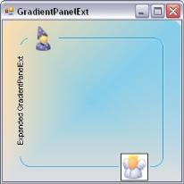
{:.image }

See also

###### Features Overview

The GradientPanelExt provides some unique features that makes it much more flexible than the GradientPanel Control. It offers all the features supported by the GradientPanel and additionally supports the following salient features as well:

Salient Features

* Rounded Corners - The GradientPanelExt's corners can be rounded to a considerable extent.
* Primitives - The panel borders can include the following primitives.
* Collapse Primitive - Facilitates expand and collapse option for the GradientPanelExt, with image provisions.
* Image Primitive - Images can be placed along any of the panel borders with gradient background.
* Text Primitive - Text can be included in the GradientPanelExt's borders.
* Host Primitive - Any Windows Forms or custom .NET Control can be placed along the panel borders.
* Primitive Border - The border in which the primitive should lie can be chosen from left, right, top and bottom.
* Primitive Positioning - The primitives can be positioned on any point of the panel border.
###### Creating GradientPanelExt

This section will guide you to create a GradientPanelExt through designer and also through programmatical approach.

Through Designer

The following steps are involved in creating the GradientPanelExt through the designer.

160. Create a new Windows Application.
161. Drag the GradientPanelExt from the toolbox on to the windows application form.

{:.image }

162. Gradient colors for the panel can be set by defining the gradient styles and colors, using the Color Collection Editor.
163. Primitives can be added to GradientPanelExt 's border using the GradientPanelExt PrimitiveCollection Editor, that can be accessed using the Primitives property.

{:.image }

164. The primitive alignment and position can be defined here.
> 

{:.image }
 _Note: The properties for the primitives can be set individually using the property grid as well._

165. Build and run the application.

{:.image }

Through Code

The following steps will guide you to create a GradientPanelExt through code.

166. Create a C# or VB.NET application through Visual Studio and switch to the code view.
167. Add the Syncfusion.Shared.Base, Syncfusion.Shared.Windows, Syncfusion.Tools.Base and Syncfusion.Tools.Windows assembly references.
168. Include the namespace for the Tools Package.

[C#]

using Syncfusion.Windows.Forms.Tools;

[VB.NET]

Imports Syncfusion.Windows.Forms.Tools

169. Create an instance GradientPanelExt and add it to the Windows Form, defining its various properties and primitives.

[C#]

//Adding the GradientPanelExt

GradientPanelExt gpe = new GradientPanelExt();

gpe.Dock = DockStyle.Fill;

gradientPanelExt1.CornerRadius = 10;

this.Controls.Add(gpe);

//Defining Gradient Colors

gpe.BackColor = System.Drawing.Color.Transparent;

gpe.BackgroundColor = new Syncfusion.Drawing.BrushInfo(Syncfusion.Drawing.GradientStyle.PathEllipse, new System.Drawing.Color[] {

  System.Drawing.Color.Bisque, System.Drawing.Color.LightSalmon,System.Drawing.Color.LightCoral});

//button1

Button button1 = new Button();

button1.FlatStyle = System.Windows.Forms.FlatStyle.Popup;

button1.Text = "Button";

//hostPrimitive1

HostPrimitive hostPrimitive1 = new HostPrimitive();

hostPrimitive1.HostControl = button1;

//progressBarAdv1

ProgressBarAdv progressBarAdv1= new ProgressBarAdv();

progressBarAdv1.ProgressStyle = Syncfusion.Windows.Forms.Tools.ProgressBarStyles.Tube;

//textPrimitive1

TextPrimitive textPrimitive1= new TextPrimitive();

textPrimitive1.Alignment = Syncfusion.Windows.Forms.Tools.Alignment.Bottom;

textPrimitive1.Text = "ProgressbarAdv";

//textPrimitive2

TextPrimitive textPrimitive2 = new TextPrimitive();

textPrimitive2.Text = "Windows Forms Button";

//Adding Primitives

gpe.Primitives.AddRange(new Syncfusion.Windows.Forms.Tools.Primitive[] { hostPrimitive1, textPrimitive1,  textPrimitive2});

[VB.NET]

'Adding the GradientPanelExt

Private gpe As GradientPanelExt = New GradientPanelExt()

Private gpe.Dock = DockStyle.Fill

Private gradientPanelExt1.CornerRadius = 10

Me.Controls.Add(gpe)

'Defining Gradient Colors

Private gpe.BackColor = System.Drawing.Color.Transparent

Private gpe.BackgroundColor = New Syncfusion.Drawing.BrushInfo(Syncfusion.Drawing.GradientStyle.PathEllipse, New                           System.Drawing.Color() { System.Drawing.Color.Bisque, System.Drawing.Color.LightSalmon, System.Drawing.Color.LightCoral})

'button1

Private button1 As Button = New Button()

Private button1.FlatStyle = System.Windows.Forms.FlatStyle.Popup

Private button1.Text = "Button"

'hostPrimitive1

Private hostPrimitive1 As HostPrimitive = New HostPrimitive()

Private hostPrimitive1.HostControl = button1

'progressBarAdv1

Private progressBarAdv1 As ProgressBarAdv = New ProgressBarAdv()

Private progressBarAdv1.ProgressStyle = Syncfusion.Windows.Forms.Tools.ProgressBarStyles.Tube

'textPrimitive1

Private textPrimitive1 As TextPrimitive = New TextPrimitive()

Private textPrimitive1.Alignment = Syncfusion.Windows.Forms.Tools.Alignment.Bottom

Private textPrimitive1.Text = "ProgressbarAdv"

'textPrimitive2

Private textPrimitive2 As TextPrimitive = New TextPrimitive()

Private textPrimitive2.Text = "Windows Forms Button"

'Adding Primitives

gpe.Primitives.AddRange(New Syncfusion.Windows.Forms.Tools.Primitive() {hostPrimitive1, hostPrimitive2, textPrimitive1,                      textPrimitive2})

170. Run and build the application to view the output.
###### Concepts and Features

A few important aspects of the GradientPanelExt have been discussed in this section.

Primitives

One of the most sophisticated features provided by the GradientPanelExt is its ability to include primitives in the borders. 

The primitives that can be included in the GradientPanelExt are,

* Collapse Primitive - Facilitates expand and collapse option for the GradientPanelExt, with image provisions.
* Image Primitive - Images can be placed along any of the panel borders with gradient background.
* Text Primitive - Text can be included in the GradientPanelExt's borders.
* Host Primitive - Any Windows Forms or custom .NET Control can be placed along the panel borders.

The primitives for the GradientPanelExt can be included using the GradientPanelExt PrimitiveCollection Editor, which can be opened using the primitives property.

{:.image }

The primitive type to be included should be chosen from the Types of Primitives available in the GradientPanelExt Collection Editor, and added to the control. The properties for the primitive can be set in the property grid available at the right side.

Expand and Collapse Options

Including the Collapse primitive, provides option to expand and collapse the GradientPanelExt. Performing the following steps will add the Collapse Primitive at design time.

* Open the GradientPanelExt Collection Editor, and choose the Collapse primitive from the ComboBox available and add it. 
* Set the collapse and expand images in the CollapseImage and ExpandImage property respectively. 
* Specify the alignment and position of the primitive using its respective properties. 
* Close the GradientPanelExt Collection Editor. Build and run the application. 
* Now clicking on the Collapse primitive, collapses the control. The control collapses and expands on alternate clicks.

[C#]

Syncfusion.Windows.Forms.Tools.CollapsePrimitive collapsePrimitive1;

gradientPanelExt1.Primitives.Add(collapsePrimitive1);

collapsePrimitive1.Alignment = Syncfusion.Windows.Forms.Tools.Alignment.Bottom;

collapsePrimitive1.BackColor = System.Drawing.Color.Transparent;

collapsePrimitive1.CollapseImage = ((System.Drawing.Image)(resources.GetObject("collapsePrimitive1.CollapseImage")));

collapsePrimitive1.ExpandImage = ((System.Drawing.Image)(resources.GetObject("collapsePrimitive1.ExpandImage")));

collapsePrimitive1.Position = 130;

collapsePrimitive1.Size = new System.Drawing.Size(40, 40);

[VB.NET]

Private collapsePrimitive1 As Syncfusion.Windows.Forms.Tools.CollapsePrimitive

gradientPanelExt1.Primitives.Add(collapsePrimitive1)

Private collapsePrimitive1.Alignment = Syncfusion.Windows.Forms.Tools.Alignment.Bottom

Private collapsePrimitive1.BackColor = System.Drawing.Color.Transparent

Private collapsePrimitive1.CollapseImage = (CType(resources.GetObject("collapsePrimitive1.CollapseImage"),                 System.Drawing.Image))

Private collapsePrimitive1.ExpandImage = (CType(resources.GetObject("collapsePrimitive1.ExpandImage"),                     System.Drawing.Image))

Private collapsePrimitive1.Position = 130

Private collapsePrimitive1.Size = New System.Drawing.Size(40, 40)

{:.image }

{:.image }

See Also

Image and Text Primitives, Host Primitives

Image and Text Primitives

Images and text can be included as individual primitives for the GradientPanelExt. 

The image to be included, should be referenced in the Image property available for the primitive in the GradientPanelExt Collection Editor. 

The text for text primitive, can be specified using the Text property available for the primitive in the GradientPanelExt Collection Editor. The text font and color can also be defined for the text primitive, using the TextFont and TextColor properties, respectively.

[C#]

// Defining Primitives and Adding them

private Syncfusion.Windows.Forms.Tools.ImagePrimitive imagePrimitive1;

private Syncfusion.Windows.Forms.Tools.ImagePrimitive imagePrimitive2;

private Syncfusion.Windows.Forms.Tools.ImagePrimitive imagePrimitive3;

private Syncfusion.Windows.Forms.Tools.ImagePrimitive imagePrimitive4;

private Syncfusion.Windows.Forms.Tools.TextPrimitive textPrimitive1;

private Syncfusion.Windows.Forms.Tools.TextPrimitive textPrimitive2;

this.gradientPanelExt1.Primitives.AddRange(new Syncfusion.Windows.Forms.Tools.Primitive[] {

            this.imagePrimitive1,

            this.imagePrimitive2,

            this.textPrimitive1,

            this.textPrimitive2,

            this.imagePrimitive3,

            this.imagePrimitive4});

// imagePrimitive1       

this.imagePrimitive1.Image = ((System.Drawing.Image)(resources.GetObject("imagePrimitive1.Image")));

this.imagePrimitive1.PrimitiveBorderStyle = Syncfusion.Windows.Forms.Tools.PrimitiveBorderStyle.None;

this.imagePrimitive1.Size = new System.Drawing.Size(20, 20);

// imagePrimitive2

this.imagePrimitive2.Alignment = Syncfusion.Windows.Forms.Tools.Alignment.Bottom;

this.imagePrimitive2.Image = ((System.Drawing.Image)(resources.GetObject("imagePrimitive2.Image")));

this.imagePrimitive2.Position = 2;

this.imagePrimitive2.PrimitiveBorderStyle = Syncfusion.Windows.Forms.Tools.PrimitiveBorderStyle.None;

this.imagePrimitive2.Size = new System.Drawing.Size(20, 20);

// textPrimitive1   

this.textPrimitive1.Alignment = Syncfusion.Windows.Forms.Tools.Alignment.Left;

this.textPrimitive1.Position = 21;

this.textPrimitive1.Size = new System.Drawing.Size(150, 20);

this.textPrimitive1.Text = "Text in Left Border";

this.textPrimitive1.TextColor = System.Drawing.Color.DarkOliveGreen;

this.textPrimitive1.TextFont = new System.Drawing.Font("Arial", 9.75F, ((System.Drawing.FontStyle)((System.Drawing.        FontStyle.Bold | System.Drawing.FontStyle.Italic))), System.Drawing.GraphicsUnit.Point, ((byte)(0)));

// textPrimitive2

this.textPrimitive2.Alignment = Syncfusion.Windows.Forms.Tools.Alignment.Right;

this.textPrimitive2.Position = 24;

this.textPrimitive2.Size = new System.Drawing.Size(150, 20);

this.textPrimitive2.Text = "Text in Right Border";

this.textPrimitive2.TextColor = System.Drawing.Color.DarkGreen;

this.textPrimitive2.TextFont = new System.Drawing.Font("Arial", 9.75F, ((System.Drawing.FontStyle)((System.Drawing.        FontStyle.Bold | System.Drawing.FontStyle.Italic))), System.Drawing.GraphicsUnit.Point, ((byte)(0)));

// imagePrimitive3

this.imagePrimitive3.Image = ((System.Drawing.Image)(resources.GetObject("imagePrimitive3.Image")));

this.imagePrimitive3.Position = 256;

this.imagePrimitive3.PrimitiveBorderStyle = Syncfusion.Windows.Forms.Tools.PrimitiveBorderStyle.None;

this.imagePrimitive3.Size = new System.Drawing.Size(20, 20);

// imagePrimitive4

this.imagePrimitive4.Alignment = Syncfusion.Windows.Forms.Tools.Alignment.Bottom;

this.imagePrimitive4.Image = ((System.Drawing.Image)(resources.GetObject("imagePrimitive4.Image")));

this.imagePrimitive4.Position = 256;

this.imagePrimitive4.PrimitiveBorderStyle = Syncfusion.Windows.Forms.Tools.PrimitiveBorderStyle.None;

this.imagePrimitive4.Size = new System.Drawing.Size(20, 20);

[VB.NET]

' Defining Primitives and Adding them

Private imagePrimitive1 As Syncfusion.Windows.Forms.Tools.ImagePrimitive

Private imagePrimitive2 As Syncfusion.Windows.Forms.Tools.ImagePrimitive

Private imagePrimitive3 As Syncfusion.Windows.Forms.Tools.ImagePrimitive

Private imagePrimitive4 As Syncfusion.Windows.Forms.Tools.ImagePrimitive

Private textPrimitive1 As Syncfusion.Windows.Forms.Tools.TextPrimitive

Private textPrimitive2 As Syncfusion.Windows.Forms.Tools.TextPrimitive

Me.gradientPanelExt1.Primitives.AddRange(New Syncfusion.Windows.Forms.Tools.Primitive() {Me.imagePrimitive1, Me            .imagePrimitive2, Me.textPrimitive1, Me.textPrimitive2, Me.imagePrimitive3, Me.imagePrimitive4})

' imagePrimitive1       

Private Me.imagePrimitive1.Image = (CType(resources.GetObject("imagePrimitive1.Image"), System.Drawing.Image))

Private Me.imagePrimitive1.PrimitiveBorderStyle = Syncfusion.Windows.Forms.Tools.PrimitiveBorderStyle.None

Private Me.imagePrimitive1.Size = New System.Drawing.Size(20, 20)

' imagePrimitive2

Private Me.imagePrimitive2.Alignment = Syncfusion.Windows.Forms.Tools.Alignment.Bottom

Private Me.imagePrimitive2.Image = (CType(resources.GetObject("imagePrimitive2.Image"), System.Drawing.Image))

Private Me.imagePrimitive2.Position = 2

Private Me.imagePrimitive2.PrimitiveBorderStyle = Syncfusion.Windows.Forms.Tools.PrimitiveBorderStyle.None

Private Me.imagePrimitive2.Size = New System.Drawing.Size(20, 20)

' textPrimitive1   

Private Me.textPrimitive1.Alignment = Syncfusion.Windows.Forms.Tools.Alignment.Left

Private Me.textPrimitive1.Position = 21

Private Me.textPrimitive1.Size = New System.Drawing.Size(150, 20)

Private Me.textPrimitive1.Text = "Text in Left Border"

Private Me.textPrimitive1.TextColor = System.Drawing.Color.DarkOliveGreen

Private Me.textPrimitive1.TextFont = New System.Drawing.Font("Arial", 9.75F, (CType((System.Drawing. FontStyle.Bold      Or System.Drawing.FontStyle.Italic), System.Drawing.FontStyle)), System.Drawing.GraphicsUnit.Point, (CByte(0)))

' textPrimitive2

Private Me.textPrimitive2.Alignment = Syncfusion.Windows.Forms.Tools.Alignment.Right

Private Me.textPrimitive2.Position = 24

Private Me.textPrimitive2.Size = New System.Drawing.Size(150, 20)

Private Me.textPrimitive2.Text = "Text in Right Border"

Private Me.textPrimitive2.TextColor = System.Drawing.Color.DarkGreen

Private Me.textPrimitive2.TextFont = New System.Drawing.Font("Arial", 9.75F, (CType((System.Drawing. FontStyle.Bold        Or System.Drawing.FontStyle.Italic), System.Drawing.FontStyle)), System.Drawing.GraphicsUnit.Point, (CByte(0)))

' imagePrimitive3

Private Me.imagePrimitive3.Image = (CType(resources.GetObject("imagePrimitive3.Image"), System.Drawing.Image))

Private Me.imagePrimitive3.Position = 256

Private Me.imagePrimitive3.PrimitiveBorderStyle = Syncfusion.Windows.Forms.Tools.PrimitiveBorderStyle.None

Private Me.imagePrimitive3.Size = New System.Drawing.Size(20, 20)

' imagePrimitive4

Private Me.imagePrimitive4.Alignment = Syncfusion.Windows.Forms.Tools.Alignment.Bottom

Private Me.imagePrimitive4.Image = (CType(resources.GetObject("imagePrimitive4.Image"), System.Drawing.Image))

Private Me.imagePrimitive4.Position = 256

Private Me.imagePrimitive4.PrimitiveBorderStyle = Syncfusion.Windows.Forms.Tools.PrimitiveBorderStyle.None

{:.image }

See Also

Host Primitives, Expand and Collapse Options

Host Primitives

Any .NET Windows Forms control or custom control can be included as a primitive in the GradientPanelExt. The host control should be referred in the HostControl property of the GradientPanelExt Collection Editor. 

[C#]

//button1

Button button1 = new Button();

button1.FlatStyle = System.Windows.Forms.FlatStyle.Popup;

button1.Text = "Button";

//hostPrimitive1

HostPrimitive hostPrimitive1 = new HostPrimitive();

hostPrimitive1.BackColor = System.Drawing.Color.Transparent;

hostPrimitive1.HostControl = button1;

hostPrimitive1.Size = new System.Drawing.Size(60, 20);

//progressBarAdv1

ProgressBarAdv progressBarAdv1= new ProgressBarAdv();

progressBarAdv1.BackColor = System.Drawing.Color.Transparent;

progressBarAdv1.ProgressStyle = Syncfusion.Windows.Forms.Tools.ProgressBarStyles.Tube;

progressBarAdv1.TubeStartColor = System.Drawing.Color.FromArgb(((int)(((byte)(255)))), ((int)(((byte)(192)))), ((int)   (((byte             )(192)))));

//hostPrimitive2

HostPrimitive hostPrimitive2 = new HostPrimitive();

hostPrimitive2.Alignment = Syncfusion.Windows.Forms.Tools.Alignment.Bottom;

hostPrimitive2.BackColor = System.Drawing.Color.Transparent;

hostPrimitive2.HostControl = progressBarAdv1;

hostPrimitive2.Position = 200;

hostPrimitive2.Size = new System.Drawing.Size(100, 20);

//Adding Primitives

gpe.Primitives.AddRange(new Syncfusion.Windows.Forms.Tools.Primitive[] {

  hostPrimitive1,

  hostPrimitive2});

[VB.NET]

'button1

Private button1 As Button = New Button()

Private button1.FlatStyle = System.Windows.Forms.FlatStyle.Popup

Private button1.Text = "Button"

'hostPrimitive1

Private hostPrimitive1 As HostPrimitive = New HostPrimitive()

Private hostPrimitive1.BackColor = System.Drawing.Color.Transparent

Private hostPrimitive1.HostControl = button1

Private hostPrimitive1.Size = New System.Drawing.Size(60, 20)

'progressBarAdv1

Private progressBarAdv1 As ProgressBarAdv = New ProgressBarAdv()

Private progressBarAdv1.BackColor = System.Drawing.Color.Transparent

Private progressBarAdv1.ProgressStyle = Syncfusion.Windows.Forms.Tools.ProgressBarStyles.Tube

Private progressBarAdv1.TubeStartColor = System.Drawing.Color.FromArgb((CInt((CByte(255)))), (CInt((CByte(192)))), (      CInt((CByte       (192)))))

'hostPrimitive2

Private hostPrimitive2 As HostPrimitive = New HostPrimitive()

Private hostPrimitive2.Alignment = Syncfusion.Windows.Forms.Tools.Alignment.Bottom

Private hostPrimitive2.BackColor = System.Drawing.Color.Transparent

Private hostPrimitive2.HostControl = progressBarAdv1

Private hostPrimitive2.Position = 200

Private hostPrimitive2.Size = New System.Drawing.Size(100, 20)

'Adding Primitives

gpe.Primitives.AddRange(New Syncfusion.Windows.Forms.Tools.Primitive() {hostPrimitive1, hostPrimitive2})

{:.image }

See Also

Expand and Collapse Options, Image and Text Primitives

Collapse Expand Animation

The collapse and expand operation in a GradientPanelExt control can be animated by setting Animated property to true. Delay in animation and the speed of animation is specified in AnimationDelay and AnimationSpeed properties.

[C#]

this.gradientPanelExt1.Animated = true;

this.gradientPanelExt1.AnimationDelay = 11;

this.gradientPanelExt1.AnimationSpeed = 2;

[VB.NET]

this.gradientPanelExt1.Animated = True

this.gradientPanelExt1.AnimationDelay = 11

this.gradientPanelExt1.AnimationSpeed = 2

Background and Foreground Settings

By setting the background properties, the user can create a GradientPanelExt according to his requirements. The properties and styles for the GradientPanelExt have been listed and discussed below.

Background Properties

BackColor represents the background color used to display the text or the graphics in the control.

{:.image }

[C#]

gradientPanelExt1.BackColor = System.Drawing.Color.Transparent;

[VB.NET]

Private gradientPanelExt1.BackColor = System.Drawing.Color.Transparent

{:.image }

The colors and styles of the GradientPanelExt control can be set using the BackgroundColor properties, which have been explained below:

* Style - The styles available are solid, pattern and gradient.
* BackColor - User can select the required colors for the background using Backcolor property.
* ForeColor - Foreground color, for text or graphics can be set using ForeColor property.
* PatternStyle - Provides the pattern styles available for the style selected.
* GradientColors - This pops up the Color Collection Editor, which allows the user to add colors and get a combination of colors to display in the gradient panel with the specified style.

_Table_ _234__: Property Table_

<table>
<tr>
<td>
GradientPanelExt Properties</td><td>
Description</td></tr>
<tr>
<td>
Style</td><td>
Specifies the brush style (Solid, Pattern, Gradient).</td></tr>
<tr>
<td>
BackColor</td><td>
Gets or sets the back color.</td></tr>
<tr>
<td>
ForeColor</td><td>
Gets or sets the fore color.</td></tr>
<tr>
<td>
PatternStyle</td><td>
Gets or sets specifies the pattern style.</td></tr>
<tr>
<td>
GradientColor</td><td>
Specifies the gradient colors, with the first color same as BackColor and last color same as ForeColor.</td></tr>
<tr>
<td>
BackgroundImage</td><td>
Specifies the background image for the control.</td></tr>
</table>

{:.image }

Alternatively, the BackgroundColor for the control can also be set using the following code snippet.

[C#]

gradientPanelExt1.BackgroundColor = new Syncfusion.Drawing.BrushInfo(Syncfusion.Drawing.GradientStyle.PathEllipse, new     System.Drawing.Color[] {

  System.Drawing.Color.Bisque,

  System.Drawing.Color.LightSalmon,

  System.Drawing.Color.LightCoral});

[VB.NET]

Private gradientPanelExt1.BackgroundColor = New                                                                            Syncfusion.Drawing.BrushInfo(Syncfusion.Drawing.GradientStyle.PathEllipse, New System.Drawing.Color() {                  System.Drawing.Color.Bisque, System.Drawing.Color.LightSalmon, System.Drawing.Color.LightCoral})

{:.image }

Image Settings

A background image can be set for the gradient panel using the BackgroundImage property. User can set the layout for the background image using the BackgroundImageLayout property. These properties can be set programmatically using the below code snippets.

[C#]

gradientPanelExt1.BackgroundImage = ((System.Drawing.Image)(resources.GetObject("gradientPanelExt1.BackgroundImage")));                

gradientPanelExt1.BackgroundImageLayout = System.Windows.Forms.ImageLayout.Stretch;

[VB.NET]

Private Me.gradientPanelExt1.BackgroundImage = (CType(resources.GetObject("gradientPanelExt1.BackgroundImage"),System.Drawing.Image))   

Private Me.gradientPanelExt1.BackgroundImageLayout = System.Windows.Forms.ImageLayout.Stretch

{:.image }

Foreground

The control's text can be customized by altering its Font properties. The ForeColor property represents the GradientPanelExt's text color. Using the following code snippet customizes the foreground of the GradientPanelExt.

[C#]

this.gradientPanelExt1.Font = new System.Drawing.Font("Comic Sans MS", 9.75F, ((System.Drawing.FontStyle)                                   (((System.Drawing.FontStyle.Bold | System.Drawing.FontStyle.Italic)

  | System.Drawing.FontStyle.Underline))), System.Drawing.GraphicsUnit.Point, ((byte)(0)));

this.gradientPanelExt1.ForeColor = System.Drawing.Color.DarkGreen;

[VB.NET]

Private Me.gradientPanelExt1.Font = New System.Drawing.Font("Comic Sans MS", 9.75F, (CType                                                  (((System.Drawing.FontStyle.Bold Or System.Drawing.FontStyle.Italic) Or System.Drawing.FontStyle.Underline),                              System.Drawing.FontStyle)), System.Drawing.GraphicsUnit.Point, (CByte(0)))

Private Me.gradientPanelExt1.ForeColor = System.Drawing.Color.DarkGreen

{:.image }

Border Settings

Corner Radius 

The GradientPanelExt comes as a rounded rectangle by default. The rounded corners can be removed or their radius can be modified using the CornerRadius property.

_Table_ _235__: Property Table_

<table>
<tr>
<td>
GradientPanelExt Property</td><td>
Description</td></tr>
<tr>
<td>
CornerRadius</td><td>
Used to set or get the radius truncation for the control's corners.</td></tr>
</table>

[C#]

gradientPanelExt1.CornerRadius = 14;

[VB.NET]

Private gradientPanelExt1.CornerRadius = 14

{:.image }

The CornerRadius can be turned off by giving a value of zero for it.

[C#]

gradientPanelExt1.CornerRadius = 0;

[VB.NET]

Private gradientPanelExt1.CornerRadius = 0

{:.image }

Border Gap

The GradientPanelExt comes with a margin for all the four sides. The spacing between the margin and the control's border can be set using the BorderGap property.

_Table_ _236__: Property Table_

<table>
<tr>
<td>
GradientPanelExt Property</td><td>
Description</td></tr>
<tr>
<td>
BorderGap</td><td>
Used to get or set the gap between the border and the margins.</td></tr>
</table>

The border gap for the GradientPanelExt can be set programmatically as given below.

[C#]

gradientPanelExt1.BorderGap = 40;

[VB.NET]

Private gradientPanelExt1.BorderGap = 40

{:.image }

Scroll Settings

The scroll settings that apply for the GradientPanel also applies for GradientPanelExt control.

See Also

Scroll Settings

###### GradientPanelExt Events

The GradientPanelExt offers the following unique events, to make it more flexible to work with.

CornerRadiusChanged Event

This event is raised every time the Corner Radius value is changed.

[C#]

private void gradientPanelExt1_CornerRadiusChanged(object sender, EventArgs e)

{

    imagePrimitive1.Position = 100;

}

[VB.NET]

Private Sub gradientPanelExt1_CornerRadiusChanged(ByVal sender As Object, ByVal e As EventArgs)

imagePrimitive1.Position = 100

End Sub

 PrimitivesChanged Event

 This event is raised when the value of the primitives property is changed.

[C#]

private void gradientPanelExt1_PrimitivesChanged(object sender, EventArgs e)

{

    MessageBox.Show("Primitive Value Changed");

}

[VB.NET]

Private Sub gradientPanelExt1_PrimitivesChanged(ByVal sender As Object, ByVal e As EventArgs)

MessageBox.Show("Primitive Value Changed")

End Sub

##### SplitContainerAdv

The SplitContainerAdv is a container that consists of two panels with a splitter between them. It allows the user to simply put other controls on these panels and drag the splitter vertically or horizontally to resize these panels. The user can add more SplitContainerAdv controls into any one of the panels in another SplitContainerAdv control and can change the orientation to have a customized look.

{:.image }

See Also

###### Features Overview

The following are the features of SplitContainerAdv control.

* Border Style - Border Styles can be set for the split container.
* PanelFixed - One panel can be set as fixed and the other can be resized.
* Splitter properties - There are properties to customize the splitter bar. Properties like SplitterDistance, SplitterIncrement, and SplitterWidth are used to customize the splitter appearance and orientation.
* Orientation - The Splitter bar can be set as horizontal or vertical between the panels.
* Panel Properties - There are separate properties for panels also, so that they can be customized separately.
* Panel Collapsed - The control provides options for collapsing the panels by setting the properties for the panel, which needs to be collapsed.
* Styles - The SplitContainerAdv has now come up with different styles to give the control a good look and feel.
* Arrow Settings - The control provides properties to customize the thumbnail arrows' appearance.

See Also

Concepts and Features

###### Creating SplitContainerAdv

This section will give a step-by-step procedure to design a SplitContainerAdv control through designer and also through programmatical approach.

Through Designer

To create and customize the SplitContainerAdv through designer,

* Open a new Visual C# or VB.NET application in Visual studio.
* Drag-and-drop a SplitContainerAdv control object from the toolbox onto the form and resize it to the desired dimension.

{:.image }

* Drag and drop the desired controls on to the panels.
* Run the application. 

{:.image }

See Also

Concepts and Features

Through Code

To create a SplitContainerAdv control programmatically,

* Open a new Visual C# or VB.NET application in Visual Studio.
* Add the Syncfusion assemblies Shared.Base and Tool.Windows.
* Declare the SplitContainerAdv control.

[C#]

private Syncfusion.Windows.Forms.Tools.SplitContainerAdv splitContainerAdv1;

[VB.NET]

Private splitContainerAdv1 As Syncfusion.Windows.Forms.Tools.SplitContainerAdv

* Initialize the control and add it in your form.

[C#]

this.splitContainerAdv1 = new Syncfusion.Windows.Forms.Tools.SplitContainerAdv();

this.Controls.Add(this.splitContainerAdv1);

[VB.NET]

Me.splitContainerAdv1 = New Syncfusion.Windows.Forms.Tools.SplitContainerAdv()

Me.Controls.Add(Me.splitContainerAdv1)

* If required customize the control's look and feel.

[C#]

this.splitContainerAdv1.BackColor = System.Drawing.Color.AliceBlue;

this.splitContainerAdv1.Location = new System.Drawing.Point(64, 48);

this.splitContainerAdv1.Size = new System.Drawing.Size(224, 136);

this.splitContainerAdv1.SplitterDistance = 47;

[VB.NET]

Me.splitContainerAdv1.BackColor = System.Drawing.Color.AliceBlue

Me.splitContainerAdv1.Location = New System.Drawing.Point(64, 48)

Me.splitContainerAdv1.Size = New System.Drawing.Size(224, 136)

Me.splitContainerAdv1.SplitterDistance = 47

* Run the application. You will see the SplitContainerAdv with two panels in it as shown below.

{:.image }

###### Concepts and Features

This section will guide you in getting started with the SplitContainerAdv control. It explains all the concepts and features of the control in detail.

SplitContainerAdv

The below image illustrates the components of a SplitContainerAdv control. It has two panels separated by a splitter, which has arrows and a grip for the splitter.

{:.image }

A sample which demonstrates the SplitContainerAdv control is available in the below sample installation location.

..\My Documents\Syncfusion\EssentialStudio_\Version Number_\Windows\Tools.Windows\Samples\2.0\Editors Package\Container controls\SplitContainerAdv

See Also

Panel Settings

This section discusses about various properties available for the SplitContainerAdv to control the behavior of the panels. The panels has properties and events similar to Window's Panel control, to change its appearance.

Panel Orientation

The SplitContainerAdv Panels can be oriented horizontally or vertically using the Orientation property. Default value is horizontal.

[C#]

this.splitContainerAdv1.Orientation = System.Windows.Forms.Orientation.Vertical;

[VB.NET]

Me.splitContainerAdv1.Orientation = System.Windows.Forms.Orientation.Vertical

{:.image }

Resizing the Panels

While resizing the control at design time or at run time, we can make one panel as fixed and resize the other panel alone. Select the panel which needs to be fixed, in FixedPanel property. 

[C#]

this.SplitContainerAdv1.FixedPanel = Syncfusion.Windows.Forms.Tools.Enums.FixedPanel.Panel1

[VB.NET]

Me.SplitContainerAdv1.FixedPanel = Syncfusion.Windows.Forms.Tools.Enums.FixedPanel.Panel1

Collapsing a Panel

We can make any of the panels to be collapsed at run time. The below properties helps you to do that.

_Table_ _237__: Property Table_

<table>
<tr>
<td>
SplitContainerAdv Properties</td><td>
Description</td></tr>
<tr>
<td>
Panel1</td><td>
Gives properties of the panel1 which represents the first panel to the left of the Splitter.</td></tr>
<tr>
<td>
Panel1Collapsed</td><td>
Indicates if the Panel1 is collapsed or not.</td></tr>
<tr>
<td>
Panel2</td><td>
Gives properties of the panel2 which represents the last or the second panel to the right of the Splitter.</td></tr>
<tr>
<td>
Panel2Collapsed</td><td>
Indicates if the Panel2 is collapsed or not.</td></tr>
<tr>
<td>
PanelToBeCollapsed</td><td>
Sets the panel to be collapsed when a predefined event occurs on it.</td></tr>
<tr>
<td>
TogglePanelOn</td><td>
A predefined event, which leads to collapsing of the panel specified in PanelToBeCollapsed property. Using TogglePanelOn property, we can decide whether, the panel needs to be collapsed on a single click or a double click.</td></tr>
</table>

[C#]

this.splitContainerAdv1.Panel1Collapsed = true;

this.splitContainerAdv1.Panel2Collapsed = false;

this.splitContainerAdv1.PanelToBeCollapsed = Syncfusion.Windows.Forms.Tools.CollapsedPanel.Panel1;

this.splitContainerAdv1.TogglePanelOn = Syncfusion.Windows.Forms.Tools.TogglePanelOn.DoubleClick;

[VB.NET]

Me.SplitContainerAdv1.Panel1Collapsed = True

Me.SplitContainerAdv1.Panel2Collapsed = False

Me.splitContainerAdv1.PanelToBeCollapsed = Syncfusion.Windows.Forms.Tools.CollapsedPanel.Panel1

Me.splitContainerAdv1.TogglePanelOn = Syncfusion.Windows.Forms.Tools.TogglePanelOn.DoubleClick

Panel Size 

We can specify the minimum size for the Panel1 and Panel2 in Panel1MinSize and Panel2MinSize properties. Default value for both the properties is 25.

[C#]

this.splitContainerAdv1.Panel1MinSize = 50;

this.splitContainerAdv1.Panel2MinSize = 50;

[VB.NET]

Me.splitContainerAdv1.Panel1MinSize = 50

Me.splitContainerAdv1.Panel2MinSize = 50

Splitter Settings

The properties which changes the behavior of the Splitter in a SplitContainerAdv control are discussed in this section.

Splitter Settings

The below table describes the properties to control the behavior of the splitter. 

_Table_ _238__: Property Table_

<table>
<tr>
<td>
SplitContainerAdv Properties</td><td>
Description</td></tr>
<tr>
<td>
IsSplitterFixed</td><td>
Gets / sets whether the user is allowed to move the splitter or not. Default value is false.</td></tr>
<tr>
<td>
SplitterDistance</td><td>
Indicates the distance from the left top border.</td></tr>
<tr>
<td>
SplitterIncrement</td><td>
Determines the number of pixels the splitter moves in each increment.</td></tr>
<tr>
<td>
SplitterWidth</td><td>
Indicates the width of the splitter.</td></tr>
</table>

[C#]

this.SplitContainerAdv1.IsSplitterFixed = true;

this.splitContainerAdv1.SplitterDistance = 25

this.splitContainerAdv1.SplitterIncrement = 5

this.splitContainerAdv1.SplitterWidth = 20

[VB.NET]

Me.SplitContainerAdv1.IsSplitterFixed = True

Me.splitContainerAdv1.SplitterDistance = 25

Me.splitContainerAdv1.SplitterIncrement = 5

Me.splitContainerAdv1.SplitterWidth = 20

{:.image }

Thumbnail Arrow and Grip Settings

SplitContainerAdv control supports various appearance settings for the ThumbnailArrow in the control which are discussed in detail below. The properties which control the appearance of the splitter components are as follows.

_Table_ _239__: Property Table_

<table>
<tr>
<td>
SplitContainerAdv Properties</td><td>
Description</td></tr>
<tr>
<td>
ExpandFill</td><td>
Sets the color for the arrows.</td></tr>
<tr>
<td>
ExpandLine</td><td>
Sets the outline color for the arrows.</td></tr>
<tr>
<td>
GripDark</td><td>
Sets color for the grip.</td></tr>
<tr>
<td>
GridLight</td><td>
Sets the shadow around the grip.</td></tr>
</table>

[C#]

this.splitContainerAdv2.ExpandFill = new Syncfusion.Drawing.BrushInfo(System.Drawing.Color.AliceBlue);

this.splitContainerAdv2.ExpandLine = System.Drawing.Color.Red;

this.splitContainerAdv2.GripDark = new Syncfusion.Drawing.BrushInfo(System.Drawing.Color.Wheat);

this.splitContainerAdv2.GripLight = new Syncfusion.Drawing.BrushInfo(System.Drawing.Color.Crimson);

[VB.NET]

Me.splitContainerAdv2.ExpandFill = New Syncfusion.Drawing.BrushInfo(System.Drawing.Color.AliceBlue)

Me.splitContainerAdv2.ExpandLine = System.Drawing.Color.Red

Me.splitContainerAdv2.GripDark = New Syncfusion.Drawing.BrushInfo(System.Drawing.Color.Wheat)

Me.splitContainerAdv2.GripLight = New Syncfusion.Drawing.BrushInfo(System.Drawing.Color.Crimson)

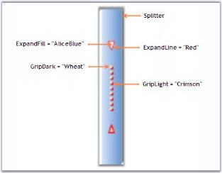
{:.image }

RunTime Appearance

The properties to control the appearance of the thumbnail arrows, and grip, while mouse hovering at runtime, are as follows.

_Table_ _240__: Property Table_

<table>
<tr>
<td>
SplitContainerAdv Properties</td><td>
Description</td></tr>
<tr>
<td>
HotBackgroundColor</td><td>
Sets the background color of the Thumbnail while under mouse cursor.</td></tr>
<tr>
<td>
HotExpandFill</td><td>
Sets the color for the arrows while under mouse cursor.</td></tr>
<tr>
<td>
HotExpandLine</td><td>
Sets the outline color for the arrows while under mouse cursor.</td></tr>
<tr>
<td>
HotGripDark</td><td>
Sets color for the grip while under mouse cursor.</td></tr>
<tr>
<td>
HotGridLight</td><td>
Sets the shadow around the grip while under mouse cursor.</td></tr>
</table>

[C#]

this.splitContainerAdv2.HotBackgroundColor = new Syncfusion.Drawing.BrushInfo(Syncfusion.Drawing.GradientStyle.Horizontal, System.Drawing.Color.SandyBrown, System.Drawing.Color.AntiqueWhite);

this.splitContainerAdv2.HotExpandFill = new Syncfusion.Drawing.BrushInfo(System.Drawing.Color.Red);

this.splitContainerAdv2.HotExpandLine = System.Drawing.Color.DeepPink;

this.splitContainerAdv2.HotGripDark = new Syncfusion.Drawing.BrushInfo(System.Drawing.Color.MistyRose);

this.splitContainerAdv2.HotGripLight = new Syncfusion.Drawing.BrushInfo(System.Drawing.Color.Purple);

[VB.NET]

Me.splitContainerAdv2.HotBackgroundColor = New Syncfusion.Drawing.BrushInfo(Syncfusion.Drawing.GradientStyle.Horizontal, System.Drawing.Color.SandyBrown, System.Drawing.Color.AntiqueWhite) 

Me.splitContainerAdv2.HotExpandFill = New Syncfusion.Drawing.BrushInfo(System.Drawing.Color.Red) 

Me.splitContainerAdv2.HotExpandLine = System.Drawing.Color.DeepPink 

Me.splitContainerAdv2.HotGripDark = New Syncfusion.Drawing.BrushInfo(System.Drawing.Color.MistyRose) 

Me.splitContainerAdv2.HotGripLight = New Syncfusion.Drawing.BrushInfo(System.Drawing.Color.Purple)

{:.image }

Appearance Settings

This section discusses the properties which controls the appearance of the SplitContainerAdv control.

Background Settings

The below table describes the background settings.

_Table_ _241__: Property Table_

<table>
<tr>
<td>
SplitContainerAdv Properties</td><td>
Description</td></tr>
<tr>
<td>
BackgroundImage</td><td>
Sets the background image for the control.</td></tr>
<tr>
<td>
BackgroundImageLayout</td><td>
Specifies the background image layout.</td></tr>
<tr>
<td>
BackColor</td><td>
Sets the background color for the control.</td></tr>
<tr>
<td>
BackgroundColor</td><td>
Sets the solid, gradient or pattern style background for the control. </td></tr>
</table>
> 
{:.image }
 _Note: The above properties can be overridden by SplitContainerAdv.Panel properties._ 

[C#]

this.splitContainerAdv1.BackColor = System.Drawing.Color.LightSteelBlue;

this.splitContainerAdv1.Panel1.BackgroundColor = new Syncfusion.Drawing.BrushInfo(Syncfusion.Drawing.GradientStyle.BackwardDiagonal, System.Drawing.Color.AliceBlue, System.Drawing.Color.LightSteelBlue);

this.splitContainerAdv1.Panel2.BackColor = System.Drawing.Color.AliceBlue;

[VB.NET]

Me.splitContainerAdv1.BackColor = System.Drawing.Color.LightSteelBlue 

Me.splitContainerAdv1.Panel1.BackgroundColor = New Syncfusion.Drawing.BrushInfo(Syncfusion.Drawing.GradientStyle.BackwardDiagonal, System.Drawing.Color.AliceBlue, System.Drawing.Color.LightSteelBlue) 

Me.splitContainerAdv1.Panel2.BackColor = System.Drawing.Color.AliceBlue

Foreground Settings

The below table describes the foreground settings.

_Table_ _242__: Property Table_

<table>
<tr>
<td>
SplitContainerAdv Properties</td><td>
Description</td></tr>
<tr>
<td>
Font</td><td>
Sets the font style for the display text in the control.</td></tr>
<tr>
<td>
ForeColor</td><td>
Sets the color for the display text in the control.</td></tr>
</table>

[C#]

this.splitContainerAdv1.Panel2.Font = new System.Drawing.Font("Arial", 8.25F, System.Drawing.FontStyle.Bold);

this.splitContainerAdv1.Panel1.ForeColor = System.Drawing.Color.Black;

[VB.NET]

Me.splitContainerAdv1.Panel2.Font = New System.Drawing.Font("Arial", 8.25F, System.Drawing.FontStyle.Bold) 

Me.splitContainerAdv1.Panel1.ForeColor = System.Drawing.Color.Black

{:.image }

Border Settings

BorderStyle property sets 2D or 3D border for the SplitContainerAdv control. The options are FixedSingle or Fixed3D.

[C#]

this.splitContainerAdv1.BorderStyle = System.Windows.Forms.BorderStyle.FixedSingle;

[VB.NET]

Me.splitContainerAdv1.BorderStyle = System.Windows.Forms.BorderStyle.FixedSingle

Styles

Visual Styles for the SplitContainerAdv control is set through Style property. The available styles are, 

* Office2007Black,
* Office2007Blue, 
* Office2007Silver, 
* OfficeXP, 
* Office2003,
* VS2005, 
* Mozilla and 
* Default.
* Metro

[C#]

//Sets Office2007 Black color scheme for the control.

this.splitContainerAdv1.Style = Syncfusion.Windows.Forms.Tools.Style.Office2007Black;

[VB.NET]

'Sets Office2007 Black color scheme for the control.

Me.splitContainerAdv1.Style = Syncfusion.Windows.Forms.Tools.Style.Office2007Black

{:.image }

See Also

Thumbnail Arrow Settings

###### Events

The events available for the SplitContainerAdv control are as follows.

* SplitterMoved Event- This event is handled when the splitter is moved to a new position.

[C#]

private void splitContainerAdv2_SplitterMoved(object sender, SplitterMoveEventArgs args)

{

    MessageBox.Show("The Splitter has moved from : " + args.OldSplitPosition.ToString() + " to " + args.NewSplitPosition.ToString());

}

[VB.NET]

Private Sub splitContainerAdv2_SplitterMoved(ByVal sender As Object, ByVal args As SplitterMoveEventArgs)

    MessageBox.Show("The Splitter has moved from : " + args.OldSplitPosition.ToString() + " to " + args.NewSplitPosition.ToString())

End Sub

{:.image }

* SplitterMoving Event - This event is handled while the splitter is moving.

[C#]

private void splitContainerAdv2_SplitterMoving(object sender, SplitterMoveEventArgs args)

{

    MessageBox.Show("The splitter is moving to : " + args.NewSplitPosition.ToString());

}

[VB.NET]

Private Sub splitContainerAdv2_SplitterMoving(ByVal sender As Object, ByVal args As SplitterMoveEventArgs)

    MessageBox.Show("The splitter is moving to : " + args.NewSplitPosition.ToString())

End Sub

{:.image }

### Dialog Control

This section discusses about the following DialogControl in detail.

##### FolderBrowser

The Essential Tools FolderBrowser component provides a convenient and easy to use object oriented wrapper for the Win32 Shell Folder Browser API. This class completely abstracts the intricacies involved in using the various complex Shell API functions, structures and callback routines required for working with the Windows Folder Selection Dialog and allows Windows Forms developers to work with.NET-centric properties, events and methods.

{:.image }

See Also

###### Features

FolderBrowser implements a convenient and easy to use wrapper for the Win32 Shell Folder Browser API and contains the following features.

Features

* Location Settings

The location where the FolderBrowser Dialog points to, can be set to any desired location by the user. The StartLocation property provides various options to specify the location of the root folder from which browsing is to be started.

* Style Settings

The FolderBrowser Dialog can be displayed in various styles using the Style property of the FolderBrowser. The FolderBrowser provides options to display Templates and create folders using the "Make New Folder" button.

* Text Settings

The FolderBrowser includes a TextBox control in the FolderBrowser Dialog that allows the user to type any text. The TextBox is capable of AutoCompleting the text entered.

See Also

Concepts and Features

###### Creating FolderBrowser

FolderBrowser control can be created in the following ways.

Through Designer 

The designer based approach for creating and initializing the FolderBrowser component is shown below.

171. Select the FolderBrowser control from the Visual Studio .NET toolbox window and drop it onto the design form. An instance of the FolderBrowser component will be added to the design form's component tray.

{:.image }

172. Select a suitable value for the FolderBrowser.StartLocation property from the enumerator list provided by the property grid. This specifies the location at which browsing should be started in the folder hierarchy. This property is the functional equivalent of the Win32 PIDL's.
173. Specify an appropriate value for the FolderBrowser.Style property. The FolderBrowserStyles enumeration specifies various options for the FolderBrowser Dialog.
174. To display the FolderBrowser window, simply invoke the FolderBrowser.ShowDialog() method from within your application's code.

This method is a modal function and if the return code indicates success, the FolderBrowser.DirectoryPath property may be used to access the selected folder.

[C#]

this.folderBrowser1.ShowDialog();

[VB.NET]

Me.folderBrowser1.ShowDialog()

{:.image }

See Also

Through Code

Through Code

The programmatic approach for using the FolderBrowser component is shown below.

175. Create an instance of the FolderBrowser component.

[C#]

// Declare the FolderBrowser component.

private Syncfusion.Windows.Forms.FolderBrowser folderBrowser1;

// Create an instance of the FolderBrowser component.

this.folderBrowser1 = new Syncfusion.Windows.Forms.FolderBrowser(this.components);

[VB.NET]

' Declare the FolderBrowser component.

Private folderBrowser1 As Syncfusion.Windows.Forms.FolderBrowser

' Create an instance of the FolderBrowser component.

Me.folderBrowser1 = New Syncfusion.Windows.Forms.FolderBrowser(Me.components)

176. Set the FolderBrowser.StartLocation and FolderBrowser.Style property values.

[C#]

// Specify the Start location.

this.folderBrowser1.StartLocation = Syncfusion.Windows.Forms.FolderBrowserFolder.MyComputer;

// Specify the styles for the FolderBrowser Dialog.

this.folderBrowser1.Style = (Syncfusion.Windows.Forms.FolderBrowserStyles.RestrictToFilesystem | Syncfusion.Windows.Forms.FolderBrowserStyles.BrowseForComputer);

[VB.NET]

' Specify the Start location.

Me.folderBrowser1.StartLocation = Syncfusion.Windows.Forms.FolderBrowserFolder.MyComputer

' Specify the styles for the FolderBrowser Dialog.

Me.folderBrowser1.Style = Syncfusion.Windows.Forms.FolderBrowserStyles.RestrictToFilesystem Or Syncfusion.Windows.Forms.FolderBrowserStyles.BrowseForComputer

177. Invoke the FolderBrowser.ShowDialog() method to display the FolderBrowser Dialog.

[C#]

this.folderBrowser1.ShowDialog();

[VB.NET]

Me.folderBrowser1.ShowDialog()

{:.image }

See Also

Through Designer

###### Concepts and Features

The following topics will help you become more familiar in using the FolderBrowser control.

Location Settings

This section deals with the location settings of the FolderBrowser control.

The FolderBrowser allows the user to provide the location from which browsing should start. It also provides various options from which the root folder for browsing can be selected. The following properties illustrate this.

_Table_ _243__: Property Table_

<table>
<tr>
<td>
FolderBrowser Properties</td><td>
Description</td></tr>
<tr>
<td>
StartLocation</td><td>
Specifies the location of the root folder from which to start browsing. It is the functional equivalent of setting the PIDL value.{{ _Desktop,_ | markdownify }}{{ _Internet,_ | markdownify }}{{ _Programs,_ | markdownify }}{{ _Controls,_ | markdownify }}{{ _Printers,_ | markdownify }}{{ _Personal,_ | markdownify }}{{ _Favorites,_ | markdownify }}{{ _Startup,_ | markdownify }}{{ _Recent,_ | markdownify }}{{ _SendTo,_ | markdownify }}{{ _BitBucket,_ | markdownify }}{{ _StartMenu,_ | markdownify }}{{ _MyDocuments,_ | markdownify }}{{ _MyMusic,_ | markdownify }}{{ _MyVideo,_ | markdownify }}{{ _DesktopDirectory,_ | markdownify }}{{ _MyComputer,_ | markdownify }}{{ _NetworkNeighborhood,_ | markdownify }}{{ _NetHood,_ | markdownify }}{{ _Fonts,_ | markdownify }}{{ _Templates,_ | markdownify }}{{ _MyPictures,_ | markdownify }}{{ _CommonDocuments,_ | markdownify }}{{ _CommonAdminTools,_ | markdownify }}{{ _AdminTools,_ | markdownify }}{{ _NetAndDialUpConnections,_ | markdownify }}{{ _CommonMusic,_ | markdownify }}{{ _CommonPictures,_ | markdownify }}{{ _CommonVideo,_ | markdownify }}{{ _Resources,_ | markdownify }}{{ _ResourcesLocalized,_ | markdownify }}{{ _CommonOemLinks,_ | markdownify }}{{ _CDBurnArea,_ | markdownify }}{{ _ComputersNearMe,_ | markdownify }}{{ _CustomStartLocation,_ | markdownify }}{{ _FlagPerUserInit,_ | markdownify }}{{ _FlagNoAlias,_ | markdownify }}{{ _FlagDontVerify,_ | markdownify }}{{ _FlagCreate and_ | markdownify }}{{ _FlagMask._ | markdownify }}</td></tr>
<tr>
<td>
CustomStartLocation</td><td>
Gets / sets custom start location for showing the dialog.</td></tr>
<tr>
<td>
SelectLocation</td><td>
Gets / sets the selected location for showing the dialog.</td></tr>
<tr>
<td>
DirectoryPath</td><td>
Retrieves the location of the selected folder.</td></tr>
</table>
> 
{:.image }
 _Note: For the SelectLocation property to take effect, the StartLocation property must be set to 'CustomStartLocation'._

[C#]

// Set the enumeration value FolderBrowserFolder.CustomStartLocation for Folder.StartLocation property.

this.folderBrowser1.StartLocation = Syncfusion.Windows.Forms.FolderBrowserFolder.CustomStartLocation;

this.folderBrowser1.CustomStartLocation = "C:";

// SelectLocation property for Automatic Scroll and Highlight of desired path.

this.folderBrowser1.SelectLocation = "C:\\Program Files\\Syncfusion\\Essential Studio";

[VB.NET]

' Set the enumeration value FolderBrowserFolder.CustomStartLocation for Folder.StartLocation property.

Me.folderBrowser1.StartLocation = Syncfusion.Windows.Forms.FolderBrowserFolder.CustomStartLocation

Me.folderBrowser1.CustomStartLocation = "C:"

' SelectLocation property for Automatic Scroll and Highlight of desired path.

Me.folderBrowser1.SelectLocation = "C:\\Program Files\\Syncfusion\\Essential Studio"

{:.image }

A Sample which demonstrates the Location Settings of FolderBrowser is available in the below sample installation path.

..My Documents\Syncfusion\EssentialStudio\_Version Number_\Windows\Tools.Windows\Samples\2.0\Editors Package\FolderBrowserDemo

Style Settings

The style settings that are available for the FolderBrowser Dialog are given below.

_Table_ _244__: Property Table_

<table>
<tr>
<td>
FolderBrowser Property</td><td>
Description</td></tr>
<tr>
<td>
Style</td><td>
Specifies the options for the FolderBrowser Dialog.The options included are as follows.{{ _RestrictToFilesystem,_ | markdownify }}{{ _RestrictToSubfolders,_ | markdownify }}{{ _RestrictToDomain,_ | markdownify }}{{ _BrowseForComputer,_ | markdownify }}{{ _BrowseForEverything,_ | markdownify }}{{ _BrowseForPrinter,_ | markdownify }}{{ _NewDialogStyle,_ | markdownify }}{{ _AllowUrls,_ | markdownify }}{{ _ShowAdministrativeShares,_ | markdownify }}{{ _ShowShares,_ | markdownify }}{{ _ShowTextBox,_ | markdownify }}{{ _StatusText,_ | markdownify }}{{ _UAHint and_ | markdownify }}{{ _Validate._ | markdownify }}</td></tr>
</table>

The various options of the Style property are described below.

* RestrictToFilesystem - Restricts selection to file system directories.
* RestrictToSubfolders - Returns only file system ancestors.
* RestrictToDomain - Excludes network folders below the domain level.
* BrowseForComputer - Displays only computers.
* BrowseForEverything - Displays files as well as folders.
* BrowseForPrinter - Displays only printers.
* NewDialogStyle - Uses the new resizable folder selection dialog.
* AllowUrls - Displays URLs. 'NewDialogStyle' and 'BrowseForEverything' must be set along with this flag.
* ShowAdministrativeShares - Displays administrative shares existing on the remote system.
* ShowShares - Displays shareable resources existing on the remote system.
* ShowTextBox - Displays textbox in the FolderBrowser Dialog.
* StatusText - Includes status area in the dialog box. StatusText can be specified in the FolderBrowserCallBack event handler. This style does not apply to 'NewDialogStyle'.
* UAHint - Adds an usage hint to the folder dialog. It can be applied only with 'NewDialogStyle'.
* Validate - Typing invalid name in the textbox triggers FolderBrowserCallBack event.

[C#]

this.folderBrowser1.Style = Syncfusion.Windows.Forms.FolderBrowserStyles.ShowTextBox;

[VB.NET]

Me.folderBrowser1.Style = Syncfusion.Windows.Forms.FolderBrowserStyles.ShowTextBox

{:.image }

A Sample which demonstrates the Style Settings of FolderBrowser is available in the below sample installation path.

…\_My Documents\Syncfusion\EssentialStudio\Version Number\Windows\Tools.Windows\Samples\Advanced Editor Functions\ActionGroupingDemo_

Text Settings

The text settings of the FolderBrowser control are described below.

The text for the FolderBrowser can be set using the below given property.

_Table_ _245__: Property Table_

<table>
<tr>
<td>
FolderBrowser Property</td><td>
Description</td></tr>
<tr>
<td>
Description</td><td>
Gets / sets the text displayed above the tree control in the FolderBrowser Dialog.</td></tr>
</table>
The Description property of the FolderBrowser supports the 'AutoComplete' feature that provides options that can be used to complete text even before it is entered.

[C#]

this.folderBrowser1.Description = "Recent Documents";

[VB.NET]

Me.folderBrowser1.Description = "Recent Documents"

{:.image }

###### FolderBrowser Event

A detailed explanation about the FolderBrowserCallback event is given in the following section.

_Table_ _246__: Event Table_

<table>
<tr>
<td>
FolderBrowser Event</td><td>
Description</td></tr>
<tr>
<td>
FolderBrowserCallback</td><td>
The event occurs when an event within the Folder Browser Dialog triggers a call to the validation callback.</td></tr>
</table>
FolderBrowserCallback Event

The event occurs when an event within the folder browser dialog triggers a call to the validation callback. The event handler receives an argument of type FolderBrowserCallbackEventArgs.

The following FolderBrowserCallbackEventArgs members provide information specific to this event.

_Table_ _247__: Members Table_

<table>
<tr>
<td>
Members</td><td>
Description</td></tr>
<tr>
<td>
Dismiss</td><td>
Specifies whether the dialog is either dismissed or retained depending upon this value.</td></tr>
<tr>
<td>
FolderBrowserCallbackSetState</td><td>
Gets / sets the Folder Browser dialog's state.</td></tr>
<tr>
<td>
BrowseCallbackText</td><td>
Gets / sets the contextual string based upon the FolderBrowserCallbackSetState property.</td></tr>
<tr>
<td>
FolderBrowserMessage</td><td>
Returns a value indentifying the event.</td></tr>
<tr>
<td>
Path</td><td>
Returns valid or invalid folder name.</td></tr>
<tr>
<td>
Window</td><td>
Returns window handle of browser dialog box.</td></tr>
</table>

It can be handled when browser validation is required.

This handler is functionally equivalent to the Win32 BrowseCallbackProc callback function.

[C#]

private void folderBrowser1_BrowseCallback(object sender, Syncfusion.Windows.Forms.FolderBrowserCallbackEventArgs e)

{

// We can log the events and Folder Browser Message to the Label control.

this.label1.Text = String.Format("Event: {0}, Path: {1}", e.FolderBrowserMessage, e.Path);

if (e.FolderBrowserMessage == FolderBrowserMessage.ValidateFailed)

{

e.Dismiss = e.Path != "NONE";

}

}

[VB.NET]

Private Sub folderBrowser1_BrowseCallback(ByVal sender As Object, ByVal e As Syncfusion.Windows.Forms.FolderBrowserCallbackEventArgs)

' We can log the events and Folder Browser Message to the Label control.

Me.label1.Text = String.Format("Event: {0}, Path: {1}", e.FolderBrowserMessage, e.Path)

If e.FolderBrowserMessage = FolderBrowserMessage.ValidateFailed Then

e.Dismiss = e.Path &lt;&gt; "NONE"

End If

End Sub

###### Frequently Asked Questions

This section will help you become more familiar in using the FolderBrowser control.

What are FolderBrowser Flags?

Flags can be used to set various styles for the FolderBrowser Dialog. Each style has it's own behavior and these styles can be added or removed to get the desired style for the FolderBrowser Dialog.

Look at the below given snippet to apply "RestrictToSubfolders" style and to remove the "ShowTextBox" style for the FolderBrowser Dialog.

[C#]

this.folderBrowser1.Style &= ~FolderBrowserStyles.RestrictToSubfolders;

this.folderBrowser1.Style |= FolderBrowserStyles.ShowTextBox;

[VB.NET]

Me.folderBrowser1.Style = Me.folderBrowser1.Style And Not FolderBrowserStyles.RestrictToSubfolders

Me.folderBrowser1.Style = Me.folderBrowser1.Style Or FolderBrowserStyles.ShowTextBox

### Editor Controls

The following are the rich edit controls supported by Syncfusion.

##### CurrencyEdit

CurrencyEdit embeds a CurrencyTextBox control and a button to provide a drop-down calculator to enable calculations with the contents of the CurrencyTextBox. The CurrencyEdit control provides an easy way to collect and display the currency data.

{:.image }

###### Features

The features of Currency Edit control is listed below.

* CurrentUI culture can be applied to CurrencyEdit control through properties of embedded textbox.
* You can set Button Styles for CurrencyEdit control.
* The Currency value can be moved from a PopupCalculator to a CurrencyTextbox and vice versa.
* The layout of the calculator control in the CurrencyEdit control can also be changed.
* It is used to display dropdown Financial Calculator.
###### Creating CurrencyEdit

To use a CurrencyEdit control in your application, all you need to do is drag and drop the CurrencyEdit control from the controls toolbox onto your form. You can then set any of its properties through the property grid.

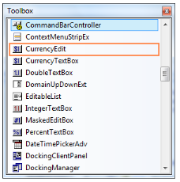
{:.image }

It can be created programmatically as follows.

178. Include the required namespace.

[C#]

using Syncfusion.Windows.Forms.Tools;

[VB.NET]

Imports Syncfusion.Windows.Forms.Tools

179. Create an instance of the CurrencyEdit. Add that instance to the Form.

[C#]

private Syncfusion.Windows.Forms.Tools.CurrencyEdit currencyEdit1;

this.currencyEdit1=new Syncfusion.Windows.Forms.Tools.CurrencyEdit();

this.Controls.Add(this.currencyEdit1);

[VB.NET]

Private currencyEdit1 As Syncfusion.Windows.Forms.Tools.CurrencyEdit

Me.currencyEdit1 = New Syncfusion.Windows.Forms.Tools.CurrencyEdit()

Me.Controls.Add(Me.currencyEdit1)

{:.image }

###### Concepts and Features

The following topics will help you become more familiar in using the CurrencyEdit control.

Calculator Settings

A CurrencyEdit control has a text field and a Calculator button, pressing which will open a Calculator control. The below image illustrates the same.

{:.image }

The properties which controls the behavior of the Calculator button is as follows.

_Table_ _248__: Property Table_

<table>
<tr>
<td>
CurrencyEdit Properties</td><td>
Description</td></tr>
<tr>
<td>
ShowCalculator</td><td>
Specifies whether calculator button is to be displayed. By default it is True.</td></tr>
<tr>
<td>
CalculatorButton</td><td>
Provides properties to customize the calculator button. { [See ButtonEdit](http://172.168.111.149/UG_82/WindowsFormsUI_Tools/ButtonEdit.html) | markdownify } control user guide to know about the settings.</td></tr>
<tr>
<td>
CalculatorLayoutType</td><td>
Specifies the LayoutType for the Calculator control. The layout types are,{{ _Financial (default) and_ | markdownify }}{{ _WindowStandard._ | markdownify }}</td></tr>
<tr>
<td>
PopupCalculatorAlignment</td><td>
It sets the alignment of the popup calculator with respect to the ButtonEdit control. The options are,{{ _Right(default) and_ | markdownify }}{{ _Left._ | markdownify }}</td></tr>
<tr>
<td>
CloseAction</td><td>
Specifies the action that will close the popup calculator. After performing calculations in the popup calculator, we may press '=' to close the popup calculator. This is called closed action. We can select any operator instead of '=' to close the popup calculator. The options are,{{ _Calcdigit0...Calcdigit9,_ | markdownify }}{{ _CalcOperatorNone,_ | markdownify }}{{ _CalcOperatorMultiply,_ | markdownify }}{{ _CalcOperatorPlus,_ | markdownify }}{{ _CalcOperatorMinus,_ | markdownify }}{{ _CalcOperatorDivide,_ | markdownify }}{{ _CalcOperatorPercent,_ | markdownify }}{{ _CalcOperatorEquals (default),_ | markdownify }}{{ _CalcOperatorSqrt,_ | markdownify }}{{ _CalcOperatorSign,_ | markdownify }}{{ _CalcOperatorMemoryClear,_ | markdownify }}{{ _CalcOperatorMemoryRecall,_ | markdownify }}{{ _CalcOperatorMemoryStore,_ | markdownify }}{{ _CalcOperatorMemoryPlus,_ | markdownify }}{{ _CalcSpecialClear,_ | markdownify }}{{ _CalcSpecialClearEntry,_ | markdownify }}{{ _CalcSpecialDecimal and_ | markdownify }}{{ _CalcSpecialBackspace._ | markdownify }}</td></tr>
</table>

[C#]

this.currencyEdit1.CalculatorLayoutType = Syncfusion.Windows.Forms.Tools.CalculatorLayoutTypes.WindowsStandard;

this.currencyEdit1.CloseAction = Syncfusion.Windows.Forms.Tools.CalcActions.CalcOperatorEquals;

this.currencyEdit1.PopupCalculatorAlignment = Syncfusion.Windows.Forms.Tools.CalculatorPopupAlignment.Left;

this.currencyEdit1.ShowCalculator = true;

this.currencyEdit1.TransferFromCalculator = true;

this.currencyEdit1.TransferToCalculator = true;

[VB.NET]

Me.currencyEdit1.CalculatorLayoutType = Syncfusion.Windows.Forms.Tools.CalculatorLayoutTypes.WindowsStandard

Me.currencyEdit1.CloseAction = Syncfusion.Windows.Forms.Tools.CalcActions.CalcOperatorEquals

Me.currencyEdit1.PopupCalculatorAlignment = Syncfusion.Windows.Forms.Tools.CalculatorPopupAlignment.Left

Me.currencyEdit1.ShowCalculator = True

Me.currencyEdit1.TransferFromCalculator = True

Me.currencyEdit1.TransferToCalculator = True

Text Settings

The below properties will let you control the behavior of the text in the CurrencyEdit control.

_Table_ _249__: Property Table_

<table>
<tr>
<td>
CurrencyEdit Properties</td><td>
Description</td></tr>
<tr>
<td>
ShowTextBox</td><td>
Indicates whether to show the textbox or not.</td></tr>
<tr>
<td>
Text</td><td>
Specifies the text of the embedded control.</td></tr>
<tr>
<td>
TextBox</td><td>
Specifies the properties for customizing the embedded textbox.</td></tr>
<tr>
<td>
TextAlign</td><td>
Specifies the alignment of the text in the control.</td></tr>
<tr>
<td>
TransferFromCalculator</td><td>
Specifies whether to transfer the calculated value to the edit control.</td></tr>
<tr>
<td>
TransferToCalculator</td><td>
Specifies whether to transfer the calculated value from the edit control.</td></tr>
<tr>
<td>
DecimalValue</td><td>
Specifies the decimal value of the currency control.</td></tr>
</table>

[C#]

this.currencyEdit1.ShowTextBox = true;

this.currencyEdit1.Text = "$400.00";

this.currencyEdit1.TextAlign = HorizontalAlignment.Right;

this.currencyEdit1.TransferFromCalculator=true;

this.currencyEdit1.TransferToCalculator= false;

this.currencyEdit1.TextBox.DecimalValue = new decimal(new int[] {40000, 0, 0, 131072});

[VB.NET]

Me.currencyEdit1.ShowTextBox = True

Me.currencyEdit1.Text = "$400.00"

Me.currencyEdit1.TextAlign = HorizontalAlignment.Right

Me.currencyEdit1.TransferFromCalculator = True

Me.currencyEdit1.TransferToCalculator = False

Me.currencyEdit1.TextBox.DecimalValue = New Decimal(New Integer() {40000, 0, 0, 131072})

{:.image }

> 
{:.image }
 _Note: Enabling ButtonEdit.UseVisualStyle property and by setting visual style for control using ButtonEdit.ButtonStyle property, we can change the appearance of the calculator button._

###### Frequently Asked Questions

How to Change the Calculator layout using CalcPopup property

Sometimes we may be in need of a calculator with Windows standard layout. By changing the CalcPopup property, we can do the same. Include this code fragment in the FormLoad event.

[C#]

// Changes the layout of the calculator.

PopupCalculator pc=new Popupcalculator();

pc.LayoutType=CalculatorLayoutTypes.WindowsStandard;

pc.ParentControl=currencyEdit1;

currencyEdit1.CalcPopup=pc;

[VB.NET]

' Changes the layout of the calculator.

Dim pc As PopupCalculator = New Popupcalculator()

pc.LayoutType=CalculatorLayoutTypes.WindowsStandard

pc.ParentControl=currencyEdit1

currencyEdit1.CalcPopup=pc

###### Events

CalculatorClosing Event

CalculatorClosing event is handled when the calculator is closing after the specified button is clicked.

[C#]

private void currencyEdit1_CalculatorClosing(object sender, CalculatorClosingEventArgs e)

{

    // This prints the final calculated value before closing.

    MessageBox.Show("The calculated Value is" + e.FinalValue.ToString());

}

[VB.NET]

Private Sub currencyEdit1_CalculatorClosing(ByVal sender As Object, ByVal e AsCalculatorClosingEventArgs)

    ' This prints the final calculated value before closing.

    MessageBox.Show("The calculated Value is" + e.FinalValue.ToString())

End Sub

CalculatorShowing Event

This event is raised before the calculator popup is displayed. The Cancel property of this CancelEventArgs lets  you to cancel the popup display as follows.

[C#]

private void currencyEdit1_CalculatorShowing(object sender, CancelEventArgs e)

{

    //Cancels the calculator popup.

    e.Cancel = true;

}

[VB.NET]

Private Sub currencyEdit1_CalculatorShowing(ByVal sender As Object, ByVal e As CancelEventArgs)

    'Cancels the calculator popup.

    e.Cancel = True

End Sub

DecimalValueChanged Event

This event is raised when DecimalValue property is changed.

[C#]

private void currencyEdit1_DecimalValueChanged(object sender, EventArgs e)

{

    MessageBox.Show("Decimal Value is Changed");

}

[VB.NET]

Private Sub currencyEdit1_DecimalValueChanged(ByVal sender As Object, ByVal e As EventArgs)

    MessageBox.Show("Decimal Value is Changed")

End Sub

##### DomainUpDownExt

DomainUpDownExt is an advanced version of the standard windows DomainUpDown control. Syncfusion DomainUpDownExt supports themes and comes with Office2007 look and feel. It also provides options to apply custom colors to the control. It enables spin button orientation and alignment.

{:.image }

###### Features

DomainUpDownExt is an advanced version of the standard windows DomainUpDown control and contains following features.

* Extends the DomainUpDown to provide XP Look and Feel.
* Keyboard Support to increment or decrement value using Up and Down keys.
* Orientation of spin button to vertical and horizontal.
* Provides option to set different visual styles including Office2007.
* [Custom Colors](http://help.syncfusion.com/ug_82/WindowsFormsUI_Tools/VisualStyles4.html) can be applied to the control.
###### Creating DomainUpDownExt

To use a DomainUpDownExt control in your application, all you need to do is drag and drop the DomainUpDownExt control from the controls toolbox onto your form.

{:.image }

You can add items in the String Collection Editor of DomainUpDownExt control and Click Ok.

{:.image }

It can be created programmatically as follows.

180. Add Shared.Base, Shared.Windows, Tools.Base and Tools.Windows assembly references and include the required namespace.

[C#]

using Syncfusion.Windows.Forms.Tools;

[VB.NET]

Imports Syncfusion.Windows.Forms.Tools

181. Create an instance of the DomainUpDownExt. Add that instance to the Form.

[C#]

private Syncfusion.Windows.Forms.Tools.DomainUpDownExt domainUpDownExt1;

this.domainUpDownExt1=new Syncfusion.Windows.Forms.Tools.DomainUpDownExt();

// Add items.

this.domainUpDownExt1.Items.Add("One");

this.domainUpDownExt1.Items.Add("Two");

this.domainUpDownExt1.Items.Add("Three");

this.domainUpDownExt1.Items.Add("Four");

this.domainUpDownExt1.Items.Add("Five");

this.Controls.Add(this.domainUpDownExt1);

[VB.NET]

Private domainUpDownExt1 As Syncfusion.Windows.Forms.Tools.DomainUpDownExt

Me.domainUpDownExt1 = New Syncfusion.Windows.Forms.Tools.DomainUpDownExt()

' Add items.

Me.domainUpDownExt1.Items.Add("One")

Me.domainUpDownExt1.Items.Add("Two")

Me.domainUpDownExt1.Items.Add("Three")

Me.domainUpDownExt1.Items.Add("Four")

Me.domainUpDownExt1.Items.Add("Five")

Me.Controls.Add(Me.domainUpDownExt1)

{:.image }

###### Concepts and Features

Text Settings

The text for the DomainUpDownExt control can be specified in String Collection Editor. This section discusses the properties which deals with this text.

_Table_ _250__: Property Table_

<table>
<tr>
<td>
DomainUpDownExt Property</td><td>
Description</td></tr>
<tr>
<td>
Items</td><td>
Invokes String Collection Editor. Text for the control can be specified in this editor.</td></tr>
<tr>
<td>
TextAlign</td><td>
Specifies the alignment of the text in the text field.</td></tr>
<tr>
<td>
MaxLength</td><td>
Indicates the maximum length of the text that can be entered into the editable portion of the control. Default value is 32767.</td></tr>
</table>

[C#]

this.domainUpDownExt2.Items.Add("Six");

this.domainUpDownExt1.TextAlign = System.Windows.Forms.HorizontalAlignment.Right;

this.domainUpDownExt2.MaxLength = 32768;

[VB.NET]

Me.domainUpDownExt2.Items.Add("Six")

Me.domainUpDownExt1.TextAlign = System.Windows.Forms.HorizontalAlignment.Right

Me.domainUpDownExt2.MaxLength = 32768

{:.image }

SpinButton

This section will discuss the properties which controls the alignment and orientation of the spin button in a DomainUpDownExt control.

{:.image }

Orientation

The spin button orientation can be changed to vertical or horizontal using the SpinOrientation property.

[C#]

//Spin button will be oriented horizontally.

this.domainUpDownExt1.SpinOrientation = Orientation.Horizontal;

//Spin button will be oriented vertically.

this.domainUpDownExt1.SpinOrientation = Orientation.Vertical;           

[VB]

'SpinButton will be oriented horizontally.

Me.domainUpDownExt1.SpinOrientation = Orientation.Horizontal

'SpinButton will be oriented vertically.

Me.domainUpDownExt1.SpinOrientation = Orientation.Vertical

{:.image }

Alignment

The spin button alignment can be set through UpDownAlign property. By default it is set to right.

[C#]

this.domainUpDownExt1.UpDownAlign = LeftRightAlignment.Left;       

[VB]

Me.domainUpDownExt1.UpDownAlign = LeftRightAlignment.Left

{:.image }

Keyboard Support

Using Up and Down arrow keys we can increment and decrement the value of DomainUpDownExt control by settingInterceptArrowKeys to true.

_Table_ _251__: Property Table_

<table>
<tr>
<td>
DomainUpDownExt Property</td><td>
Description</td></tr>
<tr>
<td>
InterceptArrowKeys</td><td>
Specifies whether the up down control will increment and decrement when Up Arrow and Down Arrow keys are pressed.</td></tr>
</table>

[C#]

this.domainUpDownExt1.InterceptArrowKeys = true;

[VB.NET]

Private Me.domainUpDownExt1.InterceptArrowKeys = True

Visual Styles

DomainUpDownExt supports Office2007 visual style with all three color schemes.

[C#]

//sets the Office2007 Visual Style.

this.domainUpDownExt1.VisualStyle = Syncfusion.Windows.Forms.VisualStyle.Office2007;

//To set Blue Color scheme.

this.domainUpDownExt1.ColorScheme = Syncfusion.Windows.Forms.Office2007Theme.Blue;

//To set Silver Color scheme.

this.domainUpDownExt1.ColorScheme = Syncfusion.Windows.Forms.Office2007Theme.Silver;

//To set Black Color scheme.

this.domainUpDownExt1.ColorScheme = Syncfusion.Windows.Forms.Office2007Theme.Black;               

[VB]

'Sets the Office2007 Visual Style.

Me.domainUpDownExt1.VisualStyle = Syncfusion.Windows.Forms.VisualStyle.Office2007

'To set Blue Color scheme.

Me.domainUpDownExt1.ColorScheme = Syncfusion.Windows.Forms.Office2007Theme.Blue

'To set Silver Color scheme.

Me.domainUpDownExt1.ColorScheme = Syncfusion.Windows.Forms.Office2007Theme.Silver

'To set Black Color scheme.

Me.domainUpDownExt1.ColorScheme = Syncfusion.Windows.Forms.Office2007Theme.Black

{:.image }

It also provides support for XP Themes look and feel.

[C#]

//Enable Themes.

this.domainUpDownExt1.ThemesEnabled = true;                          

[VB]

'Enable Themes.

Me.domainUpDownExt1.ThemesEnabled = True

{:.image }

{:.image }

Custom Colors

We can also apply custom colors to the DomainUpDownExt control by setting ColorScheme to "Managed" and specifying the custom color through the ApplyManagedColors method as follows.

[C#]

this.domainUpDownExt1.ColorScheme = Syncfusion.Windows.Forms.Office2007Theme.Managed;

Office2007Colors.ApplyManagedColors(this, Color.Orange);

[VB.NET]

Me.domainUpDownExt1.ColorScheme = Syncfusion.Windows.Forms.Office2007Theme.Managed;

Office2007Colors.ApplyManagedColors(Me, Color.Orange)

{:.image }

Appearance Settings

This section discusses the border styles and back color that can be applied for DomainUpDownExt control.

The below table lists the appearance properties of DomainUpDownExt control.

_Table_ _252__: Property Table_

<table>
<tr>
<td>
DomainUpDownExt Properties</td><td>
Description</td></tr>
<tr>
<td>
BorderStyle</td><td>
Specifies the border style for the control. The options includesFixedSingle,Fixed3D, andNone.</td></tr>
<tr>
<td>
Border3DStyle</td><td>
Specifies the 3D BorderStyle for the control when BorderStyle = Fixed3D.The options are,RaisedInner,RaisedOuter,Raised,Sunken (default),SunkenInner,SunkenOuter,Flat,Bump andAdjust.</td></tr>
<tr>
<td>
BorderSides</td><td>
Specifies the sides of the control which can have border. The options are,Left,Top,Right,Bottom,Middle andAll (default).</td></tr>
<tr>
<td>
BorderColor</td><td>
Specifies the color for 2D border. The default color is 'black'.</td></tr>
<tr>
<td>
ThemedBorder</td><td>
Specifies whether to enable themes for the border around the control. ThemesEnabled must be set to 'True'.</td></tr>
<tr>
<td>
BackColor</td><td>
Specifies the back color for the control.</td></tr>
</table>

[C#]

this.domainUpDownExt1.BorderStyle = System.Windows.Forms.BorderStyle.FixedSingle;

this.domainUpDownExt1.Border3DStyle = System.Windows.Forms.Border3DStyle.Bump;

this.domainUpDownExt1.BorderSides = System.Windows.Forms.Border3DSide.Right;

this.domainUpDownExt1.BorderColor = System.Drawing.Color.DodgerBlue;        

this.domainUpDownExt1.BackColor = System.Drawing.Color.AntiqueWhite;

[VB.NET]

Me.domainUpDownExt1.BorderStyle = System.Windows.Forms.BorderStyle.FixedSingle

Me.domainUpDownExt1.Border3DStyle = System.Windows.Forms.Border3DStyle.Bump

Me.domainUpDownExt1.BorderSides = System.Windows.Forms.Border3DSide.Right

Me.domainUpDownExt1.BorderColor = System.Drawing.Color.DodgerBlue

Me.domainUpDownExt1.BackColor = System.Drawing.Color.AntiqueWhite

{:.image }

{:.image }

###### DomainUpDownExt Events

This section describes the events of DomainUpDownExt control.

_Table_ _253__: Property Table_

<table>
<tr>
<td>
DomainUpDownExt Events</td><td>
Description</td></tr>
<tr>
<td>
ThemeChanged</td><td>
This event is handled when ThemesEnabled property is changed.</td></tr>
<tr>
<td>
SpinOrientationChanged</td><td>
This event is handled when orientation of spin button is changed.</td></tr>
<tr>
<td>
BorderSidesChanged</td><td>
This event is handled when BorderSides property is changed.</td></tr>
<tr>
<td>
BorderColorChanged</td><td>
This event is handled when BorderColor is changed.</td></tr>
<tr>
<td>
Border3DStyleChanged</td><td>
This event is handled when Border3DStyle is changed.</td></tr>
</table>
######  Frequently Asked Questions

How to add new items to the List when enter key is pressed

To add the new items which are entered by the user at runtime after the user had pressed the enter key, we need to catch theKeyDown event.

[C#]

private void domainUpDownExt1_KeyDown(object sender, System.Windows.Forms.KeyEventArgs e)

{

  // Add new items when user press the Enter key.

if(e.KeyCode==Keys.Enter)

if(!domainUpDownExt1.Items.Contains ( domainUpDownExt1.Text ))  domainUpDownExt1.Items.Add(domainUpDownExt1.Text);

}

[VB.NET]

Private Sub domainUpDownExt1_KeyDown(ByVal sender As Object, ByVal e AsSystem.Windows.Forms.KeyEventArgs)

   ' Add new items when user press the Enter key.

If e.KeyCode = Keys.Enter Then

If Not domainUpDownExt1.Items.Contains(domainUpDownExt1.Text) Then

domainUpDownExt1.Items.Add(domainUpDownExt1.Text)

End If

End If

End Sub

How to programmatically browse through values in a DomainUpDownExt control

We can programmatically browse through the previous and the next values, of the current value, by calling UpButton() and DownButton() methods.

[C#]

//Goes to the previous value.

this.domainUpDownExt1.UpButton();

//Goes to the Next value.

this.domainUpDownExt1.DownButton();

[VB.NET]

'Goes to the previous value.

Me.domainUpDownExt1.UpButton()

'Goes to the Next value.

Me.domainUpDownExt1.DownButton()

##### DoubleTextBox

The DoubleTextBox is a text box-derived control that can display double data type values.

The DoubleTextBox is derived from Windows Forms framework text box control. The DoubleTextBox supports display and collection of double values. It handles user keyboard input and double formatting and uses the globalization features of the .NET platform to provide locale specific formatting.

{:.image }

###### Features

DoubleTextBoxis used to display collection of double values.

* The control handles user keyboard input and double formatting with no code required.
* It is fully compatible with the Windows Forms Text Box and uses the globalization features of the .NET platform to provide locale specific formatting.
* The control supports values with a precision of 15 characters.
* The DoubleTextBox control supports displaying negative values in a different color and also using different negative formats.
###### Creating Double TextBox

To use a DoubleTextBox control in your application, all you need to do is drag and drop the DoubleTextBox control from the controls toolbox onto your form.

{:.image }

It can be created programmatically as follows.

182. Add Shared.Base, Shared.Windows, Tools.Base and Tools.Windows assembly references and include the required namespace.

[C#]

using Syncfusion.Windows.Forms.Tools;

[VB.NET]

Imports Syncfusion.Windows.Forms.Tools

183. Create an instance of the DoubleTextBox. Add that instance to the Form.

[C#]

this.doubleTextBox1=new Syncfusion.Windows.Forms.Tools.DoubleTextBox();

this.Controls.Add(this.doubleTextBox1);

[VB.NET]

Me.doubleTextBox1 = New Syncfusion.Windows.Forms.Tools.DoubleTextBox()

Me.Controls.Add(Me.doubleTextBox1)

{:.image }

###### Concepts and Features

The following Editors controls (DoubleTextBox, IntegerTextBox, PercentTextBox, and CurrencyTextBox) has been revamped, click here to see the details of revamping.

Number Settings

The below table lists the properties which illustrates the number settings for the DoubleTextBox.

_Table_ _254__: Property Table_

<table>
<tr>
<td>
Double TextBox Properties</td><td>
Description</td></tr>
<tr>
<td>
DoubleValue</td><td>
Specifies the double value of the control.</td></tr>
<tr>
<td>
NumberDecimalDigits</td><td>
Gets or sets the maximum number of digits for the decimal portion of the number.</td></tr>
<tr>
<td>
NumberDecimalSeparator</td><td>
Gets or sets the decimal separator character that will be used for the display. The default decimal character '.' can be overridden by other special characters using this property.</td></tr>
<tr>
<td>
NumberGroupSeparator</td><td>
Gets or sets the separator used for grouping the digits.</td></tr>
<tr>
<td>
NumberGroupSizes</td><td>
Gets or sets the grouping of NumberDigits in the DoubleTextBox.</td></tr>
<tr>
<td>
NumberNegativePattern</td><td>
Gets or sets the pattern to use when the value is negative.</td></tr>
</table>

[C#]

this.doubleTextBox1.NumberDecimalDigits = 3;

this.doubleTextBox1.NumberDecimalSeparator = "-";

this.doubleTextBox1.NumberGroupSeparator = ";";

this.doubleTextBox1.NumberGroupSizes = new int[] {4};

this.doubleTextBox1.NumberNegativePattern = 2;

[VB.NET]

Me.doubleTextBox1.AllowNull = True

Me.doubleTextBox1.NullString = ""

Me.doubleTextBox1.Text = ""

Me.doubleTextBox1.NumberDecimalDigits = 3

Me.doubleTextBox1.NumberDecimalSeparator = "-"

Me.doubleTextBox1.NumberGroupSeparator = ";"

Me.doubleTextBox1.CurrencyGroupSizes = New Integer() {3}

Me.doubleTextBox1.NumberNegativePattern = 2

DoubleTextBox Value

The maximum and minimum value of the editable field in DoubleTextBox control can be specified using the below properties.

_Table_ _255__: Property Table_

<table>
<tr>
<td>
DoubleTextBox Properties</td><td>
Description</td></tr>
<tr>
<td>
MaxValue</td><td>
Specifies the maximum value that can be set for the DoubleTextBox.</td></tr>
<tr>
<td>
MinValue</td><td>
Specifies the minimum value that can be set for the DoubleTextBox.</td></tr>
</table>

[C#]

this.doubleTextBox1.MaxValue = 25;

this.doubleTextBox1.MinValue = 4;

[VB.NET]

Me.doubleTextBox1.MaxValue = 25

Me.doubleTextBox1.MinValue = 4

Banner Text Support

We can set banner text for the DoubleTextBox control. Refer [BannerTextProvider Component](http://help.syncfusion.com/ug_82/WindowsFormsUI_Tools/BannerText.html) topic for more details.

We need to do the below settings to make Banner text feature available for the control.

[C#]

this.doubleTextBox1.AllowNull = true;

this.doubleTextBox1.NullString = "";

this.doubleTextBox1.Text = "";

[VB.NET]

Me.doubleTextBox1.AllowNull = True

Me.doubleTextBox1.NullString = ""

Me.doubleTextBox1.Text = ""

{:.image }

Appearance and Behavior Settings

This section discusses the complete Appearance and behavior settings of Double TextBox.

Border Style

3D border styles and colors can be applied for the border of Double TextBox. Refer [Border styles](http://help.syncfusion.com/ug/windows%20forms/tools/default.htm) of Currency textbox for details.

Color

Colors can be applied for Double textbox when its value is positive, negative or zero. Refer [Color Settings](http://help.syncfusion.com/ug/windows%20forms/tools/default.htm) of Currency textbox for details.

Keyboard Support

Double TextBox supports keyboard support. Refer [Clipboard Support](http://help.syncfusion.com/ug_82/WindowsFormsUI_Tools/ClipboardSupport.html) of Currency textbox in detail.

Overflow Indicator

Overflow indicator will be shown when the value of Double TextBox goes beyond the control's size. Refer [Overflow Indicator](http://help.syncfusion.com/ug/windows%20forms/tools/default.htm) of Currency textbox in detail.

Globalization

The Double TextBox class is globalization aware and uses System.Globalization.CultureInfo for locale-specific information. Refer[Globalization](http://help.syncfusion.com/ug/windows%20forms/tools/default.htm) of Currency textbox in detail.

Active When Disabled

We can make the control active even when it is in Disable mode. Refer [Active When Disabled](http://help.syncfusion.com/ug_82/WindowsFormsUI_Tools/ActiveWhenDisabled.html)of Currency textbox in detail.

Overriding the Behavior of certain KeyStrokes in a DoubleTextBox

This can be done by overriding the HandleSubtractKey(). Given below is the code snippet which shows an example of how to clear the text when the NegativeSign is changed.

[C#]

public class DoubleTextBoxAdv : Syncfusion.Windows.Forms.Tools.DoubleTextBox

{

    public DoubleTextBoxAdv() : base() { }

    private bool deleteonnegative = false;

    public bool DeleteOnNegative

    {

        get

        {

            return deleteonnegative;

        }

        set

        {

            deleteonnegative = value;

        }

    }

    // Overrides the behavior of SubtractKey so that the text is cleared when the NegativeSign is changed.

    protected override Syncfusion.Windows.Forms.Tools.NumberModifyState HandleSubtractKey()

    {

        if (deleteonnegative == true)

        {

            if (this.NegativeSign == "-" && this.Text.StartsWith("-"))

            {

                this.Clear();

            }

        }

        return base.HandleSubtractKey();

    }

}

[VB.NET]

Public Class DoubleTextBoxAdv

    Inherits Syncfusion.Windows.Forms.Tools.DoubleTextBox

    Public Sub New()

        MyBase.New()

    End Sub

    Private m_deleteonnegative As Boolean = False

    Public Property DeleteOnNegative() As Boolean

        Get

            Return m_deleteonnegative

        End Get

        Set(ByVal value As Boolean)

            m_deleteonnegative = value

        End Set

    End Property

    ' Overrides the behavior of Subtract Key so that the text is cleared when the NegativeSign is changed.

    Protected Overloads Overrides Function HandleSubtractKey() AsSyncfusion.Windows.Forms.Tools.NumberModifyState

        If m_deleteonnegative = True Then

            If Me.NegativeSign = "-" AndAlso Me.Text.StartsWith("-") Then

                Me.Clear()

            End If

        End If

        Return MyBase.HandleSubtractKey()

    End Function

End Class

{:.image }

###### Event Handling

Enabling Fixed Change using Shortcut Keys

Sometimes there may occur situations for incrementing or decrementing the value in DoubleTextBox. In such situations it is better to use shortcut keys. The following implementation will give you an idea on how to achieve this. Here the Up and Down keys are used for incrementing and decrementing respectively. We cannot use '-' because it is already reserved to enter the minus sign.

[C#]

private void doubleTextBox1_KeyDown(object sender,KeyEventArgs e)

{

  decimal v=doubleTextBox1.DoubleValue;

switch(e.KeyCode)

{

  // Up and Down keys are used for incrementing and decrementing respectively.

case Keys.Up : v++;break;

case Keys.Down : v--;break;

}

doubleTextBox1.DoubleValue=v;

}

[VB.NET]

Private Sub doubleTextBox1_KeyDown(ByVal sender As Object, ByVal e As KeyEventArgs)

Dim v As Decimal = doubleTextBox1.DoubleValue

Select e.KeyCode

' Up and Down keys are used for incrementing and decrementing respectively.

Case Keys.Up

v=v+1

Case Keys.Down

v=v-1

End Select

doubleTextBox1.DoubleValue = v

End Sub

DoubleValueChanged Event

This event is handled when the double value in the text field is changed.

[C#]

private void doubleTextBox1_DoubleValueChanged(object sender, EventArgs e)

{

   MessageBox.Show("Double Value is changed");

}

[VB.NET]

Private Sub doubleTextBox1_DoubleValueChanged(ByVal sender As Object, ByVal e As EventArgs)

MessageBox.Show("Double Value is changed")

End Sub

##### IntegerTextBox

The IntegerTextBox is derived from the Windows Forms framework TextBox control and can display integer data type values. It exhibits properties similar to that of the CurrencyTextBox.

{:.image }

###### Features

IntegerTextBox is used to display Int64 values and contains the following features.

Features

Display Settings

The [display](http://help.syncfusion.com/ug/windows%20forms/tools/default.htm) settings involve setting the separator to be used to group the numbers and the group size.

It also involves setting the pattern and symbol to be used when the number is negative.

Value Settings

The value settings provide options to set the value to be displayed by the IntegerTextBox control. It provides options to indicate the null state of the control and customize it's settings.

The maximum and minimum value of the control can also be set.

* Culture Settings

The [culture](http://help.syncfusion.com/ug/windows%20forms/tools/default.htm) to be used for formatting the numeric display can be set using the Culture property.

* Text Settings

Text can be selected, formatted, clipped and displayed from right to left using the [text settings](http://help.syncfusion.com/ug/windows%20forms/tools/default.htm) of the IntegerTextBox control.

* Appearance Settings

The background color and foreground color of the control can be set according to the needs of the user.

The foreground color can be set separately for the positive, negative and null values of the control.

* Behavior Settings

The integer value of the control can be reset or changed to a negative value by selecting it's entire contents and pressing the negative key on the keyboard.

The control also allows to insert zeros before the beginning value of the integer value using the AllowLeadingZeros property.

* Border Settings

2D and 3D border styles can be applied to the IntegerTextBox.

The color of the border can also be set for the control using the BorderColor property.

* Key Settings

Keyboard support for entering large values is provided. Incrementing and decrementing of values can be done using the up and down arrow [keys](http://help.syncfusion.com/ug/windows%20forms/tools/default.htm).

* Applying Themes

Themes appearance can be provided for the IntegerTextBox control.

Key Features

* The IntegerTextBox control handles user keyboard input and double formatting with no code required.
* It is fully compatible with the Windows Forms TextBox and uses the globalization features of the .NET platform to provide locale specific formatting.
* The IntegerTextBox control supports displaying negative values in a different color and also using different negative formats.
###### Creating IntegerTextBox

This section will give a step by step procedure to design an IntegerTextBox control through designer and also through programmatical approach.

Through Designer

184. Create or open a Windows Forms project.
185. Click on the IntegerTextBox Control in the toolbox and add it to the form by dragging and dropping it onto the form or double clicking the control.

{:.image }

186. Run the application. The IntegerTextBox that allows you to enter only integer values, will be displayed as given below.

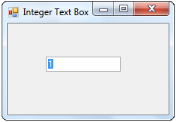
{:.image }

Through Programmatical Approach

The IntegerTextBox control can be created programmatically through code as detailed below.

187. Include the required namespace.

[C#]

using Syncfusion.Windows.Forms.Tools;

[VB.NET]

Imports Syncfusion.Windows.Forms.Tools

188. Create an instance of the IntegerTextBox control.

[C#]

// Create IntegerTextBox control.

private Syncfusion.Windows.Forms.Tools.IntegerTextBox integerTextBox1;

this.integerTextBox1=new Syncfusion.Windows.Forms.Tools.IntegerTextBox();

[VB.NET]

' Create IntegerTextBox control.

Private integerTextBox1 As Syncfusion.Windows.Forms.Tools.IntegerTextBox

Me.integerTextBox1 = New Syncfusion.Windows.Forms.Tools.IntegerTextBox()

189. Specify its value and size.

[C#]

this.integerTextBox1.IntegerValue = ((long)(7));

this.integerTextBox1.Size = new System.Drawing.Size(144, 20);

[VB.NET]

Me.integerTextBox1.IntegerValue = (CLng(7))

Me.integerTextBox1.Size = New System.Drawing.Size(144, 20)

190. Add the IntegerTextBox control to the form.

[C#]

this.Controls.Add(this.integerTextBox1);

[VB.NET]

Me.Controls.Add(Me.integerTextBox1)

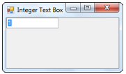
{:.image }

###### Concepts and Features

The following Editors controls (DoubleTextBox, IntegerTextBox, PercentTextBox, and CurrencyTextBox) have been revamped, click here to see the details of revamping.

Display Settings

This section discusses the display settings of the IntegerTextBox control.

The IntegerTextBox provides a list of properties to set the display characteristics associated with the integer value.

_Table_ _256__: Property Table_

<table>
<tr>
<td>
IntegerTextBox Properties</td><td>
Description</td></tr>
<tr>
<td>
NumberGroupSeparator</td><td>
Gets / sets the separator to be used for grouping the digits.</td></tr>
<tr>
<td>
NumberGroupSizes</td><td>
Specifies the grouping of number digits in the IntegerTextBox.</td></tr>
<tr>
<td>
NumberNegativePattern</td><td>
Gets / sets the pattern to use when the value is negative.</td></tr>
<tr>
<td>
NegativeSign</td><td>
Gets / sets the sign that is to be used to indicate a negative value.</td></tr>
</table>

The grouping size of the number digits can be set using the Int32 Collection Editor which will be displayed on selecting theNumberGroupSizes property in the property grid.

[C#]

this.integerTextBox1.NumberGroupSeparator = "/";

this.integerTextBox1.NumberGroupSizes = new int[] { 5 };

this.integerTextBox1.NumberNegativePattern = 2;

this.integerTextBox1.NegativeSign = "-";

[VB.NET]

Me.integerTextBox1.NumberGroupSeparator = "/"

Me.integerTextBox1.NumberGroupSizes = New Integer() {5}

Me.integerTextBox1.NumberNegativePattern = 2

Me.integerTextBox1.NegativeSign = "-"

{:.image }

A Sample which demonstrates the Display Settings of IntegerTextBox control is available in the below sample installation path.

…\_My Documents\Syncfusion\EssentialStudio\Version Number\Windows\Tools.Windows\Samples\Advanced Editor Functions\ActionGroupingDemo_

[Value Settings](http://help.syncfusion.com/ug_82/WindowsFormsUI_Tools/IntegerTextBox_ValueSettings.html)

The various values of the IntegerTextBox control and their settings are given below.

_Table_ _257__: Property Table_

<table>
<tr>
<td>
IntegerTextBox Properties</td><td>
Description</td></tr>
<tr>
<td>
IntegerValue</td><td>
Specifies the integer value of the text.</td></tr>
<tr>
<td>
DefaultValue</td><td>
Specifies the default value. The default value is set to 'Null'.</td></tr>
<tr>
<td>
BindableValue</td><td>
Wrapper property that indicates the value. This property can be used to set the value of the control to 'Null'.</td></tr>
</table>

[C#]

this.integerTextBox1.IntegerValue = ((long)(777));

this.integerTextBox1.DefaultValue = 0;

this.integerTextBox1.BindableValue = 777;

[VB.NET]

Me.integerTextBox1.IntegerValue = (CLng(777))

Me.integerTextBox1.DefaultValue = 0

Me.integerTextBox1.BindableValue = 777

{:.image }

Null Value Settings

There are various settings that can be applied to the IntegerTextBox control when the value of the control is set to 'Null'. These settings are illustrated below.

_Table_ _258__: Property Table_

<table>
<tr>
<td>
IntegerTextBox Properties</td><td>
Description</td></tr>
<tr>
<td>
NullString</td><td>
Specifies the string to be displayed when the DecimalValue is Null.</td></tr>
<tr>
<td>
NullFormat</td><td>
Returns the NumberFormatInfo object for the null display.</td></tr>
<tr>
<td>
IsNull</td><td>
Specifies the Null State of the Control.</td></tr>
<tr>
<td>
AllowNull</td><td>
Specifes whether the control can be Nulled,Null String will be set when the control becomes null.</td></tr>
</table>

[C#]

this.integerTextBox1.NullString = "Null Value";

this.integerTextBox1. AllowNull = true;

[VB.NET]

Me.integerTextBox1.NullString = "Null Value"

Me.integerTextBox1. AllowNull = True

{:.image }

Min and Max Value Settings

The minimum and maximum values of the IntegerTextBox can be set using the below given properties.

_Table_ _259__: Property Table_

<table>
<tr>
<td>
IntegerTextBox Properties</td><td>
Description</td></tr>
<tr>
<td>
MaxValue</td><td>
Gets / sets the maximum value that can be set through the IntegerTextBox. The default value is set to '9223372036854775807'.</td></tr>
<tr>
<td>
MinValue</td><td>
Gets / sets the minimum value that can be set through the IntegerTextBox. The default value is set to '-9223372036854775808'.</td></tr>
</table>

[C#]

this.integerTextBox1.MaxValue = 9223372036854775807;

this.integerTextBox1.MinValue = -9223372036854775808;

[VB.NET]

Me.integerTextBox1.MaxValue = 9223372036854775807

Me.integerTextBox1.MinValue = -9223372036854775808

Culture Settings

This section discusses the culture settings of the IntegerTextBox control.

_Table_ _260__: Property Table_

<table>
<tr>
<td>
IntegerTextBox Properties</td><td>
Description</td></tr>
<tr>
<td>
Culture</td><td>
Gets / sets the culture that is to be used for formatting the numeric display.</td></tr>
<tr>
<td>
CurrentCultureRefresh</td><td>
Indicates whether the Culture property is to be refreshed when the culture changes.</td></tr>
<tr>
<td>
SpecialCultureValue</td><td>
Gets / sets the mode for the cultures.It includes the below given options.{{ _None,_ | markdownify }}{{ _CurrentCulture,_ | markdownify }}{{ _UICulture and_ | markdownify }}{{ _InstalledCulture._ | markdownify }}</td></tr>
<tr>
<td>
UseUserOverride</td><td>
Specifies if the NumberFormatInfo used for formatting will use the User Overrides for the culture. The default value is set to 'True'.</td></tr>
</table>

[C#]

this.integerTextBox1.Culture = new System.Globalization.CultureInfo("ar-SA");

this.integerTextBox1.CurrentCultureRefresh = true;

this.integerTextBox1.SpecialCultureValue = Syncfusion.Windows.Forms.Tools.SpecialCultureValues.None;

this.integerTextBox1.UseUserOverride = true;

[VB.NET]

Me.integerTextBox1.Culture = New System.Globalization.CultureInfo("ar-SA")

Me.integerTextBox1.CurrentCultureRefresh = True

Me.integerTextBox1.SpecialCultureValue = Syncfusion.Windows.Forms.Tools.SpecialCultureValues.None

Me.integerTextBox1.UseUserOverride = True

{:.image }

> 
{:.image }
 _Note: The RefreshCulture() method can be used to refresh and reapply the culture specific settings._

A Sample which demonstrates the Culture Settings of the IntegerTextBox control is available in the below sample installation path.

…\_My Documents\Syncfusion\EssentialStudio\Version Number\Windows\Tools.Windows\Samples\Advanced Editor Functions\ActionGroupingDemo_

Text Settings

This section discusses the text settings of the IntegerTextBox control.

The text associated with the IntegerTextBox control can be set and customized using the below given settings.

_Table_ _261__: Property Table_

<table>
<tr>
<td>
IntegerTextBox Properties</td><td>
Description</td></tr>
<tr>
<td>
Text</td><td>
Specifies the text associated with the control.</td></tr>
<tr>
<td>
TextAlign</td><td>
Indicates how the text should be aligned for edit controls.</td></tr>
<tr>
<td>
SelectedText</td><td>
Gets / sets the selected text in the IntegerTextBox.</td></tr>
<tr>
<td>
SelectAllOnFocus</td><td>
Specifies if the text should be selected when the control gets the focus.</td></tr>
<tr>
<td>
ClipText</td><td>
Returns the clipped text without the formatting.</td></tr>
</table>

[C#]

this.integerTextBox1.TextAlign = System.Windows.Forms.HorizontalAlignment.Center;

this.integerTextBox1.SelectedText = "-12345678";

this.integerTextBox1.SelectAllOnFocus = true;

this.integerTextBox1.ClipText = "12";

[VB.NET]

Me.integerTextBox1.TextAlign = System.Windows.Forms.HorizontalAlignment.Center

Me.integerTextBox1.SelectedText = "-12345678"

Me.integerTextBox1.SelectAllOnFocus = true

Me.integerTextBox1.ClipText = "12"

{:.image }

{:.image }

The methods associated with the above properties are given below.

_Table_ _262__: Methods Table_

<table>
<tr>
<td>
Methods</td><td>
Description</td></tr>
<tr>
<td>
GetClipText</td><td>
Gets / sets the clipped text without the formatting.</td></tr>
<tr>
<td>
Cut</td><td>
Cuts the selected data to the clipboard.</td></tr>
<tr>
<td>
Copy</td><td>
Copies the content of the NumberTextBox to the clipboard. The ClipMode property dictates what gets copied.</td></tr>
<tr>
<td>
Delete</td><td>
Deletes the current selection of the TextBox.</td></tr>
<tr>
<td>
Paste</td><td>
Pastes the data in the clipboard into the NumberTextBox control.</td></tr>
<tr>
<td>
SelectAll</td><td>
Selects all text in the TextBox.</td></tr>
</table>
Clip Mode

The formatting for the text can be enabled or disabled by using the property given below.

_Table_ _263__: Property Table_

<table>
<tr>
<td>
IntegerTextBox Property</td><td>
Description</td></tr>
<tr>
<td>
ClipMode</td><td>
Determines whether to include or exclude the literal characters in the input mask when doing a copy command.It includes the below given options:{{ _IncludeFormatting and_ | markdownify }}{{ _ExcludeFormatting._ | markdownify }}</td></tr>
</table>

[C#]

this.integerTextBox1.ClipMode = Syncfusion.Windows.Forms.Tools.CurrencyClipModes.IncludeFormatting;

[VB.NET]

Me.integerTextBox1.ClipMode = Syncfusion.Windows.Forms.Tools.CurrencyClipModes.IncludeFormatting

Formatted Text

Formatted text can be displayed using the below given property.

<table>
<tr>
<td>
IntegerTextBox Property</td><td>
Description</td></tr>
<tr>
<td>
FormattedText</td><td>
Returns the formatted text with the formatting.</td></tr>
</table>

[C#]

this.integerTextBox1.FormattedText = "Hello";

[VB.NET]

Me.integerTextBox1.FormattedText = "Hello"

RightToLeft

The text can be displayed from right to left for RTL languages using this property.

_Table_ _264__: Property Table_

<table>
<tr>
<td>
IntegerTextBox Property</td><td>
Description</td></tr>
<tr>
<td>
RightToLeft</td><td>
Indicates whether the component should draw right-to-left for RTL languages. The default value is set to 'False'.</td></tr>
</table>

> 
{:.image }
 _Note: The RightToLeft property will be automatically set to 'True' for RTL languages._

[C#]

this.integerTextBox1.RightToLeft = System.Windows.Forms.RightToLeft.Yes;

[VB.NET]

Me.integerTextBox1.RightToLeft = System.Windows.Forms.RightToLeft.Yes

{:.image }

> 
{:.image }
 _Note: The ResetRightToLeft() method can be used to reset the RightToLeft property to it's default value._

OverflowIndicatorToolTipText

_Table_ _265__: Property Table_

<table>
<tr>
<td>
IntegerTextBox Properties</td><td>
Description</td></tr>
<tr>
<td>
OverflowIndicatorToolTipText</td><td>
Specifies the overflow indicator tooltip text.</td></tr>
<tr>
<td>
ShowOverflowIndicator</td><td>
Gets / sets overflow indicator visibility.</td></tr>
<tr>
<td>
ShowOverflowIndicatorToolTip</td><td>
Indicates whether to show the overflow indicator tooltip.</td></tr>
</table>

[C#]

this.integerTextBox1.OverflowIndicatorToolTipText = "Overflow";

this.integerTextBox1.ShowOverflowIndicator = true;

this.integerTextBox1.ShowOverflowIndicatorToolTip = true;

[VB.NET]

Me.integerTextBox1.OverflowIndicatorToolTipText = "Overflow"

Me.integerTextBox1.ShowOverflowIndicator = True

Me.integerTextBox1.ShowOverflowIndicatorToolTip = True

{:.image }

A Sample which demonstrates the Text, Text Align and Overflow Indicator features of the IntegerTextBox control is available in the below sample installation path.

…\_My Documents\Syncfusion\EssentialStudio\Version Number\Windows\Tools.Windows\Samples\Advanced Editor Functions\ActionGroupingDemo_

Banner Text Support

The IntegerTextBox control can display banner text in the text field, at run time. A BannerTextProvider Component should be available for this purpose. Also, we need to set AllowNull, NullString and Text properties as below, to make this feature effective.

[C#]

this.integerTextBox1.AllowNull = true;

this.integerTextBox1.NullString = "";

this.integerTextBox1.Text = "";

[VB.NET]

Me.integerTextBox1.AllowNull = True

Me.integerTextBox1.NullString = ""

Me.integerTextBox1.Text = ""

Appearance Settings

Background Settings

The background settings of the IntegerTextBox control are discussed below.

Background Color

The background color of the control can be set using the properties given below.

_Table_ _266__: Property Table_

<table>
<tr>
<td>
IntegerTextBox Properties</td><td>
Description</td></tr>
<tr>
<td>
BackColor</td><td>
Specifies the background color of the component.</td></tr>
<tr>
<td>
ReadOnlyBackColor</td><td>
Specifies the backcolor to be used when the control is in the ReadOnly mode.</td></tr>
</table>

[C#]

this.integerTextBox1.BackColor = System.Drawing.Color.PeachPuff;

this.integerTextBox1.ReadOnly = true;

this.integerTextBox1.ReadOnlyBackColor = System.Drawing.Color.LavenderBlush;

[VB.NET]

Me.integerTextBox1.BackColor = System.Drawing.Color.PeachPuff

Me.integerTextBox1.ReadOnly = True

=Me.integerTextBox1.ReadOnlyBackColor = System.Drawing.Color.LavenderBlush

{:.image }

{:.image }

> 
{:.image }
 _Note: The ReadOnly property must be set to 'True' for the above setting to take effect._

The methods associated with the above properties are given below.

_Table_ _267__: Methods Table_

<table>
<tr>
<td>
Methods</td><td>
Description</td></tr>
<tr>
<td>
ResetBackColor</td><td>
Resets the BackColor property to it's default value.</td></tr>
<tr>
<td>
ResetReadOnlyBackColor</td><td>
Resets the ReadOnlyBackColor property to it's default value.</td></tr>
</table>
Foreground Settings

The foreground settings of the IntegerTextBox control are discussed below.

Foreground Color

The foreground color of the control can be set using the properties given below.

_Table_ _268__: Property Table_

<table>
<tr>
<td>
IntegerTextBox Properties</td><td>
Description</td></tr>
<tr>
<td>
PositiveColor</td><td>
Gets / sets the forecolor when the current value is positive.</td></tr>
<tr>
<td>
NegativeColor</td><td>
Gets / sets the forecolor when the current value is negative. The default value is set to 'Red'.</td></tr>
<tr>
<td>
ZeroColor</td><td>
Gets / sets the forecolor, when the current value is zero.</td></tr>
</table>

[C#]

this.integerTextBox1.PositiveColor = System.Drawing.Color.DarkOrange;

this.integerTextBox1.NegativeColor = System.Drawing.Color.SteelBlue;

this.integerTextBox1.ZeroColor = System.Drawing.Color.OliveDrab;

[VB.NET]

Me.integerTextBox1.PositiveColor = System.Drawing.Color.DarkOrange

Me.integerTextBox1.NegativeColor = System.Drawing.Color.SteelBlue

Me.integerTextBox1.ZeroColor = System.Drawing.Color.OliveDrab

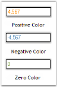
{:.image }

The methods associated with the above properties are given below.

_Table_ _269__: Methods Table_

<table>
<tr>
<td>
Methods</td><td>
Description</td></tr>
<tr>
<td>
ResetForeColor</td><td>
Resets the forecolor of the control to it's default value.</td></tr>
<tr>
<td>
ResetPositiveColor</td><td>
Resets the PositiveColor property to it's default value.</td></tr>
<tr>
<td>
ResetNegativeColor</td><td>
Resets the NegativeColor property to it's default value.</td></tr>
<tr>
<td>
ResetZeroColor</td><td>
Resets the ZeroColor property to it's default value.</td></tr>
<tr>
<td>
SetControlColor</td><td>
Sets the forecolor of the control depending on whether the current value is negative.</td></tr>
<tr>
<td>
ShouldSerializePositiveColor</td><td>
Serializes the PositiveColor property.</td></tr>
<tr>
<td>
ShouldSerializeNegativeColor</td><td>
Serializes the NegativeColor property.</td></tr>
<tr>
<td>
ShouldSerializeZeroColor</td><td>
Serializes the ZeroColor property.</td></tr>
</table>

A sample which demonstrates the Foreground Settings of IntegerTextBox control is available in the below sample installation path.

…\_My Documents\Syncfusion\EssentialStudio\Version Number\Windows\Tools.Windows\Samples\Advanced Editor Functions\ActionGroupingDemo_

Behavior Settings

The behavior settings of the IntegerTextBox control are discussed below.

Negative Key Settings

The integer value of the IntegerTextBox can be reset or changed to a negative value using the properties given below.

_Table_ _270__: Property Table_

<table>
<tr>
<td>
IntegerTextBox Properties</td><td>
Description</td></tr>
<tr>
<td>
DeleteSelectionOnNegative</td><td>
This property defines the behavior when the contents of the IntegerTextBox is fully selected and the negative key is pressed by the user.When set to 'True', the current value is replaced by the default value.When set to 'False', the current value is changed to the negative value immediately.</td></tr>
<tr>
<td>
NegativeInputPendingOnSelectAll</td><td>
This property defines the behavior when the contents of the IntegerTextBox is fully selected and the negative key is pressed by the user.When set to 'True', the current value is not changed at all. The next key stroke is taken to be a new value and the entire contents of the IntegerTextBox is replaced by the negative value of the key stroke character entered.When set to 'False', the current value is changed to the negative value immediately.</td></tr>
</table>

[C#]

this.integerTextBox1.DeleteSelectionOnNegative = true;

this.integerTextBox1.NegativeInputPendingOnSelectAll = true;

[VB.NET]

Me.integerTextBox1.DeleteSelectionOnNegative = True

Me.integerTextBox1.NegativeInputPendingOnSelectAll = True

AllowLeadingZeros

This property can be used to include zeros before the beginning value of the integer value of the control.

_Table_ _271__: Property Table_

<table>
<tr>
<td>
IntegerTextBox Property</td><td>
Description</td></tr>
<tr>
<td>
AllowLeadingZeros</td><td>
Indicates whether to allow insets zero in the beginning value. The default value is set to 'False'.</td></tr>
</table>

[C#]

this.integerTextBox1.AllowLeadingZeros = true;

[VB.NET]

Me.integerTextBox1.AllowLeadingZeros = True

{:.image }

Border Settings

Color and Styles can be applied to the border of the IntegerTextBox control as discussed below.

_Table_ _272__: Property Table_

<table>
<tr>
<td>
IntegerTextBox Properties</td><td>
Description</td></tr>
<tr>
<td>
Border3DStyle</td><td>
Indicates the style of the 3D border. The options included are as follows:{{ _RaisedOuter,_ | markdownify }}{{ _SunkenOuter,_ | markdownify }}{{ _RaisedInner,_ | markdownify }}{{ _SunkenInner,_ | markdownify }}{{ _Raised,_ | markdownify }}{{ _Etched,_ | markdownify }}{{ _Bump,_ | markdownify }}{{ _Sunken,_ | markdownify }}{{ _Adjust and_ | markdownify }}{{ _Flat._ | markdownify }}The default value is set to 'Sunken'.</td></tr>
<tr>
<td>
BorderColor</td><td>
Specifies the color of the 2D border.</td></tr>
<tr>
<td>
BorderSides</td><td>
Indicates the border sides of the panel. The options are as follows.{{ _Left,_ | markdownify }}{{ _Top,_ | markdownify }}{{ _Right,_ | markdownify }}{{ _Bottom,_ | markdownify }}{{ _Middle and_ | markdownify }}{{ _All._ | markdownify }}</td></tr>
<tr>
<td>
BorderStyle</td><td>
Indicates whether the edit control should have a border. The options included are given below:{{ _FixedSingle,_ | markdownify }}{{ _Fixed3D and_ | markdownify }}{{ _None._ | markdownify }}</td></tr>
</table>

[C#]

this.integerTextBox1.Border3DStyle = System.Windows.Forms.Border3DStyle.Bump;

this.integerTextBox1.BorderColor = System.Drawing.Color.Red;

this.integerTextBox1.BorderSides = System.Windows.Forms.Border3DSide.All;

this.integerTextBox1.BorderStyle = System.Windows.Forms.BorderStyle.FixedSingle;

[VB.NET]

Me.integerTextBox1.Border3DStyle = System.Windows.Forms.Border3DStyle.Bump

Me.integerTextBox1.BorderColor = System.Drawing.Color.Red

Me.integerTextBox1.BorderSides = System.Windows.Forms.Border3DSide.All

Me.integerTextBox1.BorderStyle = System.Windows.Forms.BorderStyle.FixedSingle

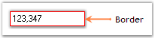
{:.image }

A sample which demonstrates the Border Settings of IntegerTextBox control is available in the below sample installation path.

…\_My Documents\Syncfusion\EssentialStudio\Version Number\Windows\Tools.Windows\Samples\Advanced Editor Functions\ActionGroupingDemo_

Key Settings

Sometimes there may be some situation for entering large values, like in Mega, Kilo etc., In such situations, if we add some sort of keyboard support, it will be very much useful for the users.

For example if the user wants to enter 32000, he just needs to enter 32 and then press the 'K'. The value will change to 32000 automatically. This is illustrated in the code snippet given below.

[C#]

private void integerTextBox1_KeyDown(object sender, KeyEventArgs e)

{

long v = integerTextBox1.IntegerValue;

switch(e.KeyCode)

{

// Enter the value as multiples of thousand.

case Keys.G : v = v * 1000000000;

break;

case Keys.M : v = v * 1000000;

break;

case Keys.K : v = v * 1000;

break;

}

integerTextBox.IntegerValue = v;

}

[VB.NET]

Private Sub integerTextBox1_KeyDown(ByVal sender As Object, ByVal e As KeyEventArgs)

Dim v As Long = integerTextBox1.IntegerValue

Select e.KeyCode

' Enter the value as multiples of thousand.

Case Keys.G

v = v * 1000000000

Case Keys.M

v = v * 1000000

Case Keys.K

v = v * 1000

End Select

integerTextBox1.IntegerValue = v

End Sub

Shortcut Keys

Sometimes there may be some situations for incrementing or decrementing the value in the IntegerTextBox. In such situations, it is better to use shortcut keys.

The following implementation will illustrate how this can be achieved. Here we are using Up and Down keys for incrementing and decrementing respectively. We cannot use the '-' key, because it is already reserved to enter the minus sign.

[C#]

private void integerTextBox1_KeyDown(object sender, KeyEventArgs e)

{

long v = integerTextBox1.IntegerValue;

switch(e.KeyCode)

{

// Increments and decrements values.

case Keys.Up : v++;

break;

case Keys.Down : v--;

break;

}

integerTextBox1.IntegerValue = v;

}

[VB.NET]

Private Sub integerTextBox1_KeyDown(ByVal sender As Object, ByVal e As KeyEventArgs)

Dim v As Long = integerTextBox1.IntegerValue

Select e.KeyCode

' Increments and decrements values.

Case Keys.Up

v = v+1

Case Keys.Down

v = v-1

End Select

integerTextBox1.IntegerValue = v

End Sub

Applying Themes

Themes can be applied to the IntegerTextBox control using the property given below.

_Table_ _273__: Property Table_

<table>
<tr>
<td>
IntegerTextBox Property</td><td>
Description</td></tr>
<tr>
<td>
ThemesEnabled</td><td>
Specifies whether or not to use XP themes, when BorderStyle property is set to 'Fixed3D'.</td></tr>
</table>
> 
{:.image }
 _Note: Refer_ [Border Settings](http://help.syncfusion.com/ug_82/WindowsFormsUI_Tools/BorderSettings13.html) _topic to know about the BorderStyle property._

[C#]

this.integerTextBox1.ThemesEnabled = true;

[VB.NET]

Me.integerTextBox1.ThemesEnabled = true

{:.image }

A sample which demonstrates the ThemesEnabled property of the IntegerTextBox control is available in the below sample installation path.

…\_My Documents\Syncfusion\EssentialStudio\Version Number\Windows\Tools.Windows\Samples\Advanced Editor Functions\ActionGroupingDemo_

###### IntegerTextBox Events

The list of events and a detailed explanation about each of them is given in the following sections.

_Table_ _274__: Events Table_

<table>
<tr>
<td>
IntegerTextBox Events</td><td>
Description</td></tr>
<tr>
<td>
BindableValueChanged</td><td>
This event occurs when the BindableValue property is changed.</td></tr>
<tr>
<td>
ClipTextChanged</td><td>
This event occurs when the ClipText property is changed.</td></tr>
<tr>
<td>
FormattedTextChanged</td><td>
This event occurs when the FormattedText property is changed.</td></tr>
<tr>
<td>
IntegerValueChanged</td><td>
This event occurs when the IntegerValue property is changed.</td></tr>
<tr>
<td>
SetNull</td><td>
This event occurs when the NULL state is to be set based on a value.</td></tr>
<tr>
<td>
ValidationError</td><td>
This event occurs when the input text is invalid for the current state of the control.</td></tr>
</table>
BindableValueChanged

This event occurs when the BindableValue property is changed. The BindableValue property is a wrapper property that indicates the value. This property can be used to set the value of the control to 'Null'.

The event handler receives an argument of type EventArgs containing data related to this event.

[C#]

private void integerTextBox1_BindableValueChanged(object sender, EventArgs e)

{

Console.WriteLine(" BindableValueChanged event is raised ");

}

[VB.NET]

Private Sub integerTextBox1_BindableValueChanged(ByVal sender As Object, ByVal e As EventArgs)

Console.WriteLine(" BindableValueChanged event is raised ")

End Sub

ClipTextChanged

This event occurs when the ClipText property is changed. The ClipText property returns the clipped text without the formatting.

The event handler receives an argument of type EventArgs containing data related to this event.

[C#]

private void integerTextBox1_ClipTextChanged(object sender, EventArgs e)

{

Console.WriteLine(" ClipTextChanged event is raised ");

}

[VB.NET]

Private Sub integerTextBox1_ClipTextChanged(ByVal sender As Object, ByVal e As EventArgs)

Console.WriteLine(" ClipTextChanged event is raised ")

End Sub

FormattedTextChanged

This event occurs when the FormattedText property is changed. The FormattedText property returns the formatted text with the formatting.

The event handler receives an argument of type EventArgs containing data related to this event.

[C#]

private void integerTextBox1_FormattedTextChanged(object sender, EventArgs e)

{

Console.WriteLine(" FormattedTextChanged event is raised ");

}

[VB.NET]

Private Sub integerTextBox1_FormattedTextChanged(ByVal sender As Object, ByVal e As EventArgs)

Console.WriteLine(" FormattedTextChanged event is raised ")

End Sub

IntegerValueChanged

This event occurs when the IntegerValue property is changed. The IntegerValue property specifies the integer value of the text.

The event handler receives an argument of type EventArgs containing data related to this event.

[C#]

private void integerTextBox1_IntegerValueChanged(object sender, EventArgs e)

{

Console.WriteLine(" IntegerValueChanged event is raised ");

}

[VB.NET]

Private Sub integerTextBox1_IntegerValueChanged(ByVal sender As Object, ByVal e As EventArgs)

Console.WriteLine(" IntegerValueChanged event is raised ")

End Sub

SetNull

This event occurs when the NULL state is to be set based on a value.

The event handler receives an argument of type SetNullEventArgs containing data related to this event. The following SetNullEventArgs members provide information specific to this event.

_Table_ _275__: Members Table_

<table>
<tr>
<td>
Members</td><td>
Description</td></tr>
<tr>
<td>
Cancel</td><td>
Gets / sets a value indicating whether the event should be canceled.</td></tr>
<tr>
<td>
NullValue</td><td>
Returns the NULL value.</td></tr>
</table>

[C#]

private void integerTextBox1_SetNull(object sender, Syncfusion.Windows.Forms.Tools.SetNullEventArgs e)

{

Console.WriteLine(" SetNull event is raised ");

}

[VB.NET]

Private Sub integerTextBox1_SetNull(ByVal sender As Object, ByVal e AsSyncfusion.Windows.Forms.Tools.SetNullEventArgs)

Console.WriteLine(" SetNull event is raised ")

End Sub

ValidationError

This event occurs when the input text is invalid for the current state of the control.

The event handler receives an argument of type ValidationErrorArgs containing data related to this event. The following ValidationErrorArgs members provide information specific to this event.

_Table_ _276__: Members Table_

<table>
<tr>
<td>
Members</td><td>
Description</td></tr>
<tr>
<td>
ErrorMessage</td><td>
Returns the error message.</td></tr>
<tr>
<td>
InvalidText</td><td>
Returns the invalid text as it would have been if the error had not intercepted it.</td></tr>
<tr>
<td>
StartPosition</td><td>
Returns the location of the invalid input in the invalid text.</td></tr>
</table>

[C#]

private void integerTextBox1_ValidationError(object sender, Syncfusion.Windows.Forms.Tools.ValidationErrorArgs e)

{

Console.WriteLine(" ValidationError event is raised ");

}

[VB.NET]

Private Sub integerTextBox1_ValidationError(ByVal sender As Object, ByVal e AsSyncfusion.Windows.Forms.Tools.ValidationErrorArgs)

Console.WriteLine(" ValidationError event is raised ")

End Sub

###### Frequently Asked Questions

How to display empty string in editor controls when databound value is null?

We can display empty string when data bound value is null. For this we need to bind the editor controls (like IntegerTextBox, DoubleTextBox, etc.,) to BindableValue property and also we need to set AllowNull to true and NullString property to empty string.

Find the code snippet below, which illustrates the same.

[C#]

this.integerTextBox1.NullString = "";

this.integerTextBox1.AllowNull = true;

this.integerTextBox1.DataBindings.Add("BindableValue", boundView, "IntegerField");

[VB.NET]

Me.integerTextBox1.NullString = ""

Me.integerTextBox1. AllowNull = True

Me.integerTextBox1.DataBindings.Add("BindableValue", boundView, "IntegerField")

##### PercentTextBox

The PercentTextBox is a textbox-derived control that can display double data type values in percentage form.

{:.image }

The PercentTextBox is derived from Windows Forms framework textbox control. The PercentTextBox supports display and collection of percentage values. It handles user keyboard input and percent formatting and uses the globalization features of the .NET platform to provide locale-specific formatting.

###### Features

PercentTextBox control is used to display percentage values. It has the following features.

Features

* Display Settings

The [display](http://help.syncfusion.com/ug/windows%20forms/tools/default.htm) settings involve setting the separator to be used to group the numbers and the group size.

It also involves setting the pattern to be used for the positive and negative numbers and symbol to be used to indicate the percent.

* Value Settings

The [value settings](http://help.syncfusion.com/ug/windows%20forms/tools/default.htm) provide options to set the value to be displayed by the PercentTextBox control. It provides options to indicate the null state of the control and customize its settings.

The maximum and minimum value of the control can also be set.

* Culture Settings

The [culture](http://help.syncfusion.com/ug/windows%20forms/tools/default.htm) to be used for formatting the numeric display can be set using the Culture property.

* Text Settings

Text can be selected, formatted, clipped, aligned and displayed from right to left using the [text settings](http://help.syncfusion.com/ug/windows%20forms/tools/default.htm) of the PercentTextBox control.

MultiLine text can be displayed using the control.

* Appearance Settings

The background color and foreground color of the control can be set according to the needs of the user.

The foreground color can be set separately for the positive, negative and null values of the control.

* Behavior Settings

The percent value of the control can be changed to a negative value by selecting it's entire contents and pressing the negative key on the keyboard.

* Border Settings

2D and 3D [border](http://help.syncfusion.com/ug/windows%20forms/tools/default.htm) styles can be applied to the PercentTextBox.

The color of the border can also be set for the control using the BorderColor property.

* Size Settings

The maximum and minimum [size](http://help.syncfusion.com/ug/windows%20forms/tools/default.htm) of the control can be set according to the needs of the user.

* Key Settings

Keyboard support for entering large values is provided. Incrementing and decrementing of values can be done using the up and down arrow [keys](http://help.syncfusion.com/ug/windows%20forms/tools/default.htm).

* Applying Themes

Themes appearance can be provided for the PercentTextBox control.

Key Features

* The PercentTextBox control handles user keyboard input and percent formatting with no code required.
* It is fully compatible with the Windows Forms TextBox and uses the globalization features of the .NET platform to provide locale specific formatting.
* Supports different modes of editing percentage values: PercentMode and DoubleMode.
* The PercentTextBox control supports displaying negative percentage values in a different color and also using different negative formats.
###### Creating PercentTextBox

This section will give a step-by-step procedure to design a PercentTextBox control through designer and also through programmatical approach.

Through Designer

191. Create or open a Windows Forms project.
192. Click on the PercentTextBox Control in the toolbox and add it to the form by dragging-and-dropping it onto the form or double-clicking the control.

{:.image }

193. Run the application. The PercentTextBox will allow you to enter the percent value, which will be displayed as given below.

{:.image }

Through Programmatical Approach

194. Declare an instance of the PercentTextBox control.

[C#]

private Syncfusion.Windows.Forms.Tools.PercentTextBox percentTextBox1;

[VB.NET]

Private percentTextBox1 As Syncfusion.Windows.Forms.Tools.PercentTextBox

195. Initialize the control.

[C#]

this.percentTextBox1 = new Syncfusion.Windows.Forms.Tools.PercentTextBox();

[VB.NET]

Me.percentTextBox1 = New Syncfusion.Windows.Forms.Tools.PercentTextBox()

196. Set the properties of the PercentTextBox control.

[C#]

this.percentTextBox1.Location = new System.Drawing.Point(65, 29);

this.percentTextBox1.Name = "percentTextBox1";

this.percentTextBox1.Size = new System.Drawing.Size(84, 20);

this.percentTextBox1.PercentValue = 5;

[VB.NET]

Me.percentTextBox1.Location = New System.Drawing.Point(65, 29)

Me.percentTextBox1.Name = "numericUpDownExt1"

Me.percentTextBox1.Size = New System.Drawing.Size(84, 20)

Me.percentTextBox1.PercentValue = 5

197. Add the control to the form.

[C#]

this.Controls.Add(this.percentTextBox1);

[VB.NET]

Me.Controls.Add(Me.percentTextBox1)

198. Run the application.

{:.image }

###### Concepts and Features

The following Editors controls (DoubleTextBox, IntegerTextBox, PercentTextBox, and CurrencyTextBox) have been revamped, click here to see the details of revamping.

Display Settings

This section discusses the display settings of the PercentTextBox control.

The PercentTextBox provides a list of properties to set the display characteristics of the percentage.

_Table_ _277__: Property Table_

<table>
<tr>
<td>
PercentTextBox Properties</td><td>
Description</td></tr>
<tr>
<td>
PercentDecimalDigits</td><td>
Gets / sets the maximum number of digits for the decimal portion of the percentage.</td></tr>
<tr>
<td>
PercentDecimalSeparator</td><td>
Gets / sets the decimal separator character that will be used for the display.</td></tr>
<tr>
<td>
PercentGroupSeparator</td><td>
Gets / sets the separator to be used for grouping digits.</td></tr>
<tr>
<td>
PercentGroupSizes</td><td>
Gets / sets the grouping of percent digits in the PercentTextBox.</td></tr>
<tr>
<td>
PercentNegativePattern</td><td>
Gets / sets the pattern to use when the value is negative.</td></tr>
<tr>
<td>
NegativeSign</td><td>
Gets / sets the sign that is to be used to indicate a negative value.</td></tr>
<tr>
<td>
PercentPositivePattern</td><td>
Gets / sets the pattern to use when the value is positive.</td></tr>
<tr>
<td>
PercentSymbol</td><td>
Gets / sets the percent symbol which represents the Percentage.</td></tr>
</table>

The grouping size of the percent digits can be set using the Int32 Collection Editor which will be displayed on selecting thePercentGroupSizes property in the property grid.

[C#]

this.percentTextBox1.PercentDecimalDigits = 3;

this.percentTextBox1.PercentDecimalSeparator = ".";

this.percentTextBox1.PercentGroupSeparator = ",";

this.percentTextBox1.PercentGroupSizes = new int[] {5};

this.percentTextBox1.PercentNegativePattern = 2;

this.percentTextBox1.NegativeSign = "-";

this.percentTextBox1.PercentPositivePattern = 2;

this.percentTextBox1.PercentSymbol = "%";

[VB.NET]

Me.percentTextBox1.PercentDecimalDigits = 3

Me.percentTextBox1.PercentDecimalSeparator = "."

Me.percentTextBox1.PercentGroupSeparator = ","

Me.percentTextBox1.PercentGroupSizes = New Integer() {5}

Me.percentTextBox1.PercentNegativePattern = 2

Me.percentTextBox1.NegativeSign = "-";

Me.percentTextBox1.PercentPositivePattern = 2

Me.percentTextBox1.PercentSymbol = "%"

The following screen shot illustrates the above settings.

{:.image }

A sample which demonstrates the Display Settings of PercentTextBox control is available in the below sample installation path.

…\_My Documents\Syncfusion\EssentialStudio\Version Number\Windows\Tools.Windows\Samples\Advanced Editor Functions\ActionGroupingDemo_

Value Settings

The various values of the PercentTextBox control and their settings are given below.

_Table_ _278__: Property Table_

<table>
<tr>
<td>
PercentTextBox Properties</td><td>
Description</td></tr>
<tr>
<td>
PercentValue</td><td>
Specifies the double value of the PercentTextBox control.</td></tr>
<tr>
<td>
DefaultValue</td><td>
Specifies the default value. The default value is set to 'Null'.</td></tr>
<tr>
<td>
BindableValue</td><td>
Wrapper property that indicates the value. This property can be used to set the value of the control to 'Null'.</td></tr>
<tr>
<td>
BindablePercentValue</td><td>
Wrapper property that indicates the percent value. This property can be used to set the value of the control to 'Null'.</td></tr>
<tr>
<td>
DoubleValue</td><td>
Gets / sets the double value of the control. This will be formatted and displayed.</td></tr>
</table>

[C#]

this.percentTextBox1.PercentValue = 5;

this.percentTextBox1.DefaultValue = 0;

this.percentTextBox1.BindableValue = 0.05;

this.percentTextBox1.BindablePercentValue = 5;

this.percentTextBox1.DoubleValue = 0.05;

[VB.NET]

Me.percentTextBox1.PercentValue = 5

Me.percentTextBox1.DefaultValue = 0

Me.percentTextBox1.BindableValue = 0.05

Me.percentTextBox1.BindablePercentValue = 5

Me.percentTextBox1.DoubleValue = 0.05

{:.image }

Null Value Settings

There are various settings that can be applied to the PercentTextBox control, when the value of the control is set to 'Null'. These settings are illustrated below.

_Table_ _279__: Property Table_

<table>
<tr>
<td>
PercentTextBox Properties</td><td>
Description</td></tr>
<tr>
<td>
AllowNull</td><td>
Specifies if the NullString will be used when the value is Null.</td></tr>
<tr>
<td>
NullString</td><td>
Specifies the string to be displayed when the DecimalValue is Null.</td></tr>
<tr>
<td>
NullFormat</td><td>
Returns the NumberFormatInfo object for the null display.</td></tr>
</table>

[C#]

this.percentTextBox1.NullString = "Null Value";

this.percentTextBox1.AllowNull = true;

[VB.NET]

Me.percentTextBox1.NullString = "Null Value"

Me.percentTextBox1.AllowNull = True

{:.image }

Min and Max Value Settings

The minimum and maximum values of the IntegerTextBox can be set using the below given properties.

_Table_ _280__: Property Table_

<table>
<tr>
<td>
PercentTextBox Properties</td><td>
Description</td></tr>
<tr>
<td>
MaxValue</td><td>
Gets / sets the maximum value that can be set through the PercentTextBox. The default value is set to '1'.</td></tr>
<tr>
<td>
MinValue</td><td>
Gets / sets the minimum value that can be set through the PercentTextBox. The default value is set to '-1'.</td></tr>
<tr>
<td>
EnforceMinMaxDuringValidating</td><td>
If the min and max values are not met, the Validating event will be handled and cancelled if this property is set to 'True'.</td></tr>
</table>

[C#]

this.percentTextBox1.MaxValue = 6;

this.percentTextBox1.MinValue = -6;

this.percentTextBox1.EnforceMinMaxDuringValidating = true;

[VB.NET]

Me.percentTextBox1.MaxValue = 6

Me.percentTextBox1.MinValue = -6

Me.percentTextBox1.EnforceMinMaxDuringValidating = True

The methods associated with the above properties are given below.

_Table_ _281__: Methods Table_

<table>
<tr>
<td>
Methods</td><td>
Description</td></tr>
<tr>
<td>
ResetMaxValue</td><td>
Resets the MaxValue property to it's default value.</td></tr>
<tr>
<td>
ResetMinValue</td><td>
Resets the MinValue property to it's default value.</td></tr>
</table>
Culture Settings

This section discusses the Culture settings of the PercentTextBox control.

_Table_ _282__: Property Table_

<table>
<tr>
<td>
PercentTextBox Properties</td><td>
Description</td></tr>
<tr>
<td>
Culture</td><td>
Gets / sets the culture that is to be used for formatting the numeric display.</td></tr>
<tr>
<td>
CurrentCultureRefresh</td><td>
Indicates whether the Culture property is to be refreshed when the culture changes.</td></tr>
<tr>
<td>
SpecialCultureValue</td><td>
Gets / sets the mode for the cultures.It includes the below given options.{{ _None,_ | markdownify }}{{ _CurrentCulture,_ | markdownify }}{{ _UICulture and_ | markdownify }}{{ _InstalledCulture._ | markdownify }}</td></tr>
<tr>
<td>
UseUserOverride</td><td>
Specifies if the NumberFormatInfo used for formatting will use the User Overrides for the culture. The default value is set to 'True'.</td></tr>
</table>

[C#]

this.percentTextBox1.Culture = new System.Globalization.CultureInfo("ar-JO");

this.percentTextBox1.CurrentCultureRefresh = true;

this.percentTextBox1.SpecialCultureValue = Syncfusion.Windows.Forms.Tools.SpecialCultureValues.None;

this.percentTextBox1.UseUserOverride = true;

[VB.NET]

Me.percentTextBox1.Culture = New System.Globalization.CultureInfo("ar-JO")

Me.percentTextBox1.CurrentCultureRefresh = True

Me.percentTextBox1.SpecialCultureValue = Syncfusion.Windows.Forms.Tools.SpecialCultureValues.None

Me.percentTextBox1.UseUserOverride = True

{:.image }

> 
{:.image }
 _Note: The RefreshCulture() method can be used to refresh and reapply the culture specific settings._

A sample which demonstrates the Culture Settings of the PercentTextBox control is available in the below sample installation path.

…\_My Documents\Syncfusion\EssentialStudio\Version Number\Windows\Tools.Windows\Samples\Advanced Editor Functions\ActionGroupingDemo_

Text Settings

This section discusses the text settings of the PercentTextBox control.

The text associated with the PercentTextBox control can be set and customized using the below given settings.

_Table_ _283__: Property Table_

<table>
<tr>
<td>
PercentTextBox Properties</td><td>
Description</td></tr>
<tr>
<td>
Text</td><td>
Specifies the text associated with the control.</td></tr>
<tr>
<td>
CharacterCasing</td><td>
Gets / sets the case of character as they are typed.It includes the below given options.{{ _Normal,_ | markdownify }}{{ _Upper and_ | markdownify }}{{ _Lower._ | markdownify }}</td></tr>
<tr>
<td>
TextAlign</td><td>
Indicates how the text should be aligned for edit controls.</td></tr>
<tr>
<td>
SelectedText</td><td>
Gets / sets the selected text in the PercentTextBox.</td></tr>
<tr>
<td>
SelectAllOnFocus</td><td>
Specifies if the text should be selected when the control gets the focus.</td></tr>
<tr>
<td>
SwitchModeOnFocus</td><td>
Indicates whether the PercentTextBox should allow editing in numeric mode, when it receives focus.</td></tr>
<tr>
<td>
HideSelection</td><td>
Indicates that the selection should be hidden when the edit control loses focus.</td></tr>
<tr>
<td>
ClipText</td><td>
Returns the clipped text without the formatting.</td></tr>
<tr>
<td>
DrawActiveWhenDisabled</td><td>
Specifies if the text should be drawn active, even when disabled.</td></tr>
</table>

[C#]

this.percentTextBox1.CharacterCasing = System.Windows.Forms.CharacterCasing.Upper;

this.percentTextBox1.TextAlign = System.Windows.Forms.HorizontalAlignment.Center;

this.percentTextBox1.SelectedText = "34";

this.percentTextBox1.SelectAllOnFocus = true;

this.percentTextBox1.SwitchModeOnFocus = true;

this.percentTextBox1.HideSelection = true;

this.percentTextBox1.ClipText = "34";

this.percentTextBox1.DrawActiveWhenDisabled = true;

[VB.NET]

Me.percentTextBox1.CharacterCasing = System.Windows.Forms.CharacterCasing.Upper

Me.percentTextBox1.TextAlign = System.Windows.Forms.HorizontalAlignment.Center

Me.percentTextBox1.SelectedText = "34"

Me.percentTextBox1.SelectAllOnFocus = true

Me.percentTextBox1.SwitchModeOnFocus = True

Me.percentTextBox1.HideSelection = True

Me.percentTextBox1.ClipText = "34"

Me.percentTextBox1.DrawActiveWhenDisabled = True

{:.image }

{:.image }

{:.image }

The methods associated with the above properties are given below.

_Table_ _284__: Methods Table_

<table>
<tr>
<td>
Methods</td><td>
Description</td></tr>
<tr>
<td>
AppendText</td><td>
Appends text to the current text of a textbox.</td></tr>
<tr>
<td>
ResetText</td><td>
Resets the Text property to its default value.</td></tr>
<tr>
<td>
OnCharacterCasingChanged</td><td>
Raises the CharacterCasingChanged event.</td></tr>
<tr>
<td>
GetClipText</td><td>
Gets / sets the clipped text without the formatting.</td></tr>
<tr>
<td>
Cut</td><td>
Cuts the selected data to the clipboard.</td></tr>
<tr>
<td>
Copy</td><td>
Copies the content of the NumberTextBox to the clipboard. The ClipMode property dictates what gets copied.</td></tr>
<tr>
<td>
Delete</td><td>
Deletes the current selection of the TextBox.</td></tr>
<tr>
<td>
Paste</td><td>
Pastes the data in the clipboard into the NumberTextBox control.</td></tr>
<tr>
<td>
SelectAll</td><td>
Selects all text in the TextBox.</td></tr>
</table>
Multiline Text Settings

The text settings of the PercentTextBox control can be customized to display multiline text using the below given properties.

_Table_ _285__: Property Table_

<table>
<tr>
<td>
PercentTextBox Properties</td><td>
Description</td></tr>
<tr>
<td>
Multiline</td><td>
Controls whether the text of the edit control can span more than one line.</td></tr>
<tr>
<td>
Lines</td><td>
The lines of text in a multiline edit, as an array of string values.</td></tr>
<tr>
<td>
WordWrap</td><td>
Indicates if lines are automatically word-wrapped for multiline edit controls.</td></tr>
<tr>
<td>
ScrollBars</td><td>
Indicates, for multiline edit controls, which scrollbars will be shown for this control.It includes the below given options.{{ _None,_ | markdownify }}{{ _Horizontal,_ | markdownify }}{{ _Vertical and_ | markdownify }}{{ _Both._ | markdownify }}</td></tr>
</table>

[C#]

this.percentTextBox1.Multiline = true;

this.percentTextBox1.WordWrap = true;

this.percentTextBox1.ScrollBars = System.Windows.Forms.ScrollBars.Vertical;

[VB.NET]

Me.percentTextBox1.Multiline = True

Me.percentTextBox1.WordWrap = True

Me.percentTextBox1.ScrollBars = System.Windows.Forms.ScrollBars.Vertical

{:.image }

{:.image }

{:.image }

Clip Mode

The formatting for the text can be enabled or disabled using the property given below.

_Table_ _286__: Property Table_

<table>
<tr>
<td>
PercentTextBox Property</td><td>
Description</td></tr>
<tr>
<td>
ClipMode</td><td>
Determines whether to include or exclude the literal characters in the input mask when doing a copy command.It includes the below given options.{{ _IncludeFormatting and_ | markdownify }}{{ _ExcludeFormatting._ | markdownify }}</td></tr>
</table>

[C#]

this.percentTextBox1.ClipMode = Syncfusion.Windows.Forms.Tools.CurrencyClipModes.IncludeFormatting;

[VB.NET]

Me.percentTextBox1.ClipMode = Syncfusion.Windows.Forms.Tools.CurrencyClipModes.IncludeFormatting

Formatted Text

Formatted text can be displayed using the below given property.

_Table_ _287__: Property Table_

<table>
<tr>
<td>
PercentTextBox Property</td><td>
Description</td></tr>
<tr>
<td>
FormattedText</td><td>
Returns the formatted text with the formatting.</td></tr>
</table>

[C#]

this.percentTextBox1.FormattedText = "Hello";

[VB.NET]

Me.percentTextBox1.FormattedText = "Hello"

RightToLeft

The text can be displayed from right to left for RTL languages using this property.

_Table_ _288__: Property Table_

<table>
<tr>
<td>
PercentTextBox Property</td><td>
Description</td></tr>
<tr>
<td>
RightToLeft</td><td>
Indicates whether the component should draw right-to-left for RTL languages. The default value is set to 'False'.</td></tr>
</table>
> 
{:.image }
 _Note: The RightToLeft property will be automatically set to 'True' for RTL languages._

[C#]

this.percentTextBox1.RightToLeft = System.Windows.Forms.RightToLeft.Yes;

[VB.NET]

Me.percentTextBox1.RightToLeft = System.Windows.Forms.RightToLeft.Yes

{:.image }

> 
{:.image }
 _Note: The ResetRightToLeft() method can be used to reset the RightToLeft property to it's default value._

OverflowIndicatorToolTipText

The tooltip that should be displayed when an overflow of text occurs can be set using the below given properties.

_Table_ _289__: Property Table_

<table>
<tr>
<td>
PercentTextBox Properties</td><td>
Description</td></tr>
<tr>
<td>
OverflowIndicatorToolTipText</td><td>
Specifies the overflow indicator tooltip text.</td></tr>
<tr>
<td>
ShowOverflowIndicator</td><td>
Gets / sets overflow indicator visibility.</td></tr>
<tr>
<td>
ShowOverflowIndicatorToolTip</td><td>
Indicates whether to show the overflow indicator tooltip.</td></tr>
</table>

[C#]

this.percentTextBox1.OverflowIndicatorToolTipText = "Overflow";

this.percentTextBox1.ShowOverflowIndicator = true;

this.percentTextBox1.ShowOverflowIndicatorToolTip = true;

[VB.NET]

Me.percentTextBox1.OverflowIndicatorToolTipText = "Overflow"

Me.percentTextBox1.ShowOverflowIndicator = True

Me.percentTextBox1.ShowOverflowIndicatorToolTip = True

{:.image }

Banner Text Support

The PercentTextBox control can display banner text in the text field, at run time. A BannerTextProvider Component should be available for this purpose. Also, We need to set AllowNull, NullString and Text properties as below to make this feature effective.

[C#]

this.percentTextBox1.AllowNull = true;

this.percentTextBox1.NullString = "";

this.percentTextBox1.Text = "";

[VB.NET]

Me.percentTextBox1.AllowNull = True

Me.percentTextBox1.NullString = ""

Me.percentTextBox1.Text = ""

A sample which demonstrates the Text, Text Align and Overflow Indicator features of the PercentTextBox control is available in the below sample installation path.

…\_My Documents\Syncfusion\EssentialStudio\Version Number\Windows\Tools.Windows\Samples\Advanced Editor Functions\ActionGroupingDemo_

Appearance Settings

Background Settings

The Background settings of the PercentTextBox control are discussed below.

Background Color

The background color of the control can be set using the properties given below.

_Table_ _290__: Property Table_

<table>
<tr>
<td>
PercentTextBox Properties</td><td>
Description</td></tr>
<tr>
<td>
BackColor</td><td>
Specifies the background color of the component.</td></tr>
<tr>
<td>
ReadOnlyBackColor</td><td>
Specifies the backcolor to be used when the control is in the ReadOnly mode.</td></tr>
</table>

[C#]

this.percentTextBox1.BackColor = System.Drawing.Color.LightCyan;

this.percentTextBox1.ReadOnly = true;

this.percentTextBox1.ReadOnlyBackColor = System.Drawing.Color.Pink;

[VB.NET]

Me.percentTextBox1.BackColor = System.Drawing.Color.LightCyan

Me.percentTextBox1.[ReadOnly] = True

Me.percentTextBox1.ReadOnlyBackColor = System.Drawing.Color.Pink

{:.image }

{:.image }

> 
{:.image }
 _Note: The ReadOnly property must be set to 'True' for the above setting to take effect._

The methods associated with the above properties are given below.

_Table_ _291__: Methods Table_

<table>
<tr>
<td>
Methods</td><td>
Description</td></tr>
<tr>
<td>
ResetBackColor</td><td>
Resets the BackColor property to it's default value.</td></tr>
<tr>
<td>
ResetReadOnlyBackColor</td><td>
Resets the ReadOnlyBackColor property to it's default value.</td></tr>
</table>
Foreground Settings

The Foreground settings of the PercentTextBox control are discussed below.

Foreground Color

The foreground color of the control can be set using the properties given below.

_Table_ _292__: Property Table_

<table>
<tr>
<td>
PercentTextBox Properties</td><td>
Description</td></tr>
<tr>
<td>
PositiveColor</td><td>
Gets / sets the forecolor when the current value is positive.</td></tr>
<tr>
<td>
NegativeColor</td><td>
Gets / sets the forecolor when the current value is negative. The default value is set to 'Red'.</td></tr>
<tr>
<td>
ZeroColor</td><td>
Gets / sets the forecolor when the current value is zero.</td></tr>
</table>

[C#]

this.percentTextBox1.PositiveColor = System.Drawing.Color.ForestGreen;

this.percentTextBox1.NegativeColor = System.Drawing.Color.Orange;

this.percentTextBox1.ZeroColor = System.Drawing.Color.Orchid;

[VB.NET]

Me.percentTextBox1.PositiveColor = System.Drawing.Color.ForestGreen

Me.percentTextBox1.NegativeColor = System.Drawing.Color.Orange

Me.percentTextBox1.ZeroColor = System.Drawing.Color.Orchid

{:.image }

The methods associated with the above properties are given below.

_Table_ _293__: Methods Table_

<table>
<tr>
<td>
Methods</td><td>
Description</td></tr>
<tr>
<td>
ResetForeColor</td><td>
Resets the forecolor of the control to it's default value.</td></tr>
<tr>
<td>
ResetPositiveColor</td><td>
Resets the PositiveColor property to it's default value.</td></tr>
<tr>
<td>
ResetNegativeColor</td><td>
Resets the NegativeColor property to it's default value.</td></tr>
<tr>
<td>
ResetZeroColor</td><td>
Resets the ZeroColor property to it's default value.</td></tr>
<tr>
<td>
SetControlColor</td><td>
Sets the forecolor of the control depending on whether the current value is negative.</td></tr>
<tr>
<td>
ShouldSerializePositiveColor</td><td>
Serializes the PositiveColor property.</td></tr>
<tr>
<td>
ShouldSerializeNegativeColor</td><td>
Serializes the NegativeColor property.</td></tr>
<tr>
<td>
ShouldSerializeZeroColor</td><td>
Serializes the ZeroColor property.</td></tr>
</table>

A sample which demonstrates the Foreground Settings of PercentTextBox control is available in the below sample installation path.

…\_My Documents\Syncfusion\EssentialStudio\Version Number\Windows\Tools.Windows\Samples\Advanced Editor Functions\ActionGroupingDemo_

Behavior Settings

The Behavior settings of the PercentTextBox control are discussed below.

NegativeInputPendingOnSelectAll

The percent value of the PercentTextBox can be changed to a negative value using the properties given below.

_Table_ _294__: Property Table_

<table>
<tr>
<td>
PercentTextBox Property</td><td>
Description</td></tr>
<tr>
<td>
NegativeInputPendingOnSelectAll</td><td>
This property defines the behavior when the contents of the IntegerTextBox is fully selected and the negative key is pressed by the user.When set to 'True', the current value is not changed at all. The next key stroke is taken to be a new value and the entire contents of the PercentTextBox is replaced by the negative value of the key stroke character entered.When set to 'False', the current value is changed to the negative value immediately.</td></tr>
</table>

[C#]

this.percentTextBox1.NegativeInputPendingOnSelectAll = true;

[VB.NET]

Me.percentTextBox1.NegativeInputPendingOnSelectAll = True

Border Settings

Color and Styles can be applied to the Border of the PercentTextBox control as discussed below.

_Table_ _295__: Property Table_

<table>
<tr>
<td>
PercentTextBox Properties</td><td>
Description</td></tr>
<tr>
<td>
Border3DStyle</td><td>
Indicates the style of the 3D border. The options included are as follows:{{ _RaisedOuter,_ | markdownify }}{{ _SunkenOuter,_ | markdownify }}{{ _RaisedInner,_ | markdownify }}{{ _SunkenInner,_ | markdownify }}{{ _Raised,_ | markdownify }}{{ _Etched,_ | markdownify }}{{ _Bump,_ | markdownify }}{{ _Sunken,_ | markdownify }}{{ _Adjust and_ | markdownify }}{{ _Flat._ | markdownify }}The default value is set to 'Sunken'.</td></tr>
<tr>
<td>
BorderColor</td><td>
Specifies the color of the 2D border.</td></tr>
<tr>
<td>
BorderSides</td><td>
Indicates the border sides of the panel. The options included are as follows:{{ _Left,_ | markdownify }}{{ _Top,_ | markdownify }}{{ _Right,_ | markdownify }}{{ _Bottom,_ | markdownify }}{{ _Middle and_ | markdownify }}{{ _All._ | markdownify }}</td></tr>
<tr>
<td>
BorderStyle</td><td>
Indicates whether the edit control should have a border. The options included are given below.{{ _FixedSingle,_ | markdownify }}{{ _Fixed3D and_ | markdownify }}{{ _None._ | markdownify }}</td></tr>
</table>

[C#]

this.percentTextBox1.Border3DStyle = System.Windows.Forms.Border3DStyle.Etched;

this.percentTextBox1.BorderColor = System.Drawing.Color.Orange;

this.percentTextBox1.BorderSides = System.Windows.Forms.Border3DSide.All;

this.percentTextBox1.BorderStyle = System.Windows.Forms.BorderStyle.FixedSingle;

[VB.NET]

Me.percentTextBox1.Border3DStyle = System.Windows.Forms.Border3DStyle.Etched

Me.percentTextBox1.BorderColor = System.Drawing.Color.Orange

Me.percentTextBox1.BorderSides = System.Windows.Forms.Border3DSide.All

Me.percentTextBox1.BorderStyle = System.Windows.Forms.BorderStyle.FixedSingle

{:.image }

A Sample which demonstrates the Border Settings of PercentTextBox control is available in the below sample installation path.

…\_My Documents\Syncfusion\EssentialStudio\Version Number\Windows\Tools.Windows\Samples\Advanced Editor Functions\ActionGroupingDemo_

Size Settings

The size of the PercentTextBox control can be set according to the needs of the user using the properties discussed below.

_Table_ _296__: Property Table_

<table>
<tr>
<td>
PercentTextBox Properties</td><td>
Description</td></tr>
<tr>
<td>
MaximumSize</td><td>
Gets / sets the maximum size for the control.</td></tr>
<tr>
<td>
MinimumSize</td><td>
Gets / sets the minimum size for the control.</td></tr>
</table>

[C#]

this.percentTextBox1.MaximumSize = new System.Drawing.Size(100, 25);

this.percentTextBox1.MinimumSize = new System.Drawing.Size(100, 25);

[VB.NET]

Me.percentTextBox1.MaximumSize = New System.Drawing.Size(100, 25)

Me.percentTextBox1.MinimumSize = New System.Drawing.Size(100, 25)

{:.image }

Key Settings

Sometimes there may occur some situations for entering large values, like in Mega, Kilo etc. In such situations if we add some sort of keyboard support, it will be very much useful for the users.

For example if the user wants to enter 32000, he just needs to enter 32 and then press the 'K'. The value will change to 32000 automatically. This is illustrated in the code snippet given below.

[C#]

private void percentTextBox1_KeyDown(object sender, KeyEventArgs e)

{

double v = percentTextBox1.PercentValue;

switch(e.KeyCode)

{

// Enter the value as multiples of thousand.

case Keys.G : v = v * 1000000000;

break;

case Keys.M : v = v * 1000000;

break;

case Keys.K : v = v * 1000;

break;

}

percentTextBox.PercentValue = v;

}

[VB.NET]

Private Sub percentTextBox1_KeyDown(ByVal sender As Object, ByVal e As KeyEventArgs)

Dim v As Double = percentTextBox1.PercentValue

Select e.KeyCode

' Enter the value as multiples of thousand.

Case Keys.G

v = v * 1000000000

Case Keys.M

v = v * 1000000

Case Keys.K

v = v * 1000

End Select

percentTextBox.PercentValue = v

End Sub

Shortcut Keys

Sometimes there may occur some situations for incrementing or decrementing the value in the PercentTextBox. In such situations it is better to use shortcut keys.

The following implementation will illustrate how this can be achieved. Here we are using Up and Down keys for incrementing and decrementing respectively. We cannot use the '-' key because it is already reserved to enter the minus sign.

[C#]

private void percentTextBox1_KeyDown(object sender, KeyEventArgs e)

{

// Increments the PercentTextBoxValue.

double v = percentTextBox1.PercentValue;

switch(e.KeyCode)

{

case Keys.Up : v++;

break;//you can change by a step like v+=10;

case Keys.Down : v--;

break;

}

percentTextBox1.PercentValue = v;

}

[VB.NET]

Private Sub percentTextBox1_KeyDown(ByVal sender As Object, ByVal e As KeyEventArgs)

' Increments the PercentTextBoxValue.

Dim v As Double = percentTextBox1.PercentValue

Select e.KeyCode

Case Keys.Up

v = v+1

Case Keys.Down

v = v-1

End Select

percentTextBox1.PercentValue = v

End Sub

Applying Themes

Themes can be applied to the PercentTextBox control using the property given below.

_Table_ _297__: Property Table_

<table>
<tr>
<td>
PercentTextBox Property</td><td>
Description</td></tr>
<tr>
<td>
ThemesEnabled</td><td>
Specifies whether or not to use XP themes when BorderStyle  property is set to 'Fixed3D'.</td></tr>
</table>
> 
{:.image }
 _Note: Refer_ [Border Settings](http://help.syncfusion.com/ug_82/WindowsFormsUI_Tools/BorderSettings13.html) _topic to know about the BorderStyle property._

[C#]

this.percentTextBox1.ThemesEnabled = true;

[VB.NET]

Me.percentTextBox1.ThemesEnabled = true

{:.image }

A Sample which demonstrates the ThemesEnabled property of the PercentTextBox control is available in the below sample installation path.

…\_My Documents\Syncfusion\EssentialStudio\Version Number\Windows\Tools.Windows\Samples\Advanced Editor Functions\ActionGroupingDemo_

###### PercentTextBox Events

The list of events and a detailed explanation about each of them is given in the following sections.

_Table_ _298__: Events Table_

<table>
<tr>
<td>
PercentTextBox Events</td><td>
Description</td></tr>
<tr>
<td>
BindablePercentValueChanged</td><td>
This event occurs when the BindablePercentValue property is changed.</td></tr>
<tr>
<td>
BindableValueChanged</td><td>
This event occurs when the BindableValue property is changed.</td></tr>
<tr>
<td>
Border3DStyleChanged</td><td>
This event occurs when the Border3DStyle property is changed.</td></tr>
<tr>
<td>
BorderColorChanged</td><td>
This event occurs when the BorderColor property is changed.</td></tr>
<tr>
<td>
BorderSidesChanged</td><td>
This event occurs when the BorderSides property is changed.</td></tr>
<tr>
<td>
BorderStyleChanged</td><td>
This event occurs when the ClipText property is changed.</td></tr>
<tr>
<td>
ClipTextChanged</td><td>
This event occurs when the ClipText property is changed.</td></tr>
<tr>
<td>
DoubleValueChanged</td><td>
This event occurs when the DoubleValue property is changed.</td></tr>
<tr>
<td>
FormattedTextChanged</td><td>
This event occurs when the FormattedText property is changed.</td></tr>
<tr>
<td>
HideSelectionChanged</td><td>
This event occurs when the HideSelection property is changed.</td></tr>
<tr>
<td>
MinimumSizeChanged</td><td>
This event occurs when the MinimumSize property is changed.</td></tr>
<tr>
<td>
MaximumSizeChanged</td><td>
This event occurs when the MaximumSize property is changed.</td></tr>
<tr>
<td>
MultilineChanged</td><td>
This event occurs when the Multiline property is changed.</td></tr>
<tr>
<td>
ReadOnlyChanged</td><td>
This event occurs when the ReadOnly property is changed.</td></tr>
<tr>
<td>
RightToLeftChanged</td><td>
This event occurs when the RightToLeft property is changed.</td></tr>
<tr>
<td>
SetNull</td><td>
This event occurs when the NULL state is to be set based on a value.</td></tr>
<tr>
<td>
TextAlignChanged</td><td>
This event occurs when the TextAlign property is changed.</td></tr>
<tr>
<td>
ThemesEnabledChanged</td><td>
This event occurs when the ThemesEnabled property is changed.</td></tr>
<tr>
<td>
ValidationError</td><td>
This event occurs when the input text is invalid for the current state of the control.</td></tr>
</table>
BindablePercentValueChanged

This event occurs when the BindablePercentValue property is changed. The BindablePercentValue property is a wrapper property that indicates the percent value. This property can be used to set the value of the control to 'Null'.

The event handler receives an argument of type EventArgs containing data related to this event.

[C#]

private void percentTextBox1_BindablePercentValueChanged(object sender, EventArgs e)

{

Console.WriteLine(" BindablePercentValueChanged event is raised ");

}

[VB.NET]

Private Sub percentTextBox1_BindablePercentValueChanged(ByVal sender As Object, ByVal e As EventArgs)

Console.WriteLine(" BindablePercentValueChanged event is raised ")

End Sub

 BindableValueChanged 

This event occurs when the BindableValue property is changed. The BindableValue property is a wrapper property that indicates the value. This property can be used to set the value of the control to 'Null'.

The event handler receives an argument of type EventArgs containing data related to this event.

[C#]

private void percentTextBox1_BindableValueChanged(object sender, EventArgs e)

{

Console.WriteLine(" BindableValueChanged event is raised ");

}

[VB.NET]

Private Sub percentTextBox1_BindableValueChanged(ByVal sender As Object, ByVal e As EventArgs)

Console.WriteLine(" BindableValueChanged event is raised ")

End Sub

Border3DStyleChanged

This event occurs when the Border3DStyle property is changed. The Border3DStyle property indicates the style of the 3D border.

The event handler receives an argument of type EventArgs containing data related to this event.

[C#]

private void percentTextBox1_Border3DStyleChanged(object sender, EventArgs e)

{

Console.WriteLine(" Border3DStyleChanged event is raised ");

}

[VB.NET]

Private Sub percentTextBox1_Border3DStyleChanged(ByVal sender As Object, ByVal e As EventArgs)

Console.WriteLine(" Border3DStyleChanged event is raised ")

End Sub

BorderColorChanged 

This event occurs when the BorderColor property is changed. The BorderColor property indicates the color of the 2D border.

The event handler receives an argument of type EventArgs containing data related to this event.

[C#]

private void percentTextBox1_BorderColorChanged(object sender, EventArgs e)

{

Console.WriteLine(" BorderColorChanged event is raised ");

}

[VB.NET]

Private Sub percentTextBox1_BorderColorChanged(ByVal sender As Object, ByVal e As EventArgs)

Console.WriteLine(" BorderColorChanged event is raised ")

End Sub

BorderSidesChanged 

This event occurs when the BorderSides property is changed. The BorderSides property indicates the border sides of the panel.

The event handler receives an argument of type EventArgs containing data related to this event.

[C#]

private void percentTextBox1_BorderSidesChanged(object sender, EventArgs e)

{

Console.WriteLine(" BorderSidesChanged event is raised ");

}

[VB.NET]

Private Sub percentTextBox1_BorderSidesChanged(ByVal sender As Object, ByVal e As EventArgs)

Console.WriteLine(" BorderSidesChanged event is raised ")

End Sub

BorderStyleChanged 

This event occurs when the BorderStyle property is changed. The BorderStyle property indicates whether the edit control should have a border.

The event handler receives an argument of type EventArgs containing data related to this event.

[C#]

private void percentTextBox1_BorderStyleChanged(object sender, EventArgs e)

{

Console.WriteLine(" BorderStyleChanged event is raised ");

}

[VB.NET]

Private Sub percentTextBox1_BorderStyleChanged(ByVal sender As Object, ByVal e As EventArgs)

Console.WriteLine(" BorderStyleChanged event is raised ")

End Sub

ClipTextChanged 

This event occurs when the ClipText property is changed. The ClipText property returns the clipped text without the formatting.

The event handler receives an argument of type EventArgs containing data related to this event.

[C#]

private void percentTextBox1_ClipTextChanged(object sender, EventArgs e)

{

Console.WriteLine(" ClipTextChanged event is raised ");

}

[VB.NET]

Private Sub percentTextBox1_ClipTextChanged(ByVal sender As Object, ByVal e As EventArgs)

Console.WriteLine(" ClipTextChanged event is raised ")

End Sub

DoubleValueChanged

This event occurs when the DoubleValue property is changed. The DoubleValue property specifies the double value of the PercentTextBox control.

The event handler receives an argument of type EventArgs containing data related to this event.

[C#]

private void percentTextBox1_FormattedTextChanged(object sender, EventArgs e)

{

Console.WriteLine(" DoubleValueChanged event is raised ");

}

[VB.NET]

Private Sub percentTextBox1_FormattedTextChanged(ByVal sender As Object, ByVal e As EventArgs)

Console.WriteLine(" DoubleValueChanged event is raised ")

End Sub

FormattedTextChanged

This event occurs when the FormattedText property is changed. The FormattedText property returns the formatted text with the formatting.

The event handler receives an argument of type EventArgs containing data related to this event.

[C#]

private void percentTextBox1_FormattedTextChanged(object sender, EventArgs e)

{

Console.WriteLine(" FormattedTextChanged event is raised ");

}

[VB.NET]

Private Sub percentTextBox1_FormattedTextChanged(ByVal sender As Object, ByVal e As EventArgs)

Console.WriteLine(" FormattedTextChanged event is raised ")

End Sub

HideSelectionChanged 

This event occurs when the HideSelection property is changed. The HideSelection property indicates that the selection should be hidden when the edit control loses focus.

The event handler receives an argument of type EventArgs containing data related to this event.

[C#]

private void percentTextBox1_HideSelectionChanged(object sender, EventArgs e)

{

Console.WriteLine(" HideSelectionChanged event is raised ");

}

[VB.NET]

Private Sub percentTextBox1_HideSelectionChanged(ByVal sender As Object, ByVal e As EventArgs)

Console.WriteLine(" HideSelectionChanged event is raised ")

End Sub

MinimumSizeChanged 

This event occurs when the MinimumSize property is changed. The MinimumSize property gets / sets the minimum size of the control.

The event handler receives an argument of type EventArgs containing data related to this event.

[C#]

private void percentTextBox1_MinimumSizeChanged(object sender, EventArgs e)

{

Console.WriteLine(" MinimumSizeChanged event is raised ");

}

[VB.NET]

Private Sub percentTextBox1_MinimumSizeChanged(ByVal sender As Object, ByVal e As EventArgs)

Console.WriteLine(" MinimumSizeChanged event is raised ")

End Sub

MaximumSizeChanged 

This event occurs when the MaximumSize property is changed. The MaximumSize property gets / sets the maximum size of the control.

The event handler receives an argument of type EventArgs containing data related to this event.

[C#]

private void percentTextBox1_MaximumSizeChanged(object sender, EventArgs e)

{

Console.WriteLine(" MaximumSizeChanged event is raised ");

}

[VB.NET]

Private Sub percentTextBox1_MaximumSizeChanged(ByVal sender As Object, ByVal e As EventArgs)

Console.WriteLine(" MaximumSizeChanged event is raised ")

End Sub

MultilineChanged 

This event occurs when the Multiline property is changed. The Multiline property controls whether the text of the edit control can span more than one line.

The event handler receives an argument of type EventArgs containing data related to this event.

[C#]

private void percentTextBox1_MultilineChanged(object sender, EventArgs e)

{

Console.WriteLine(" MultilineChanged event is raised ");

}

[VB.NET]

Private Sub percentTextBox1_MultilineChanged(ByVal sender As Object, ByVal e As EventArgs)

Console.WriteLine(" MultilineChanged event is raised ")

End Sub

ReadOnlyChanged 

This event occurs when the ReadOnly property is changed. The ReadOnly property controls whether the text in the edit control can be changed or not.

The event handler receives an argument of type EventArgs containing data related to this event.

[C#]

private void percentTextBox1_ReadOnlyChanged(object sender, EventArgs e)

{

Console.WriteLine(" ReadOnlyChanged event is raised ");

}

[VB.NET]

Private Sub percentTextBox1_ReadOnlyChanged(ByVal sender As Object, ByVal e As EventArgs)

Console.WriteLine(" ReadOnlyChanged event is raised ")

End Sub

RightToLeftChanged 

This event occurs when the RightToLeft property is changed. The RightToLeft property indicates whether the components should be drawn right-to-left for RTL languages.

The event handler receives an argument of type EventArgs containing data related to this event.

[C#]

private void percentTextBox1_RightToLeftChanged(object sender, EventArgs e)

{

Console.WriteLine(" RightToLeftChanged event is raised ");

}

[VB.NET]

Private Sub percentTextBox1_RightToLeftChanged(ByVal sender As Object, ByVal e As EventArgs)

Console.WriteLine(" RightToLeftChanged event is raised ")

End Sub

SetNull 

This event occurs when the NULL state is to be set based on a value.

The event handler receives an argument of type SetNullEventArgs containing data related to this event. The following SetNullEventArgs members provide information specific to this event.

_Table_ _299__: Members Table_

<table>
<tr>
<td>
Members</td><td>
Description</td></tr>
<tr>
<td>
Cancel</td><td>
Gets / sets a value indicating whether the event should be cancelled.</td></tr>
<tr>
<td>
NullValue</td><td>
Returns the NULL value.</td></tr>
</table>

[C#]

private void percentTextBox1_SetNull(object sender, Syncfusion.Windows.Forms.Tools.SetNullEventArgs e)

{

Console.WriteLine(" SetNull event is raised ");

}

[VB.NET]

Private Sub percentTextBox1_SetNull(ByVal sender As Object, ByVal e AsSyncfusion.Windows.Forms.Tools.SetNullEventArgs)

Console.WriteLine(" SetNull event is raised ")

End Sub

TextAlignChanged 

This event occurs when the TextAlign property is changed. The TextAlign property indicates how the text should be aligned for edit controls.

The event handler receives an argument of type EventArgs containing data related to this event.

[C#]

private void percentTextBox1_TextAlignChanged(object sender, EventArgs e)

{

Console.WriteLine(" TextAlignChanged event is raised ");

}

[VB.NET]

Private Sub percentTextBox1_TextAlignChanged(ByVal sender As Object, ByVal e As EventArgs)

Console.WriteLine(" TextAlignChanged event is raised ")

End Sub

ThemesEnabledChanged 

This event occurs when the ThemesEnabled property is changed. The ThemesEnabled property specifies whether or not to use XP Themes when the BorderStyle property is set to 'Fixed3D'.

The event handler receives an argument of type EventArgs containing data related to this event.

[C#]

private void percentTextBox1_ThemesEnabledChanged(object sender, EventArgs e)

{

Console.WriteLine(" ThemesEnabledChanged event is raised ");

}

[VB.NET]

Private Sub percentTextBox1_ThemesEnabledChanged(ByVal sender As Object, ByVal e As EventArgs)

Console.WriteLine(" ThemesEnabledChanged event is raised ")

End Sub

ValidationError

This event occurs when the input text is invalid for the current state of the control.

The event handler receives an argument of type ValidationErrorArgs containing data related to this event. The following ValidationErrorArgs members provide information specific to this event.

_Table_ _300__: Members Table_

<table>
<tr>
<td>
Members</td><td>
Description</td></tr>
<tr>
<td>
ErrorMessage</td><td>
Returns the error message.</td></tr>
<tr>
<td>
InvalidText</td><td>
Returns the invalid text as it would have been if the error had not intercepted it.</td></tr>
<tr>
<td>
StartPosition</td><td>
Returns the location of the invalid input in the invalid text.</td></tr>
</table>

[C#]

private void percentTextBox1_ValidationError(object sender, Syncfusion.Windows.Forms.Tools.ValidationErrorArgs e)

{

Console.WriteLine(" ValidationError event is raised ");

}

[VB.NET]

Private Sub percentTextBox1_ValidationError(ByVal sender As Object, ByVal e AsSyncfusion.Windows.Forms.Tools.ValidationErrorArgs)

Console.WriteLine(" ValidationError event is raised ")

End Sub

##### CurrencyTextBox

Essential Tools provides the CurrencyTextBox control for currency specific behavior in edit controls. CurrencyTextBox is derived from System.Windows.Forms.TextBox and implements all the functionality needed for formatting currency input and validation.

{:.image }

The text box control provided with Windows Forms is capable of displaying and editing string values. This control is generic in nature and some custom enhancements are needed to be able to effectively collect numeric data. For example, if you are   allowed to enter only currency values, the following enhancements will have to be added to the text box control.

* Keyboard input validation - Intercept user's keyboard input and prevent entry of any keys that shouldn't be present in a currency value.
* Data type - Provide the text contained in the text box as an appropriate data type (such as decimal) that can be used by the developer.
* Culture formatting - Ensure that the formatting of the display is culture sensitive.
###### Features

Currency TextBox is used to display currency values and contains following features.

* Keyboard Shortcuts can be provided.
* Colors can be provided for positive, negative and zero currency values.
* Overflow indicator can be provided when currency value goes beyond control's size.
* Culture and culture specific values can be specified.
* Rich set of border styles can be provided.
* You can make the control active, even when it is disabled.
* The digits displayed after the decimal point can be modified and set to the user requirement.
###### Creating Currency TextBox

CurrencyTextBox provides full support for the windows forms designer. Just drag and drop CurrencyTextBox from the toolbox, onto the form.

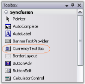
{:.image }

It can be created programmatically as follows.

199. Include the required namespace.

[C#]

using Syncfusion.Windows.Forms.Tools;

[VB.NET]

Imports Syncfusion.Windows.Forms.Tools

200. Create an instance of the CurrencyTextBox. Add that instance to the Form.

[C#]

private Syncfusion.Windows.Forms.Tools.CurrencyTextBox currencyTextBox1;

this.currencyTextBox2=new Syncfusion.Windows.Forms.Tools.CurrencyTextBox();

this.Controls.Add(this.currencyTextBox1);

[VB.NET]

Private currencyTextBox1 As Syncfusion.Windows.Forms.Tools.CurrencyTextBox

Me.currencyTextBox2 = New Syncfusion.Windows.Forms.Tools.CurrencyTextBox()

Me.Controls.Add(Me.currencyTextBox1)

###### Concepts and Features

The following topics will help you become more familiar in using the CurrencyTextBox control.

The following Editors controls (DoubleTextBox, IntegerTextBox, PercentTextBox, and CurrencyTextBox) have been revamped, click here to see the details of revamping.

###### Text Field

The text field of a CurrencyTextBox control can be customized using the properties available. The below image illustrates the various sections of the control.

{:.image }

Text

The default text in the CurrencyTextBox can be edited through Text property. Default value is $2.00. The text can be aligned to Left, Right or Center using TextAlign property.

[C#]

this.currencyTextBox2.Text = "$25.00";

this.currencyTextBox1.TextAlign = System.Windows.Forms.HorizontalAlignment.Right;

[VB.NET]

Me.currencyTextBox2.Text = "$25.00"

Me.currencyTextBox1.TextAlign = System.Windows.Forms.HorizontalAlignment.Right

{:.image }

Multiline Feature

The CurrencyTextBox control can be made multiline by setting Multiline property to true. Using the below properties we can control the behavior of control. 

_Table_ _301__: Property Table_

<table>
<tr>
<td>
CurrencyTextBox Properties</td><td>
Description</td></tr>
<tr>
<td>
Lines</td><td>
This property can hold an array of string values when multiline feature is enabled.</td></tr>
<tr>
<td>
WordWrap</td><td>
Setting this property to true, will automatically wrap the digits if the textbox is resized.</td></tr>
<tr>
<td>
ScrollBar</td><td>
We can show scrollbars for the control when multiline feature is enabled. The different options are,Horizontal - Displays horizontal scrollbar,Vertical - Displays vertical scrollbar,Both - Enables horizontal scrollbar, when WordWrap = false  and enables vertical scrollbar when WordWrap is set to true, andNone.</td></tr>
</table>

[C#]

this.currencyTextBox1.Multiline = true;

this.currencyTextBox2.Text = "$12,456,456,456,456,456,456,456.00";

this.currencyTextBox2.WordWrap = "true"

this.currencyTextBox1.ScrollBars = System.Windows.Forms.ScrollBars.Both;

[VB.NET]

Me.currencyTextBox1.Multiline = True

Me.currencyTextBox2.Text = "$12,456,456,456,456,456,456,456.00"

Me.currencyTextBox2.WordWrap = True

Me.currencyTextBox1.ScrollBars = System.Windows.Forms.ScrollBars.Both

{:.image }

{:.image }

{:.image }

Password Character

We can display password characters instead of the digits in the text field using PasswordChar property. To use the system password character in the text field, set UseSystemPasswordChar property to true.

[C#]

this.currencyTextBox1.UseSystemPasswordChar = false;

this.currencyTextBox1.PasswordChar = '*';

[VB.NET]

Me.currencyTextBox1.UseSystemPasswordChar = False

Me.currencyTextBox1.PasswordChar = '*'

{:.image }

Banner Text Support

We can set banner text for the CurrencyTextBox control. Refer BannerTextProvider Component topic for more details.

We need to do the below settings to make Banner text feature available for the control.

[C#]

this.currencyTextBox1.AllowNull = true;

this.currencyTextBox1.NullString = "";

this.currencyTextBox1.Text = "";

[VB.NET]

Me.currencyTextBox1.AllowNull = True

Me.currencyTextBox1.NullString = ""

Me.currencyTextBox1.Text = ""

{:.image }

Number and Decimal Digits

The CurrencyTextBox text field has a number part and a decimal part. The properties which controls appearance and behavior of the text field are discussed in this section.

Number part

The below properties lets you decide the formatting of the number part of CurrencyTextBox control.

_Table_ _302__: Property Table_

<table>
<tr>
<td>
CurrencyTextBox Properties</td><td>
Description</td></tr>
<tr>
<td>
CurrencyNumberDigits</td><td>
Specifies the number of digits for the number part. This is not part of the globalization structure. The default value is 27.</td></tr>
<tr>
<td>
CurrencyPositivePattern</td><td>
This property specifies the pattern to use when the value is positive.</td></tr>
<tr>
<td>
CurrencyNegativePattern</td><td>
This property specifies the pattern to use when the value is negative. For example, set CurrencyNegativePattern to be 2 or 3 and then hit -ve symbol, you will know the change of display.</td></tr>
</table>

[C#]

this.currencyTextBox1.NumberDigits = 10;

this.currencyTextBox1.CurrencyPositivePattern = 1;

this.currencyTextBox1.CurrencyNegativePattern = 2;

[VB.NET]

Me.currencyTextBox1.NumberDigits = 10

Me.currencyTextBox1.CurrencyPositivePattern = 1

Me.currencyTextBox1.CurrencyNegativePattern = 2

Decimal Part

The below properties lets you decide the formatting of the CurrencyTextBox control's number part.

_Table_ _303__: Property Table_

<table>
<tr>
<td>
CurrencyTextBox Properties</td><td>
Description</td></tr>
<tr>
<td>
CurrencyDecimalDigits</td><td>
Gets or sets the maximum number of digits for the decimal portion of the currency. The default value is 2.</td></tr>
<tr>
<td>
CurrencyDecimalSeparator</td><td>
Gets or sets the decimal separator character that will be used for the display. The default decimal character '.' can be overridden by other special characters that can be specified by this property.</td></tr>
<tr>
<td>
CurrencyGroupSeparator</td><td>
Gets or sets the separator used for grouping the digits.</td></tr>
<tr>
<td>
CurrencyGroupSizes</td><td>
Gets or sets the grouping of CurrencyDigits in the CurrencyTextBox.</td></tr>
<tr>
<td>
DecimalValue</td><td>
Specifies the decimal value of the control. Decimal values can be entered in the CurrencyTextBox by clicking inside the decimal part of the text and then typing. Alternatively, the decimal character can be entered by clicking on the decimal character on the keyboard first and the cursor will move to the decimal part of the text. The decimal part is truncated based on the number of characters allowed.</td></tr>
<tr>
<td>
RemoveDecimalZeros</td><td>
Specifies whether to remove last decimal zeros in the currency value.</td></tr>
</table>

{:.image }

[C#]

this.currencyTextBox1.CurrencyDecimalDigits = 3;

this.currencyTextBox1.CurrencyDecimalSeparator = ".";

this.currencyTextBox1.CurrencyGroupSeparator = ",";

this.currencyTextBox1.CurrencyGroupSizes = new int[] {3};

this.currencyTextBox1.RemoveDecimalZeros = true;

[VB.NET]

Me.currencyTextBox1.CurrencyDecimalDigits = 3

Me.currencyTextBox1.CurrencyDecimalSeparator = "."

Me.currencyTextBox1.CurrencyGroupSeparator = ","

Me.currencyTextBox1.CurrencyGroupSizes = New Integer() {3}

Me.currencyTextBox1.RemoveDecimalZeros = True

{:.image }

{:.image }

Negative Part

The default negative sign '-' can be changed by NegativeSign property to any other special characters. We can specify the behavior of the Currency TextBox by NegativeInputPendingOnSelectAll when its content is fully selected and negative key is pressed by the user. When NegativeInputPendingOnSelectAll set to 'True', the current value is not changed. The next key stroke is taken to a new value and the entire content of the TextBox is replaced by the negative value of the key stroke entered.

For example, if the current value of the TextBox is 1.00 with all the text being selected and when the user presses the negative key followed by key 5, the value will be  '-5'.

When it is set to false, the current value is changed to negative value immediately. For example, if the current value of the TextBox is 1.00 awith all the text being selected and when the user presses the negative key, the value is '-1'.

[C#]

this.currencyTextBox1.NegativeSign = "-";

this.currencyTextBox1.NegativeInputPendingOnSelectAll = true;

[VB.NET]

Me.currencyTextBox1.NegativeSign = "-"

Me.currencyTextBox1.NegativeInputPendingOnSelectAll = True

Values

The maximum and minimum value of the currency can be specified by MaxValue and MinValue properties.

_Table_ _304__: Property Table_

<table>
<tr>
<td>
CurrencyTextBox Properties</td><td>
Description</td></tr>
<tr>
<td>
MaxValue</td><td>
It sets the maximum value to the currency TextBox. The default value is 79228162514264337593543950335.</td></tr>
<tr>
<td>
MinValue</td><td>
It sets the minimum value to the currency TextBox. The default value is 79228162514264337593543950335.</td></tr>
<tr>
<td>
EnforceMinMaxDuringValidating</td><td>
If the minimum and maximum values are not met, the validating event will be handled and cancelled if this property is set to true.</td></tr>
</table>

[C#]

this.currencyTextBox1.MaxValue=10;

this.currencyTextBox1.MinValue=0;

this.currencyTextBox1.EnforceMinMaxDuringValidating= true;

[VB.NET]

Me.currencyTextBox1.MaxValue=10

Me.currencyTextBox1.MinValue=0

Me.currencyTextBox1.EnforceMinMaxDuringValidating = True;

Null String

If you want to display null string instead of actual [decimal](http://help.syncfusion.com/ug_82/WindowsFormsUI_Tools/DecimalSettings.html) values, you can set NullString property to any values. To display the null string set AllowNull to true.

_Table_ _305__: Property Table_

<table>
<tr>
<td>
CurrencyTextBox Properties</td><td>
Description</td></tr>
<tr>
<td>
NullString</td><td>
Sets the Null string to be displayed when the decimal value is zero.</td></tr>
<tr>
<td>
AllowNull</td><td>
Specifies if the NullString will be used when the value is Null.NullString must be set to true.</td></tr>
</table>

[C#]

this.currencyTextBox1.NullString = "NULL";

this.currencyTextBox1.AllowNull = true;

[VB.NET]

Me.currencyTextBox1.NullString = "NULL"

Me.currencyTextBox1.AllowNull = True

{:.image }

Currency Symbol

The currency symbol that will be used for formatting the display is specified by setting CurrencySymbol to any special characters.

_Table_ _306__: Property Table_

<table>
<tr>
<td>
CurrencyTextBox Property</td><td>
Description</td></tr>
<tr>
<td>
CurrencySymbol</td><td>
This property specifies the currency symbol to be used in the CurrencyTextBox. The default value is '$'.</td></tr>
</table>

[C#]

this.currencyTextBox1.CurrencySymbol = "#";

[VB.NET]

Me.currencyTextBox1.CurrencySymbol = "#"

###### Appearance

Themes

CurrencyTextBox control can be themed by setting ThemesEnabled to true.

_Table_ _307__: Property Table_

<table>
<tr>
<td>
CurrencyTextBox Property</td><td>
Description</td></tr>
<tr>
<td>
ThemesEnabled</td><td>
Specifies whether the CurrencyTextBox control uses XP themes, when BorderStyle is set to Fixed3D.</td></tr>
</table>

[C#]

this.currencyTextBox1.ThemesEnabled = true;

[VB.NET]

Me.currencyTextBox1.ThemesEnabled = True

{:.image }

Border Styles

The below properties describes various properties available to set border for the CurrencyTextBox control.

_Table_ _308__: Property Table_

<table>
<tr>
<td>
CurrencyTextBox Properties</td><td>
Description</td></tr>
<tr>
<td>
BorderStyle</td><td>
Sets the style of the border. The options includes:FixedSingle,Fixed3D andNone (Default).</td></tr>
<tr>
<td>
Border3DStyle</td><td>
Sets 3D border style of the CurrencyTextBox when the BorderStyle is in Fixed3D. The options includes:{{ _Raised,_ | markdownify }}{{ _RaisedOuter,_ | markdownify }}{{ _RaisedInner,_ | markdownify }}{{ _Sunken (default),_ | markdownify }}{{ _SunkenOuter,_ | markdownify }}{{ _SunkenInner,_ | markdownify }}{{ _Etched,_ | markdownify }}{{ _Bump,_ | markdownify }}{{ _Adjust and_ | markdownify }}{{ _Flat._ | markdownify }}</td></tr>
<tr>
<td>
BorderSides</td><td>
Specifies the border sides. The options includes{{ _Left,_ | markdownify }}{{ _Top,_ | markdownify }}{{ _Right,_ | markdownify }}{{ _Bottom,_ | markdownify }}{{ _Middle and_ | markdownify }}{{ _All (default)._ | markdownify }}</td></tr>
<tr>
<td>
BorderColor</td><td>
Specifies the color of the border when BorderStyle is FixedSingle.</td></tr>
</table>

[C#]

this.currencyTextBox1.BorderStyle = System.Windows.Forms.BorderStyle.FixedSingle;

this.currencyTextBox1.Border3DStyle = System.Windows.Forms.Border3DStyle.Flat;

this.currencyTextBox1.BorderColor = System.Drawing.Color.Magenta;

this.currencyTextBox1.BorderSides = System.Windows.Forms.Border3DSide.All;

[VB.NET]

Me.currencyTextBox1.BorderStyle = System.Windows.Forms.BorderStyle.FixedSingle

Me.currencyTextBox1.Border3DStyle = System.Windows.Forms.Border3DStyle.Flat

Me.currencyTextBox1.BorderColor = System.Drawing.Color.Magenta

Me.currencyTextBox1.BorderSides = System.Windows.Forms.Border3DSide.All

{:.image }

Color Settings

We can set different colors for the different set of currency values i.e, Colors can be set for positive currency values, negative currency values and zero values by using the below properties. We can draw the background of Currency TextBox with colors when it is in read only mode by ReadOnlyBackColor.

_Table_ _309__: Property Table_

<table>
<tr>
<td>
CurrencyTextBox Properties</td><td>
Description</td></tr>
<tr>
<td>
PositiveColor</td><td>
Specifies Forecolor when the current value is positive.</td></tr>
<tr>
<td>
NegativeColor</td><td>
Specifies Forecolor when the current value is negative.</td></tr>
<tr>
<td>
ReadOnlyBackColor</td><td>
Specifies the color to be used for back color when the control is read only. Set ReadOnly to 'true'.</td></tr>
<tr>
<td>
ZeroColor</td><td>
Specifies Forecolor when the current value is Zero.</td></tr>
</table>

[C#]

this.currencyTextBox1.PositiveColor = System.Drawing.Color.Blue;

this.currencyTextBox1.NegativeColor = System.Drawing.Color.Red;

this.currencyTextBox1.ReadOnlyBackColor = System.Drawing.Color.Linen;

this.currencyTextBox1.ZeroColor = System.Drawing.Color.DarkOrange;

[VB.NET]

Me.currencyTextBox1.PositiveColor = System.Drawing.Color.Blue

Me.currencyTextBox1.NegativeColor = System.Drawing.Color.Red

Me.currencyTextBox1.ReadOnlyBackColor = System.Drawing.Color.Linen

Me.currencyTextBox1.ZeroColor = System.Drawing.Color.DarkOrange

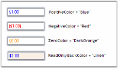
{:.image }

###### Advanced Features

Clipboard Support

The CurrencyTextBox control also provides support for clipboard operations that are compatible with currency data. TheClipMode property specifies if formatting characters are to be copied to the clipboard.

_Table_ _310__: Property Table_

<table>
<tr>
<td>
CurrencyTextBox Property</td><td>
Description</td></tr>
<tr>
<td>
ClipMode</td><td>
Specifies whether to include or exclude literal characters in input mask while doing copy command. The options are,{{ _ExcludeFormatting and_ | markdownify }}{{ _IncludeFormatting._ | markdownify }}</td></tr>
</table>

[C#]

this.currencyTextBox1.ClipMode = Syncfusion.Windows.Forms.Tools.CurrencyClipModes.ExcludeFormatting;

[VB.NET]

Me.currencyTextBox1.ClipMode = Syncfusion.Windows.Forms.Tools.CurrencyClipModes.ExcludeFormatting

{:.image }

Overflow Indicator

You can display an indicator in the textbox, when the currency value is displayed, beyond its boundaries. We can also display tooltip for the overflow indicator. The tooltip text is specified in OverflowIndicatorToolTipText.Set ShowOverflowIndicatorproperty to true to enable this feature. Set ShowOverflowIndicatorToolTip property to true to display the tooltip text.

[C#]

this.currencyTextBox1.OverflowIndicatorToolTipText = "Overflow";

this.currencyTextBox1.ShowOverflowIndicator = true;

this.currencyTextBox1.ShowOverflowIndicatorToolTip = true;

[VB.NET]

Me.currencyTextBox1.OverflowIndicatorToolTipText = "Overflow"

Me.currencyTextBox1.ShowOverflowIndicator = True

Me.currencyTextBox1.ShowOverflowIndicatorToolTip = True

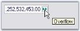
{:.image }

Globalization

The CurrencyTextBox class is globalization aware and uses System.Globalization.CultureInfo for locale-specific information. You can set the control's culture to any installed culture through its culture property.

_Table_ _311__: Property Table_

<table>
<tr>
<td>
CurrencyTextBox Properties</td><td>
Description</td></tr>
<tr>
<td>
Culture</td><td>
It sets the culture that is used for formatting the numeric display.</td></tr>
<tr>
<td>
CurrentCultureRefresh</td><td>
Specifies whether the culture property is to be refreshed when the culture changes.</td></tr>
<tr>
<td>
SpecialCultureValue</td><td>
It sets the mode for the cultures. The options includes:{{ _None,_ | markdownify }}{{ _CurrentCulture (default),_ | markdownify }}{{ _InstalledCulture,_ | markdownify }}{{ _UICulture._ | markdownify }}</td></tr>
</table>

{:.image }

[C#]

this.currencyTextBox1.Culture = new System.Globalization.CultureInfo("ar-SA");

this.currencyTextBox1.CurrentCultureRefresh = true;

this.currencyTextBox1.SpecialCultureValue = Syncfusion.Windows.Forms.Tools.SpecialCultureValues.None;

[VB.NET]

Me.currencyTextBox1.Culture = New System.Globalization.CultureInfo("ar-SA")

Me.currencyTextBox1.CurrentCultureRefresh = True

Me.currencyTextBox1.SpecialCultureValue = Syncfusion.Windows.Forms.Tools.SpecialCultureValues.None

User Override for Culture

_Table_ _312__: Property Table_

<table>
<tr>
<td>
CurrencyTextBox Properties</td><td>
Description</td></tr>
<tr>
<td>
UseUserOverride</td><td>
Specifies if the NumberFormatInfo used for formatting will use the User overrides for the culture.</td></tr>
</table>

[C#]

this.currencyTextBox1.UseUserOverride = false;

this.currencyTextBox1.Culture = new CultureInfo(CultureInfo.CurrentUICulture.LCID,this.currencyTextBox1.UseUserOverride);

[VB.NET]

Me.currencyTextBox1.UseUserOverride = False

Me.currencyTextBox1.Culture = New CultureInfo(CultureInfo.CurrentUICulture.LCID,Me.currencyTextBox1.UseUserOverride)

Culture name

The culture name can be displayed in the different format according to the specified culture value. Refer the following table in detail.

_Table_ _313__: Property Table_

<table>
<tr>
<td>
CurrencyTextBox.Culture Properties</td><td>
Description</td></tr>
<tr>
<td>
DisplayName</td><td>
Gets the culture name in the format "&lt;language full&gt;(&lt;country/region full&gt;)" in the language of the localized version of the .NET framework.</td></tr>
<tr>
<td>
EnglishName</td><td>
Gets the culture name in the format "&lt;language full&gt;(&lt;country/region full&gt;)" in english.</td></tr>
<tr>
<td>
NativeName</td><td>
Gets the culture name in the format "&lt;language full&gt;(&lt;country/region full&gt;)" in the language that the culture is set to display.</td></tr>
<tr>
<td>
ThreeLetterWindowsLanguageName</td><td>
Gets the three letter code for the language as specified in the windows API.</td></tr>
</table>

The following figure illustrates this when the culture is 'en-US'.

[C#]

this.label11.Text = this.currencyTextBox1.Culture.DisplayName;

this.label12.Text  = this.currencyTextBox1.Culture.EnglishName;

this.label13.Text  = this.currencyTextBox1.Culture.NativeName;

this.label14.Text  = this.currencyTextBox1.Culture.ThreeLetterWindowsLanguageName;

[VB.NET]

Me.label11.Text = Me.currencyTextBox1.Culture.DisplayName

Me.label12.Text = Me.currencyTextBox1.Culture.EnglishName

Me.label13.Text = Me.currencyTextBox1.Culture.NativeName

Me.label14.Text = Me.currencyTextBox1.Culture.ThreeLetterWindowsLanguageName

{:.image }

###### Event Handling

CurrencyTextBox fires events when 3D border style is changed, border color is changed, border sides are changed, decimal value property is changed and when Themes enabled property is changed. Also fires event when the input text is invalid.

KeyDown:It occurs when a key is pressed while the control has a focus. The event handler receives an argument of type KeyEventArgs. We can handle this event to add keyboard support to the CurrencyTextBox. Refer [Adding the Key Support for Mega and Kilo](http://help.syncfusion.com/ug/windows%20forms/tools/default.htm)[.](http://help.syncfusion.com/ug_82/WindowsFormsUI_Tools/Behaviour.html)

ValidationError: It occurs when an inappropriate character is encountered. The event handler receives an argument of type ValidationErrorArgs.

The event properties associated with the ValidationErrorArgs are as follows.

_Table_ _314__: Members Table_

<table>
<tr>
<td>
Members</td><td>
Description</td></tr>
<tr>
<td>
ErrorMessage</td><td>
Returns the error message.</td></tr>
<tr>
<td>
InvalidText</td><td>
Returns the invalid text as it would have been if the error had not intercepted it.</td></tr>
<tr>
<td>
StartPosition</td><td>
Returns the location of the invalid input within the invalid text.</td></tr>
</table>

It can be handled to raise an alarm to user when invalid text is entered by them. Refer Error Validation[.](http://help.syncfusion.com/ug_82/WindowsFormsUI_Tools/ConceptsAndFeatures2.html)

KeyDown Event

Adding Key Support

Sometimes there may occur situations for entering large values, like in Mega, Kilo etc., In such situations if we add some sort of keyboard support, it will be very much useful for the users. For example if we want to enter the value as multiples of thousand, we can use the following method.

[C#]

private void currencyTextBox1_KeyDown(object sender,KeyEventArgs e)

{

  // Multiplies the Key value with multiples of 1000.

decimal v=currencyTextBox1.DecimalValue;

switch(e.KeyCode)

{

case Keys.G : v=v* 1000000000;break;

case Keys.M : v=v* 1000000;break;

case Keys.K : v=v* 1000;break;

}

currencyTextBox1.DecimalValue=v;

}

[VB.NET]

Private  Sub currencyTextBox1_KeyDown(ByVal sender As Object, ByVal e As KeyEventArgs)

' Multiplies the Key value with multiples of 1000.

Dim v As Decimal = currencyTextBox1.DecimalValue

Select Case e.KeyCode

Case Keys.G

v=v* 1000000000

Case Keys.M

v=v* 1000000

Case Keys.K

v=v* 1000

End Select

currencyTextBox1.DecimalValue=v

End Sub

So if the user wants to enter 32000, he just needs to enter 32 and then press  'K'. The value will change to 32000.

Error Validation

When invalid text is entered by the user, we can handle ValidationError eventto raise an alarm. Follow the steps below.

* Drag the CurrencyTextBox, ErrorProvider control and TextBox onto the form.
* Handle ValidationError event of CurrencyTextBox.

[C#]

string item = e.StartPosition.ToString();

string eventlogmessage = String.Format("Event: {0} InvalidText: {1} Position: {2}\r\n", "ValidationError", e.InvalidText, item);

textBox1.Text = textBox1.Text + eventlogmessage;

this.errorProvider1.SetError((Control) sender, eventlogmessage);

[VB.NET]

Private item As String = e.StartPosition.ToString()

Private eventlogmessage As String = String.Format("Event: {0} InvalidText: {1} Position: {2}" & Constants.vbCrLf, "ValidationError", e.InvalidText, item)

Private textBox1.Text = textBox1.Text & eventlogmessage

Me.errorProvider1.SetError(CType(sender, Control), eventlogmessage)

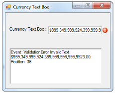
{:.image }

###### Frequently Asked Questions

When the control is set to disabled, we could not make any changes in it. But we can make the text active by setting DrawActiveWhenDisabled to True.

_Table_ _315__: Property Table_

<table>
<tr>
<td>
CurrencyTextBox Property</td><td>
Description</td></tr>
<tr>
<td>
DrawActiveWhenDisabled</td><td>
Specifies whether the text should be drawn active even when the control is disabled. Enabled property must be set to False.</td></tr>
</table>

The following figure illustrates this.

{:.image }

How to make the text active when the control is disabled

##### EditableList

The EditableList control provides an editable Windows Forms list box with a Windows Forms text box and button on the current row to facilitate in-place editing. The events present in the Textbox, Button and ListBox are applicable for EditableList control.

{:.image }

###### Features

EditableList displays a list control that allows in place editing when the user double clicks on the list control and contains following features.

* The EditableList listbox provides various appearance and behavior properties.
* The EditableList supports AutoCompletion from the list.
###### Creating Editable List

To use an EditableList control in your application, all you need to do is drag-and-drop the EditableList control from the controls toolbox onto your form. To add items, expand ListBox node and open String Collection Editor.

{:.image }

It can be created programmatically as follows.

201. Include the required namespace.

[C#]

using Syncfusion.Windows.Forms.Tools;

[VB.NET]

Imports Syncfusion.Windows.Forms.Tools

202. Declare and create an instance of EditableList control.

[C#]

private Syncfusion.Windows.Forms.Tools.EditableList editableList1;

this.editableList1=new Syncfusion.Windows.Forms.Tools.EditableList();

[VB.NET]

Private editableList1 As Syncfusion.Windows.Forms.Tools.EditableList

Me.editableList1 = New Syncfusion.Windows.Forms.Tools.EditableList()

203. Associate Button, TextBox and ListBox with the EditableList control.

[C#]

this.editableList1.Controls.Add(this.editableList1.Button);

this.editableList1.Controls.Add(this.editableList1.ListBox);

this.editableList1.Controls.Add(this.editableList1.TextBox);

[VB.NET]

Me.editableList1.Controls.Add(Me.editableList1.Button)

Me.editableList1.Controls.Add(Me.editableList1.ListBox)

Me.editableList1.Controls.Add(Me.editableList1.TextBox)

204. Specify the size of EditableList control and add that instance to the Form.

[C#]

this.editableList1.Size = new System.Drawing.Size(144, 40);

this.Controls.Add(this.editableList1);

[VB.NET]

Me.editableList1.Size = New System.Drawing.Size(144, 40)

Me.Controls.Add(Me.editableList1)

###### Concepts and Features 

Populating and Editing the List

Populate the list

The List can be populated in 2 ways. One is to specify the DataSource and another is to edit the list manually in the property editor.

To populate through DataSource.

[C#]

// Specifies the DataSource.

editableList1.ListBox.DataSource=&lt;DataSource&gt;;

[VB.NET]

' Specifies the DataSource.

editableList1.ListBox.DataSource=&lt;DataSource&gt;

Otherwise go to the property editor, expand the ListBox property of the EditableList and then select Items. This Items property is editable like any other Items property.

Editing the list

The List can be edited in the following way during runtime:

205. Select the Item you want to edit by clicking or by using keyboard.
206.  Click again. There appears a TextBox. Now edit the text.
207.  After editing change the focus, the list will get updated.

{:.image }

Appearance and Behavior Settings

This section discusses the complete Appearance and behavior settings of EditableList control.

Embedded controls

EditableList control contains embedded controls such as Button, TextBox and ListBox.

_Table_ _316__: List of controls_

<table>
<tr>
<td>
EditableList  Embedded controls</td><td>
Description</td></tr>
<tr>
<td>
Button</td><td>
It includes the properties and events present in the windows Button.</td></tr>
<tr>
<td>
TextBox</td><td>
It includes the properties and events present in the windows TextBox.</td></tr>
<tr>
<td>
ListBox</td><td>
The listbox property of editable list, expands and allows the user to set various appearance and behavior properties of the EditableList.</td></tr>
</table>
Auto Scrolling

You can enable scrollbars automatically for the EditableList control when its items are shown beyond its size by setting AutoScroll to true. When AutoScroll is enabled for the control, you can set the margin and logical size for the autoscroll region by AutoScrollMargin and AutoScrollMinSize properties.

_Table_ _317__: Property Table_

<table>
<tr>
<td>
EditableList  Properties</td><td>
Description</td></tr>
<tr>
<td>
AutoScroll</td><td>
It indicates whether Scrollbars will automatically appear if controls are placed outside the form's client area.</td></tr>
<tr>
<td>
AutoScrollMargin</td><td>
It sets margin around the controls during AutoScroll.</td></tr>
<tr>
<td>
AutoScrollMinSize</td><td>
It sets the minimum logical size for the AutoScroll region.</td></tr>
</table>

[C#]

this.editableList1.AutoScroll = true;

this.editableList1.AutoScrollMargin = new System.Drawing.Size(2, 2);

this.editableList1.AutoScrollMinSize = new System.Drawing.Size(3, 3);

[VB.NET]

Me.editableList1.AutoScroll = True

Me.editableList1.AutoScrollMargin = New System.Drawing.Size(2, 2)

Me.editableList1.AutoScrollMinSize = New System.Drawing.Size(3, 3)

Dock padding

Dock padding determines the size of the border for the docked controls.

_Table_ _318__: Property Table_

<table>
<tr>
<td>
EditableList  Property</td><td>
Description</td></tr>
<tr>
<td>
DockPadding</td><td>
Gets the dock padding for all edges of the control.</td></tr>
</table>

The following image displays the EditableList control with the dock padding for all the edges set to 5.

{:.image }

[C#]

this.editableList1.DockPadding.All = 5;

[VB.NET]

Me.editableList1.DockPadding.All = 5

Want Button

You can display the button to the right while editing the items in the EditableList control by setting WantButton to true.

_Table_ _319__: Property Table_

<table>
<tr>
<td>
EditableList  Property</td><td>
Description</td></tr>
<tr>
<td>
WantButton</td><td>
Specifies whether to show button to the right while editing.</td></tr>
</table>

{:.image }

[C#]

this.editableList1.WantButton = true;

[VB.NET]

Me.editableList1..WantButton = True

Enabling AutoComplete in TextBoxArea

We can associate an AutoComplete with the editing TextBox of the EditableList. The following steps help to achieve this.

208. Create an instance of the AutoComplete.
209.  In the Form load event, place this code.

[C#]

private void form1_Load(object sender,EventArgs e)

{

  // Sets the AutoComplete.

autoComplete1.DataSource=editableList1.ListBox.Items;

autoComplete1.SetAutoComplete(editableList1.TextBox,AutoCompleteModes.Both);

}

[VB.NET]

Private  Sub form1_Load(ByVal sender As Object, ByVal e As EventArgs)

  ' Sets the AutoComplete.

autoComplete1.DataDource=editableList1.ListBox.Items

autoComplete1.SetAutoComplete(editableList1.TextBox,AutoCompleteModes.Both)

End Sub

The data source may vary according to your choice.

{:.image }

Style   

EditableList supports visual styles such as Default, Metro. The style can be set using Style property. 

* Default
* Metro

The following code example allows you to set the style for the EditableList.

[C#]

this.editableList1.Style = Syncfusion.Windows.Forms.Appearance.Metro;

[VB]

Me.editableList1.Style = Syncfusion.Windows.Forms.Appearance.Metro

{:.image }

###### Event Handling

EditableList controls contains events present in the Windows Button, TextBox and ListBox.

EditableList.ListBox.SelectedValueChanged

This event is triggered when the value of the SelectedValue property is changed on list control.

EditableList.TextBox.TextChanged

This event is triggered when the value of the Text property is changed on list control.

EditableList.DragDrop

This event is triggered when the drag-and-drop operation is completed.

EditableList.DragEnter

This event is triggered when a object is dragged into control's bounds.

Handling Drag drop events

DragDrop and DragEnter events can be handled to drag and drop the external objects into the EditableList control.

DragEnter event can be handled to drag the file into the text area of EditableList control. The following code illustrates this.

[C#]

private void editableList1_DragEnter(object sender, System.Windows.Forms.DragEventArgs e)

{

if (e.Data.GetDataPresent(DataFormats.FileDrop))

e.Effect = DragDropEffects.All;

else

e.Effect = DragDropEffects.None;

}

[VB.NET]

Private Sub editableList1_DragEnter(ByVal sender As Object, ByVal e AsSystem.Windows.Forms.DragEventArgs)

    If e.Data.GetDataPresent(DataFormats.FileDrop) Then

        e.Effect = DragDropEffects.All

    Else

        e.Effect = DragDropEffects.None

    End If

End Sub

DragDrop event can be handled to drop the files at any location into the EditableList control. The following code illustrates this.

[C#]

private void editableList1_DragDrop(object sender, System.Windows.Forms.DragEventArgs e)

{

string[] files = (string[])e.Data.GetData("FileDrop", false);

foreach (string s in files)

       {

       this.editableList1.ListBox.Items.Add(s.Substring(1 + s.LastIndexOf(@"\")));

       }

}

[VB.NET]

Private Sub editableList1_DragDrop(ByVal sender As Object, ByVal e AsSystem.Windows.Forms.DragEventArgs)

    Dim files As String() = CType(e.Data.GetData("FileDrop", False), String())

    For Each s As String In files

        Me.editableList1.ListBox.Items.Add(s.Substring(1 & s.LastIndexOf("\")))

    Next s

End Sub

##### MaskedEditBox

The MaskedEditBox control is an edit control that provides an easy and reliable way of collecting user input and displaying standard data in specific formats from any data source. Some of the common uses of the MaskedEditBox controls are IP Addressedit control, Phone Number edit control and Social Security edit control.

{:.image }

If you define an input mask using the Mask property, each character position in the MaskedEditBox control maps to either a placeholder of a specified type or a literal character. Literal characters, or literals, can give visual cues about the type of data being used. For example, the parentheses surrounding the area code of a telephone number are literals: (919).

MaskedEditBox control exhibits the similar properties of CurrencyTextBox.

###### Features

IntegerTextBox is used to display Int64 values and contains the following features.

Features

* Display Settings

The [display](http://help.syncfusion.com/ug_82/WindowsFormsUI_Tools/_DisplaySettings.html) settings involves setting the separator to be used to group the numbers and the group size.

It also involves setting the pattern and symbol to be used when the number is negative.

* Value Settings

The value settings provide options to set the value to be displayed by the IntegerTextBox control. It provides options to indicate the null state of the control and customize its settings.

The maximum and minimum value of the control can also be set.

* Culture Settings

The [culture](http://help.syncfusion.com/ug_82/WindowsFormsUI_Tools/CultureSettings.html) to be used for formatting the numeric display can be set using the Culture property.

* Text Settings

Text can be selected, formatted, clipped and displayed from right to left using the [text settings](http://help.syncfusion.com/ug_82/WindowsFormsUI_Tools/TextSettings5.html) of the IntegerTextBox control.

* Appearance Settings

The background color and foreground color of the control can be set according to the needs of the user.

The foreground color can be set separately for the positive, negative and null values of the control.

* Behavior Settings

The integer value of the control can be reset or changed to a negative value by selecting it's entire contents and pressing the negative key on the keyboard.

The control also allows to insert zeros before the beginning value of the integer value using the AllowLeadingZeros property.

* Border Settings

2D and 3D border styles can be applied to the IntegerTextBox.

The color of the border can also be set for the control using the BorderColor property.

* Key Settings

Keyboard support for entering large values is provided. Incrementing and decrementing of values can be done using the up and down arrow [keys](http://help.syncfusion.com/ug_82/WindowsFormsUI_Tools/KeySettings.html).

* Applying Themes

Themed appearance can be provided for the IntegerTextBox control.

Key Features

* The IntegerTextBox control handles user keyboard input and double formatting with no code required.
* It is fully compatible with the Windows Forms TextBox and uses the globalization features of the .NET platform to provide locale specific formatting.
* The IntegerTextBox control supports displaying negative values in a different color and also using different negative formats.
###### Creating MaskedEditBox

Through Designer

The MaskedEditBox control provides full support for the Windows Forms designer. You can use the MaskedEditBox through the designer by following the below given steps.

210. Drag and drop the MaskedEditBox control onto your form from the controls toolbox.

{:.image }

211. Set the MaskedEditBox.Mask property for the control. This property controls the behavior of the control at run time. If no mask is specified, the control will behave the same as a standard Windows Forms TextBox control.

{:.image }

Examples of some common masks are,

_Table_ _320__: Masks Table_

<table>
<tr>
<td>
Mask</td><td>
Usage</td></tr>
<tr>
<td>
###-##-####</td><td>
US Social security number mask (the # symbol allows numeric entry only in that position and the - symbol is literal); Example 222-22-2222.</td></tr>
<tr>
<td>
(###) ### ####</td><td>
US Telephone number mask; Example (919) 481 1974.</td></tr>
<tr>
<td>
##/##/####</td><td>
Short date mask; Example 04/14/2005.</td></tr>
<tr>
<td>
##:##</td><td>
Short time mask; Example 12:24.</td></tr>
<tr>
<td>
>?<????????????</td><td>
First name or last name; The first letter is uppercase and the other letters are all lowercase; Example: Syncfusion.</td></tr>
</table>
Through Code

The MaskedEditBox control can be used programmatically through code as detailed below.

212. Include the required namespace.

[C#]

using Syncfusion.Windows.Forms.Tools;

[VB.NET]

Imports Syncfusion.Windows.Forms.Tools

213. Create an instance of the MaskedEditBox control.

[C#]

private Syncfusion.Windows.Forms.Tools.MaskedEditBox maskedEditBox1;

this.maskedEditBox1=new MaskedEditBox();

[VB.NET]

Private maskedEditBox1 As Syncfusion.Windows.Forms.Tools.MaskedEditBox

Me.maskedEditBox1 = New MaskedEditBox()

214. Set MaskedEditBox.Mask property.

[C#]

// The mask string.

this.maskedEditBox1.Mask = ">?<????????????";

this.maskedEditBox1.Location = new System.Drawing.Point(70, 29);

[VB.NET]

' The mask string.

Me.maskedEditBox1.Mask = ">?<????????????"

Me.maskedEditBox1.Location = New System.Drawing.Point(70, 29);

215. Add the MaskedEditBox control to the form.

[C#]

this.Controls.Add(this.maskedEditBox1);

[VB.NET]

Me.Controls.Add(Me.maskedEditBox1)

{:.image }

###### Concepts and Features

Mask Settings

This section deals with the mask settings of MaskedEditBox control.

The format / behavior for the MaskedEditBox control is defined through the property given below.

_Table_ _321__: Property Table_

<table>
<tr>
<td>
MaskedEditBox Property</td><td>
Description</td></tr>
<tr>
<td>
Mask</td><td>
Specifies the mask string for the MaskedEditBox control.</td></tr>
</table>

The Mask is a string that is composed of literal characters and mask characters.

Literal characters give visual cues about the type of data being used. Mask characters are the placeholders for the data input. For example, a US telephone number can be represented by the following mask.

(###) - ### #### Extn ####

In the above Mask, all the non # characters are Literal characters and the #’s are Mask characters.

The MaskedEditBox control supports the following masks.

_Table_ _322__: Mask Characters Table_

<table>
<tr>
<td>
Mask Characters</td><td>
Description</td></tr>
<tr>
<td>
#</td><td>
Digit placeholder.</td></tr>
<tr>
<td>
.</td><td>
Decimal placeholder. The actual character used is the one specified as the decimal placeholder in your international settings. This character is treated as a literal for masking purposes.</td></tr>
<tr>
<td>
,</td><td>
Thousands separator. The actual character used is the one specified as the thousands separator in your international settings. This character is treated as a literal for masking purposes.</td></tr>
<tr>
<td>
:</td><td>
Time separator. The actual character used is the one specified as the time separator in your international settings. This character is treated as a literal for masking purposes.</td></tr>
<tr>
<td>
/</td><td>
Date separator. The actual character used is the one specified as the date separator in your international settings. This character is treated as a literal for masking purposes.</td></tr>
<tr>
<td>
\</td><td>
Treat the next character in the mask string as a literal. This allows you to include the "#", "&", "A", and "?" characters in the mask. This character is treated as a literal for masking purposes.</td></tr>
<tr>
<td>
;</td><td>
Character placeholder. Valid values for this placeholder are ANSI characters in the following ranges: 32-126 and 128-255.</td></tr>
<tr>
<td>
></td><td>
Convert all the characters that follow to uppercase.</td></tr>
<tr>
<td>
<</td><td>
Convert all the characters that follow to lowercase.</td></tr>
<tr>
<td>
A</td><td>
Alphanumeric character placeholder (entry required). For example: a - z, A - Z, or 0 - 9.</td></tr>
<tr>
<td>
a</td><td>
Alphanumeric character placeholder (entry optional).</td></tr>
<tr>
<td>
9</td><td>
Digit placeholder (entry optional). For example: 0 - 9.</td></tr>
<tr>
<td>
C</td><td>
Character or space placeholder (entry optional). This operates exactly like the "&" placeholder and ensures compatibility with Microsoft Access.</td></tr>
<tr>
<td>
?</td><td>
Letter placeholder. For example: a - z or A - Z.</td></tr>
<tr>
<td>
Literal</td><td>
All other symbols are displayed as literals; that is, as themselves.</td></tr>
</table>

[C#]

this.maskedEditBox1.Mask = "##-##-####";

[VB.NET]

Me.maskedEditBox1.Mask = "##-##-####"

{:.image }

A Sample which demonstrates the Mask Settings of MaskedEditBox control is available in the below sample installation path.

…\_My Documents\Syncfusion\EssentialStudio\Version Number\Windows\Tools.Windows\Samples\Advanced Editor Functions\ActionGroupingDemo_

Mode Settings

This section discusses the mode settings of the MaskedEditBox control.

MaskedEditBox control uses the following modes.

_Table_ _323__: Property Table_

<table>
<tr>
<td>
MaskedEditBox Properties</td><td>
Description</td></tr>
<tr>
<td>
ClipMode</td><td>
Specifies the format of the text that will be returned by the MaskedEdit control. The options included are as follows.{{ _IncludeLiterals and_ | markdownify }}{{ _ExcludeLiterals._ | markdownify }}The default value is 'IncludeLiterals'.</td></tr>
<tr>
<td>
InputMode</td><td>
Specifies the input mode for the MaskedEditBox control. The options included are as follows.{{ _OvertypeOnly and_ | markdownify }}{{ _Normal._ | markdownify }}The default value is 'OvertypeOnly'.</td></tr>
<tr>
<td>
UsageMode</td><td>
Specifies if the MaskedEditBox control is to behave as a numeric control.</td></tr>
</table>
Clip mode

At runtime, we can copy / paste the entries of MaskedEditBox. The entries that are copied can be specified whether to include literals using the ClipMode property.

Setting the ClipMode property of the MaskedEditBox to 'ExcludeLiterals', will get rid of the literals from the text that is returned by the control. The default value is set to 'IncludeLiterals'.

InputMode

The different modes of the input can be determined by the InputMode property.

Setting the InputMode to 'Normal', allows the user to work in insert mode and the INSERT key is not allowed. In OvertypeOnly mode, the INSERT key will not have any effect.

UsageMode

The UsageMode property modifies the behavior of the MaskedEditBox as detailed below.

Normal mode

When the UsageMode is set to 'Normal', there is no change in the behavior. This is the default mode for a MaskedEditBox control.

Numeric Mode

When the UsageMode is set to 'Numeric', the control creates internally two data groups and one decimal separator character in the mask. These groups are created such that the first group holds the mask value before the decimal separator and the second group holds the mask value after the decimal separator. For example, let us specify the mask as follows:

###.####

The first group will contain the value for the first 3 ### characters of the mask (the number group) and the second group (the decimal group) will contain the 5 characters (.####). The default group alignment for the number group will be right and the alignment for the decimal group will be left. Refer to the information on [DataGroups](http://help.syncfusion.com/ug/windows%20forms/tools/default.htm) for more information on how this works.

The MaxValue and MinValue properties are enforced only when the UsageMode is set to 'Numeric'.

[C#]

this.maskedEditBox1.ClipMode = Syncfusion.Windows.Forms.Tools.ClipModes.ExcludeLiterals;

this.maskedEditBox1.InputMode = Syncfusion.Windows.Forms.Tools.MaskInputMode.Normal;

this.maskedEditBox1.UsageMode = Syncfusion.Windows.Forms.Tools.MaskedUsageMode.Numeric;

[VB.NET]

Me.maskedEditBox1.ClipMode = Syncfusion.Windows.Forms.Tools.ClipModes.ExcludeLiterals

Me.maskedEditBox1.InputMode = Syncfusion.Windows.Forms.Tools.MaskInputMode.Normal

Me.maskedEditBox1.UsageMode = Syncfusion.Windows.Forms.Tools.MaskedUsageMode.Numeric

Display Settings

This section discusses the display settings of the MaskedEditBox control.

Separators

The user data can be displayed along with separators at run time for specifying date, time, decimals and thousands. It is not required to type separators at run time. Separators can be specified in the mask character itself.

_Table_ _324__: Property Table_

<table>
<tr>
<td>
MaskedEditBox Properties</td><td>
Description</td></tr>
<tr>
<td>
DateSeparator</td><td>
Specifies the character to use when a date separator position is specified.The default separator is '/'.</td></tr>
<tr>
<td>
DecimalSeparator</td><td>
Specifies the character to use when a decimal separator position is specified.The default separator is '.'.</td></tr>
<tr>
<td>
ThousandSeparator</td><td>
Specifies the character to use when a thousands separator position is specified.The default separator is ','.</td></tr>
<tr>
<td>
TimeSeparator</td><td>
Specifies the character to use when a time separator position is specified.The default separator is ':'.</td></tr>
</table>

For example, if you want to display the user data in date time format say mm/dd/yy, the mask character should be '##/##/##'.

We can change the default separators used. If you want to display the date time as 'mm-dd-yy', change the DateSeparatorproperty from '/' to '-'.

Similarly other separators can be used.

[C#]

this.maskedEditBox1.DateSeparator = '-';

this.maskedEditBox1.DecimalSeparator = '.';

this.maskedEditBox1.ThousandSeparator = ',';

this.maskedEditBox1.TimeSeparator = ':';

[VB.NET]

Me.maskedEditBox1.DateSeparator = "-"C

Me.maskedEditBox1.DecimalSeparator = "."C

Me.maskedEditBox1.ThousandSeparator = ","C

Me.maskedEditBox1.TimeSeparator = ":"C

{:.image }

{:.image }

{:.image }

{:.image }

Cursor Position

The cursor position of the MaskedEditBox control can be specified using the options provided by the following properties.

_Table_ _325__: Property Table_

<table>
<tr>
<td>
MaskedEditBox Properties</td><td>
Description</td></tr>
<tr>
<td>
PositionAt</td><td>
Defines the control's cursor position behavior on getting the focus. The options included are as follows:{{ _Decimal_ | markdownify }}{{ _FirstPosition and_ | markdownify }}{{ _FirstMaskPosition._ | markdownify }}The default value is 'FirstPosition'.</td></tr>
<tr>
<td>
PositionAtDecimal</td><td>
Indicates whether the cursor is to be positioned at the decimal separator (if any) when the control receives focus.</td></tr>
</table>

[C#]

this.maskedEditBox1.PositionAt = Syncfusion.Windows.Forms.Tools.SpecialCursorPosition.Decimal;

this.maskedEditBox1.PositionAtDecimal = true;

[VB.NET]

Me.maskedEditBox1.PositionAt = Syncfusion.Windows.Forms.Tools.SpecialCursorPosition.Decimal

Me.maskedEditBox1.PositionAtDecimal = true;

DataGroups

Text can be split up and aligned using the options provided by the below given property.

_Table_ _326__: Property Table_

<table>
<tr>
<td>
MaskedEditBox Property</td><td>
Description</td></tr>
<tr>
<td>
DataGroups</td><td>
Specifies the data groups that can be used for splitting up the text.</td></tr>
</table>

The DataGroups property of the MaskedEditBox defines a virtual grouping of the mask value. Each group is defined by aMaskedEditDataGroupInfo object (the DataGroups property is a collection of these objects).

A data group is defined by its GroupLength property. For example, if the mask is given as follows,

###.###.###.###

and there are 4 groups specified with group lengths of 4, 4, 4, 3 respectively, the groups will be defined as:

Group1 ###.

Group2 ###.

Group3 ###.

Group4 ###

The DataAlignment property of the MaskedEditDataGroupInfo object specifies the type of alignment to be used for the group. The data alignment behavior will be defined as given below:

* Left : All the filled-in mask fields in the group will be grouped to the left-most positions.
* Right : All the filled-in mask fields in the group will be grouped to the right-most positions.
* Center : All the filled-in mask fields in the group will be grouped to the center-most positions.

The group alignments will only be enforced after the control has lost focus.

The MaskedEditDataGroupInfo.Value property can be used to get the value of a group without any parsing. For example, if the mask is given as follows,

(###) - ### #### Extn ####

3 groups can be defined as follows:

Group1 - (###)

Group2 - ### ####

Group3 Extn - ####

The value of Group 1 will be the area code, Group 2 will be the phone number, and Group 3 will be the extension.

The following code snippet uses two groups.

[C#]

// Adding DataGroups.

this.maskedEditBox1.DataGroups.Add(this.maskedEditDataGroupInfo1);

this.maskedEditBox1.DataGroups.Add(this.maskedEditDataGroupInfo2);

// Defining maskedEditDataGroupInfo1.

this.maskedEditDataGroupInfo1.DataGroupAlignment = Syncfusion.Windows.Forms.Tools.MaskGroupAlignment.Left;

this.maskedEditDataGroupInfo1.DataGroupName = "One";

this.maskedEditDataGroupInfo1.DataGroupSize = 3;

// Defining maskedEditDataGroupInfo2.

this.maskedEditDataGroupInfo2.DataGroupAlignment = Syncfusion.Windows.Forms.Tools.MaskGroupAlignment.None;

this.maskedEditDataGroupInfo2.DataGroupName = "Two";

this.maskedEditDataGroupInfo2.DataGroupSize = 4;

[VB.NET]

' Adding DataGroups.

Me.maskedEditBox1.DataGroups.Add(Me.maskedEditDataGroupInfo1)

Me.maskedEditBox1.DataGroups.Add(Me.maskedEditDataGroupInfo2)

' Defining maskedEditDataGroupInfo1.

Me.maskedEditDataGroupInfo1.DataGroupAlignment = Syncfusion.Windows.Forms.Tools.MaskGroupAlignment.Left

Me.maskedEditDataGroupInfo1.DataGroupName = "One"

Me.maskedEditDataGroupInfo1.DataGroupSize = 3

' Defining maskedEditDataGroupInfo2.

Me.maskedEditDataGroupInfo2.DataGroupAlignment = Syncfusion.Windows.Forms.Tools.MaskGroupAlignment.None

Me.maskedEditDataGroupInfo2.DataGroupName = "Two"

Me.maskedEditDataGroupInfo2.DataGroupSize = 4

Displaying Characters as Substitutes for User Input

We can display different characters as substitutes for the user input. This can be done using the below given properties.

_Table_ _327__: Property Table_

<table>
<tr>
<td>
MaskedEditBox Properties</td><td>
Description</td></tr>
<tr>
<td>
Sequentially</td><td>
Indicates whether the control can sequentially display mask characters.</td></tr>
<tr>
<td>
PasswordChar</td><td>
Indicates the character to display for password input for single-line edit controls.</td></tr>
</table>

The MaskedEditBox.Sequentially property indicates whether the control can sequentially display mask characters. After setting the Sequentially property to 'True', you can use the PasswordChar property in order to set the character, that is to be displayed as a substitute for the user input.

[C#]

private void Form1_Load(object sender, System.EventArgs e)

{

this.maskedEditBox1.Sequentially = true;

this.maskedEditBox1.PasswordChar = '$';

}

[VB.NET]

Private Sub Form1_Load(ByVal sender As Object, ByVal e As System.EventArgs)

Me.maskedEditBox1.Sequentially = True

Me.maskedEditBox1.PasswordChar = "$"c

End Sub

{:.image }

A Sample which demonstrates the PasswordChar property of MaskedEditBox control is available in the below sample installation path.

…\_My Documents\Syncfusion\EssentialStudio\Version Number\Windows\Tools.Windows\Samples\Advanced Editor Functions\ActionGroupingDemo_

Culture Settings

This section discusses the culture settings of the MaskedEditBox control.

_Table_ _328__: Property Table_

<table>
<tr>
<td>
MaskedEditBox Properties</td><td>
Description</td></tr>
<tr>
<td>
Culture</td><td>
Gets / sets the culture that is to be used for formatting the numeric display.</td></tr>
<tr>
<td>
SpecialCultureValue</td><td>
Gets / sets the mode for the cultures.It includes the below given options:{{ _None,_ | markdownify }}{{ _CurrentCulture,_ | markdownify }}{{ _UICulture and_ | markdownify }}{{ _InstalledCulture._ | markdownify }}</td></tr>
<tr>
<td>
UseUserOverride</td><td>
Specifies if the NumberFormatInfo used for formatting will use the User Overrides for the culture. The default value is set to 'True'.</td></tr>
</table>

[C#]

this.maskedEditBox1.Culture = new System.Globalization.CultureInfo("ar-SA");

this.maskedEditBox1.SpecialCultureValue = Syncfusion.Windows.Forms.Tools.SpecialCultureValues.None;

this.maskedEditBox1.UseUserOverride = true;

[VB.NET]

Me.maskedEditBox1.Culture = New System.Globalization.CultureInfo("ar-SA")

Me.maskedEditBox1.SpecialCultureValue = Syncfusion.Windows.Forms.Tools.SpecialCultureValues.None

Me.maskedEditBox1.UseUserOverride = True

{:.image }

Text Settings

This section discusses the text settings of the MaskedEditBox control.

The text associated with the MaskedEditBox control can be set and customized using the below given settings.

_Table_ _329__: Property Table_

<table>
<tr>
<td>
MaskedEditBox Properties</td><td>
Description</td></tr>
<tr>
<td>
CharacterCasing</td><td>
Gets / sets the case of character as they are typed.It includes the below given options:{{ _Normal,_ | markdownify }}{{ _Upper and_ | markdownify }}{{ _Lower._ | markdownify }}</td></tr>
<tr>
<td>
TextAlign</td><td>
Indicates how the text should be aligned for edit controls.</td></tr>
<tr>
<td>
SelectedText</td><td>
Gets / sets the selected text in the MaskedEditBox.</td></tr>
<tr>
<td>
HideSelection</td><td>
Indicates that the selection should be hidden when the edit control loses focus.</td></tr>
<tr>
<td>
ClipText</td><td>
Returns the clipped text without the formatting.</td></tr>
<tr>
<td>
DrawActiveWhenDisabled</td><td>
Specifies if the text should be drawn active, even when disabled.</td></tr>
</table>

[C#]

this.maskedEditBox1.CharacterCasing = System.Windows.Forms.CharacterCasing.Upper;

this.maskedEditBox1.TextAlign = System.Windows.Forms.HorizontalAlignment.Center;

this.maskedEditBox1.SelectedText = "34";

this.maskedEditBox1.HideSelection = true;

this.maskedEditBox1.ClipText = "34";

this.maskedEditBox1.DrawActiveWhenDisabled = true;

[VB.NET]

Me.maskedEditBox1.CharacterCasing = System.Windows.Forms.CharacterCasing.Upper

Me.maskedEditBox1.TextAlign = System.Windows.Forms.HorizontalAlignment.Center

Me.maskedEditBox1.SelectedText = "34"

Me.maskedEditBox1.HideSelection = True

Me.maskedEditBox1.ClipText = "34"

Me.maskedEditBox1.DrawActiveWhenDisabled = True

{:.image }

{:.image }

The methods associated with the above properties are given below.

_Table_ _330__: Methods Table_

<table>
<tr>
<td>
Methods</td><td>
Description</td></tr>
<tr>
<td>
AppendText</td><td>
Appends the text to the current text of a textbox.</td></tr>
<tr>
<td>
OnCharacterCasingChanged</td><td>
Raises the CharacterCasingChanged event.</td></tr>
<tr>
<td>
Cut</td><td>
Cuts the selected data to the clipboard.</td></tr>
<tr>
<td>
Copy</td><td>
Copies the content of the NumberTextBox to the clipboard. The ClipMode property dictates what gets copied.</td></tr>
<tr>
<td>
Paste</td><td>
Pastes the data in the clipboard into the NumberTextBox control.</td></tr>
<tr>
<td>
Select</td><td>
Selects a range of text in the TextBox.</td></tr>
</table>
Clip Mode

The formatting for the text can be enabled or disabled using the property given below.

_Table_ _331__: Property Table_

<table>
<tr>
<td>
MaskedEditBox Property</td><td>
Description</td></tr>
<tr>
<td>
ClipMode</td><td>
Specifies the format of the text that will be returned by the MaskedEditBox control.It includes the below given options:{{ _IncludeLiterals and_ | markdownify }}{{ _ExcludeLiterals._ | markdownify }}</td></tr>
</table>

[C#]

this.maskedEditBox1.ClipMode = Syncfusion.Windows.Forms.Tools.ClipModes.IncludeLiterals;

[VB.NET]

Me.maskedEditBox1.ClipMode = Syncfusion.Windows.Forms.Tools.ClipModes.IncludeLiterals

OverflowIndicatorToolTipText

The tooltip that should be displayed when an overflow of text occurs can be set using the below given properties.

_Table_ _332__: Property Table_

<table>
<tr>
<td>
MaskedEditBox Properties</td><td>
Description</td></tr>
<tr>
<td>
OverflowIndicatorToolTipText</td><td>
Specifies the overflow indicator tooltip text.</td></tr>
<tr>
<td>
ShowOverflowIndicator</td><td>
Gets / sets overflow indicator visibility.</td></tr>
<tr>
<td>
ShowOverflowIndicatorToolTip</td><td>
Gets / sets can show overflow indicator tooltip.</td></tr>
</table>

[C#]

this.maskedEditBox1.OverflowIndicatorToolTipText = "Text Overflow";

this.maskedEditBox1.ShowOverflowIndicator = true;

this.maskedEditBox1.ShowOverflowIndicatorToolTip = true;

[VB.NET]

Me.maskedEditBox1.OverflowIndicatorToolTipText = " Text Overflow"

Me.maskedEditBox1.ShowOverflowIndicator = True

Me.maskedEditBox1.ShowOverflowIndicatorToolTip = True

{:.image }

A Sample which demonstrates the Text Align and Character Casing features of MaskedEditBox control is available in the below sample installation path.

…\_My Documents\Syncfusion\EssentialStudio\Version Number\Windows\Tools.Windows\Samples\Advanced Editor Functions\ActionGroupingDemo_

Value Settings

The value settings of the MaskedEditBox control are discussed below.

MinValue and MaxValue

The minimum and maximum values of the MaskedEditBox control can be set using the below given properties.

_Table_ _333__: Property Table_

<table>
<tr>
<td>
MaskedEditBox Properties</td><td>
Description</td></tr>
<tr>
<td>
MinValue</td><td>
Specifies the minimum value that can be set through the MaskedEditBox. The default value is set to '0'.</td></tr>
<tr>
<td>
MaxValue</td><td>
Specifies the maximum value that can be set through the MaskedEditBox.The default value is set to '79228162514264337593543950335'.</td></tr>
</table>

[C#]

this.maskedEditBox1.MinValue = new decimal(new int[] {50, 0, 0, 0});

this.maskedEditBox1.MaxValue = new decimal(new int[] {100, 0, 0, 0});

[VB.NET]

Me.maskedEditBox1.MinValue = New Decimal(New Integer() {50, 0, 0, 0})

Me.maskedEditBox1.MaxValue = New Decimal(New Integer() {100, 0, 0, 0})

Appearance Settings

Background Settings

The background settings of the MaskedEditBox control are discussed below.

Background Color

The background color of the control can be set using the properties given below.

_Table_ _334__: Property Table_

<table>
<tr>
<td>
MaskedEditBox Property</td><td>
Description</td></tr>
<tr>
<td>
BackColor</td><td>
Specifies the background color of the component.</td></tr>
</table>

[C#]

this.maskedEditBox1.BackColor = System.Drawing.Color.PaleGoldenrod;

[VB.NET]

Me.maskedEditBox1.BackColor = System.Drawing.Color.PaleGoldenrod

{:.image }

The method associated with the above property is given below.

_Table_ _335__: Property Table_

<table>
<tr>
<td>
Method</td><td>
Description</td></tr>
<tr>
<td>
ResetBackColor</td><td>
Resets the BackColor property to its default value.</td></tr>
</table>

A sample which demonstrates the Background Settings of MaskedEditBox control is available in the below sample installation path.

…\_My Documents\Syncfusion\EssentialStudio\Version Number\Windows\Tools.Windows\Samples\Advanced Editor Functions\ActionGroupingDemo_

 Foreground Settings

The foreground settings of the MaskedEditBox control are discussed below.

Foreground Color

The foreground color of the control can be set using the properties given below.

_Table_ _336__: Property Table_

<table>
<tr>
<td>
MaskedEditBox Property</td><td>
Description</td></tr>
<tr>
<td>
ForeColor</td><td>
Specifies the foreground color of this component, which is used to display text.</td></tr>
</table>

[C#]

this.maskedEditBox1.ForeColor = System.Drawing.Color.DarkMagenta;

[VB.NET]

Me.maskedEditBox1.ForeColor = System.Drawing.Color.DarkMagenta

{:.image }

A Sample which demonstrates the Foreground Settings of MaskedEditBox control is available in the below sample installation path.

…\_My Documents\Syncfusion\EssentialStudio\Version Number\Windows\Tools.Windows\Samples\Advanced Editor Functions\ActionGroupingDemo_

Behavior Settings

The behavior settings of the MaskedEditBox control are discussed below.

Prompt and Padding Character Settings

MaskedEditBox control allows you to add prompt characters in the input.

_Table_ _337__: Property Table_

<table>
<tr>
<td>
MaskedEditBox Properties</td><td>
Description</td></tr>
<tr>
<td>
AllowPrompt</td><td>
Specifies if the prompt character can be allowed to be entered as an input character.</td></tr>
<tr>
<td>
PaddingCharacter</td><td>
Specifies the character that will be used instead of mask characters when the mask position has not been filled when the text property is used.</td></tr>
<tr>
<td>
PaddingCharacterInt</td><td>
Gets / sets the integer version of the padding character.</td></tr>
<tr>
<td>
Prompt Character</td><td>
Gets / sets the character that will be used instead of the mask characters when the mask position has not been filled.</td></tr>
<tr>
<td>
PrompCharacterInt</td><td>
Gets / sets the integer version of the PromptCharacter.</td></tr>
<tr>
<td>
PassivePromptCharacter</td><td>
Gets / sets the character that will be used instead of the mask characters when the mask position has not been filled (when the control does not have the focus).</td></tr>
<tr>
<td>
PassivePromptCharacterInt</td><td>
Gets / sets the integer version of the PassivePromptCharacter.</td></tr>
</table>

[C#]

this.maskedEditBox1.AllowPrompt = true;

this.maskedEditBox.PaddingCharacterInt = 0;

this.maskedEditBox1.PromptCharacterInt = 37;

this.maskedEditBox1.PassivePromptCharacterInt = 47;

[VB.NET]

Me.maskedEditBox1.AllowPrompt = True

Me.maskedEditBox.PaddingCharacterInt = 0

Me.maskedEditBox1.PromptCharacterInt = 37

Me.maskedEditBox1.PassivePromptCharacterInt = 47

> 
{:.image }
 _Note: We can trim the additional spaces present in the mask by setting the PaddingCharacterInt property to '0'._

MaxLength

The maximum length of the text can be set using the property given below.

_Table_ _338__: Property Table_

<table>
<tr>
<td>
MaskedEditBox Property</td><td>
Description</td></tr>
<tr>
<td>
MaxLength</td><td>
Specifies the maximum number of characters that can be entered into the edit control. The default value is set to '32767'.</td></tr>
</table>

[C#]

this.maskedEditBox1.MaxLength = 32800;               

[VB]

Me.maskedEditBox1.MaxLength = 32800

ReadOnly

The ReadOnly mode can be enabled for the MaskedEditBox control using the below given property.

_Table_ _339__: Property Table_

<table>
<tr>
<td>
MaskedEditBox Property</td><td>
Description</td></tr>
<tr>
<td>
ReadOnly</td><td>
Specifies whether the text in the edit control can be changed or not.</td></tr>
</table>

[C#]

this.maskedEditBox1.ReadOnly = true;

[VB]

Me.maskedEditBox1.ReadOnly = True

Border Settings

The border settings of the MaskedEditBox control are discussed in this section.

The wide variety of border options that are available for the MaskedEditBox control are given below.

_Table_ _340__: Property Table_

<table>
<tr>
<td>
MaskedEditBox Properties</td><td>
Description</td></tr>
<tr>
<td>
Border3DStyle</td><td>
Indicates the style of the 3D border. The options included are as follows:{{ _RaisedOuter,_ | markdownify }}{{ _SunkenOuter,_ | markdownify }}{{ _RaisedInner,_ | markdownify }}{{ _SunkenInner,_ | markdownify }}{{ _Raised,_ | markdownify }}{{ _Etched,_ | markdownify }}{{ _Bump,_ | markdownify }}{{ _Sunken,_ | markdownify }}{{ _Adjust and_ | markdownify }}{{ _Flat._ | markdownify }}The default value is set to 'Sunken'.</td></tr>
<tr>
<td>
BorderColor</td><td>
Specifies the color of the 2D border.</td></tr>
<tr>
<td>
BorderSides</td><td>
Indicates the border sides of the panel. The options included are as follows:{{ _Left,_ | markdownify }}{{ _Top,_ | markdownify }}{{ _Right,_ | markdownify }}{{ _Bottom,_ | markdownify }}{{ _Middle and_ | markdownify }}{{ _All._ | markdownify }}</td></tr>
<tr>
<td>
BorderStyle</td><td>
Indicates whether the edit control should have a border. The options included are given below:{{ _FixedSingle,_ | markdownify }}{{ _Fixed3D and_ | markdownify }}{{ _None._ | markdownify }}</td></tr>
</table>

[C#]

this.maskedEditBox1.Border3DStyle = System.Windows.Forms.Border3DStyle.Bump;

this.maskedEditBox1.BorderColor = System.Drawing.Color.Lime;

this.maskedEditBox1.BorderSides = System.Windows.Forms.Border3DSide.All;

this.maskedEditBox1.BorderStyle = System.Windows.Forms.BorderStyle.FixedSingle;

[VB.NET]

Me.maskedEditBox1.Border3DStyle = System.Windows.Forms.Border3DStyle.Bump

Me.maskedEditBox1.BorderColor = System.Drawing.Color.Magenta

Me.maskedEditBox1.BorderSides = System.Windows.Forms.Border3DSide.All

Me.maskedEditBox1.BorderStyle = System.Windows.Forms.BorderStyle.FixedSingle

{:.image }

A Sample which demonstrates the Border Settings of MaskedEditBox control is available in the below sample installation path.

…\_My Documents\Syncfusion\EssentialStudio\Version Number\Windows\Tools.Windows\Samples\Advanced Editor Functions\ActionGroupingDemo_

Layout Settings

The layout settings of the MaskedEditBox control are discussed in this section.

The size of the MaskedEditBox control can be set according to the needs of the user using the properties discussed below.

_Table_ _341__: Property Table_

<table>
<tr>
<td>
MaskedEditBox Properties</td><td>
Description</td></tr>
<tr>
<td>
MaximumSize</td><td>
Gets / sets the maximum size for the control.</td></tr>
<tr>
<td>
MinimumSize</td><td>
Gets / sets the minimum size for the control.</td></tr>
</table>

[C#]

this.maskedEditBox1.MaximumSize = new System.Drawing.Size(150, 20);

this.maskedEditBox1.MinimumSize = new System.Drawing.Size(150, 20);

[VB.NET]

Me.maskedEditBox1.MaximumSize = New System.Drawing.Size(150, 20)

Me.maskedEditBox1.MinimumSize = New System.Drawing.Size(150, 20)

{:.image }

Applying Themes

Themes can be applied to the MaskedEditBox control using the property given below.

_Table_ _342__: Property Table_

<table>
<tr>
<td>
MaskedEditBox Property</td><td>
Description</td></tr>
<tr>
<td>
ThemesEnabled</td><td>
Specifies whether or not to use XP themes when BorderStyle property is set to 'Fixed3D'.</td></tr>
</table>
> 
{:.image }
 _Note: Refer_ [Border Settings](http://help.syncfusion.com/ug_82/WindowsFormsUI_Tools/BorderStyles5.html) _topic to know about the BorderStyle property._

[C#]

this.maskedEditBox1.ThemesEnabled = true;

[VB.NET]

Me.maskedEditBox1.ThemesEnabled = true

{:.image }

###### MaskedEditBox Events

The list of events and a detailed explanation about each of them is given in the following sections.

_Table_ _343__: Events Table_

<table>
<tr>
<td>
MaskedEditBox Events</td><td>
Description</td></tr>
<tr>
<td>
Border3DStyleChanged</td><td>
This event occurs when the Border3DStyle property is changed.</td></tr>
<tr>
<td>
BorderColorChanged</td><td>
This event occurs when the BorderColor property is changed.</td></tr>
<tr>
<td>
BorderSidesChanged</td><td>
This event occurs when the BorderSides property is changed.</td></tr>
<tr>
<td>
BorderStyleChanged</td><td>
This event occurs when the ClipText property is changed.</td></tr>
<tr>
<td>
CharacterCasingChanged</td><td>
This event occurs when the CharacterCasing property is changed.</td></tr>
<tr>
<td>
HideSelectionChanged</td><td>
This event occurs when the HideSelection property is changed.</td></tr>
<tr>
<td>
MaskCustomValidate</td><td>
This event is handled to provide custom behavior to any mask characters.</td></tr>
<tr>
<td>
MaskSatisfied</td><td>
This event is raised when the required fields in a mask have been satisfied after new text has been entered / the text changes.</td></tr>
<tr>
<td>
MaximumSizeChanged</td><td>
This event occurs when the MaximumSize property is changed.</td></tr>
<tr>
<td>
MinimumSizeChanged</td><td>
This event occurs when the MinimumSize property is changed.</td></tr>
<tr>
<td>
MultilineChanged</td><td>
This event occurs when the Multiline property is changed.</td></tr>
<tr>
<td>
ReadOnlyChanged</td><td>
This event occurs when the ReadOnly property is changed.</td></tr>
<tr>
<td>
TextAlignChanged</td><td>
This event occurs when the TextAlign property is changed.</td></tr>
<tr>
<td>
ThemesEnabledChanged</td><td>
This event occurs when the ThemesEnabled property is changed.</td></tr>
</table>
Border3DStyleChanged

This event occurs when the Border3DStyle property is changed. The Border3DStyle property indicates the style of the 3D border.

The event handler receives an argument of type EventArgs containing data related to this event. 

[C#]

private void maskedEditBox1_Border3DStyleChanged(object sender, EventArgs e)

{

Console.WriteLine(" Border3DStyleChanged event is raised ");

}

[VB.NET]

Private Sub maskedEditBox1_Border3DStyleChanged(ByVal sender As Object, ByVal e As EventArgs)

Console.WriteLine(" Border3DStyleChanged event is raised ")

End Sub

BorderColorChanged

This event occurs when the BorderColor property is changed. The BorderColor property indicates the color of the 2D border.

The event handler receives an argument of type EventArgs containing data related to this event.

[C#]

private void maskedEditBox1_BorderColorChanged(object sender, EventArgs e)

{

Console.WriteLine(" BorderColorChanged event is raised ");

}

[VB.NET]

Private Sub maskedEditBox1_BorderColorChanged(ByVal sender As Object, ByVal e As EventArgs)

Console.WriteLine(" BorderColorChanged event is raised ")

End Sub

BorderSidesChanged

This event occurs when the BorderSides property is changed. The BorderSides property indicates the border sides of the panel.

The event handler receives an argument of type EventArgs containing data related to this event.

[C#]

private void maskedEditBox1_BorderSidesChanged(object sender, EventArgs e)

{

Console.WriteLine(" BorderSidesChanged event is raised ");

}

[VB.NET]

Private Sub maskedEditBox1_BorderSidesChanged(ByVal sender As Object, ByVal e As EventArgs)

Console.WriteLine(" BorderSidesChanged event is raised ")

End Sub

BorderStyleChanged

This event occurs when the BorderStyle property is changed. The BorderStyle property indicates whether the edit control should have a border.

The event handler receives an argument of type EventArgs containing data related to this event.

[C#]

private void maskedEditBox1_BorderStyleChanged(object sender, EventArgs e)

{

Console.WriteLine(" BorderStyleChanged event is raised ");

}

[VB.NET]

Private Sub maskedEditBox1_BorderStyleChanged(ByVal sender As Object, ByVal e As EventArgs)

Console.WriteLine(" BorderStyleChanged event is raised ")

End Sub

CharacterCasingChanged

This event occurs when the CharacterCasing property is changed. The CharacterCasing property gets / sets the case of the characters as they are typed.

The event handler receives an argument of type EventArgs containing data related to this event.

[C#]

private void maskedEditBox1_CharacterCasingChanged(object sender, EventArgs e)

{

Console.WriteLine(" CharacterCasingChanged event is raised ");

}

[VB.NET]

Private Sub maskedEditBox1_CharacterCasingChanged(ByVal sender As Object, ByVal e As EventArgs)

Console.WriteLine(" CharacterCasingChanged event is raised ")

End Sub

HideSelectionChanged

This event occurs when the HideSelection property is changed. The HideSelection property indicates that the selection should be hidden when the edit control loses focus.

The event handler receives an argument of type EventArgs containing data related to this event.

[C#]

private void maskedEditBox1_HideSelectionChanged(object sender, EventArgs e)

{

Console.WriteLine(" HideSelectionChanged event is raised ");

}

[VB.NET]

Private Sub maskedEditBox1_HideSelectionChanged(ByVal sender As Object, ByVal e As EventArgs)

Console.WriteLine(" HideSelectionChanged event is raised ")

End Sub

MaskCustomValidate

This event is handled to provide custom behavior to any mask characters.

The event handler receives an argument of type MaskCustomValidateArgs containing data related to this event. The following MaskCustomValidateArgs members provide information specific to this event.

_Table_ _344__: Members Table_

<table>
<tr>
<td>
Members</td><td>
Description</td></tr>
<tr>
<td>
Accepted</td><td>
Indicates whether the event has been handled and no further processing of the event should happen.</td></tr>
<tr>
<td>
CurrentCharacter</td><td>
Returns the current character.</td></tr>
<tr>
<td>
CurrentIndex</td><td>
Returns the current position. It will be a valid mask position.</td></tr>
<tr>
<td>
CurrentMaskCharacter</td><td>
Returns the current mask character.</td></tr>
<tr>
<td>
Handled</td><td>
Indicates whether the event has been handled and no further processing of the event should happen.</td></tr>
</table>

[C#]

private void maskedEditBox1_MaskCustomValidate(object sender, Syncfusion.Windows.Forms.Tools.MaskCustomValidateArgs e)

{

Console.WriteLine(" MaskCustomValidate event is raised ");

}

[VB.NET]

Private Sub maskedEditBox1_MaskCustomValidate(ByVal sender As Object, ByVal e AsSyncfusion.Windows.Forms.Tools.MaskCustomValidateArgs)

Console.WriteLine(" MaskCustomValidate event is raised ")

End Sub

MaskSatisfied

This event is raised when the required fields in a mask have been satisfied after new text has been entered / the text changes.

The event handler receives an argument of type EventArgs containing data related to this event.

[C#]

private void maskedEditBox1_MaskSatisfied(object sender, EventArgs e)

{

Console.WriteLine(" MaskSatisfied event is raised ");

}

[VB.NET]

Private Sub maskedEditBox1_MaskSatisfied(ByVal sender As Object, ByVal e As EventArgs)

Console.WriteLine(" MaskSatisfied event is raised ")

End Sub

MaximumSizeChanged

This event occurs when the MaximumSize property is changed. The MaximumSize property gets / sets the maximum size of the control.

The event handler receives an argument of type EventArgs containing data related to this event.

[C#]

private void maskedEditBox1_MaximumSizeChanged(object sender, EventArgs e)

{

Console.WriteLine(" MaximumSizeChanged event is raised ");

}

[VB.NET]

Private Sub maskedEditBox1_MaximumSizeChanged(ByVal sender As Object, ByVal e As EventArgs)

Console.WriteLine(" MaximumSizeChanged event is raised ")

End Sub

MinimumSizeChanged

This event occurs when the MinimumSize property is changed. The MinimumSize property gets / sets the minimum size of the control.

The event handler receives an argument of type EventArgs containing data related to this event.

[C#]

private void maskedEditBox1_MinimumSizeChanged(object sender, EventArgs e)

{

Console.WriteLine(" MinimumSizeChanged event is raised ");

}

[VB.NET]

Private Sub maskedEditBox1_MinimumSizeChanged(ByVal sender As Object, ByVal e As EventArgs)

Console.WriteLine(" MinimumSizeChanged event is raised ")

End Sub

MultilineChanged

This event occurs when the Multiline property is changed. The Multiline property controls whether the text of the edit control can span more than one line or not.

The event handler receives an argument of type EventArgs containing data related to this event.

[C#]

private void maskedEditBox1_MultilineChanged(object sender, EventArgs e)

{

Console.WriteLine(" MultilineChanged event is raised ");

}

[VB.NET]

Private Sub maskedEditBox1_MultilineChanged(ByVal sender As Object, ByVal e As EventArgs)

Console.WriteLine(" MultilineChanged event is raised ")

End Sub

ReadOnlyChanged

This event occurs when the ReadOnly property is changed. The ReadOnly property controls whether the text in the edit control can be changed or not.

The event handler receives an argument of type EventArgs containing data related to this event.

[C#]

private void maskedEditBox1_ReadOnlyChanged(object sender, EventArgs e)

{

Console.WriteLine(" ReadOnlyChanged event is raised ");

}

[VB.NET]

Private Sub maskedEditBox1_ReadOnlyChanged(ByVal sender As Object, ByVal e As EventArgs)

Console.WriteLine(" ReadOnlyChanged event is raised ")

End Sub

TextAlignChanged

This event occurs when the TextAlign property is changed. The TextAlign property indicates how the text should be aligned for edit controls.

The event handler receives an argument of type EventArgs containing data related to this event.

[C#]

private void maskedEditBox1_TextAlignChanged(object sender, EventArgs e)

{

Console.WriteLine(" TextAlignChanged event is raised ");

}

[VB.NET]

Private Sub maskedEditBox1_TextAlignChanged(ByVal sender As Object, ByVal e As EventArgs)

Console.WriteLine(" TextAlignChanged event is raised ")

End Sub

ThemesEnabledChanged

This event occurs when the ThemesEnabled property is changed. The ThemesEnabled property specifies whether or not to use XP Themes when the BorderStyle property is set to 'Fixed3D'.

The event handler receives an argument of type EventArgs containing data related to this event.

[C#]

private void maskedEditBox1_ThemesEnabledChanged(object sender, EventArgs e)

{

Console.WriteLine(" ThemesEnabledChanged event is raised ");

}

[VB.NET]

Private Sub maskedEditBox1_ThemesEnabledChanged(ByVal sender As Object, ByVal e As EventArgs)

Console.WriteLine(" ThemesEnabledChanged event is raised ")

End Sub

##### NumericUpDownExt

The NumericUpDownExt control enables XP Themes look and feel for the UpDown controls that are missing in the corresponding .NET control.

{:.image }

###### Features

NumericUpDownExt is an advanced NumericUpdown control and has the following features.

Features

* Value Settings

The value settings provide options to set the value to be displayed by the NumericUpDownExt control and increment / decrement the value.

The minimum value of the control can also be set.

* Display Settings

The number of decimal places to be displayed by the NumericUpDownExt control can be set.

* Appearance Settings

The background and foreground color of the control can be set. The foreground color can be set separately for the negative values of the control.

* Behavior Settings

The InterceptArrowKeys property allows the user to change values using the up and down arrow keys apart from the standard up and down buttons.

* Alignment Settings

The alignment settings provide options to align the text of the control to the Left, Right and Center.

The up and down buttons can also be aligned using the UpDownAlign property.

* Border Settings

2D and 3D border styles can be applied to the NumericUpDownExt. The color of the border can be set for the control using theBorderColor property.

Another unique feature is that, themed border can be provided for the control using the ThemedBorder property.

* Layout Settings

The maximum and minimum size of the control can be set.

* Key Support

Keyboard support for entering large values is provided.

* Themes and Visual Styles

Themed appearance can be provided for the NumericUpDownExt control.

The appearance of the control can be enhanced by applying the Office2007 visual style. It also comes with the new Office 20007 themes in the blue, silver and black colors.

Key Features

* Provides XP Themes look and feel.
* Provides themes border.
* Provides options to show negative values in different color.
* Provides option to set different visual styles including Office2007.
###### Creating NumericUpDownExt

This section will give a step-by-step procedure to design a NumericUpDownExt control through designer and also through programmatical approach.

Through Designer

216. Create or open a Windows Forms project.
217. Click on the NumericUpDownExt Control in the toolbox and add it to the form by dragging and dropping it onto the form or double clicking the control.

{:.image }

218. Run the application. The NumericUpDownExt will allow you to display numeric values by clicking on the up and down buttons.

{:.image }

Through Programmatical Approach

219. Declare an instance of the NumericUpDownExt control.

[C#]

private Syncfusion.Windows.Forms.Tools.NumericUpDownExt numericUpDownExt1;

[VB.NET]

Private numericUpDownExt1 As Syncfusion.Windows.Forms.Tools.NumericUpDownExt

220. Initialize the control.

[C#]

this.numericUpDownExt1 = new Syncfusion.Windows.Forms.Tools.NumericUpDownExt();

[VB.NET]

Me.numericUpDownExt1 = New Syncfusion.Windows.Forms.Tools.NumericUpDownExt()

221. Set the properties of the NumericUpDownExt control.

[C#]

this.numericUpDownExt1.Location = new System.Drawing.Point(70, 29);

this.numericUpDownExt1.Name = "numericUpDownExt1";

this.numericUpDownExt1.Size = new System.Drawing.Size(84, 20);

[VB.NET]

Me.numericUpDownExt1.Location = New System.Drawing.Point(70, 29)

Me.numericUpDownExt1.Name = "numericUpDownExt1"

Me.numericUpDownExt1.Size = New System.Drawing.Size(84, 20)

222. Add the control to the form.

[C#]

this.Controls.Add(this.numericUpDownExt1);

[VB.NET]

Me.Controls.Add(Me.numericUpDownExt1)

223. Run the application. You will be able to see the NumericUpDownExt control in your form.

{:.image }

_Figure_ _574__: NumericUpDownExt created Through Code_

###### Concepts and Features

Value Settings

The various Values of the NumericUpDownExt control and their settings are given below.

_Table_ _345__: Property Table_

<table>
<tr>
<td>
NumericUpDownExt Properties</td><td>
Description</td></tr>
<tr>
<td>
Value</td><td>
Gets / sets the value assigned to the spin box (also known as an up-down control).</td></tr>
<tr>
<td>
Hexadecimal</td><td>
Gets / sets the value indicating whether the spin box (also known as an up-down control) should display the value it contains in hexadecimal format.</td></tr>
<tr>
<td>
HexValue</td><td>
Gets the value in hexadecimal numeration.</td></tr>
<tr>
<td>
Minimum</td><td>
Gets / sets the minimum allowed value for the spin box (also known as an up-down control).</td></tr>
<tr>
<td>
Increment</td><td>
Gets / sets the value to increment or decrement the spin box (also known as an up-down control) when the up or down buttons are clicked. The default value is set to '1'.</td></tr>
</table>

[C#]

this.numericUpDownExt1.Value = new decimal(new int[] {25, 0, 0, 0});

this.numericUpDownExt1.Hexadecimal = true;

this.numericUpDownExt1.Minimum = new decimal(new int[] {50, 0, 0, 0});

this.numericUpDownExt1.Increment = new decimal(new int[] {5, 0, 0, 0});

[VB.NET]

Me.numericUpDownExt1.Value = New Decimal(New Integer() {25, 0, 0, 0})

Me.numericUpDownExt1.Hexadecimal = True

Me.numericUpDownExt1.Minimum = New Decimal(New Integer() {50, 0, 0, 0})

Me.numericUpDownExt1.Increment = New Decimal(New Integer() {5, 0, 0, 0})

The methods associated with the above properties are given below.

_Table_ _346__: Methods Table_

<table>
<tr>
<td>
Methods</td><td>
Description</td></tr>
<tr>
<td>
DownButton</td><td>
Decrements the value of the spin box (also known as an up-down control).</td></tr>
<tr>
<td>
UpButton</td><td>
Increments the value of the spin box (also known as an up-down control).</td></tr>
</table>
Display Settings

This section discusses the Display settings of the NumericUpDownExt control.

The NumericUpDownExt provides the following properties to set the display characteristics associated with the integer value.

_Table_ _347__: Property Table_

<table>
<tr>
<td>
NumericUpDownExt Properties</td><td>
Description</td></tr>
<tr>
<td>
DecimalPlaces</td><td>
Gets / sets the number of decimal places to display in the spin box (also known as an up-down control).</td></tr>
<tr>
<td>
ThousandsSeparator</td><td>
Gets / sets a value indicating whether a thousand separator is displayed in the spin box (also known as an up-down control) when appropriate.</td></tr>
</table>

[C#]

this.numericUpDownExt1.DecimalPlaces = 2;

this.numericUpDownExt1.ThousandsSeparator = true;

[VB.NET]

Me.numericUpDownExt1.DecimalPlaces = 2

Me.numericUpDownExt1.ThousandsSeparator = True

{:.image }

Appearance Settings

Background Settings

The Background settings of the NumericUpDownExt control are discussed below.

Background Color

The background color of the control can be set using the properties given below.

_Table_ _348__: Property Table_

<table>
<tr>
<td>
NumericUpDownExt Property</td><td>
Description</td></tr>
<tr>
<td>
BackColor</td><td>
Specifies the background color of the component.</td></tr>
</table>

[C#]

this.numericUpDownExt1.BackColor = System.Drawing.Color.Aquamarine;

[VB.NET]

Me.numericUpDownExt1.BackColor = System.Drawing.Color.Aquamarine

{:.image }

Foreground Settings

The foreground settings of the NumericUpDownExt control are discussed below.

Foreground Color

The foreground color of the control can be set using the properties given below.

_Table_ _349__: Property Table_

<table>
<tr>
<td>
NumericUpDownExt Property</td><td>
Description</td></tr>
<tr>
<td>
ForeColor</td><td>
Gets / sets the foreground color of the spin box (also known as an up-down control).</td></tr>
</table>

[C#]

this.numericUpDownExt1.ForeColor = System.Drawing.Color.DodgerBlue;

[VB.NET]

Me.numericUpDownExt1.ForeColor = System.Drawing.Color.DodgerBlue

{:.image }

Applying Foreground Color to Negative Values

It is a good behavior in a NumericUpDownExt control to indicate negative values using a separate color. The IntegerTextBox and DoubleTextBox controls also exhibit the same behavior.

{:.image }

To add this feature to the NumericUpdown control, we need to derive the control. For this, we need to include the below given code snippet in the derived class.

[C#]

class NumericupdownextDerived : NumericUpDownExt

{

private IntegerTextBox itb = new IntegerTextBox();

public integerupdown()

{

// Constructor of the new class.

foreach(Control c in Controls)

{

if(c is TextBox )

{

itb.Location=c.Location;

itb.Size = c.Size;

itb.Dock = c.Dock;

itb.Anchor = c.Anchor;

Controls.Add(itb);

itb.BringToFront();

itb.TextChanged += new EventHandler(itb_TextChanged);

}

}

}

private void itb_TextChanged(object sender,EventArgs e)

{

// Assigns the IntegerValue.

Value = itb.IntegerValue;

}

public System.Drawing.Color NegativeColor

{

get

{

return itb.NegativeColor;

}

set

{

itb.NegativeColor = value;

}

}

protected override void OnValueChanged(EventArgs e)

{

itb.Text = Value.ToString();

}

}

[VB.NET]

Class NumericupdownextDerived Inherits NumericUpDownExt

Private itb As IntegerTextBox = New IntegerTextBox

Public Sub New()

For Each c As Control In Controls

If TypeOf c Is TextBox Then

itb.Location = c.Location

itb.Size = c.Size

itb.Dock = c.Dock

itb.Anchor = c.Anchor

Controls.Add(itb)

itb.BringToFront

AddHandler itb.TextChanged, AddressOf itb_TextChanged

End If

Next

End Sub

Private Sub itb_TextChanged(ByVal sender As Object, ByVal e As EventArgs)

' Assigns the IntegerValue.

Value = itb.IntegerValue

End Sub

Public Property NegativeColor() As System.Drawing.Color

Get

Return itb.NegativeColor

End Get

Set

itb.NegativeColor = value

End Set

End Property

Protected Overloads Overrides Sub OnValueChanged(ByVal e As EventArgs)

itb.Text = Value.ToString

End Sub

End Class

After deriving the new class, create an object for that class and set the required properties.

[C#]

NumericupdownextDerived ud = new NumericupdownextDerived();

ud.Location = new Point(200, 200);

ud.Minimum = -100;

ud.NegativeColor = Color.Red;

Controls.Add(ud);

[VB.NET]

Dim ud As NumericupdownextDerived = New NumericupdownextDerived

ud.Location = New Point(200, 200)

ud.Minimum = -100

ud.NegativeColor = Color.Red

Controls.Add(ud)

Behavior Settings

The behavior settings of the NumericUpDownExt control are discussed below.

Intercept Arrow Keys

The arrow keys can be used to select values using the below given property.

_Table_ _350__: Property Table_

<table>
<tr>
<td>
NumericUpDownExt Property</td><td>
Description</td></tr>
<tr>
<td>
InterceptArrowKeys</td><td>
Gets / sets a value indicating whether the user can use the UP and DOWN ARROW keys to select values.</td></tr>
</table>

[C#]

this.numericUpDownExt1.InterceptArrowKeys = true;                     

[VB]

Me.numericUpDownExt1.InterceptArrowKeys = True

MaxLength

The maximum length of the text can be set using the property given below.

_Table_ _351__: Property Table_

<table>
<tr>
<td>
NumericUpDownExt Property</td><td>
Description</td></tr>
<tr>
<td>
MaxLength</td><td>
Gets / sets the maximum length of the text that can be entered into the editable portion of the control. The default value is set to '32767'.</td></tr>
</table>

[C#]

this.numericUpDownExt1.MaxLength = 32800;               

[VB]

Me.numericUpDownExt1.MaxLength = 32800

ReadOnly

The ReadOnly mode can be enabled for the NumericUpDownExt control using the below given property.

_Table_ _352__: Property Table_

<table>
<tr>
<td>
NumericUpDownExt Property</td><td>
Description</td></tr>
<tr>
<td>
ReadOnly</td><td>
Gets / sets a value indicating whether the text can be changed by the use of the up or down buttons only.</td></tr>
</table>

[C#]

this.numericUpDownExt1.ReadOnly = true;

[VB]

Me.numericUpDownExt1.ReadOnly = True

Alignment Settings

This section discusses the Alignment settings of the NumericUpDownExt control.

Text Alignment

The text of the NumericUpDownExt control can be aligned using the below given property.

_Table_ _353__: Property Table_

<table>
<tr>
<td>
NumericUpDownExt Property</td><td>
Description</td></tr>
<tr>
<td>
TextAlign</td><td>
Gets / sets the alignment of the text in the spin box (also known as an up-down control).It includes the below given options:LeftRight andCenter.</td></tr>
</table>

[C#]

this.numericUpDownExt1.TextAlign = System.Windows.Forms.HorizontalAlignment.Center;

[VB]

Me.numericUpDownExt1.TextAlign = System.Windows.Forms.HorizontalAlignment.Center

{:.image }

UpDownAlign

The alignment of the up and down buttons can be set using the property given below.

_Table_ _354__: Property Table_

<table>
<tr>
<td>
NumericUpDownExt Property</td><td>
Description</td></tr>
<tr>
<td>
UpDownAlign</td><td>
Gets / sets the alignment of the up and down buttons. The default value is set to 'Right'.It includes the below given options.{{ _Left and_ | markdownify }}{{ _Right._ | markdownify }}</td></tr>
</table>

[C#]

this.numericUpDownExt1.UpDownAlign = System.Windows.Forms.LeftRightAlignment.Left;

[VB]

Me.numericUpDownExt1.UpDownAlign = System.Windows.Forms.LeftRightAlignment.Left

Border Settings

This section discusses the Border Settings of the NumericUpDownExt control.

Color and Styles can be applied to the border of the NumericUpDownExt control as discussed below.

_Table_ _355__: Property Table_

<table>
<tr>
<td>
NumericUpDownExt Properties</td><td>
Description</td></tr>
<tr>
<td>
Border3DStyle</td><td>
Indicates the style of the 3D border. The options included are as follows:{{ _RaisedOuter,_ | markdownify }}{{ _SunkenOuter,_ | markdownify }}{{ _RaisedInner,_ | markdownify }}{{ _SunkenInner,_ | markdownify }}{{ _Raised,_ | markdownify }}{{ _Etched,_ | markdownify }}{{ _Bump,_ | markdownify }}{{ _Sunken,_ | markdownify }}{{ _Adjust and_ | markdownify }}{{ _Flat._ | markdownify }}The default value is set to 'Sunken'.</td></tr>
<tr>
<td>
BorderColor</td><td>
Specifies the color of the 2D border.</td></tr>
<tr>
<td>
BorderSides</td><td>
Indicates the border sides of the panel. The options included are as follows:{{ _Left,_ | markdownify }}{{ _Top,_ | markdownify }}{{ _Right,_ | markdownify }}{{ _Bottom,_ | markdownify }}{{ _Middle and_ | markdownify }}{{ _All._ | markdownify }}</td></tr>
<tr>
<td>
BorderStyle</td><td>
Indicates whether the edit control should have a border. The options included are given below:{{ _FixedSingle,_ | markdownify }}{{ _Fixed3D and_ | markdownify }}{{ _None._ | markdownify }}</td></tr>
</table>

[C#]

this.numericUpDownExt1.Border3DStyle = System.Windows.Forms.Border3DStyle.Etched;

this.numericUpDownExt1.BorderColor = System.Drawing.Color.Crimson;

this.numericUpDownExt1.BorderSides = System.Windows.Forms.Border3DSide.All;

this.numericUpDownExt1.BorderStyle = System.Windows.Forms.BorderStyle.FixedSingle;

[VB.NET]

Me.numericUpDownExt1.Border3DStyle = System.Windows.Forms.Border3DStyle.Etched

Me.numericUpDownExt1.BorderColor = System.Drawing.Color.Crimson

Me.numericUpDownExt1.BorderSides = System.Windows.Forms.Border3DSide.All

Me.numericUpDownExt1.BorderStyle = System.Windows.Forms.BorderStyle.FixedSingle

{:.image }

We can display a themed border around the NumericUpDownExt control. This can be done using the property given below.

_Table_ _356__: Property Table_

<table>
<tr>
<td>
NumericUpDownExt Property</td><td>
Description</td></tr>
<tr>
<td>
ThemedBorder</td><td>
Specifies whether or not you want themed border around the control when themes are enabled.The ThemesEnabled property must be set to 'True'.</td></tr>
</table>
> 
{:.image }
 _Note: Refer_ [Themes and Visual Styles](http://help.syncfusion.com/ug_82/WindowsFormsUI_Tools/VisualStyles5.html) _topic to know about the ThemesEnabled property._

[C#]

this.numericUpDownExt1.ThemedBorder = true;

this.numericUpDownExt1.ThemesEnabled = true;

[VB.NET]

Me.numericUpDownExt1.ThemedBorder = True

Me.numericUpDownExt1.ThemesEnabled = True

{:.image }

A sample which demonstrates the Border Settings of NumericUpDownExt control is available in the below sample installation path.

…\_My Documents\Syncfusion\EssentialStudio\Version Number\Windows\Tools.Windows\Samples\Advanced Editor Functions\ActionGroupingDemo_

Layout Settings

The layout settings of the NumericUpDownExt control are discussed in this section.

The size of the NumericUpDownExt control can be set according to the needs of the user using the properties discussed below.

_Table_ _357__: Property Table_

<table>
<tr>
<td>
NumericUpDownExt Properties</td><td>
Description</td></tr>
<tr>
<td>
MaximumSize</td><td>
Gets / sets the maximum size for the control.</td></tr>
<tr>
<td>
MinimumSize</td><td>
Gets / sets the minimum size for the control.</td></tr>
</table>

[C#]

this.numericUpDownExt1.MaximumSize = new System.Drawing.Size(60, 50);

this.numericUpDownExt1.MinimumSize = new System.Drawing.Size(60, 50);

[VB.NET]

Me.numericUpDownExt1.MaximumSize = New System.Drawing.Size(60, 50)

Me.numericUpDownExt1.MinimumSize = New System.Drawing.Size(60, 50)

{:.image }

Key Support

Sometimes there may occur some situations for entering large values, like in Mega, Kilo etc. In such situations if you add some sort of keyboard support, it will be very much useful for the you.

For example if you want to enter 22000, you just need to enter 22 and then press 'K'. The value will change to 22000 automatically. This is illustrated in the code snippet given below.

[C#]

private void numericUpDownExt1_KeyDown(object sender, KeyEventArgs e)

{

decimal v = integerTextBox1.Value;

switch(e.KeyCode)

{

// Entering the value as multiples of thousand.

case Keys.G : v = v * 1000000000;

break;

case Keys.M : v = v * 1000000;

break;

case Keys.K : v = v * 1000;

break;

}

integerTextBox.Value = v;

}

[VB.NET]

Private Sub numericUpDownExt1_KeyDown(ByVal sender As Object, ByVal e As KeyEventArgs)

Dim v As Decimal = numericUpDownExt1.Value

Select e.KeyCode

' Entering the value as multiples of thousand.

Case Keys.G

v = v * 1000000000

Case Keys.M

v = v * 1000000

Case Keys.K

v = v * 1000

End Select

numericUpDownExt1.Value = v

End Sub

Themes and Visual Styles

This section discusses themes and visual styles settings of the NumericUpDownExt control.

Themes

Themes define the look and feel of the NumericUpDownExt control. They can be set using the property given below.

_Table_ _358__: Property Table_

<table>
<tr>
<td>
NumericUpDownExt Property</td><td>
Description</td></tr>
<tr>
<td>
ThemesEnabled</td><td>
Specifies whether XP Themes (visual styles) should be used for this control when available.</td></tr>
</table>

[C#]

this.numericUpDownExt1.ThemesEnabled = true;                          

[VB]

Me.numericUpDownExt1.ThemesEnabled = True

{:.image }

Visual Styles

Visual Styles enhance the appearance of the NumericUpDownExt control and can be set using the property given below.

_Table_ _359__: Property Table_

<table>
<tr>
<td>
NumericUpDownExt Properties</td><td>
Description</td></tr>
<tr>
<td>
VisualStyle</td><td>
Specifies the visual style of the NumericUpDownExt control. It includes the options given below.Default andOffice2007.</td></tr>
<tr>
<td>
ColorScheme</td><td>
Gets / sets Office2007Theme for Office2007 style.</td></tr>
</table>

[C#]

this.numericUpDownExt1.VisualStyle = Syncfusion.Windows.Forms.VisualStyle.Office2007;

this.numericUpDownExt1.ColorScheme = Syncfusion.Windows.Forms.Office2007Theme.Blue;    

[VB]

Me.numericUpDownExt1.VisualStyle = Syncfusion.Windows.Forms.VisualStyle.Office2007

Me.numericUpDownExt1.ColorScheme = Syncfusion.Windows.Forms.Office2007Theme.Blue

{:.image }

{:.image }

When the ColorScheme property is set to 'Managed', the NumericUpDownExt control can be displayed using custom colors supported by the control.

This can be done programmatically as follows.

[C#]

this.numericUpDownExt1.VisualStyle = Syncfusion.Windows.Forms.VisualStyle.Office2007;

this.numericUpDownExt1.ColorScheme = Syncfusion.Windows.Forms.Office2007Theme.Managed;

Office2007Colors.ApplyManagedColors(this, Color.Orange);

[VB.NET]

Me.numericUpDownExt1.VisualStyle = Syncfusion.Windows.Forms.VisualStyle.Office2007

Me.numericUpDownExt1.ColorScheme = Syncfusion.Windows.Forms.Office2007Theme.Managed;

Office2007Colors.ApplyManagedColors(Me, Color.Orange)

{:.image }

> 
{:.image }
 _Note: The ThemesEnabled property should be set to 'True' for the above settings to take effect._

A sample which demonstrates the ThemesEnabled property and Office 2007 Visual Styles of TextBoxExt control is available in the below sample installation path.

…\_My Documents\Syncfusion\EssentialStudio\Version Number\Windows\Tools.Windows\Samples\Advanced Editor Functions\ActionGroupingDemo_

###### NumericUpDownExt Events

The list of events and a detailed explanation about each of them is given in the following sections.

_Table_ _360__: Events Table_

<table>
<tr>
<td>
NumericUpDownExt Events</td><td>
Description</td></tr>
<tr>
<td>
Border3DStyleChanged</td><td>
This event occurs when the Border3DStyle property is changed.</td></tr>
<tr>
<td>
BorderColorChanged</td><td>
This event occurs when the BorderColor property is changed.</td></tr>
<tr>
<td>
BorderSidesChanged</td><td>
This event occurs when the BorderSides property is changed.</td></tr>
<tr>
<td>
BorderStyleChanged</td><td>
This event occurs when the ClipText property is changed.</td></tr>
<tr>
<td>
ReadOnlyChanged</td><td>
This event occurs when the ReadOnly property is changed.</td></tr>
<tr>
<td>
ThemeChanged</td><td>
This event occurs when the ThemesEnabled property is changed.</td></tr>
<tr>
<td>
ValueChanged</td><td>
This event occurs when the Value property is changed.</td></tr>
</table>
Border3DStyleChanged

This event occurs when the Border3DStyle property is changed. The Border3DStyle property indicates the style of the 3D border.

The event handler receives an argument of type EventArgs containing data related to this event.

[C#]

private void numericUpDownExt1_Border3DStyleChanged(object sender, EventArgs e)

{

Console.WriteLine(" Border3DStyleChanged event is raised ");

}

[VB.NET]

Private Sub numericUpDownExt1_Border3DStyleChanged(ByVal sender As Object, ByVal e As EventArgs)

Console.WriteLine(" Border3DStyleChanged event is raised ")

End Sub

BorderColorChanged

This event occurs when the BorderColor property is changed. The BorderColor property indicates the color of the 2D border.

The event handler receives an argument of type EventArgs containing data related to this event.

[C#]

private void numericUpDownExt1_BorderColorChanged(object sender, EventArgs e)

{

Console.WriteLine(" BorderColorChanged event is raised ");

}

[VB.NET]

Private Sub numericUpDownExt1_BorderColorChanged(ByVal sender As Object, ByVal e As EventArgs)

Console.WriteLine(" BorderColorChanged event is raised ")

End Sub

BorderSidesChanged

This event occurs when the BorderSides property is changed. The BorderSides property indicates the border sides of the panel.

The event handler receives an argument of type EventArgs containing data related to this event.

[C#]

private void numericUpDownExt1_BorderSidesChanged(object sender, EventArgs e)

{

Console.WriteLine(" BorderSidesChanged event is raised ");

}

[VB.NET]

Private Sub numericUpDownExt1_BorderSidesChanged(ByVal sender As Object, ByVal e As EventArgs)

Console.WriteLine(" BorderSidesChanged event is raised ")

End Sub

BorderStyleChanged

This event occurs when the BorderStyle property is changed. The BorderStyle property indicates whether the edit control should have a border.

The event handler receives an argument of type EventArgs containing data related to this event.

[C#]

private void numericUpDownExt1_BorderStyleChanged(object sender, EventArgs e)

{

Console.WriteLine(" BorderStyleChanged event is raised ");

}

[VB.NET]

Private Sub numericUpDownExt1_BorderStyleChanged(ByVal sender As Object, ByVal e As EventArgs)

Console.WriteLine(" BorderStyleChanged event is raised ")

End Sub

ReadOnlyChanged

This event occurs when the ReadOnly property is changed. The ReadOnly property gets / sets a value indicating whether the text can be changed by the use of the up or down buttons only.

The event handler receives an argument of type EventArgs containing data related to this event.

[C#]

private void numericUpDownExt1_ReadOnlyChanged(object sender, EventArgs e)

{

Console.WriteLine(" ReadOnlyChanged event is raised ");

}

[VB.NET]

Private Sub numericUpDownExt1_ReadOnlyChanged(ByVal sender As Object, ByVal e As EventArgs)

Console.WriteLine(" ReadOnlyChanged event is raised ")

End Sub

ThemeChanged

This event occurs when the ThemesEnabled property is changed. The ThemesEnabled property indicates whether XP Themes (visual styles) should be used for this control when available.

The event handler receives an argument of type EventArgs containing data related to this event.

[C#]

private void numericUpDownExt1_ThemeChanged(object sender, EventArgs e)

{

Console.WriteLine(" ThemeChanged event is raised ");

}

[VB.NET]

Private Sub numericUpDownExt1_ThemeChanged(ByVal sender As Object, ByVal e As EventArgs)

Console.WriteLine(" ThemeChanged event is raised ")

End Sub

ValueChanged

This event occurs when the Value property is changed. The Value property gets / sets the value assigned to the spin box (also known as an up-down control).

The event handler receives an argument of type EventArgs containing data related to this event.

[C#]

private void numericUpDownExt1_ValueChanged(object sender, EventArgs e)

{

Console.WriteLine(" ValueChanged event is raised ");

}

[VB.NET]

Private Sub numericUpDownExt1_ValueChanged(ByVal sender As Object, ByVal e As EventArgs)

Console.WriteLine(" ValueChanged event is raised ")

End Sub

##### TextBoxExt

TextBoxExt is a textbox derived control that can display different border colors and styles.

{:.image }

###### Features

TextBoxExt is an advanced TextBox control and has following features.

Features

* Text Settings

Text can be selected, formatted, clipped, aligned and displayed from right to left using the text settings of the TextBoxExt control.

Multiline text can be displayed using the control.

Text overflow indicator tooltips can be set using the OverflowIndicatorTooltipText property.

* Appearance Settings

The background and foreground color of the control can be set.

* Behavior Settings

The maximum length of the text can be set. Text can be displayed in the ReadOnly mode using the ReadOnly property.

* Border Settings

2D and 3D border styles can be applied to the TextBoxExt.

The color of the border can also be set for the control using the BorderColor property.

* Layout Settings

The maximum and minimum size of the control can be set.

* Applying Themes

Themed appearance can be provided for the TextBoxExt control.

Key Features

* Provides different border colors and styles.
* Provides options to show text overflow indicators and overflow indicator tooltips.
* Supports themes.
###### Creating TextBoxExt

This section will give a step-by-step procedure to design a TextBoxExt control through designer and also through programmatical approach.

Through Designer

224. Create or open a Windows Forms project.
225. Click on the TextBoxExt Control in the toolbox and add it to the form by dragging and dropping it onto the form or double clicking the control.

{:.image }

226. Run the application. The TextBoxExt displayed will allow you to enter text.

{:.image }

Through Programmatical Approach

227. Declare an instance of the TextBoxExt control.

[C#]

private Syncfusion.Windows.Forms.Tools.TextBoxExt textBoxExt1;

[VB.NET]

Private textBoxExt1 As Syncfusion.Windows.Forms.Tools.TextBoxExt

228. Initialize the control.

[C#]

this.textBoxExt1 = new Syncfusion.Windows.Forms.Tools.TextBoxExt();

[VB.NET]

Me.textBoxExt1 = New Syncfusion.Windows.Forms.Tools.TextBoxExt()

229. Add the control to the form.

[C#]

this.Controls.Add(this.textBoxExt1);

[VB.NET]

Me.Controls.Add(Me.textBoxExt1)

230. Run the application. You will be able to see the TextBoxExt control in your form. After creating the TextBoxExt you can use it just like using the Windows Forms' TextBox control.

{:.image }

###### Concepts and Features

Text Settings

This section discusses the text settings of the TextBoxExt control.

The text associated with the TextBoxExt control can be set and customized using the below given settings.

_Table_ _361__: Property Table_

<table>
<tr>
<td>
TextBoxExt Properties</td><td>
Description</td></tr>
<tr>
<td>
Text</td><td>
Specifies the text associated with the control.</td></tr>
<tr>
<td>
CharacterCasing</td><td>
Gets / sets the case of character as they are typed.It includes the below given options:Normal,Upper andLower.</td></tr>
<tr>
<td>
TextAlign</td><td>
Indicates how the text should be aligned for edit controls.</td></tr>
<tr>
<td>
RightToLeft</td><td>
Indicates whether the component should draw right to left for RTL languages.</td></tr>
<tr>
<td>
SelectedText</td><td>
Gets / sets a value indicating the currently selected text in the control.</td></tr>
<tr>
<td>
HideSelection</td><td>
Indicates that the selection should be hidden, when the edit control loses focus.</td></tr>
<tr>
<td>
DrawActiveWhenDisabled</td><td>
Specifies if the text should be drawn active, even when disabled.</td></tr>
</table>

[C#]

this.textBoxExt1.CharacterCasing = System.Windows.Forms.CharacterCasing.Lower;

this.textBoxExt1.TextAlign = System.Windows.Forms.HorizontalAlignment.Center;

this.textBoxExt1.RightToLeft = System.Windows.Forms.RightToLeft.Yes;

this.textBoxExt1.SelectedText = "TextBoxExt";

this.textBoxExt1.HideSelection = true;

this.textBoxExt1.DrawActiveWhenDisabled = true;

[VB.NET]

Me.textBoxExt1.CharacterCasing = System.Windows.Forms.CharacterCasing.Lower

Me.textBoxExt1.TextAlign = System.Windows.Forms.HorizontalAlignment.Center

Me.textBoxExt1.RightToLeft = System.Windows.Forms.RightToLeft.Yes

Me.textBoxExt1.SelectedText = "TextBoxExt"

Me.textBoxExt1.HideSelection = True

Me.textBoxExt1.DrawActiveWhenDisabled = True

{:.image }

{:.image }

{:.image }

{:.image }

The methods associated with the above properties are given below.

_Table_ _362__: Methods Table_

<table>
<tr>
<td>
Methods</td><td>
Description</td></tr>
<tr>
<td>
AppendText</td><td>
Appends text to the current text of a textbox.</td></tr>
<tr>
<td>
OnCharacterCasingChanged</td><td>
Raises the CharacterCasingChanged event.</td></tr>
<tr>
<td>
GetClipText</td><td>
Gets / sets the clipped text without the formatting.</td></tr>
<tr>
<td>
Cut</td><td>
Cuts the selected data to the clipboard.</td></tr>
<tr>
<td>
Copy</td><td>
Copies the content of the NumberTextBox to the clipboard. The ClipMode property dictates what gets copied.</td></tr>
<tr>
<td>
Delete</td><td>
Deletes the current selection of the TextBox.</td></tr>
<tr>
<td>
Paste</td><td>
Pastes the data in the clipboard into the NumberTextBox control.</td></tr>
<tr>
<td>
Select</td><td>
Selects a range of text in the TextBox.</td></tr>
<tr>
<td>
SelectAll</td><td>
Selects all text in the TextBox.</td></tr>
</table>
Multiline Text Settings

The text settings of the TextBoxExt control can be customized to display multiline text using the below given properties.

_Table_ _363__: Property Table_

<table>
<tr>
<td>
TextBoxExt Properties</td><td>
Description</td></tr>
<tr>
<td>
Multiline</td><td>
Controls whether the text of the edit control can span more than one line.</td></tr>
<tr>
<td>
Lines</td><td>
The lines of text in a multiline edit, as an array of string values.</td></tr>
<tr>
<td>
WordWrap</td><td>
Indicates if lines are automatically word-wrapped for multiline edit controls.</td></tr>
<tr>
<td>
ScrollBars</td><td>
Indicates for multiline edit controls, which scrollbars will be shown for this control.It includes the below given options.{{ _None,_ | markdownify }}{{ _Horizontal,_ | markdownify }}{{ _Vertical and_ | markdownify }}{{ _Both._ | markdownify }}</td></tr>
</table>

[C#]

this.textBoxExt1.Multiline = true;

this.textBoxExt1.WordWrap = true;

this.textBoxExt1.ScrollBars = System.Windows.Forms.ScrollBars.Vertical;

[VB.NET]

Me.textBoxExt1.Multiline = True

Me.textBoxExt1.WordWrap = True

Me.textBoxExt1.ScrollBars = System.Windows.Forms.ScrollBars.Vertical

{:.image }

{:.image }

{:.image }

> 
{:.image }
 _Note: The ScrollToCaret() method can be used to scroll the contents of the control to the current caret position._

OverflowIndicatorToolTipText

The tooltip that should be displayed when an overflow of text occurs can be set using the below given properties.

_Table_ _364__: Property Table_

<table>
<tr>
<td>
TextBoxExt Properties</td><td>
Description</td></tr>
<tr>
<td>
OverflowIndicatorToolTipText</td><td>
Specifies the overflow indicator tooltip text.</td></tr>
<tr>
<td>
ShowOverflowIndicator</td><td>
Gets / sets overflow indicator visibility.</td></tr>
<tr>
<td>
ShowOverflowIndicatorToolTip</td><td>
Indicates whether to show the overflow indicator tooltip.</td></tr>
</table>

[C#]

this.textBoxExt1.ShowOverflowIndicator = true;

this.textBoxExt1.ShowOverflowIndicatorToolTip = true;

this.textBoxExt1.OverflowIndicatorToolTipText = "Overflow";

[VB.NET]

Me.textBoxExt1.ShowOverflowIndicator = True

Me.textBoxExt1.ShowOverflowIndicatorToolTip = True

Me.textBoxExt1.OverflowIndicatorToolTipText = "Overflow"

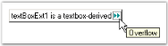
{:.image }

> 
{:.image }
 _Note: If there is no value set for the OverflowIndicatorToolTipText property, then the value set for the Text property of the TextBoxExt will be displayed as the tooltip._

A sample which demonstrates the Text, Text Align, Character Casing, RightToLeft, Multiline, Word Wrap, ScrollBars and Overflow Indicator ToolTip features of TextBoxExt control is available in the below sample installation path.

…\_My Documents\Syncfusion\EssentialStudio\Version Number\Windows\Tools.Windows\Samples\Advanced Editor Functions\ActionGroupingDemo_

Appearance Settings

Background Settings

The background settings of the TextBoxExt control are discussed below.

Background Color

The background color of the control can be set using the property given below.

_Table_ _365__: Property Table_

<table>
<tr>
<td>
TextBoxExt Property</td><td>
Description</td></tr>
<tr>
<td>
BackColor</td><td>
Specifies the background color of the component.</td></tr>
</table>

[C#]

this.textBoxExt1.BackColor = System.Drawing.Color.Moccasin;

[VB.NET]

Me.textBoxExt1.BackColor = System.Drawing.Color.Moccasin

{:.image }

Foreground Settings

The foreground settings of the TextBoxExt control are discussed below.

Foreground Color

The foreground color of the control can be set using the property given below.

_Table_ _366__: Property Table_

<table>
<tr>
<td>
TextBoxExt Property</td><td>
Description</td></tr>
<tr>
<td>
ForeColor</td><td>
Gets / sets the foreground color of the spin box (also known as an up-down control).</td></tr>
</table>

[C#]

this.textBoxExt1.ForeColor = System.Drawing.Color.LightSeaGreen;

[VB.NET]

Me.textBoxExt1.ForeColor = System.Drawing.Color.LightSeaGreen

{:.image }

Behavior Settings

The behavior settings of the TextBoxExt control are discussed below.

MaxLength

The maximum length of the text can be set using the property given below.

_Table_ _367__: Property Table_

<table>
<tr>
<td>
TextBoxExt Property</td><td>
Description</td></tr>
<tr>
<td>
MaxLength</td><td>
Specifies the maximum number of characters that can be entered into the edit control. The default value is set to '32767'.</td></tr>
</table>

[C#]

this.textBoxExt1.MaxLength = 32800;               

[VB]

Me.textBoxExt1.MaxLength = 32800

ReadOnly

The ReadOnly mode can be enabled for the TextBoxExt control using the below given property.

_Table_ _368__: Property Table_

<table>
<tr>
<td>
TextBoxExt Property</td><td>
Description</td></tr>
<tr>
<td>
ReadOnly</td><td>
Specifies whether the text in the edit control can be changed or not.</td></tr>
</table>

[C#]

this.textBoxExt1.ReadOnly = true;

[VB]

Me.textBoxExt1.ReadOnly = True

A sample which demonstrates the ReadOnly mode of TextBoxExt control is available in the below sample installation path.

…\_My Documents\Syncfusion\EssentialStudio\Version Number\Windows\Tools.Windows\Samples\Advanced Editor Functions\ActionGroupingDemo_

Border Settings

The border settings of the TextBoxExt control are discussed in this section.

Color and Styles can be applied to the border of the TextBoxExt control as discussed below.

_Table_ _369__: Property Table_

<table>
<tr>
<td>
TextBoxExt Properties</td><td>
Description</td></tr>
<tr>
<td>
Border3DStyle</td><td>
Indicates the style of the 3D border. The options included are as follows:{{ _RaisedOuter,_ | markdownify }}{{ _SunkenOuter,_ | markdownify }}{{ _RaisedInner,_ | markdownify }}{{ _SunkenInner,_ | markdownify }}{{ _Raised,_ | markdownify }}{{ _Etched,_ | markdownify }}{{ _Bump,_ | markdownify }}{{ _Sunken,_ | markdownify }}{{ _Adjust and_ | markdownify }}{{ _Flat._ | markdownify }}The default value is set to 'Sunken'.</td></tr>
<tr>
<td>
BorderColor</td><td>
Specifies the color of the 2D border.</td></tr>
<tr>
<td>
BorderSides</td><td>
Indicates the border sides of the panel. The options included are as follows:{{ _Left,_ | markdownify }}{{ _Top,_ | markdownify }}{{ _Right,_ | markdownify }}{{ _Bottom,_ | markdownify }}{{ _Middle and_ | markdownify }}{{ _All._ | markdownify }}</td></tr>
<tr>
<td>
BorderStyle</td><td>
Indicates whether the edit control should have a border. The options included are given below:{{ _FixedSingle,_ | markdownify }}{{ _Fixed3D and_ | markdownify }}{{ _None._ | markdownify }}</td></tr>
</table>

[C#]

this.textBoxExt1.Border3DStyle = System.Windows.Forms.Border3DStyle.Raised;

this.textBoxExt1.BorderColor = System.Drawing.Color.Orchid

this.textBoxExt1.BorderSides = System.Windows.Forms.Border3DSide.All;

this.textBoxExt1.BorderStyle = System.Windows.Forms.BorderStyle.FixedSingle;

[VB.NET]

Me.textBoxExt1.Border3DStyle = System.Windows.Forms.Border3DStyle.Raised

Me.textBoxExt1.BorderColor = System.Drawing.Color.Orchid

Me.textBoxExt1.BorderSides = System.Windows.Forms.Border3DSide.All

Me.textBoxExt1.BorderStyle = System.Windows.Forms.BorderStyle.FixedSingle

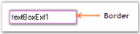
{:.image }

A sample which demonstrates the Border Settings of TextBoxExt control is available in the below sample installation path.

…\_My Documents\Syncfusion\EssentialStudio\Version Number\Windows\Tools.Windows\Samples\Advanced Editor Functions\ActionGroupingDemo_

Layout Settings

The layout settings of the TextBoxExt control are discussed in this section.

The size of the TextBoxExt control can be set according to the needs of the user using the properties discussed below.

_Table_ _370__: Property Table_

<table>
<tr>
<td>
TextBoxExt Properties</td><td>
Description</td></tr>
<tr>
<td>
MaximumSize</td><td>
Gets / sets the maximum size for the control.</td></tr>
<tr>
<td>
MinimumSize</td><td>
Gets / sets the minimum size for the control.</td></tr>
</table>

[C#]

this.textBoxExt1.MaximumSize = new System.Drawing.Size(150, 20);

this.textBoxExt1.MinimumSize = new System.Drawing.Size(150, 20);

[VB.NET]

Me.textBoxExt1.MaximumSize = New System.Drawing.Size(150, 20)

Me.textBoxExt1.MinimumSize = New System.Drawing.Size(150, 20)

{:.image }

Applying Themes

Themes defines the look and feel of the control. This can be enabled using the below given property.

_Table_ _371__: Property Table_

<table>
<tr>
<td>
TextBoxExt Property</td><td>
Description</td></tr>
<tr>
<td>
ThemesEnabled</td><td>
Specifies whether or not to use XP themes, when BorderStyle is set to 'Fixed3D'.</td></tr>
</table>

[C#]

this.textBoxExt1.ThemesEnabled = true;                          

[VB]

Me.textBoxExt1.ThemesEnabled = True

{:.image }

###### TextBoxExt Events 

The list of events and a detailed explanation about each of them is given in the following sections.

_Table_ _372__: Events Table_

<table>
<tr>
<td>
NumericUpDownExt Events</td><td>
Description</td></tr>
<tr>
<td>
Border3DStyleChanged</td><td>
This event occurs when the Border3DStyle property is changed.</td></tr>
<tr>
<td>
BorderColorChanged</td><td>
This event occurs when the BorderColor property is changed.</td></tr>
<tr>
<td>
BorderSidesChanged</td><td>
This event occurs when the BorderSides property is changed.</td></tr>
<tr>
<td>
BorderStyleChanged</td><td>
This event occurs when the ClipText property is changed.</td></tr>
<tr>
<td>
CharacterCasingChanged</td><td>
This event occurs when the CharacterCasing property is changed.</td></tr>
<tr>
<td>
HideSelectionChanged</td><td>
This event occurs when the HideSelection property is changed.</td></tr>
<tr>
<td>
MaximumSizeChanged</td><td>
This event occurs when the MaximumSize property is changed.</td></tr>
<tr>
<td>
MinimumSizeChanged</td><td>
This event occurs when the MinimumSize property is changed.</td></tr>
<tr>
<td>
MultilineChanged</td><td>
This event occurs when the Multiline property is changed.</td></tr>
<tr>
<td>
ReadOnlyChanged</td><td>
This event occurs when the ReadOnly property is changed.</td></tr>
<tr>
<td>
TextAlignChanged</td><td>
This event occurs when the TextAlign property is changed.</td></tr>
<tr>
<td>
ThemesEnabledChanged</td><td>
This event occurs when the ThemesEnabled property is changed.</td></tr>
</table>
Border3DStyleChanged

This event occurs when the Border3DStyle property is changed. The Border3DStyle property indicates the style of the 3D border.

The event handler receives an argument of type EventArgs containing data related to this event.

[C#]

private void textBoxExt1_Border3DStyleChanged(object sender, EventArgs e)

{

Console.WriteLine(" Border3DStyleChanged event is raised ");

}

[VB.NET]

Private Sub textBoxExt1_Border3DStyleChanged(ByVal sender As Object, ByVal e As EventArgs)

Console.WriteLine(" Border3DStyleChanged event is raised ")

End Sub

BorderColorChanged

This event occurs when the BorderColor property is changed. The BorderColor property indicates the color of the 2D border.

The event handler receives an argument of type EventArgs containing data related to this event.

[C#]

private void textBoxExt1_BorderColorChanged(object sender, EventArgs e)

{

Console.WriteLine(" BorderColorChanged event is raised ");

}

[VB.NET]

Private Sub textBoxExt1_BorderColorChanged(ByVal sender As Object, ByVal e As EventArgs)

Console.WriteLine(" BorderColorChanged event is raised ")

End Sub

BorderSidesChanged

This event occurs when the BorderSides property is changed. The BorderSides property indicates the border sides of the panel.

The event handler receives an argument of type EventArgs containing data related to this event.

[C#]

private void textBoxExt1_BorderSidesChanged(object sender, EventArgs e)

{

Console.WriteLine(" BorderSidesChanged event is raised ");

}

[VB.NET]

Private Sub textBoxExt1_BorderSidesChanged(ByVal sender As Object, ByVal e As EventArgs)

Console.WriteLine(" BorderSidesChanged event is raised ")

End Sub

BorderStyleChanged

This event occurs when the BorderStyle property is changed. The BorderStyle property indicates whether the edit control should have a border.

The event handler receives an argument of type EventArgs containing data related to this event.

[C#]

private void textBoxExt1_BorderStyleChanged(object sender, EventArgs e)

{

Console.WriteLine(" BorderStyleChanged event is raised ");

}

[VB.NET]

Private Sub textBoxExt1_BorderStyleChanged(ByVal sender As Object, ByVal e As EventArgs)

Console.WriteLine(" BorderStyleChanged event is raised ")

End Sub

CharacterCasingChanged

This event occurs when the CharacterCasing property is changed. The CharacterCasing property gets / sets the case of the characters as they are typed.

The event handler receives an argument of type EventArgs containing data related to this event.

[C#]

private void textBoxExt1_CharacterCasingChanged(object sender, EventArgs e)

{

Console.WriteLine(" CharacterCasingChanged event is raised ");

}

[VB.NET]

Private Sub textBoxExt1_CharacterCasingChanged(ByVal sender As Object, ByVal e As EventArgs)

Console.WriteLine(" CharacterCasingChanged event is raised ")

End Sub

HideSelectionChanged

This event occurs when the HideSelection property is changed. The HideSelection property indicates that the selection should be hidden when the edit control loses focus.

The event handler receives an argument of type EventArgs containing data related to this event.

[C#]

private void textBoxExt1_HideSelectionChanged(object sender, EventArgs e)

{

Console.WriteLine(" HideSelectionChanged event is raised ");

}

[VB.NET]

Private Sub textBoxExt1_HideSelectionChanged(ByVal sender As Object, ByVal e As EventArgs)

Console.WriteLine(" HideSelectionChanged event is raised ")

End Sub

MaximumSizeChanged 

This event occurs when the MaximumSize property is changed. The MaximumSize property gets / sets the maximum size of the control.

The event handler receives an argument of type EventArgs containing data related to this event.

[C#]

private void textBoxExt1_MaximumSizeChanged(object sender, EventArgs e)

{

Console.WriteLine(" MaximumSizeChanged event is raised ");

}

[VB.NET]

Private Sub textBoxExt1_MaximumSizeChanged(ByVal sender As Object, ByVal e As EventArgs)

Console.WriteLine(" MaximumSizeChanged event is raised ")

End Sub

MinimumSizeChanged 

This event occurs when the MinimumSize property is changed. The MinimumSize property gets / sets the minimum size of the control.

The event handler receives an argument of type EventArgs containing data related to this event.

[C#]

private void textBoxExt1_MinimumSizeChanged(object sender, EventArgs e)

{

Console.WriteLine(" MinimumSizeChanged event is raised ");

}

[VB.NET]

Private Sub textBoxExt1_MinimumSizeChanged(ByVal sender As Object, ByVal e As EventArgs)

Console.WriteLine(" MinimumSizeChanged event is raised ")

End Sub

MultilineChanged 

This event occurs when the Multiline property is changed. The Multiline property controls whether the text of the edit control can span more than one line.

The event handler receives an argument of type EventArgs containing data related to this event.

[C#]

private void textBoxExt1_MultilineChanged(object sender, EventArgs e)

{

Console.WriteLine(" MultilineChanged event is raised ");

}

[VB.NET]

Private Sub textBoxExt1_MultilineChanged(ByVal sender As Object, ByVal e As EventArgs)

Console.WriteLine(" MultilineChanged event is raised ")

End Sub

ReadOnlyChanged 

This event occurs when the ReadOnly property is changed. The ReadOnly property controls whether the text in the edit control can be changed or not.

The event handler receives an argument of type EventArgs containing data related to this event.

[C#]

private void textBoxExt1_ReadOnlyChanged(object sender, EventArgs e)

{

Console.WriteLine(" ReadOnlyChanged event is raised ");

}

[VB.NET]

Private Sub textBoxExt1_ReadOnlyChanged(ByVal sender As Object, ByVal e As EventArgs)

Console.WriteLine(" ReadOnlyChanged event is raised ")

End Sub

TextAlignChanged 

This event occurs when the TextAlign property is changed. The TextAlign property indicates how the text should be aligned for edit controls.

The event handler receives an argument of type EventArgs containing data related to this event.

[C#]

private void textBoxExt1_TextAlignChanged(object sender, EventArgs e)

{

Console.WriteLine(" TextAlignChanged event is raised ");

}

[VB.NET]

Private Sub textBoxExt1_TextAlignChanged(ByVal sender As Object, ByVal e As EventArgs)

Console.WriteLine(" TextAlignChanged event is raised ")

End Sub

ThemesEnabledChanged

This event occurs when the ThemesEnabled property is changed. The ThemesEnabled property specifies whether or not to use XP Themes when the BorderStyle property is set to 'Fixed3D'.

The event handler receives an argument of type EventArgs containing data related to this event.

[C#]

private void textBoxExt1_ThemesEnabledChanged(object sender, EventArgs e)

{

Console.WriteLine(" ThemesEnabledChanged event is raised ");

}

[VB.NET]

Private Sub textBoxExt1_ThemesEnabledChanged(ByVal sender As Object, ByVal e As EventArgs)

Console.WriteLine(" ThemesEnabledChanged event is raised ")

End Sub

##### Revamping of Editors Controls

DoubleTextBox, IntegerTextBox, PercentTextBox, and CurrencyTextBox has been revamped, details of the revamping and the Changes in the behavior and properties are described here.

###### Properties Deprecated

_Table_ _373__: Property Table_

<table>
<tr>
<td>
Property</td><td>
Alternatives</td><td>
Comments</td></tr>
<tr>
<td>
NullState</td><td>
IsNull</td><td>
Deprecated as it should have Getter alone.</td></tr>
<tr>
<td>
UseNullString</td><td>
AllowNull</td><td>
This behavior is incorporated with AllowNull; previously both AllowNull and UseNullString existed. Removed for better clarity.</td></tr>
<tr>
<td>
IsNullValue</td><td>
IsNull</td><td>
IsNullValue means the same as NullState and IsNull, and it has been deprecated for better clarity.</td></tr>
<tr>
<td>
MaxLength</td><td>
MaxValue,NumberDecimalDigits</td><td>
Max length is removed as there is a conflict. Hence use MaxValue and NumberDecimalDigits as alternatives.</td></tr>
<tr>
<td>
EnforceMinMaxDuringValidating</td><td>
OnValidationFailed.KeepFocus</td><td>
No need for a separate propertyas MinMaxValidation already existsThe same behavior can be achieved with the alternative.</td></tr>
</table>
###### Newly Added API’S

_Table_ _374__: Property Table_

<table>
<tr>
<td>
Property</td><td>
Description</td><td>
Behavior</td></tr>
<tr>
<td>
IsNull (Read Only)</td><td>
Returns a Boolean specifying the NullState of the control</td><td>
True when Control.Text equals String.Empty or NullString.</td></tr>
<tr>
<td>
AllowNull</td><td>
Specifies whether the field Can be nulled.</td><td>
Related to NullString.NullString will be set when the field is null.</td></tr>
<tr>
<td>
NullString</td><td>
Specifies the string that will be set when the field is Null.</td><td>
AllowNull must be true to set this string . If it is false, zero or MinValue,  whichever is higher of these will be set. It must be left blank if the field has to be empty</td></tr>
<tr>
<td>
*OnValidationFailed</td><td>
Specifies the action to be performed while validation fails.</td><td>
SetNullString,SeMinOrMax,KeepFocus.refer Notes column</td></tr>
</table>
###### Behavioral Changes

_Table_ _375__: Property Table_

<table>
<tr>
<td>
Property</td><td>
Description</td><td>
Behavior</td></tr>
<tr>
<td>
*MinMaxValidation.OnKeyPress</td><td>
Each and every key press is validated to make the value meet the constraints.</td><td>
This is most useful when the MinValue is less than 10.Refer Notes column</td></tr>
<tr>
<td>
*MinMaxValidation.OnLostFocus</td><td>
Validation happens only when the control loses its focus.</td><td>
This allows the user to enter any value and it is validated when the focus is lost.You can make use of OnValidationFailed property to gain control when validation fails.Refer Notes column</td></tr>
<tr>
<td>
MinValue</td><td>
Cannot be greater than MaxValue.</td><td>
Exception will be thrown.MaxValue has to be reset the accordingly.</td></tr>
<tr>
<td>
MaxValue</td><td>
Cannot be lesser than MinValue</td><td>
Exception will be thrown.MinValue  has to be reset the accordingly.</td></tr>
<tr>
<td>
NullString</td><td>
Cannot be a Numeric Value that could break the MinValue or MaxValue constraints.</td><td>
Ex: MinValue 10, MaxValue 100 and NullString as “111” will break the Min Max Values.</td></tr>
</table>
> 
{:.image }
_Note:_

* With MinMaxValidation.OnKeyPress and MinValue as 10 set,
* Each and every key press will be validated to meet the constraints, so this will not allow you to enter values less than 10, even if you try to enter 11 you cannot input value as every keypress is validated. This behavior is useful when MinValue is less than 10. 
* With MinMaxValidation.OnLostFocus, user inputs will be validated only when the control loses its focus. Hence user can input any value.  OnValidationFailed will give you access to what action [SetNullString, SetMinorMax, KeepFocus] has to be done when Validation fails for the input.
* With OnValidationFailed.SetNullString set and AllowNull is False,the control will keep its focus. 
### Font Controls

The Font controls of Essential Tools are listed below.

##### FontListBox

The FontListBox is a list box derived control that are automatically populated with the fonts installed on the user's system. It provide an easy way to fill a list box with system fonts. 

{:.image }

See Also

###### Features

FontListBox displays and allow selection of fonts. It has following features.

* The FontListBox control automatically fills the listbox with the fonts installed in the system.
* Has options in selecting the fonts such as single-select, multi select or not selectable. See Selection Mode topic.
* Vertical and horizontal scrollbars available for the FontListBox control.

A sample which demonstrates the features of FontListBox control is available in the below sample installation location.

…\_My Documents\Syncfusion\EssentialStudio\Version Number\Windows\Tools.Windows\Samples\Advanced Editor Functions\ActionGroupingDemo_

See Also

Concepts and Features

###### Creating FontListBox

To use a FontListBox control in your application, all you need to do is drag and drop the FontListBox control from the toolbox onto your form.

{:.image }

It can be created programmatically as follows.

231. Include the required namespace.

[C#]

using Syncfusion.Windows.Forms.Tools;

[VB.NET]

Imports Syncfusion.Windows.Forms.Tools

232. Create an instances of FontListBox control. Specify its size and finally add that instance to that Form.

[C#]

private Syncfusion.Windows.Forms.Tools.FontListBox fontListBox1;

this.fontListBox1=new Syncfusion.Windows.Forms.Tools.FontListBox();

this.fontListBox1.Size = new System.Drawing.Size(152, 94);

this.Controls.Add(this.fontListBox1);

[VB.NET]

Private fontListBox1 As Syncfusion.Windows.Forms.Tools.FontListBox

Me.fontListBox1 = New Syncfusion.Windows.Forms.Tools.FontListBox()

Me.fontListBox1.Size = New System.Drawing.Size(152, 21)

Me.Controls.Add(Me.fontListBox1)

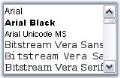
{:.image }

###### Concepts and Features

This section will discuss the concepts and features of the FontListBox control in the below topics.

Selection Mode

At run time, the items in the FontListBox can be selected, based on the selection mode specified in SelectionMode property. Selection can be made using mouse as well as using keyboard. 

The options are,

* one, 
* MultiSimple, and 
* MultiExtended.

[C#]

this.fontListBox1.SelectionMode = System.Windows.Forms.SelectionMode.MultiExtended;

[VB.NET]

Me.fontListBox1.SelectionMode = System.Windows.Forms.SelectionMode.MultiExtended

{:.image }

ScrollBar Settings

FontListBox control by default has a vertical scrollbar. It can also have a horizontal scrollbar. This section will discuss the properties which sets the scrollbar for the control.

Horizontal Scrollbar

Horizontal scrollbar can be displayed if the items are beyond the right edge of the FontListBox. The below properties lets you do that.

_Table_ _376__: Property Table_

<table>
<tr>
<td>
Properties</td><td>
Description</td></tr>
<tr>
<td>
HorizontalScrollbar</td><td>
Sets the horizontal scrollbar for the control if the item exceeds beyond the right edge of the FontListBox control.</td></tr>
<tr>
<td>
HorizontalExtent</td><td>
Specifies the width of the control, when HorizontalScrollBar property is set to true.</td></tr>
</table>

[C#]

this.fontListBox1.HorizontalExtent = 150;

this.fontListBox1.HorizontalScrollbar = true;

[VB.NET]

Me.fontListBox1.HorizontalExtent = 150

Me.fontListBox1.HorizontalScrollbar = True

{:.image }

See Also

How to display the scrollbars always, irrespective of the number of items?

FontListBox Items

Height of the FontList Items

We can set the height of the item inside the listbox through ItemHeight property. Default value is 15. 

[C#]

this.fontListBox1.ItemHeight = 20;

[VB.NET]

Me.fontListBox1.ItemHeight = 20

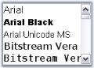
{:.image }

Sorting the Items

Sorting of the items can be enabled using Sorted property. By default it is false.

[C#]

this.fontListBox1.Sorted = true;

[VB.NET]

Me.fontListBox1.Sorted = True

AutoCompleting the Items

FontListBox control has the ability to auto complete the items as we type in the listbox. This feature is enabled using UseAutoComplete property to true.

[C#]

this.fontListBox1.UseAutoComplete = true;

[VB.NET]

Me.fontListBox1.UseAutoComplete = True

###### Frequently Asked Questions

This section illustrates the solutions for various task-based queries about the control.

###### How to display the scrollbars always, irrespective of the number of items

The scrollbar can be always made visible, irrespective of the number of items, present in it, by setting ScrollAlwaysVisible property to true. 

[C#]

this.fontListBox1.ScrollAlwaysVisible = true;

[VB.NET]

Me.fontListBox1.ScrollAlwaysVisible = True

###### Events

SelectedIndexChanged event - This event is raised when the ListBox.SelectedIndex property is changed. 

The below code snippet, lets you set the selected font style, for a label, on selecting through a FontListBox, using SelectedIndexChanged event.

[C#]

private void fontListBox1_SelectedIndexChanged(object sender, EventArgs e)

{

    this.label1.Font = new Font(this.fontListBox1.SelectedItem.ToString(), 11, FontStyle.Regular);

}

[VB.NET]

Private Sub fontListBox1_SelectedIndexChanged(ByVal sender As Object, ByVal e As EventArgs)

    Me.label1.Font = New Font(Me.fontListBox1.SelectedItem.ToString(), 11, FontStyle.Regular)

End Sub

##### FontComboBox

The FontComboBox is a combo box-derived controls that are automatically populated with the fonts installed on the user's system. It provide an easy way to fill a combo box with system fonts.

{:.image }

See Also

###### Features

FontComboBox allows selection of fonts. It has following features.

* The FontComboBox control automatically fills the listbox with the fonts installed in the system.
* The FontComboBox control provides auto completion from the list.
* Customization options available for the ComboBox DropDown.
* Office2007 look and feel for the FontComboBox control with all the three color schemes.

A sample which demonstrates the features of FontComboBox control is available in the below sample installation location.

_..\My Documents\Syncfusion\EssentialStudio\Version Number\Windows\Tools.Windows\Samples\2.0\Editors Package\FontComboBox_

See Also

Concepts and Features

###### Creating FontComboBox

To use a FontComboBox control in your application, all you need to do is drag and drop the FontComboBox control from the controls toolbox onto your form. 

{:.image }

It can be created programmatically as follows.

233. Include the required namespace. 

[C#]

using Syncfusion.Windows.Forms.Tools;

[VB.NET]

Imports Syncfusion.Windows.Forms.Tools

234. Create an instance of FontComboBox control. Specify its size and finally add that instance to that Form.

[C#]

private Syncfusion.Windows.Forms.Tools.FontComboBox fontComboBox1;

this.fontComboBox1=new Syncfusion.Windows.Forms.Tools.FontComboBox();

this.fontComboBox1.Size = new System.Drawing.Size(152, 21);

this.Controls.Add(this.fontComboBox1);

[VB.NET]

Private fontComboBox1 As Syncfusion.Windows.Forms.Tools.FontComboBox

Me.fontComboBox1 = New Syncfusion.Windows.Forms.Tools.FontComboBox()

Me.fontComboBox1.Size = New System.Drawing.Size(152, 21)

Me.Controls.Add(Me.fontComboBox1)

{:.image }

###### Concepts and Features

The below topics are discussed in this section.

AutoComplete

The AutoComplete feature of the FontComboBox can be turned on\off depending upon the type of behavior that is required for the FontComboBox control. The below properties enables the auto complete feature.

_Table_ _377__: Property Table_

<table>
<tr>
<td>
Properties</td><td>
Description</td></tr>
<tr>
<td>
UseAutoComplete</td><td>
Specifies whether auto complete feature is implemented in the control.</td></tr>
<tr>
<td>
AutoCompleteSource</td><td>
Specifies the source of the complete strings used for auto completion. DropDownStyle property should be set to "DropDown" to make this setting effective. </td></tr>
<tr>
<td>
AutoCompleteCustomSource</td><td>
Represents the collection of string for the custom source, when AutoCompleteSource is set to CustomSource.</td></tr>
</table>

[C#]

// Enables AutoComplete feature.

this.fontComboBox1.UseAutoComplete =true;

this.fontComboBox2.AutoCompleteCustomSource.AddRange(new string[] { "Calibria", "Cambria", "Candara"});

this.fontComboBox2.AutoCompleteMode = System.Windows.Forms.AutoCompleteMode.SuggestAppend;

this.fontComboBox2.AutoCompleteSource = System.Windows.Forms.AutoCompleteSource.CustomSource;

[VB.NET]

' Enables AutoComplete feature.

Me.fontComboBox1.UseAutoComplete = True

Me.fontComboBox2.AutoCompleteCustomSource.AddRange(New String() {"Calibria", "Cambria", "Candara"}) 

Me.fontComboBox2.AutoCompleteMode = System.Windows.Forms.AutoCompleteMode.SuggestAppend

Me.fontComboBox2.AutoCompleteSource = System.Windows.Forms.AutoCompleteSource.CustomSource

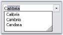
{:.image }

See Also

DropDown Settings

DropDown Settings

FontComboBox has properties to control the appearance and behavior of the dropdown.

_Table_ _378__: Property Table_

<table>
<tr>
<td>
Properties</td><td>
Description</td></tr>
<tr>
<td>
DropDownStyle</td><td>
Specifies the style of the dropdown. The options are,{{ _DropDownList_ | markdownify }} - The user cannot directly edit the text portion. The user must click the arrow button to display the list portion,{{ _DropDown (default)_ | markdownify }} - The user can directly edit the text portion. The user must click the arrow button to display the list portion,{{ _Simple_ | markdownify }} - The text portion is editable. The list portion is always visible.</td></tr>
<tr>
<td>
DropDownHeight</td><td>
Specifies the height of the dropdown combo box in pixels.</td></tr>
<tr>
<td>
DropDownWidth</td><td>
Specifies the width of the dropdown combo box in pixels.</td></tr>
<tr>
<td>
MaxDropDownItems</td><td>
Indicates the maximum number of entries to display in the drop down list.</td></tr>
</table>

[C#]

this.fontComboBox2.DropDownHeight = 107;

this.fontComboBox2.DropDownStyle = System.Windows.Forms.ComboBoxStyle.DropDownList;

this.fontComboBox2.DropDownWidth = 154;

this.fontComboBox2.MaxDropDownItems = 10;

[VB.NET]

Me.fontComboBox2.DropDownHeight = 107

Me.fontComboBox2.DropDownStyle = System.Windows.Forms.ComboBoxStyle.DropDownList

Me.fontComboBox2.DropDownWidth = 154

Me.fontComboBox2.MaxDropDownItems = 10

Customizing DropDown Items

The height of the FontComboBox items is specified in ItemHeight property and sorting of the items is enabled through Sorted property.

[C#]

this.fontComboBox2.ItemHeight = 17;

this.fontComboBox2.Sorted = true;

[VB.NET]

Me.fontComboBox2.ItemHeight = 17

Me.fontComboBox2.Sorted = True

Visual Styles

The Office2007 visual style for the FontComboBox control can be enabled through below properties.

_Table_ _379__: Property Table_

<table>
<tr>
<td>
Properties</td><td>
Description</td></tr>
<tr>
<td>
VisualStyle</td><td>
Sets the visual style for the control. The options are,Default (default value) andOffice2007.</td></tr>
<tr>
<td>
Office2007ColorScheme</td><td>
Specifies the office color schemes. The color schemes are,Blue,Silver and Black.</td></tr>
</table>

[C#]

this.fontComboBox2.VisualStyle = Syncfusion.Windows.Forms.Tools.ThemedComboBoxStyles.Office2007;

this.fontComboBox2.Office2007ColorTheme = Syncfusion.Windows.Forms.Office2007Theme.Silver;

[VB.NET]

Me.fontComboBox2.VisualStyle = Syncfusion.Windows.Forms.Tools.ThemedComboBoxStyles.Office2007

Me.fontComboBox2.Office2007ColorTheme = Syncfusion.Windows.Forms.Office2007Theme.Silver

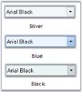
{:.image }

Custom Colors

We can also apply custom colors to the FontComboBox control by setting Office2007ColorTheme to "Managed" and specifying the custom color through the ApplyManagedColors method as follows.

[C#]

this.fontComboBox2.Office2007ColorTheme = Syncfusion.Windows.Forms.Office2007Theme.Managed;

Office2007Colors.ApplyManagedColors(this, Color.Orchid);

[VB.NET]

Me.fontComboBox2.Office2007ColorTheme = Syncfusion.Windows.Forms.Office2007Theme.Managed;

Office2007Colors.ApplyManagedColors(Me, Color.Orchid)

{:.image }

###### Events

This section comprises the below events:

SelectedIndexChanged Event

SelectedIndexChanged event - This event is raised when the ComboBox.SelectedIndex property is changed. 

The below code snippet, lets you set the selected font style, for a label, on selecting through a FontComboBox, using SelectedIndexChanged event.

[C#]

private void fontComboBox2_SelectedIndexChanged(object sender, EventArgs e)

{

    this.label1.Font = new Font(this.fontComboBox2.SelectedItem.ToString(), 11, FontStyle.Regular);

}

[VB.NET]

Private Sub fontComboBox2_SelectedIndexChanged(ByVal sender As Object, ByVal e As EventArgs)

    Me.label1.Font = New Font(Me.fontComboBox2.SelectedItem.ToString(), 11, FontStyle.Regular)

End Sub

FontSelected Event

To add FontSelected event, derive the classes as shown below.

235. Add an event in the derived class.

[C#]

// Adding event.

public event System.EventHandler FontSelected;

[VB.NET]

' Adding event.

Public Event FontSelected As System.EventHandler

236. Override the OnSelectedIndexChanged method and fire the event there.

[C#]

protected override void OnSelectedIndexChanged(EventArgs e) 

{

   // FontSelected event fires here.

if(FontSelected!=null) FontSelected(this,e);

base.OnSelectedIndexChanged (e);

}

[VB.NET]

Protected Overrides Sub OnSelectedIndexChanged(ByVal e As EventArgs)

   ' FontSelected event fires here.

RaiseEvent FontSelected(Me, e)

MyBase.OnSelectedIndexChanged(e)

End Sub

### Label Controls

The following are the advanced versions of Windows Label controls.

#### AutoLabel

The AutoLabel control is a label-derived control that lets you pair a label with any other control. Once paired, the AutoLabel will be automatically repositioned as the labeled control's position changes.

{:.image }

The FlowLayout layout manager will always treat the AutoLabel-labeled control pair as a unit. You can use AutoLabels and FlowLayouts together to implement complex and powerful form layouts.

See Also

Labeling a Control

###### Features

AutoLabel helps to label other controls. It has the following features.

Features

* Labeling a Control

A control can be labeled using the LabeledControl property. The position of the AutoLabel gets automatically updated according  to the position of the labeled control.

* Spacing

The horizontal and vertical space between the AutoLabel and the labeled control can be set using the spacing properties of the control.

* Position

The AutoLabel can be placed at the top, bottom, left or right of the labeled control using the Position property of the control.

* Size

The AutoLabel can be resized automatically.

See Also

Concepts and Features

###### Creating AutoLabel

The AutoLabel control can be created in the following ways.

Through Designer

The following steps illustrate how to create an AutoLabel control through designer.

* Create or open a Windows Forms project.
* Add an AutoLabel Control from the toolbox onto the form by dragging and dropping it on the form or double clicking the control.

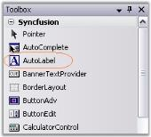
{:.image }

* Set the desired properties for the control through theProperty grid.
* Run the application.

{:.image }

See Also

Through Code

Through Code

The following steps illustrate how to create an AutoLabel control programmatically.

* Create a C# or VB.NET application though Visual Studio.
* Add the required assembly references.
* Include the required namespace.

[C#]

using Syncfusion.Windows.Forms.Tools;

[VB.NET]

Imports Syncfusion.Windows.Forms.Tools

* Declare the AutoLabel control.

[C#]

private Syncfusion.Windows.Forms.Tools.AutoLabel autoLabel1;

[VB.NET]

Private autoLabel1 As Syncfusion.Windows.Forms.Tools.AutoLabel

* Initialize the control.

[C#]

this.autoLabel1 = new Syncfusion.Windows.Forms.Tools.AutoLabel();

[VB.NET]

Me.autoLabel1 = New Syncfusion.Windows.Forms.Tools.AutoLabel()

* Set the properties for the AutoLabel control and add it to your form.

[C#]

this.autoLabel1.Text = "autoLabel1";

this.autoLabel1.BackColor = System.Drawing.Color.BurlyWood;

this.autoLabel1.ForeColor = System.Drawing.Color.SaddleBrown;

this.autoLabel1.Font = new System.Drawing.Font("Microsoft Sans Serif", 8.25F, System.Drawing.FontStyle.Bold, System.Drawing.GraphicsUnit.Point, ((byte)(0)));

this.autoLabel1.TextAlign = System.Drawing.ContentAlignment.MiddleCenter;

// Add the AutoLabel control to the Form.

this.Controls.Add(this.autoLabel1);

[VB.NET]

Me.autoLabel1.Text = "autoLabel1"

Me.autoLabel1.BackColor = System.Drawing.Color.BurlyWood

Me.autoLabel1.ForeColor = System.Drawing.Color.SaddleBrown

Me.autoLabel1.Font = New System.Drawing.Font("Microsoft Sans Serif", 8.25F, System.Drawing.FontStyle.Bold, System.Drawing.GraphicsUnit.Point, CByte((0)))

Me.autoLabel1.TextAlign = System.Drawing.ContentAlignment.MiddleCenter

' Add the AutoLabel control to the Form.

Me.Controls.Add(Me.autoLabel1)

* Run the application.

{:.image }

###### Concepts and Features

This section explains the concepts and features of the AutoLabelcontrol which will help to understand the control better. The following are the features discussed.

Labeling a Control

The following steps allows you to label a control.

* Create or open a Windows forms project.
* Add an AutoLabel Control from the toolbox onto the form by dragging and dropping it on the form or double clicking the control.
* Add the control (TextBox) that has to be labeled to the form.
* Go to the Property grid and select the LabeledControl property.
* Select the control to be labeled (TextBox) from the dropdown box as shown below.

{:.image }

[C#]

private Syncfusion.Windows.Forms.Tools.AutoLabel autoLabel1;

this.autoLabel1 = new Syncfusion.Windows.Forms.Tools.AutoLabel();

this.autoLabel1.LabeledControl = this.textBox1;

this.Controls.Add(this.autoLabel1);

[VB.NET]

Private autoLabel1 As Syncfusion.Windows.Forms.Tools.AutoLabel

Me.autoLabel1 = New Syncfusion.Windows.Forms.Tools.AutoLabel()

Me.autoLabel1.LabeledControl = Me.textBox1

Me.Controls.Add(Me.autoLabel1)

* Run the application.

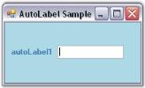
{:.image }

Spacing

The space between the AutoLabel control and the labeled control can be customized using the properties given below. When using relative positioning, you can also specify the gap between the label and the control.

_Table_ _380__: Property Table_

<table>
<tr>
<td>
AutoLabel Properties</td><td>
Description</td></tr>
<tr>
<td>
DX</td><td>
The effective horizontal distance between the left of the AutoLabel and its labeled control.</td></tr>
<tr>
<td>
DY</td><td>
The effective vertical distance between the top of the AutoLabel and its labeled control.</td></tr>
<tr>
<td>
Gap</td><td>
Specifies the horizontal and vertical gap to use when computing the relative position.</td></tr>
</table>

[C#]

this.autoLabel1.DX = -80;

this.autoLabel1.DY = 3;

this.autoLabel1.Gap = 10;

[VB.NET]

Me.autoLabel1.DX = -80

Me.autoLabel1.DY = 3

Me.autoLabel1.Gap = 10

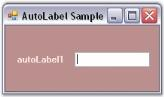
{:.image }

Position

The AutoLabel control can be positioned relative to the top, left, bottom or right of the labeled control. You can do this using the below given property.

_Table_ _381__: Property Table_

<table>
<tr>
<td>
AutoLabel Property</td><td>
Description</td></tr>
<tr>
<td>
Position</td><td>
Specifies the relative position of the control and the AutoLabel.The options included are as follows.{{ _Custom,_ | markdownify }}{{ _Left,_ | markdownify }}{{ _Left and_ | markdownify }}{{ _Top._ | markdownify }}</td></tr>
</table>

When the Position property is set to 'Custom', you can drag the label to the required position using the mouse.

[C#]

this.autoLabel1.Position = Syncfusion.Windows.Forms.Tools.AutoLabelPosition.Top;

[VB.NET]

Me.autoLabel1.Position = Syncfusion.Windows.Forms.Tools.AutoLabelPosition.Top

{:.image }

{:.image }

Size

This section illustrates the size settings of the AutoLabel control.

The AutoLabel control can be resized using the below given property.

_Table_ _382__: Property Table_

<table>
<tr>
<td>
AutoLabel Property</td><td>
Description</td></tr>
<tr>
<td>
AutoSize</td><td>
Enables automatic resizing based on font size.</td></tr>
</table>
> 
{:.image }
 _Note: This is valid only for label controls that do not wrap text._

[C#]

this.autoLabel1.AutoSize = true;

[VB.NET]

Me.autoLabel1.AutoSize = True

###### AutoLabel Event

A detailed explanation about the PropertyChanged event is given in the following section.

_Table_ _383__: Event Table_

<table>
<tr>
<td>
AutoLabel Event</td><td>
Description</td></tr>
<tr>
<td>
PropertyChanged</td><td>
This event is fired when the LabeledControl, Gap or Position properties change.</td></tr>
</table>
PropertyChanged Event

This event is fired when the LabeledControl, Gap or Position properties of this class change.

The event handler receives an argument of type SyncfusionPropertyChangedEventArgs containing data related to this event.

[C#]

private void autoLabel1_PropertyChanged(object sender, Syncfusion.ComponentModel.SyncfusionPropertyChangedEventArgs e)

{

Console.WriteLine(" PropertyChanged event is raised");

}

[VB.NET]

Private Sub autoLabel1_PropertyChanged(ByVal sender As Object, ByVal e As Syncfusion.ComponentModel.SyncfusionPropertyChangedEventArgs)

Console.WriteLine(" PropertyChanged event is raised")

End Sub

#### GradientLabel

The GradientLabel class provides a way to create fancy and appealing labels in your forms.

The GradientLabel class is fully compatible with the Windows Forms label that it derives from and gets most of its uniqueness from the BrushInfo class that is used for the GradientLabel.BackgroundColor property.

The GradientLabel.Border3DStyle is another property that can specify the look and feel of the GradientLabel.

{:.image }

The .NET framework provides a label control typically used to provide descriptive text for a control. The Essential Tools' GradientLabel control provides an easy way to display labels with attractive shades and backgrounds.

> 
{:.image }
 _Note: All the other functions of the GradientLabel is the same as the System.Windows.Forms.Label control in the Windows Forms library._ 

See Also

###### Features

GradientLabelis a Label control that supports extensive background customization and contains the following features.

Features

* Border Settings

The GradientLabel helps users create attractive labels in an application and supports numerous borders.

* Foreground Settings

Disabled text can be drawn active or inactive using this control.

* Background Settings

Provides enhanced look and feel with gradient backgrounds that can be set using the Background property of the GradientLabel control.

* Serialization

It provides serialization support.

See Also

Concepts and Features

###### Creating GradientLabel

The GradientLabel control can be created in the following ways.

Through Designer

To create a GradientLabel control through designer,

* Create or open a Windows Forms project.
* Add a GradientLabel Control from the toolbox onto the form by dragging and dropping it on the form or double clicking the control.

{:.image }

* Set the desired properties for the control through theProperty grid.
* Run the application.

{:.image }

See Also

Through Code

Through Code

GradientLabel can be created programmatically as detailed below.

* Create a C# or VB.NET application though Visual Studio.
* Add the required assembly references.
* Include the required namespace.

[C#]

using Syncfusion.Windows.Forms.Tools;

[VB.NET]

Imports Syncfusion.Windows.Forms.Tools

* Declare the GradientLabel control.

[C#]

private Syncfusion.Windows.Forms.Tools.GradientLabel gradientLabel1;

[VB.NET]

Private gradientLabel1 As Syncfusion.Windows.Forms.Tools.GradientLabel

* Initialize the control.

[C#]

this.gradientLabel1 = new Syncfusion.Windows.Forms.Tools.GradientLabel();

[VB.NET]

Me.gradientLabel1 = New Syncfusion.Windows.Forms.Tools.GradientLabel()

* Set the properties for the GradientLabel control and add it to your form.

[C#]

this.gradientLabel1.BorderStyle = System.Windows.Forms.Border3DStyle.Sunken;

this.gradientLabel1.ForeColor = System.Drawing.SystemColors.Info;

this.gradientLabel1.Text = "Syncfusion Control";

// Add the GradientLabel control to the Form.

this.Controls.Add(this.gradientLabel1);

[VB.NET]

Me.gradientLabel1.BorderStyle = System.Windows.Forms.Border3DStyle.Sunken

Me.gradientLabel1.ForeColor = System.Drawing.SystemColors.Info

Me.gradientLabel1.Text = "Syncfusion Control"

' Add the GradientLabel control to the Form.

Me.Controls.Add(Me.gradientLabel1)

* Run the application.

{:.image }

###### Concepts and Features

The following topics will help you become more familiar in using the GradientLabel control.

Border Settings

This section discusses the border settings of the GradientLabel control.

The border style and sides of the GradientLabel can be customized using the properties given below.

_Table_ _384__: Property Table_

<table>
<tr>
<td>
GradientLabel Properties</td><td>
Description</td></tr>
<tr>
<td>
BorderSides</td><td>
Specifies the sides of the GradientLabel that will have a border.  The options included are as follows.{{ _Left,_ | markdownify }}{{ _Top,_ | markdownify }}{{ _Right,_ | markdownify }}{{ _Bottom,_ | markdownify }}{{ _Middle and_ | markdownify }}{{ _All._ | markdownify }}The default value is set to 'All'.</td></tr>
<tr>
<td>
BorderStyle</td><td>
Specifies the 3D border style for the GradientLabel.The options included are as follows.{{ _Raised,_ | markdownify }}{{ _RaisedOuter,_ | markdownify }}{{ _RaisedInner,_ | markdownify }}{{ _Sunken,_ | markdownify }}{{ _SunkenOuter,_ | markdownify }}{{ _SunkenInner,_ | markdownify }}{{ _Etched,_ | markdownify }}{{ _Bump,_ | markdownify }}{{ _Adjust and_ | markdownify }}{{ _Flat._ | markdownify }}The default value is set to 'Sunken'.</td></tr>
<tr>
<td>
BorderColor</td><td>
Sets the color for the 2D border. The BorderColor will be effective only when the BorderStyle property is set to FixedSingle.</td></tr>
</table>

We can set the border sides for the GradientLabel using the BorderSides property.If BorderSides is set to 'Left', only the left border of GradientLabel will be shown.

The GradientLabel replaces the default border style provided for Label classes with the Border3DStyle type in this property. This property uses the Border3DStyle enumeration.

In 3D mode, the border styles can be Raised, Sunken, Flat and so on. Setting the value to 'Adjust' shows no border.

[C#]

this.gradientLabel1.BorderSides = System.Windows.Forms.Border3DSide.Top;

this.gradientLabel1.BorderStyle = System.Windows.Forms.Border3DStyle.Flat;

this.gradientLabel1.BorderColor = Color.Red;

[VB.NET]

Me.gradientLabel1.BorderSides = System.Windows.Forms.Border3DSide.Top

Me.gradientLabel1.BorderStyle = System.Windows.Forms.Border3DStyle.Flat

Me.gradientLabel1.BorderColor = Color.Red

{:.image }

Foreground Settings

This section illustrates the foreground settings of the GradientLabel control.

DrawActiveWhenDisabled

Disabled text can be drawn active using the below given property.

_Table_ _385__: Property Table_

<table>
<tr>
<td>
GradientLabel Property</td><td>
Description</td></tr>
<tr>
<td>
DrawActiveWhenDisabled</td><td>
Gets / sets a value indicating whether the text should be drawn active when the control is disabled. The default value is set to 'False'.</td></tr>
</table>

[C#]

this.gradientLabel1.DrawActiveWhenDisabled = true;

[VB.NET]

Me.gradientLabel1.DrawActiveWhenDisabled = True

Background Settings

This section illustrates the background settings of the GradientLabel control.

The GradientLabel control's background can be customized using the various options provided by the BackgroundColor property given below.

_Table_ _386__: Property Table_

<table>
<tr>
<td>
GradientLabel Properties</td><td>
Description</td></tr>
<tr>
<td>
BackgroundColor</td><td>
Gets / sets the background color and other styles.</td></tr>
<tr>
<td>
Style</td><td>
Specifies the brush style.{{ _Solid,_ | markdownify }}{{ _Pattern and_ | markdownify }}{{ _Gradient._ | markdownify }}The default value is set to 'Gradient'.</td></tr>
<tr>
<td>
BackColor</td><td>
Specifies the backcolor of the control.</td></tr>
<tr>
<td>
ForeColor</td><td>
Specifies the forecolor for any text or graphics in the control.</td></tr>
<tr>
<td>
PatternStyle</td><td>
Specifies the pattern style of the control.</td></tr>
<tr>
<td>
GradientStyle</td><td>
Specifies the gradient style of the background.{{ _ForwardDiagonal,_ | markdownify }}{{ _BackwardDiagonal,_ | markdownify }}{{ _Horizontal,_ | markdownify }}{{ _Vertical,_ | markdownify }}{{ _PathRectangle and_ | markdownify }}{{ _PathEllipse._ | markdownify }}The default value is set to 'Vertical'.</td></tr>
<tr>
<td>
GradientColors</td><td>
Specifies the gradient colors.The first entry in this list will be the same as the BackColor property, the last entry will be the same as the ForeColor property.</td></tr>
</table>

[C#]

this.gradientLabel1.BackgroundColor = new Syncfusion.Drawing.BrushInfo(Syncfusion.Drawing.GradientStyle.PathRectangle, new System.Drawing.Color[] {System.Drawing.Color.LavenderBlush, System.Drawing.Color.LemonChiffon, System.Drawing.Color.DarkKhaki, System.Drawing.Color.SandyBrown, System.Drawing.Color.LightSeaGreen});

[VB.NET]

Me.gradientLabel1.BackgroundColor = New Syncfusion.Drawing.BrushInfo(Syncfusion.Drawing.GradientStyle.PathRectangle, New System.Drawing.Color() {System.Drawing.Color.LavenderBlush, System.Drawing.Color.LemonChiffon, System.Drawing.Color.DarkKhaki, System.Drawing.Color.SandyBrown, System.Drawing.Color.LightSeaGreen})

{:.image }

Serialization

We can save and load the background color information in an XML file to persist the color state of a GradientLabel. The XmlSerializer Class can be used for providing serialization support.

* First include the required namespaces.

[C#]

using System.Drawing;

using Syncfusion.Drawing;

using System.Xml.Serialization;

using System.IO;

[VB.NET]

Imports System.Drawing

Imports Syncfusion.Drawing

Imports System.Xml.Serialization

Imports System.IO

* The below code snippet saves the information in a file called the colorinfo.xml.

[C#]

private void button1_Click(object sender, System.EventArgs e)

{

this.gradientLabel1.BackgroundColor = new BrushInfo(GradientStyle.Gradient, Color.ForwardDiagonal , Color.Biege);

string xmlFilename = "C:\\colorinfo.xml";

XmlSerializer serializer = new XmlSerializer(typeof(Syncfusion.Drawing.BrushInfo));

FileStream fs= new FileStream(xmlFilename, FileMode.Create);

System.Xml.XmlTextWriter writer = new System.Xml.XmlTextWriter(fs, System.Text.Encoding.Default);

serializer.Serialize(fs,this.gradientLabel1.BackgroundColor);

writer.Close();

}

[VB.NET]

Private Sub button1_Click(ByVal sender As Object, ByVal e As System.EventArgs)

Me.gradientLabel1.BackgroundColor = New BrushInfo(GradientStyle.Gradient, Color.ForwardDiagonal, Color.Biege)

Private xmlFilename As String = "C:\colorinfo.xml"

Private serializer As XmlSerializer = New XmlSerializer(GetType(Syncfusion.Drawing.BrushInfo))

Private fs As FileStream = New FileStream(xmlFilename, FileMode.Create)

Private writer As System.Xml.XmlTextWriter = New System.Xml.XmlTextWriter(fs, System.Text.Encoding.Default)

serializer.Serialize(fs,Me.gradientLabel1.BackgroundColor)

writer.Close()

End Sub

{:.image }

### Select Option Controls

The advanced versions of Windows Forms CheckBox and Radio Button controls are discussed below.

##### CheckBoxAdv

The CheckBoxAdv is an advanced CheckBox control that supports themes, gradient colors, border settings and shadow text with various alignment options for both the text and checkbox. It provides options to display images and gradient backgrounds.

{:.image }

CheckBoxAdv control can replace the CheckBox control provided in the Windows Forms. This type of control can be defined as consisting of a graphic and associated text that the user clicks to select or deselect an option. A check mark in the checkbox graphic indicates that the option is selected. In the CheckBoxAdv control, the graphic can be changed to an image that indicates a selected or deselected state.

See Also

###### Features	

CheckBoxAdv is an advanced CheckBox control and contains the following features.

Features

* CheckBoxAdv Settings

The CheckBoxAdv can be displayed in the Checked, Unchecked and Indeterminate states using the CheckState property.

Integer and String values can be associated with each state of the CheckBoxAdv.

* Text Settings

The text of the CheckBoxAdv control can be shadowed, and the shadow color and offset can also be specified.

The text can be wrapped by setting the WrapText property to 'True'.

* Appearance and Behavior Settings

The focus rectangle can be made visible or hidden.

The height of the CheckBoxAdv can be automatically calculated. Its mode can be set to the 'ReadOnlyMode'.

The Tristate property can be used to access the indeterminate state through a single click.

* Alignment Settings

The text and checkbox of the CheckBoxAdv control can be aligned to any desired location by the user.

* Background Settings

CheckBoxAdv can be created with custom gradient backgrounds.

* Border Settings

2D and 3D border styles can be applied to the CheckBoxAdv. The HotBorderColor property can be used to specify the color of the FixedSingle border during mouse hover.

* Image Settings

You can set the image for the CheckBoxAdv when it is Checked, Unchecked, Disabled or Indeterminate.

* Themes and Visual Styles

Themes can be enabled for the CheckBoxAdv. 

It provides the Office2007 Visual Style that comes in the blue, silver and black colors. The Office2007 style also supports custom colors that can be applied to the CheckBoxAdv control.

* Databinding

You can bind the CheckBoxAdv to a datasource such as an SQL database.

See Also

Concepts and Features

###### Creating CheckBoxAdv

The CheckBoxAdv control can be created in the following ways.

Through Designer

The following steps illustrate how to create a CheckBoxAdv control through designer.

* Create or open a Windows Forms project.
* Add a CheckBoxAdv Control from the toolbox onto the form by dragging and dropping it on the form or double clicking the control.

{:.image }

* Set the desired properties for the control through theProperty grid.
* Run the application.

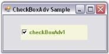
{:.image }

See Also

Through Code

Through Code

The CheckBoxAdv control can be created programmatically as detailed below:

* Create a C# or VB.NET application though Visual Studio.
* Add the required assembly references.
* Include the required namespace.

[C#]

using Syncfusion.Windows.Forms.Tools;

[VB.NET]

Imports Syncfusion.Windows.Forms.Tools

* Create an instance of the CheckBoxAdv control class.

[C#]

private Syncfusion.Windows.Forms.Tools.CheckBoxAdv checkBoxAdv1;

this.checkBoxAdv1 = new Syncfusion.Windows.Forms.Tools.CheckBoxAdv();

[VB.NET]

Private checkBoxAdv1 As Syncfusion.Windows.Forms.Tools.CheckBoxAdv

Me.checkBoxAdv1 = New Syncfusion.Windows.Forms.Tools.CheckBoxAdv()

* Set the properties and add the CheckBoxAdv control to the form.

[C#]

this.checkBoxAdv1.Text = "checkBoxAdv1";

this.checkBoxAdv1.Font = new System.Drawing.Font("Microsoft Sans Serif", 8.25F, System.Drawing.FontStyle.Bold, System.Drawing.GraphicsUnit.Point, ((byte)(0)));

this.checkBoxAdv1.ForeColor = System.Drawing.Color.OliveDrab;

this.checkBoxAdv1.BackColor = System.Drawing.Color.Beige;

// Add the CheckBoxAdv control to the Form.

this.Controls.Add(this.radioButtonAdv1);

[VB.NET]

Me.checkBoxAdv1.Text = "checkBoxAdv1"

Me.checkBoxAdv1.Font = New System.Drawing.Font("Microsoft Sans Serif", 8.25F, System.Drawing.FontStyle.Bold, System.Drawing.GraphicsUnit.Point, CByte((0)))

Me.checkBoxAdv1.ForeColor = System.Drawing.Color.OliveDrab

Me.checkBoxAdv1.BackColor = System.Drawing.Color.Beige

// Add the CheckBoxAdv control to the Form.

Me.Controls.Add(Me.radioButtonAdv1)

{:.image }

See Also

Through Designer

###### Concepts and Features

The following topics will help you become more familiar in using the CheckBoxAdv control.

CheckBoxAdv Settings

This section discusses the various states of the CheckBoxAdv control and the method of associating values with the states.

It includes the below given topics.

CheckBoxAdv States

The CheckBoxAdv can be displayed in three different states which have been described below.

_Table_ _387__: Property Table_

<table>
<tr>
<td>
CheckBoxAdv Property</td><td>
Description</td></tr>
<tr>
<td>
CheckState</td><td>
Gets / sets the check state of the CheckBox.It includes the below given options.{{ _Unchecked,_ | markdownify }}{{ _Checked and_ | markdownify }}{{ _Indeterminate._ | markdownify }}</td></tr>
<tr>
<td>
Checked</td><td>
Gets / sets the checked state of the CheckBox.</td></tr>
</table>

[C#]

this.checkBoxAdv1.CheckState = System.Windows.Forms.CheckState.Checked;

this.checkBoxAdv1.Checked = true;

[VB.NET]

Me.checkBoxAdv1.CheckState = System.Windows.Forms.CheckState.Checked

Me.checkBoxAdv1.Checked = True

{:.image }

{:.image }

See Also

CheckBoxAdv Values, Image Settings

CheckBoxAdv Values

This section discusses how values can be associated with the various check states.

Both integer and string values can be associated with the check states as follows.

_Table_ _388__: Property Table_

<table>
<tr>
<td>
CheckBoxAdv Properties</td><td>
Description</td></tr>
<tr>
<td>
CheckedInt</td><td>
Specifies the integer value when checked. </td></tr>
<tr>
<td>
CheckedString</td><td>
Specifies the string value when checked.</td></tr>
<tr>
<td>
IndeterminateInt</td><td>
Specifies the integer value when indeterminate.</td></tr>
<tr>
<td>
IndeterminateString</td><td>
Specifies the string value when indeterminate.</td></tr>
<tr>
<td>
UncheckedInt</td><td>
Specifies the integer value when Unchecked.</td></tr>
<tr>
<td>
UncheckedString</td><td>
Specifies the string value when Unchecked.</td></tr>
<tr>
<td>
StringValue</td><td>
Gets or sets the string value.</td></tr>
<tr>
<td>
BoolValue</td><td>
Gets / sets a value indicating the check state. This property can be set to use bool values for databinding. Refer Frequently Asked Questions section. </td></tr>
<tr>
<td>
IntValue</td><td>
Gets / sets the int value. Refer Frequently Asked Questions section.</td></tr>
</table>

[C#]

this.checkBoxAdv1.CheckedInt = 3;

this.checkBoxAdv1.CheckedString = "CheckBoxAdv is Checked";

this.checkBoxAdv1.IndeterminateInt = 5;

this.checkBoxAdv1.IndeterminateString = "CheckBoxAdv is Indeterminate";

this.checkBoxAdv1.UncheckedInt = 3;

this.checkBoxAdv1.UncheckedString = "CheckBoxAdv is Unchecked";

this.checkBoxAdv1.StringValue = "String";

this.checkBoxAdv1.IntValue = 5;

this.checkBoxAdv1.BoolValue = true;

[VB.NET]

Me.checkBoxAdv1.CheckedInt = 3

Me.checkBoxAdv1.CheckedString = "CheckBoxAdv is Checked"

Me.checkBoxAdv1.IndeterminateInt = 5

Me.checkBoxAdv1.IndeterminateString = "CheckBoxAdv is Indeterminate"

Me.checkBoxAdv1.UncheckedInt = 3

Me.checkBoxAdv1.UncheckedString = "CheckBoxAdv is Unchecked"

Me.checkBoxAdv1.StringValue = "String"

Me.checkBoxAdv1.IntValue = 5

Me.checkBoxAdv1.BoolValue = True

See Also

CheckBoxAdv States, Image Settings

Text Settings

This section discusses the text settings of the CheckBoxAdv.

Text in the CheckBoxAdv can be shadowed and wrapped as illustrated below.

_Table_ _389__: Property Table_

<table>
<tr>
<td>
CheckBoxAdv Properties</td><td>
Description</td></tr>
<tr>
<td>
TextShadow</td><td>
Determines if the text shadow is visible.</td></tr>
<tr>
<td>
ShadowColor</td><td>
The color of the text shadow.</td></tr>
<tr>
<td>
ShadowOffset</td><td>
The offset of the text shadow.</td></tr>
<tr>
<td>
WrapText</td><td>
Determines if the text in the CheckBoxAdv is wrapped.</td></tr>
</table>

[C#]

this.checkBoxAdv1.TextShadow = true;

this.checkBoxAdv1.ShadowColor = System.Drawing.Color.BurlyWood;

this.checkBoxAdv1.ShadowOffset = new System.Drawing.Point(8, 8);

this.checkBoxAdv1.WrapText = true;

[VB.NET]

Me.checkBoxAdv1.TextShadow = True

Me.checkBoxAdv1.ShadowColor = System.Drawing.Color.BurlyWood

Me.checkBoxAdv1.ShadowOffset = New System.Drawing.Point(8, 8)

Me.checkBoxAdv1.WrapText = True

{:.image }

{:.image }

A sample which demonstrates the TextShadow property of CheckBoxAdv is available in the below sample installation path.

…\_My Documents\Syncfusion\EssentialStudio\Version Number\Windows\Tools.Windows\Samples\Advanced Editor Functions\ActionGroupingDemo_

See Also

Alignment Settings

Appearance and Behavior Settings

This section discusses the appearance and behavior settings of the CheckBoxAdv control.

Appearance Settings

DrawFocusRectangle

The focus rectangle can be hidden or made visible using the below given property.

_Table_ _390__: Property Table_

<table>
<tr>
<td>
CheckBoxAdv Property</td><td>
Description</td></tr>
<tr>
<td>
DrawFocusRectangle</td><td>
Determines if the focus rectangle is visible when it gets the focus. The default value is set to 'True'.</td></tr>
</table>

[C#]

this.checkBoxAdv1.DrawFocusRectangle = true;

[VB.NET]

Me.checkBoxAdv1.DrawFocusRectangle = True

Behavior Settings

The behavior settings of the CheckBoxAdv can be customized using the properties given below.

_Table_ _391__: Property Table_

<table>
<tr>
<td>
CheckBoxAdv Properties</td><td>
Description</td></tr>
<tr>
<td>
AutoHeight</td><td>
Determines if the CheckBoxAdv will automatically calculate its height.</td></tr>
<tr>
<td>
ReadOnlyMode</td><td>
Specifies the Read Only Mode of the CheckBoxAdv.</td></tr>
<tr>
<td>
Tristate</td><td>
Specifies whether the indeterminate state can be accessed through clicking.</td></tr>
</table>

[C#]

this.checkBoxAdv1.AutoHeight = true;

this.checkBoxAdv1.ReadOnlyMode = true;

this.checkBoxAdv1.Tristate= false;

[VB.NET]

Me.checkBoxAdv1.AutoHeight = True

Me.checkBoxAdv1.ReadOnlyMode = True

Me.checkBoxAdv1.Tristate= False

A sample which demonstrates the ReadOnlyMode and Tristate properties of CheckBoxAdv is available in the below sample installation path.

…\_My Documents\Syncfusion\EssentialStudio\Version Number\Windows\Tools.Windows\Samples\Advanced Editor Functions\ActionGroupingDemo_

Alignment Settings

This section discusses the alignment settings of the CheckBoxAdv.

Text Alignment

Text in the CheckBoxAdv can be aligned to the desired location as given below.

_Table_ _392__: Property Table_

<table>
<tr>
<td>
CheckBoxAdv Properties</td><td>
Description</td></tr>
<tr>
<td>
TextContentAlignment</td><td>
Indicates the alignment of the text. The default value is set to 'MiddleLeft'.The options included are as follows.{{ _TopLeft,_ | markdownify }}{{ _TopCenter,_ | markdownify }}{{ _TopRight,_ | markdownify }}{{ _MiddleLeft,_ | markdownify }}{{ _MiddleCenter,_ | markdownify }}{{ _MiddleRight,_ | markdownify }}{{ _BottomLeft,_ | markdownify }}{{ _BottomCenter and_ | markdownify }}{{ _BottomRight._ | markdownify }}WrapText property must be set to 'False'. Refer Text Settings</td></tr>
</table>

[C#]

this.checkBoxAdv1.TextContentAlignment = System.Drawing.ContentAlignment.MiddleCenter;

[VB.NET]

Me.checkBoxAdv1.TextContentAlignment = System.Drawing.ContentAlignment.MiddleCenter

{:.image }

CheckBox Alignment

The CheckBox itself can be aligned to any desired location that can be chosen from the options given in the following property.

_Table_ _393__: Property Table_

<table>
<tr>
<td>
CheckBoxAdv Properties</td><td>
Description</td></tr>
<tr>
<td>
CheckAlign</td><td>
Indicates the alignment of the CheckBox. The default value is set to 'MiddleLeft'.The options included are as follows.{{ _TopLeft,_ | markdownify }}{{ _TopCenter,_ | markdownify }}{{ _TopRight,_ | markdownify }}{{ _MiddleLeft,_ | markdownify }}{{ _MiddleCenter,_ | markdownify }}{{ _MiddleRight,_ | markdownify }}{{ _BottomLeft,_ | markdownify }}{{ _BottomCenter and_ | markdownify }}{{ _BottomRight._ | markdownify }}</td></tr>
</table>

[C#]

this.checkBoxAdv1.CheckAlign = System.Drawing.ContentAlignment.MiddleRight;

[VB.NET]

Me.checkBoxAdv1.CheckAlign = System.Drawing.ContentAlignment.MiddleRight

{:.image }

A sample which demonstrates the Text and CheckBox Alignment features of CheckBoxAdv is available in the below sample installation path.

…\_My Documents\Syncfusion\EssentialStudio\Version Number\Windows\Tools.Windows\Samples\Advanced Editor Functions\ActionGroupingDemo_

See Also

Text Settings, CheckBoxAdv Settings

Background Settings

The background settings of the CheckBoxAdv are discussed below.

The CheckBoxAdv can be provided with a gradient background using the properties given below.

_Table_ _394__: Property Table_

<table>
<tr>
<td>
CheckBoxAdv Properties</td><td>
Description</td></tr>
<tr>
<td>
BackgroundStyle</td><td>
Sets the background style of the CheckBoxAdv.The options included are as follows.{{ _HorizontalGradient,_ | markdownify }}{{ _VerticalGradient and_ | markdownify }}{{ _Default._ | markdownify }}</td></tr>
<tr>
<td>
GradientStart</td><td>
Sets the start color of the gradient of the background of the CheckboxAdv.</td></tr>
<tr>
<td>
GradientEnd</td><td>
Sets the end color of the gradient of the background of the CheckboxAdv.</td></tr>
</table>

[C#]

this.checkBoxAdv1.BackgroundStyle = Syncfusion.Windows.Forms.Tools.CheckBoxAdvBackStyle.HorizontalGradient;

this.checkBoxAdv1.GradientStart = System.Drawing.Color.Aqua;

this.checkBoxAdv1.GradientEnd = System.Drawing.Color.Magenta;

[VB.NET]

Me.checkBoxAdv1.BackgroundStyle = Syncfusion.Windows.Forms.Tools.CheckBoxAdvBackStyle.HorizontalGradient

Me.checkBoxAdv1.GradientStart = System.Drawing.Color.Aqua

Me.checkBoxAdv1.GradientEnd = System.Drawing.Color.Magenta

{:.image }

> 
{:.image }
 _Note: Gradient background cannot be applied to the CheckBoxAdv when its BackgroundStyle property is set to 'Default'. Also, the background image cannot be displayed with gradient settings._

A sample which demonstrates the Background Settings of CheckBoxAdv is available in the below sample installation path.

…\_My Documents\Syncfusion\EssentialStudio\Version Number\Windows\Tools.Windows\Samples\Advanced Editor Functions\ActionGroupingDemo_

Border Settings

Color and Styles can be applied to the border of the CheckBoxAdv as discussed below.

_Table_ _395__: Property Table_

<table>
<tr>
<td>
CheckBoxAdv Properties</td><td>
Description</td></tr>
<tr>
<td>
Border3DStyle</td><td>
Indicates the style of the 3D border. The options included are as follows.{{ _RaisedOuter,_ | markdownify }}{{ _SunkenOuter,_ | markdownify }}{{ _RaisedInner,_ | markdownify }}{{ _SunkenInner,_ | markdownify }}{{ _Raised,_ | markdownify }}{{ _Etched,_ | markdownify }}{{ _Bump,_ | markdownify }}{{ _Sunken,_ | markdownify }}{{ _Adjust and_ | markdownify }}{{ _Flat_ | markdownify }}.The default value is set to 'Sunken'.</td></tr>
<tr>
<td>
BorderColor</td><td>
Specifies the color of the 2D border.</td></tr>
<tr>
<td>
BorderSingle</td><td>
Indicates the 2D border style. The options included are as follows.{{ _Dotted,_ | markdownify }}{{ _Dashed,_ | markdownify }}{{ _Solid,_ | markdownify }}{{ _Inset,_ | markdownify }}{{ _Outset and_ | markdownify }}{{ _None._ | markdownify }}The BorderStyle property should be set to 'FixedSingle'.</td></tr>
<tr>
<td>
BorderStyle</td><td>
Indicates whether the panel should have a border. The options included are given below.{{ _FixedSingle,_ | markdownify }}{{ _Fixed3D and_ | markdownify }}{{ _None._ | markdownify }}</td></tr>
<tr>
<td>
HotBorderColor</td><td>
Specifies the color of the FixedSingle border when MouseOver.</td></tr>
</table>

[C#]

this.checkBoxAdv1.Border3DStyle = System.Windows.Forms.Border3DStyle.Bump;

this.checkBoxAdv1.BorderColor = System.Drawing.Color.Red;

this.checkBoxAdv1.BorderSingle = System.Windows.Forms.ButtonBorderStyle.Dotted;

this.checkBoxAdv1.BorderStyle = System.Windows.Forms.BorderStyle.FixedSingle;

// BorderStyle must be set to 'FixedSingle'.

this.checkBoxAdv1.HotBorderColor = System.Drawing.Color.Blue;

[VB.NET]

Me.checkBoxAdv1.Border3DStyle = System.Windows.Forms.Border3DStyle.Bump

Me.checkBoxAdv1.BorderColor = System.Drawing.Color.Red

Me.checkBoxAdv1.BorderSingle = System.Windows.Forms.ButtonBorderStyle.Dotted

Me.checkBoxAdv1.BorderStyle = System.Windows.Forms.BorderStyle.FixedSingle

' BorderStyle must be set to 'FixedSingle'.

Me.checkBoxAdv1.HotBorderColor = System.Drawing.Color.Blue

{:.image }

{:.image }

A Sample which demonstrates the Border Settings of CheckBoxAdv is available in the below sample installation path.

…\_My Documents\Syncfusion\EssentialStudio\Version Number\Windows\Tools.Windows\Samples\Advanced Editor Functions\ActionGroupingDemo_

Image Settings

The image settings of the CheckBoxAdv control has been discussed in this section.

Images can be set to the CheckBoxAdv when it is in the Checked, Unchecked or Indeterminate state. The CheckBoxAdv allows us to set the following properties in order to display images.

_Table_ _396__: Property Table_

<table>
<tr>
<td>
CheckBoxAdv Properties</td><td>
Description</td></tr>
<tr>
<td>
ImageCheckBox</td><td>
Indicates whether the CheckBox will be drawn using the images provided.</td></tr>
<tr>
<td>
ImageCheckBoxSize</td><td>
Gets / sets the size of the ImageCheckBox.ImageCheckbox property must be set to 'True'.</td></tr>
<tr>
<td>
CheckedImage</td><td>
Gets / sets the image used to draw the CheckBox when checked and mouse not over.</td></tr>
<tr>
<td>
UncheckedImage</td><td>
Gets / sets the image used to draw the CheckBox when unchecked and mouse not over.</td></tr>
<tr>
<td>
IndeterminateImage</td><td>
The image used to draw the CheckBox when indeterminate and mouse not over.</td></tr>
<tr>
<td>
DisabledImage</td><td>
Gets / sets the image used to draw the CheckBox when disabled.</td></tr>
<tr>
<td>
StretchImage</td><td>
Indicates whether the state images of the CheckBox are stretched.</td></tr>
</table>
> 
{:.image }
 _Note: Before setting the images, make sure the ImageCheckBox property is set to 'True'._

[C#]

this.checkBoxAdv1.ImageCheckBox = true;

this.checkBoxAdv1.ImageCheckBoxSize = new System.Drawing.Size(15, 15);

this.checkBoxAdv1.CheckedImage = ((System.Drawing.Image)(resources.GetObject("checkBoxAdv1.CheckedImage")));

this.checkBoxAdv1.UncheckedImage = ((System.Drawing.Image)(resources.GetObject("checkBoxAdv1.UncheckedImage")));

this.checkBoxAdv1.IndeterminateImage = ((System.Drawing.Image)(resources.GetObject("checkBoxAdv1.IndeterminateImage")));

this.checkBoxAdv1.DisabledImage = ((System.Drawing.Image)(resources.GetObject("checkBoxAdv1.DisabledImage")));

this.checkBoxAdv1.StretchImage = false;

[VB.NET]

Me.checkBoxAdv1.ImageCheckBox = True

Me.checkBoxAdv1.ImageCheckBoxSize = New System.Drawing.Size(15, 15)

Me.checkBoxAdv1.CheckedImage = (CType(Resources.GetObject("checkBoxAdv1.CheckedImage"), System.Drawing.Image))

Me.checkBoxAdv1.UncheckedImage = (CType(Resources.GetObject("checkBoxAdv1.UncheckedImage"), System.Drawing.Image))

Me.checkBoxAdv1.IndeterminateImage = (CType(Resources.GetObject("checkBoxAdv1.IndeterminateImage"), System.Drawing.Image))

Me.checkBoxAdv1.DisabledImage = (CType(Resources.GetObject("checkBoxAdv1.DisabledImage"), System.Drawing.Image))

Me.checkBoxAdv1.StretchImage = False

{:.image }

Images displayed during Mouse Hover

Images can also be set when the mouse is hovered over the CheckBoxAdv control.

_Table_ _397__: Property Table_

<table>
<tr>
<td>
CheckBoxAdv Properties</td><td>
Description</td></tr>
<tr>
<td>
MouseOverCheckedImage</td><td>
Gets / sets the image used to draw the CheckBox when checked and mouse over.</td></tr>
<tr>
<td>
MouseOverDisabledImage</td><td>
Gets / sets the image used to draw the CheckBox when indeterminate and mouse over.</td></tr>
<tr>
<td>
MouseOverUncheckedImage</td><td>
Gets / sets the image used to draw the CheckBox when unchecked and mouse over.</td></tr>
</table>

[C#]

this.checkBoxAdv1.MouseOverCheckedImage = ((System.Drawing.Image)(resources.GetObject("checkBoxAdv1.MouseOverCheckedImage")));

this.checkBoxAdv1.MouseOverIndetermImage = ((System.Drawing.Image)(resources.GetObject("checkBoxAdv1.MouseOverIndetermImage")));

this.checkBoxAdv1.MouseOverUncheckedImage = ((System.Drawing.Image)(resources.GetObject("checkBoxAdv1.MouseOverUncheckedImage")));

[VB.NET]

Me.checkBoxAdv1.MouseOverCheckedImage = (CType(Resources.GetObject("checkBoxAdv1.MouseOverCheckedImage"), System.Drawing.Image))

Me.checkBoxAdv1.MouseOverIndetermImage = (CType(Resources.GetObject("checkBoxAdv1.MouseOverIndetermImage"), System.Drawing.Image))

Me.checkBoxAdv1.MouseOverUncheckedImage = (CType(Resources.GetObject("checkBoxAdv1.MouseOverUncheckedImage"), System.Drawing.Image))

{:.image }

A Sample which demonstrates the ImageCheckBox property of CheckBoxAdv is available in the below sample installation path.

…\_My Documents\Syncfusion\EssentialStudio\Version Number\Windows\Tools.Windows\Samples\Advanced Editor Functions\ActionGroupingDemo_

Themes and Visual Styles

This section discusses the themes and visual style settings that are supported by the CheckBoxAdv control.

Themes

The CheckBoxAdv can be provided with a themed appearance using the below given property.

_Table_ _398__: Property Table_

<table>
<tr>
<td>
CheckBoxAdv Property</td><td>
Description</td></tr>
<tr>
<td>
ThemesEnabled</td><td>
Specifies whether themes are enabled for CheckBoxAdv.</td></tr>
</table>

[C#]

this.checkBoxAdv1.ThemesEnabled = true;

[VB]

Me.checkBoxAdv1.ThemesEnabled = True

{:.image }

Visual Styles

The appearance of the CheckBoxAdv control can be customized using the various options provided by the following properties.

_Table_ _399__: Property Table_

<table>
<tr>
<td>
CheckBoxAdv Properties</td><td>
Description</td></tr>
<tr>
<td>
Style</td><td>
Gets / sets an advanced appearance for the CheckBoxAdv.The options included are as follows.{{ _Default and_ | markdownify }}{{ _Office2007._ | markdownify }}</td></tr>
<tr>
<td>
Office2007ColorScheme</td><td>
Gets / sets Office 2007 color scheme.The options included are as follows.{{ _Managed,_ | markdownify }}{{ _Blue,_ | markdownify }}{{ _Silver and_ | markdownify }}{{ _Black._ | markdownify }}The Style property should be set to "Office2007".</td></tr>
</table>

[C#]

this.checkBoxAdv1.Style = Syncfusion.Windows.Forms.Tools.CheckBoxAdvStyle.Office2007;

this.checkBoxAdv1.Office2007ColorScheme = Syncfusion.Windows.Forms.Office2007Theme.Blue;

[VB]

Me.checkBoxAdv1.Style = Syncfusion.Windows.Forms.Tools.CheckBoxAdvStyle.Office2007

Me.checkBoxAdv1.Office2007ColorScheme = Syncfusion.Windows.Forms.Office2007Theme.Blue

{:.image }

{:.image }

When the Office2007ColorScheme property is set to 'Managed', the CheckBox in the CheckBoxAdv can be displayed using custom colors supported by the control.

This can be done programmatically as follows.

[C#]

this.checkBoxAdv1.Style = Syncfusion.Windows.Forms.Tools.CheckBoxAdvStyle.Office2007;

this.checkBoxAdv1.Office2007ColorScheme = Syncfusion.Windows.Forms.Office2007Theme.Managed;

Office2007Colors.ApplyManagedColors(this, Color.Pink);

[VB]

Me.checkBoxAdv1.Style = Syncfusion.Windows.Forms.Tools.CheckBoxAdvStyle.Office2007

Me.checkBoxAdv1.Office2007ColorScheme = Syncfusion.Windows.Forms.Office2007Theme.Managed

Office2007Colors.ApplyManagedColors(Me, Color.Pink)

{:.image }

A sample which demonstrates the Themes and Visual Styles of CheckBoxAdv is available in the below sample installation path.

…\_My Documents\Syncfusion\EssentialStudio\Version Number\Windows\Tools.Windows\Samples\Advanced Editor Functions\ActionGroupingDemo_

###### CheckBoxAdv Events

A detailed explanation about the CheckStateChanged event is given in the following section.

_Table_ _400__: Events Table_

<table>
<tr>
<td>
CheckBoxAdv Events</td><td>
Description</td></tr>
<tr>
<td>
CheckStateChanged</td><td>
This event occurs when the CheckState property is changed.</td></tr>
<tr>
<td>
CheckedChanged</td><td>
This event is raised when the Checked property is changed.</td></tr>
</table>
CheckStateChanged Event

This event occurs when the CheckState property is changed.

The event handler receives an argument of type EventArgs containing data related to this event.

[C#]

private void checkBoxAdv1_CheckStateChanged(object sender, EventArgs e)

{

Console.WriteLine(" CheckStateChanged event is raised");

}

[VB.NET]

Private Sub checkBoxAdv1_CheckStateChanged(ByVal sender As Object, ByVal e As EventArgs)

Console.WriteLine(" CheckStateChanged event is raised")

End Sub

CheckedChanged Event

This event is raised when the Checked property is changed. Checked property changes automatically when the CheckedState property is changed. Refer to the following code.

[C#]

private void checkBoxAdv2_CheckedChanged(object sender, EventArgs e)

{

    if (!checkBoxAdv2.Checked)

        MessageBox.Show("Checkbox Unchecked");

    else

        MessageBox.Show("Checkbox checked");

}

[VB]

Private Sub checkBoxAdv2_CheckedChanged(ByVal sender As Object, ByVal e As EventArgs)
       If Not checkBoxAdv2.Checked Then
           MessageBox.Show("Checkbox checked”)
       Else
           MessageBox.Show("Checkbox checked”)
       End If
   End Sub

###### Frequently Asked Questions

This section will help you become more familiar in using the CheckBoxAdv control.

How to databind a CheckBoxAdv to an SQL database if the corresponding datatable field is a bit field

The CheckBoxAdv's IntValue property can be used to databind bit values as illustrated below.

[C#]

private void Form1_Load(object sender, System.EventArgs e)

{

// Using CheckBoxAdv's IntValue property for Databinding.

this.oleDbDataAdapter1.Fill(this.dataSet11.Table1);

}

this.checkBoxAdv1.DataBindings.Add("IntValue", this.dataSet11.Table1, "BitField");

[VB.NET]

Private Sub Form1_Load(ByVal sender As Object, ByVal e As System.EventArgs)

' Using CheckBoxAdv's IntValue property for Databinding.

Me.oleDbDataAdapter1.Fill(Me.dataSet11.Table1)

End Sub

Me.checkBoxAdv1.DataBindings.Add("IntValue", Me.dataSet11.Table1, "BitField")

A sample which demonstrates how bit values are used to set the state of the CheckBoxAdv is available in the below sample installation path.

…\_My Documents\Syncfusion\EssentialStudio\Version Number\Windows\Tools.Windows\Samples\Advanced Editor Functions\ActionGroupingDemo_

How to databind a CheckBoxAdv to an SQL database if the corresponding datatable field is boolean

The CheckBoxAdv's BoolValue property can be used to databind bool values as illustrated below.

[C#]

private void Form1_Load(object sender, System.EventArgs e)

{

this.oleDbDataAdapter1.Fill(this.dataSet11.Table1);

}

// Using CheckBoxAdv's BoolValue property for Databinding.

this.checkBoxAdv1.DataBindings.Add("BoolValue", this.dataSet11.Table1, "CheckValue");

[VB.NET]

Private Sub Form1_Load(ByVal sender As Object, ByVal e As System.EventArgs)

Me.oleDbDataAdapter1.Fill(Me.dataSet11.Table1)

End Sub

' Using CheckBoxAdv's BoolValue property for Databinding.

Me.checkBoxAdv1.DataBindings.Add("BoolValue", Me.dataSet11.Table1, "CheckValue")

{:.image }

##### RadioButtonAdv

RadioButtonAdv functions similar to the Windows standard RadioButton but it has some additional enhancements. It helps to provide a great look and feel to the RadioButtons. It supports themes, gradient colors, images and shadow text.

{:.image }

See Also

###### Features

RadioButtonAdv is an advanced RadioButton control and has the following features.

Features

* RadioButtonAdv Settings

The RadioButtonAdv can be displayed in the Checked and Unchecked states using the Checked property.

Integer and String values can be associated with each state of the RadioButtonAdv.

* Text Settings

The text of the RadioButtonAdv control can be shadowed, and the shadow color and offset can also be specified.

The text can be wrapped by setting the WrapText property to 'True'.

* Appearance and Behavior Settings

The focus rectangle can be made visible or hidden.

The height of the RadioButtonAdv can be automatically calculated.

* Alignment Settings

The text and radio button of the RadioButtonAdv control can be aligned to any desired location by the user.

* Background Settings

RadioButtonAdv can be created with custom gradient backgrounds.

* Border Settings

2D and 3D border styles can be applied to the RadioButtonAdv. The HotBorderColor property can be used to specify the color of the FixedSingle border during mouse hover.

* Image Settings

You can set the image for the RadioButtonAdv when it is Checked, Unchecked or Disabled.

* Themes and Visual Styles

Themes can be enabled for the RadioButtonAdv. 

It provides the Office2007 Visual Style that comes in the blue, silver and black colors. The Office2007 style also supports custom colors that can be applied to the RadioButtonAdv control.

See Also

Concepts and Features

###### Creating RadioButtonAdv

The RadioButtonAdv control can be created in the following ways.

Through Designer

The following steps illustrate how to create a RadioButtonAdv control through designer.

* Create or open a Windows Forms project.
* Add a RadioButtonAdv Control from the toolbox onto the form by dragging and dropping it on the form or double clicking the control.

{:.image }

* Set the desired properties for the control through theProperty grid.
* Run the application.

{:.image }

See Also

Through Code

Through Code

The RadioButtonAdv control can be created programmatically as detailed below:

* Create a C# or VB.NET application though Visual Studio.
* Add the required assembly references.
* Include the required namespace.

[C#]

using Syncfusion.Windows.Forms.Tools;

[VB.NET]

Imports Syncfusion.Windows.Forms.Tools

* Create an instance of the RadioButtonAdv control class.

[C#]

private Syncfusion.Windows.Forms.Tools.RadioButtonAdv radioButtonAdv1;

this.radioButtonAdv1 = new Syncfusion.Windows.Forms.Tools.RadioButtonAdv();

[VB.NET]

Private radioButtonAdv1 As Syncfusion.Windows.Forms.Tools.RadioButtonAdv

Me.radioButtonAdv1 = New Syncfusion.Windows.Forms.Tools.RadioButtonAdv()

* Set the properties and add the RadioButtonAdv control to the form.

[C#]

this.radioButtonAdv1.Text = "radioButtonAdv1";

this.radioButtonAdv1.Font = new System.Drawing.Font("Microsoft Sans Serif", 8.25F, System.Drawing.FontStyle.Bold, System.Drawing.GraphicsUnit.Point, ((byte)(0)));

this.radioButtonAdv1.ForeColor = System.Drawing.Color.MistyRose;

this.radioButtonAdv1.BackColor = System.Drawing.Color.RosyBrown;

// Add the RadioButtonAdv control to the Form.

this.Controls.Add(this.radioButtonAdv1);

[VB.NET]

Me.radioButtonAdv1.Text = "radioButtonAdv1"

Me.radioButtonAdv1.Font = New System.Drawing.Font("Microsoft Sans Serif", 8.25F, System.Drawing.FontStyle.Bold, System.Drawing.GraphicsUnit.Point, CByte((0)))

Me.radioButtonAdv1.ForeColor = System.Drawing.Color.MistyRose

Me.radioButtonAdv1.BackColor = System.Drawing.Color.RosyBrown

// Add the RadioButtonAdv control to the Form.

Me.Controls.Add(Me.radioButtonAdv1)

{:.image }

See Also

Through Designer

###### Concepts and Features

The following topics will help you become more familiar in using the RadioButtonAdv control.

RadioButtonAdv Settings

This section discusses the various states of the RadioButtonAdv control and the method of associating values with the states.

It includes the below given topics.

RadioButtonAdv States

The RadioButtonAdv can be displayed in two different states which have been described below.

_Table_ _401__: Property Table_

<table>
<tr>
<td>
RadioButtonAdv Property</td><td>
Description</td></tr>
<tr>
<td>
Checked</td><td>
Gets / sets the check state of the RadioButton.</td></tr>
</table>

[C#]

this.radioButtonAdv1.Checked = true;

[VB.NET]

Me.radioButtonAdv1.Checked = True

{:.image }

See Also

RadioButtonAdv Values, Image Settings, RadioButtonAdv Events

RadioButtonAdv Values

This section discusses how values can be associated with the various check states.

Both integer and string values can be associated with the check states as follows.

_Table_ _402__: Property Table_

<table>
<tr>
<td>
RadioButtonAdv Properties</td><td>
Description</td></tr>
<tr>
<td>
CheckedInt</td><td>
Specifies the integer value when checked. </td></tr>
<tr>
<td>
CheckedString</td><td>
Specifies the string value when checked.</td></tr>
<tr>
<td>
UncheckedInt</td><td>
Specifies the integer value when Unchecked.</td></tr>
<tr>
<td>
UncheckedString</td><td>
Specifies the string value when Unchecked.</td></tr>
<tr>
<td>
IntValue</td><td>
Gets / sets checked RadioButtonAdv in current container according to the TabIndex.</td></tr>
</table>

[C#]

this.radioButtonAdv1.CheckedInt = 3;

this.radioButtonAdv1.CheckedString = "RadioButtonAdv is Checked";

this.radioButtonAdv1.UncheckedInt = 3;

this.radioButtonAdv1.UncheckedString = "RadioButtonAdv is Unchecked";

this.radioButtonAdv1.IntValue = 5;

[VB.NET]

Me.radioButtonAdv1.CheckedInt = 3

Me.radioButtonAdv1.CheckedString = "RadioButtonAdv is Checked"

Me.radioButtonAdv1.UncheckedInt = 3

Me.radioButtonAdv1.UncheckedString = "RadioButtonAdv is Unchecked"

Me.radioButtonAdv1.IntValue = 5

See Also

RadioButtonAdv States, Image Settings

Text Settings

This section discusses the text settings of the RadioButtonAdv.

Text in the RadioButtonAdv can be shadowed and wrapped as illustrated below.

_Table_ _403__: Property Table_

<table>
<tr>
<td>
RadioButtonAdv Properties</td><td>
Description</td></tr>
<tr>
<td>
TextShadow</td><td>
Determines if the text shadow is visible.</td></tr>
<tr>
<td>
ShadowColor</td><td>
Specifies the color of the text shadow.</td></tr>
<tr>
<td>
ShadowOffset</td><td>
Specifies the offset of the text shadow.</td></tr>
<tr>
<td>
WrapText</td><td>
Determines if the text in the CheckBoxAdv is wrapped.</td></tr>
</table>

[C#]

this.radioButtonAdv1.TextShadow = true;

this.radioButtonAdv1.ShadowColor = System.Drawing.Color.Gold;

this.radioButtonAdv1.ShadowOffset = new System.Drawing.Point(8, 8);

[VB.NET]

Me.radioButtonAdv1.TextShadow = True

Me.radioButtonAdv1.ShadowColor = System.Drawing.Color.Gold

Me.radioButtonAdv1.ShadowOffset = New System.Drawing.Point(8, 8)

{:.image }

A sample which demonstrates the TextShadow property of RadioButtonAdv is available in the below sample installation path.

…\_My Documents\Syncfusion\EssentialStudio\Version Number\Windows\Tools.Windows\Samples\Advanced Editor Functions\ActionGroupingDemo_

See Also

Alignment Settings

Appearance and Behavior Settings

This section discusses the appearance and behavior settings of the RadioButtonAdv control.

Appearance Settings

DrawFocusRectangle

The focus rectangle can be hidden or made visible using the below given property.

_Table_ _404__: Property Table_

<table>
<tr>
<td>
RadioButtonAdv Property</td><td>
Description</td></tr>
<tr>
<td>
DrawFocusRectangle</td><td>
Determines if the focus rectangle is visible when it gets the focus. The default value is set to 'True'.</td></tr>
</table>

[C#]

this.radioButtonAdv1.DrawFocusRectangle = true;

[VB.NET]

Me.radioButtonAdv1.DrawFocusRectangle = True

Behavior Settings

AutoHeight

The height of the RadioButtonAdv can be automatically set using the property given below.

_Table_ _405__: Property Table_

<table>
<tr>
<td>
RadioButtonAdv Property</td><td>
Description</td></tr>
<tr>
<td>
AutoHeight</td><td>
Determines if the RadioButton will automatically calculate its height.</td></tr>
</table>

[C#]

this.radioButtonAdv1.AutoHeight = true;

[VB.NET]

Me.radioButtonAdv1.AutoHeight = True

RaiseEventOnClick

The below given property can be used to fire the OnClick event of the RadioButtonAdv.

_Table_ _406__: Property Table_

<table>
<tr>
<td>
RadioButtonAdv Property</td><td>
Description</td></tr>
<tr>
<td>
RaiseEventOnClick</td><td>
Specifies whether the OnClick event should be fired. The default value is set to 'True'.</td></tr>
</table>

[C#]

this.radioButtonAdv1.RaiseEventOnClick = true;

[VB.NET]

Me.radioButtonAdv1.RaiseEventOnClick = True

Alignment Settings

This section discusses the alignment settings of the RadioButtonAdv.

Text Alignment

Text in the RadioButtonAdv can be aligned to the desired location as given below.

_Table_ _407__: Property Table_

<table>
<tr>
<td>
RadioButtonAdv Properties</td><td>
Description</td></tr>
<tr>
<td>
TextContentAlignment</td><td>
Indicates the alignment of the text. The default value is set to 'MiddleLeft'.The options included are as follows.{{ _TopLeft,_ | markdownify }}{{ _TopCenter,_ | markdownify }}{{ _TopRight,_ | markdownify }}{{ _MiddleLeft,_ | markdownify }}{{ _MiddleCenter,_ | markdownify }}{{ _MiddleRight,_ | markdownify }}{{ _BottomLeft,_ | markdownify }}{{ _BottomCenter and_ | markdownify }}{{ _BottomRight._ | markdownify }}WrapText property must be set to 'False'. Refer Text Settings.</td></tr>
</table>

[C#]

this.radioButtonAdv1.TextContentAlignment = System.Drawing.ContentAlignment.MiddleCenter;

[VB.NET]

Me.radioButtonAdv1.TextContentAlignment = System.Drawing.ContentAlignment.MiddleCenter

{:.image }

RadioButton Alignment

The RadioButton itself can be aligned to any desired location that can be chosen from the options given in the following property.

_Table_ _408__: Property Table_

<table>
<tr>
<td>
RadioButtonAdv Properties</td><td>
Description</td></tr>
<tr>
<td>
CheckAlign</td><td>
Indicates the alignment of the RadioButton. The default value is set to 'MiddleLeft'.The options included are as follows.{{ _TopLeft,_ | markdownify }}{{ _TopCenter,_ | markdownify }}{{ _TopRight,_ | markdownify }}{{ _MiddleLeft,_ | markdownify }}{{ _MiddleCenter,_ | markdownify }}{{ _MiddleRight,_ | markdownify }}{{ _BottomLeft,_ | markdownify }}{{ _BottomCenter and_ | markdownify }}{{ _BottomRight._ | markdownify }}</td></tr>
</table>

[C#]

this.radioButtonAdv1.CheckAlign = System.Drawing.ContentAlignment.MiddleRight;

[VB.NET]

Me.radioButtonAdv1.CheckAlign = System.Drawing.ContentAlignment.MiddleRight

{:.image }

A Sample which demonstrates the Text and RadioButton Alignment features of CheckBoxAdv is available in the below sample installation path.

…\_My Documents\Syncfusion\EssentialStudio\Version Number\Windows\Tools.Windows\Samples\Advanced Editor Functions\ActionGroupingDemo_

See Also

Text Settings, RadioButtonAdv Settings

Background Settings

The background settings of the RadioButtonAdv are discussed below.

The RadioButtonAdv can be provided with a gradient background using the properties given below.

_Table_ _409__: Property Table_

<table>
<tr>
<td>
RadioButtonAdv Properties</td><td>
Description</td></tr>
<tr>
<td>
BackgroundStyle</td><td>
Sets the background style of the RadioButtonAdv.The options included are as follows.{{ _HorizontalGradient,_ | markdownify }}{{ _VerticalGradient and_ | markdownify }}{{ _Default._ | markdownify }}</td></tr>
<tr>
<td>
GradientStart</td><td>
Sets the start color of the gradient of the background of the RadioButtonAdv.</td></tr>
<tr>
<td>
GradientEnd</td><td>
Sets the end color of the gradient of the background of the RadioButtonAdv.</td></tr>
</table>

[C#]

this.radioButtonAdv1.BackgroundStyle = Syncfusion.Windows.Forms.Tools.CheckBoxAdvBackStyle.HorizontalGradient;

this.radioButtonAdv1.GradientStart = System.Drawing.Color.LightBlue;

this.radioButtonAdv1.GradientEnd = System.Drawing.Color.DarkSalmon;

[VB.NET]

Me.radioButtonAdv1.BackgroundStyle = Syncfusion.Windows.Forms.Tools.CheckBoxAdvBackStyle.HorizontalGradient

Me.radioButtonAdv1.GradientStart = System.Drawing.Color.LightBlue

Me.radioButtonAdv1.GradientEnd = System.Drawing.Color.DarkSalmon

{:.image }

> 
{:.image }
 _Note: Gradient background cannot be applied to the RadioButtonAdv when its BackgroundStyle property is set to 'Default'. Also, the background image cannot be displayed with gradient settings._

A sample which demonstrates the Background Settings of RadioButtonAdv is available in the below sample installation path.

…\_My Documents\Syncfusion\EssentialStudio\Version Number\Windows\Tools.Windows\Samples\Advanced Editor Functions\ActionGroupingDemo_

Border Settings

Color and Styles can be applied to the border of the RadioButtonAdv as discussed below.

_Table_ _410__: Property Table_

<table>
<tr>
<td>
RadioButtonAdv Properties</td><td>
Description</td></tr>
<tr>
<td>
Border3DStyle</td><td>
Indicates the style of the 3D border. The options included are as follows.{{ _RaisedOuter,_ | markdownify }}{{ _SunkenOuter,_ | markdownify }}{{ _RaisedInner,_ | markdownify }}{{ _SunkenInner,_ | markdownify }}{{ _Raised,_ | markdownify }}{{ _Etched,_ | markdownify }}{{ _Bump,_ | markdownify }}{{ _Sunken,_ | markdownify }}{{ _Adjust and_ | markdownify }}{{ _Flat._ | markdownify }}The default value is set to 'Sunken'.</td></tr>
<tr>
<td>
BorderColor</td><td>
Specifies the color of the 2D border.</td></tr>
<tr>
<td>
BorderSingle</td><td>
Indicates the 2D border style. The options included are as follows.{{ _Dotted,_ | markdownify }}{{ _Dashed,_ | markdownify }}{{ _Solid,_ | markdownify }}{{ _Inset,_ | markdownify }}{{ _Outset and_ | markdownify }}{{ _None._ | markdownify }}The BorderStyle property should be set to 'FixedSingle'.</td></tr>
<tr>
<td>
BorderStyle</td><td>
Indicates whether the panel should have a border. The options included are given below.{{ _FixedSingle,_ | markdownify }}{{ _Fixed3D and_ | markdownify }}{{ _None._ | markdownify }}</td></tr>
<tr>
<td>
HotBorderColor</td><td>
Specifies the color of the FixedSingle border when MouseOver.</td></tr>
</table>

[C#]

this.radioButtonAdv1.BorderColor = System.Drawing.Color.Fuchsia;

this.radioButtonAdv1.BorderStyle = System.Windows.Forms.BorderStyle.FixedSingle;

this.radioButtonAdv1.BorderSingle = System.Windows.Forms.ButtonBorderStyle.Dotted;

this.radioButtonAdv1.Border3DStyle = System.Windows.Forms.Border3DStyle.RaisedInner;

// BorderStyle must be set to 'FixedSingle'.

this.radioButtonAdv1.HotBorderColor = System.Drawing.Color.DarkOrange; 

[VB.NET]

Me.radioButtonAdv1.BorderColor = System.Drawing.Color.Fuchsia

Me.radioButtonAdv1.BorderStyle = System.Windows.Forms.BorderStyle.FixedSingle

Me.radioButtonAdv1.BorderSingle = System.Windows.Forms.ButtonBorderStyle.Dotted

Me.radioButtonAdv1.Border3DStyle = System.Windows.Forms.Border3DStyle.RaisedInner

' BorderStyle must be set to 'FixedSingle'.

Me.radioButtonAdv1.HotBorderColor = System.Drawing.Color.DarkOrange

{:.image }

{:.image }

A sample which demonstrates the Border Settings of RadioButtonAdv is available in the below sample installation path.

…\_My Documents\Syncfusion\EssentialStudio\Version Number\Windows\Tools.Windows\Samples\Advanced Editor Functions\ActionGroupingDemo_

Image Settings

The image settings of the RadioButtonAdv control have been discussed in this section.

Images can be set to the RadioButtonAdv when it is in the Checked, Unchecked or Indeterminate state. The RadioButtonAdv allows us to set the following properties in order to display images.

_Table_ _411__: Property Table_

<table>
<tr>
<td>
RadioButtonAdv Properties</td><td>
Description</td></tr>
<tr>
<td>
ImageCheckBox</td><td>
Indicates whether the RadioButton will be drawn using the images provided.</td></tr>
<tr>
<td>
ImageCheckBoxSize</td><td>
Gets / sets the size of the ImageCheckBox.ImageCheckbox property must be set to 'True'.</td></tr>
<tr>
<td>
CheckedImage</td><td>
Gets / sets the image used to draw the RadioButton when checked and mouse not over.</td></tr>
<tr>
<td>
UncheckedImage</td><td>
Gets / sets the image used to draw the RadioButton when unchecked and mouse not over.</td></tr>
<tr>
<td>
DisabledImage</td><td>
Gets / sets the image used to draw the RadioButton when disabled.</td></tr>
<tr>
<td>
StretchImage</td><td>
Indicates whether the state images of the RadioButton are stretched.</td></tr>
</table>
> 
{:.image }
 _Note: Before setting the images, make sure the ImageCheckBox property is set to 'True'._

[C#]

this.radioButtonAdv1.ImageCheckBox = true;

this.radioButtonAdv1.ImageCheckBoxSize = new System.Drawing.Size(15, 15);

this.radioButtonAdv1.CheckedImage = ((System.Drawing.Image)(resources.GetObject("checkBoxAdv1.CheckedImage")));

this.radioButtonAdv1.UncheckedImage = ((System.Drawing.Image)(resources.GetObject("checkBoxAdv1.UncheckedImage")));

this.radioButtonAdv1.DisabledImage = ((System.Drawing.Image)(resources.GetObject("checkBoxAdv1.DisabledImage")));

this.radioButtonAdv1.StretchImage = false;

[VB.NET]

Me.radioButtonAdv1.ImageCheckBox = True

Me.radioButtonAdv1.ImageCheckBoxSize = New System.Drawing.Size(15, 15)

Me.radioButtonAdv1.CheckedImage = (CType(Resources.GetObject("checkBoxAdv1.CheckedImage"), System.Drawing.Image))

Me.radioButtonAdv1.UncheckedImage = (CType(Resources.GetObject("checkBoxAdv1.UncheckedImage"), System.Drawing.Image))

Me.radioButtonAdv1.DisabledImage = (CType(Resources.GetObject("checkBoxAdv1.DisabledImage"), System.Drawing.Image))

Me.radioButtonAdv1.StretchImage = False

{:.image }

Images displayed during Mouse Hover

Images can also be set when the mouse is hovered over the RadioButtonAdv control.

_Table_ _412__: Property Table_

<table>
<tr>
<td>
RadioButtonAdv Properties</td><td>
Description</td></tr>
<tr>
<td>
MouseOverCheckedImage</td><td>
Gets / sets the image used to draw the RadioButton when checked and mouse over.</td></tr>
<tr>
<td>
MouseOverUncheckedImage</td><td>
Gets / sets the image used to draw the RadioButton when unchecked and mouse over.</td></tr>
</table>

[C#]

this.radioButtonAdv1.MouseOverCheckedImage = ((System.Drawing.Image)(resources.GetObject("checkBoxAdv1.MouseOverCheckedImage")));

this.radioButtonAdv1.MouseOverUncheckedImage = ((System.Drawing.Image)(resources.GetObject("checkBoxAdv1.MouseOverUncheckedImage")));

[VB.NET]

Me.checkBoxAdv1.MouseOverCheckedImage = (CType(Resources.GetObject("checkBoxAdv1.MouseOverCheckedImage"), System.Drawing.Image))

Me.checkBoxAdv1.MouseOverUncheckedImage = (CType(Resources.GetObject("checkBoxAdv1.MouseOverUncheckedImage"), System.Drawing.Image))

{:.image }

A Sample which demonstrates the ImageCheckBox property of RadioButtonAdv is available in the below sample installation path.

…\_My Documents\Syncfusion\EssentialStudio\Version Number\Windows\Tools.Windows\Samples\Advanced Editor Functions\ActionGroupingDemo_

Themes and Visual Styles of RadioButtonAdv

This section discusses the themes and visual style settings that are supported by the RadioButtonAdv control.

Themes

The RadioButtonAdv can be provided with a themed appearance using the below given property.

_Table_ _413__: Property Table_

<table>
<tr>
<td>
RadioButtonAdv Property</td><td>
Description</td></tr>
<tr>
<td>
ThemesEnabled</td><td>
Specifies whether themes are enabled for RadioButtonAdv.</td></tr>
</table>

[C#]

this.radioButtonAdv1.ThemesEnabled = true;

[VB]

Me.radioButtonAdv1.ThemesEnabled = True

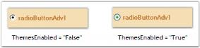
{:.image }

Visual Styles

The appearance of the CheckBoxAdv control can be customized using the various options provided by the following properties.

_Table_ _414__: Property Table_

<table>
<tr>
<td>
RadioButtonAdv Properties</td><td>
Description</td></tr>
<tr>
<td>
Style</td><td>
Gets / sets an advanced appearance for the RadioButtonAdv.The options included are as follows.{{ _Default and_ | markdownify }}{{ _Office2007._ | markdownify }}</td></tr>
<tr>
<td>
Office2007ColorScheme</td><td>
Gets / sets Office 2007 color scheme.The options included are as follows.{{ _Managed,_ | markdownify }}{{ _Blue,_ | markdownify }}{{ _Silver and_ | markdownify }}{{ _Black._ | markdownify }}The Style property should be set to "Office2007".</td></tr>
</table>

[C#]

this.radioButtonAdv1.Style = Syncfusion.Windows.Forms.Tools.RadioButtonAdvStyle.Office2007;

this.radioButtonAdv1.Office2007ColorScheme = Syncfusion.Windows.Forms.Office2007Theme.Blue;

[VB]

Me.radioButtonAdv1.Style = Syncfusion.Windows.Forms.Tools.RadioButtonAdvStyle.Office2007

Me.radioButtonAdv1.Office2007ColorScheme = Syncfusion.Windows.Forms.Office2007Theme.Blue

{:.image }

{:.image }

When the Office2007ColorScheme property is set to 'Managed', the RadioButton in the RadioButtonAdv can be displayed using custom colors supported by the control.

This can be done programmatically as follows.

[C#]

this.radioButtonAdv1.Style = Syncfusion.Windows.Forms.Tools.RadioButtonAdvStyle.Office2007;

this.radioButtonAdv1.Office2007ColorScheme = Syncfusion.Windows.Forms.Office2007Theme.Managed;

Office2007Colors.ApplyManagedColors(this, Color.Red);

[VB]

Me.radioButtonAdv1.Style = Syncfusion.Windows.Forms.Tools.RadioButtonAdvStyle.Office2007

Me.radioButtonAdv1.Office2007ColorScheme = Syncfusion.Windows.Forms.Office2007Theme.Managed

Office2007Colors.ApplyManagedColors(Me, Color.Red)

{:.image }

A sample which demonstrates the Themes and Visual Styles of RadioButtonAdv is available in the below sample installation path.

…\_My Documents\Syncfusion\EssentialStudio\Version Number\Windows\Tools.Windows\Samples\Advanced Editor Functions\ActionGroupingDemo_

###### RadioButtonAdv Events	

The list of events and a detailed explanation about each of them is given in the following sections.

_Table_ _415__: Events Table_

<table>
<tr>
<td>
RadioButtonAdv Events</td><td>
Description</td></tr>
<tr>
<td>
CheckChanged</td><td>
This event is fired when the Checked property of the RadioButtonAdv changes.</td></tr>
<tr>
<td>
GroupCheckChanged</td><td>
This event is fired when the Checked property of the RadioButtonAdv in the group changes.</td></tr>
</table>
CheckChanged Event

This event is fired when the Checked property of the RadioButtonAdv changes.

The event handler receives an argument of type EventArgs containing data related to this event.

[C#]

private void radioButtonAdv1_CheckChanged(object sender, EventArgs e)

{

Console.WriteLine(" CheckChanged event is raised");

}

[VB.NET]

Private Sub radioButtonAdv1_CheckChanged(ByVal sender As Object, ByVal e As EventArgs)

Console.WriteLine(" CheckChanged event is raised")

End Sub

GroupCheckChanged Event

This event is fired when the Checked property of the RadioButtonAdv in the group changes.

The event handler receives an argument of type EventArgs containing data related to this event.

[C#]

private void radioButtonAdv1_GroupCheckChanged(object sender, EventArgs e)

{

Console.WriteLine(" GroupCheckChanged event is raised");

}

[VB.NET]

Private Sub radioButtonAdv1_GroupCheckChanged(ByVal sender As Object, ByVal e As EventArgs)

Console.WriteLine(" GroupCheckChanged event is raised")

End Sub

### SpellChecker

Spell checking is a key feature in text processing applications; Essential Tools package includes a SpellChecker control with custom dictionary support.

SpellChecker is a component that comes with built-in support to handle the spell checking and suggestion replacements for RichTextBox and TextBox controls. SpellChecker can even be associated with non-TextBoxBase control via an interface.

IT Scenarios

SpellChecker would help in text processing application and data entry forms.

##### Samples and Location

Where to Find Samples?

Demo sample can be accessed from the Sample Browser in the Essential Studio dashboard under the following navigation path.

Essential Studio Samples >> Tools Samples >> Editors Package >> Spell Checker Demo

Sample Installation Location

A sample demonstrating the usage of SpellChecker is available under the following installation path.

…\_My Documents\Syncfusion\EssentialStudio\Version Number\Windows\Tools.Windows\Samples\Advanced Editor Functions\ActionGroupingDemo_

Viewing Samples

Click Run Sample icon in the Sample Browser, the demo sample application will be started, and click on the ‘Spell Check’ menu for the SpellChecker window to popup.

Source Code Location

{Installation Drive}: \Syncfusion\Essential Studio\{Version Number} \Base\Shared.Base\Src

##### Deployment Procedures 

Deployment Requirements

Syncfusion.Shared.Base assembly must be installed on the client machine for this control to work.

Default Deployment Pattern

Run the assembly manager in the Dash Board Chose the version and Framework of your interest and click ‘Perform Action’ to install the assemblies to GAC.

##### Getting Started

###### Feature Summary

SpellChecker comes with options to selectively ignore the following predefined patterns.

* Email Addresses
* File Names
* HTML Tags
* URLs
* Repeated words
* Special Symbols
* Words with mixed casing
* Words with Numbers and 
* Words in upper case
* Custom dictionary support along with dictionary editor

All these options are customizable at runtime as well.

###### Adding SpellChecker to an Application

Drag and drop the SpellChecker from the tool box to the form. SpellChecker will be added to the component tray of the form the control is hosted in.

{:.image }

{:.image }

###### Appearance and Structure of the Control

{:.image }

{:.image }

{:.image }

##### Concepts and Features

###### SpellChecking Options

SpellChecker allows customizing the way the controls look for the misspelled words in the input text with the following APIs. 

[C#]

using Syncfusion.Text;

SpellChecker spellChecker = new SpellChecker();

spellChecker.ExcludeEmailAddress = true;

spellChecker.ExcludeFileNames = true;

spellChecker.ExcludeHtmlTags = true;

spellChecker.ExcludeInternetAddresses = true;

spellChecker.ExcludeRepeatedWords = true;

spellChecker.ExcludeSpecialSymbols = true;

spellChecker.ExcludeWordsInMixedCase = true;

spellChecker.ExcludeWordsInUpperCase = true;

spellChecker.ExcludeWordsWithNumbers = true;

[VB NET]

Imports Syncfusion.Text

Private spellChecker As New SpellChecker()

spellChecker.ExcludeEmailAddress = True

spellChecker.ExcludeFileNames = True

spellChecker.ExcludeHtmlTags = True

spellChecker.ExcludeInternetAddresses = True

spellChecker.ExcludeRepeatedWords = True

spellChecker.ExcludeSpecialSymbols = True

spellChecker.ExcludeWordsInMixedCase = True

spellChecker.ExcludeWordsInUpperCase = True

spellChecker.ExcludeWordsWithNumbers = True

These options are accessible at runtime through the Spell Checker Options dialog; this can be invoked by the Options button available in the SpellChecker dialog.

Custom Dictionary:

SpellChecker comes with the custom dictionary support, the spellchecking engine always look for the words in the custom dictionary list when a word does not exists in the spellcheckers dictionary.

Words can be added to the custom dictionary with the Add to dictionary button in the SpellChecker dialog. Custom Dictionary will be created when a word that does not exists in the spellchecker dictionary is about to be added, and will be placed in the common application data path for the application. 

Users can add their own custom dictionary by refereing to the dictionary file path in the Custom Dictionary Editor dialog.

Word list can be customized with the Custom Dictionary Editor dialog, and this can be invoked by the Custom Dictionary button in the SpellChecker dialog. Users can add, delete words from the dictionary.

Use Case Scenarios

SpellChecker can be used for text processing applications and data entry forms where the input data to be spell error free.

Properties, Methods, and Events Tables for SpellChecker

Properties

_Table_ _416__: Property/Properties Table_

<table>
<tr>
<td>
Property </td><td>
Description </td><td>
Type </td><td>
Data Type </td><td>
Reference links </td></tr>
<tr>
<td>
ExcludeRepeatedWords</td><td>
Gets or sets a value specifying whether to ignore repeated words during spell check.</td><td>
</td><td>
Boolean (true / false)</td><td>
NA</td></tr>
<tr>
<td>
ExcludeWordsInMixedCase</td><td>
Gets or sets a value specifying whether to ignore words in mixed case during spell check.</td><td>
</td><td>
Boolean (true / false)</td><td>
NA</td></tr>
<tr>
<td>
ExcludeWordsInUpperCase</td><td>
Gets or sets a value specifying whether to ignore words in upper case during spell check.</td><td>
</td><td>
Boolean (true / false)</td><td>
NA</td></tr>
<tr>
<td>
ExcludeWordsWithNumbers</td><td>
Gets or sets a value specifying whether to ignore words with number during spell check.</td><td>
</td><td>
Boolean (true / false)</td><td>
NA</td></tr>
<tr>
<td>
MaxSuggestions</td><td>
Gets or sets a value specifying the number of suggestions to be displayed in the suggestion list.</td><td>
</td><td>
Integer</td><td>
NA</td></tr>
<tr>
<td>
ExcludeSpecialSymbols</td><td>
Gets or sets a value specifying whether to ignore special symbols during spell check.</td><td>
</td><td>
Boolean (true / false)</td><td>
NA</td></tr>
<tr>
<td>
ExcludeFileNames</td><td>
Gets or sets a value specifying whether to ignore file names during spell check.</td><td>
</td><td>
Boolean (true / false)</td><td>
NA</td></tr>
<tr>
<td>
ExcludeInternetAddresses</td><td>
Gets or sets a value specifying whether to ignore internet address during spell check.</td><td>
</td><td>
Boolean (true / false)</td><td>
NA</td></tr>
<tr>
<td>
DictionaryPath</td><td>
Gets or sets a value specifying the path of the dictionary.</td><td>
</td><td>
String</td><td>
NA</td></tr>
<tr>
<td>
CustomDictionaryPath</td><td>
Gets or sets a value specifying the path of the custom dictionary.</td><td>
</td><td>
String</td><td>
NA</td></tr>
<tr>
<td>
ExcludeEmailAddress</td><td>
Gets or sets a value specifying whether to ignore email address during spell check.</td><td>
</td><td>
Boolean (true / false)</td><td>
NA</td></tr>
<tr>
<td>
ExcludeHtmlTags</td><td>
Gets or sets a value specifying whether to ignore html tags during spell check.</td><td>
</td><td>
Boolean (true / false)</td><td>
NA</td></tr>
<tr>
<td>
MisspelledWords</td><td>
Holds the list of misspelled words.</td><td>
</td><td>
ArrayList</td><td>
NA</td></tr>
<tr>
<td>
DictionaryStream</td><td>
Gets or sets the stream that contains the dictionary.</td><td>
</td><td>
Stream</td><td>
NA</td></tr>
</table>
Methods 

_Table_ _417__: Method/s Table_

<table>
<tr>
<th>
Method </th><th>
Description </th><th>
Parameters </th><th>
Type </th><th>
Return Type </th><th>
Reference links </th></tr>
<tr>
<th>
SpellCheck</th><th>
Checks the text of the IEditor instance for misspelled words with SpellCheckerDialog</th><th>
IEditor – Instance of an IEditor whose text is to be checked for misspelled words.</th><th>
</th><th>
void</th><th>
</th></tr>
<tr>
<th>
Suggest</th><th>
Generates the word list by deleting a single alphabet and interchanging the adjacent alphabets every time</th><th>
Source – The misspelled word to which it suggests the right words.</th><th>
</th><th>
ArrayList</th><th>
</th></tr>
<tr>
<th>
WriteToDictionary</th><th>
Writes the specified word to the dictionary.</th><th>
custDictPath -Specifies the path of the dictionary file.Word - Specifies the word to be added to the dictionary.</th><th>
</th><th>
void</th><th>
</th></tr>
</table>
Events

_Table_ _418__: Event/sTable_

<table>
<tr>
<th>
Event </th><th>
Description </th><th>
Arguments </th><th>
Type </th><th>
Reference links </th></tr>
<tr>
<th>
Error</th><th>
Raised whenever exceptions occur while handling the dictionary files or streams. </th><th>
Sender – sender of the exceptionsex – the details of the exception occurred.</th><th>
NA</th><th>
</th></tr>
</table>
Adding SpellChecker to a RichTextbox

Spellchecker can easily be associated with the controls of type TextBoxBase via the SpellEditorWrapper class. The following code snippet exhibits how spellchecker can be associated with RichTextBox.

[C#]

using Syncfusion.Text;

SpellChecker spellChecker = new SpellChecker();

spellChecker.SpellCheck(new SpellEditorWrapper(this.richTextBox1));

[VB NET]

Imports Syncfusion.Text

Private spellChecker As New SpellChecker()

spellChecker.SpellCheck(New SpellEditorWrapper(Me.richTextBox1))

Samples Link

A sample demonstrating the use of SpellChecker is available in the sample browser shipped with the Essential Studio under Tools Samples. Navigate to the following path to access the sample.

Essential Studio Samples > Tools Samples > Editors Package > Spell Checker Demo

