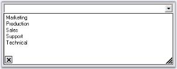

# DataSource

This section will discuss the data settings for the AutoComplete control, in the below topics.

## Data Settings

The data for the autocompletion will be maintained by the AutoComplete control itself. This is referred to as a History Data List mode. The below properties deals with data settings.

Table 118: Property Table

<table>
<tr>
<td>
AutoComplete Properties</td><td>
Description</td></tr>
<tr>
<td>
CategoryName</td><td>
Specifies a unique or shared name that can be given to an AutoComplete control so that it can persist the values under that name. For example, if the CategoryName "URL" is provided for an AutoComplete control on a particular form, all values persisted by that AutoComplete control will also be accessible to other AutoComplete controls on others forms or on the same form with the CategoryName "URL". </td></tr>
<tr>
<td>
DataSource</td><td>
Sets the Datasource to the Autocomplete control. The AutoComplete control automatically picks the "History Data List" mode or "Data source" mode based on the values set for the DataSource property. If the datasource property is set to NULL (default value is NULL), the control defaults to History Data List mode. It is to be remembered that the properties CategoryName, AutoAddItem and AutoSerialize have to be set appropriately for the History Data List mode to work properly.</td></tr>
</table>



this.autoComplete1.CategoryName = "FTP";

this.autoComplete1.DataSource = DataTable1;





Me.autoComplete1.CategoryName = "FTP"

Me.autoComplete1.DataSource = DataTable1


> Note: We can set External datasource for the autocompletion. See [External DataSource] topic(/windowsforms/Tools/EditorsPackage/AutoComplete-Controls/DataSource.html#external-datasource).

> See Also
> 
> [How to delete the items in the list at run time?](/windowsformsTools/EditorsPackage/AutoComplete-Controls/How-to-delete-the-items-in-the-list-at-run-time)

## Source for AutoComplete Control

### Dynamic Source at RunTime

Enabling the AutoComplete.AutoAddItem property will allow the end users to save their entries at run time. Pressing Enter key will save the user entry. See [Through Designer] (/windowsforms/Tools/EditorsPackage/AutoComplete-Controls/Creating-AutoComplete-Control.html#through-designer)topic for details.

### Setting AutoCompletion Source Through Designer

The different sources available for auto completion are specified using Control.AutoCompleteSource property. When the end user enters a letter in the TextBox for example, the letter will be matched with the source available and displays the dropdown item accordingly.

Table 119: Property Table

<table>
<tr>
<td>
Property</td><td>
Description</td></tr>
<tr>
<td>
AutoCompleteSource</td><td>
Auto completion source for the control. The different sources are,{{ 'FileSystem' | markdownify }} - Files system as source,{{ 'HistoryList' | markdownify }} - Includes all the URLs in the history list,{{ 'RecentlyUsedList' | markdownify }} - Includes the list of most recently used URLs,{{ 'AllUrl' | markdownify }} - Equivalent source of HistoryList and RecentlyUsedList as the source,{{ 'AllSystemSources' | markdownify }} - Equivalent source of AllUrls and FileSystem as the source (Default value of AutoCompleteSource when AutoCompletMode is set to values other than default value),{{ 'ListItems' | markdownify }} - Specifies the items in the control, {{ 'FileSystemDirectories' | markdownify }} - Specifies directory names alone without file names,{{ 'CustomSource' | markdownify }} - Uses the string values entered in AutoCompleteCustomSource property and{{ 'None' | markdownify }} - There will not be any source for the auto completion.</td></tr>
</table>



this.textBox1.AutoCompleteSource = System.Windows.Forms.AutoCompleteSource.HistoryList;




Me.textBox1.AutoCompleteSource = System.Windows.Forms.AutoCompleteSource.HistoryList



  

### Custom Source

AutoComplete control lets you to specify a set of auto completion text using String Collection Editor. This editor is invoked using Control.AutoCompleteCustomSource property. 

 

At run time when the user types the first letter, it will automatically display the auto completion list added through this editor.

>  Note: Control.AutoCompleteSource property should be set to "CustomSource" for this setting to be effective.



this.textBox1.AutoCompleteSource = System.Windows.Forms.AutoCompleteSource.CustomSource;

this.textBox1.AutoCompleteCustomSource.AddRange(new string[] {"Customization Settings", "Customization Properties",

"Customizing the items", "Custom Collections"});





Me.textBox1.AutoCompleteSource = System.Windows.Forms.AutoCompleteSource.CustomSource

Me.textBox1.AutoCompleteCustomSource.AddRange(New String[] {"Customization Settings", "Customization Properties",

"Customizing the items", "Custom Collections"})



  

### Mode of AutoCompletion

AutoCompletion modes can be specified using AutoCompleteMode property.

Table 120: Property Table

<table>
<tr>
<td>
Property</td><td>
Description</td></tr>
<tr>
<td>
AutoCompleteMode</td><td>
Gets or sets an option that controls how automatic completion, works for the control. The available modes are,{{ 'None' | markdownify }} - No autocompletion will be provided for this target edit control,{{ 'Suggest' | markdownify }} - The autocompletion will be presented as a list of probable matches in the form of a drop-down window,{{ 'Append' | markdownify }} - The closest match will be added to the partial string in the edit control and{{ 'SuggestAppend' | markdownify }} - A list of probable matches will be displayed as well as the entry will be completed in the edit control with the closest match.</td></tr>
</table>



this.textBox1.AutoCompleteMode = System.Windows.Forms.AutoCompleteMode.SuggestAppend;





Me.textBox1.AutoCompleteMode = System.Windows.Forms.AutoCompleteMode.SuggestAppend


 

> See Also
> 
> [Multiple Columns](/windowsforms/Tools/EditorsPackage/AutoComplete-Controls/Multiple-Columns), [External Datasource](#external-datasource)

## External Datasource

You can specify an external datasource for the AutoComplete control to use as the history list. This can be specified through the AutoComplete.DataSource property. The object specified for this property can be any object that implements IList or IListSource. 

1. Set AutoComplete mode to AutoSuggest.
2. Set the DataSource in the form's Load event as follows.

   ~~~ cs

		private void Form1_Load(object sender, System.EventArgs e)

		{

			// Set up the datasource on the Autocomplete control. 

		this.oleDbDataAdapter1.Fill(this.dataSet11.organisation);

		this.autoComplete1.DataSource = this.dataSet11.organisation;

		}
   ~~~
   {:.prettyprint}

   ~~~ vbnet

		Private Sub Form1_Load(ByVal sender As Object, ByVal e As System.EventArgs)

			 ' Set up the datasource on the Autocomplete control  .

		Me.oleDbDataAdapter1.Fill(Me.dataSet11.organisation)

		Me.autoComplete1.DataSource = Me.dataSet11.organisation

		End Sub

   ~~~
   {:.prettprint}

3. AutoCompleteItemSelected event is raised when a new item has been selected by the user when the AutoComplete drop down list is displayed. In this event, for the tutorial purpose, the code to display corresponding OrgID of the OrganisationName on the label is included. The below code retrieves the corresponding item from the datasource, for the selected item in the AutoComplete control.

   ~~~ cs

		private void autoComplete1_AutoCompleteItemSelected(object sender,Syncfusion.Windows.Forms.Tools.AutoCompleteItemEventArgs args)

		{

		  // Displays corresponding OrgID of the OrganisationName on the label.

		this.label1.Text = args.ItemArray[0].ToString();

		}
   ~~~
   {:.prettyprint}

   ~~~ vbnet

		Private Sub autoComplete1_AutoCompleteItemSelected(ByVal sender As Object, ByVal args As Syncfusion.Windows.Forms.Tools.AutoCompleteItemEventArgs)

		  ' Displays corresponding OrgID of the OrganisationName on the label.

		Me.label1.Text = args.ItemArray(0).ToString()

		End Sub

   ~~~
   {:.prettyprint}

  

Refer to [Multiple Columns](/windowsforms/Tools/EditorsPackage/AutoComplete-Controls/Multiple-Columns) section for more information on configuring data sources with multiple columns.
