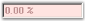

# PercentTextBox

The PercentTextBox is a textbox-derived control that can display double data type values in percentage form.

  

The PercentTextBox is derived from Windows Forms framework textbox control. The PercentTextBox supports display and collection of percentage values. It handles user keyboard input and percent formatting and uses the globalization features of the .NET platform to provide locale-specific formatting.