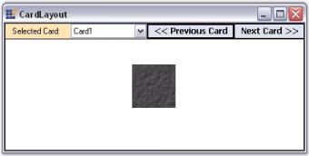
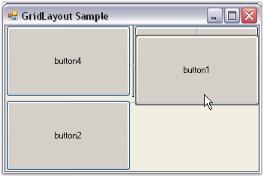
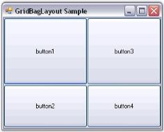

# Layout Managers Package

A Layout Manager is a component that manages the position of the Child controls in a Parent Container control. Container control is a control on which Child controls are dropped or for which the layout is designed. The Layout Manager sets the location and size of all the components based on a predefined set of constraints.

Layout Manager package provides users a comprehensive set of Layout Managers that help to manage advanced layouts on a form and the components will provide all the common layout capabilities for your Containers. The various Layout Managers included are as follows:

### BorderLayout

BorderLayout is a Layout Manager which allows arranging and layout the Child controls along the borders and at the center, just like .NET framework's built-in docking support.

### CardLayout

A CardLayout is a Layout Manager that is applied to a Container, and components are added to the layout in a particular form and not between different forms.

### FlowLayout

FlowLayout is a Layout Manager which allows arranging the Child components horizontally or vertically in a specific order, based on the settings.

### GridLayout

GridLayout is a Layout Manager that arranges the Child controls in a grid like fashion, containing rows and columns.

### GridBagLayout

GridBagLayout is a Layout Manager that arranges the Child controls in a virtual grid of rows and columns. But, unlike the GridLayout, the size of the columns and rows can vary and the Child controls may span more than one cell.

### Why Layout Manager?

When you develop a simple application, you can arrange the controls within a Container control without any helper control, just by arranging them in a particular order. But it will be difficult when you layout a large number of controls in the application. The problem will arise when new controls are added or existing controls are removed, reordered or appearance settings are changed, or any control or form is resized. It will be a real pain to maintain such a layout. In addition, this approach does not provide built-in support for multiple layouts.

See Also

## Features

This section lists the features that are provided by the Layout Managers of the Layout Manager Package.

Features

* BorderLayout

Child controls can be positioned along the borders and at the center using this Layout Manager.

* CardLayout

In the CardLayout Manager, Child controls are treated as cards inside the Container control. These cards can be viewed only one at a time.

The CardLayout Manager allows displaying images as cards and it provides options for the user to browse through the images.

* FlowLayout

In this Layout Manager, the Child controls are added either vertically or horizontally depending on the mode specified by theLayoutMode property. The direction of display can be reversed to suit the needs of the user.

The Alignment of the Child controls can be set to Near, Far, Center and ChildConstraints. When the Alignment property is set to 'ChildConstraints', the alignment of each individual Child control can be changed using the options provided by the extended Constraints on flowLayout property found in the properties grid of the Child controls.

The Child controls can also be rearranged at design time and run time.

* GridLayout

This Layout Manager allows arranging the Child controls as in a grid containing rows and columns. The number of rows and columns can be specified by the user.

Child controls can also be prevented from participating in the layout generated by the GridLayout using the ParticipateInLayout property.

The Child controls can be rearranged only at design time, unlike the FlowLayout which allows rearranging of Child controls at run time also.

* GridBagLayout

This functions similar to the GridLayout, but unlike the GridLayout, this Layout Manager allows specifying the size of the rows or columns in the grid and the Child controls are allowed to span more than one cell.

The appearance, alignment, position and space settings of the Child controls can be changed using the extended Constraints on gridBagLayout property of the Child controls.

The Child controls can be rearranged by this Layout Manager also, but it can be done only at design time as in the GridLayout Manager.

### General Features

* Ability to create elegant user interfaces as quickly as possible.
* Reduces the time spent on creating, customizing and supporting the layout of applications that contain a lot of controls.
* Maintains an effective and consistent layout.
* Provides an automatic control alignment feature which ensures that controls don't overlap one another even when the font settings are changed or the form is resized.
* Provides advanced capabilities for creating, customizing and supporting the layout of controls within the Container control.

### Key Features

* Consistent Layout Management

Layout Manager automatically maintains a consistent layout of controls within a form. On resizing the form or changing the font settings of the controls, the layout will never break and the controls will never overlap.

* On-the-Fly Layout Customization

Layout managers create attractive layouts within a few seconds. Controls can be added to the layout in a really intuitive manner by dragging and dropping them onto the layout.

* Automatic Alignment

Layout Managers automatically align the controls horizontally / vertically, next to each other, with multiple controls within a single row, and multiple controls along the edge of another control.

* Size Constraints

It allows you to specify a control's width / height that can be varied only within a particular range, allow free sizing for the control vertically and / or horizontally or lock it to the current size. By default, specific size constraints are applied to all the Child controls within the Parent control.

* Customizing a Layout in Code

Layout Managers allow the user to customize the layout of the controls using code snippets.

* Design Time Arrangement using Verbs

We can arrange the layout of Child controls using the Bring to front and Send to back design time verbs.

* Focus Management

An end-user can move the focus between the Child controls using the TAB key. This feature is enabled by default.

* AutoLabel

Is a label-derived control that lets you pair a label with any other control. Once paired, the AutoLabel will be automatically repositioned as the labeled control's position changes.

* Layout Support for Third Party Controls

Layout Managers allow the user to layout the third party controls over the Parent controls without registering the respective controls.

* Spacing and Margins

The Layout Managers provide horizontal and vertical spacing between the layout border and components and also provide the right margin and left margin between the Client rectangle and layout rectangle.

* Layout support for Non-Control Based Components

Layout Managers allow the user to layout the non-control based components when they implement a simple interface.

* Event Handling

 Layout Managers support event handling.

Controls laid out by Flow layout, Grid Layout can now be rearranged simply by dragging the controls in the designer. 

See Also

Concepts and Features

## Overview of Layout Manager

### Layout Manager

The Layout Manager is the base type of all components, providing a basic layout management framework over which the individual managers build on. It provides fundamental information on the five layout managers included in this package which are listed below.

### BorderLayout

This Layout Manager will layout the Child controls along the borders and at the center, just like the .NET framework's built-in docking support.

### CardLayout

This Layout Manager shows one Child control at a time in a Container.

### FlowLayout

This Layout Manager will layout the Child components horizontally or vertically in a specific order, based on constraints. FlowLayout is one of the most commonly used Layout Managers.

### GridLayout

This Layout Manager will layout Child controls in the form of a grid containing rows and columns. 

### GridBagLayout

This Layout Manager will layout the Child controls in a virtual grid of rows and columns. But, unlike the GridLayout, the size of the columns / rows can be varied and the children may span more than one cell.

### Container Control

Container control is a control on which the Layout Manager is dropped or for which the layout is designed. All controls that inherit the System.Windows.Forms.ContainerControl can act as a Container control.

Windows Form and Panel controls are the most widely used Container controls.

### Child Control

Child controls can be added to the Container control by just dragging and dropping the controls from the toolbox.

The Layout Managers can be associated with any Container control property. The Layout Managers will then automatically layout their Child controls based on specific constraints. They can also be used to layout the non-control-based components that are derived from a specific interface (LayoutItemBase) drawn within the Container.

> Note: The Container control will be referred by its property name as ContainerControl and it's children referred to as Child components (emphasizing the fact that the children need not be a control-derived class) in this document.

See Also

BorderLayout, CardLayout, FlowLayout, GridLayout, GridBagLayout

## Creating a Simple Layout

 This section discusses how a simple layout can be created using Layout Managers, which are discussed in the following topics.

See Also

Overview of Layout Manager

### Through Designer

This topic discusses how to create a simple layout for aligning Child controls through designer.

#### Adding Child Controls

* Populate the form with the necessary Child controls (here, we are using Buttons), by dragging and dropping them from the toolbox.

#### Adding Layout Managers

The Layout Manager can be added before or after adding the Child controls to the Container control.

* The Layout Manager can be added to the form by just dragging and dropping the appropriate Layout Manager (for ex: BorderLayout) from the toolbox onto your form, which will be then be automatically added to the component tray.

#### Setting Container Control

* You can optionally drop the Child controls onto the Container control that you want to layout and the design time will automatically set the ContainerControl property in the Layout Manager.
* Form, Panel or any control that inherits the Container control can be set as a Container control for the Child controls that are added (here, form is set as the Container control).

> Note: The FlowLayout, CardLayout and GridLayout controls automatically arrange the Child controls of the Container control in a specific manner. When new controls are added, the Layout Manager will ensure that the old layout is not broken and that the existing controls are not messed up.

Configuring Child Controls

For BorderLayout and GridBagLayout, it is necessary to configure the Child controls by changing their extended properties via the property grid in the designer so that the Child controls can be aligned properly.

Configuring Layout Manager

You can then configure the Layout Manager by changing its properties via the property grid in the designer.

See Also

Through Code, Concepts and Features

### Through Code

The following steps will help you to create a simple layout for button controls, via code. Here the programmatic creation of the BorderLayout is discussed. Similarly other layouts can also be created.

* Create a new Visual C# or VB.NET application in Visual Studio .NET.
* Add the Syncfusion.Shared.Base and Syncfusion.Tools.Windows assemblies to your application.
* Include the required namespace.



using Syncfusion.Windows.Forms.Tools;





Imports Syncfusion.Windows.Forms.Tools



* Create variables for the Child controls (Buttons) and Layout Manager (Border Layout).



private System.Windows.Forms.Button btn1;

private System.Windows.Forms.Button btn2;

private System.Windows.Forms.Button btn3;

private System.Windows.Forms.Button btn4;

private System.Windows.Forms.Button btn5;

private Syncfusion.Windows.Forms.Tools.BorderLayout brd;





Private btn1 As System.Windows.Forms.Button

Private btn2 As System.Windows.Forms.Button

Private btn3 As System.Windows.Forms.Button

Private btn4 As System.Windows.Forms.Button

Private btn5 As System.Windows.Forms.Button

Private brd As Syncfusion.Windows.Forms.Tools.BorderLayout



* Declare instances for the Child controls (Buttons).



btn1 = new Button();

btn2 = new Button();

btn3 = new Button();

btn4 = new Button();

btn5 = new Button();





btn1 = New Button()

btn2 = New Button()

btn3 = New Button()

btn4 = New Button()

btn5 = New Button()



* Add the Child controls (Buttons) to the form.



this.Controls.AddRange(new Button[] {btn1,btn2,btn3,btn4,btn5});





Me.Controls.AddRange(New Button() {btn1,btn2,btn3,btn4,btn5})



* Declare an instance for the Layout Manager (Border Layout).



brd = new Syncfusion.Windows.Forms.Tools.BorderLayout();





brd = New Syncfusion.Windows.Forms.Tools.BorderLayout()



* Set the Container control for the Layout Manager (Border Layout).



this.brd.ContainerControl = this;

// To set the container control for a panel.

// this.brd.ContainerControl = this.panel1;





Me.brd.ContainerControl = Me

// To set the container control for a panel.

// Me.brd.ContainerControl = Me.panel1;



* Set the margin between the client rectangle and the layout rectangle.



this.brd.BottomMargin = 20;

this.brd.HorzFarMargin = 20;

this.brd.HorzNearMargin = 20;

this.brd.TopMargin = 20;





Me.brd.BottomMargin = 20

Me.brd.HorzFarMargin = 20

Me.brd.HorzNearMargin = 20

Me.brd.TopMargin = 20



* Set the spacing between the layout border and the components.



this.brd.HGap = 20;

this.brd.VGap = 20;





Me.brd.HGap = 20

Me.brd.VGap = 20



* Set the text and border position for the Child controls (Buttons).



this.btn1.Text = "One";

this.btn2.Text = "Two";

this.btn3.Text = "Three";

this.btn4.Text = "Four";

this.btn5.Text = "Five";

this.brd.SetPosition(this.btn1,Syncfusion.Windows.Forms.Tools.BorderPosition.North);

this.brd.SetPosition(this.btn2,Syncfusion.Windows.Forms.Tools.BorderPosition.South);

this.brd.SetPosition(this.btn3,Syncfusion.Windows.Forms.Tools.BorderPosition.East);

this.brd.SetPosition(this.btn4,Syncfusion.Windows.Forms.Tools.BorderPosition.West);

this.brd.SetPosition(this.btn5,Syncfusion.Windows.Forms.Tools.BorderPosition.Center);





Me.btn1.Text = "One"

Me.btn2.Text = "Two"

Me.btn3.Text = "Three"

Me.btn4.Text = "Four"

Me.btn5.Text = "Five"

Me.brd.SetPosition(Me.btn1,Syncfusion.Windows.Forms.Tools.BorderPosition.North)

Me.brd.SetPosition(Me.btn2,Syncfusion.Windows.Forms.Tools.BorderPosition.South)

Me.brd.SetPosition(Me.btn3,Syncfusion.Windows.Forms.Tools.BorderPosition.East)

Me.brd.SetPosition(Me.btn4,Syncfusion.Windows.Forms.Tools.BorderPosition.West)

Me.brd.SetPosition(Me.btn5,Syncfusion.Windows.Forms.Tools.BorderPosition.Center)



See Also

Through Designer, Concepts and Features

## Concepts and Features

The Layout Managers come with full design time support. They can be associated with any control using simple drag and drop techniques. Child component-specific constraints varying based on the Layout Manager type are also plugged seamlessly into the design time as the corresponding Child control's extended property.

This section discusses the concepts and features of the various Layout Managers in the following topics.

Common property settings of all the Layout Managers and extended properties of the Child controls

Property settings specific to all the Layout Managers and extended properties of the Child controls

See Also

Creating a Simple Layout

### Layout Manager Settings

The settings that are common to all the Layout Manager's have been discussed in this section.

It includes the below given topics.

#### Behavior Settings

The behavior settings that are common to all the Layout Managers are discussed below.

AutoLayout

The Layout Manager, by default, listens to the Container'sLayout events and performs the layout automatically.

_Table_ _419_: Property Table

<table>
<tr>
<td>
LayoutManager Property</td><td>
Description</td></tr>
<tr>
<td>
AutoLayout</td><td>
Indicates whether the Layout Manager should layout automatically on Layout event.</td></tr>
</table>



this.borderLayout1.AutoLayout = true;





Me.borderLayout1.AutoLayout = True



> Note: The above process can be prevented by setting the AutoLayout property to 'False' and invoking the layout explicitly through a call to the LayoutContainer() method.

#### ContainerControl

The Container control to be laid out by the Layout Manager can be specified using the below given property.

_Table_ _420_: Property Table

<table>
<tr>
<td>
LayoutManager Property</td><td>
Description</td></tr>
<tr>
<td>
ContainerControl</td><td>
Specifies the Container control that the Layout Manager will layout.</td></tr>
</table>



this.borderLayout1.ContainerControl = this;





Me.borderLayout1.ContainerControl = Me



#### Custom Layout Bounds

The Layout Manager will, by default, layout the Child components within the Container control's client rectangle. However, you can specify any custom layout bounds using the property given below.

_Table_ _421_: Property Table

<table>
<tr>
<td>
LayoutManager Property</td><td>
Description</td></tr>
<tr>
<td>
CustomLayoutBounds</td><td>
Specifies the custom layout bounds, if any, to be used for layout calculation instead of the Container control's client rectangle.</td></tr>
</table>



this.borderLayout1.CustomLayoutBounds = new System.Drawing.Rectangle(0, 0, 0, 0);





Me.borderLayout1.CustomLayoutBounds = New System.Drawing.Rectangle(0, 0, 0, 0)



> Note: When you specify the custom layout bounds and the Container is resizable, you should also set the AutoLayout property to 'False' and set a new custom layout bounds when the Container resizes.

> Note: The layout is done within the Container's client rectangle, even if the Container has a scrollable display rectangle.

#### Margin Settings

The margin settings that are common to all the Layout Managers are discussed below.

The layout bounds will also be adjusted to include some margin space along the borders according to the values specified in the properties given below. The default values of these properties are set to 'Zero'.

_Table_ _422_: Property Table

<table>
<tr>
<td>
LayoutManager Properties</td><td>
Description</td></tr>
<tr>
<td>
TopMargin</td><td>
Gets / sets the top margin between the client rectangle and the layout rectangle.</td></tr>
<tr>
<td>
HorzNearMargin</td><td>
Gets / sets the left margin between the client rectangle and the layout rectangle.</td></tr>
<tr>
<td>
HorzFarMargin</td><td>
Gets / sets the right margin between the client rectangle and the layout rectangle.</td></tr>
<tr>
<td>
BottonMargin</td><td>
Gets / sets the bottom margin between the client rectangle and the layout rectangle.</td></tr>
</table>



this.borderLayout1.TopMargin = 20;

this.borderLayout1.HorzFarMargin = 20;

this.borderLayout1.HorzNearMargin = 20;

this.borderLayout1.BottomMargin = 20;





Me.borderLayout1.TopMargin = 20

Me.borderLayout1.HorzFarMargin = 20

Me.borderLayout1.HorzNearMargin = 20

Me.borderLayout1.BottomMargin = 20



See Also

Configuring BorderLayout, Configuring FlowLayout, Configuring GridLayout

#### Child Control Settings

The Child control settings for the Layout Managers are given below.

Size

Preferred Size

The Layout Managers usually layout the components based on their preferred sizes. But a .NETcontrol does not provide information regarding it's preferred size. To overcome this, a PreferredSize extended property is provided for each Child control at design time.

In code, you can perform the same using the methods given below.

_Table_ _423_: Methods Table

<table>
<tr>
<td>
Methods</td><td>
Description</td></tr>
<tr>
<td>
SetPreferredSize</td><td>
Associates a preferred size with the specified control.</td></tr>
<tr>
<td>
GetPreferredSize</td><td>
Retrieves the preferred size associated with the specified control.</td></tr>
</table>



this.cardLayout1.SetPreferredSize(this.button1, new System.Drawing.Size(75, 92));





Me.cardLayout1.SetPreferredSize(Me.button1, New System.Drawing.Size(75, 92))



_Minimum Size_

You can similarly associate a minimum size for a Child component through the MinimumSize extended property. However, some Layout Managers ignore this setting. Refer to the individual Layout Managers for more information on how the size plays an important part in the layout logic.

In code, you can perform the same using the methods given below.

_Table_ _424_: Methods Table

<table>
<tr>
<td>
Methods</td><td>
Description</td></tr>
<tr>
<td>
SetMinimumSize</td><td>
Associates a minimum size with the specified control.</td></tr>
<tr>
<td>
GetMinimumSize</td><td>
Retrieves the minimum size associated with the specified control.</td></tr>
</table>



this.cardLayout1.SetMinimumSize(this.button1, new System.Drawing.Size(75, 92));





Me.cardLayout1.SetMinimumSize(Me.button1, New System.Drawing.Size(75, 92))



You can also dynamically provide preferred and minimum size information for a Child component at run time. The manner in which a Layout Manager determines the preferred size for a Child control is illustrated below.

* The layout manager checks if the Child control / component implements the IProvideLayoutInformation interface. If so, it calls into that interface to retrieve the preferred size.
* If the above step fails, the Layout Manager fires the ProvideLayoutInformation event, requesting the size information required. If the event is handled and the information provided, that size will be used.
* If the above step fails, the Layout Manager checks if a preferred size was provided statically during design time using the extended PreferredSize property or in code using the SetPreferredSize() method. If so, that size is used. If not, the current size of the Child control is made the preferred size and that size will be used.

> Note: The same steps are used to determine the minimum size, if required, for a Child control.

> Note: The above properties are available as the extended properties for the Child controls of CardLayout, FlowLayout and GridBagLayout only.

See Also

BorderLayout – Configuring Child Control, CardLayout - Configuring Child Controls, FlowLayout - Configuring Child Controls, GridLayout - Configuring Child Controls, GridBagLayout - Configuring Child Controls

### BorderLayout

BorderLayout is a Layout Manager which allows the user to arrange and layout the Child controls along the borders and at the center, just like the .NET framework's built-in docking support.

> Note: BorderLayout does not arrange the Child components automatically like the other Layout Managers.

A sample which demonstrates the BorderLayout is available in the below sample installation path.

…\_My Documents\Syncfusion\EssentialStudio\Version Number\Windows\Tools.Windows\Samples\Advanced Editor Functions\ActionGroupingDemo_

See Also

Creating a Simple Layout, 

#### Configuring BorderLayout

The configuration settings for the BorderLayout have been discussed in this topic.

_Spacing_

The horizontal and the vertical gap between the Child controls can be set using the properties given below.

_Table_ _425_: Property Table_

<table>
<tr>
<td>
BorderLayout Properties</td><td>
Description</td></tr>
<tr>
<td>
HGap</td><td>
Gets / sets the horizontal spacing between the components.</td></tr>
<tr>
<td>
VGap</td><td>
Gets / sets the vertical spacing between the components.</td></tr>
</table>



this.borderLayout1.HGap = 10;

this.borderLayout1.VGap = 10;





Me.borderLayout1.HGap = 10

Me.borderLayout1.VGap = 10



See Also

Margin Settings, Border Layout - Configuring Child Controls

#### Configuring Child Controls

The Child controls can be aligned to various positions (North, South, East, West and Center) using the property given below.

_Table_ _426_: Property Table

<table>
<tr>
<td>
Child Control Property</td><td>
Description</td></tr>
<tr>
<td>
Position on borderLayout</td><td>
Gets / sets the border position for a Child component.</td></tr>
</table>

> Note: This property is added as an extended property in the properties window of the Child control added to the BorderLayout.



this.borderLayout1.SetPosition(this.btnNorth, Syncfusion.Windows.Forms.Tools.BorderPosition.North);





Me.borderLayout1.SetPosition(Me.btnNorth, Syncfusion.Windows.Forms.Tools.BorderPosition.North)



> Note: BorderLayout allows only one control to be aligned along a particular layout position, unlike the .NET framework support.

See Also

Configuring BorderLayout

### CardLayout

A CardLayout is a Layout Manager that is applied to a Container, and components are added to the layout in a particular form and not between different forms. It treats each component in the Container as a card. Only one card is visible at a time, and the Container acts as a stack of cards. The first component added to a CardLayout object is the visible component when the Container is first displayed.

The Child component / card can either be made to fill or simply centered within the Container. Some common uses of a CardLayout are to create WizardControls and property pages.

> Note: The WizardControl uses the CardLayout component internally in it's implementation.

In it's simplest form, this Layout Manager can be used to automatically arrange the Child components in one or more rows, as given below.

A Sample which demonstrates the CardLayout is available in the below sample installation path.

…\_My Documents\Syncfusion\EssentialStudio\Version Number\Windows\Tools.Windows\Samples\Advanced Editor Functions\ActionGroupingDemo_

See Also

Creating a Simple Layout, 

#### Configuring CardLayout	

The configuration settings for the CardLayout have been discussed in this topic.

Card Names

By default, when a new Child control is added, the CardLayout will render a unique card name for it. This name can be modified by using the property given below.

_Table_ _427_: Property Table

<table>
<tr>
<td>
CardLayout Property</td><td>
Description</td></tr>
<tr>
<td>
CardName</td><td>
Specifies the name of the card.</td></tr>
</table>



this.cardLayout1.SetCardName(this.label1, "Card1");





Me.cardLayout1.SetCardName(Me.label1, "Card1")



The methods associated with the above property are given below.

_Table_ _428_: Methods Table

<table>
<tr>
<td>
Method</td><td>
Description</td></tr>
<tr>
<td>
GetCardName</td><td>
Returns the card name of a Child component.</td></tr>
<tr>
<td>
GetCardNames</td><td>
Returns an array containing the card names as strings.</td></tr>
<tr>
<td>
GetComponentFromName</td><td>
Returns an associated control given a card name. </td></tr>
<tr>
<td>
GetNewCardName</td><td>
Generates a new unique name for the card that could be added to this CardLayout. </td></tr>
<tr>
<td>
SetCardName</td><td>
Sets the card name for a Child component.</td></tr>
</table>

> Note: This property is added as an extended property in the properties window of the Child control added to the CardLayout.

_Card Index_

The index of the previous and next cards can be determined using the below given properties.

_Table_ _429_: Property Table

<table>
<tr>
<td>
CardLayout Properties</td><td>
Description</td></tr>
<tr>
<td>
NextCardIndex</td><td>
Returns the index of the next card that will be shown when the Next() method gets called.</td></tr>
<tr>
<td>
PreviousCardIndex</td><td>
Returns the index of the previous card that will be shown when the Previous() method gets called.</td></tr>
</table>
Aspect Ratio

The aspect ratio can be set using the property given below.

_Table_ _430_: Property Table

<table>
<tr>
<td>
CardLayout Property</td><td>
Description</td></tr>
<tr>
<td>
MaintainAspectRatio</td><td>
Indicates if the aspect ratio is to be maintained. The default value is set to 'False'.</td></tr>
</table>



this.cardLayout1.SetMaintainAspectRatio(this.label1, true);





Me.cardLayout1.SetMaintainAspectRatio(Me.label1, True)



The methods associated with the above property are given below.

_Table_ _431_: Methods Table

<table>
<tr>
<td>
Method</td><td>
Description</td></tr>
<tr>
<td>
GetMaintainAspectRatio</td><td>
Returns the value for maintaining aspect ratio based on the control's preferred size.</td></tr>
<tr>
<td>
SetMaintainAspectRatio</td><td>
Sets the value for maintaining aspect ratio based on the control's preferred size.</td></tr>
</table>
See Also

Card Layout - Configuring Child Controls

#### Configuring Child Controls

Deriving from the Layout Manager base, the CardLayout inherits all the functionality that the Layout Manager type exposes.

For example, when the CardLayout is added to a form, and a Panel control is added to it, then this Panel control acts as Card1, where the user can add the needed controls. Then another Panel control can be added which will act as Card2 and so on. During runtime, only one Card will be visible at a time. You can traverse through these cards by adding buttons and setting the appropriate code.

In the following screen shot, Panel control acts as the Container control and Label control acts as a card.

Image Settings

In the selected card, you can insert an image using the Child (Label) controlproperty as shown below.

_Table_ _432_: Property Table

<table>
<tr>
<td>
Child Control Property</td><td>
Description</td></tr>
<tr>
<td>
Image</td><td>
Gets / sets the image that will be displayed on the control.</td></tr>
</table>



this.label1.Image = ((System.Drawing.Bitmap)(resources.GetObject("label1.Image")));





Me.label1.Image = DirectCast((resources.GetObject("label1.Image")), System.Drawing.Bitmap)



Size

The preferred size and minimum size of the Child controls can be set using the PreferredSize and MinimumSize extended properties of the Child controls that are added to the CardLayout. Refer Child Control Settings to know about this topic.

Layout Mode

The CardLayout provides two modes to layout the Child controls. The mode can be set using the property given below.

_Table_ _433_: Property Table

<table>
<tr>
<td>
CardLayout Property</td><td>
Description</td></tr>
<tr>
<td>
LayoutMode</td><td>
Specifies the layout mode for the Child controls. The default value is set to 'Default'.The options included are as follows.Default andFill.</td></tr>
</table>

When the layout mode of CardLayout is set to 'Default', the Child control is simply centered within the Container when the Container's size is bigger than the Child control's preferred size. However, if the Container's size is smaller than the Child controls's preferred size, the Child control's size will shrink down to its minimum size. When shrunk, you have an option to specify whether the preferred width / height aspect ratio should be maintained for that Child control, which is specified using the extended MaintainAspectRatio property of each Child.

When the layout mode is set to 'Fill', it simply resizes the Child control to fill the entire Container client area.



this.cardLayout1.LayoutMode = Syncfusion.Windows.Forms.Tools.CardLayoutMode.Fill;





Me.cardLayout1.LayoutMode = Syncfusion.Windows.Forms.Tools.CardLayoutMode.Fill



See Also

Configuring CardLayout, Child Control Settings, 

Browsing Through Cards

This section discusses illustrates how to browse through the Cards (Child controls) that have been added to the CardLayout Manager.

Through Designer

The selected card can be displayed using the property given below, which simply takes the card name as input.

_Table_ _434_: Property Table

<table>
<tr>
<td>
CardLayout Property</td><td>
Description</td></tr>
<tr>
<td>
SelectedCard</td><td>
Gets / sets the current card's name.</td></tr>
</table>



this.cardLayout1.SelectedCard = "Card1";





Me.cardLayout1.SelectedCard = "Card1"



You can also browse through the different cards using the methods given below.

_Table_ _435_: Methods Table

<table>
<tr>
<td>
Methods</td><td>
Description</td></tr>
<tr>
<td>
First</td><td>
Shows the first card.</td></tr>
<tr>
<td>
Next</td><td>
Show the next card in the list.</td></tr>
<tr>
<td>
Previous</td><td>
Show the previous card in the list.</td></tr>
<tr>
<td>
Last</td><td>
Show the last card in the list.</td></tr>
</table>

> Note: The SmartTag feature (available only in Visual Studio 2005) can also be used to browse through the cards of the CardLayout.

Through Code

Drag and drop the ComboBox and the Previous and Next Buttons for viewing the selected card. Use the Previous() and Next() methods of the CardLayout to see the CardLayout in action inside the Previous and Next Button Clicks.



private void Previous_Click(object sender, System.EventArgs e)

{

this.cardLayout1.Previous();

}

private void Next_Click(object sender, System.EventArgs e)

{

this.cardLayout1.Next();

}





Private Sub Previous_Click(ByVal sender As Object, ByVal e As System.EventArgs)

Me.cardLayout1.Previous()

End Sub

Private Sub Next_Click(ByVal sender As Object, ByVal e As System.EventArgs)

Me.cardLayout1.Next()

End Sub



At run time, cards can be selected using the items in the ComboBox or by Button clicks.

See Also

Configuring CardLayout, Configuring Child Controls, Child Control Settings

### FlowLayout

FlowLayout is a Layout Manager which allows us to arrange the Child components horizontally or vertically in a specific order, based on the settings. FlowLayout is one of the most commonly used Layout Managers. Deriving from the LayoutManager class, the FlowLayout component was created to support simple horizontal and vertical flow and complex constraint-based FlowLayouts.

In its simplest form, this Layout Manager can be used to automatically arrange the Child components in one or more rows, as shown below.

In it's most flexible and powerful mode, a FlowLayout automatically realigns the controls by adjusting their sizes and location based on the current font size, form size and localization settings, helping you to create efficient form layouts.

FlowLayout uses the preferred size of a Child component in it's layout logic. The minimum size is ignored for the most part, except in the constraint-based scenario discussed below.

The FlowLayout features can be split based on simple and constraint-based scenarios.

In a simple scenario, the Layout Manager does not expect any constraints to be associated with the Child components. In a constraint-basedscenario, you specify constraints for each Child component over the layout logic.

The various features are discussed in the topics given below.

A Sample which demonstrates the FlowLayout is available in the below sample installation path.

…\_My Documents\Syncfusion\EssentialStudio\Version Number\Windows\Tools.Windows\Samples\Advanced Editor Functions\ActionGroupingDemo_

See Also

Creating a Simple Layout

#### Configuring FlowLayout

Layout Mode

The layout mode dictates the core function of a FlowLayout, whether to layout the Child controls horizontally or vertically. This property will be in effect for both the scenarios.

_Table_ _436_: Property Table
<table>
<tr>
<td>
FlowLayout Property</td><td>
Description</td></tr>
<tr>
<td>
LayoutMode</td><td>
Specifies the layout mode of the Child controls. The default value is set to 'Horizontal'.The options included are as follows.{{ '_Horizontal and_' | markdownify }}{{ '_Vertical._' | markdownify }}</td></tr>
</table>



this.flowLayout1.LayoutMode = Syncfusion.Windows.Forms.Tools.FlowLayoutMode.Vertical;





Me.flowLayout1.LayoutMode = Syncfusion.Windows.Forms.Tools.FlowLayoutMode.Vertical



ParticipateInLayout

Child controls can be prevented from being laid out using the FlowLayout Manager. This can be done using the methods given below.

_Table_ _437_: Methods Table

<table>
<tr>
<td>
Method</td><td>
Description</td></tr>
<tr>
<td>
GetParticipateInLayout</td><td>
Indicates whether the component is in the layout list.</td></tr>
<tr>
<td>
SetParticipateInLayout</td><td>
Adds or removes the specified control from the layout list.</td></tr>
</table>

The following code can be used to add or remove the Child control from the FlowLayout list programmatically.



this.flowLayout1.SetParticipateInLayout(this.button1,false);





Me.flowLayout1.SetParticipateInLayout(Me.button1,False)



HGap and VGap

The horizontal and the vertical gap between the Child controls can be set using the properties given below.

_Table_ _438_: Property Table

<table>
<tr>
<td>
FlowLayout Property</td><td>
Description</td></tr>
<tr>
<td>
HGap</td><td>
Gets / sets the horizontal spacing between the components.</td></tr>
<tr>
<td>
VGap</td><td>
Gets / sets the vertical spacing between the components.</td></tr>
</table>



this.flowLayout1.HGap = 20;

this.flowLayout1.VGap = 20;





Me.flowLayout1.HGap = 20

Me.flowLayout1.VGap = 20



AutoHeight

The height of the Container control can be automatically increased when there is a lack of sufficient space to show the Child components in the horizontal alignment mode. This is useful to enforce minimum heights on Container controls and forms.

_Table_ _439_: Property Table

<table>
<tr>
<td>
FlowLayout Property</td><td>
Description</td></tr>
<tr>
<td>
AutoHeight</td><td>
Specifies if the Container's height should be enforced to the minimum when in horizontal alignment mode.</td></tr>
</table>



this.flowLayout1.AutoHeight = true;





Me.flowLayout1.AutoHeight = True



Layout Direction

FlowLayout allows you to layout the Child controls in the opposite direction (right to left or bottom to top).

_Table_ _440_: Property Table

<table>
<tr>
<td>
FlowLayout Property</td><td>
Description</td></tr>
<tr>
<td>
ReverseRows</td><td>
Specifies to layout the Child controls in the reverse direction.</td></tr>
</table>



this.flowLayout1.ReverseRows = true;





Me.flowLayout1.ReverseRows = True



Alignment

The Alignment property is where you specify whether the current layout logic should be simple or constraint-based. 

> Note: Alignment is applied only along the direction of flow. For example, if the LayoutMode property is set to 'Horizontal' and the Alignment property is set to 'Center', then the rows will be centered horizontally.

<table>
<tr>
<td>
FlowLayout Property</td><td>
Description</td></tr>
<tr>
<td>
Alignment</td><td>
Specifies the alignment of layout components in the direction of flow. The options included are as follows.Center,Near,Far andChildConstraints.</td></tr>
</table>



this.flowLayout1.Alignment = Syncfusion.Windows.Forms.Tools.FlowAlignment.Near;





Me.flowLayout1.Alignment = Syncfusion.Windows.Forms.Tools.FlowAlignment.Near



Once you specify the alignment of a FlowLayout as 'ChildConstraints', the Layout Manager will use a constraint-based layout logic based on the constraints specified on each Child component. During design time, the constraints can be specified for each Child control through the following extended property.

_Table_ _442_: Property Table

<table>
<tr>
<td>
FlowLayout Property</td><td>
Description</td></tr>
<tr>
<td>
Constraints on flowLayout</td><td>
Specifies the alignment of layout components in the direction of flow when the Alignment property is set to 'ChildConstraints'.</td></tr>
</table>



this.flowLayout1.Alignment = Syncfusion.Windows.Forms.Tools.FlowAlignment.ChildConstraints;





Me.flowLayout1.Alignment = Syncfusion.Windows.Forms.Tools.FlowAlignment.ChildConstraints



> Note: Refer_ FlowLayout - Configuring Child Controls _topic to know about HAlign, VAlign and other options provided by the Constraints on flowLayout property.

See Also

FlowLayout - Configuring Child Controls, Centering the Child Controls Horizontally and Vertically, Enabling Constrained FlowLayout on a Container, Rearranging the Controls laid out by FlowLayout

#### Configuring Child Controls

Constraints on FlowLayout

Constrained FlowLayout is typically useful when creating resizable data entry forms filled with textboxes, checkboxes, and so on. During design time, the constraints can be specified for each Child control through its extended Constraints on flowLayout property. The constraints in the FlowLayout are described below in detail.

Setting the Constraints Through Designer

HAlign and VAlign

The alignment of the Child controls that have been placed within a row can be set using the properties given below. The alignment is done based upon the layout modes of the Child controls.

_Table_ _443_: Constraints Table

<table>
<tr>
<td>
Child Control Constraints</td><td>
Description</td></tr>
<tr>
<td>
HAlign</td><td>
Specifies the mode in which the Child control should be laid out within a row. The options includes are as follows.{{ '_Left,_' | markdownify }}{{ '_Right,_' | markdownify }}{{ '_Center and_' | markdownify }}{{ '_Justify._' | markdownify }}</td></tr>
<tr>
<td>
VAlign</td><td>
Specifies the mode in which the Child control should be laid out within a column. The options includes are as follows.{{ '_Top,_{{ '_Bottom,_' | markdownify }}{{ '_Center and_' | markdownify }}{{ '_Justify._' | markdownify }}</td></tr>
</table>

When the alignment is set to 'Justify', any extra space will be equally distributed across the other Child controls that have been justified differently within that same row. However, when there is a lack of sufficient space, the justified Child controls are shrunk proportionally based on their minimum size and preferred size settings (specifically, the difference between the two sizes).

> Note: The Alignment property should be set to 'True' for the above properties to take effect.

> Note: In the figure above, the textboxes have autolabels associated with them.

Layout Participation

You can prevent a Child control from participating in the layout using the below given property.

_Table_ _444_: Constraint Table

<table>
<tr>
<td>
Child Control Constraint</td><td>
Description</td></tr>
<tr>
<td>
Active</td><td>
Specifies whether the Child control should participate in the layout. The default value is set to 'True'.</td></tr>
</table>
Line Beginner

You can force a Child control to always start at a new row by setting the below given property.

_Table_ _445_: Constraint Table

<table>
<tr>
<td>
Child Control Constraint</td><td>
Description</td></tr>
<tr>
<td>
NewLine</td><td>
Specifies whether the Child control should always be moved to the beginning of a new line. The default value is set to 'False'.</td></tr>
</table>
Row Height and Column Width

By default, rows are not adjusted to take into account the remaining vertical space in the horizontal layout mode or horizontal space in the vertical layout mode. This can be done using the properties given below.

_Table_ _446_: Constraints Table

<table>
<tr>
<td>
Child Control Constraint</td><td>
Description</td></tr>
<tr>
<td>
ProportionalColWidth</td><td>
Specifies if proportional column widths should be used in the vertical layout. The default value is set to 'False'.</td></tr>
<tr>
<td>
ProportionalRowHeight</td><td>
Specifies if proportional row heights should be used in the horizontal layout. The default value is set to 'False'.</td></tr>
</table>

The methods associated with the above properties are given below.

_Table_ _447_: Methods Table

<table>
<tr>
<td>
Methods</td><td>
Description</td></tr>
<tr>
<td>
GetConstraints</td><td>
Returns the constraints associated with the specified control.</td></tr>
<tr>
<td>
GetConstraintsRef</td><td>
Returns a reference to the constraints associated with the specified control.</td></tr>
<tr>
<td>
SetConstraints</td><td>
Specifies the constraints associated with the specified control.</td></tr>
</table>

In code, you can specify constraints through the SetConstraints() method. The FlowLayoutConstraints type defines the constraint that can be specified on a Child component.

Setting the Constraints Programmatically

In the coding given below, the constraints are set to the particular control along with the constraint values like Active, HAlign, VAlign, NewLine, ProportionalColWidth and ProportionalRowHeight.



this.flowLayout1.SetConstraints(this.textBox1, new Syncfusion.Windows.Forms.Tools.FlowLayoutConstraints(true, Syncfusion.Windows.Forms.Tools.HorzFlowAlign.Justify, Syncfusion.Windows.Forms.Tools.VertFlowAlign.Center, false, false, false));





Me.flowLayout1.SetConstraints(Me.textBox1, New Syncfusion.Windows.Forms.Tools.FlowLayoutConstraints(True, Syncfusion.Windows.Forms.Tools.HorzFlowAlign.Justify, Syncfusion.Windows.Forms.Tools.VertFlowAlign.Center, False, False, False))



See Also

Configuring FlowLayout, Centering the Child Controls Horizontally and Vertically, Enabling Constrained FlowLayout on a Container, Rearranging the Controls laid out by FlowLayout, Child Control Settings

#### Centering the Child Controls Horizontally and Vertically

This topic illustrates how to center the Child controls both vertically and horizontally using the Child constraints. 

> Note: Constraints need to be used because the Child controls will otherwise be centered either vertically or horizontally based on whether the layout mode is 'Vertical' or 'Horizontal'.

When the layout mode is 'Horizontal', set the HAlign property to 'Center' and ProportionalRowHeight property to 'True' in theconstraints for all the Child controls. This will center the Child controls vertically and horizontally as shown.



this.flowLayout1.SetConstraints(this.textBox1, new Syncfusion.Windows.Forms.Tools.FlowLayoutConstraints(true, Syncfusion.Windows.Forms.Tools.HorzFlowAlign.Center, Syncfusion.Windows.Forms.Tools.VertFlowAlign.Center, false, false, true));





Me.flowLayout1.SetConstraints(Me.textBox1, New Syncfusion.Windows.Forms.Tools.FlowLayoutConstraints(True, Syncfusion.Windows.Forms.Tools.HorzFlowAlign.Center, Syncfusion.Windows.Forms.Tools.VertFlowAlign.Center, False, False, True))



When the ProportionalRowHeight propertyis set to 'True', any extra space at the bottom will be equally distributed among all the available rows, thereby increasing the logical height of the rows. The Child controls within these rows will then vertically align to the center of the row (since VAlign property is set to'Center', by default), thereby resulting in the layout seen above. 

When resized to a smaller width, two rows are created resulting in the layout shown below.

See Also

Configuring FlowLayout, FlowLayout - Configuring Child Controls, Enabling Constrained FlowLayout on a Container

#### Enabling Constrained FlowLayout on a Container

This section will illustrate how Constrained FlowLayout can be used to implement complex form layout logic.

For example, create a 'User Info entry' panel with autolabels, textboxes and comboboxes to allow the user to enter personal information. This Container panel should also be capable of handling different widths by repositioning and resizing the Child controls appropriately.

Steps to achieve the above layout and behavior are described below.

1. Place five textboxes and one combobox to represent the different data input controls in the panel. 

   ~~~ cs

		// Declare the textboxes, combobox and panel controls.

		private System.Windows.Forms.TextBox textBox5;

		private System.Windows.Forms.TextBox textBox4;

		private System.Windows.Forms.TextBox textBox3;

		private System.Windows.Forms.TextBox textBox2;

		private System.Windows.Forms.TextBox textBox1;

		private System.Windows.Forms.ComboBox comboBox1;

		private System.Windows.Forms.Panel panel1;

		// Initialize the controls.

		this.textBox1 = new System.Windows.Forms.TextBox();

		this.textBox2 = new System.Windows.Forms.TextBox();

		this.textBox3 = new System.Windows.Forms.TextBox();

		this.textBox4 = new System.Windows.Forms.TextBox();

		this.textBox5 = new System.Windows.Forms.TextBox();

		this.comboBox1 = new System.Windows.Forms.ComboBox();

		this.panel1 = new System.Windows.Forms.Panel();

		// Add the controls to the panel control.

		this.panel1.Controls.Add(this.textBox1);

		this.panel1.Controls.Add(this.textBox2);

		this.panel1.Controls.Add(this.textBox3);

		this.panel1.Controls.Add(this.textBox4);

		this.panel1.Controls.Add(this.textBox5);

		this.panel1.Controls.Add(this.comboBox1);

   ~~~
   {:.prettyprint }

   ~~~ vbnet

		' Declare the textboxes, combobox and panel controls.

		Private textBox5 As System.Windows.Forms.TextBox

		Private textBox4 As System.Windows.Forms.TextBox

		Private textBox3 As System.Windows.Forms.TextBox

		Private textBox2 As System.Windows.Forms.TextBox

		Private textBox1 As System.Windows.Forms.TextBox

		Private comboBox1 As System.Windows.Forms.ComboBox

		Private panel1 As System.Windows.Forms.Panel

		' Initialize the controls.

		Me.textBox1 = New System.Windows.Forms.TextBox()

		Me.textBox2 = New System.Windows.Forms.TextBox()

		Me.textBox3 = New System.Windows.Forms.TextBox()

		Me.textBox4 = New System.Windows.Forms.TextBox()

		Me.textBox5 = New System.Windows.Forms.TextBox()

		Me.comboBox1 = New System.Windows.Forms.ComboBox()

		Me.panel1 = New System.Windows.Forms.Panel()

		' Add the controls to the panel control.

		Me.panel1.Controls.Add(Me.textBox1)

		Me.panel1.Controls.Add(Me.textBox2)

		Me.panel1.Controls.Add(Me.textBox3)

		Me.panel1.Controls.Add(Me.textBox4)

		Me.panel1.Controls.Add(Me.textBox5)

		Me.panel1.Controls.Add(Me.comboBox1)

   ~~~
   {:.prettyprint }

2. Add one autolabel for each control and set the autolabel's LabeledControl property to the corresponding control. Also, change the Text property of the autolabel control appropriately and set the AutoSize property to 'True'. 

   ~~~ cs

		// Declare the autolabel controls.

		private Syncfusion.Windows.Forms.Tools.AutoLabel autoLabel1;

		private Syncfusion.Windows.Forms.Tools.AutoLabel autoLabel2;

		private Syncfusion.Windows.Forms.Tools.AutoLabel autoLabel3;

		private Syncfusion.Windows.Forms.Tools.AutoLabel autoLabel4;

		private Syncfusion.Windows.Forms.Tools.AutoLabel autoLabel5;

		private Syncfusion.Windows.Forms.Tools.AutoLabel autoLabel6;

		// Initialize the controls.

		this.autoLabel1 = new Syncfusion.Windows.Forms.Tools.AutoLabel();

		this.autoLabel2 = new Syncfusion.Windows.Forms.Tools.AutoLabel();

		this.autoLabel3 = new Syncfusion.Windows.Forms.Tools.AutoLabel();

		this.autoLabel4 = new Syncfusion.Windows.Forms.Tools.AutoLabel();

		this.autoLabel5 = new Syncfusion.Windows.Forms.Tools.AutoLabel();

		this.autoLabel6 = new Syncfusion.Windows.Forms.Tools.AutoLabel();

		// Set their properties.

		this.autoLabel1.AutoSize = true;

		this.autoLabel1.LabeledControl = this.textBox1;

		this.autoLabel1.Text = "First Name:";

		this.autoLabel2.AutoSize = true;

		this.autoLabel2.LabeledControl = this.textBox2;

		this.autoLabel2.Text = "MI:";

		this.autoLabel3.AutoSize = true;

		this.autoLabel3.LabeledControl = this.textBox3;

		this.autoLabel3.Text = "Last Name:";

		this.autoLabel4.AutoSize = true;

		this.autoLabel4.LabeledControl = this.textBox4;

		this.autoLabel4.Text = "Address:";

		this.autoLabel5.AutoSize = true;

		this.autoLabel5.LabeledControl = this.textBox5;

		this.autoLabel5.Text = "State";

		this.autoLabel6.AutoSize = true;

		this.autoLabel6.LabeledControl = this.comboBox1;

		this.autoLabel6.Text = "Zip";

   ~~~
   {:.prettyprint }

   ~~~ vbnet

		' Declare the autolabel controls.

		Private autoLabel1 As Syncfusion.Windows.Forms.Tools.AutoLabel

		Private autoLabel2 As Syncfusion.Windows.Forms.Tools.AutoLabel

		Private autoLabel3 As Syncfusion.Windows.Forms.Tools.AutoLabel

		Private autoLabel4 As Syncfusion.Windows.Forms.Tools.AutoLabel

		Private autoLabel5 As Syncfusion.Windows.Forms.Tools.AutoLabel

		Private autoLabel6 As Syncfusion.Windows.Forms.Tools.AutoLabel

		' Initialize the controls.

		Me.autoLabel1 = New Syncfusion.Windows.Forms.Tools.AutoLabel()

		Me.autoLabel2 = New Syncfusion.Windows.Forms.Tools.AutoLabel()

		Me.autoLabel3 = New Syncfusion.Windows.Forms.Tools.AutoLabel()

		Me.autoLabel4 = New Syncfusion.Windows.Forms.Tools.AutoLabel()

		Me.autoLabel5 = New Syncfusion.Windows.Forms.Tools.AutoLabel()

		Me.autoLabel6 = New Syncfusion.Windows.Forms.Tools.AutoLabel()

		' Set their properties.

		Me.autoLabel1.LabeledControl = Me.textBox1

		Me.autoLabel1.Text = "First Name:"

		Me.autoLabel2.LabeledControl = Me.textBox2

		Me.autoLabel2.Text = "MI:"

		Me.autoLabel3.LabeledControl = Me.textBox3

		Me.autoLabel3.Text = "Last Name:"

		Me.autoLabel4.LabeledControl = Me.textBox4

		Me.autoLabel4.Text = "Address:"

		Me.autoLabel5.LabeledControl = Me.textBox5

		Me.autoLabel5.Text = "State"

		Me.autoLabel6.LabeledControl = Me.comboBox1

		Me.autoLabel6.Text = "Zip"

   ~~~
   {:.prettyprint }

3. Now add theFlowLayout component and set the panel to be its Container control. The FlowLayout will layout the controls in the order in which they were added to the panel. Use the Bring To Front and Send To Back design time verbs to move the controls to the front or back of the layout order. 

   > Note: The FlowLayout will treat each control and it's autolabel pair as a single unit during layout.

   ~~~ cs 

		// Declare the FlowLayout.

		private Syncfusion.Windows.Forms.Tools.FlowLayout flowLayout1;

		// Initialize the Flowlayout and set the panel control as it's Container control.

		this.flowLayout1 = new Syncfusion.Windows.Forms.Tools.FlowLayout(this.components);

		this.flowLayout1.ContainerControl = this.panel1;

   ~~~
   {:.prettyprint }

   ~~~ vbnet

		' Declare the FlowLayout.

		Private flowLayout1 As Syncfusion.Windows.Forms.Tools.FlowLayout

		' Initialize the Flowlayout and set the panel control as it's Container control.

		Me.flowLayout1 = New Syncfusion.Windows.Forms.Tools.FlowLayout(Me.components)

		Me.flowLayout1.ContainerControl = Me.panel1

   ~~~
   {:.prettyprint }

4. Now set some appropriate constraints on the input controls as follows.
   * Select the First Name textbox and browse to the extended Constraints on flowLayout property. Set the HAlign property to 'Justify', so that this control's width will be resized to fit any available empty horizontal space in the row. This also requires that you specify an appropriate preferred size for the control, such as (100, 20).
   * The Middle Initial textbox needs to be left aligned and not justified. This is the default constraint setting, so we don't need to make any changes to it's constraints.
   * Select the Last Name textbox and specify the same constraints as the 'First Name'textbox.
   * The Address textbox should always begin in a new row, so set the NewLine property to 'True' in it's constraints. Also, set the HAlign property to 'Justify' and also provide a preferred size.
   * The State combobox and Zip textboxcontrols can also be left with the default constraints.

   ~~~ cs

		// Set the constraints for the textboxes.

		this.flowLayout1.SetConstraints(this.textBox1, new Syncfusion.Windows.Forms.Tools.FlowLayoutConstraints(true, Syncfusion.Windows.Forms.Tools.HorzFlowAlign.Justify, Syncfusion.Windows.Forms.Tools.VertFlowAlign.Center, false, false, false));

		this.flowLayout1.SetPreferredSize(this.textBox1, new System.Drawing.Size(100, 20));

		this.flowLayout1.SetConstraints(this.textBox3, new Syncfusion.Windows.Forms.Tools.FlowLayoutConstraints(true, Syncfusion.Windows.Forms.Tools.HorzFlowAlign.Justify, Syncfusion.Windows.Forms.Tools.VertFlowAlign.Center, false, false, false));

		this.flowLayout1.SetPreferredSize(this.textBox3, new System.Drawing.Size(100, 20));

		this.flowLayout1.SetConstraints(this.textBox4, new Syncfusion.Windows.Forms.Tools.FlowLayoutConstraints(true, Syncfusion.Windows.Forms.Tools.HorzFlowAlign.Justify, Syncfusion.Windows.Forms.Tools.VertFlowAlign.Center, true, false, false));

		this.flowLayout1.SetPreferredSize(this.textBox4, new System.Drawing.Size(100, 20));.Center, false, false, true));

   ~~~
   {:.prettyprint }

   ~~~ vbnet

		' Set the constraints for the textboxes.

		Me.flowLayout1.SetConstraints(Me.textBox1, New Syncfusion.Windows.Forms.Tools.FlowLayoutConstraints(True, Syncfusion.Windows.Forms.Tools.HorzFlowAlign.Justify, Syncfusion.Windows.Forms.Tools.VertFlowAlign.Center, False, False, False))

		Me.flowLayout1.SetPreferredSize(Me.textBox1, New System.Drawing.Size(100, 20))

		Me.flowLayout1.SetConstraints(Me.textBox3, New Syncfusion.Windows.Forms.Tools.FlowLayoutConstraints(True, Syncfusion.Windows.Forms.Tools.HorzFlowAlign.Justify, Syncfusion.Windows.Forms.Tools.VertFlowAlign.Center, False, False, False))

		Me.flowLayout1.SetPreferredSize(Me.textBox3, New System.Drawing.Size(100, 20))

		Me.flowLayout1.SetConstraints(Me.textBox4, New Syncfusion.Windows.Forms.Tools.FlowLayoutConstraints(True, Syncfusion.Windows.Forms.Tools.HorzFlowAlign.Justify, Syncfusion.Windows.Forms.Tools.VertFlowAlign.Center, True, False, False))

		Me.flowLayout1.SetPreferredSize(Me.textBox4, New System.Drawing.Size(100, 20))

   ~~~
   {:.prettyprint }

5. The panel itself should increase or decrease in width when the number of rows in the layout increases or decreases. To get this behavior, set the FlowLayout's AutoHeight property to 'True'.



// Set the AutoHeight property of FlowLayout.

this.flowLayout1.AutoHeight = true;





' Set the AutoHeight property of FlowLayout.

Me.flowLayout1.AutoHeight = True



> Note: During run time, the input controls get resized and repositioned appropriately based on the constraints provided.

_AutoLabel Control_

The AutoLabel control is a label-derived control that lets you pair a label with any other control. Once paired, the AutoLabel will be automatically repositioned as the labeled control's position changes.

The AutoLabel control can be positioned relative to the top, left, bottom or right of the labeled control. It can also be positioned at a custom distance from the labeled control specified via its DX and DY properties. When using relative positioning, you can also specify the gap between the label and the control.

The FlowLayout will always treat the 'AutoLabel-LabeledControl' pair as a unit. You can use AutoLabels and FlowLayout together to implement complex and powerful form layouts.

> Note: Refer to AutoLabel under Editors Package for more details.

See Also

Configuring FlowLayout, FlowLayout - Configuring Child Controls, Centering the Child Controls Horizontally and Vertically

#### Rearranging the Controls laid out by FlowLayout

The FlowLayout manager arranges the controls in the way it gets added into the Container collection.

Through Designer

* You can rearrange the controls laid out by FlowLayout by right clicking the control and selecting the Bring To Front or Send To Back verbs in the designer.

* Rearranging of Child controls of the FlowLayout can also be done by dragging and dropping them at design time.

Through Code

We can also programmatically change the order of the controls laid out by the Flowlayout. This can be done using the method given below.

* Set up a form with Panel1 and drag the Flowlayout onto the Panel1 which would act as the Container control.

* Drag another three Panels onto the Panel1. The FlowLayout automatically arranges the Child controls as given below.

* Add a Button control for reordering the Child controls of Panel1 and in the Button_Click event give the following code snippet.



private void button1_Click(object sender, System.EventArgs e)

{

// Create a temporary collection of Panel's controls.

ArrayList panelarr = new ArrayList();

foreach (Control ctrl in this.panel1.Controls)

{

panelarr.Add(ctrl);

}

this.panel1.Controls.Clear();

// Reorder the panels.

for (int i=panelarr.Count-1; i>=0; i--)

{

Panel pan = panelarr[i] as Panel;

this.panel1.Controls.Add(pan);

}

// Apply layout logic to all it's Child controls.

this.panel1.PerformLayout();

}





Private Sub button1_Click(ByVal sender As Object, ByVal e As System.EventArgs)

' Create a temporary collection of Panel's controls.

Dim panelarr As ArrayList = New ArrayList()

For Each ctrl As Control In Me.panel1.Controls

panelarr.Add(ctrl)

Next ctrl

Me.panel1.Controls.Clear()

'Reorder the panels.

For i As Integer = panelarr.Count - 1 To 0 Step -1 

Dim pan As Panel = CType(IIf(TypeOf panelarr(i) Is Panel, panelarr(i), Nothing), Panel)

Me.panel1.Controls.Add(pan)

Next i

'Apply layout logic to all it's Child controls.

Me.panel1.PerformLayout()

End Sub



* At run time when you click the Reorder button, the Panels 2, 3 and 4 will be rearranged in a different order.

See Also

Rearranging the Controls laid out by GridLayout, Rearranging the Controls laid out by GridBagLayout

### GridLayout

GridLayout is a Layout Manager that allows us to arrange the Child controls as in a grid containing rows and columns. Deriving from the Layout Manager base, the GridLayout inherits all the functionality that the Layout Manager type exposes. In its simplest form, this Layout Manager can be used to automatically arrange the Child components in one or more rows, as illustrated below.

A Sample which demonstrates the GridLayout is available in the below sample installation path.

…\_My Documents\Syncfusion\EssentialStudio\Version Number\Windows\Tools.Windows\Samples\Advanced Editor Functions\ActionGroupingDemo_

See Also

Creating a Simple Layout, 

#### Configuring GridLayout

Rows and Columns

The GridLayout simply divides the available space into a number of rows and columns based on the number of Child controls. The number of rows and columns can be specified using the properties given below.

_Table_ _448_: Property Table

<table>
<tr>
<td>
GridLayout Property</td><td>
Description</td></tr>
<tr>
<td>
Rows</td><td>
Specifies the number of rows in the grid.</td></tr>
<tr>
<td>
Columns</td><td>
Specifies the number of columns in the grid.</td></tr>
</table>

The Rows property usually dictates the number of columns (overriding the Columns property setting) based on the number of Child controls, unless the Rows property is set to 'Null' or less, in which case the Columns property will dictate the number of rows.

The following code snippet arranges the Child controls in one column and two rows.



this.gridLayout1.Rows = 2;

this.gridLayout1.Columns = 1;





Me.gridLayout1.Rows = 2

Me.gridLayout1.Columns = 1



HGap and VGap

The horizontal and the vertical gap between the Child controls can be set using the properties given below.

_Table_ _449_: Property Table

<table>
<tr>
<td>
GridLayout Property</td><td>
Description</td></tr>
<tr>
<td>
HGap</td><td>
Gets / sets the horizontal spacing between the components.</td></tr>
<tr>
<td>
VGap</td><td>
Gets / sets the vertical spacing between the components.</td></tr>
</table>



this.gridLayout1.HGap=10;

this.gridLayout1.VGap=10;





Me.gridLayout1.HGap=10

Me.gridLayout1.VGap=10



> Note: To include some margin space along the borders, refer_ Margin Settings_.

See Also

GridLayout - Configuring Child Controls, Rearranging the Controls laid out by GridLayout

#### Configuring Child Controls

The following settings can be used to configure the Child controls of the GridLayout Manager.

ParticipateInLayout

To prevent a Child control from being laid out using the GridLayout Manager, the below given property can be used.

_Table_ _450_: Property Table

<table>
<tr>
<td>
Child Control Property</td><td>
Description</td></tr>
<tr>
<td>
ParticipateInLayout</td><td>
Specifies whether the Child control should participate in the GridLayout. The default value is set to 'True'.</td></tr>
</table>

The methods associated with the above property are given below.

_Table_ _451_: Methods Table

<table>
<tr>
<td>
Methods</td><td>
Description</td></tr>
<tr>
<td>
GetParticipateInLayout</td><td>
Indicates whether the component is in the layout list.</td></tr>
<tr>
<td>
SetParticipateInLayout</td><td>
Adds or removes the specified control from the layout list.</td></tr>
</table>

The following code can be used to add or remove the control from the GridLayout list programmatically.



this.gridLayout1.SetParticipateInLayout(this.button1,false);





Me.gridLayout1.SetParticipateInLayout(Me.button1,False)



See Also

Configuring GridLayout, Rearranging the Controls laid out by GridLayout, GridLayout - Configuring Child Controls

#### Rearranging the Controls laid out by GridLayout

The Child controls of the GridLayout can be rearranged by dragging-and-dropping them at design time.

See Also

Rearranging the Controls laid out by FlowLayout, Rearranging the Controls laid out by GridBagLayout

### GridBagLayout

GridBagLayout is a Layout Manager which allows us to arrange the Child controls in a virtual grid of rows and columns. But, unlike the GridLayout, the size of the columns / rows can vary and the Child controls may span more than one cell.

The GridBagLayout is the most configurable of all the Layout Managers, providing users various options to layout Child controls within the notion of a virtual grid of rows and columns. Deriving from the Layout Manager base, the GridBagLayout inherits all the functionality that the Layout Manager type exposes.

GridBagLayout is also used to layout the following controls:

* Navigation Buttons of the Wizard control.
* Buttons of the Calculator control.

A Sample which demonstrates the GridBagLayout is available in the below sample installation path.

…\_My Documents\Syncfusion\EssentialStudio\Version Number\Windows\Tools.Windows\Samples\Advanced Editor Functions\ActionGroupingDemo_

See Also

Creating a Simple Layout, 

#### Configuring Child Controls

The GridBagLayout is completely configured through the GridBag Constraints set for each Child component. The number of rows and columns in the virtual grid is also derived from the specified constraints. The constraint for each Child component on the GridBagLayout can be specified through designer and programmatically.

Setting the Constraints Through Designer

GridPosX and GridPosY

The primary objective in setting the constraint for a Child control is usually to determine in which cell it should be laid out. 

> Note: Multiple Child controls can occupy the same cell potentially overlapping each other.

<table>
<tr>
<td>
Child Control Constraints </td><td>
Description</td></tr>
<tr>
<td>
GridPosX</td><td>
Specifies the column in the virtual grid, where the component's layout bounds begin. The default value is set to -1.</td></tr>
<tr>
<td>
GridPosY</td><td>
Specifies the row in the virtual grid, where the component's layout bounds begin. The default value is set to -1.</td></tr>
</table>

The following screen shot shows four buttons with non-zero weights with the GridPosX and GridPosY setting as follows: (0, 0), (0, 1), (1 ,0), (1, 1), resulting in a 2 x 2 virtual grid.

WeightX and WeightY

The next setting determines the weights for each row and column. The GridBagLayout determines the width and height of the rows based on the preferredsize setting of the Child components. Then it allocates the extra horizontal and vertical space available between these columns and rows based on their weights. The weight of a row or column is basically the largest weight of all the Child components in that row or column.

_Table_ _453_: Constraints Table

<table>
<tr>
<td>
Child Control Constraints </td><td>
Description</td></tr>
<tr>
<td>
WeightX</td><td>
Specifies the weight of this component in containing the extra horizontal space. The default value is set to 'Null'.</td></tr>
<tr>
<td>
WeightY</td><td>
Specifies the weight of this component in containing the extra vertical space. The default value is set to 'Null'.</td></tr>
</table>

By default, the weights are set to 'Null', in which case, the available space is not distributed to the rows and columns at all. The virtual grid will simply be centered to the Container's client area, as shown below.

Following is another setting when the weights are different (the Child controls are set to Fill.Both). 

In this screen shot, the WeightX and WeightY of button1 is (2, 1), button2 is (1, 2), button3 is (1, 1) and button4 is (1, 1). Based on these settings, the horizontal space is distributed between the 1st and 2nd column in the ratio 2:1 and the vertical space is distributed between the 2 rows in the ratio 2:1.

> Note: The GetLayoutWeights() method returns the row and column weights of the current layout.

CellSpanX and CellSpanY

The Child controls by default span a single cell with these properties set to (1, 1). However, it can be made to span multiple rows and / or columns by changing these properties.

_Table_ _454_: Constraints Table

<table>
<tr>
<td>
Child Control Constraints </td><td>
Description</td></tr>
<tr>
<td>
CellSpanX</td><td>
Specifies the number of columns this component should span in the virtual grid. The default value is set to 'Null'.</td></tr>
<tr>
<td>
CellSpanY</td><td>
Specifies the number of rows this component should span in the virtual grid. The default value is set to 'Null'.</td></tr>
</table>

The below screen shot shows button1 spanning 2 columns (CellSpanX = 2 and Fill = Horizontal). This also results in button1 overlapping button3, which also occupies the (1, 0) cell.

Anchor

Once a Child control has been allocated the layout area (usually one or more cells) in the virtual grid, it may be anchored at the sides or the corners of that layout area. This can be done using the property given below.

_Table_ _455_: Constraints Table

<table>
<tr>
<td>
Child Control Constraint</td><td>
Description</td></tr>
<tr>
<td>
Anchor</td><td>
Specifies the justification of a component within it's available layout bounds (a cell in the virtual grid). The default value is set to 'Center'. The options includes are as follows.{{ '_Center,_' | markdownify }}{{ '_North,_' | markdownify }}{{ '_NorthEast,_' | markdownify }}{{ '_East,_' | markdownify }}{{ '_SouthEast,_' | markdownify }}{{ '_South,_' | markdownify }}{{ '_SouthWest,_' | markdownify }}{{ '_West and_' | markdownify }}{{ '_NorthWest._' | markdownify }}</td></tr>
</table>

The following screen shot shows the same four buttons with different anchor settings. Button1 is set to 'NorthEast', button2 is set to 'South', button3 is set to 'East', and button4 is set to 'NorthWest'.

> Note: Anchoring is done within the Child control's layout area.

Fill

You can also make the cell fill its layout area using the below given property.

_Table_ _456_: Constraints Table

<table>
<tr>
<td>
Child Control Constraint</td><td>
Description</td></tr>
<tr>
<td>
Fill</td><td>
Specifies whether to resize a component when the component's layout bounds are larger than it's preferred size. The options included are as follows.{{ '_None,_' | markdownify }}{{ '_Both,_' | markdownify }}{{ '_Horizontal and_' | markdownify }}{{ '_Vertical._' | markdownify }}</td></tr>
</table>

The following screen shot shows the four buttons with different fill settings. In the following screen shot, button1 is set to 'Horizontal', button2 is set to 'Vertical' (with the Anchor property set to East), button3 is set to 'Both', and button4 is set to 'None'.

IPadX and IPadY

The amount that should be added to the component's declared preferred size, when determining the preferred size for that component during layout can be specified using the properties given below.

_Table_ _457_: Constraints Table

<table>
<tr>
<td>
Child Control Constraints</td><td>
Description</td></tr>
<tr>
<td>
IpadX</td><td>
Specifies the pixels to be added to the size of the component when determining its overall width. The default value is set to 'Null'.</td></tr>
<tr>
<td>
IpadY</td><td>
Specifies the pixels to be added to the size of the component when determining its overall height. The default value is set to 'Null'.</td></tr>
</table>

For example, if IPadX property is set to '10', then the preferred width of the Child control will be increased by 10 from that of the declared preferred size.

Insets Rectangle

The padding that is to be added around the Child component can be specified using the property given below. Similar to the IPad settings above, this space will be added to the Child control's preferred size when calculating the layout. However, unlike the IPad settings, this will not increase the size of the Child control, but indicates the minimum padding to be applied around the Child control.

_Table_ _458_: Constraints Table

<table>
<tr>
<td>
Child Control Constraint</td><td>
Description</td></tr>
<tr>
<td>
Insets</td><td>
Specifies the extra space that the manager adds around a component's preferred bounds before layouting the component. The default value is set to 'Null'.</td></tr>
</table>

The buttons below are all of equal non-zero weights and set to Fill.Both. However, they have an Insets property of (5,5,5,5), giving it a padding of 5 pixels on all sides.

The methods associated with the above properties are given below.

_Table_ _459_: Methods Table

<table>
<tr>
<td>
Methods</td><td>
Description</td></tr>
<tr>
<td>
GetConstraints</td><td>
Returns the constraints associated with the specified control.</td></tr>
<tr>
<td>
GetConstraintsRef</td><td>
Returns a reference to the constraints associated with the specified control.</td></tr>
<tr>
<td>
SetConstraints</td><td>
Specifies the constraints associated with the specified control.</td></tr>
</table>

In code, you can specify constraints through the SetConstraints() method. The GridBagConstraints type defines the constraint that can be specified on a Child component.

Setting the Constraints Programmatically

In the code given below, the GridBagLayout constraints can be set for the controls along with the constraint values for Insets, WeightX, WeightY, Anchor, Fill, GridPosX, GridPosY, IPadX and IPadY.



this.gridBayLayout.SetConstraints(this.button1, new Syncfusion.Windows.Forms.Tools.GridBagConstraints(0, 0, 3, 1, 1, 1, Syncfusion.Windows.Forms.Tools.AnchorTypes.Center, Syncfusion.Windows.Forms.Tools.FillType.Both, new Syncfusion.Windows.Forms.Tools.Insets(0, 0, 0, 0), 0, 0, false));





Me.gridBayLayout.SetConstraints(Me.button1, New Syncfusion.Windows.Forms.Tools.GridBagConstraints(0, 0, 3, 1, 1, 1, Syncfusion.Windows.Forms.Tools.AnchorTypes.Center, Syncfusion.Windows.Forms.Tools.FillType.Both, New Syncfusion.Windows.Forms.Tools.Insets(0, 0, 0, 0), 0, 0, False))



See Also

Rearranging the Controls laid out by GridBagLayout, Child Control Settings

#### Rearranging the Controls laid out by GridBagLayout

Similar to the FlowLayout and GridLayout Managers, the Child controls of the GridBagLayout can also be rearranged by dragging and dropping them at design time.

See Also

Rearranging the Controls laid out by FlowLayout, Rearranging the Controls laid out by GridLayout

## Layout Events

The list of events and a detailed explanation about each of them is given in the following sections.

_Table_ _460_: Events Table

<table>
<tr>
<td>
Layout Events</td><td>
Description</td></tr>
<tr>
<td>
ContainerControlChanged</td><td>
This event is triggered when the ContainerControl property is changed.</td></tr>
<tr>
<td>
ProvideLayoutInformation</td><td>
This event is triggered to obtain the preferred size information for a Child control during layout.</td></tr>
</table>

### ContainerControlChanged Event

This event is handled, when the ContainerControl property is changed.

The event handler receives an argument of type EventArgs containing data related to this event.



// Initialize the new ContainerControl.

this.borderLayout1.ContainerControl = this.panel1;

// Handle the ContainerControlChanged event.

this.borderLayout1.ContainerControlChanged+=new EventHandler(borderLayout1_ContainerControlChanged);

private void borderLayout1_ContainerControlChanged(object sender, EventArgs e)

{

// ContainerControlChanged event is raised when the ContainerControl for the Layout Manager is changed. The below statement can be seen in the output window at runtime.

Console.Write("Container Control is changed to Panel" );

}





' Initialize the new ContainerControl. 

Me.borderLayout1.ContainerControl = Me.panel1 

' Handle the ContainerControlChanged event. 

AddHandler Me.borderLayout1.ContainerControlChanged, AddressOf borderLayout1_ContainerControlChanged 

Private Sub borderLayout1_ContainerControlChanged(ByVal sender As Object, ByVal e As EventArgs)

    ' ContainerControlChanged event is raised when the ContainerControl for the Layout Manager is changed. The below statement can be seen in the output window at runtime. 

    Console.Write("Container Control is changed to Panel")

End Sub



### ProvideLayoutInformation Event

This event is triggered to obtain the preferred size information for a Child control during layout.

The event handler receives an argument of type ProvideLayoutInformationEventArgs containing data related to this event. The ProvideLayoutInformationEventArgs members provide information specific to this event.

_Table_ _461_: Members Table

<table>
<tr>
<td>
Members</td><td>
Description</td></tr>
<tr>
<td>
Control</td><td>
Specifies whether the child controls should be automatically aligned.</td></tr>
<tr>
<td>
Handle</td><td>
Specifies whether this event was handled and a value provided.</td></tr>
<tr>
<td>
Requested</td><td>
Returns the type of information requested.</td></tr>
<tr>
<td>
Size</td><td>
Gets / sets the size to be returned.</td></tr>
</table>

You can handle this event to autosize the Label control when you increase / decrease the form width.



private void flowLayout1_ProvideLayoutInformation(object sender, Syncfusion.Windows.Forms.Tools.ProvideLayoutInformationEventArgs e)

{

if (e.Control == this.label1 && e.Requested == LayoutInformationType.PreferredSize)

{

Graphics g = this.CreateGraphics();

SizeF szPref = g.MeasureString(this.label1.Text, this.label1.Font, this.ClientRectangle.Width);

e.Size = new Size(this.ClientRectangle.Width-20, (int)szPref.Height + 5);

e.Handled = true;

g.Dispose();

}

}





Private Sub flowLayout1_ProvideLayoutInformation(ByVal sender As Object, ByVal e As Syncfusion.Windows.Forms.Tools.ProvideLayoutInformationEventArgs)

If e.Control = Me.label1 AndAlso e.Requested = LayoutInformationType.PreferredSize Then

Dim g As Graphics = Me.CreateGraphics()

Dim szPref As SizeF = g.MeasureString(Me.label1.Text, Me.label1.Font, Me.ClientRectangle.Width)

e.Size = New Size(Me.ClientRectangle.Width - 20, CInt(szPref.Height) + 5)

e.Handled = True

g.Dispose()

End If

End Sub



## Frequently Asked Questions

This section will help you become more familiar in using the Layout Managers.

### How to layout non-control based Child components

The Layout Manager architecture seamlessly lets you use non-control derived Child-instances as the layout's Child controls. You can easily accomplish this by deriving your Child-types from the LayoutItemBase type and implementing methods. These instances can be used in any of the Layout Manager methods in the place of a Child control (for ex: SetConstraints, SetPreferredSize). This is feasible because the LayoutItemBase class has an implicit type-conversion operator that can convert itself to a control (use LayoutItemBase.ToControl method in VB.NET). 

The following step by step procedure helps you to layout non-control based Child components.

Drag and drop the Panel (Container control) and GridBagLayout control to the form.

Use Step 1 to Step 5 in Form_Load event,

1. Declare variables representing the Child control (non-control based components).

   ~~~ cs

		private MyRectangle myRect1;

		private MyRectangle myRect2;

		private MyRectangle myRect3;

		private Syncfusion.Windows.Forms.Tools.GridBagLayout gridBagLayout1;

		private MyPanel panel1;

   ~~~
   {:.prettyprint }

   ~~~ vbnet

		Private WithEvents myRect1 As MyRectangle

		Private WithEvents myRect2 As MyRectangle

		Private WithEvents myRect3 As MyRectangle

		Private gridBagLayout1 As Syncfusion.Windows.Forms.Tools.GridBagLayout ;

		Private panel1 As MyPanel ;

   ~~~
   {:.prettyprint }

2. Set the Container control, color and text for the above variables (non-control based components).

   ~~~ cs

		// Layout Component 1

		this.myRect1 = new MyRectangle(this.gridBagLayout1.ContainerControl, Color.FromArgb(133, 191, 117), "Paint Area 1");

		this.myRect1.Bounds = new Rectangle(10, 10, 80, 20);

		this.myRect1.Visible = true;

		// Layout Component 2

		this.myRect2 = new MyRectangle(this.gridBagLayout1.ContainerControl, Color.FromArgb(222, 100, 19), "Paint Area 2");

		this.myRect2.Bounds = new Rectangle(10, 40, 80, 20);

		this.myRect2.Visible = true;

		// Layout Component 3

		this.myRect3 = new MyRectangle(this.gridBagLayout1.ContainerControl, Color.FromArgb(196, 214, 233), "Paint Area 3");

		this.myRect3.Bounds = new Rectangle(10, 70, 80, 20);

		this.myRect3.Visible = true;

   ~~~
   {:.prettyprint }

   ~~~ vbnet

		' Layout Component 1

		Me.myRect1 = New MyRectangle(Me.gridBagLayout1.ContainerControl,Color.FromArgb(133, 191, 117), "Paint Area 1")

		Me.myRect1.Bounds = New Rectangle(10, 10, 80, 20)

		Me.myRect1.Visible = True

		' Layout Component 2

		Me.myRect2 = New MyRectangle(Me.gridBagLayout1.ContainerControl,Color.FromArgb(222, 100, 19), "Paint Area 2")

		Me.myRect2.Bounds = New Rectangle(10, 40, 80, 20)

		Me.myRect2.Visible = True

		' Layout Component 3

		Me.myRect3 = New MyRectangle(Me.gridBagLayout1.ContainerControl,Color.FromArgb(196, 214, 233), "Paint Area 3")

		Me.myRect3.Bounds = New Rectangle(10, 70, 80, 20)

		Me.myRect3.Visible = True

   ~~~
   {:.prettyprint }

3. Declare instances for the GridBagConstraints which specifies how the components will be positioned inside a Container managed by the GridBagLayout control.

   ~~~ cs

		GridBagConstraints gbc1 = new GridBagConstraints();

		GridBagConstraints gbc2 = new GridBagConstraints();

		GridBagConstraints gbc3 = new GridBagConstraints();

   ~~~
   {:.prettyprint }

   ~~~ vbnet
   
		Dim gbc1 As GridBagConstraints

		gbc1 = New GridBagConstraints()

		Dim gbc2 As GridBagConstraints

		gbc2 = New GridBagConstraints()

		Dim gbc3 As GridBagConstraints

		gbc3 = New GridBagConstraints()

   ~~~
   {:.prettyprint }

4. Set the FillType, WeightX, WeightY, GridPosX and GridPosY properties for the components.

   ~~~ cs

		gbc1.Fill = FillType.Both;

		gbc1.WeightX = 0.2;

		gbc1.WeightY = 0.5;

		gbc1.GridPosX = 0;

		gbc1.GridPosY = 0;

		gbc2.Fill = FillType.Both;

		gbc2.WeightX = 0.2;

		gbc2.WeightY = 0.5;

		gbc2.GridPosX = 1;

		gbc2.GridPosY = 0;

		gbc3.Fill = FillType.Both;

		gbc3.WeightX = 0.4;

		gbc3.WeightY = 0.5;

		gbc3.GridPosX = 0;

		gbc3.GridPosY = 1;

		gbc3.CellSpanX = 2;

   ~~~
   {:.prettyprint }

   ~~~ vbnet

		gbc1.Fill = FillType.Both

		gbc1.WeightX = 0.2

		gbc1.WeightY = 0.5

		gbc1.GridPosX = 0

		gbc1.GridPosY = 0

		gbc2.Fill = FillType.Both

		gbc2.WeightX = 0.2

		gbc2.WeightY = 0.5

		gbc2.GridPosX = 1

		gbc2.GridPosY = 0

		gbc3.Fill = FillType.Both

		gbc3.WeightX = 0.4

		gbc3.WeightY = 0.5

		gbc3.GridPosX = 0

		gbc3.GridPosY = 1

		gbc3.CellSpanX = 2

   ~~~
   {:.prettyprint }

5. Associate non-control based components with the constraints.

   ~~~ cs

		this.gridBagLayout1.SetConstraints(this.myRect1.ToControl(), gbc1);

		this.gridBagLayout1.SetConstraints(this.myRect2.ToControl(), gbc2);

		this.gridBagLayout1.SetConstraints(this.myRect3.ToControl(), gbc3);

   ~~~
   {:.prettyprint }

   ~~~ vbnet

		Me.gridBagLayout1.SetConstraints(Me.myRect1.ToControl, gbc1)

		Me.gridBagLayout1.SetConstraints(Me.myRect2.ToControl, gbc2)

		Me.gridBagLayout1.SetConstraints(Me.myRect3.ToControl, gbc3)

   ~~~
   {:.prettyprint }

6. Define the class for 'MyRectangle' that implements the LayoutItemBase.
7. Use Step 6 to Step 9 inside the MyRectangle class that implements the LayoutItemBase.
8. Declare variables for the size, color and base class of the control.

   ~~~ cs

		public class MyRectangle : LayoutItemBase

		{

		public static Size PrefSize = new Size(0, 0);

		protected Control parent;

		protected Color color;

		protected string text;

		}

   ~~~
   {:.prettyprint }
   
   ~~~ vbnet

		Public Class MyRectangle Inherits LayoutItemBase

		Protected WithEvents parent As Control

		Protected color As color

		Protected [text] As String

		Public Shared PrefSize As System.Drawing.Size

   ~~~
   {:.prettyprint }

9. Set the variables declared in step 6 in the constructor.

   ~~~ cs

		public MyRectangle(Control parent, Color color, string text)

		{

		this.parent = parent;

		this.color = color;

		this.text = text;

		}

   ~~~
   {:.prettyprint }

   ~~~ vbnet

		Public Sub New(ByVal parent As Control, ByVal color As color, ByVal [text] As String)

		MyBase.New()

		Me.parent = parent

		Me.color = color

		Me.text = [text]

		End Sub

   ~~~
   {:.prettyprint }

10. Fill the interior of the rectangle specified by a pair of coordinates, width and a height using OnPaint event of LayoutItemBase.

    ~~~ cs

		e.Graphics.FillRectangle(new SolidBrush(color), this.Bounds);

    ~~~
    {:.prettyprint }

    ~~~ vbnet

		e.Graphics.FillRectangle(new SolidBrush(color), this.Bounds)

    ~~~
    {:.prettyprint }

11. Invalidate the Child controls assigned to the control in the OnBoundsChanged event of the LayoutItemBase.

    ~~~ cs

		protected override void OnBoundsChanged()

		{

		parent.Invalidate(new Rectangle(0, 0, this.parent.Width, this.parent.Height));

		}

    ~~~
    {:.prettyprint }

    ~~~ vbnet

		Protected Overloads Overrides Sub OnBoundsChanged()

		parent.Invalidate(New Rectangle(0, 0, Me.parent.Width, Me.parent.Height))

		End Sub

    ~~~
    {:.prettyprint }

### How to programmatically nest various layouts

It is possible to layout the Child controls programmatically using Multiple Layout Managers. The following step by step procedure illustrates this.

* Set up a form with Buttons and Panels as shown in the below screen shot.

* Include the required namespace.



using Syncfusion.Windows.Forms.Tools;





Imports Syncfusion.Windows.Forms.Tools



* Declare instances for FlowLayout and GridBagLayout Managers. FlowLayout is used for aligning the Child components of Panel2 (which contains button4 to button8) and GridBagLayout for aligning the Child components of Panel1 (which contains button1, button2, button3 and Panel2).



private Syncfusion.Windows.Forms.Tools.GridBagLayout gridBagLayout1;

private Syncfusion.Windows.Forms.Tools.FlowLayout flowLayout1;

this.flowLayout1 = new Syncfusion.Windows.Forms.Tools.FlowLayout(this.components);

this.gridBagLayout1 = new Syncfusion.Windows.Forms.Tools.GridBagLayout(this.components);





Private gridBagLayout1 As Syncfusion.Windows.Forms.Tools.GridBagLayout 

Private flowLayout1 As Syncfusion.Windows.Forms.Tools.FlowLayout 

Me.flowLayout1 = New Syncfusion.Windows.Forms.Tools.FlowLayout(Me.components) 

Me.gridBagLayout1 = New Syncfusion.Windows.Forms.Tools.GridBagLayout(Me.components) 



* Set the Container control and constraints for the GridBagLayout. All the Child controls of this Container control are automatically registered as children with the GridBagLayout Manager.



this.gridBagLayout1.ContainerControl = this.panel1;

this.gridBagLayout1.SetConstraints(this.button1, new Syncfusion.Windows.Forms.Tools.GridBagConstraints(-1, -1, 1, 1, 0, 0, Syncfusion.Windows.Forms.Tools.AnchorTypes.Center, Syncfusion.Windows.Forms.Tools.FillType.None, new Syncfusion.Windows.Forms.Tools.Insets(0, 0, 0, 0), 0, 0, false));

this.gridBagLayout1.SetConstraints(this.button2, new Syncfusion.Windows.Forms.Tools.GridBagConstraints(-1, -1, 1, 1, 0, 0, Syncfusion.Windows.Forms.Tools.AnchorTypes.Center, Syncfusion.Windows.Forms.Tools.FillType.None, new Syncfusion.Windows.Forms.Tools.Insets(0, 0, 0, 0), 0, 0, false));

this.gridBagLayout1.SetConstraints(this.button3, new Syncfusion.Windows.Forms.Tools.GridBagConstraints(-1, -1, 1, 1, 0, 0, Syncfusion.Windows.Forms.Tools.AnchorTypes.Center, Syncfusion.Windows.Forms.Tools.FillType.None, new Syncfusion.Windows.Forms.Tools.Insets(0, 0, 0, 0), 0, 0, false));

this.gridBagLayout1.SetConstraints(this.panel2, new Syncfusion.Windows.Forms.Tools.GridBagConstraints(-1, -1, 1, 1, 0, 0, Syncfusion.Windows.Forms.Tools.AnchorTypes.Center, Syncfusion.Windows.Forms.Tools.FillType.None, new Syncfusion.Windows.Forms.Tools.Insets(0, 0, 0, 0), 0, 0, false));





Me.gridBagLayout1.ContainerControl = Me.panel1

Me.gridBagLayout1.SetConstraints(Me.button1, New GridBagConstraints(-1, -1, 1, 1, 0, 0, AnchorTypes.Center, FillType.None, New Insets(0, 0, 0, 0), 0, 0, False))

Me.gridBagLayout1.SetConstraints(Me.button2, New GridBagConstraints(-1, -1, 1, 1, 0, 0, AnchorTypes.Center, FillType.None, New Insets(0, 0, 0, 0), 0, 0, False))

Me.gridBagLayout1.SetConstraints(Me.panel2, New GridBagConstraints(-1, -1, 1, 1, 0, 0, AnchorTypes.Center, FillType.None, New Insets(0, 0, 0, 0), 0, 0, False))

Me.gridBagLayout1.SetConstraints(Me.button3, New GridBagConstraints(-1, -1, 1, 1, 0, 0, AnchorTypes.Center, FillType.None, New Insets(0, 0, 0, 0), 0, 0, False))



* Set the Container control, horizontal spacing between the components and alignment for the FlowLayout Manager.



this.flowLayout1.ContainerControl = this.panel2;

this.flowLayout1.HGap = 5;

this.flowLayout1.Alignment = FlowAlignment.Near;





Me.flowLayout1.ContainerControl = Me.panel2

Me.flowLayout1.HGap = 5

Me.flowLayout1.Alignment = FlowAlignment.Near



* Handle the Layout event of the form to reposition it's Child controls (Panels).



private void Form1_Layout(object sender, System.Windows.Forms.LayoutEventArgs e)

{

this.gridBagLayout1.LayoutContainer();

this.flowLayout1.LayoutContainer();

}





Private Sub Form1_Layout(ByVal sender As Object, ByVal e As System.Windows.Forms.LayoutEventArgs)

Me.gridBagLayout1.LayoutContainer()

Me.flowLayout1.LayoutContainer()

End Sub



See Also

Creating a Simple Layout, How to use multiple Layout Managers in a single form?

### How to use multiple Layout Managers in a single form

It is very simple to use more than one Layout Manager in a single form.

* Drag-and-drop the FlowLayout Manager from the toolbox onto the form setting it as the Container control.

* Add Panels as Child controls onto the form. The FlowLayout Manager will automatically layout the Child components as shown below.

* Drag and drop the GridLayout Manager onto the Panel1 and add Button controls as Child controls. This will be arranged as follows.

* We can also make Panel2 as the Container control for GridBagLayout Manager. This will arrange it's Child controls (Buttons) in a single row as shown below.

* Finally make Panel3 as the Container control for the BorderLayout Manager which will arrange the Child controls (Buttons) as follows.

* The final output of the application with all the Layout Managers arranged in the above said fashion is shown below.

See Also

Creating a Simple Layout, How to programmatically nest various layouts?

