## Menus Package

The Menus Framework allows you to create Menus and toolbars using an easy-to-use MainFrameBarManager and ChildFrameBarManager components. The BarItems required on the menus and toolbars can be dragged-and-dropped at any appropriate position in the menus and toolbars. 

XPToolbars used to provide a toolbar look and feel that can be dragged-and-dropped on the form. XPToolbars can also be docked or floated as required. CommandBars can be dragged-and-dropped on to the form to implement the framework support that is required for Visual Studio .NET type dockable / floatable menus and toolbars.

The Essential Tools Menus package comes with the XP Menus framework which provides users the latest Office XP and Office 2007 look and feel and functionality for menus, toolbars and context menus.

Users may create full-fledged VS .NET and Office-like applications using the menus, docking and tabbed MDI packages as demonstrated in the sample located under the 

…\_My Documents\Syncfusion\EssentialStudio\Version Number\Windows\Tools.Windows\Samples\Advanced Editor Functions\ActionGroupingDemo_

{:.image }

#### Features

This section provides the key features available for Menus package and advantages of using it.

Key Features

* Custom Colors can be applied for Menus. See Visual Styles topic.

{:.image }

* Added Save - Load BarItem Customization feature that allows users to save / load custom baritems, which were created and added during application runtime. 
* Added AutoSaveCustomData and AutoLoadCustomData properties. Added SaveCustomData and LoadCustomData methods.

Toolbar

* It allows the user to add toolbars, bar items onto the form without adding a single line of code.
* Provides ability to customize the toolbars and menus at run time easily as shown below.

{:.image }

* Custom colors can be applied to the Toolbars.
* BarManager lets the end users to display large or small icons in the toolbars.
* XP toolbars can be dragged and dropped at any appropriate position inside the form.
* CommandBars and ControlBars (TaskPane Toolbars as in Microsoft Office) are used to generate dockable and floatable toolbars as in Microsoft Office on the form.

Menus

XP Menus framework allows you to create elegant menus and menu items on the toolbar and provides the following features.

* Supports multi-level cascading menus as in Microsoft Office.
* Can create multiple menus on a single form.
* Advanced features like adding separators in-between the bar items, Grouping the items etc., are supported.
* Rich set of menu items supported in XP menus framework.
* ParentBarItem
* ComboBoxBarItem
* DropDownBarItem
* ListBarItem
* StaticBarItem
* ToolBarListBarItem
* MDIListBarItem - used on a PopupMenu to display a list of the currently available MDI child windows along with the standard MDI window commands such as Cascade, Tile, and so on
* TextBoxBarItem
* Supports following Menu Styles.
* Menus with check mark.
* Menus with Image support.
* Menus with different back color, fore color and font styles.
* Menus with docking/floating and tabbed style.
* Menus with mnemonics.
* Menus with MRU list.
* Menus with FontList, ColorPalette.
* Partial menus.

Popup Menu

A Popup menu represents a context menu which will be displayed when the user right clicks on any item.

* Popup menu can be shown over any control, anywhere in an application.
* Provides ability to group the menu items in the Popup menu.

MDI support

* The XP Menus framework goes to a great extent to support associating menus and toolbars for MDIChild forms.
* Provides complete support for automaticMDI menu merging.

Look and Feel

* Supports Office 2007 color themes (blue, silver and black).
* Supports latest GUI style.
* Supports Office 2007 look and feel.
* Custom Colors can be applied to the menus using the MenuColors, Office2003Colors and Office2007Colors classes.

Persisting Bar state

The bar state can be persisted across multiple applications in the following formats.

* Binary file
* XML file
* Isolated storage medium
* Windows Registry

SuperToolTip support

The BarItems in XPMenus provides SuperToolTip support. Other than the usual tooltip XPMenus now allows users to associate a SuperToolTip to the BarItems.

Miscellaneous Features

* Extensive keyboard support.
* Visual Inheritance Support
* Localization support.
* Provides full range of events that signal your application when any toolbar or menu activity occurs. 
> 

{:.image }
 _Note: SDI (Single Document Interface) is a Windows function that allows an application to display only one document at a time. SDI requires the user to load another instance of the application to work with two or more documents._ 

MDI (Multiple Document Interface) is a Microsoft Windows programming interface for creating an application that enables users to work with multiple documents at the same time. Each document is in a separate space with its own controls for scrolling.

Advantages

* Offers an incredible amount of flexibility over the look and feel of its controls.
* Entire product is written in 100% native C# code which fully takes the advantage of what the .NET framework has to offer.
* Easy to use.
* Applicable for both Single Document Interface (SDI) and Multiple Document Interface (MDI). 
* Avoids complex coding.

See Also

Concepts and Features

#### Overview

The section gives you an overview of the XPMenus Framework.

The following screen shot displays the menus controls in toolbox.

{:.image }

{:.image }

BarManager

The XP Menus framework is controlled by the BarManagers. The BarManagers takes care of displaying the menus and toolbars and controls their visibility.

Bar

A Bar is a data structure that represents a toolbar in the XP Menus framework. A BarManager lets users to add or remove bars to their forms during design-time. These bars get logically contained within the BarManager. See Bar Types topic to know about the types of toolbars available.

BarItem

A BarItem is a data structure that represents a clickable item that can be used in toolbars, drop-down menus and context menus. This is analogous to a MenuItem in the .NET framework. To learn more about BarItems, click here.

{:.image }

CommandBar

CommandBar represents a detached toolbar which can host any .NET controls.

ControlBar

A ControlBar is a full-featured docking container that can host any control and be docked along the border of the host form or floated as a top-level window.

XPToolbar

An XP Toolbar is a toolbar-like control with look-and-feel of the XP Menus toolbar. This toolbar can be dropped inside a commandbar. To know how to use XPToolbar in Menus, see XPToolbar topic.

See Also

Concepts and Features

#### Creating Menus 

This section will provide a step by step procedure to create a toolbar with menu items added by using the designer and by using programmatical approach in .NET application. 

##### Through Designer

This section deals with creating bar items and adding them to the toolbar which are demonstrated in the following topics.

###### Adding Bar Items to a BarManager

To add BarItems (menu items) to the menu Bar (note that this step will NOT automatically populate menus and toolbars) during design-time:

* Drag-and-drop one of the BarManagers, MainFrameBarManager (if this is the top-level form) or a ChildFrameBarManager if this is an MDIChild form, onto the form, which will be added to the component tray.
* To invoke the Customize dialog, right click the component and select the Customize... option, or choose the 'Customize...' option from the smart tag.

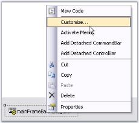
{:.image }

{:.image }

* In the customization dialog, go to the Commands tab.
* To add new categories, right click on the Categories' area and select Add.

{:.image }

* This will open up a dialog where you can enter the name of a new category. The category name should be unique within this BarManager. 
> 

{:.image }
 _Note: The categories do not correspond to any menu entries in the main menu or toolbars, they just provide you a logical grouping of different BarItems._

{:.image }

* Now to add bar items into this category, select the category and click the Modify... button (top right corner of the Commands tab) select Add to invoke the Add New BarItem dialog.
* Select the type of BarItem you would like to add, from the list and name it (the BarItem's text property). Take a look at the topic Bar Items for more information on the different types of BarItems.

{:.image }

* Once you insert the BarItems, you can select them in the Commands list and modify their properties in the VS .NET design-time property grid.

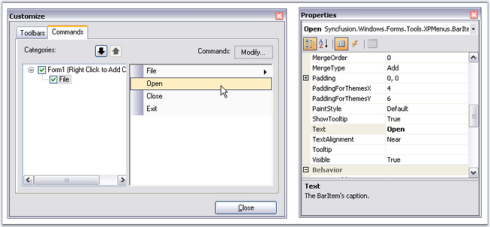
{:.image }

> 
{:.image }
 _Note: Remember that you haven't filled your menus and toolbars yet. To display the items refer to_ Adding Toolbars_._

###### Adding Toolbars and Populating the Bar Items

To add a toolbar and populate it with the bar items follow the below steps.

* To create a new toolbar, go to the Toolbars tab in the Customize dialog, select New and specify a name (Ex: MainMenu) for the toolbar.

{:.image }

* This will create a new bar component in the designer as shown in the image below. Name this component as 'MainMenu'. This will also make a corresponding entry in the Toolbars list.

{:.image }

* Set the toolbar as a main menu, by selecting the IsMainMenu option in the BarStyle property of the mainMenuBar component.

{:.image }

* Fill your toolbars with items by simply dragging-and-dropping the items from the Command tab into the toolbars and submenus. To fill the sub menu of the parent bar items, again drag the required bar items inside it.

{:.image }

* You can drag and dock the toolbars on all four sides of the designer by dragging through the gripper on the left of the toolbar and moving them to any desired position. The toolbars can also be floated. See Toolbar Properties for more details.
> 

{:.image }
 _Note: If a toolbar from the mainFrameBarManager and one (or more) from the child forms gets merged (the rules for merging are discussed in the_ MDI Merging _topic), the BarItems in the toolbar will be ordered based on their MergeOrder property._

If this is a ChildFrameBarManager, all the toolbars (including the main menu) will be floating at design-time. This is because the child toolbars will be docked to the main form rather than to your child form during run-time, and hence, floating avoids polluting your child forms during design-time.

{:.image }

See Also

Concepts and Features

##### Through Code

This section deals with the programmatic approach of creating and populating the toolbar with menus.

###### Adding Bar Items to a BarManager

To programmatically add bar items to a BarManager, perform the below steps.

1. Include the required namespaces.

[C#]

using Syncfusion.Windows.Forms.Tools;

using Syncfusion.Windows.Forms.Tools.XPMenus;

[VB.NET]

Imports Syncfusion.Windows.Forms.Tools

Imports Syncfusion.Windows.Forms.Tools.XPMenus

2. Create an instance of MainFrameBarManager.

[C#]

private Syncfusion.Windows.Forms.Tools.XPMenus.MainFrameBarManager mainFrameBarManager1;

this.mainFrameBarManager1 = new Syncfusion.Windows.Forms.Tools.XPMenus.MainFrameBarManager(this.components, this);

[VB.NET]

Private mainFrameBarManager1 As Syncfusion.Windows.Forms.Tools.XPMenus.MainFrameBarManager

Private Me.mainFrameBarManager1 = New Syncfusion.Windows.Forms.Tools.XPMenus.MainFrameBarManager(Me.components, Me)

3.  Add category to the MainFrameBarManager.

[C#]

this.mainFrameBarManager1.Categories.Add("MainMenu");

[VB.NET]

Me.mainFrameBarManager1.Categories.Add("MainMenu")

4.  Create an instances for ParentBarItem(File) and BarItems(New,Open and Close).

[C#]

private Syncfusion.Windows.Forms.Tools.XPMenus.ParentBarItem parentBarItem1;

private Syncfusion.Windows.Forms.Tools.XPMenus.BarItem barItem1;

private Syncfusion.Windows.Forms.Tools.XPMenus.BarItem barItem2;

private Syncfusion.Windows.Forms.Tools.XPMenus.BarItem barItem3;

this.parentBarItem1 = new Syncfusion.Windows.Forms.Tools.XPMenus.ParentBarItem();

this.barItem1 = new Syncfusion.Windows.Forms.Tools.XPMenus.BarItem();

this.barItem2 = new Syncfusion.Windows.Forms.Tools.XPMenus.BarItem();

this.barItem3 = new Syncfusion.Windows.Forms.Tools.XPMenus.BarItem();

[VB.NET]

Private parentBarItem1 As Syncfusion.Windows.Forms.Tools.XPMenus.ParentBarItem

Private barItem1 As Syncfusion.Windows.Forms.Tools.XPMenus.BarItem

Private barItem2 As Syncfusion.Windows.Forms.Tools.XPMenus.BarItem

Private barItem3 As Syncfusion.Windows.Forms.Tools.XPMenus.BarItem

Me.parentBarItem1 = New Syncfusion.Windows.Forms.Tools.XPMenus.ParentBarItem()

Me.barItem1 = New Syncfusion.Windows.Forms.Tools.XPMenus.BarItem()

Me.barItem2 = New Syncfusion.Windows.Forms.Tools.XPMenus.BarItem()

Me.barItem3 = New Syncfusion.Windows.Forms.Tools.XPMenus.BarItem()

5.  Add BarItems to the MainFrameBarManager.

[C#]

this.mainFrameBarManager1.Items.AddRange(new Syncfusion.Windows.Forms.Tools.XPMenus.BarItem[] {

this.parentBarItem1,this.barItem1,this.barItem2,this.barItem3});

[VB.NET]

Me.mainFrameBarManager1.Items.AddRange(New Syncfusion.Windows.Forms.Tools.XPMenus.BarItem() { Me.parentBarItem1,Me.barItem1,Me.barItem2,Me.barItem3})

 Refer Adding Toolbars and Populating the Bar Items to add toolbar and populate menus.

###### Adding Toolbars and Populating the Bar Items

Follow the steps below to create and populate the toolbar with menus.

1. Create an instance of Toolbar and associate it with MainFrameBarManager.

[C#]

private Syncfusion.Windows.Forms.Tools.XPMenus.Bar bar1;

this.bar1 = new Syncfusion.Windows.Forms.Tools.XPMenus.Bar(this.mainFrameBarManager1, "MyMenu");

this.mainFrameBarManager1.Bars.Add(this.bar1);

this.bar1.Manager = this.mainFrameBarManager1;

[VB.NET]

Private bar1 As Syncfusion.Windows.Forms.Tools.XPMenus.Bar

Private Me.bar1 = New Syncfusion.Windows.Forms.Tools.XPMenus.Bar(Me.mainFrameBarManager1, "MyMenu")

Me.mainFrameBarManager1.Bars.Add(Me.bar1)

Private Me.bar1.Manager = Me.mainFrameBarManager1

2. Add bar items to the ParentBarItem.

[C#]

this.parentBarItem1.Items.AddRange(new Syncfusion.Windows.Forms.Tools.XPMenus.BarItem[] {this.barItem1,this.barItem2,

this.barItem3});

[VB.NET]

Me.parentBarItem1.Items.AddRange(New Syncfusion.Windows.Forms.Tools.XPMenus.BarItem() {Me.barItem1,Me.barItem2, Me.barItem3})

3. Finally add ParentBarItem to the toolbar.

[C#]

this.bar1.Items.AddRange(new Syncfusion.Windows.Forms.Tools.XPMenus.BarItem[] {this.parentBarItem1});

[VB.NET]

Me.bar1.Items.AddRange(New Syncfusion.Windows.Forms.Tools.XPMenus.BarItem() {Me.parentBarItem1})

4. You can make the toolbar to occupy the entire row in the form by setting BarStyle property to following values.

[C#]

this.bar1.BarStyle = ((Syncfusion.Windows.Forms.Tools.XPMenus.BarStyle) ((((Syncfusion.Windows.Forms.Tools.XPMenus.BarStyle.AllowQuickCustomizing | Syncfusion.Windows.Forms.Tools.XPMenus.BarStyle.IsMainMenu)| Syncfusion.Windows.Forms.Tools.XPMenus.BarStyle.Visible) 

| Syncfusion.Windows.Forms.Tools.XPMenus.BarStyle.DrawDragBorder)));

[VB.NET]

Me.bar1.BarStyle = (CType((((Syncfusion.Windows.Forms.Tools.XPMenus.BarStyle.AllowQuickCustomizing Or Syncfusion.Windows.Forms.Tools.XPMenus.BarStyle.IsMainMenu) Or Syncfusion.Windows.Forms.Tools.XPMenus.BarStyle.Visible) Or Syncfusion.Windows.Forms.Tools.XPMenus.BarStyle.DrawDragBorder), Syncfusion.Windows.Forms.Tools.XPMenus.BarStyle))

The resulting form will look like the below image.

{:.image }

See Also

Concepts and Features

#### Concepts and Features

This section discusses all the concepts and features of the XPMenus Framework and other supported controls. Following are the topics covered.

##### Popup MenuContext MenuXPMenu Bars

This section discusses about the types of menu Bars, the types of bar items that can be added to the Menus and also the BarManagers involved.

###### Bar Types

XPMenus Framework defines the below three types of bars based on the BarStyle property.

MainMenuBar

This is a horizontal menu that appears on top of a window. By default, each option in a menu bar is associated with a pull-down menu. 

For MainMenuBars, BarStyles IsMainMenuBar option will have to be checked. There can be only one menu bar at the top of the screen. The MainMenuBar is always visible and it fills the entire dock area row on which it appears.

{:.image }

Standard Bar

This is a horizontal menu that appears on top of a window with BarStyle 'IsMainMenu' option Unchecked. It does not fill the entire dock area row on which it appears. Other toolbars can also be docked on the same row. It gives 'Customize toolbar' options.

{:.image }

Status Bar

This is a horizontal menu that appears on the bottom of a window and has the BarStyle 'IsStatusBar' checked. Any number of static bar items can be added to it.

{:.image }

See Also

Bar Items, BarManagers, Bar Styles

Toolbar Properties

The properties of a toolbar are as follows.

_Table_ _462__: Property Table_

<table>
<tr>
<td>
Bar Property</td><td>
Description</td></tr>
<tr>
<td>
Items</td><td>
Collection of bar items representing the menu items in the toolbar. This invokes the customize dialog at design time.</td></tr>
<tr>
<td>
AllowCustomizing</td><td>
Indicates whether dragging and dropping of bar items into the bar is allowed or not, at run time.</td></tr>
<tr>
<td>
AllowItemsReorderOnShrunk</td><td>
When the toolbar shrunk to show more bar items, the bar items will be automatically reordered, when AllowItemsReorderOnShrunk property is set to true. The default value is true.</td></tr>
<tr>
<td>
Bar Styles</td><td>
Specifies the BarStyle.</td></tr>
<tr>
<td>
AllowHiding </td><td>
Specifies if the toolbar can be hidden by the user at run time. By default this property is true. When this is set to false, user will not be able to hide the toolbar at run time, as the checkbox will be disabled at run time.</td></tr>
</table>

{:.image }

Default Docking

The XPMenus bar can be docked on any of the four sides of the host form, both at design time and run time, without a single property setting. This is an in-built feature in the XPMenus. 

Floating Bar Properties

_Table_ _463__: Property Table_

<table>
<tr>
<td>
Bar Property</td><td>
Description</td></tr>
<tr>
<td>
AllowResizing</td><td>
Specifies whether to allow resizing of the toolbar when the toolbar is floating.</td></tr>
</table>

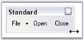
{:.image }

_Table_ _464__: Property Table_

<table>
<tr>
<td>
Bar Property</td><td>
Description</td></tr>
<tr>
<td>
BarName</td><td>
Name of the toolbar.</td></tr>
<tr>
<td>
Caption</td><td>
Caption for the toolbar which is displayed in floating mode.</td></tr>
</table>

{:.image }

See Also

How To Reset Bar To The Designer State?

How to show or hide close and dropdown buttons of a floating bar in XPMenus?

###### Bar Items	

This section will discuss various types of bar items, their properties and customization using the properties. 

Customize Dialog

Bar items can be added to a BarManager using Customize dialog through Designer. See Adding Bar Items to a BarManager to know how to add bar items.

Customize Dialog

The Customize Dialog can be accessed at design time and also at runtime. It lets the end users to add and customize menus, toolbars and layout items during design time. This can be invoked at design time, by right-clicking the mainFrameBarManager and selecting the Customize option in the designer.

{:.image }

At run time, Customize dialog can be accessed by right-clicking on the Bar and clicking the Customize option. This dialog lets you control the layout of items in a toolbar.

{:.image }

{:.image }

(BarStyle=IsMainMenu Unchecked)

> 
{:.image }
 _Note: To avoid displaying the bar items in Customize dialog at run time, set BarManager.ShowItemsInCustomizationDialog property to false._

{:.image }

> 
{:.image }
 _Note: If you want to disable Customizing option for the users at run time, set BarManager.EnableCustomizing property to false. This will not provide option to open the Customize dialog at run time._

See Also

Bar Styles

Customize Dialog Appearance

Types of Bar Items

The following Bar items are discussed in this section.

BarItem

A BarItem is a simple child bar item which can be dragged and dropped to a ParentBarItem. By selecting the Type as BarItem and giving the name, in the Add New BarItem dialog, we can create a new BarItem. 

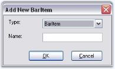
{:.image }

Behavior Properties

Some properties are as follows.

_Table_ _465__: Property Table_

<table>
<tr>
<td>
ParentBarItem Property</td><td>
Description</td></tr>
<tr>
<td>
Checked</td><td>
Draws the bar item with a checked appearance.</td></tr>
<tr>
<td>
Enabled</td><td>
Enables or disables the bar item. Default value is true.</td></tr>
<tr>
<td>
IsRecentlyUsedItem</td><td>
Indicates whether this item will appear in its parent's partial menus list. Partial Menus is discussed in ParentBarItem topic.</td></tr>
<tr>
<td>
Visible</td><td>
Sets the visibility of the bar item.</td></tr>
<tr>
<td>
MergeOrder</td><td>
Relative Position of the bar item when it is merged with another.</td></tr>
<tr>
<td>
MergeType</td><td>
Sets behavior of the bar item when its bar is merged with another. The options are,Add - Adds to the existing menu items. (Default)Replace - Replaces an existing menu items at the same position in a merged menu.MergeItems - Merged with an existing menu items at the same position in a merged menu.Remove - Menu item will not be included in the merged menu. See ParentBarItem for merging the bar items.</td></tr>
<tr>
<td>
Customizable</td><td>
Specifies whether the bar item is involved in the customization.</td></tr>
<tr>
<td>
Padding</td><td>
Gets or sets padding for items.</td></tr>
<tr>
<td>
PaddingForThemesX</td><td>
Specifies padding for theme control X.</td></tr>
<tr>
<td>
PaddingForThemesY</td><td>
Specifies padding for theme control Y.</td></tr>
<tr>
<td>
ShowMnemonicUnderlinesAlways</td><td>
It indicates whether to show underlines with mnemonic always.</td></tr>
</table>
Other Common properties

For setting images see Image Settings; 

For Editing the text and setting text alignments, See BarItem Text; 

For setting shortcuts for the bar items, see Keyboard shortcuts and 

For changing the Paint Style, see PaintStyle topic. 

Appearance of the Text can be customized. See Foreground Settings for details.

{:.image }

See Also

Customization Options, UpdateUIOnAppIdle property in UI Command Update Patterns topic

ParentBarItem

A ParentBarItem represents a submenu (drop-down menu) which can display one or more child BarItems on drop-down. A ParentBarItem can be placed inside a toolbar and it can contain another ParentBarItem as its child bar item. ParentBarItem comes with properties to control its appearance and behavior.

{:.image }

Behavior Settings

The following propertieslet you control the behavior of the ParentBarItem.

_Table_ _466__: Property Table_

<table>
<tr>
<td>
ParentBarItem Property</td><td>
Description</td></tr>
<tr>
<td>
Checked</td><td>
Draws the bar item with a checked appearance.</td></tr>
<tr>
<td>
Enabled</td><td>
Enables or disables the bar item. Default value is true.</td></tr>
<tr>
<td>
IsRecentlyUsedItem</td><td>
Indicates whether this item will appear in its parent's partial menus list.</td></tr>
<tr>
<td>
Visible</td><td>
Sets the visibility of the bar item.</td></tr>
<tr>
<td>
MergeOrder</td><td>
Relative Position of the bar item when it is merged with another.</td></tr>
<tr>
<td>
MergeType</td><td>
Sets behavior of the bar item when its bar is merged with another. The options are,Add - Adds to the existing menu items. (Default)Replace - Replaces an existing menu items at the same position in a merged menu.MergeItems - Merged with an existing menu items at the same position in a merged menu.Remove - Menu item will not be included in the merged menu.</td></tr>
<tr>
<td>
Customizable</td><td>
Specifies whether the bar item is involved in the customization.</td></tr>
<tr>
<td>
ParentStyle</td><td>
Specifies the ParentStyle on which the menu will be drawn. The options are,Default (Default),DropDown.</td></tr>
<tr>
<td>
Padding</td><td>
Gets or sets padding for items.</td></tr>
<tr>
<td>
ScrollingSpeed</td><td>
Specifies the scrollingspeed for the displayed child menu items.</td></tr>
<tr>
<td>
ScrollOnMouseMove</td><td>
Specifies scroll items in menu when mouse moves over scroll buttons.</td></tr>
<tr>
<td>
UsePartialMenus</td><td>
Specifies whether ParentBarItem will first show a list of  recently used items and an Expand button when dropped down.</td></tr>
<tr>
<td>
ShowMnemonicUnderlinesAlways</td><td>
It indicates whether to show underlines with mnemonic always.</td></tr>
</table>
Merging

XPMenus FrameWork lets you merge menu items of different ParentBarItems using MergeItems method.

_Table_ _467__: Property Table_

<table>
<tr>
<td>
ParentBarItem Method</td><td>
Description</td></tr>
<tr>
<td>
MergeItems</td><td>
Merges BarItems of one ParentBarItem with another ParentBarItem. Two ParentBarItems can be merged into one, based on the MergeOrder and MergeType properties of its children (/ menu item). Parameter is,parentItemSrc - The ParentBarItem which is merged with this ParentBarItem.</td></tr>
</table>

{:.image }

[C#]

//Setting merge order and merge type of bar item5 (List) of ParentBarItem2

this.barItem5.MergeOrder = 0;

this.barItem5.MergeType = MenuMerge.MergeItems;

//Merging parentbaritem2 menu items to parentbaritem1

this.parentBarItem1.MergeItems(parentBarItem3);

[VB.NET]

'Setting merge order and merge type of bar item5 (List) of ParentBarItem2

Me.barItem5.MergeOrder = 0

Me.barItem5.MergeType = MenuMerge.MergeItems

'Merging parentbaritem2 menu items to parentbaritem1

Me.parentBarItem1.MergeItems(parentBarItem3)

{:.image }

Parent Style

The following figures display the parent styles.

{:.image }

Partial Menus

The ParentBarItem can hide some of its menu items and display them on clicking an expand button at the bottom of the menu list, by using the UsePartialMenus and IsRecentlyUsedItem properties. With this feature we can display only the recently used items and can hide the rest. We can do this in ParentBarItem.BeforePopup event.

_Table_ _468__: Property Table_

<table>
<tr>
<td>
BarManager Property</td><td>
Description</td></tr>
<tr>
<td>
ExpandPartialMenusAfterDelay</td><td>
Enables automatic expansion of the partial menus into full menus after a delay.</td></tr>
<tr>
<td>
UsePartialMenus</td><td>
Enables or disables partial menus mode in submenus.</td></tr>
<tr>
<td>
PartialMenusResetDelay</td><td>
Specifies the delay in days after an item's recently used setting will be replaced.</td></tr>
</table>
> 
{:.image }
 _Note: To know all the properties of BarManager, click here._

{:.image }

Applying Partial Menus

_Table_ _469__: Event Table_

<table>
<tr>
<td>
ParentBarItem Event</td><td>
Description</td></tr>
<tr>
<td>
BeforePopUp</td><td>
Handled before the popup menu is shown. Parameter is,cancel - lets you cancel the menu display.</td></tr>
</table>

[C#]

this.parentBarItem1.UsePartialMenus = true;

private void parentBarItem1_BeforePopup(object sender, System.ComponentModel.CancelEventArgs e)

{

    // Hide New and Close BarItems in the partial menu

    this.barItem1.IsRecentlyUsedItem = false;

    this.barItem3.IsRecentlyUsedItem = false;

}

[VB.NET]

Me.parentBarItem1.UsePartialMenus = True

Private Sub parentBarItem1_BeforePopup(ByVal sender As Object, ByVal e As System.ComponentModel.CancelEventArgs)

    ' Hide Open and Close BarItems in the partial menu 

    Me.barItem1.IsRecentlyUsedItem = False

    Me.barItem3.IsRecentlyUsedItem = False

End Sub

{:.image }

Other Common properties

For setting images see Image Settings

For Editing the text and setting text alignments, see BarItem Text

For setting shortcuts for the bar items, see Keyboard shortcuts and 

For changing the Paint Style, see PaintStyle topic. 

Appearance of the Text can be customized. See Foreground Settings for details.

See Also

UI Command Update Patterns,

MainFrameBarManager Properties,

Customize Dialog

DropDownBarItem

A DropDownBarItem is a BarItem that gets drawn with an arrow button to its right, which when clicked, will pop-up a window (note: not a menu) represented by a PopupControlContainer. This is identical to the Undo menu item in VS .NET code editor.

{:.image }

The type should be selected as DropDownBarItem in the Add New BarItem dialog.

{:.image }

Displaying the Popup Menu

We need to associate a PopupControlContainer for showing the popup. Drag-and-drop a PopupControlContainer component and associate it with the DropDownBarItem using PopupControlContainer property of DropDownBarItem.

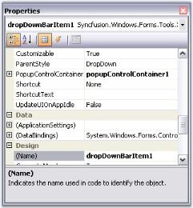
{:.image }

[C#]

this.dropDownBarItem1.PopupControlContainer = this.popupControlContainer1;

[VB.NET]

Me.dropDownBarItem1.PopupControlContainer = Me.popupControlContainer1

We can add controls like ColorPickerUI control to this container and customize the popup for the DropDownBarItem.

{:.image }

Behavior Settings

DropDownBarItem supports all the behavior properties of the BarItem.

Other Common properties

For setting images see Image Settings; 

For Editing the text and setting text alignments, See BarItem Text; 

For setting shortcuts for the bar items, see Keyboard shortcuts and 

For changing the Paint Style, see PaintStyle topic. 

Appearance of the Text can be customized. See Foreground Settings for details.

See Also

UpdateUIOnAppIdle property in UI Command Update Patterns topic,

Customize Dialog

ComboBoxBarItem

A ComboBoxBarItem is a BarItem that provides combobox-like behavior with an optional editable mode. This is identical to the VS.NET Find combo box in the code editor. 

{:.image }

Adding Items for ComboBoxBarItem dropdown

A list of items can be specified in ComboBoxBarItem.ChoiceList property. ComboBoxBarItem can also be associated with another control like FontListControl using the ListBox property. You can also specify the width for this BarItem.

The following properties deal with settings contents for the ComboBoxBarItem.

_Table_ _470__: Property Table_

<table>
<tr>
<td>
ComboBoxBarItem Property</td><td>
Description</td></tr>
<tr>
<td>
AutoAppend</td><td>
Specifies whether to automatically append the items entered by the user in the TextBox into the dropdown list.</td></tr>
<tr>
<td>
MaxDropDownItems</td><td>
Specifies the maximum number of items to be shown in the drop down portion of ComboBoxBarItem.</td></tr>
<tr>
<td>
MinDropDownWidth</td><td>
Sets the width of the drop down.</td></tr>
<tr>
<td>
MinWidth</td><td>
Sets the minimum width when this ComboBoxBarItem is placed in a menu or toolbar.</td></tr>
<tr>
<td>
TextBoxValue</td><td>
Sets the value in the TextBox.</td></tr>
<tr>
<td>
PersistTextBoxValue</td><td>
Specifies whether the TextBox value should be persisted after the application is shutdown.</td></tr>
<tr>
<td>
Listbox</td><td>
Specifies custom listbox in the dropdown. You can drag and drop a FontListControl for ex, and associate it to the ComboBoxBarItem using this property.</td></tr>
<tr>
<td>
ChoiceList</td><td>
Specifies the list for the bar item.</td></tr>
</table>
_Table_ _471__: Method Table_

<table>
<tr>
<td>
Methods</td><td>
Description</td></tr>
<tr>
<td>
Focus</td><td>
To Set focus to ComboBarItem</td></tr>
</table>

[C#]

this.comboBoxBarItem1.AutoAppend=true;

this.comboBoxBarItem1.MaxDropDownItems=3;

this.comboBoxBarItem1.MinDropDownWidth=1;

this.comboBoxBarItem1.MinWidth=100;

this.comboBoxBarItem1.TextBoxValue="Debug";

this.comboBoxBarItem1.PersistTextBoxValue=true;

this.comboBoxBarItem1.ListBox = this.fontListBox1;

this.comboBoxBarItem1.Focus();

[VB.NET]

Me.comboBoxBarItem1.AutoAppend=True

Me.comboBoxBarItem1.MaxDropDownItems=3

Me.comboBoxBarItem1.MinDropDownWidth=1

Me.comboBoxBarItem1.MinWidth=100

Me.comboBoxBarItem1.TextBoxValue="Debug"

Me.comboBoxBarItem1.PersistTextBoxValue=True

Me.comboBoxBarItem1.ListBox = Me.fontListBox1

Me.comboBoxBarItem1.Focus

{:.image }

{:.image }

> 
{:.image }
 _Note: Editable property should be set to true for displaying the FontListControl in this case and_ PaintStyle _should be ImageAndText for displaying the ComboBoxBarItem text._

Behavior Settings

ComboBoxBarItem supports all the behavior properties of BarItem.

Other Common properties

For setting images see Image Settings; 

For Editing the text and setting text alignments, See BarItem Text; 

For setting shortcuts for the bar items, see Keyboard shortcuts and 

Appearance of the Text can be customized. See Foreground Settings for details.

We can set banner text for the ComboBoxBarItem. Refer BannerTextProvider Component topic for more details.

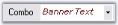
{:.image }

PersistAutoAppendList inclusion.

PersistAutoAppendList property is added to ComboBoxBarItem.  

When this property is set to false and AutoAppend is set to true, the item added to the ComboBoxBarItem will be added to the dropdown but it will not be saved.

{:.image }

The following code illustrates how to include PersistAutoAppendList.

> 
{:.image }
_Note: This can be used when the AutoAppend is set to true._

[C# .Net]

API:  this.comboBoxBarItem1.PersistAutoAppendList =false;

[VB .Net]

 Me.comboBoxBarItem1.PersistAutoAppendList = false

See Also

UpdateUIOnAppIdle property in UI Command Update Patterns topic 

How to handle KeyDown event in ComboBoxBarItem?

How to prevent the ComboBoxBarItem's dropdown from being closed after clicking a ChoiceList Item?

Customize Dialog

ListBarItem

A ListBarItem is a BarItem which, when added to a ParentBarItem will expand itself into an ordered list of BarItems represented by the string list in its ChildCaptions property. 

{:.image }

Adding Items for the ListBarItems

A list of items can be specified in ListBarItem.ChildCaptions property and this ListBarItem should be added to a ParentBarItem. The list can be numbered by enabling UseNumberedList property.

_Table_ _472__: Property Table_

<table>
<tr>
<td>
ListBarItem Property</td><td>
Description</td></tr>
<tr>
<td>
ChildCaptions</td><td>
Specifies the list of items to be displayed in the ListBarItem.</td></tr>
<tr>
<td>
UseNumberedList</td><td>
It specifies whether or not to use numbers in the expanded list.</td></tr>
<tr>
<td>
Customizable</td><td>
Specifies whether the bar item is involved in the customization.</td></tr>
</table>
> 
{:.image }
 _Note: The BarItem should not be in User Customization mode / Customizable property should be set to false, to effect these settings._

[C#]

this.listBarItem1.Customizable = false;

this.listBarItem1.ChildCaptions.AddRange(new string[] {"Document1", "Document2", "Document3"});

this.listBarItem1.UseNumberedList = true;

[VB.NET]

Me.listBarItem1.Customizable = False 

Me.listBarItem1.ChildCaptions.AddRange(New String() {"Document1", "Document2", "Document3"}) 

Me.listBarItem1.UseNumberedList = True 

{:.image }

Behavior Settings

ListBarItem supports all the behavior properties of BarItem.

Other Common properties

For setting images see Image Settings; 

For Editing the text and setting text alignments, see BarItem Text; 

For setting shortcuts for the bar items, see Keyboard shortcuts and 

For changing the Paint Style, see PaintStyle topic. 

Appearance of the Text can be customized. See Foreground Settings for details.

See Also

UpdateUIOnAppIdle property in UI Command Update Patterns topic,

Customize Dialog

MDIListBarItem

An MDIListBarItem is a ListBarItem that will expand itself to show a list of MDIChild windows in the form, when placed in a ParentBarItem. 

{:.image }

Specify the MDI List Size in MDIListSize property.

_Table_ _473__: Property Table_

<table>
<tr>
<td>
ListBarItem Property</td><td>
Description</td></tr>
<tr>
<td>
MDIListSize</td><td>
Specifies number of child links to be specified.</td></tr>
<tr>
<td>
UseNumberedList</td><td>
It specifies whether or not to use numbers in the expanded list.</td></tr>
</table>

{:.image }

A sample demonstrating this feature is available in the below sample installation location.

…\_My Documents\Syncfusion\EssentialStudio\Version Number\Windows\Tools.Windows\Samples\Advanced Editor Functions\ActionGroupingDemo_

Behavior Settings

DropDownBarItem supports all the behavior properties of BarItem.

Other Common properties

For setting images see Image Settings; 

For Editing the text and setting text alignments, See BarItem Text; 

For setting shortcuts for the bar items, see Keyboard shortcuts and 

For changing the Paint Style, see PaintStyle topic. 

Appearance of the Text can be customized. See Foreground Settings for details.

See Also

UpdateUIOnAppIdle property in UI Command Update Patterns topic,

Customize Dialog

StaticBarItem

A StaticBarItem is a BarItem that provides users a label-like behavior to show plain text in the toolbars and menus. 

The user cannot click or interact with this type of BarItem. It is typically used in the status bar-type toolbar. 

{:.image }

The text displayed in the status bar can be changed based on the bar items selected. Insert the following code snippet in the 'Selected' event handler of any bar items whose status is to be known. 

[C#]

private void Item_Selected(object sender, System.EventArgs e)

{

BarItem item = sender as BarItem;

this.staticBarItem1.Text = item.Text;

}

[VB.NET]

Private Sub Item_Selected(ByVal sender As Object, ByVal e As System.EventArgs)

    Dim item As BarItem = CType(IIf(TypeOf sender Is BarItem, sender, Nothing), BarItem)

    Me.staticBarItem1.Text = item.Text

End Sub

{:.image }

Behavior Settings

_Table_ _474__: Property Table_

<table>
<tr>
<td>
ParentBarItem Property</td><td>
Description</td></tr>
<tr>
<td>
FlatBorderColor</td><td>
Sets border color for the StaticBarItem.</td></tr>
<tr>
<td>
IsRecentlyUsedItem</td><td>
Indicates whether this item will appear in its parent's partial menus list. Partial Menus is discussed in ParentBarItem topic.</td></tr>
<tr>
<td>
Visible</td><td>
Sets the visibility of the bar item.</td></tr>
<tr>
<td>
MergeOrder</td><td>
Relative Position of the bar item when it is merged with another.</td></tr>
<tr>
<td>
MergeType</td><td>
Sets behavior of the bar item when its bar is merged with another. The options are,{{ _Add_ | markdownify }} - Adds to the existing menu items. (Default){{ _Replace_ | markdownify }} - Replaces an existing menu items at the same position in a merged menu.{{ _MergeItems_ | markdownify }} - Merged with an existing menu items at the same position in a merged menu.{{ _Remove_ | markdownify }} - Menu item will not be included in the merged menu.</td></tr>
<tr>
<td>
Customizable</td><td>
Specifies whether the bar item is involved in the customization.</td></tr>
<tr>
<td>
Padding</td><td>
Gets or sets padding for items.</td></tr>
<tr>
<td>
ShowMnemonicUnderlinesAlways</td><td>
It indicates whether to show underlines with mnemonic always.</td></tr>
</table>
Other Common properties

For setting images see Image Settings; 

For Editing the text and setting text alignments, See BarItem Text; 

For changing the Paint Style, see PaintStyle topic. 

Appearance of the Text can be customized. See Foreground Settings for details.

See Also

UpdateUIOnAppIdle property in UI Command Update Patterns topic,

Customize Dialog

ToolBarListBarItem

A ToolbarListBarItem is a ListBarItem that expands during runtime to automatically show the list of toolbars currently used in the application. The user can click on this list to show / hide the toolbars. A ToolBarListBarItem can be added to a ParentBarItem by a simple drag-and-drop similar to other bar items.

{:.image }

{:.image }

Behavior Settings

DropDownBarItem supports all the behavior properties of BarItem.

Other Common properties

For setting images see Image Settings; 

For Editing the text and setting text alignments, see BarItem Text; 

For setting shortcuts for the bar items, see Keyboard shortcuts and 

For changing the Paint Style, see PaintStyle topic. 

Appearance of the Text can be customized. See Foreground Settings for details.

See Also

UI Command Update Patterns,

Customize Dialog

TextBoxBarItem

A TextBoxBarItem behaves like a normal windows textbox. It lets the end users to enter text in the text area at run time. You can also specify the text in TextBoxValue property. A TextBoxBarItem can be added to a ParentBarItem by a simple drag and drop similar to other bar items. Width of the TextBoxBarItem can be controlled using MinWidth property. 

> 
{:.image }
 _Note:_ Paint Style _should be "ImageAndText" for the TextBoxBarItem to display TextBoxBarItem.Text._

{:.image }

[C#]

this.textBoxBarItem1.MinWidth = 100;

this.textBoxBarItem1.PaintStyle = Syncfusion.Windows.Forms.Tools.XPMenus.PaintStyle.ImageAndText;

this.textBoxBarItem1.Text = "Product Name";

this.textBoxBarItem1.TextBoxValue = "Essential Chart";

[VB.NET]

Me.textBoxBarItem1.MinWidth = 100;

Me.textBoxBarItem1.PaintStyle = Syncfusion.Windows.Forms.Tools.XPMenus.PaintStyle.ImageAndText;

Me.textBoxBarItem1.Text = "Product Name";

Me.textBoxBarItem1.TextBoxValue = "Essential Chart";

{:.image }

Behavior Settings

DropDownBarItem supports all the behavior properties of BarItem.

Other Common properties

For setting images see Image Settings; 

For Editing the text and setting text alignments, See BarItem Text; 

For setting shortcuts for the bar items, see Keyboard shortcuts and 

For changing the Paint Style, see PaintStyle topic. 

Appearance of the Text can be customized. See Foreground Settings for details.

We can set banner text for the TextBoxBarItem. Refer BannerTextProvider Component topic for more details.

See Also

UpdateUIOnAppIdle property in UI Command Update Patterns topic,

Customize Dialog

Customization Options

This section discusses the behavior settings common to all types of BarItem.

See Also

Types of Bar Items

Paint Style

The MenuItem can be displayed as a TextOnly, ImageOnly or Image and Text using PaintStyle property.

{:.image }

_Table_ _475__: Property Table_

<table>
<tr>
<td>
BarItem Property</td><td>
Description</td></tr>
<tr>
<td>
PaintStyle</td><td>
Indicates the painting style of the bar item.{{ _Default_ | markdownify }} - Displays the style of it parents. In case of MainMenu, only text will be drawn, in other toolbars only image and in Dropdown menu, image and text will be drawn.{{ _TextOnly_ | markdownify }} - Displays only Text.{{ _TextOnlyInMenus_ | markdownify }} - Image will be ignored when the BarItem is in a drop down menu.{{ _ImageAndText_ | markdownify }} - Both Image and Text will be drawn.</td></tr>
</table>

[C#]

this.barItem4.PaintStyle = PaintStyle.ImageAndText;

[VB.NET]

Me.barItem4.PaintStyle = PaintStyle.ImageAndText

{:.image }

{:.image }

See Also

Types of Bar Items

Keyboard Shortcut

Keyboard support can be assigned for each BarItem using BarItem.Shortcut property of the particular bar item. A customized text can be specified in the place of shortcut key using ShortcutText property.

{:.image }

[C#]

this.barItem4.Shortcut=System.Windows.Forms.Shortcut.CtrlX;

this.dropDownBarItem2.ShortcutText = "Cut";

[VB.NET]

Me.barItem4.Shortcut=System.Windows.Forms.Shortcut.CtrlX

this.dropDownBarItem2.ShortcutText = "Cut";

{:.image }

See Also

Types of Bar Items

Image Settings

The properties which let you set images for the menu items are as follows.

_Table_ _476__: Property Table_

<table>
<tr>
<td>
BarItem Property</td><td>
Description</td></tr>
<tr>
<td>
Image</td><td>
Default image displayed in the bar item.</td></tr>
<tr>
<td>
ImageIndex</td><td>
Image index of the image.</td></tr>
<tr>
<td>
ImageList</td><td>
Indicates the ImageList.</td></tr>
</table>

By selecting the imagelist using Imagelist property and choosing the index of the image through ImageIndex property, we can display images. The images can also be directly set by using the Image property.

[C#]

this.barItem2.Image = ((Syncfusion.Windows.Forms.Tools.XPMenus.ImageExt)(resources.GetObject("barItem2.Image")));

this.barItem2.ImageList = this.imageList1;

this.barItem2.ImageIndex = 2;

[VB.NET]

Me.barItem2.Image = DirectCast((resources.GetObject("barItem2.Image")), Syncfusion.Windows.Forms.Tools.XPMenus.ImageExt)

this.barItem2.ImageList = this.imageList1;

this.barItem2.ImageIndex = 2;

Images for Highlighted and Disabled Menu Items

A BarItem can be enabled or disabled Enabled property. Images for disabled (Enabled - False) or enabled (Enabled - True) bar items can be specified in DisabledImage or HighlightedImage properties. 

DisabledImageList, DisabledImageIndex or HighlightedImageList, HighlightedImageIndex properties can also be used instead.

_Table_ _477__: Property Table_

<table>
<tr>
<td>
BarItem Property</td><td>
Description</td></tr>
<tr>
<td>
DisabledImage</td><td>
Sets image for disabled bar item, when Enabled = false.</td></tr>
<tr>
<td>
DisabledImageList</td><td>
ImageList for the disabled bar items.</td></tr>
<tr>
<td>
DisabledImageIndex</td><td>
ImageIndex for the disabled bar item.</td></tr>
<tr>
<td>
DisabledLargeImageList</td><td>
ImageList for the disabled bar item when BarManager is in LargeIcons mode.</td></tr>
<tr>
<td>
HighlightedImage</td><td>
Sets image for highlighted bar item, the bar item is enabled.</td></tr>
<tr>
<td>
HighlightedImageList</td><td>
ImageList for the highlighted bar item.</td></tr>
<tr>
<td>
HighlightedImageIndex</td><td>
ImageIndex for the highlighted bar item.</td></tr>
<tr>
<td>
HighlightedLargeImageList</td><td>
ImageList for the highlighted bar item when BarManager is in LargeIcons mode.</td></tr>
</table>

{:.image }

{:.image }

Setting images for bar items when it is pressed

You can set the image for the bar item when it is pressed. You need to associate the corresponding ImageList to the PressedImageList property of bar item and you can set the image index using PressedImageIndex property. Similarly you can associate ImageListAdv with PressedImageListAdv property.

> 
{:.image }
 _Note: It is required to set image to Baritem before it is pressed._

[C#]

this.barItem1.Image = image;

this.barItem1.PressedImageIndex = 0;

this.barItem1.PressedImageListAdv = this.imageListAdv1;

[VB.NET]

Me.barItem1.Image = image

Me.barItem1.PressedImageIndex = 0

Me.barItem1.PressedImageListAdv = Me.imageListAdv1

See Also

Types of Bar Items

BarItem Text

Text for a bar item can be edited through Text property. Alignment of text can be specified in TextAlignment property.

_Table_ _478__: Property Table_

<table>
<tr>
<td>
ParentBarItem Property</td><td>
Description</td></tr>
<tr>
<td>
Text</td><td>
Sets text for the Bar item.</td></tr>
<tr>
<td>
TextAlignment</td><td>
Sets the text alignment. Options are,{{ _Near, (Default)_ | markdownify }}{{ _Far,_ | markdownify }}{{ _Center_ | markdownify }}</td></tr>
</table>

[C#]

this.barItem2.Text = "Center";

this.barItem2.TextAlignment = Syncfusion.Windows.Forms.Tools.XPMenus.TextAlignment.Center;

[VB.NET]

Me.barItem2.Text = "Center"

Me.barItem2.TextAlignment = Syncfusion.Windows.Forms.Tools.XPMenus.TextAlignment.Center

{:.image }

> 
{:.image }
 _Note: We can also change the text color for the Baritems using_ MenuColors.SelTextColor _property._

See Also

Types of Bar Items

Foreground Settings

Foreground of the bar item text can be controlled using the below properties.

_Table_ _479__: Property Table_

<table>
<tr>
<td>
BarItem Property</td><td>
Description</td></tr>
<tr>
<td>
CustomActiveTextColor</td><td>
Sets the text color in active mode.</td></tr>
<tr>
<td>
CustomDisabledTextColor</td><td>
Sets the text color in disabled mode.</td></tr>
<tr>
<td>
CustomNormalTextColor</td><td>
Sets the text color in normal mode.</td></tr>
<tr>
<td>
CustomTextFont</td><td>
Sets the text font.</td></tr>
</table>

[C#]

this.barItem4.CustomActiveTextColor = System.Drawing.Color.OrangeRed;

this.barItem5.CustomDisabledTextColor = System.Drawing.Color.DeepSkyBlue;

this.barItem6.CustomNormalTextColor = System.Drawing.Color.Magenta;

this.barItem4.CustomTextFont = new System.Drawing.Font("Verdana", 8.25F, System.Drawing.FontStyle.Bold);

this.barItem5.CustomTextFont = new System.Drawing.Font("Verdana", 8.25F, System.Drawing.FontStyle.Italic);

[VB.NET]

Me.barItem4.CustomActiveTextColor = System.Drawing.Color.OrangeRed

Me.barItem5.CustomDisabledTextColor = System.Drawing.Color.DeepSkyBlue

Me.barItem6.CustomNormalTextColor = System.Drawing.Color.Magenta

Me.barItem4.CustomTextFont = New System.Drawing.Font("Verdana", 8.25F, System.Drawing.FontStyle.Bold)

Me.barItem5.CustomTextFont = New System.Drawing.Font("Verdana", 8.25F, System.Drawing.FontStyle.Italic)

{:.image }

See Also

Types of Bar Items

ToolTip

ToolTip for the BarItems can be enabled using BarItem.ShowTooltips property, which can be edited using BarItem.Tooltip property.

[C#]

this.dropDownBarItem2.ShowTooltip = true;

this.dropDownBarItem2.Tooltip = "Pick a color";

[VB.NET]

Me.dropDownBarItem2.ShowTooltip = True

Me.dropDownBarItem2.Tooltip = "Pick a color"

{:.image }

> 
{:.image }
 _Note: We can control the display of tooltips for the bar items, only when the form is active, using the below BarManager property._

<table>
<tr>
<td>
BarManager Property</td><td>
Description</td></tr>
<tr>
<td>
BarItemActiveFormCheckOverride</td><td>
Specifies whether bar items should check for active form before displaying the tooltips.</td></tr>
</table>

[C#]

this.mainFrameBarManager1.BarItemActiveFormCheckOverride = true;

[VB.NET]

Me.mainFrameBarManager1.BarItemActiveFormCheckOverride = True

###### BarManagers

There are two kinds of BarManagers.

* MainFrameBarManager 
* ChildFrameBarManager

The MainFrameBarManager is associated with a MDI container form in the MDI scenario or with the top-level form in a single document scenario. 

The ChildFrameBarManager should be associated with a MDIChild in the MDI scenario.

These two classes are derived from the BarManager and hence will be referred as such when discussing features common to both these classes. 

> 
{:.image }
 _Note: At run-time, a ChildFrameBarManager does not show the menus and toolbars inside a child form. It is merely a place holder for the menus and toolbars during design-time, which will be merged into the main form's menus during run-time._

BarManagers come with full design-time support and lets users add menus and toolbars and fill them with items, all without writing a single line of code. The Customize dialog facilitates customization of the menus. It is available to the developer during design-time and to the end user during runtime. 

{:.image }

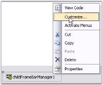
{:.image }

See Also

MainFrameBarManager Properties,

ChildFrameBarManager Properties, MDI Child Forms

Detached CommandBar, Detached ControlBars

MainFrameBarManager Property

Image Settings

_Table_ _481__: Property Table_

<table>
<tr>
<td>
BarManager Property</td><td>
Description</td></tr>
<tr>
<td>
DisabledImageList</td><td>
The ImageList to which the BarItems refer to, when disabled.</td></tr>
<tr>
<td>
DisabledLargeImageList</td><td>
The ImageList to which the BarItems refer to, when disabled and uses LargeIcons mode.</td></tr>
<tr>
<td>
HighlightImageList</td><td>
The ImageList to which the BarItems refer to, when highlighted.</td></tr>
<tr>
<td>
HighlightLargeImageList</td><td>
The ImageList to which the BarItems refer to, when highlighted and uses LargeIcons mode.</td></tr>
<tr>
<td>
ImageList</td><td>
ImageList that bar items refer to when in small icons mode.</td></tr>
<tr>
<td>
LargeIcons</td><td>
Enables or disables LargeIcons mode for items in the toolbar.</td></tr>
<tr>
<td>
LargeImageList</td><td>
The ImageList to which the BarItems refer to, when in LargeIcons mode.</td></tr>
</table>
Foreground and Style Settings

_Table_ _482__: Property Table_

<table>
<tr>
<td>
BarManager Property</td><td>
Description</td></tr>
<tr>
<td>
Font</td><td>
Sets font style for the bar items.</td></tr>
<tr>
<td>
Style</td><td>
Sets the common visual style for the toolbars and main menus.</td></tr>
<tr>
<td>
Themes Enabled</td><td>
Specify whether to apply themes.</td></tr>
</table>
Data Settings

_Table_ _483__: Property Table_

<table>
<tr>
<td>
BarManager Property</td><td>
Description</td></tr>
<tr>
<td>
Bars</td><td>
Invokes the Customize dialog - Toolbar tab indicating the collection of Bars.</td></tr>
<tr>
<td>
Categories</td><td>
Lists the categories defined in this bar manager.</td></tr>
</table>
Misc Properties

_Table_ _484__: Property Table_

<table>
<tr>
<td>
BarManager Property</td><td>
Description</td></tr>
<tr>
<td>
ActivateFormFromBar</td><td>
Indicates if activating menu should activate parent form also.</td></tr>
<tr>
<td>
PopupCloseTimer</td><td>
Indicates the delay in milliseconds before the displayed dropdown on toolbar, gets closed.</td></tr>
<tr>
<td>
ShowHighlightRectangle</td><td>
Indicates whether to highlight bar items when moving mouse over it.</td></tr>
</table>
Shadow Settings

_Table_ _485__: Property Table_

<table>
<tr>
<td>
BarManager Property</td><td>
Description</td></tr>
<tr>
<td>
ShowDropShadow</td><td>
Indicates whether to show shadow for BarItem's images.</td></tr>
<tr>
<td>
ShowShadow</td><td>
Indicates whether to show shadows for popups.</td></tr>
</table>
> 
{:.image }
 _Note: The properties related to the partial menus concept is discussed in_ ParentBarItem_._

Tooltip Settings

> 
{:.image }
 _Note: We can control the display of tooltips for the bar items, only when the form is active, using the below_ BarManager.BarItemActiveFormCheckOverride _property._

See Also

Toolbar State Persistence,

ParentBarItem,

Tooltip

ChildFrameBarManager Properties

Image Settings

_Table_ _486__: Property Table_

<table>
<tr>
<td>
BarManager Property</td><td>
Description</td></tr>
<tr>
<td>
DisabledImageList</td><td>
The ImageList to which the BarItems refer to, when disabled.</td></tr>
<tr>
<td>
DisabledLargeImageList</td><td>
The ImageList to which the BarItems refer to, when disabled and uses LargeIcons mode.</td></tr>
<tr>
<td>
HighlightImageList</td><td>
The ImageList to which the BarItems refer to, when highlighted.</td></tr>
<tr>
<td>
HighlightLargeImageList</td><td>
The ImageList to which the BarItems refer to, when highlighted and uses LargeIcons mode.</td></tr>
<tr>
<td>
ImageList</td><td>
ImageList that bar items refer to when in small icons mode.</td></tr>
<tr>
<td>
LargeImageList</td><td>
The ImageList to which the BarItems refer to, when in LargeIcons mode.</td></tr>
</table>
Style Settings

_Table_ _487__: Property Table_

<table>
<tr>
<td>
BarManager Property</td><td>
Description</td></tr>
<tr>
<td>
Style</td><td>
Sets the common visual style for the toolbars and main menus.</td></tr>
</table>
Data Settings

_Table_ _488__: Property Table_

<table>
<tr>
<td>
BarManager Property</td><td>
Description</td></tr>
<tr>
<td>
Bars</td><td>
Invokes the Customize dialog - Toolbar tab indicating the collection of Bars.</td></tr>
<tr>
<td>
Categories</td><td>
Lists the categories defined in this bar manager.</td></tr>
</table>
Shadow and Highlight Rectangle Settings

_Table_ _489__: Property Table_

<table>
<tr>
<td>
BarManager Property</td><td>
Description</td></tr>
<tr>
<td>
ShowDropShadow</td><td>
Indicates whether to show shadow for BarItem's images.</td></tr>
<tr>
<td>
ShowHighlightRectangle</td><td>
Indicates whether to highlight bar items when moving mouse over it.</td></tr>
<tr>
<td>
ShowShadow</td><td>
Indicates whether to show shadows for popups.</td></tr>
</table>
###### Advanced Options

This section covers some advanced options available for the Bar items.

BarItem Context Menu

On right clicking any of the bar items at design time or at run time, displays a context menu. The below image illustrates the various options in the context menu.

> 
{:.image }
 _Note: At runtime, the context menu will be invoked, only with the customize dialog open._

{:.image }

* Deleting a Bar item.
* It lets you edit the text of a bar item using the text area against Name option. 
* Select Paint Styles.
* Begin a Group.
> 

{:.image }
 _Note: The editing option for the bar item text at run time can be disabled by setting BarManager.AllowUserRenaming property to false._

{:.image }

 Image Icon Option of a Baritem for CustomizingPopupMenu

ChangeImage option is added in CustomizingPopupMenu. Baritem’s image can be changed using ChangeImage option.

1.  Right click at the baritem during runtime customization.
> 

{:.image }
_Note:  CustomizingPopupMenu appears._

{:.image }

2. Click ChangeImage 
> 

{:.image }
_Note: File Dialog Opens._

3. You can select any image for the baritem using this dialog.
Deleting a Bar Item

Design Time

In the designer, right click on the bar item which you want to delete and select "Delete" option from the Context Menu.

{:.image }

You can remove the BarItem from a submenu using any of the below two methods also.

_Table_ _490__: Methods Table_

<table>
<tr>
<td>
BarItem Methods</td><td>
Description</td></tr>
<tr>
<td>
Remove</td><td>
Removes the first occurrence of the specific object.{{ _obj_  | markdownify }}- System.object to remove from System.Collections.Arraylist.</td></tr>
<tr>
<td>
RemoveAt</td><td>
Removes the bar item from the ParentBarItems Collection based on the Bar item index(index). The parameter is,{{ _index_ | markdownify }} - Index of the bar item.</td></tr>
</table>

[C#]

this.parentBarItem1.Items.Remove(this.barItem1);  

or

this.parentBarItem1.Items.RemoveAt(1);   

//where '1' refers to the index of the BarItem in its parentBarItems collection.                  

[VB.NET]

Me.parentBarItem1.Items.Remove(Me.barItem1)

or

Me.parentBarItem1.Items.RemoveAt(1)

'where '1' refers to the index of the BarItem in its parentBarItems collection.

{:.image }

RunTime

This option is available for the end users at run time also. Right-clicking on a bar item at run time invokes the context menu similar to that in the Designer.

{:.image }

Grouping Bar Items

Design Time

XPMenus lets you group certain bar items using Begin a Group option in the designer, code and programmatically also. 

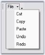
{:.image }

Select a bar item in the dropdown from which you want to start a group, right click on it and select "Begin A Group" option from the Context Menu. This inserts a separator from the bar item selected and starts a group.

{:.image }

{:.image }

Programmatically

If you want to draw a separator between the BarItems in a bar, you have to use BeginGroupAt (BarItem) as shown below:

[C#]

//This will draw a separator before barItem1

this.bar1.BeginGroupAt(this.BarItem1);    

//to draw a separator between BarItems in a submenu, use the following code 

//This will draw a separator above barItem3  

this.parentBarItem1.BeginGroupAt(this.BarItem3);            

[VB.NET]

'This will draw a separator before barItem1

Me.bar1.BeginGroupAt(Me.BarItem1)

'to draw a separator between barItems in a submenu, use the following code 

'This will draw a separator above barItem3

Me.parentBarItem1.BeginGroupAt(Me.BarItem3)

RunTime

This option is available for the end users at run time also. Right clicking on a bar item at run time, invokes the context menu similar to that in the designer. 

> 
{:.image }
 _Note: Context menu will be invoked at run time, only with the customize dialog open._

{:.image }

Adding Separators

XPMenus lets you add separators in between the bar items in a Toolbar, and also in between menu items under a ParentBarItem.

Separators for menu items in ParentBarItem Through Designer

To add separators between the menu items under a ParentBarItem, invoke Int32 Collection Editor using ParentBarItem.SeparatorIndices property.

{:.image }

[C#]

//Add Separators between bar items in a toolbar

this.bar1.SeparatorIndices.AddRange(new int[] { 1, 2 });

//Add Separators between menu items of a ParentBarItem

this.parentBarItem1.SeparatorIndices.AddRange(new int[] { 1, 2, 3 });

//Clear Separators

bar1.SeparatorIndices.Clear();

parentBarItem1.SeparatorIndices.Clear();

[VB.NET]

'Add Separators between bar items in a toolbar

Me.bar1.SeparatorIndices.AddRange(New Integer() {1, 2}) 

'Add Separators between menu items of a ParentBarItem

Me.parentBarItem1.SeparatorIndices.AddRange(New Integer() {1, 2, 3}) 

'Clear Separators

bar1.SeparatorIndices.Clear()

parentBarItem1.SeparatorIndices.Clear()

{:.image }

##### Menus Framework

This section will demonstrate the addition and customization of detached CommandBars and ControlBars.

###### Detached CommandBar

The XP Menus framework provides the flexibility to add detached toolbars through CommandBar that can host any .NET control. These toolbars are detached from the framework in the sense that they cannot participate in user customization. Otherwise, they are seamless in look-and-feel. 

Through Designer

Right click on the MainFrameBarManager in the designer and choose the "Add Detached CommandBar" option, to add a detached commandbar. 

{:.image }

> 
{:.image }
 _Note: Command Bar can also be added by clicking the command in the properties window._

{:.image }

The following screen shot shows the CommandBar in the designer.

{:.image }

* Drag and drop XPToolBar control on to the CommandBar and add bar items to the XPToolBar through BarItem Collection Editor. 
* The following screen shot shows the XPToolBar with bar items hosted on CommandBar. This command Bar can be hosted to any target within the form by just dragging and dropping.

{:.image }

To associate a bar with the Command Bar use the below code snippet.

[C#]

//Associate the created Bar with CommandBar.

CommandBar cmd = this.mainFrameBarManager1.GetBarControl(this.bar1);

[VB.NET]

'Associate the created Bar with CommandBar.

Private cmd As CommandBar = Me.mainFrameBarManager1.GetBarControl(Me.bar1)

XPMenus lets you add custom controls to the CommandBar for example TrackBarEx by simple drag and drop.

[C#]

//Adding the control to CommandBar

this.commandBar2.Controls.Add(this.trackBarEx1);

[VB.NET]

'Adding the control to CommandBar

Me.commandBar2.Controls.Add(Me.trackBarEx1)

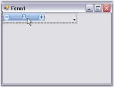
{:.image }

See Also

CommandBar Properties

CommandBar Properties

Appearance Properties

_Table_ _491__: Property Table_

<table>
<tr>
<td>
CommandBar Property</td><td>
Description</td></tr>
<tr>
<td>
BackColor</td><td>
Sets the back color for the control.</td></tr>
<tr>
<td>
BackgroundImage</td><td>
Sets the background image for the control.</td></tr>
<tr>
<td>
BackgroundImagelayout</td><td>
Specifies the layout of the image. Title, Center, Stretch, Zoom are the options. Default value is Tile.</td></tr>
<tr>
<td>
ChevronColor</td><td>
Sets color of the chevron.</td></tr>
<tr>
<td>
Font</td><td>
Sets the font style for the text.</td></tr>
<tr>
<td>
ForeColor</td><td>
Sets the foreground color of the text.</td></tr>
<tr>
<td>
Text</td><td>
Sets the control's text.</td></tr>
</table>

{:.image }

Behavior Properties

_Table_ _492__: Property Table_

<table>
<tr>
<td>
CommandBar Property</td><td>
Description</td></tr>
<tr>
<td>
AllowedDockBorders</td><td>
Specifies dock border sides in which command bar can be docked from floating.</td></tr>
<tr>
<td>
AlwaysLeadingEdge</td><td>
Docks the CommandBar permanently to the leading edge of the dock border.</td></tr>
<tr>
<td>
AlwaysTrailingEdge</td><td>
Docks the CommandBar permanently to the trailing edge of the dock border.</td></tr>
<tr>
<td>
DisableDocking</td><td>
Disables docking ability of the CommandBar.</td></tr>
<tr>
<td>
DisableFloating</td><td>
Disables floating ability of the CommandBar.</td></tr>
<tr>
<td>
DockModeWrapping</td><td>
Wraps the docked CommandBar when bounds are less than maximum length.</td></tr>
<tr>
<td>
FloatModeWrapping</td><td>
Wraps the floating CommandBar when it is resized to less than its maximum length.</td></tr>
<tr>
<td>
OccupyFullRow</td><td>
Lets CommandBar occupy the full row in a form.</td></tr>
<tr>
<td>
ShowDockModeText</td><td>
Specifies whether the command bar should display the text that is set through CommandBar.Text property when the command bar is in docked position.</td></tr>
</table>
Hide / Show

_Table_ _493__: Property Table_

<table>
<tr>
<td>
CommandBar Property</td><td>
Description</td></tr>
<tr>
<td>
HideChevron</td><td>
When set to true hides the chevron for the CommandBar.</td></tr>
<tr>
<td>
HideCloseButton</td><td>
Hides Close button for the floating CommandBar, when set to true.</td></tr>
<tr>
<td>
HideDropDownButton</td><td>
Shows / Hides the dropdown button.</td></tr>
<tr>
<td>
HideGripper</td><td>
Shows / Hides the drag gripper.</td></tr>
</table>

{:.image }

Popup for the DropDown

_Table_ _494__: Property Table_

<table>
<tr>
<td>
CommandBar Property</td><td>
Description</td></tr>
<tr>
<td>
PopupContainer</td><td>
Indicates the PopupContainer control that is displayed when the dropdown button is clicked.</td></tr>
<tr>
<td>
PopupMenu</td><td>
Indicates the Popup menu on clicking the dropdown button.</td></tr>
</table>
###### Detached ControlBars

ControlBars inEssential Tools XP Menus framework enables application developers to add dockable / floatable controls to their form's toolbar layout. A common example of a ControlBar is the task pane window found in the Microsoft Office 2003 product suite. 

A ControlBar is a full-featured docking container that can host any control and be docked along the border of the host form or floated as a top-level window. ControlBars, however, differ from traditional docking windows by adopting the characteristic layout behavior of a toolbar rather than that of a classic dockable control.

{:.image }

See also

How to dock the ControlBars to any edge of the host form?

ControlBar Client Controls

A ControlBar is capable of hosting two controls.

* A main control that occupies the ControlBar's client region.
* A CaptionControl that is displayed within the ControlBar's caption region. 

While just about any System.Windows.Forms.Control instance can be used as the ControlBar's main client, the caption control position is normally occupied by single line controls such as a toolbar, text box or combo box. 

{:.image }

{:.image }

Dropping a control onto the ControlBar automatically sets it as the ControlBar's main client. To assign the caption control, drop the control onto the ControlBar and using the Properties window, set the bar's CaptionControl property to refer that control. Doing so will reposition and resize the control to occupy the bar's caption region. Height of the ControlBar caption bar can be specified in ControlBarCaptionHeight property. Default height is 25.

[C#]

this.controlBar1.CaptionControl = this.xpToolBar1;

this.controlBar1.ControlBarCaptionHeight = 30;

[VB.NET]

Me.controlBar1.CaptionControl = Me.xpToolBar1

Me.controlBar1.ControlBarCaptionHeight = 30

See Also

ControlBar Properties

Adding Different Pages To Control Bar

How to dock the ControlBars to any edge of the host form?

ControlBar Properties

Appearance Properties

_Table_ _495__: Property Table_

<table>
<tr>
<td>
ControlBar Property</td><td>
Description</td></tr>
<tr>
<td>
BackColor</td><td>
Sets the back color for the XPToolbar.</td></tr>
<tr>
<td>
BackgroundImage</td><td>
Sets the background image for the XPToolbar.</td></tr>
<tr>
<td>
BackgroundImagelayout</td><td>
Specifies the layout of the image.Title, Center, Stretch, Zoom are the option. Default value is Tile.</td></tr>
<tr>
<td>
ChevronColor</td><td>
Sets color of the chevron.</td></tr>
<tr>
<td>
Font</td><td>
Sets the font style for the text.</td></tr>
<tr>
<td>
ForeColor</td><td>
Sets the foreground color of the text.</td></tr>
<tr>
<td>
Text</td><td>
Sets the control's text.</td></tr>
</table>
Behavior Properties

_Table_ _496__: Property Table_

<table>
<tr>
<td>
ControlBar Property</td><td>
Description</td></tr>
<tr>
<td>
AllowedDockBorders</td><td>
Specifies dock border sides in which command bar can be docked from floating.</td></tr>
<tr>
<td>
AlwaysLeadingEdge</td><td>
Docks the CommandBar permanently to the leading edge of the dock border.</td></tr>
<tr>
<td>
AlwaysTrailingEdge</td><td>
Docks the CommandBar permanently to the trailing edge of the dock border.</td></tr>
<tr>
<td>
CaptionControl</td><td>
Specifies the control that represents the caption of the control bar.</td></tr>
<tr>
<td>
DisableDocking</td><td>
Disables docking ability of the CommandBar.</td></tr>
<tr>
<td>
DisableFloating</td><td>
Disables floating ability of the CommandBar.</td></tr>
</table>
Hide / Show

_Table_ _497__: Property Table_

<table>
<tr>
<td>
ControlBar Property</td><td>
Description</td></tr>
<tr>
<td>
HideCloseButton</td><td>
Hides Close button for the floating CommandBar, when set to true.</td></tr>
<tr>
<td>
HideDropDownButton</td><td>
Shows / Hides the dropdown button.</td></tr>
<tr>
<td>
HideGripper</td><td>
Shows / Hides the drag gripper.</td></tr>
</table>
Popup for the DropDown

_Table_ _498__: Property Table_

<table>
<tr>
<td>
ControlBar Property</td><td>
Description</td></tr>
<tr>
<td>
PopupContainer</td><td>
Indicates the PopupContainer control that is displayed when the dropdown button is clicked.</td></tr>
<tr>
<td>
PopupMenu</td><td>
Indicates the Popup menu on clicking the dropdown button.</td></tr>
</table>
See Also

ControlBar Client Controls, 

Adding Different Pages To Control Bar

How to dock the ControlBars to any edge of the host form?

Adding Different Pages To Control Bar

Adding and Removing ControlBars 

The MainFrameBarManager's Add Detached ControlBar design-time verb, available through the Properties window, facilitates the addition of ControlBars to the design form. The XP Menus design-time is fully WYSIWYG and the bar layout can be designed by simply dragging and docking or floating each ControlBar at the desired location. Upon saving the design form, the ControlBar state information is serialized by the BarManager as a part of the form's resource file along with the rest of the menu/toolbar layout.

Follow the steps below to add different pages to the control bar.

{:.image }

> 
{:.image }
 _Note: Control Bar can also be added by clicking the verb in the properties window._

{:.image }

 The resulted screen shot displays controlbar in the designer.

{:.image }

* Now add XPToolbar to the control bar.
* Add panel to the control bar.
* Add CardLayout over the panel to add different pages.

While dropping out CardLayout onto the panel, the layout designer window will open, asking whether to make panel1 as container control. Click 'Yes' and continue.

{:.image }

* You can add multiple panels to the control bar.
* Select the card using the SelectedCard property in the CardLayout Property window.

{:.image }

* In the selected card, add XPTaskBar to the control bar and right-click it to add XPTaskBarBox to add Items.

{:.image }

The resultant form is as follows.

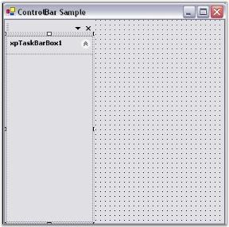
{:.image }

* Inside XPTaskbarBox, you can insert link labels, ComboBoxAdv controls like in the following screen shot.

{:.image }

At Run Time

Include the following code snippet in the Click event of a BarItem to view the next page of a card.

[C#]

this.cardlayoutmanager1.next();

[VB.NET]

Me.cardlayoutmanager1.next()

A sample which demonstrates adding control bar is available in the below sample installation location.

…\_My Documents\Syncfusion\EssentialStudio\Version Number\Windows\Tools.Windows\Samples\Advanced Editor Functions\ActionGroupingDemo_

See Also

ControlBar Client Controls, 

Adding Different Pages To Control Bar

How to dock the ControlBars to any edge of the host form

##### XPToolbar

An XP Toolbar is a toolbar-like control with look-and-feel of the XP Menus toolbar. It supports a list of BarItems which can be added to it. It is a stand-alone control that can also be used in the absence of a BarManager also. 

{:.image }

See Also

###### Adding and Filling the XPToolbar

Adding XPToolBar to XPMenus

Drag and drop an XPToolbar control onto the form. 

Supported BarItem types

The various types of BarItems supported by XPToolBar are:

* BarItem
* ParentBarItem
* DropDownBarItem
* ComboBoxBarItem
* StaticBarItem 
* TextBoxBarItem
* ListBarItem
* MDIListBarItem
* ToolbarListBarItem

Filling the XP Toolbar with Items from the BarManager

You can drag-and-drop items from the Customize dialog of the BarManager into the XP Toolbar, in the same way you filled the menus and toolbars.

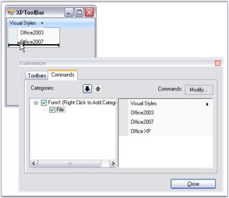
{:.image }

In the presence of a BarManager, you can also add separators to the items by right-clicking on the items and selecting the Begin A Group option similar to Menus. See Grouping Bar Items.

Filling the XP ToolBar through the BarItems Collection Editor

During design-time, in the absence of BarManager, the XP Toolbar can be filled through the BarItems collection editor, which is invoked using Items property. In the collection editor, you can add any of the available BarItem types to the XP Toolbar's list. A customized text can be provided for the BarItems using Text property.

_Table_ _499__: Property Table_

<table>
<tr>
<td>
XPToolBar Property</td><td>
Description</td></tr>
<tr>
<td>
Items</td><td>
Indicates bar items collections.</td></tr>
</table>

{:.image }

{:.image }

> 
{:.image }
 _Note: This control is not normally used to create toolbars in the XP Menus. This is meant to be used within the form as a stand-alone control._

[C#]

this.barItem10.Text = "XPMenus";

this.parentBarItem2.Text = "ParentBarItem";                  

[VB.NET]

Me.barItem10.Text = "XPMenus"

Me.parentBarItem2.Text = "ParentBarItem"

Adding Separators

In the absence of a BarManager, you can add separators to the items by editing the XPToolBar.SeparatorIndices property list.

_Table_ _500__: Property Table_

<table>
<tr>
<td>
XPToolBar Property</td><td>
Description</td></tr>
<tr>
<td>
SeparatorIndices</td><td>
Specifies the Indices values after which the separator have to be placed in an XPToolbar.</td></tr>
</table>

[C#]

this.xpToolBar1.SeparatorIndices.AddRange(new int[] {1, 2});       

[VB.NET]

Me.xpToolBar1.SeparatorIndices.AddRange(New Integer() {1, 2}) 

{:.image }

The XPToolbars sample in the following installation path, shows how an XP toolbar can be used in an application.

…\_My Documents\Syncfusion\EssentialStudio\Version Number\Windows\Tools.Windows\Samples\Advanced Editor Functions\ActionGroupingDemo_

See Also

XPToolbar Properties

###### XPToolbar Properties

Appearance Properties

_Table_ _501__: Property Table_

<table>
<tr>
<td>
XPToolbar Property</td><td>
Description</td></tr>
<tr>
<td>
BackColor</td><td>
Sets the back color for the XPToolbar.</td></tr>
<tr>
<td>
BackgroundImage</td><td>
Sets the background image for the XPToolbar.</td></tr>
<tr>
<td>
BackgroundImagelayout</td><td>
Specifies the layout of the image. Title, Center, Stretch, Zoom are the option. Default value is Tile.</td></tr>
<tr>
<td>
Font</td><td>
Sets the font style for the text.</td></tr>
<tr>
<td>
ForeColor</td><td>
Sets the foreground color of the text.</td></tr>
<tr>
<td>
LargeIcons</td><td>
Indicates whether images are used from the LargeImageList.</td></tr>
<tr>
<td>
Office2007Theme</td><td>
Specifies the color scheme for Office2007Theme.</td></tr>
<tr>
<td>
RightToLeft</td><td>
Indicates whether control is rendered in RTL mode.</td></tr>
<tr>
<td>
Style</td><td>
Indicates the visual style for the control.</td></tr>
<tr>
<td>
Text</td><td>
Sets the control's text.</td></tr>
<tr>
<td>
ThemesEnabled</td><td>
Specifies whether XP theme is enabled or not.</td></tr>
</table>
Behavior Properties

_Table_ _502__: Property Table_

<table>
<tr>
<td>
XPToolbar Property</td><td>
Description</td></tr>
<tr>
<td>
Enabled</td><td>
Indicates if the control is enabled or not.</td></tr>
<tr>
<td>
RotateWhenVertical</td><td>
Indicates whether the items will be drawn vertical when the XPToolbar is docked vertically. Default value is vertical.</td></tr>
<tr>
<td>
UpdateUIMFCStyle</td><td>
Indicates whether UpdateUI event should be fired.</td></tr>
<tr>
<td>
Visible</td><td>
Indicates whether the control is visible or not.</td></tr>
<tr>
<td>
ShowHighlightRectangle</td><td>
Highlights the bar items on mouse hovering. By default it is set to true.</td></tr>
<tr>
<td>
ShowChevron</td><td>
Indicates whether to show chevron. (Default - true)</td></tr>
</table>
See Also

* XPToolbar Control
* Adding and Filling the XPToolbar
* UI Command Update Patterns
##### Popup Menu

A PopupMenu represents a context menu for XPMenus, that can be shown over any control, when the user right clicks, anywhere in an application. It must be associated with a ParentBarItem whose contents will be displayed in the popup menu. Similar to the .NET Context menus, a popup menu can be displayed. PopupMenusManager class should be added to the designer to display the PopUp menu.

{:.image }

See Also

###### Adding and Filling a PopupMenu

Adding a PopupMenu

Drag and drop a PopupMenu from the toolbox onto the designer form. 

{:.image }

Filling the Popup Menu

In the Absence of a BarManager

A PopupMenu needs to be associated with a ParentBarItem in order to fill it with menu items. Right click the PopupMenu and select "Add Default ParentBarItem" if there is no ParentBarItem added for the Menus before.

{:.image }

In the absence of a BarManager, use the PopupMenu.ParentBarItem.Items property's collection editor to add items to the popup menu. 

{:.image }

> 
{:.image }
 _Note: With such a custom ParentBarItem associated with the popup menu, you cannot add items using drag-and-drop from the BarManager._

In the Presence of the BarManager

You can also reuse the ParentBarItem that you have already created for your menu structure using BarManager to fill the Popup menu. To do so, set the ParentBarItem property of the Popup menu to one of the available ParentBarItems. 

{:.image }

In the presence of a BarManager, the user can just drag BarItems into the popup menu. Right-click on the popupMenu1 and select Customize to invoke this dialog and drag the required menu items.

{:.image }

> 
{:.image }
 _Note: You can also display the popup menu programmatically by calling PopupMenu.Show method. See_ How to programmatically show a Popup Menu

See also

* Associating Popup Menu To a Control,
* Grouping Items in a Popup Menu,
* How to programmatically show a Popup Menu

###### Associating Popup Menu to a Control

In the previous topic, we saw how to add and fill a popup menu with menu items. This section will guide you on how to associate a popup menu to a control like RichTextBox (in this example), through designer without a single piece of code. 

Drag and Drop a PopupMenusManager control onto the form. Also add a RichTextBox control. When PopupMenusManager class is dragged onto the design surface, it will provide an extended property, XPContextMenu on popupMenusManager1 for all the controls in the form, letting the users to easily associate a popup menu with a control. 

{:.image }

> 
{:.image }
 _Note: A single PopupMenu can be associated with multiple controls._

[C#]

// Create and initialize a ParentBarItem.

this.editBarItem = new Syncfusion.Windows.Forms.Tools.ParentBarItem();

this.editBarItem.Text = "&Edit";

this.editBarItem.Items.AddRange(new BarItem[] { this.cutItem, this.copyItem});

// Associate the ParentBarItem with the PopupMenu.

this.popupMenu1 = new Syncfusion.Windows.Forms.Tools.PopupMenu();

this.popupMenu1.ParentBarItem = this.editBarItem;

// Then associate it with a RichTextBox.

this.popupMenusManager = new PopupMenusManager();

this.popupMenusManager.SetXPContextMenu(this.richTextBox1, this.popupMenu1);

[VB.NET]

' Create and initialize a ParentBarItem.

Me.editBarItem = New Syncfusion.Windows.Forms.Tools.ParentBarItem()

Me.editMenu.Text = "&Edit"

Me.editMenu.Items.AddRange(New BarItem() {Me.cutItem, Me.copyItem})

' Associate the ParentBarItem with the PopupMenu.

Me.popupMenu1 = New Syncfusion.Windows.Forms.Tools.PopupMenu()

Me.popupMenu1.ParentBarItem = Me.editBarItem

' Then associate it with a RichTextBox.

Me.popupMenusManager = New PopupMenusManager()

Me.popupMenusManager.SetXPContextMenu(Me.richTextBox1, Me.popupMenu1)

{:.image }

> 
{:.image }
 _Note: We can even show the popup menu without implementing the PopupMenusManager class by calling PopupMenu.Show method. Click here for more details._

See Also

* Adding and filling a popup menu
* Grouping Items in a Popup Menu
* How to programmatically show a Popup Menu
###### Grouping Items in a Popup Menu

This topic will guide on how to group the menu items by inserting separator(s), in a popup menu with and without BarManager.

If the ParentBarItem associated with the popup menu is contained within a BarManager, drop-down the popup menu from the Popup Form, right click on an item and select Begin A Group from the context menu.

{:.image }

If the ParentBarItem is not contained within a BarManager, edit the SeparatorIndices property of the ParentBarItem indicating the item indices in the items list where you want the separators to be introduced. 

{:.image }

{:.image }

We can also group the items using BeginGroupAt and RemoveGroupAt methods. Click here to know more.

See Also

* Associating Popup Menu To a Control
* Adding and filling a popup menu
* How to programmatically begin a group or remove an existing group in a popup menu
* How to programmatically show a Popup Menu
###### Visual Styles for the Popup Menu

Visual Style for a popupmenu can be controlled by using PopupMenu.ParentBarItem.Style property.

[C#]

this.popupMenu1.ParentBarItem.Style = Syncfusion.Windows.Forms.VisualStyle.Office2007Outlook;

[VB.NET]

Me.popupMenu1.ParentBarItem.Style = Syncfusion.Windows.Forms.VisualStyle.Office2007Outlook

{:.image }

See Also

Visual Styles

##### MDI Child Forms

This section illustrates how to create MDI Child forms using the ChildFrameBarManager.

Follow the steps below to create MDI parent form and MDI child form.

Creating MDI ParentForm

1. Set up an MDIParent form by setting Form.IsMdiContainer property to true.
2. Add bar items, 'Open' and 'Exit', under File menu bar using MainFrameBarManager. Refer to Creating Menus.

{:.image }

3. Create a new form named TextEditor, with the controls FontListBox and ColorUIControl. We will consider this form as the MDIChildForm.

{:.image }

4. Drag-and-Drop ChildFrameBarManager to the child form and add necessary Bar items. Adding bar items using ChildFrameBarManager is similar to MainFrameBarManager.

{:.image }

5. Now merge the toolbars and menus of the child form with the Main form using RegisterMDIChildType function as follows.

[C#]

this.MainFrameBarManager1.RegisterMdiChildTypes(new Type[]{typeof(TextEditorForm)});

[VB.NET]

Me.MainFrameBarManager1.RegisterMdiChildTypes(New Type(){GetType(TextEditorForm)})

A sample demonstrating the MDI feature is available in the below sample installation location.

…\_My Documents\Syncfusion\EssentialStudio\Version Number\Windows\Tools.Windows\Samples\Advanced Editor Functions\ActionGroupingDemo_

###### MDI Merging

The XP Menus framework goes to a great extent to support associating menus and toolbars for MDIChild forms. It helps users to create custom menu items and toolbars for child forms and handle menu events right within the child form. Without this support, users would have to handle menu click events in their main form and delegate it to the appropriate child forms with drawn-out casting and run-time checks and would also have to manually control menu and toolbar visibility based on the active MDIChild forms. 

Once an MDIChild form is associated with a ChildFrameBarManager, the XP Menus framework merges the menus and toolbars of the child form with that of the main form. There are two ways in which MDI merging can happen.

* Auto Merging - The framework will automatically merge the menus of the child forms with that of the main form when a new instance of the child type is parented by the MDIParent. This merging will be undone when all instances of that child type are closed. This is the default behavior. 
* Explicit Merging - Explicitly merging the child types when the application loads will provide a completely merged menu/toolbar structure to the end users, all the time. This merged state will stay unaffected through out the lifetime of the application (whether or not there are instances of the child types currently loaded). Note that the merged BarItems of the MDI child forms would be displayed in the runtime customization dialog only, and will not be visible in the parent form's menus or toolbars until an actual instance of the child form is loaded. This is the behavior exhibited in VS .NET. You can explicitly merge child types by registering the child form types with the MainFrameBarManager, as follows.

[C#]

// TextEditorForm and ImageEditorForm are form-derived classes that are MDIChildren.

this.mainFrameBarManager1.RegisterMdiChildTypes(new Type[]{typeof(TextEditorForm), typeof(ImageEditorForm)});

[VB.NET]

' TextEditorForm and ImageEditorForm are form-derived classes that are MDIChildren.

Me.mainFrameBarManager1.RegisterMdiChildTypes(New Type() {GetType(TextEditorForm), GetType(ImageEditorForm)})

The MainFrameBarManager will then create an instance of these form types and obtain the main menu and toolbars, associated with these child form types. 

The following applies to the explicit merging scenario only:

_Warning_ Explicit merging imposes the requirement that the child form types should have a public default constructor (constructor with no arguments). 

> 
{:.image }
 _Note: During explicit merging, a new 'dummy' instance of the child forms (one for each type) will be created by the framework in the background. However, these child forms will never be made visible._

Types of Merging

 There are three types of MDI merging supported.

* Main menu Merging: MainMenus (bars with the MainMenu BarStyle) in the main form and the child forms will automatically be merged into one, irrespective of their BarName. 
* Toolbars Merging: Toolbars with the same BarName (in different forms) will be merged into one. 
* BarItems Merging: A BarItem in a child form can merge with a BarItem in the parent form, if it satisfies the following criteria.
* If it is parented by a Bar or ParentBarItem which in turn is being merged into one. 
* If it has the same text and MergeOrder value. 

The merge behavior is also controlled by the MergeType property, as follows.

_Table_ _503__: Property Table_

<table>
<tr>
<td>
MDI Container Item's MergeType</td><td>
MDI Child Item's MergeType</td><td>
Merge Behavior</td></tr>
<tr>
<td>
Add</td><td>
Add / MergeItems / Replace</td><td>
No merging.</td></tr>
<tr>
<td>
Add</td><td>
Remove</td><td>
Parent item stays visible; child item hidden</td></tr>
<tr>
<td>
MergeItems</td><td>
MergeItems</td><td>
If both are sub-menus (ParentBarItems), their children will be merged together; otherwise the child item will replace the parent item.</td></tr>
<tr>
<td>
MergeItems</td><td>
Replace</td><td>
Child item will replace parent item.</td></tr>
<tr>
<td>
MergeItems</td><td>
Add</td><td>
No merging.</td></tr>
<tr>
<td>
MergeItems</td><td>
Remove</td><td>
Both items will be hidden.</td></tr>
<tr>
<td>
Remove</td><td>
Remove</td><td>
Both items will be hidden.</td></tr>
<tr>
<td>
Remove</td><td>
Add / MergeItems / Replace</td><td>
Child item will replace parent item.</td></tr>
<tr>
<td>
Replace</td><td>
Add</td><td>
No merging.</td></tr>
<tr>
<td>
Replace</td><td>
MergeItems</td><td>
Parent item, if any, will replace the child item.</td></tr>
<tr>
<td>
Replace</td><td>
Replace</td><td>
Child item will replace the parent item.</td></tr>
<tr>
<td>
Replace</td><td>
Remove</td><td>
Parent item stays visible; child item will be hidden.</td></tr>
</table>

You can choose anyone of the following for MDI merging.

* To let the framework automatically merge as new instances of the child types that are created.
* Explicitly merge child types as soon as the application is started.
* Explicit merging is recommended for better performance, usability and for VS.NET like behavior.
* Explicit merging is performed by calling the RegisterMDIChildTypes method with appropriate parameters (see the above section reference for example). 
> 

{:.image }
 _Note: This step is relevant only if your form is an MDI container. [IsMDIContainer = True]_

##### Design-Time Features

This section discusses the options available for the developers at Design Time.

###### Tasks Window

MainFrameBarManager

The tasks window lets you open Customize dialog using Customize... option. To add CommandBar and ControlBar, use Add Detached CommandBar and Add Detached ControlBar options.

In the Appearance section, you can select the required Visual Styles, imageList and LargeImageList. Themes for the Menus can be enabled by selecting the ThemesEnabled option and LargeIcons mode can be activated using LargeIcons option.

Toolbar Persistence can be enabled using AutoLoadToolBarPositions and AutoPersistCustomization options.

{:.image }

ChildFrameBarManager

The ChildFrameBarManager's Tasks Window gives the below Misc and Appearance options.

{:.image }

See Also

Context Menu

##### Run Time Interactive Features

This section discusses the following interactive features at run time.

###### SuperToolTip support

The BarItems in XPMenus provides SuperToolTip support. Other than the usual tooltip, XPMenus now allows users to associate a SuperToolTip to the BarItems.

To associate a SuperTooltip to the BarItem (Menu Items), Drag and drop a SuperToolTip control on to the form in which the Menus are placed. Select the BarItem to which the SuperTooltip is to be added. 

In the properties window, of the BarItem, we can see an extender property ToolTip on superToolTip. Click this to open the Tooltip Editor.

{:.image }

Customize the Tooltip using the Tooltip Editor.

{:.image }

[C#]

toolTipInfo1.Body.Text = "Save";

this.superToolTip1.SetToolTip(this.barItem2, toolTipInfo1);

[VB.NET]

toolTipInfo1.Body.Text = "Save"

Me.superToolTip1.SetToolTip(Me.barItem2, toolTipInfo1)

{:.image }

A sample illustrating the supertooltip feature is available in the below sample installation location.

…\_My Documents\Syncfusion\EssentialStudio\Version Number\Windows\Tools.Windows\Samples\Advanced Editor Functions\ActionGroupingDemo_

###### Context Menu for XPMenus

See 

PopUp Menu

##### Appearance Settings

This section discusses the below appearance related topics.

###### Bar Styles

The BarStyle property of the bar object lets users customize certain behavior and look-and-feel of the toolbar, such as visibility, whether it should be drawn in multi-line mode or whether the toolbar should be treated like a status bar that always gets shown at the bottom of the form.

_Table_ _504__: Property Table_

<table>
<tr>
<td>
Bar.BarStyle Property</td><td>
Description</td></tr>
<tr>
<td>
AllowQuickCustomizing</td><td>
This will draw an arrow button to the right side of the toolbar that will allow the user to drop down a menu from which they can select hidden items, add or remove buttons and invoke Customize dialog. {{ _Note:_ | markdownify }} This is effective only with IsMainMenu unchecked.</td></tr>
<tr>
<td>
DrawDragBorder</td><td>
Allows the user to drag the bar around, to move it within dock border, dock to different border or float. To move the bar within the form set DrawDragBorder to true. If this is not set, user cannot to move the bar.</td></tr>
<tr>
<td>
Multiline</td><td>
Wraps the bar into multiple rows when there is not enough space in a row while docked or the user resizes the floating bars.</td></tr>
<tr>
<td>
IsMainMenu</td><td>
When this option is checked, it treats the bar as the main menu and forces the bar to occupy the whole row irrespective of multiline settings. > {{ _Note: If this option is selected for more one bar, the first setting will be effective and the rest will be ignored._ | markdownify }}</td></tr>
<tr>
<td>
RotateWhenVertical</td><td>
The text in the bars will always be drawn as horizontal irrespective of docked position of a bar. To change this behavior RotateWhenVertical should be set to true.</td></tr>
<tr>
<td>
TextBelowImage</td><td>
Specifies whether the text in the bar should be drawn below the images in the toolbar.</td></tr>
<tr>
<td>
UseWholeRow</td><td>
Forces the bar to occupy the full row when docked to Form's border.</td></tr>
<tr>
<td>
Visible</td><td>
Hides / shows a bar.</td></tr>
</table>

{:.image }

[C#]

this.bar1.BarStyle = ((Syncfusion.Windows.Forms.Tools.XPMenus.BarStyle)((((((((Syncfusion.Windows.Forms.Tools.XPMenus.BarStyle.AllowQuickCustomizing | Syncfusion.Windows.Forms.Tools.XPMenus.BarStyle.IsMainMenu)| Syncfusion.Windows.Forms.Tools.XPMenus.BarStyle.MultiLine) 

| Syncfusion.Windows.Forms.Tools.XPMenus.BarStyle.RotateWhenVertical)| Syncfusion.Windows.Forms.Tools.XPMenus.BarStyle.Visible) 

| Syncfusion.Windows.Forms.Tools.XPMenus.BarStyle.UseWholeRow)| Syncfusion.Windows.Forms.Tools.XPMenus.BarStyle.DrawDragBorder) 

| Syncfusion.Windows.Forms.Tools.XPMenus.BarStyle.TextBelowImage)));

[VB.NET]

Me.bar1.BarStyle = (CType((((((((Syncfusion.Windows.Forms.Tools.XPMenus.BarStyle.AllowQuickCustomizing Or Syncfusion.Windows.Forms.Tools.XPMenus.BarStyle.IsMainMenu) Or Syncfusion.Windows.Forms.Tools.XPMenus.BarStyle.MultiLine) Or Syncfusion.Windows.Forms.Tools.XPMenus.BarStyle.RotateWhenVertical) Or Syncfusion.Windows.Forms.Tools.XPMenus.BarStyle.Visible) Or Syncfusion.Windows.Forms.Tools.XPMenus.BarStyle.UseWholeRow) Or Syncfusion.Windows.Forms.Tools.XPMenus.BarStyle.DrawDragBorder) Or Syncfusion.Windows.Forms.Tools.XPMenus.BarStyle.TextBelowImage), Syncfusion.Windows.Forms.Tools.XPMenus.BarStyle))

###### Colors for Menus and Toolbars

Essential studio comes with three classes to provide custom colors for the Menus. 

* MenuColors - The Syncfusion.Windows.Forms.Tools.XPMenus.MenuColors class is used when the Visual Styles is Default. 
* Office2003Colors - The Syncfusion.Windows.Forms.Office2003Colors class is used when the Visual Styles is set as Office2003.
* Office2007Colors - The Syncfusion.Windows.Forms.Office2007Colors class is used when the Visual Styles is set as Office2007.
MenuColors

The Syncfusion.Windows.Forms.Tools.XPMenus.MenuColors class includes static properties that allow you to change them to get custom background colors for the different portions of the menus and toolbars. Some of the properties include MainMenuBackColor, CommandBarBackColor and StatusBarBackColor.

The following methods of MenuColors class can be invoked to set the custom color.

_Table_ _505__: Methods Table_

<table>
<tr>
<th>
MenuColors</th><th>
Description</th></tr>
<tr>
<td>
CommandBarBackColor</td><td>
Gets / sets the background color for a toolbar / commandbar.</td></tr>
<tr>
<td>
CheckedSelColor</td><td>
Sets the selected color for a checked menu item.</td></tr>
<tr>
<td>
DisabledMenuTextColorBase</td><td>
Gets / sets the text color base for the text in the disabled menu items.</td></tr>
<tr>
<td>
DisabledToolbarItemTextColorBase</td><td>
Gets / sets the text color base for the text in the disabled toolbar items.</td></tr>
<tr>
<td>
DropDownBorderColor</td><td>
Gets / sets the border color for a drop-down menu.</td></tr>
<tr>
<td>
ExpandedMenuStripBackColor</td><td>
Gets / sets the Backcolor for the expanded, left-aligned menu strip region. This is the region you see when a partial menu gets expanded to show all the menu items.</td></tr>
<tr>
<td>
FloatingCommandBarCaptionColor</td><td>
Gets / sets the Caption background color for a floating toolbar / commandbar.</td></tr>
<tr>
<td>
InactiveItemAlphaBlendFactor</td><td>
Gets / sets the alpha-blend factor to use to shade the inactive menu item's icons. (255 for no alpha-blending; 0 will completely hide the item).</td></tr>
<tr>
<td>
MainMenuBackColor</td><td>
Gets / sets the background color for the main-menu bar.</td></tr>
<tr>
<td>
MenuActiveTextColor</td><td>
Gets / sets the active text color of the menu and toolbar items.</td></tr>
<tr>
<td>
MenuBGColor</td><td>
Sets the background color for a drop down menu.</td></tr>
<tr>
<td>
MenuLeftStripColor</td><td>
Gets / sets the color for the left aligned strip in a drop-down menu where images and check boxes are shown.</td></tr>
<tr>
<td>
MenuTextColor</td><td>
Gets / sets the text color of the menu and toolbar items.</td></tr>
<tr>
<td>
PressedSelColor</td><td>
Gets / sets the selected-pressed color for a menu item in a toolbar.</td></tr>
<tr>
<td>
SelBorderColor</td><td>
Gets / sets the border color for a selected menu item in a toolbar.</td></tr>
<tr>
<td>
SelColor</td><td>
Gets / sets the selected color for a menu item in a toolbar.</td></tr>
<tr>
<td>
SelTextColor</td><td>
Gets / sets the selected text color for an item in a toolbar.</td></tr>
<tr>
<td>
StatusBarBackColor</td><td>
Gets / sets the background color for the Status Bar.</td></tr>
</table>

Add the following code snippet to get Custom colors for the menu bar items.

[C#]

//Set the background color for a drop down menu

MenuColors.MenuBGColor = Color.Pink;

//Set border color for a drop down menu

MenuColors.DropDownBorderColor = Color.Aqua;

[VB.NET]

'Set the background color for a drop down menu

Private MenuColors.MenuBGColor = Color.Pink

'Set border color for a drop down menu

Private MenuColors.DropDownBorderColor = Color.Aqua

{:.image }

A sample which demonstrates setting colors for Menus using MenuColors class is available in the below sample installation path.

…\_My Documents\Syncfusion\EssentialStudio\Version Number\Windows\Tools.Windows\Samples\Advanced Editor Functions\ActionGroupingDemo_

Office2003Colors

The following table lists the members exposed by Office2003Colors class.

_Table_ _506__: Members Table_

<table>
<tr>
<td>
Colors</td><td>
Description</td></tr>
<tr>
<td>
CheckedColor</td><td>
Gets / sets the background color of a check box in the drop-down menu margin or a checked item in the toolbar.</td></tr>
<tr>
<td>
CheckedSelColor</td><td>
Gets / sets the background color of a selected check box in the drop-down menu margin or a checked item in the toolbar.</td></tr>
<tr>
<td>
CommandBarDropDownColorDark</td><td>
Gets or sets the dark-gradient color of quick customize dropdown button.</td></tr>
<tr>
<td>
CommandBarDropDownColorLight</td><td>
Gets or sets the light-gradient color of quick customize dropdown button.</td></tr>
<tr>
<td>
ControlBorderColorDark</td><td>
Gets or sets the dark-gradient border color of bars.</td></tr>
<tr>
<td>
ControlBorderColorLight</td><td>
Gets or sets the light-gradient border color of bars.</td></tr>
<tr>
<td>
ControlGripperColor</td><td>
Gets or sets the color of the gripper.</td></tr>
<tr>
<td>
DockBarColorDark</td><td>
Gets or sets the left-gradient color of docked bars.</td></tr>
<tr>
<td>
DockBarColorLight</td><td>
Gets or sets the right-gradient color of docked bars.</td></tr>
<tr>
<td>
DropDownBorderColor</td><td>
Gets / sets the border color of a drop-down menu.</td></tr>
<tr>
<td>
FloatingCommandBarCaptionColor</td><td>
Gets or sets the caption background color of floating bars.</td></tr>
<tr>
<td>
FloatingCommandBarItemPressedColor</td><td>
Gets or sets the color for the floating command bar item which is pressed.</td></tr>
<tr>
<td>
GroupBarHeaderColorDark</td><td>
Gets or sets the dark-gradient color of groupBar header.</td></tr>
<tr>
<td>
GroupBarHeaderColorLight</td><td>
Gets or sets the light-gradient color of groupBar header.</td></tr>
<tr>
<td>
GroupBarHighlightColorDark</td><td>
Gets or sets the dark-gradient highlight color of groupBarItem.</td></tr>
<tr>
<td>
GroupBarHighlightColorLight</td><td>
Gets or sets the light-gradient highlight color of groupBarItem.</td></tr>
<tr>
<td>
GroupBarItemTextColor</td><td>
Gets / sets the color of the text in a GroupBar item.</td></tr>
<tr>
<td>
GroupBarItemTextSelectedHighlightColor</td><td>
Gets / sets the highlight color to be used for the selected text of the GroupBar item.</td></tr>
<tr>
<td>
GroupBarSelectedColorDark</td><td>
Gets or sets the dark-gradient color of selected groupBarItem.</td></tr>
<tr>
<td>
GroupBarSelectedColorLight</td><td>
Gets or sets the light-gradient color of selected groupBarItem.</td></tr>
<tr>
<td>
GroupBarSelectedHighlightColorDark</td><td>
Gets or sets the dark-gradient highlight color of selected groupBarItem.</td></tr>
<tr>
<td>
GroupBarSelectedHighlightColorLight</td><td>
Gets or sets the light-gradient highlight color of selected groupBarItem.</td></tr>
<tr>
<td>
MenuExpandedItemsMarginColorLeft</td><td>
Gets / sets the left-gradient color of the drop-down menu margin of the expanded menu items.</td></tr>
<tr>
<td>
MenuExpandedItemsMarginColorRight</td><td>
Gets / sets the right-gradient color of the drop-down menu margin of the expanded menu items.</td></tr>
<tr>
<td>
MenuItemHotColorDark</td><td>
Gets or sets the dark-gradient color of menu item for hot-tracking.</td></tr>
<tr>
<td>
MenuItemHotColorLight</td><td>
Gets or sets the light-gradient color of menu item for hot-tracking.</td></tr>
<tr>
<td>
MenuItemPressedColorDark</td><td>
Gets or sets the dark-gradient color of quick customize button when it is pressed.</td></tr>
<tr>
<td>
MenuItemPressedColorLight</td><td>
Gets or sets the light-gradient color of quick customize button when it is pressed.</td></tr>
<tr>
<td>
MenuMarginColorDark</td><td>
Gets / sets the right-gradient color of the drop-down menu margin.</td></tr>
<tr>
<td>
MenuMarginColorLight</td><td>
Gets / sets the left-gradient color of the drop-down menu margin.</td></tr>
<tr>
<td>
PressedSelColor</td><td>
Gets / sets the pressed-selected color for a menu item in a toolbar.</td></tr>
<tr>
<td>
SelBorderColor</td><td>
Gets / sets the border color of a menu item selection in the drop-down menus and toolbars.</td></tr>
<tr>
<td>
SelColor</td><td>
Gets / sets the selected color for a menu item in a drop-down menu.</td></tr>
<tr>
<td>
SeparatorColor</td><td>
Gets / sets the color of the separator line between the bar items.</td></tr>
</table>
Office2007 Colors

The following table lists the members exposed by Office2007Colors class.

_Table_ _507__: Members Table_

<table>
<tr>
<td>
Color</td><td>
Description</td></tr>
<tr>
<td>
BarItemCheckBorderColor</td><td>
Gets / sets color for the checked bar item.</td></tr>
<tr>
<td>
BarItemCheckDarkColor </td><td>
Gets / sets dark color for background of the checked bar item.</td></tr>
<tr>
<td>
BarItemCheckFlashColor </td><td>
Gets / sets color for flash of the checked bar item.</td></tr>
<tr>
<td>
BarItemCheckLightColor </td><td>
Gets / sets light color for background of the checked bar item.</td></tr>
<tr>
<td>
BaritemHighlightBorderColor </td><td>
Gets / sets color for highlighted border of the BarItem.</td></tr>
<tr>
<td>
BarItemPressBorderColor </td><td>
Gets / sets color for pressed border of the BarItem.</td></tr>
<tr>
<td>
BarItemPressFlashColor</td><td>
Gets or sets color for flash of the pressed BarItem.</td></tr>
<tr>
<td>
BarItemPressDarkColor </td><td>
Gets or sets dark color for background of the pressed BarItem.</td></tr>
<tr>
<td>
BarItemPressLightColor </td><td>
Gets or sets light color for background of the pressed BarItem.</td></tr>
<tr>
<td>
BarItemSelectFlashColor</td><td>
Gets or sets color for flash of the selected BarItem.</td></tr>
<tr>
<td>
BarItemSeparatorColor</td><td>
Gets or sets color for separator line of the CommandBar.</td></tr>
<tr>
<td>
ComboButtonBorder </td><td>
Gets or sets border color for ComboButton of the ComboBoxBarItem.</td></tr>
<tr>
<td>
ComboButtonDarkColor</td><td>
Gets or sets dark color for ComboButton of the ComboBoxBarItem.</td></tr>
<tr>
<td>
ComboButtonLightColor </td><td>
Gets or sets light color for ComboButton of the ComboBoxBarItem.</td></tr>
<tr>
<td>
ComboButtonHighlightBorder  </td><td>
Gets or sets border color for ComboButton of the highlighted ComboBoxBarItem.</td></tr>
<tr>
<td>
ComboButtonHighlightDarkColor  </td><td>
Gets or sets dark color for ComboButton of the highlighted ComboBoxBarItem.</td></tr>
<tr>
<td>
ComboButtonHighlightLightColor  </td><td>
Gets or sets light color for ComboButton of the highlighted ComboBoxBarItem.</td></tr>
<tr>
<td>
ComboButtonPressBorder  </td><td>
Gets or sets border color for ComboButton of the pressed ComboBoxBarItem.</td></tr>
<tr>
<td>
ComboButtonPressDarkColor </td><td>
Gets or sets dark color for ComboButton of the pressed ComboBoxBarItem.</td></tr>
<tr>
<td>
ComboButtonPressLightColor </td><td>
Gets or sets light color for ComboButton of the pressed ComboBoxBarItem.</td></tr>
<tr>
<td>
CommandBarBorderColor</td><td>
Gets or sets color for border of the CommandBar.</td></tr>
<tr>
<td>
CommandBarDarkColor </td><td>
Gets or sets dark color of the CommandBar.</td></tr>
<tr>
<td>
CommandBarLightColor </td><td>
Gets or sets light color of the CommandBar.</td></tr>
<tr>
<td>
DockBarBackColor </td><td>
Gets or sets background color of the DockBar or the main menu.</td></tr>
<tr>
<td>
DropDownBarItemBorderColor</td><td>
Gets or sets color for border of the DropDownBarItem.</td></tr>
<tr>
<td>
DropDownBarItemDarkColor</td><td>
Gets or sets dark color for background of the DropDownBarItem.</td></tr>
<tr>
<td>
DropDownBarItemLightColor</td><td>
Gets or sets light color for background of the DropDownBarItem.</td></tr>
<tr>
<td>
DropDownDarkColor</td><td>
Gets or sets dark color for dropdown button of the CommandBar.</td></tr>
<tr>
<td>
DropDownHighlightDarkColor</td><td>
Gets or sets dark color for highlight dropdown button of the CommandBar.</td></tr>
<tr>
<td>
DropDownHighlightLightColor</td><td>
Gets or sets light color for highlight dropdown button of the CommandBar.</td></tr>
<tr>
<td>
DropDownLightColor</td><td>
Gets or sets light color for dropdown button of the CommandBar.</td></tr>
<tr>
<td>
DropDownPressedDarkColor</td><td>
Gets or sets dark color for pressed dropdown button of the CommandBar.  </td></tr>
<tr>
<td>
DropDownPressedLightColor</td><td>
Gets or sets light color for pressed dropdown button of the CommandBar. </td></tr>
<tr>
<td>
FloatBackgroundColor</td><td>
Gets or sets background color of the floating CommandBar.</td></tr>
<tr>
<td>
FloatBorderColor</td><td>
Gets or sets color for border of the floating CommandBar.</td></tr>
<tr>
<td>
FloatCaptionColor</td><td>
Gets or sets color for caption text of the floating CommandBar.</td></tr>
<tr>
<td>
FloatCommandBarDarkColor</td><td>
Gets or sets dark color of the floating CommandBar.</td></tr>
<tr>
<td>
FloatCommandBarLightColor</td><td>
Gets or sets light color of the floating CommandBar.</td></tr>
<tr>
<td>
FloatHighlightButtonBorderColor</td><td>
Gets or sets border color for highlighted dropdown button of the floating CommandBar.</td></tr>
<tr>
<td>
FloatHighlightButtonColor</td><td>
Gets or sets color for highlighted dropdown button of the floating CommandBar.</td></tr>
<tr>
<td>
FloatLightBorderColor</td><td>
Gets or sets color for light border of the floating CommandBar.</td></tr>
<tr>
<td>
FloatPressButtonBorderColor</td><td>
Gets or sets border color for pressed dropdown button of the floating CommandBar.</td></tr>
<tr>
<td>
FloatPressButtonColor</td><td>
Gets or sets color for pressed dropdown button of the floating CommandBar.</td></tr>
<tr>
<td>
FloatPressCloseButtonButtonColor </td><td>
Gets or sets border color for pressed close button of the floating CommandBar.</td></tr>
<tr>
<td>
FloatPressCloseButtonColor </td><td>
Gets or sets color for pressed close button of the floating CommandBar. </td></tr>
<tr>
<td>
GroupBarBorderColor </td><td>
BorderColor of the GroupBar.</td></tr>
<tr>
<td>
GroupBarHeaderColorDark </td><td>
Dark color of the GroupBarHeader.</td></tr>
<tr>
<td>
GroupBarHeaderColorLight </td><td>
Light color of the GroupBarHeader.</td></tr>
<tr>
<td>
GroupBarHeaderTextColor </td><td>
Text color of the GroupBar header text.</td></tr>
<tr>
<td>
GroupBarHighlightColorDark </td><td>
Gets or Sets dark color for groupbar item when it is highlighted.</td></tr>
<tr>
<td>
GroupBarHighlightColorLight  </td><td>
Gets or Sets light color of groupbar item when it is highlighted.</td></tr>
<tr>
<td>
GroupBarItemColorDark </td><td>
Color of groupBaritem.</td></tr>
<tr>
<td>
GroupBarItemColorLight  </td><td>
Color of groupBaritem (Top half).</td></tr>
<tr>
<td>
GroupBarItemTextColor</td><td>
Text color of the groupbaritem.</td></tr>
<tr>
<td>
GroupBarItemSelectedColorDark</td><td>
Selected Itemcolor (Top gradient).</td></tr>
<tr>
<td>
GroupBarItemSelectedColorLight </td><td>
Selected Itemcolor (Bottom gradient).</td></tr>
<tr>
<td>
GroupBarItemSelectedHighlightColorDark  </td><td>
Selected ItemColor (Top gradient).</td></tr>
<tr>
<td>
GroupBarItemSelectedHighlightColorLight </td><td>
Selected ItemColor (Bottom gradient).</td></tr>
<tr>
<td>
GroupBarSplitterColorDark </td><td>
Color of groupBar splitter.</td></tr>
<tr>
<td>
GroupBarSplitterColorLight </td><td>
Color of groupBar splitter.</td></tr>
<tr>
<td>
MenuBackground</td><td>
Gets or sets the background color of the menu.</td></tr>
<tr>
<td>
MenuDropDownBorderColor </td><td>
Gets or sets the color for border of the menu.</td></tr>
<tr>
<td>
MenuCheckedBorderColor </td><td>
Gets or sets the color for border check mark of the menu.</td></tr>
<tr>
<td>
MenuCheckedColor  </td><td>
Gets or sets the color for check mark of the menu.</td></tr>
<tr>
<td>
MenuCheckedFillColor </td><td>
Gets or sets the background color for check mark of the menu.</td></tr>
<tr>
<td>
MenuColumnColor </td><td>
Gets or sets the dark color for column of the menu.</td></tr>
<tr>
<td>
MenuColumnSeparatorColor  </td><td>
Gets or sets the separator color for column of the menu.</td></tr>
<tr>
<td>
MenuComboButtonArrowColor </td><td>
Gets or sets the color for arrow ComboButton of the menu.</td></tr>
<tr>
<td>
MenuComboButtonHighlightDarkColor </td><td>
Gets or sets the dark color for highlighted ComboButton of the menu.</td></tr>
<tr>
<td>
MenuComboButtonHighlightDarkColor  </td><td>
Gets or sets the light color for highlighted ComboButton of the menu.</td></tr>
<tr>
<td>
MenuComboButtonPushed1Color </td><td>
Pressed color of combo button in menu dropdown.</td></tr>
<tr>
<td>
MenuComboButtonPushed2Color </td><td>
Color of combo button in menu dropdown (Top half).</td></tr>
<tr>
<td>
MenuComboButtonPushed3Color </td><td>
Color of combo button in menu dropdown (Middle).</td></tr>
<tr>
<td>
MenuComboButtonPushed4Color </td><td>
Color of combo button in menu dropdown (Bottom half).</td></tr>
<tr>
<td>
MenuItemArrowDarkColor </td><td>
Arrow button dark color of submenu parent / dropdownbarItem.</td></tr>
<tr>
<td>
MenuItemArrowLightColor </td><td>
Arrow button light color of submenu parent / dropdownbarItem.</td></tr>
<tr>
<td>
MenuItemBorderColor </td><td>
Gets or sets the border color for highlighted item of the menu.</td></tr>
<tr>
<td>
MenuItemDarkColor</td><td>
Gets or sets the dark color for highlighted item of the menu.</td></tr>
<tr>
<td>
MenuItemLightColor </td><td>
Gets or sets the light color for highlighted item of the menu.</td></tr>
<tr>
<td>
MenuSeparatorColor </td><td>
Gets or sets the color for separator of the menu.</td></tr>
<tr>
<td>
MenuTextBoxBackColor </td><td>
Gets or sets the background color for TextBox item of the menu.</td></tr>
<tr>
<td>
MenuTextBoxBorderColor </td><td>
Gets or sets the border color for TextBox item of the menu.</td></tr>
<tr>
<td>
TextBarItemBackColor </td><td>
Gets or sets back color for the TextBoxBarItem.</td></tr>
<tr>
<td>
TextBarItemBorderColor</td><td>
Gets or sets color for border of the TextBoxBarItem.</td></tr>
<tr>
<td>
TextBarItemBorderHighlightColor </td><td>
Gets or sets color for border of the highlight TextBoxBarItem.</td></tr>
</table>

A sample which demonstrates setting colors for Menus using Office2007Colors class is available in the below sample installation path.

…\_My Documents\Syncfusion\EssentialStudio\Version Number\Windows\Tools.Windows\Samples\Advanced Editor Functions\ActionGroupingDemo_

###### Visual Styles

The Visual appearance of the menus can be defined by using various Visual Styles and Themes.

Themes define the look and feel of the whole menu and it also changes the behavior of the menu. Themes can be enabled by setting ThemesEnabled property of mainFrameBarManager to true.

{:.image }

{:.image }

Supported GUI styles

The supported Visual styles are:

* Office 2003 look: This can enabled by setting Style to Office2003.

{:.image }

* OfficeXP look: This can enabled by setting Style to OfficeXP.

{:.image }

* VS2005 look: This can enabled by setting Style to VS2005.

{:.image }

* Office 2007 look:This can enabled by setting Style to Office2007.

{:.image }

* Office 2007 Outlook:This can enabled by setting Style to Office2007Outlook.

{:.image }

[C#]

this.mainFrameBarManager1.Style = VisualStyle.Office2003;  

[VB.NET]

Me.mainFrameBarManager1.Style = VisualStyle.Office2003

Office 2007 Themes

You can also specify the color schemes for Office 2007 visual styles. They can be blue, silver and black.

> 
{:.image }
_Note: The property ThemesEnabled must be set to true and the property Style must be set to either Office2007 or Office2007Outlook._

[C#]

this.mainFrameBarManager1.Style = VisualStyle.Office2007;     

this.mainFrameBarManager1.Office2007Theme = Office2007ColorScheme.Blue;

[VB.NET]

Me.mainFrameBarManager1.Style = VisualStyle.Office2007

Me.mainFrameBarManager1.Office2007Theme = Office2007ColorScheme.Blue

{:.image }

{:.image }

{:.image }

Custom Colors

We can also apply custom colors to the MainFrameBarManager by setting Office2007Theme to "Managed" and specifying the custom color through the ApplyManagedColors method as follows.

[C#]

this.mainFrameBarManager1.Office2007Theme = Syncfusion.Windows.Forms.Office2007Theme.Managed;

Office2007Colors.ApplyManagedColors(this, Color.Crimson);

[VB.NET]

Me.mainFrameBarManager1.Office2007Theme = Syncfusion.Windows.Forms.Office2007Theme.Managed;

Office2007Colors.ApplyManagedColors(Me, Color.Crimson)

{:.image }

###### Customize Dialog Appearance

Foreground and Background Settings

Fore color, back color and the Font style can be set for the Customize Dialog using ForeColor, BackColor and Font properties respectively.

[C#]

//to change ForeColor

this.mainFrameBarManager1.CustomizationDialog.ForeColor = Color.OrangeRed;

//to change BackColor

this.mainFrameBarManager1.CustomizationDialog.BackColor = Color.PowderBlue;

//Change the font,font style and size

mainFrameBarManager1.CustomizationDialog.Font = new Font("Arial", 8, System.Drawing.FontStyle.Bold);

[VB.NET]

'to change ForeColor

Me.mainFrameBarManager1.CustomizationDialog.ForeColor = Color.OrangeRed

'to change BackColor

Me.mainFrameBarManager1.CustomizationDialog.BackColor = Color.PowderBlue

'Change the font,font style and size 

mainFrameBarManager1.CustomizationDialog.Font = New Font("Arial", 8, System.Drawing.FontStyle.Bold) 

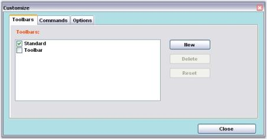
{:.image }

Size Settings

Size and the client size of the Customize Dialog can be controlled using the Size property as follows.

[C#]

//to change the size of entire dialog

this.mainFrameBarManager1.CustomizationDialog.Size = new Size(700, 800);

//to change the client area

this.mainFrameBarManager1.CustomizationDialog.ClientSize = new Size(600, 700);

[VB.NET]

'to change the size of entire dialog 

Me.mainFrameBarManager1.CustomizationDialog.Size = New Size(700, 800)

'to change the client area 

Me.mainFrameBarManager1.CustomizationDialog.ClientSize = New Size(600, 700)

###### Multiline Support for ParentBarItem in MainFrameBarManager

You can customize and display the ParentBarItem text in Multiline format by using “MultiLine” property. 

API Details:

_Table_ _508__: Property Table_

<table>
<tr>
<td>
Property</td><td>
Type</td><td>
Description</td></tr>
<tr>
<td>
MultiLine</td><td>
Boolean</td><td>
Enables MultiLine in MainFrameBarManager</td></tr>
</table>

The following code example illustrates how to set MultiLine property in C# and VB language.

[C#]

  this.parentBarItem1.MultiLine = true;

[VB]

    Me.parentBarItem1.MultiLine = true

The following screenshot shows how the ParentBarItem is displayed in Multiline.

{:.image }

###### Text Orientation in ParentBarItem of MainFrameBarManager

You can align the ParentBarItem text in vertical or horizontal manner by using “Orientation” property.

Horizontal Alignment:

The following image illustrates how the parent bar items are displayed in horizontal alignment.

{:.image }

{:.image }

Vertical Alignment:

The following image illustrates how the parent bar items are displayed in vertical alignment.

{:.image }

API Details:

_Table_ _509__: Property Table_

<table>
<tr>
<td>
### Property  </td><td>
### Type  </td><td>
### Description  </td></tr>
<tr>
<td>
### Orientation  </td><td>
enum</td><td>
Gets or sets the text alignment of ParentBarItem in MainframeBarManager.</td></tr>
</table>

The following code example shows how to set the vertical and horizontal text alignment.

[C#]

// To set Vertical text alignment.

this.parentBarItem1.Orientation= Syncfusion.Windows.Forms.Tools.XPMenus.Orientation.Vertical;

// To set Horizontal text alignment.

this.parentBarItem1. Orientation=Syncfusion.Windows.Forms.Tools.XPMenus.Orientation.Vertical;

[VB.NET]

// To set Vertical text alignment.

Me.parentBarItem1. Orientation= Syncfusion.Windows.Forms.Tools.XPMenus. Orientation.Vertical

// To set Horizontal text alignment.

Me.parentBarItem1. Orientation= Syncfusion.Windows.Forms.Tools.XPMenus. Orientation.Vertical

