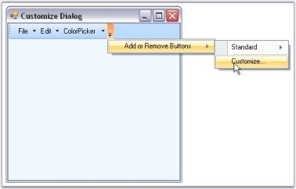

# Features

The Menus Framework allows you to create Menus and toolbars using an easy-to-use MainFrameBarManager and ChildFrameBarManager components. The BarItems required on the menus and toolbars can be dragged-and-dropped at any appropriate position in the menus and toolbars. 

XPToolbars used to provide a toolbar look and feel that can be dragged-and-dropped on the form. XPToolbars can also be docked or floated as required. CommandBars can be dragged-and-dropped on to the form to implement the framework support that is required for Visual Studio .NET type dockable / floatable menus and toolbars.

The Essential Tools Menus package comes with the XP Menus framework which provides users the latest Office XP and Office 2007 look and feel and functionality for menus, toolbars and context menus.

Users may create full-fledged VS .NET and Office-like applications using the menus, docking and tabbed MDI packages as demonstrated in the sample located under the 

…\_My Documents\Syncfusion\EssentialStudio\Version Number\Windows\Tools.Windows\Samples\Advanced Editor Functions\ActionGroupingDemo_

 

## Key Features

* Custom Colors can be applied for Menus. See Visual Styles topic.

* Added Save - Load BarItem Customization feature that allows users to save / load custom baritems, which were created and added during application runtime. 
* Added AutoSaveCustomData and AutoLoadCustomData properties. Added SaveCustomData and LoadCustomData methods.

## Toolbar

* It allows the user to add toolbars, bar items onto the form without adding a single line of code.
* Provides ability to customize the toolbars and menus at run time easily as shown below.

 

* Custom colors can be applied to the Toolbars.
* BarManager lets the end users to display large or small icons in the toolbars.
* XP toolbars can be dragged and dropped at any appropriate position inside the form.
* CommandBars and ControlBars (TaskPane Toolbars as in Microsoft Office) are used to generate dockable and floatable toolbars as in Microsoft Office on the form.

## Menus

XP Menus framework allows you to create elegant menus and menu items on the toolbar and provides the following features.

* Supports multi-level cascading menus as in Microsoft Office.
* Can create multiple menus on a single form.
* Advanced features like adding separators in-between the bar items, Grouping the items etc., are supported.
* Rich set of menu items supported in XP menus framework.
* ParentBarItem
* ComboBoxBarItem
* DropDownBarItem
* ListBarItem
* StaticBarItem
* ToolBarListBarItem
* MDIListBarItem - used on a PopupMenu to display a list of the currently available MDI child windows along with the standard MDI window commands such as Cascade, Tile, and so on
* TextBoxBarItem
* Supports following Menu Styles.
* Menus with check mark.
* Menus with Image support.
* Menus with different back color, fore color and font styles.
* Menus with docking/floating and tabbed style.
* Menus with mnemonics.
* Menus with MRU list.
* Menus with FontList, ColorPalette.
* Partial menus.

## Popup Menu

A Popup menu represents a context menu which will be displayed when the user right clicks on any item.

* Popup menu can be shown over any control, anywhere in an application.
* Provides ability to group the menu items in the Popup menu.

## MDI support

* The XP Menus framework goes to a great extent to support associating menus and toolbars for MDIChild forms.
* Provides complete support for automaticMDI menu merging.

## Look and Feel

* Supports Office 2007 color themes (blue, silver and black).
* Supports latest GUI style.
* Supports Office 2007 look and feel.
* Custom Colors can be applied to the menus using the MenuColors, Office2003Colors and Office2007Colors classes.

## Persisting Bar state

The bar state can be persisted across multiple applications in the following formats.

* Binary file
* XML file
* Isolated storage medium
* Windows Registry

## SuperToolTip support

The BarItems in XPMenus provides SuperToolTip support. Other than the usual tooltip XPMenus now allows users to associate a SuperToolTip to the BarItems.

Miscellaneous Features

* Extensive keyboard support.
* Visual Inheritance Support
* Localization support.
* Provides full range of events that signal your application when any toolbar or menu activity occurs. 
> Note: SDI (Single Document Interface) is a Windows function that allows an application to display only one document at a time. SDI requires the user to load another instance of the application to work with two or more documents.

MDI (Multiple Document Interface) is a Microsoft Windows programming interface for creating an application that enables users to work with multiple documents at the same time. Each document is in a separate space with its own controls for scrolling.

## Advantages

* Offers an incredible amount of flexibility over the look and feel of its controls.
* Entire product is written in 100% native C# code which fully takes the advantage of what the .NET framework has to offer.
* Easy to use.
* Applicable for both Single Document Interface (SDI) and Multiple Document Interface (MDI). 
* Avoids complex coding.

See Also

Concepts and Features