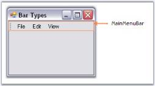

# Bar Types

XPMenus Framework defines the below three types of bars based on the BarStyle property.

## MainMenuBar

This is a horizontal menu that appears on top of a window. By default, each option in a menu bar is associated with a pull-down menu. 

For MainMenuBars, BarStyles IsMainMenuBar option will have to be checked. There can be only one menu bar at the top of the screen. The MainMenuBar is always visible and it fills the entire dock area row on which it appears.

 

## Standard Bar

This is a horizontal menu that appears on top of a window with BarStyle 'IsMainMenu' option Unchecked. It does not fill the entire dock area row on which it appears. Other toolbars can also be docked on the same row. It gives 'Customize toolbar' options.

 

## Status Bar

This is a horizontal menu that appears on the bottom of a window and has the BarStyle 'IsStatusBar' checked. Any number of static bar items can be added to it.

 

See Also

Bar Items, BarManagers, Bar Styles