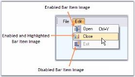

# Image Settings

The properties which let you set images for the menu items are as follows.

_Table482: Property Table_

<table>
<tr>
<th>
BarItem Property</th><th>
Description</th></tr>
<tr>
<td>
Image</td><td>
Default image displayed in the bar item.</td></tr>
<tr>
<td>
ImageIndex</td><td>
Image index of the image.</td></tr>
<tr>
<td>
ImageList</td><td>
Indicates the ImageList.</td></tr>
</table>

By selecting the imagelist using Imagelist property and choosing the index of the image through ImageIndex property, we can display images. The images can also be directly set by using the Image property.



this.barItem2.Image = ((Syncfusion.Windows.Forms.Tools.XPMenus.ImageExt)(resources.GetObject("barItem2.Image")));

this.barItem2.ImageList = this.imageList1;

this.barItem2.ImageIndex = 2;





Me.barItem2.Image = DirectCast((resources.GetObject("barItem2.Image")), Syncfusion.Windows.Forms.Tools.XPMenus.ImageExt)

this.barItem2.ImageList = this.imageList1;

this.barItem2.ImageIndex = 2;


## Images for Highlighted and Disabled Menu Items

A BarItem can be enabled or disabled Enabled property. Images for disabled (Enabled - False) or enabled (Enabled - True) bar items can be specified in DisabledImage or HighlightedImage properties. 

DisabledImageList, DisabledImageIndex or HighlightedImageList, HighlightedImageIndex properties can also be used instead.

_Table483: Property Table_

<table>
<tr>
<th>
BarItem Property</th><th>
Description</th></tr>
<tr>
<td>
DisabledImage</td><td>
Sets image for disabled bar item, when Enabled = false.</td></tr>
<tr>
<td>
DisabledImageList</td><td>
ImageList for the disabled bar items.</td></tr>
<tr>
<td>
DisabledImageIndex</td><td>
ImageIndex for the disabled bar item.</td></tr>
<tr>
<td>
DisabledLargeImageList</td><td>
ImageList for the disabled bar item when BarManager is in LargeIcons mode.</td></tr>
<tr>
<td>
HighlightedImage</td><td>
Sets image for highlighted bar item, the bar item is enabled.</td></tr>
<tr>
<td>
HighlightedImageList</td><td>
ImageList for the highlighted bar item.</td></tr>
<tr>
<td>
HighlightedImageIndex</td><td>
ImageIndex for the highlighted bar item.</td></tr>
<tr>
<td>
HighlightedLargeImageList</td><td>
ImageList for the highlighted bar item when BarManager is in LargeIcons mode.</td></tr>
</table>

 

 

## Setting images for bar items when it is pressed

You can set the image for the bar item when it is pressed. You need to associate the corresponding ImageList to the PressedImageList property of bar item and you can set the image index using PressedImageIndex property. Similarly you can associate ImageListAdv with PressedImageListAdv property.

> Note: It is required to set image to Baritem before it is pressed.



this.barItem1.Image = image;

this.barItem1.PressedImageIndex = 0;

this.barItem1.PressedImageListAdv = this.imageListAdv1;





Me.barItem1.Image = image

Me.barItem1.PressedImageIndex = 0

Me.barItem1.PressedImageListAdv = Me.imageListAdv1


See Also

Types of Bar Items