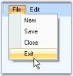

# ParentBarItem

A ParentBarItem represents a submenu (drop-down menu) which can display one or more child BarItems on drop-down. A ParentBarItem can be placed inside a toolbar and it can contain another ParentBarItem as its child bar item. ParentBarItem comes with properties to control its appearance and behavior.

 

## Behavior Settings

The following propertieslet you control the behavior of the ParentBarItem.

_Table472: Property Table_

<table>
<tr>
<th>
ParentBarItem Property</th><th>
Description</th></tr>
<tr>
<td>
Checked</td><td>
Draws the bar item with a checked appearance.</td></tr>
<tr>
<td>
Enabled</td><td>
Enables or disables the bar item. Default value is true.</td></tr>
<tr>
<td>
IsRecentlyUsedItem</td><td>
Indicates whether this item will appear in its parent's partial menus list.</td></tr>
<tr>
<td>
Visible</td><td>
Sets the visibility of the bar item.</td></tr>
<tr>
<td>
MergeOrder</td><td>
Relative Position of the bar item when it is merged with another.</td></tr>
<tr>
<td>
MergeType</td><td>
Sets behavior of the bar item when its bar is merged with another. The options are,Add - Adds to the existing menu items. (Default)Replace - Replaces an existing menu items at the same position in a merged menu.MergeItems - Merged with an existing menu items at the same position in a merged menu.Remove - Menu item will not be included in the merged menu.</td></tr>
<tr>
<td>
Customizable</td><td>
Specifies whether the bar item is involved in the customization.</td></tr>
<tr>
<td>
ParentStyle</td><td>
Specifies the ParentStyle on which the menu will be drawn. The options are,Default (Default),DropDown.</td></tr>
<tr>
<td>
Padding</td><td>
Gets or sets padding for items.</td></tr>
<tr>
<td>
ScrollingSpeed</td><td>
Specifies the scrollingspeed for the displayed child menu items.</td></tr>
<tr>
<td>
ScrollOnMouseMove</td><td>
Specifies scroll items in menu when mouse moves over scroll buttons.</td></tr>
<tr>
<td>
UsePartialMenus</td><td>
Specifies whether ParentBarItem will first show a list of  recently used items and an Expand button when dropped down.</td></tr>
<tr>
<td>
ShowMnemonicUnderlinesAlways</td><td>
It indicates whether to show underlines with mnemonic always.</td></tr>
</table>

## Merging

XPMenus FrameWork lets you merge menu items of different ParentBarItems using MergeItems method.

_Table473: Property Table_

<table>
<tr>
<th>
ParentBarItem Method</th><th>
Description</th></tr>
<tr>
<td>
MergeItems</td><td>
Merges BarItems of one ParentBarItem with another ParentBarItem. Two ParentBarItems can be merged into one, based on the MergeOrder and MergeType properties of its children (/ menu item). Parameter is,parentItemSrc - The ParentBarItem which is merged with this ParentBarItem.</td></tr>
</table>

 



//Setting merge order and merge type of bar item5 (List) of ParentBarItem2

this.barItem5.MergeOrder = 0;

this.barItem5.MergeType = MenuMerge.MergeItems;

//Merging parentbaritem2 menu items to parentbaritem1

this.parentBarItem1.MergeItems(parentBarItem3);

'Setting merge order and merge type of bar item5 (List) of ParentBarItem2

Me.barItem5.MergeOrder = 0

Me.barItem5.MergeType = MenuMerge.MergeItems

'Merging parentbaritem2 menu items to parentbaritem1

Me.parentBarItem1.MergeItems(parentBarItem3)



 

## Parent Style

The following figures display the parent styles.

  

## Partial Menus

The ParentBarItem can hide some of its menu items and display them on clicking an expand button at the bottom of the menu list, by using the UsePartialMenus and IsRecentlyUsedItem properties. With this feature we can display only the recently used items and can hide the rest. We can do this in ParentBarItem.BeforePopup event.

_Table474: Property Table_

<table>
<tr>
<th>
BarManager Property</th><th>
Description</th></tr>
<tr>
<td>
ExpandPartialMenusAfterDelay</td><td>
Enables automatic expansion of the partial menus into full menus after a delay.</td></tr>
<tr>
<td>
UsePartialMenus</td><td>
Enables or disables partial menus mode in submenus.</td></tr>
<tr>
<td>
PartialMenusResetDelay</td><td>
Specifies the delay in days after an item's recently used setting will be replaced.</td></tr>
</table>

> Note: To know all the properties of BarManager, click here.

 

## Applying Partial Menus

_Table475: Event Table_

<table>
<tr>
<th>
ParentBarItem Event</th><th>
Description</th></tr>
<tr>
<td>
BeforePopUp</td><td>
Handled before the popup menu is shown. Parameter is,cancel - lets you cancel the menu display.</td></tr>
</table>



this.parentBarItem1.UsePartialMenus = true;

private void parentBarItem1_BeforePopup(object sender, System.ComponentModel.CancelEventArgs e)

{

    // Hide New and Close BarItems in the partial menu

    this.barItem1.IsRecentlyUsedItem = false;

    this.barItem3.IsRecentlyUsedItem = false;

}

Me.parentBarItem1.UsePartialMenus = True

Private Sub parentBarItem1_BeforePopup(ByVal sender As Object, ByVal e As System.ComponentModel.CancelEventArgs)

    ' Hide Open and Close BarItems in the partial menu 

    Me.barItem1.IsRecentlyUsedItem = False

    Me.barItem3.IsRecentlyUsedItem = False

End Sub



 

## Other Common properties

For setting images see Image Settings

For Editing the text and setting text alignments, see BarItem Text

For setting shortcuts for the bar items, see Keyboard shortcuts and 

For changing the Paint Style, see PaintStyle topic. 

Appearance of the Text can be customized. See Foreground Settings for details.

See Also

UI Command Update Patterns,

MainFrameBarManager Properties,

Customize Dialog