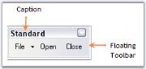

# Toolbar Properties

The properties of a toolbar are as follows.

_Table468: Property Table_

<table>
<tr>
<th>
Bar Property</th><th>
Description</th></tr>
<tr>
<td>
Items</td><td>
Collection of bar items representing the menu items in the toolbar. This invokes the customize dialog at design time.</td></tr>
<tr>
<td>
AllowCustomizing</td><td>
Indicates whether dragging and dropping of bar items into the bar is allowed or not, at run time.</td></tr>
<tr>
<td>
AllowItemsReorderOnShrunk</td><td>
When the toolbar shrunk to show more bar items, the bar items will be automatically reordered, when AllowItemsReorderOnShrunk property is set to true. The default value is true.</td></tr>
<tr>
<td>
Bar Styles</td><td>
Specifies the BarStyle.</td></tr>
<tr>
<td>
AllowHiding </td><td>
Specifies if the toolbar can be hidden by the user at run time. By default this property is true. When this is set to false, user will not be able to hide the toolbar at run time, as the checkbox will be disabled at run time.</td></tr>
</table>

## Default Docking

The XPMenus bar can be docked on any of the four sides of the host form, both at design time and run time, without a single property setting. This is an in-built feature in the XPMenus. 

## Floating Bar Properties

_Table469: Property Table_

<table>
<tr>
<th>
Bar Property</th><th>
Description</th></tr>
<tr>
<td>
AllowResizing</td><td>
Specifies whether to allow resizing of the toolbar when the toolbar is floating.</td></tr>
</table>

 

_Table470: Property Table_

<table>
<tr>
<th>
Bar Property</th><th>
Description</th></tr>
<tr>
<td>
BarName</td><td>
Name of the toolbar.</td></tr>
<tr>
<td>
Caption</td><td>
Caption for the toolbar which is displayed in floating mode.</td></tr>
</table>

 

See Also

How To Reset Bar To The Designer State?

How to show or hide close and dropdown buttons of a floating bar in XPMenus?