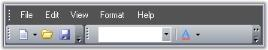

# Visual Styles

The Visual appearance of the menus can be defined by using various Visual Styles and Themes.

Themes define the look and feel of the whole menu and it also changes the behavior of the menu. Themes can be enabled by setting ThemesEnabled property of mainFrameBarManager to true.

 

 

## Supported GUI styles

The supported Visual styles are:

* Office 2003 look: This can enabled by setting Style to Office2003.

 

* OfficeXP look: This can enabled by setting Style to OfficeXP.

 

* VS2005 look: This can enabled by setting Style to VS2005.

 

* Office 2007 look:This can enabled by setting Style to Office2007.

* Office 2007 Outlook:This can enabled by setting Style to Office2007Outlook.

 



this.mainFrameBarManager1.Style = VisualStyle.Office2003;  




Me.mainFrameBarManager1.Style = VisualStyle.Office2003

Office 2007 Themes

You can also specify the color schemes for Office 2007 visual styles. They can be blue, silver and black.

> Note: The property ThemesEnabled must be set to true and the property Style must be set to either Office2007 or Office2007Outlook.



this.mainFrameBarManager1.Style = VisualStyle.Office2007;     

this.mainFrameBarManager1.Office2007Theme = Office2007ColorScheme.Blue;




Me.mainFrameBarManager1.Style = VisualStyle.Office2007

Me.mainFrameBarManager1.Office2007Theme = Office2007ColorScheme.Blue



 

 

 

## Custom Colors

We can also apply custom colors to the MainFrameBarManager by setting Office2007Theme to "Managed" and specifying the custom color through the ApplyManagedColors method as follows.



this.mainFrameBarManager1.Office2007Theme = Syncfusion.Windows.Forms.Office2007Theme.Managed;

Office2007Colors.ApplyManagedColors(this, Color.Crimson);




Me.mainFrameBarManager1.Office2007Theme = Syncfusion.Windows.Forms.Office2007Theme.Managed;

Office2007Colors.ApplyManagedColors(Me, Color.Crimson)


