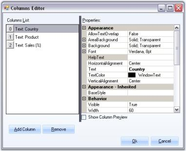
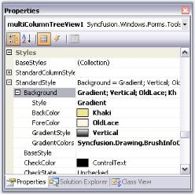

## MultiColumnTreeView

MultiColumnTreeView is an advanced treeview control with multiple columns. This control displays the contents in the form of tree with additional columns displaying related data for the tree nodes. With its robust features, it gives a visually appealing tree structure. It supports almost all the features of the treeview control like settings images, check box and option buttons, help text capabilities, Gutter space, Indent Space, advanced drag-and-drop UI support, context-menu association, gradient backgrounds and multiple border styles, etc., 

MultiColumnTreeView comes with complete design-time support. The Styles Architecture for the control lets the users to define styles for nodes at different levels of the tree and columns style for individual columns.

{:.image }

#### Features Overview

MultiColumnTreeView control has the below features.

Features

* Styles Architecture - Supports a flexible style architecture to let users define the styles for nodes at different levels of the Tree. It helps the users to specify the styles for a specific node or for a class of nodes.
* Columns - Lets you add multiple columns and subitems.
* Checkbox and Option Buttons support - Interactive check boxes that could be checked or unchecked, which will indicate the check state of the child node's check boxes. Node can also hold option buttons.
* Node Images - Tree nodes can hold left images, right images and images for different state of the nodes like expand and collapse.
* Load on demand - Enhances the performance by reducing the loading time of the nodes by displaying the nodes only on demand by the user. This provides the user to delay the loading of nodes in Trees, until the user initiates the nodes to expand.
* Customizing nodes - Allows you to edit and customize the nodes at all levels.
* LabelEdit _-_ property that helps users to easily edit the node text at run time.
* Nodes selection - allows to select a single node or select all the nodes or only the specified nodes.
* OwnerDrawNodes - property that allows user to paint the background of the node. 
* Text Color - option to customize node text color.
* Font - option to change the node's font.
* Helptext - can be enabled for each and every nodes in the first column. Each nodes can display its own information.
* Scroll support - Provides automatic scrolling support for the treeview controls as well as hidden nodes when the mouse is near the borders. 
* Sorting - Different types of sorting can be performed for the tree nodes like ascending, descending.
* Office2007ScrollBars - TreeViewAdv provides support for Office2007Scrollbars with all the three color schemes.
* ToolTip - Allows us to show and hide tooltips for the nodes in the first column wherever necessary.
* Drag and Drop - Provides support for advanced drag and drop of the nodes.
* Context Menus - TreeViewAdv has the ability to associate context menus with the option to show and hide wherever necessary. This pops up when right mouse button is clicked on a tree node.
* Custom Control - Support for custom control feature allows to add custom controls to the tree node of the first column alone.
* Multiline Support for Nodes - TreeNodeAdv has now provided option to enable multiline text for each node by using the Multiline property which is available for individual nodes. This can be set through NodeCollection Editor and it has to be set for individual nodes.
* Appearance - The control provides the background and foreground properties for customizing the appearance of the control.
* Enhanced performance - TreeViewAdv control can be populated with large number of nodes on node expand / collapse. The performance while populating the TreeViewAdv with large number of nodes can be improved by the SuspendExpandRecalculate property.

See Also

Concepts and Features

#### Creating a MultiColumnTreeView

To create a MultiColumnTreeView control, follow the steps that are given below.

1. Open your form in the designer. Add the Syncfusion controls to your VS .NET toolbox if you haven't done so already (the install would have automatically done this unless you selected not to complete toolbox integration during installation).

{:.image }

2. Drag and drop the MultiColumnTreeView control on to the form.
3. Open the Nodes Collection Editor, add required nodes using Add nodes and Add Child buttons. 
4. You can add columns using Columns Editor by clicking add columns button. 
5. The Subitems can be added through SubItems Collection Editor available in the Nodes Collection Editor. You can add any number of columns using this collection. Refer Adding Multiple Columns and SubItems.
6. Appearance and behavior related aspects can be controlled by setting the appropriate properties through the property grid of the MultiColumnTreeView control. 
7. A simple MultiColumnTreeView with three columns is displayed below.

{:.image }

8. Namespace to be added while creating programmatically.

[C#]

using Syncfusion.Windows.Forms.Tools.MultiColumnTreeView;

[VB.NET]

Imports Syncfusion.Windows.Forms.Tools.MultiColumnTreeView

See Also

Adding Multiple Columns and SubItems

Concepts and Features

#### Concepts and Features

This section discusses the features of the MultiColumnTreeView Control. Following are the topics covered.

* TreeNode Features - Discusses the tree node specific features.
* Drag and Drop - Discusses drag and drop feature of the nodes and related concepts.
* RunTime Features - Discusses the features at run time like context menu, tooltip, and so on.
* MultiColumnTreeView Appearance - Discusses all the properties for customizing the treeview appearance.
* Styles Architecture - Elaborates the styles architecture for the tree view.
* LoadOnDemand - Describes the load on demand concepts.
* Sorting - Guides you to sort unlimited number of columns in a MultiColumnTreeView.
* Performance - Gives the properties and methods which can improve the performance of the control.
##### Adding Multiple Columns and SubItems

This section will guide you in adding multiple columns and sub items in a MultiColumnTreeView control.

###### Multiple Columns

Adding Multiple Columns

MultiColumnTreeView control lets you add multiple columns easily using Columns Editor. The SubItems can be added using the SubItems Collection Editor. There are also properties to modify the appearance of the columns.

{:.image }

This dialog can be accessed using the context menu of the control or the command available at the bottom of the property grid. The context menu also lets you add columns directly using "Add Column".

Customizing the columns using Columns Editor

The below properties can be used to customize the columns.

_Table_ _520__: Property Table_

<table>
<tr>
<td>
TreeColumnAdv Properties</td><td>
Description</td></tr>
<tr>
<td>
AllowTextOverlap</td><td>
Indicates whether the text can overlap or not. By default it false.</td></tr>
<tr>
<td>
Background</td><td>
Sets the background for the column (column header).</td></tr>
<tr>
<td>
Font</td><td>
Sets the foreground style for the columns.</td></tr>
<tr>
<td>
HelpText</td><td>
Sets the help text for the columns.</td></tr>
<tr>
<td>
HorizontalAlignment</td><td>
Sets the horizontal alignment of the text in the columns.</td></tr>
<tr>
<td>
Text</td><td>
Sets text for the columns.</td></tr>
<tr>
<td>
TextColor</td><td>
Sets the text color for the columns.</td></tr>
<tr>
<td>
Vertical Alignment</td><td>
Sets the vertical alignment of the text in the columns.</td></tr>
<tr>
<td>
BaseStyle</td><td>
Sets the base style to be applied to the column.</td></tr>
<tr>
<td>
Visible</td><td>
Sets the visibility of the particular column.</td></tr>
<tr>
<td>
Width</td><td>
Specifies Column width.</td></tr>
<tr>
<td>
Border3DStyle</td><td>
Sets the 3D border style for the column.</td></tr>
<tr>
<td>
BorderColor</td><td>
Border color for the column.</td></tr>
<tr>
<td>
BorderSides</td><td>
Specifies the sides of the column which should have border.</td></tr>
<tr>
<td>
BorderStyle</td><td>
Sets 2D or 3D border. The options are,FixedSingle andFixed3D.</td></tr>
<tr>
<td>
BorderSingle</td><td>
Specifies the 2D border style for the columns, when BorderStyle is set to Fixed Single. The options are, Dotted,Dashed, Solid,Inset andOutset.</td></tr>
<tr>
<td>
Comparer</td><td>
Comparative value for sorting.</td></tr>
<tr>
<td>
SortOrder</td><td>
Specifies the sort order for the column.</td></tr>
<tr>
<td>
LeftImage</td><td>
Sets the left image for the column.</td></tr>
<tr>
<td>
LeftImageIndices</td><td>
Specifies the left image index.</td></tr>
<tr>
<td>
RightImageIndices</td><td>
Specifies the right image index.</td></tr>
<tr>
<td>
LeftImagePadding</td><td>
Sets the padding of the left image.</td></tr>
<tr>
<td>
RightImagPadding</td><td>
Sets the padding of the right image.</td></tr>
<tr>
<td>
RightImage</td><td>
Sets the right image for the column.</td></tr>
</table>
> 
{:.image }
 _Note: The TreeColumnAdv1.Background settings overrides the MultiColumnTreeView.ColumnsHeaderBackground property settings for individual column headers._

Painting the Column Area

_Table_ _521__: Property Table_

<table>
<tr>
<td>
TreeColumnAdv Property</td><td>
Description</td></tr>
<tr>
<td>
AreaBackground</td><td>
Gets / sets the background for the column area.</td></tr>
</table>

[C#]

treeColumnAdv1.AreaBackground = new Syncfusion.Drawing.BrushInfo(Syncfusion.Drawing.GradientStyle.BackwardDiagonal, System.Drawing.Color.CadetBlue, System.Drawing.Color.PowderBlue);

treeColumnAdv1.Background = new Syncfusion.Drawing.BrushInfo(Syncfusion.Drawing.GradientStyle.Vertical, System.Drawing.Color.CadetBlue, System.Drawing.Color.Azure);

treeColumnAdv2.AreaBackground = new Syncfusion.Drawing.BrushInfo(System.Drawing.Color.PowderBlue);

treeColumnAdv2.Background = new Syncfusion.Drawing.BrushInfo(Syncfusion.Drawing.GradientStyle.Vertical, System.Drawing.Color.CadetBlue, System.Drawing.Color.Azure);

treeColumnAdv3.AreaBackground = new Syncfusion.Drawing.BrushInfo(System.Drawing.Color.LightBlue);

treeColumnAdv3.Background = new Syncfusion.Drawing.BrushInfo(Syncfusion.Drawing.GradientStyle.Vertical, System.Drawing.Color.CadetBlue, System.Drawing.Color.Azure);

[VB.NET]

treeColumnAdv1.AreaBackground = New Syncfusion.Drawing.BrushInfo(Syncfusion.Drawing.GradientStyle.BackwardDiagonal, System.Drawing.Color.CadetBlue, System.Drawing.Color.PowderBlue) 

treeColumnAdv1.Background = New Syncfusion.Drawing.BrushInfo(Syncfusion.Drawing.GradientStyle.Vertical, System.Drawing.Color.CadetBlue, System.Drawing.Color.Azure) 

treeColumnAdv2.AreaBackground = New Syncfusion.Drawing.BrushInfo(System.Drawing.Color.PowderBlue) 

treeColumnAdv2.Background = New Syncfusion.Drawing.BrushInfo(Syncfusion.Drawing.GradientStyle.Vertical, System.Drawing.Color.CadetBlue, System.Drawing.Color.Azure) 

treeColumnAdv3.AreaBackground = New Syncfusion.Drawing.BrushInfo(System.Drawing.Color.LightBlue) 

treeColumnAdv3.Background = New Syncfusion.Drawing.BrushInfo(Syncfusion.Drawing.GradientStyle.Vertical, System.Drawing.Color.CadetBlue, System.Drawing.Color.Azure) 

{:.image }

> 
{:.image }
 _Note: The appearance of the columns can also be controlled using the standard column styles settings._ _This overrides the above settings._

###### SubItems

Adding SubItems

You can add SubItems for the nodes using the SubItems Collection available in Nodes Collection Editor. 

{:.image }

{:.image }

Properties for Customizing the SubItems

The below properties lets you customize the subitems using the SubItems Collection dialog.

_Table_ _522__: Property Table_

<table>
<tr>
<td>
TreeNodeAdvSubItem Property</td><td>
Description</td></tr>
<tr>
<td>
Alignment</td><td>
Sets the alignment of the SubItem text.</td></tr>
<tr>
<td>
Background</td><td>
Sets the background for the subitem.</td></tr>
<tr>
<td>
LineAlignment</td><td>
Sets the vertical alignment of the subitem text.</td></tr>
<tr>
<td>
Text</td><td>
Sets the text for the SubItem.</td></tr>
<tr>
<td>
TextColor</td><td>
Sets the color for the SubItem text.</td></tr>
<tr>
<td>
Visible</td><td>
Sets the visibility of the subitem.</td></tr>
<tr>
<td>
BaseStyle</td><td>
Specifies the BaseStyle that it should inherit from.</td></tr>
<tr>
<td>
Border3DStyle</td><td>
Specifies the 3D style for the border.</td></tr>
<tr>
<td>
BorderColor</td><td>
Sets the border color.</td></tr>
<tr>
<td>
BorderSides</td><td>
Specifies the sides which should have borders.</td></tr>
<tr>
<td>
BorderSingle</td><td>
Specifies the 2D style for the border when BorderStyle is set to FixedSingle. Options are,Dotted,Dashed,Solid,Inset and Outset.</td></tr>
<tr>
<td>
BorderStyle</td><td>
Sets the border style, either FixedSingle or Fixed 3D</td></tr>
</table>

The below image displays subitems with similar settings in the property grid above.

{:.image }

StyleSettings for all the sub Items can be specified using TreeNodeAdvSubItemStyleInfo class. It is a default base style which can be accessed in the BaseStyles Collection Editor. See SubItem Styles.

See Also

Column Styles

MultiColumnTreeView Appearance

##### TreeNode Features

This section discusses the following topics.

* Primitives- Discusses various primitives available for the tree nodes. 
* Node Images - Discusses how to set the left, right and state images and also concepts like overlaying the images on the existing images. 
* Left, Right and State Images
* Expand and Collapse Image
* Line Images
* Image Overlaying - This feature can be only applicable for the first column or the tree structure. 
* Plus Sign On ExpandMode
> 

{:.image }
 _Note: The below properties can be applied only to the first column among the multiple columns._ 

* Checkbox and Option buttons - This section illustrates how to set the checkbox and option buttons for the tree nodes. 
* Multiline Support - This section discusses about the multiline support to the nodes. 
* Custom Controls - Illustrates the addition of CustomControls to the nodes in the control. 
###### MultiLine Support

TreeNodeAdv has multiline text option for each node by using the Multiline property. This can be set through NodeCollection Editor. We need to adjust the default Node height value to make it effective.

_Table_ _523__: Property Table_

<table>
<tr>
<td>
TreeNodeAdv Property</td><td>
Description</td></tr>
<tr>
<td>
Multiline</td><td>
Specifies if the node text is drawn as multiple text or single line.</td></tr>
</table>

The node text should be provided through code as shown in the code snippet below.

[C#]

treeNodeAdv1.Multiline = true;

treeNodeAdv1.Height = 100;

treeNodeAdv1.Text = "ICC \n World \n Cup \n 2007";

[VB.NET]

treeNodeAdv1.Multiline = True

treeNodeAdv1.Height = 100

treeNodeAdv1.Text = "ICC \n World \n Cup \n 2007"

The below image displays a node with multiline property set.

{:.image }

##### Drag and Drop

MultiColumnTreeView control also supports drag drop operation which lets you drag a complete row with multiple columns to the desired position.

{:.image }

This can be done similar to that of the treeview control. The only difference is that, in MultiColumnTreeView, we need to use the MultiColumnTreeView class instead of the TreeView class.

There are different selection modes for the nodes during drag drop. They are discussed in Node Selection topic.

See Also

Selection Settings While Drag Drop

Mouse and Keyboard Based Selection

Drag and Drop Events

##### RunTime Features

This section will walk you through the following runtime features of MultiColumnTreeViewAdv Control.

Refer TreeView Package > RunTime Features

> 
{:.image }
 _Note: Context Menu, Hot Tracking and Tooltip features can be applied only to the nodes in the first column._

##### DesignTime Features

MultiColumnTreeView provides the shortcuts to access various properties.

TaskWindow can be accessed using smart tag as follows.

{:.image }

The above window lets you open the NodeCollection Editor, modify the appearance settings, assign imagelists, enable options like editing the node text, load on demand, owner draw nodes and HotTracking properties. It also lets you set the layout settings for the control.

###### Context Menu at DesignTime

You can access the below options using this context menu at the design time.

* Nodes Editor, opens the NodeCollection Editor
* Columns Editor, opens the Columns Editor which lets you add columns.
* Add Columns, lets you directly add new columns.
* Styles Editor, opens the BaseStyles Collection Editor.
* Add Node, lets you add new nodes.

{:.image }

###### Editors for the MultiColumnTreeView

The following Editors are available for changing the appearance and behavior of the MultiColumnTreeView control.

TreeViewAdv NodeCollection Editor

This editor lets you add nodes, SubItems for the nodes and customize them using various property settings.

{:.image }

This editor can be accessed using the below options.

* Through the Context Menu of the control during designtime.
* Tasks Windows.
* Using MultiColumnTreeView.Nodes property in the property Grid.
* Command at the bottom of the property grid.

{:.image }

Columns Editor

This lets you add columns and customize those columns appearance with style settings.

{:.image }

This editor can be accessed using the following options.

* Through the Context Menu of the control during designtime.
* Using MultiColumnTreeView.Columns property in the property Grid.
* Command at the bottom of the property grid.

TreeNodeAdvSubItems Collection Editor

This editor lets you add subitems to the nodes and customize the subitems using the property settings. It can be accessed through Node Collection Editor and selecting the SubItems Collection property.

{:.image }

Styles Editor

This editor comes with default styles and also lets you add new style and apply to the nodes, subitems, and so on. The property settings are discussed in Styles Architecture.

{:.image }

This editor can be accessed using the below options.

* Through the Context Menu of the control during designtime.
* Using MultiColumnTreeView.BaseStyles property in the property Grid.
* Command at the bottom of the property grid.
##### MultiColumnTreeView Appearance

The appearance of the MultiColumnTreeView can be customized using background, foreground, border and spacing properties similar to TreeView control. The below topics are covered in this section.

SubItem Appearance

The background, foreground and border settings of a subitem can be specified using SubItem Style Editor. Refer to SubItem Styles for all the style settings.

[C#]

treeNodeAdvSubItem1.Background = new Syncfusion.Drawing.BrushInfo(System.Drawing.Color.SandyBrown);

treeNodeAdvSubItem1.Border3DStyle = System.Windows.Forms.Border3DStyle.SunkenInner;

treeNodeAdvSubItem1.BorderColor = System.Drawing.Color.SteelBlue;

treeNodeAdvSubItem1.BorderSingle = System.Windows.Forms.ButtonBorderStyle.Dotted;

treeNodeAdvSubItem1.BorderStyle = System.Windows.Forms.BorderStyle.FixedSingle;

treeNodeAdvSubItem1.TextColor = System.Drawing.Color.Navy;

treeNodeAdvSubItem2.Background = new Syncfusion.Drawing.BrushInfo(System.Drawing.Color.SandyBrown);

treeNodeAdvSubItem2.Border3DStyle = System.Windows.Forms.Border3DStyle.SunkenOuter;

treeNodeAdvSubItem2.BorderColor = System.Drawing.Color.SteelBlue;

treeNodeAdvSubItem2.BorderSingle = System.Windows.Forms.ButtonBorderStyle.Dotted;

treeNodeAdvSubItem2.BorderStyle = System.Windows.Forms.BorderStyle.FixedSingle;

treeNodeAdvSubItem2.TextColor = System.Drawing.Color.Navy;

[VB.NET]

treeNodeAdvSubItem1.Background = New Syncfusion.Drawing.BrushInfo(System.Drawing.Color.SandyBrown) 

treeNodeAdvSubItem1.Border3DStyle = System.Windows.Forms.Border3DStyle.SunkenInner 

treeNodeAdvSubItem1.BorderColor = System.Drawing.Color.SteelBlue 

treeNodeAdvSubItem1.BorderSingle = System.Windows.Forms.ButtonBorderStyle.Dotted 

treeNodeAdvSubItem1.BorderStyle = System.Windows.Forms.BorderStyle.FixedSingle 

treeNodeAdvSubItem1.TextColor = System.Drawing.Color.Navy 

treeNodeAdvSubItem2.Background = New Syncfusion.Drawing.BrushInfo(System.Drawing.Color.SandyBrown) 

treeNodeAdvSubItem2.Border3DStyle = System.Windows.Forms.Border3DStyle.SunkenOuter 

treeNodeAdvSubItem2.BorderColor = System.Drawing.Color.SteelBlue 

treeNodeAdvSubItem2.BorderSingle = System.Windows.Forms.ButtonBorderStyle.Dotted 

treeNodeAdvSubItem2.BorderStyle = System.Windows.Forms.BorderStyle.FixedSingle 

treeNodeAdvSubItem2.TextColor = System.Drawing.Color.Navy 

A MultiColumnTreeView with above settings is displayed below.

{:.image }

###### Column Appearance

The appearance of different columns can be customized through Column Styles settings. 

MultiColumnTreeView.ColumnHeaderBackground property sets the background column headers for the control. These settings are overridden by above ColumnStyles settings.

{:.image }

{:.image }

Adding HighlightBorderColor property

Essential tool is now enhanced with HighlightBorderColor property to set the highlight color of the column header in MultiColumnTreeView.

The following code illustrates how to set HighlightBorderColor property.

[C#]

this.treeColumnAdv1.HighlightBorderColor = Color.Brown;

[VB]

Me.treeColumnAdv1.HighlightBorderColor = Color.Brown;

{:.image }

##### Styles Architecture

The tree control employs an extensive Styles Architecture, that let users specify node styles globally, specifically for a class of nodes. This is possible by using a style information instance for each class of nodes, represented by a MultiColumnTreeView.TreeNodeAdvStyleInfo. Users will notice that for some of these classes of nodes, the style needs to be declared with a name at the tree level and stored in the tree's BaseStyles hatch table.

As illustrated below, implicit style inheritance is enforced by the framework while explicit style inheritance can be setup by the programmer. For all styles, explicit inheritance precedes implicit inheritance.

Implicit Style Inheritance

When a style is not set in a style info object, it inherits the style from the previous level and so on until it reaches the default global style on top of the hierarchy. This is called implicit style inheritance and is illustrated below.

* Node Specific Style: At the bottom of the hierarchy is the node specific style which lets users specify a style directly on a TreeNodeAdv. Refer Node specific Style.
* Node's Child Style: Each node also exposes a ChildStyle property where you can specify the style for the immediate children of that node. Refer Child Style for setting style of children nodes.
* Node Level Styles: The framework also lets you specify a style for all nodes at a particular level in the tree hierarchy, the top-most level being 1. Refer Node Level Style for setting node level style settings.
* Standard Style or Global Style: A standard, global style is exposed by the MultiColumnTreeViewAdv control to be applied on all the nodes in the tree. Refer Standard Style for setting style in a Tree level.
* Column Style : This lets you specify the styles for the columns.
* SubItem Style : This lets you specify the styles for the Sub Items of the nodes.

Explicit Style Inheritance

Any StyleInfo instance can also inherit explicitly from a specific named StyleInfo object. This can be done using the BaseStyle property of the TreeNodeAdvStyleInfo type. As noted previously, such named styles should be available in the tree control's BaseStyles Collection Editor. You can also add custom styles using this editor.

_Table_ _524__: Property Table_

<table>
<tr>
<td>
MultiColumnTreeView Property</td><td>
Description</td></tr>
<tr>
<td>
BaseStyle</td><td>
Indicates the base style of the nodes.</td></tr>
</table>

StandardStyle is the default style for the nodes. It can be edited using MultiColumnTreeView.StandardStyle property. It can also be edited through BaseStyles Collection Editor dialog.

The TreeViewAdv control provides the below default styles which can be edited through BaseStyles Collection Editor also. In BaseStyle Collection Editor, StandardColumnStyle represents Standard - Column, StandardStyle represents Standard Styles and StandardSubItemStyle represents Standard - SubItem. User can customize these styles and apply to specific nodes through Nodes Collection Editor.

_Table_ _525__: Property Table_

<table>
<tr>
<td>
MultiColumnTreeView Property</td><td>
Description</td></tr>
<tr>
<td>
StandardColumnStyle</td><td>
Indicates the default styles that all the columns will inherit.</td></tr>
<tr>
<td>
StandardStyle</td><td>
Indicates the styles that all the nodes inherit from.</td></tr>
<tr>
<td>
StandardSubItemStyle</td><td>
Indicates the style that all the subitems will inherit from.</td></tr>
</table>

{:.image }

User can also add their own styles using this BaseStyles Collection Editor. The styles which can be added by the users are as follows.

_Table_ _526__: Styles Table_

<table>
<tr>
<td>
BaseStyles</td><td>
Description</td></tr>
<tr>
<td>
BaseStyle</td><td>
Indicates the base style of the nodes.</td></tr>
<tr>
<td>
NodeLevelStyle</td><td>
Indicates the style specific to a node.</td></tr>
<tr>
<td>
ColumnStyle</td><td>
Indicates the default styles that all the columns will inherit.</td></tr>
<tr>
<td>
NodeSubItemStyle</td><td>
Indicates the style that all the subitems will inherit from.</td></tr>
</table>
###### Standard Style

Setting a Common Style for all the Nodes in the TreeViewAdv

We can modify the background for all the children of a parent node by editing the StandardStyle property. 

{:.image }

The below image displays a gradient style for all the columns of the MultiColumnTreeView control.

{:.image }

StandardStyle Settings

The below properties lets you customize the standard style settings.

_Table_ _527__: Styles Table_

<table>
<tr>
<td>
TreeNodeAdvSubItemStyleInfo Property</td><td>
Description</td></tr>
<tr>
<td>
Background</td><td>
Sets the background for the node.</td></tr>
<tr>
<td>
CheckColor</td><td>
Indicates the check color.</td></tr>
<tr>
<td>
CheckState</td><td>
Indicates the Check state of the node.</td></tr>
<tr>
<td>
Enabled</td><td>
Specifies if the node is enabled.</td></tr>
<tr>
<td>
EnabledButtons</td><td>
Specifies if the buttons are enabled for the node.</td></tr>
<tr>
<td>
Font</td><td>
Sets the font for the node text.</td></tr>
<tr>
<td>
Height</td><td>
Sets the height for the node.</td></tr>
<tr>
<td>
HelpText</td><td>
Sets the tooltip for the node.</td></tr>
<tr>
<td>
IntermediateCheckColor</td><td>
Specifies the color of intermediate check symbol.</td></tr>
<tr>
<td>
Multiline</td><td>
Indicate whether multiline is enabled for the node.</td></tr>
<tr>
<td>
OptionButtonColor</td><td>
Sets the color of the option button.</td></tr>
<tr>
<td>
SelectedOptionButtonColor</td><td>
Sets the color of the selected option button.</td></tr>
<tr>
<td>
ShowCheckBox</td><td>
Sets the visibility of the Checkbox.</td></tr>
<tr>
<td>
ShowOptionButton</td><td>
Sets the visibility of the option button.</td></tr>
<tr>
<td>
ShowPlusMinus</td><td>
Sets the visibility of the plus / minus control.</td></tr>
<tr>
<td>
TextColor</td><td>
Sets the text color.</td></tr>
<tr>
<td>
ThemesEnabled</td><td>
Indicated if the node's controls will be themed.</td></tr>
<tr>
<td>
BaseStyle</td><td>
Specifies the base style of the node.</td></tr>
<tr>
<td>
EnsureDefaultOptionedChild</td><td>
Specifies if atleast one child of the parent node should be optioned at all times.</td></tr>
<tr>
<td>
InteractiveCheckbox</td><td>
Sets the visibility of the InteractiveCheckbox for the node.</td></tr>
<tr>
<td>
ClosedImageIndex</td><td>
Indicates the imageindex for closed node.</td></tr>
<tr>
<td>
CollapseImageIndex</td><td>
Indicates the imageindex in the NodeStateImageList, when the node is collapsed.</td></tr>
<tr>
<td>
ExpandImageIndex</td><td>
Indicates the imageindex in the NodeStateImageList, when the node is Expanded.</td></tr>
<tr>
<td>
LeftImageIndices</td><td>
Specifies the ImageIndex for the left image.</td></tr>
<tr>
<td>
LeftImagePadding</td><td>
Padding for the left image.</td></tr>
<tr>
<td>
LeftStateImagePadding</td><td>
Padding for the left state image.</td></tr>
<tr>
<td>
NoChildrenImageIndex</td><td>
Indicates the imageindex in the StateImageList where node has no children.</td></tr>
<tr>
<td>
OpenImageIndex</td><td>
Indicates the imageindex for the open node.</td></tr>
<tr>
<td>
RightImageIndices</td><td>
Specifies the imageindex for the right image.</td></tr>
<tr>
<td>
RightImagePadding</td><td>
Padding for the right image.</td></tr>
<tr>
<td>
RightStateImagePadding</td><td>
Padding for the right state image.</td></tr>
<tr>
<td>
ComparerOptions</td><td>
Comparer options during sorting.</td></tr>
<tr>
<td>
Comparer</td><td>
IComparer object that compares two nodes.</td></tr>
<tr>
<td>
Culture</td><td>
Indicates the culture of the nodes during sorting.</td></tr>
<tr>
<td>
SortOrder</td><td>
Specifies the sort order of the node.</td></tr>
<tr>
<td>
SortType</td><td>
Specifies the sort type of the node.</td></tr>
</table>
###### Node Specific Style

Make a Node's Style Inherit from Another Base Style

Apart from the default style (Standard Style), we can also create custom Base styles using the BaseStyles Collection Editor. Select the Base Style option, then click Add Style.

{:.image }

This new base style can be applied to any of the nodes, using TreeNodeAdv.BaseStyle property of the respective nodes.

{:.image }

This overrides the Standard Style settings for the specified nodes and displays the image as follows.

{:.image }

Style Settings

The below properties lets you customize the Base style settings.

_Table_ _528__: Property Table_

<table>
<tr>
<td>
TreeNodeAdvSubItemStyleInfo Property</td><td>
Description</td></tr>
<tr>
<td>
Background</td><td>
Sets the background for the node.</td></tr>
<tr>
<td>
CheckColor</td><td>
Indicates the check color.</td></tr>
<tr>
<td>
CheckState</td><td>
Indicates the Check state of the node.</td></tr>
<tr>
<td>
Enabled</td><td>
Specifies if the node is enabled.</td></tr>
<tr>
<td>
EnabledButtons</td><td>
Specifies if the buttons are enabled for the node.</td></tr>
<tr>
<td>
Font</td><td>
Sets the font for the node text.</td></tr>
<tr>
<td>
Height</td><td>
Sets the height for the node.</td></tr>
<tr>
<td>
HelpText</td><td>
Sets the tooltip for the node.</td></tr>
<tr>
<td>
IntermediateCheckColor</td><td>
Specifies the color of intermediate check symbol.</td></tr>
<tr>
<td>
Multiline</td><td>
Indicate whether multiline is enabled for the node.</td></tr>
<tr>
<td>
OptionButtonColor</td><td>
Sets the color of the option button.</td></tr>
<tr>
<td>
SelectedOptionButtonColor</td><td>
Sets the color of the selected option button.</td></tr>
<tr>
<td>
ShowCheckBox</td><td>
Sets the visibility of the Checkbox.</td></tr>
<tr>
<td>
ShowOptionButton</td><td>
Sets the visibility of the option button.</td></tr>
<tr>
<td>
ShowPlusMinus</td><td>
Sets the visibility of the plus / minus control.</td></tr>
<tr>
<td>
TextColor</td><td>
Sets the text color.</td></tr>
<tr>
<td>
ThemesEnabled</td><td>
Indicated if the node's controls will be themed.</td></tr>
<tr>
<td>
BaseStyle</td><td>
Specifies the base style of the node.</td></tr>
<tr>
<td>
EnsureDefaultOptionedChild</td><td>
Specifies if at least one child of the parent node should be optioned at all times.</td></tr>
<tr>
<td>
InteractiveCheckbox</td><td>
Sets the visibility of the InteractiveCheckbox for the node.</td></tr>
<tr>
<td>
ClosedImageIndex</td><td>
Indicates the imageindex for closed node.</td></tr>
<tr>
<td>
CollapseImageIndex</td><td>
Indicates the imageindex in the NodeStateImageList, when the node is collapsed.</td></tr>
<tr>
<td>
ExpandImageIndex</td><td>
Indicates the imageindex in the NodeStateImageList, when the node is Expanded.</td></tr>
<tr>
<td>
LeftImageIndices</td><td>
Specifies the ImageIndex for the left image.</td></tr>
<tr>
<td>
LeftImagePadding</td><td>
Padding for the left image.</td></tr>
<tr>
<td>
LeftStateImagePadding</td><td>
Padding for the left state image.</td></tr>
<tr>
<td>
NoChildrenImageIndex</td><td>
Indicates the imageindex in the StateImageList where node has no children.</td></tr>
<tr>
<td>
OpenImageIndex</td><td>
Indicates the imageindex for the open node.</td></tr>
<tr>
<td>
RightImageIndices</td><td>
Specifies the imageindex for the right image.</td></tr>
<tr>
<td>
RightImagePadding</td><td>
Padding for the right image.</td></tr>
<tr>
<td>
RightStateImagePadding</td><td>
Padding for the right state image.</td></tr>
<tr>
<td>
ComparerOptions</td><td>
Comparer options during sorting.</td></tr>
<tr>
<td>
Comparer</td><td>
IComparer object that compares two nodes.</td></tr>
<tr>
<td>
Culture</td><td>
Indicates the culture of the nodes during sorting.</td></tr>
<tr>
<td>
SortOrder</td><td>
Specifies the sort order of the node.</td></tr>
<tr>
<td>
SortType</td><td>
Specifies the sort type of the node.</td></tr>
</table>
###### Node Level Style

Setting a Common Style for all the Nodes in a Level

TreeView lets you add node level styles using the BaseStyles Collection Editor. By default this style will be applied to all the nodes in the Level1 for NodeLevel1 style, Level2 for NodeLevel2 style and so on.

{:.image }

You can apply this style to any of the node by using TreeNodeAdv.BaseStyle property for a particular node. Refer to Style Settings table in Node Specific Style.

###### Column Styles

Standard - Column style is default style that will applied for all the columns of the MultiColumnTreeView control. The style settings can be edited by the user.

Column Style Properties

The below properties controls the appearance of the columns.

_Table_ _529__: Property Table_

<table>
<tr>
<td>
TreeColumnAdv Property</td><td>
Description</td></tr>
<tr>
<td>
AllowTextOverlap</td><td>
Indicates whether the text can overlap or not. By default it false.</td></tr>
<tr>
<td>
AreaBackground</td><td>
Gets / sets the background for the column area.</td></tr>
<tr>
<td>
Background</td><td>
Sets the background for the column (column header).</td></tr>
<tr>
<td>
Font</td><td>
Sets the foreground style for the columns.</td></tr>
<tr>
<td>
HorizontalAlignment</td><td>
Sets the horizontal alignment of the text in the columns.</td></tr>
<tr>
<td>
TextColor</td><td>
Sets the text color for the columns.</td></tr>
<tr>
<td>
Vertical Alignment</td><td>
Sets the vertical alignment of the text in the columns.</td></tr>
<tr>
<td>
BaseStyle</td><td>
Sets the base style to be applied to the column.</td></tr>
<tr>
<td>
Width</td><td>
Specifies Column width.</td></tr>
<tr>
<td>
Border3DStyle</td><td>
Sets the 3D border style for the column.</td></tr>
<tr>
<td>
BorderColor</td><td>
Border color for the column.</td></tr>
<tr>
<td>
BorderSides</td><td>
Specifies the sides of the column which should have border.</td></tr>
<tr>
<td>
BorderStyle</td><td>
Sets 2D or 3D border. The options are,FixedSingle andFixed3D.</td></tr>
<tr>
<td>
BorderSingle</td><td>
Specifies the 2D border style for the columns, when BorderStyle is set to Fixed Single. The options are, Dotted,Dashed, Solid,Inset andOutset.</td></tr>
</table>
Adding ColumnStyle

The editor also lets you add user defined column styles like other styles as follows.

{:.image }

The user-defined column style can be applied to any of the columns, using Columns Editor. This setting overrides the default settings.

{:.image }

###### SubItem Styles

Standard - SubItem style in the BaseStyles Collection Editor will be applied by default to all the subitems that are added to the tree nodes. User can also edit the default style settings.

Properties

The below properties lets you customize the subitems using the Styles editor.

_Table_ _530__: Property Table_

<table>
<tr>
<td>
TreeNodeAdvSubItemStyleInfo Property</td><td>
Description</td></tr>
<tr>
<td>
Alignment</td><td>
Sets the alignment of the SubItem text.</td></tr>
<tr>
<td>
Background</td><td>
Sets the background for the subitem.</td></tr>
<tr>
<td>
LineAlignment</td><td>
Sets the vertical alignment of the subitem text.</td></tr>
<tr>
<td>
TextColor</td><td>
Sets the color for the SubItem text.</td></tr>
<tr>
<td>
BaseStyle</td><td>
Specifies the BaseStyle that it should inherit from.</td></tr>
<tr>
<td>
Border3DStyle</td><td>
Specifies the 3D style for the border.</td></tr>
<tr>
<td>
BorderColor</td><td>
Sets the border color.</td></tr>
<tr>
<td>
BorderSides</td><td>
Specifies the sides which should have borders.</td></tr>
<tr>
<td>
BorderSingle</td><td>
Specifies the 2D style for the border when BorderStyle is set to FixedSingle. Options are,Dotted,Dashed,Solid,Inset and Outset.</td></tr>
<tr>
<td>
BorderStyle</td><td>
Sets the border style, either FixedSingle or Fixed 3D</td></tr>
</table>

User can add and define a SubItem style using the BaseStyles Collection Editor as follows.

{:.image }

See Also

Adding Multiple Columns and SubItems

