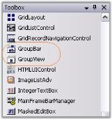
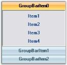
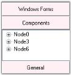
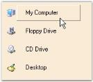
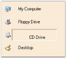
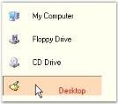
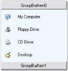
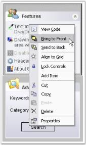

## Navigation Package

Navigation package is a combination of controls designed to help navigation through various types of UI tasks, tools and more. The controls can be combined together to mimic popular user interface trends. Using Navigation package you can create toolboxes, categorized lists and view switchers.

{:.image }

The following are the navigation controls that are primarily used for implementing command lists, where each command is represented by an image and / or text. 

Popular examples of command lists are the Microsoft OutlookBar, VS.NET Toolbox, Windows 2000 / XP Folder Selectors and the Windows XPTaskBar. A great design time experience ensures the toolkit to be easily integrated into your application.

General features of Navigation Package

* 100% managed code.
* Easy to design.
* Languages supported : C# and .NET.
* Environment supported : VS2003 and VS2005.
* Used in any Operating system.
* Provides look and feel.
* Simplifies navigation options.
#### GroupBar

The GroupBar and GroupView controls abide by the container-client model and are designed to work in perfect synchronization with each other.

The GroupBar class implements a tab-type container control similar to the Windows Forms TabControl that can serve as a host for other Windows Forms controls. Each control in the GroupBar is represented by a GroupBar Item and navigation between the different controls is accomplished by selecting the corresponding GroupBar Item. Only the selected control is displayed at any particular time.

The GroupBar may be used in combination with the GroupView control to implement clones of some of the popular UI components such as the Microsoft OutlookBar and the Visual Studio .NET toolbox window.

{:.image }

The Essential ToolsGroupBar control displays multiple groups or tabs, each of which represents a client control that is hosted within the GroupBar. 

The primary function of the GroupBar is to serve as a container for a group of functionally related controls while allowing only one selected control to be visible at any given time. Groups are implemented as instances of the GroupBarItem class and the collection can be accessed through the GroupBar.GroupBarItems property. 

##### Features Overview

This section discusses the features of the GroupBar control of the Navigation Package.

Features

* Custom Colors can be applied for GroupBar control. See Visual Styles topic.

{:.image }

* Appearance and Behavior Settings
* Settings can be applied to change the look and feel of the GroupBar control and Items.
* Full Appearance support including Alpha-Blending, Gradient Rendering, etc., is provided. 
* Various options are provided for customizing the border of the GroupBar and GroupBar Items, scrolling through the GroupBar client controls, highlighting GroupBar Items, etc.
* Provides Flat look and feel of the GroupBar. 
* Provides Localization support. 
* Link Selection Support 

You can either have a single selected link or several selected links in each individual GroupBar Item.

* Text Settings

Provides options to align the text of the GroupBar Items to the Left , Right or Center. 

GroupBar control provides options for renaming the GroupBar Items at run-time. This is described as the Inplace Renaming feature of the GroupBar control.

* Image Settings

Large images can be displayed on the header of the GroupBar. Images can also be displayed on the header of the Stacked GroupBar.

* Header Customization

Different colors can be applied to the header and header text of the GroupBar Items. The font and height of the header of the GroupBar control can also be customized.

* Stacked GroupBar

The GroupBar Items can be displayed in a Stack like fashion. Stacked GroupBar provides a Navigation Pane that can be viewed at the bottom of the Groupbar, which helps one to navigate to different sections of the GroupBar.

Ability to display the selected GroupBar Item's image on the header of the Stacked GroupBar.

* Nested GroupBar

          A GroupBar Control can be added as a Child control to another GroupBar Control.

In fact any .NET control can be hosted in a GroupBar for maximum flexibility. Thus the GroupBar control can be deployed as a Generic Control Container. 

* Visual Styles

Visual Styles like the Office XP Style, Office 2003 Style and Office 2007 Style are provided. The new Office2007Theme property provides the Office 2007 Visual Style with the color themes Blue, Black and Silver.

* Themes Support

Using the ThemesEnabled property, themed appearance can be provided for the GroupBar control. 

* Serialization Support

Serialization allows the user to save and restore the State information of the GroupBar Items when a GroupBar is in the Stacked Mode. 

##### Control Overview

The various sections of GroupBar and their description are given below.

{:.image }

GroupBar Items

GroupBar Items can be used to display text, images and child controls like TreeView, GroupView, etc. The GroupBar itself can be added as a child control to a GroupBar Item. 

The Appearance of the GroupBar Items can be customized using the various properties provided in the GroupBarItem Collection Editor. 

GroupBar Item Client Area

This is the area in which all the contents of the GroupBar Items are displayed. Borders can be set for the client area and the color of the borders can also be set.

##### Creating GroupBar

This tutorial will show you how a GroupBar is created through the following ways.

###### Through Designer

The GroupBar's designer allows you to add new groups using it's design-time verbs or the property browser, while adding a Child control to a group involves merely activating the particular group and dropping the control onto the GroupBar. 

To create a GroupBar through designer,

* Drag-and-drop a GroupBar object from the controls toolbox onto your form.

{:.image }

* To add a GroupBar Item using design-time verbs, follow the procedure given below.
* To add a GroupBar Item using the design-time verbs, right-click on the GroupBar and select the Add Group option. This adds a GroupBar Item to the GroupBar control.

{:.image }

* To add a GroupBar Item using the property browser, follow the procedure given below.
* In the Properties window, select the GroupBarItems property. The GroupBarItem Collection Editor will be opened. Click Add, a GroupBar Item will be added to the GroupBar control.

{:.image }

{:.image }

{:.image }

You can also add child controls to the GroupBar. Refer Integrating Child Controls to the GroupBarItem topic, for information on this topic.

See also

Concepts and Features

###### Through Code

The following code shows how to create a GroupBar control and add GroupBar Items to the control.

1. Include the required namespace.

[C#]

using Syncfusion.Windows.Forms.Tools;

[VB.NET]

Imports Syncfusion.Windows.Forms.Tools

2. Create instances of GroupBar and GroupBar Items.

[C#]

private Syncfusion.Windows.Forms.Tools.GroupBar groupBar1;

private Syncfusion.Windows.Forms.Tools.GroupBarItem groupBarItem1;

private Syncfusion.Windows.Forms.Tools.GroupBarItem groupBarItem2;

private Syncfusion.Windows.Forms.Tools.GroupBarItem groupBarItem3;

this.groupBar1 = new GroupBar();

this.groupBarItem1 = new GroupBarItem();

this.groupBarItem2 = new GroupBarItem();

this.groupBarItem3 = new GroupBarItem();

[VB.NET]

Private groupBar1 As Syncfusion.Windows.Forms.Tools.GroupBar

Private groupBarItem1 As Syncfusion.Windows.Forms.Tools.GroupBarItem

Private groupBarItem2 As Syncfusion.Windows.Forms.Tools.GroupBarItem

Private groupBarItem3 As Syncfusion.Windows.Forms.Tools.GroupBarItem

Me.groupBar1 = New GroupBar()

Me.groupBarItem1 = New GroupBarItem()

Me.groupBarItem2 = New GroupBarItem()

Me.groupBarItem3 = New GroupBarItem()

3. Add GroupBar Items to the GroupBar and specify the size of the GroupBar. Finally add a GroupBar control to the Form.

[C#]

this.groupBar1.GroupBarItems.AddRange(new Syncfusion.Windows.Forms.Tools.GroupBarItem[]{this.groupBarItem1, this.groupBarItem2, this.groupBarItem3});

this.groupBar1.Size = new System.Drawing.Size(192, 120);

this.Controls.Add(this.groupBar1);

this.groupBarItem1.Text = "GroupBarItem0";

this.groupBarItem2.Text = "GroupBarItem1";

this.groupBarItem3.Text = "GroupBarItem2";

[VB.NET]

Me.groupBar1.GroupBarItems.AddRange(New Syncfusion.Windows.Forms.Tools.GroupBarItem(){Me.groupBarItem1, Me.groupBarItem2, Me.groupBarItem3})

Me.groupBar1.Size = New System.Drawing.Size(192, 120)

Me.Controls.Add(Me.groupBar1)

Me.groupBarItem1.Text = "GroupBarItem0"

Me.groupBarItem2.Text = "GroupBarItem1"

Me.groupBarItem3.Text = "GroupBarItem2"

{:.image }

See also

Concepts and Features

##### Concepts and Features

The following topics will help you become more familiar in using the GroupBar control.

###### GroupBar Settings

The look and feel of the GroupBar can be controlled through the appearance properties of the control. These properties are discussed in detail in the below topics.

Integrated Scrolling

Scroll buttons can be included for the client controls in the GroupBar by setting the IntegratedScrolling propertyto 'True'.

_Table_ _531__: Property Table_

<table>
<tr>
<td>
GroupBar Property</td><td>
Description</td></tr>
<tr>
<td>
IntegratedScrolling</td><td>
Draws a set of scroll thumbs on the GroupBar. This mode is used for creating a VS.NET toolbox type interface where the GroupBar provides the scrolling support for the GroupView client controls.</td></tr>
</table>

[C#]

this.groupBar1.IntegratedScrolling = true;

[VB.NET]

Me.groupBar1.IntegratedScrolling = True 

{:.image }

StackedGroupBar 

The following are the properties available for GroupBar Items when the GroupBar is in the Stacked Mode. The Stacked Mode can be enabled by setting the StackedMode property to 'True'.

_Table_ _532__: Property Table_

<table>
<tr>
<td>
GroupBarItem Property</td><td>
Description</td></tr>
<tr>
<td>
InNavigationPane</td><td>
Specifies the value which determines whether the GroupBar Item should be added to the GroupBar's navigation pane or not.</td></tr>
<tr>
<td>
NavigationPaneIcon</td><td>
The icon representing the GroupBar's item in the navigation pane.</td></tr>
<tr>
<td>
NavigationPaneImage</td><td>
Gets / sets the image representing the GroupBar's item in the navigation pane.</td></tr>
<tr>
<td>
ShowChevron</td><td>
Gets / sets the value indicating whether the chevron button on the navigation panel is shown or not.</td></tr>
</table>

[C#]

// StackeMode set to true.

this.groupBarItem1.InNavigationPane = true;

this.groupBarItem1.NavigationPaneIcon = ((System.Drawing.Icon)(resources.GetObject("groupBarItem1.NavigationPaneIcon")));

this.groupBarItem1.NavigationPaneImage = ((System.Drawing.Image)(resources.GetObject("groupBarItem1.NavigationPaneImage")));

[VB.NET]

' StackeMode set to true.

Me.groupBarItem1.InNavigationPane = True

Me.groupBarItem1.NavigationPaneIcon = DirectCast((Resources.GetObject("groupBarItem1.NavigationPaneIcon")), System.Drawing.Icon)

Me.groupBarItem1.NavigationPaneImage = DirectCast((Resources.GetObject("groupBarItem1.NavigationPaneImage")), System.Drawing.Image)

If you want to display an icon or image for the GroupBar Item displayed in the GroupBar's navigation pane, set theInNavigationPane property to 'True' and associate icons or images with the NavigationPaneIcon and NavigationPaneImage properties respectively.

{:.image }

Stacked GroupBar Item automatically shows the Chevron, which can be made invisible by setting the ShowChevron property to 'False'.

{:.image }

> 
{:.image }
 _Note : You should set LargeImageMode of GroupBarItem to 'True' to display the item images in the GroupBar's navigation pane._

Navigation Pane

The following table lists the properties related to the Navigation Pane.

_Table_ _533__: Property Table_

<table>
<tr>
<td>
GroupBar Property</td><td>
Description</td></tr>
<tr>
<td>
NavigationPaneButtonWidth</td><td>
Specifies the width of the GroupBar Items displayed in the navigation pane. This property will be available only when StackedMode property is set to 'True'.</td></tr>
<tr>
<td>
NavigationPaneHeight</td><td>
Specifies the height of the GroupBar Navigation pane. This property will be available only when StackedMode property is set to 'True'.</td></tr>
</table>

[C#]

// StackeMode set to true.

this.groupBar1.NavigationPaneButtonWidth = 25;

this.groupBar1.NavigationPaneHeight = 35;

[VB.NET]

' StackeMode set to true.

Me.groupBar1.NavigationPaneButtonWidth = 25

Me.groupBar1.NavigationPaneHeight = 35

The Navigation Pane is displayed when the GroupBar is in the Stacked Mode. It's height and width can be adjusted by setting the NavigationPaneButtonWidth and NavigationPaneHeight properties to integer values.

{:.image }

Collapse / Expand Settings

This section discusses settings of a groupbar in its collapsed state. 

> 
{:.image }
 _Note: AllowCollapse property should be set to true to effect the below settings._

<table>
<tr>
<td>
GroupBarItem Property</td><td>
Description</td></tr>
<tr>
<td>
Collapsed</td><td>
Indicates whether this groupbar is collapsed.</td></tr>
<tr>
<td>
CollapsedText</td><td>
Gets or sets the text in collapsed client area of the groupbar.</td></tr>
<tr>
<td>
CollapsedWidth</td><td>
Indicates the width of the collapsed GroupBar.</td></tr>
</table>

[C#]

this.groupBar1.AllowCollapse = true;

this.groupBar1.Collapsed = true;

this.groupBar1.CollapsedText = "Navigation Pane";

this.groupBar1.CollapsedWidth = 45;

[VB.NET]

Me.groupBar1.AllowCollapse = True

Me.groupBar1.Collapsed = True

Me.groupBar1.CollapsedText = "Navigation Pane"

this.groupBar1.CollapsedWidth = 45;

Image for collapse / Expand States

The below properties set images for the collapse button based on the button states.

_Table_ _535__: Property Table_

<table>
<tr>
<td>
GroupBarItem Property</td><td>
Description</td></tr>
<tr>
<td>
CollapseImage</td><td>
Gets or sets the image of the collapse button in expanded state.</td></tr>
<tr>
<td>
ExpandImage</td><td>
Gets or sets the image of the collapse button.</td></tr>
</table>

[C#]

this.groupBar1.CollapseImage = ((System.Drawing.Image)(resources.GetObject("groupBar1.CollapseImage")));

this.groupBar1.ExpandImage = ((System.Drawing.Image)(resources.GetObject("groupBar1.ExpandImage")));

[VB.NET]

Me.groupBar1.CollapseImage = DirectCast((resources.GetObject("groupBar1.CollapseImage")), System.Drawing.Image) 

Me.groupBar1.ExpandImage = DirectCast((resources.GetObject("groupBar1.ExpandImage")), System.Drawing.Image) 

###### GroupBar Items Settings

This section discusses the various settings that can be applied to the GroupBar Items of the GroupBar control. 

It includes the below given topics.

Text Settings 

This section describes how text alignment can be done for the GroupBar Items.

Through Designer 

The TextAlign property specifies the horizontal alignment of the GroupBar Item text. The text can be aligned to the Center, Left and Right. The default alignment is set to Center.

{:.image }

Through Code

[C#]

this.groupBar1.TextAlign = Syncfusion.Windows.Forms.Tools.TextAlignment.Left;

[VB.NET]

Me.groupBar1.TextAlign = Syncfusion.Windows.Forms.Tools.TextAlignment.Left

In-Place Renaming

Users are allowed to rename GroupBar Items at run-time using the code snippet given below.

[C#]

// index: index of the GroupBar Item to be renamed.

this.groupBar1.InplaceRenameItem(index);

[VB.NET]

' index: index of the GroupBar Item to be renamed.

Me.groupBar1.InplaceRenameItem(index)

The method associated with this property is given below.

_Table_ _536__: Method Table_

<table>
<tr>
<td>
Method</td><td>
Description</td></tr>
<tr>
<td>
CancelInplaceRenameItem</td><td>
Cancels an in-place edit that is in progress.</td></tr>
</table>
Image Settings

This section describes the image settings available for GroupBar Items.

Large images can be set for GroupBar Items using the following properties.

_Table_ _537__: Property Table_

<table>
<tr>
<td>
GroupBarItem Property</td><td>
Description</td></tr>
<tr>
<td>
LargeImageMode</td><td>
Specifies whether large images can be set for the GroupBar Item's client control.</td></tr>
<tr>
<td>
Image</td><td>
Specifies the image for the GroupBar Item's client control. </td></tr>
</table>

[C#]

this.groupBarItem1.LargeImageMode = true;

this.groupBarItem1.Image = ((System.Drawing.Image)(resources.GetObject("groupBarItem1.Image")));

[VB.NET]

Me.groupBarItem1.LargeImageMode = True

Me.groupBarItem1.Image = (CType(resources.GetObject("groupBarItem1.Image"), System.Drawing.Image))

{:.image }

Users can also display the selected GroupBar Item's image on the header of the Stacked GroupBar. This can be achieved by setting the ShowItemImageInHeader propertyto 'True'. 

[C#]

this.groupBar1.ShowItemImageInHeader = true;

[VB.NET]

Me.groupBar1.ShowItemImageInHeader = True

{:.image }

GroupBar Items Customization

The following table lists the properties related to the GroupBar Items.

_Table_ _538__: Property Table_

<table>
<tr>
<td>
GroupBar Property</td><td>
Description</td></tr>
<tr>
<td>
BarHighlight</td><td>
Specifies the value which indicates whether to highlight the GroupBar Item when the mouse cursor hovers over it.</td></tr>
<tr>
<td>
FlatLook</td><td>
Specifies whether to draw GroupBar Items with the control's borders without a 3-dimensional edge.</td></tr>
</table>

[C#]

this.groupBar1.BarHighlight = true;

this.groupBar1.FlatLook = true;

[VB.NET]

Me.groupBar1.BarHighlight = True

Me.groupBar1.FlatLook = True

The control provides highlighting effect for the GroupBar Item when the mouse is hovered over it by setting the BarHighlight propertyto 'True'.

{:.image }

The border of the GroupBar Items can be changed by drawing the border without 3-dimensional edge which can be attained by setting the FlatLook propertyto 'True'. 

{:.image }

Integrating Child Controls to the GroupBar Items 

GroupBar Item can host any control in it's client area. To host more than one control, place the controls in the panel and then drop the panel inside the GroupBar Item container.

In this section, the following controls are added as Child controls to the GroupBar Items.

TreeView as Child Control 

You can add a TreeView control to the GroupBar by clicking on a particular group say GroupBarItem1 by activating it and then dragging-and-dropping the TreeView control onto the GroupBar's client region. You can repeat this process for all groups in the control. 

Individual GroupBar Item properties such as Text, Image and ForeColor can be set using the GroupBar Item Collection Editor. To do this, first select the GroupBar.GroupBarItems to bring up the collection editor and select each item to assign the property values. 

The default GroupBar properties will display the control in the regular mode using the standard visual style. You can now use the property browser to set the appropriate Appearance and Behavior settings to tailor the GroupBar's interface to suit the application's requirement. 

[C#]

this.groupBar1 = new Syncfusion.Windows.Forms.Tools.GroupBar();

this.groupBarItem1 = new Syncfusion.Windows.Forms.Tools.GroupBarItem();

this.groupBarItem2 = new Syncfusion.Windows.Forms.Tools.GroupBarItem();

this.treeView1 = new System.Windows.Forms.TreeView();

// groupBarItem1 has no client control.

this.groupBarItem1.Client = null;

// TreeView control attached as a client control to groupBarItem2.

this.groupBarItem2.Client = this.treeView1;

// Nodes are added to the TreeView Control.

this.treeView1.Nodes.AddRange(new System.Windows.Forms.TreeNode[]{treeNode2});

[VB.NET]

Me.groupBar1 = New Syncfusion.Windows.Forms.Tools.GroupBar()

Me.groupBarItem1 = New Syncfusion.Windows.Forms.Tools.GroupBarItem()

Me.groupBarItem2 = New Syncfusion.Windows.Forms.Tools.GroupBarItem()

Me.treeView1 = New System.Windows.Forms.TreeView()

' groupBarItem1 has no client control.

Me.groupBarItem1.Client = Nothing

' TreeView control attached as a client control to groupBarItem2.

Me.groupBarItem2.Client = Me.treeView1

' Nodes are added to the TreeView Control.

Me.treeView1.Nodes.AddRange(New System.Windows.Forms.TreeNode() {treeNode2})

{:.image }

{:.image }

GroupView as Child Control 

GroupView control can be added as a Child control to the GroupBar Item by dragging-and-dropping the control onto the GroupBar's client region and adding GroupView Items using the GroupView Item Collection Editor. 

[C#]

this.groupBar1 = new Syncfusion.Windows.Forms.Tools.GroupBar();

this.groupBarItem1 = new Syncfusion.Windows.Forms.Tools.GroupBarItem();

this.groupBarItem2 = new Syncfusion.Windows.Forms.Tools.GroupBarItem();

this.groupView1 = new Syncfusion.Windows.Forms.Tools.GroupView();

// groupBarItem1 has no client control.

this.groupBarItem1.Client = null;

// GroupView control attached as a client control to groupBarItem2.

this.groupBarItem2.Client = this.groupView1;

// Items are added to the GroupView Control and their text is edited.

this.groupView1.GroupViewItems.AddRange(new Syncfusion.Windows.Forms.Tools.GroupViewItem[] {

new Syncfusion.Windows.Forms.Tools.GroupViewItem("GroupViewItem0", -1, true, null, "GroupViewItem0"),

new Syncfusion.Windows.Forms.Tools.GroupViewItem("GroupViewItem1", -1, true, null, "GroupViewItem1")});

[VB.NET]

Me.groupBar1 = New Syncfusion.Windows.Forms.Tools.GroupBar()

Me.groupBarItem1 = New Syncfusion.Windows.Forms.Tools.GroupBarItem()

Me.groupBarItem2 = New Syncfusion.Windows.Forms.Tools.GroupBarItem()

Me.groupView1 = New Syncfusion.Windows.Forms.Tools.GroupView()

' groupBarItem1 has no client control. 

Me.groupBarItem1.Client = Nothing

' GroupView control attached as a client control to groupBarItem2.

Me.groupBarItem2.Client = Me.groupView1

' Items are added to the GroupView Control and their text is edited.

Me.groupView1.GroupViewItems.AddRange(New Syncfusion.Windows.Forms.Tools.GroupViewItem() {New Syncfusion.Windows.Forms.Tools.GroupViewItem("GroupViewItem0", -1, True, Nothing, "GroupViewItem0"), New Syncfusion.Windows.Forms.Tools.GroupViewItem("GroupViewItem1", -1, True, Nothing, "GroupViewItem1")})

{:.image }

GroupBar as Child Control

GroupBar control itself can be placed in the client region of the GroupBar Item. This is called Nested GroupBar.

The following step-by-step procedure helps you to create Nested GroupBars.

1. Drag and drop the GroupBar1 control from the toolbox onto the form, add GroupBar Items using the GroupBar Item Collection Editor, drag and drop the GroupView control and add GroupView Items using the GroupView Item Collection Editor. Associate the GroupView control inside the client area of the GroupBar Item.
2. The below screen shot shows the GroupBar with four GroupBar Items named as Windows Forms, Components, General and Nested GroupBar.

{:.image }

3. Drag and drop another GroupBar2 control from the toolbox and add the GroupBar Items (Personal, Work and Contacts) using the GroupBar Item Collection Editor and add the GroupView control with GroupView Items (Vendors, Metrics, Trend, Sales and Sales 2 for the GroupBar Item Work) to each GroupBar Item using the GroupView Item Collection Editor.

{:.image }

4. Add GroupBar2 as child control to the GroupBar1 by doing a drag and drop operation.

{:.image }

The following screen shot shows the Nested GroupBars.

{:.image }

[C#]

this.groupBar1 = new Syncfusion.Windows.Forms.Tools.GroupBar();

this.groupBarItem1 = new Syncfusion.Windows.Forms.Tools.GroupBarItem();

this.groupBarItem2 = new Syncfusion.Windows.Forms.Tools.GroupBarItem();

this.groupBar2 = new Syncfusion.Windows.Forms.Tools.GroupBar();

this.groupBarItem3 = new Syncfusion.Windows.Forms.Tools.GroupBarItem();

this.groupBarItem4 = new Syncfusion.Windows.Forms.Tools.GroupBarItem();

// groupBarItem1 has no client control.

this.groupBarItem1.Client = null;

// GroupBar control attached as a client control to groupBarItem2.

this.groupBarItem2.Client = this.groupBar2;

// Items are added to the GroupBar Control.

this.groupBar2.GroupBarItems.AddRange(new Syncfusion.Windows.Forms.Tools.GroupBarItem[] {

this.groupBarItem3,

this.groupBarItem4});

[VB.NET]

Me.groupBar1 = New Syncfusion.Windows.Forms.Tools.GroupBar()

Me.groupBarItem1 = New Syncfusion.Windows.Forms.Tools.GroupBarItem()

Me.groupBarItem2 = New Syncfusion.Windows.Forms.Tools.GroupBarItem()

Me.groupBar2 = New Syncfusion.Windows.Forms.Tools.GroupBar()

Me.groupBarItem3 = New Syncfusion.Windows.Forms.Tools.GroupBarItem()

Me.groupBarItem4 = New Syncfusion.Windows.Forms.Tools.GroupBarItem()

' groupBarItem1 has no client control.

Me.groupBarItem1.Client = Nothing

' GroupBar control attached as a client control to groupBarItem2.

Me.groupBarItem2.Client = Me.groupBar2

' Items are added to the GroupBar Control.

Me.groupBar2.GroupBarItems.AddRange(New Syncfusion.Windows.Forms.Tools.GroupBarItem() {Me.groupBarItem3, Me.groupBarItem4})

GroupBarItem Popup

The below properties controls the appearance and behavior of the GroupBarItem popup.

_Table_ _539__: Property Table_

<table>
<tr>
<td>
GroupBar Property</td><td>
Description</td></tr>
<tr>
<td>
PopupAutoClose</td><td>
Indicates whether popup is closed after clicking an item.</td></tr>
<tr>
<td>
PopupClientSize</td><td>
Indicates the initial size of the popup for the GroupBarItem client.</td></tr>
<tr>
<td>
PopupResizeMode</td><td>
Gets or sets the popup's resize mode. It can be horizontal, vertical, Both or None.</td></tr>
<tr>
<td>
ShowPopupGripper</td><td>
Specifies whether to show or hide the popup gripper.</td></tr>
</table>
_Table_ _540__: Property Table_

<table>
<tr>
<td>
GroupBar Property</td><td>
Description</td></tr>
<tr>
<td>
HidePopup</td><td>
Calling this method will hide the popup.</td></tr>
</table>

[C#]

this.groupBar1.PopupClientSize = new System.Drawing.Size(5, 6);

this.groupBar1.PopupResizeMode = Syncfusion.Windows.Forms.Tools.PopupResizeMode.Vertical;

this.groupBar1.PopupAutoClose = true;

this.groupBar1.ShowPopupGripper = true;

this.groupBar1.HidePopup();

[VB.NET]

Me.groupBar1.PopupClientSize = New System.Drawing.Size(5, 6) 

Me.groupBar1.PopupResizeMode = Syncfusion.Windows.Forms.Tools.PopupResizeMode.Vertical 

Me.groupBar1.PopupAutoClose = True 

Me.groupBar1.ShowPopupGripper = True 

Me.groupBar1.HidePopup()

###### Header Customization Settings

Header Height and Font Settings

The following properties can be used to change the height and font of the header of the GroupBar Items.

_Table_ _541__: Property Table_

<table>
<tr>
<td>
GroupBar Property</td><td>
Description</td></tr>
<tr>
<td>
GroupBarItemHeight</td><td>
Specifies the height of the GroupBarItem.</td></tr>
<tr>
<td>
Font</td><td>
Specifies the font of the text displayed in the GroupBar header.</td></tr>
</table>

[C#]

this.groupBar1.GroupBarItemHeight = 30;

this.groupBar1.Font = new System.Drawing.Font("Verdana", 9F, System.Drawing.FontStyle.Regular, System.Drawing.GraphicsUnit.Point, ((byte)(0)));

[VB.NET]

Me.groupBar1.GroupBarItemHeight = 30 

Me.groupBar1.Font = New System.Drawing.Font("Verdana", 9F, System.Drawing.FontStyle.Regular, System.Drawing.GraphicsUnit.Point, CByte((0))) 

{:.image }

{:.image }

Header BackColor and ForeColor Settings

Different colors can be applied to the header and header text of the GroupBar Items. This can be done using the below given properties.

_Table_ _542__: Property Table_

<table>
<tr>
<td>
GroupBar Property</td><td>
Description</td></tr>
<tr>
<td>
HeaderBackColor</td><td>
Specifies the Background color for the GroupBar Item.</td></tr>
<tr>
<td>
HeaderForeColor</td><td>
Specifies the Foreground color for the GroupBar Item.</td></tr>
</table>

[C#]

this.groupBar1.HeaderBackColor = System.Drawing.Color.LavendarBlush;

this.groupBar1.HeaderForeColor = System.Drawing.Color.Silver;

[VB.NET]

Me.groupBar1.HeaderBackColor = System.Drawing.Color.Red

Me.groupBar1.HeaderForeColor = System.Drawing.Color.Maroon

{:.image }

The methods given below are used to reset the above properties.

_Table_ _543__: Property Table_

<table>
<tr>
<td>
Methods</td><td>
Description</td></tr>
<tr>
<td>
ResetHeaderFont</td><td>
Resets the HeaderFont property to it's default value.</td></tr>
<tr>
<td>
ResetHeaderBackcolor</td><td>
Resets the HeaderBackColor property to it's default value.</td></tr>
<tr>
<td>
ResetHeaderForeColor</td><td>
Resets the HeaderForeColor property to it's default value.</td></tr>
</table>
###### StackedGroupBar

When the GroupBar is in StackedMode, its header height can be controlled by HeaderHeight property.

_Table_ _544__: Property Table_

<table>
<tr>
<td>
GroupBar Property</td><td>
Description</td></tr>
<tr>
<td>
HeaderHeight</td><td>
Specifies the height of the GroupBar Header.</td></tr>
</table>

[C#]

// Setting HeaderHeight to zero hides the groupbar header

this.groupBar1.StackedMode = true;

this.groupBar1.HeaderHeight = 0;

[VB.NET]

'Setting HeaderHeight to zero hides the groupbar header

Me.groupBar1.StackedMode = True

Me.groupBar1.HeaderHeight = 0

###### Tooltip Settings 

The tooltips for the buttons and the navigation pane are set through the below properties.

_Table_ _545__: Property Table_

<table>
<tr>
<td>
GroupBar Property</td><td>
Description</td></tr>
<tr>
<td>
ExpandButtonTooltip</td><td>
Gets or sets the tooltip text for the collapse button when the control is collapsed.</td></tr>
<tr>
<td>
MinimizeButtonTooltip</td><td>
Gets or sets the tooltip text for the collapse button when the control is expanded.</td></tr>
<tr>
<td>
NavigationPaneTooltip</td><td>
Gets or sets the navigation pane tooltip.</td></tr>
</table>

[C#]

this.groupBar1.ExpandButtonToolTip = "Expand Navigation Pane";

this.groupBar1.NavigationPaneTooltip = "Expand Navigation Pane";

this.groupBar1.MinimizeButtonToolTip = "Minimize Navigation Pane";

[VB.NET]

Me.groupBar1.ExpandButtonToolTip = "Expand Navigation Pane"

Me.groupBar1.NavigationPaneTooltip = "Expand Navigation Pane"

Me.groupBar1.MinimizeButtonToolTip = "Minimize Navigation Pane"

###### Border Settings 

GroupBar Settings

The border style of the GroupBar can be set using the below given property.

_Table_ _546__: Property Table_

<table>
<tr>
<td>
GroupBar Property</td><td>
Description</td></tr>
<tr>
<td>
BorderStyle</td><td>
Gets / sets the border style of the GroupBar control.</td></tr>
</table>

[C#]

this.groupBar1.BorderStyle = System.Windows.Forms.BorderStyle.Fixed3D;

[VB.NET]

Me.groupBar1.BorderStyle = System.Windows.Forms.BorderStyle.Fixed3D 

{:.image }

GroupBar Item Client Area Border Settings

The border of the GroupBar Item client area can be set and customized using the following properties.

_Table_ _547__: Property Table_

<table>
<tr>
<td>
GroupBar Property</td><td>
Description</td></tr>
<tr>
<td>
DrawClientBorder</td><td>
Specifies whether a border is drawn around the GroupBar's client window.</td></tr>
<tr>
<td>
ClientBorderColors</td><td>
Specifies the value which determines whether the border for the client area of the GroupBar control should be drawn or not.</td></tr>
</table>

[C#]

this.groupBar1.DrawClientBorder = true;

this.groupBarItem2.ClientBorderColors = new Syncfusion.Windows.Forms.Tools.BorderColors(System.Drawing.Color.Red, System.Drawing.Color.Aqua, System.Drawing.Color.Lime, System.Drawing.Color.Magenta);

[VB.NET]

Me.groupBar1.DrawClientBorder = True

Me.groupBarItem2.ClientBorderColors = New Syncfusion.Windows.Forms.Tools.BorderColors(System.Drawing.Color.Red, System.Drawing.Color.Aqua, System.Drawing.Color.Lime, System.Drawing.Color.Magenta)

{:.image }

###### Cursor Settings 

Cursor Settings for GroupBar

The cursor settings of the GroupBar control can be changed using the below given properties.

_Table_ _548__: Property Table_

<table>
<tr>
<td>
GroupBar Property</td><td>
Description</td></tr>
<tr>
<td>
Cursor</td><td>
Gets / sets the cursor that is displayed when the mouse pointer is over the control.</td></tr>
</table>

[C#]

this.groupBar1.Cursor = System.Windows.Forms.Cursors.Cross;

[VB.NET]

Me.groupBar1.Cursor = System.Windows.Forms.Cursors.Cross

{:.image }

Cursor Settings for GroupBar Items

Different types of cursors can be set when the mouse pointer is over the GroupBar Items. The cursors available are Mouse, Cross, Help, Hand and so on. The default cursor is 'Arrow'.

_Table_ _549__: Property Table_

<table>
<tr>
<td>
GroupBar Property</td><td>
Description</td></tr>
<tr>
<td>
GroupBarItemCursor</td><td>
Specifies the type of cursor that is displayed when the mouse pointer is over the GroupBar Items. The rest of the control will display the standard control cursor.</td></tr>
</table>

[C#]

this.groupBar1.GroupBarItemCursor = System.Windows.Forms.Cursors.Hand;

[VB.NET]

Me.groupBar1.GroupBarItemCursor = System.Windows.Forms.Cursors.Hand

{:.image }

> 
{:.image }
 _Note : The ResetGroupBarItemCursor() method can be used to reset the cursor when it is displayed over a GroupBar Item._ 

###### Themes and Animation Settings

Themes define the look and feel of the whole GroupBar. It also changes the behavior of the GroupBar completely. Themes can be enabled by setting the ThemesEnabled property of GroupBar to True.

[C#]

this.groupBar1.ThemesEnabled = true;

[VB.NET]

Me.groupBar1.ThemesEnabled = True

{:.image }

Animation Settings

Switching between the different GroupBar Items can be animated by setting the AnimatedSelection property to True.

[C#]

this.groupBar1.AnimatedSelection = true;

[VB.NET]

Me.groupBar1.AnimatedSelection = true

{:.image }

###### Visual Styles

Visual Styles

It determines the painting scheme to be used for drawing the control. 

The Visual Styles supported are given below.

* Office XP Style - It specifies the standard colors and it can enabled by setting the Visual Style to OfficeXP and ThemesEnabled property to 'True'.
* Office 2003 Style - It specifies the Office 2003 look and it can enabled by setting the Visual Style to Office2003 and ThemesEnabled property to 'False'.
* Office 2007 Style - It specifies the new Office 2007 look and it can enabled by setting the Visual Style to Office2007 and ThemesEnabled property to 'False'.

[C#]

this.groupBar1.ThemesEnabled = true;

this.groupBar1.VisualStyle = Syncfusion.Windows.Forms.VisualStyle.OfficeXP;

this.groupBar1.ThemesEnabled = false;

this.groupBar1.VisualStyle = Syncfusion.Windows.Forms.VisualStyle.Office2003;

this.groupBar1.ThemesEnabled = false;

this.groupBar1.VisualStyle = Syncfusion.Windows.Forms.VisualStyle.Office2007;

[VB.NET]

Me.groupBar1.ThemesEnabled = True

Me.groupBar1.VisualStyle = Syncfusion.Windows.Forms.VisualStyle.OfficeXP

Me.groupBar1.ThemesEnabled = False

Me.groupBar1.VisualStyle = Syncfusion.Windows.Forms.VisualStyle.Office2003;

Me.groupBar1.ThemesEnabled = False

Me.groupBar1.VisualStyle = Syncfusion.Windows.Forms.VisualStyle.Office2007

{:.image }

GroupBar control supports Office 2007 Style with the color themes Blue, Black and Silver which gives the application a perfect look and feel. This can be set using the Office2007Theme property.

[C#]

this.groupBar1.Office2007Theme = Office2007Theme.Black;

[VB.NET]

Me.groupBar1.Office2007Theme = Office2007Theme.Black

{:.image }

> 
{:.image }
 _Note : The Visual Style property must be set to Office2007 to enable the color themes._

Custom Colors

We can also apply custom colors to the GroupBar control by setting Office2007Theme to "Managed" and specifying the custom color through the ApplyManagedColors method as follows.

[C#]

this.groupBar1.Office2007Theme = Syncfusion.Windows.Forms.Office2007Theme.Managed;

Office2007Colors.ApplyManagedColors(this, Color.CadetBlue);

[VB.NET]

Me.groupBar1.Office2007Theme = Syncfusion.Windows.Forms.Office2007Theme.Managed;

Office2007Colors.ApplyManagedColors(Me, Color.CadetBlue)

{:.image }

###### Serialization of Layout State 

The Layout state of GroupBar can be saved and loaded using the AppStateSerializer class.

The following step-by-step procedure helps you to achieve the same.

1. Include the required namespaces.

[C#]

using Syncfusion.Windows.Forms;

using Syncfusion.Windows.Forms.Tools;

using Syncfusion.Runtime.Serialization;

[VB.NET]

Imports Syncfusion.Windows.Forms

Imports Syncfusion.Windows.Forms.Tools

Imports Syncfusion.Runtime.Serialization

2. Drag and drop a GroupBar control from the toolbox onto the form, add GroupBar Items using the GroupBar Item CollectionEditor and add two buttons to the form for 'Load' and 'Save' as shown below.

{:.image }

3. Store the layout information of the selected GroupBar Item in an XML file using the AppStateSerializer class. In the Form_Closing and Save_Button click, call the following method,

[C#]

private void SaveState ()

{

// Create a temporary storage.

ArrayList temp = new ArrayList();

foreach (GroupBarItem gbi in this.groupBar1.GroupBarItems)

{

// Store the index of each GroupBar Item in the Navigation Pane.

if (gbi.InNavigationPane == true)

temp.Add(this.groupBar1.GroupBarItems.IndexOf(gbi));

}

// Store the index of the selected GroupBar Item.

temp.Add(this.groupBar1.SelectedItem);

// Persist this information to an XML file using the AppStateSerializer class.

AppStateSerializer aser = new AppStateSerializer(SerializeMode.XMLFile, "..\\..\\StateInfo");

aser.SerializeObject("StackedModeState", temp);

aser.PersistNow();

}

[VB.NET]

Private Sub SaveState()

' Create a temporary storage.

Dim temp As ArrayList = New ArrayList()

For Each gbi As GroupBarItem In Me.groupBar1.GroupBarItems

' Store the index of each GroupBar Item in the Navigation Pane.

If gbi.InNavigationPane = True Then

temp.Add(Me.groupBar1.GroupBarItems.IndexOf(gbi))

End If

Next gbi

' Store the index of the selected GroupBar Item.

temp.Add(Me.groupBar1.SelectedItem)

' Persist this information to an XML file using the AppStateSerializer class.

Dim aser As AppStateSerializer = New AppStateSerializer(SerializeMode.XMLFile, "..\..\StateInfo")

aser.SerializeObject("StackedModeState", temp)

aser.PersistNow()

End Sub

4. Retrieve the persisted layout information from the XML file using the AppStateSerializer class. In the Form_Load event and Load_Button click, call the following method,

[C#]

private void LoadState ()

{

// De-Persist this information from the XML file using the AppStateSerializer class.

AppStateSerializer aser = new AppStateSerializer(SerializeMode.XMLFile, "..\\..\\StateInfo");

ArrayList temp = aser.DeserializeObject("StackedModeState") as ArrayList;

// Reset the InNavigationPane for all GroupBar Items.

foreach (GroupBarItem gbi in this.groupBar1.GroupBarItems)

{

gbi.InNavigationPane = false;

}

// Restore the saved state by setting the appropriate InNavigationPane entries.

int index;

for(int i=0; i<temp.Count-1; i++)

{

index = (int)temp[i];

this.groupBar1.GroupBarItems[index].InNavigationPane = true;

}

// Restore the selected GroupBar Item.

this.groupBar1.SelectedItem = (int)temp[temp.Count-1];

}

[VB.NET]

Private Sub LoadState()

' De-Persist this information from the XML file using the AppStateSerializer class.

Dim aser As AppStateSerializer = New AppStateSerializer(SerializeMode.XMLFile, "..\..\StateInfo")

Dim temp As ArrayList = CType(IIf(TypeOf aser.DeserializeObject("StackedModeState") Is ArrayList,                        aser.DeserializeObject("StackedModeState"), Nothing), ArrayList)

' Reset the InNavigationPane for all GroupBar Items.

For Each gbi As GroupBarItem In Me.groupBar1.GroupBarItems

gbi.InNavigationPane = False

Next gbi

' Restore the saved state by setting the appropriate InNavigationPane entries.

Dim index As Integer

Dim i As Integer = 0

Do While i < temp.Count - 1

index = CInt(temp(i))

Me.groupBar1.GroupBarItems(index).InNavigationPane = True

i += 1

Loop

' Restore the selected GroupBar Item.

Me.groupBar1.SelectedItem = CInt(temp(temp.Count - 1))

End Sub

Output

At run-time, select any GroupBar Item and save it's state using the Save_Button click and close the form. 

Select GroupBarItem3 and close the form.

Again open the same application. You can see the persisted layout state of GroupBarItem3 as shown in the following figure.

{:.image }

###### Style 

GroupView supports visual styles such as Default, Metro. The style can be set using Style property. 

* Default
* Metro

The following code example allows you to set the style for the GroupView.

[C#]

this.groupView1.Style = Syncfusion.Windows.Forms.Appearance.Metro;

[VB]

Me.groupView1.Style = Syncfusion.Windows.Forms.Appearance.Metro

{:.image }

##### GroupBar Events

The list of events and a detailed explanation about each of them is given in the following sections.

_Table_ _550__: Events Table_

<table>
<tr>
<td>
GroupBar Events</td><td>
Description</td></tr>
<tr>
<td>
GroupBarItemAdded</td><td>
This event is handled after a GroupBar Item is added to the GroupBar Items Collection.</td></tr>
<tr>
<td>
GroupBarItemRemoved</td><td>
This event is handled after a GroupBar Item is removed from the GroupBar Items Collection.</td></tr>
<tr>
<td>
GroupBarItemRenamed</td><td>
This event is handled after a GroupBar Item is renamed by an in-place edit operation.</td></tr>
<tr>
<td>
GroupBarItemSelectionChanging</td><td>
This event occurs when a GroupBar Item is being selected in the GroupBar control.</td></tr>
<tr>
<td>
GroupBarItemSelected </td><td>
This event occurs when a GroupBar Item of the GroupBar control is selected.</td></tr>
<tr>
<td>
ShowContextMenu</td><td>
This event occurs when the right mouse button is clicked over the GroupBar control.</td></tr>
<tr>
<td>
NavigationPaneDropDownClick</td><td>
This event occurs when the user clicks on the GroupBar control's Navigation Pane DropDown button.</td></tr>
<tr>
<td>
ProvideGroupBarItemBrush</td><td>
This event occurs when a GroupBar Item is about to be drawn.</td></tr>
</table>
###### GroupBarItemAdded Event

This event is handled after a GroupBar Item is added to the GroupBar Items Collection. It is handled to create client controls when new GroupBar Items are added at runtime.

The event handler of this event receives an argument of type GroupBarItemEventArgs.

[C#]

// The GroupBarItemAdded event occurs when a GroupBar Item is added to the GroupBar Items Collection.

private void grpbr_GroupBarItemAdded(object sender, GroupBarItemEventArgs args)

{

listViewItem1 = new System.Windows.Forms.ListViewItem(new string[] {"GroupBarItemAdded", "Item Added: " +args.Item.Text});

this.listView1.Items.Add(listViewItem1);

}

[VB.NET]

// The GroupBarItemAdded event occurs when a GroupBar Item is added to the GroupBar Items Collection.

Private Sub grpbr_GroupBarItemAdded(ByVal sender As Object, ByVal args As GroupBarItemEventArgs)

listViewItem1 = New System.Windows.Forms.ListViewItem(New String() {"GroupBarItemAdded", "Item Added: " + args.Item.Text})

Me.listView1.Items.Add(listViewItem1)

End Sub

###### GroupBarItemRemoved Event

This event is handled after a GroupBar Item is removed from the GroupBar Items Collection. It is handled to dispose client controls when GroupBar Items are removed at runtime.

The event handler of this event receives an argument of type GroupBarItemEventArgs.

[C#]

// The GroupBarItemRemoved event occurs when a GroupBar Item is removed from the GroupBar Items Collection.

private void grpbr_GroupBarItemRemoved(object sender, GroupBarItemEventArgs args)

{

listViewItem1 = new System.Windows.Forms.ListViewItem(new string[] {"GroupBarItemRemoved", "Item Removed: " +args.Item.Text});

this.listView1.Items.Add(listViewItem1);

}

[VB.NET]

// The GroupBarItemRemoved event occurs when a GroupBar Item is removed from the GroupBar Items Collection.

Private Sub grpbr_GroupBarItemRemoved(ByVal sender As Object, ByVal args As GroupBarItemEventArgs)

listViewItem1 = New System.Windows.Forms.ListViewItem(New String() {"GroupBarItemRemoved", "Item Removed: " + args.Item.Text})

Me.listView1.Items.Add(listViewItem1)

End Sub

###### GroupBarItemRenamed Event

This event is handled after a GroupBar Item is renamed by an inplace edit operation. It is handled when a GroupBar Item is renamed at runtime.

The event handler of this event receives an argument of type GroupItemRenamedEventArgs.

[C#]

// The GroupBarItemRenamed event occurs when a GroupBar Item is renamed by an inplace edit operation.

private void grpbr_GroupBarItemRenamed(object obj, GroupItemRenamedEventArgs arg)

{

listViewItem1 = new System.Windows.Forms.ListViewItem(new string[] {"GroupBarItemRenamed", "Item Renamed: " +arg.Index + " NewLabel: " + arg.NewLabel + " OldLabel: " + arg.OldLabel});

this.listView1.Items.Add(listViewItem1);

}

[VB.NET]

// The GroupBarItemRenamed event occurs when a GroupBar Item is renamed by an inplace edit operation.

Private Sub grpbr_GroupBarItemRenamed(ByVal obj As Object, ByVal arg As GroupItemRenamedEventArgs)

listViewItem1 = New System.Windows.Forms.ListViewItem(New String() {"GroupBarItemRenamed", "Item Renamed: " + arg.Index + " NewLabel: " + arg.NewLabel + " OldLabel: " + arg.OldLabel})

Me.listView1.Items.Add(listViewItem1)

End Sub

###### GroupBarItemSelectionChanging Event

This event occurs when a GroupBar Item is selected in the GroupBar control. It is handled when a GroupBar Item is selected at runtime.

The event handler of this event receives an argument of type GroupItemSelectionChangingEventArgs.

[C#]

// The GroupBarItemSelected event occurs when a GroupBar Item is selected in the GroupBar control. 

private void grpbr_GroupBarItemSelectionChanging(object sender, GroupBarItemSelectionChangingEventArgs args)

{

listViewItem1 = new System.Windows.Forms.ListViewItem(new string[] {"GroupBarItemSelectionChanging ", "Old Selected: " +args.OldSelected.ToString() +" New Selected: " + args.NewSelected.ToString()});

this.listView1.Items.Add(listViewItem1);

}

[VB.NET]

// The GroupBarItemSelected event occurs when a GroupBar Item is selected in the GroupBar control. 

Private Sub grpbr_GroupBarItemSelectionChanging(ByVal sender As Object, ByVal args As GroupBarItemSelectionChangingEventArgs)

listViewItem1 = New System.Windows.Forms.ListViewItem(New String() {"GroupBarItemSelectionChanging ", "Old Selected: " + args.OldSelected.ToString() + " New Selected: " + args.NewSelected.ToString()})

Me.listView1.Items.Add(listViewItem1)

End Sub

###### GroupBarItemSelected Event

It occurs when a GroupBar Item of the GroupBar control is selected. Accessing the GroupBar.SelectedItem property from within the GroupBarItemSelected event handler will allow you to determine the item that was clicked. Based on this appropriate command, handling routines can be invoked. 

The event handler of this event receives an argument of type EventArgs.

[C#]

// Provide a handler for the GroupBar.GroupBarItemSelected event.

this.groupBar1.GroupBarItemSelected += new System.EventHandler(this.groupBar1_GroupBarItemSelected); 

// GroupBar.GroupBarItemSelected event handler.

// The GroupBar.SelectedItem property fetches the index of the selected item, while the item is obtained by referencing the selected index within the GroupBar.GroupBarItems collection.

private void groupBar1_GroupBarItemSelected(object sender, System.EventArgs e)

{

Trace.WriteLine(String.Concat("Selected Item = ", this.groupBar1.GroupBarItems[this.groupBar1.SelectedItem].Text)); 

}

[VB.NET]

' Provide a handler for the GroupBar.GroupBarItemSelected event.

Private Me.groupBar1.GroupBarItemSelected += New System.EventHandler(Me.groupBar1_GroupBarItemSelected)

' GroupBar.GroupBarItemSelected event handler.

' The GroupBar.SelectedItem property fetches the index of the selected item, while the item is obtained by referencing the selected index within the GroupBar.GroupBarItems collection.

Private Sub groupBar1_GroupBarItemSelected(ByVal sender As Object, ByVal e As System.EventArgs)

Trace.WriteLine(String.Concat("Selected Item = ", Me.groupBar1.GroupBarItems(Me.groupBar1.SelectedItem).Text))

End Sub

###### ShowContextMenu Event

It occurs on right-clicking the mouse button over the GroupBar control. It is handled when the mouse is right-clicked over the GroupBar control at runtime.

The event handler receives an argument of type EventArgs.

[C#]

private void groupBar1_ShowContextMenu(object sender, EventArgs e)

{

  // You can see the below line in the output window during run-time.

Console.Write(" ShowContextMenu Event is raised ");

}

[VB.NET]

Private Sub groupBar1_ShowContextMenu(ByVal sender As Object, ByVal e As EventArgs)

  // You can see the below line in the output window during run-time.

Console.Write(" ShowContextMenu Event is raised ")

End Sub

###### NavigationPaneDropDownClick Event

It occurs when the user clicks on the GroupBar control's Navigation Pane DropDown button. This event is applicable for the Stacked GroupBar i.e. the StackedMode property of the GroupBar should be set to True. The event handler receives an argument of type NavigationPaneDropDownClickEventArgs containing data related to this event.

The following event property is associated with the NavigationPaneDropDownClickEventArgs.

_Table_ _551__: Member Table_

<table>
<tr>
<td>
Member</td><td>
Description</td></tr>
<tr>
<td>
ContextMenuProvider</td><td>
Returns the menu provider object used by the GroupBar for creating it's context menu.</td></tr>
</table>

[C#]

private void groupBar1_NavigationPaneDropDownClick(object sender, NavigationPaneDropDownClickEventArgs e)

{

  // NavigationPaneDropDownClick Event has a property called ContextMenuProvider which returns the object   

// used for creating the context menu.

Console.Write(" NavigationPaneDropDownClick Event is raised ");

Console.Write("ContextMenuProvider :" + e.ContextMenuProvider.ToString());

}

[VB.NET]

Private Sub groupBar1_NavigationPaneDropDownClick(ByVal sender As Object, ByVal e As NavigationPaneDropDownClickEventArgs)

// NavigationPaneDropDownClick Event has a property called ContextMenuProvider which returns the object   

// used for creating the context menu.

Console.Write(" NavigationPaneDropDownClick Event is raised ")

Console.Write("ContextMenuProvider :" + e.ContextMenuProvider.ToString())

End Sub

###### ProvideGroupBarItemBrush Event

It occurs when a GroupBar Item is about to be drawn. The event handler receives an argument of type ProvideGroupBarItemBrushEventArgs. 

The event properties associated with the ProvideGroupBarItemBrushEventArgs are given below.

_Table_ _552__: Members Table_

<table>
<tr>
<td>
Members</td><td>
Description</td></tr>
<tr>
<td>
BackgroundBrush</td><td>
Gets / sets the brush that will be used to draw the specified bounds.</td></tr>
<tr>
<td>
Bounds</td><td>
Returns the bounds for which a brush is requested.</td></tr>
<tr>
<td>
Item</td><td>
Returns the index of the GroupBar Item being drawn.</td></tr>
</table>

[C#]

private void gbOutlook_ProvideGroupBarItemBrush(object sender, Syncfusion.Windows.Forms.Tools.ProvideGroupBarItemBrushEventArgs args)

{

System.Drawing.Drawing2D.Blend blend = new System.Drawing.Drawing2D.Blend();

blend.Factors = new float[] { 0.0f, 0.0f, 1.0f };

blend.Positions = new float[] { 0.0F, 0.5f, 1.0F };

// Estimate the GroupBar Item bounds.

Rectangle rcgroupbaritem = args.Bounds;

// Create and initialize the LinearGradientBrush.

System.Drawing.Drawing2D.LinearGradientBrush lgbrush = new System.Drawing.Drawing2D.LinearGradientBrush(rcgroupbaritem, gbOutlook.GroupBarItems[0].BackColor, SystemColors.ScrollBar, 90, true);

lgbrush.Blend = blend;

args.BackgroundBrush = lgbrush;

}

[VB.NET]

Private Sub gbOutlook_ProvideGroupBarItemBrush(ByVal sender As Object, ByVal args As Syncfusion.Windows.Forms.Tools.ProvideGroupBarItemBrushEventArgs)

Dim blend As New System.Drawing.Drawing2D.Blend()

blend.Factors = New Single() {0.0F, 0.0F, 1.0F}

blend.Positions = New Single() {0.0F, 0.5F, 1.0F}

' Estimate the GroupBar Item bounds. 

Dim rcgroupbaritem As Rectangle = args.Bounds

' Create and initialize the LinearGradientBrush. 

Dim lgbrush As New System.Drawing.Drawing2D.LinearGradientBrush(rcgroupbaritem, gbOutlook.GroupBarItems(0).BackColor, SystemColors.ScrollBar, 90, True)

lgbrush.Blend = blend

args.BackgroundBrush = lgbrush

End Sub

Refer How to apply Gradient Rendering for the GroupBar? for further information on this event.

##### Frequently Asked Questions

This section will help you become more familiar in using the GroupBar control.

###### How to apply Gradient Rendering for the GroupBar

The correct way to apply gradient rendering for the GroupBar is to handle the ProvideGroupBarItemBrush Event of GroupBar.

The following code snippet illustrate this.

[C#]

private void groupBar1_ProvideGroupBarItemBrush(object sender, ProvideGroupBarItemBrushEventArgs args)

{

// Define bend pattern for LinearGradientBrush object.

System.Drawing.Drawing2D.Blend blend = new System.Drawing.Drawing2D.Blend();

// Set blend factor for the gradient.

blend.Factors = new float[] { 0.0f, 0.0f, 1.0f };

// Set blend position for the gradient.

blend.Positions = new float[] { 0.0F, 0.5f, 1.0F };

// Estimate the GroupBar Item bounds.

Rectangle rcgroupbaritem = args.Bounds;

// Create and initialize the LinearGradientBrush.

System.Drawing.Drawing2D.LinearGradientBrush lgbrush = new System.Drawing.Drawing2D.LinearGradientBrush(rcgroupbaritem, Color.White, SystemColors.ButtonShadow, 90, true);

lgbrush.Blend = blend;

// Set the brush that will be used to draw the specified bounds.

args.BackgroundBrush = lgbrush;

}

[VB.NET]

Private Sub groupBar1_ProvideGroupBarItemBrush(ByVal sender As Object, ByVal args As ProvideGroupBarItemBrushEventArgs)

' Define bend pattern for LinearGradientBrush object.

Dim blend As System.Drawing.Drawing2D.Blend = New System.Drawing.Drawing2D.Blend()

' Set blend factor for the gradient.

blend.Factors = New Single() {0.0F, 0.0F, 1.0F}

' Set blend position for the gradient.

blend.Positions = New Single() {0.0F, 0.5F, 1.0F}

' Estimate the GroupBar Item bounds.

Dim rcgroupbaritem As Rectangle = args.Bounds

' Create and initialize the LinearGradientBrush.

Dim lgbrush As System.Drawing.Drawing2D.LinearGradientBrush = New System.Drawing.Drawing2D.LinearGradientBrush(rcgroupbaritem, Color.White, SystemColors.ButtonShadow, 90, True)

lgbrush.Blend = blend

' Set brush that will be used to draw the specified bounds.

args.BackgroundBrush = lgbrush

End Sub

###### How to assign the currently selected GroupBar Item to the GroupBar's Tag property

You could do so by handling the GroupBar’s GroupBarItemSelected event. Within this event handler, index into the GroupBar Items Collection using the GroupBar's SelectedItem property value, to get the currently selected GroupBar Item, and then assign it to the GroupBar’s Tag property. 

The following code sample shows how this can be done.

[C#]

private void groupBar1_GroupBarItemSelected(object sender, System.EventArgs e) 

{ 

// Index into the GroupBar Items Collection using GroupBar.SelectedItem   

// as the index value, and assign it to GroupBar’s Tag property. 

this.groupBar1.Tag = this.groupBar1.GroupBarItems[this.groupBar1.SelectedItem]; 

} 

[VB.NET]

Private Sub groupBar1_GroupBarItemSelected(ByVal sender As Object, ByVal e As System.EventArgs)

' Index into the GroupBarItems Collection using GroupBar.SelectedItem  

' as the index value, and assign it to GroupBar’s Tag property. 

Me.groupBar1.Tag = Me.groupBar1.GroupBarItems(Me.groupBar1.SelectedItem)

End Sub

###### How to change the Header BackColor of a Stacked GroupBar when it is in Office 2003 Visual Style

The following code examples are used to change the GroupBar Item's Header BackColor.

[C#]

//To set the Office2003 visual style

this.groupBar1.VisualStyle = Syncfusion.Windows.Forms.VisualStyle.Office2003;

//To enable stacked mode

groupBar1.StackedMode = true;

//To customize the GroupBarItem's Header BackColor

Syncfusion.Windows.Forms.Office2003Colors.GroupBarHeaderColorDark = Color.Red;

Syncfusion.Windows.Forms.Office2003Colors.GroupBarHeaderColorLight = Color.White;

[VB.NET]

'To set the Office2003 visual style

Me.groupBar1.VisualStyle = Syncfusion.Windows.Forms.VisualStyle.Office2003

'To enable stacked mode

groupBar1.StackedMode = True

'To customize the GroupBarItem's Header BackColor

Syncfusion.Windows.Forms.Office2003Colors.GroupBarHeaderColorDark = Color.Red

Syncfusion.Windows.Forms.Office2003Colors.GroupBarHeaderColorLight = Color.White

> 
{:.image }
_Note : In GroupBar, StackedMode property should be enabled to customize the appearace of the GroupBar header._

{:.image }

###### How to dynamically embed any control via Templates inside the GroupBar

The following code snippet shows how to dynamically add a Label control to the Groupbar Item using Templates.

[C#]

// Create a label or any control that you want to add as a template. 

Label label1 = new Label(); 

label1.Text = "Child 1"; 

// Create an instance for the groupbar template. 

GroupBarTemplateControl template = new GroupBarTemplateControl(); 

template.ID = "templateId"; 

template.Controls.Add(label1); 

Groupbar1.Templates.Add(template); 

// Find the groupbar item to which you want to add the template and assign it to the TemplateID property. 

GroupBarItem item = (GroupBarItem)Groupbar1.FindGroupItemByID("child1"); 

item.TemplateID="templateId"; 

[VB.NET]

' Create a label or any control that you want to add as a template. 

Private label1 As Label = New Label()

Private label1.Text = "Child 1" 

' Create an instance for the groupbar template. 

Private template As GroupBarTemplateControl = New GroupBarTemplateControl()

Private template.ID = "templateId" 

template.Controls.Add(label1) 

Groupbar1.Templates.Add(template) 

' Find the groupbar item to which you want to add the template and assign it to the TemplateID property. 

Private item As GroupBarItem = CType(Groupbar1.FindGroupItemByID("child1"), GroupBarItem)

Private item.TemplateID="templateId" 

###### How to save and restore the State information of a Stacked Mode GroupBar

You could save and restore the State information of the GroupBar Items in a Stacked Mode GroupBar by using the AppStateSerializer's SerializeObject and DeserializeObject methods.

###### How to give the space between text and Icon in the GroupBarItem

The Padding property of GroupBarItem provides spacing between Icons and text in the GroupBarItems.

[C#]

this.groupBarItem1.Padding = 10; 

[VB.NET]

Me.groupBarItem1.Padding = 10 

###### How do I paint the GroupBarItem image without scaling the image?

You can draw the image of GroupBarItem (without scaling it), by overriding the DrawGroupBarImage method of the GroupBar. 

[C#]

// For this callback to occur LargeImageMode must be set to true.
 this.groupBarItem1.LargeImageMode = true;

protected override void DrawGroupBarImage(Graphics gph, int nindex, Rectangle rcbar)
{
Point location = new Point(rcbar.X + 20, rcbar.Y);
gph.DrawImage(this.VisibleGroupBarItems[nindex].Image, new Rectangle(location, new Size(20, 20)));
}

[VB]

' For this callback to occur LargeImageMode must be set to true.

Me.groupBarItem1.LargeImageMode = True

Overrides Sub DrawGroupBarImage(Graphics gph, Integer nindex, Rectangle rcbar)

Dim location As New Point(rcbar.X + 20, rcbar.Y)

gph.DrawImage(Me.VisibleGroupBarItems(nindex).Image, New Rectangle(location, New Size(20, 20)))

End Sub

###### How to customize the Splitter color in the GroupBar

Appearance Settings

The following properties help customize the splitter color in the GroupBar.

<table>
<tr>
<td>
Property</td><td>
Description</td></tr>
<tr>
<td>
StackedMode</td><td>
Gets / sets a value indicating whether GroupBarItems are stacked</td></tr>
<tr>
<td>
Splittercolor</td><td>
Gets / sets the color of the splitter in GroupBar, if it is in stacked mode</td></tr>
<tr>
<td>
EnableSplittercolorCustomization</td><td>
Enable to change the color of the splitter in stacked mode</td></tr>
</table>

[C#]

 this.groupBar1.StackedMode = true;

// To customize the splitter color

this.groupBar1.Splittercolor = Color.Red;

// To define whether to use default splitter color or customized color

this.groupBar1.EnableSplittercolorCustomization = true;

[VB.NET]

 Me.groupBar1.StackedMode = True

' To customize the splitter color

Me.groupBar1.Splittercolor = Color.Red

' To define whether to use default splitter color or customized color

Me.groupBar1.EnableSplittercolorCustomization = True

The following image shows the customized splitter.

{:.image }

#### GroupView

The GroupView control implements a selectable list that can display a collection of items, where each item is represented by an image and a descriptor.

The GroupView control's appearance and behavior attributes are extensively customizable, making it possible to create a wide range of interfaces such as lists with large / small images, regular / flow view, button type selection, flat look and selective item highlighting / underlining.

{:.image }

##### Features Overview

This section discusses the feature list of GroupView.

Features

* Appearance and Behavior Settings

Flat look can be enabled for the control. The border style of the control can be customized.

Drag-and-drop settings provides options to drag-and-drop GroupView Items. Spacing can be provided between the Items, and the GroupView control and Items. 

Integrated Scrolling is supported.

Allows the user to clone Microsoft OutlookBar and Microsoft VS.NET toolbox window. 

* Text Settings

The text of the GroupView Items can be highlighted and formatted. The text offset can also be set.

Options for renaming the GroupView Items at run-time, described as Inplace Renaming is supported by the GroupView control.

* Color Settings

Colors can be applied to highlight the GroupView Items and text. 

* Image Settings

Small and large images can be displayed in the GroupView Items. Spacing can be provided between the images.

Highlighting of images is supported.

* Orientation Settings

Supports both Horizontal and Vertical orientation of GroupView Items.

* ToolTip Support

ToolTips can be enabled for individual GroupView Items.                                         

* Built-in Context Menu

The context menu can be easily associated with GroupView controls.

* Themes Support

Using the ThemesEnabled property, themed appearance can be provided for the GroupView control. 

##### Control Overview

The various sections of GroupView and their description are given below.

{:.image }

GroupView Control

The GroupView control is a List-type control that can display a list of items.

GroupView Items

GroupView Items can be used to display text and images.

The Appearance of the GroupView Items can be customized using the various properties provided in the GroupViewItem Collection Editor.

See Also

Concepts and Features

##### Creating GroupView

This section provides a step-by-step procedure to create a GroupView control through designer and through programmatical approach in a .NET application. 

###### Through Designer

To create a GroupView control and add GroupView Items to it,

1. Drag-and-drop a GroupView control from the VS.NET toolbox onto the form. This will create an instance of the GroupView control on the form.

{:.image }

2. In the Properties window, select the GroupViewItems property. The GroupViewItemCollectionEditor will be opened. Click Add, a GroupView Item will be added to the GroupView control.

The text of the GroupView Items is also set using the Collection Editor.

{:.image }

{:.image }

{:.image }

###### Through Code

GroupView control can be created using the GroupView class. GroupView Items can be added to the GroupView control using the GroupView.GroupViewItems collection property. 

1. Include the required namespace.

[C#]

using Syncfusion.Windows.Forms.Tools;

[VB.NET]

Imports Syncfusion.Windows.Forms.Tools

2. Create instances of the GroupView control and GroupView Items.

[C#]

private Syncfusion.Windows.Forms.Tools.GroupView groupView1;

private Syncfusion.Windows.Forms.Tools.GroupViewItem groupViewItem1;

private Syncfusion.Windows.Forms.Tools.GroupViewItem groupViewItem2;

private Syncfusion.Windows.Forms.Tools.GroupViewItem groupViewItem3;

this.groupView1=new GroupView();

this.groupViewItem1=new GroupViewItem();

this.groupViewItem2=new GroupViewItem();

this.groupViewItem3=new GroupViewItem();

[VB.NET]

Private groupView1 As Syncfusion.Windows.Forms.Tools.GroupView

Private groupViewItem1 As Syncfusion.Windows.Forms.Tools.GroupViewItem

Private groupViewItem2 As Syncfusion.Windows.Forms.Tools.GroupViewItem

Private groupViewItem3 As Syncfusion.Windows.Forms.Tools.GroupViewItem

Me.groupView1 = New GroupView()

Me.groupViewItem1 = New GroupViewItem()

Me.groupViewItem2 = New GroupViewItem()

Me.groupViewItem3 = New GroupViewItem()

3. Add GroupView Items to the GroupView control and specify the size of the GroupView control. Finally add a GroupView control to the Form.

[C#]

this.groupView2.GroupViewItems.AddRange(new Syncfusion.Windows.Forms.Tools.GroupViewItem[] {

new Syncfusion.Windows.Forms.Tools.GroupViewItem("Windows Forms", 0, true, null, "GroupViewItem0"),

new Syncfusion.Windows.Forms.Tools.GroupViewItem("Components", 1, true, null, "GroupViewItem1"),

new Syncfusion.Windows.Forms.Tools.GroupViewItem("General", 2, true, null, "GroupViewItem2")});

this.groupView1.Size=new Size(192,120);

this.Controls.Add(this.groupView1);

[VB.NET]

Me.groupView2.GroupViewItems.AddRange(New Syncfusion.Windows.Forms.Tools.GroupViewItem() {New Syncfusion.Windows.Forms.Tools.GroupViewItem("Windows Forms", 0, True, Nothing, "GroupViewItem0"), New Syncfusion.Windows.Forms.Tools.GroupViewItem("Components", 1, True, Nothing, "GroupViewItem1"), New Syncfusion.Windows.Forms.Tools.GroupViewItem("General", 2, True, Nothing, "GroupViewItem2")})

Me.groupView1.Size = New Size(192,120)

Me.Controls.Add(Me.groupView1)

{:.image }

##### Concepts and Features

The following topics will help you become more familiar in using the GroupView control.

###### GroupView Settings

This section discusses the various settings that can be applied to define the look and behavior of the GroupView control.

It includes the below given topics.

Appearance Settings

The following table describes the properties that enhance the appearance of the GroupView control.

_Table_ _553__: Property Table_

<table>
<tr>
<td>
GroupView Property</td><td>
Description</td></tr>
<tr>
<td>
FlatLook</td><td>
Specifies whether the control is displayed with a flat look.</td></tr>
<tr>
<td>
BorderStyle</td><td>
Gets / sets the border style for the GroupView control. It includes the following options:* None,* FixedSingle and* Fixed3D.</td></tr>
</table>

[C#]

this.groupView1.FlatLook = true;

this.groupView1.BorderStyle = System.Windows.Forms.BorderStyle.FixedSingle;

[VB.NET]

Me.groupView1.FlatLook = True

Me.groupView1.BorderStyle = System.Windows.Forms.BorderStyle.FixedSingle 

The border of the GroupView Items can be changed by drawing the border without the 3-dimensional edge which can be attained by setting the FlatLook propertyto 'True'. 

{:.image }

We can specify the border style for the GroupView control using the BorderStyle property.

{:.image }

Behavior Settings 

This section discusses the properties that determine the behavior of the GroupView control.

Drag-and-Drop Effect

This explains the drag-and-drop settings supported by the GroupView control.

_Table_ _554__: Property Table_

<table>
<tr>
<td>
GroupView Property</td><td>
Description</td></tr>
<tr>
<td>
AllowDragDrop</td><td>
The property determines whether the control will permit user-interactive drag-and-drop of GroupView Items.</td></tr>
<tr>
<td>
AllowDragAnyObject</td><td>
Setting this property permits the user to drag any object inside the GroupView control, provided AllowDragDrop property is set to 'True'.</td></tr>
</table>

[C#]

this.groupView1.AllowDragDrop = true;

this.groupView1.AllowDragAnyObject = true;

[VB.NET]

Me.groupView1.AllowDragDrop = True

Me.groupView1.AllowDragAnyObject = True

Spacing

Spacing can be provided between the GroupView Items, and between the GroupView control's left border and the GroupView Items using the properties given below.

_Table_ _555__: Property Table_

<table>
<tr>
<td>
GroupView Property</td><td>
Description</td></tr>
<tr>
<td>
ItemXSpacing</td><td>
It sets the horizontal distance between a GroupView Item and the GroupView control's left border.</td></tr>
<tr>
<td>
ItemYSpacing</td><td>
It sets the height between adjacent GroupView Items.</td></tr>
</table>

[C#]

this.groupView1.ItemXSpacing = 5;

this.groupView1.ItemYSpacing = 10;

[VB.NET]

Me.groupView1.ItemXSpacing = 5

Me.groupView1.ItemYSpacing = 10

{:.image }

Scroll Settings

We can specify scrolling for the GroupBar control to view the set of GroupView Items back and forth. This can be achieved by setting the IntegratedScrolling propertyto 'True'.

_Table_ _556__: Property Table_

<table>
<tr>
<td>
GroupView Property</td><td>
Description</td></tr>
<tr>
<td>
Integrated Scrolling</td><td>
Setting this property will delegate the GroupView's scrolling to the Parent GroupBar control. This mode is exclusive to the VS .NET toolbox type interface where the GroupBar provides the scrolling support for it's GroupView Child controls.On disabling this property, scrollbars are set inside the GroupView control to scroll through the GroupView Items.</td></tr>
</table>

[C#]

this.groupView2.IntegratedScrolling = False;

[VB.NET]

Me.groupView1.IntegratedScrolling = False

{:.image }

###### GroupView Items Settings

This section discusses the various settings that can be applied to the GroupView Items of the GroupView control. 

It includes the below given topics.

Text Settings

This section describes the text alignment options available for GroupView.

Text Highlighting

The GroupView control provides highlighting of text when the mouse is over the GroupView Item. This can be activated by setting the HighlightText property to 'True'.

[C#]

this.groupView1.HighlightText = true;

[VB.NET]

Me.groupView1.HighlightText = True

{:.image }

Text Offset

The following properties are used to set the text offset for the GroupView Items.

_Table_ _557__: Property Table_

<table>
<tr>
<td>
GroupView Property</td><td>
Description</td></tr>
<tr>
<td>
HighlightTextOffset</td><td>
Sets the text offset for the highlighted GroupView Item.</td></tr>
<tr>
<td>
SelectedHighlightTextOffset</td><td>
Specifies the offset for the text of the selected GroupView Item when the mouse is moved over it.</td></tr>
<tr>
<td>
SelectingTextOffset</td><td>
Sets the text offset for the GroupView Item being selected.</td></tr>
<tr>
<td>
SelectedTextOffset</td><td>
Sets the text offset for the selected GroupView Item.</td></tr>
</table>
> 
{:.image }
 _Note: HighlightText property must be set to 'True' in all the cases._

[C#]

this.groupView1.HighlightTextOffset = new System.Drawing.Point(10, 5);

this.groupView1.SelectedHighlightTextOffset = new System.Drawing.Point(20, 6);

this.groupView1.SelectedTextOffset = new System.Drawing.Point(30, 7);

this.groupView1.SelectingTextOffset = new System.Drawing.Point(40, 8);

[VB.NET]

Me.groupView1.HighlightTextOffset = New System.Drawing.Point(10, 5)

Me.groupView1.SelectedHighlightTextOffset = New System.Drawing.Point(20, 6)

Me.groupView1.SelectedTextOffset = New System.Drawing.Point(30, 7)

Me.groupView1.SelectingTextOffset = New System.Drawing.Point(40, 8)

{:.image }

{:.image }

{:.image }

{:.image }

The methods associated with these properties are given below.

_Table_ _558__: Methods Table_

<table>
<tr>
<td>
Methods</td><td>
Description</td></tr>
<tr>
<td>
ResetHighlightTextOffset</td><td>
Resets the HighlightTextOffset property to it's default value.</td></tr>
<tr>
<td>
ResetSelectedHighlightTextOffset</td><td>
Resets the SelectedHighlightTextOffset property to it's default value.</td></tr>
<tr>
<td>
ResetSelectingTextOffset</td><td>
Resets the SelectingTextOffset property to it's default value.</td></tr>
<tr>
<td>
ResetSelectedTextOffset</td><td>
Resets the SelectedTextOffset property to it's default value.</td></tr>
</table>
Text Formatting

The following table lists the text formatting properties of GroupView Control.

_Table_ _559__: Property Table_

<table>
<tr>
<td>
GroupView Property</td><td>
Description</td></tr>
<tr>
<td>
TextSpacing</td><td>
Specifies the distance between the GroupView Item's image and text. The default value is 8.</td></tr>
<tr>
<td>
TextUnderline</td><td>
Specifies whether the control should underline the text when the mouse is moved over the GroupView Item.</td></tr>
<tr>
<td>
TextWrap</td><td>
Specifies whether the GroupView Item's text should be wrapped when the control width is insufficient to accommodate the entire text.</td></tr>
</table>

{:.image }

{:.image }

[C#]

this.groupView1.TextSpacing = 15;

this.groupView1.TextUnderline = true;

this.groupView1.TextWrap = true;

[VB.NET]

Me.groupView1.TextSpacing = 15

Me.groupView1.TextUnderline = True

Me.groupView1.TextWrap = True

In-Place Renaming

It is possible to rename the specified GroupView Item at run-time using the InplaceRenameItem() method.

[C#]

// index: index of the GroupView Item to be renamed.

this.groupView1.InplaceRenameItem(index);

[VB.NET]

' index: index of the GroupView Item to be renamed.

Me.groupView1.InplaceRenameItem(index)

_Table_ _560__: Method Table_

<table>
<tr>
<td>
Method</td><td>
Description</td></tr>
<tr>
<td>
CancelInplaceRenameItemAt</td><td>
Cancels an in-place edit that is in progress.</td></tr>
</table>
Color Settings

This section describes the color settings available for GroupView.

Highlighting Items and Text

The color for highlighting Items and text during mouse hover can be specified using the properties given below.

_Table_ _561__: Property Table_

<table>
<tr>
<td>
GroupView Property</td><td>
Description</td></tr>
<tr>
<td>
HighlightItemColor</td><td>
Specifies the color for highlighting the GroupView Items when the mouse is moved over it.</td></tr>
<tr>
<td>
HighlightTextColor</td><td>
Specifies the color for highlighting the text of the GroupView Items when the mouse is moved over it.</td></tr>
</table>
> 
{:.image }
_Note: HighlightText property must be set to 'True' in both the cases._

[C#]

this.groupView1.HighlightItemColor = System.Drawing.Color.LavendarBlush;

this.groupView1.HighlightTextColor = System.Drawing.Color.Purple;

[VB.NET]

Me.groupView1.HighlightItemColor = System.Drawing.Color.LavendarBlush

Me.groupView1.HighlightTextColor = System.Drawing.Color.Purple

{:.image }

The following table lists the methods related to the above properties.

_Table_ _562__: Methods Table_

<table>
<tr>
<td>
Methods</td><td>
Description</td></tr>
<tr>
<td>
ResetHighlightItemColor</td><td>
Resets the HighlightItemColor property to it's default value.</td></tr>
<tr>
<td>
ResetHighlightTextColor</td><td>
Resets the HighlightTextColor property to it's default value.</td></tr>
</table>
Highlighting Selected Items and Text

The color for highlighting selected Items and text can be specified using the properties given below.

_Table_ _563__: Property Table_

<table>
<tr>
<td>
GroupView Property</td><td>
Description</td></tr>
<tr>
<td>
SelectedHighlightItemColor</td><td>
Sets the color used to draw the background of the selected GroupView Item when the mouse cursor is moved over it.</td></tr>
<tr>
<td>
SelectedHighlightTextColor</td><td>
Sets the color used to draw the text of the selected GroupView Item when the mouse cursor is moved over it.</td></tr>
<tr>
<td>
SelectedItemColor</td><td>
Sets the color used to draw the background of the selected GroupView Item.</td></tr>
<tr>
<td>
SelectedTextColor </td><td>
Sets the color used to draw the text of the selected GroupView Item</td></tr>
<tr>
<td>
SelectingItemColor</td><td>
Specifies the color used to draw the background of the GroupView Item being selected.</td></tr>
<tr>
<td>
SelectingTextColor</td><td>
Specifies the color used to draw the text of the GroupView Item being selected.</td></tr>
</table>
> 
{:.image }
 _Note: HighlightText property must be set to 'True' in all the cases._

[C#]

this.groupView1.SelectedHighlightItemColor = System.Drawing.Color.LightBlue;

this.groupView1.SelectedHighlightTextColor = System.Drawing.Color.Crimson;

this.groupView1.SelectedItemColor = System.Drawing.Color.LightGreen;

this.groupView1.SelectedTextColor = System.Drawing.Color.Blue;

this.groupView1.SelectingItemColor = System.Drawing.Color.PeachPuff;

this.groupView1.SelectingTextColor = System.Drawing.Color.Red;

[VB.NET]

Me.groupView1.SelectedHighlightItemColor = System.Drawing.Color.LightBlue

Me.groupView1.SelectedHighlightTextColor = System.Drawing.Color.Crimson

Me.groupView1.SelectedItemColor = System.Drawing.Color.LightGreen

Me.groupView1.SelectedTextColor = System.Drawing.Color.Blue

Me.groupView1.SelectingItemColor = System.Drawing.Color.PeachPuff

Me.groupView1.SelectingTextColor = System.Drawing.Color.Red

{:.image }

{:.image }

{:.image }

The following table lists the methods related to the above properties.

_Table_ _564__: Property Table_

<table>
<tr>
<td>
Methods</td><td>
Description</td></tr>
<tr>
<td>
ResetSelectedHighlightItemColor</td><td>
Resets the SelectedHighlightItemColor property value to the default value.</td></tr>
<tr>
<td>
ResetSelectedHighlightTextColor</td><td>
Resets the SelectedHighlightTextColor property to the default value.</td></tr>
<tr>
<td>
ResetSelectedItemColor</td><td>
Resets the SelectedItemColor property to the default value.</td></tr>
<tr>
<td>
ResetSelectedTextColor </td><td>
Resets the SelectedTextColor property to the default value.</td></tr>
<tr>
<td>
ResetSelectingItemColor</td><td>
Resets the SelectingItemColor property to the default value.</td></tr>
<tr>
<td>
ResetSelectingTextColor</td><td>
Resets the SelectingTextColor property to the default value.</td></tr>
</table>

Orientation Settings for GroupView Item

The following table lists the properties related to the orientation of GroupView Items.

_Table_ _565__: Property Table_

<table>
<tr>
<td>
GroupView Property</td><td>
Description</td></tr>
<tr>
<td>
FlowView</td><td>
This is a non-text, image-only display mode where items are arranged in a horizontal layout that increases or decreases with changes in the control width.</td></tr>
<tr>
<td>
FlowViewItemTextLength</td><td>
Gets / sets the GroupView Item's text length in FlowView mode.</td></tr>
<tr>
<td>
ShowFlowViewItemText</td><td>
Specifies whether the control should show GroupView Item's text in the FlowView mode.</td></tr>
<tr>
<td>
Orientation</td><td>
Specifies the orientation for the GroupView Items. The options included are as follows.* Horizontal and* Vertical. The default value is 'Vertical'.</td></tr>
</table>

[C#]

this.groupView1.FlowView = true;

this.groupView1.FlowViewItemTextLength = 45;

this.groupView1.ShowFlowViewItemText = true;

this.groupView1.Orientation = Syncfusion.Windows.Forms.Tools.GroupViewOrientation.Horizontal;

[VB.NET]

Me.groupView1.FlowView = True

Me.groupView1.FlowViewItemTextLength = 45

Me.groupView1.ShowFlowViewItemText = True

Me.groupView1.Orientation = Syncfusion.Windows.Forms.Tools.GroupViewOrientation.Horizontal

The GroupView Items in the GroupView control can be arranged in the horizontal and vertical direction, with or without displaying text. FlowView property displays the GroupView Items with images and without text. 

If you want to show the GroupView Item's text in the FlowView mode then set the ShowFlowViewItemText property to 'True'. You can also control the length of the GroupView Item's text in the FlowView mode using the FlowViewItemTextLength property.

{:.image }

{:.image }

The Orientation property determines the direction of display for the GroupView Items. 

{:.image }

###### Image Settings of GroupView 

This section describes the image options available for GroupView.

To add images to the GroupView, ImageListcontrol must be added to the form with images. ImageList control containing large or small images can be set using the properties given below.

> 
{:.image }
 _Note: If the application requirements deem that the GroupView will always display the same-sized image, then it is sufficient to assign just one ImageList. For the VS.NET toolbox interface, the GroupView will use only a single 16*16-sized small image list._

<table>
<tr>
<td>
GroupView Properties</td><td>
Description</td></tr>
<tr>
<td>
LargeImageList</td><td>
It contains large images (32*32) to associate with the control.</td></tr>
<tr>
<td>
SmallImageView</td><td>
In SmallImageView mode, the GroupView items are displayed using the small 16x16 images and are right-aligned with the text drawn alongside the image. When the SmallImageView property is set to 'False', items are displayed using the larger 32x32 images and will be center-aligned with the text drawn below the image. </td></tr>
<tr>
<td>
SmallImageList</td><td>
It contains small images (16*16) to associate with the control. SmallImageView must be set to 'True' to associate small images with the control.</td></tr>
</table>

[C#]

this.groupView1.LargeImageList = this.imageList2;

this.groupView1.SmallImageView = true;

this.groupView1.SmallImageList = this.imageList1;

[VB.NET]

Me.groupView1.LargeImageList = Me.imageList2

Me.groupView1.SmallImageView = True

Me.groupView1.SmallImageList = Me.imageList1

> 
{:.image }
 _Note : Setting Imagelist component to the above properties will not actually associate the images with the GroupView Item. We need to set the ImageIndex of the images to the GroupView Item through the GroupViewItems Collection editor._ 

{:.image }

{:.image }

Highlighting Images 

We can highlight the image of the GroupView Item when the mouse is moved over it by setting the HighlightImage property to 'True'.

[C#]

this.groupView1.HighLightImage = true;

[VB.NET]

Me.groupView1.HighLightImage = True

{:.image }

Image Offset Settings

The following properties are used to set the image offset for the GroupView Items.

_Table_ _567__: Property Table_

<table>
<tr>
<td>
GroupView Property</td><td>
Description</td></tr>
<tr>
<td>
SelectedImageOffset</td><td>
Gets / sets the image offset for the selected GroupView Item. </td></tr>
<tr>
<td>
SelectingImageOffset</td><td>
Gets / sets the image offset for the GroupView Item being selected. </td></tr>
<tr>
<td>
SelectedHighlightImageOffset</td><td>
Gets / sets the image offset when the mouse is moved over the selected GroupView Item. </td></tr>
<tr>
<td>
HighlightImageOffset</td><td>
Gets / sets the image offset for the highlighted GroupView Item. </td></tr>
</table>
> 
{:.image }
 _Note: HighlightImage property must be set to 'True' in all the cases._

[C#]

this.groupView1.SelectedImageOffset = new System.Drawing.Point(8, 8);

this.groupView1.SelectingImageOffset = new System.Drawing.Point(6, 6);

this.groupView1.HighlightImageOffset = new System.Drawing.Point(5, 5);

this.groupView1.SelectedHighlightImageOffset = new System.Drawing.Point(5, 5);

[VB.NET]

Me.groupView1.SelectedImageOffset = New System.Drawing.Point(8, 8)

Me.groupView1.SelectingImageOffset = New System.Drawing.Point(6, 6)

Me.groupView1.HighlightImageOffset = New System.Drawing.Point(5, 5)

Me.groupView1.SelectedHighlightImageOffset = New System.Drawing.Point(5, 5)

The following table lists the methods related to the above properties.

_Table_ _568__: Property Table_

<table>
<tr>
<td>
Methods</td><td>
Description</td></tr>
<tr>
<td>
ResetSelectedImageOffset</td><td>
Resets the SelectedImageOffset property to it's default value.</td></tr>
<tr>
<td>
ResetSelectingImageOffset</td><td>
Resets the SelectingImageOffset property to it's default value.</td></tr>
<tr>
<td>
ResetSelectedHighlightImageOffset</td><td>
Resets the SelectedHighlightImageOffset property to it's default value.</td></tr>
<tr>
<td>
ResetHighlightImageOffset</td><td>
Resets the HighlightImageOffset property to it's default value.</td></tr>
</table>
Image Spacing

We can provide spacing between the highlighted edge of a GroupView Item and the image by setting the ImageSpacing property to integer values. 

HighlightImage propertymust be set to 'True'.

[C#]

this.groupView1.ImageSpacing = 7;

[VB.NET]

Me.groupView1.ImageSpacing = 7

{:.image }

###### Applying Themes

The Themes Enabled property specifies whether XP Themes should be used for drawing the control. Themes can be enabled by setting the ThemesEnabled property of GroupView to 'True'. 

[C#]

this.groupView1.ThemesEnabled = true;

[VB.NET]

Me.groupView1.ThemesEnabled = True

{:.image }

Refer to Interactive Features topic for information on Button View.

###### Interactive Features

User can determine whether the particular GroupView Item is selected or not using the ButtonView and ClipSelectionBounds properties. ButtonView displays the selected GroupView Item in the pressed state.

ButtonView can be enabled in the GroupView control at design-time by setting the SelectedItem property to integer values which in turn represents the GroupView Item. ClipSelectionBounds displays a white border around the selected GroupView Item.

_Table_ _569__: Property Table_

<table>
<tr>
<td>
GroupView Property</td><td>
Description</td></tr>
<tr>
<td>
ButtonView</td><td>
Setting this property to 'True' will make the GroupView Items behave like button objects with a distinct selection state that is retained between item clicks.</td></tr>
<tr>
<td>
ClipSelectionBounds</td><td>
Specifies whether the selection bounds of the GroupView Item are clipped around it's image and text.</td></tr>
</table>

[C#]

this.groupView1.ButtonView = true;

this.groupView1.ClipSelectionBounds = true;

[VB.NET]

Me.groupView1.ButtonView = True

Me.groupView1.ClipSelectionBounds = True

{:.image }

ToolTips

The ToolTipText property of the GroupView control can be used to set the text of the tooltip. The ShowToolTips property must be set to 'True' in order to make the tooltip visible.

_Table_ _570__: Property Table_

<table>
<tr>
<td>
GroupView Property</td><td>
Description</td></tr>
<tr>
<td>
ToolTipText</td><td>
Gets / sets the text of the tooltip.</td></tr>
<tr>
<td>
ShowToolTips</td><td>
Sets the visibility of the tooltip. The default value is set to 'False'.</td></tr>
</table>

[C#]

// Set the tooltip text for the GroupView Item. 

this.groupView1.GroupViewItems[0].ToolTipText = "GroupViewItem1";

this.groupView1.ShowToolTips = true;

[VB.NET]

' Set the tooltip text for the GroupView Item. 

Me.groupView1.GroupViewItems(0).ToolTipText = "GroupViewItem1"

Me.groupView1.ShowToolTips = True

{:.image }

###### Adding GroupView to GroupBar

GroupView controls can be created for each of the groups in the GroupBar and initialized with the appropriate set of property values that endow the control with the VS.NET toolbox list type of interface. The GroupView control can be added to the GroupBar by activating each GroupBar Item in turn and dropping the GroupView onto the GroupBar Item's client surface. This will add the GroupView control to the GroupBar Parent and associate it with the particular GroupBar Item. 

[C#]

this.groupBar1 = new Syncfusion.Windows.Forms.Tools.GroupBar();

this.groupBarItem1 = new Syncfusion.Windows.Forms.Tools.GroupBarItem();

this.groupBarItem2 = new Syncfusion.Windows.Forms.Tools.GroupBarItem();

this.groupView1 = new Syncfusion.Windows.Forms.Tools.GroupView();

// GroupView control attached as a client control to groupBarItem1.

this.groupBarItem1.Client = this.groupView1;

// Items are added to the GroupView Control and their text is edited.

this.groupView1.GroupViewItems.AddRange(new Syncfusion.Windows.Forms.Tools.GroupViewItem[] {

new Syncfusion.Windows.Forms.Tools.GroupViewItem("GroupViewItem0", -1, true, null, "GroupViewItem0"),

new Syncfusion.Windows.Forms.Tools.GroupViewItem("GroupViewItem1", -1, true, null, "GroupViewItem1"), new Syncfusion.Windows.Forms.Tools.GroupViewItem("GroupViewItem2", -1, true, null, "GroupViewItem2"), new Syncfusion.Windows.Forms.Tools.GroupViewItem("GroupViewItem3", -1, true, null, "GroupViewItem3")});

this.groupViewItem1.Text = "My Computer";

this.groupViewItem2.Text = "Floppy Drive";

this.groupViewItem3.Text = "CD Drive";

this.groupViewItem3.Text = "Desktop";

[VB.NET]

Me.groupBar1 = New Syncfusion.Windows.Forms.Tools.GroupBar()

Me.groupBarItem1 = New Syncfusion.Windows.Forms.Tools.GroupBarItem()

Me.groupBarItem2 = New Syncfusion.Windows.Forms.Tools.GroupBarItem()

Me.groupView1 = New Syncfusion.Windows.Forms.Tools.GroupView()

' GroupView control attached as a client control to groupBarItem1. 

Me.groupBarItem1.Client = Me.groupView1

' Items are added to the GroupView Control.

Me.groupView1.GroupViewItems.AddRange(New Syncfusion.Windows.Forms.Tools.GroupViewItem() {New Syncfusion.Windows.Forms.Tools.GroupViewItem("GroupViewItem0", -1, True, Nothing, "GroupViewItem0"), New Syncfusion.Windows.Forms.Tools.GroupViewItem("GroupViewItem1", -1, True, Nothing, "GroupViewItem1"), New Syncfusion.Windows.Forms.Tools.GroupViewItem("GroupViewItem2", -1, True, Nothing, "GroupViewItem2"), New Syncfusion.Windows.Forms.Tools.GroupViewItem("GroupViewItem3", -1, True, Nothing, "GroupViewItem3")})

Me.groupViewItem1.Text = "My Computer"

Me.groupViewItem2.Text = "Floppy Drive"

Me.groupViewItem3.Text = "CD Drive"

Me.groupViewItem3.Text = "Desktop"

{:.image }

###### GroupView Events

The list of events and a detailed explanation about each of them is given in the following sections.

_Table_ _571__: Events Table_

<table>
<tr>
<td>
GroupView Events</td><td>
Description</td></tr>
<tr>
<td>
GroupViewItemHighlighted</td><td>
This event occurs when a GroupView Item in the GroupView control is highlighted.</td></tr>
<tr>
<td>
GroupViewItemRenamed</td><td>
This event occurs when a GroupView Item has been renamed by an in-place edit operation.</td></tr>
<tr>
<td>
GroupViewItemSelected</td><td>
This event occurs when a GroupView Item in the GroupView control is selected.</td></tr>
<tr>
<td>
GroupViewItemsReordered</td><td>
This event occurs when a GroupView Item in the GroupView control is reordered.</td></tr>
<tr>
<td>
ShowContextMenu</td><td>
This event occurs when the right mouse button is clicked over the GroupView control.</td></tr>
</table>
GroupViewItemHighlighted Event

It occurs when a GroupView Item in the GroupView control is highlighted.

The event handler receives an argument of type EventArgs.

[C#]

//Handle the GroupViewItemHighlighted event.

this.groupView1.GroupViewItemHighlighted+=new EventHandler(groupView1_GroupViewItemHighlighted);

private void groupView1_GroupViewItemHighlighted(object sender, EventArgs e)

{

this.groupView1.HighlightText = true;

this.groupView1.HighlightItemColor = System.Drawing.Color.AliceBlue;

}

[VB.NET]

'Handle the GroupViewItemHighlighted event. 

AddHandler Me.groupView1.GroupViewItemHighlighted, AddressOf groupView1_GroupViewItemHighlighted 

Private Sub groupView1_GroupViewItemHighlighted(ByVal sender As Object, ByVal e As EventArgs)

    Me.groupView1.HighlightText = True

    Me.groupView1.HighlightItemColor = System.Drawing.Color.AliceBlue

End Sub

{:.image }

GroupViewItemRenamed Event

It occurs when a GroupView Item has been renamed by an inplace edit operation. 

The event handler receives an argument of type GroupItemRenamedEventArgs. The event properties associated with the GroupItemRenamedEventArgs are as follows.

_Table_ _572__: Members Table_

<table>
<tr>
<td>
Members</td><td>
Description</td></tr>
<tr>
<td>
BackgroundBrush</td><td>
Gets / sets the brush that will be used to draw the specified bounds.</td></tr>
<tr>
<td>
Bounds</td><td>
Returns the bounds for which a brush is requested.</td></tr>
<tr>
<td>
Item</td><td>
Returns the index of the GroupBar Item being drawn.</td></tr>
</table>

[C#]

// This event occurs when a GroupView Item in the GroupView is renamed.

private void gvcWinForms_GroupViewItemRenamed(object obj, Syncfusion.Windows.Forms.Tools.GroupItemRenamedEventArgs arg)

{

ListViewItem listViewItem1 = new System.Windows.Forms.ListViewItem(new string[] {"GroupViewItemRenamed", "Old Label: " +arg.OldLabel + " New Label: " +arg.NewLabel});

this.listView1.Items.Add(listViewItem1);

}

[VB.NET]

// This event occurs when a GroupView Item in the GroupView is renamed.

Private Sub gvcWinForms_GroupViewItemRenamed(ByVal obj As Object, ByVal arg As Syncfusion.Windows.Forms.Tools.GroupItemRenamedEventArgs) Handles gvcWinForms.GroupViewItemRenamed

Dim listViewItem1 As ListViewItem = New System.Windows.Forms.ListViewItem(New String() {"GroupViewItemRenamed", "Old Label: " + arg.OldLabel & " New Label: " + arg.NewLabel})

Me.ListView1.Items.Add(listViewItem1)

End Sub

GroupViewItemSelected Event

It occurs when a GroupView Item in the GroupView control is selected.

Accessing the GroupView.SelectedItem property from within the GroupViewItemSelected event handler will allow you to determine the item that was clicked. Based on this appropriate command, handling routines can be invoked. 

The GroupView.SelectedItem property is accessed from within the handler to determine the selected item. 

[C#]

// Provide a handler for the GroupView.GroupViewItemSelected event.

this.groupView1.GroupViewItemSelected += new System.EventHandler(this.groupView1_GroupViewItemSelected); 

// GroupView.GroupViewItemSelected event handler.

// The GroupView.SelectedItem property fetches the index of the selected item, while the item is obtained by referencing the selected index within the GroupView.GroupViewItems collection.

private void groupView1_GroupViewItemSelected(object sender, System.EventArgs e)

{

Trace.WriteLine(String.Concat("Selected Item = ", this.gvcWinForms.GroupViewItems[this.gvcWinForms.SelectedItem].Text)); 

}

[VB.NET]

' Provide a handler for the GroupView.GroupViewItemSelected event.

AddHandler Me.groupView1.GroupViewItemSelected, New System.EventHandler(AddressOf groupView1_GroupViewItemSelected)

' GroupView.GroupViewItemSelected event handler.

' The GroupView.SelectedItem property fetches the index of the selected item, while the item is obtained by referencing the selected index within the GroupView.GroupViewItems collection.

Private Sub groupView1_GroupViewItemSelected(ByVal sender As Object, ByVal e As System.EventArgs)

MessageBox.Show([String].Concat("Selected Item Index = ", Me.groupView1.SelectedItem.ToString()))

End Sub 

GroupViewItemReordered Event

It occurs when a GroupView Item in the GroupView control is reordered.

The event handler receives an argument of type GroupItemRenamedEventArgs. 

[C#]

// This event occurs when a GroupView Item in the GroupView is reordered.

private void gvcWinForms_GroupViewItemsReordered(object sender, System.EventArgs e)

{

ListViewItem listViewItem1 = new System.Windows.Forms.ListViewItem(new string[] {"GroupViewItemsReordered"});

this.listView1.Items.Add(listViewItem1);

}

[VB.NET]

// This event occurs when a GroupView Item in the GroupView is reordered.

Private Sub gvcWinForms_GroupViewItemsReordered(ByVal sender As Object, ByVal e As System.EventArgs) Handles gvcWinForms.GroupViewItemsReordered

Dim listViewItem1 As ListViewItem = New System.Windows.Forms.ListViewItem(New String() {"GroupViewItemsReordered"})

Me.ListView1.Items.Add(listViewItem1)

End Sub

ShowContextMenu Event

The GroupBar and the GroupView control implement a ShowContextMenu event that is generated when the user right-clicks on the control. Applications can handle this event to create and display a Context Menu for the control. Both controls provide a ContextMenuItem property that returns the index of the GroupBar Item or the GroupView Item over which the mouse click occurred and this can be used to populate the menu with accurate item-specific contextual information. 

The following code from the GroupBar Demo shows a sample handler for the GroupBar.ShowContextMenu event that uses the EssentialToolsXPMenus.PopupMenu class for the context menu. The handler accesses the control's GroupBar.ContextMenuItem property to ascertain whether the mouse click occurred over a GroupBar Item, and if so, to determine the identity of the particular item.

[C#]

// Handler for the GroupBar.ShowContextMenu event.

private void gbVS_ShowContextMenu(object sender, System.EventArgs e)

{

// Create the XPMenus.PopupMenu instance and populate it with the menu items.

Syncfusion.Windows.Forms.Tools.XPMenus.PopupMenu menu = new Syncfusion.Windows.Forms.Tools.XPMenus.PopupMenu();

menu.ParentBarItem = new Syncfusion.Windows.Forms.Tools.XPMenus.ParentBarItem();

Syncfusion.Windows.Forms.Tools.GroupBar grpbar = sender as GroupBar;              

BarItem addtab = new BarItem("Add New Tab", new EventHandler(this.OngbVSMenuAddNewTab));

addtab.Tag = this.grpBar;

menu.ParentBarItem.Items.Add(addtab);        

BarItem deletetab = new BarItem("Delete Tab", new EventHandler(this.OngbMenuRemoveGroup));

deletetab.Tag = this.grpBar;

menu.ParentBarItem.Items.Add(deletetab);

        ...

// If the mouse click occurred over a GroupBarItem then get that item's client control and update the menu with client specific menu items.

if(this.grpBar.ContextMenuItem != -1)

{

GroupView grpvwctrl = this.grpBar.GroupBarItems[this.grpBar.ContextMenuItem].Client as GroupView;

BarItem moveupitem = new BarItem("Move &Up", new EventHandler(this.OngbVSMenuMoveUpDown));

moveupitem.Tag = grpvwctrl;

menu.ParentBarItem.Items.Add(moveupitem);

moveupitem.Enabled = false;

}

// Finally invoke the XPMenus.PopupMenu.Show() method to display the context menu.

menu.Show(this.grpBar, this.grpBar.PointToClient(Cursor.Position));             

}

[VB.NET]

// Handler for the GroupBar.ShowContextMenu event.

Private Sub gbVS_ShowContextMenu(ByVal sender As System.Object, ByVal e As System.EventArgs) Handles gbVStudio.ShowContextMenu

' Create the XPMenus.PopupMenu instance and populate it with the menu items.

Dim menu As Syncfusion.Windows.Forms.Tools.XPMenus.PopupMenu = New Syncfusion.Windows.Forms.Tools.XPMenus.PopupMenu()

menu.ParentBarItem = New Syncfusion.Windows.Forms.Tools.XPMenus.ParentBarItem()

Private grpbar As Syncfusion.Windows.Forms.Tools.GroupBar = CType(IIf(TypeOf sender Is GroupBar, sender, Nothing), GroupBar)

Dim addtab As BarItem = New BarItem("Add New Tab", New EventHandler(Me.OngbVSMenuAddNewTab))

addtab.Tag = Me.grpBar

menu.ParentBarItem.Items.Add(addtab)

Dim deletetab As BarItem = New BarItem("Delete Tab", New EventHandler(Me.OngbMenuRemoveGroup))

deletetab.Tag = Me.grpBar

menu.ParentBarItem.Items.Add(deletetab)

' If the mouse click occurred over a GroupBarItem then get that item's client control and update the menu with client specific menu items.

If Me.grpBar.ContextMenuItem &lt;&gt; -1 Then

Dim grpvwctrl As GroupView =  Me.grpBar.GroupBarItems(Me.grpBar.ContextMenuItem).Client as GroupView 

Dim moveupitem As BarItem = New BarItem("Move &Up", New EventHandler(Me.OngbVSMenuMoveUpDown))

moveupitem.Tag = grpvwctrl

menu.ParentBarItem.Items.Add(moveupitem)

moveupitem.Enabled = False

End If

' Finally invoke the XPMenus.PopupMenu.Show() method to display the context menu.

menu.Show(Me.grpBar, Me.grpBar.PointToClient(Cursor.Position))

End Sub

The following code from the GroupView Demo shows a sample handler for the GroupView.ShowContextMenu event. The handler accesses the GroupView.HighlightedItem property to ascertain whether the mouse click occurred over a GroupView Item and populates the menu accordingly.

[C#]

// Handler for the GroupView.ShowContextMenu event.

private void gvc_ShowContextMenu(object sender, System.EventArgs e)

{

Syncfusion.Windows.Forms.Tools.XPMenus.PopupMenu menu = new Syncfusion.Windows.Forms.Tools.XPMenus.PopupMenu();

menu.ParentBarItem = new Syncfusion.Windows.Forms.Tools.XPMenus.ParentBarItem();

BarItem additem = new BarItem("Add New Item", new EventHandler(this.gvc_MenuAddNewItem));

menu.ParentBarItem.Items.Add(additem);

BarItem removeitem = new BarItem("Remove Item", new EventHandler(this.gvc_MenuRemoveItem));

menu.ParentBarItem.Items.Add(removeitem);

// Enable the RemoveItem menu item only if the mouse click occurred over a GroupView Item.

if(this.gvcWinForms.HighlightedItem == -1)

removeitem.Enabled = false;

// Show the context menu using the Cursor.Position value for the location.

menu.Show(this.gvcWinForms, this.gvcWinForms.PointToClient(Cursor.Position));

}   

[VB.NET]

' Handler for the GroupView.ShowContextMenu event.

Private Sub gvc_ShowContextMenu(ByVal sender As System.Object, ByVal e As System.EventArgs) Handles gvcWinForms.ShowContextMenu

Dim menu As Syncfusion.Windows.Forms.Tools.XPMenus.PopupMenu = New Syncfusion.Windows.Forms.Tools.XPMenus.PopupMenu()

menu.ParentBarItem = New Syncfusion.Windows.Forms.Tools.XPMenus.ParentBarItem()

Dim additem As BarItem = New BarItem("Add New Item", New EventHandler(Me.gvc_MenuAddNewItem))

 menu.ParentBarItem.Items.Add(additem)

Dim removeitem As BarItem = New BarItem("Remove Item", New EventHandler(Me.gvc_MenuRemoveItem))

menu.ParentBarItem.Items.Add(removeitem)

' Enable the RemoveItem menu item only if the mouse click occurred over a GroupView Item.

If Me.gvcWinForms.HighlightedItem = -1 Then

removeitem.Enabled = False

End If

' Show the context menu using the Cursor.Position value for the location.

menu.Show(Me.gvcWinForms, Me.gvcWinForms.PointToClient(Cursor.Position))

End Sub

{:.image }

##### Frequently Asked Questions

This section will help you become more familiar in using the GroupView control.

###### How to drag-and-drop a GroupView Item into any other control (ListView control)

You can handle the GroupView's DragOver Event to get the selected GroupView Item and then handle the ListView control's DragEnter and DragDrop events to drop the selected GroupView Item as a ListView item in the ListView control.

The following code sample shows how this can be done.

[C#]

private String str = String.Empty; 

private int imageIndex = -1; 

// Get the selected GroupView Item.

private void groupView1_DragOver(object sender, System.Windows.Forms.DragEventArgs e) 

{ 

if(e.Data.GetDataPresent(Syncfusion.Windows.Forms.Tools.GroupView.GroupViewFormatName)) 

{ 

if(this.radioButton1.Checked) 

e.Effect = DragDropEffects.Move; 

else 

e.Effect = DragDropEffects.Copy; 

GroupViewItem gbItem = e.Data.GetData(Syncfusion.Windows.Forms.Tools.GroupView.GroupViewFormatName) as GroupViewItem; str = gbItem.Text; imageIndex = gbItem.ImageIndex; 

}  

else  

e.Effect = DragDropEffects.None; 

} 

// Move or Copy the selected GroupView Item.

private void listView1_DragEnter(object sender, System.Windows.Forms.DragEventArgs e) 

{ 

if(e.Data.GetDataPresent(Syncfusion.Windows.Forms.Tools.GroupView.GroupViewFormatName)) 

{ 

if(this.radioButton1.Checked) 

e.Effect = DragDropEffects.Move; 

else 

e.Effect = DragDropEffects.Copy; 

} 

else 

e.Effect = DragDropEffects.None; 

} 

// Drop the selected GroupView Item.

private void listView1_DragDrop(object sender, System.Windows.Forms.DragEventArgs e) 

{ 

ListViewItem item = new ListViewItem(str);  

item.ImageIndex = imageIndex; 

this.listView1.Items.Add(item); 

} 

[VB.NET]

Private str As String = [String].Empty

Private imageIndex As Integer = -1

' Get the selected GroupView Item.

Private Sub groupView1_DragOver(ByVal sender As Object, ByVal e As System.Windows.Forms.DragEventArgs)

If e.Data.GetDataPresent(Syncfusion.Windows.Forms.Tools.GroupView.GroupViewFormatName) Then

If Me.radioButton1.Checked Then

e.Effect = DragDropEffects.Move

Else

e.Effect = DragDropEffects.Copy

End If

Dim gbItem As GroupViewItem = TryCast(e.Data.GetData(Syncfusion.Windows.Forms.Tools.GroupView.GroupViewFormatName), GroupViewItem)

str = gbItem.Text

imageIndex = gbItem.ImageIndex

Else

e.Effect = DragDropEffects.None

End If

End Sub

' Move or Copy the selected GroupView Item.

Private Sub listView1_DragEnter(ByVal sender As Object, ByVal e As System.Windows.Forms.DragEventArgs)

If e.Data.GetDataPresent(Syncfusion.Windows.Forms.Tools.GroupView.GroupViewFormatName) Then

If Me.radioButton1.Checked Then

e.Effect = DragDropEffects.Move

Else

e.Effect = DragDropEffects.Copy

End If

Else

e.Effect = DragDropEffects.None

End If

End Sub

' Drop the selected GroupView Item.

Private Sub listView1_DragDrop(ByVal sender As Object, ByVal e As System.Windows.Forms.DragEventArgs)

Dim item As New ListViewItem(str)

item.ImageIndex = imageIndex

Me.listView1.Items.Add(item)

End Sub

###### How to perform text drag-and-drop operation between a GroupView and a TextEditor control

You could perform text drag-and-drop operation between a TextEditor control like RichTextBox and GroupView by handling the GroupView's DragEnter and DragLeave events as shown below.

[C#]

string draggedtext = "";

// Get the text to be dragged. 

private void groupView1_DragEnter(object sender, System.Windows.Forms.DragEventArgs e) 

{  

this.draggedtext = e.Data.GetData(typeof(string)) as string; 

} 

// Drop the selected text in the GroupView Item.

private void groupView1_DragLeave(object sender, System.EventArgs e) 

{  

Point pt = this.groupView1.PointToClient(Control.MousePosition); 

if (this.groupView1.ClientRectangle.Contains(pt)) 

{ 

if (this.draggedtext != "") 

{ 

GroupViewItem gvi = new GroupViewItem(); 

gvi.Text = this.draggedtext; 

this.groupView1.GroupViewItems.Add(gvi); 

} 

} 

this.draggedtext = ""; 

} 

[VB.NET]

Dim draggedtext As String = ""

' Get the text to be dragged.

Private Sub groupView1_DragEnter(ByVal sender As Object, ByVal e As System.Windows.Forms.DragEventArgs)

Me.draggedtext = e.Data.GetData(Type.GetType(String)) as String 

End Sub

' Drop the selected text in the GroupView Item.

Private Sub groupView1_DragLeave(ByVal sender As Object, ByVal e As System.EventArgs)

Dim pt As Point = Me.groupView1.PointToClient(Control.MousePosition)

If Me.groupView1.ClientRectangle.Contains(pt) Then

If Me.draggedtext.Equals("") Then

Else

Dim gvi As New GroupViewItem()

gvi.Text = Me.draggedtext

Me.groupView1.GroupViewItems.Add(gvi)

End If

Me.draggedtext = ""

End Sub

###### How to set the GroupView control with no Items selected when the Button View is set to True

When ButtonView is set to 'True', the user cannot set the selected index to -1 to make it as not selected. As an alternative, set the Button View to 'False' as a default and in the GroupView's MouseDown event or GroupViewItemSelected event, set the Button View to 'True'.

The following code snippet illustrates this.

[C#]

// Set Button View in the MouseDown event.

private void groupView1_MouseDown(object sender, System.Windows.Forms.MouseEventArgs e) 

{ 

this.groupView1.ButtonView = true; 

} 

[VB.NET]

' Set Button View in the MouseDown event. 

Private Sub groupView1_MouseDown(ByVal sender As Object, ByVal e As System.Windows.Forms.MouseEventArgs)

Me.groupView1.ButtonView = True

End Sub

###### How to view the hidden Items in a GroupView programmatically

GroupView's BringItemIntoView method can be used to scroll down to a hidden item and bring that item into view.

The following code snippet illustrates this.

[C#]

this.groupView1.SelectedItem = 20; 

// This will scroll to Item 20. 

this.groupView1.BringItemIntoView(20);

[VB.NET]

Me.groupView1.SelectedItem = 20

' This will scroll to Item 20. 

Me.groupView1.BringItemIntoView(20)

#### XPTaskBar

The XPTaskBar control simulates the new TaskBar feature popularized in Windows XP. The XPTaskBar is the encompassing control that can show one or more XPTaskBar Boxes. Each Box can in turn show user clickable command items represented by the XPTaskBar Item type. The box can also take a single child panel inside which you can drop any custom control. It also provides keyboard navigational support.

Popularized in XP, this look-and-feel can be the exact theme look when this control is ThemesEnabled. This control, however, can be used in any Operating System where it falls back to some specified color settings. The boxes are also collapsible, just like in XP. 

You can then add one or more XPTaskBar Items to the boxes using their Items property. 

The following screen shot illustrates the XPTaskBar and it's elements.

{:.image }

See Also

##### Features Overview

This section lists the features of XPTaskBar.

Features

* Office2007 style for XPTaskBarBox in the XPTaskBar control.
* Custom Colors can be applied for XPTaskBar control. See Visual Style topic.

{:.image }

* Behavior Settings

XPTaskBar has a drag-drop functionality, which helps in dragging XPTaskBar Items within a XPTaskBar Box or between different XPTaskBar Boxes. 

Vertical spacing between the XP Task bar boxes can be set.

XPTaskBar provides Gradient look and feel.

Scrolling is supported.

* Text Settings

The header text of the XPTaskBar Box can be changed. The text of the TaskBar Items can be formatted by applying various settings like Text Underline, StrikeOut and Italic.

* Color Settings

The color of the TaskBar header can be changed. The Background and Foreground color of the TaskBar Items can also be changed.

* Image Settings

 Large icons such as 16x16 icons, 32x32 icons etc. can be used in the XPTaskBar header as well as XPTaskBar Items.

* Animation Support 

Animation Settings can be applied to TaskBar Boxes and TaskBar Items.

* Layout Settings

XPTaskBar Boxes can be aligned both vertically and horizontally. In the horizontal mode, the column width can be changed according to the needs of the user.

Order of the XPTaskBar Box controls can be changed using the verbs "Bring To Front" or "Send To Back".                              

* Button Settings

Collapse buttons of XPTaskBar Box can be hidden by setting the ShowCollapseButton property of XPTaskBar Box to 'False'.

* Header Settings

Header Text can be aligned to Near, Middle or Far. Header Direction can be changed to RightToLeft or LeftToRight.

* Visibility Settings

TaskBar Items can be hidden by setting the Visible property to 'False'.

They can also be disabled by setting the Enabled property to 'False'.

* ToolTip Support

ToolTips can be provided for XPTaskBar Items.

##### Control Overview

The various sections of XPTaskBar and their descriptions are given below.

{:.image }

XPTaskBar

It represents a Windows XP like task menu panel.

XPTaskBar Box

This is the area in which the XPTaskBar Items are displayed.

XPTaskBar Items

XPTaskBar Items can be used to display text and images.

The appearance of the XPTaskBar Items can be customized using the various properties provided in the XPTaskBarItem Collection Editor.

See Also

Concepts and Features

##### Creating an XPTaskBar

This tutorial will show you how a XPTaskBar is created through the following ways.

###### Through Designer

In this tutorial, we will create a simple XPTaskBar.

1. Add an XPTaskBar control from the toolbox onto your form and a new instance will be placed on your form. Dock the control to the left of the form. Set the DockPadding.All property to '5' on the XPTaskBar so that there will be some space between the XPTaskBar Box children and the XPTaskBar. 

{:.image }

{:.image }

2. To add an XPTaskBar Box, right click on the XPTaskBar control and select the Add Task Box verb. This will add an empty XPTaskBar Box instance. You can change it's Header Text property to change the text of the header.
3. You can also add an XPTaskBar Box using the Add Task Box command in the Property Grid. 

{:.image }

{:.image }

4. Select the newly added XPTaskBar Box and open it's XPTaskBarItem Collection Editor. There you can add one or more XPTaskBar Items specifying the text, image (using the ImageIndex property), etc. for each item. To distinguish one item from the other, you can specify a unique Tag property for each item.

{:.image }

{:.image }

{:.image }

{:.image }

> 
{:.image }
 _Note: The XPTaskBar Boxes can also host a Panel control within it. During design time, users can simply drag and drop the panel on the box. In code, users can do this  by adding the panel to the Controls collection of XPTaskBarBox. The panel's width will be resized to fit, whereas it's height will be based on the PreferredChildPanelHeight property setting._ 

###### Through Code

The following step by step procedure helps you to create XPTaskBar programmatically.

1. Add the namespace Syncfusion.Windows.Forms.Tools.

[C#]

using Syncfusion.Windows.Forms.Tools;

[VB.NET]

Imports Syncfusion.Windows.Forms.Tools

2. Drag and drop an ImageList control onto the form and add images into it through the Images Collection Editor.
3. Create instances for XPTaskBar control, XPTaskBar Box1, XPTaskBar Box2 and ImageList control.

[C#]

private Syncfusion.Windows.Forms.Tools.XPTaskBar xpTaskBar1;

private System.Windows.Forms.ImageList imageList1;

private Syncfusion.Windows.Forms.Tools.XPTaskBarBox xpTaskBarBox1;

private Syncfusion.Windows.Forms.Tools.XPTaskBarBox xpTaskBarBox2;

this.xpTaskBar1 = new Syncfusion.Windows.Forms.Tools.XPTaskBar();

this.imageList1 = new System.Windows.Forms.ImageList(this.components);

this.xpTaskBarBox1 = new Syncfusion.Windows.Forms.Tools.XPTaskBarBox();

this.xpTaskBarBox2 = new Syncfusion.Windows.Forms.Tools.XPTaskBarBox();

[VB.NET]

Private xpTaskBar1 As Syncfusion.Windows.Forms.Tools.XPTaskBar = New XPTaskBar()

Private imageList1 As System.Windows.Forms.ImageList 

Private xpTaskBarBox1 As Syncfusion.Windows.Forms.Tools.XPTaskBarBox

Private xpTaskBarBox2 As Syncfusion.Windows.Forms.Tools.XPTaskBarBox

Me.xpTaskBar1 = New Syncfusion.Windows.Forms.Tools.XPTaskBar() 

Me.imageList1 = New System.Windows.Forms.ImageList(Me.components) 

Me.xpTaskBarBox1 = New Syncfusion.Windows.Forms.Tools.XPTaskBarBox() 

Me.xpTaskBarBox2 = New Syncfusion.Windows.Forms.Tools.XPTaskBarBox()

4. Add XPTaskBar to the control collection.

[C#]

this.Controls.Add(this.xpTaskBar1);

[VB.NET]

Me.Controls.Add(Me.xpTaskBar1)

5. Set the ImageList to XPTaskBar Box1 and XPTaskBar Box2.

[C#]

this.xpTaskBarBox1.ImageList = this.imageList1;

this.xpTaskBarBox2.ImageList = this.imageList1;

[VB.NET]

Me.xpTaskBarBox1.ImageList = Me.imageList1 

Me.xpTaskBarBox2.ImageList = Me.imageList1

6. Set Header BackColor, Text and Item BackColor for XPTaskBar Box1 and XPTaskBar Box2.

[C#]

this.xpTaskBarBox1.HeaderBackColor = Color.Yellow;

this.xpTaskBarBox1.Text = "Header Text";

this.xpTaskBarBox1.ItemBackColor = Color.WhiteSmoke;

this.xpTaskBarBox2.HeaderBackColor = Color.Pink;

this.xpTaskBarBox2.Text = "Another Header Text";

this.xpTaskBarBox2.ItemBackColor = Color.WhiteSmoke;

[VB.NET]

Me.xpTaskBarBox1.HeaderBackColor = Color.Yellow 

Me.xpTaskBarBox1.Text = "Header Text" 

Me.xpTaskBarBox1.ItemBackColor = Color.WhiteSmoke 

Me.xpTaskBarBox2.HeaderBackColor = Color.Pink 

Me.xpTaskBarBox2.Text = "Another Header Text" 

Me.xpTaskBarBox2.ItemBackColor = Color.WhiteSmoke

7. Add XPTaskBar Items to the XPTaskBar Box1 and XPTaskBar Box2.

[C#]

this.xpTaskBarBox1.Items.AddRange(new Syncfusion.Windows.Forms.Tools.XPTaskBarItem[] {

            new Syncfusion.Windows.Forms.Tools.XPTaskBarItem("Item1", System.Drawing.Color.Empty, 0, null, "", true, true, "XPTaskBarItem0", new System.Drawing.Font("Microsoft Sans Serif", 8.25F), 0),

            new Syncfusion.Windows.Forms.Tools.XPTaskBarItem("Item2", System.Drawing.Color.Empty, 1, null, "", true, true, "XPTaskBarItem1", new System.Drawing.Font("Microsoft Sans Serif", 8.25F), 0),

            new Syncfusion.Windows.Forms.Tools.XPTaskBarItem("Item3", System.Drawing.Color.Empty, 2, null, "", true, true, "XPTaskBarItem2", new System.Drawing.Font("Microsoft Sans Serif", 8.25F), 0),

            new Syncfusion.Windows.Forms.Tools.XPTaskBarItem("Item4", System.Drawing.Color.Empty, 3, null, "", true, true, "XPTaskBarItem3", new System.Drawing.Font("Microsoft Sans Serif", 8.25F), 0)});

this.xpTaskBarBox2.Items.AddRange(new Syncfusion.Windows.Forms.Tools.XPTaskBarItem[] {

            new Syncfusion.Windows.Forms.Tools.XPTaskBarItem("Item1", System.Drawing.Color.Empty, 0, null, "", true, true, "XPTaskBarItem4", new System.Drawing.Font("Microsoft Sans Serif", 8.25F), 0),

            new Syncfusion.Windows.Forms.Tools.XPTaskBarItem("Item2", System.Drawing.Color.Empty, 1, null, "", true, true, "XPTaskBarItem5", new System.Drawing.Font("Microsoft Sans Serif", 8.25F), 0),

            new Syncfusion.Windows.Forms.Tools.XPTaskBarItem("Item3", System.Drawing.Color.Empty, 2, null, "", true, true, "XPTaskBarItem6", new System.Drawing.Font("Microsoft Sans Serif", 8.25F), 0),

            new Syncfusion.Windows.Forms.Tools.XPTaskBarItem("Item4", System.Drawing.Color.Empty, 3, null, "", true, true, "XPTaskBarItem7", new System.Drawing.Font("Microsoft Sans Serif", 8.25F), 0)});

[VB.NET]

Me.xpTaskBarBox1.Items.AddRange(New Syncfusion.Windows.Forms.Tools.XPTaskBarItem() {New Syncfusion.Windows.Forms.Tools.XPTaskBarItem("Item1", System.Drawing.Color.Empty, 0, Nothing, "", True, _ 

True, "XPTaskBarItem0", New System.Drawing.Font("Microsoft Sans Serif", 8.25F), 0), New Syncfusion.Windows.Forms.Tools.XPTaskBarItem("Item2", System.Drawing.Color.Empty, 1, Nothing, "", True, _ 

True, "XPTaskBarItem1", New System.Drawing.Font("Microsoft Sans Serif", 8.25F), 0), New Syncfusion.Windows.Forms.Tools.XPTaskBarItem("Item3", System.Drawing.Color.Empty, 2, Nothing, "", True, _ 

True, "XPTaskBarItem2", New System.Drawing.Font("Microsoft Sans Serif", 8.25F), 0), New Syncfusion.Windows.Forms.Tools.XPTaskBarItem("Item4", System.Drawing.Color.Empty, 3, Nothing, "", True, _ 

True, "XPTaskBarItem3", New System.Drawing.Font("Microsoft Sans Serif", 8.25F), 0)}) 

Me.xpTaskBarBox2.Items.AddRange(New Syncfusion.Windows.Forms.Tools.XPTaskBarItem() {New Syncfusion.Windows.Forms.Tools.XPTaskBarItem("Item1", System.Drawing.Color.Empty, 0, Nothing, "", True, _ 

True, "XPTaskBarItem4", New System.Drawing.Font("Microsoft Sans Serif", 8.25F), 0), New Syncfusion.Windows.Forms.Tools.XPTaskBarItem("Item2", System.Drawing.Color.Empty, 1, Nothing, "", True, _ 

True, "XPTaskBarItem5", New System.Drawing.Font("Microsoft Sans Serif", 8.25F), 0), New Syncfusion.Windows.Forms.Tools.XPTaskBarItem("Item3", System.Drawing.Color.Empty, 2, Nothing, "", True, _ 

True, "XPTaskBarItem6", New System.Drawing.Font("Microsoft Sans Serif", 8.25F), 0), New Syncfusion.Windows.Forms.Tools.XPTaskBarItem("Item4", System.Drawing.Color.Empty, 3, Nothing, "", True, _ 

True, "XPTaskBarItem7", New System.Drawing.Font("Microsoft Sans Serif", 8.25F), 0)}) 

8. Finally add the created XPTaskBar Boxes to the XPTaskBar control.

[C#]

this.xpTaskBar1.Controls.Add(this.xpTaskBarBox1);

this.xpTaskBar1.Controls.Add(this.xpTaskBarBox2);

[VB.NET]

Me.xpTaskBar1.Controls.Add(Me.xpTaskBarBox1)

Me.xpTaskBar1.Controls.Add(Me.xpTaskBarBox2)

{:.image }

##### Concepts and Features

This section describes the fundamentals and core concepts of XPTaskBar control.

It includes the below given topics.

###### XPTaskBar Settings 

The behavior of the XPTaskBar can be controlled using the properties given below.

Behavior Settings 

This section discusses the behavior settings of the XPTaskBar.

_Table_ _573__: Property Table_

<table>
<tr>
<td>
XPTaskBar Property</td><td>
Description</td><td>
Type of Property</td><td>
Value It Accepts</td><td>
Property Syntax</td><td>
Sub Properties</td><td>
More Information</td></tr>
<tr>
<td>
AllowDrop</td><td>
Gets / sets a value indicating whether the control can accept data that the user drags on it.</td><td>
Normal</td><td>
Boolean[true/false]</td><td>
Public Property AllowDrop As Booleanthis.xpTaskBar1.AllowDrop = true;</td><td>
-</td><td>
-</td></tr>
<tr>
<td>
AutoPersistStates</td><td>
Specifies whether to automatically persist the collapsed state of the child boxes.</td><td>
Normal</td><td>
Boolean[true/false]</td><td>
Public Property AutoPersistStates As Booleanthis.xpTaskBar1.AutoPersistStates = true;</td><td>
No</td><td>
The expanded states of the child task bar boxes are cached as the users expands/collapses them, when this property is true. The cached state is persisted in the Isolated Storage, when this control is disposed.If the child task bar boxes are added to this control, the saved state is reapplied on the task bar boxes, when the application loads again.State is saved in the Isolated Storage of the system, scoped by the current user identity.You can control the persistent store and/or the time of persistence using LoadBoxExpandedStates() and SaveBoxExpandedStates() methods.</td></tr>
<tr>
<td>
VerticalLayout</td><td>
Gets / sets the value which determines whether the TaskBar Boxes should be aligned vertically or horizontally in the XPTaskBar control. The default layout is Vertical.</td><td>
Normal</td><td>
Boolean[true/false]</td><td>
Public Property VerticalLayout As Booleanthis.xpTaskBar1.VerticalLayout = true;</td><td>
</td><td>
</td></tr>
<tr>
<td>
ColWidthOnHorizontalAlignment</td><td>
Specifies the width for each column in the Horizontal Layout mode. The  default value is 100. VerticalLayout property must be set to 'False'.</td><td>
Normal</td><td>
Integer value</td><td>
public int ColWidthOnHorizontalAlignment { get; set; }this.xpTaskBar1.ColWidthOnHorizontalAlignment = 100;</td><td>
Yes. Set this property as false to make changes on Horizontal alignment. this.xpTaskBar1.VerticalLayout = false;</td><td>
</td></tr>
</table>

[C#]

this.xpTaskBar1.AllowDrop = true;

this.xpTaskBar1.AutoPersistStates = true;

this.xpTaskBar1.ColWidthOnHorizontalAlignment = 100;

this.xpTaskBar1.VerticalLayout = true;

[VB.NET]

Me.xpTaskBar1.AllowDrop = True

Me.xpTaskBar1.AutoPersistStates = True

Me.xpTaskBar1.ColWidthOnHorizontalAlignment = 100

Me.xpTaskBar1.VerticalLayout = True

{:.image }

{:.image }

Scroll Settings 

Vertical scrollbar will be automatically added to the XPTaskBar when the TaskBarBoxes are placed outside the TaskBar's client area, provided the XPTaskBar is in the Vertical Layout mode. 

In the Horizontal Layout mode, the horizontal scrollbar appears on setting the ColWidthOnHorizontalLayout property to large values.

_Table_ _574__: Property Table_

<table>
<tr>
<td>
XPTaskBar Property</td><td>
Description</td></tr>
<tr>
<td>
AutoScroll</td><td>
Specifies the value indicating whether a container allows the user to scroll any control placed outside of it's visible boundaries.</td></tr>
<tr>
<td>
AutoScrollMargin</td><td>
Gets / sets the size of the AutoScroll margin.</td></tr>
<tr>
<td>
AutoScrollMinSize</td><td>
Gets /sets the minimum size of the AutoScroll.</td></tr>
</table>

[C#]

this.xpTaskBar1.AutoScroll = true;

this.xpTaskBar1.AutoScrollMargin = new System.Drawing.Size(5, 5);

this.xpTaskBar1.AutoScrollMinSize = new System.Drawing.Size(3, 3);

[VB.NET]

Me.xpTaskBar1.AutoScroll = True

Me.xpTaskBar1.AutoScrollMargin = New System.Drawing.Size(5, 5)

Me.xpTaskBar1.AutoScrollMinSize = New System.Drawing.Size(3, 3)

The following screen shot illustrates the above settings.

{:.image }

###### XPTaskBar Box Settings 

This section discusses the appearance and behavior settings of the XPTaskBar Box.

It includes the below given topics.

Header Settings 

This section lists the properties used for customizing the header of the XPTaskBar Box.

The Header of the XPTaskBar Box contains the Collapse button and text. The header text can be changed using the Text property of the XPTaskBar Box. The other properties are discussed below.

_Table_ _575__: Property Table_

<table>
<tr>
<td>
XPTaskBar Box Property</td><td>
Description</td></tr>
<tr>
<td>
HeaderBackColor</td><td>
Gets / sets the background color with which the header will be drawn.</td></tr>
<tr>
<td>
HeaderForeColor</td><td>
Gets / sets the foreground color with which the header will be drawn.</td></tr>
<tr>
<td>
HeaderDirection</td><td>
Gets / sets the header direction. The options are as follows.RightToLeft LeftToRightThe default value is 'LeftToRight'.</td></tr>
<tr>
<td>
HeaderFont</td><td>
Gets / sets the text font with which the header will be drawn.</td></tr>
<tr>
<td>
HeaderTextAlign</td><td>
Gets / sets the header text alignment. The options are,NearCenter FarThe default value is 'Near'.The Header text must not be set to Null characters.</td></tr>
<tr>
<td>
ClipHeaderText</td><td>
Gets / sets a value indicating whether the header text should be clipped.</td></tr>
</table>

The following screen shot illustrates the above settings.

{:.image }

[C#]

this.xpTaskBarBox1.HeaderBackColor = System.Drawing.Color.Bisque

this.xpTaskBarBox1.HeaderForeColor = System.Drawing.Color.Red;

this.xpTaskBarBox1.HeaderDirection = Syncfusion.Windows.Forms.Tools.XPTaskBarBox.HeaderDirectionFormat.RightToLeft;

this.xpTaskBarBox1.HeaderFont = new System.Drawing.Font("Arial", 9F, System.Drawing.FontStyle.Regular, System.Drawing.GraphicsUnit.Point, ((System.Byte)(0)));

this.xpTaskBarBox1.HeaderTextAlign = System.Drawing.StringAlignment.Center;

this.xpTaskBarBox1.ClipHeaderText = true;

[VB.NET]

Me.xpTaskBarBox1.HeaderBackColor = System.Drawing.Color.Bisque

Me.xpTaskBarBox1.HeaderForeColor = System.Drawing.Color.Red

Me.xpTaskBarBox1.HeaderDirection = Syncfusion.Windows.Forms.Tools.XPTaskBarBox.HeaderDirectionFormat.RightToLeft

Me.xpTaskBarBox1.HeaderFont = New System.Drawing.Font("Arial", 9F, System.Drawing.FontStyle.Regular, System.Drawing.GraphicsUnit.Point, (CByte(0)))

Me.xpTaskBarBox1.HeaderTextAlign = System.Drawing.StringAlignment.Center

Me.xpTaskBarBox1.ClipHeaderText = True

See Also

Image Settings

Button Settings 

This section discusses the button settings of the XPTaskBar Box.

The collapsed button is used to expand or collapse the XPTaskBar Items. The following table lists the properties associated with collapsing or expanding the XPTaskBar Box.

_Table_ _576__: Property Table_

<table>
<tr>
<td>
XPTaskBar Box Property</td><td>
Description</td></tr>
<tr>
<td>
Collapsed</td><td>
Specifies the collapsed state of the TaskBar Box. The default value is set to 'False'.</td></tr>
<tr>
<td>
ShowCollapseButton</td><td>
Specifies whether to show or hide the collapse button. The default value is set to 'True'.</td></tr>
<tr>
<td>
ToggleByButton</td><td>
Specifies whether the XPTaskBar Box should expand or collapse only when the collapse button is clicked, or always when the header is clicked. The default value is set to 'False'.</td></tr>
</table>

[C#]

this.xpTaskBarBox1.Collapsed = true;

this.xpTaskBarBox1.ShowCollapseButton = true;

this.xpTaskBarBox1.ToggleByButton = true;

[VB.NET]

Me.xpTaskBarBox1.Collapsed = True

Me.xpTaskBarBox1.ShowCollapseButton = True

Me.xpTaskBarBox1.ToggleByButton = True

{:.image }

The methods associated with the above properties are given below.

_Table_ _577__: Methods Table_

<table>
<tr>
<td>
Methods</td><td>
Description</td></tr>
<tr>
<td>
LoadBoxExpandedStates</td><td>
Loads the expanded child taskbar boxes from the AppStateSerializer</td></tr>
<tr>
<td>
SaveBoxExpandedStates</td><td>
Saves the expanded child taskbar boxes to the AppStateSerializer.</td></tr>
</table>
Animation Settings 

Animation during expanding / collapsing of the Taskbar items in an XPTaskBar can be controlled using the following properties. Animation can also be enabled while adding or removing any TaskBar items.

_Table_ _578__: Property Table_

<table>
<tr>
<td>
XPTaskBar Box Property</td><td>
Description</td></tr>
<tr>
<td>
AnimationDelay</td><td>
Specifies the animation delay during expand / collapse of the  XPTaskBarBox.</td></tr>
<tr>
<td>
AnimationPositionsCount</td><td>
Specifies the number of animation positions during expand / collapse.</td></tr>
<tr>
<td>
UseAdditionalAnimation</td><td>
It indicates whether animation is enabled when items are added / removed.</td></tr>
</table>

[C#]

this.xpTaskBarBox1.AnimationDelay = 100;

this.xpTaskBarBox1.AnimationPositionsCount = 20;

this.xpTaskBarBox1.UseAdditionalAnimation = true;

[VB.NET]

Me.xpTaskBarBox1.AnimationDelay = 100

Me.xpTaskBarBox1.AnimationPositionsCount = 20

Me.xpTaskBarBox1.UseAdditionalAnimation = True

{:.image }

Mouse Hover Settings 

This section discusses the mouse hover settings of the XPTaskBar control.

The position of the mouse with respect to the control can be known using the properties given below.

_Table_ _579__: Property Table_

<table>
<tr>
<td>
XPTaskBar Box Property</td><td>
Description</td></tr>
<tr>
<td>
HitTaskBoxArea</td><td>
Specifies whether the mouse is moved over the TaskBox area.</td></tr>
<tr>
<td>
HeaderHit</td><td>
Indicates whether the mouse is currently over the header portion.</td></tr>
</table>

[C#]

this.xpTaskBarBox1.HitTaskBoxArea= true;

this.xpTaskBarBox1.HeaderHit= true;

[VB.NET]

Me.xpTaskBarBox1.HitTaskBoxArea = True

Me.xpTaskBarBox1.HeaderHit = True

Integrating Child Controls to the XPTaskBar Box 

To host multiple controls inside the XPTaskBar Boxes, we prefer the Panel control. We can set the panel's height using the PreferredChildPanelHeight property.

_Table_ _580__: Property Table_

<table>
<tr>
<td>
XPTaskBar Box Property</td><td>
Description</td></tr>
<tr>
<td>
PreferredChildPanelHeight</td><td>
It sets the height of the panel hosted inside the XPTaskBar Boxes.  </td></tr>
</table>

[C#]

this.xpTaskBarBox1.PreferredChildPanelHeight = 35;

[VB.NET]

Me.xpTaskBarBox1.PreferredChildPanelHeight = 35

{:.image }

XPTaskBar- ToolTips

ToolTips can be provided for the TaskBar Items of the XPTaskBar Box. The interesting part is that tooltips can also be assigned for the disabled TaskBar Items. 

The ToolTipText property of the XPTaskBar control can be used to set the text of the tooltip, while the tooltip can be displayed using the ShowToolTip property.

_Table_ _581__: Property Table_

<table>
<tr>
<td>
XPTaskBar Box Property</td><td>
Description</td></tr>
<tr>
<td>
ToolTipText</td><td>
Gets / sets the text of the tooltip.</td></tr>
<tr>
<td>
ShowToolTip</td><td>
Sets the visibility of the tooltip. The default value is set to 'False'.</td></tr>
</table>

[C#]

// Set the tooltip text for the XPTaskBar Item.

this.xpTaskBarBox1.Items[1].ToolTipText = "Header Image, Gradient Header Brush";

this.xpTaskBarBox1.ShowToolTip = true;

[VB.NET]

' Set the tooltip text for the XPTaskBar Item.

Me.xpTaskBarBox1.Items(1).ToolTipText = "Header Image, Gradient Header Brush"

Me.xpTaskBarBox1.ShowToolTip = True

{:.image }

###### Visual Style

We can give Office2007 look and feel for the XPTaskBarBox control using Style property. It supports all the three Office2007 Color Schemes. Specify the color schemes in Office2007ColorScheme property.

[C#]

this.xpTaskBar1.Style = Syncfusion.Windows.Forms.Tools.XPTaskBarStyle.Office2007;

//Sets the Blue Color Scheme

this.xpTaskBar1.Office2007ColorScheme = Syncfusion.Windows.Forms.Office2007Theme.Blue;

//Sets the Silver Color Scheme

this.xpTaskBar1.Office2007ColorScheme = Syncfusion.Windows.Forms.Office2007Theme.Silver;

//Sets the Black Color Scheme

this.xpTaskBar1.Office2007ColorScheme = Syncfusion.Windows.Forms.Office2007Theme.Black;

[VB.NET]

Me.xpTaskBar1.Style = Syncfusion.Windows.Forms.Tools.XPTaskBarStyle.Office2007

'Sets the Blue Color Scheme

Me.xpTaskBar1.Office2007ColorScheme = Syncfusion.Windows.Forms.Office2007Theme.Blue

'Sets the Silver Color Scheme

Me.xpTaskBar1.Office2007ColorScheme = Syncfusion.Windows.Forms.Office2007Theme.Silver;

'Sets the Black Color Scheme

Me.xpTaskBar1.Office2007ColorScheme = Syncfusion.Windows.Forms.Office2007Theme.Black;

{:.image }

Custom Colors

We can also apply custom colors to the XPTaskBar control by setting Office2007ColorScheme to "_Managed_", and specifying the custom color through the ApplyManagedColors method as follows.

[C#]

this.xpTaskBar1.Office2007ColorScheme = Syncfusion.Windows.Forms.Office2007Theme.Managed;

Office2007Colors.ApplyManagedColors(this, Color.DarkGreen);

[VB.NET]

Me.xpTaskBar1.Office2007ColorScheme = Syncfusion.Windows.Forms.Office2007Theme.Managed;

Office2007Colors.ApplyManagedColors(Me, Color.DarkGreen)

{:.image }

###### XPTaskBar Events

The list of events and a detailed explanation about each of them is given in the following sections.

_Table_ _582__: Events Table_

<table>
<tr>
<td>
XPTaskBar Events</td><td>
Description</td></tr>
<tr>
<td>
AfterAnimation</td><td>
This event gets called after the XPTaskBar Box box expands or collapses.</td></tr>
<tr>
<td>
BeforeAnimation</td><td>
This event gets called before the XPTaskBar Box expands or collapses.</td></tr>
<tr>
<td>
CollapsedStateChanged</td><td>
This event occurs after the XPTaskBar Box has been collapsed or expanded.</td></tr>
<tr>
<td>
ItemClick</td><td>
This event occurs when a user clicks on an Item.</td></tr>
<tr>
<td>
MinimumSizeChanged</td><td>
This event occurs when the MinimumSize property is changed.</td></tr>
<tr>
<td>
ProvideHeaderBackgroundBrush</td><td>
This event occurs when the header portion of the XPTaskBar Box gets drawn.</td></tr>
<tr>
<td>
ProvideItemsBackgroundBrush</td><td>
This event occurs when the Items portion of the XPTaskBar Box gets drawn.</td></tr>
</table>
###### Padding

Padding Settings for XPTaskBar

The interior spacing of the XPTaskBar control can be specified by setting the DockPadding propertyto integer values.

The horizontal and vertical padding can be specified using the HorizontalPadding and VerticalPadding properties. The default value of the both is 'Zero'.

_Table_ _583__: Property Table_

<table>
<tr>
<td>
XPTaskBar Property</td><td>
Description</td></tr>
<tr>
<td>
DockPadding</td><td>
Specifies dock padding settings for all edges of the control.</td></tr>
<tr>
<td>
HorizontalPadding</td><td>
Specifies horizontal spacing between the layout taskbar.</td></tr>
<tr>
<td>
VerticalPadding</td><td>
Specifies vertical spacing between the layout taskbar.</td></tr>
</table>

[C#]

this.xpTaskBar1.DockPadding.All = 10;

this.xpTaskBar1.HorizontalPadding = 3;

this.xpTaskBar1.VerticalPadding = 3;

[VB.NET]

Me.xpTaskBar1.DockPadding.All = 10

Me.xpTaskBar1.HorizontalPadding = 3

Me.xpTaskBar1.VerticalPadding = 3

{:.image }

Padding Settings for XPTaskBar Box Header

Padding provides spacing between the text of the header and it's borders. Horizontal and vertical padding can be set using the PADX and PADY properties.

_Table_ _584__: Property Table_

<table>
<tr>
<td>
XPTaskBar Box Property</td><td>
Description</td></tr>
<tr>
<td>
PADX</td><td>
It sets horizontal padding provided in pixels between the text of the header and header's left and right borders. The default value is '5'.</td></tr>
<tr>
<td>
PADY</td><td>
It sets vertical padding provided in pixels between the text of the header and header's top and bottom borders. The default value is '5'.</td></tr>
</table>

[C#]

this.xpTaskBarBox1.PADX = 7;

this.xpTaskBarBox1.PADY = 7;

[VB.NET]

Me.xpTaskBarBox1.PADX = 7

Me.xpTaskBarBox1.PADY = 7

The following figure displays the XPTaskBar Box with padding settings.

{:.image }

###### XPTaskBar- Image Settings 

This section discusses the image settings available in XPTaskBar. 

Adding Images to the XPTaskBar Box Header

We can add images to the header of the XPTaskBar Box using the ImageList control and some properties that are discussed below.

_Table_ _585__: Property Table_

<table>
<tr>
<td>
XPTaskBar Box Property</td><td>
Description</td></tr>
<tr>
<td>
HeaderImageList</td><td>
Gets / sets the ImageList that will be used to draw the header image.</td></tr>
<tr>
<td>
HeaderImageIndex</td><td>
Gets / sets the index into the HeaderImageList.</td></tr>
</table>

Drag and drop the ImageList control onto the form and add images to it using the Image Collection Editor. To include an image in the header, set the HeaderImageList property to an ImageList containing the image and also set the HeaderImageIndex property to refer to a specific image within the above list.

[C#]

this.xpTaskBarBox1.ImageList = this.imageList1;

this.xpTaskBarBox1.HeaderImageList = this.imageList2;

this.xpTaskBarBox1.HeaderImageIndex = 0;

[VB.NET]

Me.xpTaskBarBox1.ImageList = Me.imageList1

Me.xpTaskBarBox1.HeaderImageList = Me.imageList2

Me.xpTaskBarBox1.HeaderImageIndex = 0

{:.image }

Adding Images to XPTaskBar Items

Images can be easily associated with the ImageIndex property of the XPTaskBar Items.

_Table_ _586__: Property Table_

<table>
<tr>
<td>
XPTaskBar Item Property</td><td>
Description</td></tr>
<tr>
<td>
ImageList</td><td>
Sets the ImageList that contains the images with which images of XPTaskBar Items will be drawn.</td></tr>
<tr>
<td>
ImageIndex</td><td>
It sets the image index into the ImageList that contains images for the TaskBar Items.</td></tr>
</table>

The ImageIndex of the XPTaskBar Items can be specified in the XPTaskBarItem Collection Editor.

[C#]

this.xpTaskBarBox1.ImageList = this.imageList1;

this.xpTaskBarBox1.Items[0].ImageIndex = 0;

this.xpTaskBarBox1.Items[1].ImageIndex = 1;

this.xpTaskBarBox1.Items[2].ImageIndex = 2;

[VB.NET]

Me.xpTaskBarBox1.ImageList = Me.imageList1

Me.xpTaskBarBox1.Items(0)ImageIndex = 0

Me.xpTaskBarBox1.Items(1)ImageIndex = 1

Me.xpTaskBarBox1.Items(2)ImageIndex = 2

{:.image }

##### XPTaskBar Events

The list of events and a detailed explanation about each of them is given in the following sections.

_Table_ _587__: Property Table_

<table>
<tr>
<td>
XPTaskBar Events</td><td>
Description</td></tr>
<tr>
<td>
AfterAnimation</td><td>
This event gets called after the XPTaskBar Box box expands or collapses.</td></tr>
<tr>
<td>
BeforeAnimation</td><td>
This event gets called before the XPTaskBar Box expands or collapses.</td></tr>
<tr>
<td>
CollapsedStateChanged</td><td>
This event occurs after the XPTaskBar Box has been collapsed or expanded.</td></tr>
<tr>
<td>
ItemClick</td><td>
This event occurs when a user clicks on an Item.</td></tr>
<tr>
<td>
MinimumSizeChanged</td><td>
This event occurs when the MinimumSize property is changed.</td></tr>
<tr>
<td>
ProvideHeaderBackgroundBrush</td><td>
This event occurs when the header portion of the XPTaskBar Box gets drawn.</td></tr>
<tr>
<td>
ProvideItemsBackgroundBrush</td><td>
This event occurs when the Items portion of the XPTaskBar Box gets drawn.</td></tr>
</table>
###### AfterAnimation Event

This event gets called after the XPTaskBar Box box expands or collapses.

The event handler receives an argument of the type EventArgs.

[C#]

private void taskMenuBox1_AfterAnimation(object sender, System.EventArgs e)

{

XPTaskBarBox box = sender as XPTaskBarBox;

ListViewItem listViewItem = new ListViewItem(new String[]{"After Animation", "XPTaskBarBox: " + box.Text});

this.listView1.Items.Add(listViewItem);

}

[VB.NET]

Private Sub taskMenuBox1_AfterAnimation(ByVal sender As Object, ByVal e As System.EventArgs)

Dim box As XPTaskBarBox = TryCast(sender, XPTaskBarBox)

Dim listViewItem As New ListViewItem(New String() {"After Animation", "XPTaskBarBox: " + box.Text})

Me.listView1.Items.Add(listViewItem)

End Sub

###### BeforeAnimation Event

This event gets called before the XPTaskBar Box expands or collapses.

The event handler receives an argument of the type EventArgs.

[C#]

private void taskMenuBox1_BeforeAnimation(object sender, System.EventArgs e)

{

XPTaskBarBox box = sender as XPTaskBarBox;

ListViewItem listViewItem = new ListViewItem(new String[]{"Before Animation", "XPTaskBarBox: " + box.Text});

this.listView1.Items.Add(listViewItem);

}

[VB.NET]

Private Sub taskMenuBox1_BeforeAnimation(ByVal sender As Object, ByVal e As System.EventArgs)

Dim box As XPTaskBarBox = TryCast(sender, XPTaskBarBox)

Dim listViewItem As New ListViewItem(New String() {"Before Animation", "XPTaskBarBox: " + box.Text})

Me.listView1.Items.Add(listViewItem)

End Sub

###### CollapsedStateChanged Event

This event occurs after the XPTaskBar Box has been collapsed or expanded.

The event handler receives an argument of the type EventArgs.

[C#]

private void taskMenuBox1_CollapsedStateChanged(object sender, System.EventArgs e)

{

XPTaskBarBox box = sender as XPTaskBarBox;

ListViewItem listViewItem = new ListViewItem(new String[]{"CollapsedStateChanged", "XPTaskBarBox: " + box.Text});

this.listView1.Items.Add(listViewItem);

}

[VB.NET]

Private Sub taskMenuBox1_CollapsedStateChanged(ByVal sender As Object, ByVal e As System.EventArgs)

Dim box As XPTaskBarBox = TryCast(sender, XPTaskBarBox)

Dim listViewItem As New ListViewItem(New String() {"CollapsedStateChanged", "XPTaskBarBox: " + box.Text})

Me.listView1.Items.Add(listViewItem)

End Sub

###### ItemClick Event

The XPTaskBar Box uses this event to make an XPTaskBar Item do some task when the user clicks on it. For this event, the user should set unique names for the XPTaskBar Items through the Tag property in the Items Collection Editor.

The event handler receives an argument of the type XPTaskBarItemClickArgs. The event property associated with the XPTaskBarItemClickArgs is as follows.

_Table_ _588__: Member Table_

<table>
<tr>
<td>
Member</td><td>
Description</td></tr>
<tr>
<td>
XPTaskBarItem</td><td>
Returns the item that was clicked.</td></tr>
</table>

[C#]

private void xpTaskBarBox_ItemClick(object sender, Syncfusion.Windows.Forms.Tools.XPTaskBarItemClickArgs e)

{

switch (e.XPTaskBarItem.Tag as string)

{

case "Desk_top":

// Add code to Do something.

break;

case "Computer":

// Add code to Do something.

break;

}

}

[VB.NET]

Private Sub xpTaskBarBox_ItemClick(ByVal sender As Object, ByVal e As Syncfusion.Windows.Forms.Tools.XPTaskBarItemClickArgs)

Select Case CType IIf(TypeOf e.XPTaskBarItem.Tag Is String, e.XPTaskBarItem.Tag, Nothing), String

Case "Desk_top"

' Add code to Do something.

Case "Computer"

' Add code to Do something.

End Select

End Sub

###### MinimumSizeChanged Event

This event occurs when the MinimumSize property is changed. The MinimumSize property specifies the minimum size with which  the XPTaskBar is to be created.

The event handler receives an argument of type EventArgs. The event properties associated with the EventArgs are as follows.

[C#]

// Specify the minimum size with which the XPTaskBar control is to be created.

this.xpTaskBar1.MinimumSize = new System.Drawing.Size(5, 5);

// Handle the MinimumSizeChanged event.

this.xpTaskBar1.MinimumSizeChanged+=new EventHandler(xpTaskBar1_MinimumSizeChanged);

private void xpTaskBar1_MinimumSizeChanged(object sender, EventArgs e)

{

// The below line will be displayed in the output window at runtime.

Console.WriteLine(" MinimumSizeChanged Event is raised ");

}

[VB.NET]

' Specify the minimum size with which the XPTaskBar control is to be created. 

Me.xpTaskBar1.MinimumSize = New System.Drawing.Size(5, 5) 

' Handle the MinimumSizeChanged event. 

AddHandler Me.xpTaskBar1.MinimumSizeChanged, AddressOf xpTaskBar1_MinimumSizeChanged 

Private Sub xpTaskBar1_MinimumSizeChanged(ByVal sender As Object, ByVal e As EventArgs)

    ' The below line will be displayed in the output window at runtime. 

    Console.WriteLine(" MinimumSizeChanged Event is raised ")

End Sub

###### ProvideHeaderBackgroundBrush Event

This event occurs when the header portion of the XPTaskBar Box gets drawn. Users may custom draw the header portion of the XPTaskBar Box with different colors.

The event handler receives an argument of type ProvideBrushEventArgs. The event properties associated with the ProvideBrushEventArgs are as follows.

_Table_ _589__: Members Table_

<table>
<tr>
<td>
Members</td><td>
Description</td></tr>
<tr>
<td>
Bounds</td><td>
Returns the bounds for which a brush is requested.</td></tr>
<tr>
<td>
Brush</td><td>
Gets / sets the brush that will be used to draw the specified bounds or path.</td></tr>
<tr>
<td>
Path</td><td>
Returns the Graphics Path for which a brush is requested.</td></tr>
</table>

The following example handles the ProvideBrushEventHandler event of a XPTaskBar Box and performs custom background drawing.

[C#]

private void taskBarBox_ProvideHeaderBackgroundBrush(object sender, Syncfusion.Windows.Forms.Tools.ProvideBrushEventArgs args)

{

// Custom draw the background only when XP Themes is not available.

// Using Syncfusion.Windows.Forms namespace.

if(!XPThemes.IsThemedOS && !XPThemes.IsThemeActive && !this.xpTaskBar1.ThemesEnabled)

{

if(args.Bounds.Width != 0 && args.Bounds.Height != 0)

{

// Blend settings

float[] relativeIntensities = {0.0f, 0.0f, 1.0f};

float[] relativePositions   = {0.0F, 0.5f, 1.0F};

Blend blend = new Blend();

blend.Factors = relativeIntensities;

blend.Positions = relativePositions;

XPTaskBarItem box = sender as XPTaskBarItem;

// Header back brush.

LinearGradientBrush lgBrush = new LinearGradientBrush(args.Bounds, Color.White, box.HeaderBackColor, 0, true);

lgBrush.Blend = blend;

args.Brush = lgBrush;

}

}

}

[VB.NET]

Private Sub taskMenuBox_ProvideHeaderBackgroundBrush(sender As Object, args As Syncfusion.Windows.Forms.Tools.ProvideBrushEventArgs)

' Custom draw the background only when XP Themes is not available.

// Using Syncfusion.Windows.Forms namespace.

If Not XPThemes.IsThemedOS And Not XPThemes.IsThemeActive And Not Me.xpTaskBar1.ThemesEnabled Then

If args.Bounds.Width &lt;&gt; 0 And args.Bounds.Height &lt;&gt; 0 Then

' Blend settings.

Dim relativeIntensities As Single() = {0.0F, 0.0F, 1.0F}

Dim relativePositions As Single() = {0.0F, 0.5F, 1.0F}

Dim blend As New Blend()

blend.Factors = relativeIntensities

blend.Positions = relativePositions

Dim box As  = CType(sender, XPTaskBarItem)

' Header back brush.

Dim lgBrush As New LinearGradientBrush(args.Bounds, Color.White, box.HeaderBackColor, 0, True)

lgBrush.Blend = blend

args.Brush = lgBrush

End If

End If

End Sub 

###### ProvideItemsBackgroundBrush Event

This event occurs when the Items portion of the XPTaskBar Box gets drawn. Users may custom draw the Items portion of the XPTaskBar Box with different colors.

The event handler receives an argument of type ProvideBrushEventArgs. 

The following example handles the ProvideBrushEventHandler event of a XPTaskBar Box and performs custom background drawing.

[C#]

private void OnTaskMenuProvideItemsBackgroundBrush(object sender, Syncfusion.Windows.Forms.Tools.ProvideBrushEventArgs args)

{

System.Drawing.Drawing2D.Blend blend = new System.Drawing.Drawing2D.Blend();

blend.Factors = new float[] { 0.0f, 0.25F, 0.5f, 1.0F };

blend.Positions = new float[] { 0.0F, 0.25F, 0.5F, 1.0F, 1.5F };

// Estimate the GroupBarItem bounds

Rectangle rcgroupbaritem = args.Bounds;

// Create and initialize the LinearGradientBrush

System.Drawing.Drawing2D.LinearGradientBrush lgbrush = new System.Drawing.Drawing2D.LinearGradientBrush(rcgroupbaritem, Color.FromArgb(227, 238, 255), Color.FromArgb(227, 238, 255), 75, true);

lgbrush.Blend = blend;

args.Brush = lgbrush;

}

[VB.NET]

Private Sub OnTaskMenuProvideItemsBackgroundBrush(ByVal sender As Object, ByVal args As Syncfusion.Windows.Forms.Tools.ProvideBrushEventArgs)

Dim blend As New System.Drawing.Drawing2D.Blend()

blend.Factors = New Single() {0.0F, 0.25F, 0.5F, 1.0F}

blend.Positions = New Single() {0.0F, 0.25F, 0.5F, 1.0F, 1.5F}

' Estimate the GroupBarItem bounds 

Dim rcgroupbaritem As Rectangle = args.Bounds

' Create and initialize the LinearGradientBrush 

Dim lgbrush As New System.Drawing.Drawing2D.LinearGradientBrush(rcgroupbaritem, Color.FromArgb(227, 238, 255), Color.FromArgb(227, 238, 255), 75, True)

lgbrush.Blend = blend

args.Brush = lgbrush

End Sub

##### Frequently Asked Questions

This section will help you become more familiar in using the XPTaskBar control.

###### Is it possible to sort the XPTaskBarItems of an XPTaskBarBox?

Yes. It is possible to sort the XPTaskBarItems of an XPTaskBarBox control, by calling the Sort() method as follows. 

[C#]

this.xpTaskBarBox1.Items.Sort();

[VB.NET]

Me.xpTaskBarBox1.Items.Sort()

###### How to change the order of the XPTaskBar Boxes in the designer after creating them

You can right-click on the XPTaskBar Box in the designer and select the "Bring To Front" or "Send To Back" verbs to reorder them. In code this will just change the order in which the XPTaskBar Boxes are added to the parent XPTaskBar, which in turn will affect the order in which they are shown.

You can also drag one box over the other to change the order during designtime. 

{:.image }

###### How to custom paint the XPTaskBar background to have a gradient look and feel

The XPTaskBar's Paint event can be handled to custom draw the background using the LinearGradientBrush as given below.

[C#]

private void xpTaskBar1_Paint(object sender, System.Windows.Forms.PaintEventArgs e)

{

Rectangle rc = this.ClientRectangle;

int gradientWidth = rc.Width;

LinearGradientBrush lgb = new System.Drawing.Drawing2D.LinearGradientBrush( new Point(0, 0), new Point(0, gradientWidth), Color.SandyBrown, Color.White);

// LinearGradientBrush lgb = new System.Drawing.Drawing2D.LinearGradientBrush(rc, Color.SandyBrown, Color, LinearGradientMode.ForwardDiagonal);

float[] positions = {0.0f, 0.005f, 0.95f, 1.0f};

float[] factors = {0.4f, 1.0f, 0.05f, 0.4f};

// Blend Settings 

Blend blend = new Blend();

blend.Factors = factors;

blend.Positions = positions;

lgb.Blend = blend;

e.Graphics.FillRectangle(lgb, 0, 0, gradientWidth, rc.Height);

lgb.Dispose(); 

}

[VB.NET]

Private Sub xpTaskBar1_Paint(ByVal sender As Object, ByVal e As System.Windows.Forms.PaintEventArgs) Handles xpTaskBar1.Paint

Dim rc As Rectangle = Me.ClientRectangle

Dim gradientWidth As Integer = rc.Width

Dim lgb As LinearGradientBrush = New System.Drawing.Drawing2D.LinearGradientBrush(New Point(0, 0), New Point(0, gradientWidth), Color.SandyBrown, Color.White)

' LinearGradientBrush lgb = new System.Drawing.Drawing2D.LinearGradientBrush(rc, Color.SandyBrown, Color, LinearGradientMode.ForwardDiagonal);

Dim positions As Single() = {0.0F, 0.005F, 0.95F, 1.0F}

Dim factors As Single() = {0.4F, 1.0F, 0.05F, 0.4F}

' Blend Settings 

Dim blend As Blend = New Blend()

blend.Factors = factors

blend.Positions = positions

lgb.Blend = blend

e.Graphics.FillRectangle(lgb, 0, 0, gradientWidth, rc.Height)

lgb.Dispose()

End Sub

###### How to set the focus rectangle for XPTaskBarItem after selection

This can be achieved by setting DrawFocusRect property to _true_. The following code snippet illustrates this.

[C#]

this.xpTaskBarBox1.DrawFocusRect = true;

[VB.NET]

Me.xpTaskBarBox1.DrawFocusRect = True

###### How to remove the header of XPTaskBarBox in an XPTaskBar

For this, you need to derive XPTaskBarBox class, and override DetermineHeaderHeight method as follows.

[C#]

public class CustomTaskBarbox : XPTaskBarBox

{

    public CustomTaskBarbox()

        : base()

    {

    }

    protected override int DetermineHeaderHeight(Graphics g)

    {

        return 0; // set the height as 0 here

    }

}

[VB.NET]

Public Class CustomTaskBarbox : Inherits XPTaskBarBox

    Public Sub New()

        MyBase.New()

    End Sub

    Protected Overrides Function DetermineHeaderHeight(ByVal g As Graphics) As Integer

        Return 0 ' set the height as 0 here

    End Function

End Class

###### How to align the XPTaskBarItems in XPTaskBar

We can arrange the XPTaskBarItems horizontally or vertically using BoxItemsAlignment property. The following code snippet can be used.

[C#]

this.xpTaskBar1.BoxItemsAlignment = Syncfusion.Windows.Forms.Tools.XPTaskBar.ItemsAlignment.Horizontal;

[VB.NET]

Me.xpTaskBar1.BoxItemsAlignment = Syncfusion.Windows.Forms.Tools.XPTaskBar.ItemsAlignment.Horizontal

###### How to drag and drop a node from TreeViewAdv to XPTaskBar?

This can be achieved by handling the ItemDrag event of TreeViewAdv and DragDrop event of the XPTaskBar.

The following code snippet illustrates this.

[C#]

private void treeViewAdv1_ItemDrag(object sender, System.Windows.Forms.ItemDragEventArgs e)

{

    TreeViewAdv treeViewAdv = (TreeViewAdv)sender;

    TreeNodeAdv[] nodes = (TreeNodeAdv[])e.Item;

    TreeNodeAdv node = nodes[0];

    this.treeViewAdv1.DoDragDrop(node.Text, DragDropEffects.All);

}

private void xPTaskBar1_DragOver(object sender, System.Windows.Forms.DragEventArgs e)

{

    e.Effect = DragDropEffects.All;

}

private void xPTaskBar1_DragDrop(object sender, System.Windows.Forms.DragEventArgs e)

{

    if (e.Data.GetDataPresent(DataFormats.StringFormat))

    {

        string str = System.Convert.ToString(e.Data.GetData(DataFormats.StringFormat));

        Point pt = xpTaskBarBox3.PointToClient(new Point(e.X, e.Y));

        Syncfusion.Windows.Forms.Tools.XPTaskBarItem taskItem = xpTaskBarBox3.HitTest(pt);

        taskItem.Text = str;

    }

} 

