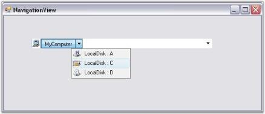

## NavigationView

Breadcrumbs or breadcrumb trails is a navigation technique used in user interfaces. Its enables users to keep track of their location within programs or documents. Breadcrumbs provides a trail for the user to get back to the starting / entry point of a folder. Essential Tools provides the NavigationView control that uses the Breadcrumbs technique to keep track of locations and folders.

Features

The following are the features supported by the NavigationView control.

* It supports DropDown Selection.
* It supports images for each Parent Bar and Child Bar.
* Provides options to drop-down the History of the previously visited locations.
* Provides options to show / hide the History Button.
* Supports Office 2007 and Vista Visual Styles.
* Supports Right-To-Left alignment.
* Supports Custom Button control.
* Supports Edit Mode for quick navigation.
#### Creating NavigationView

Navigation View can be created in the following ways:

##### Through Designer

To create a NavigationView control, follow the steps given below.

1. Drag the NavigationView control from the controls toolbox onto your form.

{:.image }

2. Add Parent Bars and Child Bars to the NavigationView control using the BarCollection Editor.

{:.image }

##### Through Code

To create a NavigationView control programmatically, follow the below given steps.

3. Include the Tools Windows namespace to the .cs / .vb file.

[C#]

using Syncfusion.Windows.Forms.Tools;

[VB.NET]

Imports Syncfusion.Windows.Forms.Tools

4. Create an instance of the NavigationView control and add Parent Bars and Child Bars to it.

[C#]

//Creating instance of NavigationView

NavigationView navigationView4 = new NavigationView();

// Creating instance of Bars 

Syncfusion.Windows.Forms.Tools.Navigation.Bar Rootbar = new Syncfusion.Windows.Forms.Tools.Navigation.Bar();

Syncfusion.Windows.Forms.Tools.Navigation.Bar ChildBar1 = new Syncfusion.Windows.Forms.Tools.Navigation.Bar();

Syncfusion.Windows.Forms.Tools.Navigation.Bar ChildBar2 = new Syncfusion.Windows.Forms.Tools.Navigation.Bar();

Rootbar.ImageIndex = 0;

Rootbar.Text = "MyComputer";

ChildBar1.ImageIndex = 1;

ChildBar1.Text = "LocalDisk : C";

ChildBar2.ImageIndex = 1;

ChildBar2.Text = "Program Files";

// Adding child bars into Rootbar

ChildBar1.Bars.AddRange(new Syncfusion.Windows.Forms.Tools.Navigation.Bar[] {

ChildBar2});

Rootbar.Bars.AddRange(new Syncfusion.Windows.Forms.Tools.Navigation.Bar[] {

ChildBar1});

// Adding the rootbar into NavigationView

navigationView4.Bars.AddRange(new Syncfusion.Windows.Forms.Tools.Navigation.Bar[] {

Rootbar});

navigationView4.ImageList = this.imageList1;

navigationView4.Location = new System.Drawing.Point(250, 300);

navigationView4.Name = "navigationView";

navigationView4.Size = new System.Drawing.Size(343, 21);

navigationView4.TabIndex = 0;

navigationView4.Text = "navigationView";

// Setting the Visual Style into Vista

navigationView4.VisualStyle = Syncfusion.Windows.Forms.Tools.Navigation.VisualStyles.Vista;

this.Controls.Add(navigationView4);

[VB.NET]

'Creating instance of NavigationView

Dim navigationView4 As NavigationView = New NavigationView()

' Creating instance of Bars 

Dim Rootbar As Syncfusion.Windows.Forms.Tools.Navigation.Bar = New Syncfusion.Windows.Forms.Tools.Navigation.Bar()

Dim ChildBar1 As Syncfusion.Windows.Forms.Tools.Navigation.Bar = New Syncfusion.Windows.Forms.Tools.Navigation.Bar()

Dim ChildBar2 As Syncfusion.Windows.Forms.Tools.Navigation.Bar = New Syncfusion.Windows.Forms.Tools.Navigation.Bar()

Rootbar.ImageIndex = 0

Rootbar.Text = "MyComputer"

ChildBar1.ImageIndex = 1

ChildBar1.Text = "LocalDisk : C"

ChildBar2.ImageIndex = 1

ChildBar2.Text = "Program Files"

' Adding child bars into Rootbar

ChildBar1.Bars.AddRange(New Syncfusion.Windows.Forms.Tools.Navigation.Bar() { ChildBar2})

Rootbar.Bars.AddRange(New Syncfusion.Windows.Forms.Tools.Navigation.Bar() { ChildBar1})

' Adding the rootbar into NavigationView

navigationView4.Bars.AddRange(New Syncfusion.Windows.Forms.Tools.Navigation.Bar() { Rootbar})

navigationView4.ImageList = Me.imageList1

navigationView4.Location = New System.Drawing.Point(250, 300)

navigationView4.Name = "navigationView"

navigationView4.Size = New System.Drawing.Size(343, 21)

navigationView4.TabIndex = 0

navigationView4.Text = "navigationView"

' Setting the Visual Style into Vista

navigationView4.VisualStyle = Syncfusion.Windows.Forms.Tools.Navigation.VisualStyles.Vista

Me.Controls.Add(navigationView4)

{:.image }

#### Concepts and Features

This section discusses the concepts and features of the control under the following topics:

##### Drop-Down Selection

NavigationView control provides drop-down selection support.

Each folder that is navigated through, is shown in the Address Bar, separated by a Forward Arrow. Clicking on this arrow, will show a drop-down list, displaying all the folders directly below the one you have opened.

{:.image }

Images Support

NavigationView control provides support for adding images to both Parent Bars and Child Bars. It displays the image of the Selected Bar to the left of the control.

[C#]

navigationView4.ImageList = this.imageList1;

Rootbar.ImageIndex = 0;

ChildBar1.ImageIndex = 1;

ChildBar2.ImageIndex = 1;

[VB.NET]

navigationView4.ImageList = Me.imageList1

Rootbar.ImageIndex = 0

ChildBar1.ImageIndex = 1

ChildBar2.ImageIndex = 1

The following illustration shows the NavigationView with Bar Images.

{:.image }

Tracking the Previously Selected Items using DropDown Button

You can trace the previously selected locations by clicking on the Drop-Down button of the NavigationView.

The following illustration shows the NavigationView displaying Previously Selected Items.

{:.image }

Custom Button Collection

You can add one or more custom buttons to the NavigationView through designer and code. This is illustrated below.

* Adding Custom Button Through Designer

You can add custom buttons to the NavigationView using the CustomButton Collection Editor.

The following illustration shows the CustomButton Collection Editor.

{:.image }

* Adding Custom Button Through Code

[C#]

Syncfusion.Windows.Forms.Tools.Navigation.CustomButton customButton = new Syncfusion.Windows.Forms.Tools.Navigation.CustomButton();

customButton.Appearance = Syncfusion.Windows.Forms.ButtonAppearance.Office2007;

customButton.Name = "customButton";

Bitmap img = new Bitmap("..//..//Search.gif");

customButton.Image = img;

navigationView4.Controls.Add(customButton);

[VB.NET]

Dim customButton As Syncfusion.Windows.Forms.Tools.Navigation.CustomButton = New Syncfusion.Windows.Forms.Tools.Navigation.CustomButton()

customButton.Appearance = Syncfusion.Windows.Forms.ButtonAppearance.Office2007

customButton.Name = "customButton"

Dim img As Bitmap = New Bitmap("..//..//Search.gif")

customButton.Image = img

navigationView4.Controls.Add(customButton)

The following illustration shows the NavigationView with Custom Button.

{:.image }

##### Right-To-Left Support

NavigationView aligns the embedded child controls and images from right to left on setting the RightToLeft property to True.

{:.image }

##### Visual Styles

Visual Styles enhance the appearance of the NavigationView control. NavigationView supports the following visual styles: Office 2007 and Vista.

{:.image }

{:.image }

Edit Mode Support

You can switch to an editable NavigationView path, allowing the user to quickly reach a location, by clicking on the text area of the NavigationView and typing the path.

{:.image }

##### Customizable number of items on Popup

Navigation View now allows setting the maximum number of items to be displayed on its popup and has an option to cancel the popup. BarPopUp event can be used to achieve this.

[C#]

// Sets the maximum items to be displayed.

Private this.navigationView1.BarPopup += new EventHandler<Syncfusion.Windows.Forms.Tools.BarPopupEventArgs>(navigationView1_BarPopup)

private void navigationView1_BarPopup(object sender, Syncfusion.Windows.Forms.Tools.BarPopupEventArgs e)

{

if (e.CurrentBar.Text.Equals("TestSample"))

{

e.Cancel = true;

}

if (e.CurrentBar.Text.Equals("Program Files"))

{

e.MaximumItemsToDisplay = 13;

}

else

{

e.MaximumItemsToDisplay = 5;

}

}

[VB.NET]

‘Sets the maximum Items to be displayed.

Private Me.navigationView1.BarPopup += New EventHandler(Of Syncfusion.Windows.Forms.Tools.BarPopupEventArgs)(AddressOf navigationView1_BarPopup)

Private Sub navigationView1_BarPopup(ByVal sender As Object, ByVal e As Syncfusion.Windows.Forms.Tools.BarPopupEventArgs)

If e.CurrentBar.Text.Equals("TestSample") Then

e.Cancel = True

End If

If e.CurrentBar.Text.Equals("Program Files") Then

e.MaximumItemsToDisplay = 13

Else

e.MaximumItemsToDisplay = 5

End If

End Sub

