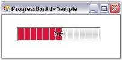
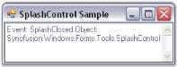
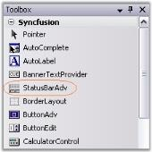
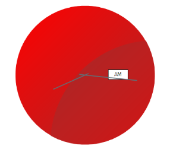
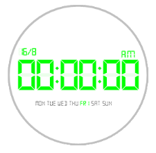

## Notification Package

The Notification package consists of controls commonly used to notify the user, the occurrence of an event in an application. Common applications of the notification package are enhanced progress bars, splash screens and customized message boxes with animation.

The Notification Package provides users with several useful controls which are listed below.

#### ProgressBarAdv

ProgressBars are used in applications to provide a visual cue during lengthy operations such as installation, copying, and printing. It also lets users know the time remaining to complete a lengthy operation. When an application is performing a lengthy task in the background, users may not be sure if the application is still working. A ProgressBar can be used to provide a visual cue that the application is indeed working and the task is being completed. 

{:.image }

The ProgressBarAdv is an advanced progressbar with a wide array of properties that can be set using the properties window. It comes with many styles which can be set through the BackgroundStyle and ProgressStyle properties. The orientation of a ProgressBarAdv can be set to vertical or horizontal using the ProgressOrientation property.

##### Features

The following are the features that are available for this control.

Features

* Background Settings

The background style of the control can be customized using a BackgroundStyle property.

Colors can be applied to change the appearance of the background gradient and tube.

* Foreground Settings

The ProgressBarAdv foreground can be designed using the foreground gradient properties. Setting these properties will give the control a rich look and feel.

The color and style of the foreground can be set.

Images can be displayed in the foreground of the ProgressBarAdv control.

* Orientation Settings

The control allows the user to set the orientation of the progress bar to either horizontal or vertical.

* Boundary Value Settings

The boundary value of the ProgressBarAdv can be incremented or decremented using the boundary value settings.

* Border Settings

The border style can be provided with a 3D look. The color of the border can also be changed.

* Text Settings

Various options are provided for aligning the text, disabling / enabling text, changing the direction of display of text, providing shadow for the text and changing the style of the text.

* Applying Themes

Themes can be applied for the ProgressBarAdv control by setting the ThemesEnabled property to 'True'.

See Also

Concepts and Features

##### Creating ProgressBarAdv

This section will give a step-by-step procedure to design a ProgressBarAdv control through designer and also through programmatical approach.

###### Through Designer

We can create a ProgressBarAdv through designer using the steps given below.

* The ProgressBarAdv control provides full support for the Windows Forms designer. Drag and drop the ProgressBarAdv control from the toolbox onto your form.

{:.image }

* Set the desired properties for the control through the Property grid. 

{:.image }

* Activate the ProgressBarAdv in the desired place.

See Also

Frequently Asked Questions

###### Through Code

This step-by-step procedure explains how to create the ProgressBarAdv control programmatically.

* Create a C# or VB.NET application in Visual Studio. Switch to the code view.
* Declare and initialize a ProgressBarAdv as below.

[C#]

private Syncfusion.Windows.Forms.Tools.ProgressBarAdv progressBarAdv1;

this.progressBarAdv1 = new Syncfusion.Windows.Forms.Tools.ProgressBarAdv();

((System.ComponentModel.ISupportInitialize)(this.progressBarAdv1)).BeginInit();

this.SuspendLayout();

[VB.NET]

Friend WithEvents ProgressBarAdv1 As Syncfusion.Windows.Forms.Tools.ProgressBarAdv

Me.ProgressBarAdv1 = New Syncfusion.Windows.Forms.Tools.ProgressBarAdv

CType(Me.ProgressBarAdv1, System.ComponentModel.ISupportInitialize).BeginInit()

Me.SuspendLayout()

* Set the Location property of the control.

[C#]

this.progressBarAdv1.Location = new System.Drawing.Point(40, 48);

[VB.NET]

Me.ProgressBarAdv1.Location = New System.Drawing.Point(40, 48)

* Add the control to the form.

[C#]

this.Controls.Add(this.progressBarAdv1);

this.Text = "ProgressBarAdv";

((System.ComponentModel.ISupportInitialize)(this.progressBarAdv1)).EndInit();

this.ResumeLayout(false);

[VB.NET]

Me.Controls.Add(Me.ProgressBarAdv1)

Me.Text = "ProgressBarAdv"

CType(Me.ProgressBarAdv1, System.ComponentModel.ISupportInitialize).EndInit()

Me.ResumeLayout(False)

* Run the application.

{:.image }

See Also

Frequently Asked Questions

##### Concepts and Features

This section explains the concepts and features of the ProgressBarAdvcontrol which will help to understand the control better. The following are the features discussed.

###### ProgressBarAdv Overview

The various sections of ProgressBarAdv and their descriptions are given below.

{:.image }

ProgressBarAdv

The ProgressBarAdv is an extension to the standard progressbar which will help you to display task completion status with lots of background, border and foreground styles.

Foreground of ProgressBarAdv

This is the area which indicates task completion in the ProgressBarAdv control.

Background of ProgressBarAdv

This is the area over which the foreground is displayed.

See Also

Background Settings

Foreground Settings

###### Background Settings

The ProgressBarAdv control consists of various properties to customize the background. These properties and their description are given below.

Background Style

The style of the background can be set using the properties given below.

_Table_ _590__: Property Table_

<table>
<tr>
<td>
ProgressBarAdv Property</td><td>
Description</td></tr>
<tr>
<td>
BackgroundStyle</td><td>
Determines the style of the background. It includes the options given below.Image,Gradient,VerticalGradient,Tube,MultipleGradient,System andNone.</td></tr>
<tr>
<td>
BackgroundFallbackStyle</td><td>
Determines the style of the background when BackgroundStyle is set to 'System', provided the system does not support themes.</td></tr>
</table>

[C#]

this.progressBarAdv1.BackgroundStyle = Syncfusion.Windows.Forms.Tools.ProgressBarBackgroundStyles.Gradient;

this.progressBarAdv1.BackgroundFallbackStyle = Syncfusion.Windows.Forms.Tools.ProgressBarBackgroundStyles.MultipleGradient;

[VB.NET]

Me.progressBarAdv1.BackgroundStyle = Syncfusion.Windows.Forms.Tools.ProgressBarBackgroundStyles.Gradient

Me.progressBarAdv1.BackgroundFallbackStyle = Syncfusion.Windows.Forms.Tools.ProgressBarBackgroundStyles.MultipleGradient

{:.image }

> 
{:.image }
 _Note: To display the above styles in different colors the BackGradientStartColor and BackGradientEndColor properties can be used._

Background Segments

The background of the ProgressBarAdv can be displayed with a segmented appearance using the property given below.

_Table_ _591__: Property Table_

<table>
<tr>
<td>
ProgressBarAdv Property</td><td>
Description</td></tr>
<tr>
<td>
BackSegments</td><td>
Determines if the background is segmented.The BackgroundStyle property must be set to 'Tube'.</td></tr>
</table>

[C#]

this.progressBarAdv1.BackSegments = true;

[VB.NET]

Me.progressBarAdv1.BackSegments = True

{:.image }

Background Color Settings

This section illustrates the color settings that can be applied to the background of the ProgressBarAdv.

Gradient Color

The color of the background gradient can be changed using the properties given below.

_Table_ _592__: Property Table_

<table>
<tr>
<td>
ProgressBarAdv Property</td><td>
Description</td></tr>
<tr>
<td>
BackGradientStartColor</td><td>
Specifies the start color of the background gradient.The BackgroundStyle property should be set to 'Gradient' or 'VerticalGradient'.</td></tr>
<tr>
<td>
BackGradientEndColor</td><td>
Specifies the end color of the background gradient.The BackgroundStyle property should be set to 'Gradient' or 'VerticalGradient'.</td></tr>
</table>

[C#]

this.progressBarAdv1.BackGradientEndColor = System.Drawing.Color.Aquamarine;

this.progressBarAdv1.BackGradientStartColor = System.Drawing.Color.IndianRed;

[VB.NET]

Me.progressBarAdv1.BackGradientEndColor = System.Drawing.Color.Aquamarine

Me.progressBarAdv1.BackGradientStartColor = System.Drawing.Color.IndianRed

{:.image }

The background gradient can be displayed with multiple colors using the property given below.

_Table_ _593__: Property Table_

<table>
<tr>
<td>
ProgressBarAdv Property</td><td>
Description</td></tr>
<tr>
<td>
BackMultipleColors</td><td>
Specifies the array of colors used to draw the multiple gradient of the background.The BackgroundStyle property should be set to 'MultipleGradient'.</td></tr>
</table>

[C#]

this.progressBarAdv1.BackMultipleColors = new System.Drawing.Color[] {System.Drawing.Color.Blue, System.Drawing.Color.Red, System.Drawing.Color.Green, System.Drawing.Color.Pink, System.Drawing.Color.Yellow};

[VB.NET]

Me.progressBarAdv1.BackMultipleColors = New System.Drawing.Color[] {System.Drawing.Color.Blue, System.Drawing.Color.Red, System.Drawing.Color.Green, System.Drawing.Color.Pink, System.Drawing.Color.Yellow}

{:.image }

Tube Color

Colors can be set for the background tube of the ProgressBarAdv.

_Table_ _594__: Property Table_

<table>
<tr>
<td>
ProgressBarAdv Property</td><td>
Description</td></tr>
<tr>
<td>
BackTubeStartColor</td><td>
Specifies the start color of the background tube.The BackgroundStyle property should be set to 'Tube'.</td></tr>
<tr>
<td>
BackTubeEndColor</td><td>
Specifies the end color of the background tube.The BackgroundStyle property should be set to 'Tube'.</td></tr>
</table>

[C#]

this.progressBarAdv1.BackTubeEndColor = System.Drawing.Color.RosyBrown;

this.progressBarAdv1.BackTubeStartColor = System.Drawing.Color.Yellow;

[VB.NET]

Me.progressBarAdv1.BackTubeEndColor = System.Drawing.Color.RosyBrown

Me.progressBarAdv1.BackTubeStartColor = System.Drawing.Color.Yellow

{:.image }

###### Foreground Settings

This section discusses the foreground settings of the ProgressBarAdv control.

The topics included are given below.

Foreground Segment Settings

The foreground segment settings available in the ProgressBarAdv control are explained below.

The foreground of the ProgressBarAdv can be displayed with a segmented appearance using the property given below.

_Table_ _595__: Property Table_

<table>
<tr>
<td>
ProgressBarAdv Property</td><td>
Description</td></tr>
<tr>
<td>
ForeSegments</td><td>
Determines if the foreground is segmented.</td></tr>
</table>

By default this property will be set to 'True'. To set it to 'False', use the code snippet given below.

[C#]

this.progressBarAdv1.ForeSegments = false;

[VB.NET]

Me.progressBarAdv1.ForeSegments = False

{:.image }

Segment Width

The foreground segments can be customized using the property given below.

_Table_ _596__: Property Table_

<table>
<tr>
<td>
ProgressBarAdv Property</td><td>
Description</td></tr>
<tr>
<td>
SegmentWidth</td><td>
Specifies the width of the segments.</td></tr>
</table>

[C#]

this.progressBarAdv1.SegmentWidth = 20;

[VB.NET]

Me.progressBarAdv1.SegmentWidth = 20

{:.image }

See Also

Background Settings

 Foreground Color Settings

This section illustrates the color settings that can be applied to the foreground of the ProgressBarAdv.

Font and Fore Color Settings

The font color and the fore color can be set using the properties given below.

_Table_ _597__: Property Table_

<table>
<tr>
<td>
ProgressBarAdv Property</td><td>
Description</td></tr>
<tr>
<td>
ForeColor</td><td>
Specifies the color used to draw the foreground in segment mode and constant mode.</td></tr>
<tr>
<td>
FontColor</td><td>
Specifies the color of the font used to draw the text of the ProgressBarAdv.</td></tr>
</table>

[C#]

this.progressBarAdv1.FontColor = System.Drawing.Color.SteelBlue;

this.progressBarAdv1.ForeColor = System.Drawing.Color.Turquoise;

[VB.NET]

Me.progressBarAdv1.FontColor = System.Drawing.Color.SteelBlue

Me.progressBarAdv1.ForeColor = System.Drawing.Color.Turquoise

{:.image }

Gradient Color Settings

The color of the foreground gradient can be changed using the properties given below.

_Table_ _598__: Property Table_

<table>
<tr>
<td>
ProgressBarAdv Property</td><td>
Description</td></tr>
<tr>
<td>
GradientStartColor</td><td>
Specifies the start color of the foreground gradient.The ProgressStyle property should be set to 'Gradient'.</td></tr>
<tr>
<td>
GradientEndColor</td><td>
Specifies the start color of the foreground gradient.The ProgressStyle property should be set to 'Gradient'.</td></tr>
</table>

[C#]

this.progressBarAdv1.GradientEndColor = System.Drawing.Color.Yellow;

this.progressBarAdv1.GradientStartColor = System.Drawing.Color.OrangeRed;

[VB.NET]

Me.progressBarAdv1.GradientEndColor = System.Drawing.Color.Yellow

Me.progressBarAdv1.GradientStartColor = System.Drawing.Color.OrangeRed

{:.image }

The foreground can be displayed with multiple colors using the property given below.

_Table_ _599__: Property Table_

<table>
<tr>
<td>
ProgressBarAdv Property</td><td>
Description</td></tr>
<tr>
<td>
MultipleColors</td><td>
Specifies the array of colors used to draw the multiple gradient of the foreground.The ProgressStyle property should be set to 'MultipleGradient'.</td></tr>
<tr>
<td>
StretchMultGrad</td><td>
Determines if the multiple gradient will be stretched.</td></tr>
</table>

[C#]

this.progressBarAdv1.ProgressStyle = Syncfusion.Windows.Forms.Tools.ProgressBarStyles.MultipleGradient;

this.progressBarAdv1.MultipleColors = new System.Drawing.Color[] {System.Drawing.Color.Orange, System.Drawing.Color.Yellow, System.Drawing.Color.Blue, System.Drawing.Color.Pink, System.Drawing.Color.Green};

this.progressBarAdv1.StretchMultGrad = false;

[VB.NET]

Me.progressBarAdv1.ProgressStyle = Syncfusion.Windows.Forms.Tools.ProgressBarStyles.MultipleGradient

Me.progressBarAdv1.MultipleColors = New System.Drawing.Color[] {System.Drawing.Color.Orange, System.Drawing.Color.Yellow, System.Drawing.Color.Blue, System.Drawing.Color.Pink, System.Drawing.Color.Green};

Me.progressBarAdv1.StretchMultGrad = False

{:.image }

Tube Color Settings

Colors can be set for the foreground tube of the ProgressBarAdv.

_Table_ _600__: Property Table_

<table>
<tr>
<td>
ProgressBarAdv Property</td><td>
Description</td></tr>
<tr>
<td>
TubeStartColor</td><td>
Specifies the start color of the foreground tube.The ProgressStyle property should be set to 'Tube'.</td></tr>
<tr>
<td>
TubeEndColor</td><td>
Specifies the start color of the foreground tube.The ProgressStyle property should be set to 'Tube'.</td></tr>
</table>

[C#]

this.progressBarAdv1.TubeEndColor = System.Drawing.Color.Black;

this.progressBarAdv1.TubeStartColor = System.Drawing.Color.Red;

[VB.NET]

Me.progressBarAdv1.TubeEndColor = System.Drawing.Color.Black

Me.progressBarAdv1.TubeStartColor = System.Drawing.Color.Red

{:.image }

See Also

Background Color Settings

Foreground Image Settings

This section discusses the foreground image settings of ProgressBarAdv.

When the BackgroundStyle and ProgressStyle are set to the 'Image' style, then the foreground image can be specified using the below given property.

_Table_ _601__: Property Table_

<table>
<tr>
<td>
ProgressBarAdv Property</td><td>
Description</td></tr>
<tr>
<td>
ForegroundImage</td><td>
Determines if the foreground is segmented.</td></tr>
<tr>
<td>
StretchImage</td><td>
Indicates whether the foreground image will be stretched.</td></tr>
</table>

[C#]

this.progressBarAdv1.ForegroundImage = ((System.Drawing.Image)(resources.GetObject("clouds")));

this.progressBarAdv1.StretchImage = true;

[VB.NET]

Me.progressBarAdv1.ForegroundImage = CType((resources.GetObject("clouds")), System.Drawing.Image)

Me.progressBarAdv1.StretchImage = True

{:.image }

Foreground Style Settings

The progress style of the ProgressBarAdv control can be set using the properties given below.

_Table_ _602__: Property Table_

<table>
<tr>
<td>
ProgressBarAdv Property</td><td>
Description</td></tr>
<tr>
<td>
ProgressStyle</td><td>
Determines the foreground drawing style. It includes the options given below.Constant, Gradient, MultipleGradient, Tube, Image and System.</td></tr>
<tr>
<td>
ProgressFallbackStyle</td><td>
Determines the foreground drawing style when the ProgressStyle is set to 'System', provided the system doesn't support themes.</td></tr>
</table>

[C#]

this.progressBarAdv1.ProgressStyle = Syncfusion.Windows.Forms.Tools.ProgressBarStyles.WaitingGradient;

this.progressBarAdv1.ProgressFallbackStyle = Syncfusion.Windows.Forms.Tools.ProgressBarStyles.MultipleGradient;

[VB.NET]

Me.progressBarAdv1.ProgressStyle = Syncfusion.Windows.Forms.Tools.ProgressBarStyles.WaitingGradient

Me.progressBarAdv1.ProgressFallbackStyle = Syncfusion.Windows.Forms.Tools.ProgressBarStyles.MultipleGradient;

{:.image }

The Waiting Gradient Style of the ProgressBarAdv consists of the following properties that can be used to change the appearance and behavior of the style.

_Table_ _603__: Property Table_

<table>
<tr>
<td>
ProgressBarAdv Property</td><td>
Description</td></tr>
<tr>
<td>
WaitingGradientEnabled</td><td>
Determines if the waiting gradient is enabled.The ProgressStyle property should be set to 'WaitingGradient'.</td></tr>
<tr>
<td>
WaitingGradientInterval</td><td>
Determines the interval of the waiting gradient.</td></tr>
<tr>
<td>
WaitingGradientWidth</td><td>
Determines the width of the waiting gradient.</td></tr>
<tr>
<td>
CustomWaitingRender</td><td>
Indicates whether the waiting gradient will be replaced by another custom waiting render which is defaulted to segments.This property when set to 'True' will display the foreground with segments in the color that has been set for the ForeColor property.This property when set to 'False' will display the foreground in the default waiting gradient style.</td></tr>
</table>

[C#]

this.progressBarAdv1.WaitingGradientEnabled = true;

this.progressBarAdv1.WaitingGradientInterval = 20;

this.progressBarAdv1.WaitingGradientWidth = 500;

this.progressBarAdv1.CustomWaitingRender = true;

this.progressBarAdv1.ForeColor = System.Drawing.Color.Crimson;

[VB.NET]

Me.progressBarAdv1.WaitingGradientEnabled = True

Me.progressBarAdv1.WaitingGradientInterval = 20

Me.progressBarAdv1.WaitingGradientWidth = 500

Me.progressBarAdv1.CustomWaitingRender = True

Me.progressBarAdv1.ForeColor = System.Drawing.Color.Crimson

{:.image }

See Also

Background Settings

###### Orientation Settings

The direction of display of the ProgressBarAdv control can be changed using the property given below.

_Table_ _604__: Property Table_

<table>
<tr>
<td>
ProgressBarAdv Property</td><td>
Description</td></tr>
<tr>
<td>
ProgressOrientation</td><td>
Determines the horizontal or vertical style of the progress bar.</td></tr>
</table>

[C#]

this.progressBarAdv1.ProgressOrientation = System.Windows.Forms.Orientation.Horizontal;

this.progressBarAdv1.ProgressOrientation = System.Windows.Forms.Orientation.Vertical;

[VB.NET]

Me.progressBarAdv1.ProgressOrientation = System.Windows.Forms.Orientation.Horizontal

Me.progressBarAdv1.ProgressOrientation = System.Windows.Forms.Orientation.Vertical

{:.image }

###### Boundary Value Settings

The ProgressBarAdv during it's progressive operation indicates a minimum value and a maximum value for the process.

It provides the below properties to set the boundary values for the control and also the interval for the progression.

_Table_ _605__: Property Table_

<table>
<tr>
<td>
ProgressBarAdv Property</td><td>
Description</td></tr>
<tr>
<td>
Minimum</td><td>
Determines the lower bound of the range of the ProgressBarAdv.</td></tr>
<tr>
<td>
Maximum</td><td>
Determines the higher bound of the range of the ProgressBarAdv.</td></tr>
<tr>
<td>
Value</td><td>
The current value between the minimum and maximum values.</td></tr>
<tr>
<td>
Step</td><td>
Determines the amount to increment or decrement the value of the ProgressBarAdv when the Increment() or Decrement() method is called.</td></tr>
</table>

Create a ProgressBarAdv and set the below properties to see the changes.

[C#]

this.progressBarAdv1.Maximum = 200;

this.progressBarAdv1.Minimum = 25;

this.progressBarAdv1.Step = 50;

this.progressBarAdv1.Value = 100;

[VB.NET]

Me.progressBarAdv1.Maximum = 200

Me.progressBarAdv1.Minimum = 25

Me.progressBarAdv1.Step = 50

Me.progressBarAdv1.Value = 100

{:.image }

The methods associated with the above properties are given below.

_Table_ _606__: Methods Table_

<table>
<tr>
<td>
Methods</td><td>
Description</td></tr>
<tr>
<td>
Increment</td><td>
Increments the Value property associated with the Step value.</td></tr>
<tr>
<td>
Decrement</td><td>
Decrements the Value property associated with the Step value.</td></tr>
</table>
###### Border Settings

This section discusses the border settings of the ProgressBarAdv control.

_Table_ _607__: Property Table_

<table>
<tr>
<td>
ProgressBarAdv Property</td><td>
Description</td></tr>
<tr>
<td>
Border3DStyle</td><td>
Determines the style of the 3D border. It includes the following options.{{ _RaisedOuter,_ | markdownify }}{{ _SunkenOuter,_ | markdownify }}{{ _RaisedInner,_ | markdownify }}{{ _Raised,_ | markdownify }}{{ _Etched,_ | markdownify }}{{ _SunkenInner,_ | markdownify }}{{ _Bump,_ | markdownify }}{{ _Sunken,_ | markdownify }}{{ _Adjust and_  | markdownify }}{{ _Flat._ | markdownify }}</td></tr>
<tr>
<td>
BorderColor</td><td>
Indicates the color of the border.This will be applied to the control only when the BorderStyle property is set to 'FixedSingle'.</td></tr>
<tr>
<td>
BorderSingle</td><td>
Determines the style of the 2D border. The options included are as follows.Dashed, Dotted, Solid, Inset,Outset andNone.</td></tr>
<tr>
<td>
BorderStyle</td><td>
Determines the style of the border. It includes the following options.FixedSingle,Fixed3D andNone.</td></tr>
</table>

[C#]

this.progressBarAdv1.Border3DStyle = System.Windows.Forms.Border3DStyle.RaisedOuter;

this.progressBarAdv1.BorderColor = System.Drawing.Color.Black;

this.progressBarAdv1.BorderSingle = System.Windows.Forms.ButtonBorderStyle.Dashed;

this.progressBarAdv1.BorderStyle = System.Windows.Forms.BorderStyle.FixedSingle;

[VB.NET]

Me.progressBarAdv1.Border3DStyle = System.Windows.Forms.Border3DStyle.RaisedOuter 

Me.progressBarAdv1.BorderColor = System.Drawing.Color.Black 

Me.progressBarAdv1.BorderSingle = System.Windows.Forms.ButtonBorderStyle.Dashed 

Me.progressBarAdv1.BorderStyle = System.Windows.Forms.BorderStyle.FixedSingle 

{:.image }

###### Text Settings

The below are ProgressBarAdv properties to customize the text and its alignment.

_Table_ _608__: Property Table_

<table>
<tr>
<td>
ProgressBarAdv Property</td><td>
Description</td></tr>
<tr>
<td>
TextAlignment</td><td>
The text on the progress bar can be set to left, center and right.</td></tr>
<tr>
<td>
TextOrientation</td><td>
Indicates the property which decides the orientation of the text.</td></tr>
<tr>
<td>
TextShadow</td><td>
Indicates the visibility of the text shadow.</td></tr>
<tr>
<td>
TextStyle</td><td>
Indicates the style of the text.</td></tr>
<tr>
<td>
TextVisible</td><td>
Determines if the text of the ProgressBarAdv is visible.</td></tr>
</table>

[C#]

this.progressBarAdv1.TextOrientation = System.Windows.Forms.Orientation.Horizontal;

this.progressBarAdv1.TextAlignment = Syncfusion.Windows.Forms.Tools.TextAlignment.Center;

this.progressBarAdv1.TextStyle = Syncfusion.Windows.Forms.Tools.ProgressBarTextStyles.Value;

this.progressBarAdv1.TextShadow = false;

this.progressBarAdv1.TextVisible = true;

[VB.NET]

Me.progressBarAdv1.TextOrientation = System.Windows.Forms.Orientation.Horizontal

Me.progressBarAdv1.TextAlignment = Syncfusion.Windows.Forms.Tools.TextAlignment.Center

Me.progressBarAdv1.TextStyle = Syncfusion.Windows.Forms.Tools.ProgressBarTextStyles.Value

Me.progressBarAdv1.TextShadow = False

Me.progressBarAdv1.TextVisible = True

{:.image }

###### Applying Themes

The ProgressBarAdv control can now be themed by enabling the ThemesEnabled property.

[C#]

this.progressBarAdv1.ThemesEnabled = true;

[VB.NET]

Me.progressBarAdv1.ThemesEnabled = True

{:.image }

> 
{:.image }
 _Note: Refer to the_ Foreground Style Settings _topic for more information on ProgressStyle property._

##### ProgressBarAdv Events

The list of events and a detailed explanation about each of them is given in the following sections.

_Table_ _609__: Events Table_

<table>
<tr>
<td>
ProgressBarAdv Events</td><td>
Description</td></tr>
<tr>
<td>
DrawWaitingCustomRender</td><td>
This event can be handled to draw a custom waiting render. WaitingCustomRender must be set to 'True'.</td></tr>
<tr>
<td>
ValueChanged</td><td>
This event is handled to set the text of the ProgressBarAdv when the value changes.The TextStyle property should be set to 'Custom'.</td></tr>
</table>
###### DrawWaitingCustomRender Event

The CustomWaitingRender property indicates whether the waiting gradient will be replaced by another custom waiting render which is defaulted to segments. When this property is set to 'True', it enables the custom waiting render behavior which will fire this DrawWaitingCustomRender event.

This event lets you do the desired drawing. If you perform custom drawing, you should specify that to the ProgressBarAdv (so that it does not perform it's default painting), by setting e.Handled = true. If no custom painting is done, then you do not have to set e.Handled value, and the ProgressBarAdv draws it's default segmented waiting gradient. The type of segments are specified through the ProgressFallbackStyle with the options Continuous, Tube, Gradient and System.

Event Data

The event handler receives an argument of the type ProgressBarAdvDrawEventArgs containing data related to this event. The following ProgressBarAdvDrawEventArgs members provide information specific to this event.

_Table_ _610__: Memb Table_

<table>
<tr>
<td>
Members</td><td>
Description</td></tr>
<tr>
<td>
Graphics</td><td>
Gets the graphic used to paint.</td></tr>
<tr>
<td>
Handled</td><td>
Gets / sets a value indicating whether the DrawWaitingCustomRender event was handled.</td></tr>
<tr>
<td>
Rectangle</td><td>
Gets the bounding rectangle.</td></tr>
</table>

[C#]

private void progressBarAdv1_DrawWaitingCustomRender(object sender, Syncfusion.Windows.Forms.Tools.ProgressBarAdvDrawEventArgs e)

{

//Gets the graphics used to paint using the Graphics property

e.Graphics.PixelOffsetMode.ToString();

//If you perform custom drawing, you should specify that to the ProgressBarAdv 

//(so that it does not perform its default painting), by setting the below code.

e.Handled = true;

//To get the bounding rectangle use the below code

e.Rectangle.ToString();

}

[VB.NET]

Private Sub progressBarAdv1_DrawWaitingCustomRender(ByVal sender As Object, ByVal e As Syncfusion.Windows.Forms.Tools.ProgressBarAdvDrawEventArgs)

'Gets the graphics used to paint using the Graphics property

e.Graphics.PixelOffsetMode.ToString();

'If you perform custom drawing, you should specify that to the ProgressBarAdv 

'(so that it does not perform its default painting), by setting the below code.

e.Handled = true;

'To get the bounding rectangle use the below code

e.Rectangle.ToString();

End Sub

###### ValueChanged Event

For information about this event, refer to the How to display custom text on the ProgressBarAdv to indicate the status of the task instead of the percentage completed? topic under the Frequently Asked Questions section.

##### Frequently Asked Questions

This section will help you become more familiar in using the ProgressBarAdv control.

###### How to activate a ProgressBarAdv

This section will give you a brief description on how to use the ProgressBarAdv control.

1. Drag and drop a ProgressBarAdv onto your form.
2. Add a Timer and a Button to the form. By default, the Timer will be disabled.

{:.image }

3. Double-click the timer and add the below given code in the timer_Tick event.

[C#]

private void timer1_Tick(object sender, EventArgs e)

{

if (this.progressBarAdv1.Value < 100)

this.progressBarAdv1.Value++;

else

this.progressBarAdv1.Value = 0;

}

[VB.NET]

Private Sub timer1_Tick(ByVal sender As Object, ByVal e As EventArgs)

If Me.progressBarAdv1.Value < 100 Then

Me.progressBarAdv1.Value += 1

Else

Me.progressBarAdv1.Value = 0

End If

End Sub

4. Enable the timer in the button_Click event.

[C#]

private void button1_Click(object sender, EventArgs e)

{

this.timer1.Enabled = true;

}

[VB.NET]

Private Sub button1_Click(ByVal sender As Object, ByVal e As EventArgs)

Me.timer1.Enabled = True

End Sub

5. Run the application.

{:.image }

###### How to display custom text on the ProgressBarAdv to indicate the status of the task instead of the percentage completed

This can be done using the steps given below.

1. Set the ProgressBarAdv's TextStyle property to 'Custom'.
2. Handle the ProgressBarAdv's ValueChanged event and set e.Text = "your desired text" and e.Handled = True.

The following code demonstrates the above steps.

[C#]

// Declare and initialize count.

int count = 0;

// Set the code for the timer_Tick event.

private void timer1_Tick(object sender, System.EventArgs e)

{

if (this.progressBarAdv1.Value < 100)

this.progressBarAdv1.Value += 10;

else

this.progressBarAdv1.Value = 0;

}

// Set the code for the button_Click event.

private void button1_Click(object sender, System.EventArgs e)

{

count++;

if (count%2 == 1)

this.timer1.Start();

else if (count%2 == 0)

this.timer1.Stop();

}

// Handle the ValueChanged event.

this.progressBarAdv1.ValueChanged +=new ProgressBarValueChangedEventHandler(progressBarAdv1_ValueChanged);

// Define the ValueChanged event.

private void progressBarAdv1_ValueChanged(object sender, Syncfusion.Windows.Forms.Tools.ProgressBarValueChangedEventArgs e)

{

e.Text = "Value Changing...." + this.progressBarAdv1.Value.ToString();

e.Handled = true;

}

[VB.NET]

' Declare and initialize count.

Dim count As Integer = 0 

' Set the code for the timer_Tick event.

Private Sub timer1_Tick(ByVal sender As Object, ByVal e As System.EventArgs)

If Me.progressBarAdv1.Value < 100 Then

Me.progressBarAdv1.Value += 10

Else

Me.progressBarAdv1.Value = 0

End If

End Sub

' Set the code for the button_Click event.

Private Sub button1_Click(ByVal sender As Object, ByVal e As System.EventArgs)

count += 1

If count Mod 2 = 1 Then

Me.timer1.Start()

ElseIf count Mod 2 = 0 Then

Me.timer1.[Stop]()

End If

End Sub

' Handle the ValueChanged event.

AddHandler Me.progressBarAdv1.ValueChanged, AddressOf progressBarAdv1_ValueChanged 

' Define the ValueChanged event.

Private Sub progressBarAdv1_ValueChanged(ByVal sender As Object, ByVal e As Syncfusion.Windows.Forms.Tools.ProgressBarValueChangedEventArgs)

e.Text = "Value Changing...." + Me.progressBarAdv1.Value.ToString()

e.Handled = True

End Sub

###### How to customize the appearance of ProgressBarAdv?

The ProgressBarAdv control appearance can be customized as like in Win 8 application. You can achieve this using the following code example.

[C#]

            this.progressBarAdv1.ProgressStyle = Syncfusion.Windows.Forms.Tools.ProgressBarStyles.Metro;

            this.progressBarAdv1.GradientStartColor = Color.FromArgb(16, 138, 66);

            this.progressBarAdv1.GradientEndColor = Color.FromArgb(16, 138, 66);

            this.progressBarAdv1.BackGradientStartColor = Color.FromArgb(206, 206, 208);

            this.progressBarAdv1.BackGradientEndColor = Color.FromArgb(206, 206, 208);

            this.progressBarAdv1.BorderColor = Color.FromArgb(206, 206, 208);

 [VB]   

             Me.ProgressBarAdv1.ProgressStyle = ProgressBarStyles.Metro

             Me.ProgressBarAdv1.GradientStartColor = Color.FromArgb(16, 138, 66)

             Me.ProgressBarAdv1.GradientEndColor = Color.FromArgb(16, 138, 66)

             Me.ProgressBarAdv1.BackGradientStartColor = Color.FromArgb(206, 206, 208)

             Me.ProgressBarAdv1.BackGradientEndColor = Color.FromArgb(206, 206, 208)

             Me.ProgressBarAdv1.Size = New Size(400, 10)

{:.image }

#### SplashControl

The SplashControl provides an easy way to use classes that can be used to display splash screens. The SplashControl can be dragged and dropped onto your form from the controls toolbox. The SplashControl is implemented as a component that is not visible at run time. It is visible in the component area of your form where you can select it and set it's properties.

{:.image }

##### Features

The features of the SplashControl are given below.

Features

* Splash Settings

Automatic launching of the splash screen can be enabled.

The text can be set for the SplashControl.

The time interval for which the splash screen is to be displayed can be set according to the needs of the user.

* SplashPanel Settings

The SplashPanel control can be added to the SplashControl and images can be displayed using the SplashPanel which acts as the splash screen.

The SplashPanel can also be displayed in the taskbar and an icon can be set for it using the SplashPanel settings.

* Alignment Settings

It has the ability to make the splash screen appear as a part of the screen in the desired position. DesktopAlignment property gives options to set the alignment of the splash image in the desktop.

* Image and Animation Settings

The SplashImage property needs to be set to the image to be displayed in the splash screen. The SplashControl can only display an image as the splash screen. Refer to the SplashPanel class if you want more flexibility in building a splash screen (or splash message box) that provides more control in terms of displaying information and collecting responses.

SplashScreen can be animated by enabling the ShowAnimation property.

* Host Form Settings

There are options to hide, minimize and maximize the host form when the splash image is displayed.

See Also

Concepts and Features

##### Creating SplashControl

This section will give a step by step procedure to design a SplashControl through designer and also through programmatical approach.

###### Through Designer

The SplashControl provides full support for the Windows Forms designer.

1. Drag and drop the SplashControl from the toolbox onto the form. The SplashControl will be created in the components area of the form.

{:.image }

2. Set the SplashImage and the TimerInterval properties through the property grid.
3. Set the AutoMode property. This property controls how the SplashControl will be invoked. If the AutoMode property is set to 'True', the SplashControl will automatically launch itself during the parent form's load event.
4. The SplashPanel can also be viewed at design time using the Preview Splash option by clicking the smart tag as shown below.

{:.image }

5. Now run the application.
6. If the AutoMode property is set to 'False', the splash screen will have to be invoked explicitly by calling the ShowSplash() method.
7. Handle the SplashClosed event to do your processing after the splash screen is closed.

{:.image }

8. You can cancel the SplashControl while it is displaying the splash screen by calling the HideSplash() method.

See Also

SplashScreen Settings 

###### Through Code

A SplashControl can be created through code by following the below steps.

1. Create a C# or VB.NET application though Visual Studio.
2. Add the required assembly references.
3. Declare and initialize a SplashControl using the below code.

[C#]

private Syncfusion.Windows.Forms.Tools.SplashControl splashControl1;

this.splashControl1 = new Syncfusion.Windows.Forms.Tools.SplashControl();

this.SuspendLayout();

[VB.NET]

Friend WithEvents SplashControl1 As Syncfusion.Windows.Forms.Tools.SplashControl

Me.splashControl1 = New Syncfusion.Windows.Forms.Tools.SplashControl() 

Me.SuspendLayout()

4. Set the following properties.

[C#]

this.splashControl1.CustomSplashPanel = null;

this.splashControl1.HostForm = this;

this.splashControl1.HostFormWindowState = System.Windows.Forms.FormWindowState.Normal;

this.splashControl1.TimerInterval = 3000;

[VB.NET]

Me.SplashControl1.CustomSplashPanel = Nothing

Me.SplashControl1.HostForm = Me

Me.SplashControl1.HostFormWindowState = System.Windows.Forms.FormWindowState.Normal

Me.SplashControl1.TimerInterval = 3000

5. Run the application.

{:.image }

See Also

Through Designer 

SplashScreen Settings 

#####  Concepts and Features

This section contains information on getting started with SplashControl and discusses all the concepts and features of the control. 

The following topics are discussed in detail.

###### SplashControl Overview

The various sections of SplashControl and their descriptions are given below.

{:.image }

SplashControl

The SplashControl is a control that makes creating a splash screen easy. You just drag and drop a SplashControl onto your main form and set the image for the splash screen and the splash screen will be automatically displayed at run time. The timing, and look and feel of the SplashControl can be modified through the designer itself.

Splash Screen

This is the area over which the splash image is displayed.

See Also

SplashScreen Settings 

Image and Animation Settings

###### SplashScreen Settings

The following are the splash settings available for the SplashControl.

Automatic Launching

The properties given below describe the AutoMode features of the SplashControl.

_Table_ _611__: Property Table_

<table>
<tr>
<td>
SplashControl Property</td><td>
Description</td></tr>
<tr>
<td>
AutoMode</td><td>
Specifies if the SplashControl should automatically launch the splash screen.</td></tr>
<tr>
<td>
AutoModeDisableOwner</td><td>
Specifies if the SplashControl displays modally when in AutoMode.</td></tr>
<tr>
<td>
IsShowing</td><td>
Indicates if the splash screen is currently being displayed.</td></tr>
</table>

A splash image is displayed when an application is run, and only when AutoMode property is set to 'True'. By default this value will be set to 'True'. When the AutoMode is set to 'False', the splash image will not be displayed when the application starts.

If the AutoModeDisableOwner property is set to 'True', the splash screen displays modally. The splash screen stops the user from interacting with the rest of the application until it gets hidden. Once the splash screen disappears, the user will be able to interact with the form.

[C#]

this.SplashControl1.AutoMode = true;

this.splashControl1.AutoModeDisableOwner = true;

[VB.NET]

Me.SplashControl1.AutoMode = True

Me.splashControl1.AutoModeDisableOwner = True

The methods given below can also be used to show / hide the splash screen at run time. 

_Table_ _612__: Methods Table_

<table>
<tr>
<td>
Methods</td><td>
Description</td></tr>
<tr>
<td>
ShowSplash</td><td>
The splash screen can also be displayed, at run time, when this method is called. It includes the following parameter.DisableOwner - Indicates whether the owner form, i.e., the Windows form is enabled or disabled when the splash screen is displaying.</td></tr>
<tr>
<td>
HideSplash</td><td>
This method will decide whether to show or hide the splash screen that has been displayed using the above method.</td></tr>
<tr>
<td>
ShowDialogSplash</td><td>
This method will display the splash screen as a modal dialog.It includes the following parameters.OwnerForm - Represents the owner form.Location - Specifies the location at which the splash screen will be displayed.</td></tr>
</table>

[C#]

// Displays the splash screen.

this.splashControl1.ShowSplash(true);

// Hides the splash screen.

this.splashControl1.HideSplash();

// Displays the splash screen as a modal dialog.

private void button1_Click(object sender, EventArgs e)

{

this.splashControl1.ShowDialogSplash(new Point(700,700),new Form1());

}

[VB.NET]

' Displays the splash screen.

Me.splashControl1.ShowSplash(True);

' Hides the splash screen.

Me.splashControl1.HideSplash();

' Displays the splash screen as a modal dialog.

Private Sub button1_Click(ByVal sender As Object, ByVal e As EventArgs)

Me.splashControl1.ShowDialogSplash(New Point(700, 700), New Form1())

End Sub

The below example uses a button click event to call this method. This method is overloaded. The overloaded method passes the owner form as a parameter to this method.

[C#]

private void button1_Click(object sender, EventArgs e)

{

this.splashControl1.ShowDialogSplash(new Form1());

}

[VB.NET]

Private Sub button1_Click(ByVal sender As Object, ByVal e As EventArgs)

Me.splashControl1.ShowDialogSplash(New Form1())

End Sub

Time Interval Settings

The SplashControl is, by default, a timed display splash screen. The splash screen will be displayed for a specific time period and will then be closed. By default, the value will be set as 5000. User can change this value, run the application and see the difference.

_Table_ _613__: Property Table_

<table>
<tr>
<td>
SplashControl Property</td><td>
Description</td></tr>
<tr>
<td>
TimerInterval</td><td>
The time interval for which the splash screen is to be displayed (in milliseconds).</td></tr>
</table>

[C#]

this.splashControl1.TimerInterval = 3000;

[VB.NET]

Me.splashControl1.TimerInterval = 3000

See Also

SplashControl Events

###### SplashPanel Settings

This section discusses how a SplashPanel control can be displayed as a SplashScreen for the SplashControl.

The SplashControl allows the user to display a SplashPanel control as the splash screen. The following settings can be changed to customize the SplashPanel in the SplashControl.

_Table_ _614__: Property Table_

<table>
<tr>
<td>
SplashControl Property</td><td>
Description</td></tr>
<tr>
<td>
SplashControlPanel</td><td>
Gets / sets the internal SplashPanel that is displayed as the splash screen.</td></tr>
<tr>
<td>
ShowInTaskBar</td><td>
Indicates if the SplashPanel is to be shown in the taskbar.</td></tr>
<tr>
<td>
FormIcon</td><td>
Gets / sets the icon for the SplashPanel. </td></tr>
</table>

[C#]

this.splashControl1.ShowInTaskbar = true;

this.splashControl1.FormIcon = ((System.Drawing.Icon)(resources.GetObject("splashControl1.FormIcon")));

[VB.NET]

Me.splashControl1.ShowInTaskbar = True

Me.splashControl1.FormIcon = DirectCast((resources.GetObject("splashControl1.FormIcon")), System.Drawing.Icon)

{:.image }

See Also

How can I access the default panel of a SplashControl?

Integrating SplashPanel to SplashControl

A SplashControl allows the user to add an image that is to be displayed in the splash screen. However, the SplashControl also allows the user to add a SplashPanel control which can be customized by the user.

1. Add the required Syncfusion.Windows.Forms.Tools and Syncfusion.Shared.Base assemblies.
2. Drag and drop a SplashControl form the toolbox onto the form. The SplashControl will be created in the components area of the form.
3. Drag and drop a SplashPanel control from the toolbox.
4. Design the SplashPanel with the required controls (You can add any user interface control to the SplashPanel).
5. Populate the SplashPanel with the SplashControl using the CustomSplashPanel property.
6. The SplashControl uses the SplashPanel only if the UseCustomSplashPanel property is set to 'True'.
7. Create a SplashControl and add the below code to the form to customize the SplashPanel and display the SplashPanel as the splash image.

[C#]

// Add the required namespace.

using Syncfusion.Windows.Forms.Tools;

// Declaration of controls.

private Syncfusion.Windows.Forms.Tools.SplashControl splashControl1;

private Syncfusion.Windows.Forms.Tools.SplashPanel splashPanel1;

private System.Windows.Forms.Label label1;

// Initialization of controls.

this.splashControl1 = new Syncfusion.Windows.Forms.Tools.SplashControl();

this.splashPanel1 = new Syncfusion.Windows.Forms.Tools.SplashPanel();

this.label1 = new System.Windows.Forms.Label();

this.splashPanel1.SuspendLayout();

// Setting the properties for the SplashControl.

this.splashControl1.CustomSplashPanel = this.splashPanel1;

this.splashControl1.UseCustomSplashPanel = true;

// Setting the properties for the SplashPanel.

this.splashPanel1.AnimationSpeed = 10;

this.splashPanel1.BackgroundColor = new Syncfusion.Drawing.BrushInfo(Syncfusion.Drawing.GradientStyle.Vertical, new System.Drawing.Color[] {System.Drawing.SystemColors.HighlightText,System.Drawing.SystemColors.Highlight, System.Drawing.Color.PeachPuff, System.Drawing.Color.LightSeaGreen, System.Drawing.Color.Firebrick});

// Add label

this.splashPanel1.Controls.Add(this.label1);

this.splashPanel1.DesktopAlignment = Syncfusion.Windows.Forms.Tools.SplashAlignment.Center;

this.splashPanel1.DiscreetLocation = new System.Drawing.Point(0, 0);

this.splashPanel1.Font = new System.Drawing.Font("Comic Sans MS", 12F, System.Drawing.FontStyle.Bold, System.Drawing.GraphicsUnit.Point, ((System.Byte)(0)));

this.splashPanel1.ForeColor = System.Drawing.SystemColors.Info;

this.splashPanel1.Location = new System.Drawing.Point(32, 48);

this.splashPanel1.Name = "splashPanel1";

this.splashPanel1.ShowAnimation = true;

this.splashPanel1.Size = new System.Drawing.Size(200, 112);

this.splashPanel1.SuspendAutoCloseWhenMouseOver = false;

this.splashPanel1.TabIndex = 0;

this.splashPanel1.Text = "splashPanel1";

this.splashPanel1.TimerInterval = 5000;

// Setting the properties for the label.

this.label1.BackColor = System.Drawing.Color.Transparent;

this.label1.Location = new System.Drawing.Point(40, 40);

this.label1.Name = "label1";

this.label1.Size = new System.Drawing.Size(136, 23);

this.label1.TabIndex = 0;

this.label1.Text = "Splash Panel";

// Add the SplashPanel to the SplashControl.

this.Controls.Add(this.splashPanel1);

[VB.NET]

' Add the required namespace.

Imports Syncfusion.Windows.Forms.Tools

' Declaration of controls.

Private splashControl1 As Syncfusion.Windows.Forms.Tools.SplashControl

Private splashPanel1 As Syncfusion.Windows.Forms.Tools.SplashPanel

Private label1 As System.Windows.Forms.Label

' Initialization of controls.

Me.splashControl1 = New Syncfusion.Windows.Forms.Tools.SplashControl()

Me.SplashPanel1 = New Syncfusion.Windows.Forms.Tools.SplashPanel

Me.label1 = New System.Windows.Forms.Label

Me.SplashPanel1.SuspendLayout()

' Setting the properties for the SplashControl.

Me.SplashControl1.CustomSplashPanel = Me.SplashPanel1

Me.SplashControl1.UseCustomSplashPanel = True

' Setting the properties for the SplashPanel.

Me.SplashPanel1.AnimationSpeed = 10

Me.splashPanel1.BackgroundColor = New Syncfusion.Drawing.BrushInfo(Syncfusion.Drawing.GradientStyle.Vertical, New System.Drawing.Color() {System.Drawing.SystemColors.HighlightText, System.Drawing.SystemColors.Highlight, System.Drawing.Color.PeachPuff, System.Drawing.Color.LightSeaGreen, System.Drawing.Color.Firebrick})

' Add label

Me.SplashPanel1.Controls.Add(Me.SplashPanel2)

Me.SplashPanel1.DesktopAlignment = Syncfusion.Windows.Forms.Tools.SplashAlignment.Center

Me.SplashPanel1.DiscreetLocation = New System.Drawing.Point(0, 0)

Me.splashPanel1.Font = New System.Drawing.Font("Comic Sans MS", 12F, System.Drawing.FontStyle.Bold, System.Drawing.GraphicsUnit.Point, CByte((0)))

Me.SplashPanel1.ForeColor = System.Drawing.SystemColors.Info

Me.SplashPanel1.Location = New System.Drawing.Point(72, 64)

Me.SplashPanel1.Name = "SplashPanel1"

Me.SplashPanel1.ShowAnimation = True

Me.SplashPanel1.SuspendAutoCloseWhenMouseOver = False

Me.SplashPanel1.TabIndex = 0

Me.SplashPanel1.Text = "SplashPanel1"

Me.SplashPanel1.TimerInterval = 5000

' Setting the properties for the label.

Me.label1.BackColor = System.Drawing.Color.Transparent

Me.label1.Location = New System.Drawing.Point(40, 40)

Me.label1.Name = "label1"

Me.label1.Size = New System.Drawing.Size(136, 23)

Me.label1.TabIndex = 0

Me.label1.Text = "Splash Panel"

' Add the SplashPanel to the SplashControl.

Me.Controls.Add(Me.SplashPanel1)

{:.image }

###### Alignment Settings

This section discusses the alignment settings available in SplashControl.

SplashControl provides options to customize the alignment of the splash image in the desktop. The property that is related to this feature is given below.

_Table_ _615__: Property Table_

<table>
<tr>
<td>
SplashControl Property</td><td>
Description</td></tr>
<tr>
<td>
DesktopAlignment</td><td>
Specifies the desktop alignment of the splash image. It includes the following options.SystemTray,Center,LeftTop,LeftBottom,RightTop,RightBottom andCustom.</td></tr>
</table>

This can be done through code using the code snippet below.

[C#]

this.splashControl1.DesktopAlignment = Syncfusion.Windows.Forms.Tools.SplashAlignment.SystemTray;

[VB.NET]

Me.SplashControl1.DesktopAlignment = Syncfusion.Windows.Forms.Tools.SplashAlignment.SystemTray

{:.image }

###### Image and Animation Settings

This section demonstrates how to set a splash image and how to display it with animation.

Splash Image

The splash image can be displayed by setting the property given below.

_Table_ _616__: Property Table_

<table>
<tr>
<td>
SplashControl Property</td><td>
Description</td></tr>
<tr>
<td>
SplashImage</td><td>
The image for displaying as the background of the default splash screen.</td></tr>
</table>

[C#]

this.splashControl1.SplashImage = ((System.Drawing.Image)(resources.GetObject("splashControl1.SplashImage")));

[VB.NET]

Me.splashControl1.SplashImage = CType((resources.GetObject("splashControl1.SplashImage")), System.Drawing.Image)

{:.image }

Animation

When animation is set for the splash image, by default, the splash image will be drawn from left to right.

_Table_ _617__: Property Table_

<table>
<tr>
<td>
SplashControl Property</td><td>
Description</td></tr>
<tr>
<td>
ShowAnimation</td><td>
Indicates whether the splash image should occur on the screen in an animated manner.</td></tr>
<tr>
<td>
ShowAsTopMost</td><td>
Specifies if the splash screen is to be displayed as the topmost window.</td></tr>
<tr>
<td>
SplashImage</td><td>
The image for displaying as the background of the default splash screen.</td></tr>
<tr>
<td>
TransparentColor</td><td>
Gets / sets the color to be used to make the splash image transparent.</td></tr>
</table>

[C#]

this.splashControl1.ShowAnimation = true;

this.splashControl1.ShowAsTopMost = false;

this.splashControl1.SplashImage = ((System.Drawing.Image)(resources.GetObject("splashControl1.SplashImage")));

this.splashControl1.TransparentColor = System.Drawing.Color.White;

[VB.NET]

Me.splashControl1.ShowAnimation = True

Me.splashControl1.ShowAsTopMost = False

Me.splashControl1.SplashImage = CType((resources.GetObject("splashControl1.SplashImage")), System.Drawing.Image)

Me.splashControl1.TransparentColor = System.Drawing.Color.White

###### Host Form Settings

The host form of a SplashControl application can be hidden or shown, when the splash image is displayed. The properties given below illustrate this.

_Table_ _618__: Property Table_

<table>
<tr>
<td>
SplashControl Property</td><td>
Description</td></tr>
<tr>
<td>
HostForm</td><td>
Gets / sets the host form of the SplashControl.</td></tr>
<tr>
<td>
HideHostForm</td><td>
Specifies if the host form should be hidden when the splash screen is displayed.</td></tr>
<tr>
<td>
HostFormWindowState</td><td>
Specifies whether the host form should be displayed as normal or minimized or maximized, when the splash screen is displayed.The HideHostForm property should be set to 'True'.</td></tr>
</table>

[C#]

this.splashControl2.HostForm = this;

this.splashControl1.HideHostForm = true;

this.splashControl1.HostFormWindowState = System.Windows.Forms.FormWindowState.Normal;

[VB.NET]

Me.splashControl2.HostForm = Me

Me.SplashControl1.HideHostForm = True

Me.SplashControl1.HostFormWindowState = System.Windows.Forms.FormWindowState.Normal

##### SplashControl Events

The list of events and a detailed explanation about each of them is given in the following sections.

_Table_ _619__: Events Table_

<table>
<tr>
<td>
SplashControl Events</td><td>
Description</td></tr>
<tr>
<td>
BeforeSplash</td><td>
This event is raised before the splash screen is displayed.</td></tr>
<tr>
<td>
SplashDisplayed</td><td>
This event is raised after the splash screen is displayed.</td></tr>
<tr>
<td>
SplashClosing</td><td>
This event is raised before the SplashControl is closed.</td></tr>
<tr>
<td>
SplashClosed</td><td>
This event is raised when the splash window is closed.</td></tr>
</table>

Follow the below steps and use the corresponding events to get the results.

1. Create a SplashControl and a TextBox in a form.
2. Set the textbox properties and add the textbox to the form as given below.

[C#]

// Declare the controls.

private Syncfusion.Windows.Forms.Tools.SplashControl splashControl1;

private System.Windows.Forms.TextBox textBox1;

// Initialize the controls.

this.splashControl1 = new Syncfusion.Windows.Forms.Tools.SplashControl();

this.textBox1 = new System.Windows.Forms.TextBox();

// Set the properties for the textbox.

this.textBox1.Dock = System.Windows.Forms.DockStyle.Fill;

this.textBox1.ForeColor = System.Drawing.Color.FromArgb(((System.Byte)(103)), ((System.Byte)(110)), ((System.Byte)(154)));

this.textBox1.Location = new System.Drawing.Point(0, 0);

this.textBox1.Multiline = true;

this.textBox1.Name = "textBox1";

this.textBox1.ScrollBars = System.Windows.Forms.ScrollBars.Vertical;

this.textBox1.Size = new System.Drawing.Size(248, 206);

this.textBox1.TabIndex = 4;

this.textBox1.Text = "";

// Add the textbox to the form.

this.Controls.Add(Me.textBox1)

[VB.NET]

' Declare the textbox.

Friend WithEvents textBox1 As System.Windows.Forms.TextBox

' Initialize the textbox.

Me.textBox1 = New System.Windows.Forms.TextBox

' Set the properties for the textbox.

Me.textBox1.Dock = System.Windows.Forms.DockStyle.Fill

Me.textBox1.ForeColor = System.Drawing.Color.FromArgb(CType(103, Byte), CType(110, Byte), CType(154, Byte))

Me.textBox1.Location = New System.Drawing.Point(0, 0)

Me.textBox1.Multiline = True

Me.textBox1.Name = "textBox1"

Me.textBox1.ScrollBars = System.Windows.Forms.ScrollBars.Vertical

Me.textBox1.Size = New System.Drawing.Size(292, 266)

Me.textBox1.TabIndex = 5

Me.textBox1.Text = ""

' Add the textbox to the form.

Me.Controls.Add(this.textBox1);

###### BeforeSplash Event

You can handle the BeforeSplash event to process any code just before the splash screen is displayed. For example in the below code, the event logs are recorded and displayed in the textbox.

Event Data

The event handler receives an argument of type CancelEventArgs containing data related to this event. The following CancelEventArgs member provides information specific to this event.

_Table_ _620__: Member Table_

<table>
<tr>
<td>
Member</td><td>
Description</td></tr>
<tr>
<td>
Cancel</td><td>
Indicates whether the event should be canceled.</td></tr>
</table>

[C#]

// Handle the BeforeSplash event.

this.splashControl1.BeforeSplash += new System.ComponentModel.CancelEventHandler(this.splashControl1_BeforeSplash);

private void splashControl1_BeforeSplash(object sender, System.ComponentModel.CancelEventArgs e)

{

string eventlogmessage = String.Format("Event: {0} Object: {1}\r\n", "BeforeSplash", sender.ToString());

textBox1.Text = textBox1.Text + eventlogmessage;

// To cancel this event, give the below code.

e.Cancel = true;

}

[VB.NET]

' Handle the BeforeSplash event.

AddHandler Me.splashControl1.BeforeSplash, AddressOf Me.splashControl1_BeforeSplash

Private Sub splashControl1_BeforeSplash(ByVal sender As Object, ByVal e As System.ComponentModel.CancelEventArgs) Handles splashControl1.BeforeSplash

Dim eventlogmessage As String = String.Format("Event: {0} Object: {1}" & Constants.vbCrLf, "BeforeSplash", sender.ToString())

textBox1.Text = textBox1.Text & eventlogmessage

' To cancel this event, give the below code.

e.Cancel = True

End Sub

{:.image }

BeforeSplashevent is raised when the BeforeSplashNotify() method is called. This method is an implementation of the ISplashWrapperFormListener for receiving notification from the SplashWrapperForm before the splash window is displayed.

[C#]

this.splashPanel1.BeforeSplashNotify();

[VB.NET]

Me.splashPanel1.BeforeSplashNotify()

###### SplashDisplayed Event

The SplashDisplayed event is raised after the splash screen is displayed on the screen. For example in the below code, the event logs are recorded and displayed in a textbox.

[C#]

// Handle the SplashDisplayed event.

this.splashControl1.SplashDisplayed += new System.EventHandler(this.splashControl1_SplashDisplayed);

private void splashControl1_SplashDisplayed(object sender, System.EventArgs e)

{

string eventlogmessage = String.Format("Event: {0} Object: {1}\r\n", "SplashDisplayed", sender.ToString());

textBox1.Text = textBox1.Text + eventlogmessage;

}

[VB.NET]

' Handle the SplashDisplayed event.

AddHandler Me.splashControl1.SplashDisplayed, AddressOf Me.splashControl1_SplashDisplayed

Private Sub splashControl1_SplashDisplayed(ByVal sender As Object, ByVal e As System.EventArgs) Handles splashControl1.SplashDisplayed

Dim eventlogmessage As String = String.Format("Event: {0} Object: {1}" & Constants.vbCrLf, "SplashDisplayed", sender.ToString())

textBox1.Text = textBox1.Text & eventlogmessage

End Sub

{:.image }

SplashDisplayedevent will be triggered when the SplashDisplayedNotify() method is called. This method is an implementation of the ISplashWrapperFormListener for receiving notification from the SplashWrapperForm when the splash window is displayed.

[C#]

this.splashPanel1.SplashDisplayedNotify();

[VB.NET]

Me.splashPanel1.SplashDisplayedNotify()

###### SplashClosing Event

The SplashClosing event is raised when the splash screen is closing. For example in the below code, the event logs are recorded and displayed in a textbox.

[C#]

// Handle the SplashClosing event.

this.splashControl1.SplashClosing +=new CancelEventHandler(splashControl1_SplashClosing);

private void splashControl1_SplashClosing(object sender, System.ComponentModel.CancelEventArgs e)

{

string eventlogmessage = String.Format("Event: {0} Object: {1}\r\n", "SplashClosing", sender.ToString());

textBox1.Text = textBox1.Text + eventlogmessage;

}

[VB.NET]

' Handle the SplashClosing event.

AddHandler Me.splashControl1.SplashClosing, AddressOf splashControl1_SplashClosing

Private Sub splashControl1_SplashClosing(ByVal sender As Object, ByVal e As System.ComponentModel.CancelEventArgs) Handles splashControl1.SplashClosing

Dim eventlogmessage As String = String.Format("Event: {0} Object: {1}" & Constants.vbCrLf, "SplashClosing", sender.ToString())

textBox1.Text = textBox1.Text & eventlogmessage

End Sub

{:.image }

SplashClosingevent is raised when the SplashClosingNotify() method is called. This method is an implementation of the ISplashWrapperFormListener for receiving notification from the SplashWrapperForm when the splash window is closing.

[C#]

this.splashControl1.SplashClosingNotify();

[VB.NET]

Me.splashControl1.SplashClosingNotify()

###### SplashClosed Event

The SplashClosed event is raised after the splash screen is closed. For example in the below code, the event logs are recorded and displayed in a textbox.

[C#]

// Handle the SplashClosed event.

this.splashControl1.SplashClosed += new System.EventHandler(this.splashControl1_SplashClosed);

private void splashControl1_SplashClosed(object sender, System.EventArgs e)

{

string eventlogmessage = String.Format("Event: {0} Object: {1}\r\n", "SplashClosed", sender.ToString());

textBox1.Text = textBox1.Text + eventlogmessage;

}

[VB.NET]

' Handle the SplashClosed event.

AddHandler Me.splashControl1.SplashClosed, AddressOf Me.splashControl1_SplashClosed

Private Sub splashControl1_SplashClosed(ByVal sender As Object, ByVal e As System.EventArgs) Handles splashControl1.SplashClosed

Dim eventlogmessage As String = String.Format("Event: {0} Object: {1}" & Constants.vbCrLf, "SplashClosed", sender.ToString())

textBox1.Text = textBox1.Text & eventlogmessage

End Sub

{:.image }

SplashClosedevent is raised when the SplashClosedNotify() method is called. This method is an implementation of the ISplashWrapperFormListener for receiving notification from the SplashWrapperForm when the splash window is closed.

[C#]

this.splashPanel1.SplashClosedNotify();

[VB.NET]

Me.splashPanel1.SplashClosedNotify()

##### Frequently Asked Questions

This section will help you become more familiar in using the SplashControl.

###### How to access the default panel of a SplashControl

The default panel of a SplashControl can be accessed through the SplashControlPanel property.

The example given below illustrates how the background color of a SplashControl's internal panel can be changed.

[C#]

this.splashControl1.SplashControlPanel.BackgroundColor = new Syncfusion.Drawing.BrushInfo(Syncfusion.Drawing.GradientStyle.Vertical, System.Drawing.Color.RosyBrown, System.Drawing.SystemColors.ControlLight);

[VB.NET]

Me.splashControl1.SplashControlPanel.BackgroundColor = New Syncfusion.Drawing.BrushInfo(Syncfusion.Drawing.GradientStyle.Vertical, System.Drawing.Color.RosyBrown, System.Drawing.SystemColors.ControlLight)

#### SplashPanel

The SplashPanel is a System.Windows.Forms panel-derived class that allows users to design custom splash screens within the form's designer. The SplashPanel can take multiple child controls that can be used to display information or collect information from the user.

{:.image }

The SplashPanel class is a panel class that can be used beyond the typical splash screen. It can be used to create non-obtrusive message boxes such as in the Microsoft MSN messenger (as of MSN Messenger version 3.0), a message window that informs a user that a new mail message has arrived. These kinds of message boxes are very easy to create and use with the SplashPanel class. 

{:.image }

##### Features

The features of the SplashPanel control are given below.

Features

* Display Settings

The SplashPanel can be displayed or hidden using the ShowSplash() and HideSplash() methods. It can also be displayed modally by calling the ShowSplashDialog() method.

The SplashPanel can be displayed at any location according to the needs of the user. It can also be displayed in the taskbar using the ShowInTaskBar property.

The time interval for displaying the SplashPanel can also be set.

* Animation Settings

The SplashPanel can be displayed with animation. This animation can be displayed in different styles using the SlideStyle property.

The SuspendAutoCloseWhenMouseOver property can be used to close the SplashPanel during run time, even before the specified time interval ends.

* Appearance Settings

The SplashPanel can have an appealing gradient and pattern background using the BackgroundColor property.

* Border Settings

The border of the SplashPanel can be provided with a 3D look. The style of the 3D border can also be changed using the BorderStyle property.

* Behavior Settings

User is allowed to close, move and resize the SplashPanel at run time using the CloseOnClick, AllowMove and AllowResize properties.

* Alignment Settings

The startup position of the SplashPanel can be specified through the DesktopAlignment property. Using this property, the SplashPanel can be displayed at any desired position by the user.

* ToolTip

ToolTip can be displayed for the SplashPanel when the mouse is moved over the control using the ToolTip on toolTip1 property.

See Also

Concepts and Features

##### Creating SplashPanel

This section will give a step by step procedure to design a SplashPanel through designer and also through programmatical approach.

###### Through Designer

The SplashPanel control provides full support for the Windows Forms designer.

1. Drag-and-drop the SplashPanel control from the toolbox onto the form.

{:.image }

2. Set the properties for the SplashPanel control and also drag and drop any child controls you want to add to the panel. Set the TimerInterval property to specify the period of time, the SplashPanel needs to be visible.
3. Specify the startup location of the SplashPanel using the DesktopAlignment property.
4. Launch the SplashPanel control by calling the ShowSplash() method.
5. You can cancel the SplashPanel by calling the HideSplash() method.

{:.image }

###### Through Code

To create a SplashPanel programmatically, with a user control in it, follow the below steps.

1. Create a new Visual C# or VB.NET application in Visual Studio .NET.
2. Add the Syncfusion.Shared.Base and Syncfusion.Tools.Windows assemblies to your application.
3. Add the namespaces given below to your form.

[C#]

using Syncfusion.Windows.Forms.Tools;

using Syncfusion.Drawing;

using Syncfusion.Windows.Forms.Tools;

using Syncfusion.Drawing;

using System.Reflection;

[VB.NET]

Imports Syncfusion.Windows.Forms.Tools

Imports Syncfusion.Drawing

Imports Syncfusion.Windows.Forms.Tools

Imports Syncfusion.Drawing

Imports System.Reflection

4. Declare the SplashPanel and Button control.

[C#]

private Syncfusion.Windows.Forms.Tools.SplashPanel splashPanel1;

private System.Windows.Forms.Button button1;

[VB.NET]

Friend WithEvents splashPanel1 As Syncfusion.Windows.Forms.Tools.SplashPanel

Friend WithEvents button1 As System.Windows.Forms.Button

5. Initialize the controls and make it visible.

[C#]

this.splashPanel1 = new Syncfusion.Windows.Forms.Tools.SplashPanel();

this.button1 = new System.Windows.Forms.Button();

this.splashPanel1.SuspendLayout();

[VB.NET]

Me.splashPanel1 = New Syncfusion.Windows.Forms.Tools.SplashPanel

Me.button1 = New System.Windows.Forms.Button

Me.splashPanel1.SuspendLayout()

6. Set the properties for the SplashPanel and Button control.

[C#]

// Set the properties for SplashPanel.

this.splashPanel1.AnimationSpeed = 10;

this.splashPanel1.BackgroundColor = new Syncfusion.Drawing.BrushInfo(Syncfusion.Drawing.GradientStyle.Vertical, System.Drawing.SystemColors.Highlight, System.Drawing.SystemColors.HighlightText);

this.splashPanel1.Controls.Add(this.button1);

this.splashPanel1.DesktopAlignment = Syncfusion.Windows.Forms.Tools.SplashAlignment.Center;

this.splashPanel1.DiscreetLocation = new System.Drawing.Point(0, 0);

this.splashPanel1.Font = new System.Drawing.Font("Comic Sans MS", 9.75F, System.Drawing.FontStyle.Bold, System.Drawing.GraphicsUnit.Point, ((System.Byte)(0)));

this.splashPanel1.ForeColor = System.Drawing.Color.Pink;

this.splashPanel1.Location = new System.Drawing.Point(16, 16);

this.splashPanel1.Name = "splashPanel1";

this.splashPanel1.ShowAnimation = true;

this.splashPanel1.SuspendAutoCloseWhenMouseOver = false;

this.splashPanel1.TabIndex = 0;

this.splashPanel1.TimerInterval = 5000;

// Set the properties for Button control.

this.button1.BackColor = System.Drawing.Color.DimGray;

this.button1.Location = new System.Drawing.Point(56, 40);

this.button1.Name = "button1";

this.button1.Size = new System.Drawing.Size(96, 23);

this.button1.TabIndex = 0;

this.button1.Text = "SplashPanel";

// Add the SplashPanel to the Form.

this.Controls.Add(this.splashPanel1);

[VB.NET]

// Set the properties for SplashPanel.

this.splashPanel1.AnimationSpeed = 10;

this.splashPanel1.BackgroundColor = new Syncfusion.Drawing.BrushInfo(Syncfusion.Drawing.GradientStyle.Vertical, System.Drawing.SystemColors.Highlight, System.Drawing.SystemColors.HighlightText);

this.splashPanel1.Controls.Add(this.button1);

this.splashPanel1.DesktopAlignment = Syncfusion.Windows.Forms.Tools.SplashAlignment.Center;

this.splashPanel1.DiscreetLocation = new System.Drawing.Point(0, 0);

this.splashPanel1.Font = new System.Drawing.Font("Comic Sans MS", 9.75F, System.Drawing.FontStyle.Bold, System.Drawing.GraphicsUnit.Point, ((System.Byte)(0)));

this.splashPanel1.ForeColor = System.Drawing.Color.Pink;

this.splashPanel1.Location = new System.Drawing.Point(16, 16);

this.splashPanel1.Name = "splashPanel1";

this.splashPanel1.ShowAnimation = true;

this.splashPanel1.SuspendAutoCloseWhenMouseOver = false;

this.splashPanel1.TabIndex = 0;

this.splashPanel1.TimerInterval = 5000;

// Set the properties for Button control.

this.button1.BackColor = System.Drawing.Color.DimGray;

this.button1.Location = new System.Drawing.Point(56, 40);

this.button1.Name = "button1";

this.button1.Size = new System.Drawing.Size(96, 23);

this.button1.TabIndex = 0;

this.button1.Text = "SplashPanel";

// Add the SplashPanel to the Form.

this.Controls.Add(this.splashPanel1);

7. Call and define the ShowSplash() method as follows.

[C#]

// In the Form properties, add the below code before resuming the layout.

this.ShowSplash(false);

// Define the ShowSplash() method.

private void ShowSplash(bool isModal)

{

Point pt = Point.Empty;

SplashPanel currentPanel = this.splashPanel1;

int interval = 5000;

currentPanel = this.splashPanel1;

if(currentPanel.DesktopAlignment == SplashAlignment.Custom)

pt = Control.MousePosition;

currentPanel.ShowSplash(pt, this, isModal);

}

[VB.NET]

' In the Form properties, add the below code before resuming the layout.

Me.ShowSplash(False)

' Define the ShowSplash() method.

Private Sub ShowSplash(ByVal isModal As Boolean)

Dim pt As Point = Point.Empty

Dim currentPanel As SplashPanel = Me.SplashPanel1

Dim interval As Integer = 5000

currentPanel = Me.SplashPanel1

currentPanel.TimerInterval = interval

If currentPanel.DesktopAlignment = SplashAlignment.Custom Then

pt = Control.MousePosition

End If

currentPanel.ShowSplash(pt, Me, isModal)

End Sub

8. Run the application.

{:.image }

##### Concepts and Features

This section provides information on getting started with SplashPanel control, which discusses all the concepts and features of the control. The following concepts are discussed in detail.

###### Display Settings

The section illustrates the display settings available for the SplashPanel control.

The SplashPanel can be displayed or hidden according to the needs of the user. It can be displayed at any specified location. The display settings of the SplashPanel control are illustrated through the following methods.

_Table_ _621__: Methods Table_

<table>
<tr>
<td>
Methods</td><td>
Description</td></tr>
<tr>
<td>
ShowSplash</td><td>
Displays the SplashPanel.</td></tr>
<tr>
<td>
HideSplash</td><td>
Hides the SplashPanel.</td></tr>
<tr>
<td>
ShowDialogSplash</td><td>
Displays the SplashPanel as a modal dialog.</td></tr>
<tr>
<td>
IsShowing</td><td>
Indicates whether the splash is currently displayed.</td></tr>
</table>
> 
{:.image }
 _Note: The time interval for which the SplashPanel is displayed can be customized using the Time Interval settings provided in the SplashPanel control._

The above methods are explained below in detail.

ShowSplash() - This method is used to display the SplashPanel at run time.

The parameters discussed for the ShowSplash() method are as follows.

_Table_ _622__: Parameters Table_

<table>
<tr>
<td>
Parameters</td><td>
Description</td></tr>
<tr>
<td>
Location</td><td>
Indicates the point in screen coordinates. The value can be 'Point.Empty'.</td></tr>
<tr>
<td>
OwnerForm</td><td>
Indicates the form that will embed the splash form.</td></tr>
<tr>
<td>
DisableOwner</td><td>
Indicates whether the owner form is to be disabled.</td></tr>
</table>

When the SplashPanel is getting displayed, the owner form will be disabled when the DisableOwner parameter is passed as 'True'. You can assign any form as the owner form.

The below code snippet will display the SplashPanel at the specified location with the owner form being disabled. The location will be effective only when the DesktopAlignment property is set as 'Custom'.

[C#]

Form2 f2 = new Form2();

// To display the SplashPanel call the ShowSplash() method.

this.splashPanel1.ShowSplash(new Point(100, 100), f2, true);

[VB.NET]

Private f2 As Form2 = New Form2

' To display the SplashPanel call the ShowSplash() method.

Me.splashPanel1.ShowSplash(New Point(100,100), f2, True)

* HideSplash() - The SplashPanel can be hidden by calling this method at run time.

[C#]

// To hide the SplashPanel call the HideSplash() method.

this.splashPanel1.HideSplash();

[VB.NET]

' To hide the SplashPanel call the HideSplash() method.

Me.splashPanel1.HideSplash()

* ShowSplashDialog() -The method is used to display the SplashPanel as a modal dialog during run time. 

When this method is called, the user will not be able to interact with the application until the SplashPanel is closed. This is the only difference between the ShowSplash() method and this method.

The parameters discussed for the method are as follows.

_Table_ _623__: Parameters Table_

<table>
<tr>
<td>
Parameters</td><td>
Description</td></tr>
<tr>
<td>
OwnerForm</td><td>
Represents the owner form.</td></tr>
<tr>
<td>
Location </td><td>
Specifies the location at which the SplashPanel will be displayed.</td></tr>
</table>

The SplashPanel will be displayed at the position / location specified in this method. By passing a new instance of the owner form to this method, we can display the SplashPanel as a modal dialog.

The below example uses a button click event to call this method. This method is overloaded.

[C#]

private void button1_Click(object sender, EventArgs e)

{

this.splashPanel1.ShowDialogSplash(new Point(700, 700), new Form1());

}

[VB.NET]

Private Sub button1_Click(ByVal sender As Object, ByVal e As EventArgs)

Me.splashPanel1.ShowDialogSplash(New Point(700, 700), New Form1())

End Sub

This overloaded method passes the owner form as a parameter to this method.

[C#]

private void button1_Click(object sender, EventArgs e)

{

this.splashPanel1.ShowDialogSplash(new Form1());

}

[VB.NET]

Private Sub button1_Click(ByVal sender As Object, ByVal e As EventArgs)

Me.splashPanel1.ShowDialogSplash(New Form1())

End Sub

* IsShowing() - This method will tell you whether the SplashPanel is currently displayed or not. This method returns 'True' if the SplashPanel is displayed and 'False' if it is not displayed.

You can call this method in a button click event and view the result in the output window as given below.

[C#]

// To know whether splash screen is showing

private void button1_Click_1(object sender, EventArgs e)

{

this.splashPanel1.IsShowing();

Console.Write(this.splashPanel1.IsShowing());

}

[VB.NET]

' To know whether splash screen is showing

Private Sub button1_Click(ByVal sender As Object, ByVal e As EventArgs)

Me.splashPanel1.IsShowing()

Console.Write(Me.splashPanel1.IsShowing())

End Sub

Location

The location for displaying the splash window is specified using the property given below.

_Table_ _624__: Property Table_

<table>
<tr>
<td>
SplashPanel Property</td><td>
Description</td></tr>
<tr>
<td>
DiscreetLocation</td><td>
Gets / sets the location to display the splash window. </td></tr>
</table>

A Sample which demonstrates the ShowSplash() and ShowSplashDialog() methods is available in the below sample installation path.

…\_My Documents\Syncfusion\EssentialStudio\Version Number\Windows\Tools.Windows\Samples\Advanced Editor Functions\ActionGroupingDemo_

SplashPanel in TaskBar

The SplashPanel can be displayed in the taskbar and it's appearance can be customized using the properties given below.

_Table_ _625__: Property Table_

<table>
<tr>
<td>
SplashPanel Property</td><td>
Description</td></tr>
<tr>
<td>
ShowInTaskBar</td><td>
Specifies if the SplashPanel is to be shown in the taskbar.</td></tr>
<tr>
<td>
FormIcon</td><td>
Gets / sets the icon for the SplashPanel.</td></tr>
<tr>
<td>
Text</td><td>
Specifies the text when displayed in the taskbar.</td></tr>
</table>

[C#]

this.splashPanel1.ShowInTaskbar = true;

this.splashControl1.FormIcon = ((System.Drawing.Icon)(resources.GetObject("splashControl1.FormIcon")));

this.splashPanel1.Text = "Splash Panel";

[VB.NET]

Me.splashPanel1.ShowInTaskbar = true

Me.splashControl1.FormIcon = DirectCast((resources.GetObject("splashControl1.FormIcon")), System.Drawing.Icon)

Me.splashPanel1.Text = "Splash Panel"

{:.image }

Time Interval

The SplashPanel is, by default, a timed display splash screen. The SplashPanel uses internally, a System.Windows.Forms.Timer, to automatically close the splash screen after the set interval is elapsed. This behavior can be changed by setting the TimerInterval property to -1. 

_Table_ _626__: Property Table_

<table>
<tr>
<td>
SplashPanel Property</td><td>
Description</td></tr>
<tr>
<td>
TimerInterval</td><td>
The time interval for which the splash screen should be displayed (in milliseconds).</td></tr>
</table>

The splash screen will be displayed for a specific time period and will then be closed.

[C#]

this.splashPanel1.TimerInterval = 7000;

[VB.NET]

Me.splashPanel1.TimerInterval = 7000

###### Animation Settings

This section demonstrates how to display a splash image with animation.

When animation is set for the splash image, by default, the splash image will be drawn from left to right. 

_Table_ _627__: Property Table_

<table>
<tr>
<td>
SplashPanel Property</td><td>
Description</td></tr>
<tr>
<td>
AnimationSpeed</td><td>
Indicates the speed at which the animation unfolds on the screen and the SplashPanel becomes visible.</td></tr>
<tr>
<td>
ShowAnimation</td><td>
Specifies if the window display should be animated.</td></tr>
<tr>
<td>
ShowAsTopMost</td><td>
Specifies if the SplashPanel is to be displayed as a topmost window.</td></tr>
</table>

This can be achieved through code also. Create a SplashPanel and set the below properties.

[C#]

this.splashPanel1.AnimationSpeed = 30;

this.splashPanel1.ShowAnimation = true;

this.splashPanel1.ShowAsTopMost = true;

[VB.NET]

Me.splashPanel1.AnimationSpeed = 30

Me.splashPanel1.ShowAnimation = True

Me.splashPanel1.ShowAsTopMost = True

Sliding Style

The splash image, can not only be displayed from left to right, but can be displayed in different styles using the property given below.

_Table_ _628__: Property Table_

<table>
<tr>
<td>
SplashPanel Property</td><td>
Description</td></tr>
<tr>
<td>
SlideStyle</td><td>
Gets / sets the slide style for the SplashPanel. The options included are as follows.Horizontal,Vertical,LeftToRight,RightToLeft,TopToBottom,BottomToTop andFadeIn.The ShowAnimation property must be set to 'True'.</td></tr>
</table>

[C#]

this.splashPanel1.SlideStyle = Syncfusion.Windows.Forms.Tools.SlideStyle.FadeIn;

[VB.NET]

Me.splashPanel1.SlideStyle = Syncfusion.Windows.Forms.Tools.SlideStyle.FadeIn

AutoClose

This section discusses the properties that can be set for the animation of SplashPanel.

AutoClose

Auto closing of the SplashPanel can be accomplished using the property given below.

_Table_ _629__: Property Table_

<table>
<tr>
<td>
SplashPanel Property</td><td>
Description</td></tr>
<tr>
<td>
SuspendAutoCloseWhenMouseOver</td><td>
Indicates whether the SplashPanel should not be closed when the mouse is over it.</td></tr>
</table>

Thisproperty which is available in SplashPanel, when enabled, will close the SplashPanel at run time before the specified time interval ends, when the mouse is moved over it. By default this will be set to 'False'.

> 
{:.image }
 _Note: The CloseOnClick property can also be used to close the SplashPanel by a single mouse click._

[C#]

this.splashPanel1.SuspendAutoCloseWhenMouseOver = true;

[VB.NET]

Me.splashPanel1.SuspendAutoCloseWhenMouseOver = True

AutoClose mode of the splash screen can be suspended or restored using the below methods.

_Table_ _630__: Methods Table_

<table>
<tr>
<td>
Methods</td><td>
Description</td></tr>
<tr>
<td>
SuspendAutoCloseMode</td><td>
Suspends the auto closing of the SplashPanel after the TimerInterval.</td></tr>
<tr>
<td>
RestoreAutoCloseMode</td><td>
Restores the auto closing of the SplashPanel.</td></tr>
</table>

* SuspendAutoCloseMode() - The splash screen will be displayed at run time for a specific time interval and it closes automatically by default. This auto closing of the splash screen can be suspended by calling this method. 

On calling this method, the splash screen will be displayed till the application is closed or the RestoreAutoCloseMode() method is called. You can use the below code snippet to call this method.

[C#]

private void button1_Click(object sender, EventArgs e)

{

this.splashPanel1.SuspendAutoCloseMode();

}

[VB.NET]

Private Sub button1_Click(ByVal sender As Object, ByVal e As EventArgs)

Me.splashPanel1.SuspendAutoCloseMode()

End Sub

* RestoreAutoCloseMode() - This method will restore the auto closing of the splash screen which was suspended by calling the SuspendAutoCloseMode() method.

[C#]

private void button1_Click(object sender, EventArgs e)

{

this.splashPanel1.RestoreAutoCloseMode();

}

[VB.NET]

Private Sub button1_Click(ByVal sender As Object, ByVal e As EventArgs)

Me.splashPanel1.RestoreAutoCloseMode()

End Sub

Appearance Settings

The SplashPanel allows the user to customize the appearance of the panel using the below given properties.

Background Settings

The background of the SplashPanel can be customized using the properties given below.

_Table_ _631__: Property Table_

<table>
<tr>
<td>
SplashPanel Property</td><td>
Description</td></tr>
<tr>
<td>
BackgroundColor</td><td>
Gets / sets the background gradient and other styles.</td></tr>
<tr>
<td>
Style</td><td>
Specifies the brush style.Solid,Pattern andGradient.</td></tr>
<tr>
<td>
BackColor</td><td>
Specifies the backcolor of the control.</td></tr>
<tr>
<td>
ForeColor</td><td>
Specifies the forecolor for any text or graphics in the control.</td></tr>
<tr>
<td>
GradientStyle</td><td>
Specifies the gradient style of the background.ForwardDiagonal,BackwardDiagonal,Horizontal,Vertical,PathRectangle andPathEllipse.</td></tr>
<tr>
<td>
GradientColors</td><td>
Specifies the gradient colors.The first entry in this list will be the same as the BackColor property, the last entry will be the same as the ForeColor property.</td></tr>
<tr>
<td>
BackgroundImage</td><td>
Specifies the background image used for the control.</td></tr>
<tr>
<td>
TransparentColor</td><td>
Specifies the transparent color for the background.</td></tr>
</table>

[C#]

this.splashPanel1.BackgroundColor = new Syncfusion.Drawing.BrushInfo(Syncfusion.Drawing.GradientStyle.PathRectangle, System.Drawing.Color.AliceBlue, System.Drawing.Color.SteelBlue);

this.splashPanel1.BackgroundImage = ((System.Drawing.Image)(resources.GetObject("blue hills")));

this.splashPanel1.TransparentColor = System.Drawing.Color.White;

[VB.NET]

Me.splashPanel1.BackgroundColor = New Syncfusion.Drawing.BrushInfo(Syncfusion.Drawing.GradientStyle.PathRectangle, System.Drawing.Color.AliceBlue, System.Drawing.Color.SteelBlue)

Me.splashPanel1.BackgroundImage = CType((resources.GetObject("blue hills")), System.Drawing.Image)

Me.splashPanel1.TransparentColor = System.Drawing.Color.White

{:.image }

{:.image }

> 
{:.image }
 _Note: The RefreshRegionFromImage() method can be used to refresh the region from the background image._

Behavior Settings

The user will not be able to close or resize the splash image, which is displayed during run time, normally. But by setting certain properties of the SplashPanel, the user can alter the SplashPanel. These properties are explained below in detail.

_Table_ _632__: Property Table_

<table>
<tr>
<td>
SplashPanel Property</td><td>
Description</td></tr>
<tr>
<td>
AllowMove</td><td>
Indicates whether the SplashPanel can be moved by the user at run time.</td></tr>
<tr>
<td>
AllowResize</td><td>
Indicates whether the SplashPanel can be resized by the user at run time.</td></tr>
<tr>
<td>
CloseOnClick</td><td>
Indicates whether the SplashPanel gets closed when the user clicks on it.</td></tr>
</table>

When the AllowMove property is setto 'True', the user will be allowed to click within the SplashPanel and move the SplashPanel on the screen.

When the AllowResize property is set to 'True', resize handles will be displayed when the user moves the mouse near the border of the SplashPanel.

> 
{:.image }
 _Note: In the above cases, the splash panel will not be closed, until the host form is closed._

The user can also close the SplashPanel by a single mouse click. This feature can be enabled by setting the CloseOnClick property to 'True'.

[C#]

this.splashPanel1.AllowMove = true;

this.splashPanel1.AllowResize = true;

this.splashPanel1.CloseOnClick = true;

[VB.NET]

Me.splashPanel1.AllowMove = True

Me.splashPanel1.AllowResize = True

Me.splashPanel1.CloseOnClick = True

Border Settings

 The border settings of the SplashPanel control can be customized to provide a 3D look for the border.

_Table_ _633__: Property Table_

<table>
<tr>
<td>
SplashPanel Property</td><td>
Description</td></tr>
<tr>
<td>
BorderStyle</td><td>
Specifies the 3D border for the SplashPanel. The options included are as follows.RaisedOuter,SunkenOuter,RaisedInner,SunkenInner,Raised,Etched,Bump,Sunken,Adjust andFlat.</td></tr>
<tr>
<td>
BorderType</td><td>
Specifies the type of border. The options included are as follows.Border3D andNone.</td></tr>
</table>

[C#]

this.splashPanel1.BorderStyle = System.Windows.Forms.Border3DStyle.Flat;

this.splashPanel1.BorderType = Syncfusion.Windows.Forms.Tools.SplashBorderType.Border3D;

[VB.NET]

Me.splashPanel1.BorderStyle = System.Windows.Forms.Border3DStyle.Flat

Me.splashPanel1.BorderType = Syncfusion.Windows.Forms.Tools.SplashBorderType.Border3D;

{:.image }

Alignment Settings

The position of the SplashPanel in the desktop can be changed according to the needs of the user using the property given below.

_Table_ _634__: Property Table_

<table>
<tr>
<td>
SplashPanel Property</td><td>
Description</td></tr>
<tr>
<td>
DesktopAlignment</td><td>
Specifies the desktop alignment of the splash image. It includes the following options.SystemTray,Center,LeftTop,LeftBottom,RightTop,RightBottom andCustom.</td></tr>
</table>

[C#]

this.splashPanel1.DesktopAlignment = Syncfusion.Windows.Forms.Tools.SplashAlignment.SystemTray;

[VB.NET]

Me.splashPanel1.DesktopAlignment = Syncfusion.Windows.Forms.Tools.SplashAlignment.SystemTray

{:.image }

A Sample which demonstrates theDesktop Alignment options is available in the below sample installation path.

…\_My Documents\Syncfusion\EssentialStudio\Version Number\Windows\Tools.Windows\Samples\Advanced Editor Functions\ActionGroupingDemo_

ToolTip

ToolTip can be displayed for the SplashPanel when the mouse is moved over the control. This can be done using the following property.

_Table_ _635__: Property Table_

<table>
<tr>
<td>
SplashPanel Property</td><td>
Description</td></tr>
<tr>
<td>
ToolTip on toolTip1</td><td>
Determines the ToolTip shown when the mouse hovers over the control.The ToolTip on toolTip1 property is an extender property, i.e., it will appear in the Property grid only when you add a tooltip control onto the form.</td></tr>
</table>

ToolTip can also be set through the code given below.

[C#]

this.toolTip1.SetToolTip(this.splashPanel1, "Splash Panel Tooltip");

[VB.NET]

Me.toolTip1.SetToolTip(this.splashPanel1, "Splash Panel Tooltip")

{:.image }

###### Slide Direction

Transition Settings

The splash panel supports the following transitions over the screen: 

* Slide transition
* Marquee transition
Slide Transitions

The splash panel supports the following slide transitions:

* Default 
* Right to left
* Left to right
Default

If the animation direction is set as Default, the transition of the panel occurs from the bottom to the top for the LeftBottom or RightBottom DesktopAlignment.

_Table_ _636__: Property Table_

<table>
<tr>
<td>
Property</td><td>
Description</td></tr>
<tr>
<td>
AnimationDirection</td><td>
Gets or sets the slide animation direction.</td></tr>
</table>

[C#]

//Set panel slide style.

this.splashPanel1.SlideStyle == SlideStyle.Slide;

//Set panel location. 

this.splashPanel1.DesktopAlignment = SplashAlignment.LeftBottom;

//Set animation direction.

this.splashPanel1.AnimationDirection = AnimationDirection.Default;

//Show panel.

this.splashPanel1.ShowSplash();

[VB.NET]

'Set panel slide style.
Me.splashPanel1.SlideStyle = SlideStyle.Slide

'Set panel location. 
Me.splashPanel1.DesktopAlignment = SplashAlignment.LeftBottom

'Set animation direction.
Me.splashPanel1.AnimationDirection = AnimationDirection.Default

'Show panel.
Me.splashPanel1.ShowSplash()

Left to Right

If the splash panel DesktopAlignment is set to BottomLeft or TopLeft, support can also be enabled for a left-to-right slide transition using the sample code that follows.

_Table_ _637__: Property Table_

<table>
<tr>
<td>
Property</td><td>
Description</td></tr>
<tr>
<td>
AnimationDirection</td><td>
Gets or sets the slide animation direction.</td></tr>
</table>

[C#]

//Set panel slide style.

this.splashPanel1.SlideStyle == SlideStyle.Slide;

//Set panel location. 

this.splashPanel1.DesktopAlignment = SplashAlignment.LeftBottom;

//Set animation direction.

this.splashPanel1.AnimationDirection = AnimationDirection.LeftToRight;

//Show panel.

this.splashPanel1.ShowSplash();

[VB.NET]

'Set panel slide style.
Me.splashPanel1.SlideStyle = SlideStyle.Slide

'Set panel location. 
Me.splashPanel1.DesktopAlignment = SplashAlignment.LeftBottom

'Set animation direction.
Me.splashPanel1.AnimationDirection = AnimationDirection.LeftToRight

'Show panel.
Me.splashPanel1.ShowSplash()

Right to Left

If the splash panel DesktopAlignment is set to BottomRight or TopRight, support can also be enabled for a right-to-left slide transition using the sample code that follows.

_Table_ _638__: Property Table_

<table>
<tr>
<td>
Property</td><td>
Description</td></tr>
<tr>
<td>
AnimationDirection</td><td>
Gets or sets the slide animation direction.</td></tr>
</table>

[C#]

//Set panel slide style.

this.splashPanel1.SlideStyle == SlideStyle.Slide;

//Set panel location. 

  this.splashPanel1.DesktopAlignment = SplashAlignment.RightBottom;

//Set animation direction.

this.splashPanel1.AnimationDirection = AnimationDirection.RightToLeft;

//Show panel.

this.splashPanel1.ShowSplash();

[VB.NET]

'Set panel slide style.
Me.splashPanel1.SlideStyle = SlideStyle.Slide

'Set panel location. 
Me.splashPanel1.DesktopAlignment = SplashAlignment.RightBottom

'Set animation direction.
Me.splashPanel1.AnimationDirection = AnimationDirection.RightToLeft

'Show panel.
Me.splashPanel1.ShowSplash()

Marquee Transition

The splash panel supports the following marquee transitions:

* Left to right
* Right to left
* Top to bottom
* Bottom to top
Left to Right

If the splash panel SlideStyle is set as marquee and the MarqueeDirection is set as LeftToRight, the marquee will traverse the screen from left to right.

_Table_ _639__: Property Table_

<table>
<tr>
<td>
Property</td><td>
Description</td></tr>
<tr>
<td>
MarqueeDirection</td><td>
Gets or sets the marquee direction.</td></tr>
</table>

[C#]

//Set panel slide style.

this.splashPanel1.SlideStyle == SlideStyle.marquee;

//Set panel location. 

  this.splashPanel1.DesktopAlignment = SplashAlignment.LeftBottom;

//Set animation direction.

  this.splashPanel1.MarqueeDirection = MarqueeDirection.LeftToRight;

//Show panel.

this.splashPanel1.ShowSplash();

[VB.NET]

'Set panel slide style.
Me.splashPanel1.SlideStyle = SlideStyle.marquee

'Set panel location. 
Me.splashPanel1.DesktopAlignment = SplashAlignment.LeftBottom

'Set animation direction.
Me.splashPanel1.MarqueeDirection = MarqueeDirection.LeftToRight

'Show panel.
Me.splashPanel1.ShowSplash()

Right to Left

If the splash panel SlideStyle is set as marquee and the MarqueeDirection is set as RightToLeft, the marquee will traverse the screen from right to left.

_Table_ _640__: Property Table_

<table>
<tr>
<td>
Property</td><td>
Description</td></tr>
<tr>
<td>
MarqueeDirection</td><td>
Gets or sets the marquee direction.</td></tr>
</table>

[C#]

//Set panel slide style.

this.splashPanel1.SlideStyle == SlideStyle.marquee;

//Set panel location. 

  this.splashPanel1.DesktopAlignment = SplashAlignment.RightBottom;

//Set animation direction.

  this.splashPanel1.MarqueeDirection = MarqueeDirection.RightToLeft;

//Show panel.

this.splashPanel1.ShowSplash();

[VB.NET]

'Set panel slide style.
Me.splashPanel1.SlideStyle = SlideStyle.marquee

'Set panel location. 
Me.splashPanel1.DesktopAlignment = SplashAlignment.RightBottom

'Set animation direction.
Me.splashPanel1.MarqueeDirection = MarqueeDirection.RightToLeft

'Show panel.
Me.splashPanel1.ShowSplash()

Bottom to Top

If the splash panel SlideStyle is set as marquee and the MarqueeDirection is set as BottomToTop, the marquee will traverse the screen from the bottom to the top.

[C#]

//Set panel slide style.

this.splashPanel1.SlideStyle == SlideStyle.marquee;

//Set panel location. 

  this.splashPanel1.DesktopAlignment = SplashAlignment.RightBottom;

//Set animation direction.

  this.splashPanel1.MarqueeDirection = MarqueDirection.BottomToTop;

//Show panel.

this.splashPanel1.ShowSplash();

[VB.NET]

'Set panel slide style.
Me.splashPanel1.SlideStyle = SlideStyle.marquee

'Set panel location. 
Me.splashPanel1.DesktopAlignment = SplashAlignment.RightBottom

'Set animation direction.
Me.splashPanel1.MarqueeDirection = MarqueeDirection.BottomToTop

'Show panel.
Me.splashPanel1.ShowSplash()

Top to Bottom

If the splash panel SlideStyle is set as marquee and the MarqueeDirection is set as TopToBottom, the marquee will traverse the screen from the top to the bottom.

[C#]

//Set panel slide style.

this.splashPanel1.SlideStyle == SlideStyle.marquee;

//Set panel location. 

  this.splashPanel1.DesktopAlignment = SplashAlignment.RightBottom;

//Set animation direction.

  this.splashPanel1.MarqueeDirection = MarqueeDirection.TopToBottom;

//Show panel.

this.splashPanel1.ShowSplash();

[VB.NET]

'Set panel slide style.
Me.splashPanel1.SlideStyle = SlideStyle.marquee

'Set panel location. 
Me.splashPanel1.DesktopAlignment = SplashAlignment.RightBottom

'Set animation direction.
Me.splashPanel1.MarqueeDirection = MarqueeDirection.TopToBottom

'Show panel.
Me.splashPanel1.ShowSplash()

##### SplashPanel Events

The list of events and a detailed explanation about each of them is given in the following sections.

_Table_ _641__: Events Table_

<table>
<tr>
<td>
SplashPanel Events</td><td>
Description</td></tr>
<tr>
<td>
BeforeSplash</td><td>
Specifies the function which will be triggered before the splash image is displayed.</td></tr>
<tr>
<td>
SplashDisplayed</td><td>
Specifies the function which will be triggered when splash image is displayed.</td></tr>
<tr>
<td>
SplashClosing</td><td>
Specifies the function which will be triggered when the splash image is closing.</td></tr>
<tr>
<td>
SplashClosed</td><td>
Specifies the function which will be triggered when the splash image is closed.</td></tr>
<tr>
<td>
SplashMouseEnter</td><td>
Specifies the function which will be triggered when mouse enters the splash image.</td></tr>
<tr>
<td>
SplashMouseLeave</td><td>
Specifies the function which will be triggered when the mouse leaves the splash image.</td></tr>
</table>

Follow the below steps and use the corresponding events to get the results.

1. Create a SplashPanel and a TextBox in a form.
2. Set the textbox properties and add the textbox to the form as given below.

[C#]

// Declare the controls.

private Syncfusion.Windows.Forms.Tools.SplashPanel splashPanel1;

private System.Windows.Forms.TextBox textBox1;

private delegate void SetStringDelegate(string val);

private Point currentPt1;

// Initialize the controls.

this.splashPanel1 = new Syncfusion.Windows.Forms.Tools.SplashPanel();

this.textBox1 = new System.Windows.Forms.TextBox();

// Set the properties for the textbox.

this.textBox1.Dock = System.Windows.Forms.DockStyle.Fill;

this.textBox1.ForeColor = System.Drawing.Color.Black;

this.textBox1.Location = new System.Drawing.Point(0, 0);

this.textBox1.Multiline = true;

this.textBox1.Name = "textBox1";

this.textBox1.ScrollBars = System.Windows.Forms.ScrollBars.Vertical;

this.textBox1.Size = new System.Drawing.Size(248, 142);

this.textBox1.TabIndex = 4;

this.textBox1.Text = "";

// Add the textbox to the form.

this.Controls.Add(this.textBox1);

private void OutputText(string text)

{

textBox1.Text = textBox1.Text + text;

}

[VB.NET]

' Declare the controls.

Friend WithEvents splashPanel1 As Syncfusion.Windows.Forms.Tools.SplashPanel

Friend WithEvents textBox1 As System.Windows.Forms.TextBox

Private Delegate Sub SetStringDelegate(ByVal val As String) 'Any string value

Private currentPt1 As Point

' Initialize the controls.

Me.splashPanel1 = New Syncfusion.Windows.Forms.Tools.SplashPanel

Me.textBox1 = New System.Windows.Forms.TextBox

' Set the properties for the textbox.

Me.textBox1.Dock = System.Windows.Forms.DockStyle.Fill

Me.textBox1.ForeColor = System.Drawing.Color.Black

Me.textBox1.Location = New System.Drawing.Point(0, 0)

Me.textBox1.Multiline = True

Me.textBox1.Name = "textBox1"

Me.textBox1.ScrollBars = System.Windows.Forms.ScrollBars.Vertical

Me.textBox1.Size = New System.Drawing.Size(272, 190)

Me.textBox1.TabIndex = 5

Me.textBox1.Text = ""

' Add the textbox to the form.

Me.Controls.Add(Me.textBox1)

Private Sub OutputText(ByVal text As String)

textBox1.Text = textBox1.Text & text

End Sub

###### BeforeSplash Event

When the application is loaded and before the splash screen is displayed, the BeforeSplash event will be triggered.

Event Data

The event handler receives an argument of type CancelEventArgs containing data related to this event. The following CancelEventArgs member provides information specific to this event.

_Table_ _642__: Member Table_

<table>
<tr>
<td>
Member</td><td>
Description</td></tr>
<tr>
<td>
Cancel</td><td>
Indicates whether the event should be canceled.</td></tr>
</table>

You can handle this event by including the below code.

[C#]

// Handle the BeforeSplash event.

this.splashPanel1.BeforeSplash +=new CancelEventHandler(splashPanel1_BeforeSplash);

private void splashPanel1_BeforeSplash(object sender, System.ComponentModel.CancelEventArgs e)

{

string eventlogmessage = String.Format("Event: {0} Object: {1}\r\n", "BeforeSplash", ((Control)sender).Name);

textBox1.Text = textBox1.Text + eventlogmessage;

// To cancel this event, give the below code.

args.Cancel = true;

}

[VB.NET]

' Handle the BeforeSplash event.

AddHandler Me.splashPanel1.BeforeSplash, AddressOf splashPanel1_BeforeSplash

Private Sub splashPanel1_BeforeSplash(ByVal sender As Object, ByVal e As System.ComponentModel.CancelEventArgs) Handles splashPanel1.BeforeSplash

Dim eventlogmessage As String = String.Format("Event: {0} Object: {1}" & Constants.vbCrLf, "BeforeSplash", (CType(sender, Control)).Name)

If Me.InvokeRequired Then

Me.Invoke(New SetStringDelegate(AddressOf OutputText), New Object() { eventlogmessage })

Else

OutputText(eventlogmessage)

End If

' To cancel this event, give the below code.

args.Cancel = True

End Sub

###### SplashDisplayed Event

When the application is loaded and when the SplashPanel is displayed, the SplashDisplayed event will be raised. The event handler receives an argument of type EventArgs containing data related to this event.

You can handle this event by including the below code.

[C#]

// Handle the SplashDisplayed event.

this.splashPanel1.SplashDisplayed +=new EventHandler(splashPanel1_SplashDisplayed);

private void splashPanel1_SplashDisplayed(object sender, System.EventArgs e)

{

string eventlogmessage = String.Format("Event: {0} Object: {1}\r\n", "SplashDisplayed", ((Control)sender).Name);

if (this.InvokeRequired)

{

this.Invoke(new SetStringDelegate(OutputText), new object[] { eventlogmessage });

}

else

{

textBox1.Text = textBox1.Text + eventlogmessage;

}

}

[VB.NET]

' Handle the SplashDisplayed event.

AddHandler Me.splashPanel1.SplashDisplayed, AddressOf splashPanel1_SplashDisplayed

Private Sub splashPanel1_SplashDisplayed(ByVal sender As Object, ByVal e As System.EventArgs) Handles splashPanel1.SplashDisplayed

Dim eventlogmessage As String = String.Format("Event: {0} Object: {1}" & Constants.vbCrLf, "SplashDisplayed", (CType(sender, Control)).Name)

If Me.InvokeRequired Then

Me.Invoke(New SetStringDelegate(AddressOf OutputText), New Object() { eventlogmessage })

Else

OutputText(eventlogmessage)

End If

End Sub

SplashClosedevent is raised when the SplashFormDisplayedNotify() method is called. This method is an implementation of the ISplashWrapperFormListener for receiving notification from the SplashWrapperForm when the splash window is displayed.

[C#]

this.splashPanel1.SplashFormDisplayedNotify();

[VB.NET]

Me.splashPanel1.SplashFormDisplayedNotify()

###### SplashClosing Event

At run time, after the splash screen is displayed for a specified time and when it is closing, the SplashClosing event will be triggered.

Event Data

The event handler receives an argument of type CancelEventArgs containing data related to this event. The following CancelEventArgs member provides information specific to this event.

_Table_ _643__: Member Table_

<table>
<tr>
<td>
Member</td><td>
Description</td></tr>
<tr>
<td>
Cancel</td><td>
Indicates whether the event should be canceled.</td></tr>
</table>

You can handle this event by including the below code.

[C#]

// Handle the SplashClosing event.

this.splashPanel1.SplashClosing +=new CancelEventHandler(splashPanel1_SplashClosing);

private void splashPanel1_SplashClosing(object sender, Syncfusion.Windows.Forms.Tools.SplashClosedEventArgs args)

{

string eventlogmessage = String.Format("Event: {0} Object: {1}\r\n", "SplashClosing", ((Control)sender).Name);

if (this.InvokeRequired)

{

this.Invoke(new SetStringDelegate(OutputText), new object[] { eventlogmessage });

}

else

{

OutputText(eventlogmessage);

}

if(this.Controls.Contains(this.splashPanel1) == false)

this.Controls.Add(this.splashPanel1);

this.splashPanel1.Location = this.currentPt1;

this.splashPanel1.Visible = true;

}

[VB.NET]

' Handle the SplashClosing event.

AddHandler Me.splashPanel1.SplashClosing, AddressOf splashPanel1_SplashClosing

Private Sub splashPanel1_SplashClosing(ByVal sender As Object, ByVal args As Syncfusion.Windows.Forms.Tools.SplashClosedEventArgs)

Dim eventlogmessage As String = [String].Format("Event: {0} Object: {1}" & Chr(13) & "" & Chr(10) & "", "SplashClosing", DirectCast(sender, Control).Name)

If Me.InvokeRequired Then

Me.Invoke(New SetStringDelegate(OutputText), New Object() {eventlogmessage})

Else

OutputText(eventlogmessage)

End If

If Me.Controls.Contains(Me.splashPanel1) = False Then

Me.Controls.Add(Me.splashPanel1)

End If

Me.splashPanel1.Location = Me.currentPt1

Me.splashPanel1.Visible = True

End Sub

###### SplashClosed Event

At run time, after the splash screen is displayed for a specified time and when it is closed, the SplashClosed event will be triggered.

Event Data

The event handler receives an argument of type SplashClosedEventArgs containing data related to this event. The following SplashClosedEventArgs member provides information specific to this event.

_Table_ _644__: Member Table_

<table>
<tr>
<td>
Member</td><td>
Description</td></tr>
<tr>
<td>
SplashCloseType</td><td>
Returns the value which indicates the way in which the splash was closed.</td></tr>
</table>

You can handle this event by including the below code.

[C#]

// Handle the SplashClosed event.

this.splashPanel1.SplashClosed +=new SplashClosedEventHandler(splashPanel1_SplashClosed);

private void splashPanel1_SplashClosed(object sender, Syncfusion.Windows.Forms.Tools.SplashClosedEventArgs args)

{

string eventlogmessage = String.Format("Event: {0} Object: {1}\r\n", "SplashClosing", ((Control)sender).Name);

if (this.InvokeRequired)

{

this.Invoke(new SetStringDelegate(OutputText), new object[] { eventlogmessage });

}

else

{

OutputText(eventlogmessage);

}

if(this.Controls.Contains(this.splashPanel1) == false)

this.Controls.Add(this.splashPanel1);

this.splashPanel1.Location = this.currentPt1;

this.splashPanel1.Visible = true;

// Returns the SplashCloseType value indicating the way in which the splash was closed.

args.SplashCloseType.ToString();

}

[VB.NET]

' Handle the SplashClosed event.

AddHandler Me.splashPanel1.SplashClosed, AddressOf splashPanel1_SplashClosed

Private Sub splashPanel1_SplashClosed(ByVal sender As Object, ByVal args As Syncfusion.Windows.Forms.Tools.SplashClosedEventArgs) Handles splashPanel1.SplashClosed

Dim eventlogmessage As String = String.Format("Event: {0} Object: {1}" & Constants.vbCrLf, "SplashClosing", (CType(sender, Control)).Name)

If Me.InvokeRequired Then

Me.Invoke(New SetStringDelegate(AddressOf OutputText), New Object() { eventlogmessage })

Else

OutputText(eventlogmessage)

End If

If Me.Controls.Contains(Me.splashPanel1) = False Then

Me.Controls.Add(Me.splashPanel1)

End If

Me.splashPanel1.Location = Me.currentPt1

Me.splashPanel1.Visible = True

' Returns the SplashCloseType value indicating the way in which the splash was closed.

args.SplashCloseType.ToString()

End Sub

SplashClosedevent is raised when the SplashFormClosedNotify() method is called. This method is an implementation of the ISplashWrapperFormListener for receiving notification from the SplashWrapperForm when the splash window is closed.

[C#]

this.splashPanel1.SplashFormClosedNotify();

[VB.NET]

Me.splashPanel1.SplashFormClosedNotify()

###### SplashMouseEnter Event

When an application with SplashPanel is loaded, the splash screen will be displayed based on the alignment that is set. At this time, when the mouse is moved over the SplashPanel that is visible in the application, the SplashMouseEnter event will be raised. This event will not be triggered after the splash screen is closed.

The event handler receives an argument of type EventArgs containing data related to this event.

You can handle this event by including the below code.

[C#]

// Handle the SplashMouseEnter event.

this.splashPanel1.SplashMouseEnter +=new EventHandler(splashPanel1_SplashMouseEnter);

private void splashPanel1_SplashMouseEnter(object sender, System.EventArgs e)

{

string eventlogmessage = String.Format("Event: {0} Object: {1}\r\n", "SplashMouseEnter", ((Control)sender).Name);

if (this.InvokeRequired)

{

this.Invoke(new SetStringDelegate(OutputText), new object[] { eventlogmessage });

}

else

{

OutputText(eventlogmessage);

}

}

[VB.NET]

' Handle the SplashMouseEnter event.

AddHandler Me.splashPanel1.SplashMouseEnter, AddressOf splashPanel1_SplashMouseEnter

Private Sub splashPanel1_SplashMouseEnter(ByVal sender As Object, ByVal e As System.EventArgs) Handles splashPanel1.SplashMouseEnter

Dim eventlogmessage As String = String.Format("Event: {0} Object: {1}" & Constants.vbCrLf, "SplashMouseEnter", (CType(sender, Control)).Name)

If Me.InvokeRequired Then

Me.Invoke(New SetStringDelegate(AddressOf OutputText), New Object() { eventlogmessage })

Else

OutputText(eventlogmessage)

End If

End Sub

###### SplashMouseLeave Event

When an application with SplashPanel is loaded, the splash screen will be displayed based on the alignment that is set. At this time, when the mouse moves over the SplashPanel and then leaves the SplashPanel, the SplashMouseLeave event will be raised. This event will not be triggered after the splash screen is closed.

The event handler receives an argument of type EventArgs containing data related to this event.

You can handle this event by including the below code.

[C#]

// Handle the SplashMouseLeave event.

this.splashPanel1.SplashMouseLeave +=new EventHandler(splashPanel1_SplashMouseLeave);

private void splashPanel1_SplashMouseLeave(object sender, System.EventArgs e)

{

string eventlogmessage = String.Format("Event: {0} Object: {1}\r\n", "SplashMouseLeave", ((Control)sender).Name);

if (this.InvokeRequired)

{

this.Invoke(new SetStringDelegate(OutputText), new object[] { eventlogmessage });

}

else

{

string text = eventlogmessage;

textBox1.Text = textBox1.Text + text;

}

}

[VB.NET]

' Handle the SplashMouseLeave event.

AddHandler Me.splashPanel1.SplashMouseLeave, AddressOf splashPanel1_SplashMouseLeave

Private Sub splashPanel1_SplashMouseLeave(ByVal sender As Object, ByVal e As System.EventArgs) Handles splashPanel1.SplashMouseLeave

Dim eventlogmessage As String = String.Format("Event: {0} Object: {1}" & Constants.vbCrLf, "SplashMouseLeave", (CType(sender, Control)).Name)

If Me.InvokeRequired Then

Me.Invoke(New SetStringDelegate(AddressOf OutputText), New Object() { eventlogmessage })

Else

OutputText(eventlogmessage)

End If

End Sub

##### Frequently Asked Questions

This section illustrates the solutions for various task-based queries about the control.

###### The property CloseOnClick is used but SplashPanel is not closing when clicking on child control. How to close the splash panel

When CloseOnClick property is set to _true_, the Splash Panel closes when clicked. But this is not applicable for the child controls inside the Splash Panel. To enable this feature, you need to call the HideSplash method inside the click event of the particular control.

For example, if you want to close SplashPanel when clicking its child control say, Label1, handle its click event as follows.

[C#]

private void label1_Click(object sender, EventArgs e)

{

    this.splashPanel1.HideSplash();

}

[VB.NET]

Private Sub label1_Click(ByVal sender As Object, ByVal e As EventArgs)

    Me.splashPanel1.HideSplash()

End Sub

###### How to display the SplashPanel along with the mouse pointer

Set the DesktopAlignment property of the SplashPanel to _Custom_, and call the ShowSplash method, by passing the pointer position as the parameter as follows. 

[C#]

Point pt = Point.Empty;

if( SplashPanel1.DesktopAlignment == SplashAlignment.Custom)

pt = Control.MousePosition;

SplashPanel1 .ShowSplash(pt, this, true);

[VB.NET]

Private pt As Point = Point.Empty

If SplashPanel1.DesktopAlignment = SplashAlignment.Custom Then

pt = Control.MousePosition

SplashPanel1.ShowSplash(pt, Me, True)

End If

#### StatusBarAdv

The StatusBarAdv is an advanced StatusBar control that can display StatusBarPanels with enhanced backgrounds and appearances. The StatusBarAdv control can be dragged and dropped from the toolbox onto a form during design time. Users can then drag and drop controls onto the StatusBarAdv control.

Below image shows a StatusBarAdv with controls added to it.

{:.image }

##### Features

The features of the StatusBarAdv control which enhance the look and feel of the control have been listed below.

Features

* Appearance Settings

The background of the StatusBarAdv control can be displayed with an appealing gradient or pattern style provided by the various options in the BackgroundColor property.

The backcolor and forecolor can be set for the background.

In addition to the above settings, a sizing grip can also be displayed for the control.

* Behavior Settings

The StatusBarAdv automatically resizes to fit it's contents.

Also, the child controls or panels that are added to the StatusBarAdv control, will be automatically resized according to the height of the StatusBarAdv.

* Container Control

The StatusBarAdv control acts as a panel to various user interface controls.

* StatusBarAdvPanel

The StatusBarAdvPanel can be dragged and dropped from the toolbox onto the StatusBarAdv control or it can be added using thePanels property available in the control.

The panel size can be changed as per the needs of the user and the spacing between the panels can be set accordingly.

* Alignment Settings

The panels or child controls added to the StatusBarAdv can be aligned to Center, Near, Far and ChildConstraints using the Alignment property.

When the alignment is set to 'ChildConstraints', the alignment of the panels or child controls is enabled by calling the SetHAlign() method of StatusBarAdv control.

* Border Settings

The StatusBarAdv control can be displayed with a 2D or 3D border. Their styles are defined using the BorderSingle and Border3DStyle properties. 

The color of the 2D border can be customized.

* Themes

Themes can be enabled for the StatusBarAdv control. This automatically resets the BorderStyle property to 'None'.

The IgnoreThemeBackground property when set to 'True', ignores the theme's background color and draws the StatusBarAdv with the backcolor instead.

A Sample which demonstrates the StatusBarAdv is available in the below sample installation path.

…\_My Documents\Syncfusion\EssentialStudio\Version Number\Windows\Tools.Windows\Samples\Advanced Editor Functions\ActionGroupingDemo_

See Also

Concepts and Features

##### Creating StatusBarAdv

This section will give a step-by-step procedure to design a StatusBarAdv control through designer and also through programmatical approach.

###### Through Designer

To create a StatusBarAdv control through designer,

1.  Drag and drop a StatusBarAdv control from the toolbox onto the form.

{:.image }

2. Set the desired background for the StatusBarAdv control by setting the desired values for properties that control the background in the properties window.
3. Drag and drop controls onto the StatusBarAdv control. Add the StatusBarAdvPanel control to it. Set the PanelType property to the desired value, for all the StatusBarAdvPanel controls.
4. Build and run the application.

{:.image }

###### Through Code

To create a StatusBarAdv control programmatically,

1. Open a new Visual C# or VB.NET application in Visual Studio .NET.
2. Add the Syncfusion.Shared.Base and Syncfusion.Tools.Windows assemblies to your application.
3. Declare the StatusBarAdv and StatusBarAdvPanel controls.

[C#]

private Syncfusion.Windows.Forms.Tools.StatusBarAdv statusBarAdv1;

private Syncfusion.Windows.Forms.Tools.StatusBarAdvPanel statusBarAdvPanel1;

private Syncfusion.Windows.Forms.Tools.StatusBarAdvPanel statusBarAdvPanel2;

private Syncfusion.Windows.Forms.Tools.StatusBarAdvPanel statusBarAdvPanel3;

[VB.NET]

Private statusBarAdv1 As Syncfusion.Windows.Forms.Tools.StatusBarAdv

Private statusBarAdvPanel1 As Syncfusion.Windows.Forms.Tools.StatusBarAdvPanel

Private statusBarAdvPanel2 As Syncfusion.Windows.Forms.Tools.StatusBarAdvPanel

Private statusBarAdvPanel3 As Syncfusion.Windows.Forms.Tools.StatusBarAdvPanel

4. Initialize the controls.

[C#]

this.statusBarAdv1 = new Syncfusion.Windows.Forms.Tools.StatusBarAdv();

this.statusBarAdvPanel1 = new Syncfusion.Windows.Forms.Tools.StatusBarAdvPanel();

this.statusBarAdvPanel2 = new Syncfusion.Windows.Forms.Tools.StatusBarAdvPanel();

this.statusBarAdvPanel3 = new Syncfusion.Windows.Forms.Tools.StatusBarAdvPanel();

[VB.NET]

Me.statusBarAdv1 = New Syncfusion.Windows.Forms.Tools.StatusBarAdv() 

Me.statusBarAdvPanel1 = New Syncfusion.Windows.Forms.Tools.StatusBarAdvPanel() 

Me.statusBarAdvPanel2 = New Syncfusion.Windows.Forms.Tools.StatusBarAdvPanel() 

Me.statusBarAdvPanel3 = New Syncfusion.Windows.Forms.Tools.StatusBarAdvPanel() 

5. Set the properties to customize the control's appearance, and add the control to the form.

[C#]

this.statusBarAdv1.BackColor = System.Drawing.Color.LightSteelBlue;

this.statusBarAdv1.BorderColor = System.Drawing.Color.Black;

this.statusBarAdv1.Dock = System.Windows.Forms.DockStyle.Bottom;

this.statusBarAdv1.Name = "statusBarAdv1";

this.statusBarAdv1.Controls.Add(this.statusBarAdvPanel1);

this.statusBarAdv1.Controls.Add(this.statusBarAdvPanel2);

this.statusBarAdv1.Controls.Add(this.statusBarAdvPanel3);

this.statusBarAdvPanel1.PanelType = Syncfusion.Windows.Forms.Tools.StatusBarAdvPanelType.CurrentCulture;

this.statusBarAdvPanel2.PanelType = Syncfusion.Windows.Forms.Tools.StatusBarAdvPanelType.ShortDate;

this.statusBarAdvPanel3.PanelType = Syncfusion.Windows.Forms.Tools.StatusBarAdvPanelType.ShortTime;

this.statusBarAdvPanel1.Size = new System.Drawing.Size(100, 27);

this.statusBarAdvPanel2.Size = new System.Drawing.Size(100, 27);

this.statusBarAdvPanel3.Size = new System.Drawing.Size(100, 27);

this.Controls.Add(this.statusBarAdv1);

[VB.NET]

Me.statusBarAdv1.BackColor = System.Drawing.Color.LightSteelBlue

Me.statusBarAdv1.BorderColor = System.Drawing.Color.Black

Me.statusBarAdv1.Dock = System.Windows.Forms.DockStyle.Bottom

Me.statusBarAdv1.Name = "statusBarAdv1"

Me.statusBarAdv1.Controls.Add(Me.statusBarAdvPanel1)

Me.statusBarAdv1.Controls.Add(Me.statusBarAdvPanel2)

Me.statusBarAdv1.Controls.Add(Me.statusBarAdvPanel3)

Me.statusBarAdvPanel1.PanelType = Syncfusion.Windows.Forms.Tools.StatusBarAdvPanelType.CurrentCulture

Me.statusBarAdvPanel2.PanelType = Syncfusion.Windows.Forms.Tools.StatusBarAdvPanelType.ShortDate

Me.statusBarAdvPanel3.PanelType = Syncfusion.Windows.Forms.Tools.StatusBarAdvPanelType.ShortTime

Me.statusBarAdvPanel1.Size = New System.Drawing.Size(100, 27)

Me.statusBarAdvPanel2.Size = New System.Drawing.Size(100, 27)

Me.statusBarAdvPanel3.Size = New System.Drawing.Size(100, 27)

Me.Controls.Add(Me.statusBarAdv1)

6. Run the application. You will see the StatusBarAdv control docked to the bottom of the form. By default it will be docked to 'Bottom'.

{:.image }

##### Concepts and Features

This section helps to get started with the StatusBarAdv control. It explains all the concepts and features of the control in detail.

The following are the topics discussed.

###### StatusBarAdv Overview

The various sections of StatusBarAdv and their descriptions are given below.

{:.image }

StatusBarAdv Control

This represents the advanced StatusBar with different border and background styles.

StatusBarAdvPanels

This includes the StatusBarAdvPanel controls that are added onto the StatusBarAdv Control.

The StatusBarAdvPanel is a panel derived class that can display status bar information such as the time or key state with several appearance enhancements. It can be displayed either within a StatusBarAdv control or on a form.

Child Controls

This includes other user interface controls that are added onto the StatusBarAdv Control.

See Also

Appearance Settings

Border Settings

StatusBarAdvPanel

###### Appearance Settings

You can enhance the appearance of the StatusBarAdv control by using the following properties.

Background Settings

You can customize the StatusBarAdv control's background by using the various options provided in the BackgroundColor property as follows.

_Table_ _645__: Property Table_

<table>
<tr>
<td>
StatusBarAdv Property</td><td>
Description</td></tr>
<tr>
<td>
BackgroundColor</td><td>
Gets or sets the background gradient and other styles.</td></tr>
<tr>
<td>
Style</td><td>
Specifies the brush style.Solid,Pattern andGradient.</td></tr>
<tr>
<td>
BackColor</td><td>
Specifies the backcolor of the control.</td></tr>
<tr>
<td>
ForeColor</td><td>
Specifies the forecolor for any text or graphics in the control.</td></tr>
<tr>
<td>
PatternStyle</td><td>
Specifies the pattern style of the control.</td></tr>
<tr>
<td>
GradientBackground</td><td>
Indicates whether the background will be drawn with the gradient.</td></tr>
<tr>
<td>
GradientStyle</td><td>
Specifies the gradient style of the background.ForwardDiagonal,BackwardDiagonal,Horizontal,Vertical,PathRectangle andPathEllipse.</td></tr>
<tr>
<td>
VerticalGradient</td><td>
Indicates whether the gradient is vertical.</td></tr>
<tr>
<td>
GradientColors</td><td>
Specifies the gradient colors.The first entry in this list is same as the BackColor property, the last entry is same as the ForeColor property.</td></tr>
<tr>
<td>
MetroColor</td><td>
Gets or sets the Metro color of the StatusBarAdv</td></tr>
<tr>
<td>
UseMetroColorAsBorder</td><td>
Gets or sets whether to set MetroColor as its Border color.</td></tr>
</table>

[C#]

   //To set the Background color of the StatusBarAdv

   this.statusBarAdv1.BackgroundColor = new Syncfusion.Drawing.BrushInfo(Syncfusion.Drawing.GradientStyle.PathRectangle, Color.NavajoWhite, Color.IndianRed);

   //To set the MetroColor in StatusBarAdv

   this.statusBarAdv1.MetroColor = ColorTranslator.FromHtml("#16a5dc");

   //To set the MetroColor as Border of the StatusBarAdv

   this.statusBarAdv1.UseMetroColorAsBorder = true;

[VB.NET]

   'To set the Background color of the StatusBarAdv

   Me.statusBarAdv1.BackgroundColor = New Syncfusion.Drawing.BrushInfo(Syncfusion.Drawing.GradientStyle.PathRectangle, Color.NavajoWhite, Color.IndianRed)

   'To set the MetroColor in StatusBarAdv

   Me.statusBarAdv1.MetroColor = ColorTranslator.FromHtml("#16a5dc")

   'To set the MetroColor as Border of the StatusBarAdv

   Me.statusBarAdv1.UseMetroColorAsBorder = True

{:.image }

{:.image }

Sizing Grip

A sizing grip can be displayed for the StatusBarAdv control using the property given below.

_Table_ _646__: Property Table_

<table>
<tr>
<td>
StatusBarAdv Property</td><td>
Description</td></tr>
<tr>
<td>
SizingGrip</td><td>
Indicates if the sizing grip is visible.</td></tr>
</table>

[C#]

this.statusBarAdv1.SizingGrip = true;

[VB.NET]

Me.statusBarAdv1.SizingGrip = True

SizingGrip property when set will display a grip at the bottom right of the control as displayed in the below image.

{:.image }

###### StatusBarAdv - Behavior Settings

This section discusses the properties that determine the behavior of the StatusBarAdv control.

AutoSize Settings

This includes the properties that enable auto sizing of the StatusBarAdv control.

_Table_ _647__: Property Table_

<table>
<tr>
<td>
StatusBarAdv Property</td><td>
Description</td></tr>
<tr>
<td>
AutoSize</td><td>
Specifies whether a control will automatically resize itself to fit it's contents.</td></tr>
<tr>
<td>
AutoSizeMode</td><td>
Specifies the mode by which the control automatically resizes itself. The options included are given below.GrowAndShrink andGrowOnly.</td></tr>
</table>

If the 'GrowAndShrink' option is selected, then the control grows and shrinks to fit it's contents to a size that may be a little more or less than the value specified in the Size property of the control.

If the 'GrowOnly' option is selected, the control grows as much as necessary to fit it's contents, but doesn't shrink smaller than the value specified in the Size property of the control.

[C#]

this.statusBarAdv1.AutoSize = true;

this.statusBarAdv1.AutoSizeMode = System.Windows.Forms.AutoSizeMode.GrowOnly;

this.statusBarAdv1.AutoHeightControls = true;

[VB.NET]

Me.statusBarAdv1.AutoSize = True

Me.statusBarAdv1.AutoSizeMode = System.Windows.Forms.AutoSizeMode.GrowOnly

Me.statusBarAdv1.AutoHeightControls = True

AutoHeight Settings

The height of the panels can be made to change automatically when the height of the StatusBarAdv control changes. This can be accomplished using the property given below.

_Table_ _648__: Property Table_

<table>
<tr>
<td>
StatusBarAdv Property</td><td>
Description</td></tr>
<tr>
<td>
AutoHeightControls</td><td>
Determines if the StatusBarAdv will resize the height of the panels according to it's height.The default value will be set to 'True'.</td></tr>
</table>

[C#]

this.statusBarAdv1.AutoHeightControls = true;

[VB.NET]

Me.statusBarAdv1.AutoHeightControls = True

The methods associated with the above properties are given below.

_Table_ _649__: Methods Table_

<table>
<tr>
<td>
Methods</td><td>
Description</td></tr>
<tr>
<td>
GetPreferredSize</td><td>
Returns the preferred size of the specified control.</td></tr>
<tr>
<td>
SetPreferredSize</td><td>
Sets the preferred size in the layout of the specified control.</td></tr>
</table>
###### Border Settings

This section illustrates the border settings available for the StatusBarAdv control.

The border settings for the StatusBarAdv control can be set through the properties listed below.

_Table_ _650__: Property Table_

<table>
<tr>
<td>
StatusBarAdv Property</td><td>
Description</td></tr>
<tr>
<td>
Border3DStyle</td><td>
Indicates the style of the 3D border. The options included are as follows.RaisedOuter,SunkenOuter,RaisedInner,SunkenInner,Raised,Etched,Bump,Sunken,Adjust andFlat.</td></tr>
<tr>
<td>
BorderColor</td><td>
Indicates the color of the 2D border.</td></tr>
<tr>
<td>
BorderSingle</td><td>
Indicates the 2D border style. The options included are as follows.Dotted,Dashed,Solid,Inset,Outset andNone.The BorderStyle property should be set to 'FixedSingle'.</td></tr>
<tr>
<td>
BorderSides</td><td>
Indicates the border sides of the control. The options included are given below.Left,Top,Right,Bottom,Middle andAll.</td></tr>
<tr>
<td>
BorderStyle</td><td>
Indicates whether the panel should have a border. The options included are given below.FixedSingle,Fixed3D andNone.</td></tr>
</table>
> 
{:.image }
 _Note: The BorderColor and BorderSingle properties will have effect only when the BorderStyle property is set to 'FixedSingle'._

[C#]

this.statusBarAdv1.Border3DStyle = System.Windows.Forms.Border3DStyle.RaisedInner;

this.statusBarAdv1.BorderColor = System.Drawing.Color.DarkRed;

this.statusBarAdv1.BorderSingle = System.Windows.Forms.ButtonBorderStyle.Dashed;

this.statusBarAdv1.BorderStyle = System.Windows.Forms.BorderStyle.FixedSingle;

this.statusBarAdv1.BorderSides = System.Windows.Forms.Border3DSide.All;

[VB.NET]

Me.statusBarAdv1.Border3DStyle = System.Windows.Forms.Border3DStyle.RaisedInner

Me.statusBarAdv1.BorderColor = System.Drawing.Color.DarkRed

Me.statusBarAdv1.BorderSingle = System.Windows.Forms.ButtonBorderStyle.Dashed

Me.statusBarAdv1.BorderStyle = System.Windows.Forms.BorderStyle.FixedSingle

Me.statusBarAdv1.BorderSides = System.Windows.Forms.Border3DSide.All

{:.image }

> 
{:.image }
 _Note: The border of the StatusBarAdvPanels can also be set to enhance the look and feel of the panels. See Border Settings topic under StatusBarAdvPanel._

###### StatusBarAdvPanel

StatusBarAdvPanels can also be added to the StatusBarAdv control using the Panels property. On clicking the Panels property, the StatusBarAdvPanel Collection Editor pops up. Using this window, the user can add any number of panels to the control and customize them according to their requirements.

_Table_ _651__: Property Table_

<table>
<tr>
<td>
StatusBarAdv Property</td><td>
Description</td></tr>
<tr>
<td>
Panels</td><td>
Indicates the StatusBarAdvPanel controls contained in the StatusBarAdv.</td></tr>
</table>

{:.image }

Spacing

The space between the panels can be set using the property given below.

_Table_ _652__: Property Table_

<table>
<tr>
<td>
StatusBarAdv Property</td><td>
Description</td></tr>
<tr>
<td>
Spacing</td><td>
Gets / sets the spacing between the panels.</td></tr>
</table>

[C#]

this.statusBarAdv1.Spacing = new System.Drawing.Size(5, 5);

[VB.NET]

Me.statusBarAdv1.Spacing = New System.Drawing.Size(5, 5)

{:.image }

Panel Size

The rectangle that is used to display the panels can be customized using the property given below.

_Table_ _653__: Property Table_

<table>
<tr>
<td>
StatusBarAdv Property</td><td>
Description</td></tr>
<tr>
<td>
CustomLayoutBounds</td><td>
Indicates a custom rectangle that the layout will use to display the panels.</td></tr>
</table>

It can be set programmatically through the below code snippet.

[C#]

this.statusBarAdv1.CustomLayoutBounds = new System.Drawing.Rectangle(5, 2, 100, 20);

[VB.NET]

Me.statusBarAdv1.CustomLayoutBounds = New System.Drawing.Rectangle(5, 2, 100, 20)

{:.image }

###### Alignment Settings

The panels and child controls that are added to the StatusBarAdv control can be aligned according to the needs of the user using the property given below.

_Table_ _654__: Property Table_

<table>
<tr>
<td>
StatusBarAdv Property</td><td>
Description</td></tr>
<tr>
<td>
Alignment</td><td>
Determines the alignment of the panels. The options included are given below.Center,Near,Far andChildConstraints.</td></tr>
</table>

[C#]

this.statusBarAdv1.Alignment = Syncfusion.Windows.Forms.Tools.FlowAlignment.Center;

[VB.NET]

Me.statusBarAdv1.Alignment = Syncfusion.Windows.Forms.Tools.FlowAlignment.Center

{:.image }

If the Alignment property is set to 'ChildConstraints', the positioning and resizing of the panels and child controls can be set by calling the SetHAlign() method.

_Table_ _655__: Method Table_

<table>
<tr>
<td>
Method</td><td>
Description</td></tr>
<tr>
<td>
SetHAlign</td><td>
Sets the horizontal alignment options for the control.</td></tr>
</table>

The parameters discussed for the SetHAlign() method are as follows.

_Table_ _656__: Parameter Table_

<table>
<tr>
<td>
Parameters</td><td>
Description</td></tr>
<tr>
<td>
control</td><td>
The control whose HAlign has to be set.</td></tr>
<tr>
<td>
align</td><td>
Represents the alignment option to be set for the specified control. It includes the options given below.Center,Left,Right andJustify.The 'Justify' option will expand the panel to occupy any extra spaces in the control.</td></tr>
</table>

[C#]

this.statusBarAdv1.Alignment = Syncfusion.Windows.Forms.Tools.FlowAlignment.ChildConstraints;

// Sets the horizontal alignment using the SetHAlign() method.

this.statusBarAdv1.SetHAlign(this.statusBarAdvPanel1, Syncfusion.Windows.Forms.Tools.HorzFlowAlign.Justify);

[VB.NET]

Me.statusBarAdv1.Alignment = Syncfusion.Windows.Forms.Tools.FlowAlignment.ChildConstraints

' Sets the horizontal alignment using the SetHAlign() method.

Me.statusBarAdv1.SetHAlign(Me.statusBarAdvPanel1, Syncfusion.Windows.Forms.Tools.HorzFlowAlign.Justify)

{:.image }

> 
{:.image }
 _Note: The panels can be aligned using the HAlign property of the StatusBarAdvPanel control. See Alignment Settings topic under StatusBarAdvPanel._

###### Applying Themes

The StatusBarAdv control can be provided with a themed look and feel using the properties given below.

_Table_ _657__: Property Table_

<table>
<tr>
<td>
StatusBarAdv Property</td><td>
Description</td></tr>
<tr>
<td>
ThemesEnabled</td><td>
Indicates if the StatusBar will draw a themed background. Indicated Settings: BorderStyle = None.</td></tr>
<tr>
<td>
IgnoreThemeBackground</td><td>
Indicates whether the control will ignore the theme's background color and draw the backcolor instead.</td></tr>
</table>

[C#]

this.statusBarAdv1.IgnoreThemeBackground = true;

this.statusBarAdv1.ThemesEnabled = true;

[VB.NET]

Me.statusBarAdv1.IgnoreThemeBackground = True

Me.statusBarAdv1.ThemesEnabled = True

{:.image }

###### Style

StatusBarAdv supports visual styles such as Default, Metro. The style can be set using Style property. 

* Default
* Metro

The following code example allows you to set the style for the StatusBarAdv.

[C#]

this.statusBarAdv1.Style = Syncfusion.Windows.Forms.Tools.StatusbarStyle.Metro;

[VB]

Me.statusBarAdv1.Style = Syncfusion.Windows.Forms.Tools.StatusbarStyle.Metro

{:.image }

##### FAQ

###### How to customize the appearance of StatusBarAdv in MetroTheme?

In MetroStyle, the back color and border color of StatusBarAdv can be changed by using its properties named “MetroColor” and “UseMetroColorAsBorder”.The following code example is to demonstrate the same.

[C#]

//To set the MetroColor in StatusBarAdv

this.statusBarAdv1.MetroColor = ColorTranslator.FromHtml("#16a5dc");

//To set the MetroColor as Border of the StatusBarAdv

this.statusBarAdv1.UseMetroColorAsBorder = true;

//To set the StatusbarStyle as Metro

this.statusBarAdv1.Style = Syncfusion.Windows.Forms.Tools.StatusbarStyle.Metro;

[VB.NET]

'To set the MetroColor in StatusBarAdv

Me.statusBarAdv1.MetroColor = ColorTranslator.FromHtml("#16a5dc")

'To set the MetroColor as Border of the StatusBarAdv

Me.statusBarAdv1.UseMetroColorAsBorder = True

'To set the StatusbarStyle as Metro

Me.statusBarAdv1.Style = Syncfusion.Windows.Forms.Tools.StatusbarStyle.Metro

{:.image }

##### StatusBarAdv Events

The list of events and a detailed explanation about each of them is given in the following sections.

_Table_ _658__: Events Table_

<table>
<tr>
<td>
StatusBarAdv Events</td><td>
Description</td></tr>
<tr>
<td>
BorderSidesChanged</td><td>
This event occurs when the value of the BorderSides property is changed.</td></tr>
<tr>
<td>
BorderColorChanged</td><td>
This event occurs when the BorderColor property is changed.</td></tr>
<tr>
<td>
BorderSingleChanged</td><td>
This event occurs when the value of the BorderSingle property is changed.</td></tr>
<tr>
<td>
BorderStyleChanged</td><td>
This event occurs when the value of the BorderStyle property is changed.</td></tr>
<tr>
<td>
Border3DStyleChanged</td><td>
This event occurs when the value of the Border3DStyle property is changed.</td></tr>
<tr>
<td>
GradientBackgroundChanged</td><td>
This event occurs when the value of the GradientBackground property is changed.</td></tr>
<tr>
<td>
GradientColorsChanged</td><td>
This event occurs when the value of the GradientColors property is changed.</td></tr>
<tr>
<td>
ThemeChanged</td><td>
This event occurs when the value of the ThemesEnabled property is changed.</td></tr>
<tr>
<td>
VerticalGradientChanged</td><td>
This event occurs when the value of the VerticalGradient property is changed.</td></tr>
</table>
###### BorderSidesChanged Event

This event is fired when the value of the BorderSides property is changed. The BorderSides property indicates the border sides of the panel.

The event handler receives an argument of type EventArgs.

[C#]

// Draw border sides for the StatusBarAdv control using the BorderSides property.

this.statusBarAdv1.BorderSides = System.Windows.Forms.Border3DSide.Top;

// Handle the BorderSidesChanged event.

this.statusBarAdv1.BorderSidesChanged+=new EventHandler(statusBarAdv1_BorderSidesChanged);

private void statusBarAdv1_BorderSidesChanged(object sender, EventArgs e)

{

// The below line will be displayed in the output window at runtime.

Console.WriteLine(" BorderSidesChanged event is raised ");

}

[VB.NET]

' Draw border sides for the StatusBarAdv control using the BorderSides property. 

Me.statusBarAdv1.BorderSides = System.Windows.Forms.Border3DSide.Top 

' Handle the BorderSidesChanged event. 

AddHandler Me.statusBarAdv1.BorderSidesChanged, AddressOf statusBarAdv1_BorderSidesChanged 

Private Sub statusBarAdv1_BorderSidesChanged(ByVal sender As Object, ByVal e As EventArgs)

    ' The below line will be displayed in the output window at runtime. 

    Console.WriteLine(" BorderSidesChanged event is raised ")

End Sub

###### BorderColorChanged Event

This event is fired when the value of the BorderColor property is changed. The BorderColor property indicates the color of the 2D border.

The event handler receives an argument of type EventArgs.

[C#]

// Set the BorderStyle property to 'FixedSingle' to view the 2D border color. 

this.statusBarAdv1.BorderStyle = System.Windows.Forms.BorderStyle.FixedSingle;

// Set the border color for the StatusBarAdv control using the BorderColor property.

this.statusBarAdv1.BorderColor = System.Drawing.Color.DeepPink;

// Handle the BorderColorChanged event.

this.statusBarAdv1.BorderColorChanged+=new EventHandler(statusBarAdv1_BorderColorChanged);

private void statusBarAdv1_BorderColorChanged(object sender, EventArgs e)

{

// Below line will be displayed in the output window at run-time, when this event is fired.

Console.WriteLine(" BorderColorChanged event is raised ");

}

[VB.NET]

' Set the BorderStyle property to 'FixedSingle' to view the 2D border color. 

Me.statusBarAdv1.BorderStyle = System.Windows.Forms.BorderStyle.FixedSingle 

' Set the border color for the StatusBarAdv control using the BorderColor property. 

Me.statusBarAdv1.BorderColor = System.Drawing.Color.DeepPink 

' Handle the BorderColorChanged event. 

AddHandler Me.statusBarAdv1.BorderColorChanged, AddressOf statusBarAdv1_BorderColorChanged 

Private Sub statusBarAdv1_BorderColorChanged(ByVal sender As Object, ByVal e As EventArgs)

    ' Below line will be displayed in the output window at run-time, when this event is fired. 

    Console.WriteLine(" BorderColorChanged event is raised ")

End Sub

###### BorderSingleChanged Event

This event is handled, when the value of the BorderSingle property is changed. The BorderSingle property indicates the 2D border style.

The event handler receives an argument of type EventArgs.

[C#]

// Set the BorderStyle property to 'FixedSingle' to view the 2D border style. 

this.statusBarAdv1.BorderStyle = System.Windows.Forms.BorderStyle.FixedSingle;

// Set the new 2D border style for the StatusBarAdv control using the BorderStyle property.

this.statusBarAdv1.BorderSingle = System.Windows.Forms.ButtonBorderStyle.Dotted;

// Handle the BorderSingleChanged event.

this.statusBarAdv1.BorderSingleChanged+=new EventHandler(statusBarAdv1_BorderSingleChanged);

private void statusBarAdv1_BorderSingleChanged(object sender, EventArgs e)

{

// The below line will be displayed in the output window at runtime.

Console.WriteLine(" BorderSingleChanged event is raised ");

}

[VB.NET]

' Set the BorderStyle property to 'FixedSingle' to view the 2D border style. 

Me.statusBarAdv1.BorderStyle = System.Windows.Forms.BorderStyle.FixedSingle 

' Set the new 2D border style for the StatusBarAdv control using the BorderStyle property. 

Me.statusBarAdv1.BorderSingle = System.Windows.Forms.ButtonBorderStyle.Dotted 

' Handle the BorderSingleChanged event. 

AddHandler Me.statusBarAdv1.BorderSingleChanged, AddressOf statusBarAdv1_BorderSingleChanged 

Private Sub statusBarAdv1_BorderSingleChanged(ByVal sender As Object, ByVal e As EventArgs)

    ' The below line will be displayed in the output window at runtime. 

    Console.WriteLine(" BorderSingleChanged event is raised ")

End Sub

###### BorderStyleChanged Event

This event is fired when the value of the BorderStyle property is changed. The BorderStyle property indicates whether the panel should have a border.

The event handler receives an argument of type EventArgs.

[C#]

// 2D or 3D border can be set for the StatusBarAdv control using the BorderStyle property. The StatusBarAdv control can also be displayed borderless using this property.

this.statusBarAdv1.BorderStyle = System.Windows.Forms.BorderStyle.FixedSingle;

// Handle the BorderStyleChanged event.

this.statusBarAdv1.BorderStyleChanged+=new EventHandler(statusBarAdv1_BorderStyleChanged);

private void statusBarAdv1_BorderStyleChanged(object sender, EventArgs e)

{

// Below line will be displayed in the output window at runtime, when this event is fired.

Console.WriteLine(" BorderStyleChanged event is raised ");

}

[VB.NET]

' 2D or 3D border can be set for the StatusBarAdv control using the BorderStyle property. The StatusBarAdv control can also be displayed borderless using this property. 

Me.statusBarAdv1.BorderStyle = System.Windows.Forms.BorderStyle.FixedSingle 

' Handle the BorderStyleChanged event. 

AddHandler Me.statusBarAdv1.BorderStyleChanged, AddressOf statusBarAdv1_BorderStyleChanged 

Private Sub statusBarAdv1_BorderStyleChanged(ByVal sender As Object, ByVal e As EventArgs)

    ' Below line will be displayed in the output window at runtime, when this event is fired. 

    Console.WriteLine(" BorderStyleChanged event is raised ")

End Sub

###### Border3DStyleChanged Event

This event is handled when the value of the Border3DStyle property is changed. The Border3DStyle property indicates the style of the 3D border.

The event handler receives an argument of type EventArgs.

[C#]

// Set the 3D border style for the StatusBarAdv control using the Border3DStyle property.

this.statusBarAdv1.Border3DStyle = System.Windows.Forms.Border3DStyle.Bump;

// Set the BorderStyle property to 'Fixed3D' to view the 3D border style.

this.statusBarAdv1.BorderStyle = System.Windows.Forms.BorderStyle.Fixed3D;

// Handle the Border3DStyleChanged event.

this.statusBarAdv1.Border3DStyleChanged+=new EventHandler(statusBarAdv1_Border3DStyleChanged);

private void statusBarAdv1_Border3DStyleChanged(object sender, EventArgs e)

{

// Below line will be displayed in the output window at runtime, when this event is fired.

Console.WriteLine(" Border3DStyleChanged event is raised ");

}

[VB.NET]

' Set the 3D border style for the StatusBarAdv control using the Border3DStyle property. 

Me.statusBarAdv1.Border3DStyle = System.Windows.Forms.Border3DStyle.Bump 

' Set the BorderStyle property to 'Fixed3D' to view the 3D border style. 

Me.statusBarAdv1.BorderStyle = System.Windows.Forms.BorderStyle.Fixed3D 

' Handle the Border3DStyleChanged event. 

AddHandler Me.statusBarAdv1.Border3DStyleChanged, AddressOf statusBarAdv1_Border3DStyleChanged 

Private Sub statusBarAdv1_Border3DStyleChanged(ByVal sender As Object, ByVal e As EventArgs)

    ' Below line will be displayed in the output window at runtime, when this event is fired. 

    Console.WriteLine(" Border3DStyleChanged event is raised ")

End Sub

###### GradientBackgroundChanged Event

This event is fired when the value of the GradientBackground property is changed. The GradientBackground property indicates whether the background will be drawn with the gradient.

The event handler receives an argument of type EventArgs.

[C#]

private void statusBarAdv1_GradientBackgroundChanged(object sender, EventArgs e)

{

// Below line will be displayed in the output window at run-time, when this event is fired.

Console.WriteLine(" GradientBackgroundChanged event is raised ");

}

[VB.NET]

Private Sub statusBarAdv1_GradientBackgroundChanged(ByVal sender As Object, ByVal e As EventArgs)

' Below line will be displayed in the output window at run-time, when this event is fired.

Console.WriteLine(" GradientBackgroundChanged event is raised ")

End Sub

###### GradientColorsChanged Event

This event is fired when the value of the GradientColors property is changed. The GradientColors property specifies the color array that defines the gradient.

The event handler receives an argument of type EventArgs.

[C#]

private void statusBarAdv1_GradientColorsChanged(object sender, EventArgs e)

{

// Below line will be displayed in the output window at run-time, when this event is fired.

Console.WriteLine(" GradientColorsChanged event is raised ");

}

[VB.NET]

Private Sub statusBarAdv1_GradientColorsChanged(ByVal sender As Object, ByVal e As EventArgs)

' Below line will be displayed in the output window at run-time, when this event is fired.

Console.WriteLine(" GradientColorsChanged event is raised ")

End Sub

###### ThemeChanged Event

This event is fired when the value of the ThemesEnabled property is changed. The ThemesEnabled property indicates if the StatusBar will draw a themed background ( Indicated Settings: BorderStyle = None ).

The event handler receives an argument of type EventArgs.

[C#]

private void statusBarAdv1_ThemeChanged(object sender, EventArgs e)

{

// Below line will be displayed in the output window at run-time, when this event is fired.

Console.WriteLine(" ThemeChanged event is raised ");

}

[VB.NET]

Private Sub statusBarAdv1_ThemeChanged(ByVal sender As Object, ByVal e As EventArgs)

' Below line will be displayed in the output window at run-time, when this event is fired.

Console.WriteLine(" ThemeChanged event is raised ")

End Sub

###### VerticalGradientChanged Event

This event is fired when the value of the VerticalGradient property is changed. The VerticalGradient property indicates whether the gradient is vertical.

The event handler receives an argument of type EventArgs.

[C#]

private void statusBarAdv1_VerticalGradientChanged(object sender, EventArgs e)

{

// Below line will be displayed in the output window at run-time, when this event is fired.

Console.WriteLine(" VerticalGradientChanged event is raised ");

}

[VB.NET]

Private Sub statusBarAdv1_VerticalGradientChanged(ByVal sender As Object, ByVal e As EventArgs)

' Below line will be displayed in the output window at run-time, when this event is fired.

Console.WriteLine(" VerticalGradientChanged event is raised ")

End Sub

#### StatusBarAdvPanel

The StatusBarAdvPanel is a panel-derived class that can display StatusBar information such as the time and key state with several appearance enhancements, both within a StatusBarAdv control and also on a form. Customizing the look and feel can be done by setting the desired properties through the property window and usually there is no need to write any code.

{:.image }

See Also

##### Features

The features of the StatusBarAdv control which enhance the look and feel of the control have been listed below.

Features

* Appearance Settings

The background of the StatusBarAdvPanel control can be displayed with an appealing gradient or pattern style provided by the various options in the BackgroundColor property.

The backcolor and forecolor can be set for the background.

Icons can be added to the StatusBarAdvPanels using the Icon property.

* Behavior Settings

The PanelType property of the StatusBarAdvPanel can be used to display predefined text representing key states, date / time or culture information.

The StatusBarAdvPanel automatically resizes to fit it's contents.

The preferred size of the panel can also be specified according to the needs of the user.

* Text Settings

Users can enter any information by setting the PanelType property to 'Custom' and entering text in the Text property in the properties window.

Text can be animated and displayed in the marquee style using the IsMarquee property.

* Alignment Settings

The text of the StatusBarAdvPanel can be aligned to Left, Right and Center using the Alignment property.

The alignment of the StatusBarAdvPanels in the StatusBarAdv control can also be set using the HAlign property.

* Border Settings

The StatusBarAdv control can be displayed with a 2D or 3D border. Their styles are defined using the BorderSingle and Border3DStyle properties. 

The color of the 2D border can be customized.

* ToolTip

ToolTip can be displayed for the StatusBarAdvPanel when the mouse is moved over the control using the ToolTip property.

* Themes

Themes can be enabled for the StatusBarAdvPanel control.

The IgnoreThemeBackground property when set to 'True', ignores the theme's background color and draws the StatusBarAdvPanel with the backcolor instead.

See Also

Concepts and Features

##### Creating StatusBarAdvPanel

This section will give a step by step procedure to design a StatusBarAdvPanel control through designer and also through programmatical approach.

###### Through Designer

To create a StatusBarAdvPanel control through designer,

* Drag-and-drop a StatusBarAdvPanel control from the toolbox onto the form.

{:.image }

* Set the desired background in the properties window.
* Set the PanelType property for the control.
* You can set the StatusBarAdvPanel to have a custom border color by setting the value of the BorderColor property.
* Build and run the application.

{:.image }

###### Through Code

To create a StatusBarAdvPanel programmatically,

* Open a new Visual C# or VB.NET application in Visual Studio .NET.
* Add the Syncfusion assemblies Shared.Base and Tool.Windows to your application.
* Declare the StatusBarAdvPanel control.

[C#]

private Syncfusion.Windows.Forms.Tools.StatusBarAdvPanel statusBarAdvPanel1;

[VB.NET]

Private statusBarAdvPanel1 As Syncfusion.Windows.Forms.Tools.StatusBarAdvPanel

* Initialize the control and add it to your form.

[C#]

this.statusBarAdvPanel1 = new Syncfusion.Windows.Forms.Tools.StatusBarAdvPanel();

this.statusBarAdvPanel1.Location = new System.Drawing.Point(48, 128);

this.Controls.Add(this.statusBarAdvPanel1);

[VB.NET]

Me.statusBarAdvPanel1 = New Syncfusion.Windows.Forms.Tools.StatusBarAdvPanel()

Me.statusBarAdvPanel1.Location = New System.Drawing.Point(48, 128)

Me.Controls.Add(Me.statusBarAdvPanel1)

* Customize the control's look and feel using the properties given below.

[C#]

this.statusBarAdvPanel1.BackgroundColor = new Syncfusion.Drawing.BrushInfo(Syncfusion.Drawing.GradientStyle.BackwardDiagonal, System.Drawing.Color.PaleVioletRed, System.Drawing.Color.PeachPuff);

this.statusBarAdvPanel1.BorderColor = System.Drawing.Color.Black;

this.statusBarAdvPanel1.HAlign = Syncfusion.Windows.Forms.Tools.HorzFlowAlign.Left;

this.statusBarAdvPanel1.Location = new System.Drawing.Point(160, 184);

this.statusBarAdvPanel1.PanelType = Syncfusion.Windows.Forms.Tools.StatusBarAdvPanelType.LongDate;

this.statusBarAdvPanel1.Size = new System.Drawing.Size(216, 48);

[VB.NET]

Me.statusBarAdvPanel1.BackgroundColor = New Syncfusion.Drawing.BrushInfo(Syncfusion.Drawing.GradientStyle.BackwardDiagonal, System.Drawing.Color.PaleVioletRed, System.Drawing.Color.PeachPuff)

Me.statusBarAdvPanel1.BorderColor = System.Drawing.Color.Black

Me.statusBarAdvPanel1.HAlign = Syncfusion.Windows.Forms.Tools.HorzFlowAlign.Left

Me.statusBarAdvPanel1.Location = New System.Drawing.Point(160, 184)

Me.statusBarAdvPanel1.PanelType = Syncfusion.Windows.Forms.Tools.StatusBarAdvPanelType.LongDate

Me.statusBarAdvPanel1.Size = New System.Drawing.Size(216, 48)

* Run the application. You will see the StatusBarAdvPanel with the date text displayed at the bottom right of the application.

{:.image }

##### Concepts and Features

This section discusses about the concepts and features of the StatusBarAdvPanel control. The below topics will guide you to get started with the control.

###### Appearance Settings

The appearance of the StatusBarAdvPanel control can be enhanced using the properties given below.

Background Settings

The StatusBarAdvPanel control's background can be customized using the various options provided in the BackgroundColor property given below.

_Table_ _659__: Property Table_

<table>
<tr>
<td>
StatusBarAdvPanel Property</td><td>
Description</td></tr>
<tr>
<td>
BackgroundColor</td><td>
Gets / sets the background gradient and other styles.</td></tr>
<tr>
<td>
Style</td><td>
Specifies the brush style.{{ _Solid,_ | markdownify }}{{ _Pattern and_ | markdownify }}{{ _Gradient._ | markdownify }}</td></tr>
<tr>
<td>
BackColor</td><td>
Specifies the backcolor of the control.</td></tr>
<tr>
<td>
ForeColor</td><td>
Specifies the forecolor for any text or graphics in the control.</td></tr>
<tr>
<td>
PatternStyle</td><td>
Specifies the pattern style of the control.</td></tr>
<tr>
<td>
GradientBackground</td><td>
Indicates whether the background will be drawn with the gradient.</td></tr>
<tr>
<td>
GradientStyle</td><td>
Specifies the gradient style of the background.ForwardDiagonal,BackwardDiagonal,Horizontal,Vertical,PathRectangle andPathEllipse.</td></tr>
<tr>
<td>
GradientColors</td><td>
Specifies the gradient colors.The first entry in this list will be the same as the BackColor property, the last entry will be the same as the ForeColor property.</td></tr>
</table>

[C#]

this.statusBarAdvPanel1.BackgroundColor = new Syncfusion.Drawing.BrushInfo(Syncfusion.Drawing.GradientStyle.PathRectangle, System.Drawing.Color.LavenderBlush, System.Drawing.Color.RosyBrown);

[VB.NET]

Me.statusBarAdvPanel1.BackgroundColor = New Syncfusion.Drawing.BrushInfo(Syncfusion.Drawing.GradientStyle.PathRectangle, System.Drawing.Color.LavenderBlush, System.Drawing.Color.RosyBrown)

{:.image }

Icon Settings

Icons can be added to the StatusBarAdvPanels using the property given below.

_Table_ _660__: Property Table_

<table>
<tr>
<td>
StatusBarAdvPanel Property</td><td>
Description</td></tr>
<tr>
<td>
Icon</td><td>
Indicates the icon of the panel.</td></tr>
</table>

[C#]

this.Icon = ((System.Drawing.Icon)(resources.GetObject("$this.Icon")));

[VB.NET]

Me.Icon = DirectCast((resources.GetObject("$this.Icon")), System.Drawing.Icon)

{:.image }

###### Behavior Settings

Panel Types

The format of the data in the panel can be set using the property given below.

_Table_ _661__: Property Table_

<table>
<tr>
<td>
StatusBarAdvPanel Property</td><td>
Description</td></tr>
<tr>
<td>
PanelType</td><td>
Indicates the type of the panel.</td></tr>
</table>

The PanelType property can be used to display predefined text representing key states, date / time or culture information.

> 
{:.image }
 _Note: Users can also specify their own text to be displayed in the control by setting the PanelType property to 'Custom'. The text to be displayed is set using the Text property of the StatusBarAdvPanel._

[C#]

this.statusBarAdvPanel1.PanelType = Syncfusion.Windows.Forms.Tools.StatusBarAdvPanelType.NumLockState;

[VB.NET]

Me.statusBarAdvPanel1.PanelType = Syncfusion.Windows.Forms.Tools.StatusBarAdvPanelType.NumLockState

{:.image }

Panel Size

The StatusBarAdvPanel can be automatically resized using the property given below.

_Table_ _662__: Property Table_

<table>
<tr>
<td>
StatusBarAdvPanel Property</td><td>
Description</td></tr>
<tr>
<td>
SizeToContent</td><td>
Indicates if the size of the panel will be automatically calculated by the size of it's contents.</td></tr>
<tr>
<td>
PreferredSize</td><td>
Gets / sets the preferred size of the panel in the FlowLayout.</td></tr>
</table>

[C#]

this.statusBarAdvPanel1.SizeToContent = true;

this.statusBarAdvPanel1.PreferredSize = new System.Drawing.Size(99, 21);

[VB.NET]

Me.statusBarAdvPanel1.SizeToContent = True

Me.statusBarAdvPanel1.PreferredSize = New System.Drawing.Size(99, 21)

A Sample which demonstrates the Panel Types of the StatusBarAdvPanel is available in the below sample installation path.

…\_My Documents\Syncfusion\EssentialStudio\Version Number\Windows\Tools.Windows\Samples\Advanced Editor Functions\ActionGroupingDemo_

###### Border Settings

This section illustrates the border settings available for the StatusBarAdvPanel control.

The border settings for the StatusBarAdvPanel control can be set through the properties listed below.

_Table_ _663__: Property Table_

<table>
<tr>
<td>
StatusBarAdvPanel Property</td><td>
Description</td></tr>
<tr>
<td>
Border3DStyle</td><td>
Indicates the style of the 3D border. The options included are as follows.RaisedOuter,SunkenOuter,RaisedInner,SunkenInner,Raised,Etched,Bump,Sunken,Adjust andFlat.</td></tr>
<tr>
<td>
BorderColor</td><td>
Indicates the color of the 2D border.</td></tr>
<tr>
<td>
BorderSingle</td><td>
Indicates the 2D border style. The options included are as follows.Dotted,Dashed,Solid,Inset,Outset andNone.</td></tr>
<tr>
<td>
BorderSides</td><td>
Indicates the border sides of the control. The options included are given below.Left,Top,Right,Bottom,Middle andAll.</td></tr>
<tr>
<td>
BorderStyle</td><td>
Indicates whether the panel should have a border. The options included are given below.FixedSingle,Fixed3D andNone.</td></tr>
</table>
> 
{:.image }
 _Note: The BorderColor and BorderSingle properties will have effect only when the BorderStyle property is set to 'FixedSingle'._

[C#]

this.statusBarAdv1.Border3DStyle = System.Windows.Forms.Border3DStyle.RaisedInner;

this.statusBarAdv1.BorderColor = System.Drawing.Color.DarkRed;

this.statusBarAdv1.BorderSingle = System.Windows.Forms.ButtonBorderStyle.Dashed;

this.statusBarAdv1.BorderStyle = System.Windows.Forms.BorderStyle.FixedSingle;

this.statusBarAdv1.BorderSides = System.Windows.Forms.Border3DSide.All;

[VB.NET]

Me.statusBarAdv1.Border3DStyle = System.Windows.Forms.Border3DStyle.RaisedInner

Me.statusBarAdv1.BorderColor = System.Drawing.Color.DarkRed

Me.statusBarAdv1.BorderSingle = System.Windows.Forms.ButtonBorderStyle.Dashed

Me.statusBarAdv1.BorderStyle = System.Windows.Forms.BorderStyle.FixedSingle

Me.statusBarAdv1.BorderSides = System.Windows.Forms.Border3DSide.All

User can also set the other options available to the properties and monitor the difference in appearance.

{:.image }

###### Text Settings

StatusBarAdvPanel has several text settings which will be discussed in this section.

The text for the StatusBarAdvPanel can be set through the following property.

_Table_ _664__: Property Table_

<table>
<tr>
<td>
StatusBarAdvPanel Property</td><td>
Description</td></tr>
<tr>
<td>
Text</td><td>
Gets / sets the text of the panel.</td></tr>
</table>

[C#]

this.statusBarAdvPanel1.Text = "StatusBarAdvPanel";

[VB.NET]

Me.statusBarAdvPanel1.Text = "StatusBarAdvPanel"

The method associated with the above property is given below.

> 
{:.image }
 _Note: The GetText() method returns text according to the key state._

Marquee Settings

The text inside the control can be made to float in the marquee style by enabling the property given below.

_Table_ _665__: Property Table_

<table>
<tr>
<td>
StatusBarAdvPanel Property</td><td>
Description</td></tr>
<tr>
<td>
IsMarquee</td><td>
Indicates whether the control uses the marquee style for the displayed text.</td></tr>
</table>

[C#]

this.statusBarAdvPanel1.IsMarquee = true;

[VB.NET]

Me.statusBarAdvPanel1.IsMarquee = True

Animation Settings

The animation that has been applied to the text of the StatusBarAdvPanel control can be customized using the properties given below.

_Table_ _666__: Property Table_

<table>
<tr>
<td>
StatusBarAdvPanel Property</td><td>
Description</td></tr>
<tr>
<td>
AnimationDelay</td><td>
Indicates the delay for the animation of marquee style.</td></tr>
<tr>
<td>
AnimationDirection</td><td>
Specifies the direction of animation for the marquee style. The options included are as follows.Left andRight.</td></tr>
<tr>
<td>
AnimationSpeed</td><td>
Indicates the animation speed of the marquee style.</td></tr>
<tr>
<td>
AnimationStyle</td><td>
Specifies the style of animation for the marquee style. The options included are as follows.Scroll,Slide andAlternate.</td></tr>
</table>
> 
{:.image }
 _Note: The IsMarquee property must be set to 'True' for the animation settings to be visible._

[C#]

this.statusBarAdvPanel1.AnimationDelay = 2;

this.statusBarAdvPanel1.AnimationDirection = Syncfusion.Windows.Forms.Tools.MarqueeDirection.Right;

this.statusBarAdvPanel1.AnimationSpeed = 6;

this.statusBarAdvPanel1.AnimationStyle = Syncfusion.Windows.Forms.Tools.MarqueeStyle.Alternate;

[VB.NET]

Me.statusBarAdvPanel1.AnimationDelay = 2

Me.statusBarAdvPanel1.AnimationDirection = Syncfusion.Windows.Forms.Tools.MarqueeDirection.Right

Me.statusBarAdvPanel1.AnimationSpeed = 6

Me.statusBarAdvPanel1.AnimationStyle = Syncfusion.Windows.Forms.Tools.MarqueeStyle.Alternate

The animation for the text can be enabled and disabled using the methods associated with the above properties. These methods are given below.

_Table_ _667__: Methods Table_

<table>
<tr>
<td>
Methods</td><td>
Description</td></tr>
<tr>
<td>
StartAnimation</td><td>
Starts the animation for the marquee style.</td></tr>
<tr>
<td>
StopAnimation</td><td>
Stops the animation for the marquee style. This will restore the text to it's original position.</td></tr>
</table>

These methods can be called within the below events as follows.

[C#]

// Starts the animation.

private void Form1_Load(object sender, EventArgs e)

{

this.statusBarAdvPanel1.StartAnimation();

}

// Stops the animation.

private void button1_Click(object sender, EventArgs e)

{

this.statusBarAdvPanel1.StopAnimation();

}

[VB.NET]

' Starts the animation.

Private Sub Form1_Load(ByVal sender As Object, ByVal e As EventArgs)

Me.statusBarAdvPanel1.StartAnimation()

End Sub

' Stops the animation.

Private Sub button1_Click(ByVal sender As Object, ByVal e As EventArgs)

Me.statusBarAdvPanel1.StopAnimation()

End Sub

###### Alignment Settings

This section discusses the alignment settings of the StatusBarAdvPanel control.

The contents of the StatusBarAdvPanel can be aligned using the property given below.

_Table_ _668__: Property Table_

<table>
<tr>
<td>
StatusBarAdvPanel Property</td><td>
Description</td></tr>
<tr>
<td>
Alignment</td><td>
Indicates the alignment type of the text and icon of the panel. The options included are as follows.Left,Right andCenter.</td></tr>
</table>

[C#]

this.statusBarAdvPanel1.Alignment = System.Windows.Forms.HorizontalAlignment.Left;

[VB.NET]

Me.statusBarAdvPanel1.Alignment = System.Windows.Forms.HorizontalAlignment.Left

{:.image }

HAlign

The horizontal alignment of the StatusBarAdvPanels in the StatusBarAdv control can be customized using the property given below.

_Table_ _669__: Property Table_

<table>
<tr>
<td>
StatusBarAdvPanel Property</td><td>
Description</td></tr>
<tr>
<td>
HAlign</td><td>
Indicates the horizontal alignment in the FlowLayout. It includes the options given below.Left,Right,Center andJustify.The 'Justify' option will expand the panel to occupy any extra spaces in the control.</td></tr>
</table>

[C#]

this.statusBarAdvPanel1.HAlign = Syncfusion.Windows.Forms.Tools.HorzFlowAlign.Left;

[VB.NET]

Me.statusBarAdvPanel1.HAlign = Syncfusion.Windows.Forms.Tools.HorzFlowAlign.Left;

{:.image }

###### ToolTip

ToolTip can be set for the StatusBarAdvPanel using the property given below.

_Table_ _670__: Property Table_

<table>
<tr>
<td>
StatusBarAdvPanel Property</td><td>
Description</td></tr>
<tr>
<td>
ToolTip</td><td>
Indicates the tooltip of the panel.The text to be displayed in the tooltip can be directly given in the property window.</td></tr>
</table>

This can be done through code as follows.

[C#]

this.statusBarAdvPanel1.ToolTip = "Tooltip for StatusBarAdvPanel";

[VB.NET]

Me.statusBarAdvPanel1.ToolTip = "Tooltip for StatusBarAdvPanel"

{:.image }

###### Themes

The StatusBarAdvPanel control can be provided with a themed look and feel using the properties given below.

_Table_ _671__: Property Table_

<table>
<tr>
<td>
StatusBarAdvPanel Property</td><td>
Description</td></tr>
<tr>
<td>
ThemesEnabled</td><td>
Indicates if the background color will be set to 'Transparent'. Indicated Settings: BorderSides = Right, BorderStyle = Fixed3D, Border3DStyle = Etched.</td></tr>
<tr>
<td>
IgnoreThemeBackground</td><td>
Indicates whether the control will ignore the theme's background color and draw the backcolor instead.</td></tr>
</table>

[C#]

this.statusBarAdvPanel1.IgnoreThemeBackground = true;

this.statusBarAdvPanel1.ThemesEnabled = true;

[VB.NET]

Me.statusBarAdvPanel1.IgnoreThemeBackground = True

Me.statusBarAdvPanel1.ThemesEnabled = True

##### StatusBarAdvPanel Events

The list of events and a detailed explanation about each of them is given in the following sections.

_Table_ _672__: Events Table_

<table>
<tr>
<td>
StatusBarAdvPanel Events</td><td>
Description</td></tr>
<tr>
<td>
AlignChanged</td><td>
This event is fired when the value of the Alignment property is changed.</td></tr>
<tr>
<td>
AnimationDelayChanged</td><td>
This event is fired when the value of the AnimationDelay property is changed. </td></tr>
<tr>
<td>
AnimationDirectionChanged</td><td>
This event is fired when the value of the AnimationDirection property is changed.</td></tr>
<tr>
<td>
AnimationSpeedChanged</td><td>
This event is fired when the value of the AnimationStyle property is changed.</td></tr>
<tr>
<td>
AnimationStyleChanged</td><td>
This event is fired when the value of the AnimationStyle property is changed.</td></tr>
<tr>
<td>
BorderSidesChanged</td><td>
This event occurs when the value of the BorderSides property is changed.</td></tr>
<tr>
<td>
BorderColorChanged</td><td>
This event occurs when the BorderColor property is changed.</td></tr>
<tr>
<td>
BorderSingleChanged</td><td>
This event occurs when the value of the BorderSingle property is changed.</td></tr>
<tr>
<td>
BorderStyleChanged</td><td>
This event occurs when the value of the BorderStyle property is changed.</td></tr>
<tr>
<td>
Border3DStyleChanged</td><td>
This event occurs when the value of the Border3DStyle property is changed.</td></tr>
<tr>
<td>
ConstraintsChanged</td><td>
This event is fired when changes are made in the list of constraints.</td></tr>
<tr>
<td>
GradientBackgroundChanged</td><td>
This event occurs when the value of the GradientBackground property is changed.</td></tr>
<tr>
<td>
GradientColorsChanged</td><td>
This event occurs when the value of the GradientColors property is changed.</td></tr>
<tr>
<td>
IconChanged</td><td>
This event is fired when the value of the Icon property is changed.</td></tr>
<tr>
<td>
IsMarqueeChanged</td><td>
This event is fired when the value of the IsMarquee property is changed.</td></tr>
<tr>
<td>
PreferredSizeChanged</td><td>
This event is fired when the value of the PreferredSize property is changed.</td></tr>
<tr>
<td>
ThemeChanged</td><td>
This event occurs when the value of the ThemesEnabled property is changed.</td></tr>
<tr>
<td>
TypeChanged</td><td>
This event is fired when the value of the PanelType property is changed.</td></tr>
</table>
###### AlignChanged Event

This event is fired when the value of the Alignment property is changed. The Alignment property indicates the alignment type of the text and icon of the panel.

The event handler receives an argument of type EventArgs.

[C#]

// Set the alignment type for the text and icon of the StatusBarAdvPanel.

this.statusBarAdvPanel1.Alignment = System.Windows.Forms.HorizontalAlignment.Right;

// Handle the AlignChanged event.

this.statusBarAdvPanel1.AlignChanged+=new EventHandler(statusBarAdvPanel1_AlignChanged);

private void statusBarAdvPanel1_AlignChanged(object sender, EventArgs e)

{

// Below line will be displayed in the output window at runtime, when this event is fired.

Console.WriteLine(" AlignChanged event is raised ");

}

[VB.NET]

' Set the alignment type for the text and icon of the StatusBarAdvPanel. 

Me.statusBarAdvPanel1.Alignment = System.Windows.Forms.HorizontalAlignment.Right 

' Handle the AlignChanged event. 

AddHandler Me.statusBarAdvPanel1.AlignChanged, AddressOf statusBarAdvPanel1_AlignChanged 

Private Sub statusBarAdvPanel1_AlignChanged(ByVal sender As Object, ByVal e As EventArgs)

    ' Below line will be displayed in the output window at runtime, when this event is fired. 

    Console.WriteLine(" AlignChanged event is raised ")

End Sub

###### AnimationDelayChanged Event

This event is fired when the value of the AnimationDelay property is changed. The AnimationDelay property indicates the delay for the animation of marquee style.

The event handler receives an argument of type EventArgs.

[C#]

// Specify the delay of animation for the marquee style.

this.statusBarAdvPanel1.AnimationDelay = 50;

// Set the IsMarquee property to 'True' to activate the animation.

this.statusBarAdvPanel1.IsMarquee = true;

// Handle the  AnimationDelayChanged event.

this.statusBarAdvPanel1.AnimationDelayChanged+=new EventHandler(statusBarAdvPanel1_AnimationDelayChanged);

}

// Start the animation.

private void Form1_Load_1(object sender, EventArgs e)

{

this.statusBarAdvPanel1.StartAnimation();

}

// Stop the animation.

private void button1_Click_1(object sender, EventArgs e)

{

this.statusBarAdvPanel1.StopAnimation();

}

private void statusBarAdvPanel1_AnimationDelayChanged(object sender, EventArgs e)

{

// Below line will be displayed in the output window at run-time, when this event is fired.

Console.WriteLine(" AnimationDelayChanged event is raised ");

}

[VB.NET]

' Specify the delay of animation for the marquee style. 

Me.statusBarAdvPanel1.AnimationDelay = 50 

' Set the IsMarquee property to 'True' to activate the animation. 

Me.statusBarAdvPanel1.IsMarquee = True 

' Handle the AnimationDelayChanged event. 

AddHandler Me.statusBarAdvPanel1.AnimationDelayChanged, AddressOf statusBarAdvPanel1_AnimationDelayChanged 

' Start the animation. 

Private Sub Form1_Load_1(ByVal sender As Object, ByVal e As EventArgs)

    Me.statusBarAdvPanel1.StartAnimation()

End Sub

' Stop the animation. 

Private Sub button1_Click_1(ByVal sender As Object, ByVal e As EventArgs)

    Me.statusBarAdvPanel1.StopAnimation()

End Sub

Private Sub statusBarAdvPanel1_AnimationDelayChanged(ByVal sender As Object, ByVal e As EventArgs)

    ' Below line will be displayed in the output window at run-time, when this event is fired. 

    Console.WriteLine(" AnimationDelayChanged event is raised ")

End Sub

###### AnimationDirectionChanged Event

This event is fired when the value of the AnimationDirection property is changed. The AnimationDirection property specifies the direction of animation for the marquee style.

The event handler receives an argument of type EventArgs.

[C#]

// Specify the direction of animation for the marquee style.

this.statusBarAdvPanel1.AnimationDirection = Syncfusion.Windows.Forms.Tools.MarqueeDirection.Right;

// Set the IsMarquee property to 'True' to activate the animation.

this.statusBarAdvPanel1.IsMarquee = true;

// Handle the AnimationDirectionChanged event.   

this.statusBarAdvPanel1.AnimationDirectionChanged+=new EventHandler(statusBarAdvPanel1_AnimationDirectionChanged);

// Start the animation.

private void Form1_Load_1(object sender, EventArgs e)

{

this.statusBarAdvPanel1.StartAnimation();

}

// Stop the animation.

private void button1_Click_1(object sender, EventArgs e)

{

this.statusBarAdvPanel1.StopAnimation();

}

private void statusBarAdvPanel1_AnimationDirectionChanged(object sender, EventArgs e)

{

// Below line will be displayed in the output window at run-time, when this event is fired.

Console.WriteLine(" AnimationDirectionChanged event is raised ");

}

[VB.NET]

' Specify the direction of animation for the marquee style. 

Me.statusBarAdvPanel1.AnimationDirection = Syncfusion.Windows.Forms.Tools.MarqueeDirection.Right 

' Set the IsMarquee property to 'True' to activate the animation. 

Me.statusBarAdvPanel1.IsMarquee = True 

' Handle the AnimationDirectionChanged event. 

AddHandler Me.statusBarAdvPanel1.AnimationDirectionChanged, AddressOf statusBarAdvPanel1_AnimationDirectionChanged 

' Start the animation. 

Private Sub Form1_Load_1(ByVal sender As Object, ByVal e As EventArgs)

    Me.statusBarAdvPanel1.StartAnimation()

End Sub

' Stop the animation. 

Private Sub button1_Click_1(ByVal sender As Object, ByVal e As EventArgs)

    Me.statusBarAdvPanel1.StopAnimation()

End Sub

Private Sub statusBarAdvPanel1_AnimationDirectionChanged(ByVal sender As Object, ByVal e As EventArgs)

    ' Below line will be displayed in the output window at run-time, when this event is fired. 

    Console.WriteLine(" AnimationDirectionChanged event is raised ")

End Sub

###### AnimationSpeedChanged Event

This event is fired when the value of the AnimationSpeed property is changed. The AnimationSpeed property indicates the animation speed of the marquee style.

The event handler receives an argument of type EventArgs.

[C#]

// Specify the speed of animation for the marquee style.

this.statusBarAdvPanel1.AnimationSpeed = 7;

// Set the IsMarquee property to 'True' to activate the animation.

this.statusBarAdvPanel1.IsMarquee = true;

// Handle the AnimationSpeedChanged event.

this.statusBarAdvPanel1.AnimationSpeedChanged+=new EventHandler(statusBarAdvPanel1_AnimationSpeedChanged);

// Start the animation.

private void Form1_Load_1(object sender, EventArgs e)

{

this.statusBarAdvPanel1.StartAnimation();

}

// Stop the animation.

private void button1_Click_1(object sender, EventArgs e)

{

this.statusBarAdvPanel1.StopAnimation();

}

private void statusBarAdvPanel1_AnimationSpeedChanged(object sender, EventArgs e)

{

// Below line will be displayed in the output window at runtime, when this event is fired.

Console.WriteLine(" AnimationSpeedChanged event is raised ");

}

[VB.NET]

' Specify the speed of animation for the marquee style. 

Me.statusBarAdvPanel1.AnimationSpeed = 7 

' Set the IsMarquee property to 'True' to activate the animation. 

Me.statusBarAdvPanel1.IsMarquee = True 

' Handle the AnimationSpeedChanged event. 

AddHandler Me.statusBarAdvPanel1.AnimationSpeedChanged, AddressOf statusBarAdvPanel1_AnimationSpeedChanged 

' Start the animation. 

Private Sub Form1_Load_1(ByVal sender As Object, ByVal e As EventArgs)

    Me.statusBarAdvPanel1.StartAnimation()

End Sub

' Stop the animation. 

Private Sub button1_Click_1(ByVal sender As Object, ByVal e As EventArgs)

    Me.statusBarAdvPanel1.StopAnimation()

End Sub 

Private Sub statusBarAdvPanel1_AnimationSpeedChanged(ByVal sender As Object, ByVal e As EventArgs)

    ' Below line will be displayed in the output window at runtime, when this event is fired. 

    Console.WriteLine(" AnimationSpeedChanged event is raised ")

End Sub

###### AnimationStyleChanged Event

This event is fired when the value of the AnimationStyle property is changed. The AnimationStyle property specifies the style of animation for the marquee style.

The event handler receives an argument of type EventArgs.

[C#]

// Specify the style of animation for the marquee style.

this.statusBarAdvPanel1.AnimationStyle = Syncfusion.Windows.Forms.Tools.MarqueeStyle.Slide;

// Set the IsMarquee property to 'True' to activate the animation.

this.statusBarAdvPanel1.IsMarquee = true;

// Handle the AnimationSpeedChanged event.

this.statusBarAdvPanel1.AnimationStyleChanged+=new EventHandler(statusBarAdvPanel1_AnimationStyleChanged);

// Start the animation.

private void Form1_Load_1(object sender, EventArgs e)

{

this.statusBarAdvPanel1.StartAnimation();

}

// Stop the animation.

private void button1_Click_1(object sender, EventArgs e)

{

this.statusBarAdvPanel1.StopAnimation();

}

private void statusBarAdvPanel1_AnimationStyleChanged(object sender, EventArgs e)

{

// Below line will be displayed in the output window at runtime, when this event is fired.

Console.WriteLine(" AnimationStyleChanged event is raised ");

}

[VB.NET]

' Specify the style of animation for the marquee style. 

Me.statusBarAdvPanel1.AnimationStyle = Syncfusion.Windows.Forms.Tools.MarqueeStyle.Slide 

' Set the IsMarquee property to 'True' to activate the animation. 

Me.statusBarAdvPanel1.IsMarquee = True 

' Handle the AnimationSpeedChanged event. 

AddHandler Me.statusBarAdvPanel1.AnimationStyleChanged, AddressOf statusBarAdvPanel1_AnimationStyleChanged 

' Start the animation. 

Private Sub Form1_Load(ByVal sender As Object, ByVal e As EventArgs)

    Me.statusBarAdvPanel1.StartAnimation()

End Sub

' Stop the animation. 

Private Sub button1_Click_1(ByVal sender As Object, ByVal e As EventArgs)

    Me.statusBarAdvPanel1.StopAnimation()

End Sub

Private Sub statusBarAdvPanel1_AnimationStyleChanged(ByVal sender As Object, ByVal e As EventArgs)

    ' Below line will be displayed in the output window at runtime, when this event is fired. 

    Console.WriteLine(" AnimationStyleChanged event is raised ")

End Sub

###### BorderSidesChanged Event

This event is fired, when the value of the BorderSides property is changed. The BorderSides property indicates the border sides of the panel.

The event handler receives an argument of type EventArgs.

[C#]

// Draw border sides for the StatusBarAdvPanel control using the BorderSides property.

this.statusBarAdv1Panel.BorderSides = System.Windows.Forms.Border3DSide.Top;

// Handle the BorderSidesChanged event.

this.statusBarAdvPanel1.BorderSidesChanged+=new EventHandler(statusBarAdvPanel1_BorderSidesChanged);

private void statusBarAdvPanel1_BorderSidesChanged(object sender, EventArgs e)

{

// The below line will be displayed in the output window at runtime.

Console.WriteLine(" BorderSidesChanged event is raised ");

}

[VB.NET]

'Draw border sides for the StatusBarAdvPanel control using the BorderSides property. 

Me.statusBarAdv1Panel.BorderSides = System.Windows.Forms.Border3DSide.Top 

'Handle the BorderSidesChanged event. 

AddHandler Me.statusBarAdvPanel1.BorderSidesChanged, AddressOf statusBarAdvPanel1_BorderSidesChanged 

Private Sub statusBarAdvPanel1_BorderSidesChanged(ByVal sender As Object, ByVal e As EventArgs)

' The below line will be displayed in the output window at runtime. 

    Console.WriteLine(" BorderSidesChanged event is raised ")

End Sub

###### BorderColorChanged Event

This event is fired when the value of the BorderColor property is changed. The BorderColor property indicates the color of the 2D border.

The event handler receives an argument of type EventArgs.

[C#]

// Set the border color for the StatusBarAdvPanel control using the BorderColor property.

this.statusBarAdvPanel1.BorderColor = System.Drawing.Color.DeepPink;

// Set the BorderStyle property to 'FixedSingle' to view the 2D border color. 

this.statusBarAdvPanel1.BorderStyle = System.Windows.Forms.BorderStyle.FixedSingle;

// Handle the BorderColorChanged event.

this.statusBarAdvPanel1.BorderColorChanged+=new EventHandler(statusBarAdvPanel1_BorderColorChanged);

private void statusBarAdvPanel1_BorderColorChanged(object sender, EventArgs e)

{

// Below line will be displayed in the output window at runtime, when this event is fired.

Console.WriteLine(" BorderColorChanged event is raised ");

}

[VB.NET]

' Set the border color for the StatusBarAdvPanel control using the BorderColor property. 

Me.statusBarAdvPanel1.BorderColor = System.Drawing.Color.DeepPink 

' Set the BorderStyle property to 'FixedSingle' to view the 2D border color. 

Me.statusBarAdvPanel1.BorderStyle = System.Windows.Forms.BorderStyle.FixedSingle 

' Handle the BorderColorChanged event. 

AddHandler Me.statusBarAdvPanel1.BorderColorChanged, AddressOf statusBarAdvPanel1_BorderColorChanged 

Private Sub statusBarAdvPanel1_BorderColorChanged(ByVal sender As Object, ByVal e As EventArgs)

' Below line will be displayed in the output window at runtime, when this event is fired. 

Console.WriteLine(" BorderColorChanged event is raised ")

End Sub

###### BorderSingleChanged Event

This event is fired when the value of the BorderSingle property is changed. The BorderSingle property indicates the 2D border style.

The event handler receives an argument of type EventArgs.

[C#]

// Set the new 2D border style for the StatusBarAdvPanel control using the BorderStyle property.

this.statusBarAdvPanel1.BorderSingle = System.Windows.Forms.ButtonBorderStyle.Dotted;

// Set the BorderStyle property to 'FixedSingle' to view the 2D border style. 

this.statusBarAdvPanel1.BorderStyle = System.Windows.Forms.BorderStyle.FixedSingle;

// Handle the BorderSingleChanged event.

this.statusBarAdvPanel1.BorderSingleChanged+=new EventHandler(statusBarAdvPanel1_BorderSingleChanged);

private void statusBarAdvPanel1_BorderSingleChanged(object sender, EventArgs e)

{

// The below line will be displayed in the output window at runtime.

Console.WriteLine(" BorderSingleChanged event is raised ");

}

[VB.NET]

' Set the new 2D border style for the StatusBarAdvPanel control using the BorderStyle property. 

Me.statusBarAdvPanel1.BorderSingle = System.Windows.Forms.ButtonBorderStyle.Dotted 

' Set the BorderStyle property to 'FixedSingle' to view the 2D border style. 

Me.statusBarAdvPanel1.BorderStyle = System.Windows.Forms.BorderStyle.FixedSingle 

' Handle the BorderSingleChanged event. 

AddHandler Me.statusBarAdvPanel1.BorderSingleChanged, AddressOf statusBarAdvPanel1_BorderSingleChanged 

Private Sub statusBarAdvPanel1_BorderSingleChanged(ByVal sender As Object, ByVal e As EventArgs)

    ' The below line will be displayed in the output window at runtime. 

    Console.WriteLine(" BorderSingleChanged event is raised ")

End Sub

###### BorderStyleChanged Event

This event is fired when the value of the BorderStyle property is changed. The BorderStyle property indicates whether the panel should have a border.

The event handler receives an argument of type EventArgs.

[C#]

// 2D or 3D border can be set for the StatusBarAdvPanel control using the BorderStyle property. The StatusBarAdvPanel control can also be displayed borderless using this property.

this.statusBarAdvPanel1.BorderStyle = System.Windows.Forms.BorderStyle.FixedSingle;

// Handle the BorderStyleChanged event.

this.statusBarAdvPanel1.BorderStyleChanged+=new EventHandler(statusBarAdvPanel1_BorderStyleChanged);

private void statusBarAdvPanel1_BorderStyleChanged(object sender, EventArgs e)

{

// Below line will be displayed in the output window at runtime, when this event is fired.

Console.WriteLine(" BorderStyleChanged event is raised ");

}

[VB.NET]

' 2D or 3D border can be set for the StatusBarAdvPanel control using the BorderStyle property. The StatusBarAdvPanel control can also be displayed borderless using this property. 

Me.statusBarAdvPanel1.BorderStyle = System.Windows.Forms.BorderStyle.FixedSingle 

' Handle the BorderStyleChanged event. 

AddHandler Me.statusBarAdvPanel1.BorderStyleChanged, AddressOf statusBarAdvPanel1_BorderStyleChanged 

Private Sub statusBarAdvPanel1_BorderStyleChanged(ByVal sender As Object, ByVal e As EventArgs)

    ' Below line will be displayed in the output window at runtime, when this event is fired. 

    Console.WriteLine(" BorderStyleChanged event is raised ")

End Sub

###### Border3DStyleChanged Event

This event is fired when the value of the Border3DStyle property is changed. The Border3DStyle property indicates the style of the 3D border.

The event handler receives an argument of type EventArgs.

[C#]

// Set the BorderStyle property to 'Fixed3D' to view the 3D border style.

this.statusBarAdvPanel1.BorderStyle = System.Windows.Forms.BorderStyle.Fixed3D;

// Set the 3D border style for the StatusBarAdvPanel control using the Border3DStyle property.

this.statusBarAdvPanel1.Border3DStyle = System.Windows.Forms.Border3DStyle.Bump;

// Handle the Border3DStyleChanged event.

this.statusBarAdvPanel1.Border3DStyleChanged+=new EventHandler(statusBarAdvPanel1_Border3DStyleChanged);

private void statusBarAdvPanel1_Border3DStyleChanged(object sender, EventArgs e)

{

// Below line will be displayed in the output window at runtime, when this event is fired.

Console.WriteLine(" Border3DStyleChanged event is raised ");

}

[VB.NET]

' Set the BorderStyle property to 'Fixed3D' to view the 3D border style. 

Me.statusBarAdvPanel1.BorderStyle = System.Windows.Forms.BorderStyle.Fixed3D 

' Set the 3D border style for the StatusBarAdvPanel control using the Border3DStyle property. 

Me.statusBarAdvPanel1.Border3DStyle = System.Windows.Forms.Border3DStyle.Bump 

' Handle the Border3DStyleChanged event. 

AddHandler Me.statusBarAdvPanel1.Border3DStyleChanged, AddressOf statusBarAdvPanel1_Border3DStyleChanged 

Private Sub statusBarAdvPanel1_Border3DStyleChanged(ByVal sender As Object, ByVal e As EventArgs)

    ' Below line will be displayed in the output window at runtime, when this event is fired. 

    Console.WriteLine(" Border3DStyleChanged event is raised ")

End Sub

###### ConstraintsChanged Event

This event is fired when changes are made in the list of constraints.

The event handler receives an argument of type EventArgs.

[C#]

private void statusBarAdvPanel1_ConstraintsChanged(object sender, EventArgs e)

{

// Below line will be displayed in the output window at run-time, when this event is fired.

Console.WriteLine(" ConstraintsChanged event is raised ");

}

[VB.NET]

Private Sub statusBarAdvPanel1_ConstraintsChanged(ByVal sender As Object, ByVal e As EventArgs)

' Below line will be displayed in the output window at run-time, when this event is fired. 

Console.WriteLine(" ConstraintsChanged event is raised ")

End Sub

###### GradientBackgroundChanged Event

This event is fired when the value of the GradientBackground property is changed. The GradientBackground property indicates whether the background will be drawn with the gradient.

The event handler receives an argument of type EventArgs.

[C#]

private void statusBarAdvPanel1_GradientBackgroundChanged(object sender, EventArgs e)

{

// Below line will be displayed in the output window at run-time, when this event is fired.

Console.WriteLine(" GradientBackgroundChanged event is raised ");

}

[VB.NET]

Private Sub statusBarAdvPanel1_GradientBackgroundChanged(ByVal sender As Object, ByVal e As EventArgs)

' Below line will be displayed in the output window at run-time, when this event is fired.

Console.WriteLine(" GradientBackgroundChanged event is raised ")

End Sub

###### GradientColorsChanged Event

This event is fired when the value of the GradientColors property is changed. The GradientColors property specifies the color array that defines the gradient.

The event handler receives an argument of type EventArgs.

[C#]

private void statusBarAdvPanel1_GradientColorsChanged(object sender, EventArgs e)

{

// Below line will be displayed in the output window at run-time, when this event is fired.

Console.WriteLine(" GradientColorsChanged event is raised ");

}

[VB.NET]

Private Sub statusBarAdvPanel1_GradientColorsChanged(ByVal sender As Object, ByVal e As EventArgs)

' Below line will be displayed in the output window at run-time, when this event is fired.

Console.WriteLine(" GradientColorsChanged event is raised ")

End Sub

###### IconChanged Event

This event is fired when the value of the Icon property is changed. The Icon property indicates the icon of the panel.

The event handler receives an argument of type EventArgs.

[C#]

private void statusBarAdvPanel1_IconChanged(object sender, EventArgs e)

{

// Below line will be displayed in the output window at run-time, when this event is fired.

Console.WriteLine(" IconChanged event is raised ");

}

[VB.NET]

Private Sub statusBarAdvPanel1_IconChanged(ByVal sender As Object, ByVal e As EventArgs)

' Below line will be displayed in the output window at run-time, when this event is fired. 

Console.WriteLine(" IconChanged event is raised ")

End Sub

###### IsMarqueeChanged Event

This event is fired when the value of the IsMarquee property is changed. The IsMarquee property indicates whether the control uses the marquee style for the displayed text.

The event handler receives an argument of type EventArgs.

[C#]

// Set the IsMarquee property to 'True' to activate the animation.

this.statusBarAdvPanel1.IsMarquee = true;

// Handle the IsMarqueeChanged event.

this.statusBarAdvPanel1.IsMarqueeChanged+=new EventHandler(statusBarAdvPanel1_IsMarqueeChanged);

// Start the animation.

private void Form1_Load(object sender, EventArgs e)

{

this.statusBarAdvPanel1.StartAnimation();

}

// Stop the animation.

private void button1_Click_1(object sender, EventArgs e)

{

this.statusBarAdvPanel1.StopAnimation();

}

private void statusBarAdvPanel1_IsMarqueeChanged(object sender, EventArgs e)

{

// Below line will be displayed in the output window at runtime, when this event is fired.

Console.WriteLine(" IsMarqueeChanged event is raised ");

}

[VB.NET]

' Set the IsMarquee property to 'True' to activate the animation. 

Me.statusBarAdvPanel1.IsMarquee = True 

' Handle the IsMarqueeChanged event. 

AddHandler Me.statusBarAdvPanel1.IsMarqueeChanged, AddressOf statusBarAdvPanel1_IsMarqueeChanged 

' Start the animation. 

Private Sub Form1_Load(ByVal sender As Object, ByVal e As EventArgs)

    Me.statusBarAdvPanel1.StartAnimation()

End Sub

' Stop the animation. 

Private Sub button1_Click_1(ByVal sender As Object, ByVal e As EventArgs)

    Me.statusBarAdvPanel1.StopAnimation()

End Sub

Private Sub statusBarAdvPanel1_IsMarqueeChanged(ByVal sender As Object, ByVal e As EventArgs)

    ' Below line will be displayed in the output window at runtime, when this event is fired. 

    Console.WriteLine(" IsMarqueeChanged event is raised ")

End Sub

###### PreferredSizeChanged Event

This event is fired when the value of the PreferredSize property is changed. The PreferredSize property specifies the preferred size of the panel in the FlowLayout.

The event handler receives an argument of type EventArgs.

[C#]

// Set the preferred size for the StatusBarAdvPanel control.

this.statusBarAdvPanel1.PreferredSize = new System.Drawing.Size(200, 100);

// Set the AutoScrollMinSize property to provide scrollbars for the StatusBarAdvPanel control.

this.statusBarAdvPanel1.AutoScrollMinSize = new System.Drawing.Size(50, 100);

// Set the AutoScroll property to 'True' to activate the scrollbars.

this.statusBarAdvPanel1.AutoScroll = true;

// Handle the PreferredSizeChanged event.

this.statusBarAdvPanel1.PreferredSizeChanged += new EventHandler(statusBarAdvPanel1_PreferredSizeChanged);

private void statusBarAdvPanel1_PreferredSizeChanged(object sender, EventArgs e)

{

// Below line will be displayed in the output window at runtime, when this event is fired.

Console.WriteLine(" PreferredSizeChanged event is raised ");

}

[VB.NET]

' Set the preferred size for the StatusBarAdvPanel control. 

Me.statusBarAdvPanel1.PreferredSize = New System.Drawing.Size(200, 100) 

' Set the AutoScrollMinSize property to provide scrollbars for the StatusBarAdvPanel control. 

Me.statusBarAdvPanel1.AutoScrollMinSize = New System.Drawing.Size(50, 100) 

' Set the AutoScroll property to 'True' to activate the scrollbars. 

Me.statusBarAdvPanel1.AutoScroll = True 

' Handle the PreferredSizeChanged event. 

AddHandler Me.statusBarAdvPanel1.PreferredSizeChanged, AddressOf statusBarAdvPanel1_PreferredSizeChanged 

Private Sub statusBarAdvPanel1_PreferredSizeChanged(ByVal sender As Object, ByVal e As EventArgs)

    ' Below line will be displayed in the output window at runtime, when this event is fired. 

    Console.WriteLine(" PreferredSizeChanged event is raised ")

End Sub

###### ThemeChanged Event

This event is fired when the value of the ThemesEnabled property is changed. The ThemesEnabled property indicates if the background color will be set to 'Transparent' ( Indicated Settings: BorderSides = Right, BorderStyle = Fixed3D, Border3DStyle = Etched).

The event handler receives an argument of type EventArgs.

[C#]

private void statusBarAdvPanel1_ThemeChanged(object sender, EventArgs e)

{

// Below line will be displayed in the output window at run-time, when this event is fired.

Console.WriteLine(" ThemeChanged event is raised ");

}

[VB.NET]

Private Sub statusBarAdvPanel1_ThemeChanged(ByVal sender As Object, ByVal e As EventArgs)

' Below line will be displayed in the output window at run-time, when this event is fired.

Console.WriteLine(" ThemeChanged event is raised ")

End Sub

###### TypeChanged Event

This event is fired when the value of the PanelType property is changed. The PanelType property indicates the type of the panel.

The event handler receives an argument of type EventArgs.

[C#]

// Set the type of the panel using the PanelType property of the control.

this.statusBarAdvPanel1.PanelType = Syncfusion.Windows.Forms.Tools.StatusBarAdvPanelType.ScrollLockState;

// Handle the TypeChanged event.

this.statusBarAdvPanel1.TypeChanged+=new EventHandler(statusBarAdvPanel1_TypeChanged);

private void statusBarAdvPanel1_TypeChanged(object sender, EventArgs e)

{

// Below line will be displayed in the output window at runtime, when this event is fired.

Console.WriteLine(" TypeChanged event is raised ");

}

[VB.NET]

' Set the type of the panel using the PanelType property of the control. 

Me.statusBarAdvPanel1.PanelType = Syncfusion.Windows.Forms.Tools.StatusBarAdvPanelType.ScrollLockState 

' Handle the TypeChanged event. 

AddHandler Me.statusBarAdvPanel1.TypeChanged, AddressOf statusBarAdvPanel1_TypeChanged 

Private Sub statusBarAdvPanel1_TypeChanged(ByVal sender As Object, ByVal e As EventArgs)

    ' Below line will be displayed in the output window at runtime, when this event is fired. 

    Console.WriteLine(" TypeChanged event is raised ")

End Sub

#### Clock Control for Windows Forms

Essential Tools for Windows Forms supports Clock control in an application. This feature enables you to add customizable analog clocks in the application.  

Use Case Scenarios

You can create an application with a control that indicates time, using this feature. 

Tables for Properties, Methods, and Events

Properties

_Table_ _673__: Property Table_

<table>
<tr>
<td>
Property</td><td>
Description</td><td>
Data Type</td></tr>
<tr>
<td>
AlignAMorPM</td><td>
Specifies the alignment of AM/PM.</td><td>
enum</td></tr>
<tr>
<td>
BorderColor</td><td>
Specifies the color of the border.</td><td>
Color</td></tr>
<tr>
<td>
StartGradientBackColor</td><td>
Specifies the start color of the gradient background.</td><td>
Color</td></tr>
<tr>
<td>
EndGradientBackColor</td><td>
Specifies the end color of the gradient background.</td><td>
Color</td></tr>
<tr>
<td>
HourHandColor</td><td>
Specifies the color of the hour hand.</td><td>
Color</td></tr>
<tr>
<td>
MinuteHandColor</td><td>
Specifies the color of the minute hand.</td><td>
Color</td></tr>
<tr>
<td>
SecondHandColor</td><td>
Specifies the color of the second hand.</td><td>
Color</td></tr>
<tr>
<td>
MinuteColor</td><td>
Specifies the color of the minute lines.</td><td>
Color</td></tr>
<tr>
<td>
HourHandThickness</td><td>
Specifies the thickness of the hour hand.</td><td>
float</td></tr>
<tr>
<td>
MinuteHandThickness</td><td>
Specifies the thickness of the minute hand.</td><td>
float</td></tr>
<tr>
<td>
SecondHandThickness</td><td>
Specifies the thickness of the second hand.</td><td>
float</td></tr>
<tr>
<td>
MinuteThickness</td><td>
Specifies the thickness of the minute line.</td><td>
float</td></tr>
<tr>
<td>
Renderer</td><td>
Specifies the renderer.</td><td>
--</td></tr>
<tr>
<td>
ShowAMorPM</td><td>
Specifies to show AM or PM.</td><td>
bool</td></tr>
<tr>
<td>
ShowSecondHand</td><td>
Specifies to show second hand.</td><td>
bool</td></tr>
<tr>
<td>
ShowMinuteLine</td><td>
Specifies to show minute line.</td><td>
bool</td></tr>
<tr>
<td>
ShowBorder</td><td>
Specifies to show AM or PM.</td><td>
bool</td></tr>
<tr>
<td>
Images</td><td>
Specifies the back ground image.</td><td>
Image</td></tr>
<tr>
<td>
VisualStyle</td><td>
Specifies office visual style.</td><td>
enum</td></tr>
</table>
Events

_Table_ _674__: Events Table_

<table>
<tr>
<th>
Event</th><th>
Description</th><th>
Arguments</th></tr>
<tr>
<th>
RemainderTime</th><th>
Triggers when the system time is equal to the remainder time.</th><th>
Event handler </th></tr>
<tr>
<th>
Ticks </th><th>
Triggers at every tick. </th><th>
Event handler </th></tr>
</table>
##### Adding Clock to an Application

Adding Through visual studio

Follow the steps given below to add the Clock control to an application through Visual Studio:

1. Create a new Windows Form application in Visual Studio. 
2. Drag Clock from the Toolbox tab to the designer.

{:.image }

3. Clock control is added.
4. Customize the properties of Clock in the Properties Window. 

Adding through Code

Follow the steps given below to add the Clock control to an application through code:

1. Include the Tools Windows namespace as given in the following code:

[C#]

using Syncfusion.Windows.Forms.Tools;

[VB]

Imports Syncfusion.Windows.Forms.Tools

2. Create an instance of Clock control and add it to the form as given in the following code:

[C#]

 Syncfusion.Windows.Forms.Tools.Clock clock1;

 this.clock1 = new Syncfusion.Windows.Forms.Tools.Clock();

 this.Controls.Add(clock1);

[VB]

Dim clock1 As Syncfusion.Windows.Forms.Tools.clock

Me.clock1 = New Syncfusion.Windows.Forms.Tools.clock()

Me.Controls.Add(clock1)

#####  Appearance and Structure of the Clock Control

Color setting

Clock control allows you to customize its gradient back color, hands color, minute line color and border color.

Customizing color to the clock:

Clock control has individual property to set color for gradient back color, hands color, minutes color and border color.

The following code illustrates how to apply color to Clock control:

[C#]

this.clock1.BorderColor = Color.Violet;

this.clock1.EndGradientBackColor = Color.RoyalBlue;

this.clock1.HourHandColor = Color.SkyBlue;

this.clock1.MinuteColor = Color.LightPink;

this.clock1.MinuteHandColor = Color.LightSeaGreen;

this.clock1.SecondHandColor = Color.LightSteelBlue;

this.clock1.StartGradientBackColor = Color.Black;

[VB]

Me.clock1.BorderColor = Color.Violet

Me.clock1.EndGradientBackColor = Color.RoyalBlue

Me.clock1.HourHandColor = Color.SkyBlue

Me.clock1.MinuteColor = Color.LightPink

Me.clock1.MinuteHandColor = Color.LightSeaGreen

Me.clock1.SecondHandColor = Color.LightSteelBlue

Me.clock1.StartGradientBackColor

{:.image }

Appearance setting

Clock control allows you to customize the thickness of the hands and minute line. It also allows you to enable or disable the AM/PM, borders, minute and second hand. The Clock control gives a transparent appearance.

Customization of hands thickness

Clock control allows you to adjust the thickness of hands and minute line.

The following code illustrates how to adjust the thickness of the hands and minute line:

[C#]

this.clock1.HourHandThickness = 7;

this.clock1.MinuteHandThickness = 5;

this.clock1.SecondHandThickness = 2;

this.clock1.MinuteThickness = 4;

[VB]

Me.clock1.HourHandThickness = 7

Me.clock1.MinuteHandThickness = 5

Me.clock1.SecondHandThickness = 2

Me.clock1.MinuteThickness = 4

{:.image }

Enable and Disable properties

Clock control allows you to enable or disable AM/PM, second hand, minute line and border.

The following code illustrates how to enable AM/PM and or disable second hand, minute line and border:

[C#]

this.clock1.ShowAMorPM = true;

this.clock1.ShowBorder = false;

this.clock1.ShowMinute = false;

this.clock1.ShowSecondHand = false;

[VB]

Me.clock1.ShowAMorPM = True

Me.clock1.ShowBorder = False

Me.clock1.ShowMinute = False

Me.clock1.ShowSecondHand = False

{:.image }

Transparent support

Clock control supports transparent back ground.

The following code illustrates how to apply transparent back ground:

[C#]

this.clock1.IsTransparent = true;

[VB]

Me.clock1.IsTransparent = True

{:.image }

How to show a fixed time in the Clock control

The Clock control usually displays the current time on the machine where it is hosted. To freeze the clock to display a fixed time, the Boolean property StopTimer can be used. Then, using the Clock control’s Now property, the desired time can be displayed or the default time will be displayed.

_Table_ _675__: Property Table_

<table>
<tr>
<td>
Property</td><td>
Description</td></tr>
<tr>
<td>
StopTimer</td><td>
Gets or sets the value to freeze or unfreeze time in the clock.</td></tr>
</table>

[C#]

//Gets or sets the value to freeze or unfreeze time in the clock.

this.clock1.StopTimer = true;

[VB.NET]

//Gets or sets the value to freeze or unfreeze time in the clock.

Me.clock1.StopTimer = True

##### Applying Custom Renderer to the Clock Control

Customization of rendering by overriding the method

Clock control enables you to customize the Clock control by applying the custom renderer.

The following code illustrates how to customize the clock:

 [C#]

                CustomRenderer renderer = new CustomRenderer();

                this.clock1.Renderer = renderer;

public class CustomRenderer : ClockRenderer

    {

        public override void DrawInterior(Graphics g, float thickness, PointF startPoint, PointF endPoint, Color color, string sender)

        {

            if (sender == "SecondsHand")

            {

                g.SmoothingMode = SmoothingMode.AntiAlias;

                Pen p = new Pen(color, thickness + thickness);

                p.StartCap = LineCap.SquareAnchor;

                p.EndCap = LineCap.ArrowAnchor;

                g.DrawLine(p, startPoint, endPoint);

                p.Dispose();

            }

            else if (sender == "MinutesHand")

            {

                g.SmoothingMode = SmoothingMode.AntiAlias;

                Pen p = new Pen(color, thickness + thickness);

                p.StartCap = LineCap.SquareAnchor;

                p.EndCap = LineCap.ArrowAnchor;

                g.DrawLine(p, startPoint, endPoint);

                p.Dispose();

            }

            else if (sender == "HoursHand")

            {

                g.SmoothingMode = SmoothingMode.AntiAlias;

                Pen p = new Pen(color, thickness + thickness);

                p.StartCap = LineCap.SquareAnchor;

                p.EndCap = LineCap.ArrowAnchor;

                g.DrawLine(p, startPoint, endPoint);

                p.Dispose();

            }

            else

            {

                g.SmoothingMode = SmoothingMode.AntiAlias;

                Pen p = new Pen(color, 5 );

                p.DashStyle = DashStyle.Dot;

                g.DrawLine(p, startPoint, endPoint);

                p.Dispose();

            }

        }

    }

[VB]

Private renderer As New CustomRenderer()

Me.clock1.Renderer = renderer

public class CustomRenderer : ClockRenderer

public override void DrawInterior(Graphics g, Single thickness, PointF startPoint, PointF endPoint, Color color, String sender)

If sender = "SecondsHand" Then

g.SmoothingMode = SmoothingMode.AntiAlias

Dim p As New Pen(color, thickness + thickness)

p.StartCap = LineCap.SquareAnchor

p.EndCap = LineCap.ArrowAnchor

g.DrawLine(p, startPoint, endPoint)

p.Dispose()

ElseIf sender = "MinutesHand" Then

g.SmoothingMode = SmoothingMode.AntiAlias

Dim p As New Pen(color, thickness + thickness)

p.StartCap = LineCap.SquareAnchor

p.EndCap = LineCap.ArrowAnchor

g.DrawLine(p, startPoint, endPoint)

p.Dispose()

ElseIf sender = "HoursHand" Then

g.SmoothingMode = SmoothingMode.AntiAlias

Dim p As New Pen(color, thickness + thickness)

p.StartCap = LineCap.SquareAnchor

p.EndCap = LineCap.ArrowAnchor

g.DrawLine(p, startPoint, endPoint)

p.Dispose()

Else

g.SmoothingMode = SmoothingMode.AntiAlias

Dim p As New Pen(color, 5)

p.DashStyle = DashStyle.Dot

g.DrawLine(p, startPoint, endPoint)

p.Dispose()

End If

{:.image }

##### Digital Clock

The DigitalClock is implemented as an extension to the existing Clock control in the UI controls, but offers a richer UI experience than the existing clock and is capable of displaying the time as digital text.

You can use the DigitalClock in your application by simply switching the ClockType of the existing ClockControl as described in the following sample code:

[C#]

this.clock1.ClockType = Syncfusion.Windows.Forms.Tools.ClockTypes.Digital;

[VB]

Me.clock1.ClockType = Syncfusion.Windows.Forms.Tools.ClockTypes.Digital

###### Appearance

The DigitalClock offers a wide range of options to customize its appearance. It provides three built-in frames and five background shapes. Users can also use their own frames for the DigitalClock through the renderer.

Frames and Shapes

Frames

To enable the background frames, the DigitalClock should be enabled with the property ShowClockFrame set to true. 

Rectangular frame

[C#]

    this.clock1.ShowClockFrame = true;

    this.clock1.ClockFrame = Syncfusion.Windows.Forms.Tools.ClockFrames.RectangularFrame;

[VB]

    Me.clock1.ShowClockFrame = true
    Me.clock1.ClockFrame = Syncfusion.Windows.Forms.Tools.ClockFrames.RectangularFrame

{:.image }

Circular frame

[C#]

    this.clock1.ShowClockFrame = true;

    this.clock1.ClockFrame = Syncfusion.Windows.Forms.Tools.ClockFrames.CircularFrame;

[VB]

Me.clock1.ShowClockFrame = true
Me.clock1.ClockFrame = Syncfusion.Windows.Forms.Tools.ClockFrames.CircularFrame

{:.image }

Square frame

[C#]

    this.clock1.ShowClockFrame = true;

    this.clock1.ClockFrame = Syncfusion.Windows.Forms.Tools.ClockFrames.SquareFrame;

[VB]

Me.clock1.ShowClockFrame = true
Me.clock1.ClockFrame = Syncfusion.Windows.Forms.Tools.ClockFrames.SquareFrame

{:.image }

Shapes

To enable background shapes in the Clock control, the “ShowClockFrame” property should be disabled so that the control can support rendering the background shapes. 

Rectangular shape

[C#]

    this.clock1.ShowClockFrame = false;

    this.clock1.ClockShape = Syncfusion.Windows.Forms.Tools.ClockShapes.Rectangle;

[VB]

Me.clock1.ShowClockFrame = False
Me.clock1.ClockFrame = Syncfusion.Windows.Forms.Tools.ClockFrames.CircularFrame

{:.image }

RoundedRectangular shape

[C#]

    this.clock1.ShowClockFrame = false;

    this.clock2.ClockShape = Syncfusion.Windows.Forms.Tools.ClockShapes.RoundedRectangle;

[VB]

Me.clock1.ShowClockFrame = False
Me.clock1.ClockFrame = Syncfusion.Windows.Forms.Tools.ClockShapes.CircularFrame

{:.image }

Circular shape

[C#]

  this.clock1.ShowClockFrame = false;

  this.clock2.ClockShape = Syncfusion.Windows.Forms.Tools.ClockShapes.Circle;

[VB]

Me.clock1.ShowClockFrame = false
Me.clock1.ClockShape = Syncfusion.Windows.Forms.Tools.ClockShapes.Circle

{:.image }

Square shape

[C#]

  this.clock1.ShowClockFrame = false;

  this.clock1.ClockShape = Syncfusion.Windows.Forms.Tools.ClockShapes.Square;

[VB]

Me.clock1.ShowClockFrame = false
Me.clock1.ClockShape = Syncfusion.Windows.Forms.Tools.ClockShapes.Square

{:.image }

RoundedSquare shape

[C#]

  this.clock1.ShowClockFrame = false;

  this.clock1.ClockShape = Syncfusion.Windows.Forms.Tools.ClockShapes.RoundedSquare;

[VB]

Me.clock1.ShowClockFrame = false
Me.clock1.ClockShape = Syncfusion.Windows.Forms.Tools.ClockShapes.RoundedSquare

{:.image }

Color customizations

Foreground color

The foreground color for the DigitalClock can be changed using the ForeColor property. This color will be reflected in the text of the control.

[C#]              

    this.clock1.ForeColor = System.Drawing.Color.Yellow;

[VB]

   Me.clock1.ForeColor = System.Drawing.Color.Yellow

{:.image }

Background color

The background color for the DigitalClock can be changed using the BackgroundColor property. This color will be reflected in the background of the control.

[C#]         

    this.clock1.BackgroundColor = System.Drawing.SystemColors.ActiveCaption;

    this.clock1.ForeColor = System.Drawing.Color.Yellow;

[VB]

   Me.clock1.BackgroundColor = System.Drawing.SystemColors.ActiveCaption

   Me.clock1.ForeColor = System.Drawing.Color.Yellow

{:.image }

Border color

The border color for the control will be reflected only when the control is assigned with the background shapes as follows:

[C#]      

    this.clock1.BorderColor = System.Drawing.Color.Yellow;    

    this.clock1.BackgroundColor = System.Drawing.SystemColors.ActiveCaption;

    this.clock1.ForeColor = System.Drawing.Color.Yellow;

[VB]

   Me.clock1.BorderColor = System.Drawing.Color.Yellow

   Me.clock1.BackgroundColor = System.Drawing.SystemColors.ActiveCaption

   Me.clock1.ForeColor = System.Drawing.Color.Yellow

{:.image }

###### Behavior

Show or hide days of the week

To display or hide the week days and current date in the DigitalClock, the DisplayDates property can be used.

 [C#]          

          this.clock1.DisplayDates = true;

 [VB]            

        Me.clock1.DisplayDates = True

The following images illustrate the DigitalClock with and without the week days and dates:

{:.image }

{:.image }

Show or hide the hour designator

To display or hide the hour designator (AM and PM) in the DigitalClock, the ShowHourDesignator property can be used.

[C#]         

          this.clock1.ShowHourDesignator = false;

[VB]

          Me.clock1.ShowHourDesignator = false

The following images illustrate the DigitalClock with and without the hour designator:

{:.image }

{:.image }

Custom Time Clock

To enable the custom time, the DigitalClock should be enabled with the property ShowCustomTimeClock set as true. 

Input Formats

To enable the custom time, the clock control should be enabled with the ShowCustomTimeClock property set as true, and the custom time should be in DateTime format.

[C#]            

          this.clock1.ShowCustomTimeClock = true;

          this.clock1.CustomTime = new System.DateTime(2013, 9, 14, 10, 10, 15, 0);

[VB]

          Me.clock1.ShowCustomTimeClock = true

                   Me.clock1.CustomTime = New Date(2013, 9, 14, 10, 10, 15, 0)

The following image illustrates the DigitalClock with a custom date and time.

{:.image }

###### Applying Custom Renderer to the DigitalClock Control

The following code sample can be utilized for applying a custom renderer to the DigitalClock.

[C#]  

  DigitalRenderer render = new DigitalRenderer();

  this.clock1.DigitalRenderer = render;

   public class DigitalRenderer : DigitalClockRenderer

    {

        public override void DrawDigitalClockFrame(Graphics g, Image newImage, Clock clock)

        {

            Image newbitmap =Image.FromFile(@"D:\CustomClock.PNG");

            base.DrawDigitalClockFrame(g, newbitmap, clock);

        }

    }

[VB]

Dim render As DigitalRenderer = New DigitalRenderer
Me.clock1.DigitalRenderer = render
Public Class DigitalRenderer
    Inherits DigitalClockRenderer

    Public Overrides Sub DrawDigitalClockFrame(ByVal g As Graphics, ByVal newImage As Image, ByVal clock As Clock)
        Dim newbitmap As Image = Image.FromFile("G:\CustomClock.PNG")
        MyBase.DrawDigitalClockFrame(g, newbitmap, clock)
    End Sub
End Class

{:.image }

