# Office Controls

Microsoft has introduced a new control called Ribbon Control with its beta release of the Office 2007. Essential Tools has come up with the RibbonControlAdv, which exhibits the same functionalities of the Ribbon Control and a set of controls to design the applications with the same look and feel as the Office2007 UI.

Office2007 Controls are as follows.

## Features

Office2007 Controls Features

RibbonControlAdv

* OfficeMenuButton - The RibbonControlAdv comes with the Office MenuButton with desired image. The visibility of this OfficeMenuButton can also be toggled during runtime. This OfficeMenuButton can have SuperToolTips associated with it. See ToolTips.
* OfficeMenuDropDown - Similar to the Office2007 UI, the RibbonControlAdv can have OfficeMenuDropDown with both the Main and Auxiliary panels. 
* Quick Access ToolBar - Quick Access ToolBar can host items in it to make a more easy and efficient access to the items. The RibbonControlAdv supports full customization of Quick Access ToolBar at runtime. 
* Ribbon Panel  - The RibbonPanel can have various tabitems with the ability to scroll the tabs. The RibbonPanel can have three different states such as Expanded, Collapsed and floating state while expanded. 

The TabItems in the RibbonPanel can auto align the controls when width of the RibbonControl is reduced.

* RibbonForm - The RibbonForm is exclusively designed to be used as a Form that hosts RibbonControlAdv. This supports all three color schemes.
* ToolStripTabItems - The TabItems can have a number of ToolStripEx which in turn can host various items in it. ToolStripTabItems can also host custom controls such as Grid, Treeview through ToolStrip.
* Tab Group - The RibbonControlAdv allows TabItems to be grouped together. The TabGroups can have colors set and this color will also be applied for the corresponding TabPanel.

* GalleryItem - Essential Tools RibbonControlAdv provides options to add a collection of items and store them into a gallery. The GalleryItem comes with a standard and a Compact scrollbars type. It supports all the three color schemes (Blue, Silver and Black).
* Option to merge RibbonPanel of child form with the RibbonPanel in parent form RibbonControlAdv. See Ribbon Merging.

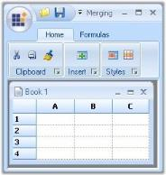

* Super accelerator support for Office Menu button. This is discussed in Customization topic.

* Multiline text support for all Text and ToolTip properties.
* Support to display the gallery items one row at a time when it was invoked by the collapsed ToolStripEx.

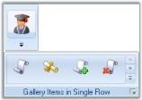

* Collection related properties MainItems and QuickItems to the RibbonControlAdv Header to access items collection.
* AllowCollapse property to restrict the Ribbon Panel from collapsing.
* Events RibbonControlAdv.BeforeCustomizeDropDownPopup and RibbonControlAdv.AfterCustomizeDropDownPopup that occurs before/after DropDown of QuickItemsDropDownButton is shown.
* Events like RibbonControlAdv.Header.QuickItems.BeforeAddItem and RibbonControlAdv.Header.QuickItems.BeforeRemoveItem that occurs before ToolStripItem is added/removed from the QuickAccessPanel collection.
* RibbonControlAdv.SelectedTabItemChanged that occurs when selected ToolStripTabItem has changed.
* Method RibbonControlAdv.ShowCustomizeDialog that shows QuickItems customizing dialog.
* Checkbox item option with Tristate behavior in the ToolStripEx items collection.
* RadioButton item option in the ToolStripEx items collection.
* Ability to define the color scheme for the RibbonControlAdv, RibbonForm, StatusStripEx and Office2007Form.
* Tooltip features included for ToolStripEx in this new version. 
* New ToolStrip item, ComboBoxEx is added, which has Office 2007 look and feel and resizable dropdown height feature at run time.

Office2007 Form

Office2007 Form which does not have any dependency in RibbonControlAdv is now available in Essential suite. It supports all three color schemes, help button, Right To left feature everything similar to the normal form with the Office2007 look and feel.

New property UseOffice2007SchemeBackColor is added, which lets you use the Office2007 scheme color, as the back color for the Office2007 Form.

MiniToolBar

MiniToolBar control which is available in the Essential Tools will appear when the user selects a text. It gives options to customize the selected text. 

Added ability to associate MiniToolBar to any control with a AssociatedControl property.

StatusStripEx

It can be docked to the bottom of the Form. It can hold controls like TrackBarEx, ProgressBar, StatusStripButton. See StatusStripEx.

Custom colors can be applied to StatusStripEx. 

ScrollersFrame

ScrollersFrame is a new control that attaches scrollbars to any control, that is added to the form. This supports all three color schemes.

Custom colors can be applied to ScrollerFrame. 

ContextMenuStripEx 

ContextMenuStripEx control that appears on right clicking during runtime, has numerous advanced features.

* RightToLeft support for the items in the ContextMenuStripEx.
* The shadow of the ContextMenuStripEx can be made visible or hidden.
* It supports Office2007 color schemes.
* It can have a header associated with it.

TrackBarEx

* This control allows the user to slide between minimum value and maximum value specified through a pointer. See TrackBarEx. 
* Orientation property for the TrackBarEx with options vertical and horizontal.
* Scroll Event is added to the TrackBarEx control.

SuperToolTip

Essential Tools has come up with a new control known as the Super ToolTip which, enables the user to give tooltip information using this control with an  appealing look and feel.

The SuperToolTip can have three segments, Header, body and Footer to display the content. The superToolTip control supports high level customization of the SuperTooltip Look and Feel through properties for colors, Images and Text.

SuperAccelerator

With this component users can accelerate the click event of items by using a Single key stroke without mouse hover on it. This control have options to customize the look and feel of the Key tips. See Super Accelerator.

Quick Access Toolbar

Office2007 form look and feel for QAT dialog.

### Office2007 Form

Office2007 Form which does not have any dependency in RibbonControlAdv is now available in Essential suite. It supports all three color schemes, help button, Right To left feature everything similar to the normal form with the Office2007 look and feel.

#### Creating Office2007Form

The default forms can be changed into the Office2007 Form by following the below given steps.

1. Open a Visual Studio project. 
2. Add the assembly Syncfusion.Shared.Base in the reference. (Right click the References in the Solution explorer and click Add Reference to add the assembly. 
3. In the form's code Editor, add the namespace.

   ~~~ cs

		using Syncfusion.Windows.Forms;

   ~~~
   {:.prettyprint }

   ~~~ vbnet

		Imports Syncfusion.Windows.Forms

   ~~~
   {:.prettyprint }

4. Now change your class to inherit the Office2007Form instead of the default Form as follows.

   ~~~ cs

		public partial class Form1 : Office2007Form 

   ~~~
   {:.prettyprint }

   ~~~ vbnet

		Partial Public Class Form1 Inherits Office2007Form

   ~~~
   {:.prettyprint }

#### Color Schemes

Office2007 Form supports all the three office color schemes which can be edited through ColorSchemes property.

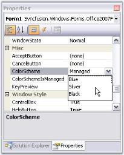



//To set Blue color scheme

this.ColorScheme = Office2007Theme.Blue;





'To set Blue color scheme

Me.ColorScheme = Office2007Theme.Blue



Background Color for Office2007 Form

The background of the Office2007 form can be same, as the color scheme applied to the form. Set UseOffice2007SchemeBackColor property to true to make this effective.



this.UseOffice2007SchemeBackColor = true;





Me.UseOffice2007SchemeBackColor = True



Vista Aero Theme

Vista Aero theme support is available for Office Form when used in Vista machine.

Office2007Form Color Scheme Settings

Office2007Forms now have the ability to apply or not to apply AeroTheme on forms with a glassy effect. This can be done by ApplyAeroTheme property, setting its value either to True or False.

AeroTheme support is available for Office2007Form when used in Vista machine. Earlier ColorSchemes cannot be applied to Office2007Form when AeroTheme was enabled. Now ColorSchemes can be applied by disabling AeroTheme on Office2007Form. 

The following code illustrates how ColorSchemes can be applied by disabling AeroTheme on Office2007Form.



// Disables Aero Theme on Office2007Form.

this. ApplyAeroTheme = false;





‘Disables Aero Theme on Office2007Form.

Me. ApplyAeroTheme = false;



#### Caption Settings

The Office2007Form's caption can be aligned to left, right or center using CaptionAlign property. It font style can be specified in CaptionFont property.



this.CaptionAlign = System.Windows.Forms.HorizontalAlignment.Center;

this.CaptionFont = new System.Drawing.Font("Arial", 12.25F, System.Drawing.FontStyle.Bold, System.Drawing.GraphicsUnit.Point, ((byte)(0)));





Me.CaptionAlign = System.Windows.Forms.HorizontalAlignment.Center 

Me.CaptionFont = New System.Drawing.Font("Arial", 12.25F, System.Drawing.FontStyle.Bold, System.Drawing.GraphicsUnit.Point, CByte((0))) 



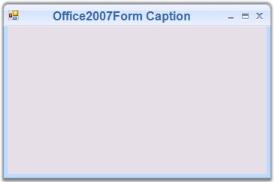

#### Caption Fore Color Settings 

Office2007Form now allows changing its color of the text on the caption. This can be achieved by setting the CaptionForeColor property. The following code illustrates this:



// Applies to the Color of Caption Text.

this.CaptionForeColor = Color.Green;





‘Applies to the Color of Caption Text.

Me.CaptionForeColor = Color.Green



### Office2010 Form

#### Creating Office2010 Form

The default forms can be changed to an Office 2010 form by following these steps:

1. Open a Visual Studio project. 
2. Add the assembly Syncfusion.Shared.Base in the reference. (Right-click the References in the Solution Explorer and click Add Reference to add the assembly. 
3. In the form's code editor, add the namespace.

   ~~~ cs

		using Syncfusion.Windows.Forms;

   ~~~
   {:.prettyprint }

   ~~~ vbnet

		Imports Syncfusion.Windows.Forms

   ~~~
   {:.prettyprint }

4. Now change your class to inherit the Office2010 Form instead of the default form as follows:

   ~~~ cs

		public partial class Form1 : Office2010Form 

   ~~~
   {:.prettyprint }

   ~~~ vbnet

		Partial Public Class Form1 Inherits Office2010Form

   ~~~
   {:.prettyprint }

#### Color Schemes

The Office2010 Form supports three color schemes that can be edited through the ColorSchemes property. 



//To set Blue color scheme.

this.ColorScheme = Office2010Theme.Blue;





'To set Blue color scheme.

Me.ColorScheme = Office2010Theme.Blue



_Figure_ _1142_: Office2010 Form with Blue Theme

_Figure_ _1143_: Office2010 Form with Black Theme

_Figure_ _1144_: Office2010 Form with Silver Theme

#### Background Color for Office2010 Form

The background of the Office2010 form can be same as the color scheme applied to the form by setting the UseOffice2010SchemeBackColor property to true to make this effective.



this.UseOffice2010SchemeBackColor = true;





Me.UseOffice2010SchemeBackColor = True



#### Office2010 Form Color Scheme Settings

Office2010 Forms now have the option to apply the Aero theme on forms, which provides a glassy effect. This can be done through the ApplyAeroTheme property, and setting its value either to True or False.

Aero theme support is available for Office2010 Forms when used on Windows Vista machines. Previously, ColorSchemes could not be applied to the Office2010 Form when the Aero theme was enabled. Now, ColorSchemes can be applied by disabling the Aero theme on Office2010 Forms. 

The following code illustrates how ColorSchemes can be applied by disabling AeroTheme on an Office2010 Form.



// Disables Aero Theme on Office2010 Form.

this. ApplyAeroTheme = false;





‘Disables Aero Theme on Office2010 Form.

Me. ApplyAeroTheme = false;



#### Offcie2010 Form Caption Align

The Office2010 Form's caption can be aligned to the left, right, or center by using the CaptionAlign property. Its font style can be specified in the CaptionFont property.



this.CaptionAlign = System.Windows.Forms.HorizontalAlignment.Center;

this.CaptionFont = new System.Drawing.Font("Arial", 12.25F, System.Drawing.FontStyle.Bold, System.Drawing.GraphicsUnit.Point, ((byte)(0)));





Me.CaptionAlign = System.Windows.Forms.HorizontalAlignment.Center 

Me.CaptionFont = New System.Drawing.Font("Arial", 12.25F, System.Drawing.FontStyle.Bold, System.Drawing.GraphicsUnit.Point, CByte((0))) 



#### Caption Fore Color Settings

The Office2010 Form the color of the text in its caption to be changed. This can be achieved by setting the CaptionForeColor property. The following code illustrates this:



// Applies the color to caption text.

this.CaptionForeColor = Color.Green;





‘Applies the color to caption text.

Me.CaptionForeColor = Color.Green



### Metro Form

#### Place an Image in the Caption Bar

The following code sample shows how to add an image to the caption bar of the Metro form.



Syncfusion.Windows.Forms.CaptionImage captionImage1 = new Syncfusion.Windows.Forms.CaptionImage();

captionImage1.BackColor = System.Drawing.Color.Transparent;

captionImage1.Image = global::MetroStyleControls_2008.Properties.Resources.RBNormal;

captionImage1.Location = new System.Drawing.Point(30, 5);

captionImage1.Name = "CaptionImage1";

captionImage1.Size = new System.Drawing.Size(50, 50);

this.CaptionImages.Add(captionImage1);





Dim captionImage1 As Syncfusion.Windows.Forms.CaptionImage = New Syncfusion.Windows.Forms.CaptionImage
captionImage1.BackColor = System.Drawing.Color.Transparent
captionImage1.Image = MetroStyleControls_2008.Properties.Resources.RBNormal
captionImage1.Location = New System.Drawing.Point(30, 5)
captionImage1.Name = "CaptionImage1"
captionImage1.Size = New System.Drawing.Size(50, 50)
Me.CaptionImages.Add(captionImage1)



In order to change the position of the image, users should handle the image location property and change the position programmatically.

Mouse Events for Caption Image

MouseDown and MouseUp Event

The MouseDown event is raised when the mouse pointer is over the caption image and a mouse button is pressed. The MouseUp event is raised when the mouse pointer is over the caption image and a mouse button is released. An example that uses the MouseDown and MouseUp events can be found later in this section.

MouseEnter, MouseLeave, and MouseMove Event

The MouseEnter event is raised when the mouse pointer enters the caption image. The MouseLeave event is raised when the mouse pointer leaves the caption image. The MouseMove event is raised when the mouse pointer moves within the caption image. An example that uses the MouseEnter, MouseLeave, and MouseMove events can be found later in this section.

Event Data

The MouseEventHandler receives an argument of type MouseEventArgs that contains data related to this event. The following MouseEventArgs members provide information specific to this event.

_Table_ _676_: Members Table

<table>
<tr>
<td>
Members</td><td>
Description</td></tr>
<tr>
<td>
Button</td><td>
Gets which mouse button was pressed.</td></tr>
<tr>
<td>
Clicks</td><td>
Gets the number of times the mouse button was pressed and released.</td></tr>
<tr>
<td>
Delta</td><td>
Gets a signed count of the number of detents the mouse wheel has rotated. A detent is one notch of the mouse wheel.</td></tr>
<tr>
<td>
Location</td><td>
Gets the location of the mouse when generating mouse events.</td></tr>
<tr>
<td>
X</td><td>
Gets the x-coordinate of the mouse when generating mouse events.</td></tr>
<tr>
<td>
Y</td><td>
Gets the y-coordinate of the mouse when generating mouse events.</td></tr>
<tr>
<td>
Size</td><td>
Gets or sets the size for caption image.</td></tr>
<tr>
<td>
Back Color</td><td>
Gets or sets the background color for the caption image.</td></tr>
<tr>
<td>
Image</td><td>
Getsor sets the image for the caption image.</td></tr>
</table>



foreach (CaptionImage image in this.CaptionImages)

            {

                image.ImageMouseUp += new CaptionImage.MouseUp(image_ImageMouseUp);

                image.ImageMouseDown += new CaptionImage.MouseDown(image_ImageMouseDown);

                image.ImageMouseMove+= new CaptionImage.MouseMove(image_ImageMouseMove);

                image.ImageMouseEnter += new CaptionImage.MouseEnter(image_ImageMouseEnter);

                image.ImageMouseLeave += new CaptionImage.MouseLeave(image_ImageMouseLeave);

            }

   void image_ImageMouseUp(object sender, ImageMouseUpEventArgs e)

   {

      Console.WriteLine(“Mouse up event has been raised”);

   }

   void image_ImageMouseDown(object sender, ImageMouseDownEventArgs e)

   {

      Console.WriteLine(“Mouse down event has been raised”);

   }

  void image_ImageMouseMove(object sender, ImageMouseMoveEventArgs e)

   {

      Console.WriteLine(“Mouse move event has been raised”);

   }

  void image_ImageMouseEnter(object sender, ImageMouseEnterEventArgs e)

   {

      Console.WriteLine(“Mouse enter event has been raised”);

   }

  void image_ImageMouseLeave(object sender, ImageMouseLeaveEventArgs e)

   {

      Console.WriteLine(“Mouse leave event has been raised”);

   }





For Each image As CaptionImage In Me.CaptionImages
    image.ImageMouseUp = (image.ImageMouseUp + New CaptionImage.MouseUp(image_ImageMouseUp))
    image.ImageMouseDown = (image.ImageMouseDown + New CaptionImage.MouseDown(image_ImageMouseDown))
    image.ImageMouseMove = (image.ImageMouseMove + New CaptionImage.MouseMove(image_ImageMouseMove))
    image.ImageMouseEnter = (image.ImageMouseEnter + New CaptionImage.MouseEnter(image_ImageMouseEnter))
    image.ImageMouseLeave = (image.ImageMouseLeave + New CaptionImage.MouseLeave(image_ImageMouseLeave))
Next

    Private Sub image_ImageMouseUp(ByVal sender As Object, ByVal e As ImageMouseUpEventArgs)
        Console.WriteLine(Mouse, up, event, has, been, raised)
    End Sub

    Private Sub image_ImageMouseDown(ByVal sender As Object, ByVal e As ImageMouseDownEventArgs)
        Console.WriteLine(Mouse, down, event, has, been, raised)
    End Sub

    Private Sub image_ImageMouseMove(ByVal sender As Object, ByVal e As ImageMouseMoveEventArgs)
        Console.WriteLine(Mouse, move, event, has, been, raised)
    End Sub

    Private Sub image_ImageMouseEnter(ByVal sender As Object, ByVal e As ImageMouseEnterEventArgs)
        Console.WriteLine(Mouse, enter, event, has, been, raised)
    End Sub

    Private Sub image_ImageMouseLeave(ByVal sender As Object, ByVal e As ImageMouseLeaveEventArgs)
        Console.WriteLine(Mouse, leave, event, has, been, raised)
    End Sub



### RibbonControlAdv 

RibbonControlAdv added to the Office2007 now comes with a couple of features and customization properties which presents the control with a great look and feel like MS Office 2007. This user guide explains all the controls that can be added to the RibbonControlAdv in detail.

#### Overview

This section gives you an overview of the components of a RibbonControlAdv.

Components

* Ribbon Form
* Office Menu Button
* Quick Panel
* RibbonPanel
* ToolStripTabItem
* ToolStripItems
* ToolStripEx

See Also

Ribbon Control Items

#### Ribbon Form

EssentialStudio now gives a similar look and feel of MS Office 2007, to its Office 2007 controls, using RibbonControlAdv which comes with rounded corners. This section will guide you in creating a Ribbon form using RibbonControlAdv. 

Creating Ribbon Form

1. Drag and drop the RibbonControlAdv on to the form.

   

2. To convert an ordinary form to Ribbon form, do the following.

The forms in the application by default will extend to the Form class. Add the respective namespace and programmatically change it as RibbonForm class.



using Syncfusion.Windows.Forms.Tools;

public partial class Form1 : RibbonForm 





Imports Syncfusion.Windows.Forms.Tools

Partial Public Class Form1



Inherits RibbonForm

##### Appearance Settings

This section discusses various appearance and behavior settings of the Ribbon form.

Appearance Settings

The appearance of the ribbon form can be controlled using the below properties.

_Table_ _677_: Property Table

<table>
<tr>
<td>
Property</td><td>
Description</td></tr>
<tr>
<td>
Appearance</td><td>
Sets the appearance of the form. The values are,Normal andOffice2007 (Default)Office 2010</td></tr>
<tr>
<td>
ColorScheme</td><td>
Specifies the office color scheme of the Ribbon form. The color schemes are, Blue, Black, Silver and Managed (Default).</td></tr>
<tr>
<td>
EnableAeroTheme</td><td>
Specifies the Aero theme of the Ribbon form. </td></tr>
<tr>
<td>
EnableHighContrastTheme</td><td>
Specifies whether to use default High Contrast theme color</td></tr>
</table>



//Specifies the appearance of the form.

this.Appearance = AppearanceType.Office2007;

//Specifies the office color scheme of the Ribbon Form.

this.ColorScheme = ColorSchemeType.Blue;

//To disable the Aerotheme

this.EnableAeroTheme = false;

//To enable the default High Contrast theme color

this.ribbonControlAdv1.EnableHighContrastTheme = true;





'Specifies the appearance of the form.
Me.Appearance = AppearanceType.Office2007

'Specifies the office color scheme of the Ribbon Form.
Me.ColorScheme = ColorSchemeType.Blue

'To disable the Aerotheme
Me.EnableAeroTheme = false

'To enable the default High Contrast theme color

Me.ribbonControlAdv1.EnableHighContrastTheme = true



Vista Aero Theme

Vista Aero theme support is available for Ribbon Form when used in Vista machine.

##### Customization

The property which lets you set borders for the Office2007Style form is as follows.

_Table_ _678_: Property Table

<table>
<tr>
<td>
Property</td><td>
Description</td></tr>
<tr>
<td>
Borders</td><td>
Gets/sets the border values of an Office 2007 style form. Sets borders for Left, Top, Right and Bottom sides of the form.</td></tr>
</table>



this.Borders = new System.Windows.Forms.Padding(10);





Me.Borders = New System.Windows.Forms.Padding(10)



Customizing the Top Left Edge

This TopLeftRadius property gets/sets the curved radius of the top left edge of the form. Default is 8.



this.TopLeftRadius = 20;





Me.TopLeftRadius = 20



#### Ribbon Control Items

This section discusses the following Ribbon Control Items.

##### Office Menu Button

The RibbonControlAdv has the office menu button at the top left corner of the form. Controls can be added to the panels of the office menu button dropdown through designer without a single piece of code.

###### MenuButton Drop Down

When the OfficeMenuButton is clicked, ToolStripDropDown is displayed. This dropdown can be customized through designer as well as through code. 

Through Designer Using Menu Panels

RibbonControlAdv lets you add customized ToolStrip items in the OfficeMenu button dropdown with the help of the menu panels. 

The panels are:

* Aux Panel
* Main Panel
* System Panel

Adding ToolStrip Items to the Panels

Each Panel has Items property which invokes the Items Collection Editor. Using this editor you can add the toolstrip items easily.

_Table_ _679_: Property Table

<table>
<tr>
<td>
Property</td><td>
Description</td></tr>
<tr>
<td>
Items</td><td>
Lets you open Items Collection Editor using which you can add items to the panel.</td></tr>
</table>

Programmatically Adding a ToolStripDropDown

ToolStripDropDown can be added programmatically using ToolStripDropDown class and then assigning it to the RibbonControlAdv.MenuDropDownButton property as follows.

_Table_ _680_: Property Table

<table>
<tr>
<td>
Property</td><td>
Description</td></tr>
<tr>
<td>
MenuButtonDropDown</td><td>
Gets / Sets ToolStripDropDown to be displayed, when the OfficeMenuButton is clicked.</td></tr>
</table>



// Initialize a ToolStripDropDown button.

ToolStripDropDown dropDown = new ToolStripDropDown();

//Initialize the controls that are to be added in the panel.

ToolStripButton newBtn = new ToolStripButton("&New");

ToolStripButton openBtn = new ToolStripButton("&Open");

ToolStripButton saveBtn = new ToolStripButton("&Save");

ToolStripButton closeBtn = new ToolStripButton("&Close");

// Initialize a new panel (Panel 1)

ToolStripPanelItem panel1 = new ToolStripPanelItem();

panel1.Items.Add(newBtn);

panel1.Items.Add(openBtn);

panel1.Items.Add(saveBtn);

panel1.Items.Add(closeBtn);

// Set the row count.

panel1.RowCount = 9;

//Settings for the buttons

foreach (ToolStripButton btn in panel1.Items)

{

    btn.AutoSize = false;

    btn.Size = new Size(170, 35);

    btn.ImageAlign = ContentAlignment.MiddleLeft;

    btn.TextAlign = ContentAlignment.MiddleLeft;

    btn.ImageScaling = ToolStripItemImageScaling.None;

}

// Add the panel into the items of the ToolStripDropDown.

dropDown.Items.Add(panel1);

// Set the MenuButtonDropDown property of the RibbonControlAdv.

this.ribbonControlAdv1.MenuButtonDropDown = dropDown;





' Initialize a ToolStripDropDown button. 

Dim dropDown As New ToolStripDropDown()

'Initialize the controls that are to be added in the panel. 

Dim newBtn As New ToolStripButton("&New")

Dim openBtn As New ToolStripButton("&Open")

Dim saveBtn As New ToolStripButton("&Save")

Dim closeBtn As New ToolStripButton("&Close")

' Initialize a new panel (Panel 1) 

Dim panel1 As New ToolStripPanelItem()

panel1.Items.Add(newBtn) 

panel1.Items.Add(openBtn) 

panel1.Items.Add(saveBtn) 

panel1.Items.Add(closeBtn) 

' Set the row count. 

panel1.RowCount = 9 

'Settings for the buttons 

For Each btn As ToolStripButton In panel1.Items 

    btn.AutoSize = False 

    btn.Size = New Size(170, 35) 

    btn.ImageAlign = ContentAlignment.MiddleLeft 

    btn.TextAlign = ContentAlignment.MiddleLeft 

    btn.ImageScaling = ToolStripItemImageScaling.None 

Next 

' Add the panel into the items of the ToolStripDropDown. 

dropDown.Items.Add(panel1) 

' Set the MenuButtonDropDown property of the RibbonControlAdv. 

Me.ribbonControlAdv1.MenuButtonDropDown = dropDown



Adding ContextMenuStripEx as OfficeMenuDropDown

You can also display a ContextMenuStrip in the OfficeMenu button dropdown. This can be done by assigning a custom ContextMenuStrip to the RibbonControlAdv.MenuButtonDropDown property.



this.ribbonControlAdv1.MenuButtonDropDown = this.contextMenuStripEx1;





Me.ribbonControlAdv1.MenuButtonDropDown = Me.contextMenuStripEx1



Properties

Panel Text

Text for the MenuButtonDropDown panels and its font style can be specified using the below properties.

_Table_ _681_: Property Table

<table>
<tr>
<td>
Property</td><td>
Description</td></tr>
<tr>
<td>
Text</td><td>
Sets text for the panel.</td></tr>
<tr>
<td>
Font</td><td>
Sets the Font style for the text.</td></tr>
</table>



this.ribbonControlAdv1.OfficeMenu.AuxPanel.Text = "Recent Documents";

this.ribbonControlAdv1.OfficeMenu.AuxPanel.Font = new System.Drawing.Font("Verdana", 8.25F);





Me.ribbonControlAdv1.OfficeMenu.AuxPanel.Text = "Recent Documents" 

Me.ribbonControlAdv1.OfficeMenu.AuxPanel.Font = New System.Drawing.Font("Verdana", 8.25F) 



Adding Separator and Minimum Size Settings

The property which adds a line separator between the toolstrip items and the property which sets the minimum size for the panels is as follows.

_Table_ _682_: Property Table

<table>
<tr>
<td>
Property</td><td>
Description</td></tr>
<tr>
<td>
SeparatorIndent</td><td>
Inserts a line separator between the menu items.</td></tr>
<tr>
<td>
MinimumSize</td><td>
Specifies minimum size for the panels.</td></tr>
</table>



this.ribbonControlAdv1.OfficeMenu.MainPanel.SeparatorIndent = 15;

this.ribbonControlAdv1.OfficeMenu.AuxPanel.MinimumSize = new System.Drawing.Size(30, 30);





Me.ribbonControlAdv1.OfficeMenu.MainPanel.SeparatorIndent = 15

Me.ribbonControlAdv1.OfficeMenu.AuxPanel.MinimumSize = New System.Drawing.Size(30, 30)



Adding Items to the Dropdown

The ToolStrip Items which can be added to the Menu Panels, using the Panel's Items Collection Editor dialog are as follows.

* Button – Adds button to the panel.
* Label – Adds label to the panel.
* SplitButton – Adds a button with a split appearance.
* DropDownButton – Adds drop down button.
* Separator – Adds a line separator in the panel.
* ComboBox – Adds a combo box.
* Textbox – Adds a textbox.
* ProgressBar – Adds a progress bar to the panel.
* CheckBox – Added a checkbox.
* RadioButton – Adds a radio button.
* OfficeButton – Adds an office button.
* OfficeDropDownButton – Adds a office dropdown button.
* OfficeSplitButton – Adds a Office split button.
* SplitButtonEx – Adds SplitButtonEx control item.
* PanelItem - Adds panel items.
* Gallery – Add Gallery item.

The properties of ToolStripItems are available in Items Collection Editor which lets you customize the appearance of the items.

OfficeButton Properties

This section discusses the properties of Office button toolstrip items.

Common Properties for the Office buttons

_Table_ _683_: Property Table

<table>
<tr>
<td>
Property</td><td>
Description</td></tr>
<tr>
<td>
Text</td><td>
Sets the text for the item.</td></tr>
<tr>
<td>
TextAlign</td><td>
Specifies the alignment of the text in the item.</td></tr>
<tr>
<td>
TextDirection</td><td>
Sets the direction of the text in the item. The options are,Horizontal,Vertical90 andVertical270.</td></tr>
<tr>
<td>
TextImageRelation</td><td>
Represents image and text relation.</td></tr>
<tr>
<td>
DisplayStyle</td><td>
Sets the display style of the item. The options are,{{ '_Text_' | markdownify }} - Displays only text,{{ '_Image_' | markdownify }} - Displays only image,{{ '_ImageAndText_' | markdownify }} - Displays image and the text in the office button.</td></tr>
<tr>
<td>
Font</td><td>
Sets the font style for the text in the item.</td></tr>
<tr>
<td>
ForeColor</td><td>
Sets the forecolor for the display text.</td></tr>
<tr>
<td>
Image</td><td>
Sets the image for the item.</td></tr>
<tr>
<td>
ImageAlign</td><td>
Sets the alignment of the image.</td></tr>
<tr>
<td>
ImageScaling</td><td>
Specifies the scaling of the image whether SizeToFit or None.</td></tr>
<tr>
<td>
ImageTransparentColor</td><td>
Represents the transparent color for the image.</td></tr>
<tr>
<td>
Visible</td><td>
Sets the visibility of the toolstrip item.</td></tr>
<tr>
<td>
AutoTooltip</td><td>
Lets you to specify whether the tooltip text is taken from the Text property or the ToolTipText property. {{ '_True_' | markdownify }} - Tooltip text is taken from the Text property,{{ '_False_'  | markdownify }}- Tooltip text is taken from the ToolTipText property.OfficeMenu.ShowItemToolTips should be true for this setting to be effective.</td></tr>
<tr>
<td>
ToolTipText</td><td>
Sets the tooltip text when AutoTooltip is false and ShowItemToolTips is true.</td></tr>
<tr>
<td>
Enabled</td><td>
Enables / Disables the item.</td></tr>
<tr>
<td>
Alignment</td><td>
Sets the alignment for the ToolStrip item.</td></tr>
</table>
Office Button

_Table_ _684_: Property Table

<table>
<tr>
<td>
Property</td><td>
Description</td></tr>
<tr>
<td>
Checked</td><td>
Specifies whether the Office button should be checked, when the application loads.</td></tr>
<tr>
<td>
CheckState</td><td>
Specifies the check state, whether checked, unchecked or indeterminate.</td></tr>
<tr>
<td>
CheckOnClick</td><td>
Indicates whether the button should be checked on a mouse click.</td></tr>
</table>
OfficeSplitButton

The following properties are specific to OfficeSplitButton.

_Table_ _685_: Property Table

<table>
<tr>
<td>
Property</td><td>
Description</td></tr>
<tr>
<td>
DropDownFont</td><td>
Sets the font for the dropdown.</td></tr>
<tr>
<td>
DropDownText</td><td>
Sets the dropdown text.</td></tr>
<tr>
<td>
DropDownItems</td><td>
Specifies the drop down items.</td></tr>
<tr>
<td>
DropDownWidth</td><td>
Shows / hides the dropdown arrow.</td></tr>
</table>

In OfficeSplitButton, the image and the text together will look split from the arrow as shown in the image below.

OfficeDropDownButton

The following properties are specific to OfficeDropDownButton.

_Table_ _686_: Property Table

<table>
<tr>
<td>
Property</td><td>
Description</td></tr>
<tr>
<td>
DropDownFont</td><td>
Sets the font for the dropdown.</td></tr>
<tr>
<td>
DropDownText</td><td>
Sets the dropdown text.</td></tr>
<tr>
<td>
DropDownItems</td><td>
Specifies the drop down items.</td></tr>
<tr>
<td>
ShowDropDownArrow</td><td>
Shows / hides the dropdown arrow.</td></tr>
</table>

Tooltips

OfficeMenuButton can show a SuperToolTip at run time. It can be added using RibbonControlAdv.MenuButtonToolTip on SuperToolTip1 property through Designer or by calling the SetMenuButtonToolTip method of the SuperToolTip control.

> Note: The above extended property will be available only when your application has a SuperToolTip control.



this.superToolTip1.SetMenuButtonToolTip(this.ribbonControlAdv1, toolTipInfo1);





Me.superToolTip1.SetMenuButtonToolTip(Me.ribbonControlAdv1, toolTipInfo1)



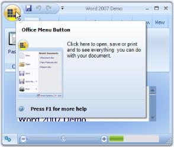

ToolTips for ToolStrip Items in DropDown

Tooltips for the items can be enabled using ShowItemToolTips property. 

Text for the tooltips can be specified in ToolTipText property of the respective ToolStrip items.



//Enabling Tooltips for the menu items

this.ribbonControlAdv1.OfficeMenu.ShowItemToolTips = true;

//Setting ToolTip text for ToolStripButton1

this.toolStripButton1.ToolTipText = "Open";





'Enabling Tooltips for the menu items

Me.ribbonControlAdv1.OfficeMenu.ShowItemToolTips = True

'Setting ToolTip text for ToolStripButton1

Me.toolStripButton1.ToolTipText = "Open"



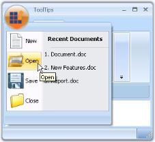

See Also

ToolStripItems

MenuButton Settings 

The following properties controls the appearance of the Menu button.

_Table_ _687_: Property Table

<table>
<tr>
<td>
Property</td><td>
Description</td></tr>
<tr>
<td>
MenuButtonVisible</td><td>
Sets the visibility of the OfficeMenuButton.</td></tr>
<tr>
<td>
MenuButtonImage</td><td>
Gets or sets the image for the OfficeMenuButton.</td></tr>
<tr>
<td>
MenuButtonWidth</td><td>
Specifies the width of the menu button.</td></tr>
</table>



//Sets the visibility of the Menu Button

this.ribbonControlAdv1.MenuButtonVisible = true;

//Sets image for the Menu Button

Image img = Image.FromFile(Application.StartupPath + @"\image.png");

this.ribbonControlAdv1.MenuButtonImage = img;

//Sets width of the Menu Button

this.ribbonControlAdv1.MenuButtonWidth = 50;





'Sets the visibility of the Menu Button

Me.ribbonControlAdv1.MenuButtonVisible = True

'Sets image for the Menu Button

Dim img As Image =  Image.FromFile(Application.StartupPath + "\image.png") 

Me.ribbonControlAdv1.MenuButtonImage = img

'Sets width of the Menu Button

Me.ribbonControlAdv1.MenuButtonWidth = 50



MenuButtonAccelerator

When the SuperAccelerator component is added to the form, an extender property MenuButtonAccelerator on superAccelerator will be added to the RibbonControlAdv properties, where the user can add the key for MenuButton. 



this.superAccelerator1.SetMenuButtonAccelerator(this.ribbonControlAdv1, "F"); 





Me.superAccelerator1.SetMenuButtonAccelerator(Me.ribbonControlAdv1, "F")



At run time when you press Alt key, the menu button will display "F" key as shown in the image.

##### Office-Like Super Accelerator Support

###### Description

The RibbonControlAdv now supports the SuperAccelerator functionality. This allows the user to access the RibbonControlAdv and its components through the keyboard shortcuts as in MS Office.

The SuperAccelerator can be wired to the RibbonControlAdv through the designer and through code.

Through Designer

To add the SuperAccelerator key to the RibbonControlAdv, the control must be wired with a SuperAccelerator component as shown in the following image:

The SuperAccelerator key value for a RibbonControlAdv child element can be assigned from the form designer as shown in the following image:

Through Code

Using the following code, the SuperAccelerator can be assigned to the RibbonControlAdv. Once SuperAccelerator is assigned, its child items can be assigned with SuperAccelerator key values.

Code Sample



SuperAccelerator superAccelerator1 = new SuperAccelerator();

this.ribbonControlAdv1.SuperAccelerator = this.superAccelerator1;



With the following code sample, the SuperAccelerator key value can be assigned to a ToolStripTabItem (named Home in the sample). By specifying controls and accelerator keys in arguments, the SuperAccelerator key will be assigned to the appropriate controls and enable users to select particular controls by pressing the assigned SuperAccelerator keys values on the keyboard.

Code Sample



this.superAccelerator1.SetAccelerator(this.Home, "A");



The following image shows SuperAccelerator key visibility in the RibbonControlAdv:

###### BackStageView

Like in RibbonControlAdv, SuperAccelerators has been implemented in BackStageView. Accelerators can be assigned to BackStageView as shown in following images:

Through Designer

The following image demonstrates how SuperAccelerator key values can be assigned to BackStage child elements:

Through Code 

Using the following code sample, the SuperAccelerator can be assigned to BackStageView. Once SuperAccelerator is assigned to BackStageView, accelerator keys can be specified for its child elements

Code Sample



this.backStage1.SuperAccelerator = this.superAccelerator1;



Using the following code sample, SuperAccelerator can be assigned to BackStage child elements through code.

Code Sample



this.saveButton.Accelerator = "S";



SuperAccelerator in BackStageView

The following image visualizes the SuperAccelerarator in BackStage:

The following image visualizes the SuperAccelerator in BackStageTab child elements:

###### Backstage Splitter for RibbonControlAdv 2013

Adding Separators

The Backstage view lets users add separators between the backstage tabs or buttons.

Separators for Backstage view Through Code

Adding Separator Indices for BackStageView



private Syncfusion.Windows.Forms.BackStageSeparator backStageSeparator1;            

this.backStageSeparator1 = new Syncfusion.Windows.Forms.BackStageSeparator();

this.backStage1.Controls.Add(this.backStageSeparator1);

   // 

   // backStageSeparator1

   // 

this.backStageSeparator1.BackColor = System.Drawing.Color.FromArgb(((int)(((byte)(100)))), ((int)(((byte)(189)))), ((int)(((byte)(255)))));

this.backStageSeparator1.Location = new System.Drawing.Point(19, 60);

this.backStageSeparator1.Name = "backStageSeparator1";

this.backStageSeparator1.Size = new System.Drawing.Size(100, 1);

this.backStageSeparator1.TabIndex = 4;

this.backStageSeparator1.Text = "backStageSeparator1";





Dim backStageSeparator1 As Syncfusion.Windows.Forms.BackStageSeparator
Me.backStageSeparator1 = New Syncfusion.Windows.Forms.BackStageSeparator
Me.backStage1.Controls.Add(Me.backStageSeparator1)
' 
' backStageSeparator1
' 
Me.backStageSeparator1.BackColor = System.Drawing.Color.FromArgb(CType(CType(100,Byte),Integer), CType(CType(189,Byte),Integer), CType(CType(255,Byte),Integer))
Me.backStageSeparator1.Location = New System.Drawing.Point(19, 60)
Me.backStageSeparator1.Name = "backStageSeparator1"
Me.backStageSeparator1.Size = New System.Drawing.Size(100, 1)
Me.backStageSeparator1.TabIndex = 4
Me.backStageSeparator1.Text = "backStageSeparator1"



##### ToolStripTabItem

RibbonControlAdv lets you to create ToolStripTabItems easily using the smart tag. It also adds a RibbonPanel to which ToolStripItems can be added.

A new TabItem can be added to the RibbonControlAdv programmatically using the AddMainItem method. Create a ToolStripTabItem and then add it to the RibbonControlAdv using the below method.



// Adding a new Tab Item

//Declare and initialize a ToolStripTabItem

private Syncfusion.Windows.Forms.Tools.ToolStripTabItem toolStripTabItem1;

this.toolStripTabItem1 = new Syncfusion.Windows.Forms.Tools.ToolStripTabItem();

//Add the tab item to the RibbonControlAdv

this.ribbonControlAdv1.Header.AddMainItem(this.toolStripTabItem1);





'Adding a new Tab Item

'Declare and initialize a ToolStripTabItem

Private toolStripTabItem1 As Syncfusion.Windows.Forms.Tools.ToolStripTabItem

Me.toolStripTabItem1 = New Syncfusion.Windows.Forms.Tools.ToolStripTabItem 

'Add the tab item to the RibbonControlAdv

Me.ribbonControlAdv1.Header.AddMainItem(Me.toolStripTabItem1)



The following sections discusses various appearance and behavior settings for the ToolStripTabItem. 

* Foreground Settings
* Image Settings
* Ribbon Panel
* Keyboard Shortcut
* Appearance and Behavior Settings
Foreground Settings 

Text Settings

The following properties lets you to edit and control the behavior of the text in the ToolStripTabItem.

_Table_ _688_: Property Table

<table>
<tr>
<td>
Property</td><td>
Description</td></tr>
<tr>
<td>
Text</td><td>
Text for the ToolStripTabItem.</td></tr>
<tr>
<td>
TextAlign</td><td>
Alignment of the text in a ToolStripTabItem. The different content alignments are,{{ '_BottomCenter_' | markdownify }} - Vertically aligned at bottom, horizontally aligned at center.{{ '_BottomLeft_' | markdownify }} - Vertically aligned at bottom, horizontally aligned at left.{{ '_BottomRight_' | markdownify }} - Vertically aligned at bottom, horizontally aligned at Right.{{ '_MiddleCenter_' | markdownify }} - Vertically aligned at Middle, horizontally aligned at Center. (Default){{ '_MiddleLeft_' | markdownify }} - Vertically aligned at Middle, horizontally aligned at Left.{{ '_MiddleRight_' | markdownify }} - Vertically aligned at Middle, horizontally aligned at Right.{{ '_TopCenter_' | markdownify }} - Vertically aligned at Top, horizontally aligned at Center.{{ '_TopLeft_' | markdownify }} - Vertically aligned at Top, horizontally aligned at Left.{{ '_TopRight_' | markdownify }} - Vertically aligned at Top, horizontally aligned at Right.</td></tr>
<tr>
<td>
TextDirection</td><td>
Direction of drawing the text. {{ '_Horizontal_' | markdownify }} - specifies horizontal text orientation; (Default){{ '_Inherit_' | markdownify }} - specifies that the text direction is inherited from the parent control; {{ '_Vertical270_' | markdownify }} - specifies that the text is rotated 270 degrees; {{ '_Vertical90_' | markdownify }} - specifies that the text is rotated 90 degrees.</td></tr>
<tr>
<td>
TextImageRelation</td><td>
Relative location of the image to the text in the ToolStripTabItem. See Image Settings.The various options available are,{{ '_Overlay,_'  | markdownify }}{{ '_ImageAboveText, (Default)_' | markdownify }}{{ '_TextAboveImage,_'  | markdownify }}{{ '_ImageBeforeText and_'  | markdownify }}{{ '_TextBeforeImage._' | markdownify }}</td></tr>
<tr>
<td>
DisplayStyle</td><td>
Specifies whether image and text are rendered. The options are,Text,Image and ImageAndText.(Default)</td></tr>
</table>



this.toolStripTabItem1.Text = "Features";

this.toolStripTabItem1.TextAlign = System.Drawing.ContentAlignment.MiddleLeft;

this.toolStripTabItem1.TextDirection = System.Windows.Forms.ToolStripTextDirection.Horizontal;

this.toolStripTabItem1.TextImageRelation = System.Windows.Forms.TextImageRelation.ImageBeforeText;

this.toolStripTabItem1.DisplayStyle = ToolStripItemDisplayStyle.ImageAndText;





Me.toolStripTabItem1.Text = "Features"

Me.toolStripTabItem1.TextAlign = System.Drawing.ContentAlignment.MiddleLeft

Me.toolStripTabItem1.TextDirection = System.Windows.Forms.ToolStripTextDirection.Horizontal

Me.toolStripTabItem1.TextImageRelation = System.Windows.Forms.TextImageRelation.ImageBeforeText

Me.toolStripTabItem1.DisplayStyle = ToolStripItemDisplayStyle.ImageAndText



The appearance of the text can be controlled using the below properties.

_Table_ _689_: Property Table

<table>
<tr>
<td>
Property</td><td>
Description</td></tr>
<tr>
<td>
Font</td><td>
Set Font Style for the text.</td></tr>
<tr>
<td>
ForeColor</td><td>
Sets fore color for the text.</td></tr>
</table>



this.toolStripTabItem1.Font = new System.Drawing.Font("Verdana", 8.25F, System.Drawing.FontStyle.Bold);

this.toolStripTabItem1.ForeColor = System.Drawing.Color.SteelBlue;





Me.toolStripTabItem1.Font = New System.Drawing.Font("Verdana", 8.25F, System.Drawing.FontStyle.Bold)

Me.toolStripTabItem1.ForeColor = System.Drawing.Color.SteelBlue



See Also

Image Settings

RibbonPanel

Appearance and Behavior Settings

Image Settings 

The below properties controls the image settings for the ToolStripTabItem.

_Table_ _690_: Property Table

<table>
<tr>
<td>
Property</td><td>
Description</td></tr>
<tr>
<td>
Image</td><td>
Sets the image for the Tab item.</td></tr>
<tr>
<td>
ImageAlign</td><td>
Specifies alignment of the image.</td></tr>
<tr>
<td>
ImageScaling</td><td>
Specifies whether the image on the item will size to fit on the Toolstrip.</td></tr>
<tr>
<td>
ImageTransparentColor</td><td>
Sets the transparent color on the items image.</td></tr>
</table>



//Settings image properties

this.toolStripTabItem1.Image = ((System.Drawing.Image)(resources.GetObject("toolStripTabItem1.Image")));

this.toolStripTabItem1.ImageAlign = System.Drawing.ContentAlignment.MiddleRight;

this.toolStripTabItem1.ImageScaling = System.Windows.Forms.ToolStripItemImageScaling.None;

this.toolStripTabItem1.ImageTransparentColor = System.Drawing.Color.FloralWhite;





'Settings image properties

Me.toolStripTabItem1.Image = ((System.Drawing.Image)(resources.GetObject("toolStripTabItem1.Image")))

Me.toolStripTabItem1.ImageAlign = System.Drawing.ContentAlignment.MiddleRight

Me.toolStripTabItem1.ImageScaling = System.Windows.Forms.ToolStripItemImageScaling.None

Me.toolStripTabItem1.ImageTransparentColor = System.Drawing.Color.FloralWhite



See Also

Foreground Settings

Ribbon Panel

Keyboard Shortcut

Appearance and Behavior Settings

Appearance and Behavior Settings 

Appearance Settings

The Padding property specifies the internal padding within the ToolStripTabItem.



this.toolStripTabItem2.Padding = new System.Windows.Forms.Padding(4);





Me.toolStripTabItem2.Padding = New System.Windows.Forms.Padding(4)



Behavior Settings

The below properties illustrates the behavior settings.

_Table_ _691_: Property Table

<table>
<tr>
<td>
Property</td><td>
Description</td></tr>
<tr>
<td>
Enabled</td><td>
Enables the Tab item.</td></tr>
<tr>
<td>
AutoSize</td><td>
If set to true, ToolStripTabItem will automatically size itself based on the image and text. Default values is true.</td></tr>
<tr>
<td>
DoubleClickEnabled</td><td>
Specifies whether the ToolStripTabItem can be activated by double clicking the tab item. This raises the DoubleClick event.</td></tr>
<tr>
<td>
Visible</td><td>
Sets the visibility of the tab item.</td></tr>
</table>
ToolTips

AutoToolTip and ToolTipText properties are used for this purpose.

_Table_ _692_: Property Table

<table>
<tr>
<td>
Property</td><td>
Description</td></tr>
<tr>
<td>
AutoToolTip</td><td>
When set to false will display the text set in ToolTipText. When set to true will display the tab item text.</td></tr>
<tr>
<td>
ToolTipText</td><td>
Sets the Tooltip text.</td></tr>
</table>

###### Ribbon Panel

A ribbon panel is automatically added when you add a ToolStripTabItem. ToolStripEx can be added to the Ribbon panel using its smart tag.

See Also 

How to prevent the RibbonPanel of the RibbonControlAdv from collapsing?

OfficeColorScheme

The ribbon panel supports all the three office color schemes. Blue, black and silver schemes.



this.toolStripTabItem2.Panel.OfficeColorScheme = Syncfusion.Windows.Forms.Tools.ToolStripEx.ColorScheme.Blue;





Me.toolStripTabItem2.Panel.OfficeColorScheme = Syncfusion.Windows.Forms.Tools.ToolStripEx.ColorScheme.Blue



Office 2013 Color Schemes

The RibbonControlAdv includes new color schemes as available in the Office 2013 suite to provide a more personalized experience with the RibbonControlAdv.

RibbonControlAdv now supports three themes: White, LightGray, and DarkGray. These themes can be set through the Office2013ColorScheme property to tone down the bright white background of the ribbon. 

The following code sample illustrates how to set the DarkGray theme for the Office 2013 style RibbonControl.



this.ribbonControlAdv1.Office2013ColorScheme = Office2013ColorScheme.DarkGray;





Me.ribbonControlAdv1.Office2013ColorScheme = Office2013ColorScheme.DarkGray



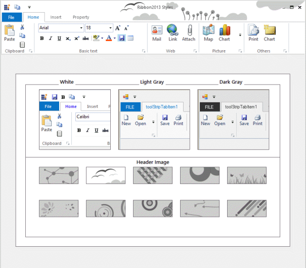

Touch Mode behavior for RibbonControlAdv

Enabling Touch Mode 

 You can control touch mode settings of RibbonControlAdv control using the following property.

_Table_ _693_: Property Table

<table>
<tr>
<td>
Property</td><td>
Type</td><td>
Description</td></tr>
<tr>
<td>
RibbonTouchModeEnabled</td><td>
Boolean</td><td>
Enabling the RibbonTouchModeEnabled property in RibbonContolAdv, increases the size according to Microsoft touch mode size. Disabling the property retains its original size.</td></tr>
</table>



 //Enables touch mode for the RibbonControlAdv control

this.ribbonControlAdv1. RibbonTouchModeEnabled = true;





 'Enables touch mode for the RibbonControlAdv control

Me.ribbonControlAdv1. RibbonTouchModeEnabled = True



_Figure_ _1187_: RibbonControlAdv Style Demo

## Designer Support

Designer property

The Office2013ColorScheme Designer property enables the user to set the color schemes for the Ribbon2013 Style in the design view.

_Table_ _694_: Property Table

<table>
<tr>
<td>
Property</td><td>
Description</td></tr>
<tr>
<td>
Office2013ColorScheme</td><td>
Gets or sets the value for the following color schemes:WhiteDark GrayLight Gray</td></tr>
</table>
Customizing ToolStripEx

RibbonControl has the following properties which customizes the ToolStripEx added to the Ribbon Panel.

Caption Settings

_Table_ _695_: Property Table

<table>
<tr>
<td>
Property</td><td>
Description</td></tr>
<tr>
<td>
ShowCaption</td><td>
Sets the visibility of the caption.</td></tr>
<tr>
<td>
CaptionAlignment</td><td>
Sets the alignment of the caption in the control.</td></tr>
<tr>
<td>
CaptionFont</td><td>
Sets the font style for the caption.</td></tr>
<tr>
<td>
CaptionMinHeight</td><td>
Sets the minimum height of the caption.</td></tr>
<tr>
<td>
CaptionStyle</td><td>
The caption can be placed at the top or bottom of the ToolStripEx using this property. The values are:TopBottom</td></tr>
<tr>
<td>
CaptionTextStyle</td><td>
Sets the text style for caption. The options are:Plain ShadowEtched</td></tr>
</table>
Style Settings

_Table_ _696_: Property Table

<table>
<tr>
<td>
Property</td><td>
Description</td></tr>
<tr>
<td>
ShowLauncher</td><td>
Sets the visibility of the launcher.</td></tr>
<tr>
<td>
BorderStyle</td><td>
Sets the border style for the ToolStripEx. The options are,None,StaticEdge andEtched (Default).</td></tr>
<tr>
<td>
LauncherStyle</td><td>
Sets the style of the Launcher button. The options are,Office2007 andOffice12.</td></tr>
</table>

> Note: These caption and style settings can be overridden by the individual ToolStripEx's_ caption _and_ style settings

See Also

ToolStripEx

KeyBoard Shortcut 

We can also set keyboard shortcut keys for RibbonControl components using SetShortcut method. To get the keyboard shortcut for a particular component, use GetShortcut method.

_Table_ _697_: Property Table

<table>
<tr>
<td>
Property</td><td>
Description</td></tr>
<tr>
<td>
SetShortcut</td><td>
Sets shortcut key. The parameters are,{{ '_Component_' | markdownify }} - Component of the RibbonForm.{{ '_Value_' | markdownify }} - Represents the shortcut key for the component specified.</td></tr>
<tr>
<td>
GetShortcut</td><td>
Gets shortcut key. The parameter is,{{ '_Component_' | markdownify }} - Component of the RibbonForm.</td></tr>
</table>



//Sets shortcut for toolstriptabitem1

this.SetShortcut(this.toolStripTabItem1, Keys.T);

//Gets shortcut for toolstriptabitem1

this.GetShortcut(this.toolStripTabItem1);





'Sets shortcut for toolstriptabitem1

Me.SetShortcut(Me.toolStripTabItem1, Keys.T)

'Gets shortcut for toolstriptabitem1

Me.GetShortcut(Me.toolStripTabItem1)



### ToolStripEx

The ToolStrip family of controls provides common interfaces for producing user interface elements for Windows Forms. Essential Tools has come up with ToolStripEx which, exhibits advanced features.

Using the smart tag of the Ribbon panel or using "Add ToolStrip" verb in the property grid, we can add ToolStripEx controls. ToolStrip items can be added to this ToolStripEx easily.

> Note: It is also possible to add ToolStripEx directly from the toolbox as it is also an individual control.

#### Adding Controls to ToolStripEx

To add controls to the ToolStripEx, click the icon in it, as in the image below.

You can also add the items through Items Collection Editor using the Edit Items verb in the properties grid or in the context menu of the control at design time or using Items Property.

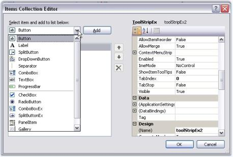

Adding Standard Items

ToolStripEx comes with standard toolstrip items that can be added to the control through "Insert Standard Items" option in the smart tag. You can even add the items through context menu at design time.

Adding ToolStrip Items Programmatically

The ToolStripEx allows you to add standard ToolStripItems and other user interface elements such as labels, splitbutton, dropdownbutton, separator, combobox, textbox, progressbar and PanelItem.



// Declare and initialize a ToolStripEx.

ToolStripEx paraToolStrip = new ToolStripEx();

// Set the size.

paraToolStrip.AutoSize = false;

paraToolStrip.Size = new Size(100, 25);

// Set the layout style.

paraToolStrip.LayoutStyle = ToolStripLayoutStyle.HorizontalStackWithOverflow;

// Add the items to the ToolStripEx.

paraToolStrip.Items.Add(new ToolStripButton());

paraToolStrip.Items.Add(new ToolStripDropDownButton());

paraToolStrip.Items.Add(new ToolStripSplitButton());

paraToolStrip.GroupedButtons = true;

// Set the text of the ToolStripEx.

paraToolStrip.Text = "Paragraph";

// Add the ToolStripEx to the ToolStripTabItem.

this.toolStripTabItem1.Panel.Controls.Add(paraToolStrip);





' Declare and initialize a ToolStripEx.

Dim paraToolStrip As ToolStripEx =  New ToolStripEx() 

' Set the size.

paraToolStrip.AutoSize = False

paraToolStrip.Size = New Size(100, 25)

' Set the layout style.

paraToolStrip.LayoutStyle = ToolStripLayoutStyle.HorizontalStackWithOverflow

' Add the items to the ToolStripEx.

paraToolStrip.Items.Add(New ToolStripButton())

paraToolStrip.Items.Add(New ToolStripDropDownButton())

paraToolStrip.Items.Add(New ToolStripSplitButton())

paraToolStrip.GroupedButtons = True

' Set the text of the ToolStripEx.

paraToolStrip.Text = "Paragraph"

' Add the ToolStripEx to the ToolStripTabItem.

Me.toolStripTabItem1.Panel.Controls.Add(paraToolStrip)



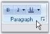

ToolStripItems

The following ToolStripItems can be added to a ToolStripEx through Designer, using Items Collection Editor.

PanelItem

ToolStripPanelItem provides support for aligning the controls in multiple lines. It supports nesting of panels without any limitation on the level of nesting. Not only controls but, any number of panels can be added to a panel.

Using the RowCount property of ToolStripPanelItem, controls can be arranged in any number of rows inside a ToolStripPanelItem.

Adding Controls to Panel Item

Accessing ToolStripPanelItem.Items property, Items Collection Editor dialog pops-up. The item can be added and customized using this dialog.

A simple code snippet which adds ToolStripItems in three rows.



this.toolStripPanelItem1.Items.AddRange(new System.Windows.Forms.ToolStripItem[] {

this.toolStripLabel1,

this.toolStripLabel2,

this.toolStripButton2});

this.toolStripPanelItem1.RowCount = 3;





Dim System.Windows.Forms.ToolStripItem() As Me.toolStripPanelItem1.Items.AddRange(New{

Me.toolStripLabel1,

Me.toolStripLabel2,

Me.toolStripButton2})

Me.toolStripPanelItem1.RowCount = 3



A complex arrangement of controls like in the below image, can be achieved using the ToolStripPanelItem.

See Also

Customizing Panel Item

Foreground Settings

_Table_ _698_: Property Table

<table>
<tr>
<td>
Property</td><td>
Description</td></tr>
<tr>
<td>
Font</td><td>
Set Font Style for the display text in the control.</td></tr>
<tr>
<td>
ForeColor</td><td>
Sets fore color for the display text in the panel.</td></tr>
<tr>
<td>
Text</td><td>
Sets the text for the ToolStripPanelItem.</td></tr>
</table>



this.toolStripPanelItem12.Font = new System.Drawing.Font("Verdana", 8.25F, System.Drawing.FontStyle.Bold);

this.toolStripPanelItem12.ForeColor = System.Drawing.Color.Crimson;





Me.toolStripPanelItem12.Font = New System.Drawing.Font("Verdana", 8.25F, System.Drawing.FontStyle.Bold)

Me.toolStripPanelItem12.ForeColor = System.Drawing.Color.Crimson



Tooltip Settings

_Table_ _699_: Property Table

<table>
<tr>
<td>
Property</td><td>
Description</td></tr>
<tr>
<td>
ShowItemToolTips</td><td>
Specifies whether to set tooltips or not.</td></tr>
<tr>
<td>
AutoToolTip</td><td>
When set to true, will display the text set in the Text property as the item's tooltip.When set to false, will display the text set in the ToolTipText property.</td></tr>
<tr>
<td>
ToolTipText</td><td>
Sets the text for the tooltip when AutoToolTip is set to false.</td></tr>
</table>



this.toolStripPanelItem1.ShowItemToolTips = true;

this.toolStripPanelItem1.AutoToolTip = true;

this.toolStripPanelItem1.ToolTipText = "New tooltip";





Me.toolStripPanelItem1.ShowItemToolTips = True

Me.toolStripPanelItem1.AutoToolTip = True

Me.toolStripPanelItem1.ToolTipText = "New tooltip"



Layout of the Panel items

_Table_ _700_: Property Table

<table>
<tr>
<td>
Property</td><td>
Description</td></tr>
<tr>
<td>
Alignment</td><td>
Sets the alignment of the Panel item. The options are,Left andRight.</td></tr>
<tr>
<td>
LayoutStyle</td><td>
Sets the layout style for the items. The options are,{{ '_Flow_' | markdownify }} - Items flow horizontally or vertically as necessary.{{ '_HorizontalStackWithOverflow_' | markdownify }} - Items are laid out horizontally and overflow as necessary.{{ '_StackWithOverFlow_' | markdownify }} - Items are laid out automatically.{{ '_Table_' | markdownify }} - Items are laid out flush left.{{ '_VerticalStackWithOverflow_' | markdownify }} - Items are laid out vertically and overflow as necessary.</td></tr>
</table>
Border Settings

_Table_ _701_: Property Table

<table>
<tr>
<td>
Property</td><td>
Description</td></tr>
<tr>
<td>
BorderStyle</td><td>
Sets the border style for the panel items.Etched andStaticEdge.</td></tr>
</table>
RTL Support

_Table_ _702_: Property Table

<table>
<tr>
<td>
Property</td><td>
Description</td></tr>
<tr>
<td>
RightToLeft</td><td>
Indicates whether the item should right to left for RTL languages.</td></tr>
<tr>
<td>
RightToLeftAutoMirrorImage</td><td>
Specifies whether image should mirror when RightToLeft is enabled for the item.</td></tr>
</table>
Gallery

Essential Tools RibbonControlAdv provides options to add a collection of items and store them into a gallery. A gallery can be added to a ToolStripTabItem using Items Collection Editor. Select the Gallery item in the dropdown and add it to the control.

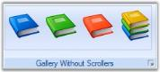

Adding Controls to the Gallery

Using the Gallery.Item property, Items Collection Editor opens, which lets you add items to the gallery.



this.toolStripGallery1.Items.Add(toolStripGalleryItem1);

this.toolStripGallery1.Items.Add(toolStripGalleryItem2);

this.toolStripGallery1.Items.Add(toolStripGalleryItem3);





Me.toolStripGallery1.Items.Add(toolStripGalleryItem1)

Me.toolStripGallery1.Items.Add(toolStripGalleryItem2)

Me.toolStripGallery1.Items.Add(toolStripGalleryItem3)



Appearance Settings

The ToolStripItems can be aligned to right or left using Alignment property.



this.toolStripGallery1.Alignment = System.Windows.Forms.ToolStripItemAlignment.Right;





Me.toolStripGallery1.Alignment = System.Windows.Forms.ToolStripItemAlignment.Right



Border Settings

_Table_ _703_: Property Table

<table>
<tr>
<td>
Property</td><td>
Description</td></tr>
<tr>
<td>
BorderStyle</td><td>
Sets the border style for the ToolStripGallery. The options are,None (default) andSingle.</td></tr>
</table>



this.toolStripGallery1.BorderStyle = Syncfusion.Windows.Forms.Tools.ToolstripGalleryBorderStyle.Single;





this.toolStripGallery1.BorderStyle = Syncfusion.Windows.Forms.Tools.ToolstripGalleryBorderStyle.Single;



Foreground Settings

_Table_ _704_: Property Table

<table>
<tr>
<td>
Property</td><td>
Description</td></tr>
<tr>
<td>
Font</td><td>
Sets the font style for the display text.</td></tr>
<tr>
<td>
ForeColor</td><td>
Sets the fore color for the display text.</td></tr>
</table>

Scroller Settings

_Table_ _705_: Property Table

<table>
<tr>
<td>
Property</td><td>
Description</td></tr>
<tr>
<td>
ScrollerType</td><td>
Sets the scroller type for the Gallery. The types available are,StandardType andCompactType.</td></tr>
</table>

The below image displays a gallery item display with both types of ScrollerType and with Caption text, BackColor, ItemDisplayStyle properties set.

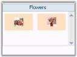

RTL Support

_Table_ _706_: Property Table_

<table>
<tr>
<td>
Property</td><td>
Description</td></tr>
<tr>
<td>
RightToLeft</td><td>
Indicates whether the item should right to left for RTL languages.</td></tr>
<tr>
<td>
RightToLeftAutoMirrorImage</td><td>
Specifies whether image should mirror when RightToLeft is enabled for the item.</td></tr>
</table>
See Also

Caption Settings

Item Customization

ToolTips

GalleryItemClick Event

Caption Settings

Caption for a ToolStripGallery can be visible by settings the ShowCaption property to true.

_Table_ _707_: Property Table

<table>
<tr>
<td>
Property</td><td>
Description</td></tr>
<tr>
<td>
ShowCaption</td><td>
Sets the visibility of the caption.</td></tr>
<tr>
<td>
CaptionText</td><td>
Sets the caption text.</td></tr>
</table>



this.toolStripGallery1.CaptionText = "Buttons Gallery";

this.toolStripGallery1.ShowCaption = true;





Me.toolStripGallery1.CaptionText = "Buttons Gallery" 

Me.toolStripGallery1.ShowCaption = True



See Also

Appearance Settings

Item Customization

ToolTips

GalleryItemClick Event

Item Customization

ToolStripGallery lets you customize the ToolStrip items added to the Gallery using the below properties. 

Appearance Settings

_Table_ _708_: Property Table

<table>
<tr>
<td>
Property</td><td>
Description</td></tr>
<tr>
<td>
ItemBackColor</td><td>
Sets the back color for the items.</td></tr>
</table>
Style Settings

_Table_ _709_: Property Table

<table>
<tr>
<td>
Property</td><td>
Description</td></tr>
<tr>
<td>
ItemDisplayStyle</td><td>
Sets the display style of the items. The options are,Text, Image and ImageAndText.</td></tr>
<tr>
<td>
ItemTextImageRelation</td><td>
Sets the text image relation of the items. The options are,Overlay, ImageAboveText, TextAboveImage, ImageBeforeText andTextBeforeImage.</td></tr>
<tr>
<td>
ItemImageSize</td><td>
Sets the image size for the items.</td></tr>
<tr>
<td>
ItemMargin</td><td>
Sets margin for the items.</td></tr>
<tr>
<td>
ItemPadding</td><td>
Sets padding between the items.</td></tr>
<tr>
<td>
ItemSize</td><td>
Sets the Item size.</td></tr>
</table>



this.toolStripGallery1.ItemBackColor = System.Drawing.Color.SteelBlue;

this.toolStripGallery1.ItemDisplayStyle = System.Windows.Forms.ToolStripItemDisplayStyle.Image;

this.toolStripGallery1.ItemImageSize = new System.Drawing.Size(25, 25);

this.toolStripGallery1.ItemMargin = new System.Windows.Forms.Padding(2);

this.toolStripGallery1.ItemPadding = new System.Windows.Forms.Padding(5);

this.toolStripGallery1.ItemSize = new System.Drawing.Size(80, 46);





Me.toolStripGallery1.ItemBackColor = System.Drawing.Color.SteelBlue

Me.toolStripGallery1.ItemDisplayStyle = System.Windows.Forms.ToolStripItemDisplayStyle.Image 

Me.toolStripGallery1.ItemImageSize = New System.Drawing.Size(25, 25) 

Me.toolStripGallery1.ItemMargin = New System.Windows.Forms.Padding(2) 

Me.toolStripGallery1.ItemPadding = New System.Windows.Forms.Padding(5) 

Me.toolStripGallery1.ItemSize = New System.Drawing.Size(80, 46)



See Also

Appearance Settings

Caption Settings

ToolTips

GalleryItemClick Event

ToolTips 

The Gallery can display a tooltip when the mouse is moved over the Gallery at runtime. This is enabled through AutoToolTip property. A default text will be displayed, which can be modified by providing the text in ToolTipText property. 



//Enabling and setting the tooltip

this.toolStripGallery1.AutoToolTip = true;

this.toolStripGallery1.ToolTipText = "New ToolStrip text";





'Enabling and setting the tooltip

Me.toolStripGallery1.AutoToolTip = True

Me.toolStripGallery1.ToolTipText = "New ToolStrip text"



See Also

Appearance Settings

Caption Settings

Item Customization

GalleryItemClick Event

GalleryItemClicked Event

GalleryItemClicked event will be triggered when a gallery item is clicked.

Event Data

The ToolStripGalleryItemEventHandler receives an argument of type ToolStripGalleryItemEventArgs containing data related to this event. The following ToolStripGalleryItemEventArgs member provide information specific to this event.

_Table_ _710_: Member Table

<table>
<tr>
<td>
Member</td><td>
Description</td></tr>
<tr>
<td>
GalleryItem</td><td>
Indicates the gallery item.</td></tr>
</table>



this.toolStripGallery2.GalleryItemClicked += new Syncfusion.Windows.Forms.Tools.ToolStripGalleryItemEventHandler(toolStripGallery2_GalleryItemClicked);

private void toolStripGallery2_GalleryItemClicked(object sender, Syncfusion.Windows.Forms.Tools.ToolStripGalleryItemEventArgs arg)

{

// You can see the below line in output window during runtime.

Console.WriteLine("GalleryItemClicked event is raised");

//Display the GalleryItem

Console.WriteLine("GalleryItem : " + arg.GalleryItem.ToString());

}





Private Sub toolStripGallery2_GalleryItemClicked(ByVal sender As Object, ByVal arg As Syncfusion.Windows.Forms.Tools.ToolStripGalleryItemEventHandler)

'You can see the below line in output window during runtime.

Console.WriteLine("GalleryItemClicked event is raised")

'Display the GalleryItem

Console.WriteLine("GalleryItem : " + arg.GalleryItem.ToString)

End Sub



See Also

Appearance Settings

Item Customization 

ToolTips

Caption Settings

Show ToolTips for individual Gallery Items 

RibbonControlAdv now supports showing ToolTips for individual Gallery Item when moving the mouse over them. Earlier ToolTips were not supported for individual gallery items. Now you can specify the ToolTipText for individual Gallery Items on the ToolTipText property of the respective toolStripGallery Item.



//Add tooltip.

this.toolStripGallery1.Items[0].ToolTipText = "No spacing";

this.toolStripGallery1.Items[1].ToolTipText = "Heading 1";





'Add tooltip.

Me.toolStripGallery1.Items(0).ToolTipText = "No spacing"

Me.toolStripGallery1.Items(1).ToolTipText = "Heading 1"



SplitButtonEx

ToolStripSplitButtonEx can be added to a ToolStripEx directly or through a panel. 

Programmatically, ToolStripSplitButtonEx can be added as follows.



private ToolStripSplitButtonEx toolStripSplitButtonEx1;

this.toolStripSplitButtonEx1 = new Syncfusion.Windows.Forms.Tools.ToolStripSplitButtonEx();

this.toolStripEx1.Items.AddRange(new System.Windows.Forms.ToolStripItem[] {

this.toolStripSplitButtonEx1});





Private toolStripSplitButtonEx1 As ToolStripSplitButtonEx

Me.toolStripSplitButtonEx1 = New Syncfusion.Windows.Forms.Tools.ToolStripSplitButtonEx() 

Me.toolStripEx1.Items.AddRange(New System.Windows.Forms.ToolStripItem() {Me.toolStripSplitButtonEx1}) 



The properties of SplitButtonEx is similar to Split Button except DropDownButtonWidth property which is not available for SplitButtonEx control.

ComboBoxEx

ToolStripComboBoxEx can be added to a ToolStripEx directly or through a panel. 

Programmatically adding ToolStripComboBoxEx,



private ToolStripComboBoxEx toolStripComboBoxEx1;

this.toolStripComboBoxEx1 = new Syncfusion.Windows.Forms.Tools.ToolStripComboBoxEx();

this.toolStripComboBoxEx2.Items.AddRange(new object[] {"ComboBoxEx", "PanelItem", "SplitButton", "Gallery", 

            "Label"});

this.toolStripEx2.Items.AddRange(new System.Windows.Forms.ToolStripItem[] {

this.toolStripComboBoxEx2});





Private toolStripComboBoxEx1 As ToolStripComboBoxEx 

Me.toolStripComboBoxEx1 = New Syncfusion.Windows.Forms.Tools.ToolStripComboBoxEx() 

Me.toolStripComboBoxEx2.Items.AddRange(New Object() {"ComboBoxEx", "PanelItem", "SplitButton", "Gallery", "Label"}) 

Me.toolStripEx2.Items.AddRange(New System.Windows.Forms.ToolStripItem() {Me.toolStripComboBoxEx2}) 



DropDown Features at run time

The ComboBoxEx item by default comes with Office2007 look and feel. The items can be added to the dropdown popup using Items property similar to Windows ComboBox control. We can adjust the height of the dropdown at run time, by just moving the adjustable bar at the bottom of the popup. Automatic scrollbars will appear if all the dropdown items are not visible.

> Note: We can set banner text for the ComboBoxEx control. Refer_ BannerTextProvider Component _topic for more details.

Button

ToolStripButton can be added to a ToolStripEx directly or through a panel. 

The below properties controls the appearance and behavior of the ToolStripButton.

Foreground Settings

_Table_ _711_: Property Table

<table>
<tr>
<td>
Property</td><td>
Description</td></tr>
<tr>
<td>
Text</td><td>
Sets the Text for the ToolStripButton. This text will be displayed, only if the DisplayStyle is Text or ImageAndText.</td></tr>
<tr>
<td>
Font</td><td>
Sets the font style for the display text.</td></tr>
<tr>
<td>
ForeColor</td><td>
Sets the fore color for the display text.</td></tr>
<tr>
<td>
TextAlign</td><td>
Specifies the alignment of the text in the item. The options are,TopLeft,TopCenter, TopRight,MiddleLeft,MiddleCenter, MiddleRight,BottomLeft, BottomCenter and BottomRight.</td></tr>
<tr>
<td>
TextDirection</td><td>
Specifies the direction of drawing the text. The direction are,{{ '_Horizontal_' | markdownify }} - Text is placed horizontally,{{ '_Vertical90_' | markdownify }} - Text is placed vertically and {{ '_Vertical270_' | markdownify }} - Text is placed vertically at 270 degrees.</td></tr>
<tr>
<td>
TextImageRelation</td><td>
Specifies the relative location of the image to the text on the item. The options are,{{ '_Overlay_' | markdownify }} - Image and text shares the same space in the control,{{ '_ImageAboveText_' | markdownify }} - Image will be placed above the text,{{ '_TextAboveImage_' | markdownify }} - Text will be placed above the image,{{ '_ImageBeforeText_' | markdownify }} - Image will be placed before the text and {{ '_TextBeforeImage_' | markdownify }} - Text will be placed before the image.</td></tr>
</table>
Image Settings

_Table_ _712_: Property Table

<table>
<tr>
<td>
Property</td><td>
Description</td></tr>
<tr>
<td>
Image</td><td>
Sets the image for the item.</td></tr>
<tr>
<td>
ImageAlign</td><td>
Specifies the alignment of the image. The options are,TopLeft, TopCenter, TopRight,MiddleLeft,MiddleCenter, MiddleRight,BottomLeft, BottomCenter andBottomRight.</td></tr>
<tr>
<td>
ImageScaling</td><td>
Specifies whether the image on the item will size to fit on the ToolStrip.</td></tr>
<tr>
<td>
ImageTransparentColor</td><td>
Sets the transparent color on the image, that supports transparency.</td></tr>
</table>

Style Settings

_Table_ _713_: Property Table

<table>
<tr>
<td>
Property</td><td>
Description</td></tr>
<tr>
<td>
DisplayStyle</td><td>
Specifies how the image and text are rendered. The styles are,{{ '_Text_' | markdownify }} - Displays only text,{{ '_Image_' | markdownify }} - Displays only image,{{ '_ImageAndText_' | markdownify }} - Displays image and text.</td></tr>
<tr>
<td>
Checked</td><td>
Indicates whether button is checked when the application loads.</td></tr>
<tr>
<td>
CheckState</td><td>
Specifies the check state. The different check states are,Checked,Unchecked and Indeterminate.</td></tr>
<tr>
<td>
CheckOnClick</td><td>
Indicates whether the item should change its selected state when clicked.</td></tr>
<tr>
<td>
Enabled</td><td>
Specifies whether the item is enabled.</td></tr>
<tr>
<td>
Visible</td><td>
Specifies whether the item is visible.</td></tr>
<tr>
<td>
Alignment</td><td>
Sets the alignment of the item within the ToolStripEx. They can be set to beginning (Left) or end (Right) of the ToolStripEx control.</td></tr>
<tr>
<td>
AutoSize</td><td>
Specifies whether the item should size itself based on its image and text.</td></tr>
</table>

ToolTip Settings

_Table_ _714_: Property Table

<table>
<tr>
<td>
Property</td><td>
Description</td></tr>
<tr>
<td>
AutoToolTip</td><td>
When set to true, will display the text set in the Text property as the item's tooltip.When set to false, will display the text set in the ToolTipText property.</td></tr>
<tr>
<td>
ToolTipText</td><td>
Sets the text for the tooltip when AutoToolTip is set to false.</td></tr>
</table>

RTL Support

_Table_ _715_: Property Table

<table>
<tr>
<td>
Property</td><td>
Description</td></tr>
<tr>
<td>
RightToLeft</td><td>
Indicates whether the item should draw right to left for RTL languages.</td></tr>
<tr>
<td>
RightToLeftAutoMirrorImage</td><td>
Specifies whether image should mirror when RightToLeft is enabled for the item.</td></tr>
</table>

Label

ToolStripLabel can be added to a ToolStripEx directly or through a panel. 

The below properties controls the appearance and behavior of the ToolStripLabel.

Foreground Settings

_Table_ _716_: Property Table

<table>
<tr>
<td>
Property</td><td>
Description</td></tr>
<tr>
<td>
Text</td><td>
Sets the Text for the ToolStripLabel. This text will be displayed, only if the DisplayStyle is Text or ImageAndText.</td></tr>
<tr>
<td>
Font</td><td>
Sets the font style for the display text.</td></tr>
<tr>
<td>
ForeColor</td><td>
Sets the fore color for the display text.</td></tr>
<tr>
<td>
TextAlign</td><td>
Specifies the alignment of the text in the item. The options are,TopLeft, TopCenter, TopRight,MiddleLeft, MiddleCenter, MiddleRight,BottomLeft, BottomCenter andBottomRight.</td></tr>
<tr>
<td>
TextDirection</td><td>
Specifies the direction of drawing the text. The direction are,{{ '_Horizontal_' | markdownify }} - Text is placed horizontally,{{ '_Vertical90_' | markdownify }} - Text is placed vertically and {{ '_Vertical270_' | markdownify }} - Text is placed vertically at 270 degrees.</td></tr>
<tr>
<td>
TextImageRelation</td><td>
Specifies the relative location of the image to the text on the item. The options are,{{ '_Overlay_' | markdownify }} - Image and text shares the same space in the control,{{ '_ImageAboveText_' | markdownify }} - Image will be placed above the text,{{ '_TextAboveImage_' | markdownify }} - Text will be placed above the image,{{ '_ImageBeforeText_' | markdownify }} - Image will be placed before the text and {{ '_TextBeforeImage_' | markdownify }} - Text will be placed before the image.</td></tr>
</table>

Image Settings

_Table_ _717_: Property Table

<table>
<tr>
<td>
Property</td><td>
Description</td></tr>
<tr>
<td>
Image</td><td>
Sets the image for the item.</td></tr>
<tr>
<td>
ImageAlign</td><td>
Specifies the alignment of the image. The options are,TopLeft, TopCenter, TopRight,MiddleLeft, MiddleCenter, MiddleRight,BottomLeft, BottomCenter andBottomRight.</td></tr>
<tr>
<td>
ImageScaling</td><td>
Specifies whether the image on the item will size to fit on the ToolStrip.</td></tr>
<tr>
<td>
ImageTransparentColor</td><td>
Sets the transparent color on the image, that supports transparency.</td></tr>
</table>

Link Settings

A ToolStripLabel can behave as a link at run time. The below properties controls the appearance and behavior of the links.

_Table_ _718_: Property Table

<table>
<tr>
<td>
Property</td><td>
Description</td></tr>
<tr>
<td>
IsLink</td><td>
Sets whether the label should behave like a link.</td></tr>
<tr>
<td>
LinkColor</td><td>
Sets the color of the link.</td></tr>
<tr>
<td>
ActiveLinkColor</td><td>
Sets the color of the active link.</td></tr>
<tr>
<td>
LinkVisited</td><td>
Specifies whether the hyperlink should be rendered as visited when the application loads.</td></tr>
<tr>
<td>
VisitedLinkColor</td><td>
Sets the color of the link that is visited.</td></tr>
<tr>
<td>
LinkBehavior</td><td>
Specifies the underlining behavior of the link. The options are,{{ '_SystemDefault_' | markdownify }} - Based on the system settings for the links,{{ '_AlwaysUnderline_' | markdownify }} - Underlines the link always,{{ '_HoverUnderline_' | markdownify }} - Underlines the link when hovering over it and{{ '_NeverUnderline_' | markdownify }} - Never underlines the links.</td></tr>
</table>



this.toolStripLabel26.IsLink = true;

this.toolStripLabel26.LinkBehavior = System.Windows.Forms.LinkBehavior.HoverUnderline;

this.toolStripLabel26.LinkColor = Color.Blue;





Me.toolStripLabel26.IsLink = True

Me.toolStripLabel26.LinkBehavior = System.Windows.Forms.LinkBehavior.HoverUnderline

Me.toolStripLabel26.LinkColor = Color.Blue



Style Settings

_Table_ _719_: Property Table

<table>
<tr>
<td>
Property</td><td>
Description</td></tr>
<tr>
<td>
DisplayStyle</td><td>
Specifies how the image and text are rendered. The styles are,{{ '_Text_' | markdownify }} - Displays only text,{{ '_Image_' | markdownify }} - Displays only image,{{ '_ImageAndText_' | markdownify }} - Displays image and text.</td></tr>
<tr>
<td>
Enabled</td><td>
Specifies whether the item is enabled.</td></tr>
<tr>
<td>
Visible</td><td>
Specifies whether the item is visible.</td></tr>
<tr>
<td>
Alignment</td><td>
Sets the alignment of the item within the ToolStripEx. They can be set to beginning (Left) or end (Right) of the ToolStripEx control.</td></tr>
<tr>
<td>
AutoSize</td><td>
Specifies whether the item should size itself based on its image and text.</td></tr>
</table>

ToolTip Settings

The TooStripLabel can show tooltips during runtime, using the below properties.

_Table_ _720_: Property Table

<table>
<tr>
<td>
Property</td><td>
Description</td></tr>
<tr>
<td>
AutoToolTip</td><td>
When set to true, will display the text set in the Text property as the item's tooltip.When set to false, will display the text set in the ToolTipText property.</td></tr>
<tr>
<td>
ToolTipText</td><td>
Sets the text for the tooltip when AutoToolTip is set to false.</td></tr>
</table>
RTL Support

_Table_ _721_: Property Table

<table>
<tr>
<td>
Property</td><td>
Description</td></tr>
<tr>
<td>
RightToLeft</td><td>
Indicates whether the item should draw right to left for RTL languages.</td></tr>
<tr>
<td>
RightToLeftAutoMirrorImage</td><td>
Specifies whether image should mirror when RightToLeft is enabled for the item.</td></tr>
</table>

Split Button

ToolStripSplitButton can be added to a ToolStripEx directly or through a panel. 

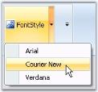

Programmatically adding ToolStripSplitButton to ToolStripEx control,



private ToolStripLabel toolStripLabel1;

this.toolStripLabel1 = new System.Windows.Forms.ToolStripLabel();

this.toolStripEx1.Items.AddRange(new System.Windows.Forms.ToolStripItem[] {

this.toolStripLabel1});





Private toolStripLabel1 As ToolStripLabel

Me.toolStripLabel1 = New System.Windows.Forms.ToolStripLabel() 

Me.toolStripEx1.Items.AddRange(New System.Windows.Forms.ToolStripItem() {Me.toolStripLabel1}) 



The below properties controls the appearance and behavior of the ToolStripSplitButton.

Foreground Settings

_Table_ _722_: Property Table

<table>
<tr>
<td>
Property</td><td>
Description</td></tr>
<tr>
<td>
Text</td><td>
Sets the Text for the ToolStripSplitButton. This text will be displayed, only if the DisplayStyle is Text or ImageAndText.</td></tr>
<tr>
<td>
Font</td><td>
Sets the font style for the display text.</td></tr>
<tr>
<td>
ForeColor</td><td>
Sets the fore color for the display text.</td></tr>
<tr>
<td>
TextAlign</td><td>
Specifies the alignment of the text in the item. The options are,TopLeft, TopCenter, TopRight,MiddleLeft, MiddleCenter, MiddleRight,BottomLeft, BottomCenter andBottomRight.</td></tr>
<tr>
<td>
TextDirection</td><td>
Specifies the direction of drawing the text. The direction are,{{ '_Horizontal_' | markdownify }} - Text is placed horizontally,{{ '_Vertical90_' | markdownify }} - Text is placed vertically and {{ '_Vertical270_' | markdownify }} - Text is placed vertically at 270 degrees.</td></tr>
<tr>
<td>
TextImageRelation</td><td>
Specifies the relative location of the image to the text on the item. The options are,{{ '_Overlay_' | markdownify }} - Image and text shares the same space in the control,{{ '_ImageAboveText_' | markdownify }} - Image will be placed above the text,{{ '_TextAboveImage_' | markdownify }} - Text will be placed above the image,{{ '_ImageBeforeText_' | markdownify }} - Image will be placed before the text and {{ '_TextBeforeImage_' | markdownify }} - Text will be placed before the image.</td></tr>
</table>

Image Settings

_Table_ _723_: Property Table

<table>
<tr>
<td>
Property</td><td>
Description</td></tr>
<tr>
<td>
Image</td><td>
Sets the image for the item.</td></tr>
<tr>
<td>
ImageAlign</td><td>
Specifies the alignment of the image. The options are,TopLeft,TopCenter,TopRight,MiddleLeft, MiddleCenter, MiddleRight,BottomLeft, BottomCenter andBottomRight.</td></tr>
<tr>
<td>
ImageScaling</td><td>
Specifies whether the image on the item will size to fit on the ToolStrip.</td></tr>
<tr>
<td>
ImageTransparentColor</td><td>
Sets the transparent color on the image, that supports transparency.</td></tr>
</table>

Style Settings

_Table_ _724_: Property Table

<table>
<tr>
<td>
Property</td><td>
Description</td></tr>
<tr>
<td>
DisplayStyle</td><td>
Specifies how the image and text are rendered. The styles are,{{ '_Text_' | markdownify }} - Displays only text,{{ '_Image_' | markdownify }} - Displays only image,{{ '_ImageAndText_' | markdownify }} - Displays image and text.</td></tr>
<tr>
<td>
Enabled</td><td>
Specifies whether the item is enabled.</td></tr>
<tr>
<td>
Visible</td><td>
Specifies whether the item is visible.</td></tr>
<tr>
<td>
Alignment</td><td>
Sets the alignment of the item within the ToolStripEx. They can be set to beginning (Left) or end (Right) of the ToolStripEx control.</td></tr>
<tr>
<td>
AutoSize</td><td>
Specifies whether the item should size itself based on its image and text.</td></tr>
</table>

ToolTip Settings

_Table_ _725_: Property Table

<table>
<tr>
<td>
Property</td><td>
Description</td></tr>
<tr>
<td>
AutoToolTip</td><td>
When set to true, will display the text set in the Text property as the item's tooltip.When set to false, will display the text set in the ToolTipText property.</td></tr>
<tr>
<td>
ToolTipText</td><td>
Sets the text for the tooltip when AutoToolTip is set to false.</td></tr>
</table>

RTL Support

_Table_ _726_: Property Table

<table>
<tr>
<td>
Property</td><td>
Description</td></tr>
<tr>
<td>
RightToLeft</td><td>
Indicates whether the item should draw right to left for RTL languages.</td></tr>
<tr>
<td>
RightToLeftAutoMirrorImage</td><td>
Specifies whether image should mirror when RightToLeft is enabled for the item.</td></tr>
</table>

DropDown settings

_Table_ _727_: Property Table

<table>
<tr>
<td>
Property</td><td>
Description</td></tr>
<tr>
<td>
DropDown</td><td>
Specifies the ToolStripDropDown to be shown when the item is clicked.</td></tr>
<tr>
<td>
DropDownItems</td><td>
Invokes the Items Collection Editor and lets you add ToolStripItems to be displayed when the item is clicked.</td></tr>
<tr>
<td>
DropDownButtonWidth</td><td>
Specifies the width for the drop down.</td></tr>
</table>

DropDownButton

ToolStripDropDownButton can be added to a ToolStripEx directly or through a panel. 

The below properties controls the appearance and behavior of the ToolStripDropDownButton.

Foreground Settings

_Table_ _728_: Property Table

<table>
<tr>
<td>
Property</td><td colspan = "2">
Description</td></tr>
<tr>
<td>
Text</td><td colspan = "2">
Sets the Text for the ToolStripDropDownButton. This text will be displayed, only if the DisplayStyle is Text or ImageAndText.</td></tr>
<tr>
<td>
Font</td><td colspan = "2">
Sets the font style for the display text.</td></tr>
<tr>
<td>
ForeColor</td><td colspan = "2">
Sets the fore color for the display text.</td></tr>
<tr>
<td>
TextAlign</td><td colspan = "2">
Specifies the alignment of the text in the item. The options are,TopLeft, TopCenter, TopRight,MiddleLeft, MiddleCenter, MiddleRight,BottomLeft, BottomCenter andBottomRight.</td></tr>
<tr>
<td>
TextDirection</td><td colspan = "2">
Specifies the direction of drawing the text. The direction are,{{ '_Horizontal_' | markdownify }} - Text is placed horizontally,{{ '_Vertical90_' | markdownify }} - Text is placed vertically and {{ '_Vertical270_' | markdownify }} - Text is placed vertically at 270 degrees.</td></tr>
<tr>
<td colspan = "2">
TextImageRelation</td><td colspan = "2">
Specifies the relative location of the image to the text on the item. The options are,{{ '_Overlay_' | markdownify }} - Image and text shares the same space in the control,{{ '_ImageAboveText_' | markdownify }} - Image will be placed above the text,{{ '_TextAboveImage_' | markdownify }} - Text will be placed above the image,{{ '_ImageBeforeText_' | markdownify }} - Image will be placed before the text and {{ '_TextBeforeImage_' | markdownify }} - Text will be placed before the image.</td></tr>
</table>

Image Settings

_Table_ _729_: Property Table

<table>
<tr>
<td>
Property</td><td>
Description</td></tr>
<tr>
<td>
Image</td><td>
Sets the image for the item.</td></tr>
<tr>
<td>
ImageAlign</td><td>
Specifies the alignment of the image. The options are,TopLeft, TopCenter, TopRight,MiddleLeft, MiddleCenter, MiddleRight,BottomLeft, BottomCenter andBottomRight.</td></tr>
<tr>
<td>
ImageScaling</td><td>
Specifies whether the image on the item will size to fit on the ToolStrip.</td></tr>
<tr>
<td>
ImageTransparentColor</td><td>
Sets the transparent color on the image, that supports transparency.</td></tr>
</table>

Style Settings

_Table_ _730_: Property Table

<table>
<tr>
<td>
Property</td><td>
Description</td></tr>
<tr>
<td>
DisplayStyle</td><td>
Specifies how the image and text are rendered. The styles are,{{ '_Text_' | markdownify }} - Displays only text,{{ '_Image_' | markdownify }} - Displays only image,{{ '_ImageAndText_' | markdownify }} - Displays image and text.</td></tr>
<tr>
<td>
Enabled</td><td>
Specifies whether the item is enabled.</td></tr>
<tr>
<td>
Visible</td><td>
Specifies whether the item is visible.</td></tr>
<tr>
<td>
Alignment</td><td>
Sets the alignment of the item within the ToolStrip. They can be set to beginning (Left) or end (Right) of the ToolStripEx control.</td></tr>
<tr>
<td>
AutoSize</td><td>
Specifies whether the item should size itself based on its image and text.</td></tr>
</table>

ToolTip Settings

_Table_ _731_: Property Table

<table>
<tr>
<td>
Property</td><td>
Description</td></tr>
<tr>
<td>
AutoToolTip</td><td>
When set to true, will display the text set in the Text property as the item's tooltip.When set to false, will display the text set in the ToolTipText property.</td></tr>
<tr>
<td>
ToolTipText</td><td>
Sets the text for the tooltip when AutoToolTip is set to false.</td></tr>
</table>

RTL Support

_Table_ _732_: Property Table

<table>
<tr>
<td>
Property</td><td>
Description</td></tr>
<tr>
<td>
RightToLeft</td><td>
Indicates whether the item should draw right to left for RTL languages.</td></tr>
<tr>
<td>
RightToLeftAutoMirrorImage</td><td>
Specifies whether image should mirror when RightToLeft is enabled for the item.</td></tr>
</table>

DropDown settings

_Table_ _733_: Property Table

<table>
<tr>
<td>
Property</td><td>
Description</td></tr>
<tr>
<td>
DropDown</td><td>
Specifies the ToolStripDropDown to be shown when the item is clicked.</td></tr>
<tr>
<td>
DropDownItems</td><td>
Invokes the Items Collection Editor and lets you add ToolStripItems to be displayed when the item is clicked.</td></tr>
<tr>
<td>
ShowDropDownArrow</td><td>
Specifies whether or not to show the drop down arrow on the ToolStripDropDown button.</td></tr>
</table>

ComboBox

ToolStripComboBox can be added to a ToolStripEx directly or through a panel. 

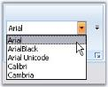

The below properties controls the appearance and behavior of the ToolStripComboBox.

Foreground Settings

_Table_ _734_: Property Table

<table>
<tr>
<td>
Property</td><td>
Description</td></tr>
<tr>
<td>
BackColor</td><td>
Sets the back color for the combo box item.</td></tr>
<tr>
<td>
Font</td><td>
Sets the font style for the display text.</td></tr>
<tr>
<td>
ForeColor</td><td>
Sets the fore color for the display text.</td></tr>
<tr>
<td>
Text</td><td>
Sets the text for the ComboBox item.</td></tr>
</table>

Style Settings

_Table_ _735_: Property Table

<table>
<tr>
<td>
Property</td><td>
Description</td></tr>
<tr>
<td>
Enabled</td><td>
Specifies whether the item is enabled.</td></tr>
<tr>
<td>
Visible</td><td>
Specifies whether the item is visible.</td></tr>
<tr>
<td>
Alignment</td><td>
Sets the alignment of the item within the ToolStrip. They can be set to beginning (Left) or end (Right) of the ToolStripEx control.</td></tr>
<tr>
<td>
AutoSize</td><td>
Specifies whether the item should size itself based on its image and text.</td></tr>
<tr>
<td>
DropDownStyle</td><td>
Specifies the dropdown style. The styles are,Simple,DropDown and DropDownList.</td></tr>
<tr>
<td>
FlatStyle</td><td>
Sets the display style of the combobox. The styles are,Flat,Popup,Standard and System.</td></tr>
</table>

ToolTip Settings

_Table_ _736_: Property Table

<table>
<tr>
<td>
Property</td><td>
Description</td></tr>
<tr>
<td>
AutoToolTip</td><td>
When set to true, will display the text set in the Text property as the item's tooltip.When set to false, will display the text set in the ToolTipText property.</td></tr>
<tr>
<td>
ToolTipText</td><td>
Sets the text for the tooltip when AutoToolTip is set to false.</td></tr>
</table>

RTL Support

_Table_ _737_: Property Table

<table>
<tr>
<td>
Property</td><td>
Description</td></tr>
<tr>
<td>
RightToLeft</td><td>
Indicates whether the item should draw right to left for RTL languages.</td></tr>
</table>

DropDown settings

_Table_ _738_: Property Table

<table>
<tr>
<td>
Property</td><td>
Description</td></tr>
<tr>
<td>
Items</td><td>
Invokes String Collection Editor which lets you add strings list to be displayed in the combobox.</td></tr>
<tr>
<td>
MaxDropDownItems</td><td>
Sets the maximum number of strings that should be displayed in the dropdown.</td></tr>
<tr>
<td>
MaxLength</td><td>
Specifies the maximum characters that can be entered into the combobox.</td></tr>
<tr>
<td>
DropDownHeight</td><td>
Sets the height for the DropDown.</td></tr>
<tr>
<td>
DropDownWidth</td><td>
Sets the width for the DropDown.</td></tr>
<tr>
<td>
IntegralHeight</td><td>
Indicate whether the combobox should resize to avoid showing partial items.</td></tr>
<tr>
<td>
Sorted</td><td>
Specifies whether the dropdown list should be sorted.</td></tr>
<tr>
<td>
AutoCompleteCustomSource</td><td>
Represents the custom source of string collection for the autocomplete feature, when AutoCompleteSource property is set to CustomSource.</td></tr>
<tr>
<td>
AutoCompleteSource</td><td>
Represents the source of strings used for autocompletion. The sources can be,FileSystem,AllSystemSources, (Default)AllUrl,CustomSource,FileSystemDirectories,HistoryList,ListItems,RecentlyUsedList and None.</td></tr>
<tr>
<td>
AutoCompleteMode</td><td>
Indicates text completion behavior of the combo box. The modes are,{{ '_Suggest_' | markdownify }} - Displays the drop down list associated with the EditControl. This dropdown list is populated with one or more suggested completion strings,{{ '_Append_' | markdownify }} - Appends the reminder of the most likely candidate string to the existing character, highlighting the appended character, and {{ '_SuggestAppend_' | markdownify }} - Displays the drop down, also appends the highlighted string.</td></tr>
<tr>
<td>
ShortCut on Form1</td><td>
Specifies the Keyboard shortcut to be used at run time to access this combobox.</td></tr>
</table>

> Note: We can set banner text for the ComboBox control. Refer_ BannerTextProvider Component _topic for more details.

TextBox

ToolStripTextBox item can be added to a ToolStripEx directly or through a panel. 

The below properties controls the appearance and behavior of the ToolStripTextBox Item.

Foreground Settings

_Table_ _739_: Property Table

<table>
<tr>
<td>
Property</td><td>
Description</td></tr>
<tr>
<td>
BackColor</td><td>
Sets the back color for the textbox.</td></tr>
<tr>
<td>
BorderStyle</td><td>
Specifies the border style for the textbox. The options are as follows,FixedSingle,Fixed3D andNone.</td></tr>
<tr>
<td>
Text</td><td>
Sets the Text for the ToolStripTextBox. </td></tr>
<tr>
<td>
Lines</td><td>
Lets you open a String Collection Editor, using which multiline text can be entered.</td></tr>
<tr>
<td>
Font</td><td>
Sets the font style for the display text.</td></tr>
<tr>
<td>
ForeColor</td><td>
Sets the fore color for the display text.</td></tr>
<tr>
<td>
TextBoxTextAlign</td><td>
Specifies the alignment of the text in the item. The options are,Left,Right and Center.</td></tr>
</table>

Style Settings

_Table_ _740_: Property Table

<table>
<tr>
<td>
Property</td><td>
Description</td></tr>
<tr>
<td>
Enabled</td><td>
Specifies whether the item is enabled.</td></tr>
<tr>
<td>
Visible</td><td>
Specifies whether the item is visible.</td></tr>
<tr>
<td>
Alignment</td><td>
Sets the alignment of the item within the ToolStrip. They can be set to beginning (Left) or end (Right) of the ToolStripEx control.</td></tr>
<tr>
<td>
AutoSize</td><td>
Specifies whether the item should size itself based on its image and text.</td></tr>
</table>

ToolTip Settings

_Table_ _741_: Property Table

<table>
<tr>
<td>
Property</td><td>
Description</td></tr>
<tr>
<td>
AutoToolTip</td><td>
When set to true, will display the text set in the Text property as the item's tooltip.When set to false, will display the text set in the ToolTipText property.</td></tr>
<tr>
<td>
ToolTipText</td><td>
Sets the text for the tooltip when AutoToolTip is set to false.</td></tr>
</table>

RTL Support

_Table_ _742_: Property Table

<table>
<tr>
<td>
Property</td><td>
Description</td></tr>
<tr>
<td>
RightToLeft</td><td>
Indicates whether the item should right to left for RTL languages.</td></tr>
</table>

Behavior Settings

_Table_ _743_: Property Table

<table>
<tr>
<td>
Property</td><td>
Description</td></tr>
<tr>
<td>
AcceptsReturn</td><td>
Indicates if return characters are accepted as input.</td></tr>
<tr>
<td>
AcceptsTab</td><td>
Indicates if tab characters are accepted as input.</td></tr>
<tr>
<td>
CharacterCasing</td><td>
Indicates if the characters should be Normal or in Upper Case or in Lower Case.</td></tr>
<tr>
<td>
HideSelection</td><td>
Indicates whether the selection should be hidden when the control loses focus.</td></tr>
<tr>
<td>
MaxLength</td><td>
Maximum number of characters that can be entered into the control. </td></tr>
<tr>
<td>
ReadOnly</td><td>
Indicates whether the text in the textbox is read-only.</td></tr>
<tr>
<td>
ShortCutsEnabled</td><td>
Specifies whether the keyboard shortcut can be specified for this textbox item.</td></tr>
<tr>
<td>
ShortCut on Form1</td><td>
Specifies the Keyboard shortcut to be used at run time to access this combobox.</td></tr>
</table>

AutoComplete Settings

_Table_ _744_: Property Table

<table>
<tr>
<td colspan = "2">
Property</td><td colspan = "2">
Description</td></tr>
<tr>
<td colspan = "2">
AutoCompleteCustomSource</td><td colspan = "2">
Represents the custom source of string collection for the autocomplete feature, when AutoCompleteSource property is set to CustomSource.</td></tr>
<tr>
<td colspan = "2">
AutoCompleteSource</td><td colspan = "2">
Represents the source of strings used for autocompletion. The sources can be,FileSystem,AllSystemSources, (Default)AllUrl,CustomSource,FileSystemDirectories,HistoryList,ListItems,RecentlyUsedList,None.</td></tr>
<tr>
<td>
AutoCompleteMode</td><td colspan = "2">
Indicates text completion behavior of the combo box. The modes are,{{ '_Suggest_' | markdownify }} - Displays the drop down list associated with the EditControl. This dropdown list is populated with one or more suggested completion strings,{{ '_Append_' | markdownify }} - Appends the reminder of the most likely candidate string to the existing character, highlighting the appended character, and {{ '_SuggestAppend_' | markdownify }} - Displays the drop down, also appends the highlighted string.</td></tr>
</table>

> Note: We can set banner text for the TextBox control. Refer_ BannerTextProvider Component _topic for more details.

ProgressBar

ToolStripProgressBar item can be added to a ToolStripEx directly or through a panel. 

The below properties controls the appearance and behavior of the ToolStripProgressBar Item.

Foreground Settings

_Table_ _745_: Property Table

<table>
<tr>
<td>
Property</td><td>
Description</td></tr>
<tr>
<td>
Font</td><td>
Sets the font style for the display text.</td></tr>
<tr>
<td>
ForeColor</td><td>
Sets the fore color for the display text.</td></tr>
</table>
Style Settings

_Table_ _746_: Property Table

<table>
<tr>
<td>
Property</td><td>
Description</td></tr>
<tr>
<td>
Style</td><td>
Specifies the style for ProgressBar. The style are,Blocks - Indicates the progress, by increasing the number of segmented blocks in a ProgressBar,Continuous - Indicates the progress, by increasing the size of a smooth continuous bar,Marquee - Indicates the progress, by continuously scrolling a block across the ProgressBar in a Marque fashion.</td></tr>
<tr>
<td>
Enabled</td><td>
Specifies whether the item is enabled.</td></tr>
<tr>
<td>
Visible</td><td>
Specifies whether the item is visible.</td></tr>
<tr>
<td>
Alignment</td><td>
Sets the alignment of the item within the ToolStripEx. They can be set to beginning (Left) or end (Right) of the ToolStripEx control.</td></tr>
<tr>
<td>
AutoSize</td><td>
Specifies whether the item should size itself based on its image and text.</td></tr>
<tr>
<td>
MarqueeAnimationSpeed</td><td>
Specifies the speed of the marquee animation in milliseconds. The default value is 100 Milliseconds.</td></tr>
<tr>
<td>
Maximum</td><td>
UpperBound Range of the ProgressBar. Default value is 100.</td></tr>
<tr>
<td>
Minimum</td><td>
LowerBound Range of the ProgressBar. Default value is 0.</td></tr>
<tr>
<td>
Step</td><td>
The amount to increment the current value of the control when PerformStep() method is called. Default value is 10.</td></tr>
<tr>
<td>
Value</td><td>
The current value for the ProgressBar, in the range specified by the minimum and maximum properties. Default value is 0.</td></tr>
</table>

_Table_ _747_: Method Table

<table>
<tr>
<td>
Method</td><td>
Description</td></tr>
<tr>
<td>
PerformStep()</td><td>
Advances the current position of the progressbar by the value specified in ToolStripProgressBar.Step property.</td></tr>
</table>

ToolTip Settings

_Table_ _748_: Property Table

<table>
<tr>
<td>
Property</td><td>
Description</td></tr>
<tr>
<td>
AutoToolTip</td><td>
When set to true, will display the text set in the Text property as the item's tooltip.When set to false, will display the text set in the ToolTipText property.</td></tr>
<tr>
<td>
ToolTipText</td><td>
Sets the text for the tooltip when AutoToolTip is set to false.</td></tr>
</table>

RTL Support

_Table_ _749_: Property Table

<table>
<tr>
<td>
Property</td><td>
Description</td></tr>
<tr>
<td>
RightToLeft</td><td>
Indicates whether the item should draw right to left for RTL languages.</td></tr>
<tr>
<td>
RightToLeftLayout</td><td>
Indicates whether the control layout is right to left.</td></tr>
</table>

CheckBox

ToolStripCheckBox can be added to a ToolStripEx directly or through a panel. 

The below properties controls the appearance and behavior of the ToolStripCheckBox item.

Foreground Settings

_Table_ _750_: Property Table

<table>
<tr>
<td>
Property</td><td>
Description</td></tr>
<tr>
<td>
Font</td><td>
Sets the font style for the display text.</td></tr>
<tr>
<td>
Text</td><td>
Sets the Text for the ToolStrip item.</td></tr>
<tr>
<td>
TextAlign</td><td>
Specifies the alignment of the text in the item. The options are,TopLeft, TopCenter, TopRight,MiddleLeft, MiddleCenter, MiddleRight,BottomLeft, BottomCenter andBottomRight.</td></tr>
</table>

Style Settings

_Table_ _751_: Property Table

<table>
<tr>
<td>
Property</td><td>
Description</td></tr>
<tr>
<td>
Checked</td><td>
Indicates whether button is checked when the application loads.</td></tr>
<tr>
<td>
CheckAlign</td><td>
Gets or sets the horizontal and vertical alignment of the check mark on a ToolStripCheckBox item. The options are,TopLeft, TopCenter, TopRight,MiddleLeft, MiddleCenter, MiddleRight,BottomLeft, BottomCenter andBottomRight.</td></tr>
<tr>
<td>
CheckState</td><td>
Specifies the check state. The different check states are,Checked,Unchecked and Indeterminate.</td></tr>
<tr>
<td>
ThreeState</td><td>
Indicates whether the check box can display all the three check states. i.e, Checked, Unchecked and Indeterminate.</td></tr>
<tr>
<td>
Enabled</td><td>
Specifies whether the item is enabled.</td></tr>
<tr>
<td>
Visible</td><td>
Specifies whether the item is visible.</td></tr>
<tr>
<td>
Alignment</td><td>
Sets the alignment of the item within the ToolStripEx. They can be set to beginning (Left) or end (Right) of the ToolStripEx control.</td></tr>
<tr>
<td>
AutoSize</td><td>
Specifies whether the item should size itself based on its image and text.</td></tr>
</table>

ToolTip Settings

_Table_ _752_: Property Table

<table>
<tr>
<td>
Property</td><td>
Description</td></tr>
<tr>
<td>
AutoToolTip</td><td>
When set to true, will display the text set in the Text property as the item's tooltip.When set to false, will display the text set in the ToolTipText property.</td></tr>
<tr>
<td>
ToolTipText</td><td>
Sets the text for the tooltip when AutoToolTip is set to false.</td></tr>
</table>

RTL Support

_Table_ _753_: Property Table

<table>
<tr>
<td>
Property</td><td>
Description</td></tr>
<tr>
<td>
RightToLeft</td><td>
Indicates whether the item should draw right to left for RTL languages.</td></tr>
</table>
Radio Button

ToolStripRadioButton can be added to a ToolStripEx directly or through a panel. 

The below properties controls the appearance and behavior of the ToolStripRadioButton item.

Foreground Settings

_Table_ _754_: Property Table

<table>
<tr>
<td>
Property</td><td>
Description</td></tr>
<tr>
<td>
Font</td><td>
Sets the font style for the display text.</td></tr>
<tr>
<td>
Text</td><td>
Sets the Text for the ToolStripRadioButton item.</td></tr>
<tr>
<td>
TextAlign</td><td>
Specifies the alignment of the text in the item. The options are,TopLeft, TopCenter, TopRight,MiddleLeft, MiddleCenter, MiddleRight,BottomLeft, BottomCenter andBottomRight.</td></tr>
</table>

Style Settings

_Table_ _755_: Property Table

<table>
<tr>
<td>
Property</td><td>
Description</td></tr>
<tr>
<td>
Checked</td><td>
Indicates whether button is checked when the application loads.</td></tr>
<tr>
<td>
CheckAlign</td><td>
Gets or sets the horizontal and vertical alignment of the check mark on a ToolStripRadioButton item. The options are,TopLeft, TopCenter, TopRight,MiddleLeft, MiddleCenter, MiddleRight,BottomLeft, BottomCenter andBottomRight.</td></tr>
<tr>
<td>
Enabled</td><td>
Specifies whether the item is enabled.</td></tr>
<tr>
<td>
Visible</td><td>
Specifies whether the item is visible.</td></tr>
<tr>
<td>
Alignment</td><td>
Sets the alignment of the item within the ToolStrip. They can be set to beginning (Left) or end (Right) of the ToolStripEx control.</td></tr>
<tr>
<td>
AutoSize</td><td>
Specifies whether the item should size itself based on its image and text.</td></tr>
<tr>
<td>
GroupID</td><td>
Gets or Sets Group indicator which is used to create groups of ToolStripRadioButton controls on the same parent.</td></tr>
</table>

ToolTip Settings

_Table_ _756_: Property Table

<table>
<tr>
<td>
Property</td><td>
Description</td></tr>
<tr>
<td>
AutoToolTip</td><td>
When set to true, will display the text set in the Text property as the item's tooltip.When set to false, will display the text set in the ToolTipText property.</td></tr>
<tr>
<td>
ToolTipText</td><td>
Sets the text for the tooltip when AutoToolTip is set to false.</td></tr>
</table>

RTL Support

_Table_ _757_: Property Table

<table>
<tr>
<td>
Property</td><td>
Description</td></tr>
<tr>
<td>
RightToLeft</td><td>
Indicates whether the item should draw right to left for RTL languages.</td></tr>
</table>

#### Style Settings

This section will discuss the style settings available for the ToolStripEx.

Border Settings

_Table_ _758_: Property Table

<table>
<tr>
<td>
Property</td><td>
Description</td></tr>
<tr>
<td>
BorderStyle</td><td>
Sets the border style for the control. The options are,None,Etched and StaticEdge.</td></tr>
</table>



this.toolStripEx1.BorderStyle = ToolStripBorderStyle.Etched;





Me.toolStripEx1.BorderStyle = ToolStripBorderStyle.Etched



LauncherStyle

The below properties deals with the launcher settings.

_Table_ _759_: Property Table

<table>
<tr>
<td>
Property</td><td>
Description</td></tr>
<tr>
<td>
ShowLauncher</td><td>
Specifies the visibility of the Launcher in the control.</td></tr>
<tr>
<td>
LauncherStyle</td><td>
Sets the Style for the launcher. The styles are,Office12,Office2007</td></tr>
</table>



this.toolStripEx1.ShowLauncher = true;

this.toolStripEx1.LauncherStyle = LauncherStyle.Office2007;





Me.toolStripEx1.ShowLauncher = True

Me.toolStripEx1.LauncherStyle = LauncherStyle.Office2007



Grip Style

The toolstrip can hold a grip, which can be visible by setting the GripStyle property. We can enable GripStyle easily, using the smart tag of the ToolStripEx control.

_Table_ _760_: Property Table

<table>
<tr>
<td>
Property</td><td>
Description</td></tr>
<tr>
<td>
GripStyle</td><td>
Specifies whether or not to show the Gripper for the control. It can be hidden (default) or visible.</td></tr>
<tr>
<td>
GripMargin</td><td>
Specifies the margin for the Gripper. Default is 2.</td></tr>
</table>



this.toolStripEx1.GripStyle = System.Windows.Forms.ToolStripGripStyle.Visible;

this.toolStripEx1.GripMargin = new System.Windows.Forms.Padding(5);





Me.toolStripEx1.GripStyle = System.Windows.Forms.ToolStripGripStyle.Visible

Me.toolStripEx1.GripMargin = new System.Windows.Forms.Padding(5)



See Also

Appearance Settings

DesignTime Features

Caption Settings

Grouping Items

Collapsed State Settings

#### Appearance Settings 

Office12Mode

ToolStripEx now supports Office12 modes in Ribbon. The properties which applies this mode are as follows.

_Table_ _761_: Property Table

<table>
<tr>
<td>
Property</td><td>
Description</td></tr>
<tr>
<td>
Office12Mode</td><td>
When set to true, Office12Mode will be applied to the control.When set to false, Office2007 mode will be applied to the control. (Default)</td></tr>
<tr>
<td>
RenderMode</td><td>
Specifies the painting style of the ToolStripEx. Options are,System,Professional andManagerRenderMode.(Default)</td></tr>
</table>

> Note: These properties can be easily set through Smart tag of the ToolStripEx. See SmartTag Options in DesignTime Features.



this.toolStripEx1.Office12Mode = true;

this.toolStripEx1.RenderMode = System.Windows.Forms.ToolStripRenderMode.ManagerRenderMode;





Me.toolStripEx1.Office12Mode = True

Me.toolStripEx1.RenderMode = System.Windows.Forms.ToolStripRenderMode.ManagerRenderMode



Office2007 Mode

Disabling the Office12Mode property will automatically give the Ribbon control, Office2007 look and feel.

_Table_ _762_: Property Table

<table>
<tr>
<td>
Property</td><td>
Description</td></tr>
<tr>
<td>
OfficeColorScheme</td><td>
Sets the office color schemes for the control. Blue, Black and Silver schemes can be applied. </td></tr>
</table>

> Note: This settings will overwrite the Panel.OfficeColorScheme property.



this.toolStripEx1.OfficeColorScheme = Syncfusion.Windows.Forms.Tools.ToolStripEx.ColorScheme.Silver;



Interactive Features



Me.toolStripEx1.OfficeColorScheme = Syncfusion.Windows.Forms.Tools.ToolStripEx.ColorScheme.Silver



AutoSizing of ToolStripEx

By enabling the AutoSize property of ToolStripEx, the toolstrip width will be resized automatically while adding controls to the toolstrip in the designer.

_Table_ _763_: Property Table

<table>
<tr>
<td>
Property</td><td>
Description</td></tr>
<tr>
<td>
AutoSize</td><td>
Setting this to true, will automatically resize the toolstrip as the controls gets added.</td></tr>
</table>



this.toolStripEx1.AutoSize = true;





Me.toolStripEx1.AutoSize = True



See Also

Style Settings 

Caption Settings 

Collapsed State Settings

#### ToolStripEx Alignment

The ToolStripLayoutStyle property is used to specify the alignment for the ToolStripEx items. The following table lists the possible alignments.

_Table_ _764_: Constraints Table

<table>
<tr>
<td>
Constraint</td><td>
Description</td></tr>
<tr>
<td>
Flow</td><td>
Specifies that items flow horizontally or vertically as necessary.Note: The Alignment property is ignored under this Layout Style.</td></tr>
<tr>
<td>
HorizontalStackWithOverflow</td><td>
Specifies that items are laid out horizontally and overflow as necessary.</td></tr>
<tr>
<td>
StackOverflow</td><td>
Specifies that items are laid out automatically.</td></tr>
<tr>
<td>
Table</td><td>
Specifies that items are laid out flush left.Note: The Alignment property is ignored under this Layout Style.</td></tr>
<tr>
<td>
VerticalStackWithOverflow</td><td>
Specifies that items are laid out vertically, are centered within the control, and overflow as necessary.</td></tr>
</table>

The default value for ToolStripLayoutStyle property is _HorizontalStackWithOverflow_.

The following code sample illustrates how to use the ToolStripLayoutStyle property.



this.toolStripEx1.LayoutStyle = System.Windows.Forms.ToolStripLayoutStyle.HorizontalStackWithOverflow;



#### ToolTips 

We can show tooltips over the ToolStrip items, by enabling the ToolStripEx.ShowItemToolTips property.



this.toolStripEx2.ShowItemToolTips = true;





Me.toolStripEx2.ShowItemToolTips = True



> Note: ToolTip text for the ToolStrip items can be specified using the respective &lt;Control&gt;.TooltipText properties. Ex, toolStripGallery1.ToolTipText property sets the tooltip for gallery item._

See Also

ToolStripItems

#### DesignTime Features 

Smart Tag

Smart Tag of the ToolStripEx opens the Task Windows which lets you to set some important properties easily.

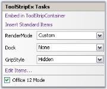

* Embed in ToolStripContainer - Lets you embed the ToolStrip in the ToolStripContainer.
* Insert Standard Items - Inserts standard items into the control.
* RenderMode - Lets you set the rendering mode. 
* Dock - Docks the control.
* GripStyle - Sets the grip style for the control.
* EditItems - Opens the Items Collection Editor.
* Office12Mode - Enables or Disables the Office12Mode.

Context Menu

The context menu on a toolstrip item provides advanced options which minimizes your time in customizing the ToolStrip container.

* Set Image - This options lets you to modify the image for the particular toolstrip item.
* Enabled - Specifies whether the item is enabled or not.
* Alignment - Aligns the item to Left or Right.
* DisplayStyle - Specifies the display style, whether None, Image, Text or ImageAndText.
* ConvertTo - Provides options to convert the select item to another item.

* Insert - Lets you to insert ToolStripItems.
* Select - Facilitates you to select a particular control.

#### Caption Settings 

Caption for a ToolStripEx can be enabled using ShowCaption property. Text for the Caption is set using Text property.



this.toolStripEx1.ShowCaption = true;

this.toolStripEx1.Text = "Standard Items";





Me.toolStripEx1.ShowCaption = True

Me.toolStripEx1.Text = "Standard Items"



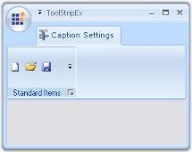

Customizing the Caption

The below properties lets you customize caption for the control.

_Table_ _765_: Property Table

<table>
<tr>
<td>
Property</td><td>
Description</td></tr>
<tr>
<td>
CaptionFont</td><td>
Sets the FontStyle for the caption.</td></tr>
<tr>
<td>
CaptionTextStyle</td><td>
Sets the text style for the caption. The options are, Plain, Etched and Shadow.</td></tr>
<tr>
<td>
CaptionAlignment</td><td>
Sets the alignment of the caption. The Alignment can be,Near, Center and Far.</td></tr>
<tr>
<td>
CaptionStyle</td><td>
Specifies whether to align the caption text to the top or bottom of the ToolStripEx.Default alignment is Top.</td></tr>
<tr>
<td>
CaptionMinHeight</td><td>
Sets the minimum height for the caption.</td></tr>
</table>



this.toolStripEx1.CaptionFont = new Font("Verdana", 8);

this.toolStripEx1.CaptionTextStyle = CaptionTextStyle.Shadow;

this.toolStripEx1.CaptionAlignment = CaptionAlignment.Center;

this.toolStripEx1.CaptionStyle = CaptionStyle.Bottom;

this.ribbonControlAdv1.CaptionMinHeight = 20;





Me.toolStripEx1.CaptionFont = New Font("Verdana", 8)

Me.toolStripEx1.CaptionTextStyle = CaptionTextStyle.Shadow

Me.toolStripEx1.CaptionAlignment = CaptionAlignment.Center

Me.toolStripEx1.CaptionStyle = CaptionStyle.Bottom

Me.ribbonControlAdv1.CaptionMinHeight = 20



See Also

Style Settings

Appearance Settings

#### Grouping Items

ToolStripItems can be grouped inside a ToolStripEx using the GroupedButtons property.



this.toolStripEx1.GroupedButtons = true;





Me.toolStripEx1.GroupedButtons = True



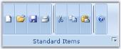

#### Collapsed State Settings 

When the ToolStripEx is collapsed at run time, it will collapse all the items and display a dropdown button like the image given below.

Instead of showing a blank ToolStripEx when collapsed, we can display a text and an image using the below properties.

_Table_ _766_: Property Table

<table>
<tr>
<td>
Property</td><td>
Description</td></tr>
<tr>
<td>
CollapsedDropDownButtonImage</td><td>
Gets/sets the image of the collapsed state drop down button.</td></tr>
<tr>
<td>
CollapsedDropDownButtonText</td><td>
Gets/sets the text of the collapsed state drop down button.</td></tr>
</table>



Image img = Image.FromFile(Application.StartupPath +@"\image.png");

this.toolStripEx1.CollapsedDropDownButtonImage = img;

this.toolStripEx1.CollapsedDropDownButtonText = "Clipboard Items";





Dim img As Image =  Image.FromFile(Application.StartupPath +"\image.png") 

Me.toolStripEx1.CollapsedDropDownButtonImage = img

Me.toolStripEx1.CollapsedDropDownButtonText = "Clipboard Items"



#### Events

LauncherClick

This event is raised when the launcher button is clicked.



private void toolStripEx1_LauncherClick(object sender, EventArgs e)

{

     Form fontDialog = new Form2();

     fontDialog.ShowDialog();

}





Private  Sub toolStripEx1_LauncherClick(ByVal sender As Object, ByVal e As EventArgs)

     Dim fontDialog As Form =  New Form2() 

     fontDialog.ShowDialog()

End Sub



See Also

ItemClicked Event

### Quick Access Toolbar

The quick access toolbar provides easy access to the controls that are used in the Office 2007 controls. The visibility of this toolbar can be controlled using RibbonControlAdv.QuickPanelVisible property. 



this.ribbonControlAdv1.QuickPanelVisible = true;





Me.ribbonControlAdv1.QuickPanelVisible = True



Adding Controls to QuickAccessToolbar

Items / controls can be added to the QuickAccessToolbar by clicking on the Edit quick items Button link in the smart tag of the RibbonControlAdv control. This opens Customize Quick Access Toolbar Dialog which displays the existing toolstrip items. You can add the required items to the Quick Access Toolbar. 

The dialog comes with Office2007 look and feel.

> Note: You can also add items to the Quick Access Toolbar by enabling the UseInQuickAccessMenu On RibbonControl1 extended property for any control in the designer.

> Note: Ribbon provides option to edit the items at run time also. See_ RunTime Customization _for more details.

A sample code snippet which adds a ToolStripButton named "File" to the QuickAccessToolbar through code. To know about other controls, refer ToolStripItems topic.



// Declare and initialize the toolstripbutton.

private System.Windows.Forms.ToolStripButton toolStripButton1;

this.toolStripButton1 = new System.Windows.Forms.ToolStripButton();

// Set the text and DisplayStyle property.

this.toolStripButton1.Text = "File";

this.toolStripButton1.DisplayStyle = System.Windows.Forms.ToolStripItemDisplayStyle.Text;

// Add the toolstripbutton in the header of the RibbonControlAdv.

this.ribbonControlAdv1.Header.AddQuickItem(this.toolStripButton1);





' Declare and initialize the toolstripbutton.

Private toolStripButton1 As System.Windows.Forms.ToolStripButton

Me.toolStripButton1 = New System.Windows.Forms.ToolStripButton()

' Set the text and DisplayStyle property.

Me.toolStripButton1.Text = "File"

Me.toolStripButton1.DisplayStyle = System.Windows.Forms.ToolStripItemDisplayStyle.Text

' Add the toolstripbutton in the header of the RibbonControlAdv.

Me.ribbonControlAdv1.Header.AddQuickItem (Me.toolStripButton1)



See Also

How to add a component in the QuickAccessMenu programmatically?

How to show a Customize Quick Access Toolbar programmatically at run time?

How to set the description on RibbonControlAdv?

#### RunTime Customization

At run time, when you click the drop-down button of the Quick Access Toolbar, "Customize Quick Access Toolbar" option will be displayed. 

Clicking the option will open the Customize Quick Access Toolbar Editor dialog which lets you do the following.

* Add new items, 
* Remove the existing items or 
* Change the order of the items.

Show/Hide ToolStrip Items from Custom Quick Access Toolbar Dialog

The user can now show/hide ToolStrip Items on Quick Access Toolbar dialog. This can be achieved by setting RibbonControlAdv.SetUseInCustomQuickAccessDialog which allows user to show or hide the ToolStrip Item. It also allows show/hide Ribbon component from the Quick Access Toolbar dialog. By default, all the item values are set to true and will be displayed in the dialog.



RibbonControlAdv.SetUseInCustomQuickAccessDialog(Component, bool show);



The following code snippet illustrates the same.



this.ribbonControlAdv1.SetUseInCustomQuickAccessDialog(this.toolStripTabItem1, false);



##### Localization support for labels in the QuickAccess Toolbar

In the Quick Access Toolbar, the labels present in a customized Quick Access Toolbar dialog box can be localized to a user-defined language. These labels can be localized by using the appropriate localizer keywords. In the below code snippets the return value of the switch case is the localized text for the labels.

> Note: The following changes must be done within a localizer class used for the application which is inherited from the IlocalizationProvider.



case ToolsResourceIdentifiers.CustomizeQuickAccessLabel:

     return "Customize QuickAccess Label text";

case ToolsResourceIdentifiers.QuickAccessToolBarLabel:

     return "QuickAccess ToolBar Label text";

case ToolsResourceIdentifiers.CustomizationLabel:

     return "Customization Label text";





case ToolsResourceIdentifiers.CustomizeQuickAccessLabel:

     return "Customize QuickAccess Label text"

case ToolsResourceIdentifiers.QuickAccessToolBarLabel:

     return "QuickAccess ToolBar Label text"

case ToolsResourceIdentifiers.CustomizationLabel:

     return "Customization Label text"


	 
See Also

Placing QAT

How to add a component in the QuickAccessMenu programmatically

How to show a Customize Quick Access Toolbar programmatically at run time

How to set the description on RibbonControlAdv

#### Placing QAT

DesignTime

By default Quick panel is placed at the top of the control. It can also be placed below the ribbon by enabling the ShowQuickPanelBelowRibbon property. This property can also be enabled by using the smart tag of Ribbon.



this.ribbonControlAdv1.QuickPanelVisible = true;

this.ribbonControlAdv1.ShowQuickPanelBelowRibbon = true;





Me.ribbonControlAdv1.QuickPanelVisible = True

Me.ribbonControlAdv1.ShowQuickPanelBelowRibbon = True



RunTime

You can also align the QAT, above or below the ribbon using the options provided at run time.

### QuickAccessToolBar Events

This section comprises the below events:

#### BeforeAddItem and BeforeRemoveItem Events

BeforeAddItem event is handled, just before the item gets added to the Quick Access Toolbar. BeforeRemoveItem event is handled, just before an item is removed from the Quick Access Toolbar.



private void QuickItems_BeforeAddItem(object sender, RibbonItemEventArgs e)

{

//Gets the item that is going to be added

    MessageBox.Show(e.Item.Text.ToString() + " Item is Added");

}

private void QuickItems_BeforeRemoveItem(object sender, RibbonItemEventArgs e)

{

//Gets the item that is going to be Removed

MessageBox.Show(e.Item.Text.ToString() + " Item is Removed");

}





Private Sub QuickItems_BeforeAddItem(ByVal sender As Object, ByVal e As RibbonItemEventArgs)

    'Gets the item that is going to be added 

    MessageBox.Show(e.Item.Text.ToString() + " Item is Added")

End Sub

Private Sub QuickItems_BeforeRemoveItem(ByVal sender As Object, ByVal e As RibbonItemEventArgs)

    'Gets the item that is going to be Removed 

    MessageBox.Show(e.Item.Text.ToString() + " Item is Removed")

End Sub



#### QuickItemAdded and QuickItemRemoved Events

When the QuickAccessToolBar items are added, RibbonControlAdv.Header.QuickItemAdded event will be handled. Similarly when the QuickAccessToolBar items are removed, RibbonControlAdv.Header.QuickItemRemoved event will be handled. 



this.ribbonControlAdv1.Header.QuickItemAdded += new ToolStripItemEventHandler(Header_QuickItemAdded);

this.ribbonControlAdv1.Header.QuickItemRemoved += new ToolStripItemEventHandler(Header_QuickItemRemoved); 

private void Header_QuickItemAdded(object sender, ToolStripItemEventArgs e)

{

    MessageBox.Show(e.Item.Text);

}

private void Header_QuickItemRemoved(object sender, ToolStripItemEventArgs e)

{

    MessageBox.Show(e.Item.Text);

} 





AddHandler ribbonControlAdv1.Header.QuickItemAdded, AddressOf Header_QuickItemAdded 

AddHandler ribbonControlAdv1.Header.QuickItemRemoved, AddressOf Header_QuickItemRemoved 

Private Sub Header_QuickItemAdded(ByVal sender As Object, ByVal e As ToolStripItemEventArgs)

    MessageBox.Show(e.Item.Text)

End Sub

Private Sub Header_QuickItemRemoved(ByVal sender As Object, ByVal e As ToolStripItemEventArgs)

    MessageBox.Show(e.Item.Text)

End Sub



### Enable/Disable Gallery Item

This feature disables/ enables particular gallery item in the gallery. 

Users cannot select the gallery item when it is disabled.

Enable/Disable Gallery Item

Enable/disable gallery item, by using the following code.

> Note: Third item in the gallery is disabled in this example.



toolStripGalleryItem3.Enabled = false;





toolStripGalleryItem3.Enabled = False



Property Details

The following table contains the property details.

_Table_ _767_: Property Table

<table>
<tr>
<td>
Name of the Property</td><td>
Description </td><td>
Type of the Property </td><td>
Value It Accepts</td><td colspan = "2">
Property Syntax</td></tr>
<tr>
<td>
Enabled</td><td>
Gets/sets gallery item enabled/disabled.</td><td>
Normal</td><td>
Boolean</td><td>
public bool Enabled</td></tr>
</table>

### Concepts and Features

This section comprises the below topics:

#### Appearance Settings

The appearance settings of the RibbonControlAdv are discussed under the below sections:

##### OfficeColorSchemes

The Ribbon Control Adv has come up with the same visual style of Office 2007. The users can choose between three colors Blue, Silver and Black which, can be set through the OfficeColorScheme property of the RibbonControlAdv class.



this.ribbonControlAdv1.OfficeColorScheme = Syncfusion.Windows.Forms.Tools.ToolStripEx.ColorScheme.Blue;





Me.ribbonControlAdv1.OfficeColorScheme = Syncfusion.Windows.Forms.Tools.ToolStripEx.ColorScheme.Blue



##### Custom Color Scheme 

To set custom colors, set the ColorScheme as Managed. Then set the desired color using the  Syncfusion.Windows.Forms.Tools.Office12ColorTable.ApplyManagedColors method. 



//set the custom color to the form and RibbonControlAdv 

this.ColorScheme = ColorSchemeType.Managed;

this.ribbonControlAdv1.OfficeColorScheme = ToolStripEx.ColorScheme.Managed;

Office12ColorTable.ApplyManagedColors(this, Color.Red);           





'set the custom color to the form and RibbonControlAdv 

Me.ColorScheme = ColorSchemeType.Managed

Me.ribbonControlAdv1.OfficeColorScheme = ToolStripEx.ColorScheme.Managed

Office12ColorTable.ApplyManagedColors(Me, Color.Red)



##### Caption ForeColor

Title color of the RibbonControlAdv can be set with the TitleColor property.



this.ribbonControlAdv1.TitleColor = Color.Green;





  Me.ribbonControlAdv1.TitleColor = Color.Green;



#### Ribbon Merging

RibbonControlAdv allows merging the RibbonPanel in a child form to the RibbonPanel in the parent form without a single line of code.

To merge the RibbonPanel in the ChildForm with the RibbonPanel in the parent form, follow the below given steps.

Through Designer

In a Ribbonform, add a RibbonControlAdv control and the required ToolStripTabItems and the ToolStripEx items.

From the ToolBox, add a RibbonPanelMergeContainer to the ChildForm. ToolStripEx can be added into this by right Clicking on it. 

Now add this ChildForm to the RibbonForm that is the MDIParent of the ChildForm in the default manner.



ChildForm frm = new ChildForm(); 

frm.MdiParent = this; 

frm.Show();            





Dim frm As ChildForm = New ChildForm()

frm.MdiParent = Me

frm.Show()



> Note: The form's IsMDIContainer property must be set as true. Also the MDIParent Ribbonform should host a RibbonControlAdv to get the ChildForm's panels to be merged.

Run the sample to view the ChildForm and the RibbonPanel merged with the RibbonControlAdv in the ParentForm.

#### Tab Groups

RibbonControlAdv allows to create TabGroups using the TabGroups property available for the RibbonControlAdv.

Creating TabGroup

Through Designer

1. Clicking the TabGroup property will pop up a window like the one below and using this, number of groups can be added and customized using the Color, Name and Visible properties provided to the right of the window.

  

2. Now create a ToolStripTabItem using the smart tag of the Ribbon.
3. Switch to the properties grid of the ToolStripTabItem, and select the tabgroup you have added through TabGroup property.

   

4. This will display the tab items in the RibbonControlAdv as shown in the image below.

   

Through Code



this.ribbonControlAdv1.TabGroups.Add(toolStripTabGroup3);

Syncfusion.Windows.Forms.Tools.ToolStripTabGroup toolStripTabGroup3 = new Syncfusion.Windows.Forms.Tools.ToolStripTabGroup();

this.ribbonControlAdv1.TabGroups.Add(toolStripTabGroup3);

this.ribbonControlAdv1.TabGroups.SetTabGroup(pageLayoutTabItem, toolStripTabGroup1);





Me.ribbonControlAdv1.TabGroups.Add(toolStripTabGroup3)

Dim toolStripTabGroup3 As Syncfusion.Windows.Forms.Tools.ToolStripTabGroup = New Syncfusion.Windows.Forms.Tools.ToolStripTabGroup

Me.ribbonControlAdv1.TabGroups.Add(toolStripTabGroup3)

Me.ribbonControlAdv1.TabGroups.SetTabGroup(pageLayoutTabItem, toolStripTabGroup1)



Customization

Using the Color property, the color for the tabs can be set. Text for the tabs can be specified through Name property and the tabs can be shown or hidden using Visible property.

Programmatically these properties can be set using the below code snippets.



toolStripTabGroup3.Color = System.Drawing.Color.DarkBlue;

toolStripTabGroup3.Name = "New Group";

toolStripTabGroup3.Visible = true;





toolStripTabGroup3.Color = System.Drawing.Color.DarkBlue

toolStripTabGroup3.Name = "New Group"

toolStripTabGroup3.Visible = True



#### Title Settings 

This section describes how to customize a normal windows form's title bar appearance using the RibbonControlAdv.

Form Title Bar Settings

When an application is created, it is usually displayed with the form title bar. The RibbonControlAdv provides option to replace this title bar with the built-in RibbonControlAdv system buttons and this can be enabled by setting the IsFormManager property to true. 



this.ribbonControlAdv1.IsFormManager = true;





Me.ribbonControlAdv1.IsFormManager = True



Title Settings

The below properties deals with Ribbon title settings.

_Table_ _768_: Property Table

<table>
<tr>
<td>
 Property</td><td>
Description</td></tr>
<tr>
<td>
TitleAlignment</td><td>
Sets the alignment of the Title.</td></tr>
<tr>
<td>
TitleFont</td><td>
Sets the font style of the title.</td></tr>
<tr>
<td>
TitleColor</td><td>
Sets the font color of the title.</td></tr>
</table>



this.ribbonControlAdv1.TitleAlignment = Syncfusion.Windows.Forms.Tools.TextAlignment.Center;

this.ribbonControlAdv1.TitleFont = new System.Drawing.Font("Arial", 9.75F);

this.ribbonControlAdv1.TitleColor = Color.GreenYellow;





Me.ribbonControlAdv1.TitleAlignment = Syncfusion.Windows.Forms.Tools.TextAlignment.Center

Me.ribbonControlAdv1.TitleFont = New System.Drawing.Font("Arial", 9.75F)

Me.ribbonControlAdv1.TitleColor = Color.GreenYellow



#### Persistence Support

RibbonControlAdv comes with persistence support. Using this we can restore the saved state of the ribbon control.

Persistence works for the following.

* The items in the QuickAccessToolBar that are added through the "Customize Quick Access ToolBar" can be persisted.
* Items added through the context menu that appears while clicking the dropdown arrow to the right of the QuickAccessToolBar can be persisted.
* The collapsed / expanded / floating state of the RibbonPanel can be persisted.
* The position of the QuickAccessToolBar, either below or above the ribbon panel can be persisted.

### Events And Methods

RibbonControlAdv comes with various events and methods to make easy customization.

Events

_Table_ _769_: Events Table

<table>
<tr>
<td>
Events</td><td>
Description</td><td>
EventArgs</td></tr>
<tr>
<td colspan = "4">
QuickAccessToolbar Events</td></tr>
<tr>
<td>
RibbonControlAdv1.BeforeCustomizeDropDownPopup</td><td>
Occurs before the DropDown of QuickItemsDropDownButton is shown.</td><td>
DropDownEventArgs</td></tr>
<tr>
<td>
RibbonControlAdv1.AfterCustomizeDropDownPopup</td><td>
Occurs after the DropDown of QuickItemsDropDownButton is shown.</td><td>
EventArgs</td></tr>
<tr>
<td>
RibbonControlAdv1.Header.QuickItems.BeforeAddItem</td><td>
Occurs before ToolStripItem added to the QuickAccessPanel collection.</td><td>
RibbonItemsEventArgs</td></tr>
<tr>
<td>
RibbonControlAdv1.Header.QuickItems.BeforeRemoveItem</td><td>
Occurs before ToolStripItem is removed from the QuickAccessPanel collection.</td><td>
RibbonItemsEventArgs</td></tr>
<tr>
<td>
RibbonControlAdv.Header.QuickItemAdded</td><td>
Occurs when an item is added to the Quick Menu.</td><td>
ToolStripItemEventArgs</td></tr>
<tr>
<td>
RibbonControlAdv.Header.QuickItemRemoved</td><td>
Occurs when an item is removed from the Quick Menu.</td><td>
ToolStripItemEventArgs</td></tr>
<tr>
<td colspan = "4">
ToolStripTabItem Events</td></tr>
<tr>
<td>
RibbonControlAdv1.SelectedTabItemChanged</td><td>
Occurs when selected ToolStripTabItem has changed.</td><td>
SelectedTabChangedEventArgs</td></tr>
<tr>
<td>
RibbonControlAdv1.Header.MainItems.BeforeAddItem</td><td>
Occurs before a ToolStripItem is added to the collection.</td><td>
RibbonItemEventArgs</td></tr>
<tr>
<td>
RibbonControlAdv1.Header.MainItems.BeforeRemoveItem</td><td>
Occurs before a ToolStripItem is removed from the collection.</td><td>
RibbonItemEventArgs</td></tr>
<tr>
<td colspan = "4">
OfficeMenuButton Event</td></tr>
<tr>
<td>
RibbonControlAdv.MenuButtonDoubleClick</td><td>
Occurs when the OfficeMenuButton is double clicked.</td><td>
EventArgs</td></tr>
</table>
Methods

_Table_ _770_: Methods Table

<table>
<tr>
<td>
Methods</td><td>
Description</td></tr>
<tr>
<td colspan = "2">
QuickAccessToolbar Methods</td></tr>
<tr>
<td>
RibbonControlAdv1.ShowCustomizeDialog</td><td>
Shows QuickItems customizing dialog.</td></tr>
<tr>
<td>
RibbonControlAdv1.Header.AddQuickItem</td><td>
Adds ToolStripItems to the QuickAccessPanel.</td></tr>
<tr>
<td>
RibbonControlAdv1.Header.QuickItems.RemoveAt</td><td>
Removes the specified ToolStripItems from the QuickAccessPanel.</td></tr>
<tr>
<td colspan = "2">
ToolStripTabItem Method</td></tr>
<tr>
<td>
RibbonControlAdv1.Header.AddMainItem</td><td>
Adds ToolStripTabItems to the RibbonPanel.</td></tr>
<tr>
<td>
RibbonControlAdv1.Header.MainItems.RemoveAt</td><td>
Removes the specified ToolStripTabItems from the QuickAccessPanel.</td></tr>
</table>

#### SelectedTabItemChanged Event

This event is handled when selected tab of the RibbonControlAdv is changed. With the SelectedTabChangedEventArgs of this event, we can retrieve the NewSelectedTab and PrevSelectedTab.



private void ribbonControlAdv1_SelectedTabItemChanged(object sender, SelectedTabChangedEventArgs e)

{

    MessageBox.Show(e.NewSelectedTab.Text);

} 





Private Sub ribbonControlAdv1_SelectedTabItemChanged(ByVal sender As Object, ByVal e As SelectedTabChangedEventArgs)

    MessageBox.Show(e.NewSelectedTab.Text)

End Sub



#### BeforeCustomizeDropDownPopup Event

RibbonControlAdv has two events BeforeCustomizeDropDownPopup and AfterCustomizeDropDownPopup events that are handled before and after the CustomizeDropDownPopup is activated.

Example

The QAT context menu items can be accessed through the DropDownEventArgs of the BeforeCustomizeDropDownPopup event and the QAT context menu can be customized such as adding new items, accessing existing items and so on.



ToolStripButton newItem = new ToolStripButton();

private void ribbonControlAdv1_BeforeCustomizeDropDownPopup(object sender, DropDownEventArgs e)

{

    newItem.Text = "New Item";

    e.DropDown.Items.Add(newItem);

    foreach (ToolStripItem ts in e.DropDown.Items)

    {

        this.listBox1.Items.Add(ts.Text);

    }

} 





Private newItem As ToolStripButton = New ToolStripButton()

Private Sub ribbonControlAdv1_BeforeCustomizeDropDownPopup(ByVal sender As Object, ByVal e As DropDownEventArgs)

    newItem.Text = "New Item"

    e.DropDown.Items.Add(newItem)

    For Each ts As ToolStripItem In e.DropDown.Items

        Me.listBox1.Items.Add(ts.Text)

    Next ts

End Sub



### MiniToolBar

Essential Tools comes with MiniToolBar control with similar look and feel of MS Office 2007. It appears when the user selects and right clicks on the text. It gives options to customize the selected text. It will look blurred in the beginning, but once the mouse is focussed on it, it will be prominent to the users. 

> Note: MiniToolBar control uses a ToolStripPanelItem to hold its options.

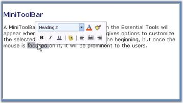

See Also

#### Color Schemes in MiniToolBar

MiniToolbar supports all the three ColorSchemes of Office2007, which can be set using the ColorScheme property.



this.MiniToolBar.ColorScheme = Syncfusion.Windows.Forms.Tools.ToolStripEx.ColorScheme.Silver;





Me.MiniToolBar.ColorScheme = Syncfusion.Windows.Forms.Tools.ToolStripEx.ColorScheme.Silver



#### Creating MiniToolBar

The sub topics under this section will guide you to create a MiniToolBar control, add controls to it and then associate it with a control. The topics are as follows.

##### Through Designer

To add a MiniToolBar to the form, follow the below given steps.

* Drag and drop a MiniToolBar from the toolbox. 

* Open the Items Collection Editor of the MiniToolBar.

* Add the required items into the MiniToolBar from the Items collection Editor and click Ok. 

* Now, drag and drop the control with which the MiniToolBar is to be associated, for eg. a RichTextBox.
* Set the MiniToolBar's AssociatedControl property to the control to which this is to be associated.

* Run the sample and right-click on the RichTextBox to view the MiniToolBar. 

> Note: You can also show a MiniToolBar by just selecting the text, as in MSOffice2007, using MouseUp event of the particular control

A sample which demonstrates this features is available in the below sample installation location.

…\_My Documents\Syncfusion\EssentialStudio\Version Number\Windows\Tools.Windows\Samples\Advanced Editor Functions\ActionGroupingDemo_

See Also

Creating MiniToolBar Through Code

##### Through Code

This section guides you with the steps to add a MiniToolbar and associating with a RichTextBox control programmatically.

*  Add the given namespaces.



using Syncfusion.Windows.Forms;  

using Syncfusion.Windows.Forms.Tools;   





Imports Syncfusion.Windows.Forms

Imports Syncfusion.Windows.Forms.Tools



* Declare and initialize the MiniToolBar control. Also declare the controls to be added to the MiniToolBar, and also the control, in this case RichTextBow, to which MiniToolBar is to be associated.



private Syncfusion.Windows.Forms.Tools.MiniToolBar MiniToolBar;

private System.Windows.Forms.RichTextBox richTextBox1;

//Control to be added to the MiniToolBar

private Syncfusion.Windows.Forms.Tools.ToolStripPanelItem MiniToolBarPanelItem;

private Syncfusion.Windows.Forms.Tools.ToolStripPanelItem PanelItem1;

private System.Windows.Forms.ToolStripComboBox FontFaceCombo;

//initializing

this.MiniToolBar = new Syncfusion.Windows.Forms.Tools.MiniToolBar();

this.richTextBox1 = new System.Windows.Forms.RichTextBox();

this.MiniToolBarPanelItem = new Syncfusion.Windows.Forms.Tools.ToolStripPanelItem();

this.PanelItem1 = new Syncfusion.Windows.Forms.Tools.ToolStripPanelItem();

this.FontFaceCombo = new System.Windows.Forms.ToolStripComboBox();





Private MiniToolBar As Syncfusion.Windows.Forms.Tools.MiniToolBar

Private richTextBox1 As System.Windows.Forms.RichTextBox

'Control to be added to the MiniToolBar

Private MiniToolBarPanelItem As Syncfusion.Windows.Forms.Tools.ToolStripPanelItem

Private PanelItem1 As Syncfusion.Windows.Forms.Tools.ToolStripPanelItem

Private FontFaceCombo As System.Windows.Forms.ToolStripComboBox

'Initializing

Me.MiniToolBar = New Syncfusion.Windows.Forms.Tools.MiniToolBar()

Me.richTextBox1 = New System.Windows.Forms.RichTextBox()

Me.MiniToolBarPanelItem = New Syncfusion.Windows.Forms.Tools.ToolStripPanelItem()

Me.PanelItem1 = New Syncfusion.Windows.Forms.Tools.ToolStripPanelItem()

Me.FontFaceCombo = New System.Windows.Forms.ToolStripComboBox()



* Add the required items into the MiniToolBar.



//Adding Panel

this.MiniToolBar.Items.AddRange(new System.Windows.Forms.ToolStripItem[] {this.MiniToolBarPanelItem});

//Customizing MiniToolBarPanelItem

this.MiniToolBarPanelItem.ForeColor = System.Drawing.Color.MidnightBlue;

this.MiniToolBarPanelItem.Items.AddRange(new System.Windows.Forms.ToolStripItem[] {this.PanelItem1});

//Customizing the Panel

this.PanelItem1.Items.AddRange(new System.Windows.Forms.ToolStripItem[] {this.FontFaceCombo});

//Customizing the FontFaceCombo

this.FontFaceCombo.DropDownStyle = System.Windows.Forms.ComboBoxStyle.DropDownList;     





'Adding Panel

Me.MiniToolBar.Items.AddRange(New System.Windows.Forms.ToolStripItem() {Me.MiniToolBarPanelItem})

'Customizing MiniToolBarPanelItem

Me.MiniToolBarPanelItem.ForeColor = System.Drawing.Color.MidnightBlue

Me.MiniToolBarPanelItem.Items.AddRange(New System.Windows.Forms.ToolStripItem() {Me.PanelItem1})

'Customizing the Panel

Me.PanelItem1.Items.AddRange(New System.Windows.Forms.ToolStripItem() {Me.FontFaceCombo})

'Customizing the FontFaceCombo

Me.FontFaceCombo.DropDownStyle = System.Windows.Forms.ComboBoxStyle.DropDownList



* Set the MiniToolBar's AssociatedControl property to the RichTextBox to which this is to be associated.



//Associates the MiniToolBar with the RichTextBox

this.MiniToolBar.AssociatedControl = this.richTextBox1;   
      




'Associates the MiniToolBar with the RichTextBox

Me.MiniToolBar.AssociatedControl = Me.richTextBox1



* Right-click on the RichTextBox to view the MiniToolBar.

A sample which demonstrates how to create and add controls to the MiniToolBar is available in the below sample installation location.

…\_My Documents\Syncfusion\EssentialStudio\Version Number\Windows\Tools.Windows\Samples\Advanced Editor Functions\ActionGroupingDemo_

#### MiniToolBar Events

This section discusses about various events that can be handled for the MiniToolBar control. Following are the events covered.

##### ItemAdded Event

This event is handled when a ToolStripItem has been added to the ToolStrip's Item collection.

Event Data

The ToolStripItemEventHandler receives an argument of type ToolStripItemEventArgs containing data related to this event. The following type ToolStripItemEventArgs member provide information specific to this event.

_Table_ _771_: Member Table

<table>
<tr>
<td>
Member</td><td>
Description</td></tr>
<tr>
<td>
Item</td><td>
Gets a System.Windows.Forms.ToolStripItem for which to handle events.</td></tr>
</table>



private void miniToolBar1_ItemAdded(object sender, ToolStripItemEventArgs arg)

{

// You can see the below line in output window during runtime.

Console.WriteLine("ItemAdded event is raised");

e.Item = true;

//Display the ToolStripItem

Console.WriteLine("ToolStrip Item Name : " + arg.Item.ToString());

}





Private Sub miniToolBar1_ItemAdded(ByVal sender As Object, ByVal e As ToolStripItemEventArgs)

You can see the below line in output window during runtime.

Console.Write("ItemAdded event is raised")

e.Item = True

'Display the ToolStripItem

Console.Write("ToolStrip Item Name : " + arg.Item.ToString)

End Sub



##### ItemClicked Event

This event is handled when a ToolStripItem has been added to the ToolStrip's Item collection.

Event Data

The ToolStripItemClickedEventHandler receives an argument of type ToolStripItemEventArgs containing data related to this event. The following type ToolStripItemEventArgs member provide information specific to this event.

_Table_ _772_: Member Table

<table>
<tr>
<td>
Member</td><td>
Description</td></tr>
<tr>
<td>
ClickedItem</td><td>
Gets the item that is clicked on System.Windows.Forms.Toolstrip.</td></tr>
</table>



private void miniToolBar1_ItemClicked(object sender, ToolStripItemClickedEventArgs e)

{

// You can see the below line in output window during runtime.

Console.WriteLine("ItemClicked event is raised");

//Display the ToolStripItem that is clicked

Console.WriteLine("ToolStrip Item Name : " + arg.ClickedItem.ToString());

}





Private Sub miniToolBar1_ItemClicked(ByVal sender As Object, ByVal e As ToolStripItemClickedEventArgs)

'You can see the below line in output window during runtime.

Console.Write("ItemClicked event is raised")

'Display the ToolStripItem that is clicked

Console.Write("ToolStrip Item Name : " + arg.ClickedItem.ToString)

End Sub



##### ItemRemoved Event

This event is handled when a ToolStripItem has been removed from the ToolStrip's Item collection.

Event Data

The ToolStripItemEventHandler receives an argument of type ToolStripItemEventArgs containing data related to this event. The following ToolStripItemEventArgs member provide information specific to this event.

_Table_ _773_: Member Table

<table>
<tr>
<td>
Member</td><td>
Description</td></tr>
<tr>
<td>
Item</td><td>
Gets a System.Windows.Forms.ToolStripItem for which to handle events.</td></tr>
</table>



private void miniToolBar1_ItemClicked(object sender, ToolStripItemEventArgs e)

{

e.Item = true;

}





Private Sub miniToolBar1_ItemClicked(ByVal sender As Object, ByVal e As ToolStripItemEventArgs)

e.Item = True

End Sub



##### BeginDrag Event

This event is handled when the toolstrip has started to move with a ToolStripPanel.



private void miniToolBar1_BeginDrag(object sender, System.EventArgs e)

{

//You can see the below line in output window during runtime.

Console.Write("BeginDrag Event is raised");

}





Private Sub miniToolBar1_BeginDrag(ByVal sender As Object, ByVal e As System.EventArgs)

/You can see the below line in output window during runtime.

Console.Write("BeginDrag Event is raised");

End Sub



##### Opening Event

This event occurs when the drop down is opening.

Event Data

The CancelEventHandler receives an argument of type CancelEventArgs containing data related to this event. The following CancelEventArgs members provide information specific to this event.

_Table_ _774_: Member Table

<table>
<tr>
<td>
Member</td><td>
Description</td></tr>
<tr>
<td>
Cancel</td><td>
Gets or Sets a value indicating whether the event should be canceled.</td></tr>
</table>



private void miniToolBar1_Opening(object sender, System.ComponentModel.CancelEventArgs e)

{

//EventArgs can give the options to Allow or Cancel the event by this method.

//Cancel is the boolean property which can prevent docking event when it is true.

e.Cancel=true;

}





Private Sub miniToolBar1_Opening(ByVal sender As Object, ByVal e As System.ComponentModel.CancelEventArgs)

//EventArgs can give the options to Allow or Cancel the event by this method.

//Cancel is the boolean property which can prevent docking event when it is true.

e.Cancel=true;

End Sub



##### Opened Event

This event occurs when the drop down has opened.



private void miniToolBar1_Opened(object sender, System.EventArgs e)

{

// You can see the below line in output window during runtime.

Console.Write(" Opened Event is raised");

}





Private Sub miniToolBar1_Opened(ByVal sender As Object, ByVal e As System.EventArgs)

'You can see the below line in output window during runtime.

Console.Write(" Opened Event is raised");

End Sub



### StatusStripEx

Essential Tools has come up with StatusStripEx control which can be added to the bottom of the Ribbon. It can hold controls like TrackBarEx, ProgressBar, StatusStripButtons, and so on.

#### Creating a StatusStripEx

Through Designer

The StatusStripEx can be added to the form by dragging a StatusStripEx control from the Toolbox. It can be docked to the bottom of the RibbonControlAdv. 

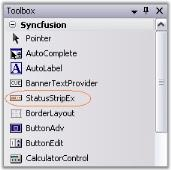

Dock the StatusStripEx control to the bottom using Dock property.

Adding Items to the StatusStripEx

Access the Items property of the control, to open the Items Collection Editor. Use this editor to add customized StatusControl items. The Editor will let you modify the look and feel of the items using the properties provided on it right side.

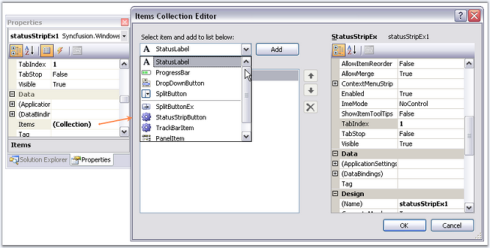

> Note: A shortcut to add the ToolStripStatus Items is through Tasks Window. See Smart Tag options to know more.

Through Code

StatusStripEx can be created programmatically using the code below. This code snippet adds a ToolStripStatus Label to the StatusStripEx control.



using Syncfusion.Windows.Forms.Tools;

//Declaring the StatusStripEx and ToolStripStatusLabel

private Syncfusion.Windows.Forms.Tools.StatusStripEx statusStripEx1;

private System.Windows.Forms.ToolStripStatusLabel toolStripStatusLabel1;

//Initializing the StatusStripEx and ToolStripStatusLabel

this.statusStripEx1 = new Syncfusion.Windows.Forms.Tools.StatusStripEx();

this.toolStripStatusLabel1 = new System.Windows.Forms.ToolStripStatusLabel();

//Adding ToolStripStatusLabel to StatusStripEx

this.statusStripEx1.Items.AddRange(new System.Windows.Forms.ToolStripItem[] {

this.toolStripStatusLabel1});

this.Controls.Add(this.statusStripEx1);

//Docking the StatusStripEx to Bottom

this.statusStripEx1.Dock = Syncfusion.Windows.Forms.Tools.DockStyleEx.Bottom;





Imports Syncfusion.Windows.Forms.Tools

'Declaring the StatusStripEx and ToolStripStatusLabel 

Private statusStripEx1 As Syncfusion.Windows.Forms.Tools.StatusStripEx

Private toolStripStatusLabel1 As System.Windows.Forms.ToolStripStatusLabel

'Initializing the StatusStripEx and ToolStripStatusLabel 

Me.statusStripEx1 = New Syncfusion.Windows.Forms.Tools.StatusStripEx() 

Me.toolStripStatusLabel1 = New System.Windows.Forms.ToolStripStatusLabel() 

'Adding ToolStripStatusLabel to StatusStripEx 

Me.statusStripEx1.Items.AddRange(New System.Windows.Forms.ToolStripItem() {Me.toolStripStatusLabel1}) 

Me.Controls.Add(Me.statusStripEx1)

Docking the StatusStripEx to Bottom'

Me.statusStripEx1.Dock = Syncfusion.Windows.Forms.Tools.DockStyleEx.Bottom



A sample which demonstrates the creation of StatusStripEx control and adding ToolStripStatus Items are available in the below sample installation location.

…\_My Documents\Syncfusion\EssentialStudio\Version Number\Windows\Tools.Windows\Samples\Advanced Editor Functions\ActionGroupingDemo_

#### Smart Tag Options

Clicking the Smart Tag of the StatusStripEx, displays the below Tasks window. This window lets you add ToolStripStatus Items.

The options are,

* Dock - Provides docking options for StatusStripEx control.

StatusControl Items

* Add StatusLabel - Adds a status label item.
* Add ProgressBar - Adds a ProgressBar item.
* Add DropDownButton - Adds a dropdownbutton item.
* Add SplitButton - Adds a split button item.
* Add PanelItem - Adds a Panel item.
* Add TrackBar Item - Adds a TrackBar item.

Notifications Items

* Add StatusStripButton - Adds a Button item.

See Also

Creating a StatusStripEx

ColorSchemes for StatusStripEx

#### SizingGrip Settings

The StatusStripEx control has a sizing grip at its bottom right corner. This sizing grip can be shown or hidden using SizingGrip property. The below properties controls the appearance of the sizing grip.

_Table_ _775_: Property Table

<table>
<tr>
<td>
Property</td><td>
Description</td></tr>
<tr>
<td>
GripStyle</td><td>
Specifies the style of the sizing grip.</td></tr>
<tr>
<td>
GripMargin</td><td>
Gets or sets the margin for the sizing grip.</td></tr>
</table>



this.statusStripEx1.SizingGrip = true;

this.statusStripEx1.GripStyle = ToolStripGripStyle.Visible;

this.statusStripEx1.GripMargin = new Padding(5);





Me.statusStripEx1.SizingGrip = True

Me.statusStripEx1.GripStyle = ToolStripGripStyle.Visible

Me.statusStripEx1.GripMargin = New Padding(5)



#### ColorSchemes for StatusStripEx

StatusStripEx supports all the three color schemes, i.e., Silver, Blue and Black schemes of Office2007. It can be changed using OfficeColorScheme property.

Tooltips



this.statusStripEx1.OfficeColorScheme = Syncfusion.Windows.Forms.Tools.ToolStripEx.ColorScheme.Silver;





Me.statusStripEx1.OfficeColorScheme = Syncfusion.Windows.Forms.Tools.ToolStripEx.ColorScheme.Silver



Custom Colors

We can also apply custom colors to the StatusStripEx by setting OfficeColorScheme to "Managed" and specifying the custom color through the ApplyManagedColors method as follows.



this.statusStripEx1.OfficeColorScheme = Syncfusion.Windows.Forms.Tools.ToolStripEx.ColorScheme.Managed;

Office2007Colors.ApplyManagedColors(this, Color.DarkGreen);





Me.statusStripEx1.OfficeColorScheme = Syncfusion.Windows.Forms.Tools.ToolStripEx.ColorScheme.Managed

Office2007Colors.ApplyManagedColors(Me, Color.DarkGreen)



See Also

Creating a StatusStripEx

Smart Tag Options

SizingGrip Settings

#### Custom Context Menu

It is possible to customize the statusbar context menu that displays in StatusStripEx, to look like Word2007. This can be done by setting StatusString property of NotificationItems like StatusStripButton, StatusStripLabel, so on.



this.statusStripLabel1.Text = "Pages";

this.statusStripLabel1.StatusString = "1/1";





Me.statusStripLabel1.Text = "Pages"

Me.statusStripLabel1.StatusString = "1/1"



### ScrollersFrame

The ScrollersFrame control attaches Office2007 Style scrollbars to any scrollable control or container. 

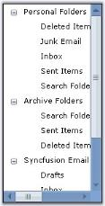

Attaching Scrollbar to a Control

To the Windows form, add a control, which should be attached with the Office2007Style scrollbars. Select the control in the ScrollersFrame.AttachedTo property.



//Attaching Scrolls using AttachedTo property

this.scrollersFrame1.AttachedTo = this.treeViewAdv1;





'Attaching Scrolls using AttachedTo property

Me.scrollersFrame1.AttachedTo = Me.treeViewAdv1



> Note: This property lists all the controls that are added to the form. User can the select any one control, for which scrolls needs to be attached.

#### Adding Controls to the ScrollBar

There are two collection properties available for the ScrollersFrame which lets you add controls before or after the scrollbars. They are ControlsAfter and ControlsBefore properties.



//Adding controls to the scrolls through ControlsAfter or ControlsBefore

this.scrollersFrame2.HorizontalScroller.ControlsBefore.Add(buttonAdv3);

this.scrollersFrame2.VerticalScroller.ControlsAfter.Add(buttonAdv1);

this.scrollersFrame2.VerticalScroller.ControlsAfter.Add(buttonAdv2);





'Adding controls to the scrolls through ControlsAfter or ControlsBefore 

Me.scrollersFrame2.HorizontalScroller.ControlsBefore.Add(buttonAdv3)

Me.scrollersFrame2.VerticalScroller.ControlsAfter.Add(buttonAdv1)

Me.scrollersFrame2.VerticalScroller.ControlsAfter.Add(buttonAdv2)



The below images illustrates the controls that are added, before and after the scrolls.

See Also

Visual Styles

#### Scroll Settings in ScrollersFrame

The horizontal and vertical scrollers has Value property, which represents the current position of the scrollbox on the scroll bar control at runtime. This value can be changed using the HorizontalSmallChange and VerticalSmallChange properties.

_Table_ _776_: Property Table

<table>
<tr>
<td>
Property</td><td>
Description</td></tr>
<tr>
<td>
HorizontalSmallChange</td><td>
Gets / sets a value to be added or subtracted from the Value Property, when horizontal scroll box is moved a small distance. Default value is 1.</td></tr>
<tr>
<td>
VerticallSmallChange</td><td>
Gets / sets a value to be added or subtracted from the Value Property, when vertical scroll box is moved a small distance. Default value is 1.</td></tr>
</table>



this.scrollersFrame2.VerticallSmallChange = 25;

this.scrollersFrame2.HorizontalSmallChange = 25;





Me.scrollersFrame2.VerticallSmallChange = 25

Me.scrollersFrame2.HorizontalSmallChange  = 25



#### Visual Styles 

Visual Styles for the ScrollersFrame Control can be edited through VisualStyle property.	

_Table_ _777_: Property Table

<table>
<tr>
<td>
Property</td><td>
Description</td></tr>
<tr>
<td>
VisualStyle</td><td>
Sets the visual style for the scrollbars. The visual styles supported are,Classic,WindowsXP,Office2007 andOffice2007Generic.</td></tr>
<tr>
<td>
OfficeColorSchemes</td><td>
Sets the office color schemes for the scrollbars when VisualStyle is set to Office2007 or Office2007Generic style. The color schemes are,Blue,Silver and Black.</td></tr>
</table>



this.scrollersFrame1.VisualStyle = Syncfusion.Windows.Forms.ScrollBarCustomDrawStyles.Office2007;





Me.scrollersFrame1.VisualStyle = Syncfusion.Windows.Forms.ScrollBarCustomDrawStyles.Office2007





this.scrollersFrame1.OfficeColorScheme = Syncfusion.Windows.Forms.Office2007ColorScheme.Silver;





Me.scrollersFrame1.OfficeColorScheme = Syncfusion.Windows.Forms.Office2007ColorScheme.Silver



Custom Colors

We can also apply custom colors to the ScrollersFrame by setting OfficeColorScheme to "Managed" and specifying the custom color through the ApplyManagedColors method as follows.



this.scrollersFrame1.OfficeColorScheme = Syncfusion.Windows.Forms.Office2007ColorScheme.Managed;

Office2007Colors.ApplyManagedColors(this, Color.LightSkyBlue);





Me.scrollersFrame1.OfficeColorScheme = Syncfusion.Windows.Forms.Office2007ColorScheme.Managed

Office2007Colors.ApplyManagedColors(Me, Color.LightSkyBlue)



See Also

Adding Controls to the ScrollBar

### ContextMenuStripEx

ContextMenuStripEx is a separate control in Essential Tools with advanced features embedded in it. It can be dragged and dropped from the toolbox.

Creating ContextMenuStripEx

Through Designer

Drag and drop a ContextMenuStripEx to the form. Click "Type Here" to add the items. This displays a collection of menu items, using which user can add the menu items. 

Items can also be added using ContextMenuStripEx.Items property or Edit Items... command in the property grid.

Through Code

The below code snippets adds a ToolStripItem (Cut) to the menu list.



//Declaration

private Syncfusion.Windows.Forms.Tools.ContextMenuStripEx EditorContextMenuStripEx;

private System.Windows.Forms.ToolStripMenuItem toolStripMenuItem1;

//Initializing

this.EditorContextMenuStripEx = new Syncfusion.Windows.Forms.Tools.ContextMenuStripEx();

//Assigning the ContextMenuStrip created

this.richTextBox1.ContextMenuStrip = this.EditorContextMenuStripEx;

//Adding a menu item

this.EditorContextMenuStripEx.Items.AddRange(new System.Windows.Forms.ToolStripItem[] {this.toolStripMenuItem1});

this.toolStripMenuItem1.Image = ((System.Drawing.Image)(resources.GetObject("toolStripMenuItem1.Image")));

this.toolStripMenuItem1.Text = "Cu&t";

this.EditorContextMenuStripEx.ResumeLayout(false);





'Declaration

Private EditorContextMenuStripEx As Syncfusion.Windows.Forms.Tools.ContextMenuStripEx

Private toolStripMenuItem1 As System.Windows.Forms.ToolStripMenuItem

'Initializing

Me.EditorContextMenuStripEx = New Syncfusion.Windows.Forms.Tools.ContextMenuStripEx

'Assigning the contextmenustrip created

Me.richTextBox1.ContextMenuStrip = Me.EditorContextMenuStripEx

'Adding a menu item

Me.EditorContextMenuStripEx.Items.AddRange(New System.Windows.Forms.ToolStripItem() {Me.toolStripMenuItem1})

Me.toolStripMenuItem1.Image = CType((Resources.GetObject("toolStripMenuItem1.Image")), System.Drawing.Image)

Me.toolStripMenuItem1.Text = "Cu&t"

Me.EditorContextMenuStripEx.ResumeLayout(False)



Associating the ContextMenuStrip to a control

This can be easily done by assigning the ContextMenuStripEx to the Control.ContextMenuStrip property.



this.richTextBox1.ContextMenuStrip = this.contextMenuStripEx1;





Me.richTextBox1.ContextMenuStrip = Me.contextMenuStripEx1



At Run time, when the user right clicks the control, menu items will be displayed like the below image.

Various Features and Customization options are discussed in the following topics.

* Style Settings
* Foreground Settings
* Margin and Shadow Settings
* RunTime Features
* RTL Support
* ToolStripItems

#### Style Settings

Office12ToolStripRenderer Class

Using the Office12ToolStripRenderer Class, the appearance of the ContextMenuStripEx can be changed. 

Use the below code snippet for implementing this feature.



private Syncfusion.Windows.Forms.Tools.Office12ColorTable ct;

private Syncfusion.Windows.Forms.Tools.Office12ToolStripRenderer m_Office12Renderer;

ct =new Syncfusion.Windows.Forms.Tools.Office12ColorTable();

ct.UseSystemColors = false;

m_Office12Renderer = new Syncfusion.Windows.Forms.Tools.Office12ToolStripRenderer(ct);





Private ct As Syncfusion.Windows.Forms.Tools.Office12ColorTable

Private m_Office12Renderer As Syncfusion.Windows.Forms.Tools.Office12ToolStripRenderer

ct = New Syncfusion.Windows.Forms.Tools.Office12ColorTable 

ct.UseSystemColors = False 

m_Office12Renderer = New Syncfusion.Windows.Forms.Tools.Office12ToolStripRenderer(ct)



In the form load event, add one of the below code to change the appearance.



//Sets Office Black Color

this.contextMenuStripEx1.Renderer = new Office12ToolStripRenderer(new OfficeBlack ());

//Sets Office Blue Color

this.contextMenuStripEx1.Renderer = new Office12ToolStripRenderer(new OfficeBlue ());

//Sets Office Silver Color

this.contextMenuStripEx1.Renderer = new Office12ToolStripRenderer(new Office12ColorTable());





'Sets Office Black Color

Me.contextMenuStripEx1.Renderer = New Office12ToolStripRenderer(New OfficeBlack) 

'Sets Office Blue Color

Me.contextMenuStripEx1.Renderer = New Office12ToolStripRenderer(New OfficeBlue)

'Sets Office Silver Color

Me.contextMenuStripEx1.Renderer = New Office12ToolStripRenderer(New Office12ColorTable())



Rendering Mode

Rendering mode of the ContextMenuStripEx can be controlled using the below property.

_Table_ _778_: Property Table

<table>
<tr>
<td>
Property</td><td>
Description</td></tr>
<tr>
<td>
RenderMode</td><td>
Represents the painting style applied to the control. The different styles supported are,Professional,System and ManagerRenderMode.</td></tr>
</table>



this.contextMenuStripEx1.RenderMode = System.Windows.Forms.ToolStripRenderMode.Professional;





Me.contextMenuStripEx1.RenderMode = System.Windows.Forms.ToolStripRenderMode.Professional



#### Foreground Settings of ContextMenuStripEx

Caption

Caption for the context menu can be specified in Text property. 



this.ContextMenuStripEx.Text = "Context Menu Items";





Me.ContextMenuStripEx.Text = "Context Menu Items"



Menu Items

The font style for the menu items can be controlled using Font property. 



this.contextMenuStripEx2.Font = new System.Drawing.Font("Courier New", 9F, System.Drawing.FontStyle.Regular);





Me.contextMenuStripEx1.Font = New System.Drawing.Font("Courier New", 9F, System.Drawing.FontStyle.Regular)



> Note: The font face of the Caption alone changes based on this Font property.

#### Margin and Shadow Settings 

Shadow Settings

Shadow for the context menu drop down is controlled using the below property.

_Table_ _779_: Property Table_

<table>
<tr>
<td>
Property</td><td>
Description</td></tr>
<tr>
<td>
DropShadowEnabled</td><td>
Shows or hides three dimensional shadow for the context menu.</td></tr>
</table>



this.contextMenuStripEx1.DropShadowEnabled = true;





Me.contextMenuStripEx1.DropShadowEnabled = True



The below image displays a shadow for the context menu strip.

Margin Settings

We can set margins for the context menu using the below properties.

_Table_ _780_: Property Table

<table>
<tr>
<td>
Property</td><td>
Description</td></tr>
<tr>
<td>
ShowCheckMargin</td><td>
Shows or hides check margin on the left side of the context menu.</td></tr>
<tr>
<td>
ShowImageMargin</td><td>
Shows or hides the image margin on the left side of the context menu.</td></tr>
<tr>
<td>
ImageScaling</td><td>
Sets the size of images on items.</td></tr>
</table>



this.contextMenuStripEx1.ShowCheckMargin = true;

this.contextMenuStripEx1.ShowImageMargin = true;





Me.contextMenuStripEx1.ShowCheckMargin = True

Me.contextMenuStripEx1.ShowImageMargin = True



> Note: The check functionality can be enabled using the Checked property and check state can be provided using CheckedState property available for individual menu item, through Items Collection Editor.

#### RunTime Features 

Menu Item Tooltips

The menu items can display tooltips while mouse hovering, by enabling ShowItemToolTips property.



this.contextMenuStripEx1.ShowItemToolTips = true;





Me.contextMenuStripEx1.ShowItemToolTips = True



Auto Closing At Runtime

AutoClose property of the ContextMenuStrip control, when set to true, will close the context menu dropdown when the user clicks any item. If this is not enabled, the menu items will not be closed even after user actions.

_Table_ _781_: Property Table

<table>
<tr>
<td>
Property</td><td>
Description</td></tr>
<tr>
<td>
AutoClose</td><td>
Specifies whether the context menu closes for any user actions at runtime.{{ '_True_' | markdownify }} - Closes the context menu dropdown, when the user selects or clicks any item.{{ '_False_'| markdownify }} - The context menu drop down will not be closed for any user actions.</td></tr>
</table>



this.contextMenuStripEx1.AutoClose = true;




Me.contextMenuStripEx1.AutoClose = True



#### RTL Support

ContextMenuStripEx has RTL support which can be enabled using RightToLeft property.



this.contextMenuStripEx1.RightToLeft = Yes;





Me.contextMenuStripEx1.RightToLeft = Yes



#### ToolStripItems

The following are the ToolStripItems which can be added as menu items to the ContextMenuStripEx control.

##### ToolStripItem - MenuItem

The ToolStripMenuItem supports all the general properties of a ToolStripItems. This section will walk you through the unique properties with their description for the ToolStripMenuItem.

_Table_ _782_: Property Table

<table>
<tr>
<td>
Property</td><td>
Description</td></tr>
<tr>
<td>
Checked</td><td>
Indicates whether the item is in the checked state. Note: This will be displayed only if ContextMenuStripEx.ShowCheckMargin property is set to true.</td></tr>
<tr>
<td>
Image</td><td>
Sets the image for the menu item. This image will be displayed only when the ContextMenuStripEx.ShowImageMargin is true and DisplayStyle is Image or ImageAndText.</td></tr>
<tr>
<td>
CheckedState</td><td>
Specifies the check state of the item. They can be Checked, Unchecked or Indeterminate.</td></tr>
<tr>
<td>
ShowShortcutkeys</td><td>
Indicates whether a shortcut key should be displayed in the menu item. User can access the particular menu item using this shortcut key specified in ShortcutKeys property.</td></tr>
<tr>
<td>
ShortcutKeys</td><td>
The shortcut key to be displayed for a menu item.</td></tr>
<tr>
<td>
ShortcutKeyDisplayString</td><td>
You can modify the ShortcutKey string, that is set, using the ShortcutKeyDisplayString property.</td></tr>
<tr>
<td>
AutoToolTip</td><td>
When set to true, will display the text set in the Text property as the item's tooltip.When set to false, will display the text set in the ToolTipText property.</td></tr>
<tr>
<td>
ToolTipText</td><td>
Sets the text for the tooltip when AutoToolTip is set to false.</td></tr>
<tr>
<td>
DropDown</td><td>
Specifies the ToolStripDropDown to be shown when the item is clicked.</td></tr>
<tr>
<td>
DropDownItems</td><td>
Invokes the Items Collection Editor and lets you add ToolStripItems to be displayed when the item is clicked.</td></tr>
</table>



this.pasteToolStripMenuItem.ShortcutKeys = ((System.Windows.Forms.Keys)((System.Windows.Forms.Keys.Control | System.Windows.Forms.Keys.B)));

this.fontToolStripMenuItem.DropDownItems.AddRange(new System.Windows.Forms.ToolStripItem[] {

this.toolStripMenuItem1,

this.toolStripMenuItem2});

this.hyperlinkToolStripMenuItem.ShortcutKeys = ((System.Windows.Forms.Keys)((System.Windows.Forms.Keys.Control | System.Windows.Forms.Keys.C)));





Me.pasteToolStripMenuItem.ShortcutKeys = DirectCast(((System.Windows.Forms.Keys.Control Or System.Windows.Forms.Keys.B)), System.Windows.Forms.Keys) 

Me.fontToolStripMenuItem.DropDownItems.AddRange(New System.Windows.Forms.ToolStripItem() {Me.toolStripMenuItem1, Me.toolStripMenuItem2}) 

Me.hyperlinkToolStripMenuItem.ShortcutKeys = DirectCast(((System.Windows.Forms.Keys.Control Or System.Windows.Forms.Keys.C)), System.Windows.Forms.Keys) 



##### ToolStripItem - ComboBox

This section lists the unique properties of a ToolStripComboBox item and their description.

_Table_ _783_: Property Table

<table>
<tr>
<td>
Property</td><td>
Description</td></tr>
<tr>
<td>
FlatStyle</td><td>
Specifies the style of display of the control. The options are,Flat,Popup,Standard andSystem.</td></tr>
<tr>
<td>
Items</td><td>
Invokes String Collection Editor which lets you add strings list to be displayed in the combobox.</td></tr>
<tr>
<td>
MaxDropDownItems</td><td>
Sets the maximum number of strings that should be displayed in the dropdown.</td></tr>
<tr>
<td>
MaxLength</td><td>
Specifies the maximum characters that can be entered into the combobox.</td></tr>
<tr>
<td>
DropDownHeight</td><td>
Sets the height for the DropDown.</td></tr>
<tr>
<td>
DropDownWidth</td><td>
Sets the width for the DropDown.</td></tr>
<tr>
<td>
IntegralHeight</td><td>
Indicates whether the combobox should resize to avoid showing partial items.</td></tr>
<tr>
<td>
Sorted</td><td>
Specifies whether the dropdown list should be sorted.</td></tr>
<tr>
<td>
AutoCompleteCustomSource</td><td>
Represents the custom source of string collection for the autocomplete feature, when AutoCompleteSource property is set to CustomSource.</td></tr>
<tr>
<td>
AutoCompleteSource</td><td>
Represents the source of strings used for autocompletion. The sources can be,FileSystem,AllSystemSources (Default),AllUrl,CustomSource,FileSystemDirectories,HistoryList,ListItems,RecentlyUsedList andNone.</td></tr>
<tr>
<td>
AutoCompleteMode</td><td>
Indicates text completion behavior of the combo box. The modes are,{{ '_Suggest_' | markdownify }} - Displays the drop down list associated with the EditControl. This dropdown list is populated with one or more suggested completion strings,{{ '_Append_' | markdownify }} - Appends the reminder of the most likely candidate string to the existing character, highlighting the appended character, and {{ '_SuggestAppend_' | markdownify }} - Displays the drop down, also appends the highlighted string.</td></tr>
</table>

AutoComplete Feature



this.toolStripComboBox1.AutoCompleteCustomSource.AddRange(new string[] {"Customization", "Custom Properties", "Custom Source", "Custom Items", "Properties", "IssuesList"});

this.toolStripComboBox1.AutoCompleteMode = System.Windows.Forms.AutoCompleteMode.Suggest;

this.toolStripComboBox1.AutoCompleteSource = System.Windows.Forms.AutoCompleteSource.CustomSource;





Me.toolStripComboBox1.AutoCompleteCustomSource.AddRange(New String() {"Customization", "Custom Properties", "Custom Source", "Custom Items", "Properties", "IssuesList"}) 

Me.toolStripComboBox1.AutoCompleteMode = System.Windows.Forms.AutoCompleteMode.Suggest 

Me.toolStripComboBox1.AutoCompleteSource = System.Windows.Forms.AutoCompleteSource.CustomSource 



##### Separator

This section lists the unique properties of a ToolStripSeparator and their description.

_Table_ _784_: Property Table

<table>
<tr>
<td>
Property</td><td>
Description</td></tr>
<tr>
<td>
BackColor</td><td>
Sets the back color for the separator.</td></tr>
<tr>
<td>
ForeColor</td><td>
Sets the fore color for the separator.</td></tr>
<tr>
<td>
AutoSize</td><td>
Determines whether the item should automatically size based on its image and text.</td></tr>
<tr>
<td>
Visible</td><td>
Sets the visibility of the separator.</td></tr>
</table>

##### TextBox

This section lists the unique properties of a ToolStripTextBox item and their description.

_Table_ _785_: Property Table

<table>
<tr>
<td>
Property</td><td>
Description</td></tr>
<tr>
<td>
BorderStyle</td><td>
Sets the border style for the textbox. The styles available are,FixedSingle andFixed3D (Default).</td></tr>
<tr>
<td>
Lines</td><td>
Lets you open a String Collection Editor, using which multiline text can be entered.</td></tr>
<tr>
<td>
Text</td><td>
Specifies the text to be displayed on the item.</td></tr>
<tr>
<td>
TextBoxTextAlign</td><td>
Specifies the alignment of the text inside the textbox.</td></tr>
<tr>
<td>
AcceptsReturn</td><td>
Indicates if return characters are accepted as input.</td></tr>
<tr>
<td>
AcceptsTab</td><td>
Indicates if tab characters are accepted as input.</td></tr>
<tr>
<td>
CharacterCasing</td><td>
Indicates if the characters should be Normal or in Upper Case or in Lower Case.</td></tr>
<tr>
<td>
HideSelection</td><td>
Indicates whether the selection should be hidden when the control loses focus.</td></tr>
<tr>
<td>
MaxLength</td><td>
Maximum number of characters that can be entered into the control.</td></tr>
<tr>
<td>
ReadOnly</td><td>
Indicates whether the text in the textbox is read-only.</td></tr>
</table>

### TrackBarEx

The TrackBarEx is a new Office2007 control, which has a track bar or a pointer which slides between the minimum value and maximum value specified. The user can drag the track bar along the line and also, the pointer can be placed at a particular point by clicking a position inside this TrackBar. 

A TrackBarEx can be added to your form by simply dragging-and-dropping the control from the toolbox.

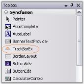

It can be created programmatically using the below code snippets.



private Syncfusion.Windows.Forms.Tools.TrackBarEx trackBarEx1;

this.trackBarEx1 = new Syncfusion.Windows.Forms.Tools.TrackBarEx();

this.Controls.Add(this.trackBarEx1);





Private trackBarEx1 As Syncfusion.Windows.Forms.Tools.TrackBarEx

Me.trackBarEx1 = New Syncfusion.Windows.Forms.Tools.TrackBarEx 

Me.Controls.Add(Me.trackBarEx1)



Various Features and Customization options are discussed in the following topics.

#### Button, Slider and Channel Settings 

The properties which controls the size of various components of the TrackBarEx are as follows.

_Table_ _786_: Property Table

<table>
<tr>
<td>
Property</td><td>
Description</td></tr>
<tr>
<td>
IncreaseButtonSize</td><td>
Specifies the size of Increase button. Default value is (18, 18)</td></tr>
<tr>
<td>
DecreaseButtonSize</td><td>
Specifies the size of Decrease button. Default value is (18, 18)</td></tr>
<tr>
<td>
SliderSize</td><td>
Specifies the size of the slider. Default value is (11, 14).</td></tr>
<tr>
<td>
ChannelHeight</td><td>
Specifies the height of the channel. Default value is 4.</td></tr>
</table>
Button Appearance

The below properties will let you control the appearance of the Increase, Decrease and slider buttons.

_Table_ _787_: Property Table

<table>
<tr>
<td>
Property</td><td>
Description</td></tr>
<tr>
<td>
ShowButton</td><td>
Specifies whether to show the Increase and Decrease buttons.</td></tr>
<tr>
<td>
ButtonColor</td><td>
Sets the color for the buttons and the slider.</td></tr>
<tr>
<td>
HighlightedButtonColor</td><td>
Sets the color for the buttons and the slider, when they are highlighted.</td></tr>
<tr>
<td>
PushedButtonEndColor</td><td>
Sets the color of the buttons and the slider, when they are pushed.</td></tr>
</table>



this.trackBarEx1.ShowButtons = true;

this.trackBarEx1.ButtonColor = System.Drawing.Color.DodgerBlue;

this.trackBarEx1.HighlightedButtonColor = System.Drawing.Color.AliceBlue;

this.trackBarEx1.PushedButtonEndColor = System.Drawing.Color.OrangeRed;





Me.trackBarEx1.ShowButtons = True 

Me.trackBarEx1.ButtonColor = System.Drawing.Color.DodgerBlue 

Me.trackBarEx1.HighlightedButtonColor = System.Drawing.Color.AliceBlue

Me.trackBarEx1.PushedButtonEndColor = System.Drawing.Color.OrangeRed



#### TrackBar Appearance

FocusRectangle

A focus rectangle for the TrackBarEx control can be shown or hidden using ShowFocusRect property.

Gradient Start and End Color

By default, the TrackBarEx control has a gradient appearance. The start color and end color for this gradient appearance can be specified using TrackBarGradientStart and TrackBarGradientEnd properties.



this.trackBarEx1.TrackBarGradientEnd = System.Drawing.Color.CadetBlue;

this.trackBarEx1.TrackBarGradientStart = System.Drawing.Color.MintCream;





Me.trackBarEx1.TrackBarGradientEnd = System.Drawing.Color.CadetBlue

Me.trackBarEx1.TrackBarGradientStart = System.Drawing.Color.MintCream



The control can be given a transparent background by enabling the Transparent property.



this.trackBarEx1.Transparent = true;





Me.trackBarEx1.Transparent = True



TrackBarEx Orientation

This control has options for vertical and horizontal orientation.



//To set the control to be vertically oriented

this.trackBarEx1.Orientation = Orientation.Vertical;

//To set the control to be horizontally oriented

this.trackBarEx1.Orientation = Orientation.Horizontal;  





'To set the control to be vertically oriented

Me.trackBarEx1.Orientation = Orientation.Vertical

'To set the control to be horizontally oriented

Me.trackBarEx1.Orientation = Orientation.Horizontal



#### TrackBar Value

The TrackBarEx control slides between the minimum and maximum values, which are specified in Minimum and Maximum properties. The properties with description are listed in the below table.

_Table_ _788_: Property Table

<table>
<tr>
<td>
Property</td><td>
Description</td></tr>
<tr>
<td>
Minimum</td><td>
Specifies the minimum value of the trackbar. Default is 10.</td></tr>
<tr>
<td>
Maximum</td><td>
Specifies the maximum value of the trackbar. Default is 20.</td></tr>
<tr>
<td>
Value</td><td>
Specifies the value of the trackbar position. i.e, slider position. Default is 5.</td></tr>
<tr>
<td>
SmallChange</td><td>
Specifies the small change of Trackbar value. Default is 1. </td></tr>
<tr>
<td>
LargeChange</td><td>
Specifies the large change of Trackbar value. Default is 5.</td></tr>
<tr>
<td>
TimeInterval</td><td>
Specifies the interval for the timer. Default is 100.</td></tr>
</table>



this.trackBarEx1.Minimum = 10;

this.trackBarEx1.Maximum = 25;

this.trackBarEx1.Value = 5;

this.trackBarEx1.SmallChange = 5;

this.trackBarEx1.LargeChange = 15;

this.trackBarEx1.TimerInterval = 50;





Me.trackBarEx1.Minimum = 10

Me.trackBarEx1.Maximum = 30

Me.trackBarEx1.Value = 5

Me.trackBarEx1.SmallChange = 5

Me.trackBarEx1.LargeChange = 15

Me.trackBarEx1.TimerInterval = 50



Following are the methods for the TrackBarEx control which gives the respective results based on SmallChange and LargeChange properties.

_Table_ _789_: Property Table

<table>
<tr>
<td>
Methods</td><td>
Description</td></tr>
<tr>
<td>
LargeIncrease</td><td>
Increases the value by large change specified in LargeChange property.</td></tr>
<tr>
<td>
LargeDecrease</td><td>
Decreases the value by large change specified in LargeChange property.</td></tr>
<tr>
<td>
SmallDecrease</td><td>
Decreases the value by small change specified in SmallChange property.</td></tr>
<tr>
<td>
SmallIncrease</td><td>
Increases the value by small change specified in SmallChange property.</td></tr>
</table>

#### TrackBarEx Event

Scroll event of the TrackBarEx will be handled whenever the user moves the slider.



private void trackBarEx1_Scroll(object sender, EventArgs e)

{

    this.trackBarEx1.ButtonColor = System.Drawing.Color.OrangeRed;

}





Private Sub trackBarEx1_Scroll(ByVal sender As Object, ByVal e As EventArgs)

    Me.trackBarEx1.ButtonColor = System.Drawing.Color.OrangeRed

End Sub



#### Frequently Asked Questions

##### How to customize the appearance of TrackBarEx?

The TrackBarEx control appearance can be customized as like in Win 8 application. You can achieve this using the following code example.



            this.trackBarEx1.Style = Syncfusion.Windows.Forms.Tools.TrackBarEx.Theme.Metro;            

            this. trackBarEx1.ChannelHeight = 8;

            this. trackBarEx1.SliderSize = new Size(12, 12);    





            Me.TrackBarEx1.Style = TrackBarEx.Theme.Metro           

            Me.TrackBarEx1.ChannelHeight = 8

            Me.TrackBarEx1.SliderSize = New Size(12, 12)    



### SuperToolTip

In Office 2007, Microsoft has introduced a SuperToolTip control to display the tooltip. Essential Tools has also come up with a new control known as the SuperToolTip which, enables the user to give tooltip information.

* Header - The Header is used to display text which is used as a header for the tooltip.
* Body - This is the description part. 
* Footer - If additional information is needed, it can be entered in the footer part.

Creating SuperToolTip Through Designer

1. Drag and drop the SuperToolTip on your form.
2. When the SuperToolTip component is added to a form, an extended property will be added to the properties of every item in the toolstrip or tabitem in the RibbonControlAdv.

   

    > Note: You can also get or set a tooltip programmatically. It is discussed here.

3. Clicking the … ellipse button will show the ToolTip Editor Dialog Box. This editor lets you customize the ToolTip items.

Through Code



using Syncfusion.Windows.Forms.Tools;

private SuperToolTip superToolTip1;

this.superToolTip1 = new Syncfusion.Windows.Forms.Tools.SuperToolTip(this);

//Adding ToolTip Header Item

Syncfusion.Windows.Forms.Tools.ToolTipInfo toolTipInfo1 = new Syncfusion.Windows.Forms.Tools.ToolTipInfo();

toolTipInfo1.Header.Text = "Cut";

toolTipInfo1.Header.TextAlign = System.Drawing.ContentAlignment.TopCenter;

//Associating SuperToolTip for ToolStripTabItem

this.superToolTip1.SetToolTip(this.toolStripTabItem1, toolTipInfo1);





Imports Syncfusion.Windows.Forms.Tools

Private superToolTip1 As SuperToolTip

Me.superToolTip1 = New Syncfusion.Windows.Forms.Tools.SuperToolTip(Me) 

'Adding ToolTip Header Item

Dim toolTipInfo1 As New Syncfusion.Windows.Forms.Tools.ToolTipInfo()

toolTipInfo1.Header.Text = "Cut" 

toolTipInfo1.Header.TextAlign = System.Drawing.ContentAlignment.TopCenter

//Associating SuperToolTip for ToolStripTabItem

Me.superToolTip1.SetToolTip(this.toolStripTabItem1, toolTipInfo1



#### Appearance Settings 

The appearance of the Super ToolTip can be customized using the below properties. This properties can be edited during design time using ToolTip Editor.

_Table_ _790_: Property Table

<table>
<tr>
<td>
Property</td><td>
Description</td></tr>
<tr>
<td>
BackColor</td><td>
Sets the background gradient color.</td></tr>
<tr>
<td>
BorderColor</td><td>
Sets the border color for the control.</td></tr>
<tr>
<td>
ForeColor</td><td>
Sets the fore color for the control.</td></tr>
<tr>
<td>
Separator</td><td>
Shows or hides a separator between the Body and the Footer tooltip items.</td></tr>
</table>



toolTipInfo2.BackColor = System.Drawing.SystemColors.LightBlue;

toolTipInfo1.BorderColor = System.Drawing.Color.CadetBlue;

toolTipInfo1.ForeColor = System.Drawing.SystemColors.ControlText;

toolTipInfo2.Separator = true;





toolTipInfo2.BackColor = System.Drawing.SystemColors.LightBlue

toolTipInfo1.BorderColor = System.Drawing.Color.CadetBlue

toolTipInfo1.ForeColor = System.Drawing.SystemColors.ControlText

toolTipInfo2.Separator = True



Behavior Settings

The following properties control the behavior of the SuperToolTip control.

_Table_ _791_: Property Table

<table>
<tr>
<td>
Property</td><td>
Description</td></tr>
<tr>
<td>
InitialDelay</td><td>
Indicates the time (ms) before the tooltip is displayed.</td></tr>
<tr>
<td>
MaxWidth</td><td>
Sets the maximum width for the tooltip to be displayed. When the text of the tooltip exceeds the maxwidth, the text wraps to the next line.</td></tr>
<tr>
<td>
ToolTipDuration</td><td>
Indicates the duration of the ToolTip (in sec) when the mouse hovers over a control.</td></tr>
<tr>
<td>
UseFading</td><td>
Specifies the fading effect for the SuperToolTip. The options are System and Blend.</td></tr>
<tr>
<td>
RightToLeft</td><td>
When set to true, displays the tooltip in RightToLeft fashion. Default value is false.</td></tr>
<tr>
<td>
ShowToolTip</td><td>
Gets/Sets whether the ToolTip should be visible or not. Default value is true.DelayToolTip property should be disabled before disabling the ShowToolTip property</td></tr>
</table>



this.superToolTip1.InitialDelay = 750;

this.superToolTip1.MaxWidth = 500;

this.superToolTip1.ToolTipDuration = 3;

this.superToolTip1.UseFading = Syncfusion.Windows.Forms.Tools.SuperToolTip.FadingType.System;

this.superToolTip1.RightToLeft = RightToLeft.Yes;

this.treeViewAdv1.ShowToolTip = true;





Me.superToolTip1.InitialDelay = 750

Me.superToolTip1.MaxWidth = 500

Me.superToolTip1.ToolTipDuration = 3

Me.superToolTip1.UseFading = Syncfusion.Windows.Forms.Tools.SuperToolTip.FadingType.System

this.superToolTip1.RightToLeft = RightToLeft.Yes

Me.treeViewAdv1.ShowToolTip = True



Balloon Style Appearance in SuperToolTip

Style property is added to set Balloon style for SuperTooltip.  SuperToolTipStyle enumeration contains Balloon and Normal value. 

Set Style property to Balloon to change the SuperToolTip appearance as balloon.

The following code illustrates how to set SuperToolTipStyle.



this.superToolTip1.Style = Syncfusion.Windows.Forms.Tools.SuperToolTip.SuperToolTipStyle.Balloon;





Me.superToolTip1.Style = Syncfusion.Windows.Forms.Tools.SuperToolTip.SuperToolTipStyle.Balloon



#### ToolTip Items Customization

This section discusses the customization properties for the ToolTipItems.

> Note: All these properties are applicable to all the three ToolTipItems.

Image Settings

_Table_ _792_: Property Table

<table>
<tr>
<td>
Property</td><td>
Description</td></tr>
<tr>
<td>
Image</td><td>
Sets the image to be shown on the Tooltip.</td></tr>
<tr>
<td>
ImageAlign</td><td>
Indicates the alignment of the image.</td></tr>
<tr>
<td>
ImageScalingSize</td><td>
Sets the size of the image.</td></tr>
<tr>
<td>
ImageTransparentColor</td><td>
Sets the transparent color for the image.</td></tr>
</table>

Images can be associated with the header, body and footer of the super tooltip using this property.



toolTipInfo1.Footer.Image = ((System.Drawing.Image)(resources.GetObject("resource.Image")));

toolTipInfo1.Footer.ImageAlign = System.Drawing.ContentAlignment.MiddleCenter;

toolTipInfo1.Footer.ImageScalingSize = new System.Drawing.Size(16, 16);





toolTipInfo1.Footer.Image = DirectCast((resources.GetObject("resource.Image")), System.Drawing.Image) 

toolTipInfo1.Footer.ImageAlign = System.Drawing.ContentAlignment.MiddleCenter 

toolTipInfo1.Footer.ImageScalingSize = New System.Drawing.Size(16, 16)



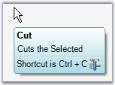

Foreground Settings

_Table_ _793_: Property Table

<table>
<tr>
<td>
Property</td><td>
Description</td></tr>
<tr>
<td>
Font</td><td>
Sets the FontStyle for the item's text.</td></tr>
<tr>
<td>
ForeColor</td><td>
Sets the ForeColor for the item's text.</td></tr>
</table>



toolTipInfo1.Header.Font = new System.Drawing.Font("Microsoft Sans Serif", 8.25F, System.Drawing.FontStyle.Bold);

toolTipInfo1.Header.ForeColor = System.Drawing.Color.Black;





toolTipInfo1.Header.Font = New System.Drawing.Font("Microsoft Sans Serif", 8.25F, System.Drawing.FontStyle.Bold) 

toolTipInfo1.Header.ForeColor = System.Drawing.Color.Black 



Appearance and Text Settings

_Table_ _794_: Property Table

<table>
<tr>
<td>
Property</td><td>
Description</td></tr>
<tr>
<td>
Hidden</td><td>
Shows or hides a tooltip item. Default is false.</td></tr>
<tr>
<td>
Text</td><td>
Sets the text to be displayed in the ToolTip Item. Its supports multiline text also.</td></tr>
<tr>
<td>
TextAlign</td><td>
Indicates the alignment of the tooltip text.</td></tr>
<tr>
<td>
TextImageRelation</td><td>
Sets the location of the text in relation to the image. The options are,ImageBeforeText and TextBeforeImage.</td></tr>
<tr>
<td>
TextMargin</td><td>
Sets the text margin for the Tooltip item.</td></tr>
</table>



toolTipInfo1.Header.Hidden = true;

toolTipInfo1.Header.Text = "Cut";

toolTipInfo1.Header.TextAlign = System.Drawing.ContentAlignment.MiddleLeft;

toolTipInfo1.Header.TextImageRelation = Syncfusion.Windows.Forms.Tools.ToolTipTextImageRelation.ImageBeforeText;

toolTipInfo1.Header.TextMargin = new System.Windows.Forms.Padding(1, 1, 1, 1);





toolTipInfo1.Header.Hidden = True

toolTipInfo1.Header.Text = "Cut" 

toolTipInfo1.Header.TextAlign = System.Drawing.ContentAlignment.MiddleLeft 

toolTipInfo1.Header.TextImageRelation = Syncfusion.Windows.Forms.Tools.ToolTipTextImageRelation.ImageBeforeText 

toolTipInfo1.Header.TextMargin = New System.Windows.Forms.Padding(1, 1, 1, 1)



> Note: A SuperToolTip (Body, Header and Footer) can be hidden by calling the SuperToolTip.Hide() method.

Adding  RenderHtml and Size Property to the SuperToolTip.

Text given in the Text property will be considered as HTML strings and displayed as HTML, when the RenderHtml property is set to true.

Size property sets the size of header, body and footer Item. Size property will be enabled when the RenderHtml is set to true.

CSS properties and all the text formatting HTML tags are supported.

The following code illustrates setting RenderHtml, Text, Size properties.



toolTipInfo2.Footer.Size = new System.Drawing.Size(200, 50);

 toolTipInfo2.Footer.RenderHtml = true;

 toolTipInfo2.Footer.Text = "&lt;ul&gt;<li>List Item</li>&lt;/ul&gt;";





Me. toolTipInfo2.Footer.Size= New System.Drawing.Size(200,50)

Me.toolTipInfo2.Footer.RenderHtml = true

Me.toolTipInfo2.Footer.Text = "&lt;ul&gt;<li>List Item</li>&lt;/ul&gt;"



#### SuperToolTip Events

Below are the events for the SuperToolTip control.

Popup ToolTip

PopupToolTip event of the SuperToolTip control can be handled to set the tooltip at any desired position.

Here, the parameter "rc" will pass the (x, y) coordinates for each single object that has been specified through the parameter "component".

_Table_ _795_: Property Table

<table>
<tr>
<td>
Member</td><td>
Description</td></tr>
<tr>
<td>
Rectangle</td><td>
Stores a set of four integers that represents the location and size of a rectangle.</td></tr>
</table>



private void superToolTip1_PopupToolTip(Component component, ref Rectangle rc) 

{ 

   if (component == this.buttonAdv1 ) 

   { 

       rc.X = 10; 

       rc.Y = 20; 

   } 

   if (component == this.gradientLabel1) 

   { 

       rc.X = 100; 

       rc.Y = 200; 

   } 

} 





Private Sub superToolTip1_PopupToolTip(ByVal component As Component, ByRef rc As Rectangle)  

    If component = Me.buttonAdv1 Then  

       rc.X = 10  

       rc.Y = 20  

    End If  

    If component = Me.gradientLabel1 Then  

       rc.X = 100  

       rc.Y = 200  

    End If  

End Sub 



> Note: You can also use show method to display a SuperToolTip at a specified location.

UpdateToolTip

UpdateToolTip event of the SuperToolTip control can be handled, to update the tooltip text.



private void superToolTip1_UpdateToolTip(Component component, ref ToolTipInfo info)

{

    if (component == this.boldToolStripBtn)

        info.Body.Text = "This is a updated Super ToolTip";

}





Private Sub superToolTip1_UpdateToolTip(ByVal component As Component, ByRef info As ToolTipInfo)

    If component = Me.boldToolStripBtn Then

        info.Body.Text = "This is a updated Super ToolTip"

    End If

End Sub



> Note: You also set tooltip using SetToolTip Method.

#### Supporting SuperTooltip for .NET Controls Embedded in MFC Containers

SupperTooltip can be displayed in the User Control embedded in the MFC Dialog.

> Note: Support has been given in source level.

### Super Accelerator

SuperAccelerator is a component that is used to accelerate the click event of items by using a Single key stroke without mouse hovering on it.

1. Drag-and-drop the SuperAccelerator on your form.

   

2. When the SuperAccelerator component is added to a form, an extended property will be added to the properties of every item in the toolstrip or tabitem in the RibbonControlAdv.

   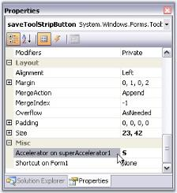

3. In the appropriate item, use the Accelerator on SuperAccelerator property to set the string value.

   

4. To accelerate the item's click event at run time, Press the ALT key. All the specified accelerator strings will be displayed below the items. 
5. Press the string in the keyboard and the corresponding item's click event will be triggered. (Eg. If the accelerator string of Cut is X key, Press ALT key. Once all the accelerator strings are displayed, press X key the Cut item event will be triggered.)

> Note: We can make the Accelerator feature to be active or inactive using SuperAccelerator.Active property.

See Also

How to get or set an accelerator key programmatically?

#### Super Accelerator Appearance

This section discusses the appearance settings of a Super Accelerator.

_Table_ _796_: Property Table

<table>
<tr>
<td>
Property</td><td>
Description</td></tr>
<tr>
<td>
BackColor</td><td>
Gets / sets the backcolor for the accelerator key.</td></tr>
<tr>
<td>
Font</td><td>
Sets the Font Style for the accelerator key.</td></tr>
<tr>
<td>
ForeColor</td><td>
Sets the ForeColor for the accelerator key.</td></tr>
</table>



this.superAccelerator.BackColor = System.Drawing.SystemColors.AliceBlue;

this.superAccelerator.Font = new System.Drawing.Font("Arial", 8F, System.Drawing.FontStyle.Regular)

this.superAccelerator.ForeColor = System.Drawing.Color.Maroon;





Me.superAccelerator.BackColor = System.Drawing.SystemColors.AliceBlue

Me.superAccelerator.Font = New System.Drawing.Font("Arial", 8F, System.Drawing.FontStyle.Bold)

Me.superAccelerator.ForeColor = System.Drawing.Color.Maroon



#### Style

MiniToolBar supports visual styles such as Default, Metro. The style can be set using Style property. 

* Default
* Metro

The following code example allows you to set the style for the MiniToolBar.



this.miniToolBar1.Style = Syncfusion.Windows.Forms.Tools.ToolStripExStyle.Metro;





Me.miniToolBar1.Style = Syncfusion.Windows.Forms.Tools.ToolStripExStyle.Metro



### MessageBoxAdv

#### Overview

Syncfusion MessageBoxAdv supports an application-defined message and title, plus any combination of predefined icons and buttons.

#### Style

MessageBoxAdv supports styles such as Default and Metro.

##### Default

Office2007 Style Message Box is available in Tools Windows. You can replace the .NET MessageBox with new MessageBoxAdv that supports standard color schemes and custom color schemes in Office 2007 style, for consistent look and feel. Custom Icons support is also included in MessageBoxAdv. To display the Message Box, call MessageBoxAdv.Show method.



MessageBoxAdv.Office2007Theme = Office2007Theme.Managed;

Office2007Colors.ApplyManagedColors(this, Color.Red);

MessageBoxAdv.Show(" Office 2007 Style with Black Color Scheme  ", "MessageBox Adv", MessageBoxButtons.OK);





MessageBoxAdv.Office2007Theme = Office2007Theme.Managed

Office2007Colors.ApplyManagedColors(Me, Color.Red)

MessageBoxAdv.Show(" Office 2007 Style with Black Color Scheme  ", "MessageBox Adv", MessageBoxButtons.OK)



##### Metro

In MessageBoxAdv, MetroColorTable is implemented for color customization of buttons and caption of metro form. You can achieve this by using the following code example.



                MessageBoxAdv.MessageBoxStyle = MessageBoxAdv.Style.Metro;

                MessageBoxAdv.MetroColorTable.NoButtonBackColor = Color.FromArgb(22, 165, 220);

                MessageBoxAdv.MetroColorTable.YesButtonBackColor = Color.FromArgb(22, 165, 220);

                MessageBoxAdv.MetroColorTable.CancelButtonBackColor = Color.FromArgb(22, 165, 220);

                MessageBoxAdv.MetroColorTable.BackColor = Color.White;

                MessageBoxAdv.MetroColorTable.BorderColor = Color.FromArgb(22, 165, 220);

                MessageBoxAdv.MetroColorTable.CaptionBarColor = Color.FromArgb(22, 165, 220);

                MessageBoxAdv.MetroColorTable.CaptionForeColor = Color.Black;

                MessageBoxAdv.MetroColorTable.ForeColor = Color.Black;





                MessageBoxAdv.MessageBoxStyle = MessageBoxAdv.Style.Metro

                MessageBoxAdv.MetroColorTable.NoButtonBackColor = Color.FromArgb(22, 165, 220)

                MessageBoxAdv.MetroColorTable.YesButtonBackColor = Color.FromArgb(22, 165, 220

                MessageBoxAdv.MetroColorTable.CancelButtonBackColor = Color.FromArgb(22, 165, 220)

                MessageBoxAdv.MetroColorTable.BackColor = Color.White

                MessageBoxAdv.MetroColorTable.BorderColor = Color.FromArgb(22, 165, 220)

                MessageBoxAdv.MetroColorTable.CaptionBarColor = Color.FromArgb(22, 165, 220)

                MessageBoxAdv.MetroColorTable.CaptionForeColor = Color.Black

                MessageBoxAdv.MetroColorTable.ForeColor = Color.Black 

                MessageBoxAdv.MetroColorTable.OKButtonBackColor = Color.Red



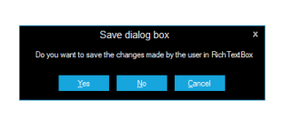

_Figure_ _1322_: MessageBoxAdv with Metro style

### Office 2010 Style Ribbon

This feature provides Office 2010 like theme for your ribbon. You can give Office 2010 like look and feel for your application. Essential Tools supports the three themes found in Office 2010. They are: 

* Blue
* Black 
* Silver

Essential Tools also enables you to create a BackStageView. You can open the BackStageView by clicking the File tab. This enables you to use the features that fall outside the Ribbon. Ribbon enables you to work in the document and Backstage enables you to work with the document. Using this you can alter contents and provide end-user options that are related to specific solution requirements.

> Note: Backstageview can be accessed only when Ribbon style is set to Office 2010.

You can apply Office 2010 Style Ribbon and create BackStageView in two methods. They are:

* Through Designer
* Programmatically

#### Through Designer

Apply Theme for Ribbon

The following are steps to apply Office 2010 style for the Ribbon:

1. Create a Windows Form application in Visual Studio. 
2. Drag and drop the RibbonControlAdv from the Toolbox.

   

3. In the Property grid, set RibbonStyle to Office2010.

   

4. Office 2010 Ribbon will be applied for Ribbon.

   

Creating BackStageView

The following are steps to create a BackStageView:

1. Drag and drop the BackStageView from the Toolbox.

   

2. In the Property grid, click the ShowBackstage.

   

3. Empty BackStage will be displayed.

   

4. To add a BackStageButton, click the Add BackStage Button.

   

5. To add BackStageTab, click the Add BackStage Tab.

  

6. Set BackStageView to RibbonControlAdv.

   

7. Back Stage will be created with a BackStage Button and a BackStage Tab

   

#### Programmatically 

Apply Theme for Ribbon

The following code illustrates how to apply the Office2010 theme to the ribbon:



            this.ribbonControlAdv1.RibbonStyle = Syncfusion.Windows.Forms.Tools.RibbonStyle.Office2010;





Me.ribbonControlAdv1.RibbonStyle = Syncfusion.Windows.Forms.Tools.RibbonStyle.Office2010



Creating BackStageView

The following code illustrates how to create a backstage with a BackStageButtom and a BackStageTab:



                using Syncfusion.Windows.Forms;

                BackStageView backStageView1 = new BackStageView(this.components);

                BackStage backStage1 = new BackStage();

                BackStageTab backStageTab1 = new BackStageTab();

                BackStageButton backStageButton1 = new BackStageButton();

// backStageView1

                backStageView1.BackStage = backStage1;

                backStageView1.HostControl = null;

                backStageView1.HostForm = this;

// backStage1

                backStage1.Controls.Add(backStageTab1);

                backStage1.Controls.Add(backStageButton1);

                backStage1.Dock = System.Windows.Forms.DockStyle.Fill;

// backStageTab1

                backStageTab1.Text = "backStageTab1";

// backStageButton1

                backStageButton1.Text = "backStageButton1";

                // ribbonControlAdv1

ribbonControlAdv1.BackStageView = backStageView1;

	            //Add BackStage to RibbonControlAdv 

ribbonControlAdv1.BackStageView =backStageView1;

//Add BackStage and RibbonControlAdv to form

this.Controls.Add(backStage1);

	            this.Controls.Add(this.ribbonControlAdv1);        





                    Imports Syncfusion.Windows.Forms

Dim backStageView1 As New BackStageView(Me.components)

Dim backStage1 As New BackStage()

Dim backStageTab1 As New BackStageTab()

Dim backStageButton1 As New BackStageButton()

' backStageView1

backStageView1.BackStage = backStage1

backStageView1.HostControl = Nothing

backStageView1.HostForm = Me

' backStage1

backStage1.Controls.Add(backStageTab1)

backStage1.Controls.Add(backStageButton1)

backStage1.Dock = System.Windows.Forms.DockStyle.Fill

' backStageTab1

backStageTab1.Text = "backStageTab1"

' backStageButton1

backStageButton1.Text = "backStageButton1"

' ribbonControlAdv1

ribbonControlAdv1.BackStageView = backStageView1

				'Add BackStage to RibbonControlAdv 

ribbonControlAdv1.BackStageView =backStageView1

'Add BackStage and RibbonControlAdv to form

Me.Controls.Add(backStage1)

Me.Controls.Add(Me.ribbonControlAdv1)



Refer to:

Appearance Setting

## Frequently Asked Questions

This section illustrates the solutions for various task-based queries about the control.

### Quick Access Toolbar

The following topics are discussed in this section:

#### How to add a component in the QuickAccessMenu programmatically?

By calling the SetUseInQuickAccessMenu method, with the component passed as a parameter, we can include a component in the QuickAccessToolbar.



this.ribbonControlAdv1.SetUseInQuickAccessMenu(this.toolStripDropDownButton1, true);





Me.ribbonControlAdv1.SetUseInQuickAccessMenu(Me.toolStripDropDownButton1, True)



> Note: You can also identify whether a particular item is added to the Quick Access Toolbar or not, using the GetUseInQuickAccessMenu method, by passing the item as the parameter.

#### How to remove items from the Quick Access Toolbar programmatically?

Call RibbonControlAdv.Header.QuickItem.RemoveAt method for this purpose. The parameter idx is a zero based index of the item, to remove.



this.ribbonControlAdv1.Header.QuickItems.RemoveAt(1);





Me.ribbonControlAdv1.Header.QuickItems.RemoveAt(1)



#### How to get or set the description on RibbonControlAdv?

The GetDescription or SetDescription methods of the RibbonControlAdv can be used to gets / sets the text that is displayed with the component in the quick panel customizing dialog. 



//Gets the description

this.ribbonControlAdv1.GetDescription(this.toolStripTabItem1);

//Sets the description

this.ribbonControlAdv1.SetDescription(this.toolStripTabItem1, "This is a drop down button");





'Gets the description

this.ribbonControlAdv1.GetDescription(this.toolStripTabItem1);

'Sets the description

Me.ribbonControlAdv1.SetDescription(Me.toolStripTabItem1, "This is a drop down button")



#### How to show a Customize Quick Access Toolbar Dialog programmatically at run time?

The dialog can be shown programmatically by calling ShowCustomizeDialog() method.



this.ribbonControlAdv1.ShowCustomizeDialog();





Me.ribbonControlAdv1.ShowCustomizeDialog()



### SuperToolTip

The following topics are discussed in this section:

#### How to display a SuperToolTip at a specified location?

The Show method can be used if the ToolTip is to be displayed at a specified location and for a particular time.



Syncfusion.Windows.Forms.Tools.SuperToolTip s1;

Syncfusion.Windows.Forms.Tools.ToolTipInfo t1;

s1 = new Syncfusion.Windows.Forms.Tools.SuperToolTip();

t1 = new Syncfusion.Windows.Forms.Tools.ToolTipInfo();

t1.BackColor = System.Drawing.Color.Cyan;

t1.ForeColor = System.Drawing.Color.Chocolate;

t1.Body.Text = "Sample text for the SuperToolTip Body.";

System.Drawing.Point pt1 = new System.Drawing.Point(this.button1.Location.X + 20, this.button1.Location.Y + 30);

this.s1.Show(t1, this.PointToScreen(pt1), 500);





Dim s1 As Syncfusion.Windows.Forms.Tools.SuperToolTip

Dim t1 As Syncfusion.Windows.Forms.Tools.ToolTipInfo

s1 = New Syncfusion.Windows.Forms.Tools.SuperToolTip 

t1 = New Syncfusion.Windows.Forms.Tools.ToolTipInfo 

t1.BackColor = System.Drawing.Color.Cyan 

t1.ForeColor = System.Drawing.Color.Chocolate 

t1.Body.Text = "Sample text for the SuperToolTip Body." 

Dim pt1 As System.Drawing.Point = New System.Drawing.Point(Me.button1.Location.X + 20, Me.button1.Location.Y + 30)

Me.s1.Show(t1, Me.PointToScreen(pt1), 500)



> Note: A SuperToolTip can be hidden by calling the SuperToolTip.Hide() method.

See Also

PopupToolTip Event

#### How to get or set a SuperToolTip programmatically?

We can get or set the SuperToolTip programmatically using the below two methods.

_Table_ _797_: Method Table

<table>
<tr>
<td>
SuperToolTip Method</td><td>
Description</td></tr>
<tr>
<td>
GetToolTip</td><td>
Gets the ToolTipInfo for any control. If the ToolTip properties change dynamically in an application, you can use this method to find out what information is exhibited at any point, depending upon the state of the application. </td></tr>
<tr>
<td>
SetToolTip</td><td>
Sets the ToolTipInfo for any control.</td></tr>
</table>



private void buttonAdv1_Click(object sender, EventArgs e) 

{ 

    // Gets the text set for the Body of TextBox tooltip. 

    MessageBox.Show (this.superToolTip1.GetToolTip(this.textBox1).Body.Text.ToString ()); 

}  

// To add a ToolTip through code. 

this.superToolTip1.SetToolTip(this.textBox1, "ToolTipText"); 





Private Sub buttonAdv1_Click(ByVal sender As Object, ByVal e As EventArgs) 

  ' Gets the text set for the Body of TextBox tooltip. 

MessageBox.Show(Me.superToolTip1.GetToolTip(Me.textBox1).Body.Text.ToString) 

End Sub  

' To add a ToolTip through code. 

Me.superToolTip1.SetToolTip(Me.textBox1, "ToolTipText")



> Note: You can also set tooltip using_ UpdateToolTip Event_.

#### How to set SuperToolTip for MenuStrip, ToolStrip or ToolStripEx and RibbonTabControl?

Few Controls like MenuStrip, ToolStrip or ToolStripEx and RibbonTabControl already have the feature of showing Tooltip. 

To set the SuperToolTip for such controls, set their ShowItemToolTips property to false and then configure the SuperToolTip for those controls.

### Super Accelerator

The following topic is discussed in this section:

#### How to get or set an accelerator key programmatically?

To get or set the accelerator key, call GetAccelerator and SetAccelerator methods respectively. 



this.superAccelerator1.GetAccelerator(this.toolStripTabItem1);

this.superAccelerator1.SetAccelerator(this.toolStripTabItem1, "C");





Me.superAccelerator1.GetAccelerator(Me.toolStripTabItem1) 

Me.superAccelerator1.SetAccelerator(Me.toolStripTabItem1, "C") 



> Note: GetMenuButtonAccelerator and SetMenuButtonAccelerator methods gets or sets the OfficeMenuButton accelerator key. See Menu_Button Settings _for details.

#### How to customize the look of SuperAccelerator as like in MS Office2013?

SuperAccelerator can now be customized as like in Office 2013. Appearance property in SuperAccelerator can be used to get the customized look. 

The appearance types of SuperAccelerator are as follows.

* Default
* Advanced

The following code example allows you to customize the SuperAccelerator.



this.superAccelerator1.Appearance = Syncfusion.Windows.Forms.Tools.Appearance.Advanced;





Me.superAccelerator1.Appearance = Syncfusion.Windows.Forms.Tools.Appearance.Advanced



#### How to set the SuperAccelerator Alignment?

You can set the accelerator position of the SuperAccelerator by using its Alignment property.

Alignment settings

You can align the position of SuperAccelerator according to your requirement by using its following properties.

<table>
<tr>
<td>
SuperAccelerator Property</td><td>
Description</td></tr>
<tr>
<td>
Alignment</td><td>
Determines the alignment of the SuperAccelerator. The options include are given below* Default* TopCenter* TopLeft* TopRight* MiddleLeft* MiddleCenter* MiddleRight* BottomLeft* BottomCenter* BottomRight</td></tr>
</table>

This support enables SuperAccelerator to be displayed based on your requirement.

Default

It allows to set the SuperAccelerator alignment on default position of the control.

Top Left

To display SuperAccelerator at the TopLeft position of Ribbon items.

Top Center

It enables to set the SuperAccelerator alignment on TopCenter of the control.

Top Right

It enables to set the SuperAccelerator alignment on TopRight of the control.

Middle Left

It enables to set the SuperAccelerator alignment on MiddleLeft of the control.

Middle Center

It enables to set the SuperAccelerator alignment on MiddleCenter of the control

Middle Right

It enables to set the SuperAccelerator alignment on MiddleRight of the control

Bottom Left

It enables to set the SuperAccelerator alignment on BottomLeft of the control

Bottom Center

It enables to set the SuperAccelerator alignment on BottomCenter of the control

Bottom Right 

It enables to set the SuperAccelerator alignment on BottomRight of the control

The following code example illustrates how to set the alignment property for SuperAccelerator.



//Set the default SuperAccelerator alignment

this.superAccelerator1.Alignment = Syncfusion.Windows.Forms.Tools.AcceleratorAlignment.Default;

//Set the SuperAccelerator alignment on Topleft of the control

this.superAccelerator1.Alignment = Syncfusion.Windows.Forms.Tools.AcceleratorAlignment.TopLeft;

//Set the SuperAccelerator alignment on TopCenter of the control

this.superAccelerator1.Alignment = Syncfusion.Windows.Forms.Tools.AcceleratorAlignment.TopCenter;

//Set the SuperAccelerator alignment on TopRight of the control

this.superAccelerator1.Alignment = Syncfusion.Windows.Forms.Tools.AcceleratorAlignment.TopRight;

//Set the SuperAccelerator alignment on MiddleLeft of the control

this.superAccelerator1.Alignment = Syncfusion.Windows.Forms.Tools.AcceleratorAlignment.MiddleLeft;

//Set the SuperAccelerator alignment on MiddleCenter of the control

this.superAccelerator1.Alignment = Syncfusion.Windows.Forms.Tools.AcceleratorAlignment.MiddleCenter;

//Set the SuperAccelerator alignment on MiddleRight of the control

this.superAccelerator1.Alignment = Syncfusion.Windows.Forms.Tools.AcceleratorAlignment.MiddleRight;

//Set the SuperAccelerator alignment on BottomLeft of the control

this.superAccelerator1.Alignment = Syncfusion.Windows.Forms.Tools.AcceleratorAlignment.BottomLeft;

//Set the SuperAccelerator alignment on BottomCenter of the control

this.superAccelerator1.Alignment = Syncfusion.Windows.Forms.Tools.AcceleratorAlignment.BottomCenter;

//Set the SuperAccelerator alignment on BottomRight of the control

this.superAccelerator1.Alignment = Syncfusion.Windows.Forms.Tools.AcceleratorAlignment.BottomRight;





'Set the default SuperAccelerator alignment

Me.superAccelerator1.Alignment = Syncfusion.Windows.Forms.Tools.AcceleratorAlignment.Default
'Set the SuperAccelerator alignment on Topleft of the control

Me.superAccelerator1.Alignment = Syncfusion.Windows.Forms.Tools.AcceleratorAlignment.TopLeft

'Set the SuperAccelerator alignment on TopCenter of the control
Me.superAccelerator1.Alignment = Syncfusion.Windows.Forms.Tools.AcceleratorAlignment.TopCenter

'Set the SuperAccelerator alignment on TopRight of the control
Me.superAccelerator1.Alignment = Syncfusion.Windows.Forms.Tools.AcceleratorAlignment.TopRight

'Set the SuperAccelerator alignment on MiddleLeft of the control

Me.superAccelerator1.Alignment = Syncfusion.Windows.Forms.Tools.AcceleratorAlignment.MiddleLeft

'Set the SuperAccelerator alignment on MiddleCenter of the control

Me.superAccelerator1.Alignment = Syncfusion.Windows.Forms.Tools.AcceleratorAlignment.MiddleCenter

'Set the SuperAccelerator alignment on MiddleRight of the control
Me.superAccelerator1.Alignment = Syncfusion.Windows.Forms.Tools.AcceleratorAlignment.MiddleRight

'Set the SuperAccelerator alignment on BottomLeft of the control
Me.superAccelerator1.Alignment = Syncfusion.Windows.Forms.Tools.AcceleratorAlignment.BottomLeft

'Set the SuperAccelerator alignment on BottomCenter of the control
Me.superAccelerator1.Alignment = Syncfusion.Windows.Forms.Tools.AcceleratorAlignment.BottomCenter

'Set the SuperAccelerator alignment on BottomRight of the control
Me.superAccelerator1.Alignment = Syncfusion.Windows.Forms.Tools.AcceleratorAlignment.BottomRight



### ToolStripEx

The following topic is discussed in this section:

#### How to assign task for ToolStrip item when it is clicked?

This can be done by handling the ItemClicked event and assigning value for ClickedItem property.



private void toolStripEx1_ItemClicked(object sender, ToolStripItemClickedEventArgs e)

{

    switch (e.ClickedItem.Text as string)

    {

        case "toolStripLabel1":

            e.ClickedItem.ForeColor = Color.Red;

            break;

        case "toolStripSplitButton1":

            e.ClickedItem.DisplayStyle = ToolStripItemDisplayStyle.ImageAndText;

            break;

    }

} 





Private Sub toolStripEx1_ItemClicked(ByVal sender As Object, ByVal e As ToolStripItemClickedEventArgs)

    Select Case CType(ConversionHelpers.AsWorkaround(e.ClickedItem.Text, GetType(String)), String)

        Case "toolStripLabel1"

            e.ClickedItem.ForeColor = Color.Red

            ' break 

        Case "toolStripSplitButton1"

            e.ClickedItem.DisplayStyle = ToolStripItemDisplayStyle.ImageAndText

            ' break 

    End Select

End Sub



### ToolStripTabItem

#### How to remove ToolStripTabItems from the RibbonControlAdv Programmatically?

Call RibbonControlAdv.Header.MainItem.RemoveAt method for this purpose. The parameter idx is a zero based index of the item to remove.



this.ribbonControlAdv1.Header.MainItems.RemoveAt(1);





Me.ribbonControlAdv1.Header.MainItems.RemoveAt(1)



### Ribbon Panel

#### How to prevent the RibbonPanel of the RibbonControlAdv from collapsing?

To prevent the RibbonPanels from collapsing, set the AllowCollapse property to false.



this.ribbonControlAdv1.AllowCollapse = false;





Me.ribbonControlAdv1.AllowCollapse = False



#### Is the RibbonControlAdv DPI aware?

Yes, the RibbonControlAdv is DPI-aware. The controls within the RibbonControlAdv will be scaled based on the selected DPI resolution by default.

The following images illustrate the scaling in RibbonControlAdv for 100 and 150 DPI.

### BackStage View

#### How to set Menu button image in BackStageView?

You can change the BackStage menu button by using the BackStageViewNavigationButtonImage property in BackStageView.

_Table_ _798_: Property Table

<table>
<tr>
<td>
 Property</td><td>
Description</td></tr>
<tr>
<td>
BackStageViewNavigationButtonImage</td><td>
Gets or sets the Menu button image for BackStageView.</td></tr>
</table>



//Gets or sets the Menu button image for BackStageView.

this.backStageView1.BackStageViewNavigationButtonImage = global::BackStageCustomization.Properties.Resources.images;





'Gets or sets the Menu button image for BackStageView.

Me.backStageView1.BackStageViewNavigationButtonImage = BackStageCustomization.Properties.Resources.images



The following screenshot displays the customized menu button in BackStageView.

> Note : BackStageViewNavigationButtonImage property is only applicable when Ribbon Style is set as Office2013 and TouchStyle.

### MessageBoxAdv

#### How to apply the shadow effects for MessageBoxAdv?

In MessageBoxAdv, you can enable/disable the shadow effect by using the DropShadow property. Refer to the following code examples.



     //To set the shadow effect of the MessageBoxAdv

     MessageBoxAdv.DropShadow = true;





     'To set the shadow effect of the MessageBoxAdv

     MessageBoxAdv.DropShadow = True



> Note: The default value of the DropShadow property is false. So, it is needed to enable the property to achieve the shadow effect.

