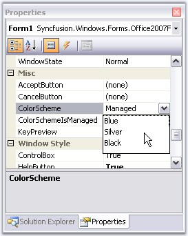
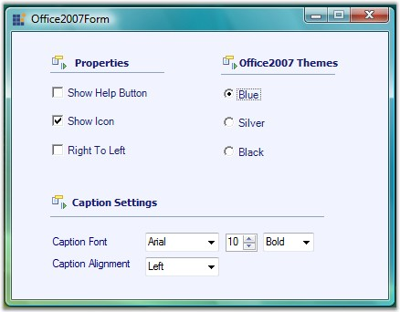

# Color Schemes

Office2007 Form supports all the three office color schemes which can be edited through ColorSchemes property.

_Figure 1143: ColorScheme Property for Office2007Form_



//To set Blue color scheme
this.ColorScheme = Office2007Theme.Blue;



 

 
'To set Blue color scheme
Me.ColorScheme = Office2007Theme.Blue
 


_Figure 1144: Blue, Silver and Black ColorSchemes in OfficeForm_

## Background Color for Office2007 Form

The background of the Office2007 form can be same, as the color scheme applied to the form. Set UseOffice2007SchemeBackColor property to true to make this effective.



this.UseOffice2007SchemeBackColor = true;


 

 
Me.UseOffice2007SchemeBackColor = True



_Figure 1145: Office 2007 Scheme BackColor for Office2007Form_

## Vista Aero Theme

Vista Aero theme support is available for Office Form when used in Vista machine.

_Figure 1146: Vista Aero Theme for OfficeForm_

## Office2007Form Color Scheme Settings

Office2007Forms now have the ability to apply or not to apply AeroTheme on forms with a glassy effect. This can be done by ApplyAeroTheme property, setting its value either to True or False.

AeroTheme support is available for Office2007Form when used in Vista machine. Earlier ColorSchemes cannot be applied to Office2007Form when AeroTheme was enabled. Now ColorSchemes can be applied by disabling AeroTheme on Office2007Form.

The following code illustrates how ColorSchemes can be applied by disabling AeroTheme on Office2007Form.



// Disables Aero Theme on Office2007Form.

this. ApplyAeroTheme = false;


 


‘Disables Aero Theme on Office2007Form.

Me. ApplyAeroTheme = false;


