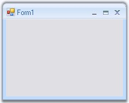

# Creating Office2007Form

The default forms can be changed into the Office2007 Form by following the below given steps.

1. Open a Visual Studio project.
2. Add the assembly Syncfusion.Shared.Base in the reference. (Right click the References in the Solution explorer and click Add Reference to add the assembly.
3. In the form's code Editor, add the namespace.
   
   ~~~ C#
   
		using Syncfusion.Windows.Forms;
		
   ~~~
   {:.prettyprint}
 
   ~~~ vbnet
   
		Imports Syncfusion.Windows.Forms
   ~~~
   {:.prettyprint}
   
4. Now change your class to inherit the Office2007Form instead of the default Form as follows.
 
   ~~~ C#
   
		public partial class Form1 : Office2007Form
 
   ~~~
   {:.prettyprint}
   
   ~~~ vbnet
 
		Partial Public Class Form1 Inherits Office2007Form

   ~~~
   {:.preetyprint}
   

_Figure 1142: Default Form Changed to OfficeForm_
 