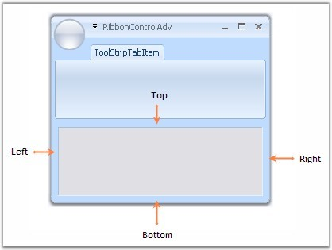

# Customization

The property which lets you set borders for the Office2007Style form is as follows.

<table>
<tr>
<th>
Property</th>
<th>
Description</th>
</tr>
<tr>
<td>
Borders</td>
<td>
Gets/sets the border values of an Office 2007 style form. Sets borders for Left, Top, Right and Bottom sides of the form.
</td>
</tr>
</table>


 
this.Borders = new System.Windows.Forms.Padding(10);


 

 
Me.Borders = New System.Windows.Forms.Padding(10)



_Figure 1160: Left, Top, Right and Bottom Sides set with Border = "10"_

## Customizing the Top Left Edge

This TopLeftRadius property gets/sets the curved radius of the top left edge of the form. Default is 8.



this.TopLeftRadius = 20;


 

 
Me.TopLeftRadius = 20



_Figure 1161: Top-Left Edge Curved to Radius "20"_