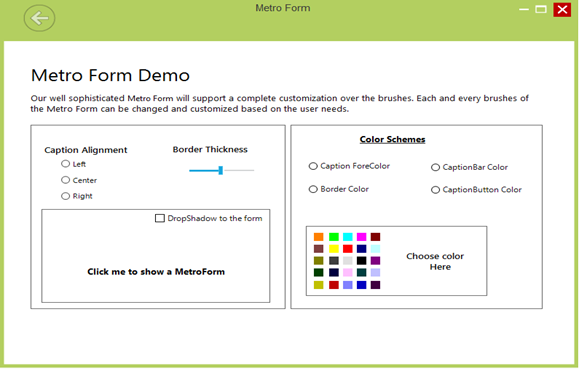

# Place an Image in the Caption Bar

The following code sample shows how to add an image to the caption bar of the Metro form.



Syncfusion.Windows.Forms.CaptionImage captionImage1 = new Syncfusion.Windows.Forms.CaptionImage();

captionImage1.BackColor = System.Drawing.Color.Transparent;

captionImage1.Image = global::MetroStyleControls_2008.Properties.Resources.RBNormal;

captionImage1.Location = new System.Drawing.Point(30, 5);

captionImage1.Name = "CaptionImage1";

captionImage1.Size = new System.Drawing.Size(50, 50);

this.CaptionImages.Add(captionImage1);





Dim captionImage1 As Syncfusion.Windows.Forms.CaptionImage = New Syncfusion.Windows.Forms.CaptionImage
captionImage1.BackColor = System.Drawing.Color.Transparent
captionImage1.Image = MetroStyleControls_2008.Properties.Resources.RBNormal
captionImage1.Location = New System.Drawing.Point(30, 5)
captionImage1.Name = "CaptionImage1"
captionImage1.Size = New System.Drawing.Size(50, 50)
Me.CaptionImages.Add(captionImage1)



_Figure 1152: Metro Form_

In order to change the position of the image, users should handle the image location property and change the position programmatically.